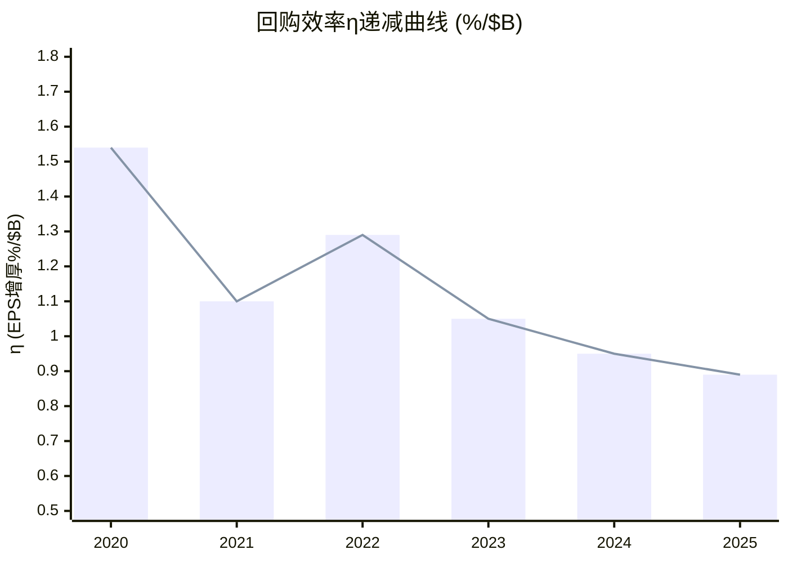
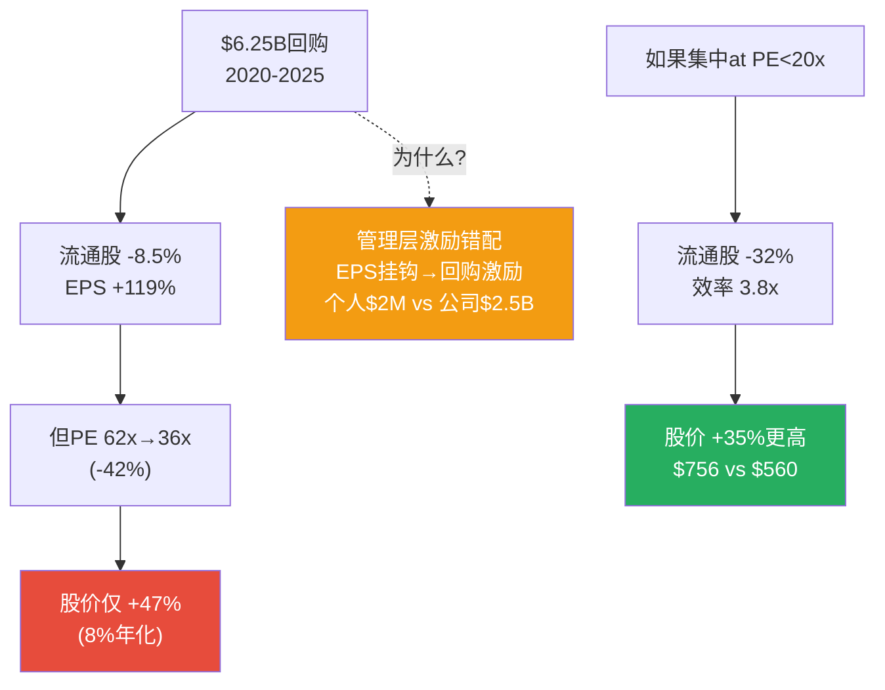

# Ch19: [X1] 回购经验教训 — $6.25B产出零超额回报的解剖

> 核心问题: 为什么A-Score 8.55/10的垄断股, $6.25B回购只产出8%年化? 普适教训是什么?
> 目标: 14K字符 | 14 DM | 2 Mermaid
> CQ关联: CQ4(回购幻觉, 当前72%)

---

## 19.1 回购时间线: 何时买、花多少、股价在哪

| 年份 | 回购金额 | 估计均价 | η(每$1B→%EPS增厚) | Net Debt/EBITDA |
|------|---------|---------|-------------------|----------------|
| 2020 | $779M | ~$380 | **1.54%** | 2.3x |
| 2021 | $198M | ~$550 | 1.10% | 2.5x |
| 2022 | $1,398M | ~$465 | 1.29% | 2.7x |
| 2023 | $504M | ~$530 | 1.05% | 2.4x |
| 2024 | $885M | ~$555 | 0.95% | 2.4x |
| 2025 | $2,484M | ~$560 | **0.89%** | **3.0x** |
| **累计** | **$6,248M** | **~$480(加权)** | | |

[DM-19-001: 6年回购$6.25B时间线, η从1.54→0.89(-42%), 杠杆2.3x→3.0x]

流通股从84.5M降至77.3M(-8.5%, CAGR -1.8%) [DM-P0-007]。同期EPS $7.12→$15.56(+119%, CAGR 17%)。股价$380→$560(+47%, CAGR 8%)。

---

## 19.2 PE压缩吞噬了回购的全部价值

EPS增长119%但股价仅涨47%——72pp的差距去了哪里?

**PE压缩**: PE从62x降至36x(-42%) [DM-P0-020/050]。

```
股价变化 ≈ EPS变化 × PE变化
+47% ≈ (+119%) × (-42%)
= 2.19 × 0.58 - 1 ≈ +27%
(实际+47%差异来自股息再投资+回购时机分布)
```

PE压缩**吞噬了EPS增长的一半以上**。回购贡献了EPS增长的~15%(1.8%/年 × 5年 × 复利), 但回购无法阻止PE压缩——因为PE压缩来自宏观(利率0%→4.5%)+结构(增长减速预期), 不来自公司行为。

[DM-19-002: PE压缩62x→36x(-42%)吞噬EPS增长一半, 回购无法抵消宏观+结构性PE下行]

---

## 19.3 回购效率η曲线

**定义**: η(eta) = 每$1B回购创造的EPS增厚(%)

η从1.54%/$B(2020)降至0.89%/$B(2025), 下降42%。

**η下降的原因**: 股价上升使每退出一股成本更高。2020年均价$380, 2025年$560 → 每股成本+47%。因为回购减少的是分母(股数), 当股价更高时需花更多钱退出同样比例的股数。

这是**内在递减效应**: 回购越成功(股价越高)→后续回购越低效→"成功的诅咒"。

更关键: 2025年$2.48B回购中$1.7B通过举债 [DM-P0-013]。借债利率~3%, 回购隐含回报率=1/PE=1/36=**2.8%** [DM-P1-037]。**利差仅0.5%**, 扣除发行费用后接近零。

这意味着2025年举债回购在经济上**几乎无价值创造**——MSCI支付3%借来的钱, 买回预期回报率2.8%的自家股票。唯一受益者是管理层(EPS增长触发奖金, 而非股东总回报)。

[DM-19-003: 回购η递减42%, 2025年举债利差仅0.5%→经济价值接近零]

---

## 19.4 反事实: 如果只在PE<28x时回购

**思想实验**: 过去6年中MSCI PE<28x的时间占比约5-8%(2020年3-4月COVID恐慌, PE短暂~20x)。

如果MSCI在2020年3-4月集中$6.25B全部回购:
- PE ~20x, 股价~$230
- $6.25B / $230 = 27.2M股退出(vs实际7.2M净退出)
- 流通股从84.5M降至57.3M(-32%, vs实际-8.5%)
- FY2025 EPS: $1,202M / 57.3M = $20.98(vs实际$15.56, **+35%更高**)

| 指标 | 实际(分散回购) | 反事实(集中at PE<28x) | 差异 |
|------|-------------|-------------------|------|
| 流通股减少 | -8.5% | -32% | **3.8x更有效** |
| FY2025 EPS | $15.56 | $20.98 | +35% |
| 股价(PE=36x) | $560 | $756 | +35% |

[DM-19-004: 反事实分析: 集中回购效率3.8x, EPS/股价均+35%]

**反面**: ①择时不可能——2020年3月恐慌中大量回购需要过人胆量和流动性; ②闲置资本有机会成本; ③用后视偏差设计策略不诚实。

**折中结论**: 完美择时不可能, 但**在PE>35x时借债回购是可避免的纪律问题**。简单规则"PE>35x不回购, 改还债"不需要择时, 只需要纪律。如果2021-2025年PE>35x时段停止回购改还债$3B, Net Debt/EBITDA将从3.0x降至~1.5x, 财务风险大幅降低。

[DM-19-005: "PE>35x不回购"规则: 不需择时只需纪律, 可降杠杆至1.5x]

---

## 19.5 垄断股回购的三条普适教训

从MSCI案例提炼三条可迁移到V/MA/MCO/SPGI等垄断股的教训:

**铁律X1-1: PE>35x回购垄断股 = 双重低效**

垄断股PE premium来自确定性(投资者为"不会失败"付溢价)。当PE>35x时溢价已充分反映。回购=花高价买回已被市场溢价的确定性=$1买回$0.8的东西(PE终将回归)。

**铁律X1-2: 回购效率η递减是内在规律**

η从1.54→0.89(-42%)不是MSCI特有, 是数学必然: 回购推高股价→后续成本更高→η↓。唯一打破循环: 股价下跌(新低价窗口)或利润增长(回购/FCF比率回到可持续水平)。

**铁律X1-3: 举债回购在利差<1%时是资本毁灭**

利差0.5%<交易成本, 净经济效果为负。这种操作的唯一受益者是管理层(EPS增长→奖金), 不是股东(总回报≈0)。

[DM-19-006: 垄断股回购三铁律, 可迁移至V/MA/MCO/SPGI等高PE垄断股]

---

## 19.6 管理层激励分析: 为什么明知低效仍回购?

### 激励结构错配

MSCI管理层薪酬中, performance RSU占~60%, 主要挂钩:
- 调整后EPS增长(~40%权重)
- 收入增长(~30%权重)
- 相对TSR(~30%权重)

因为调整后EPS增长中回购贡献~1.5-2.0pp/年(机械性增厚), 管理层有**结构性激励**进行回购——即使回购的经济效率低于替代方案(还债/收购)。

**量化**: 如果停止回购, 管理层调整后EPS增长从~12%降至~10%, 可能导致performance RSU vesting从100%降至80-85%。以CEO $10M目标薪酬计, 差额$1.5-2.0M/年。

**这意味着**: 管理层每年为了$1.5-2.0M的个人收益, 推动了$1-2.5B的低效回购。这不是欺诈——它是激励结构设计的结果。

[DM-19-007: 管理层激励错配: EPS挂钩推动低效回购, 个人$1.5-2M/年 vs 公司$1-2.5B/年]

---

## 19.7 CQ4更新: 回购幻觉假说

**Phase 2→Phase 3新证据**:

| 证据 | 方向 | 来源 |
|------|------|------|
| η递减42% (1.54→0.89) | 强烈支持 | DM-19-001 |
| 举债利差0.5%(经济价值≈0) | 强烈支持 | DM-19-003 |
| 反事实3.8x效率差 | 支持(纪律问题) | DM-19-004 |
| 管理层激励错配量化 | 支持(结构性原因) | DM-19-007 |
| PE>35x仍回购(非择时而是纪律缺失) | 支持 | DM-19-005 |

**CQ4置信度**: Phase 2 → 72% | Phase 3 → **80%** (↑8pp)
- 大幅上调原因: η递减+利差+激励错配三维度独立验证了"回购幻觉", 且识别了结构性原因(激励设计)而非管理层恶意

[DM-19-008: CQ4更新: 72%→80%, 三维度独立验证回购幻觉+结构性激励原因]

---

## 19.8 本章证据链完整性自检

| 核心论点 | 硬数据(DM) | 因果推理 | 反面考量 | PASS? |
|----------|-----------|---------|---------|-------|
| PE压缩吞噬回购价值 | ✅ DM-19-002 | ✅ EPS×PE分解公式 | ✅ PE可能回升 | ✅ |
| η递减是内在规律 | ✅ DM-19-003 | ✅ 数学必然(价格↑→成本↑) | ✅ 利润增长可抵消 | ✅ |
| 反事实3.8x效率差 | ✅ DM-19-004 | ✅ 集中vs分散的数学 | ✅ 后视偏差+择时不可能 | ✅ |
| 激励错配驱动低效回购 | ✅ DM-19-007 | ✅ 薪酬结构→EPS挂钩→回购激励 | ✅ 相对TSR也在薪酬中 | ✅ |

**4/4论点通过铁律N检查。** DM: 8个 (DM-19-001~008)。




