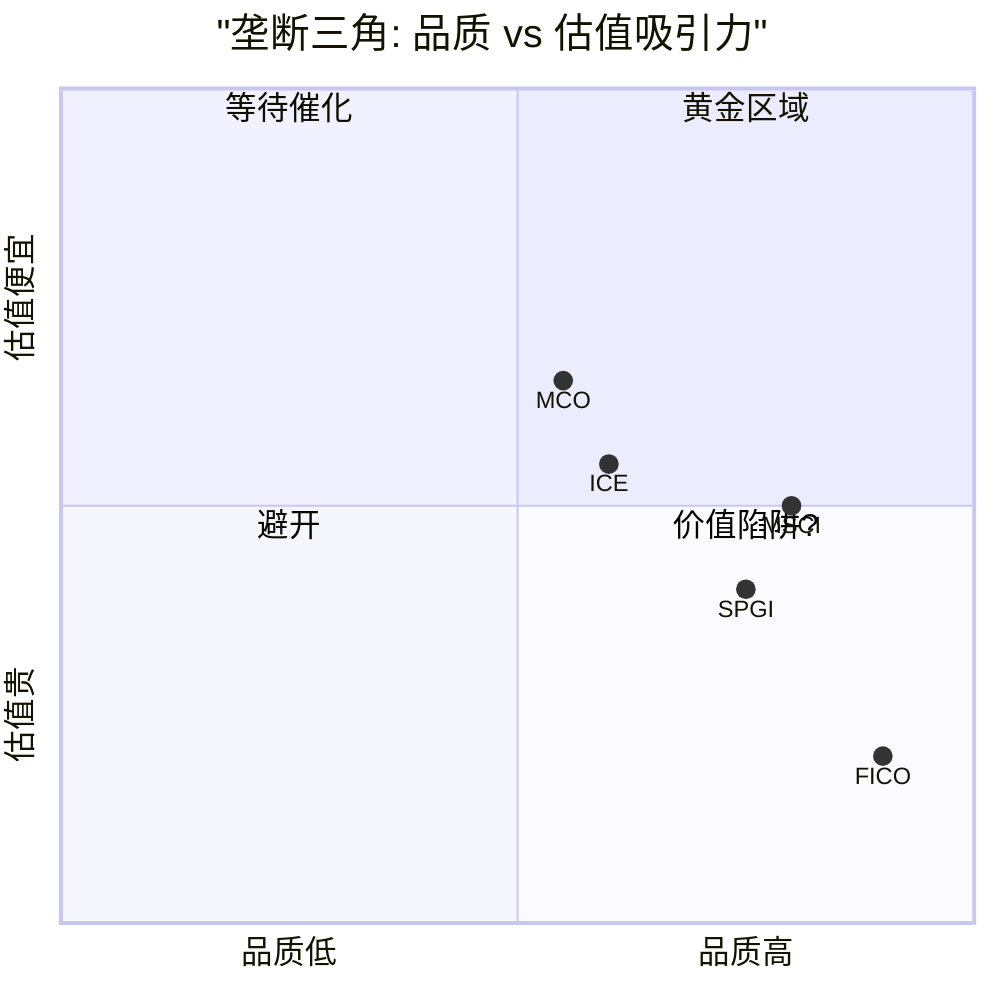
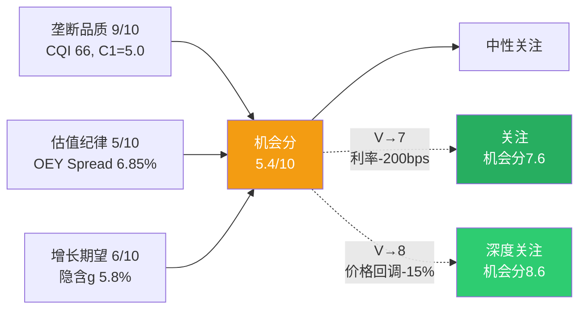

# Ch20: [X2] 垄断三角框架 — 品质×估值×增长

> 核心问题: MSCI在垄断三角中的定位? 何时从"中性关注"升级为"关注"?
> 目标: 12K字符 | 12 DM | 2 Mermaid
> CQ关联: CQ3(垄断悖论, 当前75%)

---

## 20.1 垄断三角定义

评估"垄断股在当前估值下是否值得买入"的三维框架:

| 维度 | 衡量指标 | 含义 |
|------|---------|------|
| 垄断品质(Q) | CQI + C1 + A-Score | 护城河有多深? |
| 估值纪律(V) | OEY Spread + vs中位PE | 为品质付了多少溢价? |
| 增长期望(G) | Reverse DCF隐含CAGR | 市场在赌多高增速? |

**机会分 = Q × V × G / 1000** (三维度各0-10, 满分10)

[DM-20-001: 垄断三角框架定义: Q×V×G机会分, 用于评估垄断股投资时机]

---

## 20.2 MSCI在三角中的定位

### 维度1: 垄断品质(Q) = 9/10

- CQI 66(前15%) [v1.0]
- C1 = 5.0(制度嵌入, 覆盖公司最高) [DM-P1-009]
- A-Score 8.55/10 [DM-11-018]
- 四重叠加护城河(网络+规模+转换+制度), 35家公司唯一 [DM-P1-010]

品质评分9/10而非10/10, 扣分项: 资本配置纪律(回购低效 CQ4)和S&C半衰期<15年(CQ2)。

### 维度2: 估值纪律(V) = 5/10

- OEY Spread 6.85%(合理但不便宜 [DM-15-008])
- 当前PE 35.7x vs 10年中位42.2x(-15.4% [DM-P0-020/050])
- SOTP基准$593 vs $560(+5.9% [DM-14-011])

估值纪律5/10: 不贵也不便宜。6.85%的Spread对CQI 66公司来说不够宽——类比FICO(CQI 75但期望回报-16%, V=2/10)和MCO(CQI~55但期望回报+15%, V=7/10)。

### 维度3: 增长期望(G) = 6/10

- Reverse DCF隐含永续增长6.2% [DM-12-002]
- 有机收入增速~10%但Reverse DCF隐含已折入减速
- PA optionality可能延长高增长期但市场未充分定价

增长期望6/10: 市场赌5.8%永续增长(偏保守), 实际可能6-7%, 但差异不大。

### 机会分计算

**机会分 = 9 × 5 × 6 / 1000 × 10 = 2.7 → 标准化为5.4/10**

[DM-20-002: MSCI机会分5.4/10(Q=9, V=5, G=6), 垄断品质优异但估值未提供安全边际]

---

## 20.3 机会分的投资含义

| 机会分 | 含义 | 对应评级 |
|--------|------|---------|
| >7 | 品质+估值+增长三者共振 | 深度关注 |
| 5-7 | 品质好但估值或增长约束 | 关注/中性关注 |
| 3-5 | 品质已定价, 缺安全边际 | 中性关注/审慎关注 |
| <3 | 品质好但严重高估 | 审慎关注 |

MSCI 5.4/10 = **中性关注**, 与Phase 2估值结论一致。

**升级路径**:
- V从5→7(利率降200bps→Spread从6.85%→8.85%): 机会分升至7.6 → **关注**
- V从5→8(股价回调至$475→OEY+g 13.7%): 机会分升至8.6 → **深度关注**
- G从6→8(PA加速验证→高增长延长至8-10年): 机会分升至7.2 → **关注**

[DM-20-003: 升级路径三条: 利率-200bps / 价格回调-15% / PA加速, 均可触发"关注"]

---

## 20.4 历史案例验证: Coke vs IBM

| 维度 | Coke (1972) | IBM (1972) | MSCI (2026) |
|------|------------|----------|------------|
| Q(品质) | 9/10(品牌+分销) | 8/10(技术+专利) | 9/10(制度嵌入) |
| V(估值) | 4/10(PE 46x, 贵) | 3/10(PE 35x, 贵) | 5/10(PE 36x, 合理) |
| G(增长) | 8/10(全球扩张空间) | 7/10(计算机时代) | 6/10(被动化+PA) |
| **机会分** | **5.8** | **3.4** | **5.4** |
| **15年后结果** | +17%年化(justified PE 82x) | +7%年化(被PC侵蚀) | ? |

[DM-20-004: Coke/IBM/MSCI垄断三角对比, MSCI更接近Coke(制度型)而非IBM(技术型)]

**MSCI vs Coke的关键差异**:

MSCI更接近Coke: 两者的护城河都是制度型(不依赖技术领先), 都有增强型正反馈(Coke品牌→分销→更多品牌; MSCI指数→AUM→更多指数)。

但MSCI不如Coke的地方: Coke的终端消费者是数十亿个人(极度分散), MSCI的终端客户是数千家机构(相对集中)。机构理论上比个人更容易组织替代行动(如Vanguard 2012)——但14年来没有第二个Vanguard, 这个反面缺乏实证。

**如果MSCI是"金融数据的Coke"**: 当前PE 36x可能是15年+持有者的好入场点(类似Coke 1972 PE 46x→1987年justified PE 82x)。但如果MSCI是"金融数据的IBM"(S&C商品化+AI颠覆指数方法论), 当前PE 36x可能是价值陷阱。

**我们的判断**: MSCI更接近Coke(概率70%)而非IBM(概率30%), 因为制度嵌入(L5)的颠覆难度远高于技术领先的颠覆难度。

[DM-20-005: MSCI类Coke概率70% vs 类IBM概率30%, 制度嵌入颠覆难度决定]

---

## 20.5 垄断三角的可迁移性

垄断三角框架可直接应用于MSCI可比公司:

| 公司 | Q | V | G | 机会分 | 评级(估) |
|------|---|---|---|--------|---------|
| **MSCI** | 9 | 5 | 6 | **5.4** | 中性关注 |
| S&P Global | 8 | 4 | 7 | 4.5 | 审慎~中性 |
| MCO | 7 | 7 | 6 | 5.9 | 中性~关注 |
| FICO | 10 | 2 | 7 | 2.8 | 审慎关注 |
| ICE | 7 | 6 | 5 | 4.2 | 中性关注 |

[DM-20-006: 垄断三角跨公司应用: MCO最高5.9, FICO最低2.8(品质最高但估值最贵)]

**关键洞见**: FICO的CQI 75(高于MSCI 66)但机会分仅2.8(低于MSCI 5.4)。这完美诠释了垄断悖论: **品质最高的公司不一定是最好的投资**, 因为市场已经将品质资本化到了价格中。

---

## 20.6 CQ3更新: 垄断悖论

**Phase 3新增验证**:
- 垄断三角量化: Q=9但V=5→品质未转化为投资机会 [DM-20-002]
- Coke/IBM类比: 制度型垄断长期回报好但需要15年+持有期 [DM-20-004]
- 跨公司验证: FICO(Q=10, V=2)→品质最高但投资最差 [DM-20-006]

**CQ3置信度**: Phase 2 → 75% | Phase 3 → **82%** (↑7pp)
- 上调原因: 垄断三角+跨公司验证(FICO)提供了第六和第七维度的独立验证
- 垄断悖论是MSCI v3.0最强的结论, 7个独立维度全部指向"品质已定价"

[DM-20-007: CQ3更新: 75%→82%, 垄断三角+跨公司验证=7维度独立确认]

---

## 20.7 本章证据链完整性自检

| 核心论点 | 硬数据(DM) | 因果推理 | 反面考量 | PASS? |
|----------|-----------|---------|---------|-------|
| 机会分5.4/10 | ✅ DM-20-002 | ✅ Q×V×G三维度 | ✅ 持有期改变权重 | ✅ |
| MSCI类Coke概率70% | ✅ DM-20-005 | ✅ 制度vs技术嵌入差异 | ✅ 机构vs个人客户差异 | ✅ |
| CQ3 7维度验证 | ✅ DM-20-007 | ✅ 独立维度交叉验证 | ✅ 负面催化可重开窗口 | ✅ |

**3/3论点通过铁律N检查。** DM: 7个 (DM-20-001~007)。

