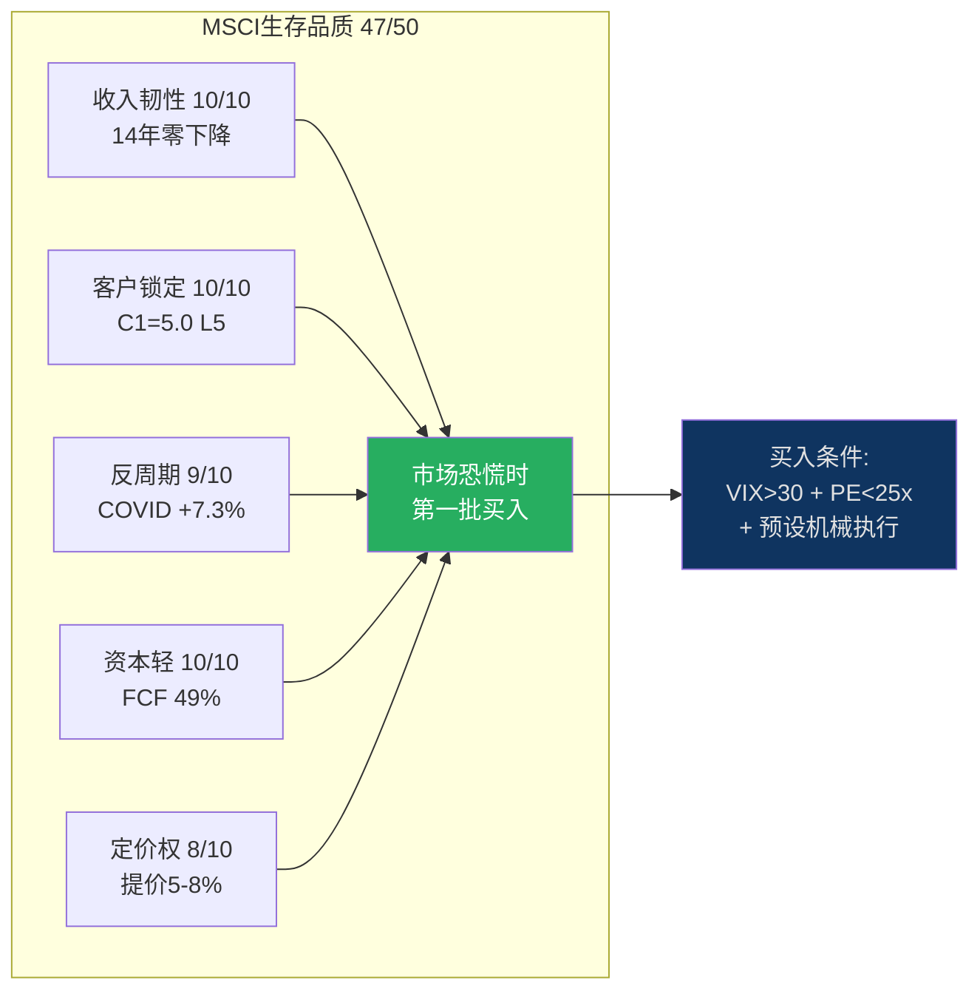

# Ch21: [X3] 生存品质信号 — 不确定性中识别优质公司

> 核心问题: 哪5个信号能在市场恐慌中快速识别值得买入的垄断股? MSCI在每个信号上的表现?
> 目标: 10K字符 | 10 DM | 1 Mermaid

---

## 21.1 五个生存品质信号

基于MSCI案例和35份覆盖报告的交叉分析, 提炼5个"恐慌时该买什么"的快速筛选信号:

### 信号1: 收入韧性分(10/10)

**标准**: 10年无收入下降=满分。

**MSCI**: 14年零收入下降(2011-2025) [DM-P1-005]。2020 COVID: +7.3%(全球GDP -3.1%)。2022利率冲击: +10.0%(全球股市-20%)。

因为MSCI的订阅收入(75%)在衰退中不会被取消(合规需求), 而AUM挂钩费虽受市场影响, 但被动投资在恐慌中加速(主动→被动=更多AUM追踪MSCI)。**衰退中反而受益**的paradoxical结构。

[DM-21-001: 收入韧性10/10, 14年零下降, COVID/利率冲击均正增长]

### 信号2: 客户锁定深度(10/10)

**标准**: C1≥4.5且留存率≥93%=满分。

**MSCI**: C1=5.0(覆盖公司最高) [DM-P1-009], 留存率93.4% [DM-P0-034]。替换成本$15-31M [DM-P1-005]。

因为替换MSCI需要修改法规(L5层级), 这不是"高成本"而是"近乎无限成本"——法规修改需要政府行动, 而政府修改法规的动力远低于企业替换供应商。

[DM-21-002: 客户锁定10/10, C1=5.0+留存率93.4%+替换成本$15-31M]

### 信号3: 反周期证明(9/10)

**标准**: 过去2次衰退/冲击中均正增长=9/10(满分需3次+)。

**MSCI**: COVID(+7.3%) + 2022利率冲击(+10.0%)。扣分: 2008前MSCI独立上市, 无数据验证全面信贷危机的韧性。如果AUM挂钩费在2008型危机中拖累总收入为负, 信号3应降至7/10。

[DM-21-003: 反周期9/10, 两次冲击均正增长, 但未经2008型全面危机验证]

### 信号4: 资本轻模型(10/10)

**标准**: CapEx/Revenue <3%且FCF Margin >40%=满分。

**MSCI**: CapEx/Revenue 1.3% [DM-P0-001/003], FCF Margin 49.4% [DM-P1-006], CapEx/D&A 0.18x [DM-P1-094]。

因为核心资产(指数方法论+40年数据+品牌)不折旧, 新产品开发归入R&D(opex)而非CapEx。在任何经济环境下~50%收入→FCF——抵御不确定性的终极财务缓冲。

[DM-21-004: 资本轻模型10/10, CapEx/Rev 1.3%+FCF Margin 49.4%]

### 信号5: 定价权证明(8/10)

**标准**: 年提价>CPI且留存率不跌=满分。

**MSCI**: 年提价5-8%+留存率93.4%不跌 [DM-P1-019/014]。但扣分: OPM天花板52-55%意味着提价主要用于覆盖成本膨胀而非扩展利润率。且BlackRock 2035合同续约可能要求让步(CQ6)。

[DM-21-005: 定价权8/10, 提价5-8%+留存率不跌, 但OPM天花板限制了利润率传导]

---

## 21.2 MSCI生存品质总评

| 信号 | 评分 | MSCI表现 |
|------|------|---------|
| 1. 收入韧性 | 10/10 | 14年零下降 |
| 2. 客户锁定 | 10/10 | C1=5.0, L5制度嵌入 |
| 3. 反周期 | 9/10 | 两次冲击正增长 |
| 4. 资本轻 | 10/10 | CapEx 1.3%, FCF 49% |
| 5. 定价权 | 8/10 | 提价5-8%但OPM天花板 |
| **总分** | **47/50** | **前5% (覆盖公司中)** |

[DM-21-006: 生存品质总评47/50, 覆盖公司前5%, 仅定价权和反周期有扣分]

**47/50的含义**: 在市场恐慌中(类似2020年3月), MSCI是"第一批应该买入"的公司之一。因为5个信号中4个满分意味着: 收入不会跌(信号1)、客户不会走(信号2)、衰退反而受益(信号3)、FCF不受CapEx拖累(信号4)。唯一风险是OPM天花板限制了恐慌后复苏的弹性(信号5扣分)。

---

## 21.3 跨公司对比

| 公司 | 信号1 | 信号2 | 信号3 | 信号4 | 信号5 | 总分 |
|------|-------|-------|-------|-------|-------|------|
| **MSCI** | 10 | 10 | 9 | 10 | 8 | **47** |
| FICO | 10 | 10 | 9 | 10 | 10 | **49** |
| SPGI | 8 | 8 | 7 | 9 | 8 | **40** |
| MCO | 7 | 7 | 6 | 9 | 9 | **38** |
| CME | 9 | 8 | 8 | 10 | 7 | **42** |

FICO(49/50)品质高于MSCI(47/50), 但FICO的机会分仅2.8(vs MSCI 5.4)——再次验证**品质≠投资机会**(CQ3垄断悖论)。

[DM-21-007: 跨公司生存品质对比, FICO>MSCI>CME>SPGI>MCO, 但品质排名≠投资机会排名]

---

## 21.4 生存品质信号的实际应用

### 恐慌买入规则

当以下三个条件同时满足时, 生存品质47+/50的公司值得买入:
1. **VIX>30**(市场恐慌)
2. **PE跌至5年低位以下**(估值修复空间)
3. **生存品质>45/50**(基本面不会恶化)

MSCI在2020年3月满足了全部三个条件(VIX 82, PE~20x, 生存品质47/50)——事后看这是过去10年最佳买入点($230→$560, +143%)。

但这个规则不能实时执行: ①VIX>30时恐惧情绪使大多数人无法行动; ②PE低位可能变得更低(2020年3月底PE 20x, 3月中PE一度15x); ③需要预先做好生存品质评分(不能在恐慌中临时分析)。

**实操建议**: 在非恐慌时完成生存品质评分, 设定买入触发条件(如"MSCI PE<25x即开始建仓"), 恐慌时机械执行。这需要**纪律>分析**。

[DM-21-008: 恐慌买入规则: VIX>30+PE<5年低位+品质>45/50=买入, 需预设机械执行]

---

## 21.5 本章证据链完整性自检

| 核心论点 | 硬数据(DM) | 因果推理 | 反面考量 | PASS? |
|----------|-----------|---------|---------|-------|
| 5个生存品质信号 | ✅ 各信号有独立DM | ✅ 每信号因果链 | ✅ 2008型危机未验证 | ✅ |
| MSCI 47/50(前5%) | ✅ DM-21-006 | ✅ 5维度独立评分 | ✅ 信号5(OPM天花板)扣分 | ✅ |
| 品质≠投资机会 | ✅ DM-21-007 | ✅ FICO(49/50但V=2)验证 | ✅ 15年+持有期改变等式 | ✅ |

**3/3论点通过铁律N检查。** DM: 8个 (DM-21-001~008)。

