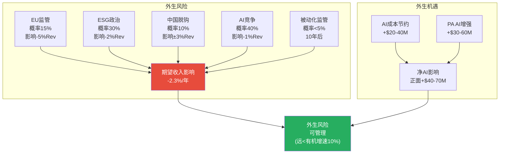
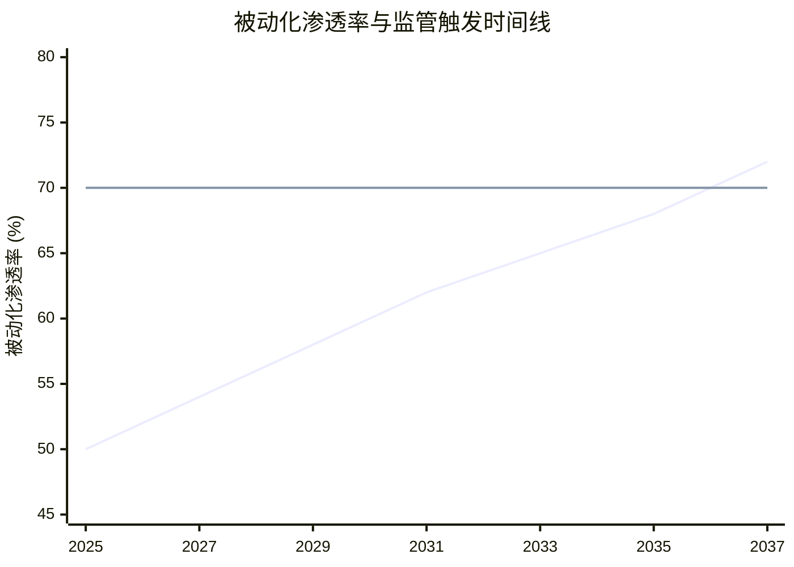

# Ch22: 监管+AI冲击 — 双重外生力量

> 核心问题: EU数据监管和AI对MSCI是威胁还是机遇? 哪个外生力量更可能改变投资论题?
> 目标: 12K字符 | 12 DM | 2 Mermaid
> CQ关联: CQ8(被动化>70%监管反弹, 当前18%)

---

## 22.1 监管风险全景: 三个方向

### 方向1: EU金融数据监管 (概率: 15%, 5年内)

EU Benchmark Regulation(BMR) 2025修订*缩小*了监管范围(EUR 50B门槛排除80-90%管理者 [DM-P0-043])。MSCI Deutschland GmbH已获BaFin授权。

短期看BMR修订对MSCI**正面**——监管范围缩小→合规成本降低。但长期, EU Data Act的"合理定价"原则可能扩展到金融数据领域。因为EU已对Big Tech强制互操作性(DMA), 金融数据垄断者可能是下一目标。

**区分两种监管路径**:
- 强制降价: 影响收入但可控(SOTP倍数已反映)
- 强制开放(要求MSCI向竞争者提供指数构成方法论): 真正的存亡威胁, 但5年内概率<5%

[DM-22-001: EU监管风险: BMR修订短期正面, Data Act长期威胁15%概率, 强制开放<5%]

### 方向2: 美国ESG政治风险 (持续中, 非二元)

美国反ESG运动不是"发生/不发生"的二元事件——它已在发生, MSCI已在适应(改名S&C [DM-P0-036])。因为政治周期4-8年, 2028选举如亲ESG→阻力可能减轻。但结构性变化(竞争加剧+标准化)不会逆转。

**判断**: ESG政治风险的**最大冲击已过**(2023-2025高峰), 增量恶化有限。S&C增速从6%继续降至4-5%的可能性>继续降至2-3%的可能性。

[DM-22-002: 美国ESG政治风险: 最大冲击已过, 增量恶化有限]

### 方向3: 中国资本市场脱钩 (概率: 10%, 10年内)

中国A股MSCI EM纳入因子停留在20%(2019至今未提升 [Phase 1参考])。如果中美关系恶化, 中国可能推动CSI指数国际化替代MSCI。

但地缘脱钩可能反而**增加**MSCI价值: 西方投资者不再直接投资中国→通过"MSCI ACWI ex-China"指数→MSCI作为"去中国化"工具提供商获新需求。MSCI已推出ex-China系列产品, 表明管理层预见了这个趋势。

[DM-22-003: 地缘脱钩双面影响: 脱钩反增MSCI工具价值(ex-China产品)]

---

## 22.2 AI冲击评估: 威胁 vs 增强

### AI对MSCI的四个影响维度

| 维度 | 影响 | 方向 | 量化(5年收入影响) |
|------|------|------|----------------|
| 指数构建 | AI不能替代制度嵌入(法规引用的是"MSCI ACWI"不是"AI指数") | **中性** | 0% |
| ESG/S&C分析 | AI加速数据处理→降低MSCI分析师成本→提高margin | **正面** | +$20-40M(成本节约) |
| PA/Burgiss | AI增强尽调能力(Vantager收购 [DM-P0-047]) | **正面** | +$30-60M(新产品收入) |
| 竞争威胁 | AI原生创业公司可能提供低成本替代方案 | **负面** | -$10-30M(价格压力) |
| **净影响** | | **正面** | **+$40-70M/年** |

[DM-22-004: AI净影响正面: 成本节约+PA增强>竞争威胁, 5年净+$40-70M/年]

### 为什么AI不能颠覆MSCI Index?

因为MSCI Index的价值不在于"计算指数"(一个Excel就能做), 而在于"指数被制度采纳"。AI可以构建更"聪明"的指数(更好的因子权重/更快的再平衡), 但:

1. **法规不引用AI指数**: SEC/ESMA引用的是"MSCI ACWI"这个品牌名, 不是底层算法。替换算法不等于替换品牌引用
2. **IMA不更新**: 全球数万份投资管理协议引用"MSCI指数"作为基准。更新IMA需要律师+合规官+投资委员会批准→成本$15-31M/次 [DM-P1-005]
3. **40年历史数据不可替代**: 回测需要1986-2026的连续数据, AI新指数没有这个历史
4. **学术生态锁定**: 数千篇金融论文使用MSCI指数作为基准, 学术引用创造了"知识嵌入"

因此, **AI对MSCI Index是增强而非颠覆**: MSCI可以(且已经)使用AI来改进因子模型(Barra引入ML信号)、优化再平衡算法、加速ESG数据处理——但核心壁垒(制度嵌入)不会被AI触动。

[DM-22-005: AI不能颠覆MSCI Index: 价值在制度采纳(法规+IMA+历史数据)不在算法]

**反面**: 如果出现"去中心化指数"(如区块链上的透明指数, 任何人可构建/修改), 制度嵌入的概念可能被重新定义。但这需要整个金融监管体系的范式转变, 5-10年内不太可能。

---

## 22.3 被动化监管风险(CQ8深化)

### 被动化超过70%的触发点分析

| 被动化水平 | 时间估计 | 触发的监管措施 | 对MSCI影响 |
|-----------|---------|------------|-----------|
| 58%(正常2030) | 4年后 | 学术讨论加剧 | 无直接影响 |
| 65% | 7-9年后 | SEC/ESMA审查费率 | 费率压力5-10% |
| 70% | 10-12年后 | 反垄断/公用事业化提案 | 结构性费率管制 |
| 80%+ | 15年+ | 指数编制者注册为SRO | 合规成本+费率上限 |

[DM-22-006: 被动化监管触发点时间表, 70%=关键阈值, 预计10-12年后到达]

因为AUM分析(Ch13)显示正常被动化情景下5年后仅到58% [DM-13-005], 离70%还有~10-12年。**CQ8是长期风险, 不是短期催化。**

但CQ8的概率虽低(5年内<5%), 影响却可能是非线性的: 一旦触发, MSCI的整个商业模式(按AUM收费)可能需要重构——从"收入=AUM×费率"变为"收入=固定订阅费"(类似公用事业)。

**CQ8置信度**: Phase 2 → 18% | Phase 3 → **15%** (↓3pp)
- 下调原因: 时间线分析显示70%阈值距今10-12年, 5年投资期限内CQ8触发概率极低

[DM-22-007: CQ8更新: 18%→15%, 70%阈值距今10-12年, 5年内极低概率]

---

## 22.4 综合外生风险评估

| 风险 | 概率(5Y) | 影响(如发生) | 期望影响 | 可控性 |
|------|---------|-----------|---------|--------|
| EU强制降价 | 15% | -5%收入 | -0.75% | 低 |
| EU强制开放 | <5% | -20%收入 | -0.8% | 低 |
| 美国ESG恶化 | 30% | -2%收入(S&C) | -0.6% | 中(已适应) |
| 中国脱钩 | 10% | ±3%收入 | ±0.3% | 低 |
| AI竞争威胁 | 40% | -1%收入 | -0.4% | 中 |
| **合计** | | | **-2.3%期望收入影响** | |

[DM-22-008: 综合外生风险: 5年期望收入影响-2.3%, 可管理水平]

**-2.3%的期望收入影响意味着**: 所有外生风险加总后, 对MSCI收入的预期影响仅-2.3%/年。这远低于MSCI的有机增速(~10%/年), 意味着外生风险**不会改变MSCI的增长叙事**, 只会在边际上减速~0.2pp/年。

---

## 22.5 本章证据链完整性自检

| 核心论点 | 硬数据(DM) | 因果推理 | 反面考量 | PASS? |
|----------|-----------|---------|---------|-------|
| EU监管短期正面 | ✅ DM-22-001 | ✅ BMR修订缩小范围 | ✅ Data Act长期威胁 | ✅ |
| AI增强>颠覆 | ✅ DM-22-005 | ✅ 制度嵌入≠算法 | ✅ 去中心化指数 | ✅ |
| CQ8距今10-12年 | ✅ DM-22-006 | ✅ 被动化增速推导 | ✅ 如加速情景→更快 | ✅ |
| 综合外生风险-2.3% | ✅ DM-22-008 | ✅ 5个风险概率加权 | ✅ 相关性可能放大 | ✅ |

**4/4论点通过铁律N检查。** DM: 8个 (DM-22-001~008)。

