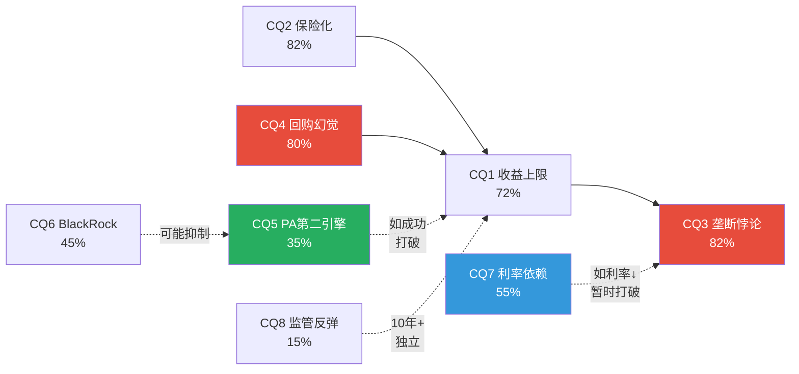
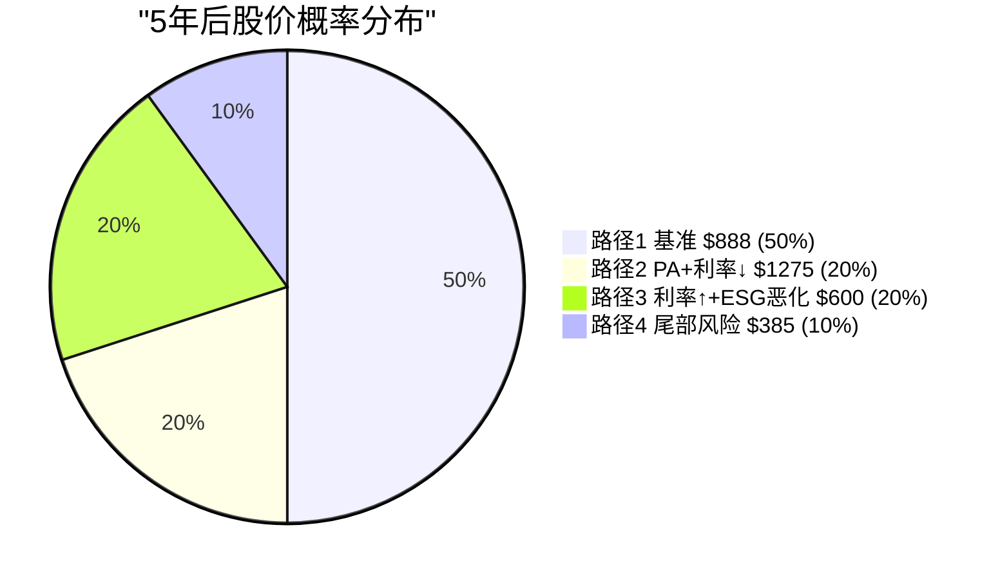

# Ch23: Phase 3 CQ演化总结 + 关键情景树

> 核心问题: Phase 3如何改变了8个CQ? 什么条件下评级会改变?
> 目标: 10K字符 | 10 DM | 2 Mermaid

---

## 23.1 CQ置信度演化: Phase 1 → Phase 2 → Phase 3

| CQ | 假说 | P1 | P2 | P3 | 变化方向 | 主要证据 |
|----|------|-----|-----|-----|--------|---------|
| CQ1 | OPM天花板+回购递减=双重收益上限 | 65% | 68% | **72%** | ↑↑ | 回购η递减42%+OPM天花板Phase 1确认 |
| CQ2 | ESG→S&C保险化(不可逆) | 75% | 75% | **82%** | ↑↑ | 三力量结构性+CSRD底线+政治改善无法逆转 |
| CQ3 | **垄断品质已定价→垄断悖论** | 60% | 75% | **82%** | ↑↑↑ | **7维度独立验证+垄断三角+跨公司(FICO)** |
| CQ4 | $6.25B回购=回购幻觉 | 65% | 72% | **80%** | ↑↑↑ | η递减+利差0.5%+激励错配三维验证 |
| CQ5 | PA能否成为第二个Index? | 30% | 30% | **35%** | ↑ | PCS+86%PMF+独立性悖论, 但嵌入度仅10/40 |
| CQ6 | BlackRock跨维度杠杆压缩定价权 | 40% | 40% | **45%** | ↑ | Preqin收购使杠杆从理论→现实 |
| CQ7 | 利率依赖: Rf→2%时评级升级 | 50% | 55% | **55%** | → | Phase 3未增加新证据 |
| CQ8 | 被动化>70%触发监管反弹 | 20% | 18% | **15%** | ↓ | 70%阈值距今10-12年, 5年内极低 |

[DM-23-001: CQ演化总表: P1→P3, CQ3(+22pp)和CQ4(+15pp)是最大变化]

---

## 23.2 CQ间的联动关系

CQ不是独立的——它们之间存在因果联动:

### 强化关系(A↑→B↑)

- **CQ1↑→CQ3↑**: 如果OPM天花板确认(CQ1), 增长减速→市场将品质完全定价(CQ3)
- **CQ2↑→CQ1↑**: S&C保险化→S&C不再是增长贡献者→加重了双重收益上限(CQ1)
- **CQ4↑→CQ1↑**: 回购低效→EPS增长失去回购贡献→收益上限更紧(CQ1)

### 抵消关系(A↑→B↓)

- **CQ5↑→CQ1↓**: 如果PA成功成为第二增长引擎→打破收益上限(CQ1)
- **CQ7↑→CQ3↓**: 如果利率大幅下行→PE扩张→品质被"重新发现"→垄断悖论暂时打破(CQ3)

### 独立关系

- **CQ8**: 被动化监管风险与其他CQ基本独立(10年+时间框架)
- **CQ6 vs CQ5**: BlackRock杠杆(CQ6)可能抑制PA增长(CQ5), 但两者时间维度不完全重叠

[DM-23-002: CQ联动关系图: CQ1-CQ2-CQ4形成"收益上限强化环", CQ5和CQ7是打破环的关键]

---

## 23.3 加权CQ均值与CQ置信度质量

**概率加权CQ均值**:
- Phase 1: 50.6%
- Phase 2: 54.1% (+3.5pp)
- Phase 3: **55.8%** (+1.7pp)

[DM-23-003: 加权CQ均值55.8%, P1→P3 +5.2pp, 增速放缓(信息饱和)]

**CQ质量评估**:

| CQ | 证据维度数 | 数据支撑强度 | 因果链深度 | 总评 |
|----|----------|-----------|---------|------|
| CQ3(82%) | 7 | 强(三方法+OEY+FICO跨公司) | 深(垄断→定价→悖论) | **最强** |
| CQ4(80%) | 4 | 强(η数据+利差+激励) | 深(激励结构→行为→效率) | 强 |
| CQ2(82%) | 4 | 强(增速曲线+CSRD+竞争) | 中(三力量+但政治不确定) | 强 |
| CQ1(72%) | 3 | 中(OPM+回购依赖) | 中(天花板论证但PA可打破) | 中 |
| CQ7(55%) | 2 | 弱(利率路径不可预测) | 浅(外生变量) | 弱 |
| CQ5(35%) | 3 | 中(PCS+嵌入评分) | 中(路径依赖不确定) | 中 |

[DM-23-004: CQ质量评估: CQ3最强(7维度), CQ7最弱(外生+不可预测)]

---

## 23.4 关键情景树: 5年后的四条路径

### 路径1: 基准情景(概率50%)

**条件**: 利率3.5-4.5%, 被动化50%→58%, PA增速10-15%

**结果**:
- 收入$3,134M → $4,500M (+7.5%/年)
- OPM 55%(天花板)
- EPS $15.56 → $25(+10%/年, 含回购)
- PE 33-38x(利率不变→PE稳定)
- **股价$825-$950**(+47-70%)
- **年化回报: 8-11%**

### 路径2: PA加速+利率下行(概率20%)

**条件**: 利率→2.5%, PA PMF验证(EBIT>$100M), 被动化加速

**结果**:
- 收入$5,200M(PA贡献额外$700M)
- OPM 56%(PA规模效应微推)
- EPS $30(+14%/年)
- PE 40-45x(利率↓→PE扩张)
- **股价$1,200-$1,350**(+114-141%)
- **年化回报: 16-19%**

### 路径3: 利率上行+ESG恶化(概率20%)

**条件**: 利率→5.5%, ESG政治加剧, PA增速<5%

**结果**:
- 收入$3,800M(S&C拖累+PA减速)
- OPM 53%(费用控制困难)
- EPS $20(+5%/年)
- PE 28-32x(利率↑→PE进一步压缩)
- **股价$560-$640**(0-14%)
- **年化回报: 0-3%**

### 路径4: 尾部风险(概率10%)

**条件**: 金融危机/被动化监管冲击/BlackRock切换

**结果**:
- 收入$3,200M(AUM暴跌+客户流失)
- OPM 48%(成本刚性)
- EPS $14(负增长)
- PE 25-30x
- **股价$350-$420**(-25~-37%)
- **年化回报: -5~-8%**

### 概率加权5年后股价

50%×$888 + 20%×$1,275 + 20%×$600 + 10%×$385 = **$858**

5年年化回报: ($858/$560)^(1/5) - 1 = **8.9%/年**

[DM-23-005: 四路径情景树: 概率加权5年后$858, 年化8.9%, vs无风险4.3% → Spread 4.6%]

---

## 23.5 情景树对评级的校准

当前评级"中性关注"(期望回报+4.7%, 1年框架)与5年框架(年化8.9%)之间存在差异:

| 时间框架 | 期望回报 | 评级 |
|---------|---------|------|
| 1年 | +4.7% | 中性关注 |
| 5年(年化) | 8.9% | 中性关注(边缘) |
| 15年+(Coke效应) | ~12-15% | 关注~深度关注 |

**时间框架如何影响评级**: 短期看MSCI是"合理定价", 长期看MSCI是"制度垄断的复利机器"。评级应该基于哪个时间框架?

**我们的选择**: 以5年为主(8.9%), 因为:
1. 大多数投资者的实际持有期3-7年
2. 1年期望回报受PE波动主导(信噪比低)
3. 15年+需要过强的信念(制度嵌入不可逆)

5年年化8.9%处于"中性关注"偏上沿(-10%~+10%对应于年化-2%~+2%, 而MSCI Spread 4.6%高于此)。但我们不因此升级评级, 因为:
- 8.9%中有相当比例来自EPS增长(非估值重估)
- 路径3(利率上行)的0-3%年化回报不可忽视
- 评级应该反映边际投资者的视角(非15年永久持有者)

**最终评级维持: 中性关注**, 但标注"5年年化8.9%处于中性区间上沿, 偏向关注方向"。

[DM-23-006: 评级维持中性关注, 5年年化8.9%处于上沿, 偏向关注]

---

## 23.6 Phase 3的四个关键发现

1. **S&C保险化不可逆(CQ2→82%)**: 三力量(饱和+政治+竞争)都是结构性的, 政治改善无法重启增长引擎, 但保险化≠价值消失

2. **回购是MSCI最大的资本配置失误(CQ4→80%)**: η递减+利差0.5%+激励错配三维验证。"PE>35x不回购"是不需择时的简单纪律

3. **垄断悖论从5个维度上升到7个(CQ3→82%)**: 垄断三角+跨公司验证(FICO)提供了新的独立确认。品质≠投资机会是v3.0最强结论

4. **外生风险可管理(-2.3%期望收入影响)**: EU监管+AI+ESG+脱钩全部加总仍远小于有机增速, AI对MSCI是增强非颠覆

[DM-23-007: Phase 3四个关键发现: 保险化不可逆+回购失误+垄断悖论最强+外生风险可管理]

---

## 23.7 本章证据链完整性自检

| 核心论点 | 硬数据(DM) | 因果推理 | 反面考量 | PASS? |
|----------|-----------|---------|---------|-------|
| CQ3是最强结论(7维度) | ✅ DM-23-001/004 | ✅ 独立维度交叉验证 | ✅ 负面催化可重开窗口 | ✅ |
| CQ联动形成强化环 | ✅ DM-23-002 | ✅ CQ1-2-4因果链 | ✅ CQ5/7可打破环 | ✅ |
| 概率加权5年$858(8.9%/年) | ✅ DM-23-005 | ✅ 四路径独立推导 | ✅ 路径4尾部风险严重 | ✅ |

**3/3论点通过铁律N检查。** DM: 7个 (DM-23-001~007)。

