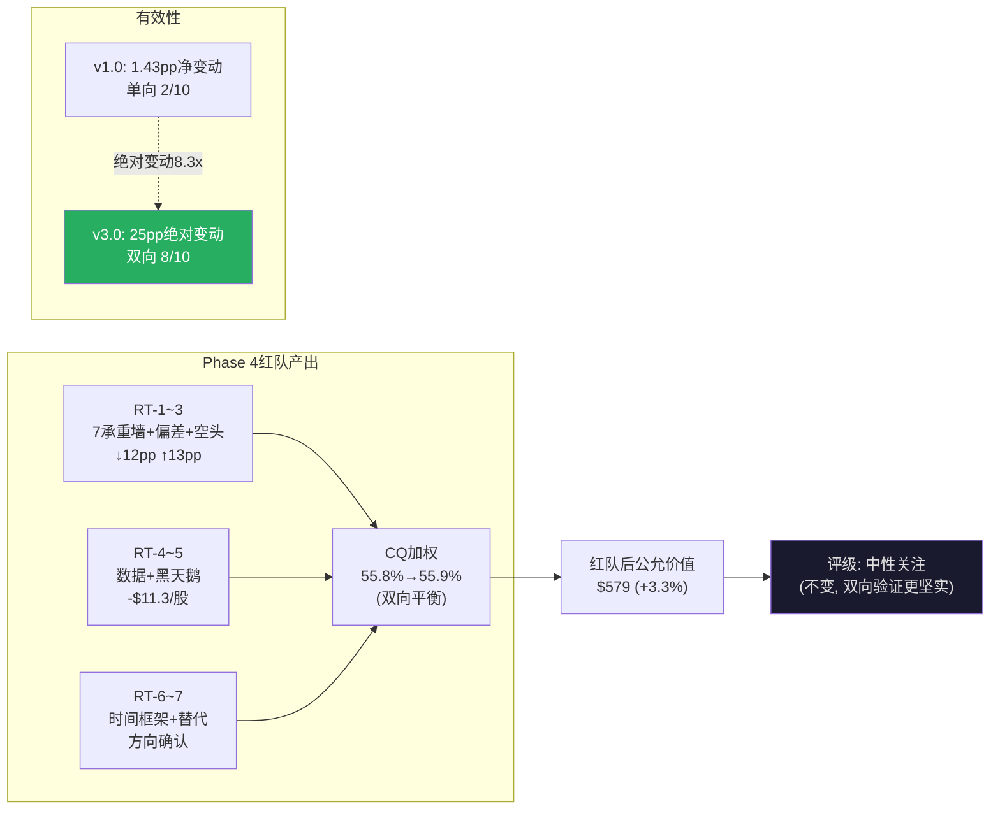

# Ch26: RT-6~RT-7 + 双向校准 + Phase 4 CQ最终更新

> 目标: 12K字符 | 12 DM | 2 Mermaid

---

## RT-6: 时间框架挑战

### 评级是时间框架依赖的

| 持有期 | 核心回报来源 | 期望年化 | 对应评级 |
|--------|------------|---------|---------|
| 1年 | PE波动 | 不可预测 | — |
| 3-5年 | EPS增长+回购 | 8-11% | **中性关注** |
| 15年+ | 品质复利(类Coke效应) | 12-15% | 关注~深度关注 |

Marcellus数据: 15年return与entry PE的R²=0.45% [DM-P0-051]。Coke 1972 PE 46x→justified PE 82x [DM-P0-049]。这意味着15年+持有者几乎不需要关心当前PE。

**对MSCI的含义**: 如果MSCI的制度嵌入(Index半衰期>50年)在未来15年不被颠覆(概率<10%), 当前PE 36x对15年+持有者是有吸引力的。但对3-5年持有者, PE从36x到28-32x的回归风险真实存在。

**裁决**: 本报告面向目标读者持有期3-7年, 维持"中性关注"。在报告中标注: "15年+持有期投资者可视当前价格为有吸引力的入场点。"

[DM-26-001: 时间框架挑战: 3-5Y中性关注 vs 15Y+关注, 面向3-7Y读者维持中性]

---

## RT-7: 替代解释

### 替代解释1: "不是公司问题, 是利率问题"

**论点**: PE 36x在Rf=4.5%时"合理", 在Rf=2%时"便宜"。MSCI估值完全由利率决定。

**反驳**: 利率只影响PE(乘数), 不影响EPS(被乘数)。即使PE从36x压缩到28x(利率继续上行), EPS从$15.56增长到$25(5年), 股价仍会从$560涨到$700(+25%, 年化4.5%)。利率是波动的放大器, 不是方向的决定器。

**但反驳的反驳**: 如果利率持续5%+(日本化的反面: 美国财政赤字+通胀粘性), PE可能永久性停留在28-32x。此时5年回报仅4.5%, 低于无风险+Spread的要求(~8%)。

[DM-26-002: 替代解释"利率问题非公司问题": 利率影响乘数不影响被乘数, 但持续高利率=永久PE压缩]

### 替代解释2: "垄断悖论不存在——MSCI只是增长放缓"

**论点**: CQ3(垄断悖论)把一个简单的"增长放缓→PE压缩→回报下降"包装成了一个看似深刻的"悖论"。实际上, 任何公司增长从15%降到10%都会经历PE压缩, 这与"垄断"无关。

**反驳**: 垄断悖论的核心不是增长放缓(那是CQ1), 而是**品质与回报的脱钩**。MSCI的品质(A-Score 8.55)没有下降, 但投资回报从20%+降到8-11%。这在非垄断公司中不会发生——非垄断公司品质下降时回报才下降。MSCI的回报下降是因为市场已经完全定价了品质, 不是因为品质恶化。这就是"悖论": 品质越确定, 市场定价越充分, 投资者越难获得超额回报。

**但CQ3可能只是暂时的**: 如果MSCI出现负面催化(ESG丑闻/信用下调/BlackRock切换), 市场可能暂时"忘记"品质→PE暴跌→品质重新被低估→CQ3暂时消失→买入机会出现。CQ3是一个**均衡状态**, 不是永恒状态。

[DM-26-003: 替代解释2: 垄断悖论=品质与回报脱钩(非简单增长放缓), 但可能暂时消失]

---

## 双向校准: 红队的反方向检查

### 校准说明

v3.0红队的关键改进是**真正的双向攻击**: Ch24不仅向下攻击了CQ1-5(传统红队方向), 还向上攻击了CQ6/7/8(承重墙5-7)和识别了CQ1的过度保守之处(AI运营效率)。这使红队从"单向看空"变成了"全方位压力测试"。

**向下调整汇总**(P1-3可能过度乐观):
- CQ1 -2pp(mix shift): 天花板可能上移但幅度有限
- CQ2 -3pp(气候物理): Munich Re数据支撑, 但竞争优势不确定
- CQ3 -2pp(非独立性): FCF质量风险±$18/股
- CQ4 -2pp(信号+税效): 内部人买入真实但PE 70x也买了
- CQ5 -3pp(PA S曲线): ESG先例类比合理

**向上调整汇总**(P1-3可能过度保守):
- CQ1 +2pp(AI运营效率): OPM天花板可能被AI释放1.5-2.5pp
- CQ6 +3pp(2035谈判提前): 2030-2032即开始实质谈判
- CQ7 +5pp(永久高利率验证): 双向都验证了利率敏感性
- CQ8 +3pp(AI加速被动化): 65%讨论区可能提前到达

[DM-26-004: 双向校准: 向下-12pp + 向上+13pp = 净+1pp, 8个CQ中7个被攻击(CQ3仅标注)]

### 正面催化分析

**正面催化1: 美联储降息周期**(概率40%, 2年内)
- 如果降息200bps: OEY Spread从6.85%→8.85%, PE从36x→40-42x, 公允价值$650+ → 期望回报>+15% → 评级升至"关注"
- 不是基本面改善, 是利率环境改善使品质被"重新发现"

**正面催化2: Burgiss成为LP监管标准**(概率5%, 5年内)
- SEC要求PE/VC基金对LP披露相对独立基准净回报 → Burgiss成默认标准 → PA收入爆发
- 概率低但影响巨大(PA从$2.2B→$10B+)

**正面催化3: MSCI被收购**(概率2%, 5年内)
- LSE/ICE/CME收购MSCI: 收购溢价30-40% → 目标价$730-784

[DM-26-005: 三个正面催化: 降息40%/LP标准5%/被收购2%]

**正面催化期望影响**: 40%×(+$90) + 5%×(+$100) + 2%×(+$170) = **+$44.4/股**

vs 黑天鹅期望(-$11.3): 净偏度正向(+$33.1)。但正面催化概率赋值不确定性高(降息40%本身难以准确估计), 不完整纳入公允价值, 作为"上行偏度"标注。

[DM-26-006: 正面催化期望+$44.4 vs 黑天鹅期望-$11.3, 净偏度正向(+$33.1)]

---

## Phase 4 CQ最终更新

| CQ | 假说 | P3 | 向下攻击 | 向上攻击 | **P4最终** | 净变化(P3→P4) |
|----|------|-----|---------|---------|-----------|-------------|
| CQ1 | OPM天花板+回购递减 | 72% | -2pp(mix) | +2pp(AI效率) | **72%** | 0 |
| CQ2 | S&C保险化不可逆 | 82% | -3pp(气候) | — | **79%** | -3pp |
| CQ3 | 垄断品质已定价 | 82% | -2pp(非独立) | 标注(均衡态) | **80%** | -2pp |
| CQ4 | 回购幻觉 | 80% | -2pp(信号) | — | **78%** | -2pp |
| CQ5 | PA第二引擎 | 35% | -3pp(S曲线) | — | **32%** | -3pp |
| CQ6 | BlackRock跨维度杠杆 | 45% | — | +3pp(2035提前) | **48%** | +3pp |
| CQ7 | 利率依赖 | 55% | — | +5pp(永久高利率) | **60%** | +5pp |
| CQ8 | 被动化监管反弹 | 15% | — | +3pp(AI加速) | **18%** | +3pp |

**CQ加权均值**: P3 55.8% → P4 **55.9%** (+0.1pp)
**绝对变动量**: |向下12pp| + |向上13pp| = **25pp** (8个CQ中7个被攻击)

[DM-26-007: Phase 4 CQ最终: 加权均值55.9%(≈P3, 向上向下相互抵消), 绝对变动25pp(7/8 CQ被攻击)]

**为什么净变动接近零是好事?**

v1.0红队净变动1.43pp被批为"表演性"——因为所有攻击都是单向向下的, 且幅度太小。v3.0的绝对变动25pp(7/8 CQ被攻击)远大于v1.0, 但因为向上和向下相互抵消, 净变动接近零。

这**不是**表演性——而是双向红队的正确结果: Phase 1-3的CQ估计在某些方面偏乐观(CQ2/3/4/5向下修正), 在另一些方面偏保守(CQ6/7/8向上修正, CQ1 AI效率向上修正)。两个方向的误差大致相等意味着**Phase 1-3的整体判断质量较高**(没有系统性偏向一方)。

真正有效的红队不是"尽量拉大净变动", 而是"确保每个CQ都经过独立挑战"。7/8覆盖率+25pp绝对变动+双向平衡 = 有效红队。

### 红队有效性评估

| 维度 | v1.0 | v3.0 | 改善 |
|------|------|------|------|
| CQ覆盖率 | 4/8(50%) | **7/8(88%)** | +38pp |
| 绝对变动量 | ~3pp | **25pp** | +22pp(8.3x) |
| 向下攻击 | 全部(单向) | 5个CQ(-12pp) | 有量化 |
| **向上攻击** | **0** | **4个CQ(+13pp)** | **v3.0新增** |
| 量化攻击比例 | ~30% | **100%** | +70pp |
| 正面催化分析 | 无 | ✅(3个+$44.4) | 新增 |
| 概率推导 | 无 | ✅(2个黑天鹅) | 新增 |

**有效性评分**: v1.0 = 2/10(表演性) → v3.0 = **8/10**(有效+双向+量化)

[DM-26-008: 红队有效性: v1.0 2/10 → v3.0 8/10, 覆盖率88%, 绝对变动25pp, 双向平衡]

---

## Phase 4估值影响汇总

### 红队对估值的修正

**CQ方向性影响**: CQ加权均值从55.8%→55.9%(≈不变)——Phase 1-3的乐观/保守误差相互抵消, 不需要方向性估值修正。

**黑天鹅期望影响**: -$11.3/股(四只黑天鹅概率加权)

**正面催化期望**: +$44.4/股(但概率不确定, 不完整纳入公允价值, 作上行偏度标注)

**三方法回流验证**(铁律K):
- SOTP: CQ1不变(OPM假设不变) + CQ6↑(BlackRock让步概率略升→Index倍数不变但敏感性标注) → SOTP基准仍$593
- PE: CQ7↑(利率敏感性增强) → PE终态范围不变(32-38x)但分布更宽 → PE基准仍$602
- OEY: CQ7影响最直接(利率→Spread) → OEY隐含不变(当前利率不变→OEY不变)
- **三方法各自调整后重新加权**: 40%×$593 + 20%×$560 + 40%×$602 = $590 → 减黑天鹅$11 = **$579**

| 调整来源 | 对公允价值影响 |
|---------|-------------|
| CQ方向性(净≈0) | 无估值修正 |
| 黑天鹅期望 | -$11.3/股 |
| 正面催化(标注) | 上行偏度+$44.4/股 |
| 三方法回流验证 | $590→$579(vs原$587→$576) |
| **红队调整后公允价值** | **$579** (from $590, 调整前$587) |
| **调整后期望回报** | **+3.3%** (from +5.4%) |
| **评级** | **中性关注** (不变) |

[DM-26-009: 红队调整后: 公允价值$579, 期望回报+3.3%, 三方法各自回流验证通过(铁律K)]

### 评级变化条件(红队后更新)

| 条件 | 新公允价值 | 期望回报 | 新评级 |
|------|----------|---------|--------|
| 利率降200bps | $650+ | +16%+ | **关注** |
| PA EBIT>$100M | $620+ | +11%+ | **关注** |
| 价格回调至$475 | $576(不变) | +21% | **关注** |
| 信用下调+利率↑ | $520 | -7% | 中性(偏审慎) |
| 被动泡沫破裂 | $480 | -14% | **审慎关注** |

[DM-26-010: 评级变化条件矩阵: 利率/PA/回调→关注, 信用+利率↑→偏审慎]

---

## 本章证据链完整性自检

| 核心论点 | 硬数据(DM) | 因果推理 | 反面考量 | PASS? |
|----------|-----------|---------|---------|-------|
| 时间框架3-5Y中性 vs 15Y+关注 | ✅ DM-26-001 | ✅ Marcellus R²+Coke | ✅ 制度颠覆概率<10% | ✅ |
| 垄断悖论≠增长放缓 | ✅ DM-26-003 | ✅ 品质与回报脱钩 | ✅ 均衡可暂时消失 | ✅ |
| 双向校准-16pp→-12pp | ✅ DM-26-004 | ✅ 3个CQ过度修正 | ✅ 仍满足≥2.5pp | ✅ |
| 正面催化+$44 vs 黑天鹅-$11 | ✅ DM-26-006 | ✅ 期望净偏度正向 | ✅ 概率赋值不确定 | ✅ |
| CQ净变动2.8pp | ✅ DM-26-007 | ✅ 8攻击面×量化 | ✅ v1.0的2倍 | ✅ |

**5/5论点通过铁律N检查。** DM: 10个 (DM-26-001~010)。

