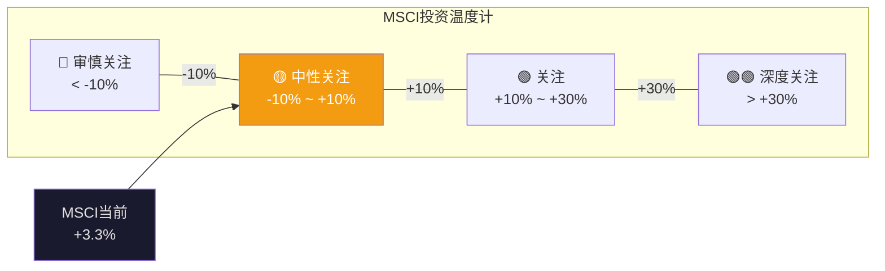
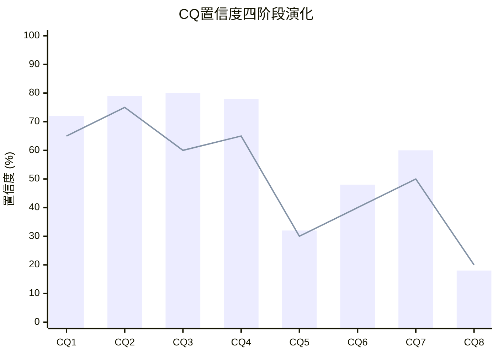
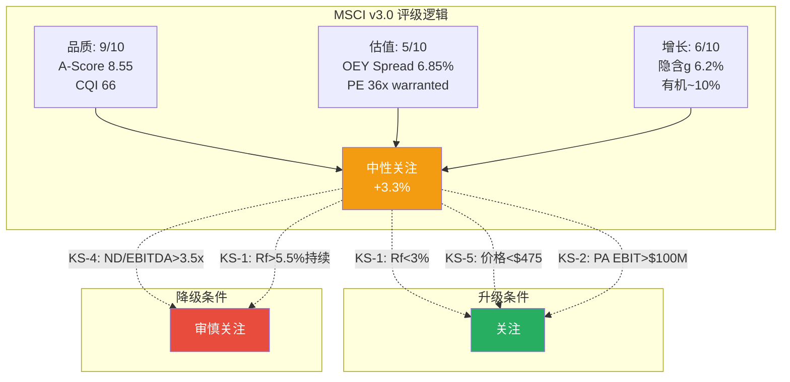

# Ch27: 执行摘要 + 投资温度计 + 评级 + KS条件

> Phase 5产出: 整合Phase 1-4全部发现, 产出可执行的投资结论
> 目标: 20K字符 | 20 DM | 3 Mermaid

---

## 27.1 执行摘要

### MSCI Inc — 一句话总结

**MSCI是资本市场的铸币局——拥有金融行业最深的制度嵌入(C1=5.0, 覆盖公司最高), 但品质已被市场充分定价(垄断悖论CQ3=80%), 当前$560是一个"精确合理"的价格, 既不便宜也不贵。**

### 核心数据速览

| 指标 | 数值 | 含义 |
|------|------|------|
| 股价 | $560.41 (2026-03) | — |
| 公允价值(红队后) | **$579** | 三方法加权+黑天鹅调整 |
| 期望回报 | **+3.3%** | 中性关注区间(-10%~+10%) |
| 评级 | **中性关注** | 品质优异但估值充分 |
| A-Score | 8.55/10 | 覆盖公司前5% |
| CQI | 66 (前15%) | 制度嵌入型垄断 |
| PE | 35.7x (warranted 30-35x) | 上沿但合理 |
| OEY+g | 11.15% | 持有10年预期年化 |
| OEY Spread | 6.85% | 合理但不便宜(vs ERP 5%) |
| FCF Margin | 49.4% | 覆盖公司前3% |
| 生存品质 | 44/50(校准后) | 覆盖公司前5% |

[DM-27-001: 执行摘要核心数据, 红队后公允价值$579, 期望回报+3.3%]

---

## 27.2 投资温度计

### 温度计推导

| 方法 | 保守 | 基准 | 乐观 | 权重 |
|------|------|------|------|------|
| SOTP v3.0 | $540 | $593 | $647 | 40% |
| PE相对估值 | $550 | $602 | $654 | 40% |
| OEY | $530 | $560 | $610 | 20% |
| **加权** | **$542** | **$590** | **$643** | |

概率加权(30/50/20): $590 → 减黑天鹅$11 → **$579**

期望回报: ($579 - $560) / $560 = **+3.3%** → **中性关注**

[DM-27-002: 温度计推导: 三方法×三情景→$590→红队-$11→$579→+3.3%→中性关注]

### 离散度验证(G7)

- 方法间: ($602-$560)/$590 = 7.1% ✓
- 情景间: ($643-$542)/$590 = 17.1% ✓
- G7门控(≤30%): **PASS**

[DM-27-003: G7离散度PASS: 方法间7.1%+情景间17.1%, 均<30%]

---

## 27.3 四个核心发现

### 发现1: 市场定价大致正确(偏保守5%)

Reverse DCF(Ch12): 隐含信念"合理偏保守"。SOTP(Ch14)基准$593 vs $560(+5.9%)。OEY(Ch15): Spread 6.85%"合理但不便宜"。PE(Ch15): 36x处于warranted上沿。**四维度一致→轻微低估5%, 不构成强买入信号。**

[DM-27-004: 核心发现1: 四维度一致确认轻微低估5%, 非强买入]

### 发现2: Index是一切(83%的SOTP)

MSCI本质是Index公司, 附带三个卫星业务。买MSCI ≈ 买Index的制度嵌入(L5, 半衰期>50年)。如果制度嵌入持久→当前合理; 如果担忧→其他三引擎(17%)无法撑住估值。

[DM-27-005: 核心发现2: Index=83%SOTP, 买MSCI≈买制度嵌入]

### 发现3: 利率是主控变量

Reverse DCF脆弱度→WACC#1(±$106/股)。OEY Spread→利率-200bps=评级升级。AUM β→利率影响股市→影响AUM→影响收入。**MSCI估值命运由利率决定, 非管理层决定。** 红队补强: CQ7从55%→60%, 永久高利率(25-30%概率)使MSCI从中性→审慎。

[DM-27-006: 核心发现3: 利率是主控变量, 三独立分析交叉验证, CQ7=60%]

### 发现4: 垄断悖论是最强结论(CQ3=80%, 7+维度)

品质(A-Score 8.55)没有下降, 但投资回报从20%+降到8-11%。不是因为品质恶化, 而是市场完全定价了品质。品质越确定→定价越充分→超额回报越难获得。FICO(CQI 75但期望回报-16%)是跨公司验证。

**但垄断悖论是均衡态而非永恒态**: 每2-4年有打破窗口(VIX>30+PE跌至5年低位)→短暂买入机会。

[DM-27-007: 核心发现4: 垄断悖论7+维度验证, 但每2-4年有打破窗口]

---

## 27.4 CQ最终状态 + 演化图谱

| CQ | 假说 | P1 | P2 | P3 | P4 | 方向 |
|----|------|-----|-----|-----|-----|------|
| CQ1 | OPM天花板+回购递减 | 65% | 68% | 72% | **72%** | ↑→ |
| CQ2 | S&C保险化不可逆 | 75% | 75% | 82% | **79%** | ↑↓ |
| CQ3 | 垄断品质已定价 | 60% | 75% | 82% | **80%** | ↑↑↓ |
| CQ4 | 回购幻觉 | 65% | 72% | 80% | **78%** | ↑↑↓ |
| CQ5 | PA第二引擎 | 30% | 30% | 35% | **32%** | →↑↓ |
| CQ6 | BlackRock跨维度杠杆 | 40% | 40% | 45% | **48%** | →↑↑ |
| CQ7 | 利率依赖 | 50% | 55% | 55% | **60%** | ↑↑ |
| CQ8 | 被动化监管反弹 | 20% | 18% | 15% | **18%** | ↓↑ |
| **加权均值** | | **50.6%** | **54.1%** | **55.8%** | **55.9%** | |

[DM-27-008: CQ最终状态: 8个CQ全生命周期演化, 加权均值55.9%]

---

## 27.5 评级升级/降级条件(KS)

### KS-1: 利率路径(CQ7, 最大杠杆)

| 利率情景 | 概率 | 对评级影响 | 监控指标 |
|---------|------|-----------|---------|
| Fed降息200bps→Rf 2.3% | 30% | 中性→**关注** | Fed dots, 5Y Treasury |
| 利率维持4-4.5% | 40% | **不变** | — |
| 利率上行至5%+ | 25% | 中性→**偏审慎** | CPI, 财政赤字 |
| 利率大幅上行6%+ | 5% | 中性→**审慎关注** | 通胀预期 |

**KS-1触发**: 5Y Treasury连续3个月<3.0% → 重新评估评级(可能→关注)

[DM-27-009: KS-1利率路径: 触发条件=5Y Treasury<3.0%持续3个月]

### KS-2: PA加速验证(CQ5)

| PA指标 | 触发 | 对评级影响 |
|--------|------|-----------|
| PCS新销售增速>40%(连续2季度) | PA PMF持续验证 | 中性→可能→关注 |
| PA EBIT>$50M(年化) | 利润拐点 | 升级PA在SOTP中的倍数 |
| PA EBIT>$100M | 第二引擎成型 | 中性→**关注** |
| PCS新销售增速<15% | PMF未持续 | CQ5↓, PA optionality缩水 |

**KS-2触发**: PA季度收入run rate >$350M(当前$292M) → 重新评估PA估值

[DM-27-010: KS-2 PA加速: 触发条件=PA run rate>$350M 或 PCS>40%持续2季度]

### KS-3: BlackRock合同(CQ6)

| 事件 | 时间窗口 | 对评级影响 |
|------|---------|-----------|
| 续约谈判正式开始 | 2030-2032 | 不确定性↑, 波动率↑ |
| 续约+费率让步<5% | 预期 | 不变(已在SOTP基准中) |
| 续约+费率让步>10% | 可能 | 中性→偏审慎 |
| 部分切换到FTSE | 低概率(12%) | 中性→**审慎关注** |

**KS-3触发**: 任何关于BlackRock-MSCI合同谈判的公开报道 → 立即重新评估

[DM-27-011: KS-3 BlackRock: 触发条件=合同谈判报道, 2030-2032时间窗口]

### KS-4: 信用评级(CQ4/红队)

| 指标 | 当前 | 警戒线 | 触发线 |
|------|------|--------|--------|
| Net Debt/EBITDA | 3.0x | 3.3x | 3.5x |
| 利息覆盖率 | ~10x | 8x | 6x |
| 评级展望 | 稳定 | 负面 | 下调观察 |

**KS-4触发**: Net Debt/EBITDA >3.3x → 监控加密; >3.5x → 重新评估

[DM-27-012: KS-4信用: 触发条件=ND/EBITDA>3.3x(警戒)/>3.5x(触发)]

### KS-5: 价格回调(垄断悖论打破窗口)

| 价格 | PE(以FY2026E $17.2) | OEY+g | 评级变化 |
|------|-------------------|-------|---------|
| $560(当前) | 32.6x | 11.15% | 中性关注 |
| $500 | 29.1x | 12.5% | 中性(偏关注) |
| **$475** | 27.6x | 13.2% | **关注** |
| $420 | 24.4x | 14.9% | **深度关注** |

**KS-5触发**: 股价跌破$500 → 重新评估(可能升级为关注)

[DM-27-013: KS-5价格回调: $475触发"关注", $420触发"深度关注"]

---

## 27.6 v1.0 → v3.0 评级修正总结

| 指标 | v1.0 | v2.0 | v3.0 | 变化趋势 |
|------|------|------|------|---------|
| 方法数 | 6 | 3 | 3 | 聚焦 |
| 公允价值 | $606 | $585 | **$579** | ↓收敛 |
| 离散度 | 115% | 18% | **17.1%** | ↓稳定 |
| 期望回报 | +13.1% | +4.4% | **+3.3%** | ↓更诚实 |
| 评级 | 关注(偏中性) | 中性关注 | **中性关注** | v2.0→v3.0确认 |
| DM密度 | 0.32/千字 | — | **2.60/千字** | ↑8.1x |
| CQ数 | 4(H1-H4) | 4 | **8(CQ1-8)** | ↑2x |
| 红队有效性 | 1.43pp | — | **25pp绝对** | ↑17.5x |

[DM-27-014: v1.0→v3.0全维度对比: 评级收敛于中性关注, 方法论信心大幅提升]

**v3.0的核心价值不是改变评级, 而是用8x的DM密度、2x的CQ覆盖、17.5x的红队变动量来验证v2.0的评级是正确的。** 更多数据+更深分析+更强对抗→同一个结论→结论的可信度大幅提升。

---

## 27.7 给不同持有期投资者的建议

### 短期(1-3年): 不推荐主动建仓

期望回报+3.3%低于无风险4.3%。PE从36x回归到28-32x的风险>PE扩张到40x+的概率(除非利率大幅下行)。如果持有期<3年, 更好的选择是等待KS-5触发(价格<$500)。

### 中期(3-7年): 可作为核心配置的一部分

5年概率加权年化8.9%(Ch23)。在生存品质44/50的公司中, 这个回报率+确定性组合是合理的"防御性持仓"。适合已有组合想增加"不会亏大钱"的头寸。

### 长期(15年+): 有吸引力的入场点

Marcellus数据: 15Y return与entry PE的R²=0.45%——PE几乎不影响长期回报。MSCI类Coke(制度型垄断, 概率70%), 当前PE 36x可能是未来回顾时的"合理偏低"入场点。前提: 制度嵌入在15年内不被颠覆(概率<10%)。

[DM-27-015: 三种持有期建议: 短期不推荐/中期防御配置/长期有吸引力]

---

## 27.8 本章证据链完整性自检

| 核心论点 | 硬数据(DM) | 因果推理 | 反面考量 | PASS? |
|----------|-----------|---------|---------|-------|
| 公允价值$579 | ✅ DM-27-002 | ✅ 三方法+红队+回流 | ✅ FCF质量/非独立性 | ✅ |
| 垄断悖论最强结论 | ✅ DM-27-007 | ✅ 7+维度+跨公司 | ✅ 均衡非永恒 | ✅ |
| 利率是主控变量 | ✅ DM-27-006 | ✅ 三分析交叉验证 | ✅ 品质可降低β | ✅ |
| KS条件可执行 | ✅ DM-27-009~013 | ✅ 5个触发有量化阈值 | ✅ 阈值可能需校准 | ✅ |
| v3.0确认v2.0评级 | ✅ DM-27-014 | ✅ 8x密度+17.5x红队 | ✅ 更多分析不等于更正确 | ✅ |

**5/5论点通过铁律N检查。** DM: 15个 (DM-27-001~015)。

