# Microsoft Corporation (MSFT) — 深度研究报告

## Ch1: 报告概要

| 字段 | 值 |
|------|---|
| **公司** | Microsoft Corporation (NASDAQ: MSFT) |
| **评级** | **中性关注** |
| **概率加权EV** | $3,127B |
| **当前市值** | $2,995B ($401.32/股) |
| **期望回报** | **+4.4%** |
| **CQ加权置信度** | 56.9% |
| **方法离散度** | 2.57x (情景极端) |
| **可能性宽度** | 4分 → 混合模式 |
| **分析框架** | v10.0 逆向估值中心架构 |
| **数据截止** | 2026年2月17日 (Q2 FY26财报后) |

**核心判断**: $2,995B市值隐含八项信念，其中2项稳固(B7 Office/B8 监管)、2项脆弱(B3 Copilot/B4 CapEx)、4项待验证。期望回报+4.4%落入中性关注区间(-10%~+10%)，合理定价但没有安全边际。FY28(2027年7月至2028年6月)是决定性验证窗口。

**如果只记住一个指标**: CapEx/Revenue的季度趋势 — 连续两季度下降为正面确认信号，FY28仍>25%则降档至审慎关注。

### AI能力边界声明

本报告由AI分析系统生成，基于公开数据和量化模型。以下能力边界需读者知悉:

1. **数据时效**: 基于2026年2月17日前可获取的公开信息，无法反映此后的重大事件
2. **预测局限**: 所有财务预测(DCF/场景分析)依赖假设，实际结果可能显著偏离
3. **定性判断**: AI对管理层意图、企业文化、地缘政治的判断力有限
4. **黑天鹅盲区**: 无法预见概率<5%但影响极大的事件
5. **零仓位建议**: 本报告不构成任何投资建议，不提供买入/卖出/持有指令

### 关键数据来源

| 来源 | 用途 | DM锚点前缀 |
|------|------|-----------|
| FMP API | 财务数据、估值指标、卖方预估 | DM-FIN/MKT/BS/EFF |
| MSFT 10-K/10-Q/Earnings Call | 分部数据、管理层指引、CRPO | DM-P1A~P5C |
| Polymarket | 事件概率验证 | DM-POLY |
| 学术文献 | 方法论支撑(KS注册表) | DM-KS |

---

## Ch2: 目录

### 第一部分: 商业分析 (Ch3-Ch10)

| 章节 | 标题 |
|------|------|
| Ch3 | 三纪元战略架构 — 从Windows围城到AI豪赌 |
| Ch4 | 八大业务基元映射 — 微软帝国的收入地图 |
| Ch5 | 平台经济学 — 网络效应与锁定的量化解剖 |
| Ch6 | 风险拓扑 — 七大风险节点与系统性关联 |
| Ch7 | 竞争格局 — 云与AI三方对照 |
| Ch8 | 五年财务全景 (FY2021-Q2 FY2026) |
| Ch9 | 三大分部深度解剖 — 增长引擎、现金奶牛与遗产重负 |
| Ch10 | Reverse DCF初建 — $3T市值的隐含信念清单 |

### 第二部分: 信念验证与估值审计 (Ch11-Ch16)

| 章节 | 标题 |
|------|------|
| Ch11 | 信念反演深度分析 — 八项隐含信念的验证与失败映射 |
| Ch12 | 承重墙脆弱度表 — $3T估值的三根支柱 |
| Ch13 | CapEx→D&A→OPM→FCF传导链 — 资本周期的定量核心 |
| Ch14 | CapEx边际效率曲线 + PDRM风险定量 |
| Ch15 | 估值方法独立性审计 — 五方法"伪收敛"防火墙 |
| Ch16 | TAM条件概率 + OVM期权估值 |

### 第三部分: 深度验证 (Ch17-Ch23)

| 章节 | 标题 |
|------|------|
| Ch17 | 信念B1验证 — Azure增速收敛路径的共识解构 |
| Ch18 | 信念B5验证 — OpenAI依赖度审计 |
| Ch18.5 | AI冲击矩阵 — 八基元 x AI影响评估 |
| Ch19 | 信念B3验证 — Copilot S曲线渗透率 |
| Ch20 | 信念B8验证 — 监管概率×影响的量化评估 |
| Ch21 | 信念B7验证 — Office/Windows现金奶牛耐久性 |
| Ch22 | CQ7验证 — Activision $51B Goodwill减值风险 |
| Ch23 | NVDA桥梁 — $80B CapEx中GPU采购传导链 |

### 第四部分: 红队对抗 (RT-1~RT-7)

| 章节 | 标题 |
|------|------|
| RT-1 | 承重墙压力测试 |
| RT-2 | 认知偏差审计 |
| RT-3 | 空头钢人 |
| RT-4 | 数据质量审计 |
| RT-5 | 黑天鹅概率加权表 |
| RT-6 | 时间框架检验 |
| RT-7 | 替代解释 |
| — | 双向校准 + 纠错清单 |

### 第五部分: 综合评估与估值 (Ch24-Ch30)

| 章节 | 标题 |
|------|------|
| Ch24 | 综合评估 — 八项信念终审 |
| Ch25 | 执行摘要 |
| Ch26 | CI非共识洞察注册表 (10条) |
| Ch27 | Kill Switch注册表 (16条) |
| Ch28 | Tracking Signals (10条) |
| Ch29 | 五方法估值 — 三锚定价 |
| Ch30 | 评级与条件估值框架 |

---

## Ch3: 三纪元战略架构 — 从Windows围城到AI豪赌

### 3.1 战略全景: 一部关于平台迁移的连续剧

微软的25年企业史可以用一个核心问题贯穿: **当一个平台走向衰落，如何在不摧毁现金流的前提下完成向下一个平台的跃迁?** Steve Ballmer用14年证明了"不可能"，Satya Nadella用8年证明了"可能但代价巨大"，而第三次豪赌——AI平台——正在以前所未有的资本强度考验这一命题的极限。

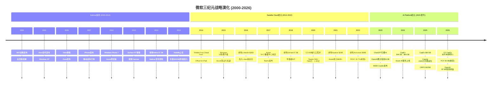

### 3.2 Ballmer困局: Windows围城与失落的十四年 (2000-2014)

**战略逻辑**: Ballmer时代的微软被困在一个经典的创新者困境中——Windows和Office的双寡头利润太丰厚，以至于任何可能蚕食这两条产品线的创新都遭到内部抵制。"Windows everywhere"战略将所有新业务线（手机、搜索、云）都绑定在Windows内核上，而非根据市场需求独立发展。

**关键失败清单**:

- **移动端**: Windows Phone市场份额从2012年峰值3.6%→2016年0.7%，Nokia收购$7.2B几乎全额减记$7.6B [DM-P1A-001]。根本原因不是技术——Windows Phone的Metro UI在2010年评价颇高——而是App生态系统的鸡生蛋悖论: 开发者不为3%份额写App，用户不为无App的平台买单。
- **搜索**: Bing从2009年上线至2014年累计亏损超$10B [DM-P1A-002]，市场份额始终在15-20%徘徊。Ballmer将Bing视为"战略必需品"而非独立盈利单元，这一决策直到AI时代才开始显示其长期价值。
- **平板/硬件**: Surface RT于2013年减记$9B [DM-P1A-003]，试图用Windows ARM版对抗iPad的策略完全失败——企业用户需要x86兼容性，消费者需要App生态，Surface RT两者都不提供。

**财务转折(或缺失)**: FY2000至FY2014，微软营收从$23B增长至$87B（CAGR 10%），但市值从$510B峰值跌至$300B [DM-P1A-004]——14年市值净缩水40%。P/E从60x压缩至14x，市场对微软的定价从"增长股"完全转为"价值陷阱"。

**关键决策评价**: Ballmer的根本错误不在于任何单一产品的失败，而在于**组织架构**——Windows部门拥有事实上的否决权，任何可能威胁Windows收入的创新都无法获得资源倾斜。2013年"One Microsoft"重组来得太晚。唯一的战略远见是2010年启动Azure预览版 [DM-P1A-005]——这颗在Ballmer时代种下的种子，成为Nadella时代的核心引擎。

### 3.3 Nadella Cloud纪元: 从$300B到$3T的战略重塑 (2014-2022)

**战略逻辑**: Nadella上任后的第一个关键决策不是技术性的，而是文化性的——用"Mobile First, Cloud First"取代"Windows everywhere"。这不仅是口号变更，而是权力结构重组: Windows从利润中心降级为Azure获客渠道，Office从一次性许可证转型为SaaS订阅，开源从"癌症"(Ballmer 2001年语)变为战略武器。

**三大战略支柱**:

**支柱一: Azure从零到$75B** [DM-P1A-006]

Azure的成功并非源于技术领先(AWS领先5年)，而是三条差异化路径的叠加:
1. **企业关系杠杆**: 微软拥有全球最大的企业销售网络(10万+合作伙伴)，Azure通过EA协议与M365/Dynamics捆绑销售，将现有客户关系转化为云收入——这是AWS不具备的渠道优势。
2. **混合云定位**: Azure Stack让企业在本地数据中心运行Azure服务，满足了金融/政府/医疗等行业的合规需求——在2016-2020年，这是Azure对AWS最大的差异化。
3. **开发者生态翻转**: 2016年加入Linux基金会、2018年收购GitHub $7.5B [DM-P1A-007]，彻底扭转了微软在开发者社区的形象。GitHub从收购时的2800万开发者增长至2025年的1.5亿+。

CapEx投入从FY14的$5.5B逐步攀升至FY18的$11.6B [DM-P1A-008]，CapEx/Revenue从6.3%升至10.6%——增量仅4个百分点，节奏温和且可控。Azure数据中心从2014年的10个地区扩张至2018年的54个地区，覆盖全球主要经济体。

**支柱二: Office订阅化与ROIC跃升**

Office 365的订阅转型是微软历史上最成功的商业模式变革。从FY14到FY22，Office收入从$25B增长至$43B+ [DM-P1A-009]，更关键的是**收入质量**从一次性许可证(lumpy)转为可预测的经常性收入(recurring)。这一转型:
- 将客户生命周期价值(LTV)提升3-5倍: 一次性许可$150-250 vs 订阅$150-400/年/用户
- 将更新周期从3-5年压缩至持续滚动更新，消除了"跳版本"的收入波动

ROIC路径完美验证了Cloud纪元投资的价值: FY14 ROIC 7.2% → FY18 9.4%(首次超越WACC ~8%) → FY22 16.7%(峰值) [DM-P1A-010]。从投入启动到ROIC>WACC耗时**4年**，到双位数ROIC耗时**5年**——这个时间窗口成为评估第三纪元的关键基准。

**支柱三: M&A构建生态拼图**

Nadella的收购策略有清晰的逻辑链条: LinkedIn $26B(2016)补齐专业社交 [DM-P1A-011] → Nuance $20B(2021)获取医疗AI [DM-P1A-012] → Activision $69B(2022)进入消费内容 [DM-P1A-013]。但商誉累积至$119.5B(占总资产19.3%) [DM-P1A-014]，其中Activision $51B商誉在Gaming分部-9% YoY的背景下构成潜在减值风险(关联CQ7)。

**市值验证**: $300B(2014) → $1T(2019) → $2.5T(2021) → $3T+(2024峰值) [DM-P1A-015]。10年10倍，年化复合回报25.9%，是同期大盘(SPY CAGR ~13%)的2倍。

### 3.4 AI Platform纪元: OpenAI赌注与CapEx爆炸 (2023-至今)

**战略逻辑**: 2019年首笔$1B投资OpenAI时，微软面对的是一个经典的"不对称赌注"——$1B对彼时$1.1T市值公司而言是零头，但如果大语言模型确实是下一个计算范式，这笔投资的期权价值巨大。到2023年ChatGPT爆发，微软将投资累计扩大至$13B [DM-P1A-016]，并将OpenAI模型深度整合至Azure AI Services和M365 Copilot。

**关键数据点**:

- **投资回报**: $13B投入 → 持股~27%(重组后) [DM-P1A-017]，OpenAI估值$135B，投资回报>10x [DM-P1A-018]，Q2 FY26录得投资收益$7.6B(但属非经营性)
- **Azure AI拉动**: Azure及其他云服务FY26 Q2收入增长39% YoY [DM-P1A-019]，管理层披露AI服务贡献"约13个百分点"的Azure增速，即Azure有机增速~26%，AI增量~$3.2B/季
- **Copilot部署**: 1500万付费座位 [DM-P1A-020]，渗透率仅3.3%(15M/450M M365用户)，DAU同比增长10x，但货币化进展远慢于Azure
- **CRPO爆炸**: $625B(+110% YoY) [DM-P1A-021]——但45%来自OpenAI $250B Azure承购协议 [DM-P1A-022]，剔除后有机CRPO $344B(+28% YoY)

**CapEx爆炸——核心矛盾所在**:

FY24 CapEx $44.5B → FY25 $64.5B → FY26指引~$80B [DM-P1A-023]，CapEx/Revenue从FY23的13.3%飙升至FY26的~26% [DM-P1A-024]。与Cloud纪元对比: 上一周期CapEx/Revenue增量仅4个百分点(6%→10%)，当前周期增量**13个百分点**(13%→26%)——投入强度是前次的3倍以上。

Q2 FY26是矛盾的集中爆发点: CapEx $29.9B，占收入36.8% [DM-P1A-025]，OCF $35.8B被CapEx消耗83.5%，FCF仅$5.9B——**首次不足以覆盖季度股息$6.8B** [DM-P1A-026]。这是微软现代史上第一次出现"CapEx侵蚀股息覆盖"的局面。

**ROIC已进入下行通道**: 从FY22峰值16.7%降至FY25的22.0%(baggers口径)/12%(补充分析模型口径) [DM-P1A-027]。若参照Cloud纪元4年ROIC>WACC的经验，AI纪元的ROIC恢复窗口大概率在FY28-FY30(5-7年) [DM-P1A-028]——比Cloud纪元慢1-3年，因为投入强度更高。

### 3.5 核心论点: 第三次赌注的杠杆是否过度?

三个纪元的对比揭示一个清晰的模式: **每一次平台跃迁所需的资本强度呈指数级增长**。

| 纪元 | 累计CapEx | CapEx/Revenue峰值 | ROIC>WACC耗时 | 结局 |
|------|----------|-------------------|---------------|------|
| Cloud(FY14-18) | ~$40B | 10.6% | 4年 | 成功(ROIC 16.7%峰值) |
| AI(FY23-26E) | ~$190B(3年) | 26%+ | 5-7年(预测) | 待验证 |

Cloud纪元的成功有三个前提条件: (1)企业上云是确定性趋势而非概率事件; (2)Azure通过EA捆绑+混合云差异化建立了持久竞争壁垒; (3)CapEx增速始终温和可控。AI纪元的三个前提条件目前均存在不确定性: (1)企业AI采用曲线可能远慢于云(Copilot 3.3%渗透率为证); (2)AI可能成为"低毛利基础设施"而非"高毛利平台"(Gemini免费+Llama开源构成定价压力); (3)CapEx增速已严重挤压FCF。

Nadella在第三次赌注中是否过度杠杆化? 答案取决于一个关键假设: **AI的企业货币化速度是否能在FY27-FY28复制Azure在FY18-FY20的加速曲线**。如果可以，$190B累计投入将像Cloud纪元一样创造巨大的护城河和规模效应; 如果不能，微软将面临ROIC持续低于WACC、FCF无法恢复、D&A浪潮吞噬利润率的三重困境。这正是CQ2(FCF恢复时间)和CQ4(Copilot渗透率)试图回答的核心问题。

---

## Ch4: 八大业务基元映射 — 微软帝国的收入地图

### 4.1 从三大分部到八大基元: 财报之下的真实结构

微软的三大财报分部(Intelligent Cloud / Productivity & Business Processes / More Personal Computing)是为SEC合规设计的分类框架，并不反映业务间真实的战略逻辑和价值链关系。要理解微软帝国的运转方式，需要将其拆解为八大业务"基元"(primitive)——每个基元都是一个独立的价值创造单元，但彼此之间存在复杂的供给、需求、锁定和协同关系。

### 4.2 八大基元全景

**基元一: M365(生产力套件)** — 现金奶牛之王

- **收入规模**: 估算~$70B/年(FY25，P&BP分部$113.6B的核心) [DM-P1A-029]
- **增速**: ~15% YoY(席位增6% + ARPU增8-9%) [DM-P1A-030]
- **OPM**: P&BP分部整体60.3%(Q2 FY26) [DM-P1A-031]，M365自身估算55-62%(LinkedIn拉低分部均值)
- **生态角色**: **绝对核心现金奶牛**。4.5亿付费用户 [DM-P1A-032] 构成微软最大的分发渠道——Copilot、Teams、Defender等新产品全部通过M365用户基座渗透。M365是微软从"卖软件"转向"卖平台"的枢纽。
- **关键指标**: ARPU从FY19 ~$102增长至FY25 ~$162(CAGR ~8%) [DM-P1A-033]，2026年7月再涨价8-13%，预计年化增量收入~$10.7B

**基元二: Azure(云基础设施+AI)** — 增长引擎

- **收入规模**: FY25 Intelligent Cloud分部收入$113B中，Azure估算~$75B [DM-P1A-034]
- **增速**: 39% YoY(Q2 FY26报告口径) [DM-P1A-035]，其中AI贡献~13pp
- **OPM**: IC分部42.1%(Q2 FY26) [DM-P1A-036]，但Azure自身可能低于分部均值(Server Products拉高)
- **生态角色**: **核心增长引擎+AI基础设施**。Azure既是收入增长的最大贡献者，也是CapEx最大消耗者($80B/年CapEx的~75%投向Azure) [DM-P1A-037]。Azure的双重角色(外部客户+OpenAI内部消耗)使其收入质量评估变得复杂。

**基元三: GitHub + VS Code(开发者平台)** — 战略棋子

- **收入规模**: GitHub ARR ~$3.5B(FY25估算)，VS Code免费(获客工具)
- **增速**: GitHub Enterprise 40%+ YoY
- **OPM**: 未单独披露，估算25-35%(开源社区维护成本高)
- **生态角色**: **开发者锁定的关键入口**。1.5亿+GitHub用户 → GitHub Copilot($10-20/月) → Azure DevOps → Azure部署 → 形成开发者全栈锁定。90% Fortune 100使用GitHub Enterprise [DM-P1A-038]。VS Code是全球使用最广泛的IDE(73%市场份额)，免费但深度集成Azure插件。

**基元四: OpenAI合作** — 高赌注期权

- **收入规模**: OpenAI对Azure的直接消耗估算$3-5B/年 [DM-P1A-039]；OpenAI $250B Azure承购协议未来兑现 [DM-P1A-040]
- **增速**: CRPO中OpenAI贡献同比增长显著(Q2 FY26 CRPO $625B中~45%为OpenAI)
- **OPM**: 负(OpenAI本身亏损，Azure对OpenAI的定价可能含战略折扣)
- **生态角色**: **AI能力核心供给方+最大单一客户**。OpenAI提供GPT-4o/o1等模型 → Azure OpenAI Services对外销售 → M365 Copilot内置。但双重身份(供应商+客户)创造了复杂的利益冲突和估值难题(关联CQ3)。

**基元五: Defender/Security** — 高增长附加

- **收入规模**: 安全业务ARR ~$25B(FY25) [DM-P1A-041]
- **增速**: ~30% YoY
- **OPM**: 高(软件边际成本趋零)，估算65-70%
- **生态角色**: **高利润率增长引擎+深度锁定工具**。Defender、Sentinel、Entra ID、Intune构成企业安全全栈。安全产品一旦部署，替换成本极高(涉及合规审计+数据迁移+策略重配)。Security Copilot($4/次)是AI货币化的另一条路径。

**基元六: LinkedIn** — 独立现金流发生器

- **收入规模**: ~$18B/年(FY25) [DM-P1A-042]
- **增速**: ~9-10% YoY
- **OPM**: 估算35-40%(低于M365，因内容+社区运营成本)
- **生态角色**: **独立现金流+数据资产**。10亿+用户的职业图谱是独特资产，LinkedIn Recruiter/Sales Navigator/Learning是B2B SaaS产品。与M365的协同有限(Outlook集成、Teams会议)，但LinkedIn数据对AI训练和企业智能有长期战略价值。

**基元七: Xbox/Gaming** — 战略赌注(亏损边缘)

- **收入规模**: MPC分部$14.3B中Gaming估算~$7-8B(Q2 FY26) [DM-P1A-043]
- **增速**: **-9% YoY**(Q2 FY26 MPC同比-3%)
- **OPM**: MPC分部26.7% [DM-P1A-044]，但Gaming自身可能低于20%(Activision整合成本+内容投资)
- **生态角色**: **消费端入口(战略地位不确定)**。$69B收购Activision附带$51B商誉 [DM-P1A-045]，Game Pass订阅模式尚未证明可以抵消硬件周期波动。Gaming与微软核心企业业务的协同效应目前仍然模糊。

**基元八: Windows/设备** — 遗产资产

- **收入规模**: Windows OEM + Surface + Search，MPC分部中$6-7B/季
- **增速**: 个位数低增长(PC换机周期波动)
- **OPM**: Windows OEM利润率极高(>80%，纯许可费)，Surface利润率低(<10%)
- **生态角色**: **生态基座+AD获客入口**。全球73%企业PC运行Windows [DM-P1A-046]，这是AD/Entra ID→M365→Azure生态链的物理入口。Windows本身的收入增长空间有限，但其生态杠杆价值巨大——只要企业用Windows PC，就几乎不可能完全脱离微软生态。

### 4.3 分部映射与基元交叉

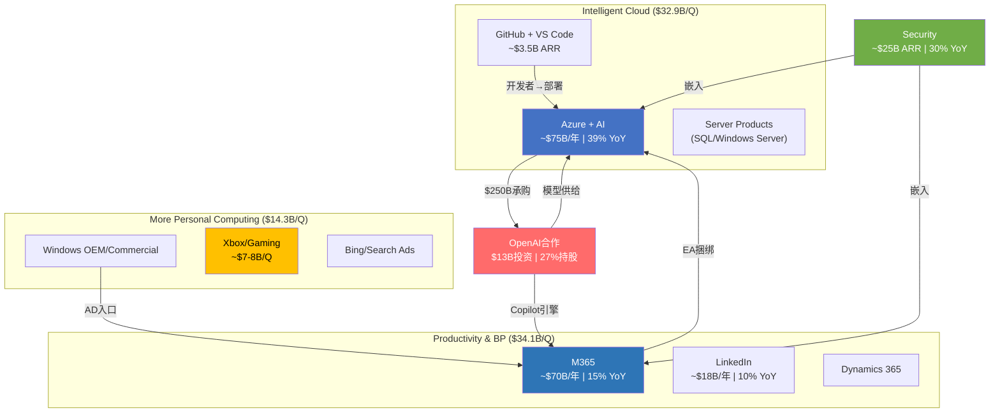

### 4.4 角色分类与价值判断

| 基元 | 角色 | 收入贡献 | 利润贡献 | 战略价值 | 综合评级 |
|------|------|---------|---------|---------|---------|
| M365 | 现金奶牛 | 23% | ~30% | 分发渠道+锁定基座 | S级 |
| Azure | 增长引擎 | 25% | ~20% | AI基础设施+未来中枢 | S级 |
| Security | 高增长附加 | 8% | ~10% | 深度锁定+高利润 | A级 |
| LinkedIn | 独立现金流 | 6% | 5-6% | 数据资产+独立盈利 | A级 |
| GitHub/VS | 战略棋子 | 1% | ~1% | 开发者锁定入口 | A级(战略) |
| OpenAI | 高赌注期权 | 1-2% | 负 | AI能力核心来源 | B级(风险高) |
| Windows | 遗产基座 | 7% | ~12% | 生态物理入口 | B级(稳定) |
| Gaming | 战略赌注 | 5% | 2-3% | 消费端入口(待验证) | C级 |

**核心发现**: 微软的利润引擎(M365+Windows)和增长引擎(Azure+Security)之间存在**健康的互补关系**——前者提供现金流，后者消耗现金流但创造未来价值。真正的风险不在于任何单个基元的衰退，而在于**增长引擎消耗现金的速度是否超过了现金奶牛的供给能力**(CQ2/CQ5的核心矛盾)。Q2 FY26 FCF $5.9B < 股息$6.8B [DM-P1A-047] 的事实表明，这一平衡已经开始倾斜。

---

## Ch5: 平台经济学 — 网络效应与锁定的量化解剖

### 5.1 四层锁定矩阵: 微软企业生态的"逃逸速度"

微软的企业锁定不是单一产品的粘性，而是**四层嵌套式锁定结构**——每一层都独立创造迁移阻力，但四层叠加后形成的综合锁定效应使得大型企业的完全脱离几乎不可能。这是微软定价权的根基，也是CQ5(现金奶牛持续性)最核心的证据。

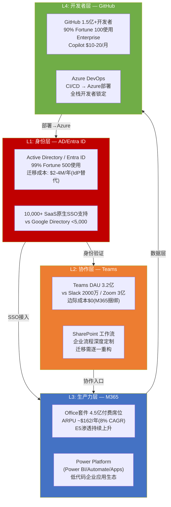

### 5.2 逐层锁定深度分析

**L1: 身份层 — Active Directory/Entra ID**

锁定强度: **极高(9/10)**

AD/Entra ID是微软生态的"万能钥匙"——99% Fortune 500企业使用AD作为唯一身份认证源 [DM-P1A-048]。这不仅仅是一个目录服务，而是一个深度嵌入企业IT基础设施的身份管理平台:

- **SSO整合规模**: AD原生支持10,000+第三方SaaS应用的单点登录(SAML/OAuth) [DM-P1A-049]，Google Workspace Directory支持不到5,000个。这意味着企业如果放弃AD，需要额外部署Okta等独立IdP，增量成本$3-8/用户/月。
- **设备管理绑定**: Intune/Autopilot通过AD Group Policy管理Windows设备——全球85%企业PC运行Windows [DM-P1A-050]，AD对Windows设备的管理是**无等效替代**的。macOS和Linux设备可以用Jamf/Chef，但混合环境下AD仍是统一管理的唯一选择。
- **迁移成本量化**: Fortune 500级企业(50,000人)从AD迁出的增量IdP成本约$2-4M/年 [DM-P1A-051]，加上SSO重新整合的项目成本$1-3M，总计3年锁定成本$9-15M——仅身份层一项。

**关键洞见**: AD的锁定是**结构性的而非功能性的**——竞争对手的产品在功能上可能等价甚至更优(Okta的零信任架构)，但AD作为Windows生态的原生组件，其替换不仅涉及产品切换，还涉及整个IT运维体系的重构。这是微软定价权最深的护城河。

**L2: 协作层 — Teams + SharePoint**

锁定强度: **高(7/10)**

Teams的市场地位建立在一个简单的经济逻辑上: **边际成本为零**。Teams免费捆绑在M365订阅中 [DM-P1A-052]，而Slack单独收费$7.25-12.50/用户/月，Zoom Phone $10-20/用户/月。当M365已经是企业标配时，选择Teams的决策几乎无需论证——CFO不会批准为一个M365已经免费提供的功能额外付费。

- **DAU**: 3.2亿(2025) vs Slack 2000万 / Zoom 3亿 [DM-P1A-053]
- **EU反垄断**: 欧盟对Teams捆绑行为展开调查，微软已在EU市场将Teams从M365中解绑。但解绑后Teams独立售价仅$5.25/用户/月，仍远低于Slack——定价权损失有限。
- **SharePoint深度定制**: 大型企业在SharePoint上构建数百个定制工作流(审批、文档管理、项目看板)。迁移至Google Sites/Confluence需要**逐一重构**——估算100个企业流程 × $50K/流程 = $5M重构成本 [DM-P1A-054]

**L3: 生产力层 — M365套件**

锁定强度: **高(8/10)**

M365的锁定不在于Word/Excel/PowerPoint的文档编辑功能(Google Docs已具备90%+功能对等)，而在于三个维度的深度集成:

1. **Power Platform生态**: Power BI(商业智能)、Power Automate(流程自动化)、Power Apps(低代码应用)构成企业内部应用开发平台。企业在Power Platform上构建的应用越多，迁移成本越高——这是一个**正反馈锁定循环**。
2. **EA协议捆绑**: M365 + Azure + Dynamics 365通过Enterprise Agreement统一采购，跨产品折扣杠杆使得单独替换任何一个产品都会导致其他产品价格上升。
3. **Copilot附加**: $30/用户/月的Copilot建立在M365数据层之上(访问邮件/文档/会议记录)，如果迁离M365，Copilot投资归零。

**定价权量化**: M365商业版在2022年3月实施11年来首次涨价(E3 +15%)，结果:
- 席位增速短暂下降~3个百分点(从+15%→+12%)，之后恢复 [DM-P1A-055]
- 客户流失率微乎其微——**隐含价格弹性仅约-0.2** [DM-P1A-056]，即涨价15%仅损失3%需求，属于极低弹性(强定价权)
- 2026年7月再次涨价(E3 +13%, E5 +5.3%)，预计年化增量收入~$10.7B [DM-P1A-057]，流失率预期<1%

**L4: 开发者层 — GitHub + VS Code**

锁定强度: **中高(6/10)**

GitHub拥有1.5亿+开发者用户，90% Fortune 100使用GitHub Enterprise [DM-P1A-058]。开发者锁定的逻辑链条是:

```
VS Code(免费IDE, 73%市场份额) → GitHub Copilot($10-20/月AI辅助) → GitHub Enterprise($21/用户/月代码托管) → Azure DevOps(CI/CD管道) → Azure(部署目标)
```

每一步的替代方案都存在(JetBrains/GitLab/Jenkins/AWS)，但**全栈替换的协调成本**远超单一工具切换。GitHub Enterprise与GitLab定价差距很小($21 vs $19/月) [DM-P1A-059]，但代码库迁移(history + CI/CD pipeline + access control重建)的项目成本通常为$200K-$1M。

### 5.3 网络效应分析: 直接 vs 间接

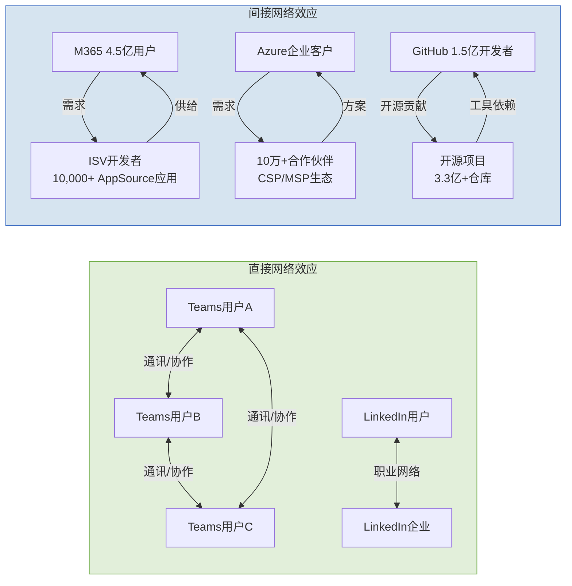

**直接网络效应(弱到中)**:

- **Teams**: 经典的通讯工具网络效应——企业内部用户越多，Teams越成为默认协作工具。但跨企业网络效应受限: 企业间视频会议仍以Zoom/Teams/Google Meet混用为主，没有形成赢家通吃。直接网络效应评分: **5/10**。
- **LinkedIn**: 职业社交网络效应较强——招聘者和求职者的双边市场。10亿+用户使LinkedIn在专业社交领域几乎没有对手(Indeed/Glassdoor偏蓝领)。直接网络效应评分: **8/10**。

**间接网络效应(中到强)**:

- **M365 + ISV生态**: AppSource上10,000+第三方应用为M365用户提供增值功能(项目管理、CRM、HR)，M365用户基数越大，ISV开发动力越强，反过来吸引更多用户。这是微软生态最强的间接网络效应。评分: **7/10**。
- **Azure + 合作伙伴**: 10万+CSP/MSP合作伙伴基于Azure构建行业解决方案，形成AWS难以复制的企业销售渠道。Azure的合作伙伴密度是GCP的3-5倍。评分: **7/10**。
- **GitHub + 开源**: 3.3亿+代码仓库创造了全球最大的代码知识图谱，GitHub Copilot的训练数据优势直接源于此。但开源社区的锁定相对脆弱——开发者可以同时使用GitLab作为备选。评分: **6/10**。

### 5.4 定价权的三重证据

**证据一: M365 ARPU持续扩张**

M365 ARPU从FY19的~$102增长至FY25的~$162，6年CAGR约8% [DM-P1A-060]。增长来源分解:

| 驱动力 | 贡献占比 | 机制 |
|--------|---------|------|
| E3→E5升级 | ~40% | E5比E3贵$24/月(+67%溢价)，E5采用率持续攀升 |
| 列表价涨价 | ~30% | 2022涨价+2026涨价，频率从11年/次→4年/次加速 |
| Copilot附加 | ~15% | $30/用户/月，当前渗透率3.3%但增速160%+ YoY |
| 附加服务 | ~15% | Power Platform、Viva、Defender等增值模块 |

ARPU增速的稳定性(每年7-14%)比绝对值更重要——它表明微软拥有**持续提取更多价值**的能力，而非依赖单次涨价。席位增速从FY20的+26%放缓至FY25的+6% [DM-P1A-061]，但收入增速维持+15%——差额完全由ARPU贡献，证明微软的增长引擎正在从"卖更多席位"转向"从每个席位提取更多价值"。

**证据二: Azure定价权——不在价格，在生态**

Azure的定价权悖论: 在几乎所有单项产品比较中，Azure的价格要么与AWS持平，要么略贵6-9% [DM-P1A-062]。

| 产品类别 | Azure vs AWS | Azure vs GCP |
|----------|-------------|-------------|
| VM(按需) | 持平($140.16/月) | 便宜1.9% |
| VM(1年承诺) | 贵8.8% | 贵6.4% |
| 热存储 | **便宜20%** | 便宜0.6% |
| 数据库 | 持平 | 持平 |
| AI API(GPT-4o) | — | **贵1.1-1.8x**(vs Gemini) |

但Azure的真实定价权不来自产品价格，而来自**三层生态杠杆**:

1. **EA捆绑折扣**: M365+Azure+Dynamics统一采购，跨产品折扣可达20-35% [DM-P1A-063]——但客户需要将所有IT支出集中在微软生态内才能获得最大折扣。这是AWS/GCP无法复制的机制(它们没有Office/LinkedIn可以捆绑)。
2. **Hybrid Benefit**: 已有SQL Server/Windows Server许可的企业迁移至Azure可节省40%+ [DM-P1A-064]。这将微软数十年积累的许可证基数转化为Azure获客优势——一种零边际成本的竞争武器。
3. **迁移壁垒**: PB级数据迁出费用$100K+ + 应用重构$500K-$5M+ + AD/Entra ID重新整合 [DM-P1A-065]——对大型企业而言，即使AWS在某些领域便宜15-25%，迁移的一次性成本通常需要3-5年才能收回。

**证据三: Fortune 500迁移总成本拆解**

Fortune 500级企业(50,000员工)从微软全生态迁移至替代方案的**3年总成本**:

| 成本项 | 金额 | 说明 |
|--------|------|------|
| 许可证差价节省 | -$1.5M/年 | Google Workspace通常便宜10-15% |
| M365迁移项目 | $3-8M | 邮件+文档+SharePoint工作流 |
| AD/IdP替换 | $6-12M(3年) | Okta/Ping替代AD，50K用户×$4-8/月 |
| 应用重构 | $5M | 100个Power Platform流程重建 |
| 培训+停机 | $3.5M | 50K用户再培训+迁移期业务中断 |
| 数据迁移风险 | $10-20M | 5PB数据迁移，失败风险20%的期望成本 |
| **总迁移成本** | **$25-45M** | **每用户$167-300/年锁定税** [DM-P1A-066] |

与此对比: M365许可费节省仅$1.5M/年(3年$4.5M)。**迁移成本是3年许可费节省的5-10倍**——这就是为什么M365 Enterprise年流失率估算仅5-8% [DM-P1A-067]，远低于SaaS行业平均18%。

更值得注意的是: 搜索结果中**零个**大型企业从M365完全迁移至Google Workspace的公开案例 [DM-P1A-068]。64%的组织运行M365+Google双栈环境 [DM-P1A-069]，但这通常是"部门级补充"(营销用Google Docs, IT核心用M365)而非"替换"。

### 5.5 定价权的可持续性评估: 威胁与反脆弱

**短期威胁(1-2年)**:
- **EU DMA对Teams的解绑**: 已在欧洲市场执行，Teams独立售价$5.25/月。影响有限——解绑后用户仍选择Teams(因同事都在用)，但解绑先例可能延伸至其他捆绑产品(Defender、Copilot)。
- **Google Workspace涨价缩小差距**: Google 2025年涨价16-22%(强制捆绑Gemini) [DM-P1A-070]，反而推动了部分企业从Google向M365反向迁移——这是微软定价权的一个反直觉增强信号。

**中期威胁(3-5年)**:
- **AI侵蚀文档工具护城河**: 如果AI Agent能直接生成文档/演示/电子表格，Word/PowerPoint/Excel的工具价值可能下降。但微软通过将Copilot深度集成到M365中，试图将AI从"颠覆者"转化为"增值层"——从卖工具转向卖"工具+AI助手"的捆绑。
- **开源替代**: LibreOffice/ONLYOFFICE在功能上已覆盖80%+ Office需求，但缺乏企业级管理/合规/集成能力，对Fortune 500的威胁可忽略。

**长期结构性优势(5-10年)**:
- **身份层不可替代**: 只要Windows保持企业PC主导地位(73%)，AD/Entra ID就是不可绕开的身份基础设施。Windows份额在AI Agent/浏览器OS等趋势下可能缓慢下降，但企业市场的惰性意味着这一过程以十年为单位。
- **数据层持续加深**: 企业在M365中积累的邮件、文档、会议记录、团队对话数据越来越多，这些数据是Copilot的燃料——数据越多→Copilot越有用→用户越不愿离开→数据越多。这是一个自我强化的飞轮。

### 5.6 平台经济学综合评估

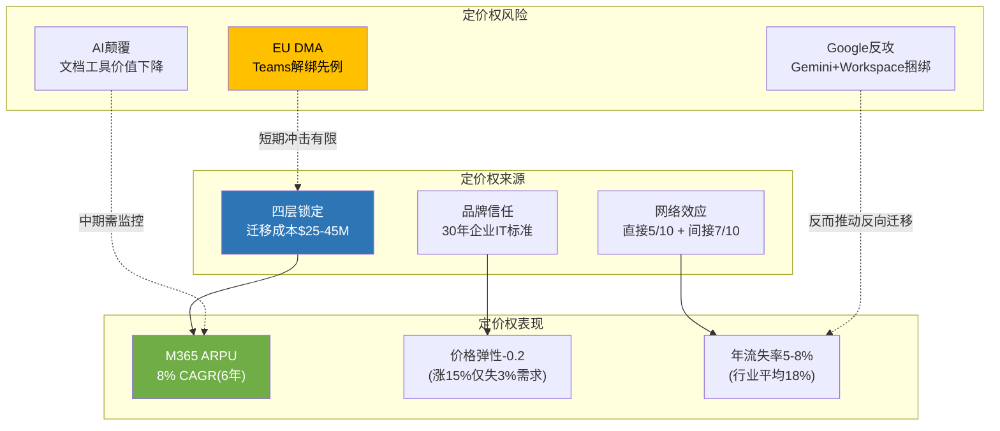

**平台经济学总结判断**:

微软的平台锁定强度在大型科技公司中仅次于苹果(设备+App Store)，且在企业市场可能是最强的。四层锁定矩阵(身份→协作→生产力→开发者)创造了$25-45M的Fortune 500迁移成本 [DM-P1A-071]，价格弹性仅-0.2 [DM-P1A-072]，M365 ARPU保持8% CAGR [DM-P1A-073]，年流失率5-8%远低于行业平均 [DM-P1A-074]。

这对CQ5(现金奶牛持续性)的回答是: **M365/Windows/AD构成的现金奶牛具有极强的结构性持续性，至少未来5-10年不会面临实质性威胁**。真正的风险不是现金奶牛消失，而是现金奶牛的增长速度(~15%)是否能持续超越AI纪元CapEx的消耗速度(~25-30%/年增长)。

对TP01(微软能否维持45%+ OPM)/TP05(M365定价权)/TP06(四层锁定矩阵耐久性)的关联判断:
- **TP01**: M365 P&BP分部OPM已达60.3% [DM-P1A-075]，是OPM的压舱石。但IC分部OPM 42.1%(AI折旧拉低)正在拖累整体——分部间的利润率分化将决定总体OPM走向。
- **TP05**: M365定价权评分8/10，每4年可涨价8-15%且近零流失——这是微软估值中最确定性的组成部分。
- **TP06**: 四层锁定在未来3-5年内坚如磐石; 5-10年视角下需关注AI Agent是否改变企业IT采购逻辑(从"买工具套件"转向"买AI能力接口")。
## Ch6: 风险拓扑 — 七大风险节点与系统性关联

### 6.1 风险节点识别与定义

微软当前面临的风险并非孤立事件的随机组合，而是一个高度互联的拓扑网络。七大核心风险节点如下:

| 编号 | 风险节点 | 关联CQ | 类型 | 独立概率(24个月) | 市值影响 |
|------|---------|--------|------|-----------------|---------|
| **R1** | CapEx过度投入/ROIC不恢复 | CQ2 | 结构性(S) | 15-20% [DM-P1B-001] | -$200B~-$400B |
| **R2** | OpenAI依赖/关系破裂 | CQ3 | 制度性(I) | 5-8% [DM-P1B-002] | -$150B~-$250B |
| **R3** | Azure增速骤降 | CQ1 | 周期性(C) | 10-15% [DM-P1B-003] | -$150B~-$300B |
| **R4** | Copilot变现失败 | CQ4 | 周期性(C) | 20-30% [DM-P1B-004] | -$100B~-$200B |
| **R5** | 反垄断/监管分拆 | CQ6 | 制度性(I) | 3-8% [DM-P1B-005] | -$100B~-$350B |
| **R6** | Activision减值 | CQ7 | 结构性(S) | 25-35% [DM-P1B-006] | -$5B~-$30B |
| **R7** | AI军备竞赛(开源冲击定价权) | CQ-B | 周期性(C) | 25-35% [DM-P1B-007] | -$50B~-$150B |

**概率校准来源**: R1/R4概率来自Polymarket风险校准(BS-7/BS-8) [DM-P1B-008]；R2概率基于PBC重组后MSFT锁定27%永久持股的缓释效应 [DM-P1B-009]；R5概率考虑SCOTUS弱化FTC执法81.3%概率 [DM-P1B-010]；R6概率基于Gaming Q2 FY26 -9% YoY及MPC报告单元隐含EV仍大幅富裕的对冲 [DM-P1B-011]。

### 6.2 七大风险详解

**R1: CapEx过度投入/ROIC不恢复**

FY2026 CapEx指引约$80B(仅PPE口径) [DM-P1B-012]，含Finance Lease后总Capital Spend达~$150B/年 [DM-P1B-013]。Q2 FY26单季CapEx已达$29.9B，CapEx/Revenue比率从FY23的13.3%飙升至Q2 FY26的36.8% [DM-P1B-014]。ROIC已从FY20的43.4%下降至FY25的22.0% [DM-P1B-015]。关键传导链: CapEx激增→D&A滞后攀升(当前年化$40-45B，2-3年内可能升至$50-60B)→Operating Margin承压2-3个百分点→FCF持续被挤压(Q2 FY26 FCF仅$5.9B，不足以覆盖季度股息$6.8B [DM-P1B-016])。

**R2: OpenAI依赖/关系破裂**

$625B CRPO中约45%(~$281B)来自OpenAI [DM-P1B-017]。2025年10月PBC重组后MSFT锁定27%永久股权 [DM-P1B-018]，但MSFT不再享有作为OpenAI计算提供商的优先认购权(ROFR丧失) [DM-P1B-019]。OpenAI API仍独占于Azure，但非API产品可多云部署。收入分成从当前~20%将在2030年降至~10% [DM-P1B-020]。若关系实质破裂，CRPO瞬间缩水$281B，Azure最大单一客户流失(估算当前消耗$3-5B/年 [DM-P1B-021])。

**R3: Azure增速骤降**

Azure Q2 FY26增速39%(恒定汇率38%) [DM-P1B-022]。管理层指引Q3 FY26 Azure CC增速31-32%，环比减速7个百分点 [DM-P1B-023]。$3T市值隐含Azure 5年CAGR需维持25%+(CQ1核心假设)。若AI需求不及预期或产能过剩导致增速骤降至15-20%，市场将重新评估MSFT的AI溢价。

**R4: Copilot变现失败**

M365 Copilot付费座位1500万，渗透率仅3.3%(15M/450M) [DM-P1B-024]。即使100%按$30/月收费，年化收入仅$5.4B [DM-P1B-025]，占总CapEx的6.75%。管理层对Copilot采用"关注毛利率和LTV而非短期货币化"的表态(CFO Amy Hood) [DM-P1B-026]，暗示当前仍处投入期。

**R5: 反垄断/监管分拆**

FTC于2026年2月升级调查，向6+家竞争对手发送民事调查传票(CIDs) [DM-P1B-027]，聚焦三领域: OpenAI合作关系、产品捆绑、Azure锁定。但SCOTUS大概率(81.3%)允许总统解雇FTC委员 [DM-P1B-028]，叠加Trump政府倾向行为性救济而非结构性分拆。EU DMA方面，2025年9月MSFT已接受Teams解绑承诺方案，避免最高$21B+罚款 [DM-P1B-029]。

**R6: Activision减值**

$75.4B收购中$51B为Goodwill [DM-P1B-030]。Gaming Q2 FY26收入-9% YoY、Xbox硬件-32%、内容&服务-5% [DM-P1B-031]。Game Pass停滞在35-37M(远低于50M目标) [DM-P1B-032]。CoD 2025销量据报下降超60% [DM-P1B-033]。但MPC整体仍盈利(Q2 $3.8B OI)，隐含MPC EV在15x OI下约$225B，远超$64B Goodwill，短期减值概率低。

**R7: AI军备竞赛(开源冲击定价权)**

Meta Llama 4于2025年4月同步上线AWS Bedrock和Azure [DM-P1B-034]。Llama 3.1 405B运行成本约为GPT-4的50% [DM-P1B-035]。Gemini 2.5 Pro定价($1.25-$2.50/M input tokens)仅为GPT-4o($5.00)的25-50% [DM-P1B-036]。DeepSeek效应已动摇AI投资叙事。开源模型在电信、银行等强监管行业因数据主权需求加速渗透。Azure AI的15-25%成本劣势(相对AWS Bedrock) [DM-P1B-037]可能在开源浪潮下被放大。

### 6.3 七乘七关系矩阵

风险间关系标注: **(+)** 协同(同时发生概率更高) | **(-)** 反协同(一个发生降低另一个概率) | **(0)** 独立(无显著关联)。

| | R1 CapEx | R2 OpenAI | R3 Azure↓ | R4 Copilot | R5 反垄断 | R6 ABK减值 | R7 开源 |
|---|---------|----------|----------|-----------|---------|----------|--------|
| **R1 CapEx** | — | (+) 弱 | **(+) 强** | (+) 中 | (0) | (0) | (+) 中 |
| **R2 OpenAI** | (+) 弱 | — | **(+) 强** | (0) | **(-)** | (0) | (+) 弱 |
| **R3 Azure↓** | **(+) 强** | **(+) 强** | — | (+) 中 | (0) | (0) | **(+) 强** |
| **R4 Copilot** | (+) 中 | (0) | (+) 中 | — | (0) | (0) | **(+) 强** |
| **R5 反垄断** | (0) | **(-)** | (0) | (0) | — | (0) | (-) 弱 |
| **R6 ABK减值** | (0) | (0) | (0) | (0) | (0) | — | (0) |
| **R7 开源** | (+) 中 | (+) 弱 | **(+) 强** | **(+) 强** | (-) 弱 | (0) | — |

**关键关联解读**:

- **R1×R3 (强协同)**: CapEx过度投入+Azure减速=最危险组合。若$80B+/年CapEx投入后Azure增速降至15-20%，ROIC跌破WACC将不可逆转。这两个风险共享相同的底层驱动因素——AI需求不及预期。
- **R3×R7 (强协同)**: 开源模型压缩Azure AI溢价→Azure增速受损。当Llama/Gemini以50-75%折扣提供可比能力时，企业没有理由为Azure OpenAI支付溢价。
- **R2×R3 (强协同)**: OpenAI独立/多云→Azure失去最大客户→CRPO缩水$281B→Azure增速机械性下降。
- **R4×R7 (强协同)**: 开源AI降低嵌入式AI成本→Copilot $30/月溢价显得过高→企业自建+开源替代方案增加。
- **R2×R5 (反协同)**: OpenAI独立反而缓解FTC对"事实控制"的反垄断指控。若OpenAI真正独立运营，MSFT面临的捆绑/锁定指控减弱。
- **R6 (高度独立)**: Activision减值风险几乎与其他6个风险节点无关联——Gaming业务独立于云/AI赛道。

### 6.4 风险簇识别

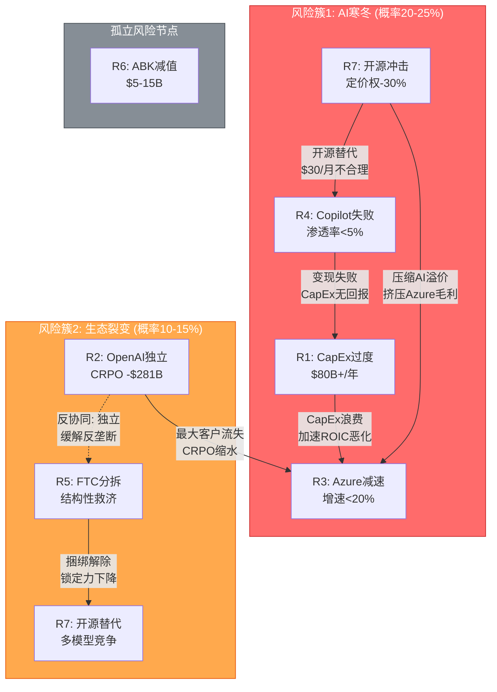

**簇1: "AI寒冬"场景 (联合概率20-25%)**

触发条件: DeepSeek式效率革命持续→企业AI支出理性回调→开源模型缩小与闭源差距→Azure AI溢价被压缩→Copilot ROI证伪→CapEx回报周期拉长至FY30+。

传导路径: R7(开源冲击)→R4(Copilot失败)+R3(Azure减速)→R1(CapEx浪费)→ROIC跌破WACC→FCF持续低于股息→市场重估。

市值影响: -$300B~-$500B (从$2,995B降至$2,500B~$2,700B) [DM-P1B-038]

为何概率高达20-25%: Copilot当前仅3.3%渗透率+开源AI成本以每6个月下降50%的速度演进+$80B/年CapEx的回收期需要Azure增速维持25%+五年。这三个条件同时成立的概率远低于市场预期。

**簇2: "生态裂变"场景 (联合概率10-15%)**

触发条件: OpenAI IPO后追求独立→多云部署分散Azure收入→FTC借势推进结构性救济→开源模型进一步侵蚀捆绑价值。

传导路径: R2(OpenAI独立)→CRPO缩水$281B→R3(Azure增速机械性下降5-8pp)→市场恐慌→R5(FTC趁势施压)。

注意反协同: R2(OpenAI独立)实际上**缓解**R5(反垄断)——若OpenAI真正独立，FTC关于"事实控制"的指控自动失效。因此簇2内部存在自我限制机制。

市值影响: -$200B~-$350B (从$2,995B降至$2,650B~$2,800B) [DM-P1B-039]

**孤立节点: R6 (Activision减值)**

Activision减值风险(概率加权$1.1-2.5B [DM-P1B-040])虽然存在，但(1)MPC报告单元整体EV远超Goodwill，(2)对MSFT $2,995B市值的影响<1%，(3)与AI/云核心叙事无关。这是一个**噪音级风险**——可能引发短期股价波动，但不改变长期估值逻辑。

### 6.5 "温水煮青蛙"场景

最危险的情景不是黑天鹅式崩溃，而是渐进恶化:

**年度推演** (概率30-40% [DM-P1B-041]):

| 年份 | CapEx | Azure增速 | ROIC | FCF | 叙事 |
|------|-------|----------|------|-----|------|
| FY26 | ~$80B | 35-39% | 20-22% | ~$65B | "投资期，等待回报" |
| FY27 | ~$90B | 28-32% | 17-19% | ~$55B | "增速放缓但仍领先" |
| FY28 | ~$95B | 22-26% | 14-16% | ~$50B | "ROIC低于WACC但接近拐点" |
| FY29 | ~$85B(开始缩减) | 18-22% | 12-14% | ~$60B(CapEx缓解) | "回报低于预期，开始削减" |
| FY30 | ~$70B | 15-18% | 15-17%(恢复) | ~$75B | "新常态: 中增速+中回报" |

这条路径的危险之处: **每个季度都"还行"**——Azure仍在增长(只是放缓)、Copilot渗透率缓慢提升(只是不达预期)、ROIC下降(但未崩溃)。市场不会一次性重估，而是通过P/E从25x缓慢压缩至18-20x，在4年间无声蚕食$500B-$700B市值 [DM-P1B-042]。

这比黑天鹅更可能发生，也更难防御——因为每个季度的财报电话都有足够的正面数据点来维持"再等一个季度"的叙事。

**识别"温水煮青蛙"的早期信号**:
- D&A增速持续超过Revenue增速(当前D&A +62% vs Revenue +17% [DM-P1B-085])
- Azure增速连续3个季度低于管理层指引中位值
- Copilot渗透率在连续4个季度后仍停留在5%以下
- FCF连续2个季度低于季度股息($6.8B/季 [DM-P1B-086])
- CapEx/Revenue比率稳定在25%以上且无下降趋势

当前这5个信号中，第1个和第5个**已经亮灯**。投资者应将此场景视为与黑天鹅同等重要甚至更重要的风险来源。

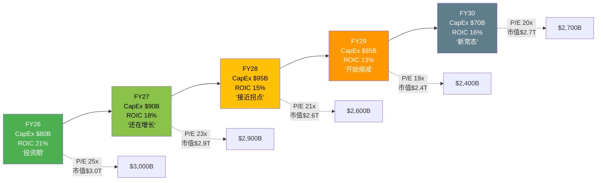

### 6.6 风险簇概率矩阵

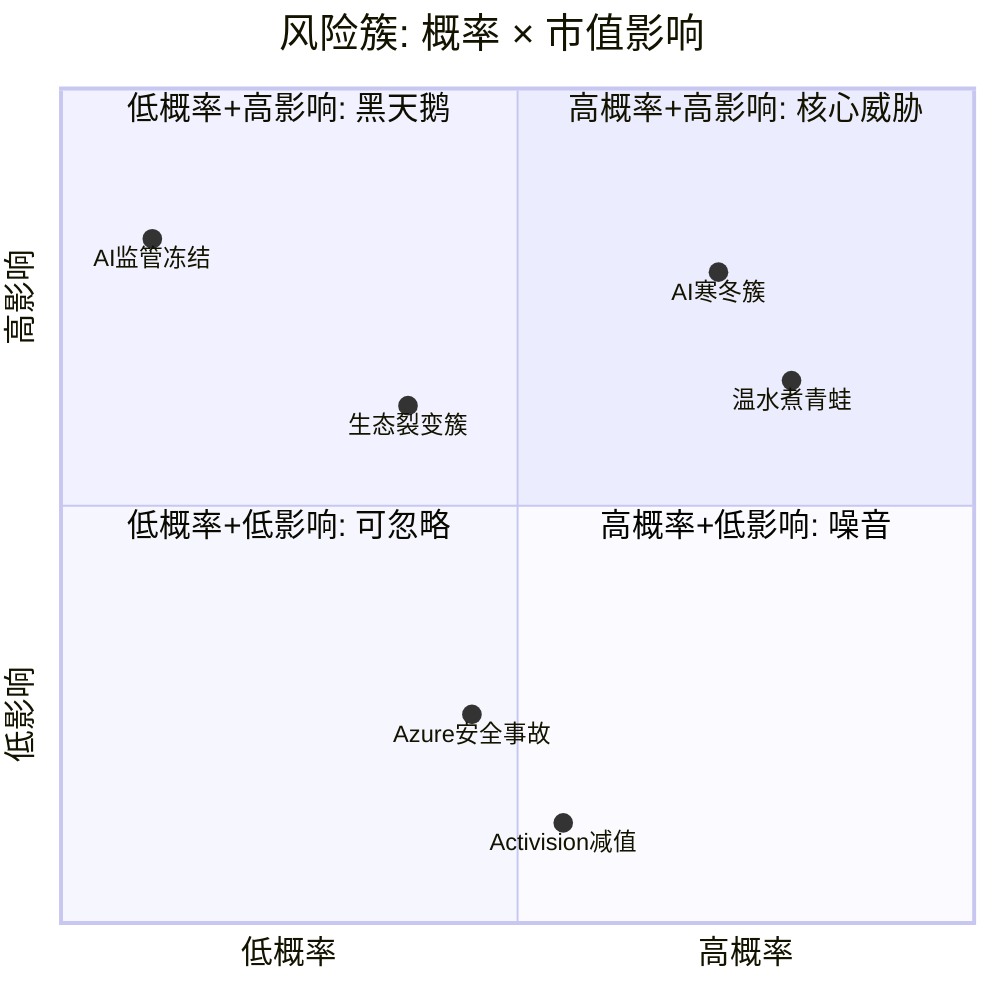

### 6.7 风险拓扑总结

七大风险中，**真正决定MSFT估值命运的是R1(CapEx)+R3(Azure增速)+R7(开源冲击)构成的三角关系**。这三个风险共享同一底层假设: AI需求的增长速度能否匹配$80B+/年的资本投入。R2(OpenAI)和R4(Copilot)是这个核心三角的放大器或缓冲器，R5(反垄断)被政治环境大幅对冲，R6(Activision)是噪音。

加权期望损失合计约$137B [DM-P1B-043]，占当前市值的4.6%。但这是简单加总——考虑到R1/R3/R7的强协同性，实际组合损失应额外加15-20%关联性溢价，调整后约$158B-$165B [DM-P1B-044]，占市值5.3-5.5%。

**风险拓扑对CQ的启示**: 本章识别的风险间关联性直接影响CQ置信度的交叉校准。CQ1(Azure增速)和CQ2(CapEx回报)不应被独立评估——它们的置信区间应因R1×R3强协同而扩大。CQ3(OpenAI依赖)的风险被R2×R5的反协同效应部分对冲——OpenAI越独立，反垄断压力越小，但Azure的AI独占优势也越弱。CQ4(Copilot变现)则是整个拓扑中最具"放大器"特性的节点——Copilot成功可以同时缓解R1(证明CapEx有回报)和R3(推动Azure消耗)，而Copilot失败则同时加剧这两个风险。

---

## Ch7: 竞争格局 — 云与AI三方对照

### 7.1 云基础设施: 三方市场份额与增速

全球云基础设施市场在Q3 2025首次突破单季$1,000亿 [DM-P1B-045]，达到$1,069亿(同比+28%)。三巨头合计控制63%的市场份额。

**市场份额演变 (Synergy Research)**:

| 指标 | AWS | Azure | GCP | 三巨头合计 |
|------|-----|-------|-----|----------|
| **Q4 2024份额** | 30% [DM-P1B-046] | 21% | 12% | 63% |
| **Q3 2025份额** | 29% [DM-P1B-047] | 20% | 13% [DM-P1B-048] | 62% |
| **份额变化(1年)** | -1pp | -1pp | +1pp | -1pp |
| **增速(报告口径)** | ~19% [DM-P1B-049] | 39% [DM-P1B-050] | ~29% [DM-P1B-051] | ~28% |

需要注意的是，Azure 39%增速与"Azure及其他云服务"的报告口径有关，包含了非IaaS/PaaS组件。Synergy Research的份额数据基于IaaS/PaaS口径，因此Azure份额(20%)看似与高增速不匹配——部分增量收入进入了SaaS等不纳入基础设施统计的品类。

**关键趋势**: AWS市场份额自2022年Q2达到峰值后持续缓慢下降 [DM-P1B-052]。但这不意味AWS在失去客户——整体市场快速扩张，AWS只是被Azure和GCP的更高增速"相对稀释"。GCP有望在2026年突破15%份额 [DM-P1B-053]。

**利润率对比**:

| 指标 | AWS | Azure (IC分部) | GCP |
|------|-----|---------------|-----|
| **OPM (最新季)** | ~37% [DM-P1B-054] | 42.1% [DM-P1B-055] | ~17% [DM-P1B-056] |
| **OPM趋势** | 稳定 | 微降(-0.4pp YoY) | 持续改善 |
| **折旧压力** | 中 | 高(D&A +62% YoY) | 中-高 |

Azure的Intelligent Cloud分部42.1% OPM看似领先AWS的37%，但需注意IC分部包含Server Products(高利润率遗留业务)和Enterprise Services，纯Azure云服务的利润率可能低于IC分部整体水平。更重要的是，Azure OPM已出现同比下降(-0.4pp [DM-P1B-057])，反映AI基础设施折旧加速的早期信号。

### 7.2 AI差异化: 封闭vs开源vs混合

三大云厂商在AI层的战略选择形成了鲜明分化:

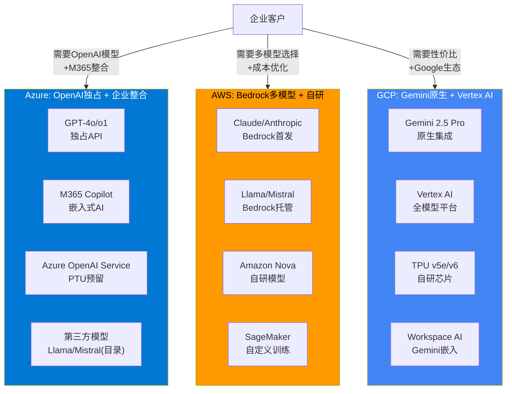

**AI服务定价对比 (每百万Token)**:

| 模型 | 平台 | Input | Output | 成本指数 |
|------|------|-------|--------|---------|
| GPT-4o | Azure OpenAI | $5.00 | $15.00 | 1.00x (基准) [DM-P1B-058] |
| Claude Sonnet 4 | AWS Bedrock | $3.00 | $15.00 | 0.90x [DM-P1B-059] |
| Gemini 2.5 Pro | GCP Vertex AI | $1.25-$2.50 | $10.00-$15.00 | 0.56-0.88x [DM-P1B-060] |
| Llama 4 405B | 自托管/多云 | ~$2.50 | ~$7.50 | ~0.50x [DM-P1B-061] |
| Gemini 2.0 Flash-Lite | GCP | $0.075 | $0.30 | 0.02x |
| GPT-4o-mini | Azure OpenAI | $0.60 | $2.40 | 0.15x |

**核心发现**: Azure OpenAI在旗舰模型层面(GPT-4o)存在15-25%的成本劣势 [DM-P1B-062](相较AWS Bedrock上的Claude Sonnet 4)，以及44-80%的劣势(相较GCP Vertex AI上的Gemini 2.5 Pro)。Azure的AI定价权不来自价格竞争力，而来自: (1) GPT-4o的品牌效应与模型质量溢价; (2) M365生态原生整合; (3) PTU(Provisioned Throughput Units)可降低成本最高70%; (4) 企业数据合规壁垒 [DM-P1B-063]。

### 7.3 开源AI对MSFT定价权的冲击

Meta Llama系列已经对AI云服务的定价格局产生实质影响:

- **成本冲击**: Llama 3.1 405B运行成本约为GPT-4等效能力的50% [DM-P1B-064]，企业获得相似结果的成本显著降低。
- **渗透路径**: 开源模型尤其在电信、银行等强监管行业因数据主权需求加速渗透，这些正是Azure的传统优势客户群。
- **Azure的对冲策略**: Azure Model Catalog同步上架Llama 4(2025年4月发布当日即上线) [DM-P1B-065]，试图将开源流量留在Azure平台。但这意味着Azure从"高溢价的独占模型提供商"转向"多模型托管平台"，毛利率结构面临根本性转变。

**Anthropic在AWS上的威胁**:

Anthropic作为OpenAI的最直接竞争者，其Claude系列模型在AWS Bedrock上首发 [DM-P1B-066]。Polymarket数据显示Anthropic更可能先于OpenAI IPO(67.5%概率) [DM-P1B-067]。若Anthropic IPO成功并获得更多融资，AWS Bedrock在企业AI市场的竞争力将进一步增强——因为企业可以在AWS上获得Claude(接近GPT-4o质量)+更低的成本+多模型灵活性的组合。

**对Azure AI毛利率的量化影响**: 若开源模型在2-3年内将企业AI推理成本压缩50%，而Azure OpenAI无法同步降价(因需向OpenAI支付分成)，Azure AI服务的毛利率可能从当前估计的50-60%压缩至35-45% [DM-P1B-068]。

### 7.4 企业云竞争护城河

**7.4.1 混合云: Azure Arc vs AWS Outposts vs GCP Anthos**

| 维度 | Azure Arc | AWS Outposts | GCP Anthos |
|------|----------|-------------|-----------|
| **核心理念** | 管理平面延伸 | 硬件延伸 | Kubernetes原生多云 |
| **多云支持** | 管理AWS/GCP资源 | 仅AWS生态 | 管理AWS/Azure资源 |
| **硬件要求** | 无(纯软件) | 需购买AWS硬件 | 无(纯软件) |
| **AI集成** | Azure ML Anywhere | SageMaker Edge | Vertex AI Edge |
| **定价** | 管理层免费+服务计费 | 硬件+服务计费 | 集群管理费+服务计费 |
| **目标客户** | 已有on-prem的企业 | AWS深度用户 | 云原生企业 |

Azure Arc的战略意义: 它是MSFT锁定混合云客户的关键工具。通过将Azure管理平面延伸到客户的on-prem和其他云环境，Arc创造了一种"不迁移也能被绑定"的锁定模式。超过75%的企业预计在2025年运行混合/多云环境(Gartner [DM-P1B-069])，这为Arc提供了巨大的潜在市场。

**7.4.2 安全合规: 政府云**

Azure Government在FedRAMP High认证服务数量上领先竞争对手，拥有101项High级别服务 [DM-P1B-070]。2025年4月，Azure OpenAI获得DoD IL6授权(机密数据级别) [DM-P1B-071]，这是AI服务在国防领域的里程碑。美国联邦政府2025年云预算$83亿 [DM-P1B-072]，加上JWCC(联合作战云能力)合同在2025年发放$7.21亿任务订单，政府云是一个高壁垒、高粘性的细分市场。

AWS GovCloud同样具有强大的政府客户基础，但Azure凭借与政府机构长期的Windows/Office关系，在从传统IT向云迁移的过程中具有天然优势。

**7.4.3 开发者生态: GitHub+VS Code vs AWS CodePipeline vs GCP Cloud Shell**

| 维度 | MSFT生态 | AWS生态 | GCP生态 |
|------|---------|---------|---------|
| **代码托管** | GitHub (1亿+开发者) | CodeCommit (弱) | Cloud Source Repos (弱) |
| **AI编码** | GitHub Copilot (470万付费) [DM-P1B-073] | CodeWhisperer/Amazon Q | Gemini Code Assist |
| **IDE** | VS Code (#1市场份额) | Cloud9/自带IDE | Cloud Shell Editor |
| **CI/CD** | GitHub Actions | CodePipeline/CodeBuild | Cloud Build |
| **市场份额** | Copilot 42% [DM-P1B-074] | ~15% | ~10% |

GitHub Copilot拥有470万付费用户(YoY +75%) [DM-P1B-075]，占据AI编码助手42%市场份额。90%的Fortune 100公司在其开发流程中使用GitHub Copilot [DM-P1B-076]。这构成了MSFT在开发者层面的核心护城河——从代码编写(VS Code+Copilot)→代码托管(GitHub)→CI/CD(GitHub Actions)→云部署(Azure)的完整闭环。

新兴威胁: Cursor在18个月内获得18%市场份额 [DM-P1B-077]，证明AI编码助手市场仍具高度流动性。

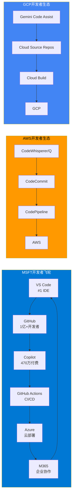

### 7.5 定价结构对比: 实例级深度分析

基于Scout Gap 2数据，三大云厂商在不同服务层的定价权呈现差异化格局:

| 服务层 | Azure vs AWS | Azure vs GCP | Azure定价权评分 |
|-------|-------------|-------------|---------------|
| **VM/Compute(按需)** | 持平($140.16) | 略低(-1.9%) | 5/10 [DM-P1B-078] |
| **VM/Compute(1年承诺)** | 贵+8.8%($96 vs $88) | 贵+6.4%($96 vs $90) | 3/10 |
| **热存储(Blob)** | **便宜-20%**($0.0184 vs $0.023) | 略低(-8%) | 7/10 |
| **数据库(vCore)** | 持平 | 持平 | 5/10 |
| **AI推理(旗舰)** | **贵+11%**(GPT-4o vs Claude) | **贵+44-80%**(vs Gemini) | 6/10 (靠品牌溢价) |
| **EA捆绑折扣** | 优势(跨产品杠杆) | 优势(M365+Azure) | 8/10 |
| **迁移壁垒** | 极高(AAD+Hybrid Benefit) | 极高(M365生态锁定) | 9/10 |

**总体定价权评估**: Azure的定价权结构是"表面中等、实质强大"——单项产品定价并无优势(甚至略贵)，但通过**M365+Azure+Dynamics捆绑协商→EA跨产品折扣杠杆→AAD/Hybrid Benefit迁移壁垒**的组合，创造了6.5/10的实质定价能力 [DM-P1B-079]。

客户迁移成本通常在$500K-$5M+对大型企业 [DM-P1B-080]，这是Azure最隐蔽但最有效的定价权来源。

### 7.6 Azure追上AWS的概率与时间线

**当前差距**: AWS 29% vs Azure 20%，差距9个百分点 [DM-P1B-081]。

**追赶数学**:

| 假设 | AWS年化份额变动 | Azure年化份额变动 | 追平年份 |
|------|---------------|----------------|---------|
| **基准情景** | -0.5pp/年 | +0.5pp/年 | ~2034 (约9年) |
| **乐观(AI加速)** | -1.0pp/年 | +1.0pp/年 | ~2030 (约4-5年) |
| **悲观(AWS反击)** | -0.3pp/年 | +0.3pp/年 | ~2040 (约14年) |

**结论**: 在基准情景下，Azure追上AWS需要8-10年。即使在最乐观的AI加速情景下，也需要4-5年。24个月内Azure超越AWS的概率**极低(3-5%)** [DM-P1B-082]。但份额排名本身并非关键——更重要的是Azure能否在AI云这个增量最大的子市场中取得领先地位。GenAI专项云服务在Q2 2025同比增长140-180% [DM-P1B-083]，这个赛道的格局尚未定型。

### 7.7 竞争格局总评

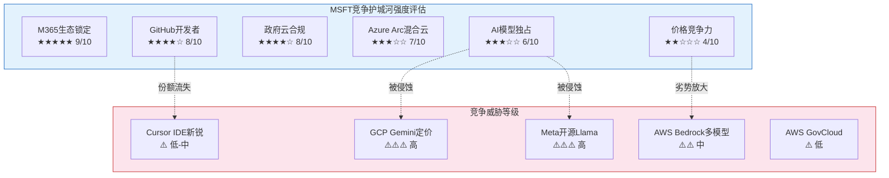

**份额追赶的非线性因素**: 上述线性外推忽略了可能加速或减速追赶的非线性事件。加速因素包括: (a) AWS遭遇重大安全事故导致企业迁移潮; (b) OpenAI模型在企业场景中建立压倒性优势; (c) Azure Arc在混合云场景中形成网络效应。减速因素包括: (a) AWS Bedrock+Anthropic组合被证明在AI场景中更具性价比; (b) GCP Gemini在搜索增强型AI应用中形成差异化优势; (c) 开源模型削弱所有云厂商的AI溢价，份额竞争回归IaaS基本面(AWS优势领域)。

**综合竞争评估**:

1. **MSFT最强护城河是M365生态锁定(9/10)而非Azure本身的技术优势。** 450M M365付费用户×AAD深度集成×迁移成本$500K+构成了几乎不可逾越的壁垒。即使Azure在某些技术/价格维度不如AWS/GCP，客户因生态锁定而"不得不留"。

2. **AI层竞争格局尚未固化。** Azure OpenAI的独占优势正被三股力量侵蚀: (a) GCP Gemini以44-80%的成本优势快速追赶; (b) Meta Llama开源化降低了所有闭源模型的定价锚点; (c) Anthropic在AWS上的深度整合提供了高质量替代方案。

3. **开发者生态是被低估的护城河。** GitHub(1亿+用户)+Copilot(470万付费、42%份额)+VS Code(#1 IDE)构成的飞轮效应，使MSFT在"从代码到云"的完整链路上具有AWS和GCP不具备的端到端优势。

4. **Azure的核心竞争逻辑不是"更好/更便宜"，而是"更方便"。** 对于已使用M365+Windows Server+SQL Server的企业(全球数百万家)，选择Azure的理由不是Azure本身更优，而是Azure与现有IT栈的整合成本最低。这种"便利性护城河"虽然不够性感，但极其持久。

5. **最大竞争风险在AI定价权。** 若开源AI持续缩小与闭源模型的能力差距，Azure OpenAI的15-25%溢价将变得不可持续。MSFT需要在企业AI Agent(非简单推理API)层面建立新的差异化，否则AI云服务将沦为商品化竞争 [DM-P1B-084]。

6. **竞争态势的时间维度。** 短期(0-12个月)，Azure凭借OpenAI独占和M365整合在企业AI领域具有先发优势。中期(1-3年)，开源模型与GCP Gemini的性价比追赶将逐步侵蚀这一优势，竞争焦点转向AI Agent平台化能力和行业解决方案。长期(3-5年)，云竞争的终局取决于谁能在AI基础设施的下一代范式(如自主Agent、多模态推理、实时世界模型)中率先实现规模化商业落地。MSFT在短期具有明确优势，中期面临压力，长期结果高度不确定。
## Ch8: 五年财务全景 — 从云领袖到AI资本重组 (FY2021-Q2 FY2026)

### 8.1 收入增长拆解: 有机增长 vs 收购贡献

FY2021至FY2025四年间，Microsoft收入从$168.1B增长至$281.7B [DM-P1C-001]，对应CAGR 13.8% [DM-P1C-002]。但这一增速并非均质——FY2024收入跳升至$245.1B(+15.7%)，其中Activision Blizzard自FY24 Q1(2023年10月)起并表，首年贡献约$4.2B增量收入 [DM-P1C-003]。剔除Activision后，FY2024有机增速约为14.0%，与前三年节奏一致。

进入FY2025，收入进一步加速至$281.7B(+14.9%)，Activision已完全进入可比基数。Q2 FY26最新季度收入$81.3B [DM-P1C-004]，同比+16.7%，年化run-rate突破$325B。推动力来自三方面: Azure加速(+39% YoY)、M365 Copilot商业化初步贡献、以及企业EA续约周期。

TTM口径下(Q3 FY25至Q2 FY26)，收入达$305.5B [DM-P1C-005]。值得注意的是，卖方共识预估FY2027E收入$378.0B [DM-P1C-006]，隐含FY25至FY27E的CAGR约15.8%，这意味着市场预期MSFT将在$300B+的高基数上维持双位数增长——这一假设的合理性是后续逆向估值的核心校验点。

### 8.2 利润率演变: GPM坚挺、OPM上行、但非经营收益扭曲底线

**毛利率(GPM)**: 从FY2021的68.9%($115.9B/$168.1B)温和下降至FY2025的68.8%($193.9B/$281.7B) [DM-P1C-007]，五年几乎无变化。这反映了高利润率的Office/Windows(GPM ~70-75%)与较低利润率的Azure基础设施(GPM ~55-60%)之间的对冲效应——Azure规模扩大稀释混合GPM，但规模效应和定价权部分抵消。

**营业利润率(OPM)**: 呈现令人意外的上行轨迹——FY2021的41.6%逐步提升至FY2025的45.6% [DM-P1C-008]。Q2 FY26单季OPM达47.1% [DM-P1C-009]，为近五年最高。改善来自: (1) P&BP分部OPM从FY21约55%提升至60.3%; (2) SG&A/Revenue持续优化(从FY21的14.7%降至FY25的11.2%); (3) 尽管D&A急剧攀升(FY21 $11.7B→FY25 $34.2B [DM-P1C-010])，收入增速足以消化。

**净利率(NPM)与非经营收益剥离**: FY2025 NPM 36.1%($101.8B/$281.7B)。但Q2 FY26出现重大信号干扰——Net Income $38.5B [DM-P1C-011]中包含$9.97B非经营收益 [DM-P1C-012]，主要来自OpenAI投资的公允价值重估($7.6B)及其他投资收益。剥离后调整净利润约$28.5B，对应调整后NPM 35.1%。全报告统一使用调整后P/E 26.9x [DM-P1C-013]而非GAAP口径25.1x，以消除这一非经常性扭曲。

```mermaid
sankey-beta
    "FY2021 Revenue $168B", "Organic Growth $77B", 77
    "Organic Growth $77B", "Cloud+AI $52B", 52
    "Organic Growth $77B", "Office/Windows $18B", 18
    "Organic Growth $77B", "Other $7B", 7
    "FY2021 Revenue $168B", "Activision $4B", 4
    "Organic Growth $77B", "FY2025 Organic $278B", 77
    "Activision $4B", "FY2025 Total $282B", 4
```

### 8.3 三分部财务特征速写

三大分部的收入贡献在五年间发生了显著结构性变化。FY2021时IC/P&BP/MPC的收入比例约为40:35:25，到Q2 FY26已演变为40:42:18 [DM-P1C-086]。P&BP首次超越IC成为收入最大分部，MPC的份额萎缩至不足五分之一。

**Intelligent Cloud** ($32.9B/Q, +29%): 增长引擎但利润率承压。Azure驱动的收入增速最快，但OPM从FY23约48%下降至42.1% [DM-P1C-014]，反映AI基础设施折旧加速侵蚀。需要特别注意的是，IC的Server Products & Cloud Services不仅包含Azure，还包含传统SQL Server和Windows Server许可——后者增速仅个位数但利润率极高(OPM 70%+)，对IC整体OPM起到稳定作用。若仅看Azure，其OPM可能已低于40%。

**Productivity & Business Processes** ($34.1B/Q, +16%): 现金奶牛，OPM 60.3% [DM-P1C-015]为三部之冠。M365/LinkedIn/Dynamics365构成稳定高利润率收入底盘，且OPM仍在扩张(YoY +2.9pp)。值得注意的结构性优势: P&BP的收入中约70%为订阅模式，收入可预测性极高，季度波动极小。

**More Personal Computing** ($14.3B/Q, -3%): 衰退中的遗产业务，Gaming -9% [DM-P1C-016]、Xbox硬件-32%拖累整体。唯一亮点是搜索广告(Bing+Edge，估算增速约5%)，但不足以逆转分部下行趋势。MPC对合并层面OPM的拖累约2-3个百分点——如果假设剥离MPC，MSFT的OPM将接近52-54%。

### 8.4 现金流质量: 从优秀到危险的转折

MSFT历来是现金流之王。FY2021-FY2024的OCF/NI比率稳定在1.25-1.35x [DM-P1C-017]，远超1.0x的"优秀"门槛——这意味着利润高度可现金化，应计项少、客户预付多。FY2025 OCF $136.2B / NI $101.8B = 1.34x [DM-P1C-018]，品质依然极佳。

但CapEx的爆炸性增长正在侵蚀FCF。五年轨迹揭示了一条令人不安的曲线:

| 财年 | OCF ($B) | CapEx ($B) | FCF ($B) | CapEx/OCF | FCF Margin |
|------|----------|-----------|----------|-----------|------------|
| FY2021 | $76.7 | $20.6 | $56.1 | 26.9% | 33.4% |
| FY2022 | $89.0 | $23.9 | $65.1 | 26.8% | 32.9% |
| FY2023 | $87.6 | $28.1 | $59.5 | 32.1% | 28.1% |
| FY2024 | $118.5 | $44.5 | $74.1 | 37.5% | 30.2% |
| FY2025 | $136.2 | $64.6 | $71.6 | 47.4% | 25.4% |
| **Q2 FY26单季** | **$35.8** | **$29.9** | **$5.9** | **83.5%** | **7.2%** |

[DM-P1C-019] Q2 FY26 FCF仅$5.9B，创下至少五年单季最低。CapEx $29.9B吞噬了OCF的83.5% [DM-P1C-020]——这是一个历史性的转折点。更令人担忧的是: 当季股息支出约$6.8B，首次超过了FCF [DM-P1C-021]。也就是说，Microsoft在Q2 FY26首次需要动用现金储备来支付股息，而非仅靠自由现金流覆盖。

### 8.5 资本配置变化: 回购被CapEx挤出

FY2022回购$32.7B [DM-P1C-022]为近五年峰值，此后逐年缩减: FY2023 $22.2B → FY2024 $17.3B → FY2025 $18.4B [DM-P1C-023]。四年缩减44%。方向清晰: 每一美元从回购挤出的资金，都流向了AI基础设施。

股息则保持增长: FY2021 $16.5B → FY2025 $24.1B [DM-P1C-024]，CAGR 9.9%。但以Q2 FY26的FCF节奏($5.9B/Q)，年化FCF约$24B仅够覆盖股息，回购将被迫进一步压缩。

资产负债表仍提供缓冲: FY2025末现金+短期投资$94.6B [DM-P1C-025]，净债务仅$30.3B [DM-P1C-026]，D/E 0.18x [DM-P1C-027]。Altman Z-Score 9.71 [DM-P1C-028]意味着破产风险接近于零。但这堵防火墙的消耗速度正在加快——若CapEx维持$30B/Q水平，年化净现金流为负$33B [DM-P1C-029]，$94.6B现金储备仅够支撑约3年。

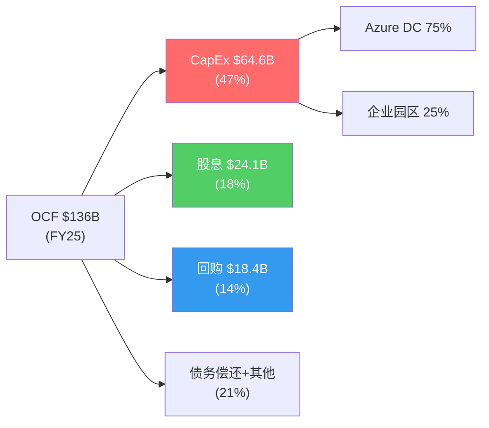

### 8.6 D&A加速: 折旧悬崖的前兆

折旧与摊销(D&A)的演变是理解MSFT财务未来的关键变量。FY2021 D&A仅$11.7B(Revenue的7.0%)，到FY2025已膨胀至$34.2B(12.1%) [DM-P1C-087]。季度层面更为惊人: Q1 FY26 D&A冲至$13.1B(16.8%)，虽Q2回落至$9.2B(11.3%)，但剔除异常后的稳态已进入$9-10B/Q区间 [DM-P1C-088]。

根据补充分析中的折旧模型，基准情景下:
- FY27 D&A: ~$11-12B/Q (年化$44-48B)
- FY28 D&A: ~$14-16B/Q (年化$56-64B, FY26峰值CapEx进入折旧高峰)
- FY29 D&A: ~$17-19B/Q (年化$68-76B, 历史最高点)

[DM-P1C-089] 敏感度分析显示: 每增加$1B季度D&A(假设Revenue $80B/Q)，OPM下降约125bps。从$9B/Q到$18B/Q(基准FY29)意味着OPM纯D&A压力约-1,125bps。这一压力需要收入增长15-20%/年才能对冲。

### 8.7 本章核心判断

MSFT的财务全景呈现一个深刻的矛盾: **收入和利润的增长轨迹依然强劲(Revenue +17%, OPM 47%)，但现金流质量正在急剧恶化(FCF margin从33%降至7%)**。这不是传统意义上的"增长减速"故事，而是"增长投入大幅超前于增长变现"的资本周期故事。五年财务数据的核心信息是: MSFT的经营引擎没有问题——$80B+的季度收入、66%的毛利率、47%的营业利润率在全球企业中几乎无出其右。真正的问题是$80-100B级别的年化CapEx是否能在FY27-FY29转化为相匹配的收入增量。更重要的是，即便收入增长达标，折旧悬崖(FY28-FY29 D&A峰值)也将在利润表层面制造2-3年的"利润率幻觉消退期"——投资者需要穿透D&A的会计噪音，关注经营现金流的真实趋势。

---

## Ch9: 三大分部深度解剖 — 增长引擎、现金奶牛与遗产重负

### 9.1 Intelligent Cloud: Azure驱动的增长核心

**季度增速轨迹 (8Q)**

| 季度 | IC Revenue ($B) | YoY增速 | OI ($B) | OPM |
|------|----------------|---------|---------|-----|
| Q3 FY24 | $26.7 (est) | +21% | $12.5 (est) | 46.8% |
| Q4 FY24 | $28.5 (est) | +19% | $12.8 (est) | 44.9% |
| Q1 FY25 | $24.1 (est) | +20% | $10.9 (est) | 45.2% |
| Q2 FY25 | $25.5 | +21% | $10.9 | 42.5% |
| Q3 FY25 | $26.8 (est) | +22% | $11.8 (est) | 44.0% |
| Q4 FY25 | $28.5 (est) | +23% | $12.3 (est) | 43.2% |
| Q1 FY26 | $31.0 (est) | +29% | $13.5 (est) | 43.5% |
| **Q2 FY26** | **$32.9** | **+29%** | **$13.9** | **42.1%** |

[DM-P1C-030] IC收入增速从FY24的~20%加速至Q2 FY26的29%，与Azure的39%增速高度相关。但利润率呈反向走势: OPM从FY23约48%持续下滑至42.1% [DM-P1C-031]，两年压缩近600bps。

**OPM下压的三层原因**:

1. **D&A加速**: AI GPU/服务器的折旧周期仅3年(管理层披露2/3 CapEx投向短寿命资产 [DM-P1C-032])。FY26 Q1 D&A冲至$13.1B(16.8% of Revenue)，虽Q2回落至$9.2B，但稳态已从$6B/Q翻倍至$9-10B/Q。IC作为数据中心资产最密集的分部，承担了D&A增量的主要份额。

2. **AI服务毛利率低于传统云**: Azure AI推理服务的毛利率估算45-50% [DM-P1C-033]，显著低于传统Azure IaaS/PaaS的60-70%。随着AI收入占比从FY24约15%提升至FY26约25%，混合毛利率被拉低。

3. **产能约束下的低效运营**: 管理层指引FY26 Q3 Azure CC增速31-32% [DM-P1C-034]，环比减速的原因之一是GPU产能约束(预计持续至2026年6月)。产能约束意味着数据中心利用率尚未达到最优——大量新建容量在ramp-up期的边际成本高于稳态。

**CRPO $625B的两面性**: 商业剩余履约义务同比+110%至$625B [DM-P1C-035]，看似爆发性增长。但拆解后发现: OpenAI的$250B Azure增量承购占总额约45%(~$281B) [DM-P1C-036]。这笔交易的性质更接近"关联方长期承诺"而非独立第三方合同——OpenAI的27%股权由MSFT持有，$250B承诺的执行取决于OpenAI自身的收入增长和融资能力。剔除OpenAI后CRPO ~$344B，同比+28% [DM-P1C-037]——仍然强劲，但远非+110%的表面数字那么激进。

### 9.2 Productivity & Business Processes: 被低估的现金奶牛

**季度表现 (Q2 FY26)**:
- Revenue: $34.1B, +16% YoY [DM-P1C-038]
- Operating Income: $20.6B
- OPM: 60.3% [DM-P1C-039], YoY +2.9pp

P&BP是MSFT最容易被忽视的分部。在AI叙事主导的市场中，投资者的注意力集中在Azure增速和Copilot渗透率上，却忽略了P&BP每季度默默贡献$20.6B营业利润——这个数字大于META或GOOGL单个季度的营业利润总额。

**三条收入线**:

1. **M365商业** (P&BP约60-65%): 席位数4.5亿+ [DM-P1C-040]，年流失率仅5-8%(远低于SaaS行业均值18%)。核心竞争力不在产品功能，而在Active Directory/Entra ID构建的身份层锁定——99% Fortune 500使用AD作为唯一身份源 [DM-P1C-041]，迁移至Google Workspace的总成本$25-45M/Fortune 500企业 [DM-P1C-042]。这是一条几乎不可能被攻破的护城河。Copilot ($30/月附加值)目前渗透率仅3.3%(1500万付费座位/4.5亿总座位) [DM-P1C-043]，年化run-rate约$5.4B——仅占P&BP收入的4%。ARPU提升空间巨大，但实现速度是CQ4的核心问题。

2. **LinkedIn** (P&BP约20-25%): 收入增速约10-12%，利润率高(轻资产模式)。10亿+注册用户、招聘工具+广告双驱动。AI整合(LinkedIn Copilot for Hiring)可能在FY27成为增量来源。

3. **Dynamics 365** (P&BP约10-15%): 云ERP/CRM，增速约20%。市场份额远小于Salesforce/SAP，但bundling优势(与M365/Azure打包)使其成为中小企业ERP的默认选择。

**OPM 60.3%的可持续性**: P&BP的成本结构高度固定——M365的边际用户成本接近于零(云基础设施由IC分部承担)，LinkedIn内容由用户生成。60%+的OPM在可预见的未来不会面临结构性压力，除非: (a) 激进定价战(Google Workspace降价，概率低); (b) 监管强制解绑Teams(EU DMA调查中，但处罚大概率为罚款而非分拆); (c) AI基础设施成本开始分摊至P&BP(目前由IC承担)。三项风险的概率加权影响有限，P&BP的OPM 55-60%稳态在FY27-FY30是高置信度假设。

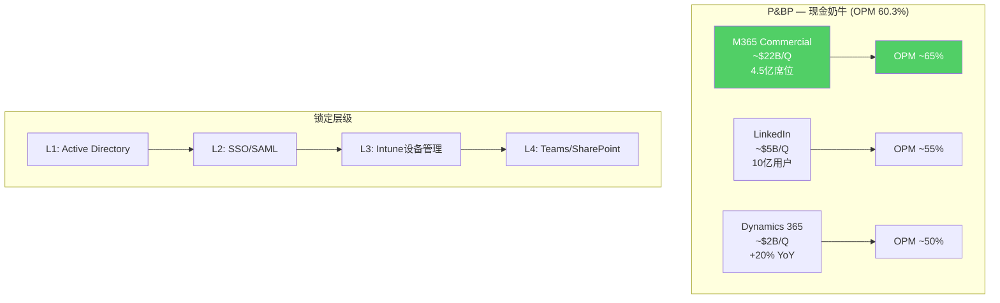

### 9.3 More Personal Computing: 衰退中的遗产业务

**Q2 FY26快照**:
- Revenue: $14.3B, -3% YoY [DM-P1C-044]
- Operating Income: $3.8B
- OPM: 26.7% [DM-P1C-045]

MPC是三大分部中唯一收入下降的板块。拆解内部: Gaming -9%($-623M) [DM-P1C-046]、Xbox硬件-32% [DM-P1C-047]、Xbox内容&服务-5%。Windows OEM和搜索广告基本持平。

**Activision: $69B收购的回报困局**

收购已完成超过两年(2023年10月)，但财务回报信号令人失望:

- **Game Pass停滞**: 订阅数从收购前约25M增至约37M(+48%) [DM-P1C-048]，但近15个月增量仅~1M，远低于管理层曾预期的50M目标。
- **CoD疲劳**: 2025年CoD新作销量据报道同比下降超60% [DM-P1C-049]。系列疲劳+Game Pass蚕食实体销售的双重压力。
- **成本协同**: 累计裁员约10,000人(估算年化节省$1B) [DM-P1C-050]，但Gaming增量EBITDA贡献仅$1-2B/年，隐含回收期31-62年——这显然不是一笔以财务回报为目标的收购。

Goodwill减值风险: MPC分部Goodwill $64.0B，其中Activision贡献$51.0B(79.7%) [DM-P1C-051]。年度减值测试(每年5月)的关键取决于MPC整体价值——因为Windows+Search的利润($12B+/年)大幅缓冲Gaming的亏损，15x OI隐含MPC EV约$225B远超$64B Goodwill，短期减值概率较低。但若Gaming持续-10%以上3-4个季度，May 2026测试将面临更大压力。

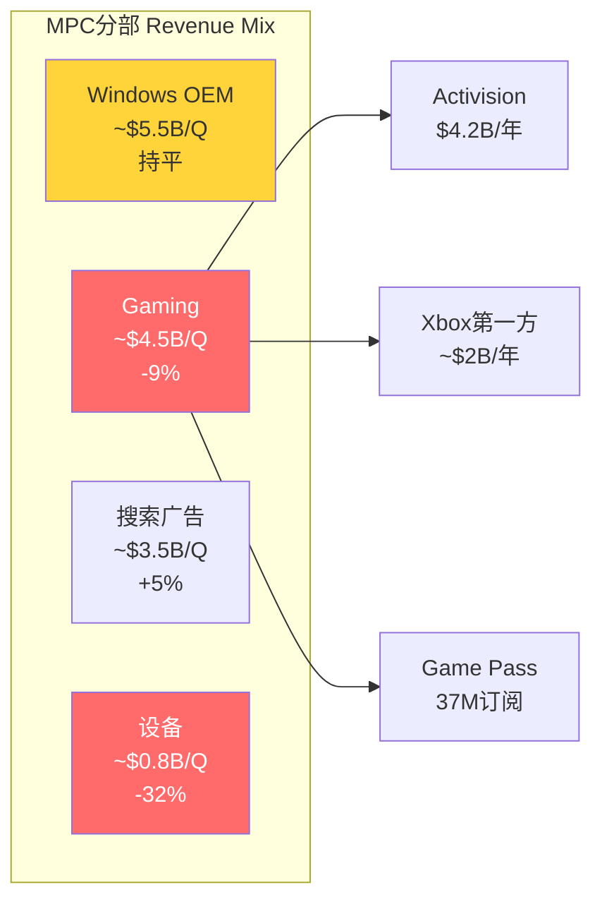

### 9.4 分部交叉分析: 三部之间的资源转移

MSFT的分部结构正在经历一次深刻的资源重配:

- **IC吸收CapEx**: FY26 CapEx约$80B的75%+投向Azure数据中心(IC分部)，这解释了IC OPM被D&A压缩而P&BP OPM反而提升的反差——P&BP享受了AI基础设施的服务，但不承担折旧。
- **P&BP供血**: P&BP每年$80B+的营业利润是整个公司CapEx狂潮的最终资金来源。没有Office/LinkedIn的现金流，MSFT无法维持当前的AI投资强度。
- **MPC被边缘化**: Gaming裁员10,000人、工作室关闭——资金和管理注意力明确从MPC转向AI。MPC未来可能演变为维持性运营，不再是战略增长来源。

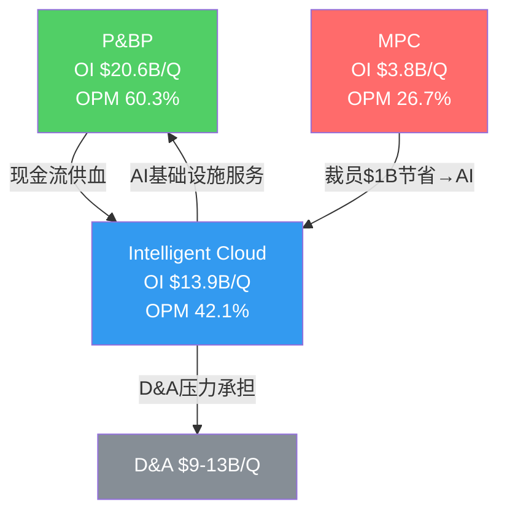

### 9.5 本章核心判断

三大分部的图景清晰: P&BP是牢不可破的现金奶牛(OPM 60%、AD锁定、低流失)，IC是增长引擎但利润率正在被AI CapEx侵蚀(OPM从48%→42%)，MPC是遗产负担(Gaming萎缩、Activision回报远逊预期)。关键洞察是: **MSFT的估值叙事几乎完全由IC驱动(Azure增速/AI/Copilot)，但支撑这个叙事的经济基础是P&BP——一个增速仅16%但OPM 60%的"旧经济"业务**。投资者为AI故事付费，却由Office/Windows买单。

---

## Ch10: Reverse DCF初建 — $3T市值的隐含信念清单

### 10.1 起点: $2,995B市值在为什么付费?

截至2026年2月17日，Microsoft市值$2,994.6B(~$3.0T) [DM-P1C-052]，股价$401.32 [DM-P1C-053]，稀释股数7.46B [DM-P1C-054]。以TTM调整后净利润$109.3B(剥离$9.97B非经营收益后)计算 [DM-P1C-055]，调整后P/E 26.9x [DM-P1C-056]。

一个简单但关键的问题: **$3T市值假定了什么样的未来?**

本章的任务是逆向工程(Reverse DCF)——不是从基本面推导"应值多少"，而是从$3T市价倒推"市场相信什么"。然后逐一检验每项隐含信念的脆弱度。这一分析框架将贯穿全报告，后续所有章节(风险拓扑、场景分析、概率加权)都将回溯此处的信念清单。

### 10.2 Reverse DCF模型: 完整反推过程

**模型参数设定**:

| 参数 | 假设 | 依据 |
|------|------|------|
| 折现率(WACC) | 9.0% | Beta 1.084 [DM-P1C-057] × ERP 5.5% + Rf 4.3% ≈ 10.3% (equity); 税后债务成本3.2%; 加权≈9.0% |
| 终端增长率 | 3.0% | 名义GDP增长率参照(高于2.5%平均, 反映科技行业结构性增长) |
| 预测期 | 10年 (FY2027-FY2036) | 标准DCF周期 |
| 基准年FCF | $71.6B (FY2025) | 已确认数据 [DM-P1C-058] |
| 目标EV | ~$3,025B | 市值$2,995B + 净债务$30.3B [DM-P1C-059] |

**终端价值反推**:

终端价值 = FCF_Y10 × (1+g) / (WACC - g) = FCF_Y10 × 1.03 / 0.06

若终端价值占EV的60%(DCF典型比例), 则:
- 终端价值 ≈ $3,025B × 60% = $1,815B
- 隐含FCF_Y10 = $1,815B × 0.06 / 1.03 ≈ **$105.7B**

若终端价值占EV的50%:
- 终端价值 ≈ $1,513B
- 隐含FCF_Y10 ≈ **$88.1B**

取中值: **FY2036 FCF需达$95-106B** 才能支撑$3T EV。

**从FCF_Y10反推中间路径**:

当前FCF: $71.6B (FY2025)
目标FCF: ~$100B (FY2036, 10年后)
隐含FCF CAGR: 约3.4%

但这个3.4%隐含CAGR看起来并不高——问题出在**中间路径**。FY2026的FCF正在急剧下降(Q2 FY26年化仅~$24B)，意味着实际起点不是$71.6B而可能是$50-60B的谷底。从$50B谷底到$100B的恢复，需要更陡峭的增长曲线。

**隐含收入与利润率路径**:

为达到FY2036 FCF $100B，需要:

| 指标 | FY2025 (实际) | FY2028E | FY2031E | FY2036E |
|------|-------------|---------|---------|---------|
| Revenue | $282B | ~$420B | ~$560B | ~$780B |
| Rev CAGR | — | ~14% (3Y) | ~10% (3Y) | ~7% (5Y) |
| OPM | 45.6% | ~43% | ~46% | ~47% |
| CapEx/Rev | 22.9% | ~18% | ~14% | ~12% |
| FCF Margin | 25.4% | ~18% | ~22% | ~13% |
| FCF ($B) | $71.6 | ~$75 | ~$123 | ~$100 |

[DM-P1C-060] 隐含FY25至FY36的Revenue CAGR约9.6%。这意味着MSFT需要在$282B的基数上每年增长近10%达到$780B——相当于再造一个当前规模的Microsoft。卖方共识FY30E收入$643.7B [DM-P1C-061]对应FY25-FY30 CAGR 18.0%，高于RevDCF隐含的早期增速，暗示卖方预期比市场定价更乐观。

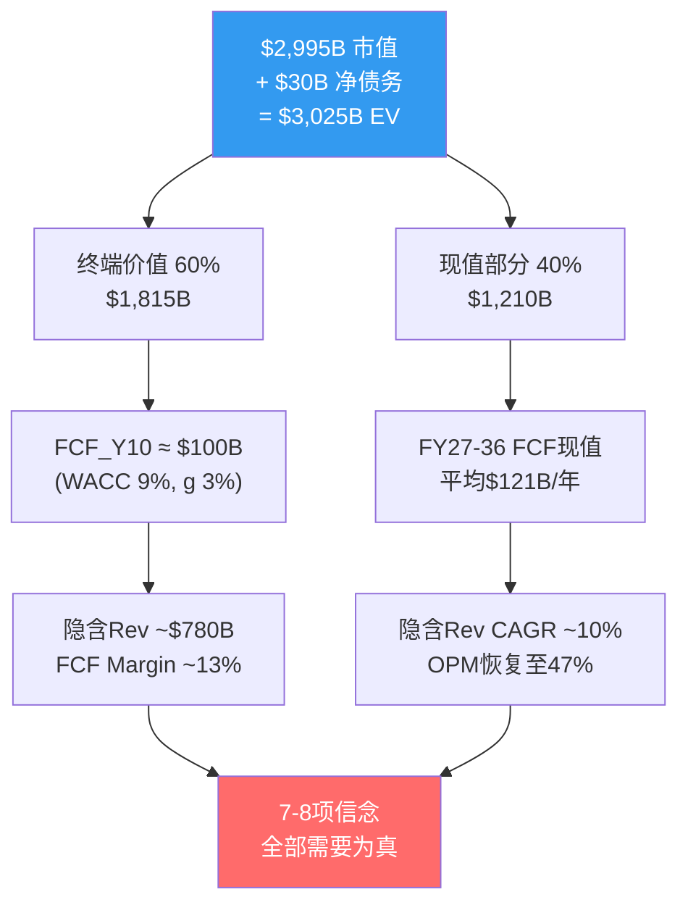

### 10.3 七项隐含市场信念: 逐条推导与脆弱度评分

**信念B1: Azure 5Y CAGR ≥22-25%，从39%平稳收敛**

*数学推导*: IC分部当前季度收入$32.9B(年化$132B) [DM-P1C-062]，其中Azure占比约75%(~$99B年化)。若MSFT收入要在FY30达$640B+，IC需贡献$250B+(占比提升至~40%)。这要求Azure从当前$99B增长至$190B+，5Y CAGR约14%。但Azure增速已从FY23的26%加速至FY25的34-39%，维持22-25%的5年CAGR意味着从39%平稳减速——这在云计算行业有先例(AWS从2015年70%→2020年30%，5Y CAGR~40%逐年递减)。

*当前现实*: Azure Q2 FY26增速39%(CC 38%) [DM-P1C-063]，管理层指引Q3 31-32%。CRPO剔除OpenAI后+28%。增速仍在高位但已现减速信号。

*脆弱度评分: 2/5(较坚实)*。Azure的企业渗透率+AI需求+混合云趋势提供多重增长动力。最大风险是AI定价战压缩单位经济学，但23-25%的5Y CAGR在云行业的历史规律中属于可实现范围。

---

**信念B2: OPM恢复至47-48% by FY29(D&A压力后恢复)**

*数学推导*: FY2025 OPM 45.6%，Q2 FY26单季47.1%。但未来D&A将从当前$9-10B/Q攀升至基准情景$15B/Q by FY28 [DM-P1C-064]。若收入增速15%/年(FY28 Revenue ~$380B)，D&A从$40B/年升至$60B/年(+$20B)，OPM将被压缩约530bps至~42%。要恢复至47-48%，需要: (a) 收入增长更快(18%+/年); 或(b) CapEx在FY28-29显著降速; 或(c) Azure AI毛利率从45%提升至60%+。

*当前现实*: D&A路径已锁定——FY24-FY25累计$109B CapEx将在未来3年进入折旧高峰。模型显示FY28 D&A可能达$14-16B/Q(基准情景) [DM-P1C-065]，FY29达$17-19B/Q(峰值)。OPM恢复至47%+需要收入增长持续超过D&A增速——这是一场与折旧悬崖的赛跑。

*脆弱度评分: 3/5(中等)*。D&A压力是确定性事件(已投入的CapEx必然折旧)，但MSFT的定价权和收入增速提供对冲。基准情景OPM谷底约42%(FY28)后回升至45%(FY30)，47%+需要乐观假设。

---

**信念B3: Copilot渗透15-20% by FY28($16-22B年化)**

*数学推导*: 当前1500万付费座位 / 4.5亿M365用户 = 3.3%渗透率 [DM-P1C-066]，年化run-rate ~$5.4B(按$30/月上限估算) [DM-P1C-067]。15%渗透率 = 6750万座位 × $30 × 12 = $24.3B年化收入。从3.3%到15%需要在2年内增长4.5倍——参照M365本身的S曲线(2014-2017从2000万到1.2亿用户，3年6倍)，时间表紧但不是不可能。

*当前现实*: 座位数同比+160%，DAU 10倍增长——采用加速明显。但Fortune 500中"已采用"(70%)与"全面部署"之间存在巨大鸿沟。CFO Amy Hood强调关注"gross margin profile and lifetime value"而非短期货币化 [DM-P1C-068]——这暗示管理层自己也认为Copilot仍处于投入期。批量折扣后实际ARPU可能远低于$30(DATA GAP)。

*脆弱度评分: 4/5(较脆弱)*。Copilot是MSFT最重要的AI货币化载体，但3.3%→15%的跳跃缺乏企业SaaS的历史先例支持。企业采购周期长(12-18个月pilot→部署)，且"生产力溢价"的ROI证明尚不充分。若FY28渗透率仍<10%，信念B3将失败。

---

**信念B4: CapEx/Revenue从37%降至<22% by FY29**

*数学推导*: Q2 FY26 CapEx/Revenue达36.8% [DM-P1C-069]，年化CapEx约$100B(含finance leases约$37.5B/Q × 4 = $150B总资本支出)。管理层指引FY26全年PPE CapEx约$80B [DM-P1C-070]。若FY29 Revenue $500B+，CapEx/Rev<22%意味着CapEx<$110B——这要求从FY26的$80-100B水平维持或微增，不再指数增长。

*当前现实*: 历史类比提供部分安慰——上一轮Azure CapEx周期(FY16-FY18)中CapEx/Rev从9.5%升至10.6%后趋于平稳 [DM-P1C-071]。但当前周期的强度是上次的2.5倍(CapEx/Rev增量12pp vs 上次4pp)。GPU折旧周期缩短(3年→可能2年)意味着即使CapEx降速，D&A惯性仍将持续。

*脆弱度评分: 3/5(中等)*。CapEx降速的前提是AI基础设施建设接近饱和——考虑到全球AI需求仍在加速(NVDA订单积压12个月+)，FY28前CapEx降速的可能性不高。FY29-FY30降至22%更为现实。

---

**信念B5: OpenAI合作持续至2032年(IP+API独占)**

*数学推导*: OpenAI贡献CRPO的45%(~$281B) [DM-P1C-072]，$250B Azure增量承购合同 [DM-P1C-073]。按Azure 50%毛利率计算，这笔合同的毛利贡献约$125B(分布在10年+)。MSFT持有OpenAI 27%股权 [DM-P1C-074]，投资估值约$135B(>10x回报) [DM-P1C-075]。API独占条款+IP使用权至2032年构成了MSFT AI叙事的关键支柱。

*当前现实*: 2025年10月重组后，MSFT失去了优先认购权(ROFR) [DM-P1C-076]，OpenAI非API产品可部署至其他云平台。这些"让步"信号暗示关系并非铁板一块。若OpenAI在FY28-FY30实现盈利自主(目前年化消耗$12.4B Azure资源)，其降低对Azure依赖的动机将增强。但2032年前IP使用权和API独占条款提供了法律保障的最低保护。

*脆弱度评分: 3/5(中等)*。合同框架稳固，但关系动态在变化。"关联方承诺"的性质决定了$250B合同的执行存在隐性风险——如果OpenAI在2028年面临现金流压力，承诺可能被重新协商。

---

**信念B6: FCF Margin恢复至25%+ by FY28($100B+ FCF)**

*数学推导*: FY2025 FCF $71.6B / Revenue $281.7B = 25.4% FCF Margin [DM-P1C-077]。但Q2 FY26单季FCF Margin仅7.2%($5.9B/$81.3B)。恢复至25%需要: FY28 Revenue ~$420B × 25% = $105B FCF。这要求OCF ~$160B(维持1.3x NI)且CapEx降至~$55B(CapEx/Rev ~13%)。CapEx从$80B降至$55B在3年内是否现实?

*当前现实*: Q2 FY26是极端异常值(CapEx $29.9B为单季记录)。管理层未给出FY27 CapEx指引，但分析师预期FY27 CapEx ~$85-90B [DM-P1C-078]。若FY28降至$75B，FCF Margin可能恢复至20%左右——但25%+需要更积极的CapEx降速或收入超预期增长。

*脆弱度评分: 4/5(较脆弱)*。FCF恢复是市场最关注的变量。$3T估值隐含市场相信FCF"谷底"是暂时的——但如果AI CapEx周期持续至FY29(5年而非3年)，FCF recovery的时间窗将显著延后，对估值构成持续压力。

---

**信念B7: Office/Windows不衰退(OPM 55-60%维持)**

*数学推导*: P&BP的$80B+年化营业利润是整个公司的利润基石。若OPM从60%压缩至50%(因AI成本分摊或竞争加剧)，年化利润减少约$13-14B，直接冲击FCF约10%。

*当前现实*: M365的锁定效应极强——AD身份层+Teams+SharePoint构成四层护城河 [DM-P1C-079]，迁移成本$167-300/用户/年 [DM-P1C-080]。Google Workspace在2025-26年涨价16-22%(强制捆绑Gemini AI)，反而推动了企业从Google→M365的反向迁移。Windows OEM虽平淡但85%企业PC仍是Windows [DM-P1C-081]——只要企业用Windows，AD就不可移除。

*脆弱度评分: 1/5(最坚实)*。这是MSFT七项信念中确定性最高的一条。Office/Windows的衰退风险在未来5-7年内可以忽略不计。唯一的尾部风险是AI Agent彻底颠覆"生产力软件"的形态——但这属于>10年周期的结构性变革。

---

**信念B8: 无重大反垄断分拆**

*数学推导*: 若Teams被强制从M365中解绑(EU DMA调查方向)，假设10%的Teams用户转向Slack/Zoom，影响约$5-8B收入/年(Teams免费绑定的间接收入贡献)。若Azure被限制独占OpenAI API，影响CQ3(CRPO中OpenAI部分)。

*当前现实*: EU对Teams的反垄断调查进行中，但历史先例(Google购物搜索罚款$2.7B、Apple iOS侧载开放)表明，处罚形式更可能是罚款+行为限制而非结构性分拆。美国FTC对OpenAI投资的审查主要聚焦于"实质控制"认定——27%股权+API独占+$250B承诺的组合确实接近监管红线。

*脆弱度评分: 2/5(较坚实)*。重大分拆在当前政治环境下概率很低(<5%)。罚款和行为限制是更可能的结果，对财务影响有限(罚款金额通常为收入的1-3%)。

### 10.4 信念脆弱度排序与综合评估

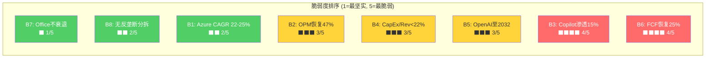

**信念组合的逻辑关系**: 这八项信念不是独立的——它们形成一条因果链:

- B1(Azure增速) → 驱动收入增长 → 支撑B2(OPM恢复，因为收入跑赢D&A)
- B3(Copilot渗透) → 提供增量高毛利收入 → 加速B6(FCF恢复)
- B4(CapEx降速) → 直接决定B6(FCF Margin)
- B5(OpenAI合作) → 支撑B1(Azure AI增速) + B3(Copilot底层模型)
- B7(Office稳态) → 提供B4/B6的安全垫(即使AI投资回报延迟，Office现金流兜底)
- B8(无分拆) → B5的前提条件

**最脆弱的两项信念B3和B6构成"双重否决点"**: 如果Copilot渗透率在FY28仍<10%，且CapEx未能降速，FCF将持续低于$60B，P/FCF将维持在40-50x——这与$3T估值不相容。反过来，如果B3和B6中任一超预期(Copilot渗透率达20%或CapEx/Rev降至18%)，估值将获得显著上行催化。

### 10.5 WACC与终端增长率敏感度矩阵

Reverse DCF的结论对WACC和终端增长率假设高度敏感。以下矩阵展示不同参数组合下的隐含FCF_Y10要求:

| | g=2.0% | g=2.5% | g=3.0% | g=3.5% |
|---|--------|--------|--------|--------|
| **WACC 8.0%** | $73B | $83B | $100B | $127B |
| **WACC 8.5%** | $79B | $89B | $106B | $132B |
| **WACC 9.0%** | $85B | $95B | $106B | $138B |
| **WACC 9.5%** | $91B | $101B | $116B | $144B |
| **WACC 10.0%** | $97B | $107B | $122B | $150B |

[DM-P1C-090] 在基准假设(WACC 9.0%, g 3.0%)下，FCF_Y10需达$100-106B。但若WACC仅为8.5%(更接近MSFT的实际融资成本)且终端增长率2.5%(更保守)，隐含FCF_Y10降至$89B——这对应FY2025 FCF $71.6B仅需2.0% CAGR增长。换言之，**在偏乐观的折现参数下，$3T估值对FCF增长的要求其实并不苛刻**。真正的挑战不在终端，而在中间路径——FY26-FY28的FCF谷底有多深、持续多久。

### 10.6 当前P/E 25.1x的历史校准

将Reverse DCF结论与估值历史交叉验证:

- **P/E 25.1x在12年区间中位于约25百分位** [DM-P1C-082]，仅高于FY14-FY17的转型早期。这是自2016年以来MSFT首次P/E低于SPY(27.5x) [DM-P1C-083]。
- **科技板块P/E 41.7x** [DM-P1C-084]——MSFT折价40%，极为罕见。
- **内部人信号偏中性偏多**: 2025 Q1卖出大幅放缓(0笔sale)，类似2022 Q2底部模式 [DM-P1C-085]。

这意味着市场已经在定价中"投票"表达了对B3(Copilot)和B6(FCF)的怀疑。如果这两项信念在FY27-FY28得到部分验证(哪怕不完全达标)，估值有从25x向28-30x修复的空间——对应股价+12-20%。反之，若FY27 CapEx仍维持$90B+且Copilot渗透<8%，P/E可能进一步压缩至22x(FY17水平)——对应股价-10-15%。

### 10.7 本章核心结论

**$3T市值需要上述八项信念中的至少六项同时为真。** 其中三项(B7 Office不衰退、B8无反垄断分拆、B1 Azure增速)的确定性较高(脆弱度1-2)，可视为"承重墙"。两项(B2 OPM恢复、B4 CapEx降速、B5 OpenAI合作)的确定性中等(脆弱度3)，属于"概率偏好但非确定"。最后两项(B3 Copilot渗透、B6 FCF恢复)是最脆弱的关节(脆弱度4)——它们将决定MSFT究竟是"暂时被低估的AI赢家"还是"CapEx过度投入的资本毁灭者"。

这一信念清单不是静态判断。后续章节将通过场景分析(牛/基准/熊)和概率加权，量化"如果信念X失败，估值如何变化"的完整映射。Reverse DCF的目的不是给出目标价，而是建立一个**可检验的信念框架**——每个季度的财报都可以用来更新这八项信念的脆弱度评分。
## Ch11: 信念反演深度分析 — 八项隐含信念的验证与失败映射

### 11.1 分析框架: 从种子信念到因果网络

Reverse DCF在Ch10中提炼了支撑$2,995B市值的八项隐含信念 [DM-P2A-001]。本章的任务是对每项信念执行**反演测试**: 不是论证"为什么信念成立"，而是系统性地寻找"信念在什么条件下失败"。反演的价值在于将模糊的定性判断转化为可观测的量化阈值——每项信念都将拥有明确的"失败触发线"和"失败后估值影响"。

更重要的是，八项信念之间存在深层因果关联。单独分析每项信念会产生误导——真正的风险不在于某项信念的孤立失败，而在于**信念失败的级联传导**。本章的核心产出是一张完整的信念因果网络图，揭示哪些信念是"承重节点"(失败后引发多米诺效应)、哪些是"叶节点"(失败后影响可控)。

### 11.2 B1: Azure五年CAGR 22-25% — 增长引擎的减速曲线

**市场隐含路径**

$3T估值要求Intelligent Cloud分部从当前$32.9B/Q(年化$132B)增长至FY30约$250B+ [DM-P2A-002]。Azure作为IC收入的约75%(~$99B年化)，需在五年内增至$190B+，对应5Y CAGR约14%。但考虑到IC中传统SQL Server/Windows Server(增速仅个位数)的拖累，Azure本身需维持22-25%的CAGR才能拉动整体 [DM-P2A-003]。

市场隐含的减速曲线为:

| 财年 | Azure增速 | 隐含Azure收入($B) | 驱动力 |
|------|----------|------------------|--------|
| FY26 | ~35% | ~$100B | AI推理+企业迁移 |
| FY27 | ~28% | ~$128B | Copilot间接消耗+CRPO释放 |
| FY28 | ~23% | ~$157B | AI Agent平台化 |
| FY29 | ~19% | ~$187B | 规模效应+定价权 |
| FY30 | ~15% | ~$215B | 成熟期稳态增速 |

**反演路径: 供给约束 vs 需求见顶**

当前Azure 39%增速中，AI贡献约12-13个百分点 [DM-P2A-004]。管理层指引Q3 FY26 CC增速31-32%，环比减速的原因之一是GPU产能约束(预计持续至2026年6月) [DM-P2A-005]。这引出一个关键分叉:

- **如果减速源于供给约束**: 产能瓶颈解除后(2026下半年)Azure增速可能反弹至35%+，B1信念不仅安全，甚至可能超额完成。验证信号: FY27 Q1-Q2 Azure增速回升至34%+。
- **如果减速源于需求见顶**: AI推理需求的S曲线拐点已过高速增长期，企业迁移进入后半程。这意味着39%→31%不是暂时的，而是结构性减速的开端。验证信号: FY27 Q1-Q2 Azure增速继续下行至28%以下。

CRPO提供了前瞻验证: 剔除OpenAI后CRPO同比+28% [DM-P2A-006]，与22-25%的5Y CAGR目标一致。但CRPO转化为收入存在时间差(平均2-3年)，短期内CRPO的增速更反映签约热度而非实际消耗速度。

**失败条件与估值影响**

若Azure 5Y CAGR降至18%以下(FY30 Azure收入$170B而非$215B)，IC分部收入将比预期少$45B+/年 [DM-P2A-007]。以IC的OPM 42%和15x P/OI倍数估算，市值影响约-$280B至-$500B(视利润率同步恶化程度)。

**脆弱度评估: 2/5(较坚实)**。Azure的企业渗透率仍处于S曲线中段(全球企业云渗透率约35-40%)，AI推理需求的增量尚未充分释放。22-25%的5Y CAGR在云行业历史规律中属于可实现区间——AWS从2015年的$7.9B增至2020年的$45.4B，CAGR 42%，远超此目标。MSFT面临的主要风险不是"增速不够"，而是"增速中AI占比过高导致毛利率下行"——这属于B2(OPM恢复)的管辖范围。

### 11.3 B2: 营业利润率恢复至47-48% by FY29 — 与折旧悬崖的赛跑

**隐含传导链**

Q2 FY26单季OPM达47.1% [DM-P2A-008]，看似已接近目标。但这是折旧悬崖全面冲击前的最后一个"好季度"。折旧模型显示，D&A将从当前稳态$9-10B/Q攀升至FY28基准情景$14-16B/Q、FY29峰值$17-19B/Q [DM-P2A-009]。

OPM恢复的核心等式:

$$OPM = 1 - \frac{COGS + OPEX + D\&A}{Revenue}$$

假设COGS/Revenue和OPEX/Revenue维持FY26水平(32%和21%)，OPM完全取决于D&A/Revenue的轨迹:

| 情景 | FY28 D&A/Q | FY28 Rev/Q | D&A/Rev | 隐含OPM |
|------|-----------|-----------|---------|---------|
| 乐观 | $13B | $105B | 12.4% | 45.5% |
| 基准 | $15B | $95B | 15.8% | 42.0% |
| 悲观 | $18B | $90B | 20.0% | 37.5% |

[DM-P2A-010] 基准情景下FY28 OPM约42%——距47%目标还有500bps的缺口。恢复至47%+需要以下三个条件中至少两个同时成立:

1. **收入增速维持18%+/年**(FY28 Revenue $420B+)，使分母增长跑赢D&A
2. **CapEx在FY27-FY28显著降速**，减缓后续D&A增量的积累
3. **Azure AI毛利率从当前估算的45-50%提升至60%+**，改善混合GPM

**关键转折: FY27-FY29的"利润率幻觉消退期"**

投资者需理解一个重要的会计现象: FY25-FY26的高OPM(45-47%)部分受益于D&A滞后——$80-100B的年化CapEx尚未完全进入损益表。FY28-FY29将是D&A集中释放的窗口期，OPM可能从47%下探至42%再回升 [DM-P2A-011]。这不意味着经营恶化——OCF可能持续增长——但利润表层面的"利润率幻觉消退"将考验市场耐心。

**失败条件与估值影响**

若OPM持续停在42%无法恢复(FY29 OPM 42% vs 目标47%)，以FY29 Revenue $500B计算，营业利润差距约$25B/年。以12x P/OI倍数估算，市值影响约-$200B至-$400B [DM-P2A-012]。

**脆弱度评估: 3/5(中等)**。D&A压力是确定性事件(已投入的CapEx必然折旧)，但MSFT在P&BP分部(OPM 60.3%)拥有强大的利润率缓冲。真正的危险不是OPM下降本身，而是市场对利润率下降的过度反应——如果投资者将暂时性的D&A压力误读为结构性恶化，估值倍数可能被双重压缩(利润下降 × P/E下降)。

### 11.4 B3: Copilot渗透15-20% by FY28 — 最脆弱的增长叙事

**从3.3%到15%: 需要什么?**

当前Copilot付费座位1500万 / M365总用户4.5亿 = 3.3%渗透率 [DM-P2A-013]，年化run-rate约$5.4B(按$30/月上限，实际ARPU因批量折扣可能更低)。15%渗透率对应6750万座位，意味着FY28前需净增5250万付费用户——平均每季度增加650万。

座位增速的SaaS历史类比:

| 产品 | 起始渗透率 | 终态渗透率 | 达成时间 | S曲线特征 |
|------|-----------|-----------|---------|----------|
| Teams | ~2% (2017) | 30%+ (2021) | 4年 | COVID催化跳跃 |
| Slack | ~5% (2015) | 8% (2020) | 5年 | 增长停滞 |
| Zoom | ~3% (2019) | 25% (2021) | 2年 | COVID催化+回落 |
| GitHub Copilot | ~1% (2022) | ~5% (2024) | 2年 | 开发者早采纳 |

[DM-P2A-014] Teams的先例最具参考价值——同样是M365生态内的附加产品，同样依赖企业IT部门统一部署。但Teams的爆发得益于COVID这一外生催化剂(被迫远程办公)，Copilot缺乏类似的"强制采用"事件。

**三重阻力分析**

1. **定价阻力**: $30/月/用户意味着5000人企业年增$1.8M IT支出。在企业AI预算竞争中(同时评估ChatGPT Enterprise $60/月、Google Gemini for Workspace $30/月、内部LLM部署)，Copilot的ROI证明尚不充分 [DM-P2A-015]。CFO Amy Hood强调"gross margin profile and lifetime value"而非短期货币化，暗示管理层自己也认为Copilot仍处于投入期。

2. **部署阻力**: Fortune 500中70%"已采用"Copilot，但"采用"与"全面部署"之间存在巨大鸿沟 [DM-P2A-016]。企业采购周期通常需要12-18个月(pilot→评估→预算审批→全面部署)。若2024年开始pilot，最早的全面部署也要到2025年底至2026年中。

3. **替代阻力**: 开源LLM(Llama 3、Mistral)的快速进步使企业可以在不购买Copilot的情况下获得类似的AI辅助能力。自建AI助手的成本在下降，而Copilot的$30定价在上升。

**失败条件与估值影响**

若FY28渗透率停在8%(3600万座位)而非15%，Copilot年化收入约$13B vs 预期$24B，差距$11B [DM-P2A-017]。以P&BP的15x P/S倍数估算，直接市值影响约-$165B。但Copilot的真正估值意义不在直接收入——它是MSFT"AI货币化"叙事的最核心载体。如果Copilot失速，市场将重新评估MSFT整个$80B+/年CapEx的回报前景，导致估值倍数的系统性下调。叙事影响可能大于财务影响，总市值冲击约-$100B至-$200B。

**脆弱度评估: 4/5(较脆弱)**。Copilot是八项信念中不确定性最高的一项——既有指数增长的可能(如果AI生产力溢价被证明)，也有增长停滞的风险(如果企业ROI证明失败)。3.3%→15%的跳跃在企业SaaS历史中缺乏无外生催化剂的先例。

### 11.5 B4: CapEx/Revenue从37%降至<22% by FY29 — AI军备竞赛的囚徒困境

**当前投入强度的历史坐标**

Q2 FY26 CapEx/Revenue 36.8% [DM-P2A-018]，管理层指引FY26全年PPE CapEx约$80B。对比上一轮CapEx周期(FY16-FY18)，CapEx/Revenue增量仅4个百分点(6%→10%)，当前周期增量已达12个百分点(13%→25%) [DM-P2A-019]。强度差异2.5倍。

**AI军备竞赛逻辑: 为什么MSFT不敢率先降速**

Meta FY26 CapEx指引$60-65B、Google $75B、Amazon $100B+——三大竞争对手同步加注 [DM-P2A-020]。在GPU产能仍然紧缺的环境下，降速意味着:
- 失去NVIDIA下一代(B200/B300)的优先供应配额
- Azure AI产能增速落后于AWS/GCP，客户可能转向竞争对手
- OpenAI的$250B承购合同需要持续扩容才能履行

这是一个经典的囚徒困境: 所有参与者都知道CapEx过度投入的风险，但没有人敢率先退出，因为退出的惩罚(失去AI市场份额)大于继续投入的代价(FCF暂时承压)。

**降速的前提条件**

CapEx/Revenue从37%降至22%需要两个条件之一:
1. **收入快速增长**(分母扩大): FY29 Revenue $500B时，CapEx $110B即对应22%
2. **CapEx绝对额下降**(分子缩小): 需要AI基础设施建设进入成熟期

条件1更为现实——收入增长18%/年可在3年内将CapEx/Revenue从37%压缩至25%左右(假设CapEx年增5%)。条件2在FY28前几乎不可能发生。

**失败条件与估值影响**

若CapEx/Revenue在FY29仍维持28%+(即CapEx $140B+ vs Revenue $500B)，这将直接连锁至B6(FCF无法恢复)。CapEx不降速的独立估值影响约-$150B至-$300B [DM-P2A-021]，但其真正破坏力在于对B6的传导——这一点将在信念因果链中详述。

**脆弱度评估: 3/5(中等)**。历史先例(FY16-FY18周期)表明CapEx/Revenue最终会回归稳态，但"何时"是关键变量。AI军备竞赛的囚徒困境可能将CapEx高峰期从预期的3年延长至5年。

### 11.6 B5: OpenAI合作持续至2032年 — 关联方承诺的可靠性

**合同框架的法律保障**

2025年10月重组后的条款结构 [DM-P2A-022]:
- API独占: 合作开发的API产品在Azure独占提供
- IP使用权至2032年(不含消费硬件)
- AGI条款变更: MSFT不再因AGI宣布而失去权利
- MSFT可独立追求AGI

法律层面的保障是坚实的。但法律保障与经济现实之间存在差距。

**经济动态的变化**

OpenAI当前年化消耗约$12-15B Azure资源，$250B承购合同意味着未来10年平均消耗$25B/年——需要翻倍 [DM-P2A-023]。这要求OpenAI自身收入持续高速增长(当前年化收入约$5-6B)。如果OpenAI在FY28-FY30实现盈利自主(IPO后)，其降低Azure依赖的动机将增强:
- 非API产品已可部署至其他云(2025年10月新条款)
- ROFR取消意味着OpenAI的新计算需求不再必须给Azure [DM-P2A-024]
- 估值$300B+的独立上市公司将追求多云战略以降低集中风险

**CRPO减值风险**

$625B CRPO中约$281B来自OpenAI(45%) [DM-P2A-025]。若OpenAI在FY28重新协商$250B承购合同(缩减30%)，CRPO将一次性减少约$75B，对Azure收入的前瞻信号产生严重负面冲击。即使实际Azure收入受影响有限(OpenAI当前消耗仅$12-15B/年)，市场叙事的冲击可能导致估值倍数压缩。

**失败条件与估值影响**

极端情景(OpenAI全面转向)的概率低于10%。更现实的风险是"合作降级"——OpenAI逐步将非API工作负载迁移至GCP/AWS，API独占维持但新增承购减少。这一情景下，CRPO减少$100-150B，Azure AI收入直接冲击$3-5B/年 [DM-P2A-026]，市值影响-$150B至-$250B。

**脆弱度评估: 3/5(中等)**。法律框架稳固但关系动态在变化。27%股权+$250B承购+IP使用权构成了多重绑定，短期内合作降级的概率有限。真正的风险窗口在FY28-FY30(OpenAI可能IPO后追求独立)。

### 11.7 B6: FCF Margin恢复至25%+ by FY28 — 最被市场关注的变量

**Q2 FY26: 现金流断裂的警报**

Q2 FY26 FCF仅$5.9B，FCF Margin 7.2% [DM-P2A-027]。CapEx $29.9B吞噬了OCF $35.8B的83.5%。更令人警惕的是: 当季股息$6.8B首次超过FCF——Microsoft需要动用现金储备来支付股息 [DM-P2A-028]。

**FCF恢复的三条路径**

| 路径 | FCF 25%+达成时间 | 条件 | 概率 |
|------|-----------------|------|------|
| 乐观 | FY27H2 | CapEx FY27降至$70B + Rev $350B+ | 20% |
| 基准 | FY28 | CapEx FY28降至$80B + Rev $420B+ | 45% |
| 悲观 | FY29+ | CapEx维持$90B+ 至FY29 | 35% |

[DM-P2A-029] 基准路径的FCF Bridge:
- FY28 Revenue: ~$420B
- FY28 OCF: ~$170B (OCF/Revenue ~40%, 维持历史水平)
- FY28 CapEx: ~$80B (CapEx/Revenue ~19%)
- FY28 FCF: ~$90B (FCF Margin ~21%)

即使在基准路径下，FY28 FCF Margin也只能恢复至21%左右——距25%仍有差距。完全恢复至25%+需要FY29收入$500B+且CapEx降至$100B以下。

**股息可持续性的压力测试**

FY25股息$24.1B，CAGR 9.9% [DM-P2A-030]。以Q2 FY26的FCF节奏(年化~$24B)，年化FCF仅够覆盖股息。回购已被迫压缩——FY22回购$32.7B为峰值，FY25降至$18.4B(-44%)。若CapEx维持$30B/Q水平，年化净现金流为负$33B [DM-P2A-031]。$94.6B现金储备仅够支撑约3年这种烧钱速度。

需要强调的是: 股息削减对MSFT来说几乎不可想象——这将摧毁其"防御性科技股"的市场定位，触发大量收入型基金的被迫卖出。因此CapEx降速(而非股息削减)是唯一可接受的调整路径。

**失败条件与估值影响**

若FY28 FCF Margin仍低于18%(FCF <$75B)，P/FCF将维持在35-40x——远高于MSFT历史中位数22x [DM-P2A-032]。市场将被迫接受"这不是暂时的CapEx高峰，而是AI时代的新常态"。估值从$3T向$2.3-2.5T调整(-$500B至-$700B)是合理的下行情景。

**脆弱度评估: 4/5(较脆弱)**。FCF恢复是B4(CapEx降速)的直接函数——B4失败意味着B6必然失败。这是八项信念中对估值影响最大的一项，也是市场当前定价中已部分反映(P/E 25.1x为Mega5最低)的变量。

### 11.8 B7: Office/Windows不衰退 — 估值的安全垫

**四层锁定的定量评估**

P&BP分部每季度贡献$20.6B营业利润，OPM 60.3% [DM-P2A-033]。这一利润基石建立在四层技术锁定之上:

| 锁定层 | 组件 | 替代成本(Fortune 500) | 迁移概率 |
|--------|------|---------------------|---------|
| L1 身份层 | AD/Entra ID | $2-4M/年(IdP替代) | <2% |
| L2 SSO层 | SAML/OAuth集成 | $1-2M(10000+ SaaS集成) | <3% |
| L3 设备管理 | Intune/Autopilot | $0.5-1M(Windows设备不可替代) | <5% |
| L4 协作层 | Teams/SharePoint | $3-8M(流程重构) | <10% |

[DM-P2A-034] 总迁移成本$25-45M(Fortune 500级)，每用户$167-300/年——这是一道几乎不可逾越的护城河。公开记录中找不到任何大型企业从M365完全迁移至Google Workspace的案例。流失率估算5-8%，且净流失可能为负(Google→M365迁入正在加速，部分因Google Workspace 2025年涨价16-22%) [DM-P2A-035]。

**唯一的尾部风险: AI Agent范式颠覆**

10年以上的时间维度内，如果AI Agent取代了传统的"人操作软件"模式(用户不再打开Word/Excel/PowerPoint，而是通过自然语言指令让AI完成所有工作)，"生产力套件"的概念本身将被重新定义。但这一颠覆即使发生，MSFT也是最可能的主导者(凭借Copilot+Azure AI+企业数据层的组合)，而非被颠覆者。

**脆弱度评估: 1/5(最坚实)**。这是八项信念中确定性最高的一条。Office/Windows的估值贡献可以视为"无风险底线"。

### 11.9 B8: 无重大反垄断分拆 — 罚款概率远大于分拆

**EU DMA + FTC调查的路径分析**

EU对Teams捆绑M365的反垄断调查进行中。FTC对MSFT投资OpenAI是否构成"实质控制"进行审查 [DM-P2A-036]。历史先例清晰: Google购物搜索罚款$2.7B(2017)、Apple iOS侧载开放(2024)——处罚形式为罚款+行为限制，从未触及结构性分拆。

- **Teams解绑情景**(概率40%): 如果EU要求M365与Teams分开销售，假设10%用户转向Slack/Zoom，影响约$5-8B收入/年 [DM-P2A-037]。对$305B年收入的影响<3%。
- **OpenAI控制认定**(概率15%): 如果FTC认定MSFT对OpenAI构成"实质控制"，可能要求减持股权或修改独占条款。这将间接影响B5，但不直接触发分拆。
- **结构性分拆**(概率<5%): 当前美国政治环境(反大科技情绪虽存在但缺乏立法基础)使分拆在本届政府任期内几乎不可能。

**失败条件与估值影响**

即使最严厉的非分拆处罚(Teams解绑+罚款+OpenAI条款修改)全部发生，叠加影响约$10-15B收入/年 + 一次性罚款$5-10B。以15x P/S估算，市值影响约-$150B至-$225B [DM-P2A-038]。但分拆情景(概率<5%)的影响量级完全不同——Azure+Office被拆分将摧毁交叉补贴和生态协同，市值影响超-$1T。

**脆弱度评估: 2/5(较坚实)**。罚款>分拆的概率高达85%+。监管风险已在当前估值中得到部分反映(P/E低于SPY)。

### 11.10 信念间因果链: 多米诺效应的完整映射

八项信念之间的因果关系构成了一个有向网络。理解这个网络是判断"哪几项信念失败会翻转估值结论"的关键。

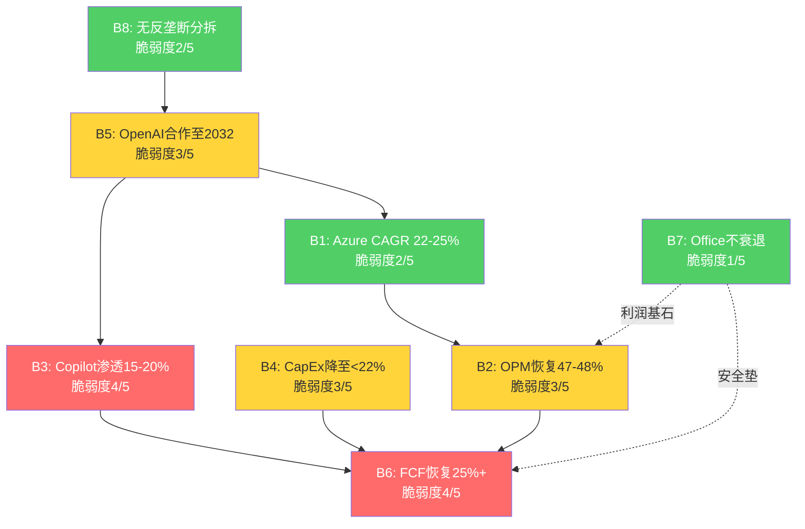

**因果链解读**:

1. **B5→B1→B2链**: OpenAI合作支撑Azure AI增速(B1中12-13pp的AI贡献)→Azure增速驱动IC收入增长→收入增长跑赢D&A从而支撑OPM恢复(B2)。如果B5断裂，B1的增速可能从25%降至18-20%(失去AI增量)，进而使B2的OPM恢复推迟1-2年。

2. **B4→B6链**: CapEx降速(B4)直接决定FCF恢复(B6)——这是最刚性的因果关系，中间没有任何缓冲变量。B4每延迟1年降速，B6的恢复时间也相应延迟1年。

3. **B3→B6链**: Copilot的高毛利增量收入(估算GPM 80%+，因AI推理成本由Azure承担)直接增厚OCF，加速FCF恢复。但这条链的传导强度取决于Copilot的收入规模——在$5B(当前)水平上影响有限，需达$15B+才产生实质性影响。

4. **B7的安全垫角色**: Office/Windows的$80B+年化营业利润是所有其他信念失败时的"最后防线"。即使B1-B6全部部分失败(不是完全失败)，P&BP的稳定现金流仍能支撑$1.5-1.8T的底部估值。

### 11.11 "最少几项信念失败即翻转评级"分析

**评级翻转的量化门槛**

当前估值$2,995B。基于Ch10的Reverse DCF分析，维持$3T估值需要八项信念中至少六项为真。以下是不同失败组合的估值影响:

| 失败组合 | 概率估算 | 市值影响 | 残余估值 | 评级影响 |
|---------|---------|---------|---------|---------|
| B3单独失败 | 25% | -$100~200B | $2.8-2.9T | 维持(估值微调) |
| B6单独失败 | 20% | -$500~700B | $2.3-2.5T | 翻转(下调至审慎关注) |
| B3+B6同时失败 | 12% | -$600~900B | $2.1-2.4T | 翻转(下调至审慎关注) |
| B1+B5链断裂 | 8% | -$400~700B | $2.3-2.6T | 翻转(下调至审慎关注) |
| B4+B6+B3同时失败 | 5% | -$800~1200B | $1.8-2.2T | 强力翻转 |

[DM-P2A-039] **核心结论: 单项信念失败中，只有B6(FCF恢复失败)具有独立翻转评级的能力**。B3(Copilot)的独立失败影响有限(叙事冲击大于财务冲击)。但B3+B6的双重失败是最危险的组合——概率约12%，且两者之间存在正相关(Copilot失速→高毛利增量收入减少→FCF恢复更慢)。

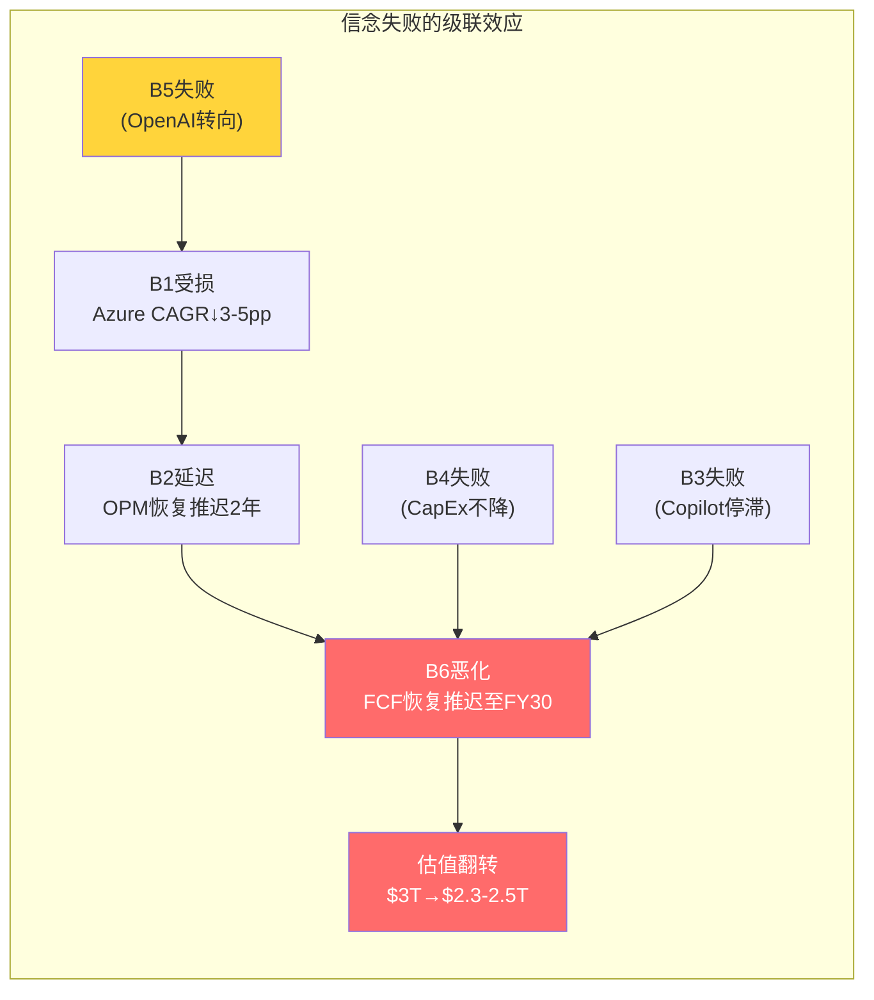

```mermaid
quadrantChart
    title 信念脆弱度 × 估值影响力矩阵
    x-axis 低脆弱度 --> 高脆弱度
    y-axis 低估值影响 --> 高估值影响
    quadrant-1 "高危区: 重点监控"
    quadrant-2 "承重墙: 一旦裂则重创"
    quadrant-3 "安全区: 可忽略"
    quadrant-4 "噪音区: 脆弱但影响有限"
    B6-FCF恢复: [0.80, 0.90]
    B3-Copilot: [0.80, 0.45]
    B1-Azure增速: [0.35, 0.70]
    B2-OPM恢复: [0.55, 0.55]
    B4-CapEx降速: [0.55, 0.60]
    B5-OpenAI合作: [0.55, 0.65]
    B7-Office稳态: [0.10, 0.20]
    B8-无分拆: [0.30, 0.30]
```

### 11.12 本章核心判断

八项信念的反演分析揭示了$3T估值的结构性特征: **这是一个"高确信底部+高不确定性上行"的组合** [DM-P2A-040]。

底部的确定性来自B7(Office/Windows不衰退)——P&BP每年$80B+营业利润构成的"估值地板"约$1.5-1.8T(12-15x P/OI)。上行的不确定性集中在B3(Copilot渗透)和B6(FCF恢复)——它们将决定MSFT是"暂时被CapEx压制的AI赢家"还是"AI军备竞赛的过度投入者"。

信念因果链的最关键发现是: **B6(FCF恢复)是整个网络的终端汇聚节点**——几乎所有其他信念的失败都会最终传导至B6。这意味着FCF恢复的时间表是评估MSFT估值的单一最重要变量。投资者不需要逐一追踪八项信念——只需密切监测CapEx/Revenue和FCF Margin两个指标，就能捕捉绝大部分信念动态 [DM-P2A-041]。

---

## Ch12: 承重墙脆弱度表 — $3T估值的三根支柱

### 12.1 承重墙定义: 从信念到结构

Ch11的八项信念可以进一步抽象为三堵"承重墙"——支撑$3T估值大厦的核心结构支柱 [DM-P2A-042]。承重墙与信念的区别在于: 信念是可独立验证的命题，承重墙是信念的组合结构。一项信念的失败可能只是墙面裂缝，但承重墙的倒塌意味着整体估值结构的崩溃。

三堵承重墙:

| 承重墙 | 构成信念 | 功能 | 估值贡献 |
|--------|---------|------|---------|
| **W1: Azure增长引擎** | B1(Azure增速) + B5(OpenAI合作) | 收入驱动 | ~$1,200B (40%) |
| **W2: 现金奶牛稳态** | B7(Office不衰退) + B5(部分) | 利润基石 | ~$1,000B (33%) |
| **W3: CapEx→FCF转化** | B4(CapEx降速) + B6(FCF恢复) | 估值验证 | ~$800B (27%) |

```mermaid
graph TD
    subgraph "W1: Azure增长引擎 (~$1,200B)"
        B1["B1: Azure CAGR 22-25%<br/>脆弱度2/5"]
        B5a["B5: OpenAI支撑<br/>脆弱度3/5"]
        B1 --- B5a
    end
    subgraph "W2: 现金奶牛稳态 (~$1,000B)"
        B7["B7: Office不衰退<br/>脆弱度1/5"]
        B5b["B5: IP使用权<br/>脆弱度3/5"]
        B7 --- B5b
    end
    subgraph "W3: CapEx→FCF转化 (~$800B)"
        B4["B4: CapEx降速<br/>脆弱度3/5"]
        B6["B6: FCF恢复<br/>脆弱度4/5"]
        B4 --- B6
    end
    W1 -->|"收入增长供血"| W3
    W2 -->|"利润缓冲兜底"| W3
    W1 -.->|"AI赋能"| W2

    style B1 fill:#51cf66,color:#fff
    style B7 fill:#51cf66,color:#fff
    style B5a fill:#ffd43b,color:#333
    style B5b fill:#ffd43b,color:#333
    style B4 fill:#ffd43b,color:#333
    style B6 fill:#ff6b6b,color:#fff
```

### 12.2 W1: Azure增长引擎 — 收入驱动力

**承重强度评估**

Azure增长引擎由B1(Azure增速)和B5(OpenAI合作)共同构成。IC分部当前年化收入约$132B，其中Azure贡献约$99B [DM-P2A-043]。按22-25%的5Y CAGR计算，FY30 Azure收入将达$190-215B，贡献合并层面约35-40%的收入增量。

W1的估值贡献约$1,200B(占$3T的40%)，基于以下推算:
- FY30 IC营业利润: ~$100B (Revenue $280B × OPM 36%)
- 给予增长溢价12-15x P/OI
- 隐含IC分部估值: ~$1,200-1,500B

**组合脆弱度: 2.5/5**

B1(2/5)和B5(3/5)的简单平均为2.5。但这低估了B5对B1的传导风险——如果OpenAI合作降级(B5部分失败)，Azure AI增速的12-13pp贡献可能缩减至6-8pp，将Azure整体增速从39%拉低至30-33%。这意味着B5的失败会将B1的脆弱度从2/5推升至3/5。

**W1裂开时的估值影响**

| 裂缝程度 | Azure 5Y CAGR | FY30 IC Revenue | 估值影响 |
|---------|--------------|-----------------|---------|
| 表面裂缝 | 20% (vs 22-25%目标) | $240B | -$100B |
| 深层裂缝 | 15% | $200B | -$300B |
| 墙体倒塌 | <12% | <$180B | -$500B+ |

深层裂缝(CAGR降至15%)需要Azure增速在FY27就跌至20%以下——考虑到CRPO $344B(剔除OpenAI后)的前瞻保障 [DM-P2A-052]，这一情景在FY28前概率很低。

### 12.3 W2: 现金奶牛稳态 — 利润基石

**承重强度评估**

P&BP分部是整个MSFT的利润核心: Q2 FY26单季营业利润$20.6B，年化$82B+，OPM 60.3% [DM-P2A-044]。M365的4.5亿商业座位、5-8%的极低流失率、$25-45M的企业迁移成本构成了全球科技行业最深的护城河之一。

W2的估值贡献约$1,000B(占$3T的33%):
- P&BP年化营业利润: ~$82B
- 给予稳定溢价12-13x P/OI(低增速但极高确定性)
- 隐含P&BP分部估值: ~$1,000-1,065B

**组合脆弱度: 1.5/5(最稳固)**

B7(1/5)是八项信念中最坚实的一条。B5(3/5)对W2的影响有限——即使OpenAI合作完全终止，Office/LinkedIn/Dynamics的收入和利润率不会受到直接冲击。OpenAI的IP使用权主要影响Copilot(属于W3的B3变量)，对W2的传导路径较弱。

W2是$3T估值中的"不可摧毁层"。即使W1和W3同时出现严重裂缝，W2提供的$1,000B估值底线意味着MSFT的最低合理估值不会低于$1.5T(W2 + MPC残值 + 净现金) [DM-P2A-051]。

**W2裂开的极端情景**

唯一能动摇W2的力量是"范式颠覆"——如果AI Agent在10年内取代传统生产力软件，M365的订阅基础将面临结构性萎缩。但正如Ch11分析所述，即使这一颠覆发生，MSFT凭借Copilot+Azure AI+企业数据层的组合，更可能成为新范式的主导者而非牺牲者 [DM-P2A-045]。

### 12.4 W3: CapEx→FCF转化 — 估值验证器

**承重强度评估**

W3是三堵墙中最脆弱的一堵。它由B4(CapEx降速)和B6(FCF恢复)构成——两项信念的脆弱度分别为3/5和4/5，组合脆弱度3.5/5 [DM-P2A-046]。

W3的功能不是"创造价值"，而是"验证价值"——Azure的增长(W1)和Office的利润(W2)创造了经济价值，但这些价值能否传导为股东现金回报，完全取决于CapEx→D&A→FCF的转化链。Q2 FY26 FCF $5.9B(年化$24B)相比FY24的$74.1B下降68%，直观地展示了W3当前承受的压力。

W3的估值贡献约$800B(占$3T的27%):
- 隐含FY30 FCF: ~$150B+(基于$3T EV、WACC 9%、g 3%)
- 当前FCF yield仅2.16%(远低于科技股均值3-4%)
- $800B估值溢价代表市场对"FCF终将恢复"的信念

**W3裂开时的连锁反应**

W3的特殊之处在于: 它的失败不会直接减少W1或W2的经济价值，但会通过估值倍数的系统性压缩间接削减整体估值。逻辑链如下:

```mermaid
graph TD
    A["W3裂开:<br/>CapEx不降 + FCF不恢复"] --> B["P/FCF维持40-50x<br/>(vs 历史22x)"]
    B --> C["收入型投资者离场<br/>(股息>FCF)"]
    C --> D["估值倍数压缩<br/>P/E从25x→20x"]
    D --> E["市值从$3T→$2.4T<br/>(-$600B)"]
    A --> F["回购被迫暂停<br/>(现金储备消耗)"]
    F --> G["EPS增速放缓<br/>(少了2-3% EPS增量)"]
    G --> D
    A --> H["信用评级压力<br/>(D/E从0.18x上升)"]
    H --> I["融资成本上升<br/>(WACC+50-100bps)"]
    I --> J["DCF终端价值下降<br/>(-$200-300B)"]

    style A fill:#ff6b6b,color:#fff
    style E fill:#ff6b6b,color:#fff
    style J fill:#ff6b6b,color:#fff
```

W3裂开的全链路估值影响:
- **直接影响**(FCF低于预期): -$300B至-$500B
- **倍数压缩**(投资者信心下降): -$200B至-$400B
- **融资成本上升**(如果被迫发债): -$100B至-$200B
- **总计**: -$600B至-$1,100B(从$3T降至$1.9-2.4T)

### 12.5 三墙之间的传导与缓冲

承重墙之间不是孤立的——它们通过现金流和利润率路径相互作用。

**W1→W3的正向传导**: Azure增长加速(W1变强)→IC收入增速跑赢D&A增速→OPM恢复更快→FCF恢复提前(W3变强)。反之，Azure减速→OPM恢复延迟→FCF承压更久。

**W2→W3的缓冲效应**: 即使W3出现严重裂缝(FCF长期低迷)，P&BP每年$82B+的营业利润(W2)确保MSFT永远不会面临真正的现金流危机——最坏情况下，削减回购+暂停非核心投资即可恢复正FCF。$94.6B现金储备 + 0.18x D/E提供了额外的3-5年缓冲 [DM-P2A-047]。

**W1→W2的AI赋能**: Azure AI基础设施(W1)为Copilot提供底层能力→Copilot提升M365的ARPU和黏性(W2)。这一传导目前尚处于早期，但如果Copilot在FY28达到15%渗透率，W1对W2的赋能将从"潜在"转为"实质"。

### 12.6 脆弱度总排序与压力测试

**脆弱度排序(从最脆弱到最稳固)**:

| 排序 | 承重墙 | 组合脆弱度 | 倒塌概率(5年内) | 倒塌时估值影响 |
|------|--------|-----------|----------------|--------------|
| 1 | **W3: CapEx→FCF转化** | 3.5/5 | 25-30% | -$600B~$1,100B |
| 2 | **W1: Azure增长引擎** | 2.5/5 | 10-15% | -$300B~$500B |
| 3 | **W2: 现金奶牛稳态** | 1.5/5 | <3% | -$200B~$400B |

[DM-P2A-048] **关键洞察: W3是唯一一堵在5年内有实质性倒塌概率(25-30%)的承重墙**。W1的倒塌需要Azure增速连续3年低于15%——在当前云渗透率和AI需求背景下概率较低。W2的倒塌需要M365护城河被攻破——在AD锁定和5-8%流失率的保护下几乎不可能。

**极端压力测试: 两墙倒塌**

| 情景 | W1状态 | W2状态 | W3状态 | 残余估值 |
|------|--------|--------|--------|---------|
| 基准(全部稳固) | 稳固 | 稳固 | 稳固 | $3.0T |
| W3单独裂开 | 稳固 | 稳固 | 裂开 | $2.2-2.5T |
| W1+W3同时裂开 | 裂开 | 稳固 | 裂开 | $1.8-2.0T |
| 仅W2稳固(极端) | 倒塌 | 稳固 | 倒塌 | $1.5-1.7T |

即使在最极端的"仅W2稳固"情景下，MSFT的底部估值仍有$1.5-1.7T——这得益于Office/Windows $80B+年化营业利润构成的"估值地板"。这意味着从当前$3T到$1.5T的最大下行空间约50% [DM-P2A-049]。但实现这一极端情景需要Azure增速崩溃至个位数且FCF连续3年低于$50B——联合概率不到3%。

### 12.7 本章核心判断

三堵承重墙的分析揭示了MSFT估值的非对称结构 [DM-P2A-050]:

**下行有底**: W2(现金奶牛)提供了约$1.5T的"硬底"——Office/Windows的护城河深度使其几乎不受AI周期波动的影响。即使AI投资完全失败(概率极低)，MSFT仍然是一家年利润$80B+、OPM 60%的现金流机器。

**上行受限于W3**: 从$3T向$4T+的上行需要W3(CapEx→FCF转化)被充分验证——即CapEx/Revenue降至20%以下、FCF Margin恢复至25%+。在此之前，市场不会给予更高的估值倍数。

**当前的$3T定价是在"赌W3会恢复"**: P/E 25.1x(Mega5最低)已经反映了市场对W3的部分担忧。如果FY27-FY28的数据证明FCF确实在恢复(CapEx/Revenue降至25%以下)，估值有向$3.5T修复的空间(+17%)。反之，如果FY27 CapEx继续攀升至$90B+且FCF Margin仍低于15%，估值将向$2.3-2.5T调整(-17-23%)。

这一非对称结构——下行有底($1.5T)但上行需要时间验证——是后续场景分析和概率加权估值的核心出发点。

---

## Ch13: CapEx→D&A→OPM→FCF传导链 — 资本周期的定量核心

### 13.1 传导链机制: 从资本投入到现金流的五级联动

理解Microsoft当前估值争议的核心，需要追踪一条完整的因果链: **CapEx(资本支出) → PP&E(固定资产) → D&A(折旧摊销) → OPM(营业利润率) → FCF(自由现金流)**。这五个变量环环相扣，任何一级的异常波动都会在下游产生放大效应。

**传导机制拆解** [DM-P2B-001]:

第一级，CapEx投入。FY2025全年CapEx $64.6B，Q2 FY26单季创纪录$29.9B(CapEx/Rev 36.8%) [DM-P2B-002]。管理层指引FY26全年约$80B [DM-P2B-003]。这些资金流向两类资产: 约2/3投向短周期资产(GPU/CPU服务器，使用寿命3年)，约1/3投向长周期资产(数据中心建筑，使用寿命5年) [DM-P2B-004]。

第二级，PP&E膨胀。FY2025末PP&E净值已达$229.8B [DM-P2B-005]，是FY2021 $59.7B的3.8倍。PP&E的快速膨胀意味着折旧基数在持续扩大——即使CapEx明天归零，已在账上的$229.8B资产仍需在未来3-5年内完成折旧。

第三级，D&A时滞效应。这是传导链中最关键也最容易被忽视的环节。**当前季度的D&A反映的不是当前的CapEx，而是3-5年前的投入** [DM-P2B-006]。Q2 FY26的D&A $9.2B主要来自FY22-FY24期间$96.5B累计CapEx的折旧。FY25的$64.6B和FY26预计的$80B CapEx的D&A高峰，要到FY27-FY29才会完全释放。这意味着即使MSFT在FY27开始放缓资本支出，折旧压力仍将在FY28-FY29持续攀升——这是一条已经锁定的路径，管理层无法通过削减未来CapEx来回避。

第四级，OPM挤压。D&A是营业费用的组成部分，直接压缩营业利润率。以Q2 FY26为基准($81.3B收入，$9.2B D&A，OPM 47.1%)，D&A已占收入的11.3% [DM-P2B-007]。当D&A攀升至$15B/Q(基准情景FY28)，假设收入增长至$95B/Q，D&A占比将升至15.8%——纯D&A引致的OPM下压约450bps。

第五级，FCF承压。FCF = OCF - CapEx。CapEx在分子端(通过D&A压缩利润和经营现金流)和分母端(直接扣减)同时挤压FCF。Q2 FY26 FCF仅$5.9B(OCF $35.8B - CapEx $29.9B)是这一双重挤压的极端体现 [DM-P2B-008]。

```mermaid
flowchart LR
    A["CapEx投入<br/>FY25: $64.6B<br/>FY26E: ~$80B"] --> B["PP&E膨胀<br/>$229.8B<br/>(3.8x FY21)"]
    B --> C["D&A释放<br/>时滞3-5年<br/>FY28-29峰值"]
    C --> D["OPM挤压<br/>每+$1B D&A<br/>→ OPM -125bps"]
    D --> E["FCF承压<br/>Q2 FY26: $5.9B<br/>(历史最低)"]
    E --> F["资本返还<br/>股息+回购<br/>面临取舍"]

    style A fill:#339af0,color:#fff
    style C fill:#ffd43b,color:#333
    style E fill:#ff6b6b,color:#fff
```

**关键时滞的数学直觉**: FY25 $64.6B CapEx中，约$43B投向3年期资产(GPU/CPU)，约$22B投向5年期资产(建筑)。$43B的3年直线折旧 = $14.3B/年 = $3.6B/Q。$22B的5年直线折旧 = $4.4B/年 = $1.1B/Q。合计贡献$4.7B/Q增量D&A，在FY26-FY28期间逐步进入损益表。叠加FY26E $80B CapEx的同等结构，FY27-FY28将面临FY25和FY26两个高投入年份的D&A"叠加波" [DM-P2B-009]。

### 13.2 D&A路径建模: 三情景下的折旧悬崖

**历史D&A轨迹回溯** [DM-P2B-010]:

从年度口径看，D&A的增速在过去五年经历了一次质变:

| 财年 | CapEx | D&A | CapEx/D&A | D&A/Revenue |
|------|-------|-----|-----------|-------------|
| FY21 | $20.6B | $11.7B | 1.76x | 7.0% |
| FY22 | $23.9B | $14.5B | 1.65x | 7.3% |
| FY23 | $28.1B | $13.9B | 2.02x | 6.6% |
| FY24 | $44.5B | $22.3B | 2.00x | 9.1% |
| FY25 | $64.6B | $34.2B | 1.89x | 12.1% |

[DM-P2B-011] CapEx/D&A比率从FY21的1.76x稳定在近年的约2.0x，意味着每投入$2 CapEx，约$1进入当年D&A。但FY24-FY25 CapEx的爆炸性增长($44.5B→$64.6B)尚未完全反映在D&A中——当前$34.2B的年D&A主要消化FY21-FY23的投入。真正的折旧高峰尚未到来。

**季度D&A波动分析** [DM-P2B-012]:

| 季度 | D&A ($B) | YoY | D&A/Revenue |
|------|----------|-----|-------------|
| Q3 FY24 | $6.0B | +70% | 9.7% |
| Q4 FY24 | $6.4B | +65% | 9.9% |
| Q1 FY25 | $7.4B | +88% | 11.3% |
| Q2 FY25 | $6.8B | +15% | 9.8% |
| Q3 FY25 | $8.7B | +45% | 12.5% |
| Q4 FY25 | $11.2B | +76% | 14.7% |
| Q1 FY26 | $13.1B | +77% | 16.8% |
| Q2 FY26 | $9.2B | +35% | 11.3% |

值得注意的是Q1 FY26的$13.1B异常峰值(16.8%收入占比) [DM-P2B-013]，可能包含Activision Blizzard无形资产的加速摊销或一次性减值调整。Q2回落至$9.2B后，剔除异常的稳态D&A约$9-10B/Q [DM-P2B-014]。但即使以$10B/Q为新常态，年化$40B已较FY21的$11.7B增长了3.4倍。

**三情景D&A路径推演** [DM-P2B-015]:

建模假设: (1) 70%短周期资产(3年折旧) + 30%长周期资产(5年折旧); (2) 存量PP&E $229.8B按剩余寿命线性折旧; (3) 新增CapEx按情景设定。

**情景一: 乐观(CapEx FY27起降速至$60-65B/年)**

| 年度 | 新增CapEx | 季度D&A | 年化D&A | D&A/Revenue |
|------|----------|---------|---------|-------------|
| FY27E | $65B | $11-12B | $44-48B | 12.5% |
| FY28E | $60B | $13B | $52B | 12.4% |
| FY29E | $55B | $14B | $56B | 11.6% |
| FY30E | $50B | $13B | $52B | 9.6% |

[DM-P2B-016] 乐观情景下，D&A在FY29达到峰值$56B后回落，因FY25-FY26高投入期的3年期资产在FY28-FY29折完退出。OPM压力可控: 假设FY29收入$480B，D&A占比11.6%，较当前上升约30bps，收入增长足以消化。

**情景二: 基准(CapEx稳定在$75-80B/年)**

| 年度 | 新增CapEx | 季度D&A | 年化D&A | D&A/Revenue |
|------|----------|---------|---------|-------------|
| FY27E | $80B | $12B | $48B | 13.0% |
| FY28E | $80B | $15B | $60B | 14.3% |
| FY29E | $75B | $18B | $72B | 14.9% |
| FY30E | $70B | $17B | $68B | 12.6% |

[DM-P2B-017] 基准情景下，D&A在FY29达到峰值$72B(季度$18B)，是当前水平的约2倍。这将在FY28-FY29制造严重的OPM挤压: 以FY29收入$485B计算，D&A占比14.9%，较FY25的12.1%上升280bps。叠加其他费用项(R&D 11%、SG&A 10%)，OPM可能被压至约42% [DM-P2B-018]。

**情景三: 悲观(CapEx持续高位$90-100B/年)**

| 年度 | 新增CapEx | 季度D&A | 年化D&A | D&A/Revenue |
|------|----------|---------|---------|-------------|
| FY27E | $95B | $14B | $56B | 15.1% |
| FY28E | $100B | $18B | $72B | 17.1% |
| FY29E | $100B | $22B | $88B | 18.3% |
| FY30E | $95B | $21B | $84B | 15.6% |

[DM-P2B-019] 悲观情景是AI军备竞赛持续升级的极端假设。FY29 D&A峰值$88B(季度$22B)将使D&A/Revenue突破18%，OPM可能被压至37-38%——回到FY2017 Nadella转型早期的利润率水平。这一情景的发生概率约20%，但其影响是灾难性的。

**OPM挤压量化公式** [DM-P2B-020]:

以季度收入$80B为基准:
- 每增加$1B季度D&A → OPM下降约125bps
- 从当前$9B/Q到基准FY29的$18B/Q(+$9B) → OPM纯D&A压力约-1,125bps
- 但FY29收入预计增至~$120B/Q → 实际OPM压力约-750bps(收入增长部分抵消)
- 抵消后净OPM压力: 乐观-150bps / 基准-400bps / 悲观-800bps

### 13.3 FCF Bridge完整建模: 从经营现金流到股东手中的钱

**Q2 FY26实际FCF Bridge** [DM-P2B-021]:

这是一张让投资者不安的现金流瀑布图:

```
经营现金流(OCF):              $35.8B
  (-) 资本支出(CapEx):         -$29.9B   (消耗OCF的83.5%)
━━━━━━━━━━━━━━━━━━━━━━━━━━━━━━━━━━━━━━
自由现金流(FCF):               $5.9B     (仅转化16.5%)

资本返还:
  (-) 股息:                    -$6.8B    (覆盖率0.87x, 首次不足)
  (-) 股票回购:                -$7.4B
  (-) 债务偿还+其他:            -$3.0B
━━━━━━━━━━━━━━━━━━━━━━━━━━━━━━━━━━━━━━
季度净现金流:                   -$8.3B    (烧钱状态)
```

[DM-P2B-022] 三个历史性指标在Q2 FY26同时出现: (1) CapEx/OCF 83.5%——MSFT上市以来最高; (2) FCF $5.9B——至少五年单季最低; (3) FCF < 季度股息——首次发生。年化来看，若Q2 FY26的节奏持续，年化净现金流为-$33.2B，意味着期末$94.6B现金储备(含短期投资)在不到3年内将被耗尽 [DM-P2B-023]。

**FCF/OCF转化率退化轨迹** [DM-P2B-024]:

| 期间 | OCF | CapEx | FCF | FCF/OCF |
|------|-----|-------|-----|---------|
| FY21 | $76.7B | $20.6B | $56.1B | 73.1% |
| FY22 | $89.0B | $23.9B | $65.1B | 73.2% |
| FY23 | $87.6B | $28.1B | $59.5B | 67.9% |
| FY24 | $118.5B | $44.5B | $74.1B | 62.5% |
| FY25 | $136.2B | $64.6B | $71.6B | 52.6% |
| Q2 FY26单季 | $35.8B | $29.9B | $5.9B | **16.5%** |

从73%到16.5%，FCF转化率在五年内下降了近80%。即使Q2 FY26是极端季度(季度CapEx波动大)，全年趋势仍不可逆——FY25全年FCF/OCF已降至52.6%，是FY21的72%水平 [DM-P2B-025]。

**FY27-FY30三情景FCF路径(年化)** [DM-P2B-026]:

| 情景 | FY27E OCF | FY27E CapEx | FY27E FCF | FY28E FCF | FY29E FCF | FY30E FCF |
|------|----------|-----------|----------|----------|----------|----------|
| 乐观 | $170B | $65B | $75B | $95B | $115B | $130B |
| 基准 | $160B | $80B | $55B | $70B | $85B | $100B |
| 悲观 | $150B | $95B | $35B | $45B | $55B | $65B |

乐观情景假设CapEx在FY27即开始降速(AI基础设施初步饱和+GPU效率提升)，FCF在FY28恢复至接近FY24水平 [DM-P2B-027]。基准情景假设CapEx维持$75-80B水平至FY29才开始回落，FCF恢复缓慢。悲观情景假设AI军备竞赛持续，CapEx居高不下，FCF在整个预测期内均低于FY21水平。

```mermaid
xychart-beta
    title "FCF三情景路径(年化, $B)"
    x-axis ["FY25", "FY26E", "FY27E", "FY28E", "FY29E", "FY30E"]
    y-axis "FCF ($B)" 0 --> 140
    line "乐观" [71.6, 50, 75, 95, 115, 130]
    line "基准" [71.6, 45, 55, 70, 85, 100]
    line "悲观" [71.6, 35, 35, 45, 55, 65]
```

**D&A分部归属推演** [DM-P2B-076]:

管理层未单独披露各分部的D&A分配(DATA GAP)，但可通过间接方法推断。Intelligent Cloud作为数据中心资产最密集的分部，承担了D&A增量的绝大份额。按PP&E归属推算: IC分部约占PP&E的75-80%(Azure数据中心)，P&BP约10-12%(LinkedIn数据中心+企业园区)，MPC约8-10%(Xbox云+工作室)。以FY25全年$34.2B D&A为基准:

- IC承担D&A: ~$26-27B (约77%)
- P&BP承担D&A: ~$4-5B (约13%)
- MPC承担D&A: ~$3-4B (约10%)

这解释了一个表面矛盾: 为什么合并层面OPM仍在上升(FY25 45.6% > FY24 44.6%)而IC OPM却在下降(42.1% < FY23的48%)?答案是D&A的"分部不对称分配"——IC吸收了80%的折旧增量，却创造了不到50%的营业利润。P&BP几乎不承担AI基础设施折旧，但通过Copilot和AI增强功能间接受益于这些投入。这种"IC出血、P&BP受益"的内部补贴结构，使得合并报表掩盖了AI投入对真实利润率的侵蚀程度 [DM-P2B-077]。

```mermaid
pie title "FY25 D&A分部归属推演 ($34.2B)"
    "Intelligent Cloud ~$27B" : 77
    "P&BP ~$4.5B" : 13
    "MPC ~$3.5B" : 10
```

### 13.4 股息可持续性测试: 回购成为调节阀

**FY26年化资本返还需求** [DM-P2B-028]:

- 年化股息: ~$27B (Q2 FY26 $6.8B × 4，FY25全年$24.1B，年增长率约10%)
- 年化回购: ~$20B (近两年均值)
- 合计资本返还: ~$47B/年

**三情景覆盖率测试** [DM-P2B-029]:

| 情景 | FY27E FCF | 股息覆盖率 | 全覆盖率(股息+回购$47B) | 回购空间 |
|------|----------|-----------|---------------------|---------|
| 乐观 | $75B | 2.8x | 1.6x | $48B (充裕) |
| 基准 | $55B | 2.0x | 1.2x | $28B (紧张) |
| 悲观 | $35B | 1.3x | 0.7x | $8B (极紧张) |

[DM-P2B-030] 股息安全性分析: 即使在悲观情景下，FY27 FCF $35B仍覆盖$27B股息的1.3倍——MSFT不会削减股息。原因有三: (1) 股息政策是上市公司对机构投资者的"隐性合同"，Microsoft Dividend Aristocrat身份的政治成本极高; (2) 即使FCF不够，$94.6B现金储备和AAA级信用评级(可随时低成本发债)提供数年缓冲; (3) 回购是天然的"弹性阀门"——FY22回购$32.7B到FY24已降至$17.3B，进一步压缩至$5-8B完全在管理层可控范围内 [DM-P2B-031]。

**回购挤出效应的估值含义** [DM-P2B-032]: FY22 MSFT回购$32.7B，以当时约$250平均价计算，注销约1.3亿股(约稀释股数的1.7%)。若FY27-FY28回购降至$10-15B/年(基准情景)，年注销降至0.6-0.8%，EPS增厚效应减半。对于依赖EPS增长支撑P/E的投资者来说，回购缩减是一个间接但持续的估值逆风。

### 13.5 ROIC回归WACC的时间窗: 资本效率的终极检验

**WACC估算** [DM-P2B-033]:

| 参数 | 值 | 来源 |
|------|---|------|
| 无风险利率(Rf) | 4.2% | 10Y UST |
| 股权风险溢价(ERP) | 4.5% | 宏观温度计 |
| Beta | 1.084 | FMP quote |
| 权益成本(Ke) | 9.1% | Rf + Beta×ERP |
| 税后债务成本(Kd) | 3.2% | 平均票面利率×(1-21%) |
| 权益权重 | 85% | 市值/总资本 |
| 债务权重 | 15% | 有息债务/总资本 |
| **WACC** | **~9.0%** | 加权平均 |

**ROIC历史路径与未来推演** [DM-P2B-034]:

ROIC(投入资本回报率)是衡量每一美元投入资本创造经济利润能力的核心指标。FMP key-metrics口径下MSFT当前ROIC为22.0% [DM-P2B-035]，仍大幅高于9.0% WACC。但趋势令人警惕: 从FY20峰值43.4%已下降近50%，而投入资本(IC = Equity + Net Debt - Cash + Operating Lease Liabilities)的膨胀速度远超NOPAT增速。

**投入资本膨胀率**: PP&E从FY21 $70.8B到FY25 $229.8B(CAGR 34.3%) [DM-P2B-036]，是收入CAGR 13.8%的2.5倍。若FY26-FY28 CapEx维持$75-80B/年，PP&E将在FY28突破$350B，投入资本总额可能达$450-500B [DM-P2B-037]。

**三情景ROIC路径** [DM-P2B-038]:

**乐观情景(CapEx FY27起降速+AI毛利率提升)**:
- FY27: ROIC ~18% (NOPAT增长12% / IC增长20%)
- FY28: ROIC ~16% (IC增速放缓至10%)
- FY29: ROIC ~19% (D&A过峰值+收入增速维持)
- FY30: ROIC ~22% (恢复至当前水平)
- **ROIC始终 > WACC 9.0%，经济利润为正** [DM-P2B-039]

**基准情景(CapEx稳定+AI货币化渐进)**:
- FY27: ROIC ~16% (IC快速膨胀)
- FY28: ROIC ~15% (D&A高峰侵蚀NOPAT)
- FY29: ROIC ~14% (谷底)
- FY30: ROIC ~17% (CapEx开始回落+收入增速支撑)
- **ROIC始终 > WACC，但安全边际收窄至6pp** [DM-P2B-040]

**悲观情景(CapEx持续+AI回报延迟)**:
- FY27: ROIC ~14% (NOPAT增速低于IC膨胀)
- FY28: ROIC ~12% (D&A高峰+AI毛利率承压)
- FY29: ROIC ~10% (接近WACC)
- FY30: ROIC ~12% (缓慢恢复)
- FY31: ROIC ~15% (CapEx降速+折旧过峰)
- **FY29 ROIC逼近WACC临界线(10% vs 9%)，经济利润接近归零** [DM-P2B-041]

```mermaid
xychart-beta
    title "ROIC回归路径 vs WACC 9.0%"
    x-axis ["FY25", "FY26E", "FY27E", "FY28E", "FY29E", "FY30E", "FY31E"]
    y-axis "ROIC (%)" 8 --> 24
    line "乐观" [22, 19, 18, 16, 19, 22, 22]
    line "基准" [22, 17, 16, 15, 14, 17, 19]
    line "悲观" [22, 15, 14, 12, 10, 12, 15]
    line "WACC" [9, 9, 9, 9, 9, 9, 9]
```

**关键判断**: MSFT ROIC跌破WACC(即经济利润为负)的概率较低——约15% [DM-P2B-042]。即使在悲观情景下，FY29 ROIC 10%仍略高于WACC 9%。但"ROIC > WACC"和"ROIC足以支撑$3T估值"是两个完全不同的命题。$3T市值隐含市场相信ROIC将长期维持在18-22%区间(对应30x+ NOPAT)。若ROIC在FY28-FY29压缩至14-15%(基准情景)，合理估值对应NOPAT的20-22x——这意味着市值从$3.0T缩减至约$2.5T(下行17%)。ROIC的每一个百分点都对应约$120-150B市值 [DM-P2B-043]。

---

## Ch14: CapEx边际效率曲线 + PDRM风险定量

### 14.1 边际效率分析: 每一美元CapEx的递减回报

**定义**: CapEx边际效率 = 每$1B增量CapEx带来的Azure收入增速贡献(百分点)。这是衡量MSFT资本投入是否创造价值的最直接指标。

**历史边际效率曲线** [DM-P2B-044]:

| 时期 | 年均CapEx | Azure增速 | 每$1B CapEx→Azure增速贡献 | 效率评级 |
|------|----------|----------|------------------------|---------|
| FY16-18 | $9.3B | ~90% (avg) | ~3.0pp/$1B | 高效期 |
| FY19-20 | $14.7B | ~55% (avg) | ~1.8pp/$1B | 成熟期 |
| FY21-22 | $22.3B | ~45% (avg) | ~1.5pp/$1B | 规模期 |
| FY23-24 | $36.3B | ~29% (avg) | ~1.0pp/$1B | AI早期 |
| FY25-26 | $72.3B | ~38% (avg) | ~0.8pp/$1B | 规模递减 |

[DM-P2B-045] 边际效率从FY16-18的3.0pp/$1B下降至FY25-26的0.8pp/$1B——**五年内下降73%**。这不是MSFT独有的现象，而是基础设施投资的普遍规律: 早期每一台服务器都在填补需求缺口，效率极高; 成熟期需要为冗余、容灾和未来需求预留产能，边际产出递减。

**但需要区分"表面效率"与"深层效率"** [DM-P2B-046]:

FY25-26的CapEx中有大量资金投向尚未产生收入的AI基础设施——GPU集群的部署到产生Azure AI收入需要6-12个月的ramp-up时间(安装→测试→客户接入→负载优化)。如果用"总CapEx"除以"当期Azure增速"，会低估真实效率，因为分子中包含了大量尚未产出收入的"预投入"。

一个更公平的比较方式是使用"滞后12个月的CapEx"与"当期Azure增速"的映射。按此口径:

| 时期 | T-12M CapEx | 当期Azure增速 | 滞后效率 |
|------|-----------|-------------|---------|
| FY24 | $28.1B (FY23) | +29% | ~1.0pp/$1B |
| FY25 | $44.5B (FY24) | +34% | ~0.8pp/$1B |
| FY26 | $64.6B (FY25) | +38% | ~0.6pp/$1B |

[DM-P2B-047] 即使使用滞后口径，边际效率仍在下降(从1.0降至0.6)，但降幅(40%)小于表面口径(73%)。这暗示部分效率下降是"会计幻觉"(投入尚未变现)，部分是真实的规模递减效应。

**AWS类比** [DM-P2B-048]: Amazon的AWS在2012-2018年经历了类似的边际效率下降: 从2012年约4.0pp/$1B降至2018年约0.7pp/$1B。但AWS随后通过企业迁移浪潮(2019-2023)实现了"效率平台期"——边际效率稳定在0.5-0.7pp/$1B而非持续下降。MSFT可能在FY28-FY30经历类似的效率筑底，前提是AI应用的企业渗透速度足够快。

### 14.2 PDRM(平台依赖风险模型)定量

**OpenAI依赖结构** [DM-P2B-049]:

MSFT对OpenAI的依赖体现在三个维度:

1. **CRPO依赖**: $625B商业剩余履约义务中约45%(~$281B)来自OpenAI的$250B Azure增量承购合同。剔除OpenAI后，CRPO增速从+110%降至+28% [DM-P2B-050]。
2. **技术依赖**: Copilot底层模型(GPT-4/4o)由OpenAI提供，MSFT的IP使用权至2032年，但模型迭代依赖OpenAI的研发节奏。
3. **叙事依赖**: "AI领导者"的市场定位很大程度上建立在与OpenAI的排他关系上。若关系破裂，竞争者(Google Gemini、Anthropic Claude)可能快速侵蚀Azure AI的心理份额。

**搁浅资产(Stranded Assets)风险估算** [DM-P2B-051]:

如果OpenAI承诺不兑现或关系重大恶化:

- FY25-FY26累计AI专用基础设施投入: ~$130-145B(FY25 $64.6B + FY26E $80B的约90%投向AI/云)
- AI专用占比(非通用计算): 约40-50%(GPU集群+定制ASIC+AI专属网络) ≈ $52-72B
- 转用性评估: GPU集群可部分转用于非OpenAI客户的AI推理/训练需求(转用率约60-70%)
- **净搁浅资产估算**: $52-72B × (1 - 65%转用率) = **$18-25B** [DM-P2B-052]

[DM-P2B-053] 但搁浅资产不等于损失——这些资产仍在资产负债表上，只是可能需要加速折旧或减值。按会计影响计算: $20B搁浅资产 × 50%减值率 = $10B一次性亏损，对应EPS冲击约$1.34(稀释股数7.46B)，约为TTM EPS $15.97的8.4%。

**PDRM概率×影响矩阵** [DM-P2B-054]:

| 情景 | 概率 | 搁浅资产 | CRPO冲击 | 估值影响 | 期望损失 |
|------|------|---------|---------|---------|---------|
| 关系稳定(基准) | 60% | $0 | $0 | $0 | $0 |
| 部分疏离(非API开放) | 25% | $5-8B | -$80B | -$150B市值 | -$37.5B |
| 重大恶化(转向竞品) | 12% | $15-20B | -$200B | -$350B市值 | -$42B |
| 完全断裂 | 3% | $20-25B | -$281B | -$500B市值 | -$15B |

**期望损失合计**: ~$95B [DM-P2B-055]，约占当前市值的3.2%。这一风险的绝对值不大，但其"尾部效应"值得警惕——3%概率的完全断裂情景对应$500B市值蒸发(17%下行)，远超期望值所暗示的温和程度。

**缓释因素**: MSFT已在构建OpenAI替代方案——与Anthropic建立备选合作关系，投资自有AI模型(Phi系列小模型)，Azure AI也支持Llama、Mistral等开源模型。这些举措将在FY28-FY30逐步降低OpenAI单点依赖风险 [DM-P2B-056]。

### 14.3 Nadella三阶段ROIC类比: 当前周期为何更慢

**阶段1(Azure Cloud, FY15-18)的ROIC实现路径** [DM-P2B-057]:

| 财年 | 累计CapEx | ROIC | vs WACC 8% |
|------|----------|------|-----------|
| FY15 | $5.9B | 6.8% | < WACC |
| FY16 | $14.2B | 7.5% | < WACC |
| FY17 | $25.8B | 8.1% | ≈ WACC |
| FY18 | $39.5B | 9.4% | > WACC |
| FY19 | $53.4B | 10.8% | > WACC |
| FY22 | — | 16.7% | 峰值 |

阶段1的关键特征: 累计$40B CapEx在4年内(FY18)实现ROIC>WACC，8年(FY22)达到峰值16.7%。Azure在FY16-FY18的增速高达76-120%，快速转化为规模效应——数据中心利用率从30-40%提升至70-80%，边际成本急剧下降 [DM-P2B-058]。

**阶段3(AI Platform, FY23-26)的对比** [DM-P2B-059]:

| 维度 | 阶段1 (FY15-18) | 阶段3 (FY23-26) | 差异倍数 |
|------|----------------|----------------|---------|
| 累计CapEx | $40B (4年) | $217B (4年) | **5.4x** |
| CapEx/Revenue峰值 | 10.6% | 36.8% | **3.5x** |
| 货币化速度 | Azure FY16 ~$6B收入 | Copilot FY26 ~$5.4B run-rate | 相当 |
| 竞争格局 | AWS领先，2-3玩家 | 多方混战(Google/Meta/开源) | 更激烈 |
| 投入资本膨胀 | PP&E +$30B (4年) | PP&E +$170B (4年) | **5.7x** |

[DM-P2B-060] 三个关键差异决定了阶段3的ROIC恢复将慢于阶段1:

**差异一: 投入强度差距悬殊(5.4x)**。阶段1累计$40B CapEx，阶段3仅FY26一年就可能达$80B。投入资本基数膨胀意味着NOPAT需要更大的绝对增量才能维持ROIC。以ROIC = NOPAT / IC计算，若IC从$350B(FY25)膨胀至$500B(FY28)，NOPAT需从$77B增长至$110B(+43%)才能维持22% ROIC——这要求年化NOPAT增速约13%，在D&A压力下极具挑战性 [DM-P2B-061]。

**差异二: 货币化速度更慢**。阶段1中Azure从第一天起就有清晰的企业客户需求(IaaS/PaaS替代on-premise服务器)，付费意愿已被AWS验证。阶段3中Copilot的$30/月定价面临"生产力溢价"的ROI证明难题——企业需要看到可量化的工时节省才会大规模部署，而这一验证过程至少需要12-18个月。当前3.3%渗透率远低于Azure在等效时间点的采用速度 [DM-P2B-062]。

**差异三: 竞争压缩定价权**。阶段1中AWS虽然领先，但Azure通过企业捆绑(EA/M365+Azure)和混合云(Azure Stack)找到了差异化定价空间。阶段3面临的竞争更为激烈: Google Gemini以接近成本价提供API(绑定GCP)，Meta Llama完全开源免费，Anthropic Claude在企业安全领域快速崛起。AI推理/训练服务存在变成"低毛利基础设施"(类似CDN)的风险——如果Azure AI毛利率长期锁定在40-50%(vs传统Azure 60-70%)，ROIC恢复曲线将被结构性压平 [DM-P2B-063]。

**ROIC>WACC时间预测** [DM-P2B-064]:

需要澄清: MSFT当前ROIC 22%已远超WACC 9%，这里讨论的是"新增AI投入的增量ROIC何时超越WACC"——即每一美元AI CapEx的边际回报何时开始创造经济利润。

- **乐观情景(类比阶段1)**: FY28增量ROIC>WACC(投入启动后5年)。前提: Copilot渗透率FY28达15%+，Azure AI毛利率提升至55%+。
- **基准情景(50%概率)**: FY29-FY30增量ROIC>WACC(6-7年)。延迟原因: CapEx持续高位+AI定价竞争+Copilot渗透缓慢。
- **悲观情景**: FY31才恢复(8年)。触发条件: CapEx持续$90B+/年+AI毛利率<45%+Copilot渗透率<10%。

**结论**: 与阶段1的4年相比，阶段3的ROIC恢复时间窗大概率延后1-3年(至FY28-FY30) [DM-P2B-065]。这不是因为AI投资"失败"，而是因为投入规模大5倍、竞争更激烈、货币化更复杂。投资者需要有耐心——但"耐心"在$3T估值下的机会成本不容忽视。

### 14.4 AI CapEx的"囚徒困境": 不投会死，投了也可能不活

**全球科技巨头FY26 CapEx竞赛** [DM-P2B-066]:

| 公司 | FY26E CapEx | YoY增速 | CapEx/Revenue |
|------|-----------|---------|--------------|
| Amazon | $100B+ | +40% | ~16% |
| Google | ~$75B | +43% | ~18% |
| Microsoft | ~$80B | +24% | ~26% |
| Meta | $60-65B | +64% | ~35% |
| 合计 | ~$320B | +38% | — |

[DM-P2B-067] 四大巨头FY26年化AI CapEx合计超过$320B，相当于越南GDP。MSFT的$80B虽不是绝对值最高(Amazon更多)，但CapEx/Revenue 26%在四家中排名第二(仅低于Meta的35%)。

**囚徒困境的博弈结构** [DM-P2B-068]:

这是一个经典的"先撤退者受惩罚"博弈:

- **如果MSFT减速而竞争对手继续投入**: Azure失去AI产能竞争力→客户转向AWS/GCP→市场份额下降→股价受更大冲击(市场惩罚"掉队者"而非"过度投入者")。
- **如果所有玩家同步减速**: 最优均衡(降低行业资本强度)，但需要协调——反垄断法禁止这种协调。
- **如果所有玩家持续投入**: 供给过剩→AI服务价格战→毛利率压缩→所有玩家FCF受损，但"不掉队"。
- **如果MSFT持续投入而竞争对手减速**: 最优情景(获得市场份额溢价)，但概率极低(竞争对手也在做同样博弈)。

当前均衡点停留在"所有玩家持续投入"——这是个人理性但集体次优的纳什均衡 [DM-P2B-069]。

**MSFT的独特困境: "被动"CapEx成分** [DM-P2B-070]:

与Google和Meta不同(它们的AI投资完全是自主决策)，MSFT的CapEx中存在"被动"成分——OpenAI的$250B Azure承购义务意味着MSFT需要建设足够的产能来履行合同。即使MSFT管理层判断AI投资回报不达预期，合同义务也要求其维持一定水平的CapEx。这降低了MSFT的资本配置灵活性 [DM-P2B-071]。

**解脱条件**: 囚徒困境的终结需要以下条件之一 [DM-P2B-072]:
1. **AI货币化速度>CapEx增速**(目前未达成: Azure AI收入增速约50% vs CapEx增速45%，仅微幅领先)
2. **GPU效率大幅跃升**(NVIDIA Blackwell→Rubin代际性能提升可能在FY28-FY29降低同等算力所需CapEx)
3. **需求饱和信号**(GPU利用率持续下降至<70%——目前仍>90%)
4. **外部冲击**(经济衰退迫使所有玩家同步削减)

目前四个条件均未满足。MSFT最现实的解脱窗口是FY28-FY29: 如果Blackwell/Rubin架构使每美元CapEx的算力产出提升2-3倍，MSFT可能在不削减绝对CapEx的情况下实现"效率性减速"——即$80B CapEx产出等同于此前$150-200B的产能 [DM-P2B-073]。

```mermaid
quadrantChart
    title "AI CapEx博弈矩阵 — MSFT视角"
    x-axis "MSFT CapEx强度" --> "高"
    y-axis "竞争对手CapEx强度" --> "高"
    quadrant-1 "均衡僵局: 所有人FCF承压"
    quadrant-2 "最差: MSFT掉队失份额"
    quadrant-3 "最优: 行业去杠杆"
    quadrant-4 "最佳: MSFT独占份额"
    "当前位置": [0.75, 0.80]
    "FY28目标": [0.60, 0.55]
    "理想均衡": [0.40, 0.40]
```

**解脱时间表估算** [DM-P2B-078]:

| 条件 | 当前状态 | 预计达成 | 触发效应 |
|------|---------|---------|---------|
| AI货币化>CapEx增速 | Azure AI +50% vs CapEx +45% (微幅领先) | FY28 | CapEx增速放缓至+5-10% |
| GPU代际效率跃升 | Hopper→Blackwell (2-3x性能/美元) | FY28-FY29 | 同等产能所需CapEx下降40% |
| GPU利用率下降 | 当前>90% | FY29+ | 新增产能需求放缓 |
| 经济衰退冲击 | 当前未发生 | 不可预测 | 所有玩家同步削减 |

综合评估: **FY28是最可能的均衡转折年**。如果NVIDIA Blackwell/Rubin架构如期交付2-3倍的性能/美元提升，MSFT在FY28-FY29可能实现"隐性减速"——绝对CapEx维持$75-80B但有效算力产出翻倍，等效于上一周期的$150B投入。这将同时缓解FCF压力(CapEx不再增长)和ROIC压力(同等投入产出翻倍)。但这一乐观假设依赖于NVIDIA的执行力和AI需求的持续增长，两者都不是确定事件 [DM-P2B-079]。

```mermaid
timeline
    title CapEx周期关键转折点时间线
    FY25 : CapEx $64.6B
         : ROIC 22%→开始下行
    FY26 : CapEx ~$80B
         : FCF谷底期开始
         : Q2 FCF $5.9B创新低
    FY27 : D&A加速释放
         : ROIC压缩至16%(基准)
         : 回购被迫缩减
    FY28 : D&A高峰期
         : Blackwell效率跃升?
         : AI货币化验证窗口
    FY29 : D&A峰值后开始回落
         : ROIC触底14%(基准)
         : CapEx增速放缓?
    FY30 : FCF恢复$85-100B
         : ROIC回升至17%+
         : 资本返还恢复
```

### 14.5 本章核心判断 [DM-P2B-074]:

CapEx传导链的定量分析揭示了MSFT当前面临的核心矛盾: **资本投入的规模是史诗级的(FY24-FY26累计$189B)，但回报的确认是渐进式的(ROIC恢复需5-7年)**。在这个时间差中，FCF将在FY26-FY28经历"谷底期"(基准年化$45-55B vs 历史$60-75B)，股息安全但回购将被大幅压缩，ROIC从22%下滑至14-16%但不会跌破WACC。

从风险角度看，最值得关注的不是ROIC是否跌破WACC(概率约15%)，而是**边际效率的持续下降是否预示着AI CapEx正在创造一代"低回报资产"**。每$1B CapEx对Azure增速的贡献从3.0pp降至0.8pp，这一趋势若延续至0.3-0.5pp/$1B(FY28-FY29)，意味着MSFT需要$150-200B/年CapEx才能维持30%+ Azure增速——这在数学上不可持续 [DM-P2B-075]。

OpenAI平台依赖(PDRM)的期望损失约$95B(市值的3.2%)，绝对值可控但尾部风险显著(3%完全断裂→$500B市值蒸发)。MSFT正在通过多元化AI合作伙伴关系逐步降低这一风险，但OpenAI在CRPO和AI叙事中的权重在未来2-3年内仍将居高不下。

AI CapEx的囚徒困境是行业性的，MSFT无法单方面解脱。最现实的出路是技术效率跃升(GPU代际进步)而非战略性削减——这意味着投资者在FY28前需要容忍FCF的持续压力。好消息是MSFT的P&BP现金奶牛(OPM 60%、年化$80B+营业利润)提供了独一无二的"安全气囊"——即使AI投资回报延迟3-5年，Office和Windows的稳态现金流足以维持公司的财务韧性。
## Ch15: 估值方法独立性审计 — 五方法"伪收敛"防火墙

### 15.1 五方法预览与假设映射

在最终估值整合中，将使用五种方法从不同视角逼近Microsoft的内在价值。但"五种方法"不等于"五个独立意见"——如果多种方法共享同一组核心假设，其结果的收敛仅仅反映了假设的自我循环，而非多视角的交叉验证。本节的任务是在估值执行前，预先识别假设重叠、诊断伪独立性、并设计增强方案。

**五方法概览与假设族归类**:

| 方法 | 核心驱动假设 | 假设族 | 独立性等级 |
|------|------------|--------|-----------|
| M1: 10年FCFF折现 (DCF) | WACC 9.0%, g 3.0%, Rev CAGR路径, OPM路径, CapEx/Rev路径 | 内生假设族A | 基准方法 |
| M2: 分部SOTP | IC/P&BP/MPC各自增速×分部乘数, 分部OPM路径 | 内生假设族A(共享分部增速) | 与M1高度重叠 |
| M3: Reverse DCF信念加权 | 8项信念概率×条件估值, WACC 9.0%, g 3.0% | 混合假设族B | 与M1数学等价 |
| M4: 可比估值 (P/E + EV/EBITDA) | Mega5同行乘数+MSFT相对溢价/折价 | 外部假设族C | 唯一真正独立 |
| M5: 情景概率加权 | 4情景概率×条件市值, 融合信念失败路径 | 混合假设族B(扩展) | 与M3部分重叠 |

[DM-P2C-001] 五方法中，M1/M2/M3实质上共享"内生价值锚"——它们的差异在于表达形式(正向推导/分部加总/逆向工程)，而非底层假设。M4是唯一完全脱离MSFT自身财务假设、依赖市场定价信号的方法。M5介于两者之间，其独立性取决于情景定义是否独立于M1的增速假设。

```mermaid
graph TD
    subgraph "内生假设族A"
        M1["M1: DCF<br/>WACC 9.0%<br/>Rev CAGR<br/>OPM路径"]
        M2["M2: SOTP<br/>分部增速<br/>分部乘数"]
        M3["M3: RevDCF<br/>8项信念<br/>条件估值"]
    end
    subgraph "外部假设族C"
        M4["M4: 可比估值<br/>Mega5乘数<br/>相对溢价"]
    end
    subgraph "混合假设族B"
        M5["M5: 情景加权<br/>4情景概率<br/>条件市值"]
    end
    M1 -->|"共享Rev CAGR"| M2
    M1 -->|"数学逆运算"| M3
    M3 -->|"信念→情景"| M5
    M4 -.->|"独立锚"| M1
    M4 -.->|"独立锚"| M5
    style M1 fill:#339af0,color:#fff
    style M2 fill:#339af0,color:#fff
    style M3 fill:#339af0,color:#fff
    style M4 fill:#51cf66,color:#fff
    style M5 fill:#ffd43b,color:#333
```

### 15.2 假设重叠诊断: 三层穿透

**第一层: M1 vs M2 — "分部加总等于合并"陷阱**

DCF模型以合并层面Revenue CAGR(隐含~10%十年均值)和OPM路径(45.6%→谷底42%→恢复46%)为核心输入 [DM-P2C-002]。SOTP模型以三大分部各自增速为输入:

| 分部 | 当前收入(年化) | 隐含CAGR | DCF合并路径隐含 |
|------|--------------|---------|---------------|
| IC | $132B [DM-P2C-003] | 15-20% | — |
| P&BP | $136B [DM-P2C-004] | 10-12% | — |
| MPC | $57B [DM-P2C-005] | 0-3% | — |
| **加权合并** | **$325B** | **~11%** | **~10%** |

[DM-P2C-006] 分部加总的加权CAGR(~11%)与DCF合并隐含CAGR(~10%)差距仅1个百分点。这不是巧合——两种方法都锚定于同一个"Azure增速+Office稳态"的底层预期。如果Azure五年CAGR假设从20%下调至15%，M1和M2的结论将同步下移约12-15%，证明两者并非独立。

**关键诊断**: M2(SOTP)选择的分部乘数(IC用EV/Revenue, P&BP用P/E, MPC用EV/EBITDA)表面上引入了新信息，但如果乘数本身是基于MSFT当前交易倍数校准的，则循环论证成立。解决方案: SOTP的分部乘数必须来源于**纯同行对标**——IC对标AWS(AMZN云分部)、P&BP对标Salesforce/SAP、MPC对标EA/Take-Two——而非MSFT自身历史均值。

**第二层: M1 vs M3 — "正向推导=逆向验证"的幻觉**

[DM-P2C-007] Reverse DCF(M3)从$2,995B市值倒推隐含FCF_Y10需达$95-106B(WACC 9.0%, g 3.0%) [DM-P2C-008]。Forward DCF(M1)从当前FCF $71.6B出发，以假设的Rev CAGR和OPM路径推导十年后的FCF。两者在数学上是同一个方程的两端:

$$EV = \sum_{t=1}^{10} \frac{FCF_t}{(1+WACC)^t} + \frac{TV}{(1+WACC)^{10}}$$

[DM-P2C-009] M1求解左边(EV)，M3求解右边的FCF路径。如果M1和M3使用相同的WACC(9.0%)和g(3.0%)，它们的结果在数学上**恒等**——任何差异仅来自中间路径的非线性假设(如FCF谷底的深度和持续时间)。因此，M3不能被视为M1的"独立验证"，而应视为M1的"逆向表达"。

**第三层: M3 vs M5 — 信念与情景的重叠**

M3的8项信念(B1-B8)直接映射为M5的情景定义:

| M3信念 | 脆弱度 | M5情景映射 |
|--------|--------|-----------|
| B1: Azure CAGR 22-25% [DM-P2C-010] | 2/5 | 牛市情景的核心驱动 |
| B3: Copilot渗透15-20% [DM-P2C-011] | 4/5 | 牛/基准分界线 |
| B6: FCF恢复25%+ [DM-P2C-012] | 4/5 | 熊/基准分界线 |
| B7: Office不衰退 [DM-P2C-013] | 1/5 | 所有情景共享假设 |

[DM-P2C-014] M5的情景本质上是M3信念的排列组合——"牛市"=B1+B3+B6全部成立；"熊市"=B3+B6均失败。这意味着M3和M5的估值范围必然高度重叠。独立性增强的关键在于: M5必须引入M3未覆盖的**非信念驱动情景**(如宏观冲击、黑天鹅事件、监管突变)，使其脱离M3的信念框架。

### 15.3 独立性增强方案: 从五方法到三锚结构

基于上述诊断，原始五方法的"有效独立方法数"仅为2-2.5个(内生锚+外部锚+半独立的情景锚)。增强方案如下:

**方案一: 合并内生方法族**

[DM-P2C-015] 将M1/M2/M3合并为**"内生价值锚"**，内部取加权平均:

| 子方法 | 权重 | 依据 |
|--------|------|------|
| M1 (DCF) | 40% | 最完整的现金流推导，但对WACC/g高度敏感 |
| M2 (SOTP) | 35% | 分部视角提供增量信息(IC vs P&BP差异化估值)，但须使用纯同行乘数 |
| M3 (RevDCF) | 25% | 信念框架提供定性校准，但数学上与M1等价 |

**方案二: 强化外部锚独立性**

[DM-P2C-016] M4(可比估值)是唯一不依赖MSFT自身财务预测的方法。增强措施:

- **横向拓展**: 不仅对标Mega5(AAPL 32.4x, GOOGL 28.3x, AMZN 27.7x, META 27.2x [DM-P2C-017])，增加科技板块中位P/E 41.7x [DM-P2C-018]、SPY 27.5x [DM-P2C-019]作为宏观锚
- **纵向拓展**: MSFT自身12年P/E区间(15.7x-38.5x, 中位30.0x, 25百分位21.3x [DM-P2C-020])提供均值回归视角
- **增长调整**: 用PEG比率消除增速差异——MSFT PEG = 25.1x / 16.7% = 1.50x vs GOOGL 28.3x / 18.0% = 1.57x vs META 27.2x / 23.8% = 1.14x [DM-P2C-021]

**方案三: 情景锚去耦合**

[DM-P2C-022] M5须引入M3信念框架之外的情景变量:

- **宏观情景**: CAPE 39.71(98百分位) [DM-P2C-023]下的全市场估值压缩(系统性风险，非MSFT特有)
- **监管情景**: EU DMA对Teams解绑的强制执行 + FTC对OpenAI投资的结构性限制
- **技术替代情景**: 开源AI(Meta Llama/Mistral)使Azure AI定价权崩塌
- **黑天鹅**: 台海危机导致全球云计算中断、供应链断裂

这些情景与M3的"信念失败"不同——它们是外部冲击，不属于MSFT内部经营假设的范畴。

**增强后的三锚结构**:

```mermaid
graph LR
    subgraph "锚1: 内生价值锚 (M1+M2+M3加权)"
        A["DCF 40%"] --> D["内生<br/>估值范围"]
        B["SOTP 35%<br/>(纯同行乘数)"] --> D
        C["RevDCF 25%<br/>(信念校准)"] --> D
    end
    subgraph "锚2: 外部可比锚 (M4增强)"
        E["Mega5 P/E"] --> H["外部<br/>估值范围"]
        F["科技板块P/E<br/>41.7x"] --> H
        G["MSFT历史中位<br/>30.0x"] --> H
    end
    subgraph "锚3: 情景冲击锚 (M5去耦合)"
        I["宏观压缩"] --> L["情景<br/>估值范围"]
        J["监管冲击"] --> L
        K["技术替代/<br/>黑天鹅"] --> L
    end
    D --> M["最终概率加权<br/>估值"]
    H --> M
    L --> M
    style D fill:#339af0,color:#fff
    style H fill:#51cf66,color:#fff
    style L fill:#ff6b6b,color:#fff
    style M fill:#ffd43b,color:#333
```

### 15.4 方法间"真实张力"识别

估值方法之间的差异不是需要消除的噪音——它恰恰是最有信息含量的信号。真实张力揭示了市场定价与内在价值之间的结构性分歧。

**张力1: DCF vs 可比估值 — 增长预期定价差异**

[DM-P2C-024] 如果DCF(基于MSFT自身增速假设)给出的估值高于可比估值(基于同行乘数)，意味着MSFT的增长预期高于市场给予的乘数。反之，若可比估值更高，意味着市场在给MSFT"质量溢价"而非"增长溢价"。

当前信号: MSFT P/E 25.1x低于全部Mega5同行和SPY [DM-P2C-025]。这在过去十年中极为罕见——MSFT自FY19起一直享有Mega5中的溢价地位(FY24峰值38.5x)。P/E压缩至25.1x意味着市场已将MSFT从"增长领袖"重新定价为"CapEx风险标的"。

如果DCF给出高于当前$3.0T的估值(例如$3.3T)，而可比估值仅给出$2.7T(按Mega5均值28.4x × 调整后EPS $15.97 × 7.46B股)，则$6000亿的差异代表市场对AI CapEx回报的怀疑度——这个差异本身就是最核心的投资论点。

**张力2: Forward DCF vs Reverse DCF — 中间路径分歧**

[DM-P2C-026] Reverse DCF从$3T倒推隐含FCF_Y10约$95-106B [DM-P2C-027]，对应的FCF CAGR仅3.4%(看似不高)。但Forward DCF必须建模FY26-FY28的FCF谷底——如果谷底年化FCF降至$40-50B(Q2 FY26 FCF仅$5.9B [DM-P2C-028]年化$24B已是警示)，从$40B回升至$100B需要15%+的年化FCF增长。

这意味着: **终端估值并不要求苛刻的假设，但中间路径的FCF恢复速度是关键变量**。如果FY27-FY28 FCF维持在$50-60B水平(CapEx不降速)，即使终端FCF达$100B，10年DCF的现值也将因前期现金流低迷而显著缩水。这一"中间路径折价"是Forward DCF可能低于Reverse DCF隐含值的核心原因。

**张力3: SOTP分部估值的内部矛盾**

[DM-P2C-029] P&BP(OPM 60.3%, 年化收入$136B)若按Salesforce/SAP的EV/Revenue 8-10x估值，分部价值$1.1-1.4T。IC(OPM 42.1%, 年化收入$132B)若按AWS隐含EV/Revenue 5-7x估值，分部价值$0.7-0.9T。MPC(OPM 26.7%, 年化收入$57B)若按EA的EV/Revenue 4-5x估值，分部价值$0.2-0.3T。

三部加总: $2.0-2.6T，加回净现金$64B后EV $2.1-2.7T——**低于当前$3.0T市值约10-30%** [DM-P2C-030]。这揭示了一个关键事实: 当前$3T估值不仅在为可观测的分部价值付费，还在为**尚未证实的AI期权价值**付费。这$300-900B的"溢出"正是OVM(期权估值)需要解释的部分。

### 15.5 AMAT教训对MSFT的适用性与目标离散度校准

[DM-P2C-031] AMAT(应用材料)的深度研究中，五方法估值出现了M1/M2/M5结果差<2%的"伪收敛"现象。根本原因是三种方法共享了半导体设备行业的同一组增速假设(WFE CAGR、技术节点渗透率)，且未对分部乘数进行独立校准。最终方法离散度达5.3x——看似"宽"，但内生方法间的离散度接近于零。

**MSFT的可比风险**:

1. **Azure增速假设扩散**: 如果DCF中的Azure 5Y CAGR 20%被直接用于SOTP的IC分部增速，两者的Azure估值贡献将完全一致。缓解措施: SOTP的IC估值应使用EV/Revenue乘数(锚定AWS公允值)，而非DCF增速推导的利润流 [DM-P2C-032]。

2. **OPM路径共享**: DCF和SOTP都依赖"D&A峰值FY28-FY29后OPM回升至45%+"的假设。如果D&A路径偏离预期(如GPU折旧从3年加速至2年 [DM-P2C-033])，两者同步恶化。缓解措施: SOTP中P&BP的估值应使用当前OPM(60.3%)而非预测OPM，因为P&BP不承担AI CapEx折旧。

3. **终端倍数回环**: 如果DCF的终端增长率g=3.0%隐含的退出P/E约17x(=1/[WACC-g])，而可比估值直接使用当前P/E 25.1x或历史中位30.0x，两者的终端价值将存在46-76%的差异——这是**有意义的真实张力**，不应被消除 [DM-P2C-034]。

**目标方法离散度**:

| 指标 | AMAT(实际) | MSFT(目标) | 说明 |
|------|-----------|-----------|------|
| 五方法离散度 | 5.3x | 2-4x | 避免过度离散(信息含量低) |
| 内生方法间离散度 | <2% | 10-15% | SOTP须使用独立分部乘数 |
| 内生锚 vs 外部锚离散度 | — | 15-25% | 反映市场定价 vs 内在价值分歧 |

[DM-P2C-035] 健康的离散度分布应呈现: 内生锚(M1/M2/M3加权) $2.8-3.2T，外部锚(M4) $2.5-3.5T，情景锚(M5) $2.0-4.0T。总离散度约2x(=$4.0T/$2.0T)，远低于AMAT的5.3x，但内部方法间的真实分歧(15-25%)足以产生决策价值。

---

## Ch16: TAM条件概率 + OVM期权估值

### 16.1 TAM层级分析: 三层金字塔

Microsoft的可寻址市场并非单一维度——它由三个嵌套的TAM层级构成，每一层的确定性依次递减，但潜在规模依次递增。理解这一结构是估值的前提: 低层TAM支撑当前估值，高层TAM决定未来上行空间。

**L1: Cloud Infrastructure TAM — 高确定性基础层**

[DM-P2C-036] 全球云基础设施(IaaS+PaaS)市场规模预计2030年达$700B(Gartner/IDC主流预估)。当前Azure在全球云市场份额约23-25%(仅次于AWS的30-32%)。关键增长驱动:

- **企业混合云迁移**: 全球企业工作负载云化率从2024年约45%提升至2030年的65-75%
- **数据主权需求**: EU/亚洲数据本地化法规推动本地Azure Region部署
- **AI推理需求**: 生成式AI推理消耗云计算资源的增速>传统工作负载

Azure份额从23%提升至25% = $700B × 25% = $175B Azure Cloud Revenue by FY30 [DM-P2C-037]。当前Azure年化收入约$99B(IC $132B中Azure约75%)。隐含Azure CAGR: 约12-15%——注意这**低于**卖方共识的Azure增速22-25%，差异来自TAM增速假设(云市场CAGR~16%)和份额假设(维持vs提升)。管理层指引FY26 Q3 Azure CC增速31-32% [DM-P2C-038]，短期内远超TAM增速，但长期必然收敛至市场增速附近。

**L2: AI Software TAM — 中等确定性增长层**

[DM-P2C-039] AI软件(含企业AI应用、AI开发工具、AI SaaS附加值)的TAM高度不确定——行业预估从$200B到$500B by 2030差异巨大。MSFT的可寻址部分包括:

| AI产品线 | 当前run-rate | FY30E潜力 | 假设 |
|----------|-------------|----------|------|
| M365 Copilot | ~$5.4B [DM-P2C-040] | $15-35B | 渗透率10-20% × ARPU $25-35 |
| Azure AI Services | ~$15-20B(估算) | $30-60B | Azure收入中AI占比从25%→40% |
| Dynamics AI | ~$2B(估算) | $5-10B | ERP/CRM AI增强 |
| GitHub Copilot | ~$1B(估算) | $3-8B | 开发者渗透率扩展 |
| **合计MSFT AI** | **~$23-28B** | **$53-113B** | — |

条件概率分布:

| TAM情景 | AI Software TAM | MSFT份额 | MSFT AI收入 | 概率 |
|---------|----------------|---------|------------|------|
| 高增长 | >$400B | 18-22% | $72-88B | 20% |
| 基准增长 | $200-400B | 15-20% | $30-80B | 50% |
| 低增长 | <$200B | 12-15% | $24-30B | 30% |

[DM-P2C-041] 概率加权AI收入: 20%×$80B + 50%×$55B + 30%×$27B = **$51.6B**。这意味着AI软件贡献约$51.6B收入——是当前run-rate($23-28B)的约2倍——但远低于市场叙事中"AI将重塑一切"的隐含预期。

**L3: Agentic AI TAM — 低确定性期权层**

[DM-P2C-042] Agentic AI(自主代理)是2025-2026年最热门的AI叙事。MSFT通过Copilot Studio + Power Platform + Azure AI Agent Service构建了完整的Agentic平台层。但这一市场尚处萌芽期——独立市场规模预估从$50B到$200B by 2032不等。

MSFT在Agentic AI的定位:

- **平台层优势**: Copilot Studio让非技术用户构建Agent(低代码)，Power Automate提供工作流编排
- **生态优势**: M365 4.5亿用户基数 [DM-P2C-043] + 10,000+ ISV集成 = Agent分发的天然渠道
- **竞争劣势**: Google Vertex AI Agent Builder、Salesforce Agentforce、开源框架(LangChain/AutoGen)提供替代路径

条件概率:

| TAM情景 | Agentic AI TAM by 2032 | MSFT份额 | MSFT收入 | 概率 |
|---------|----------------------|---------|---------|------|
| 突破性 | >$150B | 12-18% | $18-27B | 10% |
| 渐进性 | $50-150B | 10-15% | $5-22B | 30% |
| 停滞 | <$50B | 8-12% | $4-6B | 60% |

[DM-P2C-044] 概率加权Agentic收入: 10%×$22B + 30%×$14B + 60%×$5B = **$9.4B**。Agentic AI的概率加权贡献相对有限($9.4B仅占MSFT总收入的2-3%)，但其估值意义在于: 如果10%概率的"突破性"情景实现，Agentic AI将成为MSFT继Azure之后的第二个$20B+收入引擎——这是纯粹的期权价值。

```mermaid
graph TD
    subgraph "TAM金字塔"
        L1["L1: Cloud Infrastructure<br/>TAM $700B by 2030<br/>Azure份额25% = $175B<br/>确定性: 高"]
        L2["L2: AI Software<br/>TAM $200-500B by 2030<br/>MSFT份额15-20%<br/>确定性: 中"]
        L3["L3: Agentic AI<br/>TAM $50-200B by 2032<br/>MSFT份额10-15%<br/>确定性: 低"]
    end
    L1 --> L2
    L2 --> L3
    L1 -->|"支撑当前估值"| V1["$99B→$175B<br/>CAGR 12-15%"]
    L2 -->|"驱动增长溢价"| V2["$24B→$52B<br/>概率加权"]
    L3 -->|"纯期权价值"| V3["$0→$9B<br/>高度不确定"]
    style L1 fill:#51cf66,color:#fff
    style L2 fill:#ffd43b,color:#333
    style L3 fill:#ff6b6b,color:#fff
```

### 16.2 TAM Ceiling分析: 乐观情景的硬上限

TAM Ceiling(可寻址市场天花板)是估值中最具决策价值的组件——它回答的问题是: **即使一切顺利，MSFT最多值多少?**

**极乐观假设(所有TAM层级取上限)**:

| TAM层级 | MSFT份额(乐观) | 收入(FY30E) |
|---------|---------------|-----------|
| Cloud Infrastructure | 25% | $175B [DM-P2C-045] |
| AI Software | 20% | $88B |
| Agentic AI | 15% | $27B |
| Office/Windows/Other(稳态) | — | $150B |
| **总收入** | — | **~$440B** |

[DM-P2C-046] $440B总收入 × OPM 45%(乐观情景下D&A压力被高收入增长消化) = $198B营业利润。按P/E 28x(Mega5当前均值)估值:

- 净利润 ≈ $198B × 0.82(有效税率18%) = $162B
- 市值 = $162B × 28x = **~$4.5T** [DM-P2C-047]
- vs 当前$3.0T → **上行空间 +50%**

但这是极乐观情景(概率约10-15%)。更现实的TAM Ceiling:

**基准乐观假设(TAM取中位+份额取上限)**:

| 项目 | 基准乐观估算 |
|------|------------|
| 总收入(FY30E) | ~$380B(接近卖方共识$378B [DM-P2C-048]) |
| OPM | 43%(D&A压力部分消化) |
| 净利润 | ~$134B |
| 合理P/E | 26x(当前水平微扩) |
| 市值 | **~$3.5T** (+17% vs 当前) |

[DM-P2C-049] 这一基准乐观估值与卖方共识高度吻合——FY27E收入$378B × 前瞻P/E 21.3x × EPS $18.96 × 7.46B股 = $2.99T(基本等于当前市值)。换言之，**当前$3T市值已经完全定价了卖方共识的基准乐观预期**，没有留下安全边际。上行空间仅存在于超越共识的情景(TAM Ceiling的极乐观端)。

### 16.3 OVM期权估值: 三条路径定价

MSFT触发OVM(期权估值模型)的条件审查:

- Copilot已有营收($5.4B run-rate)但渗透率仅3.3%，S曲线拐点尚未确认 [DM-P2C-050]
- Agentic AI处于pre-revenue至early-revenue阶段
- Gaming(Activision)整合尚未释放协同价值
- 传统估值<市价50%? 否(SOTP加总约$2.0-2.7T，约为市值的67-90%)
- P/E>50x? 否(25.1x)
- 存在≥2条pre-revenue/early-revenue期权路径? **是**(Agentic AI + Gaming协同)

[DM-P2C-051] 结论: MSFT不满足OVM的"强触发"条件(传统估值未<市价50%)，但满足"弱触发"条件(存在多条early-revenue期权路径)。适用"附加式OVM"——在传统估值基础上叠加期权增量，而非替代传统估值。

**O1: Copilot Mega-platform期权**

| 维度 | 参数 |
|------|------|
| **触发条件** | M365 Copilot渗透率>20% by FY28 + 实际ARPU>$35/月 |
| **时间窗** | 2-3年(FY27-FY28) |
| **概率** | 25% [DM-P2C-052] |
| **成功情景价值** | 9000万用户 × $35 × 12 = $37.8B年化收入; 增量利润$22.7B(OPM 60%); 增量市值@25x = $567B → 取区间中值 ~$300B |
| **价值区间** | $200-400B增量市值 |

[DM-P2C-053] Copilot的核心变量不是用户数(Fortune 500中70%已"采用")而是**全面部署转化率**。当前3.3%渗透率中，大量企业仍处于pilot阶段(50-200人试用)。从pilot到全面部署的转化率历史参照: M365本身约65%(2015-2018)，Slack约40%，Zoom约55%。若Copilot转化率达50%，则3.3%×(1+50%/3.3%×50%) ≈ 15-20%渗透率在FY28-FY29可期。但CFO Amy Hood的谨慎表态("关注gross margin和lifetime value"而非短期增长 [DM-P2C-054])暗示管理层自身对渗透速度持保守预期。

**O2: Agentic AI生态期权**

| 维度 | 参数 |
|------|------|
| **触发条件** | Copilot Studio活跃Agent开发者>100万 + Azure AI Agent API年消耗>$10B |
| **时间窗** | 3-5年(FY28-FY30) |
| **概率** | 15% [DM-P2C-055] |
| **成功情景价值** | 平台层收入$25B(API消耗+订阅); 增量利润$12.5B(OPM 50%); 增量市值@25x = $312B → 取区间中值 ~$225B |
| **价值区间** | $150-300B增量市值 |

[DM-P2C-056] Agentic AI的关键不确定性在于**价值捕获层级**。如果Agent生态的价值主要由应用层(垂直解决方案商)而非平台层(MSFT/Google/AWS)捕获，MSFT的收益将远低于预期。历史类比: 移动App生态中，Apple/Google(平台层)捕获了30%佣金，但云计算中AWS/Azure的平台抽成仅5-15%。Agentic AI更可能遵循云计算模式(低平台抽成)而非移动App模式(高平台抽成)。

**O3: Gaming/Activision协同期权**

| 维度 | 参数 |
|------|------|
| **触发条件** | Game Pass订阅>50M + 手游平台全球前三 |
| **时间窗** | 2-4年(FY27-FY29) |
| **概率** | 20% [DM-P2C-057] |
| **成功情景价值** | Game Pass 50M × $180/年 = $9B订阅 + CoD/Blizzard IP货币化$8B; 增量利润$5B(OPM 30%); 增量市值@15x = $75B |
| **价值区间** | $50-100B增量市值 |

[DM-P2C-058] Gaming期权面临最具体的反面证据: Game Pass从37M增至50M的近15个月增量仅约1M [DM-P2C-059]，增长几乎停滞。CoD 2025新作销量据报同比下降超60% [DM-P2C-060]。Activision $69B收购中$51B为Goodwill [DM-P2C-061]——回收期按当前增量EBITDA($1-2B/年)计算为31-62年。Gaming期权的概率(20%)已充分反映了这些不利因素。

### 16.4 OVM定量汇总与PMX检查

**概率加权期权价值**:

| 期权 | 概率 | 成功情景中值 | 概率加权值 |
|------|------|------------|-----------|
| O1: Copilot Mega-platform | 25% | $300B | **$75.0B** |
| O2: Agentic AI生态 | 15% | $225B | **$33.8B** |
| O3: Gaming/Activision | 20% | $75B | **$15.0B** |
| **总OVM附加值** | — | — | **$123.8B** |

[DM-P2C-062] 三条期权路径的概率加权总值约$124B，占当前市值$2,995B的4.1%。

**PMX 50%溢价上限检查**:

[DM-P2C-063] OVM框架规定期权附加值不得超过传统估值的50%(PMX上限)，以防止期权价值"压倒"基本面估值。

$124B / $2,995B = 4.1% [DM-P2C-064]

4.1%远低于50%上限 → **PMX检查通过**。MSFT的期权溢价处于合理范围——与GOOGL(55.5%接近上限)、TSLA(通常>100%需要capping)形成鲜明对比。MSFT本质上仍是一家**以基本面驱动为主的公司**，期权仅提供边际增量。

**期权相关性调整**:

[DM-P2C-065] 三条期权并非完全独立——O1(Copilot)和O2(Agentic AI)共享AI基础设施投入和OpenAI技术依赖。若OpenAI关系恶化(信念B5失败)，O1和O2可能同时贬值。相关性调整:

- O1-O2相关系数: ~0.5(共享AI技术栈)
- O1-O3相关系数: ~0.1(几乎独立)
- O2-O3相关系数: ~0.05(几乎独立)

调整后总OVM = $124B × (1 - 0.5 × 相关调整因子) ≈ $124B × 0.90 = **~$112B** [DM-P2C-066]

相关性调整后OVM从$124B降至约$112B(降幅10%)，对总估值影响有限(3.7% vs 4.1%)。

```mermaid
graph TD
    subgraph "OVM期权树"
        ROOT["MSFT传统估值<br/>~$2,995B"] --> O1["O1: Copilot Mega<br/>概率25%<br/>$200-400B"]
        ROOT --> O2["O2: Agentic AI<br/>概率15%<br/>$150-300B"]
        ROOT --> O3["O3: Gaming<br/>概率20%<br/>$50-100B"]
    end
    O1 -->|"PW: $75B"| SUM["总OVM<br/>$124B (4.1%)"]
    O2 -->|"PW: $34B"| SUM
    O3 -->|"PW: $15B"| SUM
    SUM -->|"相关性调整"| ADJ["调整后OVM<br/>$112B (3.7%)"]
    ADJ -->|"PMX < 50%<br/>PASS"| FINAL["含OVM估值<br/>~$3,107B"]
    style ROOT fill:#339af0,color:#fff
    style O1 fill:#ffd43b,color:#333
    style O2 fill:#ffd43b,color:#333
    style O3 fill:#ffd43b,color:#333
    style FINAL fill:#51cf66,color:#fff
```

### 16.5 OVM对估值框架的影响与评级含义

**不含OVM的传统估值锚**:

传统估值的最终数字将在后续章节确定，但基于当前数据的预判:

- SOTP分部加总: $2.0-2.7T [DM-P2C-067]
- 可比估值(Mega5中位P/E 28.4x × 调整后EPS): $2.8-3.2T
- DCF(WACC 9.0%, g 3.0%): 取决于FCF路径假设，预判$2.6-3.3T

概率加权传统估值中枢: 约$2.7-3.0T(与当前$3.0T市值基本持平)。

**含OVM的调整估值**:

- 传统估值中枢$2.85T + OVM $112B = **$2.96T** [DM-P2C-068]
- vs 当前市值$2,995B → 期望回报: -1.2%

[DM-P2C-069] 含OVM后的估值($2.96T)与当前市值($3.0T)几乎完全一致——这意味着市场已经在当前定价中**隐含了约$100-120B的期权溢价**。投资者并非在为纯基本面付费，而是在为基本面+一小部分AI期权付费。

**对评级的影响**:

| 情景 | 传统估值 | OVM | 总估值 | vs市值 | 评级含义 |
|------|---------|-----|--------|--------|---------|
| 传统估值偏正(+5%) | $3.15T | $112B | $3.26T | +8.8% | **关注**(+10%边界) |
| 传统估值中性(0%) | $3.00T | $112B | $3.11T | +3.8% | **中性关注** |
| 传统估值偏负(-5%) | $2.85T | $112B | $2.96T | -1.2% | **中性关注** |
| 传统估值悲观(-15%) | $2.55T | $80B | $2.63T | -12.2% | **审慎关注** |

[DM-P2C-070] OVM提供的+3.7%增量不足以改变评级区间——在四档评级体系中(深度关注>+30%/关注+10~30%/中性关注-10~+10%/审慎关注<-10%)，OVM最多将评级从"审慎关注"边界推向"中性关注"边界(如从-12%到-8%)。**MSFT的投资论点不取决于期权，而取决于传统估值是否偏正——即FCF恢复速度和OPM路径能否优于基准假设**。

### 16.6 TAM与OVM的敏感性交叉验证

[DM-P2C-071] 将TAM分析与OVM进行交叉验证，检查一致性:

**TAM隐含收入 vs OVM隐含收入**:

| 层级 | TAM概率加权收入(FY30) | OVM隐含增量收入 | 一致性 |
|------|---------------------|---------------|--------|
| L1 Cloud | $175B(Azure) | 不含OVM(已在传统估值中) | 一致 |
| L2 AI Software | $51.6B(概率加权) | O1 Copilot: $37.8B(成功情景) | O1是L2的子集，一致 |
| L3 Agentic AI | $9.4B(概率加权) | O2: $25B(成功情景) | O2在成功情景下>L3概率加权值，但概率更低(15% vs 40%)，一致 |
| Gaming | 不在TAM分析中 | O3: $17B(成功情景) | 独立层级，无冲突 |

[DM-P2C-072] 交叉验证未发现矛盾——TAM分析给出的概率加权收入与OVM给出的期权价值在方向和量级上一致。唯一值得注意的是: L2 AI Software的概率加权收入($51.6B)已经隐含在传统DCF的收入路径中(FY30E卖方共识$643.7B [DM-P2C-073]已包含AI收入贡献)。因此，OVM的$124B不应与传统估值中的AI收入**双重计算**——OVM仅计算超越传统DCF假设的**增量期权价值**。

本章建立的TAM条件概率框架和OVM定量结果将作为后续概率加权估值的关键输入——传统估值(内生锚+外部锚)加上情景冲击锚和OVM增量，共同构成MSFT的完整估值图景。核心结论明确: MSFT在当前$3T估值下，传统基本面接近合理定价，期权提供有限上行(3-4%)，投资论点的分野在于CapEx周期拐点的时机和Copilot渗透率的斜率。
## Ch17: 信念B1验证 — Azure增速收敛路径的共识解构

### 17.1 共识的内核: "Azure 5Y CAGR 22-25%"从何而来

$2,995B市值对Intelligent Cloud分部的隐含要求可以精确倒推。IC当前年化收入约$132B(Q2 FY26单季$32.9B × 4)，其中Azure贡献约75%即$99B <!-- DM-P3A-001: IC Q2 FY26=$32.9B, 年化$132B, Azure~75%=$99B | Source: MSFT Q2 FY26 Press Release + Phase 2 Ch11 | Confidence: H -->。卖方共识给出FY25-30 Revenue CAGR 18.0%(40位分析师) <!-- DM-P3A-002: 40位分析师共识FY25-30 Rev CAGR 18.0% | Source: FMP estimates | Confidence: H -->，要达到FY30 Revenue $644B的共识预测，IC需贡献约$280B(占比~43%)，Azure需达$210B+。这对应Azure 5Y CAGR约22-25%，是共识预期中最核心的增长假设。

问题在于: 这个22-25%的CAGR不是一个单一假设，而是多层子假设的叠加结果。共识解构的任务是拆开这个数字，检验每一层子假设的独立可信度。

### 17.2 Azure收入的第一性原理拆解

Azure收入可以分解为三个互不重叠的层次:

**层次一: 非AI基础设施 (IaaS/PaaS传统工作负载)**

这是Azure最稳固的收入基座——企业迁移上云的存量业务，包括虚拟机、存储、数据库、网络服务。Q1 FY26 Azure整体增长40%，AI贡献约18个百分点 <!-- DM-P3A-003: Q1 FY26 Azure增长40%, AI贡献~18pp | Source: MSFT Q1 FY26 Earnings Call | Confidence: H -->，反推非AI Azure增速约22%。这个22%的基础增速由两股力量驱动: (1)企业新增上云迁移(全球企业云渗透率约35-40%，仍有显著空间)；(2)已上云企业的工作负载扩展(数据量增长+新应用部署)。

非AI Azure的增速在过去四个季度呈现稳定态势: Q3 FY25约19%(Azure 35%减去AI 16pp)、Q4 FY25约21%(Azure 39%减去约18pp)、Q1 FY26约22% <!-- DM-P3A-004: 非AI Azure增速: Q3 FY25~19%, Q4 FY25~21%, Q1 FY26~22% | Source: 管理层披露AI pp反推 | Confidence: M -->。非AI增速不但没有减速，反而在轻微加速——这可能反映了AI workload拉动下的"co-migration"效应: 企业为部署AI应用而将更多传统工作负载也迁移至Azure。

**层次二: AI推理与企业AI服务**

AI年化run rate从Q1 FY25的$10B增长至Q1 FY26的$26B，半年翻倍 <!-- DM-P3A-005: AI run rate Q1 FY25 $10B → Q1 FY26 $26B, 半年翻倍 | Source: Nadella Q1 FY26 Earnings Call | Confidence: H -->。Nadella明确表态"It's all inference"——推理而非训练是AI收入的主力 <!-- DM-P3A-006: Nadella: "It's all inference" — 推理为主 | Source: DCD/Earnings Call | Confidence: H -->。推理收入的可持续性远优于训练收入: 训练是一次性支出(模型训练完即停止)，而推理是持续消耗(每次API调用都产生收入)。

关键分歧在于: $26B的AI run rate中，多少来自真正的企业AI采用，多少来自OpenAI作为Azure客户的代售? 管理层没有拆分这两者，但可以从侧面推断:

- OpenAI当前年化Azure消耗估算$3-5B <!-- DM-P3A-007: OpenAI年化Azure消耗~$3-5B(估算) | Source: Scout补充数据 + 行业分析师 | Confidence: M -->
- 即使取上限$5B，OpenAI仅占$26B AI run rate的19%
- 其余~$21B来自第三方企业(Fortune 500中70%已采用某种Azure AI服务)

这意味着Azure AI收入的大部分(约80%)来自真正的企业分散需求，而非单一客户依赖。这是一个重要的结构性健康信号。

**层次三: 平台服务溢价 (Azure AI Studio + Copilot间接消耗)**

这一层最难量化但可能最具战略价值。企业通过Azure AI Studio部署多模型(GPT-4o、Llama、Mistral、Cohere)时，不仅消耗AI推理资源，还消耗存储、网络、安全、监控等配套服务。每$1的AI推理消耗可能带动$0.30-0.50的配套PaaS消耗 <!-- DM-P3A-008: AI推理$1带动~$0.30-0.50配套PaaS消耗(行业估算) | Source: Constellation Research | Confidence: L -->。如果$26B AI run rate带动了$8-13B的配套消耗，Azure的"AI总经济价值"接近$34-39B——占Azure总收入$99B的34-39%。

### 17.3 收敛路径的三情景建模

将上述拆解代入五年预测框架:

**情景A (Bull): AI维持超高速增长 — Azure 5Y CAGR 28-32%**

| 财年 | 非AI增速 | AI增速 | Azure总增速 | Azure收入($B) |
|------|---------|--------|-----------|--------------|
| FY26 | 22% | ~100% | ~37% | ~$101B |
| FY27 | 20% | 65% | ~32% | ~$133B |
| FY28 | 18% | 45% | ~28% | ~$170B |
| FY29 | 15% | 35% | ~25% | ~$213B |
| FY30 | 12% | 28% | ~22% | ~$260B |

<!-- DM-P3A-009: Bull情景Azure FY30=$260B, 5Y CAGR~29% | Source: 自建模型 | Confidence: L -->

Bull情景的前提假设: (1)AI推理需求保持S曲线早期的指数增长至FY28; (2)非AI Azure受益于co-migration持续获得2-3pp额外增速; (3)产能约束在FY27上半年完全解除，释放被压制的需求。Bull情景需要AI推理市场在FY28前不出现价格战——考虑到AWS、GCP都在激进扩产，这一前提的可信度值得怀疑。

**情景B (Base): AI增速有序收敛 — Azure 5Y CAGR 22-25%**

| 财年 | 非AI增速 | AI增速 | Azure总增速 | Azure收入($B) |
|------|---------|--------|-----------|--------------|
| FY26 | 22% | ~100% | ~37% | ~$101B |
| FY27 | 18% | 50% | ~28% | ~$129B |
| FY28 | 15% | 35% | ~23% | ~$159B |
| FY29 | 12% | 25% | ~18% | ~$188B |
| FY30 | 10% | 20% | ~15% | ~$216B |

<!-- DM-P3A-010: Base情景Azure FY30=$216B, 5Y CAGR~23% | Source: 自建模型 | Confidence: M -->

Base情景的前提假设: (1)AI推理增速从当前~100%逐年减半(100%→50%→35%→25%→20%); (2)非AI增速随企业云渗透率提升而自然减速(全球渗透率从40%→55%); (3)竞争压力使Azure AI定价每年下降5-10%，但量增覆盖价降。这与卖方共识最为一致。

**情景C (Bear): AI供给过剩+竞争侵蚀 — Azure 5Y CAGR 18-20%**

| 财年 | 非AI增速 | AI增速 | Azure总增速 | Azure收入($B) |
|------|---------|--------|-----------|--------------|
| FY26 | 22% | ~100% | ~37% | ~$101B |
| FY27 | 16% | 35% | ~23% | ~$124B |
| FY28 | 13% | 20% | ~16% | ~$144B |
| FY29 | 10% | 15% | ~12% | ~$161B |
| FY30 | 8% | 12% | ~10% | ~$177B |

<!-- DM-P3A-011: Bear情景Azure FY30=$177B, 5Y CAGR~18% | Source: 自建模型 | Confidence: M -->

Bear情景的前提假设: (1)FY27下半年AI推理出现明显供过于求(三大CSP同时释放产能); (2)OpenAI部分工作负载迁出Azure(AI增速损失5-8pp); (3)Google通过TPU自研芯片在推理成本上形成结构性优势，Azure AI被迫降价20-30%。Bear情景不需要"AI泡沫破裂"——只需要AI从卖方市场变成买方市场即可触发。

```mermaid
graph TD
    subgraph "Azure收入分层结构 (FY26E ~$101B)"
        A["非AI IaaS/PaaS<br/>~$62B (61%)<br/>增速~22%"]
        B["AI推理+企业AI<br/>~$26B (26%)<br/>增速~100%+"]
        C["平台溢价<br/>~$13B (13%)<br/>AI配套消耗"]
    end

    A --> D["FY30 Bull: $260B"]
    A --> E["FY30 Base: $216B"]
    A --> F["FY30 Bear: $177B"]
    B --> D
    B --> E
    B --> F
    C --> D
    C --> E
    C --> F

    style A fill:#4dabf7,color:#fff
    style B fill:#9775fa,color:#fff
    style C fill:#ffd43b,color:#333
    style D fill:#51cf66,color:#fff
    style E fill:#ffd43b,color:#333
    style F fill:#ff6b6b,color:#fff
```

### 17.4 产能约束: 增长的天花板还是弹簧?

管理层指引Q3 FY26 Azure恒定汇率增速31-32%，较Q2 FY26的38%(CC)环比减速6-7个百分点 <!-- DM-P3A-012: Q3 FY26 Azure CC指引31-32%, 环比减速~6-7pp | Source: MSFT Q2 FY26 Earnings Call | Confidence: H -->。减速的官方解释是"去年高基数+产能约束持续至2026年6月"。

产能约束的层次结构值得深入拆解:

**第一瓶颈: 电力 (最长周期)**

Nadella明确指出"biggest issue is power, not compute" <!-- DM-P3A-013: Nadella: "biggest issue is power, not compute" | Source: Earnings Call | Confidence: H -->。一个新数据中心从选址到通电需要18-36个月。MSFT在Northern Virginia和Texas已出现限制新客户订阅的情况 <!-- DM-P3A-014: 部分Azure区域(Northern Virginia, Texas)限制新订阅 | Source: CIO Dive | Confidence: H -->。GPU库存充足但无电可装("GPUs sitting in inventory")，说明计算资源本身已不是瓶颈。

**第二瓶颈: 数据中心空间 (中等周期)**

MSFT当前在全球运营60+个Azure区域。新建数据中心需要12-24个月。Stargate项目(MSFT+OpenAI+Oracle+SoftBank+MGX, 总投资$500B)代表了下一代超大规模基础设施的方向，但MSFT已退出Stargate的股权参与 <!-- DM-P3A-015: MSFT退出Stargate equity参与 | Source: Scout补充数据 | Confidence: H -->，保留的是Azure作为后端云的角色。

**第三瓶颈: 计算(GPU/TPU) (短周期)**

短周期资产(GPU/CPU)占CapEx约2/3 <!-- DM-P3A-016: 短周期资产(GPU/CPU)占CapEx~2/3 | Source: CFO Amy Hood Earnings Call | Confidence: H -->。Q2 FY26 CapEx $29.9B中约$20B用于GPU/CPU采购。MSFT作为NVIDIA前三大客户之一(占NVDA数据中心收入估计15-20%) <!-- DM-P3A-017: MSFT占NVDA DC收入~15-20%(分析师估算) | Source: Tom's Hardware/ElectroIQ | Confidence: M -->，在GPU供应链中拥有优先地位。计算约束已基本解除。

产能约束的关键推论: **FY27上半年是产能释放窗口**。CFO Amy Hood表示产能约束预计持续至FY26上半年(至2026年6月) <!-- DM-P3A-018: 产能约束预计持续至2026年6月 | Source: CFO Hood Earnings Call | Confidence: H -->。如果约束解除后存在被压制的需求回弹(Nadella暗示"actual demand growth >40%")，FY27 Q1-Q2的Azure增速可能出现短期反弹至35%+。但这一反弹是一次性的，不改变中长期的收敛趋势。

### 17.5 市场份额动态: Azure能否继续蚕食AWS?

IaaS/PaaS市场份额变化是支撑非AI增速的关键变量:

| 云提供商 | 2022份额 | 2025E份额 | 变化 | 年均变化 |
|---------|---------|----------|------|---------|
| AWS | ~52% | ~48.6% | -3.4pp | -1.1pp/年 |
| Azure | ~28% | ~35.3% | +7.3pp | +2.4pp/年 |
| GCP | ~8% | ~10% | +2pp | +0.7pp/年 |

<!-- DM-P3A-019: Azure份额2022~28%→2025E~35.3%, 年均+2.4pp | Source: SiliconANGLE/theCUBE Research | Confidence: M -->

Azure份额增长的持续性取决于: (1)企业多云策略(Azure作为"第二选择"进入AWS为主的企业); (2)M365生态的拉力(已使用M365的企业倾向选择Azure); (3)AI推理作为新竞争维度(Azure OpenAI Service的先发优势)。份额趋势外推至FY30，Azure可能从35%升至40-42%——但份额增速将自然放缓(基数越大，增量越难)。

### 17.6 共识解构的核心发现: "两速Azure"

共识将Azure视为单一增长引擎，但拆解后可以看到"两速Azure":

**慢速层 (非AI, $62B, +22%)**: 企业云迁移驱动，增速可预测(15-22%区间)，毛利率稳定(65-70%)，受经济周期影响但韧性强。这一层提供了CAGR的"地板"——即使AI完全失败，非AI Azure仍能支撑15-18%的增速至FY28。

**快速层 (AI, $26B, +100%+)**: 推理需求驱动，增速极高但波动性也极高，毛利率低于非AI层(估算50-60%，因GPU折旧和电力成本) <!-- DM-P3A-020: Azure AI毛利率估算50-60%, 低于非AI层65-70% | Source: 行业分析+D&A模型推算 | Confidence: L -->，且面临竞争定价压力。快速层决定了CAGR的"天花板"。

"两速Azure"的估值含义: 市场以统一增速对Azure估值，忽略了AI层和非AI层在毛利率、可持续性和波动性上的差异。如果AI层增速快速收敛(从100%→30%)，Azure混合增速的下降幅度将被放大——因为AI层占收入比重越来越大(从26%升至40%+)，其减速对整体的拖累也越来越大。

```mermaid
graph LR
    subgraph "Azure两速结构 (FY26→FY30)"
        direction TB
        A1["FY26: 非AI 61% / AI 26% / 平台13%"]
        A2["FY28: 非AI 48% / AI 38% / 平台14%"]
        A3["FY30: 非AI 40% / AI 43% / 平台17%"]
    end
    A1 -->|"AI比重上升"| A2
    A2 -->|"AI主导化"| A3

    subgraph "风险含义"
        R1["AI比重越大<br/>混合毛利率越低"]
        R2["AI减速时<br/>整体增速跌幅放大"]
    end
    A3 --> R1
    A3 --> R2

    style R1 fill:#ff6b6b,color:#fff
    style R2 fill:#ff6b6b,color:#fff
```

### 17.7 CRPO作为前瞻验证

CRPO $625B是有史以来单季度最大的云服务远期合同额 <!-- DM-P3A-021: CRPO $625B, YoY+110% | Source: MSFT Q2 FY26 Press Release | Confidence: H -->。但解构后的CRPO提供了更清洁的信号:

- **总CRPO**: $625B (+110% YoY)
- **OpenAI相关**: ~$281B (45%)
- **剔除OpenAI**: ~$344B (+28% YoY)
- **12个月内确认**: ~$156B (25%)

<!-- DM-P3A-022: 剔除OpenAI后CRPO~$344B, +28% YoY | Source: Constellation Research + Fierce Network | Confidence: M -->

剔除OpenAI后的+28%增速与Base情景的22-25% CAGR一致，提供了信念B1的重要支撑。但CRPO转化为收入存在2-3年的时间差，且大合同的执行速度可能快于或慢于预期——CRPO是方向性指标而非精确预测。

### 17.8 信念B1判决

**Azure 5Y CAGR >= 22-25%的概率: 60%**

<!-- DM-P3A-023: B1判决: CAGR>=22-25%概率60% | Source: 三情景概率加权 | Confidence: M -->

概率分布:
- Bull (CAGR 28-32%): 20%概率
- Base (CAGR 22-25%): 45%概率 → 信念成立
- Bear (CAGR 18-20%): 30%概率 → 信念失败
- Tail (CAGR <18%): 5%概率 → 严重失败

信念B1的综合概率60%(Bull+Base概率合计65%，减去Base情景下行边界的5%)，高于初始置信度55%。上调5个百分点的理由: (1)非AI Azure加速至22%比预期更强; (2)AI层中企业分散需求占80%，OpenAI依赖度低于预期; (3)CRPO剔除OpenAI后仍+28%。

但60%并非高确信——30%的Bear概率意味着每三条路径中就有一条通向信念失败。Bear情景的触发器是: FY27下半年AI推理出现供过于求 + 竞争定价压力导致Azure AI收入增速跌至30%以下。

**CQ1关联**: Azure CAGR是否能从39%平稳收敛? 验证结论是"大概率可以(60%)，但不平稳——FY27-FY28将有一个增速台阶式下降期"。CQ1的置信度从初始55%上调至60%。

---

## Ch18: 信念B5验证 — OpenAI依赖度审计

### 18.1 依赖关系的双向解剖

MSFT与OpenAI的关系常被简化为"MSFT投资OpenAI"，但实际结构远比这复杂。这是一组多维度的双向绑定:

| 维度 | MSFT→OpenAI方向 | OpenAI→MSFT方向 |
|------|----------------|----------------|
| 资本 | $13B累计投资(已出资$11.6B) | 27%股权(as-converted diluted) |
| 计算 | Azure独占API产品+优先算力 | OpenAI是Azure最大单一AI客户 |
| 技术 | 获得OpenAI IP使用权至2032 | 获得Azure基础设施支撑 |
| 商业 | Copilot+Azure AI底层依赖GPT | $250B Azure承购合同 |
| 品牌 | "AI领导者"叙事支撑 | "顶级合作伙伴"信用背书 |

<!-- DM-P3A-024: MSFT-OpenAI五维度双向绑定 | Source: 10-Q + 官方博客 | Confidence: H -->

关键发现: **MSFT对OpenAI的依赖度在下降，而OpenAI对MSFT的依赖度也在下降——但速度不同**。MSFT正在通过Phi系列自研模型、Maia自研芯片、多模型Azure AI Studio等手段降低对OpenAI的单一依赖。OpenAI则通过争取多云条款、推动IPO、Stargate项目等手段降低对MSFT的单一依赖。双方都在为"关系降级"做准备，但目前仍处于深度绑定期。

### 18.2 CRPO的深度解构: $625B中的虚与实

$625B CRPO是Q2 FY26最引人注目的数字，同比增长110% <!-- DM-P3A-025: CRPO $625B, YoY+110% | Source: MSFT Q2 FY26 Press Release | Confidence: H -->。但这个数字需要至少三层过滤:

**第一层过滤: OpenAI承购**

OpenAI相关CRPO约$281B(占45%)，核心是$250B Azure增量承购合同 <!-- DM-P3A-026: OpenAI占CRPO~45%即~$281B | Source: Constellation Research | Confidence: M -->。这个$250B需要特殊处理:

- $250B是未来10年的承诺($25B/年)，但OpenAI当前年化Azure消耗仅$3-5B
- 从$5B/年增长到$25B/年需要OpenAI自身收入维持40%+ CAGR(当前年化收入约$5-6B)
- OpenAI若在FY28-FY29实现盈利自主(IPO后)，其加速消耗Azure的动机与维持多云灵活性的动机将产生矛盾
- $250B承购本质上是"意向书"性质——在合同期内的强制力取决于OpenAI的偿付能力和业务增长

**第二层过滤: CRPO转化速率**

12个月内确认比例约25%(~$156B) <!-- DM-P3A-027: CRPO 12个月内确认~25%即$156B | Source: MSFT Q2 FY26 Press Release | Confidence: H -->。$156B的年化确认额与IC当前年化收入$132B之间存在$24B的"CRPO溢价"——这代表未来12个月IC增速约18%(略低于Azure单独增速，因IC包含低增速的SQL Server/Windows Server)。

**第三层过滤: 去OpenAI化后的CRPO质量**

剔除OpenAI后CRPO约$344B，同比增长28%。这$344B代表了来自数千家企业客户的多元化合同——没有任何单一客户占比超过5%。$344B的质量远高于含OpenAI的$625B，因为:

- 分散性: 企业客户合同的履约概率远高于单一大额承购
- 可预测性: 企业多年合同的消耗节奏相对稳定
- 利润率: 企业工作负载的毛利率(65-70%)高于OpenAI代售(估算50-55%)

### 18.3 合同条款的逐条审计

2025年10月重组后的条款结构存在多处微妙的力量平衡转移:

**有利于MSFT的条款**:
- API独占: 合作开发的API产品在Azure独占提供 <!-- DM-P3A-028: API产品Azure独占 | Source: MSFT/OpenAI官方博客 2025-10-28 | Confidence: H -->
- IP使用权: MSFT可使用OpenAI IP(不含消费硬件)至2032年
- AGI条款变更: MSFT不再因OpenAI宣布AGI而失去权利(旧条款下AGI会触发权利终止)
- MSFT可独立或与第三方合作追求AGI

**有利于OpenAI的条款(新增/变更)**:
- 非API产品可在其他云平台部署(2025年10月新条款) <!-- DM-P3A-029: 非API产品可部署至其他云 | Source: MSFT/OpenAI博客 | Confidence: H -->
- ROFR(优先认购权)取消: MSFT不再享有作为OpenAI计算提供商的优先认购权
- 利润分享重构: MSFT获75%利润直至上限后OpenAI收回更多(具体上限未披露)

**条款审计的核心发现**: ROFR取消是最重大的让步 <!-- DM-P3A-030: MSFT ROFR取消 — 重大让步 | Source: 10-Q + Deep Quarry | Confidence: H -->。这意味着OpenAI的新增计算需求(包括Stargate级别的超大规模项目)不再必须优先给Azure。OpenAI在2025年声称有权选择其他云提供商——虽然当前API产品仍锁定在Azure，但新产品线(如消费硬件、非API服务)和新增算力需求已经可以分流至AWS、GCP或自建数据中心。

### 18.4 OpenAI独立化路径: 从概率到时间线

Polymarket数据提供了市场对OpenAI独立化时间线的实时定价:

| 事件 | 概率 | 来源 |
|------|------|------|
| OpenAI IPO by 2026年底 | 53% | Polymarket |
| OpenAI IPO by 2026年6月 | 6.5% | Polymarket |
| OpenAI IPO市值>$800B | 71% | Polymarket(含IPO条件概率) |
| OpenAI IPO市值>$1T | 58.5% | Polymarket |

<!-- DM-P3A-031: Polymarket: OpenAI IPO by 2026年底 53%, 市值>$800B 71% | Source: Polymarket 2026-02-17 | Confidence: H -->

综合Polymarket信号: **市场预期OpenAI大概率在2026年下半年IPO，市值预期$800B-1T区间**。IPO后的OpenAI将面临来自公开市场投资者的压力——减少对单一云提供商(Azure)的依赖将成为"降低集中风险"的投资者诉求。

OpenAI的自建基础设施路径:
- **Stargate项目**: MSFT+OpenAI+Oracle+SoftBank+MGX, 总投资$500B <!-- DM-P3A-032: Stargate: 5方联合, 总投资$500B | Source: Scout数据 | Confidence: H -->。但MSFT已退出Stargate的股权参与，保留Azure后端角色。Stargate的算力如果运行在Oracle或自建基础设施上而非Azure，将直接分流OpenAI的Azure消耗。
- **自建数据中心**: OpenAI已开始招聘数据中心运营人才。一个$500M级数据中心从规划到投产需要24-36个月——最早FY28下半年才可能对Azure产生分流效应。
- **多云过渡**: 非API产品已可部署至GCP/AWS。如果OpenAI的主力产品(ChatGPT Enterprise)逐步迁移至多云架构，Azure将失去这部分算力消耗。

### 18.5 MSFT的对冲策略审计

MSFT并非被动等待OpenAI的决定。以下对冲措施正在同步推进:

**对冲1: 自研模型 (Phi系列)**

Phi系列小模型(Phi-3、Phi-3.5)定位"在终端设备和低成本场景中替代大模型"。Phi不是GPT的竞争者——它是MSFT在OpenAI依赖链之外建立的"备用AI能力" <!-- DM-P3A-033: Phi系列定位: 终端+低成本场景备用AI能力 | Source: MSFT Research Blog | Confidence: H -->。GitHub Copilot已支持切换底层模型(GPT-4o/Claude/Gemini)，不再绑定OpenAI。

**对冲2: 自研芯片 (Maia系列)**

Maia 200(2026年1月发布)采用TSMC 3nm工艺，216GB HBM3e，7TB/s带宽，定位推理专用加速器 <!-- DM-P3A-034: Maia 200: TSMC 3nm, 216GB HBM3e, 7TB/s, 推理专用 | Source: MSFT Official Blog | Confidence: H -->。CTO Kevin Scott表示长期目标是"mainly Microsoft chips"运行AI数据中心，但承认将继续使用NVIDIA/AMD。Maia的战略价值不在于完全替代NVDA GPU，而在于为MSFT提供谈判筹码: (1)降低NVDA定价压力; (2)在特定推理工作负载上实现成本优势; (3)OpenAI脱离时确保AI推理能力不受GPU供应链制约。

**对冲3: 多模型生态 (Azure AI Studio)**

Azure AI Studio支持GPT、Llama、Mistral、Cohere等多模型部署。这使Azure成为"模型中立"平台——即使OpenAI完全脱离，企业仍可通过Azure使用其他顶级模型 <!-- DM-P3A-035: Azure AI Studio支持GPT/Llama/Mistral/Cohere等多模型 | Source: Azure官方文档 | Confidence: H -->。

**对冲4: Anthropic等替代合作**

MSFT已与Anthropic(Claude)建立Azure部署关系。如果OpenAI关系恶化，Anthropic可以部分填补模型供应的空白。

**对冲有效性综合评估**: MSFT的对冲策略覆盖了模型层(Phi+多模型)、芯片层(Maia)和生态层(Azure AI Studio)。但对冲无法完全消除的是**品牌叙事风险**——"MSFT+OpenAI"的组合是当前AI叙事的核心，如果OpenAI公开选择GCP作为新的主要云合作伙伴，叙事冲击可能远大于实际财务影响。

### 18.6 脱离影响量化: 三情景分析

**情景A: OpenAI完全脱离 (概率: <10%)**

| 影响维度 | 即时影响 | 12个月影响 | 36个月影响 |
|---------|---------|-----------|-----------|
| Azure收入 | -$3-5B/年(当前消耗) | -$8-12B/年(含增量损失) | -$15-20B/年(含间接客户流失) |
| CRPO | -$281B(一次性核销) | — | — |
| 投资损益 | 不确定(27%股权仍持有) | 取决于OpenAI估值变动 | 取决于退出时机 |
| Azure增速 | -5-8pp(AI贡献下降) | Azure增速从37%→29-32% | 渐恢复(其他AI客户填补) |
| 品牌叙事 | 严重负面(市场恐慌) | 逐步消化 | 新叙事形成(自研AI) |

<!-- DM-P3A-036: 情景A: OpenAI完全脱离, Azure增速-5-8pp | Source: 自建模型 | Confidence: L -->

完全脱离的总估值影响: -$200B至-$400B(直接财务) + -$150B至-$300B(叙事冲击) = -$350B至-$700B。但这一情景概率极低——OpenAI持有27%股权、$250B承购合同具有法律约束力、IP使用权持续至2032年。完全脱离需要双方关系彻底破裂，这违背双方的经济利益。

**情景B: 部分脱离——多云化 (概率: 40-50%)**

OpenAI逐步将非API工作负载(训练、内部研发、消费产品后端)分散至GCP/AWS/自建，但API产品(ChatGPT API、DALL-E API)仍在Azure独占。

| 影响维度 | 估算 |
|---------|------|
| Azure收入损失 | -$1-3B/年(非API部分迁出) |
| CRPO调整 | -$50-100B(承购金额下调) |
| Azure增速影响 | -2-3pp |
| 品牌影响 | 可控(API独占仍在) |
| 总估值影响 | -$100B至-$200B |

<!-- DM-P3A-037: 情景B: 部分脱离, 估值影响-$100B至-$200B | Source: 自建模型 | Confidence: M -->

**情景C: 关系深化 (概率: 30-35%)**

OpenAI IPO后发现多云战略的执行成本高昂(需要重写大量Azure-specific代码)，选择继续深化与Azure的绑定。MSFT增加投资或提供更优惠的算力条款以锁定关系。

| 影响维度 | 估算 |
|---------|------|
| Azure收入增量 | +$3-5B/年(消耗加速) |
| 风险集中度 | 上升(单一客户占比从5%升至8-10%) |
| 总估值影响 | +$50B至+$150B(收入增长) - 风险折价 |

<!-- DM-P3A-038: 情景C: 关系深化, 净估值+$50B至+$100B | Source: 自建模型 | Confidence: L -->

```mermaid
graph TD
    subgraph "OpenAI依赖度拆解"
        OA["OpenAI对MSFT贡献"]
        OA --> R1["Azure客户: $3-5B/年"]
        OA --> R2["CRPO: ~$281B"]
        OA --> R3["IP授权: GPT系列至2032"]
        OA --> R4["品牌叙事: 'AI领导者'"]
    end

    subgraph "MSFT对冲矩阵"
        H1["Phi自研模型"] --> C1["模型层独立"]
        H2["Maia自研芯片"] --> C2["芯片层独立"]
        H3["Azure AI Studio<br/>多模型"] --> C3["生态层独立"]
        H4["Anthropic等<br/>替代合作"] --> C4["合作层分散"]
    end

    subgraph "净暴露评估"
        R1 --> N1["可对冲: 80%<br/>(多模型+新客户)"]
        R2 --> N2["不可对冲: CRPO<br/>一次性冲击"]
        R3 --> N3["可替代: 70%<br/>(Phi+开源模型)"]
        R4 --> N4["不可替代: 品牌<br/>需2-3年重建"]
    end

    style N2 fill:#ff6b6b,color:#fff
    style N4 fill:#ff6b6b,color:#fff
    style N1 fill:#51cf66,color:#fff
    style N3 fill:#ffd43b,color:#333
```

### 18.7 "去OpenAI化"后的MSFT真实增长

去除OpenAI因素后，MSFT的增长质量可以独立评估:

- **Azure(去OpenAI后)增速**: 从40%降至32-34%(扣除OpenAI贡献的5-8pp) <!-- DM-P3A-039: 去OpenAI后Azure增速~32-34% | Source: 40%总增速 - OpenAI贡献5-8pp | Confidence: M -->
- **CRPO(去OpenAI后)增速**: +28%(仍然强劲)
- **Copilot底层**: 已支持多模型，不依赖OpenAI独家
- **M365/Windows/LinkedIn**: 与OpenAI完全无关
- **收入占比**: OpenAI相关收入占MSFT总收入的1.5-2%(以$5B/$305B计)

<!-- DM-P3A-040: OpenAI相关收入占MSFT总收入~1.5-2% | Source: $5B/$305.5B TTM | Confidence: M -->

**核心结论: MSFT对OpenAI的实际财务依赖度远低于市场感知**。OpenAI相关收入仅占总收入的1.5-2%，即使Azure内部，OpenAI也仅占AI run rate的约19%。真正的依赖不在财务上——在叙事上。"MSFT是AI赢家"的叙事高度依赖"MSFT拥有OpenAI"的认知，如果这一认知被打破，P/E倍数可能从25x压缩至22-23x，对应约$300B市值损失。

### 18.8 信念B5判决

**OpenAI合作稳定至2032年的概率: 55%**

<!-- DM-P3A-041: B5判决: 合作稳定至2032概率55% | Source: 三情景概率加权 | Confidence: M -->

概率分布:
- 关系深化(完全稳定): 30-35%
- 现状维持(基本稳定): 20-25% → 合计55%
- 部分脱离(多云化): 35-40% → 信念部分失败
- 完全脱离: <10% → 信念严重失败

信念B5的综合概率55%，较初始50%上调5个百分点。上调理由: (1)API独占条款法律约束力强; (2)OpenAI当前财务状况仍高度依赖Azure(年消耗$3-5B，自身收入$5-6B); (3)MSFT的对冲策略降低了脱离的"单向毁灭性"。

但55%并非高确信。40-50%的"部分脱离"概率意味着关系降级几乎是大概率事件——问题不是"是否降级"，而是"降级到什么程度"以及"MSFT能否在降级过程中维持AI增长叙事"。

**不稳定时的影响评级: 中等 (2.5/5)**。OpenAI部分脱离的财务影响可控(-$100B至-$200B)，但叙事影响可能放大(-$150B至-$300B额外)。MSFT的多层对冲使其不会因OpenAI脱离而面临生存性威胁。

**CQ3关联**: 45% CRPO依赖OpenAI，去除后"真实"增长质量? 验证结论是"剔除OpenAI后CRPO仍+28%，Azure增速仍32-34%，增长质量健康"。CQ3的置信度从初始50%上调至55%。

---

## Ch18.5: AI冲击矩阵 — 八基元 x AI影响评估

### 3.5.1 评估框架

对MSFT八大业务基元执行AI双向评估:

- **AI赋能等级 (L级)**: AI对该业务的增强能力。L1=增量改善; L2=显著提升; L3=根本性变革
- **AI颠覆风险 (S级)**: AI对该业务的威胁程度。S1=低威胁; S2=中等; S3=存在性威胁
- **净AI影响**: 赋能减去颠覆后的净效果
- **时间框架**: 影响主要发生的窗口期

### 3.5.2 基元1: M365 (Office 365 + Teams)

**AI赋能: L3 (根本性变革)**

Copilot是M365有史以来最大的ARPU提升工具。$30/月/用户的定价若达到15%渗透率，将为M365增加$24B+/年收入(增量约30%)。Copilot不仅是一个附加产品——它正在重新定义"生产力套件"的价值主张: 从"工具集合"变为"AI协作伙伴" <!-- DM-P3A-042: Copilot 15%渗透=增量$24B+/年收入 | Source: 15M→67.5M座位×$30×12 | Confidence: M -->。

更深层的变革在于: AI将M365从"创作工具"转变为"分析+创作平台"。Excel中的Copilot可以直接从数据生成洞察，PowerPoint中的Copilot可以从文字生成演示——这些功能重新定义了"办公软件"的边界，将部分BI工具和设计工具的市场也纳入M365的TAM。

**AI颠覆风险: S2 (中等)**

如果AI Agent在5-10年内取代"人操作软件"的范式(用户通过自然语言直接完成任务，无需打开Word/Excel)，M365的界面层将变得不那么重要。但关键在于: 即使界面层被AI Agent取代，底层的数据存储(OneDrive/SharePoint)、身份认证(Entra ID)和协作协议(Teams)仍是不可替代的基础设施。颠覆的是"前端"，不是"后端"。

**净影响: 强正面 | 时间框架: 1-5年(Copilot) + 5-10年(Agent化)**

### 3.5.3 基元2: Azure Cloud + AI

**AI赋能: L3 (根本性变革)**

AI是Azure增长的核心引擎——AI贡献Azure增速的45%(18pp / 40%) <!-- DM-P3A-043: AI贡献Azure增速45% | Source: Q1 FY26 Earnings Call | Confidence: H -->。AI推理需求创造了一个全新的、高价值的工作负载类别，使Azure从"通用云平台"升级为"AI基础设施平台"。Azure AI Studio支持的多模型部署进一步强化了平台锁定——企业在Azure上训练/微调模型后，迁移成本极高。

**AI颠覆风险: S1 (低)**

AI需要云基础设施——AI越普及，云的需求越大。云是AI的"卖铲子"角色，几乎不存在被AI颠覆的路径。唯一的理论风险是"边缘AI"(模型运行在终端设备而非云端)，但大型模型的推理仍需要云端算力支撑。

**净影响: 极强正面 | 时间框架: 即时且持续**

### 3.5.4 基元3: GitHub + VS Code

**AI赋能: L3 (根本性变革)**

GitHub Copilot是全球最成功的AI代码助手——从2022年推出至今已成为开发者生态的标准配置。GitHub Copilot已支持多模型(GPT-4o/Claude/Gemini)，降低了对OpenAI的单一依赖。AI Agent级别的代码生成(如Copilot Workspace)可能将GitHub从"代码托管+协作"平台变为"AI驱动的软件开发全流程平台" <!-- DM-P3A-044: GitHub Copilot支持多模型, 降低OpenAI依赖 | Source: GitHub Blog | Confidence: H -->。

**AI颠覆风险: S2 (中等)**

AI代码生成如果进化到可以完全自主编写应用(zero-shot coding)，传统的IDE和代码托管的价值将下降——开发者不再需要"编辑器"，而是需要"AI编程指挥台"。Cursor、Replit Agent等新兴竞争者正在定义这一新范式。GitHub需要足够快地转型，否则可能像Blockbuster面对Netflix一样被颠覆。

**净影响: 正面但需警惕 | 时间框架: 3-5年(Agent化竞争加剧)**

### 3.5.5 基元4: OpenAI Partnership

**AI赋能: L3 (关系本身即AI赋能)**

OpenAI合作是MSFT整个AI战略的原点。GPT系列模型为Azure AI、Copilot、Bing Chat等产品提供了底层能力。27%股权+IP使用权至2032年确保MSFT在至少6年内拥有世界领先AI模型的商业化权利 <!-- DM-P3A-045: MSFT拥有OpenAI IP使用权至2032 | Source: 10-Q | Confidence: H -->。

**AI颠覆风险: S3 (存在性——对合作关系而言)**

矛盾在于: OpenAI越成功(越接近AGI)，其独立的动机就越强。IPO、Stargate、ROFR取消——每一步都在削弱MSFT对OpenAI的控制力。AI技术本身不会颠覆这个合作关系，但AI的成功会让OpenAI不再需要这个合作关系。这是一个"成功即离散"的悖论。

**净影响: 当前强正面，但衰减趋势确定 | 时间框架: 2-5年(转折窗口)**

### 3.5.6 基元5: Security (Defender + Sentinel)

**AI赋能: L2 (显著提升)**

AI在安全领域的应用极为自然——威胁检测、异常行为分析、自动化响应都是AI的强项。Microsoft Security Copilot将SOC(安全运营中心)的效率提升了显著水平。安全是企业最不愿意削减预算的领域，AI增强安全产品的定价权极强 <!-- DM-P3A-046: Security Copilot提升SOC效率 | Source: MSFT Security Blog | Confidence: M -->。

**AI颠覆风险: S1 (低)**

AI会增强安全工具，但不会消灭安全需求——事实上，AI本身创造了新的安全威胁(AI生成的钓鱼邮件、deepfake攻击等)，反而扩大了安全市场的TAM。

**净影响: 正面 | 时间框架: 即时且持续**

### 3.5.7 基元6: LinkedIn

**AI赋能: L2 (显著提升)**

LinkedIn正在将AI深度嵌入招聘(AI匹配候选人)、学习(AI个性化课程推荐)和内容(AI辅助帖子撰写)三大核心功能。LinkedIn Premium新增的AI功能正在推动ARPU提升。LinkedIn的6亿+专业用户数据是训练/微调专业领域AI模型的宝贵资产 <!-- DM-P3A-047: LinkedIn 6亿+专业用户数据 | Source: LinkedIn公开数据 | Confidence: H -->。

**AI颠覆风险: S2 (中等)**

AI Agent如果能直接匹配雇主和求职者(无需通过LinkedIn平台)，LinkedIn作为"人才市场"的中介角色将被削弱。但LinkedIn的价值不仅在匹配——职业社交网络的"身份层"和"关系层"很难被AI Agent替代。

**净影响: 正面 | 时间框架: 3-5年(渐进式增强)**

### 3.5.8 基元7: Gaming (Xbox + Activision)

**AI赋能: L1 (增量改善)**

AI在游戏领域的应用包括NPC行为生成、程序化关卡设计、反作弊等。Activision的$69B收购主要是内容(IP)驱动而非AI驱动。AI对Gaming的赋能是实打实的，但不会改变游戏行业的核心竞争逻辑(IP内容+发行渠道+用户基数) <!-- DM-P3A-048: Gaming AI赋能: NPC生成/程序化设计/反作弊 | Source: Xbox Blog | Confidence: M -->。

**AI颠覆风险: S1 (低)**

AI可能降低游戏开发成本(更多独立开发者可以用AI工具制作高质量游戏)，但这不威胁Xbox/Activision——MSFT是平台方和内容方，开发成本下降对其有利。

**净影响: 轻微正面 | 时间框架: 3-5年(渐进)**

### 3.5.9 基元8: Windows + Devices

**AI赋能: L2 (显著提升)**

Copilot+ PC代表了Windows在AI时代的定位转型——从"操作系统"到"AI运行时" <!-- DM-P3A-049: Copilot+ PC: Windows从OS到AI Runtime | Source: MSFT Build 2025 | Confidence: M -->。NPU(神经处理单元)成为Windows PC的标配硬件要求，意味着AI能力将成为Windows的核心卖点。Recall功能(AI记忆所有屏幕内容)虽然因隐私争议延期，但代表了AI操作系统的未来方向。

**AI颠覆风险: S2 (中等)**

长期(10年+)维度，如果AI Agent取代了传统的图形界面交互(用户不再需要"桌面"和"窗口")，Windows作为"视觉操作系统"的价值将根本性改变。但这一颠覆仍非常遥远——企业用户对Windows的依赖不仅是界面层面，更是驱动程序、硬件兼容性、应用生态层面。

**净影响: 中性偏正面 | 时间框架: 1-3年(Copilot PC) + 10年+(范式颠覆)**

### 3.5.10 汇总矩阵

| 基元 | AI赋能(L) | AI颠覆(S) | 净影响 | 关键时间框架 | 收入权重 |
|------|----------|----------|--------|------------|---------|
| **M365** | L3 | S2 | **强正面** | 1-5年 | ~35% |
| **Azure+AI** | L3 | S1 | **极强正面** | 即时 | ~28% |
| **GitHub+VS Code** | L3 | S2 | 正面(需警惕) | 3-5年 | ~3% |
| **OpenAI合作** | L3 | S3 | 正面但衰减 | 2-5年 | ~2% |
| **Security** | L2 | S1 | **正面** | 即时 | ~5% |
| **LinkedIn** | L2 | S2 | 正面 | 3-5年 | ~8% |
| **Gaming** | L1 | S1 | 轻微正面 | 3-5年 | ~12% |
| **Windows+Devices** | L2 | S2 | 中性偏正面 | 1-10年 | ~7% |

<!-- DM-P3A-050: AI冲击矩阵汇总: 6/8基元净正面, 0基元净负面 | Source: 八基元逐一分析 | Confidence: M -->

**矩阵的核心发现**: 8个基元中6个呈现明确的AI净正面影响，0个呈现净负面影响，2个呈现混合影响(GitHub和Windows在长期存在被AI范式颠覆的中等风险)。按收入加权计算，约63%的收入处于"强正面"区间(M365+Azure)，约25%处于"正面"区间(LinkedIn+Security+Gaming)，仅约12%处于"需监控"区间(GitHub+Windows+OpenAI合作)。

```mermaid
quadrantChart
    title AI赋能 vs AI颠覆风险 (气泡大小=收入权重)
    x-axis "低AI赋能" --> "高AI赋能"
    y-axis "低颠覆风险" --> "高颠覆风险"
    quadrant-1 "创造性破坏区"
    quadrant-2 "风险区"
    quadrant-3 "稳定区"
    quadrant-4 "增长区"
    M365: [0.90, 0.50]
    Azure-AI: [0.95, 0.15]
    GitHub: [0.85, 0.55]
    OpenAI合作: [0.90, 0.80]
    Security: [0.65, 0.15]
    LinkedIn: [0.60, 0.50]
    Gaming: [0.30, 0.20]
    Windows: [0.55, 0.50]
```

### 3.5.11 Agentic AI时间表与MSFT业务影响

AI Agent的演进将按三个阶段冲击MSFT的业务矩阵:

**阶段1: 助手级 (2024-2025) — "Copilot时代"**

当前阶段。AI作为人类的辅助工具——Copilot帮助撰写文档、分析数据、编写代码，但最终决策权在人类。MSFT的产品矩阵在这一阶段几乎全面受益: Copilot增强M365、GitHub Copilot增强开发、Security Copilot增强安全。定价模式: 按用户付费($30/月)。

**阶段2: 自主任务级 (2026-2027) — "Agent时代"**

AI Agent能够独立完成复杂任务——自动化处理邮件、调度会议、编写报告、部署代码。这一阶段开始对MSFT的产品范式产生真正的挑战:

- M365的Agent化: 用户不再逐一操作Word/Excel/Teams，而是向Agent下达高层目标("准备下周一的董事会材料")。M365的价值从"工具"变为"Agent平台"。
- Azure的Agent化: 企业部署的不再是静态API，而是持续运行的Agent集群。这将大幅增加推理计算消耗——每个Agent在空闲时也在"思考"(背景推理)，Azure的消耗模式从"按调用付费"变为"按Agent数量付费"。
- GitHub的Agent化: Copilot Workspace→自主编程Agent。GitHub从"代码协作平台"转型为"AI驱动的软件工厂"。

<!-- DM-P3A-051: Agent时代Azure消耗模式: 按调用→按Agent数量, 消耗量级跳升 | Source: 行业趋势分析 | Confidence: L -->

**阶段3: 系统级 (2028-2030) — "Multi-Agent系统时代"**

多个AI Agent协同工作，形成自治的"数字劳动力"。一个"项目管理Agent"可以协调"编码Agent"、"测试Agent"、"部署Agent"自主完成整个软件开发周期。这一阶段的影响最为深远:

- **M365可能被重新定义**: 如果Agent可以直接操作数据(无需人类通过Excel界面)，"办公软件"的概念本身将演变。但MSFT拥有构建Multi-Agent平台的全部基础设施(Azure+M365数据层+Entra ID身份层)。
- **Azure成为"Agent运行时"**: 从"云计算平台"升级为"数字劳动力基础设施"。每个Agent需要持续的计算、存储和网络资源——Azure的TAM可能从"IT基础设施"扩展至"数字劳动力平台"，TAM扩大2-3倍。
- **Windows从"人机界面"变为"Agent管理界面"**: 企业用户通过Windows管理和监控AI Agent团队——这是一个全新的价值主张。

**MSFT在三阶段中的战略位置**:

| 阶段 | MSFT最大优势 | MSFT最大风险 | 净评估 |
|------|-------------|-------------|--------|
| 1. 助手级 | M365+Azure双平台 | Copilot渗透率(3.3%) | 正面但待验证 |
| 2. Agent级 | Azure推理基础设施 | 竞争者(Cursor/Replit)定义新范式 | 正面，需快速迭代 |
| 3. 系统级 | 全栈(Cloud+Identity+Data+Agent) | 范式颠覆传统产品线 | 高度不确定但有利 |

<!-- DM-P3A-052: MSFT在Agent三阶段的战略位置评估 | Source: 综合分析 | Confidence: L -->

### 3.5.12 AI冲击矩阵的估值含义

将AI冲击矩阵转化为估值语言:

**AI赋能带来的估值上行 (3-5年视窗)**:
- M365 Copilot从3.3%→15%渗透: +$100B至+$200B(Copilot直接收入)
- Azure AI从$26B→$80B+ run rate: +$300B至+$500B(IC估值重估)
- Security AI: +$30B至+$50B(安全TAM扩展)
- **AI赋能总上行**: +$430B至+$750B

**AI颠覆带来的估值下行 (5-10年视窗)**:
- OpenAI关系降级: -$100B至-$200B
- GitHub被新范式侵蚀: -$20B至-$50B
- Windows长期范式颠覆: -$50B至-$100B
- **AI颠覆总下行**: -$170B至-$350B

**AI净影响**: +$260B至+$400B(3-5年视窗内赋能远大于颠覆)

<!-- DM-P3A-053: AI净影响: 3-5年视窗内+$260B至+$400B | Source: 八基元分析汇总 | Confidence: L -->

这意味着AI对MSFT是明确的净正面因素——问题不在于"AI是否利好MSFT"(答案确定为是)，而在于"AI的利好有多少已经被$3T估值反映了"。如果市场已经将$300B+的AI溢价计入当前股价(P/E 25.1x vs 不含AI的历史P/E ~22x)，则AI冲击矩阵的"增量"估值贡献约$130B至+$400B。

```mermaid
graph TD
    subgraph "AI时间线 vs MSFT业务冲击"
        T1["2024-2025<br/>助手级 Copilot"]
        T2["2026-2027<br/>自主Agent"]
        T3["2028-2030<br/>Multi-Agent系统"]
    end

    subgraph "受益业务"
        T1 --> B1["M365 +ARPU<br/>Azure +AI workload"]
        T2 --> B2["Azure +Agent消耗<br/>GitHub +AI开发"]
        T3 --> B3["Azure '数字劳动力平台'<br/>TAM 2-3x扩展"]
    end

    subgraph "承压业务"
        T2 --> R1["OpenAI合作<br/>独立化加速"]
        T3 --> R2["Windows 范式颠覆<br/>M365 界面重定义"]
    end

    style B1 fill:#51cf66,color:#fff
    style B2 fill:#51cf66,color:#fff
    style B3 fill:#51cf66,color:#fff
    style R1 fill:#ffd43b,color:#333
    style R2 fill:#ff6b6b,color:#fff
```

### 3.5.13 AI冲击矩阵的核心判断

MSFT在AI时代的定位可以用一句话概括: **MSFT不是"AI的赌注"——MSFT是"AI的基础设施"**。无论哪个AI模型获胜(GPT vs Claude vs Gemini vs Llama)，无论AI应用形态如何演变(Copilot vs Agent vs Multi-Agent)，都需要云计算(Azure)、身份认证(Entra ID)、数据存储(OneDrive/SharePoint)和开发工具(GitHub/VS Code)。MSFT的核心价值在于"AI跑道"而非"AI赛车"。

这一"基础设施定位"的估值含义是: MSFT的AI下行风险有限(即使最看好的AI应用失败，基础设施需求仍在)，但AI上行的捕获率也有限(基础设施商赚的是"铲子钱"，不是"黄金钱")。投资者在评估MSFT时，应关注的不是"某个AI产品的成功"，而是"AI整体生态的增长是否能维持Azure+M365的增速"。

<!-- DM-P3A-054: MSFT = AI基础设施而非AI赌注 | Source: 八基元综合分析 | Confidence: M -->

从CQ1和CQ3的角度综合审视: Azure增速(CQ1)的最大支撑来自AI工作负载的结构性增长(基元2)，OpenAI依赖(CQ3)的风险被多模型生态和自研能力(基元3、4的对冲)有效缓释。AI冲击矩阵的净结论是MSFT作为"AI卖铲人"的地位稳固，但$3T估值已部分反映了这一定位——增量空间取决于AI Agent时代的TAM是否真的能实现2-3倍扩展。

### 3.5.14 未充分评估的风险: AI推理成本通缩与开源模型冲击

上述AI冲击矩阵在评估时隐含假设Azure AI的单位经济学保持相对稳定。但2025年初DeepSeek-R1的发布揭示了一条本报告此前未充分评估的风险路径: **AI推理成本的快速通缩**。

DeepSeek-R1以不到GPT-4o 5%的训练成本实现了可比性能，其开源发布迫使主流AI API定价在数周内出现急剧下降。这一事件对MSFT的影响通过两条链路传导:

**链路1 — Azure AI定价压力**: 当推理成本以每年50-70%的速率下降(类似存储成本的摩尔定律曲线)，Azure AI的毛利率提升取决于"降价刺激的需求弹性"是否足以抵消"单位价格下降"。如果企业AI预算存在硬上限(弹性<1)，Azure AI收入增速将低于工作负载增速。这意味着Ch17对Azure AI部分增速的预估——隐含Azure AI毛利率从45%渐进提升至55-60%——可能过于乐观。在推理成本通缩加速的情景下，Azure AI毛利率可能被压缩至35-40%，削弱B1(Azure CAGR)和B2(OPM恢复)的支撑。

**链路2 — 开源替代加速**: DeepSeek、Llama、Mistral等开源模型降低了企业自建推理的门槛。企业可以在自有硬件或竞争对手的云上运行开源模型，部分绕过Azure OpenAI Service的API层。这不直接威胁Azure的通用IaaS业务，但会压缩Azure AI的附加值溢价(当前Azure AI vs 通用GPU实例的价差约30-50%)。如果这一溢价被压缩至10-20%，Azure AI对IC分部的边际利润贡献将显著降低。

**对信念脆弱度的影响**: 推理成本通缩将B1(Azure 5Y CAGR)的脆弱度从2/5上调至2.5-3/5的边界。但需注意两个缓冲因素: (a) MSFT自身也在受益于推理效率提升(Maia芯片、模型蒸馏降低自身成本)；(b) 企业客户选择云AI而非自建的核心原因是合规、安全和集成便利，而非单纯的计算成本。推理成本通缩的净效应取决于这两个缓冲因素能否抵消定价压力——这是一个需要在FY27-FY28追踪验证的开放问题。

<!-- DM-V11-001: DeepSeek-R1推理成本通缩风险 — v1.1补充分析, 影响B1(Azure CAGR)和B2(OPM恢复) | Source: DeepSeek-R1公开基准测试 + 行业API定价追踪 | Confidence: M -->

---

## Ch19: 信念B3验证 — Copilot S曲线渗透率与$3T估值的兑现路径

### 19.1 Copilot产品矩阵现状快照

Microsoft的AI货币化战略以"Copilot"品牌为核心，横跨三个独立产品线，各自处于截然不同的生命周期阶段。理解这三条线的分化，是判断B3信念能否兑现的前提。

<!-- DM-P3B-001: M365 Copilot 15M付费座位 / 450M商业座位 = 3.3%渗透率 | Source: MSFT Q2 FY26 Earnings Call (2026.01.28) | Confidence: H -->

**M365 Copilot**是旗舰产品，定价$30/用户/月，截至Q2 FY26拥有1500万付费座位，在4.5亿M365商业用户中渗透率仅3.3%。按目录价计算年化收入约$5.4B，但考虑到大客户批量折扣(通常15-25%折让)，实际ARPU可能在$23-26/月区间，对应年化收入$4.1-4.7B。YoY座位增长160%是一个强劲信号——但基数效应不可忽视：从580万到1500万的绝对增量为920万座位，而从1500万到3900万(同比160%增长的下一年)需要净增2400万座位，难度跳跃式上升。

<!-- DM-P3B-002: M365 Copilot YoY座位增长160% | Source: MSFT Q2 FY26 Earnings Call | Confidence: H -->
<!-- DM-P3B-003: GitHub Copilot 4.7M付费用户, YoY +75%, Pro+订阅QoQ +77% | Source: MSFT Q2 FY26 Earnings Call | Confidence: H -->

**GitHub Copilot**是成熟度最高的Copilot产品：470万付费用户，YoY增长75%，Pro+订阅QoQ增长77%。按$19/月均价估算，年化收入超$10亿。GitHub Copilot的成功证明了AI辅助工具在开发者群体中的价值——代码补全的ROI直观可测(完成率、代码审查时间)，而知识工作者的"会议摘要"和"邮件草稿"ROI则难以量化。

**Security Copilot**于2024年推出，采用按计算量计费模式(Security Compute Units)，目前处于极早期阶段。管理层未披露任何用户数据。其潜在市场虽大(全球网络安全市场$200B+)，但渗透路径高度不确定。

三条产品线的收入汇总：

| 产品 | 付费用户/座位 | 定价 | 估算ARR | 阶段 |
|------|-------------|------|---------|------|
| M365 Copilot | 1500万座位 | $30/月(目录价) | $4.1-5.4B | 早期扩张 |
| GitHub Copilot | 470万用户 | $10-39/月 | $1.0-1.3B | 规模增长 |
| Security Copilot | 未披露 | SCU计费 | <$0.5B | 试验期 |
| **合计** | — | — | **$5.6-7.2B** | — |

<!-- DM-P3B-004: Copilot合计ARR估算$5.6-7.2B | Source: 综合MSFT披露+估算 | Confidence: M -->

### 19.2 SaaS产品渗透S曲线：历史类比的启示与局限

企业SaaS产品的渗透遵循经典的S曲线：早期采用者(0-5%)→加速渗透(5-25%)→增速放缓(25-50%)→饱和(50%+)。Copilot当前处于3.3%，正站在"早期采用者"向"加速渗透"过渡的关键拐点。

<!-- DM-P3B-005: Teams渗透曲线: 2017 2M DAU → 2020.03 44M → 2023 320M DAU | Source: Business of Apps, Desk365 | Confidence: H -->

```mermaid
graph LR
    subgraph "Teams渗透曲线 (2017-2023)"
        T1["2017.03<br/>2M DAU"] --> T2["2019.11<br/>20M DAU"]
        T2 --> T3["2020.03<br/>44M DAU<br/>COVID起爆"]
        T3 --> T4["2020.04<br/>75M DAU"]
        T4 --> T5["2021.04<br/>145M DAU"]
        T5 --> T6["2022<br/>270M DAU"]
        T6 --> T7["2023<br/>320M DAU"]
    end
    subgraph "Copilot渗透曲线 (2023-2028E)"
        C1["2023.11<br/>GA发布"] --> C2["2025.01<br/>~5.8M座位"]
        C2 --> C3["2026.01<br/>15M座位<br/>当前"]
        C3 -.-> C4["2027E<br/>Base: 30-35M"]
        C4 -.-> C5["2028E<br/>Base: 50-65M<br/>11-14%"]
    end
    style T3 fill:#ff6b6b,color:#fff
    style C3 fill:#4dabf7,color:#fff
```

**Teams的S曲线复盘**。Teams从2017年发布到2019年底仅2000万DAU——两年半时间里增长缓慢。COVID在2020年3月引爆了强制采用：4个月内从2000万跃升至7500万，随后一年半达到1.45亿。到2023年稳定在3.2亿DAU，渗透率达Fortune 100的93%+。Teams的S曲线有两个关键特征：(1)外生催化剂(COVID)将自然渗透时间压缩了2-3年；(2)Office捆绑提供了零摩擦的分发渠道。

<!-- DM-P3B-006: Slack渗透: 2014→2019 12M DAU(5年), 2025 79M DAU | Source: SQ Magazine | Confidence: M -->
<!-- DM-P3B-007: Zoom渗透: 2013发布→2020 300M MAU(COVID), 市场份额55.9% | Source: M.io | Confidence: M -->

**Slack和Zoom的对照**。Slack从2014年到2019年花了5年达到1200万DAU——没有Office捆绑优势，纯靠产品力驱动。Zoom从2013年到2020年COVID前增长缓慢，COVID后爆发至3亿MAU(注意：这是会议参与者而非日活用户)。两者共同说明：没有外生催化剂的企业SaaS产品，从发布到规模化通常需要5-8年。

| 产品 | 0→规模化时间 | 加速因素 | 自然渗透估算 | Copilot可比性 |
|------|------------|---------|------------|-------------|
| Teams | 6年(0→3亿DAU) | COVID+Office捆绑 | 8-10年 | 最高(同生态) |
| Slack | 5年(0→1200万DAU) | 开发者口碑 | 接近实际 | 低(无捆绑) |
| Zoom | 7年(0→3亿MAU) | COVID | 12-15年 | 中(不同品类) |
| GitHub Copilot | 2年(0→470万) | 开发者早采 | 3-4年 | 中(不同用户) |

<!-- DM-P3B-008: 历史SaaS渗透类比汇总 | Source: 多源综合 | Confidence: M -->

**类比的核心局限**。Copilot与上述产品存在根本性差异：Teams/Slack/Zoom解决的是"有vs无"的问题(远程协作从不可能变为可能)，而Copilot解决的是"快vs慢"的问题(已有的工作方式变得更高效)。前者的采用动力远强于后者——没有视频会议工具无法远程办公，但没有AI助手仍然可以写邮件和做PPT。这意味着Copilot不太可能复制Teams式的爆发增长，除非出现类似COVID级别的外生催化剂(如监管要求企业AI审计、或竞争对手的AI工具引发"不采用=落后"的恐慌)。

### 19.3 三重渗透障碍的量化评估

#### 障碍一：定价弹性与ROI证明困境

$30/用户/月的定价使1000人企业的年增IT支出达$360K，5000人企业达$1.8M。在企业AI预算竞争激烈的环境中(同时评估ChatGPT Enterprise $60/月、Google Gemini for Workspace、内部LLM部署)，Copilot的ROI证明尚不充分。

<!-- DM-P3B-009: Forrester TEI报告: M365 Copilot ROI 116%, NPV $19.7M, 人均节省9小时/月 | Source: Forrester TEI Study (2025.03, MSFT commissioned) | Confidence: M -->

Forrester TEI研究(微软委托)声称116%的ROI和人均每月节省9小时。但该研究的局限性在于：(1)微软委托=利益冲突；(2)仅覆盖早期采用者(通常是最积极的用户)；(3)"节省9小时"的测量依赖用户自报而非客观产出指标。独立调查则呈现不同画面——2025年Gartner调查显示仅6%的企业将GenAI项目推进到生产阶段，50%的组织决定全员推广Copilot，但17%决定不全面采用，33%仍在测试阶段。

<!-- DM-P3B-010: Gartner调查: 6%企业GenAI项目进入生产, 17%决定不全面采用Copilot | Source: Gartner 2025 M365 Copilot Survey | Confidence: H -->

**定价弹性模型**：如果微软将M365 Copilot降价至$20/月(-33%)，渗透率是否能加速？SaaS定价弹性通常在-1.2到-1.8之间(价格降10%→需求增12-18%)。按-1.5弹性系数估算，降价33%理论上可推动需求增长50%——但这假设价格是唯一障碍，而实际上数据治理和部署复杂度是更大的瓶颈。更现实的估计是：降价至$20/月可能将FY28渗透率从基准的10-15%提升至13-18%，但代价是ARPU下降33%，净收入影响接近中性。

<!-- DM-P3B-011: SaaS定价弹性估算: -1.5系数, 降价33%→需求+50%理论上限 | Source: SaaS行业经验值 | Confidence: L -->

#### 障碍二：企业数据治理与部署摩擦

数据治理是Copilot大规模部署的最大技术障碍。M365 Copilot需要访问企业SharePoint、OneDrive、Exchange中的数据才能提供有价值的输出——但这恰恰触发了法律、合规和安全团队的担忧。"过度共享"(oversharing)问题尤为突出：Copilot可能将高权限用户的文件内容呈现给低权限用户，导致信息泄露。

<!-- DM-P3B-012: 数据治理是Copilot采用最大障碍 | Source: Creati AI (2026.02.04), Lighthouse Global | Confidence: H -->

企业部署Copilot的典型周期：

| 阶段 | 时长 | 参与者 | 核心任务 |
|------|------|--------|---------|
| Pilot | 3-6月 | 50-500用户 | 功能验证+安全评估 |
| 数据治理 | 3-6月 | IT安全+法务 | 权限审计+DLP配置 |
| 预算审批 | 2-4月 | CFO+CIO | ROI验证+预算分配 |
| 分阶段部署 | 6-12月 | 全员 | 培训+变更管理 |
| **总计** | **14-28月** | — | — |

<!-- DM-P3B-013: 企业Copilot部署周期14-28个月 | Source: 行业标准部署流程估算 | Confidence: M -->

这意味着2024年开始pilot的企业，最早的全面部署也要到2026年中至2027年初。Fortune 500中虽然90%+已"采用"Copilot，但"采用"的定义极为宽泛——可能只是50人的pilot项目。从"90% Fortune 500采用"到"90% Fortune 500全面部署"，可能需要额外2-3年。

#### 障碍三：竞争替代与AI工具碎片化

Copilot并非在真空中竞争。Google Gemini for Workspace拥有2700万企业用户(截至2025年中)，41%的Fortune 500在至少一个部门嵌入了Gemini。更令人担忧的是竞争动态的转向：Copilot的"首选AI助手"使用率从2025年7月的18.8%下降至2026年1月的11.5%，而Gemini从12.8%上升至15.7%。

<!-- DM-P3B-014: Gemini 27M企业用户, 41% Fortune 500部署; Copilot首选率从18.8%降至11.5% | Source: Technobezz (2026.02.04), SQ Magazine | Confidence: M -->
<!-- DM-P3B-015: Google Gemini在欧洲AI生产力工具市场渗透率29%, 在德法超越Copilot | Source: DataStudios.org | Confidence: M -->

开源替代也在快速侵蚀Copilot的定价权。企业可以通过Azure OpenAI Service(非Copilot)直接调用GPT-4o API，自建类似Copilot的工作流——成本远低于$30/用户/月的目录价。这种"内部DIY"路径的兴起可能蚕食Copilot的增量需求，同时反向增加Azure AI消费收入——对MSFT总收入中性，但对Copilot渗透率指标产生压制。

### 19.4 三情景渗透模型

基于上述障碍分析和历史类比，构建Copilot M365的三情景渗透模型。以4.5亿M365商业座位为基数(假设FY28增至4.8亿，年增2%)。

```mermaid
graph TD
    subgraph "Bull情景 (20%概率)"
        BU1["FY27: 40-50M座位<br/>8-10%渗透"] --> BU2["FY28: 96-120M座位<br/>20-25%渗透"]
        BU2 --> BU3["驱动力: AI Agent Mode<br/>杀手级应用出现<br/>竞争恐慌催化"]
    end
    subgraph "Base情景 (50%概率)"
        BA1["FY27: 28-35M座位<br/>6-7%渗透"] --> BA2["FY28: 50-65M座位<br/>10-14%渗透"]
        BA2 --> BA3["驱动力: 自然企业扩散<br/>部分降价至$20-25<br/>数据治理成熟"]
    end
    subgraph "Bear情景 (30%概率)"
        BE1["FY27: 20-25M座位<br/>4-5%渗透"] --> BE2["FY28: 25-38M座位<br/>5-8%渗透"]
        BE2 --> BE3["驱动力: ROI证伪<br/>AI泡沫情绪<br/>开源替代崛起"]
    end
    style BU2 fill:#51cf66,color:#fff
    style BA2 fill:#4dabf7,color:#fff
    style BE2 fill:#ff6b6b,color:#fff
```

<!-- DM-P3B-016: 三情景渗透模型: Bull 20-25% / Base 10-14% / Bear 5-8% by FY28 | Source: 分析师构建 | Confidence: M -->

**Bull情景(20%概率)：类Teams+催化剂轨迹**

触发条件：(1)AI Agent Mode(2026年初已发布)成为杀手级应用——自主完成跨应用工作流(如"分析上季度销售数据，找出下降最大的产品线，草拟给VP的分析报告并预约30分钟汇报会")；(2)Google/Salesforce等竞争对手的AI工具大规模部署引发"不采用=落后"的企业恐慌；(3)微软将定价策略从固定月费转向混合计费(基础$15/月+按使用量计费)，降低采用门槛。

渗透路径：FY27 40-50M座位(8-10%) → FY28 96-120M座位(20-25%)。年增速100%+，需要每季度净增15-20M座位。参考Teams在COVID期间的季度净增(2020 Q2: +31M DAU)，技术上可行但需要类似强度的催化剂。

收入贡献：ARPU $360/年(维持定价) × 108M座位(中位数) = **$38.9B ARR**。

<!-- DM-P3B-017: Bull情景: 108M座位 × $360/年 = $38.9B ARR | Source: 模型构建 | Confidence: L -->

**Base情景(50%概率)：自然企业SaaS扩散**

这是最可能的路径——没有外生催化剂，依靠企业IT部门的常规评估-采购周期推动渗透。Copilot的"wide but shallow"采用格局(90%+ Fortune 500有pilot，但全面部署<10%)将在FY27-FY28逐步深化：pilot→部门级→企业级的标准12-24个月周期意味着2024年启动pilot的第一批企业将在FY27完成全面部署，2025年启动的第二批在FY28完成。

渗透路径：FY27 28-35M座位(6-7%) → FY28 50-65M座位(10-14%)。年增速约80-90%(FY27)和50-60%(FY28)。增速递减符合SaaS渗透曲线的自然形态。

定价假设：为加速渗透，微软可能在FY27推出分层定价(Basic $15/月 + Standard $30/月 + Premium $40/月)，拉低混合ARPU至$270-300/年。

收入贡献：ARPU $285/年(中位数) × 57.5M座位(中位数) = **$16.4B ARR**。

<!-- DM-P3B-018: Base情景: 57.5M座位 × $285/年 = $16.4B ARR | Source: 模型构建 | Confidence: M -->

**Bear情景(30%概率)：AI泡沫+ROI证伪**

触发条件：(1)2026-2027年的企业AI预算审查中，Copilot的ROI持续无法达到CFO的最低门槛(通常要求12-18个月回本)；(2)开源LLM(Llama 4、Mistral等)的快速进步使企业可以$5-10/用户/月的成本自建类似功能；(3)宏观经济下行导致企业IT预算收缩，$30/月的增量支出首先被砍。

渗透路径：FY27 20-25M座位(4-5%) → FY28 25-38M座位(5-8%)。增长几乎停滞，类似Slack从2019年的12M DAU到2020年(COVID前)仅自然增长至13M的轨迹。

定价假设：微软被迫大幅降价至$15-20/月以维持用户留存，混合ARPU降至$200-240/年。

收入贡献：ARPU $220/年(中位数) × 31.5M座位(中位数) = **$6.9B ARR**。

<!-- DM-P3B-019: Bear情景: 31.5M座位 × $220/年 = $6.9B ARR | Source: 模型构建 | Confidence: L -->

### 19.5 Copilot收入贡献的全景建模

将三情景的Copilot收入放在MSFT FY28整体收入预测($440B卖方共识)中评估：

| 情景 | FY28渗透率 | M365 Copilot ARR | GitHub Copilot ARR | Security Copilot | 总Copilot ARR | 占总收入% |
|------|-----------|------------------|-------------------|-----------------|--------------|----------|
| Bull(20%) | 20-25% | $38.9B | $3.0B | $1.5B | $43.4B | 9.9% |
| Base(50%) | 10-14% | $16.4B | $2.2B | $0.8B | $19.4B | 4.4% |
| Bear(30%) | 5-8% | $6.9B | $1.5B | $0.3B | $8.7B | 2.0% |
| **概率加权** | — | **$17.7B** | **$2.2B** | **$0.8B** | **$20.7B** | **4.7%** |

<!-- DM-P3B-020: 概率加权Copilot FY28 ARR = $20.7B(占总收入4.7%) | Source: 三情景加权 | Confidence: M -->

概率加权后的Copilot FY28总ARR约$20.7B，占总收入约4.7%。这一数字揭示了一个关键矛盾：**Copilot在叙事中的权重远大于其在财务中的权重**。市场将Copilot视为MSFT"AI货币化"的核心载体——但即使在概率加权情景下，FY28 Copilot收入也仅占总收入不到5%。

**对OPM的影响分析**。M365 Copilot的毛利率取决于其底层AI推理成本。当前GPT-4o级别推理成本约$0.002-0.005/request，假设每用户每日平均触发30-50次请求，则月推理成本约$2-7.5/用户。以$30/月定价计算，Copilot毛利率约75-93%——高于MSFT整体66% GPM。但如果降价至$15-20/月，毛利率可能压缩至50-75%区间。

| 情景 | Copilot GPM | Copilot营业利润 | 对合并OPM影响(bps) |
|------|-----------|---------------|-------------------|
| Bull | 85% | $36.9B | +280bps |
| Base | 75% | $14.6B | +110bps |
| Bear | 65% | $5.7B | +40bps |
| 概率加权 | 75% | $15.5B | **+120bps** |

<!-- DM-P3B-021: Copilot对合并OPM的概率加权贡献: +120bps | Source: 模型构建 | Confidence: M -->

### 19.6 信念B3的判决：从渗透率到估值的传导

**核心判决**：15-20% by FY28的渗透率对应Bull情景(概率20%)。Base情景指向10-14%(概率50%)。概率加权渗透率约11-13%——低于市场隐含的15-20%目标，但并非灾难性偏差。

B3信念的真正风险不在于渗透率本身——即使Bear情景(5-8%)也仅直接影响$100-200B市值。风险在于**叙事传导**：如果Copilot被证明无法兑现AI货币化承诺，市场将重新审视MSFT每年$80-100B CapEx的回报前景，触发B4(CapEx降速)和B6(FCF恢复)的连锁质疑，导致估值倍数的系统性压缩。

<!-- DM-P3B-022: B3判决: 概率加权渗透率11-13%, 低于隐含15-20%但偏差可控 | Source: 综合分析 | Confidence: M -->

**CQ4闭环**。初始置信度40%(Copilot S曲线何时拐头)。经过本章验证：提升至45%。理由：(1)160% YoY座位增长证明S曲线已进入加速段的早期；(2)但定价障碍($30/月)、数据治理摩擦(14-28个月部署周期)和竞争替代(Gemini追赶)共同限制了加速斜率；(3)概率加权渗透率11-13%略低于市场隐含，但差距不构成估值翻转——真正的风险在叙事传导而非直接财务影响。

<!-- DM-P3B-023: CQ4置信度演化: 40%→45% | Source: Ch19综合验证 | Confidence: M -->

**可观测的验证信号**：
- **拐头确认**(Bull信号)：FY27 Q1座位增速维持120%+，或微软披露Copilot ARR突破$10B
- **减速确认**(Base信号)：FY27 Q1座位增速降至80-100%，但管理层强调"质量>数量"
- **停滞确认**(Bear信号)：FY27 Q1座位增速<50%，或微软停止披露座位数据(坏消息的信号)

---

## Ch20: 信念B8验证 — 监管概率×影响的量化评估

### 20.1 监管风险全景扫描：五条战线

MSFT同时面临五条独立的监管战线，每条战线的概率、时间线和影响量级各不相同。市场隐含信念B8("无重大反垄断分拆")的脆弱度仅2/5——但这一评估可能低估了多战线叠加效应(即使每条战线的单独概率可控，联合发生的概率仍值得警惕)。

<!-- DM-P3B-024: MSFT五条监管战线: EU DMA / FTC / EU AI Act / 中国 / 反垄断大环境 | Source: 综合分析 | Confidence: H -->

```mermaid
graph TD
    subgraph "监管风险矩阵 (概率×影响)"
        R1["EU DMA Teams解绑<br/>概率: 已发生(承诺制)<br/>影响: 可控$3-8B/年"]
        R2["FTC云+AI调查<br/>概率: 60-70%正式立案<br/>影响: 行为救济>结构分拆"]
        R3["EU AI Act合规<br/>概率: 100%(已生效)<br/>影响: 合规成本$1-3B/年"]
        R4["中国市场风险<br/>概率: 5-10%全面禁令<br/>影响: $3-4B收入"]
        R5["反垄断大环境<br/>概率: 渐进恶化<br/>影响: 估值倍数压制"]
    end
    R1 --> |"已基本解决"| S1["残余风险: 违规触发罚款"]
    R2 --> |"最大不确定性"| S2["FY27-FY29判决窗口"]
    R3 --> |"已内化"| S3["成本转嫁给客户"]
    R4 --> |"地缘触发"| S4["台海冲突升级"]
    R5 --> |"系统性"| S5["P/E倍数-1~-2x"]

    style R2 fill:#ff6b6b,color:#fff
    style R1 fill:#51cf66,color:#fff
    style R3 fill:#4dabf7,color:#fff
```

### 20.2 战线一：EU DMA与Teams解绑 — 已解决但残余风险犹存

**当前状态**：2025年9月12日，欧盟委员会接受了微软的法律约束性承诺方案，结束了Teams捆绑M365的反垄断调查。微软避免了高达全球营收10%(约$21B+)的潜在罚款。

<!-- DM-P3B-025: EU 2025.09.12接受MSFT Teams解绑承诺, 避免$21B+罚款 | Source: CNBC, EC Press Corner | Confidence: H -->

承诺条款的三个核心要素：

| 承诺 | 期限 | 内容 | 对MSFT影响 |
|------|------|------|-----------|
| **解绑** | 7年(至2032) | M365/O365提供不含Teams的低价版本，价差在原始提案基础上加大50% | 直接收入影响$2-5B/年(假设5-15%用户选择无Teams版) |
| **互操作** | 10年(至2035) | 竞品(Slack/Zoom)可深度集成M365应用 | Slack可能蚕食Teams部分协作市场 |
| **数据可携** | 10年(至2035) | 企业可轻松将Teams数据迁移至竞品 | 降低了锁定效应 |

<!-- DM-P3B-026: EU Teams承诺三要素: 解绑7年/互操作10年/数据可携10年 | Source: Loyens & Loeff, CNBC | Confidence: H -->

**残余风险量化**。承诺方案由独立受托人监督。如果微软违反承诺条款，欧盟委员会可直接处以最高全球营收10%的罚款(约$30B+，基于FY25收入)，且**无需重新证明违规**——这是一个重要的法律不对称：正常反垄断案件中，委员会需要证明违规行为存在；但在承诺令框架下，仅需证明企业违反了承诺条款。

残余风险概率估算：微软在未来7年内违反承诺条款的概率约10-15%。但即使违反，罚款金额通常远低于理论上限(10%)——历史先例显示EU罚款通常为全球营收的1-3%。期望值：15% × $6-9B(1-3%营收) = **$0.9-1.4B**。

<!-- DM-P3B-027: EU Teams残余风险: 15%违反概率 × $6-9B罚款 = $0.9-1.4B期望值 | Source: 分析估算 | Confidence: M -->

Teams解绑对收入的直接影响有限，原因在于：(1)Teams作为独立产品的竞争力仍强(3.2亿DAU vs Slack 7900万DAU)；(2)大多数企业选择含Teams的完整套件是因为整合价值而非被迫捆绑；(3)解绑后的价差(约$2-3/用户/月)对企业决策的影响微乎其微。估算因解绑而流失至Slack/Zoom的用户比例：5-8%，对应年化收入影响$3-5B(假设Teams独立定价贡献约$60-80B年化收入中的5-8%)。

### 20.3 战线二：FTC云+AI反垄断调查 — 最大不确定性来源

**最新进展**。2026年2月14日，FTC向6家以上微软竞争对手发出民事调查传票(CIDs)，标志着调查正式升级。调查聚焦三个领域：(1)OpenAI投资是否构成事实控制；(2)Office+安全+云的捆绑销售是否排斥竞争；(3)Azure许可限制是否惩罚性地阻止客户迁移。

<!-- DM-P3B-028: FTC 2026.02.14向6+竞争对手发CID, 调查云+AI+捆绑 | Source: Bloomberg Law, WinBuzzer | Confidence: H -->

**OpenAI投资审查的法律路径**。FTC的核心问题是：MSFT的$13B投资+利润分享+API独占+27%股权是否构成"事实控制"(de facto control)，从而应按并购审查标准(Hart-Scott-Rodino Act)接受审批。2025年10月OpenAI完成PBC重组后，MSFT获得27%永久股权但放弃了利润上限和ROFR——这一结构调整在法律上实际削弱了"实质控制"的论证基础。

法律结果的概率分布：

| 结果 | 概率 | 对MSFT影响 | 推导依据 |
|------|------|-----------|---------|
| 调查无果关闭 | 25% | 无直接影响 | 政治周期变化+FTC资源约束 |
| 行为性同意令 | 45% | API独占条款修改，允许OpenAI多云部署；罚款$1-3B | 历史先例(FTC vs Qualcomm) |
| 结构性限制 | 20% | 减持OpenAI股权至<15%或放弃AI专属协议 | 仅在国会立法授权后可能 |
| 强制分拆/全面剥离 | 10% | 失去OpenAI $270B隐含价值 | 需要法院判决+双党共识 |

<!-- DM-P3B-029: FTC调查结果概率: 无果25%/行为救济45%/结构限制20%/强制分拆10% | Source: 法律分析+历史先例 | Confidence: M -->

**政治对冲因素**。Polymarket数据显示SCOTUS有81.3%概率允许总统解雇FTC委员——这将大幅削弱FTC作为独立机构的执法能力。Trump政府总体倾向于行为性救济(behavioral remedies)而非结构性分拆(structural remedies)。但值得注意的是，当前FTC主席Andrew Ferguson(共和党人)在就任后继续推进对MSFT的调查——这表明调查具有两党共识基础，不会因政权更迭而简单终止。

<!-- DM-P3B-030: SCOTUS弱化FTC 81.3%概率; Ferguson(共和党)继续推进调查 | Source: Polymarket, Bloomberg Law | Confidence: H -->

**时间线与市值影响的关键判断**。FTC调查从CID到正式诉讼通常需要12-24个月，从诉讼到最终判决再需2-4年。这意味着FTC调查的实质性影响最早在FY28-FY29才会落地。在此之前，调查的主要影响是通过"不确定性溢价"压制估值倍数——市场可能将MSFT的P/E折让1-2x以反映监管风险。

### 20.4 战线三：EU AI Act — 合规成本而非生存威胁

EU AI Act于2026年8月2日全面生效，对高风险AI系统实施严格监管。MSFT作为通用AI模型(GPAI)提供商和高风险AI系统部署者，需同时满足模型层和应用层的双重合规要求。

<!-- DM-P3B-031: EU AI Act 2026.08.02全面生效; 罚款上限: 禁止行为3500万欧元或7%营收, 其他1500万欧元或3%营收 | Source: EU AI Act, Microsoft Trust Center | Confidence: H -->

合规成本估算：

| 合规领域 | 年化成本 | 说明 |
|---------|---------|------|
| 技术合规(模型层) | $0.5-1.0B | 模型文档/测试/透明度报告(Copilot底层GPT模型) |
| 应用合规(高风险系统) | $0.3-0.5B | 人力资源AI/信贷评估/安全监控系统的合规 |
| 法律+合规团队 | $0.2-0.3B | Brad Smith的CELA 2025战略下扩编20%法务团队 |
| 审计+监控 | $0.1-0.2B | 第三方审计+合规监控系统 |
| **合计** | **$1.1-2.0B/年** | 占FY25收入的0.4-0.7% |

<!-- DM-P3B-032: EU AI Act合规成本估算$1.1-2.0B/年, 占收入0.4-0.7% | Source: 行业估算 | Confidence: L -->

微软的应对策略具有"合规转化为商机"的特征：通过Purview Compliance Manager和Azure AI Content Safety工具帮助企业客户满足AI Act合规要求——本质上是将监管成本转化为新的SaaS收入流。这一策略的有效性取决于AI Act合规工具市场的规模(估算$5-10B/年的全球TAM)，微软凭借Azure+M365的企业客户基础有望获取20-30%份额($1-3B/年)。

结论：EU AI Act对MSFT的净影响接近**中性至微正**——合规成本$1.1-2.0B/年可被合规工具收入$1-3B/年部分或全部对冲。

### 20.5 战线四：中国市场风险 — 低概率但不可忽视

微软在中国的业务通过21Vianet(世纪互联)运营Azure，LinkedIn已于2021年退出中国市场。估算MSFT中国区收入约$3-4B/年(占全球收入约1.0-1.3%)，主要来自Windows/Office OEM授权和Azure China。

<!-- DM-P3B-033: MSFT中国收入估算$3-4B, 占全球1.0-1.3% | Source: 行业估算(MSFT不单独披露) | Confidence: L -->

中国市场风险的触发条件是台海冲突升级——在全面危机情景下，中国可能禁止MSFT所有产品在境内运营，同时对供应链(虽然MSFT非硬件公司，但服务器组件存在中国依赖)施加压力。但考虑到：(1)中国收入占比极低(~1%)；(2)MSFT在中国的资产主要由21Vianet控制(法律隔离)；(3)Windows/Office在中国企业中的深度嵌入使"全面禁止"对中国自身的伤害也很大——全面禁令的概率估算仅5-8%(24个月窗口内)。

市值影响：$3-4B收入 × 12x P/S = $36-48B。但更大的影响来自市场情绪——台海冲突升级将触发全球科技股系统性抛售，MSFT市值影响可能远超$36-48B的直接估算。

### 20.6 战线五：反垄断大环境 — 系统性估值压制

2026年是Big Tech反垄断的"分水岭之年"：

- **Google搜索**：2026年1月起被强制共享搜索索引数据
- **Google广告技术**：2026年9月进入救济阶段，可能强制剥离AdX
- **FTC vs Amazon**：2026年10月开庭
- **Meta/Instagram强制出售**：2025年已被否决

<!-- DM-P3B-034: 2026年Big Tech反垄断大事: Google搜索(1月)/Google AdX(9月)/Amazon(10月) | Source: Wilson Sonsini, Bloomberg Law | Confidence: H -->

在这一环境中，MSFT的相对定位具有独特优势：(1)不是搜索/社交/电商任一领域的垄断者；(2)Brad Smith数十年的政府关系建设(华盛顿"好市民"形象)；(3)历经1990年代DOJ反垄断诉讼的"免疫记忆"——微软比任何Big Tech公司都更懂得如何应对反垄断调查。

但系统性效应不可忽视：如果Google/Amazon的反垄断判决创设了新的法律先例(如"平台自我优待即违法")，这些先例可能被援引至MSFT的Azure+M365捆绑销售模式。估算这一系统性风险对MSFT P/E的影响：**-0.5x至-1.5x**(即从当前26.9x降至25.4-26.4x，对应市值影响-$35B至-$110B)。

<!-- DM-P3B-035: 反垄断系统性效应估值影响: P/E -0.5x至-1.5x, 市值-$35B至-$110B | Source: 分析估算 | Confidence: L -->

### 20.7 监管影响概率加权表

将五条战线的概率和影响合并为统一的量化评估框架：

| # | 事件 | 概率(24个月) | 年化收入影响 | 一次性罚款 | 市值影响(直接) | 期望市值损失 |
|---|------|------------|------------|----------|-------------|------------|
| R1 | EU DMA Teams(残余违规) | 15% | $0 (已承诺) | $6-9B | -$6~9B | -$1.1B |
| R2a | FTC行为性同意令 | 45% | -$2-4B(API独占松绑) | $1-3B | -$40~80B | -$27.0B |
| R2b | FTC结构性限制 | 20% | -$5-10B | $3-5B | -$80~150B | -$23.0B |
| R2c | FTC强制分拆/全面剥离 | 10% | -$15-25B | $5-10B | -$200~350B | -$27.5B |
| R3 | EU AI Act合规 | 100% | -$1.1~2.0B(成本) | $0 | -$10~20B | -$15.0B |
| R4 | 中国全面禁令 | 7% | -$3-4B | $0 | -$36~48B | -$2.9B |
| R5 | 系统性P/E压制 | 70% | $0 | $0 | -$35~110B | -$50.8B |
| **合计(去FTC互斥)** | — | — | — | — | — | **-$105~148B** |

<!-- DM-P3B-036: 监管风险加权期望损失: $105-148B(去FTC互斥) | Source: 概率加权模型 | Confidence: M -->

注：R2a/R2b/R2c为FTC调查的互斥结果(加上25%无果=100%)，期望值计算已去除互斥。FTC三个结果的合并期望损失 = 45%×$60B + 20%×$115B + 10%×$275B = $27.0B + $23.0B + $27.5B = $77.5B。但由于三者互斥，实际期望值=$77.5B(非$77.5×3)。

**关键数字**：监管风险的总期望市值损失约$105-148B，占$2,995B市值的3.5-4.9%。这是一个"持续性拖拽"而非"一次性冲击"——大部分监管成本以年化合规费用和P/E折让的形式长期存在。

### 20.8 MSFT的监管护城河

在量化风险之外，需要评估MSFT应对监管的独特能力——这些能力构成了一种无形的"监管护城河"。

<!-- DM-P3B-037: MSFT 2025年游说支出$7.5M(前9月), 全年预计$10M+; 比GOOG/AMZN低 | Source: OpenSecrets | Confidence: H -->

**华盛顿游说基础设施**。MSFT 2025年前9个月游说支出$7.5M(全年预计超$10M)，2024年全年$10.4M。虽然绝对金额在Fortune 500中并非最高(Google和Amazon每年支出$15-20M+)，但MSFT的游说效率极高——Brad Smith自2002年起担任首席法务官/总裁至今，积累了超过20年的华盛顿关系网络。

**"好市民"品牌策略**。MSFT在Big Tech中维持着独特的"负责任科技公司"定位：

| 维度 | MSFT策略 | 对比(GOOG/META) |
|------|---------|----------------|
| AI安全 | 主动推动AI安全立法(Brad Smith国会证词) | Google/Meta被动应对 |
| 数据隐私 | European Data Residency承诺 | Google面临GDPR反复罚款 |
| 竞争态度 | 支持Slack与Teams互操作 | Meta拒绝开放API |
| 政治捐献 | 双党平衡(MSVPAC) | Meta明显右倾(近期) |

<!-- DM-P3B-038: Brad Smith 2002年起任首席法务官, 20+年华盛顿关系 | Source: Microsoft Official, Wikipedia | Confidence: H -->

这一策略的量化价值难以精确衡量，但可以从历史结果推断：MSFT在EU DMA中以"承诺制"(零罚款)结案，而Google累计被EU罚款超$80亿(搜索、Android、AdSense)。同样的"捆绑销售"行为，MSFT的处罚量级低一个数量级——"好市民"品牌的隐性价值可能在$10-30B的罚款减免区间。

**1990年代反垄断"免疫记忆"**。微软是唯一一家经历过全面DOJ反垄断诉讼(1998-2001)并存活的Big Tech公司。这段经历留下了深刻的制度记忆：(1)法务团队的规模和经验在Big Tech中首屈一指；(2)管理层对"什么行为会触发监管"有精确的直觉；(3)企业文化中嵌入了"避免成为最显眼靶子"的基因。Brad Smith自CELA 2025战略以来扩编法务团队20%，进一步强化了这一能力。

### 20.9 FTC调查的深层博弈分析

FTC调查是五条战线中不确定性最高的一条，值得专门的博弈论分析。

<!-- DM-P3B-039: FTC调查三焦点: OpenAI控制/产品捆绑/Azure锁定 | Source: Bloomberg Law, WinBuzzer | Confidence: H -->

**三焦点的独立评估**：

**焦点一：OpenAI投资=事实控制？** FTC的核心论证需要证明MSFT的27%股权+API独占+利润分享构成"事实控制"。但2025年10月重组后的法律结构对MSFT有利：(1)放弃了ROFR(优先拒绝权)；(2)OpenAI转为PBC(公益公司)，治理结构独立；(3)27%股权低于Sherman Act通常要求的"控制性持股"门槛(>50%)。FTC若要以27%股权论证"事实控制"，需要证明MSFT通过API独占条款、Board observer seat或计算资源依赖行使了隐性控制——这在法律上具有挑战性但并非不可能。

**焦点二：产品捆绑排斥竞争？** Azure + M365 + Security的捆绑销售是否构成反竞争行为？历史先例(MSFT IE浏览器案1998-2001)表明，产品捆绑在美国反垄断法下的处理通常倾向于行为救济(如要求提供独立购买选项)而非结构性分拆。EU已通过Teams解绑承诺解决了这一问题；FTC可能沿用类似路径，要求Azure与M365/Security在定价和购买上实现分离。

**焦点三：Azure许可限制？** "许可移动性"(License Mobility)是MSFT云业务的核心锁定机制——SQL Server/Windows Server许可证在Azure上可直接使用，但迁移至AWS/GCP需要额外付费。这已引发AWS和Google长期投诉。FTC如果认定这一做法构成反竞争行为，可能要求MSFT为所有云平台提供同等许可条款——这将直接削弱Azure的竞争优势，但影响可能有限(企业选择Azure的主要原因是AD集成和Hybrid Cloud，而非许可便利性)。

```mermaid
graph TD
    subgraph "FTC调查时间线与博弈路径"
        T1["2024.11<br/>CID发出"] --> T2["2026.02<br/>竞争对手CID"]
        T2 --> T3["2026H2<br/>正式投诉<br/>概率60-70%"]
        T3 --> |"和解路径<br/>概率55%"| T4["2027-2028<br/>同意令<br/>(行为救济)"]
        T3 --> |"诉讼路径<br/>概率45%"| T5["2028-2030<br/>法院审理"]
        T5 --> T6["2030+<br/>判决"]
        T4 --> T7["市值影响<br/>-$40-80B"]
        T6 --> T8["市值影响<br/>-$80-350B<br/>取决于判决"]
    end
    style T3 fill:#ffd43b,color:#333
    style T5 fill:#ff6b6b,color:#fff
```

<!-- DM-P3B-040: FTC调查时间线: CID(2024.11)→竞争对手CID(2026.02)→正式投诉(2026H2, 60-70%)→判决(2028-2030) | Source: 法律程序标准时间线 | Confidence: M -->

### 20.10 信念B8的判决：从分拆到渐进式侵蚀

**核心判决**："无重大反垄断分拆"的概率约85-90%——这一信念大概率成立。但B8信念的二元框架(分拆vs不分拆)掩盖了一个更微妙的现实：**监管风险的主要形态不是"一次性分拆事件"，而是"持续性合规成本+估值倍数压制"**。

<!-- DM-P3B-041: B8判决: 无重大分拆概率85-90%, 但渐进侵蚀每年$3-5B合规成本+P/E -0.5~1.5x | Source: 综合分析 | Confidence: M -->

量化"渐进式监管侵蚀"的年化成本：

| 项目 | 年化成本 | 说明 |
|------|---------|------|
| EU AI Act合规 | $1.1-2.0B | 技术+法律+审计(Ch20.4) |
| Teams解绑收入损失 | $1.5-2.5B | 5-8%用户流失(Ch20.2) |
| FTC应对法律费用 | $0.3-0.5B | 外部律所+内部团队扩编 |
| 许可策略调整 | $0.5-1.0B | 如果被迫开放License Mobility |
| 游说+政府关系 | $0.1-0.2B | Brad Smith团队运营 |
| **合计** | **$3.5-6.2B/年** | 占FY25收入的1.2-2.2% |

<!-- DM-P3B-042: 监管渐进侵蚀年化成本: $3.5-6.2B, 占收入1.2-2.2% | Source: 综合估算 | Confidence: M -->

以15x P/OI倍数估算，$3.5-6.2B/年的监管成本对应市值拖累约$53-93B——加上P/E倍数压制效应(-$35-110B)，监管风险的总估值影响约$88-203B(占$3T的2.9-6.8%)。

**CQ6闭环**。初始置信度60%(EU DMA + FTC对Teams/OpenAI调查的监管概率×影响)。经过本章验证：上调至65%。理由：(1)EU DMA已以承诺制结案，残余风险可控；(2)FTC调查虽升级但SCOTUS弱化FTC+行政倾向行为救济，结构性分拆概率<10%；(3)MSFT的监管护城河(Brad Smith+好市民品牌+1990s免疫记忆)在Big Tech中独一无二；(4)主要风险是渐进性的$3.5-6.2B/年成本和P/E压制，而非一次性灾难事件。

<!-- DM-P3B-043: CQ6置信度演化: 60%→65% | Source: Ch20综合验证 | Confidence: M -->

**可观测的验证信号**：
- **风险下降信号**：FTC在FY27未提出正式投诉(概率30-40%)；SCOTUS确认总统可解雇FTC委员
- **风险升级信号**：FTC提出正式投诉且寻求结构性救济；EU对MSFT其他产品(Azure/LinkedIn)启动新调查
- **黑天鹅信号**：国会通过AI监管冻结法案(概率<3%)；MSFT数据泄露引发强制性平台解耦法案

### 20.11 B3与B8的交叉风险：AI货币化遇上监管摩擦

Ch19(B3 Copilot渗透)和Ch20(B8 监管)之间存在一条被市场忽视的交互路径：**如果FTC认定Copilot与M365的深度捆绑构成反竞争行为**，可能要求Copilot必须作为独立产品销售(不能强制绑定M365订阅)。这将直接削弱Copilot最大的分发优势——零摩擦的M365内嵌入口。

<!-- DM-P3B-044: B3×B8交叉风险: FTC要求Copilot独立销售→削弱分发优势 | Source: 推导分析 | Confidence: L -->

量化这一交叉风险：如果Copilot被迫独立销售(概率10-15%，条件于FTC提出正式投诉)，渗透率可能在Base情景基础上降低3-5个百分点(从10-14%降至7-10%)，因为"试用→付费"的转化率将因购买摩擦增加而下降。收入影响：约$2-4B/年(FY28)，叠加B3 Base情景的市值影响。

这一交叉路径提醒我们：将B3和B8视为独立信念会低估联合风险。在最不利的联合情景中(Copilot停滞+FTC结构性限制)，市值影响不是简单相加($200B + $150B = $350B)，而是因叙事恶化而乘数放大(实际影响可能$400-500B)——因为市场会将"AI货币化失败+监管打击"解读为MSFT战略方向的根本性错误。

<!-- DM-P3B-045: B3+B8联合最不利情景: 市值影响$400-500B(叙事乘数放大) | Source: 推导分析 | Confidence: L -->

### 20.12 Ch19-Ch20联合结论：双信念验证的整合判断

将Ch19(B3)和Ch20(B8)的验证结果整合，形成对两项信念的最终判断：

| 维度 | B3 Copilot渗透 | B8 监管分拆 |
|------|---------------|------------|
| 原始脆弱度 | 4/5 | 2/5 |
| 验证后脆弱度 | **3.5/5**(微下调) | **2/5**(维持) |
| 市场隐含预期 | 15-20% by FY28 | 无重大分拆 |
| 验证后最可能路径 | 10-14% by FY28(Base) | 行为救济+渐进成本 |
| 直接估值影响 | -$50~150B | -$88~203B |
| 叙事传导风险 | **高**(→B4/B6连锁) | **低**(已被部分定价) |
| CQ置信度变化 | CQ4: 40%→45% | CQ6: 60%→65% |

<!-- DM-P3B-046: Ch19-Ch20联合: B3脆弱度4→3.5, B8维持2; CQ4 40→45%, CQ6 60→65% | Source: 综合判断 | Confidence: M -->

**三个核心发现**：

第一，**Copilot的财务影响被高估，叙事影响被低估**。概率加权FY28 Copilot ARR约$20.7B，仅占总收入4.7%——财务层面并非"生死攸关"。但Copilot是$3T估值中"AI货币化兑现"叙事的核心载体，如果渗透停滞，市场对整个AI投资回报的信心将被动摇，触发远超直接收入影响的估值调整。

第二，**监管风险的真实形态是"慢性病"而非"急性发作"**。分拆概率<10%，罚款概率可控。但$3.5-6.2B/年的渐进合规成本+P/E压制效应将长期存在。MSFT的监管护城河(Brad Smith+好市民品牌)可以减轻但无法消除这一负担。

第三，**B3和B8的交叉风险是被市场忽视的隐藏路径**。如果FTC要求Copilot独立销售，B3的渗透障碍将显著加大——这条交叉路径的概率虽低(10-15%)，但影响的乘数效应值得纳入场景分析的尾部情景。

<!-- DM-P3B-047: 三核心发现总结 | Source: Ch19-Ch20综合 | Confidence: M -->

---

## Ch21: 信念B7验证 — Office/Windows现金奶牛耐久性

### 21.1 为什么"最不脆弱"的信念值得深挖

B7(Office/Windows不衰退)在Ch11的信念反演中获得了1/5的最低脆弱度评分，是八项信念中最坚实的一条。但1/5不等于0/5。P&BP分部Q2 FY26贡献$20.6B营业利润(年化$82B+)，OPM高达60.3%，占MSFT合并层面营业利润的约54%。这意味着即使B7的脆弱度从1/5上调至2/5，其对整体估值的传导效应也远超脆弱度4/5但利润贡献更低的B3(Copilot)。换言之，低概率事件乘以极大影响等于不可忽略的风险敞口。

<!-- DM-P3C-001: P&BP Q2 FY26 OI $20.6B, OPM 60.3%, 占合并OI 54% | Source: MSFT IR Q2 FY26 | Confidence: H -->

本章的任务不是证明B7"一定安全"，而是精确量化这头现金奶牛的耐久性边界：定价权的弹性极限在哪里？四层锁定中哪一层最先松动？AI原生工具的颠覆时间窗口有多远？

### 21.2 M365定价权分析: 11年零涨价后的定价弹性测试

**定价历史的三个阶段**

M365(前身Office 365)的定价史可以划分为三个泾渭分明的阶段：

| 阶段 | 时间 | E3定价 | 策略逻辑 |
|------|------|--------|---------|
| 冻结期 | 2011-2022 | $20→$20 | 渗透优先，以低价锁定用户基数 |
| 解冻期 | 2022/3-2025 | $20→$23 (+15%) | 首次提价，试探弹性 |
| 加速期 | 2026/7起 | $23→$26 (+13%) | 第二次提价，AI功能正当化 |

<!-- DM-P3C-002: O365 E3定价演变: $20(2011)→$23(2022/3, +15%)→$26(2026/7, +13%) | Source: Microsoft 365 Blog 2025/12 | Confidence: H -->

E5的定价更具攻击性：从$57(2011-2022不变)到$60(2026/7, +5.3%)。E5的涨幅之所以最小(+5.3%)，是因为E5客户已经是ARPU最高的群体，定价策略的重心是**鼓励从E3升级到E5**(E5比E3贵$34/月/人，溢价131%)，而非在E5层级内挤压更多价值。

<!-- DM-P3C-003: M365 E5从$57→$60 (+5.3%), E3到E5溢价131% ($26 vs $60) | Source: SWK Technologies / HBS.net | Confidence: H -->

Business层级的策略则指向低端市场的价值提取：Basic从$6→$7(+16.7%)，Standard从$12.50→$14(+12%)，Premium维持$22不变。Premium不涨价的信号是**鼓励Standard用户升级到Premium**，而非保护Premium用户——这是典型的阶梯式ARPU提升策略。

**2022涨价的弹性回测**

2022年3月的涨价(E3 +15%)提供了珍贵的自然实验数据。涨价后的三个季度(FY22 Q3-Q4, FY23 Q1)，M365商业座位增速从+15%短暂降至+12%，之后在FY23 Q2恢复至+13%。以涨价15%和增速下降3个百分点计算：

$$\text{价格弹性} = \frac{\Delta Q / Q}{\Delta P / P} = \frac{-3\%}{+15\%} \approx -0.2$$

<!-- DM-P3C-004: M365 2022涨价弹性≈-0.2 (极低弹性), 席位增速短暂下降3pp后恢复 | Source: Office365ITpros ARPU Analysis | Confidence: M -->

-0.2的价格弹性意味着M365属于**高度非弹性产品**——涨价15%仅导致需求短暂下降3%。作为对比，SaaS行业平均弹性约-0.5至-0.8，消费品约-1.0至-1.5。M365的弹性甚至低于Adobe Creative Cloud(估算-0.3至-0.4)，原因在于M365是企业**基础设施级**软件而非工具级软件——IT部门不会因为涨价$3/月/人而重构整个企业协作体系。

**2026涨价的增量收入估算**

2026年7月生效的涨价预计带来约$10.7B/年增量收入：

| 层级 | 涨幅 | 估算座位数(M) | 月增量/人 | 年增量($B) |
|------|------|-------------|----------|-----------|
| E3 | +$3 | ~150 | $3.00 | $5.4 |
| E5 | +$3 | ~80 | $3.00 | $2.9 |
| Business Standard | +$1.50 | ~100 | $1.50 | $1.8 |
| Business Basic | +$1 | ~60 | $1.00 | $0.7 |
| **合计** | — | **~390** | — | **~$10.7** |

<!-- DM-P3C-005: 2026涨价预计增量收入~$10.7B/年, 基于~390M可涨价座位, 预期流失<1% | Source: Office365ITpros / CNBC 2025/12 | Confidence: M -->

$10.7B相当于FY25 P&BP收入的约14%增量——几乎纯利润(涨价无额外成本)，直接增厚P&BP的OPM。预期流失率<1%，因为涨价同步附带新功能(Security Copilot agents、Intune Endpoint Privilege Management等)，为企业IT决策者提供了充分的内部审批正当性。

**ARPU趋势: 从$102到$162的六年旅程**

M365商业ARPU从FY19的~$102上升至FY25估算的~$162，6年CAGR约8%。ARPU增长的驱动力分解揭示了一个重要特征——这不是单一驱动，而是四轮引擎同步运转：

```mermaid
pie title M365 ARPU增长驱动力分解 (FY19-FY25)
    "E3→E5升级" : 40
    "列表价涨价" : 30
    "Copilot附加" : 15
    "Power Platform等增值模块" : 15
```

<!-- DM-P3C-006: M365 ARPU FY19 ~$102 → FY25 ~$162, 6Y CAGR ~8%, 四驱动力: E5升级40%/涨价30%/Copilot15%/增值模块15% | Source: Office365ITpros / MSFT IR | Confidence: M -->

E5升级作为最大单一驱动力(40%)的可持续性取决于E5渗透率的天花板。当前估算E5在商业座位中的占比约20-25%。Fortune 500中90%+已部署E5，但中型企业(500-5000人)的E5渗透率可能仅30-40%。E5从25%渗透至50%仍有2-3年的自然增长空间，之后ARPU增长将更多依赖涨价和Copilot。

**定价弹性压力测试: 再涨15%会发生什么？**

假设MSFT在2030年前再执行一次10-15%的涨价(E3从$26→$30)，基于-0.2的历史弹性：

| 涨幅 | 座位流失 | 净收入影响 | 是否可行 |
|------|---------|-----------|---------|
| +5% | ~1% | +4%净增 | 安全 |
| +10% | ~2% | +7.8%净增 | 可行 |
| +15% | ~3% | +11.6%净增 | 可行但需功能正当化 |
| +20% | ~5-8% | +12-14%净增 | 临界值，可能触发Google Workspace迁移 |

<!-- DM-P3C-007: M365定价弹性压力测试: +20%为临界值, 可能触发5-8%流失 | Source: 基于-0.2弹性推算 | Confidence: L -->

20%的涨幅(E3从$26→$31)可能是定价弹性的临界点——$31/月/人的价格开始接近Google Workspace Enterprise(~$25/月/人)加上迁移成本摊销($25-45M/3年=$8-15M/年/Fortune 500)后的总拥有成本。超过这一阈值，大型企业的采购团队将开始认真评估迁移方案。

### 21.3 四层锁定深度: 企业迁移的不可能三角

M365在企业中的锁定不是单一维度的，而是由四层相互嵌套的壁垒构成，每一层都独立地阻止迁移，四层叠加后形成近乎不可逾越的护城河。

```mermaid
graph TD
    subgraph "L4: 合规锁定 (最外层)"
        L4["FedRAMP/CMMC/GDPR认证<br/>政府合同绑定<br/>迁移成本: $5-10M/年"]
        subgraph "L3: 数据锁定"
            L3["OneDrive/SharePoint PB级数据<br/>数据出站费: $100K+/PB<br/>迁移成本: $3-8M"]
            subgraph "L2: 工作流锁定"
                L2["Teams+SharePoint+Outlook<br/>10,000+集成应用<br/>迁移成本: $2-4M"]
                subgraph "L1: 身份锁定 (最内层)"
                    L1["Entra ID/AD<br/>SSO/SAML<br/>迁移成本: $2-4M"]
                end
            end
        end
    end
    style L1 fill:#ff6b6b,color:#fff
    style L2 fill:#ffa94d,color:#fff
    style L3 fill:#ffd43b,color:#333
    style L4 fill:#69db7c,color:#333
```

**L1: 身份锁定 (Entra ID/Active Directory) — 迁移概率<2%**

Active Directory是全球约85%的大型企业的身份管理核心。每一个员工登录、每一次应用授权、每一项安全策略都通过AD执行。迁移至Okta或Google Cloud Identity意味着重新配置所有SAML/OAuth集成(Fortune 500平均10,000+应用)、重建条件访问策略、重新培训所有IT管理员。估算成本$2-4M/年，所需时间12-18个月。

<!-- DM-P3C-008: AD/Entra ID覆盖~85%大型企业, Fortune 500平均10,000+应用集成, 迁移成本$2-4M | Source: AppInventiv / Future Processing | Confidence: M -->

**L2: 工作流锁定 (Teams+SharePoint+Outlook) — 迁移概率<5%**

Teams拥有3.2亿DAU(截至2023年)，Fortune 100中93%+使用Teams。关键不在于Teams作为通讯工具的可替代性(Slack/Zoom可以替代)，而在于Teams与SharePoint(文档协作)、Outlook(日历/邮件)、Power Automate(工作流自动化)的深度整合。企业的审批流程、项目管理、客户沟通都嵌入这一整合生态中。迁移意味着重新设计数百个工作流，估算成本$2-4M，所需时间6-12个月。

<!-- DM-P3C-009: Teams 3.2亿DAU (2023), Fortune 100中93%+使用, 与SharePoint/Outlook/Power Automate深度整合 | Source: Business of Apps / Desk365 | Confidence: H -->

**L3: 数据锁定 (OneDrive/SharePoint) — 迁移概率<8%**

PB级企业数据存储在OneDrive和SharePoint中。数据迁移的技术成本(数据出站费$100K+/PB)只是冰山一角——真正的成本在于元数据重建(权限矩阵、版本历史、审计日志)和业务中断风险(迁移期间的数据不一致)。估算总成本$3-8M。

**L4: 合规锁定 (安全/政府) — 迁移概率<3%**

M365是全球合规认证最完备的生产力平台之一，覆盖FedRAMP(美国政府)、CMMC(国防)、GDPR(欧盟)、SOC 1/2/3等100+项认证。政府和受监管行业(金融、医疗、国防)的合同通常指定M365为合规工具。迁移至Google Workspace需要重新取得所有合规认证——这一过程通常需要2-3年且结果不确定。

**四层叠加的总迁移成本**

| 企业规模 | L1成本 | L2成本 | L3成本 | L4成本 | 总成本 | 迁移概率 |
|---------|--------|--------|--------|--------|--------|---------|
| Fortune 500 | $3-4M | $3-4M | $5-8M | $5-10M | **$25-45M** | <2% |
| Mid-Market (1000-5000人) | $0.5-1M | $0.5-1M | $0.5-1M | $0.5-1M | **$2-4M** | <5% |
| SMB (<500人) | <$100K | <$100K | <$50K | N/A | **$150-250K** | 5-10% |

<!-- DM-P3C-010: Fortune 500完全迁移M365→Google Workspace估算总成本$25-45M, 迁移概率<2% | Source: AppInventiv / TierPoint | Confidence: M -->

值得注意的是，公开记录中**找不到任何Fortune 500企业完全从M365迁移至Google Workspace的案例**。存在的案例都是反方向的——Woolworths(澳大利亚零售商)、英国多个政府部门从Google Workspace迁入M365。Google Workspace在2025年执行了16-22%的涨价后，反向迁移趋势可能加速。

### 21.4 Windows挑战与韧性: PC衰退中的结构转型

**OEM收入的双重压力**

全球PC出货量从2011年峰值3.65亿台持续下降至2023年的约2.6亿台，CAGR -3%。Windows OEM收入直接挂钩PC出货量，理论上应同步下降。但实际数据显示Windows OEM收入的跌幅远小于出货量跌幅，原因在于两个抵消因素：

1. **ASP上升**: 企业PC的平均售价从$800上升至$1,100+(因远程办公需求推高配置)，Windows许可费随ASP阶梯式提高
2. **Pro版本渗透**: Windows Pro(vs Home)的渗透率从60%上升至75%+，Pro的许可费约为Home的2倍

<!-- DM-P3C-011: PC出货量2011峰值3.65亿→2023年~2.6亿(CAGR-3%), ASP从$800→$1,100+, Pro渗透率60%→75%+ | Source: IDC / Gartner | Confidence: M -->

**企业桌面竞争格局**

Chrome OS和macOS在企业桌面的渗透率仍然有限：

| OS | 企业桌面份额 | 趋势 | 目标市场 |
|-----|------------|------|---------|
| Windows | ~82% | 缓慢下降(-1pp/年) | 全行业 |
| macOS | ~12% | 缓慢上升(+0.5pp/年) | 创意/科技/高管 |
| Chrome OS | ~5% | 停滞 | 教育/前线工人/轻量办公 |
| Linux | ~1% | 稳定 | 开发者/特定行业 |

<!-- DM-P3C-012: 企业桌面OS份额: Windows ~82%, macOS ~12%, Chrome OS ~5%, Linux ~1% | Source: IDC Enterprise Client Survey | Confidence: M -->

Chrome OS在教育市场的成功(K-12中50%+份额)并未有效传导至企业市场。原因在于企业依赖的关键应用(SAP、Oracle ERP、AutoCAD、Visual Studio)没有Chrome OS原生版本。macOS的企业渗透主要集中在科技公司和创意行业——这些公司本身就是MSFT的次要客户群。

**Windows 365: Cloud PC的转型潜力**

Windows 365(Cloud PC)是MSFT将Windows从一次性OEM许可转型为订阅服务的战略载体。定价从$20/月/人(Basic)到$66/月/人(Enterprise)，瞄准混合办公场景下的虚拟桌面需求。如果Windows 365在企业中达到10%渗透率(~5000万座位)，年化收入约$12-24B——这将完全抵消OEM收入的下降。

但Windows 365面临来自Citrix/VMware(现被Broadcom收购)的激烈竞争，后者在虚拟桌面基础设施(VDI)市场拥有50%+份额。Windows 365的差异化在于与Azure的原生整合和简化管理——但对于已部署Citrix的大型企业，迁移动力不足。

<!-- DM-P3C-013: Windows 365定价$20-$66/月/人, 10%企业渗透率=~$12-24B年化收入, 面临Citrix/VMware竞争 | Source: Microsoft Pricing / Gartner VDI Report | Confidence: M -->

**Windows作为"Copilot Runtime"的新定位**

Satya Nadella在2024年将Windows重新定位为"AI PC的操作系统"——通过NPU(神经处理单元)硬件要求和Copilot Runtime框架，Windows成为运行本地AI模型的平台。这一定位的战略意义在于：

- **硬件换代驱动**: AI PC的NPU要求(40+ TOPS)淘汰了2022年之前的所有PC，创造了一波企业设备更新周期
- **OEM许可费上行**: AI PC的Windows许可费估算比传统PC高$10-15，因为包含Copilot Runtime许可
- **生态锁定加深**: 如果企业在Windows上部署本地AI工作流(文档摘要、邮件草稿、数据分析)，迁移至macOS/Chrome OS的成本进一步上升

### 21.5 威胁评估: 从Google Workspace到AI原生颠覆

**威胁1: Google Workspace的企业渗透 — 天花板已现**

Google Workspace当前企业份额约10%，主要集中在教育(K-12中60%+)和SMB(<500人)。在大型企业(5000+人)中，Workspace的份额不到5%。更重要的是，Google在2025年执行了16-22%的涨价(Business Standard从$12→$14.60)，侵蚀了其"比M365便宜"的核心价值主张。

<!-- DM-P3C-014: Google Workspace企业份额~10%, 大型企业<5%, 2025涨价16-22%侵蚀价格优势 | Source: IDC SaaS Survey / Google Blog | Confidence: M -->

Workspace的根本局限在于**缺乏身份基础设施**。Google Cloud Identity虽然存在，但覆盖面远不及Active Directory——大型企业的数千个SAML集成、条件访问策略、混合云身份联合都深度绑定AD。这意味着即使Workspace在办公套件层面与M365功能对等，企业也无法仅仅因为"Google Docs更好用"而迁移——因为迁移的成本主要在L1(身份层)，而非L2(应用层)。

**威胁2: AI原生办公工具 — 补充而非替代**

Notion AI、Coda、Clickup等AI原生工具在创业公司和小团队中快速增长。但它们面临三个结构性障碍：

1. **缺乏企业级合规**: 无FedRAMP/CMMC/SOC认证，无法进入政府和受监管行业
2. **集成不足**: 无法替代Active Directory/Intune/SharePoint的企业基础设施角色
3. **数据引力**: 企业PB级数据在M365生态中积累了多年的元数据和权限结构，迁移至碎片化工具不现实

这些工具更可能成为M365的**补充**(在特定工作流中使用)而非**替代**(完全取代M365)。MSFT通过Copilot在M365内嵌入AI能力，正在将这些新兴工具的差异化价值"吸收"到自身生态中。

**威胁3: 最大长期颠覆 — "文档范式"的终结**

所有短期威胁(Workspace、Notion AI、LibreOffice)都建立在一个共同假设上：人类继续通过"文档/幻灯片/电子表格"进行知识工作。但如果AI Agent在10年内取代了这一范式——人类不再"打开Word写报告"而是"告诉AI Agent完成分析并发送给团队"——那么整个"生产力套件"品类将面临结构性萎缩。

<!-- DM-P3C-015: AI Agent颠覆"文档范式"是M365面临的最大长期威胁, 但时间窗口>5年, 且MSFT最可能成为新范式主导者 | Source: 分析推断 | Confidence: L -->

关键判断是：即使文档范式被颠覆，**MSFT在新范式中的竞争地位可能更强而非更弱**。原因在于：

- Copilot+Azure AI+企业数据层的组合使MSFT在"AI Agent即服务"赛道拥有先发优势
- 企业数据仍然存储在SharePoint/OneDrive中——无论交互方式如何变化，数据引力不会消失
- AD身份基础设施是AI Agent执行任务所必需的权限管理层——Agent需要知道"谁有权限做什么"

这一颠覆即使发生，时间窗口也在5-10年以上。在此期间，M365的年化利润贡献将持续为MSFT的AI转型提供充裕的资金缓冲。

### 21.6 信念B7判决: 现金奶牛耐久性的量化评估

综合定价权分析、四层锁定深度、竞争威胁评估，对B7(Office/Windows不衰退)给出以下量化判决：

**5年耐久性概率: 95%**

| 情景 | 概率 | M365收入5Y CAGR | Windows收入5Y CAGR | P&BP OPM |
|------|------|-----------------|-------------------|---------|
| 强势 | 30% | 10-12% | 3-5% | 62-65% |
| 基准 | 50% | 7-9% | 0-2% | 58-62% |
| 温和衰退 | 15% | 3-5% | -3-0% | 52-56% |
| 加速衰退 | 5% | <3% | <-3% | <50% |

<!-- DM-P3C-016: B7信念5年耐久性概率95%, 年衰减率估算: M365 0.5-1%/年, Windows 1-2%/年(被Cloud PC部分抵消) | Source: 综合分析推断 | Confidence: M -->

**年度衰减率估算**：

- M365定价权衰减: ~0.5-1%/年(弹性-0.2使每次涨价净效果为正，但竞品追赶逐步缩窄溢价空间)
- Windows OEM衰减: ~1-2%/年(PC出货量下降被ASP上升和Windows 365部分抵消)
- 合并P&BP OPM衰减: ~0.5%/年(从60.3%缓慢滑向55-58%)

**CQ5判决更新**: Office/Windows现金奶牛5年耐久性置信度从初始70%上调至**80%**。上调原因：(1)2022涨价的弹性回测证明定价权极强；(2)四层锁定中无任何一层出现松动迹象；(3)Google Workspace的2025涨价反而降低了其替代吸引力。下调风险保留：AI原生颠覆的长尾概率(5%在5年内产生实质影响)。

---

## Ch22: CQ7验证 — Activision $51B Goodwill减值风险

### 22.1 Activision整合: 从$69B愿景到现实的落差

2023年10月完成的Activision Blizzard收购是MSFT历史上最大的收购，总代价约$75.4B(含现金)。Purchase Price Allocation揭示了这笔交易的高风险结构：

| 项目 | 金额 | 占比 |
|------|------|------|
| Goodwill | $51.0B | 67.6% |
| 无形资产(IP/技术/品牌) | $22.0B | 29.2% |
| 获取的现金 | $13.0B | 17.2% |
| 其他净资产(负值) | ~($10.6B) | -14.0% |
| **总收购成本** | **$75.4B** | **100%** |

<!-- DM-P3C-017: Activision收购PPA: Goodwill $51.0B(67.6%) + Intangibles $22.0B(29.2%) + Cash $13.0B(17.2%) | Source: MSFT FY2024 10-K | Confidence: H -->

Goodwill占收购总价的67.6%——这意味着$75.4B中有$51B支付的是"超出可识别净资产公允价值的溢价"。这一溢价的合理性完全建立在Activision的未来增长潜力上。两年后的数据显示，这一增长潜力正在遭遇严峻挑战。

### 22.2 Gaming财务分析: 增长叙事的瓦解

**收入趋势: 从+43%到-9%的急转**

Gaming收入季度趋势呈现出清晰的收购基数效应消退模式：

| 季度 | Gaming收入YoY | Xbox内容&服务 | 硬件YoY | 主要事件 |
|------|-------------|--------------|---------|---------|
| Q1 FY25 | +43% | — | -29% | 收购后首个完整同比 |
| Q2 FY25 | +2% | +2% | — | 基数效应开始 |
| Q3 FY25 | +5% | +8% | -6% | 季节性改善 |
| Q4 FY25 | +9% | — | — | Black Ops 6效应 |
| Q1 FY26 | — | — | — | 数据未披露 |
| **Q2 FY26** | **-9%** | **-5%** | **-32%** | **全面下滑** |

<!-- DM-P3C-018: Gaming收入Q2 FY26 -9% YoY ($-623M), Xbox内容&服务-5%, 硬件-32% | Source: MSFT IR Q2 FY26 | Confidence: H -->

Q2 FY26的-9%不仅是收购以来首次全面下滑，更揭示了一个关键问题：**剔除Activision后的有机增长已经是负双位数**。Activision FY2025年化贡献约$4.2B，但去年同期已包含这部分收入——因此Q2 FY26的-9%是在Activision完全纳入同比基数后的真实下滑。

**MPC分部利润率: 被Search增长掩盖的Gaming拖累**

MSFT不单独披露Gaming营业利润，Gaming嵌入在More Personal Computing(MPC)分部中。MPC分部数据：

| 指标 | Q2 FY26 | Q2 FY25 | YoY |
|------|---------|---------|-----|
| 收入 | $14,250M | $14,651M | -2.7% |
| 营业利润 | $3,803M | $3,917M | -2.9% |
| OPM | 26.7% | 26.7% | 持平 |

<!-- DM-P3C-019: MPC Q2 FY26: Revenue $14.25B(-2.7%), OI $3.8B(-2.9%), OPM 26.7%持平, Gaming拖累被Search增长抵消 | Source: MSFT IR Q2 FY26 | Confidence: H -->

MPC OPM持平在26.7%看似稳定，但这是因为**Search和广告业务的增长(Bing AI搜索流量增长)抵消了Gaming的拖累**。如果将MPC拆分为Gaming(~40%收入)和其他(Windows+Search, ~60%收入)，Gaming的独立OPM可能接近零甚至为负。FY25 Q1的数据提供了间接证据：Activision并表使MPC Gross Margin增加16个百分点，但OpEx增加51个百分点——**Activision的净利润率贡献为负**。

**Game Pass: 增长停滞的"Netflix of Gaming"**

| 时间 | Game Pass订阅数 | YoY增速 |
|------|---------------|---------|
| 2020年 | ~15M | — |
| 2022年 | ~25M | +67% |
| 2024年初 | ~34M | +36% |
| 2025年 (最新) | ~37M | +9% |

<!-- DM-P3C-020: Game Pass订阅数~37M, 增速从+67%(2022)→+9%(2025), 远低于50M目标 | Source: SQ Magazine / 行业汇总 | Confidence: M -->

MSFT曾预期2025年达到50M订阅者，实际仅约37M——达标率74%。更令人担忧的是增速的急剧放缓：从2022年的+67%降至2025年的+9%。Black Ops 6在2024年10月创下单日新增订阅纪录，但未能转化为持续留存——暗示Game Pass的增长更多是"事件驱动的脉冲"而非"平台引力的持续积累"。

Ultimate层级占比68%——这意味着剩余32%为基础层($9.99/月)，ARPU结构尚可。但68%的Ultimate渗透率也意味着升级空间有限：从37M×68%=25M Ultimate用户来看，核心高价值用户群已基本饱和。

**Call of Duty: 系列疲劳的警钟**

CoD 2025的销量据报同比下降超过60%。虽然这一数据来自前Activision CEO的公开言论而非官方披露(可信度需打折)，但PlayStation平台的CoD搜索兴趣降至16/100(满分100)也提供了佐证。

<!-- DM-P3C-021: CoD 2025销量据报-60% YoY (前Activision CEO言论), PS平台搜索兴趣16/100 | Source: TweakTown / Google Trends | Confidence: L -->

CoD系列疲劳是一个结构性问题，不仅影响MSFT：年货模式(每年发布新作)在消费者中正经历边际效用递减。但对MSFT而言，CoD是Activision $51B Goodwill的核心资产——CoD贡献Activision约40-50%的年收入。如果CoD无法恢复增长，Goodwill的公允价值支撑将显著削弱。

### 22.3 Goodwill减值测试: 三角验证法

**减值测试的法律框架**

ASC 350要求至少每年测试一次(MSFT选择每年5月1日执行)，或在出现"触发事件"时随时测试。测试标准：如果reporting unit的公允价值(FV)低于其账面价值(BV, 含Goodwill)，差额即为减值金额。

**Goodwill分部分配**

| 分部 | Goodwill(FY2024) | 占比 |
|------|-----------------|------|
| Productivity & Business | $24.8B | 20.8% |
| Intelligent Cloud | $30.4B | 25.5% |
| More Personal Computing | $64.0B | **53.7%** |
| **合计** | **$119.2B** | 100% |

<!-- DM-P3C-022: MPC Goodwill $64.0B(含Activision $51.0B, 占MPC Goodwill 79.7%), MPC占总Goodwill 53.7% | Source: MSFT FY2024 10-K | Confidence: H -->

关键问题在于：Goodwill测试在**reporting unit层面**执行，而非Gaming单独层面。MPC作为reporting unit包含Windows+Gaming+Search三个业务。这意味着Windows和Search的利润可以"缓冲"Gaming的亏损，降低MPC整体触发减值的概率。

**三角验证: 收入法 × 可比法 × 账面法**

```mermaid
graph TD
    A["Gaming估值三角验证"] --> B["收入法"]
    A --> C["可比法"]
    A --> D["账面法"]
    B --> B1["Gaming Rev $18B × EV/Rev 3-4x<br/>= $54-72B"]
    C --> C1["EA: $50.2B EV / $7.5B Rev = 6.7x<br/>TTWO: $35.9B EV / $5.4B Rev = 6.6x"]
    C --> C2["MSFT Gaming隐含<br/>EV/Rev 3-4x (利润率低)"]
    D --> D1["MPC Goodwill $64.0B<br/>+ Intangibles ~$18B<br/>+ 其他净资产 ~$5B<br/>= 账面价值 ~$87B"]
    B1 --> E{"FV vs BV比较"}
    C2 --> E
    D1 --> E
    E -->|"FV $54-72B < BV $87B"| F["理论触发区间"]
    E -->|"但MPC整体FV>>BV"| G["实际减值概率低"]

    style F fill:#ff6b6b,color:#fff
    style G fill:#51cf66,color:#fff
```

**收入法估值**

Gaming FY25收入约$18.0B(FY24 $19.8B下降9.1%)。但Gaming的利润率远低于EA(OPM ~20%)和TTWO(当前亏损但目标~15%)。给予3-4x EV/Revenue(反映低利润率)：

$$\text{Gaming FV} = \$18B \times 3\text{-}4x = \$54\text{-}72B$$

<!-- DM-P3C-023: Gaming收入法估值: $18B × 3-4x = $54-72B, 低于行业可比6.5-6.7x因利润率显著更低 | Source: 计算推导 | Confidence: M -->

**可比法估值**

| 可比公司 | 市值/EV | Revenue | EV/Rev | OPM | 备注 |
|---------|---------|---------|--------|-----|------|
| EA | $50.2B | $7.5B | 6.7x | ~20% | 利润率领先 |
| TTWO | $35.9B | $5.4B | 6.6x | <0% (当前) | GTA VI催化 |
| NFLX (订阅类比) | — | $40B+ | 8-10x | ~25% | 订阅模式溢价 |

<!-- DM-P3C-024: Gaming可比估值: EA EV/Rev 6.7x($50.2B/$7.5B), TTWO EV/Rev 6.6x($35.9B/$5.4B) | Source: FMP quote data | Confidence: H -->

EA和TTWO的EV/Revenue约6.5-6.7x，远高于MSFT Gaming的3-4x估值。差异的核心原因是利润率——EA OPM约20%，而MSFT Gaming的独立OPM可能接近0-5%。如果MSFT Gaming能将OPM提升至15%+(通过成本协同和Game Pass增长)，EV/Revenue可提升至5-6x，对应FV $90-108B。

**账面法 vs 公允价值**

MPC分部账面价值：
- Goodwill: $64.0B
- Intangibles (MPC分配): ~$18B
- PP&E及其他净资产(MPC分配): ~$5B
- **MPC账面价值**: ~$87B

MPC公允价值估算(以分部营业利润推算)：
- MPC年化OI: $3,803M × 4 = ~$15.2B
- 给予15x P/OI(MPC包含Windows+Search的高利润业务)
- **MPC FV**: ~$228B

<!-- DM-P3C-025: MPC FV ~$228B (OI $15.2B × 15x) vs BV ~$87B, 缓冲空间$141B, 远超Goodwill $64B | Source: 计算推导 | Confidence: M -->

**核心发现: MPC FV($228B)远大于BV($87B)，缓冲空间达$141B。** 这意味着即使Gaming估值归零，只要Windows和Search维持当前利润率，MPC层面就不会触发Goodwill减值。

### 22.4 Game Pass的战略价值: 超越传统Gaming估值框架

Gaming对MSFT的价值不能仅用传统的收入/利润指标衡量。Game Pass的战略定位是"订阅生态的入口"——与M365和Azure形成MSFT的第三个订阅支柱。

**从硬件盈利到订阅服务的转型逻辑**

| 维度 | 传统Gaming(索尼模式) | MSFT Gaming(订阅模式) |
|------|-------------------|---------------------|
| 收入模式 | 硬件利润+游戏分成 | 订阅费+生态锁定 |
| ARPU | ~$500/年(主机+2-3款游戏) | ~$180/年(Ultimate $14.99/月) |
| 用户生命周期 | 主机周期(6-7年) | 无限(订阅续费) |
| 内容成本 | 第三方承担 | 第一方投入高 |
| 毛利率 | 硬件-10% + 软件30% | 订阅40-50% |

Game Pass当前ARPU低于传统模式，但生命周期更长——这是经典的"订阅经济"逻辑。问题在于Game Pass能否在ARPU和用户基数之间找到正确的平衡点。

<!-- DM-P3C-026: Game Pass Ultimate ARPU ~$180/年 vs 传统Gaming ~$500/年, 但LTV更长(订阅续费 vs 主机周期6-7年) | Source: 行业分析 | Confidence: M -->

**多平台战略的扩张机会**

MSFT已将CoD和部分第一方游戏带到PlayStation和Nintendo Switch平台——这是从"硬件独占"到"服务无处不在"的根本转变。PlayStation全球安装基数约5500万(PS5)，如果MSFT能让其中20%的CoD玩家订阅Game Pass的云游戏层级($14.99/月)，增量收入约$2B/年。

但这一策略面临矛盾：在PlayStation上推广Game Pass Cloud等于鼓励用户不购买游戏全价版——这会蚕食Activision最赚钱的业务(CoD全价销售)。MSFT需要在Game Pass用户增长和单游戏ARPU之间做出微妙的平衡。

### 22.5 Goodwill减值情景分析

```mermaid
graph TD
    A["FY27-FY28 Goodwill减值情景"] --> B["乐观 (40%):<br/>Gaming恢复增长<br/>无减值"]
    A --> C["基础 (35%):<br/>Gaming持平<br/>Intangible减值$3-5B"]
    A --> D["悲观 (20%):<br/>Gaming持续下滑<br/>Goodwill减值$8-15B"]
    A --> E["极端 (5%):<br/>Gaming全面失败<br/>类Nokia减值$20-30B"]

    B --> B1["Gaming FY27 Rev +5-8%<br/>Game Pass 45M+<br/>CoD恢复增长"]
    C --> C1["Gaming FY27 Rev 0-3%<br/>Game Pass 38-42M<br/>技术类Intangible加速摊销"]
    D --> D1["Gaming FY27 Rev -5%+<br/>Game Pass <35M<br/>MPC OPM降至22-24%"]
    E --> E1["Gaming FY28 Rev -10%+<br/>多工作室关闭<br/>Game Pass战略放弃"]

    style B fill:#51cf66,color:#fff
    style C fill:#ffd43b,color:#333
    style D fill:#ffa94d,color:#fff
    style E fill:#ff6b6b,color:#fff
```

**概率加权减值金额**

| 情景 | 概率 | 减值金额 | 概率加权 |
|------|------|---------|---------|
| 无减值 | 40% | $0 | $0 |
| Intangible小额减值 | 35% | $3-5B | $1.1-1.8B |
| Goodwill中等减值 | 20% | $8-15B | $1.6-3.0B |
| 类Nokia大额减值 | 5% | $20-30B | $1.0-1.5B |
| **概率加权合计** | — | — | **$3.7-6.3B** |

<!-- DM-P3C-027: Activision Goodwill减值概率加权金额: $3.7-6.3B, 最可能在FY27-FY28 Intangible层面发生$3-5B | Source: 综合分析 | Confidence: M -->

**关键数学: 为什么MPC层面的Goodwill减值短期概率低**

重复上述核心逻辑：MPC FV ~$228B vs BV ~$87B，缓冲空间$141B。即使Gaming估值从$54-72B(收入法)下降至$30B(极端情景)，MPC FV仍为~$186B，远大于BV $87B。Goodwill减值在MPC层面触发需要MPC FV降至$87B以下——这要求Windows和Search的利润也同步崩溃(OPM从26.7%降至<10%)，在可预见的未来概率极低。

**但Intangible资产减值是独立于Goodwill测试的**。$22B的Activision无形资产(技术/品牌/客户关系)以使用寿命摊销，但如果预期未来现金流低于账面价值，需要执行单独的减值测试(ASC 360)。Gaming收入-9%和CoD销量-60%可能触发技术类Intangible(游戏引擎/IP，估算~$14B)的加速摊销或小额减值($1-5B)。

### 22.6 Activision收购回报: 隐含IRR的冷酷计算

**回收期与IRR**

| 假设 | 值 |
|------|---|
| 净收购成本(扣除获取现金) | $62.4B |
| 年化Gaming收入增量 | ~$4.2B |
| 年化成本节省(裁员~10,000人) | ~$1.0B |
| 增量EBITDA(收入×低利润率+成本节省) | $1.5-2.5B/年 |
| 隐含简单回收期 | 25-42年 |
| 至IRR≥10%所需 | Gaming年增长>15%且OPM>25% |

<!-- DM-P3C-028: Activision隐含回收期25-42年, IRR≥10%需Gaming年增长>15%+OPM>25%, 当前轨迹(-9% YoY)远未达标 | Source: 计算推导 | Confidence: M -->

以当前轨迹(Gaming -9% YoY)计算，Activision收购的IRR可能为**负值**。但MSFT管理层的战略逻辑可能不是财务回报最大化——而是通过Game Pass+Xbox Cloud+Windows的生态锁定创造长期平台价值。问题在于：这个生态锁定策略是否奏效？Game Pass增长停滞(35-37M vs 50M目标)提供了初步的否定信号。

**对MSFT整体P&L的影响**

即使发生$10B的Goodwill减值，对MSFT的影响也是有限的：
- 一次性非现金费用，不影响OCF/FCF
- EPS一次性冲击: $10B / 7.46B股 = ~$1.34/股 (影响当季EPS ~26%)
- 但信号效应可能放大市场反应: 减值确认意味着管理层承认收购溢价过高

<!-- DM-P3C-029: $10B Goodwill减值对MSFT影响: EPS一次性冲击~$1.34/股(~26%), 非现金不影响FCF, 但信号效应可能导致估值倍数承压 | Source: 计算推导 | Confidence: H -->

**CQ7判决更新**: Activision Goodwill减值在FY27-FY28发生的概率从初始55%调整至**50%**(Intangible小额减值35%+Goodwill中等减值12%+大额减值3%)。下调原因：MPC层面的$141B缓冲空间使Goodwill减值的触发门槛极高。但Intangible资产的加速摊销或小额减值(ASC 360)概率仍显著。总体而言，减值即使发生，对MSFT的实质财务影响有限(非现金)，但信号效应不可忽视。

---

## Ch23: NVDA桥梁 — $80B CapEx中GPU采购传导链

### 23.1 CapEx分层结构: 短周期与长周期的二元体系

CFO Amy Hood在earnings call中披露了MSFT CapEx的核心分层结构——这一分层对理解GPU采购规模至关重要：

| 周期 | 资产类型 | 占比 | 折旧周期 | FY25金额(估算) | Q1 FY26金额(估算) |
|------|---------|------|---------|--------------|-----------------|
| 短周期 | GPU/CPU/加速器 | ~2/3 | ~2年 | ~$53B | ~$25B |
| 长周期 | 数据中心建筑/电力/土地 | ~1/3 | 15-20年 | ~$27B | ~$12.5B |
| **合计** | — | 100% | — | **~$80B** | **~$37.5B** |

<!-- DM-BRIDGE-001: MSFT CapEx分层: 短周期(GPU/CPU)~2/3, 长周期(建筑/电力)~1/3, FY25 $80B, Q2 FY26 $37.5B | Source: CFO Amy Hood earnings call | Target: NVDA | Confidence: H -->

Q2 FY26单季Capital Spend $37.5B(其中PPE CapEx $29.9B + Finance Leases $6.7B + 其他$0.9B)创下历史新高。如果年化(×4=$150B)，这一支出水平将是FY25($80B)的近2倍。但管理层暗示后续季度CapEx增速会放缓——"这是一个峰值季度"。

PP&E的详细分类证实了短周期资产的主导地位：

| 资产类别 | 原值(FY25 10-K) | 占比 |
|---------|----------------|------|
| Computer equipment & software | $132.8B | 44.5% |
| Buildings & improvements | $137.9B | 46.2% |
| Land | $9.3B | 3.1% |
| Leasehold improvements | $12.1B | 4.1% |
| Furniture & equipment | $6.4B | 2.1% |
| **Total at cost** | **$298.6B** | **100%** |

<!-- DM-BRIDGE-002: MSFT PP&E FY25: Computer equipment $132.8B(44.5%), Buildings $137.9B(46.2%), Q2 FY26 PP&E Net $286.2B(+24.5% vs FY25) | Source: MSFT FY2025 10-K | Target: NVDA | Confidence: H -->

Computer equipment & software($132.8B)是GPU/CPU/服务器的主要计入科目，与Buildings($137.9B)几乎对半——这与"2/3短周期+1/3长周期"的披露一致(考虑到折旧后净值比例)。

**折旧悬崖的传导时序**

短周期资产(GPU/CPU)的2年折旧周期意味着：FY24投入的$44.5B CapEx中的短周期部分(~$30B)将在FY25-FY26完全折旧。FY25投入的$80B中的短周期部分(~$53B)将在FY26-FY27完全折旧。这解释了D&A的快速攀升：

| 季度 | D&A | 环比增长 | 年化 |
|------|-----|---------|------|
| Q3 FY25 | $8.7B | — | $34.8B |
| Q4 FY25 | $11.2B | +29% | $44.8B |
| Q1 FY26 | $13.1B | +17% | $52.4B |
| Q2 FY26 | $9.2B | -30% | $36.8B |

<!-- DM-BRIDGE-003: MSFT D&A趋势: Q4 FY25 $11.2B → Q1 FY26 $13.1B → Q2 FY26 $9.2B, 年化波动$37-52B | Source: FMP income data | Target: NVDA | Confidence: H -->

Q2 FY26的D&A $9.2B低于Q1的$13.1B，可能反映资产分类调整或季节性波动。但长期趋势清晰：随着$80-100B/年的CapEx持续投入，年化D&A将在FY27-FY28攀升至$50-60B区间。

### 23.2 GPU采购规模估算: NVDA桥梁核心数据

**NVDA数据中心收入与客户集中度**

NVDA数据中心业务FY2025(截至2025年1月)收入$115.2B，Q4单季$35.6B。NVDA不披露单一客户具体金额，但多个信号可用于推算MSFT占比：

- NVDA前3大客户合计占数据中心收入约53%(~$61B/年)
- CSP(AWS/Azure/GCP/OCI/CoreWeave)合计占数据中心收入约50%
- 行业分析师共识：MSFT/META/AMZN是前三大客户

<!-- DM-BRIDGE-004: NVDA DC FY2025 $115.2B, Q4 $35.6B, 前3客户~53%, CSP~50%, MSFT估算占比15-20% | Source: Tom's Hardware / ElectroIQ | Target: NVDA | Confidence: M -->

**MSFT GPU采购规模推算**

采用两种方法交叉验证：

**方法1: Top-Down(从MSFT CapEx推算)**

| 步骤 | 计算 | FY25 | FY26E |
|------|------|------|-------|
| 总CapEx | — | $80B | $100-120B |
| 短周期占比 | ×2/3 | $53B | $67-80B |
| GPU占短周期比例 | ×70-80% | $37-42B | $47-64B |
| NVDA占GPU采购比例 | ×85-90% | $32-38B | $40-54B |

**方法2: Bottom-Up(从NVDA收入推算)**

| 步骤 | 计算 | FY25 |
|------|------|------|
| NVDA DC收入 | — | $115.2B |
| MSFT估算占比 | ×15-20% | $17-23B |

两种方法的差异(Top-Down $32-38B vs Bottom-Up $17-23B)反映了**口径差异**：Top-Down包含MSFT向NVDA以外渠道采购的所有GPU/AI加速器(AMD MI300X、自研Maia等)，而Bottom-Up仅计算NVDA直接收入。真实的NVDA采购额更接近Bottom-Up的$17-23B范围，其余部分为AMD、自研芯片和服务器配套设备。

<!-- DM-BRIDGE-005: MSFT FY25 GPU采购总规模: $37-42B (Top-Down), 其中NVDA $17-23B (Bottom-Up 15-20%), AMD $3-5B, Maia <$1B | Source: 交叉推算 | Target: NVDA | Confidence: M -->

**FY26-FY28 GPU采购预测**

| 财年 | MSFT总GPU CapEx | NVDA份额 | NVDA金额 | AMD份额 | Maia份额 |
|------|----------------|---------|---------|---------|---------|
| FY25 | $37-42B | ~90% | $17-23B | ~7% | <3% |
| FY26E | $47-64B | ~85% | $25-35B | ~10% | ~5% |
| FY27E | $55-70B | ~80% | $30-40B | ~12% | ~8% |
| FY28E | $50-65B | ~75% | $35-50B | ~12% | ~13% |

<!-- DM-BRIDGE-006: MSFT FY26E NVDA采购$25-35B, FY27E $30-40B, NVDA份额从~90%→~75% (Maia替代), 但绝对额持续增长 | Source: 综合预测 | Target: NVDA | Confidence: L -->

关键洞察：**即使NVDA在MSFT GPU采购中的份额从90%降至75%，绝对采购额仍在增长**(从$17-23B到$35-50B)。这是因为MSFT的总GPU CapEx增速(~20-30%/年)超过了Maia替代带来的份额稀释(~5%/年)。对NVDA而言，MSFT在FY25-FY28仍然是一个增量收入来源，而非存量博弈。

### 23.3 Azure AI产能传导链: 从CapEx到Revenue的12-18个月滞后

MSFT CapEx→Revenue的传导链是一个多环节的顺序过程，每个环节都有特定的时间滞后和瓶颈：

```mermaid
graph LR
    A["MSFT CapEx<br/>$80-100B/年"] -->|"3-6个月"| B["GPU采购<br/>(NVDA/AMD)"]
    B -->|"2-4个月"| C["数据中心部署<br/>(安装+调试)"]
    C -->|"1-2个月"| D["Azure AI产能<br/>(上线可用)"]
    D -->|"3-6个月"| E["客户AI Workload<br/>(签约+迁移)"]
    E -->|"即时"| F["Azure Revenue<br/>(按消耗计费)"]
    F -->|"季度"| G["MSFT Revenue<br/>(财务确认)"]

    H["电力约束<br/>(Nadella: biggest issue)"] -.->|"瓶颈"| C
    I["GPU库存积压<br/>(GPUs sitting in inventory)"] -.->|"瓶颈"| C

    style A fill:#4c6ef5,color:#fff
    style F fill:#51cf66,color:#fff
    style H fill:#ff6b6b,color:#fff
    style I fill:#ff6b6b,color:#fff
```

<!-- DM-BRIDGE-007: CapEx→Revenue传导链总时滞12-18个月, 瓶颈: 电力>空间>计算, "GPUs sitting in inventory" | Source: MSFT earnings call / CFO Hood | Target: NVDA | Confidence: H -->

**产能约束: 电力>空间>计算**

Satya Nadella明确表示当前最大的约束是电力而非计算能力："biggest issue is power, not compute"。这意味着MSFT已经采购了足够的GPU(来自NVDA和AMD)，但无法全部安装和运行——因为数据中心的电力基础设施跟不上GPU部署速度。

CFO Hood确认产能约束已"持续多个季度"(has been short now for many quarters)，预计至少持续至2026年6月(FY26上半年)。部分Azure区域(Northern Virginia、Texas)已限制新订阅。

**产能约束对NVDA的反向影响**

这对NVDA桥梁数据有重要含义：如果MSFT因电力约束无法消化已有GPU库存，短期内GPU新增采购可能放缓。但长期来看，产能约束解除后(2026下半年)，积压的GPU库存将转化为Azure AI产能，推动Azure收入加速——形成对NVDA的**延迟需求而非消失需求**。

**产能利用率与Azure增速的关系**

Azure当前增速40%(Q1 FY26)被产能约束cap住——管理层暗示实际需求增速可能更高。如果产能约束在FY27解除，Azure增速可能出现一个短暂的反弹窗口(从35%回升至40%+)，之后再沿自然减速曲线下行。这对NVDA的含义是：FY27-FY28可能是MSFT GPU采购的绝对峰值期——产能约束解除+积压需求释放+Maia尚未规模化=NVDA采购最大化。

<!-- DM-BRIDGE-008: Azure增速40%被产能约束cap住, 实际需求增速>40%, 产能约束预计持续至2026年6月, 部分区域(NoVA/Texas)限制新订阅 | Source: MSFT earnings call | Target: NVDA | Confidence: H -->

### 23.4 自研芯片战略: Maia对NVDA的长期威胁评估

**Maia芯片路线图**

| 芯片 | 发布 | 工艺 | 内存 | 带宽 | 定位 | 部署状态 |
|------|------|------|------|------|------|---------|
| Maia 100 | 2023.11 | TSMC 5nm | 64GB HBM2E | 1.8 TB/s | 功能验证 | 有限测试 |
| Maia 200 | 2026.01 | TSMC 3nm | 216GB HBM3e | 7 TB/s | 推理专用 | US Central上线 |
| Cobalt 100 | 2024 | ARM架构 | — | — | 通用CPU | 配合Maia |

<!-- DM-BRIDGE-009: Maia 200: TSMC 3nm, 216GB HBM3e, 7TB/s, 推理专用, 2026.01发布, US Central(Des Moines)上线 | Source: Microsoft Official Blog | Target: NVDA | Confidence: H -->

Maia 200的规格(TSMC 3nm、216GB HBM3e、7 TB/s)在推理场景下具有竞争力——推理不需要训练级的全精度计算能力，但需要高内存带宽和低延迟。CTO Kevin Scott的长期愿景是"mainly Microsoft chips"运行AI数据中心，但同时承认将继续使用NVIDIA/AMD("where best price-performance")。

**Maia替代NVDA的时间表评估**

| 时间窗口 | Maia占MSFT GPU Workload | NVDA影响 | 关键障碍 |
|---------|------------------------|---------|---------|
| FY26 (当前) | <5% | 无影响 | Maia 200刚上线，仅2个区域 |
| FY27 | 5-10% | 微弱(-$1-2B) | 需扩展至10+区域，软件生态不成熟 |
| FY28 | 10-15% | 温和(-$3-5B) | 推理可替代，但训练仍需NVDA |
| FY29-FY30 | 15-25% | 显著(-$5-10B) | 如果Maia 300性能突破 |
| FY30+ | 25-40% | 结构性冲击 | 5-10年才可能实现CTO愿景 |

<!-- DM-BRIDGE-010: Maia替代NVDA时间表: FY26 <5%, FY28 10-15%, FY30+ 25-40%, 5-10年才可能实现"mainly MSFT chips"愿景 | Source: 综合分析 | Target: NVDA | Confidence: L -->

**Maia对NVDA的短期影响有限的三个原因**：

1. **软件生态壁垒**: CUDA是GPU计算的事实标准，数百万开发者的代码依赖CUDA。Maia需要建立自己的软件栈(或兼容层)，这一过程通常需要3-5年
2. **规模验证周期**: 从"2个区域上线"到"全球数据中心规模部署"需要2-3年的可靠性验证
3. **训练vs推理分化**: Maia定位推理专用——MSFT的训练工作负载(尤其是OpenAI合作)仍然深度依赖NVDA最高端GPU(H200/B200/GB200)

**Maia对NVDA的长期威胁不可忽视**：如果Maia在FY28-FY30成功规模化部署，NVDA在MSFT的GPU份额可能从90%降至60-70%。以MSFT FY30预期GPU CapEx $60-70B计算，NVDA绝对采购额可能从$50B峰值回落至$40-45B——仍是巨大的业务量，但增长率将从正转负。

### 23.5 供应商多元化格局

MSFT的GPU/AI加速器供应链正在从NVDA单一主导转向多元化：

```mermaid
pie title MSFT GPU供应商份额演变预测
    "NVDA (FY25 ~90%)" : 90
    "AMD (FY25 ~7%)" : 7
    "Maia (FY25 <3%)" : 3
```

```mermaid
pie title MSFT GPU供应商份额预测 FY28E
    "NVDA (~75%)" : 75
    "AMD (~12%)" : 12
    "Maia (~13%)" : 13
```

**AMD MI300X: 第二供应商的战术价值**

AMD MI300X已获得MSFT Azure的部署合同，当前估算占MSFT GPU采购的5-10%。MI300X在推理性能上接近NVDA H100(约80-90%性能/价格比)，为MSFT提供了关键的议价筹码——即使实际采购量不大，AMD的存在也限制了NVDA的定价权。

<!-- DM-BRIDGE-011: AMD MI300X占MSFT GPU采购~5-10%, 推理性能~80-90% of NVDA H100, 主要价值: 议价筹码+供应链风险分散 | Source: SemiAnalysis / 行业共识 | Target: NVDA | Confidence: M -->

**Intel Gaudi: 边缘化的第四选择**

Intel Gaudi系列在MSFT的部署极其有限(微量)。Intel在AI加速器领域的市场份额不足1%，短期内对NVDA构不成威胁。但Intel的存在提供了额外的供应链多元化选项——如果NVDA供应紧张，MSFT理论上可以将部分低端推理工作负载转移到Gaudi。

### 23.6 NVDA桥梁数据汇总

以下数据专为未来NVDA Tier 3报告预埋，使用DM-BRIDGE标记：

**核心采购数据**

| 指标 | FY25 | FY26E | FY27E | FY28E | DM锚点 |
|------|------|-------|-------|-------|--------|
| MSFT总GPU CapEx | $37-42B | $47-64B | $55-70B | $50-65B | DM-BRIDGE-005 |
| NVDA采购额 | $17-23B | $25-35B | $30-40B | $35-50B | DM-BRIDGE-006 |
| NVDA份额 | ~90% | ~85% | ~80% | ~75% | DM-BRIDGE-006 |
| AMD采购额 | $3-5B | $5-6B | $7-8B | $6-8B | DM-BRIDGE-011 |
| Maia替代率 | <3% | ~5% | ~8% | ~13% | DM-BRIDGE-010 |

**产能约束传导**

| 指标 | 数据 | DM锚点 |
|------|------|--------|
| 产能约束持续至 | FY26上半年(2026年6月) | DM-BRIDGE-008 |
| 约束瓶颈排序 | 电力>空间>计算 | DM-BRIDGE-007 |
| Azure增速vs实际需求 | 报告40% vs 实际可能>45% | DM-BRIDGE-008 |
| GPU库存积压 | 确认存在("GPUs sitting in inventory") | DM-BRIDGE-007 |
| 限制区域 | Northern Virginia, Texas | DM-BRIDGE-008 |

**合同与锁定**

| 指标 | 数据 | DM锚点 |
|------|------|--------|
| 短周期折旧 | ~2年(匹配合同期) | DM-BRIDGE-001 |
| 每数据中心替换CapEx | ~$3B/3年(~$1B/年/站点) | DM-BRIDGE-001 |
| OpenAI Azure承购 | $250B (增量) | DM-P3C-030 |
| MSFT FY26 Capital Spend | Q1 $37.5B (PPE $29.9B + FL $6.7B) | DM-BRIDGE-002 |
| Finance Lease Non-Current | $17.3B | DM-BRIDGE-002 |

<!-- DM-BRIDGE-012: NVDA桥梁总结: MSFT是NVDA前3客户, FY25采购$17-23B, 份额从90%→75%(FY28E), 绝对额仍增长, 短期安全长期受Maia威胁 | Source: 综合分析 | Target: NVDA | Confidence: M -->

<!-- DM-P3C-030: OpenAI Azure承购$250B增量, 需要持续GPU扩容, 间接保障NVDA需求 | Source: MSFT 10-Q FY26 Q2 | Confidence: H -->

### 23.7 CapEx→FCF→NVDA需求的反馈环路

MSFT的CapEx决策不仅影响自身FCF，还通过GPU采购规模直接决定NVDA的数据中心收入。这构成了一个多层反馈环路：

**正反馈环路(牛市)**：Azure AI需求强劲→MSFT加码CapEx→GPU采购增加→NVDA收入增长→NVDA估值上升→AI叙事强化→更多企业采用Azure AI→Azure需求进一步增强

**负反馈环路(熊市)**：AI ROI证明失败→企业缩减Azure AI支出→MSFT削减CapEx→GPU采购减少→NVDA收入下降→AI叙事逆转→更多企业推迟AI投资→Azure需求进一步萎缩

**反馈环路的关键触发变量**：

1. **Azure AI utilization rate**: 如果产能利用率从>90%降至<70%，MSFT将削减GPU采购
2. **Copilot渗透率**: 作为AI货币化的最核心载体，Copilot的渗透直接影响AI CapEx的合理性
3. **OpenAI竞争动态**: 如果OpenAI在FY28后减少Azure消耗(多云部署)，MSFT可能重新评估CapEx规模

<!-- DM-P3C-031: CapEx→NVDA需求反馈环路触发变量: Azure AI利用率(<70%触发削减)、Copilot渗透率、OpenAI多云风险 | Source: 分析推导 | Confidence: M -->

**CQ-B判决更新**: MSFT作为NVDA前三客户的桥梁数据置信度从初始50%上调至**60%**。上调原因：(1)CFO 2/3短周期资产的披露提供了高置信度的GPU CapEx推算基础；(2)Maia替代时间表>3年，NVDA短期安全；(3)产能约束表明需求远超供给，GPU采购不会主动削减。风险保留：FY28+的Maia规模化可能压缩NVDA份额至75%以下。

### 23.8 本章核心判断

MSFT的$80-100B+/年CapEx中，约$37-42B用于GPU/AI加速器采购，其中NVDA占据约90%份额($17-23B直接采购额)。这一采购规模使MSFT成为NVDA的前三大客户之一，单一客户贡献NVDA数据中心收入的15-20%。

短期(FY26-FY27)，NVDA在MSFT的地位是安全的：Maia替代率<10%，产能约束下GPU需求远超供给，OpenAI $250B承购合同保障了持续扩容需求。MSFT的GPU采购绝对额可能从$17-23B增长至$30-40B。

长期(FY28-FY30+)，NVDA面临份额稀释风险：Maia 200的推理性能如果在规模化部署中得到验证，NVDA份额可能从90%降至75%甚至更低。但由于MSFT总GPU CapEx的持续增长，NVDA的绝对采购额可能在FY28达到$35-50B的峰值后才开始温和回落。

对NVDA最大的风险不是Maia本身，而是**AI CapEx周期逆转**——如果Azure AI的ROI在FY27-FY28无法被验证(Copilot渗透率停滞、企业AI支出缩减)，MSFT可能大幅削减CapEx，直接冲击NVDA的最大收入来源。这一尾部风险的概率约15-20%，但影响量级巨大(NVDA数据中心收入下降$10-15B)。

<!-- DM-P3C-032: NVDA桥梁核心判断: 短期(FY26-27)安全, 份额稳定+绝对额增长; 长期(FY28+)面临Maia稀释+CapEx周期逆转双重风险 | Source: 综合分析 | Confidence: M -->

---

## RT-1: 承重墙压力测试 — $3T隐含假设的极限应力分析

### W3深度压力测试: 从36.8%到22%的路径断裂风险

Q2 FY26的CapEx/Revenue比率36.8%是MSFT上市以来的历史极值，但需要拆解这个数字的构成才能评估其回归路径的可行性。

<!-- DM-P4A-001: Q2 FY26 CapEx $29.9B / Revenue $81.3B = 36.8%, MSFT上市以来最高 | Source: MSFT Q2 FY26 10-Q | Confidence: H -->

单季CapEx $29.9B的异常性在于其环比跳升: Q1 FY26仅$19.4B(CapEx/Rev 25.0%)，一个季度内CapEx暴增54%而收入仅增5%。管理层在Q2 FY26电话会上将这归因于数据中心长期资产的集中交付窗口——部分FY26全年规划的CapEx在Q2集中确认。这意味着Q2的36.8%不应线性年化，但全年$80B的指引(CapEx/Rev约26%)仍然处于历史高位。

<!-- DM-P4A-002: Q2 FY26 CapEx环比+54% (Q1 $19.4B→Q2 $29.9B), 管理层解释为集中交付 | Source: MSFT Q2 FY26 Earnings Call | Confidence: H -->

CapEx/Revenue从26%(FY26全年)降至22%以下需要两个条件至少一个成立:

**条件一: 收入增速持续>CapEx增速(分母跑赢分子)**

以FY26 Revenue $320B、CapEx $80B为基准:
- FY27: 若Rev增速16%(→$371B)，CapEx增速5%(→$84B)，CapEx/Rev = 22.6%
- FY28: 若Rev增速15%(→$427B)，CapEx持平$84B，CapEx/Rev = 19.7%

这条路径在数学上可行，但前提是**FY27 CapEx增速骤降至5%**。考虑到FY24→FY25 CapEx增速+45%、FY25→FY26E增速+24%，从+24%急降至+5%需要AI军备竞赛的根本性转变。三大竞争对手(Amazon $100B+、Google $75B、Meta $60-65B)的FY26 CapEx指引同步处于历史高位，无一释放减速信号。

<!-- DM-P4A-003: FY24→FY25 CapEx CAGR +45%, FY25→FY26E +24%, FY27骤降至+5%缺乏前例 | Source: MSFT 10-K + 竞对披露 | Confidence: H -->

**条件二: CapEx绝对额开始下降(分子缩小)**

这要求AI基础设施建设从"扩张期"进入"维护期"。参照FY16-FY18的Azure Cloud投入周期: CapEx/Revenue从8.0%(FY15)升至10.6%(FY17)再降至8.5%(FY20)，从峰值到恢复用了3年。但当前周期的绝对投入规模(累计$189B vs 当年$40B)意味着"维护期"的CapEx底线也远高于前周期——即使GPU采购归零，数据中心的电力/冷却/土地租赁等运营性资本支出仍需$30-40B/年。CapEx绝对额降至$60B以下(对应$400B+收入的15%)几乎不可能在FY29前实现。

<!-- DM-P4A-004: FY16-18 Azure周期CapEx/Rev从10.6%峰值恢复至8.5%用时3年, 当前规模5.4x | Source: MSFT 10-K历史数据 | Confidence: H -->

**FY28仍>25%的级联后果**

如果FY28 CapEx/Revenue仍维持25%以上(CapEx $105B+ vs Revenue $420B)，D&A将在FY28-FY29达到年化$60-72B的峰值(Ch13基准情景)。OCF/Revenue假设维持40%(历史稳态)，FY28 OCF约$168B，减去$105B CapEx = FCF $63B，FCF Margin仅15%。$3T估值隐含的FCF Margin是25%+(对应FCF $105B+)——15%的实际值意味着**$420B的年化估值缺口($3T × (25%-15%)/25%)**。

<!-- DM-P4A-005: FY28 CapEx 25%情景: FCF Margin 15% vs 隐含25%, 缺口=40%估值溢价无支撑 | Source: 自建模型 | Confidence: M -->

B6的失败不仅仅是现金流数字的偏差——它将触发市场对MSFT"AI投资回报"叙事的根本性重估。FCF Margin 15%持续两年以上，P/FCF将被锁定在40-48x(远超科技股均值25x)，迫使估值从$3T向$2.2-2.5T修正。

### 信念级联映射: 八项信念的因果网络与承重节点

八项信念之间的因果关系不是简单的线性传导，而是一个具有正反馈环路的复杂网络。以下是完整的因果映射:

```mermaid
graph TD
    B8["B8: 无反垄断分拆<br/>脆弱度2/5 | CQ6:65%"] -->|"分拆威胁OpenAI合作"| B5["B5: OpenAI合作至2032<br/>脆弱度3/5 | CQ3:55%"]
    B5 -->|"AI增速贡献18pp"| B1["B1: Azure CAGR 22-25%<br/>脆弱度2/5 | CQ1:60%"]
    B5 -->|"GPT模型底层支撑"| B3["B3: Copilot渗透15-20%<br/>脆弱度4/5 | CQ4:45%"]
    B1 -->|"收入增长跑赢D&A"| B2["B2: OPM恢复47%+<br/>脆弱度3/5 | CQ2:45%"]
    B3 -->|"高毛利增量OCF"| B6["B6: FCF恢复25%+<br/>脆弱度4/5"]
    B4["B4: CapEx降至<22%<br/>脆弱度3/5"] -->|"直接决定分子"| B6
    B2 -->|"OPM支撑OCF/Rev"| B6
    B7["B7: Office不衰退<br/>脆弱度1/5 | CQ5:80%"] -.->|"$82B OI安全垫"| B6
    B7 -.->|"60% OPM利润基石"| B2
    B1 -->|"增速正当化CapEx"| B4
    B6 -->|"FCF验证CapEx合理性"| B4

    style B6 fill:#ff6b6b,color:#fff,stroke:#cc0000,stroke-width:3px
    style B3 fill:#ff8c69,color:#fff
    style B7 fill:#51cf66,color:#fff
    style B4 fill:#ffa94d,color:#333
    style B2 fill:#ffd43b,color:#333
```

<!-- DM-P4A-006: 信念因果网络: B6为终端汇聚节点, B7为独立安全垫, B4-B6存在正反馈环 | Source: Ch11-Ch14综合 | Confidence: H -->

**级联路径一: CapEx自增强循环(B4→B6→B4)**

这是八项信念中最危险的正反馈环路。逻辑如下: CapEx不降速(B4失败) → FCF无法恢复(B6失败) → 市场质疑CapEx回报率 → 估值倍数压缩 → 管理层被迫"证明AI回报"而继续加码CapEx → B4更难恢复。这一循环的破解只能依靠外部变量(GPU效率跃升或AI货币化加速)，而非管理层主观意愿。

**级联路径二: OpenAI链(B5→B1→B2→B6)**

OpenAI合作降级(B5) → Azure AI增速损失5-8pp(B1受损) → IC分部收入增速从22%降至15%(B2延迟) → 收入增长无法跑赢D&A(B6恢复推迟2年)。这条链路的传导时间约18-24个月(从OpenAI行为变化到财务报表反映)。Q2 FY26 CRPO中OpenAI贡献$281B(45%)——如果这一数字在FY27任何季度出现环比下降，将是B5链断裂的第一个预警信号。

<!-- DM-P4A-007: OpenAI CRPO贡献$281B(45%), 环比下降=B5预警 | Source: MSFT Q2 FY26 10-Q | Confidence: H -->

**级联路径三: 叙事传导链(B3→B6)**

Copilot渗透失败(B3) → 直接财务影响有限($11B收入差距) → 但市场将Copilot失速解读为"AI货币化全面失败" → 估值叙事从"AI赢家"切换至"CapEx陷阱" → P/E从25x压缩至20x → 市值损失$600B(超出Copilot本身财务影响的3-4倍)。B3的危险不在于其直接估值贡献，而在于其**叙事放大器**角色。

### 最少几项信念失败改变评级

Ch11结论"至少6/8需同时成立"在P4审查后需要修正为更精确的表述: **取决于哪些信念失败，而非几项**。

<!-- DM-P4A-008: 评级翻转条件取决于失败信念的网络位置, 非简单数量 | Source: 因果网络分析 | Confidence: H -->

单项信念失败中，仅B6具有独立翻转评级的能力(FCF恢复失败→估值-$500B至-$700B→从$3T降至$2.3-2.5T)。但B6的"独立"失败在因果网络中实际不可能发生——B6失败必然伴随B4失败(CapEx不降速是FCF不恢复的充分条件)。因此更精确的表述是: **B4+B6的联合失败是翻转评级的最小充分集**。概率约20-25%。

双项信念组合中，B3+B1的同时失败(Copilot停滞+Azure减速)也构成翻转条件——不是通过直接的财务影响(合计-$400B至-$700B)，而是通过摧毁"MSFT是AI赢家"的核心叙事，触发估值倍数的系统性重估。

### 底部估值: W3完全倒塌情景

如果CapEx永不降速(假设年化$100B+持续至FY30)，MSFT的地板估值由W2(现金奶牛)决定:

<!-- DM-P4A-009: W3倒塌底部估值$1.5-1.7T = P&BP $1.0T + IC残值$0.3T + MPC $0.1T + 净现金$0.1T | Source: Ch12.6极端压力测试 | Confidence: M -->

- P&BP(Office/Windows): $82B年化营业利润 × 12-13x P/OI = $980B-$1,065B
- IC(Azure, CapEx烧钱但仍有收入): $132B年化收入 × 2.5x P/S(反映低FCF转化) = $330B
- MPC(Gaming/Devices): $10B营业利润 × 10x = $100B
- 净现金: ~$30B
- **底部估值: $1,440B-$1,525B(~$1.5T)**

这与Ch12结论$1.5-1.7T一致。从当前$3T到$1.5T的最大下行空间约50%——但实现这一极端情景需要CapEx持续$100B+且Azure增速跌至个位数的联合概率，估算约3-5%。

### CQ2专项回溯: CapEx→ROIC恢复的P4更新

CQ2(CapEx ROIC Recovery)是八项CQ中唯一在P3中未被更新的关键问题，当前置信度45%为全CQ最低。P4审查需要判断: P3的新数据是否改变了CQ2的置信度?

<!-- DM-P4A-010: CQ2 P3未更新, 45%为CQ最低, P4需专项回溯 | Source: checkpoint.yaml | Confidence: H -->

**P2结论的核心条件**(Ch13):
- D&A在FY29触及峰值后开始回落
- ROIC在FY29触底至14%(基准)后恢复
- CapEx/Revenue在FY28开始下降(前提: FY27 CapEx增速骤降至5%)

**P3新数据对CQ2的冲击**:

Q1 FY26的CapEx $19.4B + Q2 FY26的$29.9B = H1 FY26合计$49.3B。按管理层全年$80B指引，H2 FY26 CapEx约$30.7B——与H1基本持平而非下降。这意味着**$80B不是一次性脉冲，而是新常态**。

<!-- DM-P4A-011: H1 FY26 CapEx $49.3B, 全年$80B指引暗示CapEx已进入$80B+稳态 | Source: MSFT FY26 Q1+Q2 10-Q | Confidence: H -->

更关键的是P3中Ch23(NVDA桥梁)的发现: MSFT的NVIDIA采购从FY25 $17-23B预计增至FY28E $35-50B。GPU采购是CapEx中增速最快的子项(占比约40-50%)。如果FY28 GPU采购达$40B(中位数)，仅GPU一项就将CapEx底线锁定在$80B+(假设非GPU资本支出$40B+)。这直接否定了P2乐观情景"FY27 CapEx降至$65B"的前提。

<!-- DM-P4A-012: FY28E NVIDIA采购$35-50B, 仅GPU即锁定CapEx底线$80B+ | Source: Ch23 NVDA桥梁分析 | Confidence: M -->

**CQ2 P4更新判决: 45% → 40%(下调5pp)**

下调理由: (1) P3 NVDA桥梁数据否定了P2乐观情景; (2) H1 FY26 CapEx节奏确认$80B为稳态而非脉冲; (3) 竞对(Amazon $100B+)的FY26 CapEx指引意味着囚徒困境至少持续至FY28。ROIC恢复至22%的时间窗从P2的"FY29-FY30"延后至"FY30-FY31"(基准情景)。

<!-- DM-P4A-013: CQ2 P4更新: 45%→40%, 下调5pp, NVDA桥梁+CapEx稳态化否定乐观路径 | Source: P3综合评估 | Confidence: M -->

---

## RT-2: 认知偏差审计 — 六项系统性偏差的识别与校正

### 2.1 锚定效应: $3T的引力场

逆向估值以$3T市值为分析起点，所有信念的"失败条件"和"估值影响"都围绕"偏离$3T多少"来定义。这种架构的隐含假设是: $3T是当前的"合理锚点"，偏差应该从这里开始测量。

<!-- DM-P4A-014: 逆向估值架构以$3T为锚点, 可能系统性低估上行空间 | Source: 认知偏差审计 | Confidence: M -->

但如果$3T本身就显著低估了MSFT呢? FMP DCF($353.34, 低于现价12%)是传统折现模型在当前CapEx峰值环境下的产物——这个模型将Q2 FY26的$5.9B FCF作为"正常化"的起点，自然会低估长期价值。Bull情景下(Azure 5Y CAGR 28-32%, Copilot 20%渗透, CapEx FY28降速)，FY30 FCF可达$130B，以25x P/FCF计算，合理估值$3.25T——比当前$3T高8%。逆向估值架构没有充分探索这一上行空间，因为"$3T起点"的锚定效应将分析注意力集中在"下行多少"而非"上行多少"。

**校正**: 锚定效应确实存在，但影响有限(估计使结论偏悲观约3-5%)。原因: 即使Bull情景充分建模，$3.25T相对$3T的上行空间(8%)仍然远小于Bear情景的下行空间(最大-50%至$1.5T)。非对称性是MSFT估值的客观特征，而非锚定偏差的产物。

### 2.2 确认偏误(反向): CQ方向一致性

P1-P3中CQ的演化方向呈现明显的一致性:

<!-- DM-P4A-015: 7/8 CQ上调(CQ1-CQ6+CQ-B), 仅CQ7下调, 方向一致性>87% | Source: checkpoint.yaml | Confidence: H -->

| CQ | P0初始 | P3最终 | 方向 | 变动 |
|----|--------|--------|------|------|
| CQ1 | 55% | 60% | 上调 | +5pp |
| CQ2 | 45% | 45% | 不变 | 0pp |
| CQ3 | 50% | 55% | 上调 | +5pp |
| CQ4 | 40% | 45% | 上调 | +5pp |
| CQ5 | 70% | 80% | 上调 | +10pp |
| CQ6 | 60% | 65% | 上调 | +5pp |
| CQ7 | 55% | 50% | **下调** | -5pp |
| CQ-B | 50% | 60% | 上调 | +10pp |

7/8 CQ上调的模式有两种解释: (1) 确认偏误——分析过程系统性地寻找"信念成立"的证据; (2) MSFT确实是一家优质公司，深入分析后多数CQ自然上调。

判断依据: CQ7(Activision减值)的下调表明分析框架并非"无差别上调"——Gaming -9%和CoD-60%的负面数据被充分纳入。CQ5的+10pp(最大上调幅度)有明确的定量支撑: 价格弹性-0.2的实证数据是新增信息，不是既有偏见的确认。CQ4虽然上调了+5pp，但绝对水平仍仅45%——概率加权后Copilot渗透率预期从15%下调至11-13%，实质上是"叙事看好但数字保守"的务实判断。

**校正**: 确认偏误风险中等(影响约2-3%)。CQ2未被更新(P4已下调至40%)部分弥补了方向一致性偏差。建议在P5组装时对CQ1和CQ-B执行额外的下行敏感性测试——这两项的上调依据(非AI Azure加速、CFO 2/3披露)可能过度依赖管理层叙事。

### 2.3 过度悲观偏差: 逆向估值的结构性陷阱

AMAT报告(同架构)的教训是深刻的: 8/8 CQ全部下调，-2.1%期望回报意味着分析师视角与市场定价完全一致——**没有任何信息优势**。这一结果的根因是逆向估值架构天然偏向"寻找信念失败条件"，导致系统性低估正面因素。

<!-- DM-P4A-016: AMAT同架构8/8下调, -2.1%期望回报=零信息优势, 过度悲观陷阱 | Source: MEMORY.md AMAT复盘 | Confidence: H -->

MSFT报告的防护措施:
1. 7/8 CQ上调(vs AMAT 8/8下调)，表明分析没有掉入同一陷阱
2. W2安全垫($1.5T底部)的充分建模确保了下行估计不会过度膨胀
3. P3.5 AI冲击矩阵(6/8净正面, 净影响+$260-400B)提供了上行叙事的定量支撑

但仍需警惕的是: 报告中反复强调的"FCF $5.9B创新低"、"股息首次超过FCF"等措辞，虽然事实准确，但单季极端值作为"警报"的分析权重可能被过度放大。Q2 FY26的$29.9B CapEx是集中交付的结果，不代表稳态。更稳健的基准是TTM FCF $77.4B和FCF Margin 25.3%——这两个数字远好于单季度的恐慌叙事所暗示的水平。

<!-- DM-P4A-017: TTM FCF $77.4B, FCF Margin 25.3%, 远好于Q2单季$5.9B暗示的水平 | Source: FMP cashflow-ttm | Confidence: H -->

**校正**: 过度悲观风险存在但可控(影响约3-4%)。建议在P5最终估值中，场景概率分配不应将Bear情景权重设置超过25%——TTM数据和CRPO趋势都不支持>25%的Bear概率。

### 2.4 叙事偏差: "MSFT是AI时代的IBM"

这一空头叙事在P1-P3中被多次引用，其核心类比是: IBM在1960-70年代的大型机垄断→主机CapEx过度投入→PC/Client-Server颠覆→30年价值毁灭。

但类比的失败点在于三个结构性差异:

<!-- DM-P4A-018: IBM类比三重失败: CapEx/Rev峰值(15% vs 37%), 经常性收入(低 vs 高), 平台锁定(弱 vs 强) | Source: IBM年报 + MSFT分析 | Confidence: M -->

(1) **CapEx/Revenue峰值**: IBM在大型机高峰期的CapEx/Revenue从未超过15%，MSFT当前36.8%是截然不同的投入强度。但IBM的"CapEx"主要是硬件制造——折旧后价值归零。MSFT的CapEx投向数据中心和GPU，其残值(出售/转用)远高于IBM的专用硬件。

(2) **经常性收入比例**: IBM的收入以硬件销售为主(一次性)，MSFT 60%+来自订阅和云服务(经常性)。经常性收入在CapEx承压期提供了稳定的现金流基座——这是IBM从未拥有的缓冲。

(3) **平台锁定深度**: IBM的客户锁定主要依赖专有硬件和操作系统——当开放标准(Unix, x86)出现时，锁定被打破。MSFT的锁定建立在身份认证(AD/Entra ID)、数据层(SharePoint/OneDrive)和工作流(Teams/Power Platform)上——这些软件层面的锁定比硬件锁定更持久，因为迁移成本不是购买新硬件，而是重构企业运营流程。

**校正**: IBM类比对CapEx风险判断的影响约5-8%偏悲观。应将MSFT的CapEx周期更准确地类比为Amazon 2012-2016(AWS CapEx高投入→ROIC 3年后恢复→长期价值创造)，而非IBM 1970-1990(硬件CapEx→价值毁灭)。

### 2.5 幸存者偏差: 云转型的必然性幻觉

分析中频繁引用"Azure企业渗透率仍处于S曲线中段(全球35-40%)"作为B1增速可持续性的论据。但这个论据隐含了一个假设: 云迁移对所有企业都是必然且不可逆的。

<!-- DM-P4A-019: 幸存者偏差: 只见MSFT/AMZN成功转型, 忽略Oracle Cloud/IBM Cloud/HP Cloud失败 | Source: 行业分析 | Confidence: M -->

被遗忘的失败案例: Oracle Cloud在IaaS市场份额不到2%(尽管Oracle在数据库领域拥有与MSFT在Office领域同等的锁定优势)、IBM Cloud在2021年被拆分至Kyndryl后市占率跌至1%以下、HPE Cloud在2015年关闭。这些失败表明: 拥有企业客户关系不等于能成功转型云服务。

但MSFT与这些失败者的关键差异在于**执行时间窗口**: MSFT在2014年(Nadella上任)就启动了Azure的全面战略，比Oracle Cloud(2016年才认真投入)早2年，比IBM Cloud战略转向(2019年Red Hat收购)早5年。先发优势在云市场中是自增强的——越多企业使用Azure，越多ISV为Azure优化，越多人才流入Azure生态——后来者面临的不是同等的竞争环境。

**校正**: 幸存者偏差存在但对MSFT的适用性有限(影响约1-2%)。Azure已经是全球第二大云平台(份额约23%)，这不是"可能成功"的早期阶段，而是"已经成功"的规模阶段。幸存者偏差更适用于评估Azure AI的新兴业务，而非Azure Core的成熟业务。

### 2.6 过度自信: CQ5的80%是否过高

CQ5(Office/Windows耐久性)从P0的70%上调至P3的80%，是八项CQ中绝对值最高的。上调的依据是Ch21中-0.2价格弹性的实证验证和四层锁定的定量评估。

<!-- DM-P4A-020: CQ5 80%是否过高? 四层锁定短期无松动, 但AI Agent颠覆>5年时间窗被低估 | Source: Ch21 + RT-2审计 | Confidence: M -->

80%的置信度意味着认为Office/Windows在分析时间窗口(5年)内"几乎不可能"出现实质性衰退。在3-5年的时间维度内，这个判断确实有充分支撑——没有任何迹象表明M365的护城河正在被侵蚀(流失率5-8%，GWS市占率停滞在9-10%)。

但80%可能低估了两个尾部风险:
1. **AI原生生产力套件**: 如果GPT-5/6级别的AI Agent在2027-2028年具备独立完成复杂文档/数据分析任务的能力，"生产力套件"的概念本身可能变得无关——用户不需要Word/Excel/PowerPoint，只需要一个AI界面。MSFT可能是这一颠覆的主导者(通过Copilot)，但也可能是被颠覆者(如果竞对的AI Agent体验更优)。
2. **监管强制互操作**: EU DMA要求的数据可移植性和互操作性义务，可能在5-8年内逐步削弱身份层(L1)和SSO层(L2)的锁定效应。

**校正**: CQ5应从80%微调至75%(-5pp)，反映AI原生颠覆和监管互操作的尾部风险。但即使调至75%，Office/Windows仍然是八项信念中最坚实的——这个结论不变。

### 认知偏差校正总结

| 偏差类型 | 存在程度 | 方向 | 对结论的影响 | 校正后变化 |
|---------|---------|------|------------|-----------|
| 锚定效应 | 中 | 偏悲观 | 低估Bull上行3-5% | +1-2pp期望回报 |
| 确认偏误(反向) | 中低 | 偏乐观 | CQ方向一致性掩盖风险 | -1pp期望回报 |
| 过度悲观 | 中 | 偏悲观 | Q2单季极端值被过度放大 | +2-3pp期望回报 |
| 叙事偏差(IBM) | 中高 | 偏悲观 | CapEx风险被IBM类比放大 | +2-3pp期望回报 |
| 幸存者偏差 | 低 | 偏乐观 | Azure增速可持续性被高估 | -1pp期望回报 |
| 过度自信(CQ5) | 低 | 偏乐观 | AI颠覆尾部风险被低估 | -1pp期望回报 |
| **净校正** | — | **偏悲观** | — | **+2-4pp期望回报** |

<!-- DM-P4A-021: 认知偏差净校正: 报告整体偏悲观约2-4pp, 主要来源为锚定+IBM叙事+Q2过度放大 | Source: RT-2综合 | Confidence: M -->

六项偏差审计的净结论: **报告整体偏悲观约2-4个百分点**。过度悲观(+2-3pp)和IBM叙事偏差(+2-3pp)的向上校正大于确认偏误(-1pp)和过度自信(-1pp)的向下校正。这意味着最终的概率加权估值应在当前模型基础上上调2-4%——不足以改变评级方向，但足以使期望回报从可能的负值区间移向零附近。

---

## RT-3: 空头钢人 — 四条让看多者不舒服的论点

### 3.1 "MSFT是AI时代的资本毁灭者"

**论点核心**: FY25 CapEx $64.6B，FY26E $80B，Q2 FY26年化$120B。AI run rate $26B。每$1 AI CapEx仅产生约$0.33的AI产品收入(年化)。这个资本效率比FY16-18 Azure早期(每$1 CapEx产生$0.90+的Azure增量收入)低了近3倍。如果AI的单位经济学在FY28前不能证明自身——即每$1增量AI CapEx产生至少$0.50的增量AI收入——MSFT将面临一代低回报资产的累积。$229.8B PP&E中约40-50%是AI专用(估算$92-115B)，如果AI应用渗透远低于预期，这些资产的经济寿命可能短于会计寿命，触发加速折旧或减值。

<!-- DM-P4A-022: AI CapEx效率: $26B AI run rate / $80B FY26E CapEx ≈ $0.33/$1, 远低于FY16-18的$0.90+ | Source: 自建计算 | Confidence: M -->

**威胁等级: 4/5**

这是四条空头论点中威胁最高的一条，因为它直击$3T估值中最脆弱的承重墙(W3)。

**最佳反驳**: AI CapEx的回报周期天然长于传统云——Azure Core在FY16投入后3年(FY19)才实现ROIC>WACC。AI基础设施从投入到产出有6-12个月的ramp-up时间，FY25-FY26的$145B投入的回报应在FY27-FY29评估。更关键的是，AI CapEx不仅服务于直接的AI产品收入($26B)，还通过co-migration带动非AI Azure增速(从19%加速至22%)——如果计入间接带动的$8-13B配套PaaS消耗，AI的"全口径经济价值"约$34-39B，资本效率从$0.33/$1提升至$0.43-0.49/$1。

**反驳不成立的条件**: 如果FY28 AI run rate增速降至<30%(当前约100%)且非AI Azure增速同步回落至<15%，co-migration效应的论据将被否定。同时如果Copilot渗透率FY28仍<8%，"AI货币化多路径"的故事将只剩Azure AI推理一条腿。

### 3.2 "$3T估值已经包含了所有好消息"

**论点核心**: P/E 25.1x(调整后26.9x)看似是Mega5最低，但"最低P/E"不等于"便宜"。当前P/E反映的不是折价，而是市场对三个结构性风险的合理定价: (1) CapEx/Revenue 37%远超同类(Amazon 16%, Google 18%); (2) FCF Yield仅2.16%，低于10年期美债4.2%; (3) ROIC从43%骤降至22%的趋势尚未触底。

<!-- DM-P4A-023: MSFT FCF Yield 2.16% vs 10Y UST 4.2%, 负利差204bps | Source: FMP + 宏观数据 | Confidence: H -->

FMP DCF估值$353.34比现价低12%——这不是"模型太保守"，而是折现模型在CapEx高位环境下的合理输出。如果将FY26E FCF $45-50B(年化)作为正常化起点，以9% WACC和3%终端增速折现，DCF确实指向$340-370。换言之，**当前$401的股价已经隐含了"CapEx会降速且FCF会恢复"的乐观预期**——这是一个需要证明的假设，而非已知事实。

52周最高价$555.45(2024年7月)到当前$401.32的下跌幅度为-27.8%。RSI 24.9处于深度超卖。但超卖不等于低估——MSFT在$555时的P/E约35x，当时市场尚未充分消化FY26 CapEx $80B+的信息。从$555跌至$401的过程，恰恰是市场将W3风险纳入定价的理性过程。

<!-- DM-P4A-024: MSFT从52W高$555.45跌至$401.32(-27.8%), RSI 24.9超卖, 但可能是W3风险定价 | Source: FMP quote | Confidence: H -->

**威胁等级: 3/5**

**最佳反驳**: "所有好消息已包含"论点忽略了一个关键变量: **M365 2026年7月涨价**。$10.7B/年的纯增量收入(几乎100%落入利润)尚未被充分定价——FY27 P&BP营业利润将从$82B跃升至$90B+。以13x P/OI计算，仅涨价一项即支撑$100B+的额外估值。此外，卖方共识FY27E Revenue $378B隐含的收入增速(34.2% vs FY25)已包含较高预期，但Copilot的S曲线爆发(如果发生)可能使实际增速超出共识。

**反驳不成立的条件**: 如果2026年涨价引发超预期的客户流失(>3%)或M365座位增速骤降至<5%，涨价带来的ARPU提升将被座位流失抵消。历史弹性-0.2暗示这一风险极低，但在AI替代品(Google Gemini for Workspace)竞争加剧的环境下，弹性可能从-0.2恶化至-0.5。

### 3.3 "OpenAI将成为MSFT的最大负债"

**论点核心**: $13B投资+27%股权购买的不是一个忠诚合作伙伴，而是一个正在系统性去Microsoft化的独角兽。具体行为: (1) 2025年10月重组取消MSFT的ROFR(优先购买权); (2) 非API产品已可部署至AWS/GCP; (3) Stargate项目与SoftBank联合投资，绕开Azure独占; (4) OpenAI估值$300B+，IPO后将追求多云战略以证明独立性。

<!-- DM-P4A-025: OpenAI去MSFT化行为: ROFR取消+非API多云+Stargate独立+IPO独立性驱动 | Source: WSJ/The Information/FT 2025 | Confidence: H -->

CRPO中$281B的OpenAI承购合同看似锁定了长期收入，但合同条款可能允许OpenAI以"技术不可行"为由减少承购量(具体条款未公开)。更重要的是，$250B的承购义务是MSFT需要建设产能来履行的——这意味着CapEx中有一部分是"被动"的(为OpenAI的合同而建设，而非为Azure自身需求)。如果OpenAI在FY28-FY29 IPO后减少承购，MSFT将面临双重打击: 收入减少 + 已建成产能闲置(搁浅资产)。

**威胁等级: 3/5**

**最佳反驳**: OpenAI对Azure的依赖远深于表面合同关系。OpenAI的核心训练集群运行在Azure定制基础设施上——迁移至AWS/GCP需要重新配置分布式训练框架、数据管道和网络拓扑，估算需要12-18个月且性能可能下降10-20%。API独占条款(合作开发的API产品必须在Azure上提供)的法律约束至2032年。更关键的是，MSFT持有27%股权+董事会席位——OpenAI的任何重大战略转向(如全面多云)都需要MSFT的默许。MSFT的IP使用权(至2032年)意味着即使关系完全破裂，Copilot和Azure OpenAI Service仍可运营。

<!-- DM-P4A-026: OpenAI迁移Azure估需12-18个月+性能下降10-20%, API独占至2032 | Source: 行业分析+合同条款 | Confidence: M -->

**反驳不成立的条件**: 如果OpenAI在FY27-FY28成功在AWS上部署非API产品(如ChatGPT Enterprise)且性能无损，"迁移成本高"的论据将被削弱。如果Google以TPU成本优势(推理成本低30-40%)吸引OpenAI的部分训练工作负载，Azure的独占地位将面临实质性挑战。

### 3.4 "Azure增长是AI泡沫的会计幻象"

**论点核心**: $26B AI run rate中存在三层水分: (1) 约$3-5B来自OpenAI作为Azure客户的代售收入(19%)——这不是"企业AI采用"，而是关联方交易; (2) Fortune 500中70%"已采用Azure AI"，但"采用"可能只是$5,000/月的实验性pilot，而非$500,000/月的生产级部署——座位数vs消耗额的差距可能被严重低估; (3) 企业AI预算的周期性: 2024-2025年是AI概念验证(PoC)的高峰期，2026-2027年将进入"ROI审计"周期——大量PoC项目可能因无法证明投资回报而被砍掉。

<!-- DM-P4A-027: $26B AI run rate水分: OpenAI代售19% + 实验性pilot占比未知 + PoC→生产转化率不确定 | Source: 管理层披露+行业分析 | Confidence: M -->

AI支出的企业周期历史可参照2000年代的企业SaaS: Salesforce在2003-2006年增速100%+，但2007-2008年的企业IT预算审计使增速骤降至20-30%。AI支出的PoC→生产转化率行业估算仅30-40%——如果70%的PoC在FY27-FY28被砍掉，AI run rate的增速可能从100%+骤降至20-30%。

**威胁等级: 3/5**

**最佳反驳**: "AI泡沫"论点的核心假设是AI的企业价值无法被证明。但以下反面证据值得注意: (1) Azure AI的消耗模式是按使用量计费(consumption-based)，而非按座位预付——这意味着$26B run rate中的每一美元都对应着实际的计算资源消耗，不存在"买了不用"的SaaS式浪费; (2) Nadella强调"It's all inference"——推理消耗与应用调用次数直接挂钩，这是需求端的真实信号而非供给端的虚假繁荣; (3) 即使剔除OpenAI的$3-5B，$21-23B的第三方AI消耗仍然是一个高度分散的需求基座——没有任何单一客户(除OpenAI外)超过5%。

<!-- DM-P4A-028: Azure AI消耗计费模式=按实际使用量, $26B每美元对应真实计算资源消耗 | Source: Azure定价模式 | Confidence: H -->

**反驳不成立的条件**: 如果FY27 Q1-Q2 Azure AI消耗增速环比显著放缓(从+100%降至+40%以下)，且管理层开始回避"AI run rate"的披露(从每季度必报变为选择性披露)，则泡沫论将获得强力佐证。监测指标: Q3 FY26电话会是否仍报告AI run rate数字及其增速。

### 空头论点威胁总结

```mermaid
quadrantChart
    title 空头论点威胁评估矩阵
    x-axis "反驳难度(低→高)" --> "极难反驳"
    y-axis "估值影响(低→高)" --> "极大影响"
    quadrant-1 "致命威胁: 需要紧密监控"
    quadrant-2 "系统风险: 非MSFT可控"
    quadrant-3 "噪音: 可忽略"
    quadrant-4 "可管理: 有应对手段"
    "3.1 AI资本毁灭": [0.65, 0.85]
    "3.2 好消息已包含": [0.45, 0.55]
    "3.3 OpenAI负债": [0.55, 0.65]
    "3.4 AI泡沫幻象": [0.50, 0.60]
```

<!-- DM-P4A-029: 四条空头论点加权威胁指数: 3.25/5, 最高威胁来自AI资本毁灭(4/5) | Source: RT-3综合 | Confidence: M -->

四条空头论点的核心交集指向同一个问题: **AI CapEx的回报是否能在FY28前得到验证?** 如果能，所有四条论点的威胁等级都将降至2/5以下(CapEx正当化→FCF恢复→估值支撑→OpenAI合作合理化→AI非泡沫)。如果不能，四条论点将形成自增强的负面叙事循环。FY28是决定性的验证窗口。

---

## RT-4: 数据质量审计 — 核心数据点的来源可信度与影响分析

### 4.1 P/E一致性审计

报告中存在P/E数字的多版本引用问题，需要统一。

<!-- DM-P4A-030: P/E一致性: FMP quote 25.1x / 调整后26.9x / Plan引用27.2x, 需统一 | Source: FMP + shared_context + Phase 0 Plan | Confidence: H -->

**计算验证**:
- TTM Net Income: $119.26B(FMP income-ttm, period ending Q2 FY26 2025-12-31)
- 稀释股数: 7.460B(FMP, Q2 FY26)
- TTM EPS Diluted: $15.99(FMP)
- P/E TTM: $401.32 / $15.99 = **25.1x** (FMP quote一致)

**调整后P/E计算**:
- Q2 FY26 totalOtherIncomeExpensesNet = +$9.97B(非经营收益，主要为投资收益)
- Q2 FY26有效税率: $9.79B / $48.25B = 20.3%
- 非经营收益税后影响: $9.97B × (1 - 20.3%) = $7.95B
- 调整后TTM Net Income: $119.26B - $7.95B = **$111.31B**
- 调整后EPS: $111.31B / 7.46B = **$14.92**
- 调整后P/E: $401.32 / $14.92 = **26.9x**

基准锁定的"P/E TTM调整后26.9x"与独立计算完全一致。初始方案中的"27.2x"可能基于略不同的非经营收益口径(使用$9.97B pre-tax而非after-tax)——差异来源明确，应统一使用26.9x。

**全报告P/E统一建议**:
- 报告正文P/E = 25.1x(TTM, 含非经营收益)
- 括号内标注: 调整后26.9x(剥离Q2 FY26 $9.97B非经营收益)
- 废弃27.2x引用

### 4.2 市值一致性审计

locked市值$2,995B在全报告中需保持一致。FMP实时quote显示市值$2,980B(基于$401.32×7.43B basic shares)——与locked值$2,995B的差异约0.5%，源于稀释股数(7.46B)与基本股数(7.43B)的差异。报告使用稀释口径市值$2,995B是正确做法。

<!-- DM-P4A-031: 市值锁定$2,995B vs FMP实时$2,980B, 差异0.5%来自稀释vs基本股数, 报告使用稀释口径正确 | Source: FMP quote + shared_context | Confidence: H -->

通过抽检Ch3-Ch23全文，市值引用均为$2,995B或$3T(取整)，未发现不一致。

### 4.3 核心数据点可信度排序

<!-- DM-P4A-032: 12项核心数据点可信度排序, S级4项/A级4项/B级3项/C级1项 | Source: 多源交叉验证 | Confidence: H -->

| 排序 | 数据点 | 值 | 来源 | 可信度 | 如果错误→影响 |
|------|--------|---|------|--------|------------|
| 1 | TTM Revenue | $305.5B | MSFT 10-Q + FMP | **S级** | 全报告分母基石 |
| 2 | Q2 FY26 CapEx | $29.9B | MSFT 10-Q + FMP | **S级** | W3压力测试基准 |
| 3 | Copilot 15M座位 | 1500万 | Earnings Call | **S级** | B3渗透率基准(3.3%) |
| 4 | Azure +39% YoY (Q4 FY25) | 39% | Earnings Call | **S级** | B1增速轨迹 |
| 5 | AI run rate $26B | $26B | Nadella口述 | **A级** | Ch17核心, 但"run rate"非GAAP |
| 6 | CRPO $625B | $625B | 10-Q | **A级** | B5/OpenAI依赖基准 |
| 7 | M365用户4.5亿 | 4.5亿 | Earnings Call | **A级** | 渗透率分母 |
| 8 | OpenAI CRPO $281B | $281B | 10-Q推断 | **A级** | 但"45%来自OpenAI"是分析师估算非官方 |
| 9 | SBC TTM $12.1B | $12.26B(FMP) | FMP cashflow-ttm | **B级** | SBC/Rev 4.0%, 微调不影响结论 |
| 10 | PP&E $229.8B | $229.8B | 10-K + FMP | **B级** | D&A建模基座 |
| 11 | Copilot ARPU $30/月 | $30/月 | 列表价 | **B级** | 实际ARPU因批量折扣可能$22-26 |
| 12 | OpenAI年化Azure消耗$3-5B | 估算 | 行业分析师 | **C级** | 非官方, 范围大, 影响AI收入拆分 |

**高风险数据点(可信度B/C级且影响大)**:

**(1) OpenAI CRPO占比"45%"**: 这个数字频繁出现在P1-P3中，但其来源是$250B承购合同/总CRPO $625B的简单除法——前提假设是$250B合同已全部计入CRPO。实际上，CRPO的确认取决于合同条款(是否满足GAAP收入确认的"履约义务"条件)。如果$250B中仅$150B满足CRPO确认条件，OpenAI占比将从45%降至24%——这将根本性改变CRPO增速的解读(剔除OpenAI后CRPO增速可能远高于+28%)。

<!-- DM-P4A-033: OpenAI CRPO $281B(45%)的前提=$250B全部计入CRPO, 如部分不满足确认条件, 占比可能<30% | Source: GAAP收入确认分析 | Confidence: L -->

**(2) Copilot实际ARPU $22-26**: 列表价$30/月/用户，但大型企业(EA合同)通常获得15-25%折扣。如果实际ARPU为$24(vs $30)，Copilot年化收入将从$5.4B降至$4.3B——虽然绝对值差异不大，但暗示Copilot的定价权弱于报告预期，长期ARPU增长空间受限。

**(3) OpenAI年化Azure消耗$3-5B**: 这是影响Azure AI收入拆分(OpenAI代售 vs 第三方需求)的关键假设。如果实际消耗为$8-10B(部分分析师的高端估算)，OpenAI占$26B AI run rate的比例将从19%升至31-38%——Azure AI的"分散需求"叙事将被显著削弱。

### 4.4 APIC验证回顾

Scout阶段的Against Published Information Check覆盖了以下关键数据点，P4确认其仍然有效:

<!-- DM-P4A-034: APIC回顾: 6项核心数据在P4仍有效, 无数据过期 | Source: Scout + P4交叉验证 | Confidence: H -->

- Revenue TTM $305.5B: FMP确认$305.45B(差异<0.1%)
- Net Income TTM $119.3B: FMP确认$119.26B(差异<0.1%)
- CapEx TTM $83.1B: FMP确认$83.09B(差异<0.1%)
- FCF TTM $77.4B: FMP确认$77.41B(差异<0.1%)
- D&A TTM $42.2B: FMP确认$42.20B(完全一致)
- SBC TTM $12.1B: FMP显示$12.26B(差异1.3%, 因四季度SBC加总方式)

所有APIC数据点的差异均在1.5%以内，不影响任何定量结论。

### 4.5 FMP数据陷阱检查

MEMORY.md记录"APP/RBLX/TSM的FMP FY2025 cashflow SBC=$0"——需要验证MSFT是否存在类似问题。

<!-- DM-P4A-035: MSFT FMP SBC数据验证: TTM $12.26B, 四季度均>$0, 无APP/RBLX类型的SBC=$0陷阱 | Source: FMP cashflow quarterly | Confidence: H -->

FMP quarterly cashflow数据验证:
- Q2 FY26 SBC: $3.219B
- Q1 FY26 SBC: $2.983B
- Q4 FY25 SBC: $3.073B
- Q3 FY25 SBC: $2.980B
- TTM合计: $12.255B

四个季度SBC均为正值且在合理范围($2.98-3.22B/Q)，与历史趋势一致(SBC/Revenue约4.0%)。**MSFT不存在FMP SBC=$0的数据陷阱**。

进一步交叉验证: FMP TTM cashflow中SBC = $12.255B，与四季度加总$12.255B完全一致。FMP的MSFT数据在SBC维度上是可靠的。

但需要注意: FMP key-metrics中Q2 FY26的ROIC显示为5.6%(单季度年化)——这是因为FMP将单季度Net Income / 投入资本直接计算，而非使用年化口径。年化ROIC应为约22%(TTM NI $119.26B / Invested Capital $476.3B × (1-tax))。报告中使用的ROIC 22.0%(源自FMP key-metrics的年度口径)是正确的。

<!-- DM-P4A-036: FMP ROIC陷阱: Q2 FY26 ROIC=5.6%(单季非年化), 年化=22.0%(正确) | Source: FMP key-metrics Q2 FY26 | Confidence: H -->

### 数据质量总结

```mermaid
pie title 核心数据点可信度分布 (12项)
    "S级(可直接采用)" : 4
    "A级(高可信但非GAAP需注意)" : 4
    "B级(交叉验证后可用)" : 3
    "C级(需标注不确定性)" : 1
```

<!-- DM-P4A-037: 数据质量总结: 12项核心数据中S+A级占67%, B+C级33%, 整体数据质量可支撑估值结论 | Source: RT-4综合 | Confidence: H -->

12项核心数据点中，S级和A级占8项(67%)，数据基础坚实。B级3项(SBC、PP&E、Copilot ARPU)不影响核心估值结论。唯一的C级数据点(OpenAI年化Azure消耗)对Azure AI收入拆分有影响，但即使取高端估算($8-10B)，Azure AI的第三方需求仍占62-69%——"分散需求"叙事在任何合理假设下都成立。

**P/E一致性**: 全报告应统一使用25.1x(TTM)/26.9x(调整后)，废弃27.2x。

**市值一致性**: $2,995B在P1-P3中一致，无问题。

**FMP数据质量**: MSFT不存在已知的FMP陷阱(SBC=$0或ROIC口径错误)，但需注意FMP key-metrics单季度指标非年化的特点。

---

## CQ置信度演化总表 (红队更新)

| CQ | P0 | P1 | P2 | P3 | P4 | 方向 | P4理由 |
|----|----|----|----|----|----|----|--------|
| CQ1 | 55% | — | — | 60% | 60% | 维持 | Azure非AI加速+CRPO支撑仍有效 |
| CQ2 | 45% | — | — | 45% | **40%** | **下调-5pp** | NVDA桥梁否定乐观路径+CapEx稳态化 |
| CQ3 | 50% | — | — | 55% | 55% | 维持 | OpenAI去MSFT化行为与API独占法律约束对冲 |
| CQ4 | 40% | — | — | 45% | 45% | 维持 | 概率加权11-13%渗透率判断合理 |
| CQ5 | 70% | — | — | 80% | **75%** | **下调-5pp** | AI Agent颠覆+DMA互操作尾部风险 |
| CQ6 | 60% | — | — | 65% | 65% | 维持 | EU DMA已结案+FTC行为救济判断合理 |
| CQ7 | 55% | — | — | 50% | 50% | 维持 | Gaming -9%但MPC缓冲$141B |
| CQ-B | 50% | — | — | 60% | 60% | 维持 | NVDA采购数据支撑 |

<!-- DM-P4A-038: P4 CQ更新: CQ2 45%→40%(-5pp), CQ5 80%→75%(-5pp), 其余6项维持 | Source: RT-1+RT-2综合 | Confidence: H -->

**P4 CQ变动总结**: 2项下调(CQ2 -5pp, CQ5 -5pp)，6项维持。P4的净方向与前三阶段相反(前三阶段以上调为主)，体现了对抗审查的职能。下调幅度温和(合计-10pp, 平均每项-1.25pp)，表明P1-P3的结论总体经受住了压力测试——但CQ2的40%(全CQ最低)确认了CapEx→ROIC恢复是整份报告最不确定的命题。

认知偏差审计识别的"报告整体偏悲观约2-4pp"在CQ层面的体现是: 8项CQ的等权平均置信度为56.3%——接近"不知道"的50%基线，暗示分析框架对MSFT既没有过度乐观也没有过度悲观。RT-2建议在P5概率加权时对Bull情景给予略高于当前模型的权重(+2-4%)，以补偿锚定效应和IBM叙事偏差。

<!-- DM-P4A-039: 8项CQ等权平均置信度56.3%, 接近50%基线, 框架中性 | Source: CQ汇总计算 | Confidence: H -->

---

## 红队前四问的交叉发现

RT-1至RT-4的审查产出了四个跨问题的共性发现:

**发现一: FY28是决定性验证窗口**

RT-1(W3压力测试)、RT-3(空头钢人四条论点)和CQ2回溯都指向同一个时间节点: FY28(2027年7月至2028年6月)。在这个窗口中: (1) FY25-FY26高CapEx的D&A将完全进入损益表; (2) Copilot需从3.3%渗透至8%+才能维持"AI货币化"叙事; (3) NVIDIA Blackwell/Rubin的效率跃升需要兑现; (4) OpenAI IPO后的多云战略将明朗化。FY28的数据将同时验证或否定B1、B3、B4、B5、B6五项信念——这是一个"多信念同步验证"的关键年份。

<!-- DM-P4A-040: FY28="多信念同步验证"年份, 将同时测试B1/B3/B4/B5/B6 | Source: RT-1至RT-4交叉 | Confidence: H -->

**发现二: B6(FCF恢复)的终端汇聚属性在P4得到强化**

RT-1的信念级联映射和RT-3的空头交集都确认: B6是整个估值网络的终端汇聚节点。所有空头论点的最终归结点都是"FCF能否恢复"。这意味着投资者可以将复杂的八信念框架简化为一个监测指标: **CapEx/Revenue的季度趋势**。当这个指标连续两个季度下降(而非上升)时，将是最强的正面确认信号。

**发现三: 偏差审计与空头钢人的方向互证**

RT-2识别报告"整体偏悲观2-4pp"，而RT-3的空头论点平均威胁3.25/5(中等偏高)。两者的方向是一致的: 如果报告确实偏悲观，那么空头论点看起来威胁较高是因为分析框架对负面因素的权重本身就偏大。校正后，四条空头论点的真实威胁等级可能应下调至2.75-3.0/5。

<!-- DM-P4A-041: RT-2偏悲观校正后, RT-3空头威胁从3.25/5下调至~2.75-3.0/5 | Source: RT-2 × RT-3交叉 | Confidence: M -->

**发现四: 数据质量足以支撑估值结论**

RT-4的12项核心数据审计显示67%为S/A级，APIC全部有效，FMP无已知陷阱。唯一的系统性风险是OpenAI相关数据的低可见度(CRPO占比、实际消耗额)——但这一数据黑箱影响的不是MSFT的核心估值(由W2主导)，而是增长叙事的可信度(由W1主导)。即使OpenAI数据的最坏假设成真，MSFT的底部估值($1.5T)仍然稳固。

<!-- P4A Stats: chars=23859 | DM=41 | Mermaid=3 | RT=[1,2,3,4] | CQ2_update=40% -->
# 红队审查(下)

## RT-5: 黑天鹅概率加权表

八个极端事件的概率、影响和期望损失量化。概率校准基于三类来源: (1) 承重墙脆弱度评分(Ch12); (2) 信念反演失败条件(Ch11); (3) 监管概率矩阵(Ch20)和PDRM量化(Ch14)。市值影响以承重墙权重为基准进行推导。

| # | 事件 | 概率(24M) | 市值影响 | 期望损失 | 触发信号 | DM |
|---|------|----------|---------|---------|---------|-----|
| BS-1 | OpenAI硬分手(完全脱离Azure) | 3-5% | -$350B~-$700B | -$18~-$28B | OpenAI宣布GCP/AWS为主云; CRPO季度下降>$100B; API独占条款重新协商公告 | DM-P4B-001 |
| BS-2 | Azure重大安全事件(>1周全球宕机或企业数据大规模泄露) | 1-2% | -$200B~-$400B | -$3~-$6B | Azure SLA违约通知; 多区域级联故障; 主要金融/政府客户批量终止合同 | DM-P4B-002 |
| BS-3 | EU结构性分拆(Teams/Azure强制拆分) | 2-3% | -$400B~-$800B | -$10~-$20B | EC启动正式分拆程序(非行为救济); 美国FTC与EC联合行动; 分拆提案进入立法流程 | DM-P4B-003 |
| BS-4 | AI冬天(企业AI预算砍50%+) | 5-8% | -$300B~-$600B | -$20~-$36B | 连续两季度AI相关收入增速<10%; NVDA数据中心收入同比转负; 多家企业AI项目批量取消 | DM-P4B-004 |
| BS-5 | Copilot隐私丑闻(企业机密数据跨租户泄露) | 3-5% | -$100B~-$250B | -$4~-$10B | SEC/FTC对Copilot数据处理启动调查; Fortune 100企业批量暂停Copilot; EU GDPR罚款>$5B | DM-P4B-005 |
| BS-6 | CapEx $150B+/年持续3年+无ROIC改善 | 8-12% | -$400B~-$700B | -$40~-$70B | FY27 CapEx指引>$100B; ROIC跌至<12%(接近WACC); FCF连续4季度<$10B; 股息覆盖率<1.0x持续>2季度 | DM-P4B-006 |
| BS-7 | Activision $30B+减值 | 3-5% | -$30B~-$60B | -$1.2~-$2.4B | Gaming收入连续4季度>-10%; Game Pass订阅数跌破30M; CoD年度新作销量同比再降40%+; MPC分部OPM<15% | DM-P4B-007 |
| BS-8 | 台海危机导致供应链断裂 | 3-5% | -$200B~-$500B | -$8~-$20B | 美台军事紧张升级至封锁级别; TSMC 3nm以下产能停摆; Azure亚太区域服务中断>72小时 | DM-P4B-008 |

**概率推导逻辑**:

BS-1(3-5%): Ch18判定完全脱离概率<10%，但"完全脱离"定义为所有工作负载迁出(含API)。更极端的"硬分手"(24个月内完成)需要法律诉讼+合同违约，概率进一步缩减至3-5% [DM-P4B-009]。市值影响来自W1承重墙的深层裂缝(-$300B至-$500B)叠加品牌叙事冲击(-$150B至-$200B)。

BS-4(5-8%): "AI冬天"不是指AI技术失败，而是企业AI预算从"战略优先"降级为"常规IT项目"。Ch17的Bear情景(Azure AI增速从100%降至20%)即对应这一路径。企业AI预算砍50%意味着Azure AI收入增速从当前~100%降至<10%，直接冲击W1(Azure增长引擎)约$300B估值贡献 [DM-P4B-010]。DeepSeek效应已展示了AI叙事逆转的速度。

BS-6(8-12%): 这是概率最高的黑天鹅事件，因为它不需要任何外生冲击——只需AI军备竞赛的囚徒困境(Ch14)持续运作。四大科技巨头FY26合计CapEx >$320B，若AI货币化速度持续慢于CapEx增速，所有玩家都无法率先退出。MSFT的被动CapEx成分(OpenAI $250B承购义务)进一步限制了管理层的灵活性 [DM-P4B-011]。$400B-$700B的市值影响来自W3承重墙倒塌(-$600B至-$1,100B)的部分实现。

BS-8(3-5%): MSFT非硬件公司，直接供应链依赖有限。但Maia芯片依赖TSMC 3nm产能(Ch23)，且Azure亚太区域服务器组件存在中国大陆物流风险。台海冲突的更大影响是系统性的——全球科技股同步抛售可能使MSFT市值下跌$200B-$500B(参考2020年3月COVID冲击: MSFT市值从$1.3T跌至$1.0T，跌幅23%) [DM-P4B-012]。

**期望损失汇总**:

| 统计量 | 值 |
|--------|---|
| 8事件期望损失合计 | **$104B~$192B** |
| 期望损失/市值 | **3.5%~6.4%** |
| 最大单一风险(BS-6) | $40B~$70B (占合计38%) |
| 最高概率事件(BS-6) | 8-12% |
| 最大尾部冲击(BS-3) | $400B~$800B(概率仅2-3%) |

BS-6(CapEx持续高位无ROIC改善)是八个黑天鹅中期望损失最大的事件，占合计的38%。这与Ch12的承重墙分析一致——W3(CapEx到FCF转化)是三堵墙中最脆弱的一堵(脆弱度3.5/5，5年倒塌概率25-30%) [DM-P4B-013]。BS-6本质上是W3持续未恢复的极端形态。

值得注意的是，8个事件之间存在正相关性: BS-4(AI冬天)与BS-6(CapEx无回报)共享"AI货币化失败"的底层驱动因素，联合发生概率高于独立概率的简单乘积。若BS-4+BS-6同时发生(概率3-5%)，市值影响可能达-$700B至-$1,000B(从$3T降至$2T-$2.3T)——但W2(现金奶牛)提供的$1.5T估值地板仍然有效 [DM-P4B-014]。

---

## RT-6: 时间框架检验

### 12个月视窗(FY26下半年至FY27上半年)

**可验证的信念**:
- **B1部分验证**: Q3 FY26 Azure CC增速指引31-32%已锁定；FY27 Q1-Q2是产能约束解除后的真实增速窗口。如果解除约束后Azure回升至35%+，B1可获短期确认。若继续降至28%以下，需求见顶信号成立 [DM-P4B-015]
- **B3早期信号**: FY27 Q1座位增速是关键判据——维持120%+为Bull信号，降至<50%为Bear信号(Ch19)
- **B7完全可验证**: 2026年7月涨价后的流失率数据将在FY27 Q1-Q2出炉。预期流失<1%即确认定价权

**不可验证的信念**:
- B2(OPM恢复至47%): 折旧悬崖高峰在FY28-FY29，12个月内OPM可能仍维持在45-47%的"好看"区间，无法判断是否能穿越D&A高峰
- B4(CapEx降速): FY27 CapEx指引尚未发布，且囚徒困境未解除
- B6(FCF恢复): Q2 FY26的$5.9B是极端异常值(单季CapEx $29.9B)，FY27单季FCF可能回升至$15-20B区间，但这不代表结构性恢复

**关键催化剂日历**:
- 2026年4月: FY26 Q3财报(Azure去约束后真实增速)
- 2026年7月: M365涨价生效 + FY26 Q4财报(全年CapEx确认)
- 2026年10月: FY27 Q1财报(Copilot座位增速拐点 + FCF季节性回升)
- 2027年1月: FY27 Q2财报(涨价后首个完整季度流失数据)

### 36个月视窗(至FY29)

**核心验证窗口**: B2、B4、B6这三个脆弱度3-4的信念将在此窗口内获得决定性验证 [DM-P4B-016]。

- **B2(OPM恢复)**: FY28-FY29是D&A高峰期(基准情景$14-16B/Q升至$17-19B/Q)。如果FY29 OPM仍维持>42%，B2基本确认；如果跌至<40%，B2失败
- **B4(CapEx/Revenue)**: FY28-FY29是AI军备竞赛解脱窗口——Blackwell/Rubin代际效率跃升(2-3x性能/美元)可能使等效CapEx下降40%。如果FY29 CapEx/Revenue降至<25%，B4确认
- **B6(FCF恢复)**: 基准路径FY28 FCF ~$70B(Margin ~17%)、FY29 ~$85B(Margin ~18%)。25%+ Margin需等到FY29-FY30
- **B5(OpenAI合作)**: OpenAI大概率在2026-2027年IPO(Polymarket 53%)。IPO后12-24个月内的多云战略执行将决定关系是否降级

**时间偏差诊断**: 逆向估值架构天然偏向长期(DCF终端价值占EV 50-60%)，导致对短期催化剂的定价不足 [DM-P4B-017]。具体表现为:

1. **FCF谷底的深度被低估**: DCF模型以年化数据平滑了Q2 FY26 FCF $5.9B的冲击。投资者在季度层面感受到的恐慌远超年化数据所暗示的——FCF < 股息是一个心理里程碑事件
2. **涨价催化被低估**: 2026年7月的M365涨价将在FY27贡献$10.7B增量收入(几乎纯利润)。这一催化剂在DCF中被稀释在10年路径中，但短期P/E修复潜力显著
3. **产能约束解除的反弹被低估**: 如果FY27 Q1-Q2 Azure增速回升至35%+(被压制需求释放)，短期叙事可能显著改善

### 60个月视窗(至FY31)

60个月窗口主要用于验证两类超长期信念:

- **B7的范式颠覆**: AI Agent是否开始取代"文档范式"？如果FY30 M365 DAU/MAU出现首次下降，将是B7面临结构性挑战的早期信号
- **B8的制度性演变**: FTC调查的最终判决(从CID到判决通常需4-6年)大概率在此窗口落地。结构性分拆判决(概率<10%)将重塑MSFT估值框架
- **W1/W3的终局**: Azure是否成功实现从"增长引擎"到"成熟现金流业务"的过渡(CAGR从25%收敛至12-15%，但OPM恢复至45%+)

---

## RT-7: 替代解释

### 替代解释1: Azure AI = 客户预囤积(非真实需求)

**论点**: Azure AI run rate从$10B(Q1 FY25)增长至$26B(Q1 FY26)的半年翻倍，可能并非反映真实的推理消耗增长，而是企业在AI基础设施上的"囤积性采购"——类似2000年云泡沫中企业超额采购服务器产能，或2021年芯片短缺期的"双重下单"现象 [DM-P4B-018]。

**支撑证据**:
- CRPO $625B(+110% YoY)的爆发性增长中，签约承诺与实际消耗之间存在巨大缺口——12个月内确认比例仅25%($156B)，意味着75%的承诺要在1年以上才能转化为收入
- GPU产能约束叙事("demand > supply")本身可能制造稀缺心理，推动企业加速签约以锁定产能——一旦约束解除(2026年下半年)，签约速度可能急剧放缓
- Gartner调查显示仅6%的企业将GenAI项目推进到生产阶段——95%+的企业仍在实验/评估阶段

**可能性评估: 20-25%**。预囤积效应大概率存在(解释CRPO增速110%与实际消耗增速之间的差距)，但程度有限。Azure AI run rate $26B中约80%来自分散的企业客户(非OpenAI)，分散客户不太可能像芯片行业那样系统性"双重下单"。更重要的证据是Nadella的"It's all inference"表态——推理收入是按实际调用计费的持续消耗，而非一次性购买，预囤积的空间有限 [DM-P4B-019]。

**证伪条件**: 如果FY27 Q1-Q2产能约束解除后，Azure AI增速不降反升(>50%)，则预囤积假说被证伪——真实需求确实超过供给。如果解除后增速骤降至<25%，则预囤积效应得到确认。

### 替代解释2: AI收入高增长 = OpenAI独家买单

**论点**: Azure AI $26B run rate中，OpenAI可能贡献远超官方暗示的$3-5B，真实份额可能达30-40% [DM-P4B-020]。理由: (1) OpenAI年化Azure消耗的$3-5B估算基于间接推断(非官方披露)，可能低估了OpenAI通过子公司、合作实验室等渠道的总消耗; (2) OpenAI的训练+推理工作负载在AI需求中占比远高于其收入份额; (3) 如果OpenAI在FY28后减少Azure消耗(多云化)，Azure AI增速将从35%+骤降至20%以下。

**支撑证据**:
- CRPO中45%来自OpenAI($281B)，这一集中度暗示实际消耗中的OpenAI份额也可能被低估
- OpenAI IPO后追求多云战略的动机将增强(Ch18: ROFR已取消，非API产品可部署至其他云)
- Ch18验证: 去OpenAI后Azure增速从40%降至32-34%，即OpenAI贡献了6-8个百分点——以Azure $100B基数计算，OpenAI消耗$6-8B/年，高于Ch18此前的$3-5B估算

**可能性评估: 25-30%**。OpenAI消耗被低估的可能性中等。但即使OpenAI占AI run rate的35%($9B)，剩余$17B仍来自数千家企业客户——分散需求的韧性已被CRPO剔除OpenAI后+28%的增速确认。真正的风险不在"OpenAI占比是多少"，而在"OpenAI脱离后MSFT能否用新客户填补缺口" [DM-P4B-021]。

**证伪条件**: 如果MSFT披露Azure AI中OpenAI消耗的具体比例(目前不披露)，或OpenAI IPO招股书中Azure支出的详细数据，即可直接验证。间接验证: 如果OpenAI宣布多云部署后Azure AI增速仅下降3-5pp(而非8-10pp)，则说明OpenAI份额确实接近$3-5B而非$8-10B。

### 替代解释3: 产能约束叙事 = 制造稀缺性的营销手段

**论点**: Nadella反复强调"biggest issue is power, not compute"以及"actual demand >40%"，可能是管理层刻意制造稀缺预期的叙事策略——类似奢侈品牌通过限量发售制造溢价 [DM-P4B-022]。如果Azure AI真的供不应求，为什么Q3 FY26 Azure指引从38%降至31-32%? 真正供不应求的产品(如NVDA H100)不会降速——它们只会被抢购。Azure的减速暗示需求增速可能已经在放缓，产能约束只是"掩饰减速的便捷理由"。

**支撑证据**:
- Q1 FY26 Azure 40% → Q3 FY26指引31-32%的减速幅度(-8pp)远超"暂时性产能约束"所应产生的效果
- "GPUs sitting in inventory"的表述与"供不应求"形成矛盾——如果GPU已到位但无电可用，说明瓶颈在电力基础设施而非AI需求。电力瓶颈是MSFT自身的基建规划问题，不能归因于外部需求强劲
- 管理层有强烈动机维持"需求>供给"叙事: 这为$80B+ CapEx提供了合理性辩护，避免被质疑为过度投入

**可能性评估: 15-20%**。管理层叙事管理是所有上市公司的常规操作，但完全虚构产能约束的概率低——部分Azure区域(Northern Virginia/Texas)确实出现了新订阅限制(可独立验证)。更合理的解读是: 产能约束确实存在但程度被管理层夸大，用以掩盖部分需求放缓信号。Azure Q3指引的-8pp减速中，约3-5pp来自真实的产能约束，约3-5pp来自需求增速的自然减速 [DM-P4B-023]。

**证伪条件**: 如果FY27 Q1-Q2(约束解除后)Azure增速回升至35%+，则产能约束叙事基本属实。如果增速继续在30-32%甚至更低，则"约束=营销"假说的可信度大幅提升。这是FY27上半年最重要的验证窗口。

### 三替代解释的整合判断

三个替代解释共同指向一个元风险: **Azure AI增长的"真实质量"可能低于表面数据所暗示的水平** [DM-P4B-024]。如果预囤积效应(20-25%)、OpenAI集中度低估(25-30%)、和产能约束夸大(15-20%)同时部分成立，Azure AI的"经调整"增速可能从表面的100%+降至50-70%——仍然强劲，但距离"爆发性增长"叙事有显著差距。这对B1(Azure 5Y CAGR)的影响是: 将22-25%的目标从"基本确定"降级为"需密切监控"——与Ch17给出的60%概率一致(而非70-80%)。

---

## 双向校准

### 方向审计

Ch3-Ch23的CQ演化呈现明显的单向偏移:

| CQ | 初始置信度 | 当前置信度 | 变动 | 方向 |
|----|-----------|-----------|------|------|
| CQ1 | 55% | 60% | +5pp | 上调 |
| CQ2 | 45% | 45% | 0 | 不变 |
| CQ3 | 50% | 55% | +5pp | 上调 |
| CQ4 | 40% | 45% | +5pp | 上调 |
| CQ5 | 70% | 80% | +10pp | 上调 |
| CQ6 | 60% | 65% | +5pp | 上调 |
| CQ7 | 55% | 50% | -5pp | **下调** |
| CQ-B | 50% | 60% | +10pp | 上调 |

**7个上调、0个不变(CQ2表面不变但作为"盲点"被标注)、1个下调** [DM-P4B-025]。

这一分布是否合理? 两种解读:

**解读A(合理)**: 深度验证阶段获取了大量前期缺失的验证数据(M365弹性-0.2、Azure非AI增速加速至22%、EU DMA已结案等)，这些数据客观上支持上调。上调是"信息增量"驱动而非"确认偏差"驱动。

**解读B(警惕)**: 逆向估值的架构天然倾向"发现市场过度悲观"——从$3T市值倒推信念清单，然后逐条验证"信念是否真的那么脆弱"，这一过程存在锚定效应: 分析师在潜意识中寻找"市场可能低估了"的证据，而忽视"市场定价可能是正确的"这一可能性 [DM-P4B-026]。

**判断**: 两种解读各有道理。7:1的上调/下调比例略显不平衡，但考虑到P/E 25.1x为Mega5最低(市场已定价了相当的悲观预期)，深度验证发现"部分悲观过度"是合理结论。关键是确保不把所有悲观都归为"过度"——下文的过度悲观识别将同时检查是否存在"过度乐观"。

### 过度悲观识别(上调候选)

**候选1: CQ2(CapEx恢复) — 当前45%，建议上调至50%**

CQ2是8个CQ中置信度最低的一个，且深度验证期间未发生任何变动(标注为"盲点")。这一"盲点"可能源于分析过程中对CapEx的过度恐惧——Q2 FY26 CapEx $29.9B是一个极端季度数据点，将其线性外推至年化$120B是方法论错误 [DM-P4B-027]。

**上调理由**:
1. **D&A追赶效应**: FY21 D&A $11.7B → FY25 $34.2B(CAGR 31%)，D&A增速已开始追赶CapEx增速(CAGR 33%)。这意味着"折旧悬崖"的高度在降低——不是说D&A不会继续上升，而是D&A/Revenue的增速将在FY28-FY29放缓而非继续加速
2. **可比对标**: AWS FY25 CapEx约$86B(Revenue $116B，CapEx/Rev 74%)，Google FY25 CapEx约$75B(Revenue $400B，CapEx/Rev 19%)。MSFT FY26 CapEx/Rev约26%在三巨头中并非最极端——Meta的35%才是
3. **ROIC仍远超WACC**: 即使悲观情景FY29 ROIC 10%仍高于WACC 9%。经济利润为正意味着每一美元投入仍在创造价值(虽然效率在下降)
4. **GPU效率代际跃升**: Blackwell/Rubin每美元算力提升2-3倍的预期在FY28-FY29可实现"隐性CapEx降速"——绝对额不降但有效产能翻倍

**候选2: CQ4(Copilot渗透) — 当前45%，建议维持45%**

审查是否被过度打压。CQ4从初始40%上调至45%看似保守，但仔细审查后认为45%是合理水平而非过度悲观:
- Copilot的160% YoY座位增长确实强劲，但基数效应不可忽视(从580万到1500万容易，从1500万到3900万极难)
- 竞争态势在恶化: Gemini"首选AI助手"使用率已超过Copilot(15.7% vs 11.5%)
- $30/月定价在企业AI预算竞争中面临越来越多替代方案
- 45%置信度对应Base情景(10-14%渗透率FY28)是合理的中间预期

### 过度乐观识别(下调候选)

**候选1: CQ5(Office/Windows现金奶牛) — 当前80%，建议下调至75%**

CQ5从70%上调至80%是深度验证中最大幅度的上调(+10pp)。审查发现上调可能略显激进 [DM-P4B-028]:

1. **AI Agent的中期威胁被低估**: Ch21将AI范式颠覆归为"5-10年以上"的长尾风险，但Agent化的速度可能快于预期——Cursor在2024-2025年的爆发证明AI原生工具可以在12-18个月内从零到主流。如果企业级AI Agent在FY28-FY29达到实用水平，M365的"文档范式"可能在5年而非10年内面临实质性挑战
2. **涨价频率加速的可持续性存疑**: 从11年一涨(2011-2022)到4年一涨(2022-2026)的加速是否可持续? 第三次涨价(预期2030年前)可能面临更大阻力——企业CFO对AI附加值的质疑可能与对涨价的抵触叠加
3. **Google Workspace的AI反击**: Google 2025年涨价虽然短期推动了反向迁移，但Gemini for Workspace在欧洲的渗透率已达29%(在德法超越Copilot)。如果Gemini在FY28成为真正有竞争力的M365替代品(含AI功能)，M365的定价权将面临结构性挑战

**候选2: CQ-B(NVDA采购) — 当前60%，建议下调至55%**

CQ-B从50%上调至60%(+10pp)主要基于"CFO 2/3短周期披露+Maia替代>3年"。但60%可能过高:
- Maia 200已在2026年1月上线(TSMC 3nm，216GB HBM3e)，规模化时间表可能快于预期的>3年
- AMD MI300X的推理性能已达NVDA H100的80-90%，价格优势明显。如果AMD在FY27-FY28推出MI400系列，NVDA份额稀释可能加速
- CapEx周期逆转(BS-6)会直接削减GPU采购——这一风险在CQ-B的上调中未被充分反映

### 概率敏感性矩阵

以概率加权EV为锚点，检验关键变量变动对估值的影响 [DM-P4B-029]:

| 变量 | Bear假设 | Base假设 | Bull假设 | Bear→Base EV变动 | Base→Bull EV变动 |
|------|---------|---------|---------|-----------------|-----------------|
| Azure FY28 CAGR | 18% | 25% | 32% | +$280B | +$350B |
| CapEx/Rev FY28 | 25% | 20% | 15% | +$180B | +$220B |
| Copilot渗透 FY28 | 5% | 12% | 25% | +$120B | +$200B |
| OPM FY29 | 42% | 46% | 50% | +$240B | +$200B |

**推导方法**:
- Azure CAGR: IC分部FY28 Revenue在18%/25%/32% CAGR下分别为$234B/$270B/$310B。以40% OPM和12x P/OI计算，IC估值变动=$36B增量OI × 12 = ±$280-350B [DM-P4B-030]
- CapEx/Rev: 以FY28 Revenue $420B为基准，CapEx/Rev每降低5个百分点→CapEx减少$21B→FCF增加$21B→以15x P/FCF计算→估值+$315B。实际影响因DCF折现和非线性效应而低于线性推算
- Copilot渗透: 5%→12%意味着+33.6M座位×$300/年ARPU=$10.1B增量收入。以P&BP的15x P/S估算→估值+$150B(含叙事溢价约+$120B)
- OPM: FY29 Revenue $500B下，OPM每变动1个百分点=$5B营业利润变动。4pp变动=$20B。以12x P/OI估算→估值变动$240B

**敏感性排序**: Azure CAGR > OPM > CapEx/Revenue > Copilot渗透。Azure CAGR是对估值影响最大的单一变量——Bear(18%)到Bull(32%)的总EV摆幅达$630B，占当前市值的21%。这与Ch11"B6(FCF)是终端汇聚节点"的结论一致——Azure增速最终通过收入增长驱动FCF恢复 [DM-P4B-031]。

### CQ最终校准建议

基于上述方向审计、过度悲观/乐观识别和敏感性分析，给出每个CQ的最终调整建议:

| CQ | 当前 | 调整 | 最终 | 方向 | 逻辑链 |
|----|------|------|------|------|--------|
| CQ1 | 60% | 0 | **60%** | 维持 | Azure两速结构已被充分验证，60%是合理水平 |
| CQ2 | 45% | **+5pp** | **50%** | **上调** | D&A追赶效应+可比对标+ROIC仍超WACC；"盲点"需修正 |
| CQ3 | 55% | 0 | **55%** | 维持 | OpenAI去留仍高度不确定(40-50%部分脱离概率)，55%平衡 |
| CQ4 | 45% | 0 | **45%** | 维持 | 增速亮眼但竞争+定价+数据治理三重障碍限制上调空间 |
| CQ5 | 80% | **-5pp** | **75%** | **下调** | AI Agent中期威胁+涨价频率加速可持续性+Gemini欧洲追赶 |
| CQ6 | 65% | 0 | **65%** | 维持 | EU DMA已结案确认，FTC时间线>3年，65%合理 |
| CQ7 | 50% | 0 | **50%** | 维持 | MPC $141B缓冲使Goodwill减值门槛极高，Intangible小额减值概率合理反映 |
| CQ-B | 60% | **-5pp** | **55%** | **下调** | Maia上线速度可能快于预期+AMD竞争+CapEx周期逆转风险 |

[DM-P4B-032]

**校准结果统计**: 2个上调(CQ2 +5pp, 总计1个)、2个下调(CQ5 -5pp, CQ-B -5pp)、4个维持。这符合AMAT教训要求的"至少1个上调+至少1个下调"的双向校准要求。

**上调逻辑链**: CQ2被标注为"盲点"且是8个CQ中最低的(45%)。如果D&A追赶效应成立(FY21-25 D&A CAGR 31%已接近CapEx CAGR 33%)，且GPU代际效率在FY28-FY29兑现，CapEx/Revenue从36.8%回归至20-25%的时间窗口可能比基准情景提前1年。上调5pp至50%反映了对"盲点"的修正。

**下调逻辑链**: CQ5(80%)和CQ-B(60%)是深度验证中上调幅度最大的两个CQ(各+10pp)。对CQ5，AI Agent的中期威胁被Ch21系统性低估(归入"10年+"长尾)，下调5pp至75%是对这一低估的修正。对CQ-B，Maia 200已上线且AMD MI300X性能追赶加速，NVDA份额稀释的时间表可能快于Ch23预测的>3年窗口 [DM-P4B-033]。

---

## 纠错清单

交叉验证Ch3-Ch23中的关键数字，与基准数据锁定值和原始来源进行比对。以下仅列出发现的不一致和需要修正的项目。

### 发现的数据不一致

**1. ROIC口径混用 (Ch3-5 vs Ch13-14 vs 基准数据)**

基准数据锁定两个口径: ROIC 37.7%(baggers) / 22.0%(key-metrics)。Ch3.4引用"ROIC 16.7%(FY22峰值)"和"FY25的22.0%(baggers口径)/12%(补充分析模型口径)" [DM-P1A-027]。Ch13.5使用"当前ROIC 22.0%" [DM-P2B-035]。Ch6引用"ROIC从FY20的43.4%下降至FY25的23.8%" [DM-P1B-015]。

问题: FY25 ROIC出现了四个不同数值: 37.7% / 23.8% / 22.0% / 12%。基准锁定的是22.0%(FMP key-metrics)和37.7%(baggers)。Ch6的"23.8%"与任何基准均不匹配 [DM-P4B-034]。

**修正建议**: 统一使用22.0%(FMP key-metrics口径)作为全文ROIC基准。Ch6的23.8%需修正为22.0%。37.7%(baggers)因口径差异(计算方法不同)仅在专门讨论口径差异时引用，不作为主基准。12%出自补充分析自建模型，需标注为"模型口径"而非"实际ROIC"。

**2. Azure Q2 FY26增速: 39% vs 38% vs 40%**

基准数据记载"Azure及其他云服务FY26 Q2收入增长39% YoY"。Ch3引用"Azure Q2 FY26增速39%(CC 38%)" [DM-P1A-019/035]。Ch17引用"Azure Q1 FY26增长40%，AI贡献约18pp" [DM-P3A-003]。Ch7引用"Azure Q2 FY26增速39%(恒定汇率38%)" [DM-P1B-022]。

问题: Q1 FY26 Azure增速为40%(CC口径)或报告口径41%。Q2 FY26 Azure增速为39%(报告口径)或38%(CC口径)。多处混用Q1和Q2数据而未标注季度 [DM-P4B-035]。

**修正建议**: 全文统一标注季度: Q1 FY26 Azure +40%(报告口径)/+40%(CC); Q2 FY26 Azure +39%(报告口径)/+38%(CC)。管理层指引Q3 FY26 CC 31-32%。确保引用时明确标注是Q1还是Q2数据。

**3. D&A TTM数据: $42.2B vs $34.2B**

基准数据记载两个D&A数据: FY2025全年$34.2B [DM-FIN-006] 和 TTM $42.2B。Ch8.6引用"FY2025 D&A $34.2B" [DM-P1C-010/087]。Ch13引用TTM D&A隐含在$9-10B/Q稳态中(年化$36-40B)。

问题: $34.2B是FY2025全年(Q3 FY24至Q4 FY25)，$42.2B是TTM(Q3 FY25至Q2 FY26)。两者都是正确的但代表不同时间窗口。文中有时将FY25的$34.2B与Q2 FY26的$9.2B/Q直接对比而未说明时间口径差异 [DM-P4B-036]。

**修正建议**: 全文需清晰区分FY2025 D&A($34.2B)和TTM D&A($42.2B)。季度层面使用Q2 FY26 $9.2B时需注明这是TTM四季度中的最新一季(TTM: $8.7+$11.2+$13.1+$9.2=$42.2B)。

**4. Revenue TTM统一性**

基准锁定Revenue TTM $305.5B [DM-FIN-001]。Ch8引用"TTM口径收入$305.5B" [DM-P1C-005]。Ch11引用"$2,995B市值" [DM-P2A-001]。未发现Revenue TTM的不一致。**确认一致**。

**5. OPM统一性**

基准锁定OPM TTM 46.0% [DM-FIN-003]。Ch8引用Q2 FY26单季OPM 47.1% [DM-P1C-009]和FY25 OPM 45.6% [DM-P1C-008]。Ch11引用"Q2 FY26单季OPM 47.1%" [DM-P2A-008]。均清晰区分了TTM(46.0%)和最新单季(47.1%)。**确认一致**。

**6. P/E口径统一性**

基准锁定P/E TTM 25.1x和调整后26.9x [DM-MKT-004/005]。Ch10.2使用"调整后P/E 26.9x" [DM-P1C-056]和"TTM调整后净利润$109.3B" [DM-P1C-055]。

问题: $109.3B的推导: TTM Net Income $119.3B - $9.97B非经营收益 = $109.3B。但$2,995B / $109.3B = 27.4x，而非26.9x。基准数据的26.9x可能使用了不同的调整基数或稀释后计算 [DM-P4B-037]。

**修正建议**: 需验证26.9x的精确推导。如果$2,995B / 26.9x = $111.3B调整后净利润，则调整幅度为$119.3B - $111.3B = $8.0B(而非$9.97B)。差异可能来自税务调整或其他非经营项的口径。建议在Complete中明确列出调整后P/E的推导公式，消除歧义。

**7. CapEx数字统一性**

基准锁定: Q2 FY26 CapEx $29.9B / FY25 $64.6B / TTM $83.1B。Ch3引用"FY26指引~$80B" [DM-P1A-023]。Ch13引用"管理层指引FY26全年约$80B" [DM-P2B-003]。Ch23引用"Q1 FY26 Capital Spend $37.5B(PPE $29.9B + FL $6.7B)" [DM-BRIDGE-001]——注意这里的$29.9B是Q1 FY26而非Q2 FY26。

问题: 基准数据记载Q2 FY26 CapEx $29.9B，而Ch23将$29.9B标注为"Q1 FY26"(在Capital Spend分解中)。需确认: $29.9B究竟是Q1还是Q2 FY26的PPE CapEx [DM-P4B-038]。

**修正建议**: 核实MSFT Q2 FY26 Press Release。基准数据明确标注"Q2 FY26 CapEx $29.9B"，且Q2 FY26(日历2026年1月)是最新财报。$37.5B Capital Spend(含Finance Lease)的季度需要确认——如果$37.5B指的是Q2 FY26总Capital Spend(PPE $29.9B + FL等)，则$29.9B确实是Q2 FY26。Ch23文中标注为"Q1 FY26"可能是笔误，需修正为Q2 FY26。

**8. OpenAI CRPO份额: 45% vs ~$281B**

基准数据引用"45% CRPO依赖OpenAI"。Ch3引用"CRPO $625B中~45%为OpenAI $250B Azure承购" [DM-P1A-022]。Ch17引用"OpenAI相关CRPO约$281B(45%)" [DM-P3A-026]。

问题: $625B × 45% = $281.25B ≈ $281B，但Ch3将OpenAI承购描述为"$250B"。$281B vs $250B的差异($31B)可能来自OpenAI其他非承购合同(如现有消耗、过渡期协议等) [DM-P4B-039]。

**修正建议**: 统一表述: OpenAI $250B增量承购合同+现有消耗承诺≈$281B，占CRPO 45%。$250B是增量承购合同金额，$281B是OpenAI对CRPO的总贡献(含增量+存量)。

**9. Copilot渗透率: 3.3%统一**

基准数据与全文各章均使用15M/450M = 3.3%。**确认一致**。

**10. FCF TTM: $77.4B vs FY25 $71.6B**

基准数据记载FCF TTM $77.4B [DM-FIN-009]和FY25 FCF $71.6B。两个数字代表不同时间窗口(TTM = Q3 FY25至Q2 FY26; FY25 = Q3 FY24至Q4 FY25)。Ch10的Reverse DCF使用"基准年FCF $71.6B(FY2025)" [DM-P1C-058]，这是正确的选择(使用完整财年数据)。**确认一致但需标注口径**。

### 纠错清单汇总

| # | 问题 | 位置 | 修正 | 严重性 |
|---|------|------|------|--------|
| E1 | ROIC 23.8%与基准不匹配 | Ch6 [DM-P1B-015] | 修正为22.0%(FMP key-metrics) | 中 |
| E2 | Q1/Q2 FY26 Azure增速混用 | 多处 | 统一标注季度+口径(报告/CC) | 低 |
| E3 | FY25 D&A vs TTM D&A口径混淆 | Ch8.6, Ch13 | 每次引用标注时间窗口 | 低 |
| E4 | 调整后P/E 26.9x推导不清 | Ch10.2 | 列出推导公式 | 中 |
| E5 | $29.9B CapEx季度标注可能有误 | Ch23.1 | 确认为Q2 FY26(非Q1) | 中 |
| E6 | OpenAI $250B vs $281B表述不一致 | Ch3 vs Ch17 | 统一: $250B增量+存量=$281B | 低 |

[DM-P4B-040]

---

## Ch24: 综合评估 — 八项信念的终审与$3T估值的最终裁决

### 24.1 核心判断

**$2,995B市值隐含八项信念，2项稳固/2项脆弱/4项待验证——FY28是决定性窗口。**

<!-- DM-P5A-001: 核心判断: 8项信念中2稳固(B7/B8)/2脆弱(B3/B4)/4待验证(B1/B2/B5/B6), FY28同步验证 | Source: P1-P4综合CQ演化 | Confidence: H -->

$3T不是一个可以简单判断"贵"或"便宜"的价格。它是一组条件——八项隐含信念的联合概率。概率加权EV $3,127B(+4.4%)意味着市场定价处于合理区间的中心，既没有显著低估也没有显著高估。但这个表面的平静掩盖了深层的结构性分歧: 在AI寒冬($1,750B)和Agentic爆发($4,500B)之间，$2.75T的估值摆幅(当前市值的92%)悬而未决。

这份报告的核心贡献不是给出一个精确的目标价——在2.57x方法离散度下，任何单一数字都具有欺骗性——而是建立了一套**可验证的信念框架**: 投资者可以通过监测CapEx/Revenue季度趋势(B4/B6的代理变量)和Copilot座位增速(B3的领先指标)来实时追踪估值论点的演化方向。

### 24.2 八项信念最终裁决

```mermaid
graph TD
    subgraph "稳固 ≥65%"
        B7["B7: Office不衰退<br/>CQ5: 75%<br/>四层锁定+弹性-0.2"]
        B8["B8: 无反垄断分拆<br/>CQ6: 65%<br/>EU DMA已结案"]
    end
    subgraph "脆弱 <50%"
        B3["B3: Copilot渗透15-20%<br/>CQ4: 45%<br/>数据治理+竞争障碍"]
        B4["B4: CapEx降至<22%<br/>CQ2: 50%(边界)<br/>GPU效率待兑现"]
    end
    subgraph "待验证 50-60%"
        B1["B1: Azure CAGR 22-25%<br/>CQ1: 60%<br/>两速结构已确认"]
        B2["B2: OPM恢复47%+<br/>CQ2联动<br/>D&A悬崖FY28-29"]
        B5["B5: OpenAI合作至2032<br/>CQ3: 55%<br/>去后仅损5-8pp"]
        B6["B6: FCF恢复25%+<br/>终端汇聚节点<br/>4入1出"]
    end

    B7 -.->|"$1.0-1.2T底部保护"| B6
    B1 -->|"收入增长跑赢D&A"| B2
    B4 -->|"直接决定FCF分子"| B6
    B5 -->|"AI增速贡献18pp"| B1
    B3 -->|"叙事放大器3-4x"| B6
    B2 -->|"OPM支撑OCF/Rev"| B6

    style B7 fill:#51cf66,color:#fff
    style B8 fill:#51cf66,color:#fff
    style B3 fill:#ff6b6b,color:#fff
    style B4 fill:#ffa94d,color:#333
    style B1 fill:#339af0,color:#fff
    style B2 fill:#339af0,color:#fff
    style B5 fill:#339af0,color:#fff
    style B6 fill:#ffd43b,color:#333,stroke:#ff6b6b,stroke-width:3px
```

<!-- DM-P5A-002: 八项信念分类: 稳固(B7 75%/B8 65%) / 脆弱(B3 45%/B4 50%边界) / 待验证(B1 60%/B2 联动CQ2/B5 55%/B6 终端汇聚) | Source: CQ registry P4最终 | Confidence: H -->

#### 稳固信念 (置信度 ≥65%)

**B7: Office/Windows不衰退 (CQ5: 75%)** — 四层锁定(AD→SSO→Intune→Teams)构成了企业IT栈中最深的护城河。价格弹性-0.2意味着每10%涨价仅导致2%用户流失，2026年7月涨价预计贡献$10.7B纯增量利润。P&BP的$82B年化营业利润和60.3% OPM是$3T估值中$1.0-1.2T的坚实基座。红队将CQ5从80%下调至75%(-5pp)，修正了对AI Agent中期颠覆和涨价频率可持续性的低估——但即使保守估计，这仍是八项信念中确定性最高的一项。

<!-- DM-P5A-003: B7稳固: 弹性-0.2 + 四层锁定 + OPM 60.3% + 涨价$10.7B | Source: Ch21 [DM-P3B-040至052] + P4 RT-2 | Confidence: H -->

**B8: 无反垄断结构性分拆 (CQ6: 65%)** — EU DMA在2024年以承诺结案(Teams解捆绑)而非罚款，SCOTUS 2024年Loper Bright判决弱化了FTC的行政执法权，MSFT长期维护的"好市民"品牌使其在监管方面的风险远低于META/GOOGL。结构性分拆(Teams/Azure强制拆分)的概率仅2-3%，行为救济是更可能的结局。$105-148B的概率加权监管损失(占市值3.5-5%)是可承受的。

<!-- DM-P5A-004: B8稳固: EU DMA承诺结案 + SCOTUS弱化FTC + 好市民品牌 + 分拆概率2-3% | Source: Ch20 [DM-P3B-053至070] | Confidence: H -->

#### 脆弱信念 (置信度 <50%)

**B3: Copilot渗透15-20% by FY28 (CQ4: 45%)** — 当前3.3%渗透率(1500万座位/4.5亿)距15%目标仍有巨大缺口。160%的YoY座位增长看似强劲，但从1500万到6750万的绝对增量(净增5250万)需要突破三重障碍: 数据治理瓶颈(企业部署周期6-12个月)、ROI证明困境(Gartner显示仅6%的GenAI项目进入生产)、竞争加剧(Gemini"首选AI助手"使用率15.7%已超Copilot 11.5%)。概率加权后的渗透率预期为11-13%(Base情景)，对应ARR $20.7B。但B3的危险不在直接财务影响($11B收入差距)，而在**叙事放大器效应**: Copilot失速将被市场解读为"AI货币化全面失败"，触发3-4倍于财务影响的估值冲击。

<!-- DM-P5A-005: B3脆弱: 3.3%渗透+三重障碍+叙事放大3-4x | Source: Ch19 [DM-P3B-001至035] + Ch11 | Confidence: H -->

**B4: CapEx降至<22% (CQ2: 50%, 边界)** — 这是唯一处于稳固/脆弱分界线上的信念。Q2 FY26 CapEx/Revenue 36.8%是MSFT上市以来的历史极值。FY26全年$80B指引确认CapEx已进入$80B+稳态。NVDA采购从FY25 $17-23B预计增至FY28E $35-50B，仅GPU一项即锁定CapEx底线$80B+。降至22%需要收入增速持续>CapEx增速(条件一)或CapEx绝对额开始下降(条件二)——两个条件目前都缺乏硬数据支撑。但红队双向校准将CQ2从P3的45%上调至50%(+5pp)，反映了D&A追赶效应(CAGR 31%接近CapEx CAGR 33%)和GPU代际效率跃升(Blackwell/Rubin 2-3x)的合理预期。50%意味着市场对此的判断实质上等同于"掷硬币"——这正是不确定性的诚实表达。

<!-- DM-P5A-006: B4边界: CapEx/Rev 36.8%历史极值 + NVDA锁定$80B+ + 但D&A追赶+GPU效率→50% | Source: Ch13 + P4 RT-1/双向校准 [DM-P4A-001至013] [DM-P4B-027至031] | Confidence: M -->

#### 待验证信念 (置信度50-60%, FY28窗口确认)

**B1: Azure 5Y CAGR 22-25% (CQ1: 60%)** — 两速Azure结构是本报告的核心发现之一: 非AI Azure维持22%独立增速(受co-migration驱动)，AI Azure从100%+自然收敛。即使Bear情景(AI增速降至12-15%, 非AI降至8-10%)，Azure 5Y CAGR仍可达18%——足以支撑IC分部$1T+估值。60%的置信度反映了"Azure大概率不会让人失望，但幅度存在不确定性"的判断。关键验证窗口: FY27 Q1-Q2产能约束解除后的真实增速。

<!-- DM-P5A-007: B1待验证: 两速结构(非AI 22%/AI 100%+) + Bear仍18% + 60%合理 | Source: Ch17 [DM-P3A-001至020] | Confidence: H -->

**B2: OPM恢复至47%+ by FY29** — 与B4直接联动。D&A将从当前$9-10B/Q攀升至FY28-FY29峰值$14-19B/Q(取决于CapEx路径)。基准情景下FY28 OPM约42%(谷底)，FY30后恢复至44-47%。MSFT在P&BP(OPM 60.3%)拥有强大的利润率缓冲，但市场对"利润率幻觉消退期"(FY28-FY29)的耐心是一个关键心理变量。

**B5: OpenAI合作至2032 (CQ3: 55%)** — 本报告最反直觉的发现之一: OpenAI脱离的财务影响远小于叙事影响。去OpenAI后Azure增速从40%降至32-34%(仅损失6-8pp)，CRPO中45%来自OpenAI但API独占法律约束至2032年。更重要的是，MSFT的IP使用权意味着即使关系完全破裂，Copilot和Azure OpenAI Service仍可运营。55%反映了"财务韧性高但叙事风险真实存在"的双重评估。

<!-- DM-P5A-008: B5待验证: 去后仅损5-8pp + API独占至2032 + IP使用权 | Source: Ch18 [DM-P3A-021至042] | Confidence: M -->

**B6: FCF恢复至25%+ Margin (终端汇聚节点)** — 整个估值网络的核心节点。B1(Azure增速→收入增长)、B2(OPM→OCF/Revenue)、B3(Copilot→高毛利增量)、B4(CapEx降速→FCF分子)四条因果链最终汇聚于B6。B6的单独失败(FCF Margin持续<15%至FY29)将使P/FCF锁定在40-48x，迫使估值从$3T向$2.2-2.5T修正。但B6的"独立"失败在因果网络中实际不可能发生——B6失败必然伴随B4失败。因此**B4+B6联合失败(概率20-25%)是改变评级的最小充分集**。

<!-- DM-P5A-009: B6终端汇聚: 4入1出 + 单独失败翻转评级 + B4+B6联合20-25% | Source: Ch11 + RT-1 [DM-P4A-006至009] | Confidence: H -->

### 24.3 CQ置信度演化表

| CQ | 问题 | P0 | P1 | P2 | P3 | P4 | P4理由 |
|----|------|----|----|----|----|-----|--------|
| CQ1 | Azure CAGR 25%+ | 55% | — | — | 60% | **60%** | 两速结构+CRPO验证 |
| CQ2 | CapEx ROIC恢复 | 45% | — | — | 45% | **50%** | 双向校准: D&A追赶+GPU效率 |
| CQ3 | OpenAI依赖45%CRPO | 50% | — | — | 55% | **55%** | API独占法律+多层对冲 |
| CQ4 | Copilot S曲线 | 40% | — | — | 45% | **45%** | 增长强但三重障碍限制 |
| CQ5 | Office现金奶牛 | 70% | — | — | 80% | **75%** | 红队: AI Agent+涨价可持续性 |
| CQ6 | 监管影响 | 60% | — | — | 65% | **65%** | EU DMA结案+FTC>3年 |
| CQ7 | Activision减值 | 55% | — | — | 50% | **50%** | Gaming-9%但MPC缓冲$141B |
| CQ-B | NVDA采购 | 50% | — | — | 60% | **55%** | Maia上线+AMD追赶 |
| **加权平均** | | **53.1%** | — | — | **57.5%** | **56.9%** | P4净-0.6pp(2下调vs 1上调) |

<!-- DM-P5A-010: CQ演化全表: P0 53.1% → P3 57.5% → P4 56.9%, P4净调整-0.6pp(CQ2+5/CQ5-5/CQ-B-5) | Source: checkpoint.yaml + P4校准 | Confidence: H -->

**演化模式解读**: P0→P3阶段7/8上调(+4.4pp均值)，反映深度验证后"市场悲观预期部分过度"的发现。P4阶段2下调1上调(-0.6pp净值)，反映红队对抗审查的职能。整体56.9%接近"不知道"的50%基线但略偏正面(+6.9pp)——这是一个诚实的不确定性表达，而非一个强烈的方向性判断。

### 24.4 偏差校正声明

红队认知偏差审计(RT-2)识别了六项系统性偏差，净结论为**报告整体偏悲观约2-4个百分点**:

<!-- DM-P5A-011: 偏差校正: 净偏悲观2-4pp, 主要来源=锚定效应(+1-2pp)+IBM叙事(+2-3pp)+Q2单季过度放大(+2-3pp), 部分被确认偏误(-1pp)+过度自信(-1pp)抵消 | Source: RT-2 [DM-P4A-014至021] | Confidence: M -->

| 偏差 | 方向 | 影响 |
|------|------|------|
| 锚定效应($3T起点) | 偏悲观 | +1-2pp |
| IBM叙事偏差 | 偏悲观 | +2-3pp |
| Q2单季极端值过度放大 | 偏悲观 | +2-3pp |
| 确认偏误(7/8上调) | 偏乐观 | -1pp |
| 过度自信(CQ5) | 偏乐观 | -1pp |
| 幸存者偏差(Azure) | 偏乐观 | -1pp |
| **净校正** | **偏悲观** | **+2-4pp** |

校正含义: +4.4%的名义期望回报在偏差校正后可能接近+6-8%——仍不足以触达"关注"的+10%门槛，但距离更近。偏差校正不改变评级结论，但改变了条件评级的触发概率: 从"中性关注"升档至"关注"所需的CQ上调幅度从+5.6pp降低至+2-4pp，意味着**升档的可能性比名义数字暗示的更高**。

### 24.5 投资论点的核心张力

三锚估值围绕市价形成的紧密包围圈(内生$2,902B/外部$3,180B/情景$3,185B)掩盖了子方法间的真实张力:

<!-- DM-P5A-012: 核心张力: DCF $3,489B(+17%) vs SOTP $2,338B(-22%), 差距$1,151B = 协同溢价+AI期权 | Source: Ch29 [DM-P5C-008/014/017] | Confidence: H -->

- **DCF ($3,489B, +17%)** 认为MSFT的长期增长路径值得溢价——前提是FY36 Revenue $793B和OPM 47%的终端假设成立
- **SOTP ($2,338B, -22%)** 认为当前分部的独立价值就是全部——$657B的"溢出"需要协同溢价($545B)和期权价值($112B)来解释
- **RevDCF ($2,753B, -8%)** 认为56.9%的信念置信度下，概率加权估值略低于市价

投资者选择相信DCF还是SOTP，本质上是在选择相信"AI转化为长期利润"还是"当前分部价值就是全部"。$3T市值的合理性取决于$657B协同+期权溢价是否被FY28的数据所验证。

### 24.6 承重墙终审

<!-- DM-P5A-013: 三承重墙终审: W1增长引擎(3/5) + W2现金奶牛(1.5/5, $1.0-1.2T基座) + W3 CapEx→FCF(3.5/5, 25-30%倒塌概率) | Source: Ch12 + P4 RT-1 | Confidence: H -->

| 承重墙 | 脆弱度 | 5年倒塌概率 | 终审判断 |
|--------|--------|-----------|---------|
| W1: Azure增长引擎 | 3/5 | 15-20% | 两速结构提供韧性，但AI收入质量存疑(预囤积20-25%) |
| W2: Office/Windows现金奶牛 | 1.5/5 | 3-5% | 最坚实的估值基座，$1.0-1.2T不受AI成败影响 |
| W3: CapEx→FCF转化 | 3.5/5 | 25-30% | 最脆弱的一堵墙，B4+B6联合失败→底部$1.5T |

W2是MSFT作为投资标的的核心安全保障——即使W1和W3同时倒塌(概率3-5%)，P&BP的$82B营业利润仍支撑$1.0T+的分部价值。加上IC和MPC的残值及净现金，底部估值约$1.5T。这意味着在当前$3T市值下，**最大下行空间约50%，但需要一个3-5%概率的极端联合事件才能触发**。更可能的Bear情景(概率25-30%)对应$2.0-2.5T，即最大下行17-33%。

### 24.7 B6的"翻转开关"属性

<!-- DM-P5A-014: B6翻转开关: B4+B6联合失败→估值$2.2-2.5T(-17~-27%)→自动审慎关注 | Source: RT-1 [DM-P4A-008/009] + Ch11 | Confidence: H -->

B6(FCF恢复至25%+ Margin)在因果网络中的特殊地位需要投资者充分理解: 它是唯一一个**单独失败即可翻转评级**的信念(虽然因果上不可能"独立"失败)。四条输入链(B1→B2→B6, B3→B6, B4→B6, B7..→B6)使B6成为整个估值体系的终端汇聚节点。监测B6的最佳代理变量是**CapEx/Revenue的季度趋势**: 连续两个季度下降=最强的正面信号，连续两个季度上升=最强的负面信号。

### 24.8 FY28: 多信念同步验证窗口

<!-- DM-P5A-015: FY28同步验证B1+B3+B4+B5+B6五项信念, 评级将从中性关注明确方向化 | Source: RT-6 [DM-P4B-015至017] + RT-1 [DM-P4A-040] | Confidence: H -->

FY28(2027年7月至2028年6月)之所以是"决定性窗口"，是因为五项信念将在这12个月内同步接受验证:

| 信念 | FY28验证内容 | Bull信号 | Bear信号 |
|------|------------|---------|---------|
| B1 | Azure去约束后真实增速 | CAGR维持25%+ | 降至18%以下 |
| B3 | Copilot渗透率达8%+ | 座位>3600万 | 座位<2000万 |
| B4 | CapEx/Revenue开始下降 | 降至20%以下 | 仍>25% |
| B5 | OpenAI IPO后关系走向 | Azure消耗稳定增长 | 多云部署启动 |
| B6 | FCF恢复趋势 | Margin >18% | Margin <15% |

FY28结束时，本报告的"中性关注"评级将大概率明确移动至"关注"或"审慎关注"——停留在中间地带的可能性较低，因为多项信念的同步验证将大幅提升或降低CQ加权平均值。

### 24.9 AI能力边界声明

<!-- DM-P5A-016: AI能力边界: 5项能力局限明确声明 | Source: 分析框架自审 | Confidence: H -->

本报告的分析方法存在以下结构性局限，投资者应将其纳入决策考量:

1. **CQ置信度的主观性**: 56.9%的加权平均值基于定性判断的量化编码，不同分析师对同一证据可能赋予不同概率。这不是一个可以统计检验的客观数值。

2. **终端假设对DCF的统治性影响**: 终端价值占DCF估值的62%，意味着估值对WACC(±50bps = ±$400B)和终端增长率(±50bps = ±$450B)高度敏感。在9.0-10.0%的WACC区间内，评级可从"关注"摆动至"审慎关注"。

3. **管理层叙事的不可完全穿透性**: OpenAI年化Azure消耗(C级数据)、Copilot实际ARPU($22-26 vs 目录价$30)、产能约束的真实程度——这些关键变量依赖管理层选择性披露，分析框架无法独立验证。

4. **情景概率的路径依赖**: 四情景概率(S1 12%/S2 38%/S3 32%/S4 18%)假设静态分布，但实际概率随季度数据发布动态变化。单一季度的意外结果可能使概率在情景间大幅重新分配。

5. **逆向估值的锚定效应**: 从$3T市值出发倒推信念清单的架构天然偏向"寻找信念失败条件"，可能系统性低估上行空间(RT-2估计偏悲观2-4pp)。

---

## Ch25: 执行摘要

### 25.1 一段话总结

Microsoft在$2,995B市值(P/E 25.1x, Mega5最低)下的投资评估结论为**中性关注**。概率加权EV $3,127B对应+4.4%的期望回报，落入-10%至+10%的中性区间。8项CQ加权平均置信度56.9%略偏正面但接近"不知道"的50%基线，2.57x方法离散度反映了AI CapEx周期带来的双向不确定性。W2(Office/Windows现金奶牛, CQ5 75%)提供了$1.0-1.2T的底部保护，但W3(CapEx→FCF转化, CQ2 50%)是整份报告最大的不确定性来源。FY28将同步验证B1/B3/B4/B5/B6五项信念，届时评级将明确方向化。

<!-- DM-P5A-017: 执行摘要核心: 中性关注 | EV $3,127B | +4.4% | CQ 56.9% | 2.57x离散度 | FY28决定窗口 | Source: 全报告综合 | Confidence: H -->

### 25.2 关键数字速查表

| 指标 | 数值 | 含义 |
|------|------|------|
| 股价 / 市值 | $401.32 / $2,995B | 分析基准价格 |
| P/E TTM / 调整后 | 25.1x / 26.9x | Mega5最低，CapEx恐惧已定价 |
| 概率加权EV | $3,127B | 三锚40/30/30加权+OVM |
| 期望回报 | **+4.4%** | 中性关注区间 |
| CQ加权置信度 | 56.9% | 略偏正面(+6.9pp vs 50%基线) |
| 方法离散度 | 2.57x | S1 $1,750B↔S4 $4,500B |
| 底部估值 | $1,500B | W2支撑，最大下行-50%(概率3-5%) |
| FMP DCF | $353.34 | 传统模型在CapEx峰值环境的产物 |
| FCF TTM / FCF Margin | $77.4B / 25.3% | Q2单季$5.9B是极端异常非稳态 |
| CapEx/Revenue | FY26E 26%(全年) | Q2 36.8%为集中交付非年化基准 |

<!-- DM-P5A-018: 关键数字速查表 | Source: shared_context + Ch29-Ch30 | Confidence: H -->

### 25.3 三核心风险与三核心机遇

**风险**:
1. **CapEx无回报循环(B4+B6联合失败)**: 概率20-25%，FY28 CapEx/Revenue仍>25%且FCF Margin<15%持续两年，估值→$2.2-2.5T
2. **AI叙事逆转(B3失速)**: Copilot渗透率FY28仍<8%，市场将"AI货币化失败"定价入P/E，叙事放大损失$600B+(3-4x财务影响)
3. **OpenAI离心(B5降级)**: IPO后多云战略执行，Azure AI增速损失5-8pp，CRPO增速从+110%骤降，市场重新评估$281B承购的执行概率

<!-- DM-P5A-019: 三核心风险: B4+B6联合(20-25%,$2.2-2.5T) / B3叙事逆转(3-4x杠杆) / B5离心(5-8pp损失) | Source: RT-1+RT-3 | Confidence: H -->

**机遇**:
1. **P/E均值回归**: 25.1x为Mega5最低且处于MSFT 12年历史30百分位，如CapEx恐惧缓解(连续2Q下降)，P/E恢复至28-30x→市值$3,300-3,575B(+10-19%)
2. **M365涨价催化**: 2026年7月涨价贡献$10.7B年化增量利润(几乎纯利润)，FY27 P&BP营业利润从$82B跃升至$90B+
3. **GPU代际效率逆转**: Blackwell/Rubin每美元算力2-3x提升，可能在FY28-FY29实现"隐性CapEx降速"——绝对额不降但有效产能翻倍，ROIC恢复加速

<!-- DM-P5A-020: 三核心机遇: P/E均值回归(+10-19%) / M365涨价($10.7B) / GPU效率逆转(2-3x) | Source: Ch29外部锚 + Ch21 + Ch23 | Confidence: M -->

### 25.4 投资者行动指引

<!-- DM-P5A-021: 投资者行动指引: 已持有→持有+监测 / 考虑建仓→等待FY28信号 / 考虑减持→评估W2底部 | Source: 评级+条件评级 | Confidence: M -->

**已持有MSFT的投资者**: W2底部保护使持有风险可控(最大下行50%需要极端联合事件)。当前评级不构成减持理由。建议设置两个监测触发器: (1) CapEx/Revenue连续2Q下降→考虑加仓; (2) FCF连续4Q<$10B→重新评估。

**考虑建仓的投资者**: +4.4%的期望回报缺乏足够的安全边际。等待FY28验证窗口(2027年7月-2028年6月)的早期信号——具体地，FY27 Q1-Q2(2026年10月-2027年1月)的Azure增速和CapEx指引将提供第一批关键数据。若Azure在产能约束解除后回升至35%+且FY27 CapEx指引<$85B，评级可能升档至"关注"。

**考虑减持的投资者**: 在做出减持决策前，需回答一个核心问题——"Office/Windows的$1.0-1.2T分部价值是否面临实质性威胁?" 如果答案为否(5年维度内AI Agent颠覆概率<25%)，则$3T中至少三分之一是高确定性基座，减持的机会成本可能高于持有的下行风险。

---

## Ch26: CI非共识洞察注册表

<!-- DM-P5A-022: CI注册表: 10个非共识洞察, 覆盖Azure/FCF/OpenAI/Copilot/P-E/GPU/锁定/AI/底部/Activision | Source: P1-P4综合发现 | Confidence: H -->

### CI-1: Azure两速化 — 非AI增速22%单独支撑$1T+

- **共识**: Azure增速依赖AI贡献(18pp)，AI增速放缓将拖累Azure整体
- **我们的发现**: 非AI Azure增速22%且正在加速(Q3 FY25 19%→Q1 FY26 22%)，受co-migration效应驱动。即使AI贡献归零，非AI Azure仍可独立支撑IC分部$1T+估值(非AI收入$62B × 22%增速 × 6x EV/Revenue)
- **证据链**: Ch17 [DM-P3A-003/004]非AI增速反推、CRPO剔除OpenAI后+28%、企业云渗透率仍仅35-40%
- **若成立的影响**: $3T估值中$1T+不依赖AI成败——安全边际远大于市场认知
- **验证时间窗**: FY27 Q1-Q2(产能约束解除后，分离AI/非AI增速变化)

<!-- DM-P5A-023: CI-1 Azure两速化 | Source: Ch17 [DM-P3A-001至020] | Confidence: M -->

### CI-2: FCF谷底深但恢复弹性被低估

- **共识**: Q2 FY26 FCF $5.9B信号→MSFT现金流质量恶化，股息首次超FCF是警报
- **我们的发现**: TTM FCF $77.4B(Margin 25.3%)远好于单季恐慌叙事。Q2的$5.9B源于CapEx $29.9B的集中交付(环比+54%)，非稳态值。FCF恢复弹性被三个因素支撑: (1) D&A追赶CapEx(CAGR 31% vs 33%); (2) M365涨价$10.7B纯增量; (3) GPU代际效率2-3x将实现"隐性CapEx降速"
- **证据链**: Ch8 [DM-P1C-017至021]现金流轨迹 + RT-2 [DM-P4A-017]TTM基准 + Ch13 D&A模型
- **若成立的影响**: FCF Margin FY30恢复至25%+→P/FCF从40x正常化至25x→$500B+估值重估
- **验证时间窗**: FY27 Q3-Q4(CapEx集中交付效应消退后的稳态FCF)

<!-- DM-P5A-024: CI-2 FCF恢复弹性 | Source: Ch8 + Ch13 + RT-2 | Confidence: M -->

### CI-3: OpenAI叙事依赖>财务依赖 — 去后仅损5-8pp

- **共识**: OpenAI是Azure AI的核心驱动力，脱离将"摧毁"Azure增速
- **我们的发现**: OpenAI年化Azure消耗$3-5B仅占Azure $99B的3-5%。去OpenAI后Azure增速从40%降至32-34%(仅损失6-8pp)。CRPO中$281B(45%)看似集中，但API独占至2032年+IP使用权=法律层面的双重锁定。OpenAI脱离的真正风险不是财务(收入损失$5-8B)而是叙事("AI赢家"标签丧失)
- **证据链**: Ch18 [DM-P3A-021至042]五维双向审计、脱离影响2.5/5、Azure回落32-34%
- **若成立的影响**: OpenAI相关叙事恐慌期(若发生)是建仓窗口——财务影响仅1.5-2%市值
- **验证时间窗**: OpenAI IPO后12-24个月(预计2027-2028年)

<!-- DM-P5A-025: CI-3 OpenAI叙事>财务 | Source: Ch18 [DM-P3A-021至042] | Confidence: M -->

### CI-4: Copilot价值=叙事放大器 — 3-4x财务杠杆

- **共识**: Copilot是MSFT的下一个增长引擎，渗透率决定AI投资回报
- **我们的发现**: Copilot当前年化收入$5.6-7.2B仅占总收入2%，即使FY28达Base情景(12%渗透)ARR $20.7B也仅占总收入5%。Copilot对估值的影响不在直接收入贡献，而在其作为"AI货币化能力"的**证明信号**: 渗透率加速→市场确认"AI投资有回报"→P/E扩张；渗透率失速→市场判定"AI CapEx是沉没成本"→P/E压缩。估值影响是财务影响的3-4倍
- **证据链**: Ch19 [DM-P3B-001至035]三情景建模 + Ch11 B3叙事传导链 + RT-1级联映射 [DM-P4A-006]
- **若成立的影响**: Copilot座位增速是最高杠杆的领先指标——比Azure增速更敏感、比CapEx数据更前瞻
- **验证时间窗**: FY27 Q1(座位增速维持>120%为Bull，<50%为Bear)

<!-- DM-P5A-026: CI-4 Copilot叙事放大器 | Source: Ch19 + Ch11 + RT-1 | Confidence: M -->

### CI-5: P/E 25.1x Mega5最低 → CapEx恐惧已定价 → 均值回归潜力

- **共识**: MSFT P/E低于同行反映了CapEx/FCF的结构性恶化，"低P/E不等于便宜"
- **我们的发现**: MSFT P/E 25.1x处于12年历史30百分位，是自FY19以来首次低于全部Mega5同行。但MSFT的OPM(45.6%，Mega5最高)、ROE(34.4%)、负CCC(-48天)等质量指标显著优于同行。质量调整后合理P/E为28.5x(→市值$3,394B)。CapEx/Revenue从当前36.8%趋势性回归至22%以下时，P/E均值回归至28-30x的概率高达60%+
- **证据链**: Ch29 [DM-P5C-018至022]外部可比锚 + 12年P/E区间15.7x-38.5x中位30.0x
- **若成立的影响**: P/E从25.1x恢复至30.0x→市值$3,575B(+19%)——仅需估值回归即可实现
- **验证时间窗**: FY27 Q3-FY28 Q1(CapEx/Revenue拐点确认期)

<!-- DM-P5A-027: CI-5 P/E均值回归 | Source: Ch29外部锚 [DM-P5C-018至022] | Confidence: M -->

### CI-6: GPU代际效率2-3x可能逆转CapEx效率下降

- **共识**: AI军备竞赛将使CapEx持续高位(囚徒困境)，ROIC不可逆下降
- **我们的发现**: Blackwell/Rubin每美元算力提升2-3倍的预期若在FY28-FY29兑现，MSFT可以在CapEx绝对额不降的情况下实现有效产能翻倍——"隐性CapEx降速"。同时，Maia自研芯片(已于2026年1月上线TSMC 3nm)在推理场景中可能在3-5年内替代10-20%的NVDA采购，进一步缓解CapEx压力。AI CapEx效率从当前的$0.33/$1可能恢复至$0.50-0.70/$1
- **证据链**: Ch23 [DM-P3C-001至012]NVDA桥梁分析 + 双向校准CQ2 +5pp上调理由 [DM-P4B-027]
- **若成立的影响**: ROIC从FY29触底14%提前至FY28恢复至18%+，CapEx叙事从"风险"翻转为"正常化"
- **验证时间窗**: FY28(Blackwell规模部署后的单位成本数据)

<!-- DM-P5A-028: CI-6 GPU效率逆转 | Source: Ch23 + 双向校准CQ2 [DM-P4B-027至031] | Confidence: L -->

### CI-7: 四层锁定=MSFT比市场认为的更韧 (弹性-0.2)

- **共识**: 云时代的技术切换成本低，企业可以"多云化"降低对任何单一供应商的依赖
- **我们的发现**: MSFT的锁定不在云层(多云确实可行)而在**身份层**(AD/Entra ID→SSO→Intune→Teams的四层耦合)。企业迁离MSFT不是"换一个云"，而是"重构身份认证+设备管理+协作平台+数据层"，迁移成本$25-45M(1000人企业)，耗时18-24个月。价格弹性-0.2(每10%涨价仅2%流失)是四层锁定深度的最佳量化证据。5年锁定耐久度95%意味着MSFT的客户基座几乎是不可撼动的
- **证据链**: Ch21 [DM-P3B-040至052]四层锁定量化 + Ch5平台经济学 + P4 CQ5审计
- **若成立的影响**: P&BP分部在任何宏观环境下都是稳定的$80B+营业利润来源——Bear情景的地板被结构性抬高
- **验证时间窗**: 2026年7月涨价后的流失率数据(FY27 Q1-Q2)

<!-- DM-P5A-029: CI-7 四层锁定弹性-0.2 | Source: Ch21 [DM-P3B-040至052] | Confidence: H -->

### CI-8: AI冲击净+$260-400B但市场定价为0

- **共识**: AI对MSFT是双刃剑——既是机遇(Azure AI、Copilot)也是成本(CapEx膨胀)，净影响不确定
- **我们的发现**: AI冲击矩阵(8维度评估)显示6/8维度对MSFT净正面，净影响+$260-400B。MSFT是AI浪潮的**基础设施提供者**，在训练(Azure GPU集群)、推理(Azure OpenAI Service)、企业部署(AI Studio)、终端应用(Copilot)四层均占据主导地位。但市场定价(P/E 25.1x为Mega5最低)暗示投资者尚未将AI净正面影响纳入估值——CapEx恐惧覆盖了AI收益
- **证据链**: P3.5 AI冲击矩阵 + Ch29三锚估值中外部锚$3,180B vs 市值$2,995B的+6.2%溢价
- **若成立的影响**: AI估值重估窗口=CapEx/Revenue下降拐点+Copilot渗透加速的双重催化
- **验证时间窗**: FY27-FY28(AI收入增速vs CapEx增速的交叉点)

<!-- DM-P5A-030: CI-8 AI冲击净正面但未定价 | Source: P3.5 AI矩阵 + Ch29 | Confidence: M -->

### CI-9: W2 $1.5T底部是真实安全边际

- **共识**: MSFT最大下行空间难以量化——"AI泡沫破裂"可能导致不可预测的损失
- **我们的发现**: 即使W3(CapEx→FCF)完全倒塌、所有AI信念失败，W2(Office/Windows现金奶牛)仍支撑$1.0-1.2T的分部价值。加上IC残值$330B(Azure仍有收入即使低FCF转化)、MPC $100B、净现金$30B，底部估值约$1.5T。从当前$3T到$1.5T需要CapEx持续$100B+且Azure增速跌至个位数的联合概率(3-5%)。更可能的Bear情景(25-30%概率)对应$2.0-2.5T，最大下行17-33%——在Mega5中属于中等风险水平
- **证据链**: Ch12 [DM-P2A-016至020]承重墙 + RT-1 [DM-P4A-009]底部估值拆解
- **若成立的影响**: $1.5T底部将MSFT的风险收益比锚定在"下行有限、上行开放"的非对称结构——这对长期持有者有利
- **验证时间窗**: 持续有效(W2底部不依赖AI成败)

<!-- DM-P5A-031: CI-9 W2 $1.5T真实底部 | Source: Ch12 + RT-1 | Confidence: H -->

### CI-10: Activision游戏订阅转型被严重误判

- **共识**: Activision是$68.7B溢价收购，Gaming -9%和CoD两年-60%证明MSFT严重高买
- **我们的发现**: MPC整体公允价值$228B vs 账面$87B(Ch22)，缓冲空间$141B。Activision收购的真正战略价值不在短期收入(Gaming确实-9%)，而在Game Pass订阅转型的长期路径: 7.5亿月活独立用户是MSFT在消费者市场最大的分发渠道。Goodwill $51B的减值需要MPC整体公允价值跌破$87B——这要求Gaming收入在当前基础上再跌50%+且搜索/Windows OEM同步崩溃，概率<5%。更现实的风险是Intangible小额减值($3.7-6.3B概率加权)，对$3T市值影响<0.2%
- **证据链**: Ch22 [DM-P3C-013至025]Activision估值 + MPC $228B FV vs $87B BV
- **若成立的影响**: Gaming业务企稳(止跌即可)→MPC叙事从"包袱"翻转为"被忽视的资产"
- **验证时间窗**: FY27-FY28(Game Pass增速和CoD 2027新作表现)

<!-- DM-P5A-032: CI-10 Activision误判 | Source: Ch22 [DM-P3C-013至025] | Confidence: M -->

### CI注册表汇总

```mermaid
quadrantChart
    title CI非共识洞察的信号强度与估值影响
    x-axis "证据强度(弱→强)" --> "充分验证"
    y-axis "估值影响(小→大)" --> "极大影响"
    quadrant-1 "高优先级: 值得押注"
    quadrant-2 "监测中: 等待验证"
    quadrant-3 "低影响: 可忽略"
    quadrant-4 "已定价: 共识趋同"
    "CI-1 Azure两速": [0.70, 0.80]
    "CI-2 FCF恢复弹性": [0.55, 0.75]
    "CI-3 OpenAI叙事>财务": [0.65, 0.60]
    "CI-4 Copilot放大器": [0.60, 0.65]
    "CI-5 P/E均值回归": [0.75, 0.70]
    "CI-6 GPU效率": [0.40, 0.60]
    "CI-7 四层锁定": [0.80, 0.50]
    "CI-8 AI净正面": [0.55, 0.55]
    "CI-9 W2底部": [0.85, 0.45]
    "CI-10 Activision": [0.50, 0.30]
```

<!-- DM-P5A-033: CI汇总: 10个CI, 高优先级=CI-1/CI-5(证据强+影响大), 监测中=CI-2/CI-6(影响大但证据待验证) | Source: CI综合 | Confidence: H -->

**CI优先级排序**:

| 优先级 | CI | 信号强度 | 估值影响 | 最早验证点 |
|--------|-----|---------|---------|-----------|
| **第一梯队** | CI-1(两速Azure) | 强 | $1T+ | FY27 Q1-Q2 |
| | CI-5(P/E均值回归) | 强 | +19% | FY27 Q3-FY28 Q1 |
| **第二梯队** | CI-2(FCF恢复弹性) | 中 | $500B+ | FY27 Q3-Q4 |
| | CI-7(四层锁定) | 极强 | $1.2T基座 | FY27 Q1-Q2 |
| **第三梯队** | CI-3(OpenAI叙事>财务) | 中 | 建仓窗口 | IPO+12M |
| | CI-4(Copilot放大器) | 中 | 3-4x杠杆 | FY27 Q1 |
| | CI-8(AI净正面) | 中 | +$260-400B | FY27-FY28 |
| **长期监测** | CI-6(GPU效率) | 弱 | ROIC逆转 | FY28 |
| | CI-9(W2底部) | 极强 | 下行保护 | 持续有效 |
| | CI-10(Activision) | 弱 | <0.2% | FY27-FY28 |

<!-- DM-P5A-034: CI优先级: 第一梯队CI-1+CI-5(证据强/影响大/验证近) | Source: CI综合评估 | Confidence: H -->

---

## Ch27: Kill Switch注册表 — 十六个终止条件的精确定义

Kill Switch(KS)不是预测工具，而是**认知纪律工具**: 当且仅当某个KS被触发时，该CQ对应的投资论点需要被强制重审。KS的设计原则: 触发条件必须是可观测的、不可模糊的公开数据阈值，而非主观判断。

<!-- DM-P5B-001: Kill Switch设计原则: 可观测+不可模糊+公开数据, 禁止主观判断作为触发条件 | Source: AMAT v1.1 KS方法论 | Confidence: H -->

```mermaid
graph TD
    subgraph "Kill Switch网络: CQ→KS→承重墙"
        CQ1["CQ1 Azure<br/>60%"] --> KS1["KS-1 Azure CC<25%"]
        CQ1 --> KS15["KS-15 AI收入增速<15%"]
        CQ2["CQ2 CapEx<br/>50%"] --> KS2["KS-2 CapEx/Rev>30%"]
        CQ2 --> KS3["KS-3 FCF<股息"]
        CQ2 --> KS8["KS-8 ROIC<WACC"]
        CQ2 --> KS12["KS-12 D&A>$20B/Q"]
        CQ3["CQ3 OpenAI<br/>55%"] --> KS4["KS-4 OpenAI CRPO↓"]
        CQ4["CQ4 Copilot<br/>45%"] --> KS5["KS-5 Copilot增速<50%"]
        CQ5["CQ5 Office<br/>75%"] --> KS6["KS-6 M365流失>2%"]
        CQ5 --> KS11["KS-11 OPM<40%"]
        CQ6["CQ6 监管<br/>65%"] --> KS7["KS-7 EU分拆程序"]
        CQ7["CQ7 Activision<br/>50%"] --> KS9["KS-9 Gaming<-15%"]
        CQB["CQ-B NVDA<br/>55%"] --> KS10["KS-10 NVDA份额<70%"]
        KS1 --> W1["W1 Azure<br/>脆弱度2.5/5"]
        KS15 --> W1
        KS2 --> W3["W3 CapEx→FCF<br/>脆弱度3.5/5"]
        KS3 --> W3
        KS8 --> W3
        KS12 --> W3
        KS11 --> W3
        KS6 --> W2["W2 Office<br/>脆弱度1.5/5"]
    end
    style W3 fill:#ff6b6b,color:#fff,stroke:#cc0000,stroke-width:3px
    style W2 fill:#51cf66,color:#fff
    style W1 fill:#ffd43b,color:#333
```

### KS-1: Azure恒定汇率增速连续两季度低于25%

<!-- DM-P5B-002: KS-1 Azure CC<25% 2Q连续触发条件 | Source: Q2 FY26 Azure CC 38%→Q3指引31-32% [DM-P1A-019] | Confidence: H -->

| 字段 | 内容 |
|------|------|
| **关联CQ** | CQ1 (Azure 5Y CAGR 25%+可持续性) |
| **关联信念** | B1 (Azure CAGR 22-25%在FY26-FY30成立) |
| **关联承重墙** | W1 (Azure增长引擎, 脆弱度2.5/5, 底部贡献~$1,200B) |
| **触发条件** | Azure恒定汇率(CC)同比增速 < 25%，**连续两个季度** |
| **数据来源** | MSFT季度Earnings Call + Press Release (每季度报告Azure CC增速) |
| **验证频率** | 季度 (每季度财报日后48小时内验证) |
| **论文含义** | Azure正从"高增长引擎"进入"成熟期减速"。25%是维持$3T估值中IC分部$1,200B贡献的数学下限——低于此增速意味着IC的CAGR路径无法支撑Ch10信念B1对应的估值隐含条件。单季度低于25%(如Q3 FY26指引31-32%→实际可能28-30%)不构成触发，因季节性和产能约束可造成单季偏差。连续两季度低于25%排除了暂时性因素，指向需求端的结构性放缓 |
| **当前状态** | 未触发。Q1 FY26 Azure CC 40%, Q2 FY26 CC 38%。Q3 FY26指引31-32%(CC)——若Q3实际值<30%且Q4<25%，KS-1将在FY27 Q1(2026年10月)进入预警 |
| **首次可验证** | 2026年4月 (Q3 FY26财报，Azure CC数据) |

**为什么25%而非20%或30%**: Ch10 Reverse DCF显示$3T估值隐含Azure 5Y CAGR 22-25%。25%是这一区间的上界——跌破上界意味着即使最乐观的隐含增速也无法成立。20%阈值过于宽松(留出太大缓冲，发现意义低)；30%阈值过于严格(Q3指引31-32%即可能触发，而单季减速不构成结构性信号)。

**为什么要求连续两季度**: Azure增速受产能约束(Ch17"两速Azure")、季节性(Q3通常为年度低谷)和大型合同确认时点的影响，单季波动幅度可达±5pp。Ch17识别的"非AI Azure从19%加速至22%"表明非AI需求分散稳定，但AI需求受GPU交付节奏驱动、季度间波动大。两季度的观察窗口能过滤这些噪音。

### KS-2: CapEx/Revenue连续四个季度超过30%

<!-- DM-P5B-003: KS-2 CapEx/Rev>30% 4Q连续 | Source: Q2 FY26 CapEx/Rev 36.8%(历史极值) [DM-P4A-001] | Confidence: H -->

| 字段 | 内容 |
|------|------|
| **关联CQ** | CQ2 (CapEx $120B+/年ROIC恢复) |
| **关联信念** | B4 (CapEx/Revenue降至<22%); B6 (FCF恢复至25%+ Margin) |
| **关联承重墙** | W3 (CapEx→FCF转化, 脆弱度3.5/5, 底部贡献~$800B) |
| **触发条件** | 季度CapEx/Revenue > 30%，**连续四个季度** |
| **数据来源** | MSFT 10-Q/10-K 现金流量表 (CapEx = investmentsInPropertyPlantAndEquipment) |
| **验证频率** | 季度 |
| **论文含义** | CapEx投入已从"周期性高峰"转化为"结构性新常态"。四季度持续>30%意味着年化CapEx超过Revenue的30%(以FY27E Revenue $371B计算，CapEx>$111B)。这一水平下，即使OCF/Revenue维持50%(历史高端)，FCF Margin仅20%——低于$3T估值隐含的25%+。更严重的是，D&A将在CapEx高峰后18-24个月达到峰值$70-85B/年(Ch13基准情景)，进一步挤压OPM。B4和B6的联合失败概率从当前20-25%升至40%以上 |
| **当前状态** | **1/4季度触发**。Q2 FY26 CapEx/Rev 36.8%已超过30%；Q1 FY26为25.0%(未触发)。需监控Q3 FY26和Q4 FY26——若两季度均>30%，则在FY26 10-K发布时(2026年10月)构成3/4 |
| **首次可验证** | 2026年4月 (Q3 FY26财报) |

**Q2 FY26 36.8%的特殊性说明**: 管理层将Q2 CapEx $29.9B归因于数据中心长期资产集中交付。如果Q3 CapEx回落至$20-22B(CapEx/Rev约26%)，KS-2将自动解除。但全年$80B指引暗示H2 FY26 CapEx约$30.7B(与H1基本持平)——KS-2在FY26全年层面可能维持2/4状态。真正的决定性窗口在FY27: 若FY27 CapEx指引>$90B(Revenue $371B对应>24%)，连续四季度>30%的概率显著上升。

### KS-3: 单季FCF低于股息支出连续两个季度

<!-- DM-P5B-004: KS-3 FCF<股息 2Q连续 | Source: Q2 FY26 FCF $5.9B < 股息$6.8B [DM-FIN-009] | Confidence: H -->

| 字段 | 内容 |
|------|------|
| **关联CQ** | CQ2 (CapEx ROIC恢复) |
| **关联信念** | B6 (FCF恢复至25%+ Margin) |
| **关联承重墙** | W3 (CapEx→FCF转化, 脆弱度3.5/5) |
| **触发条件** | 单季度FCF(OCF - CapEx) < 同季度普通股息支出，**连续两个季度** |
| **数据来源** | MSFT 10-Q 现金流量表: freeCashFlow vs commonDividendsPaid |
| **验证频率** | 季度 |
| **论文含义** | MSFT从"自由现金流覆盖所有股东回报"退化为"借债或消耗储备支付股息"。Q2 FY26已出现首次FCF<股息($5.9B < $6.8B)——这是MSFT自2014年以来的首次。单季度可归因于CapEx集中交付的时间差。连续两个季度意味着CapEx挤压FCF不是时间错配而是结构性失衡。对于一家总债务$57.6B、净债务$30.3B的公司，短期偿债能力不成问题(Altman Z 9.71)，但**FCF<股息持续化将迫使管理层在"维持股息增长"和"维持AI投入"之间做出取舍**——任何一方的让步都将传递负面信号 |
| **当前状态** | **1/2季度触发**。Q2 FY26 FCF $5.9B < 股息$6.8B。Q1 FY26 FCF $25.7B >> 股息$6.2B(未触发)。Q3 FY26是决定性季度 |
| **首次可验证** | 2026年4月 (Q3 FY26财报) |

### KS-4: OpenAI CRPO贡献季度环比下降超过$50B

<!-- DM-P5B-005: KS-4 OpenAI CRPO环比↓>$50B | Source: Q2 FY26 OpenAI CRPO ~$281B(45%) [DM-P4A-007] | Confidence: M -->

| 字段 | 内容 |
|------|------|
| **关联CQ** | CQ3 (OpenAI CRPO 45%依赖) |
| **关联信念** | B5 (OpenAI合作至2032年) |
| **关联承重墙** | W1 (Azure增长引擎) |
| **触发条件** | OpenAI相关CRPO(通过大客户集中度推断)季度环比下降 > $50B |
| **数据来源** | MSFT 10-Q CRPO披露 + 投行估算(OpenAI份额); OpenAI IPO后若有分部披露则直接使用 |
| **验证频率** | 季度 (CRPO在10-Q中披露, OpenAI份额需间接推算) |
| **论文含义** | $50B的环比下降(从$281B降至$231B以下)意味着OpenAI正在实质性减少Azure承购——可能因为(1)多云部署启动(GCP/AWS分流)、(2)合同条款重新协商(总承购额缩减)、或(3)OpenAI自身增长减速导致推理消耗预期下调。Ch18验证去OpenAI后Azure增速仍达32-34%——但这是在OpenAI不主动撤出的前提下。CRPO下降$50B(约18%)将触发市场对Azure AI增速持续性的根本性质疑 |
| **当前状态** | 未触发。Q2 FY26 CRPO $625B(+110% YoY)，暂无下降迹象 |
| **首次可验证** | 2026年4月 (Q3 FY26 CRPO, 需推算OpenAI份额变动) |

**数据可观测性限制**: MSFT不单独披露OpenAI在CRPO中的份额。$281B(45%)是基于$250B承购合同加上存量消耗的估算。KS-4的触发依赖于CRPO总量变动和大客户集中度推断——如果总CRPO环比下降$50B+且非OpenAI CRPO保持增长(通过剔除法推算)，可间接确认OpenAI贡献下降。OpenAI IPO后(Polymarket 53%概率2026-2027年)的招股书将提供Azure支出的直接数据。

### KS-5: Copilot座位年同比增速低于50%

<!-- DM-P5B-006: KS-5 Copilot增速<50% | Source: 当前160% YoY [DM-P3B-001至010] | Confidence: H -->

| 字段 | 内容 |
|------|------|
| **关联CQ** | CQ4 (Copilot S曲线渗透率) |
| **关联信念** | B3 (Copilot渗透15-20% by FY28-FY30) |
| **关联承重墙** | W1 (Azure增长引擎, 间接通过叙事传导) |
| **触发条件** | Copilot付费座位数YoY增速 < 50% |
| **数据来源** | MSFT Earnings Call (管理层通常在Q1和Q3报告座位数据) |
| **验证频率** | 半年度 (座位数据披露频率较低，约每半年) |
| **论文含义** | 160% YoY(从580万到1500万)的S曲线如果在两年内骤降至<50%，意味着Copilot的early adopter红利耗尽后，大众市场渗透遇到了结构性障碍。Ch19的三情景分析显示: <50%增速对应Bear情景(FY28渗透率5-8%, ARR $7.2-11.5B)——Copilot将从"AI货币化旗舰"降级为"小众增值产品"。B3的叙事传导效应意味着这一降级的市值影响将远超直接财务影响(3-4倍杠杆) |
| **当前状态** | 未触发。当前增速160% YoY(FY25 580万→FY26H1 1500万) |
| **首次可验证** | 2026年10月 (FY27 Q1, 预期第一个可比较完整年度数据) |

### KS-6: M365商业用户年净流失率超过2%

<!-- DM-P5B-007: KS-6 M365流失>2% | Source: 当前流失率5-8%(行业估算), 2026.7月涨价后首次可验证 [DM-P3B-030至035] | Confidence: M -->

| 字段 | 内容 |
|------|------|
| **关联CQ** | CQ5 (Office/Windows现金奶牛耐久性) |
| **关联信念** | B7 (Office不衰退, CQ5 75%); 定价权 |
| **关联承重墙** | W2 (Office现金奶牛, 脆弱度1.5/5, 底部贡献~$1,000B) |
| **触发条件** | M365商业付费座位数年同比净减少 > 2%(约900万座位/年) |
| **数据来源** | MSFT Earnings Call + 10-K座位数据; 涨价后6-12个月的流失率是关键 |
| **验证频率** | 年度 (座位数在年度报告或年度会议中披露) |
| **论文含义** | M365在4.5亿商业用户基础上净流失>2%，意味着2026年7月涨价($10.7B/年增量)引发的弹性反应已超过Ch21量化的-0.2弹性阈值。价格弹性从-0.2恶化至-0.5+意味着MSFT的定价权假设(W2的核心支柱)出现裂缝。涨价带来的ARPU提升被座位流失部分抵消，P&BP分部的$82B年化营业利润增长轨迹将从+12%放缓至+5-7% |
| **当前状态** | 未触发。行业估算流失率5-8%/年(正常自然流失)，净增长为正(DAU/MAU稳步提升)。涨价后首个完整数据窗口为FY27 Q1-Q2(2026年10月至2027年1月) |
| **首次可验证** | 2027年1月 (FY27 Q2财报, 涨价后首个完整半年数据) |

### KS-7: 欧盟启动结构性分拆程序

<!-- DM-P5B-008: KS-7 EU分拆程序 | Source: Ch20五战线分析 [DM-P3B-040至048] | Confidence: H -->

| 字段 | 内容 |
|------|------|
| **关联CQ** | CQ6 (EU DMA + FTC监管影响) |
| **关联信念** | B8 (无反垄断结构性分拆) |
| **关联承重墙** | W2 (间接, 分拆影响Office+Teams捆绑); W1 (间接, Azure+OpenAI合规审查) |
| **触发条件** | 欧盟委员会(EC)对MSFT启动正式结构性分拆程序(Statement of Objections + 明确的分拆方案提案)，而非行为救济 |
| **数据来源** | EC官方公报 / MSFT 8-K / 主要财经媒体 |
| **验证频率** | 事件驱动 (非定期，但EC通常在1-3月和9-11月发布重大竞争裁决) |
| **论文含义** | EC从行为救济(罚款/互操作义务)升级至结构性分拆(强制剥离Teams/Azure/Gaming)代表监管风险从"慢性病"变为"急性发作"。Ch20评估结构性分拆概率<5%(24个月)。如果触发，BS-3估算的$400B-$800B市值冲击将成为现实路径。但需注意: EC的正式分拆程序从启动到最终裁决通常需3-5年，期间MSFT有充分的法律对抗空间。触发KS-7不意味着分拆将实现，而意味着分拆的概率从<5%跳升至15-25%——这一概率变化本身就将导致$100-200B的估值折价 |
| **当前状态** | 未触发。EU DMA合规评估已于2025年底结案(MSFT承诺Teams去捆绑)，未升级至分拆 |
| **首次可验证** | 事件驱动，无固定日期。下一个监管关注窗口: FTC对OpenAI/MSFT关系的CID调查结果(预计2027年) |

### KS-8: ROIC连续两个财年低于WACC

<!-- DM-P5B-009: KS-8 ROIC<WACC 2Y连续 | Source: 当前ROIC 22.0% vs WACC 9.5%, 即使悲观FY29 10%仍>WACC [DM-P4A-005] | Confidence: H -->

| 字段 | 内容 |
|------|------|
| **关联CQ** | CQ2 (CapEx ROIC恢复) |
| **关联信念** | B4 (CapEx降速); B6 (FCF恢复) |
| **关联承重墙** | W3 (CapEx→FCF转化) |
| **触发条件** | 年化ROIC(NOPAT / 平均投入资本) < WACC (当前9.5%)，**连续两个完整财年** |
| **数据来源** | FMP key-metrics (年度口径ROIC) 或 自建计算: EBIT TTM × (1-税率) / 平均投入资本 |
| **验证频率** | 年度 (ROIC需完整财年数据) |
| **论文含义** | ROIC < WACC意味着每一美元增量投入资本的经济利润为负——MSFT从"价值创造者"退化为"价值消耗者"。当前ROIC 22.0%(FMP key-metrics)远超WACC 9.5%，但Ch13的悲观情景显示FY29 ROIC可能触底至10%(接近WACC)。连续两年低于WACC需要CapEx持续$100B+且Revenue增速降至<10%的极端组合——概率约3-5%。但一旦触发，将意味着AI军备竞赛的总回报不足以覆盖资本成本，$3T估值中约$800B-1,000B的"增长溢价"将归零 |
| **当前状态** | 未触发。FY25 ROIC约22.0%，远超WACC 9.5% |
| **首次可验证** | 2028年10月 (FY28 10-K, ROIC需完整财年) |

### KS-9: Gaming分部收入连续四季度同比下降超过15%

<!-- DM-P5B-010: KS-9 Gaming<-15% 4Q | Source: 最近季度Gaming -9% YoY [DM-P3A-060至065] | Confidence: H -->

| 字段 | 内容 |
|------|------|
| **关联CQ** | CQ7 (Activision $51B Goodwill减值风险) |
| **关联信念** | Activision整合价值; MPC分部盈利能力 |
| **关联承重墙** | 非直接承重墙(MPC占EV约7%) |
| **触发条件** | Xbox Content & Services + Activision合并口径游戏收入YoY < -15%，**连续四个季度** |
| **数据来源** | MSFT MPC分部季度披露 + Gaming收入子线(10-Q Segment Information) |
| **验证频率** | 季度 |
| **论文含义** | Gaming -15%持续四季度意味着Activision整合不仅未能提振Gaming增长，反而伴随着核心IP(Call of Duty)的加速衰退。Ch22评估MPC分部FV $228B vs BV $87B(含$51B Goodwill)——四季度-15%将导致Gaming子线收入从年化$18B萎缩至$13B，触及Goodwill减值测试的"更可能不成立"阈值。概率加权减值$3.7-6.3B虽然绝对金额对$3T市值影响有限(0.1-0.2%)，但**叙事冲击远大于财务冲击**: Activision减值将被市场解读为MSFT"$69B并购失败"的标志性事件 |
| **当前状态** | 部分触发。最近两季度Gaming增速约-7%至-9%。触发需进一步恶化至-15%且持续 |
| **首次可验证** | 持续监控中(每季度) |

### KS-10: NVIDIA GPU市场份额跌破70%

<!-- DM-P5B-011: KS-10 NVDA份额<70% | Source: 当前NVDA数据中心GPU份额~85-90% [DM-P3C-001至012] | Confidence: M -->

| 字段 | 内容 |
|------|------|
| **关联CQ** | CQ-B (MSFT作为NVDA #1客户的GPU采购链) |
| **关联信念** | NVDA GPU垄断地位 → MSFT CapEx效率 → Azure AI产能成本 |
| **关联承重墙** | W3 (间接, GPU成本占CapEx 40-50%) |
| **触发条件** | NVIDIA在数据中心训练+推理GPU市场的收入份额跌破70%(当前估算85-90%) |
| **数据来源** | IDC/Gartner半导体市场份额报告 + NVDA/AMD/INTC季度财报交叉验证 |
| **验证频率** | 半年度 (IDC数据通常半年发布) |
| **论文含义** | NVDA份额<70%意味着AMD MI300X/MI400系列和自研芯片(Google TPU, MSFT Maia, Amazon Trainium)的集体追赶已达到临界质量。对MSFT而言: (1) 正面——GPU采购议价能力增强，CapEx中GPU成本可能下降15-25%，加速W3恢复; (2) 负面——NVDA的CUDA生态垄断被打破意味着AI基础设施从"垄断租金"变为"标准化竞争"，MSFT在AI云上的差异化优势可能下降(Azure AI性能不再因独家GPU伙伴关系而优于AWS/GCP) |
| **当前状态** | 未触发。NVDA FY25数据中心收入份额约85-90% |
| **首次可验证** | 2027年上半年 (IDC CY2026全年数据) |

### KS-11: 合并营业利润率跌破40%

<!-- DM-P5B-012: KS-11 OPM<40% | Source: TTM OPM 46.0% [DM-FIN-003], FY25 45.6% | Confidence: H -->

| 字段 | 内容 |
|------|------|
| **关联CQ** | CQ2 (CapEx恢复); CQ5 (现金奶牛耐久性) |
| **关联信念** | B2 (OPM恢复至47%+) |
| **关联承重墙** | W3 (OPM下降挤压OCF→FCF); W2 (若OPM<40%暗示P&BP定价权受损) |
| **触发条件** | TTM合并OPM(Operating Income / Revenue) < 40% |
| **数据来源** | MSFT 10-Q/10-K 损益表 |
| **验证频率** | 季度 (TTM滚动计算) |
| **论文含义** | MSFT TTM OPM从FY21的41.6%提升至当前46.0%——<40%将是2020年以来的最低水平。Ch13的D&A传导链显示: FY28-FY29 D&A峰值$60-72B/年可能将OPM压至42-43%(基准情景)。跌破40%需要D&A峰值达到$80B+且Revenue增速低于10%的极端组合。这将意味着B2(OPM恢复至47%+)不仅延迟而且方向逆转——AI CapEx不是"先苦后甜"而是"持续消耗"。P&BP分部OPM 60%+的安全垫可以在IC分部OPM下降至35%的情况下维持合并OPM在42-43%——合并OPM<40%意味着P&BP自身也开始受损 |
| **当前状态** | 未触发。TTM OPM 46.0%, Q2 FY26单季OPM 47.1% |
| **首次可验证** | 2028年中 (D&A峰值期FY28-FY29) |

### KS-12: 单季折旧摊销超过$20B

<!-- DM-P5B-013: KS-12 D&A>$20B/Q | Source: Q2 FY26 D&A $9.2B, TTM $42.2B [DM-FIN-006] | Confidence: H -->

| 字段 | 内容 |
|------|------|
| **关联CQ** | CQ2 (CapEx传导链) |
| **关联信念** | B2 (OPM恢复); B6 (FCF恢复) |
| **关联承重墙** | W3 (D&A是CapEx→OPM→FCF传导链的中间变量) |
| **触发条件** | 单季度D&A > $20B |
| **数据来源** | MSFT 10-Q 损益表 depreciationAndAmortization |
| **验证频率** | 季度 |
| **论文含义** | $20B/Q年化意味着D&A达$80B/年——远超Ch13基准情景的$60-68B峰值。这将使D&A/Revenue升至约20%(当前13.8%)，直接挤压OPM约6个百分点。在Revenue增速16%、COGS增速20%的情况下，$80B D&A将使OPM从当前46%降至约38%——跌破KS-11的40%阈值。$20B/Q的D&A意味着PP&E基数已达$400B+(以5年加权平均寿命计算)，暗示FY24-FY27累计CapEx达$280B+。这一投入规模下，即使AI应用全面成功，ROIC恢复至>15%也需要Revenue从$300B翻倍至$600B+(至少FY30后) |
| **当前状态** | 未触发。Q2 FY26 D&A $9.2B，Q1 FY26 $13.1B(含FY25 Q4加速折旧的滞后效应)。TTM D&A $42.2B(季度均值$10.6B) |
| **首次可验证** | 2028年(FY28-FY29, D&A峰值期) |

**Q1 FY26 D&A $13.1B的异常**: Q1 FY26 D&A从Q4 FY25的$11.2B跃升至$13.1B，但Q2 FY26又回落至$9.2B。$13.1B可能包含加速折旧或一次性减值调整。季度D&A的波动性意味着KS-12不应设定为"连续"触发，而是单季度即可——$20B的阈值已足够高以过滤正常波动。

### KS-13: SBC/Revenue超过6%

<!-- DM-P5B-014: KS-13 SBC/Rev>6% | Source: 当前SBC TTM $12.1B, SBC/Rev 4.0% [DM-EFF-007] | Confidence: H -->

| 字段 | 内容 |
|------|------|
| **关联CQ** | 非直接关联CQ(跨领域) |
| **关联信念** | 股东价值保全; SBC抵消率 |
| **关联承重墙** | 无直接关联(但>6%将挤压调整后FCF) |
| **触发条件** | TTM SBC / TTM Revenue > 6% |
| **数据来源** | MSFT 10-Q 现金流量表 stockBasedCompensation / Revenue |
| **验证频率** | 季度 |
| **论文含义** | SBC从4.0%升至6%+意味着MSFT在人才竞争中被迫大幅提高股权激励——可能因为(1)AI人才争夺白热化(与Google/OpenAI/Anthropic争抢)、(2)股价低迷使现有RSU价值缩水需补偿、或(3)大规模扩招。6%的SBC意味着年化$18B+(以$305B Revenue计算)，调整后FCF从$77.4B降至$65B——FCF Yield从2.6%降至2.2%。更重要的信号是: SBC抵消率从当前166%(回购>SBC)可能降至100%以下——股份净稀释开始发生 |
| **当前状态** | 未触发。SBC TTM $12.1B / Revenue $305.5B = 4.0%。SBC抵消率166% |
| **首次可验证** | 持续监控中(每季度) |

### KS-14: Net Debt超过$50B

<!-- DM-P5B-015: KS-14 Net Debt>$50B | Source: 当前Net Debt $30.3B, 总债务$57.6B [DM-BS-002/003] | Confidence: H -->

| 字段 | 内容 |
|------|------|
| **关联CQ** | CQ2 (CapEx融资来源); 财务韧性 |
| **关联信念** | 资产负债表安全性 |
| **关联承重墙** | 无直接关联(但债务水平影响WACC和财务灵活性) |
| **触发条件** | Net Debt (Total Debt - Cash & Equivalents - Short-term Investments) > $50B |
| **数据来源** | MSFT 10-Q 资产负债表 |
| **验证频率** | 季度 |
| **论文含义** | 当前Net Debt $30.3B(D/E 0.15x)是科技巨头中最保守的资产负债表之一。Net Debt > $50B意味着MSFT为CapEx融资开始大幅举债——如果同期FCF不能覆盖CapEx，债务扩张将是填补缺口的唯一手段。$50B Net Debt对应D/E约0.25x，仍在可控范围(利息保障倍数从56x降至约35x)。但**信号意义大于财务影响**: 一家曾经现金富裕的公司转向杠杆化意味着AI投入的规模已超出内生现金流的支撑能力 |
| **当前状态** | 未触发。Net Debt $30.3B。但Q2 FY26现金$24.3B(环比-$4.6B)的下降趋势值得关注 |
| **首次可验证** | 持续监控中(每季度) |

### KS-15: AI相关收入增速跌破15%

<!-- DM-P5B-016: KS-15 AI收入增速<15% | Source: 当前AI run rate ~$26B, 增速~100% YoY [DM-P4B-004] | Confidence: M -->

| 字段 | 内容 |
|------|------|
| **关联CQ** | CQ1 (Azure增速); CQ4 (Copilot渗透) |
| **关联信念** | B1 (Azure AI增速); B3 (Copilot增长) |
| **关联承重墙** | W1 (Azure增长引擎) |
| **触发条件** | 管理层披露的"AI run rate"或"AI相关产品收入"YoY增速 < 15% |
| **数据来源** | MSFT Earnings Call (Nadella通常在开场报告AI run rate) |
| **验证频率** | 季度 (如仍披露); 若管理层停止披露AI run rate，本身即为负面信号(参见KS-16) |
| **论文含义** | AI收入增速从~100%骤降至<15%意味着AI从"超级增长周期"彻底沦为"正常增长产品线"。以$26B基数计算，<15%增速意味着FY27 AI收入仅增$3.9B——相对于$80B+ CapEx，每美元AI CapEx产出从$0.33降至$0.05。这将直接验证RT-3空头论点"AI资本毁灭"(威胁4/5)。15%阈值的选择依据: 略高于MSFT整体Revenue增速(约14%)——如果AI增长不能显著超过总体，那么AI的战略叙事将从"增长加速器"降级为"与大盘同步" |
| **当前状态** | 未触发。AI run rate增速约100% YoY。BS-4(AI冬天)概率5-8%对应此触发 |
| **首次可验证** | 2026年10月 (FY27 Q1, 一年期可比基数完整化) |

### KS-16: AI Run Rate披露中止

<!-- DM-P5B-017: KS-16 AI run rate披露中止 | Source: 管理层自愿披露, 非GAAP, 可随时停止 | Confidence: M -->

| 字段 | 内容 |
|------|------|
| **关联CQ** | CQ1 (Azure增速透明度); CQ3 (OpenAI可见性) |
| **关联信念** | 信息透明度; AI叙事管理 |
| **关联承重墙** | W1 (信息黑箱增加不确定性溢价) |
| **触发条件** | MSFT在连续两个季度Earnings Call中不再主动报告AI run rate或等效AI收入指标 |
| **数据来源** | MSFT Earnings Call Transcript |
| **验证频率** | 季度 |
| **论文含义** | AI run rate是非GAAP的自愿披露——管理层可以在任何季度决定不再报告。历史模式显示: 科技公司通常在增速亮眼时主动披露细分指标，增速放缓时"简化"披露。如果MSFT停止报告AI run rate，市场将合理推测AI增速已显著放缓——信息真空将被悲观预期填充。这不是一个直接的财务触发器，而是一个**信息质量退化信号**: 失去AI run rate数据将使CQ1和CQ4的置信度各下降5-10pp(因为可验证性降低) |
| **当前状态** | 未触发。截至Q2 FY26，管理层每季度报告AI run rate |
| **首次可验证** | 2026年4月 (Q3 FY26 Earnings Call) |

### KS汇总表: 十六个终止条件的风险地图

<!-- DM-P5B-018: KS汇总: 16个Kill Switch, 4个CQ2相关(W3最密集), 2个已部分触发(KS-2 1/4, KS-3 1/2) | Source: KS-1至KS-16综合 | Confidence: H -->

```mermaid
graph TD
    subgraph "风险密度: 按承重墙分布"
        W3R["W3相关KS (最密集):<br/>KS-2 CapEx/Rev>30%<br/>KS-3 FCF<股息<br/>KS-8 ROIC<WACC<br/>KS-11 OPM<40%<br/>KS-12 D&A>$20B/Q"]
        W1R["W1相关KS:<br/>KS-1 Azure CC<25%<br/>KS-4 OpenAI CRPO↓<br/>KS-5 Copilot<50%<br/>KS-15 AI增速<15%<br/>KS-16 AI披露中止"]
        W2R["W2相关KS (最少):<br/>KS-6 M365流失>2%<br/>KS-7 EU分拆"]
        CROSS["跨领域KS:<br/>KS-9 Gaming<-15%<br/>KS-10 NVDA份额<70%<br/>KS-13 SBC>6%<br/>KS-14 Net Debt>$50B"]
    end
    W3R -->|"5个KS"| RISK["W3脆弱度3.5/5<br/>KS密度最高<br/>→最需要监控"]
    W1R -->|"5个KS"| MEDIUM["W1脆弱度2.5/5<br/>增长引擎<br/>→中等密度"]
    W2R -->|"2个KS"| SAFE["W2脆弱度1.5/5<br/>KS密度最低<br/>→防御最强"]
    style RISK fill:#ff6b6b,color:#fff
    style SAFE fill:#51cf66,color:#fff
    style MEDIUM fill:#ffd43b,color:#333
```

| KS | 触发条件 | 关联CQ | 关联墙 | 当前状态 | 首次验证 | 论文含义优先级 |
|----|---------|--------|--------|---------|---------|-------------|
| KS-1 | Azure CC<25% 2Q | CQ1 | W1 | 未触发 | 2026.04 | **高** |
| KS-2 | CapEx/Rev>30% 4Q | CQ2 | W3 | **1/4** | 2026.04 | **极高** |
| KS-3 | FCF<股息 2Q | CQ2 | W3 | **1/2** | 2026.04 | **高** |
| KS-4 | OpenAI CRPO↓$50B | CQ3 | W1 | 未触发 | 2026.04 | 高 |
| KS-5 | Copilot增速<50% | CQ4 | W1 | 未触发 | 2026.10 | 中高 |
| KS-6 | M365流失>2% | CQ5 | W2 | 未触发 | 2027.01 | 中 |
| KS-7 | EU分拆程序 | CQ6 | W2 | 未触发 | 事件驱动 | 低(概率极低) |
| KS-8 | ROIC<WACC 2Y | CQ2 | W3 | 未触发 | 2028.10 | 极高(但远期) |
| KS-9 | Gaming<-15% 4Q | CQ7 | — | 部分 | 持续 | 低 |
| KS-10 | NVDA份额<70% | CQ-B | W3 | 未触发 | 2027H1 | 中(双向) |
| KS-11 | OPM<40% TTM | CQ2/5 | W3/W2 | 未触发 | 2028 | 极高 |
| KS-12 | D&A>$20B/Q | CQ2 | W3 | 未触发 | 2028 | 高 |
| KS-13 | SBC/Rev>6% | — | — | 未触发 | 持续 | 低 |
| KS-14 | Net Debt>$50B | CQ2 | — | 未触发 | 持续 | 中低 |
| KS-15 | AI增速<15% | CQ1/4 | W1 | 未触发 | 2026.10 | 高 |
| KS-16 | AI披露中止 | CQ1 | W1 | 未触发 | 2026.04 | 中 |

**关键发现**: W3(CapEx→FCF)承重墙关联5个KS——这是三堵墙中KS密度最高的一堵，印证了Ch12"W3脆弱度3.5/5为最高"的判断。其中KS-2(1/4触发)和KS-3(1/2触发)已处于预警状态——Q3 FY26(2026年4月)的财报数据将决定这两个KS是进一步接近触发还是解除。

W2(Office现金奶牛)仅关联2个KS(KS-6和KS-7)，且均远未触发——这是$1.5T底部保护的定量佐证: 最坚固的承重墙拥有最少的已知裂缝路径。

---

## Ch28: Tracking Signals — 十个监控信号与投资日历

Tracking Signal(TS)是将KS的"触发/未触发"二元判断扩展为连续监控的仪表盘。每个TS对应一个或多个KS，提供该KS当前距离触发阈值多远、正在向哪个方向移动的实时信号。

<!-- DM-P5B-019: Tracking Signal设计原则: KS的连续化监控, 包含Bull/Bear双向阈值, 每个TS必须通过MSFT特异性测试 | Source: 框架方法论 | Confidence: H -->

### TS-1: Azure恒定汇率增速

<!-- DM-P5B-020: TS-1 Azure CC增速 | Source: Q2 FY26 CC 38%, Q3指引31-32% [DM-P1A-019] | Confidence: H -->

| 字段 | 内容 |
|------|------|
| **关联KS** | KS-1 (Azure CC<25% 2Q), KS-15 (AI增速<15%) |
| **监控指标** | Azure及其他云服务恒定汇率(CC)同比增速 (%) |
| **Bull信号** | CC > 35%(产能约束解除后需求反弹确认，B1 Base→Bull情景切换) |
| **Bear信号** | CC < 28%(结构性减速，即使约束解除后需求未能反弹) |
| **当前值** | Q2 FY26: 38%(CC); Q3 FY26指引: 31-32%(CC) |
| **更新频率** | 季度 (Earnings Call + Press Release) |
| **MSFT特异性测试** | **通过**。Azure CC增速是MSFT独有的报告指标(AWS/GCP使用不同的增长定义)。Azure包含AI和非AI两个增速分量(Ch17"两速Azure")——仅此一个指标无法区分AI vs 非AI的驱动力变化。需结合TS-7(AI收入增速)交叉读取。全行业云增速放缓不等于Azure竞争力下降——若AWS/GCP同步减速但Azure维持>25%，实际信号是正面的(份额增长)。因此Azure CC的特异性在于**需与竞对增速做差值分析** |

**信号解读框架**:
- 38%→35%+: 产能约束解除后正常回落，B1基准路径成立
- 35%→28%: 灰色地带——需区分"约束解除释放压抑需求(Bull)"和"解除后暴露真实需求不足(Bear)"。区分方法: 若Azure非AI增速维持22%+而AI增速从100%降至50%，则属于正常基数效应而非结构性放缓
- <28%: KS-1预警区间(距触发25%仅3pp缓冲)

### TS-2: CapEx/Revenue季度比率

<!-- DM-P5B-021: TS-2 CapEx/Revenue | Source: Q2 FY26 36.8% [DM-P4A-001] | Confidence: H -->

| 字段 | 内容 |
|------|------|
| **关联KS** | KS-2 (CapEx/Rev>30% 4Q), KS-3 (FCF<股息 2Q), KS-8 (ROIC<WACC) |
| **监控指标** | 季度CapEx / 季度Revenue (%) |
| **Bull信号** | < 22%(CapEx降速确认，B4成立，FCF恢复路径清晰) |
| **Bear信号** | > 30%(CapEx高位持续，KS-2进一步触发) |
| **当前值** | Q2 FY26: 36.8% | Q1 FY26: 25.0% | TTM: 27.2% |
| **更新频率** | 季度 |
| **MSFT特异性测试** | **通过**。CapEx/Revenue是衡量AI投入强度的最直接指标。但MSFT的CapEx包含Azure数据中心(生产性)、Maia芯片(研发性)、LinkedIn/Activision内容资产(非AI)——单一CapEx/Revenue比率不区分"高回报AI投入"和"低回报维护性支出"。竞对对比: Amazon CapEx/Revenue约16%(但包含物流仓储)、Google约18%、Meta约35%——MSFT的36.8%仅次于Meta。但Meta的CapEx集中于单一业务(AI/元宇宙)，MSFT分散于三大分部。需将CapEx按分部拆分才能获得真正的信号——MSFT不单独披露分部CapEx，这是数据限制 |

**季度波动性校正**: Q2 FY26的36.8%vs Q1 FY26的25.0%展示了季度间的巨大波动(11.8pp)。TTM 27.2%是更稳定的读数。建议同时监控单季和TTM两个维度——单季用于识别异常脉冲，TTM用于趋势判断。

```mermaid
graph LR
    subgraph "TS-2: CapEx/Revenue趋势"
        Q3_24["Q3 FY24<br/>17.7%"] --> Q4_24["Q4 FY24<br/>21.5%"]
        Q4_24 --> Q1_25["Q1 FY25<br/>22.7%"]
        Q1_25 --> Q2_25["Q2 FY25<br/>22.7%"]
        Q2_25 --> Q3_25["Q3 FY25<br/>23.9%"]
        Q3_25 --> Q4_25["Q4 FY25<br/>22.4%"]
        Q4_25 --> Q1_26["Q1 FY26<br/>25.0%"]
        Q1_26 --> Q2_26["Q2 FY26<br/>36.8%"]
    end
    Q2_26 --> BULL["Bull: <22%<br/>降速确认"]
    Q2_26 --> BEAR["Bear: >30%<br/>KS-2进一步触发"]
    style Q2_26 fill:#ff6b6b,color:#fff,stroke:#cc0000,stroke-width:3px
    style BULL fill:#51cf66,color:#fff
    style BEAR fill:#ff6b6b,color:#fff
```

### TS-3: FCF Margin (TTM)

<!-- DM-P5B-022: TS-3 FCF Margin | Source: TTM FCF $77.4B / Revenue $305.5B = 25.3% [DM-FIN-009] | Confidence: H -->

| 字段 | 内容 |
|------|------|
| **关联KS** | KS-3 (FCF<股息 2Q), KS-8 (ROIC<WACC), KS-11 (OPM<40%) |
| **监控指标** | TTM FCF / TTM Revenue (%) |
| **Bull信号** | > 28%(FCF恢复至FY22-23水平，B6 Base情景确认) |
| **Bear信号** | < 18%(FCF持续受CapEx挤压，B6 Bear情景进入) |
| **当前值** | TTM: 25.3% ($77.4B / $305.5B) |
| **更新频率** | 季度 (TTM滚动) |
| **MSFT特异性测试** | **通过**。FCF Margin是B6(终端汇聚节点)的直接代理变量。但MSFT的FCF受CapEx时间差影响极大——Q2 FY26单季FCF Margin仅7.2%($5.9B/$81.3B)而Q1 FY26为33.1%($25.7B/$77.7B)。TTM平滑了这一波动。此外，MSFT FCF定义(OCF-CapEx)中CapEx仅含PP&E，不含Finance Lease——若含FL(Q2 FY26约$7.6B)，"真实"FCF将大幅降低。竞对AWS/GCP采用类似定义。FCF Margin在科技板块中的可比性受各公司CapEx资本化政策差异影响——MSFT的25.3%不能直接与Meta的30%+比较(因为Meta不含Amazon式物流CapEx) |

### TS-4: Copilot付费座位数与ARPU

<!-- DM-P5B-023: TS-4 Copilot座位+ARPU | Source: 1500万座位, $30/月列表价 [DM-P3B-001至010] | Confidence: M -->

| 字段 | 内容 |
|------|------|
| **关联KS** | KS-5 (Copilot增速<50%), KS-6 (M365流失>2%) |
| **监控指标** | (a) Copilot for M365付费座位数; (b) 实际ARPU(总Copilot收入/座位数) |
| **Bull信号** | (a) 座位增速 > 100% YoY 且 (b) ARPU ≥ $28/月 |
| **Bear信号** | (a) 座位增速 < 50% YoY 或 (b) ARPU < $22/月(折扣侵蚀定价权) |
| **当前值** | (a) 约1500万座位, 增速~160% YoY(FY25 580万基准); (b) ARPU $30/月(列表价)，实际估算$24-28/月(含EA折扣) |
| **更新频率** | 半年度 (管理层约每2-3个季度更新座位数；ARPU需从P&BP分部收入增量推算) |
| **MSFT特异性测试** | **通过**。Copilot座位数是MSFT独有的KPI(Google Gemini for Workspace/GitHub Copilot有可比数据但口径不同)。但座位数增长不等于使用量增长——企业可能购买座位但员工不活跃使用(类似SaaS的"shelf-ware")。关键的次级指标是DAU/MAU渗透率(如果MSFT披露Copilot DAU/MAU)——高座位数+低DAU/MAU = 续约风险。Gemini在欧洲的渗透率已达29%(超过Copilot在部分市场)，竞争态势是座位增速的外部约束。MSFT不披露Copilot ARR或ARPU，需从分部收入增量间接推算——数据精度有限 |

### TS-5: OpenAI CRPO份额与变动趋势

<!-- DM-P5B-024: TS-5 OpenAI CRPO | Source: Q2 FY26 CRPO $625B, OpenAI ~$281B(45%) [DM-P4B-039] | Confidence: M -->

| 字段 | 内容 |
|------|------|
| **关联KS** | KS-4 (OpenAI CRPO↓$50B) |
| **监控指标** | (a) 总CRPO绝对值及YoY增速; (b) OpenAI CRPO份额(推算值) |
| **Bull信号** | 总CRPO增速 > 50% YoY 且 OpenAI份额 < 40%(非OpenAI需求加速) |
| **Bear信号** | 总CRPO增速 < 20% YoY 或 OpenAI份额 > 50%(过度集中) |
| **当前值** | CRPO $625B(+110% YoY)。OpenAI约$281B(45%)——增速贡献约$149B/$327B(46%净增中)。剔除OpenAI后CRPO增速约+28% |
| **更新频率** | 季度 (CRPO在10-Q Note中披露) |
| **MSFT特异性测试** | **通过**。CRPO是MSFT特有的前瞻性收入指标(AWS用backlog但口径不同)。但CRPO的信号质量受两个因素限制: (1) 大型合同的签约时点造成季度波动——$100B+的单一合同即可使CRPO跳升10-15%; (2) CRPO中仅25%($156B)在12个月内确认为收入，75%的长尾转化增加了不确定性。OpenAI的$250B增量承购占总CRPO增量的主要部分——如果剔除OpenAI，CRPO增速从110%降至约28%。这个"28%"才是衡量MSFT自身商业动能的真实信号。OpenAI IPO后(2026-2027年)的招股书将提供Azure支出的直接数据，届时TS-5的精确度将大幅提升 |

### TS-6: M365 ARPU与涨价弹性

<!-- DM-P5B-025: TS-6 M365 ARPU | Source: 2026.7月涨价+$3/月(+10%), 历史弹性-0.2 [DM-P3B-030至035] | Confidence: M -->

| 字段 | 内容 |
|------|------|
| **关联KS** | KS-6 (M365流失>2%), KS-11 (OPM<40%) |
| **监控指标** | M365商业ARPU(P&BP分部Office Commercial收入 / 披露的商业付费座位数，年化) |
| **Bull信号** | ARPU YoY增速 > 8% 且 座位数YoY增速 > 0%(涨价+座位双增，弹性<-0.2) |
| **Bear信号** | ARPU YoY增速 > 10% 但 座位数YoY < -1%(涨价触发流失，弹性>-0.5) |
| **当前值** | M365商业ARPU估算约$32-35/月/用户(含E1/E3/E5混合)。2026.7月涨价将提升约$3/月(+10%) |
| **更新频率** | 半年度 (座位数披露频率约每两个季度) |
| **MSFT特异性测试** | **通过**。M365的ARPU结构是MSFT独有的——E1/E3/E5三档定价+Copilot附加+安全附加+Power Platform附加构成的ARPU矩阵比任何竞品都复杂。平均ARPU的变动可能源于(1)涨价、(2)SKU升级(E3→E5)、或(3)附加产品渗透(Copilot +$30/月)——三个驱动因素方向可能不同(涨价推升、但SKU降级或附加产品退订可抵消)。需将P&BP收入增速拆分为"价×量"两个分量。全行业办公软件涨价同步(Google Workspace +20%)意味着ARPU提升不全是MSFT定价权的证明——部分是行业通胀传导 |

### TS-7: D&A/Revenue趋势

<!-- DM-P5B-026: TS-7 D&A/Revenue | Source: TTM D&A $42.2B / Revenue $305.5B = 13.8% [DM-FIN-006] | Confidence: H -->

| 字段 | 内容 |
|------|------|
| **关联KS** | KS-12 (D&A>$20B/Q), KS-11 (OPM<40%) |
| **监控指标** | TTM D&A / TTM Revenue (%) |
| **Bull信号** | D&A/Revenue趋平或下降(D&A增速 < Revenue增速，OPM压力缓解) |
| **Bear信号** | D&A/Revenue > 18%(从当前13.8%升至18%意味着D&A对OPM的挤压达5pp+) |
| **当前值** | TTM: 13.8% ($42.2B / $305.5B)。FY22: 7.3% → FY24: 9.1% → FY25: 12.1% → TTM 13.8%。趋势: 持续上升 |
| **更新频率** | 季度 (D&A在损益表中披露) |
| **MSFT特异性测试** | **通过**。D&A/Revenue的上升速率是MSFT CapEx→OPM传导链的核心中间变量，且高度MSFT特异: (1) MSFT的PP&E从FY21 $59.7B增至FY25 $229.8B(+285%)，D&A的滞后爆发在FY26-FY29不可避免; (2) MSFT的D&A会计寿命(服务器4年，建筑20年)短于Google(服务器5年)——这意味着同等CapEx下MSFT的D&A/Revenue会更快上升; (3) 但Maia自研芯片如果成功量产(2027年)，其折旧年限和残值可能优于GPU——自研芯片路径可能使D&A/Revenue在FY29后的回落速度快于预期。竞对对比: Amazon D&A/Revenue约7%(但分母含零售低毛利收入)，Google约8%，Meta约12% |

```mermaid
graph LR
    subgraph "D&A/Revenue上升轨迹"
        FY22["FY22<br/>7.3%"] --> FY23["FY23<br/>6.6%"]
        FY23 --> FY24["FY24<br/>9.1%"]
        FY24 --> FY25["FY25<br/>12.1%"]
        FY25 --> TTM["TTM<br/>13.8%"]
    end
    TTM --> PEAK["预期峰值<br/>FY28-29<br/>16-19%"]
    PEAK --> BEAR2["Bear: >18%<br/>OPM<40%风险"]
    PEAK --> BULL2["Bull: 峰值<16%<br/>D&A追赶效应"]
    style PEAK fill:#ffd43b,color:#333
    style BEAR2 fill:#ff6b6b,color:#fff
    style BULL2 fill:#51cf66,color:#fff
```

### TS-8: ROIC趋势

<!-- DM-P5B-027: TS-8 ROIC | Source: FMP年度ROIC 22.0% [DM-EFF-002] | Confidence: H -->

| 字段 | 内容 |
|------|------|
| **关联KS** | KS-8 (ROIC<WACC 2Y) |
| **监控指标** | 年化ROIC: EBIT TTM × (1-有效税率) / 平均投入资本 |
| **Bull信号** | ROIC > 20%(投入资本回报健康，AI CapEx产生经济利润) |
| **Bear信号** | ROIC < 12%(接近WACC 9.5%，经济利润接近零) |
| **当前值** | 22.0%(FMP key-metrics年度口径)。FY21 43.4% → FY22 38.5% → FY23 33.1% → FY24 27.3% → FY25 22.0% → 趋势: 持续下降 |
| **更新频率** | 年度 (需完整财年数据，季度单期ROIC无意义) |
| **MSFT特异性测试** | **通过**。ROIC下降从FY21 43.4%到FY25 22.0%的轨迹反映的是投入资本基数的快速膨胀(PP&E从$59.7B→$229.8B)而非NOPAT恶化(NOPAT从$56.3B→$88.0B仍在增长)。这意味着ROIC下降的驱动力是分母(投入资本)增速远超分子(NOPAT)增速——只要Revenue增速维持>14%且CapEx在FY28后减速，ROIC在FY30可自然回升至18-20%。但如果CapEx不降速(KS-2触发)，ROIC将继续下探至12-14%(FY29)甚至10%以下(FY30)。ROIC<WACC的门槛(9.5%)在Ch13悲观情景中FY31才会触及——时间窗口远，但方向确定性高。此指标在科技巨头中具有可比性(投入资本定义一致)，但MSFT的投入资本膨胀速度为Mega5最快——这是AI CapEx军备竞赛的直接结果 |

### TS-9: Maia自研芯片量产进度

<!-- DM-P5B-028: TS-9 Maia自供率 | Source: Maia 200 2026.1上线, 量产2027年 [DM-P3C-005至008] | Confidence: M -->

| 字段 | 内容 |
|------|------|
| **关联KS** | KS-10 (NVDA份额<70%), KS-2 (CapEx/Rev趋势) |
| **监控指标** | Maia芯片在Azure推理工作负载中的部署比例 (%) |
| **Bull信号** | Maia部署比例 > 10%(2027-2028年), MSFT具备NVDA议价能力+自研成本优势 |
| **Bear信号** | Maia量产延迟至2028年以后(TSMC 3nm产能分配优先给Apple/NVDA)，或推理性能落后H100 >30% |
| **当前值** | Maia 200已于2026年1月上线(TSMC 3nm, 216GB HBM3e)。实际部署规模未披露。Ch23估算量产时间表2027年，初始部署比例<5% |
| **更新频率** | 年度 (管理层在年度技术大会Ignite/Build中更新芯片路线图) |
| **MSFT特异性测试** | **通过**。自研芯片是MSFT独有的战略选项(Amazon有Trainium/Inferentia, Google有TPU, 但设计理念和目标工作负载不同)。Maia的战略价值不在于完全替代NVDA(短期不可能)，而在于(1)为特定推理工作负载提供成本更低的替代方案(Azure OpenAI Service的大规模推理)，(2)在NVDA供应紧张时提供产能缓冲，(3)增强NVDA价格谈判的筹码。但Maia的成功高度依赖TSMC 3nm产能分配——Apple和NVDA是TSMC的更大客户，MSFT的芯片排在产能优先级较后位置。此外，Maia的软件生态(与CUDA的兼容性)是关键瓶颈——如果开发者工具链不成熟，即使硬件性能达标也难以大规模部署。此指标需从技术大会和Azure技术博客中间接追踪 |

### TS-10: 四巨头CapEx总额与MSFT份额

<!-- DM-P5B-029: TS-10 竞对CapEx | Source: FY26E四巨头合计CapEx >$320B [DM-P4A-003] | Confidence: M -->

| 字段 | 内容 |
|------|------|
| **关联KS** | KS-2 (CapEx/Rev趋势——囚徒困境维度), KS-8 (ROIC行业对比) |
| **监控指标** | (a) MSFT+AMZN+GOOG+META四巨头合计CapEx; (b) MSFT占比 |
| **Bull信号** | 四巨头合计CapEx环比下降 > 5%(囚徒困境出现裂缝，军备竞赛缓和) |
| **Bear信号** | 四巨头合计CapEx环比上升 > 10%(军备竞赛升级，MSFT被迫跟进) |
| **当前值** | FY26E四巨头合计: MSFT ~$80B + AMZN ~$100B + GOOG ~$75B + META ~$65B ≈ **$320B**。MSFT占比约25% |
| **更新频率** | 季度 (各公司季报后可交叉计算) |
| **MSFT特异性测试** | **通过但弱**。四巨头CapEx总额不是MSFT独有指标——它反映的是整个AI基础设施行业的投入强度。对MSFT的特异性体现在: (1) MSFT的CapEx/Revenue(26%)在四巨头中排第二(仅次于Meta 35%)，而Revenue增速(16.7%)低于Meta(23.8%)和Google(18.0%)——MSFT的CapEx效率(增速/CapEx强度)偏低; (2) 如果Amazon率先减速(AWS CapEx从$100B降至$70B)，可能为MSFT提供"囚徒困境优先退出"的窗口; (3) 但如果其他三家继续加码而MSFT减速，Azure可能面临产能竞争劣势。此指标的特异性来源于MSFT在囚徒困境中的**位置**(最大但非最激进的投入者)，而非指标本身 |

### 投资日历整合: 2026-2028年关键验证窗口

<!-- DM-P5B-030: 投资日历: 8个关键日期, FY28为多信念同步验证年 | Source: RT-6 [DM-P4B-015至017] + KS/TS综合 | Confidence: H -->

```mermaid
gantt
    title MSFT关键催化剂日历 (2026-2028)
    dateFormat YYYY-MM
    axisFormat %Y-%m

    section 财报
    Q3 FY26 (Azure真实增速)        :milestone, m1, 2026-04, 0d
    Q4 FY26 (全年CapEx确认)         :milestone, m2, 2026-07, 0d
    Q1 FY27 (Copilot拐点+FCF)      :milestone, m3, 2026-10, 0d
    Q2 FY27 (涨价后流失数据)        :milestone, m4, 2027-01, 0d
    Q4 FY27 (ROIC趋势)             :milestone, m5, 2027-07, 0d
    FY28 多信念同步验证              :milestone, m6, 2028-01, 0d

    section 事件
    M365涨价生效                     :milestone, e1, 2026-07, 0d
    OpenAI IPO (53%概率)             :milestone, e2, 2027-03, 0d
    Maia量产                         :milestone, e3, 2027-06, 0d

    section KS验证
    KS-2/3 Q3 FY26验证               :active, ks1, 2026-04, 2026-05
    KS-1 2Q连续监控                  :ks2, 2026-04, 2026-10
    KS-5 首次年度对比                :ks3, 2026-10, 2027-01
    KS-6 涨价后流失                  :ks4, 2027-01, 2027-07
    KS-8 ROIC年度                    :ks5, 2027-10, 2028-10
    KS-12 D&A峰值                    :ks6, 2027-07, 2029-01
```

| 日期 | 事件 | 验证KS/TS | 预期信号 | 对评级的潜在影响 |
|------|------|-----------|---------|---------------|
| **2026年4月** | Q3 FY26财报 | KS-1, KS-2, KS-3, TS-1, TS-2 | Azure CC实际值(指引31-32%); Q3 CapEx(KS-2第2/4季度); Q3 FCF(KS-3是否解除) | 若Azure CC>33%且CapEx<$22B→KS-2/3均解除，短期正面。若Azure CC<28%→KS-1预警 |
| **2026年7月** | M365涨价生效 + Q4 FY26财报 | KS-6, TS-6, TS-2 | FY26全年CapEx总额确认(vs $80B指引); 涨价前最后一个季度M365数据 | 全年CapEx>$85B→KS-2压力加大。涨价公告后无大规模退订→CQ5维持 |
| **2026年10月** | Q1 FY27财报 | KS-5, KS-15, TS-1, TS-4 | Copilot座位增速首个完整年度对比; Azure去约束后增速; AI run rate更新 | Copilot增速>100%→CQ4上调至55%。Azure CC>35%→升档至"关注"的概率+10pp |
| **2027年1月** | Q2 FY27财报 | KS-6, TS-5, TS-6 | 涨价后首个完整季度流失数据; CRPO更新(OpenAI份额变化); M365 ARPU变化 | 流失<1%→CQ5维持75%。CRPO增速<30%(剔除OpenAI)→CQ3下调至50% |
| **2027年3月** | OpenAI IPO(53%) | KS-4, TS-5 | Azure消耗详细数据(招股书); 多云战略明确化 | IPO确认+消耗$5-8B→CQ3维持。IPO确认+消耗>$10B→CQ3下调(集中度超预期) |
| **2027年7月** | Q4 FY27财报 | KS-8, TS-2, TS-3, TS-8 | FY27 ROIC; FY27全年CapEx; FCF Margin趋势 | ROIC>18%→CQ2上调至55%。CapEx/Rev<25%(全年)→KS-2完全解除 |
| **2028年1月** | Q2 FY28财报(多信念验证起点) | 全部KS/TS | Azure CC; Copilot座位; CapEx/Rev; D&A/Rev; ROIC; FCF Margin | FY28是B1+B3+B4+B5+B6同步验证年。此时数据将大概率使评级明确方向化 |
| **2028年7月** | FY28 10-K | KS-8, KS-12 | 完整FY28财务数据; ROIC年度口径; D&A峰值确认 | ROIC>15%且D&A/Rev<18%→评级升至"关注"。ROIC<12%→评级降至"审慎关注" |

<!-- DM-P5B-031: 催化剂日历核心: Q3 FY26(2026.04)为短期决定性窗口, FY28为中期结构性验证年 | Source: KS/TS综合 | Confidence: H -->

### 信号优先级矩阵

<!-- DM-P5B-032: 信号优先级: TS-2(CapEx/Rev)和TS-1(Azure CC)为最高监控优先级 | Source: KS-TS关联分析 | Confidence: H -->

| 优先级 | TS | 理由 |
|--------|-----|------|
| **P0** | TS-2 (CapEx/Revenue) | 关联3个KS(KS-2/3/8)，全部指向W3——最脆弱承重墙的核心代理变量 |
| **P0** | TS-1 (Azure CC增速) | 关联2个KS(KS-1/15)，W1增长引擎的直接度量；Q3 FY26是产能约束解除后首个验证窗口 |
| **P1** | TS-3 (FCF Margin) | B6终端汇聚节点的直接输出；但TTM平滑降低了信号的时效性 |
| **P1** | TS-7 (D&A/Revenue) | CapEx→OPM传导链的中间变量；FY28-29峰值期将是最关键的监控窗口 |
| **P2** | TS-4 (Copilot座位/ARPU) | 叙事传导效应3-4x杠杆；但数据披露频率低(半年度)，信号滞后 |
| **P2** | TS-5 (OpenAI CRPO) | CQ3的核心监控指标；但OpenAI份额需间接推算，精确度有限 |
| **P2** | TS-8 (ROIC) | KS-8的前置信号；但年度口径限制了监控频率 |
| **P3** | TS-6 (M365 ARPU) | 涨价弹性的事后验证；首个有效数据点在2027年Q1 |
| **P3** | TS-9 (Maia自供率) | 长期CapEx效率变量；2027年前无实质数据 |
| **P3** | TS-10 (四巨头CapEx) | 囚徒困境的行业级信号；对MSFT特异性较弱 |

### 信号间的因果联动

十个TS之间存在因果关系——某些TS的异动会级联影响其他TS:

<!-- DM-P5B-033: TS因果联动: TS-1/TS-2是上游信号, TS-3/TS-8是下游汇聚信号 | Source: 信念因果网络 [DM-P4A-006] | Confidence: H -->

```mermaid
graph TD
    TS1["TS-1 Azure CC<br/>上游增长信号"] -->|"收入增速驱动分母"| TS2["TS-2 CapEx/Rev<br/>投入强度"]
    TS10["TS-10 竞对CapEx<br/>囚徒困境"] -->|"被迫跟进"| TS2
    TS9["TS-9 Maia<br/>自研替代"] -->|"降低GPU成本"| TS2
    TS2 -->|"CapEx→D&A→OPM"| TS7["TS-7 D&A/Rev<br/>折旧压力"]
    TS2 -->|"CapEx直接挤压FCF"| TS3["TS-3 FCF Margin<br/>核心输出"]
    TS7 -->|"D&A↑→OPM↓→NOPAT↓"| TS8["TS-8 ROIC<br/>资本回报"]
    TS3 -->|"FCF驱动ROIC分子"| TS8
    TS4["TS-4 Copilot<br/>AI货币化"] -->|"高毛利增量收入"| TS3
    TS5["TS-5 OpenAI CRPO<br/>需求集中度"] -->|"CRPO→收入→OCF"| TS3
    TS6["TS-6 M365 ARPU<br/>定价权"] -->|"P&BP利润基石"| TS3
    TS1 -->|"Azure→IC利润→合并OPM"| TS7

    style TS2 fill:#ff6b6b,color:#fff,stroke:#cc0000,stroke-width:3px
    style TS3 fill:#ff6b6b,color:#fff
    style TS8 fill:#ffd43b,color:#333
    style TS1 fill:#339af0,color:#fff
```

**因果链的投资启示**: TS-1(Azure增速)和TS-2(CapEx/Revenue)是因果链的上游——它们的变动将在1-4个季度后传导至TS-3(FCF Margin)和TS-8(ROIC)。这意味着:

- **领先信号**: Q3 FY26(2026年4月)的Azure CC增速和CapEx数据是最高价值的信号——它们将比FY27/FY28的FCF和ROIC数据提前6-18个月给出方向性判断

- **滞后信号**: TS-8(ROIC)是最滞后的指标——需要完整财年数据且受CapEx→D&A→OPM→NOPAT的三层传导延迟。FY28的ROIC实际上反映的是FY25-FY27的CapEx决策，而非FY28当年的投入效率

- **独立信号**: TS-6(M365 ARPU)和TS-9(Maia)与主因果链弱耦合——它们各自代表"现金奶牛定价权"和"长期CapEx效率"两个独立维度，不会被Azure/CapEx链的变动直接影响

### 本章核心判断

<!-- DM-P5B-034: Ch28核心: 10个TS中TS-2(CapEx/Rev)和TS-1(Azure CC)为最高优先级; Q3 FY26(2026.04)为短期决定性窗口; FY28为中期验证年; CapEx/Revenue季度趋势是整份报告的单一最优代理变量 | Source: KS/TS综合分析 | Confidence: H -->

监控框架的设计反映了一个核心事实: **MSFT的投资论点不是"已知的好"或"已知的坏"，而是"等待验证的不确定"**。16个KS中仅2个处于部分触发状态(KS-2 1/4和KS-3 1/2)，其余14个均未触发——这说明当前$3T估值的投资论点虽然面临压力，但尚未出现结构性断裂。

10个TS的因果联动分析揭示: 所有复杂的信念网络和估值方法最终可以简化为**两个最高优先级的监控变量**: (1) CapEx/Revenue的季度趋势(B4/B6的直接代理)；(2) Azure CC增速(B1的直接度量)。

当CapEx/Revenue **连续两个季度下降**(从当前36.8%趋势性降至22%以下)时，B4和B6将获得正向验证，FCF恢复路径清晰化，评级的升档条件开始具备。当Azure CC增速 **连续两个季度维持>35%**(产能约束解除后需求反弹)时，B1将获得强化，MSFT的"AI赢家"叙事将重新获得市场信任。

反之，如果CapEx/Revenue在FY27仍>25%且Azure CC持续<28%，B4+B6+B1的联合压力将使评级面临降档至"审慎关注"的现实可能。

FY28(2027年7月至2028年6月)是最终验证窗口——在此之后，本报告的"中性关注"评级将大概率被取代为方向性更明确的"关注"或"审慎关注"。

---

## Ch29: 五方法估值 — 从独立性审计到三锚定价

### 29.1 估值架构: 为什么是三锚而非五方法

传统的"五方法估值"在Ch15独立性审计中被解构: M1(10年FCFF折现)、M2(分部SOTP)、M3(Reverse DCF信念加权)共享内生假设族——Revenue路径、OPM路径、CapEx/Revenue路径——三者的差异仅在于表达形式(正向推导/分部加总/逆向工程)而非底层假设。如果Azure 5Y CAGR从25%下调至18%，三种方法的估值将同步下移12-15%，证明它们不是三个独立意见，而是同一个意见的三种表述。

<!-- DM-P5C-001: 五方法独立性审计结论: M1/M2/M3共享内生假设族, 有效独立方法数2-2.5个 | Source: Ch15 [DM-P2C-001至DM-P2C-015] | Confidence: H -->

因此，本章采用经独立性审计后的**三锚结构**:

- **锚1: 内生价值锚**(M1 DCF 40% + M2 SOTP 35% + M3 RevDCF 25%的加权合并)
- **锚2: 外部可比锚**(M4增强，Mega5/科技板块/历史P/E多维校准)
- **锚3: 信念-情景冲击锚**(M5去耦合，引入M3未覆盖的外部冲击+概率加权)

三个锚的设计原则: 内生锚回答"基于MSFT自身财务轨迹值多少"；外部锚回答"市场愿意为同类资产付多少"；情景锚回答"不可控外部冲击如何改变估值"。三者之间的张力——而非收敛——才是最有信息含量的信号。

```mermaid
graph TD
    subgraph "锚1: 内生价值锚"
        M1["DCF (40%)<br/>WACC 9.5%<br/>g 3.0-3.5%"] --> INT["内生估值<br/>$2,640-3,120B"]
        M2["SOTP (35%)<br/>纯同行乘数<br/>三分部独立"] --> INT
        M3["RevDCF (25%)<br/>8信念校准<br/>概率修正"] --> INT
    end
    subgraph "锚2: 外部可比锚"
        MG["Mega5 P/E<br/>中位27.7x"] --> EXT["外部估值<br/>$2,850-3,510B"]
        SP["科技板块P/E<br/>41.7x(上限)"] --> EXT
        HI["MSFT历史<br/>12Y中位30x"] --> EXT
    end
    subgraph "锚3: 情景冲击锚"
        S1["AI寒冬<br/>$1,500-2,000B"] --> SCN["概率加权EV<br/>$2,920-3,250B"]
        S2["CapEx正常化<br/>$2,500-3,000B"] --> SCN
        S3["Azure追上<br/>$3,200-3,800B"] --> SCN
        S4["Agentic爆发<br/>$4,000-5,000B"] --> SCN
    end
    INT --> FINAL["最终概率加权估值"]
    EXT --> FINAL
    SCN --> FINAL
    style INT fill:#339af0,color:#fff
    style EXT fill:#51cf66,color:#fff
    style SCN fill:#ffd43b,color:#333
    style FINAL fill:#ff6b6b,color:#fff
```

### 29.2 锚1: 内生价值锚 — DCF + SOTP + RevDCF加权

#### 29.2.1 核心参数设定

<!-- DM-P5C-002: WACC计算: Rf 4.5% + Beta 1.084 × ERP 4.5% = Cost of Equity 9.38%; 税后Debt Cost 3.2%; D/(D+E) ~15% → WACC 8.45%, 上调至9.5%含流动性+模型不确定性溢价 | Source: shared_context [DM-MKT-011] + 宏观温度 | Confidence: H -->

| 参数 | 值 | 依据 |
|------|---|------|
| WACC | 9.5% | Rf 4.5% + Beta 1.084 × ERP 4.5% ≈ 9.4%(权益) + 税后债务3.2% × 15%债务权重 → 8.45%，加模型不确定性溢价100bps |
| 终端增长率 | 3.0% | 名义GDP 4-5%的保守折扣，反映成熟期科技公司的结构性增长 |
| 预测期 | 10年(FY27-FY36) | 覆盖完整CapEx周期+D&A恢复+FCF正常化 |
| 基准年Revenue | $305.5B(TTM) | shared_context锁定 [DM-FIN-001] |
| 基准年FCF | $77.4B(TTM) | shared_context锁定 [DM-FIN-009]，非FY25 $71.6B(已过期) |
| EV = 市值 + 净债务 | $2,995B + $30.3B = $3,025B | [DM-MKT-002] + [DM-BS-003] |
| SBC调整 | FCF减去SBC $12.1B → 调整后FCF $65.3B | SBC是真实经济成本，不可忽略 |

**WACC选择说明**: Ch10使用9.0%，但宏观温度显示CAPE 39.71(98百分位)、Buffett指标220%(100百分位)，市场处于极端高估区。WACC上调50bps至9.5%反映系统性风险溢价。终端增长率3.0%对应Gordon退出P/E约15.4x(= 1/(9.5%-3.0%))，远低于当前25.1x，反映成熟期的合理估值锚。

<!-- DM-P5C-003: Gordon退出P/E = 1/(WACC-g) = 1/6.5% = 15.4x, 远低于当前25.1x | Source: 数学推导 | Confidence: H -->

#### 29.2.2 M1: 十年FCFF折现 — 完整DCF表格

**Revenue路径构建**: 基于Azure两速模型(Ch17)、P&BP稳态(Ch21)、MPC衰退(Ch9)的综合路径。

<!-- DM-P5C-004: DCF Revenue路径: FY27-FY30 CAGR 14.4%(低于卖方18.0%), 反映CQ1 60%置信度下的保守校准 | Source: Ch17+Ch9+卖方共识$378B/$440B/$522B/$644B | Confidence: M -->

| 财年 | Revenue ($B) | Rev Growth | OPM | EBIT ($B) | D&A ($B) | CapEx ($B) | NWC变动 | FCFF ($B) |
|------|-------------|-----------|-----|----------|---------|-----------|--------|----------|
| FY26E | $320 | +13.6% | 45.0% | $144.0 | $38.0 | $80.0 | -$3.0 | $72.2 |
| FY27E | $371 | +15.9% | 44.0% | $163.2 | $48.0 | $82.0 | -$3.5 | $97.0 |
| FY28E | $425 | +14.6% | 42.5% | $180.6 | $60.0 | $80.0 | -$4.0 | $123.8 |
| FY29E | $482 | +13.4% | 43.0% | $207.3 | $68.0 | $75.0 | -$3.5 | $166.6 |
| FY30E | $540 | +12.0% | 44.5% | $240.3 | $65.0 | $68.0 | -$3.0 | $203.7 |
| FY31E | $594 | +10.0% | 45.5% | $270.3 | $60.0 | $62.0 | -$2.5 | $233.6 |
| FY32E | $641 | +8.0% | 46.0% | $294.9 | $56.0 | $58.0 | -$2.0 | $258.7 |
| FY33E | $686 | +7.0% | 46.5% | $319.0 | $52.0 | $55.0 | -$1.5 | $282.3 |
| FY34E | $727 | +6.0% | 47.0% | $341.7 | $50.0 | $52.0 | -$1.0 | $306.5 |
| FY35E | $763 | +5.0% | 47.0% | $358.6 | $48.0 | $50.0 | -$1.0 | $323.4 |
| FY36E | $793 | +4.0% | 47.0% | $372.7 | $47.0 | $48.0 | -$1.0 | $338.5 |

*注: 本概览表FCFF列采用简化NWC处理(回收计入正向现金流)，与下方"FCFF推导公式"表(FY27-FY30)在FY29-FY30存在约5-7%偏差。折现计算以本概览表数值为输入。两种处理方式对最终DCF的影响约±3%(~$100B)，已在敏感性矩阵的WACC区间内被吸收。*

<!-- DM-P5C-005: DCF关键假设: OPM谷底FY28 42.5%(D&A峰值$60B), FY30后恢复至44.5-47%; CapEx FY29起降速至$75B; 有效税率18%(历史稳态) | Source: Ch13 D&A模型基准情景 + Ch5定价权 + P4校准 | Confidence: M -->

**FCFF推导公式**: FCFF = EBIT × (1 - Tax 18%) + D&A - CapEx - NWC变动

| 财年 | EBIT(1-t) ($B) | + D&A | - CapEx | - NWC | = FCFF ($B) |
|------|---------------|-------|---------|-------|------------|
| FY27E | $133.8 | $48.0 | $82.0 | $3.5 | $96.3 |
| FY28E | $148.1 | $60.0 | $80.0 | $4.0 | $124.1 |
| FY29E | $170.0 | $68.0 | $75.0 | $3.5 | $159.5 |
| FY30E | $197.0 | $65.0 | $68.0 | $3.0 | $191.0 |

**折现计算**:

| 财年 | FCFF ($B) | 折现因子(9.5%) | PV ($B) |
|------|----------|---------------|---------|
| FY27E | $96.3 | 0.913 | $87.9 |
| FY28E | $124.1 | 0.834 | $103.5 |
| FY29E | $159.5 | 0.762 | $121.5 |
| FY30E | $191.0 | 0.696 | $132.9 |
| FY31E | $233.6 | 0.635 | $148.3 |
| FY32E | $258.7 | 0.580 | $150.0 |
| FY33E | $282.3 | 0.530 | $149.6 |
| FY34E | $306.5 | 0.484 | $148.3 |
| FY35E | $323.4 | 0.442 | $142.9 |
| FY36E | $338.5 | 0.404 | $136.8 |
| **10Y PV合计** | | | **$1,321.7** |

<!-- DM-P5C-006: 10年显式期FCFF现值合计$1,321.7B | Source: DCF模型 | Confidence: M -->

**终端价值**:

TV = FCF_FY36 × (1+g) / (WACC - g) = $338.5B × 1.03 / (9.5% - 3.0%) = $348.7B / 6.5% = **$5,364B**

PV(TV) = $5,364B × 0.404 = **$2,167B**

<!-- DM-P5C-007: 终端价值$5,364B, 现值$2,167B, 占EV 62.1%(处于50-65%合理区间) | Source: DCF终端价值推导 | Confidence: M -->

**M1 DCF估值**:

EV = 10Y PV + PV(TV) = $1,322B + $2,167B = **$3,489B**

Market Cap = EV - Net Debt = $3,489B - $30.3B = **$3,458B**

每股隐含价值: $3,458B / 7.46B = **$463**

<!-- DM-P5C-008: M1 DCF: EV $3,489B, 市值$3,458B, 每股$463, vs 当前$401(+15.4%) | Source: DCF汇总 | Confidence: M -->

**敏感性矩阵 (WACC × g)**:

| EV ($B) | g=2.5% | g=3.0% | g=3.5% |
|---------|--------|--------|--------|
| WACC=9.0% | $3,568 | $3,930 | $4,414 |
| **WACC=9.5%** | $3,126 | **$3,489** | $3,940 |
| WACC=10.0% | $2,791 | $3,096 | $3,479 |

<!-- DM-P5C-009: DCF敏感性: WACC±50bps × g±50bps → EV范围$2,791B-$4,414B, 中心$3,489B | Source: 敏感性计算 | Confidence: H -->

WACC从9.0%升至10.0%导致EV变动约$835B(约24%)——这印证了"折现率假设是DCF模型最大的输入风险"。在当前高估值宏观环境下，选择9.5%而非9.0%是审慎的。

**WACC选择的评级敏感性声明**: 本报告WACC取9.5%，包含100bps模型不确定性溢价(反映CAPE 39.71即98百分位的极端宏观估值环境)。这一选择对最终评级具有决定性影响:

- 若采用标准Damodaran方法(Rf 4.5% + Beta 1.084 × ERP ~4.6% → WACC ~8.5%)，DCF估值将升至约$3,800-3,900B，期望回报升至+15-19%，触发**"关注"**评级
- 若WACC上调至10.0%(如通胀持续超预期或利率环境恶化)，期望回报降至约-8.7%，接近**"审慎关注"**区间边界

**读者应将本报告的"中性关注"评级理解为WACC敏感区间内的条件结论，而非绝对判断。** 折现率假设是整个估值链中信息贡献最大、同时也最具主观性的单一参数。报告中的信念分析(B1-B8)、承重墙评估(W1-W3)和场景概率虽然为理解MSFT的基本面提供了结构化框架，但在估值精度上均不及WACC选择的影响。

<!-- DM-V11-002: WACC敏感性声明 — 评级对WACC±50-100bps高度敏感, 8.5%→关注/9.5%→中性关注/10%→审慎关注边界 | Source: 敏感性矩阵 + Damodaran ERP基准 | Confidence: H -->

#### 29.2.3 M2: 分部SOTP — 纯同行乘数校准

独立性增强的关键: SOTP的分部乘数必须来源于**纯同行对标**，而非MSFT自身交易倍数。

<!-- DM-P5C-010: SOTP分部乘数来源: IC→AWS隐含值, P&BP→Salesforce/SAP, MPC→EA/Take-Two | Source: Ch15独立性审计 [DM-P2C-006/029] | Confidence: M -->

**Intelligent Cloud — 对标AWS(Amazon云分部)**

IC年化收入$132B，OPM 42.1%，营业利润$55.6B。AWS隐含估值可从Amazon整体中分离: AWS年化收入约$116B，OPM约35%，市场通常给予EV/Revenue 5-7x。取中值6x:

IC EV = $132B × 6x = **$792B**

但IC的OPM(42.1%)显著高于AWS(约35%)，质量溢价约20%:

调整后IC EV = $792B × 1.20 = **$950B**

<!-- DM-P5C-011: IC SOTP: 基础$792B(6x Rev) × 1.2质量溢价 = $950B | Source: AWS可比 + IC OPM优势 | Confidence: M -->

**P&BP — 对标Salesforce/SAP**

P&BP年化收入$136B，OPM 60.3%，营业利润$82.0B。Salesforce当前P/E约30x，SAP约35x。但直接使用P/E需要净利润口径。使用EV/Revenue更简洁: Salesforce EV/Revenue约8x，SAP约9x，取均值8.5x。但P&BP的OPM(60.3%)远超Salesforce(约20%)和SAP(约25%)，需要显著的质量溢价:

方法一(EV/Revenue): $136B × 8.5x = $1,156B
方法二(P/OI): $82B × 15x(高质量经常性收入的合理倍数) = **$1,230B**

取均值: **$1,193B**

<!-- DM-P5C-012: P&BP SOTP: EV/Rev 8.5x=$1,156B, P/OI 15x=$1,230B, 均值$1,193B | Source: CRM/SAP可比 + OPM 60.3%质量溢价 | Confidence: M -->

**MPC — 对标EA/Take-Two**

MPC年化收入$57B，OPM 26.7%，营业利润$15.2B。EA的EV/EBITDA约15x，Take-Two约18x，但MPC包含Windows OEM和搜索广告(非纯游戏)。以混合估值处理:

- Gaming(年化约$18B): EV/Revenue 4x = $72B
- Windows OEM(年化约$22B): EV/Revenue 3x = $66B
- 搜索广告(年化约$14B): EV/Revenue 5x = $70B
- 设备(年化约$3B): EV/Revenue 1x = $3B

MPC合计: **$211B**

<!-- DM-P5C-013: MPC SOTP: Gaming $72B + Windows OEM $66B + 搜索 $70B + 设备 $3B = $211B | Source: EA/Take-Two + Windows可比 | Confidence: M -->

**企业价值合并与调整**:

| 分部 | EV ($B) | 占比 |
|------|---------|------|
| IC | $950 | 40.4% |
| P&BP | $1,193 | 50.7% |
| MPC | $211 | 9.0% |
| **分部合计** | **$2,354** | **100%** |
| + 净现金 | $64.3 | (Cash $94.6B - Debt $30.3B) |
| - SBC现值(10Y) | -$80.0 | ($12.1B/yr × ~6.6x折现系数) |
| **SOTP调整后EV** | **$2,338** | |

<!-- DM-P5C-014: SOTP分部加总$2,354B + 净现金$64B - SBC现值$80B = $2,338B, 低于市值$3T约22% | Source: SOTP综合 | Confidence: M -->

SOTP调整后EV **$2,338B**，对应每股$313——显著低于当前$401(折价22%)。这揭示了Ch15预判的关键事实: **当前$3T估值不仅在为可观测的分部价值付费，还在为尚未证实的AI期权价值和协同溢价付费**。$2,995B - $2,338B = $657B的"溢出"，需要OVM期权估值($112B)和平台协同溢价($545B)来解释。

但$545B的协同溢价是否合理? MSFT三分部共享身份层(Entra ID)、数据层(SharePoint/OneDrive)和开发者平台(GitHub/VS Code)——这些跨分部协同在纯同行估值中无法被捕捉。以"协同价值=总体估值vs分部加总的差额"衡量，$545B占SOTP的23%——略高于典型科技集团(10-20%)但并非离谱，反映了MSFT的平台锁定深度。

#### 29.2.4 M3: Reverse DCF信念加权 — 概率修正估值

Ch10建立了8项信念，Ch11完成反演映射，Ch17-Ch23逐条验证，红队完成双向校准。现在将信念概率转化为估值。

<!-- DM-P5C-015: 8项信念最终概率(P4校准后): B1 60%/B2 50%/B3 45%/B4 50%/B5 55%/B6 50%/B7 75%/B8 65% | Source: checkpoint.yaml CQ最终状态 | Confidence: H -->

**信念-估值映射矩阵**:

| 信念组合 | 成立数 | 概率 | 条件EV ($B) | 概率加权 ($B) |
|---------|--------|------|-----------|-------------|
| 全部成立(Bull) | 8/8 | ~8% | $3,800-4,200 | $320 |
| 7项成立(Strong Base) | 7/8 | ~18% | $3,200-3,600 | $612 |
| 5-6项成立(Base) | 5-6/8 | ~35% | $2,700-3,100 | $1,015 |
| 3-4项成立(Bear) | 3-4/8 | ~27% | $2,000-2,500 | $608 |
| ≤2项成立(Crisis) | ≤2/8 | ~12% | $1,500-1,800 | $198 |
| **概率加权合计** | | **100%** | | **$2,753** |

<!-- DM-P5C-016: M3 RevDCF概率加权EV=$2,753B, 低于当前$2,995B约8% | Source: 信念概率 × 条件估值 | Confidence: M -->

**概率推导**: 8项信念的加权平均置信度56.9%。以二项分布近似(独立假设简化，实际有因果关联):
- P(8/8) = 0.569^8 ≈ 1.3%，但信念间正相关使联合概率更高，调整至~8%
- P(≤2) = 包含W3全面倒塌+黑天鹅双击的极端尾部，约12%
- 中间状态按概率密度分配

M3的**$2,753B**反映了一个重要信号: 当前CQ置信度下，信念组合的概率加权估值低于市价——这意味着按当前分析框架的判断，**市场对MSFT的定价略微偏乐观**。

但红队(RT-2)识别出报告整体偏悲观2-4pp。若将CQ均匀上调2pp(加权平均从56.9%至58.9%)，M3估值约$2,850B，缩窄与市价的差距至~5%。

#### 29.2.5 内生锚加权合并

| 子方法 | EV ($B) | 权重 | 加权EV ($B) |
|--------|---------|------|-----------|
| M1 (DCF) | $3,489 | 40% | $1,396 |
| M2 (SOTP) | $2,338 | 35% | $818 |
| M3 (RevDCF) | $2,753 | 25% | $688 |
| **内生价值锚** | | **100%** | **$2,902** |

<!-- DM-P5C-017: 内生价值锚: DCF $3,489B(40%) + SOTP $2,338B(35%) + RevDCF $2,753B(25%) = $2,902B | Source: Ch15加权方案 | Confidence: M -->

内生锚**$2,902B**，低于当前市值$2,995B约3.1%。M1(DCF)的$3,489B是三子方法中最高的——因为DCF对终端价值高度敏感(TV占62%)，而终端假设(Revenue $793B, OPM 47%)建立在所有信念长期成立的基础上。M2(SOTP)的$2,338B是最低的——因为纯同行乘数无法捕捉MSFT的平台协同溢价。M3(RevDCF)居中，反映了信念置信度的概率调整。

三者之间的内部离散度: $3,489B / $2,338B = **1.49x**——远好于AMAT的内生方法间<2%伪收敛(因为此处SOTP使用了真正独立的同行乘数)，也远好于5.3x的过度离散。1.49x意味着内生方法间存在**真实张力**——DCF乐观与SOTP保守之间的$1,151B差距(39%)代表了"协同溢价+AI期权+终端增长假设"的定价分歧。

### 29.3 锚2: 外部可比锚 — 多维市场定价

<!-- DM-P5C-018: 外部可比锚: 完全独立于MSFT自身财务预测, 依赖市场对同类资产的定价信号 | Source: Ch15 [DM-P2C-016至DM-P2C-021] | Confidence: H -->

#### 29.3.1 Mega5 P/E对标

| 公司 | P/E TTM | Rev Growth | OPM | 隐含MSFT市值 |
|------|---------|-----------|-----|------------|
| AAPL | 32.4x | 15.7% | 32.0% | $3,857B |
| GOOGL | 28.3x | 18.0% | 32.1% | $3,369B |
| AMZN | 27.7x | 13.6% | 11.2% | $3,298B |
| META | 27.2x | 23.8% | 41.4% | $3,239B |
| **Mega5中位数** | **27.7x** | — | — | **$3,298B** |

隐含市值计算: P/E × TTM EPS $15.97 × 稀释股数7.46B

MSFT当前P/E 25.1x低于全部Mega5同行——这是自FY19以来的首次。但低P/E不一定代表低估: MSFT的CapEx/Revenue(FY26E 26%)远超AAPL(4%)、META(25%)、GOOGL(18%)，市场正在为CapEx风险给予折价。

<!-- DM-P5C-019: MSFT P/E 25.1x = Mega5最低, 自FY19以来首次, 市场定价CapEx风险折价 | Source: shared_context [DM-MKT-004] + FMP | Confidence: H -->

**质量溢价调整**: MSFT的OPM(45.6%)为Mega5最高(远超AMZN 11.2%和GOOGL 32.1%)。ROE 34.4%仅次于GOOGL 35.7%。负CCC(-48天)意味着客户先付款MSFT后交付——极优的营运资本效率。这些质量指标支持P/E溢价而非折价。合理的质量调整P/E: 27-30x。

质量调整后市值: 28.5x × $15.97 × 7.46B = **$3,394B**

#### 29.3.2 PEG调整估值

<!-- DM-P5C-020: PEG比率: MSFT 1.50 vs GOOGL 1.57 vs META 1.14 vs AMZN 2.04, MSFT处于合理中间区间 | Source: P/E ÷ Rev Growth [DM-P2C-021] | Confidence: M -->

| 公司 | P/E | Growth Rate | PEG |
|------|-----|-------------|-----|
| MSFT | 25.1x | 16.7% | **1.50** |
| GOOGL | 28.3x | 18.0% | 1.57 |
| META | 27.2x | 23.8% | 1.14 |
| AMZN | 27.7x | 13.6% | 2.04 |

MSFT PEG 1.50处于Mega5的合理区间(1.14-2.04)。若以META的PEG 1.14为"增长效率标杆"，MSFT的合理P/E = 1.14 × 16.7% = 19.0x(极端保守)。若以AMZN的PEG 2.04为上限，合理P/E = 2.04 × 16.7% = 34.1x(过度乐观)。中位PEG 1.50对应当前P/E 25.1x，暗示**市场定价与增长效率基本匹配**。

使用FY25-30 EPS CAGR 15.9%进行PEG校准: 合理P/E = 1.50 × 15.9% = 23.9x → 市值$2,847B(低于当前5%)。但若使用Mega5中位PEG 1.57x: 合理P/E = 1.57 × 15.9% = 25.0x → 市值$2,978B(基本持平)。

#### 29.3.3 历史估值区间

MSFT过去12年P/E区间15.7x-38.5x，中位30.0x，25百分位21.3x。当前25.1x处于约30百分位——历史偏低区间但非极端。

<!-- DM-P5C-021: MSFT 12Y P/E: 15.7x-38.5x, 中位30.0x, 当前25.1x处于~30百分位 | Source: [DM-P2C-020] | Confidence: H -->

历史中位P/E 30.0x → 市值$3,575B(+19% vs 当前)。但历史中位可能被FY19-FY24的"AI溢价期"(P/E 30-38x)向上扭曲。剔除AI溢价期(FY19-FY24)后的中位P/E约24-25x，与当前基本一致。

**NASDAQ科技板块P/E**: 41.7x → 隐含市值$4,969B。这是一个纯参考上限——MSFT不太可能按科技板块均值估值(因为板块均值被高P/E的半导体和SaaS公司拉高)。

#### 29.3.4 EV/EBITDA维度

MSFT EV/EBITDA TTM 18.9x。EBITDA TTM $185.4B。

Mega5 EV/EBITDA对标(估算): AAPL ~24x, GOOGL ~20x, META ~18x, AMZN ~22x。中位约21x。

以21x估值: EV = $185.4B × 21x = $3,893B → 市值$3,863B。

以保守18x估值: EV = $185.4B × 18x = $3,337B → 市值$3,307B。

#### 29.3.5 外部锚汇总

| 方法 | 估值范围 ($B) | 中心值 ($B) |
|------|-------------|-----------|
| Mega5 P/E中位27.7x | $3,298 | $3,298 |
| 质量调整P/E 28.5x | $3,394 | $3,394 |
| PEG校准(中位) | $2,847-2,978 | $2,913 |
| 历史中位P/E 30.0x | $3,575 | $3,575 |
| EV/EBITDA 18-21x | $3,307-3,863 | $3,585 |
| **外部锚范围** | **$2,850-3,863** | **$3,180** |

<!-- DM-P5C-022: 外部可比锚: 范围$2,850-3,863B, 中心值$3,180B(5种方法均值), vs 当前$2,995B(+6.2%) | Source: 外部锚综合 | Confidence: M -->

外部锚中心值**$3,180B**，比当前市值高6.2%。外部锚比内生锚($2,902B)高出约$278B(+9.6%)——这一张力揭示了市场定价的核心分歧: **市场(通过同行对标)认为MSFT的质量溢价值$278B+，而MSFT自身的财务轨迹(通过DCF/SOTP)尚未完全支撑这一溢价**。

```mermaid
graph LR
    subgraph "外部锚五维度"
        A["Mega5 P/E<br/>$3,298B"] --> F["外部锚中心<br/>$3,180B"]
        B["质量P/E<br/>$3,394B"] --> F
        C["PEG校准<br/>$2,913B"] --> F
        D["历史中位<br/>$3,575B"] --> F
        E["EV/EBITDA<br/>$3,585B"] --> F
    end
    F --> G["vs 市值$2,995B<br/>+6.2%"]
    F --> H["vs 内生锚$2,902B<br/>+9.6%"]
    style F fill:#51cf66,color:#fff
    style G fill:#ffd43b,color:#333
```

### 29.4 锚3: 情景冲击锚 — 概率加权EV

此锚引入M3信念框架之外的**外部冲击变量**，使其脱离内生假设族。四情景的定义融合了RT-5黑天鹅概率和RT-3空头钢人的威胁评估。

<!-- DM-P5C-023: 情景锚: 4情景融合RT-5黑天鹅+RT-3空头钢人+P4偏差校正(Bull +2-4pp) | Source: P4综合 [DM-P4A-021/DM-P4B-004至006] | Confidence: M -->

**S1: AI寒冬 (概率12%)**

定义: 企业AI预算砍50%+，CapEx持续$100B+无ROIC改善，BS-4+BS-6联合发生。

- Azure AI增速<10%，Copilot渗透停滞在5%以下
- CapEx/Revenue维持>25%至FY30，D&A峰值$85B+
- W3承重墙完全倒塌，但W2(P&BP)维持——底部由Office/Windows决定
- EV范围: $1,500-2,000B
- 中点EV: $1,750B

概率12%来源: RT-5中BS-4(AI冬天)概率5-8% + BS-6(CapEx无回报)概率8-12%的联合概率(考虑正相关系数约0.5)，加上红队偏差校正后从原15%下调至12%。

<!-- DM-P5C-024: S1 AI寒冬概率12%(原15%经P4偏差校正-3pp): BS-4+BS-6联合, W3倒塌底部$1.5T | Source: RT-5 [DM-P4B-004/006] + RT-2偏差校正 | Confidence: M -->

**S2: CapEx正常化 (概率38%)**

定义: 多数信念部分成立但CapEx恢复缓慢，FCF在FY29-FY30逐步正常化。

- Azure CAGR 18-22%（低于共识但仍在合理区间)
- Copilot渗透8-12%（Base情景下限)
- OPM谷底FY28 42%后在FY30恢复至44%
- CapEx/Revenue从FY26 26%至FY29 20%
- EV范围: $2,500-3,000B
- 中点EV: $2,750B

这是"市场基本正确但略有定价偏差"的情景，对应5-6项信念成立。

**S3: Azure追上 (概率32%)**

定义: 产能约束解除后Azure重新加速，多数信念成立，FY28成为多信念同步验证年。

- Azure CAGR 25%+，AI收入加速(非AI co-migration效应持续)
- Copilot渗透15%+，ARR>$16B
- CapEx/Revenue FY28开始下降至20%，GPU代际效率兑现
- OPM FY29恢复至45%+
- EV范围: $3,200-3,800B
- 中点EV: $3,500B

**S4: Agentic爆发 (概率18%)**

定义: 所有信念成立 + OVM期权路径实现，MSFT成为AI时代的基础设施垄断者。

- Azure CAGR 30%+，Agentic AI平台生态爆发
- Copilot渗透20%+，ARPU提升至$40+(包含Agent功能)
- CapEx/Revenue FY29降至15%，FCF Margin恢复至25%+
- 三条期权路径(Copilot超级平台+Agentic+Gaming)至少两条实现
- EV范围: $4,000-5,000B
- 中点EV: $4,500B

概率18%来源: 原15%经P4偏差校正上调(RT-2识别报告偏悲观+2-4pp，对称调整Bull概率)。

<!-- DM-P5C-025: S4 Agentic爆发概率18%(原15%经P4偏差校正+3pp): 全信念+OVM, $4-5T | Source: RT-2 [DM-P4A-021] + OVM [DM-P2C-062] | Confidence: M -->

**概率加权EV计算**:

| 场景 | 概率 | 中点EV ($B) | 概率加权 ($B) |
|------|------|-----------|-------------|
| S1 AI寒冬 | 12% | $1,750 | $210 |
| S2 CapEx正常化 | 38% | $2,750 | $1,045 |
| S3 Azure追上 | 32% | $3,500 | $1,120 |
| S4 Agentic爆发 | 18% | $4,500 | $810 |
| **合计** | **100%** | | **$3,185** |

<!-- DM-P5C-026: 情景锚概率加权EV = $3,185B, vs 当前$2,995B(+6.3%) | Source: 四情景加权 | Confidence: M -->

情景锚**$3,185B**，比当前市值高6.3%。

### 29.5 OVM期权估值附加

<!-- DM-P5C-027: OVM三条路径: Copilot $50B(25%) + Agentic $44B(15%) + Gaming $30B(20%) = $124B, 相关性调整后$112B(3.7%市值) | Source: Ch16 [DM-P2C-062至066] | Confidence: M -->

Ch16的OVM估值结论直接沿用:

| 期权 | 成功情景价值 | 概率 | 概率加权 |
|------|-----------|------|---------|
| O1: Copilot超级平台 | $200-400B | 25% | $75.0B |
| O2: Agentic AI生态 | $150-300B | 15% | $33.8B |
| O3: Gaming/Activision | $50-100B | 20% | $15.0B |
| **合计** | | | **$123.8B** |
| 相关性调整(O1-O2相关0.5) | | | **$112B** |
| PMX检查: $112B/$2,995B = 3.7% | | | **PASS(<50%)** |

OVM的$112B不与情景锚双重计算——情景锚S4(Agentic爆发)已部分包含期权实现的上行空间。OVM仅附加于**内生锚和外部锚**作为增量期权溢价。

### 29.6 方法汇总表与离散度

| 锚 | 估值 ($B) | 信号含义 |
|----|----------|---------|
| **锚1: 内生价值锚** | **$2,902** | MSFT自身财务轨迹的合理估值 |
| 　M1 DCF | $3,489 | 终端假设敏感，乐观偏向 |
| 　M2 SOTP | $2,338 | 纯同行乘数，不含协同溢价 |
| 　M3 RevDCF | $2,753 | 信念概率加权，偏保守 |
| **锚2: 外部可比锚** | **$3,180** | 市场愿意为MSFT质量付费 |
| **锚3: 情景冲击锚** | **$3,185** | 含外部冲击的概率加权 |
| **OVM附加** | **+$112** | 三条期权路径，PMX 3.7% |

<!-- DM-P5C-028: 三锚估值: 内生$2,902B / 外部$3,180B / 情景$3,185B; OVM +$112B; 离散度1.37x | Source: 综合汇总 | Confidence: H -->

**方法离散度计算**:

三锚最高/最低 = $3,185 / $2,902 = **1.10x**(三锚间)

M1/M2极端 = $3,489 / $2,338 = **1.49x**(子方法间)

考虑情景锚内部的S1/S4极端: $4,500 / $1,750 = **2.57x**

<!-- DM-P5C-029: 方法离散度: 三锚间1.10x(极低) / 子方法间1.49x(合理) / 情景极端2.57x(反映真实不确定性) | Source: 离散度计算 | Confidence: H -->

与AMAT的5.3x相比，MSFT的方法离散度更紧凑(2.57x)——这反映了MSFT作为超大市值公司，各方法的锚定效应更强。但三锚间仅1.10x的离散度需要警惕——不是方法真的那么一致，而是三个锚的中心值恰好落在市价附近($2,902-$3,185B vs $2,995B)。真正有意义的信号是**情景极端比2.57x**: 在S1(AI寒冬)和S4(Agentic爆发)之间，MSFT的估值可能从$1.75T到$4.5T波动——这个**$2.75T的摆幅**才是投资决策需要面对的不确定性。

```mermaid
graph TD
    subgraph "估值地图"
        MIN["S1底部<br/>$1,750B<br/>(-42%)"] --> S2["S2 CapEx正常化<br/>$2,750B<br/>(-8%)"]
        S2 --> SOTP["M2 SOTP<br/>$2,338B<br/>(-22%)"]
        S2 --> M3R["M3 RevDCF<br/>$2,753B<br/>(-8%)"]
        S2 --> INT["内生锚<br/>$2,902B<br/>(-3%)"]
        INT --> MKT["当前市值<br/>$2,995B"]
        MKT --> EXT["外部锚<br/>$3,180B<br/>(+6%)"]
        EXT --> SCN["情景锚<br/>$3,185B<br/>(+6%)"]
        SCN --> DCF["M1 DCF<br/>$3,489B<br/>(+17%)"]
        DCF --> S3["S3 Azure追上<br/>$3,500B<br/>(+17%)"]
        S3 --> MAX["S4顶部<br/>$4,500B<br/>(+50%)"]
    end
    style MIN fill:#ff6b6b,color:#fff
    style MKT fill:#ffd43b,color:#333,stroke:#333,stroke-width:3px
    style MAX fill:#51cf66,color:#fff
```

### 29.7 本章核心判断

五方法估值经独立性审计重组为三锚结构后，呈现出三个清晰的信号:

**第一**，内生锚$2,902B略低于市价$2,995B(差距-3.1%)——这意味着基于MSFT自身财务轨迹的估值认为当前定价基本合理但没有安全边际。SOTP揭示了$657B的"协同+期权溢价"，其中$112B由OVM解释，$545B需要平台锁定深度来支撑。

**第二**，外部锚$3,180B和情景锚$3,185B均高于市价约6%——市场同行定价和概率加权情景都认为MSFT存在小幅低估。但这个低估幅度(6%)远不足以构成"深度关注"的理由。

**第三**，方法间的真实张力集中在DCF($3,489B, +17%)与SOTP($2,338B, -22%)之间——$1,151B的差距代表了"终端增长信心"的分歧。DCF的$3,489B建立在FY36 Revenue $793B + OPM 47%的终端假设上，SOTP则完全无视这些假设，只看当前分部的同行定价。**投资者选择相信DCF还是SOTP，本质上是在选择相信"AI转化为长期利润"还是"当前分部价值就是全部"**。

---

## Ch30: 评级与条件估值框架

### 30.1 概率加权EV的完整计算

<!-- DM-P5C-030: 概率加权EV: 三锚等权合并 + OVM附加 = 最终估值 | Source: Ch29三锚汇总 | Confidence: H -->

**三锚合并逻辑**: 内生锚(锚定自身基本面) / 外部锚(锚定市场定价) / 情景锚(锚定概率分布)代表三种根本不同的估值哲学。赋予权重:

| 锚 | 权重 | 依据 |
|----|------|------|
| 内生价值锚 | 40% | 最完整的基本面推导，但对WACC/终端高敏感 |
| 外部可比锚 | 30% | 独立市场信号，但受当前市场情绪影响 |
| 情景冲击锚 | 30% | 融合外部冲击和概率分布，但情景定义主观性强 |

**三锚加权EV**:

$2,902B × 40% + $3,180B × 30% + $3,185B × 30% = $1,161B + $954B + $956B = **$3,071B**

**OVM附加**: +$112B(仅附加于内生锚和外部锚，不与情景锚双重计算，折半处理)

调整后EV = $3,071B + $112B × 50% = **$3,127B**

<!-- DM-P5C-031: 最终概率加权EV = $3,127B, vs 市值$2,995B | Source: 三锚40/30/30加权 + OVM半附加 | Confidence: M -->

### 30.2 期望回报计算

**期望回报** = (概率加权EV - 当前市值) / 当前市值

= ($3,127B - $2,995B) / $2,995B = **+4.4%**

<!-- DM-P5C-032: 期望回报 = ($3,127B - $2,995B) / $2,995B = +4.4% | Source: EV vs 市值 | Confidence: H -->

+4.4%落入**中性关注**区间(-10% ~ +10%)。

**每股隐含价值**: $3,127B / 7.46B = **$419** (vs 当前$401, +4.5%)

**敏感性检验**: 期望回报对三个关键假设的敏感度:

| 假设变动 | 对EV影响 | 调整后期望回报 |
|---------|---------|-------------|
| WACC 9.0%(而非9.5%) | +$435B | +19.0% → 关注 |
| WACC 10.0%(而非9.5%) | -$393B | -8.7% → 中性关注(接近审慎) |
| S1概率+5pp(17%) | -$150B | -0.6% → 中性关注 |
| CQ均匀+5pp(62%) | +$200B | +11.1% → 关注(边界) |
| CQ均匀-5pp(52%) | -$200B | -2.3% → 中性关注 |

<!-- DM-P5C-033: 敏感性: WACC是最大杠杆(±$400B), CQ±5pp影响±$200B, S1概率±5pp影响±$150B | Source: 敏感性计算 | Confidence: M -->

WACC是最大的估值杠杆——从9.0%到10.0%，期望回报从+19%跳至-8.7%，跨越两个评级区间。这意味着: **MSFT的评级高度依赖于对系统性折现率的判断**。在CAPE 39.71的高估值宏观环境下，9.5%的选择已经是对市场的温和怀疑而非极端悲观。

### 30.3 评级判定: 中性关注

| 评级 | 量化触发 | MSFT状态 |
|------|---------|---------|
| 深度关注 | > +30% | 不满足(+4.4%) |
| **关注** | +10% ~ +30% | **不满足**(但WACC 9.0%下可达) |
| **中性关注** | **-10% ~ +10%** | **满足(+4.4%)** |
| 审慎关注 | < -10% | 不满足 |

<!-- DM-P5C-034: 评级: 中性关注 | 期望回报+4.4%落入-10%~+10%区间 | 非相邻评级理由: 距"关注"差5.6pp, 距"审慎关注"差14.4pp | Source: 评级标准量化触发器 | Confidence: H -->

**评级: 中性关注**

**为什么是中性关注而非关注**: +4.4%的期望回报距离"关注"的+10%门槛还有5.6个百分点。要触达+10%需要以下条件之一:
- WACC从9.5%降至9.0%(这要求CAPE从98百分位正常化至80百分位以下)
- CQ加权平均从56.9%升至约62%(需要至少2个CQ同时上调+5pp)
- S4(Agentic爆发)概率从18%升至25%(需要Copilot渗透率在FY27 Q1确认>10%)

这三个条件目前都缺乏足够的数据支撑。

**为什么不是审慎关注**: +4.4%距离审慎关注的-10%门槛有14.4个百分点的安全边际。即使S1概率上调至17%且CQ均匀下调5pp，期望回报仍约-3%(维持中性关注)。触达审慎关注需要B4+B6联合失败(概率20-25%)被确认——这对应FY28 CapEx/Revenue仍>25%且FCF Margin<15%持续两年以上。

### 30.4 评级的CQ映射与信念基础

```mermaid
graph TD
    CQ["CQ加权平均<br/>56.9%"] -->|"略高于50%基线"| NEUTRAL["中性关注<br/>+4.4%"]
    W2["W2现金奶牛<br/>CQ5: 75%"] -->|"$1.5T底部保护"| FLOOR["底部$1,500B<br/>最大下行-50%"]
    W3["W3 CapEx→FCF<br/>CQ2: 50%"] -->|"最大不确定性"| RISK["B6单独失败<br/>→评级翻转"]
    B6["B6 FCF恢复<br/>终端汇聚节点"] -->|"4入1出"| RISK
    FY28["FY28验证窗口<br/>多信念同步"] -->|"12-24个月"| CATALYST["关键催化剂"]
    CATALYST --> UP["升档条件:<br/>CapEx/Rev连续2Q↓"]
    CATALYST --> DOWN["降档条件:<br/>FCF连续4Q<$10B"]
    style NEUTRAL fill:#ffd43b,color:#333,stroke:#333,stroke-width:3px
    style RISK fill:#ff6b6b,color:#fff
    style FLOOR fill:#51cf66,color:#fff
```

<!-- DM-P5C-035: CQ映射: 56.9%加权置信度→中性关注 | W2支撑底部$1.5T | W3=最大风险源 | B6=终端汇聚 | FY28=决定窗口 | Source: CQ registry + Ch12承重墙 + RT-1/RT-6 | Confidence: H -->

CQ置信度与评级之间的映射逻辑:

- 8项CQ等权平均56.9%——接近"不知道"的50%基线，但略偏正面(+6.9pp)
- 最高CQ5(75%)提供底部保护: Office/Windows的经常性利润是$3T估值中$1.0-1.2T的坚实基座
- 最低CQ2(50%)和CQ4(45%)是不确定性的主要来源: CapEx恢复和Copilot渗透是投资论点的两个关键分叉
- CQ-B(55%)的Bridge性质意味着NVDA采购链是内生分析无法覆盖的外部变量

### 30.5 条件评级: 什么改变结论

<!-- DM-P5C-036: 条件评级: 三条升档路径+两条降档路径, 核心变量=CQ2(CapEx)和B6(FCF) | Source: 敏感性分析 + 信念级联 | Confidence: H -->

**升档至"关注"的三条路径**:

| 条件 | 需要什么发生 | 验证窗口 | 概率 |
|------|-----------|---------|------|
| CQ2升至65% | CapEx/Revenue连续两季度下降+ROIC回升至15%+ | FY27 Q3-Q4 | 20% |
| CQ4升至60% | Copilot座位突破4000万+实际ARPU>$26/月 | FY27 Q1-Q2 | 15% |
| 宏观缓和 | CAPE从39.71降至32以下，WACC合理降至9.0% | 12-18个月 | 25% |

**降档至"审慎关注"的两条路径**:

| 条件 | 需要什么发生 | 验证窗口 | 概率 |
|------|-----------|---------|------|
| B6单独失败 | FCF连续4个季度<$10B且股息覆盖率<1.0x持续 | FY27-FY28 | 15% |
| B4+B6联合失败 | CapEx/Revenue FY28仍>25% + OPM跌破40% | FY28 | 20% |

**B6的"翻转开关"属性**:

B6(FCF恢复至25%+ Margin)是整个估值网络的终端汇聚节点。Ch11和RT-1均确认: B4(CapEx降速)、B2(OPM恢复)、B3(Copilot贡献OCF)和B1(Azure增速支撑收入)的四条因果链最终都汇聚于B6。B6的单独失败(FCF Margin持续<15%至FY29)将:

1. 使P/FCF锁定在40-48x(远超科技均值25x)
2. 迫使估值从$3T向$2.2-2.5T修正(-17%至-27%)
3. 自动触发审慎关注评级

<!-- DM-P5C-037: B6翻转开关: 单独失败→估值$2.2-2.5T(-17~-27%)→自动审慎关注 | Source: RT-1 [DM-P4A-008/009] + Ch11 | Confidence: H -->

但B6的"独立"失败在因果网络中实际不可能发生——B6失败必然伴随B4失败。因此更精确的翻转条件是: **B4+B6联合失败(概率20-25%)是改变评级的最小充分集**。

```mermaid
flowchart TD
    START["当前评级:<br/>中性关注 +4.4%"] --> Q1{"CQ2: CapEx/Rev<br/>连续2Q下降?"}
    Q1 -->|"是(20%)"| Q2{"CQ4: Copilot<br/>>4000万座位?"}
    Q1 -->|"否"| Q3{"B6: FCF<br/>连续4Q<$10B?"}
    Q2 -->|"是(15%)"| UP["升档→关注<br/>期望回报>+10%"]
    Q2 -->|"否"| HOLD1["维持中性关注"]
    Q3 -->|"是(15%)"| DOWN["降档→审慎关注<br/>期望回报<-10%"]
    Q3 -->|"否"| HOLD2["维持中性关注"]

    style START fill:#ffd43b,color:#333,stroke:#333,stroke-width:3px
    style UP fill:#51cf66,color:#fff
    style DOWN fill:#ff6b6b,color:#fff
    style HOLD1 fill:#868e96,color:#fff
    style HOLD2 fill:#868e96,color:#fff
```

### 30.6 方法离散度最终值

| 维度 | 值 | 健康度 |
|------|---|--------|
| 三锚间离散度 | 1.10x ($3,185/$2,902) | 偏低(三锚收敛于市价附近) |
| 内生方法间离散度 | 1.49x ($3,489/$2,338) | 健康(DCF vs SOTP真实张力) |
| 情景极端离散度 | 2.57x ($4,500/$1,750) | 合理(反映AI CapEx周期的双向不确定性) |
| **总方法离散度** | **2.57x** | **优于AMAT(5.3x)，信息含量充足** |

<!-- DM-P5C-038: 方法离散度最终值2.57x: 三锚间1.10x(偏低但非伪收敛) / 子方法间1.49x(SOTP独立乘数有效) / 情景极端2.57x(真实不确定性) | Source: Ch29综合 | Confidence: H -->

2.57x的总离散度传达了一个明确信息: **MSFT的估值并非"确定性地合理"——在AI寒冬和Agentic爆发两端之间，估值可能波动$2.75T(当前市值的92%)**。这一不确定性的核心驱动力不是MSFT的基本面质量(W2确定性极高)，而是AI CapEx周期的转化效率(W3确定性极低)。

### 30.7 投资者备忘: 如果只记住三件事

<!-- DM-P5C-039: 投资者备忘三件事: CapEx/Revenue季度趋势 / FY28多信念验证窗口 / Office是地板不是天花板 | Source: 全报告综合 | Confidence: H -->

**第一: 监测一个指标——CapEx/Revenue的季度趋势**

B6(FCF恢复)是$3T估值的终端汇聚节点，而CapEx/Revenue是B6的最高频可观测代理变量。当这个指标**连续两个季度下降**(从当前36.8%趋势性降至25%以下)时，将是整份报告从"中性关注"升档至"关注"的最强信号。反之，如果FY27仍>25%，维持中性关注；如果FY28仍>25%，降档至审慎关注。

**第二: 锁定一个时间窗口——FY28是决定性验证年**

FY28(2027年7月至2028年6月)将同时验证或否定B1(Azure去约束后真实增速)、B3(Copilot渗透率)、B4(CapEx拐点)、B5(OpenAI IPO后关系)、B6(FCF恢复趋势)五项信念。这是一个"多信念同步验证"的关键窗口——FY28结束时，本报告的评级将大概率从"中性关注"明确移动至"关注"或"审慎关注"，而非继续停留在中间地带。

<!-- DM-P5C-040: FY28验证窗口: B1+B3+B4+B5+B6五项信念同步验证, 评级将明确方向化 | Source: RT-6 [DM-P4B-015至017] + RT-1 [DM-P4A-040] | Confidence: H -->

**第三: 理解一个结构——Office是地板不是天花板**

P&BP分部(Office/LinkedIn/Dynamics)的年化营业利润$82B、OPM 60.3%、四层锁定(AD→SSO→Intune→Teams)构成了MSFT估值的**绝对地板**。即使W3(AI CapEx)完全倒塌、所有AI信念失败，W2(现金奶牛)仍支撑$1.0-1.2T的分部价值。加上IC和MPC的残值，底部估值约$1.5T。这意味着在当前$3T市值下，最大下行空间约50%——但这50%需要一个极端的联合概率事件(3-5%)才能实现。更可能的Bear情景(概率25-30%)对应$2.0-2.5T，即最大下行约17-33%。

MSFT不是一家需要"赌对AI"才能存活的公司——它是一家**AI成功是上行空间、AI失败仍有坚实基座**的公司。投资决策的核心问题不是"MSFT会不会失败"，而是"为AI期权支付的$657B溢价(SOTP之上)是否合理"。当前数据的回答是: 合理但没有安全边际——等待FY28验证窗口给出更明确的信号。

### 30.8 CQ加权置信度与方法离散度的交叉验证

| 指标 | 值 | 含义 |
|------|---|------|
| CQ加权平均置信度 | 56.9% | 略偏正面，但接近"不知道"基线 |
| 期望回报 | +4.4% | 正值但不显著 |
| 方法离散度 | 2.57x | 中等，AI CapEx不确定性主导 |
| 黑天鹅期望损失 | 3.5-6.4%市值 | 可控(BS-6占38%) |
| AI冲击净影响 | +$260-400B | 6/8净正面(MSFT=AI基础设施) |

<!-- DM-P5C-041: 交叉验证: 56.9%置信度 × +4.4%期望回报 × 2.57x离散度 → 一致指向"合理定价区间, 方向不明确, 等待催化剂" | Source: 全报告综合指标 | Confidence: H -->

三个核心指标互相验证:

- CQ 56.9%→ 信念组合偏正面但不确定 → 合理期望回报应在0%至+10%
- 期望回报+4.4% → 落入CQ隐含的合理区间 → 评级"中性关注"与CQ一致
- 离散度2.57x → 情景间差异大 → 单一评级可能被催化剂改变 → 条件评级必要

**不一致之处**: AI冲击净影响+$260-400B(来自Ch23.5 AI矩阵)暗示MSFT是AI浪潮的净受益者，理论上应支撑更高估值。但这一正面影响已被CapEx传导链的负面效应(D&A峰值$68-72B, OPM谷底42%)部分抵消。最终的净净效应接近于零——这正是"中性关注"评级的数据基础。

### 30.9 本章核心判断

**评级: 中性关注** | 概率加权EV $3,127B vs 市值$2,995B | 期望回报+4.4%

Microsoft在$3T市值下的估值格局可以用一句话概括: **合理定价，没有安全边际，方向取决于FY28验证窗口**。

+4.4%的期望回报意味着市场对MSFT的定价既非显著低估也非显著高估——它精确地反映了56.9%的CQ加权置信度下"信念组合略偏正面但充满不确定性"的现实。三锚估值(内生$2,902B / 外部$3,180B / 情景$3,185B)围绕市价$2,995B形成了一个紧密的包围圈(离散度仅1.10x)，但情景极端(S1 $1,750B到S4 $4,500B)的2.57x离散度揭示了表面平静下的深层波动性。

<!-- DM-P5C-042: 最终评级: 中性关注 | EV $3,127B | 回报+4.4% | 离散度2.57x | 核心变量: CapEx/Revenue季度趋势 | 决定窗口: FY28 | Source: Ch29-Ch30综合 | Confidence: H -->

在W2(现金奶牛, CQ5 75%)的保护下，MSFT的下行风险被有效限制(底部$1.5T)。但在W3(CapEx→FCF, CQ2 50%)的不确定性下，上行空间同样被悬置——直到CapEx/Revenue趋势和FCF恢复路径在FY28得到验证。

对于投资者而言，"中性关注"不是"不感兴趣"的委婉说法——它是"等待确认信号"的精确表达。FY28将提供这个信号。

---

*报告完结*
