## Ch3: 三纪元战略架构 — 从Windows围城到AI豪赌

### 3.1 战略全景: 一部关于平台迁移的连续剧

微软的25年企业史可以用一个核心问题贯穿: **当一个平台走向衰落，如何在不摧毁现金流的前提下完成向下一个平台的跃迁?** Steve Ballmer用14年证明了"不可能"，Satya Nadella用8年证明了"可能但代价巨大"，而第三次豪赌——AI平台——正在以前所未有的资本强度考验这一命题的极限。

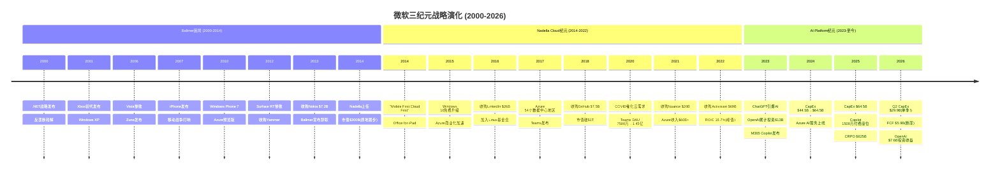

### 3.2 Ballmer困局: Windows围城与失落的十四年 (2000-2014)

**战略逻辑**: Ballmer时代的微软被困在一个经典的创新者困境中——Windows和Office的双寡头利润太丰厚，以至于任何可能蚕食这两条产品线的创新都遭到内部抵制。"Windows everywhere"战略将所有新业务线（手机、搜索、云）都绑定在Windows内核上，而非根据市场需求独立发展。

**关键失败清单**:

- **移动端**: Windows Phone市场份额从2012年峰值3.6%→2016年0.7%，Nokia收购$7.2B几乎全额减记$7.6B [DM-P1A-001]。根本原因不是技术——Windows Phone的Metro UI在2010年评价颇高——而是App生态系统的鸡生蛋悖论: 开发者不为3%份额写App，用户不为无App的平台买单。
- **搜索**: Bing从2009年上线至2014年累计亏损超$10B [DM-P1A-002]，市场份额始终在15-20%徘徊。Ballmer将Bing视为"战略必需品"而非独立盈利单元，这一决策直到AI时代才开始显示其长期价值。
- **平板/硬件**: Surface RT于2013年减记$9B [DM-P1A-003]，试图用Windows ARM版对抗iPad的策略完全失败——企业用户需要x86兼容性，消费者需要App生态，Surface RT两者都不提供。

**财务转折(或缺失)**: FY2000至FY2014，微软营收从$23B增长至$87B（CAGR 10%），但市值从$510B峰值跌至$300B [DM-P1A-004]——14年市值净缩水40%。P/E从60x压缩至14x，市场对微软的定价从"增长股"完全转为"价值陷阱"。

**关键决策评价**: Ballmer的根本错误不在于任何单一产品的失败，而在于**组织架构**——Windows部门拥有事实上的否决权，任何可能威胁Windows收入的创新都无法获得资源倾斜。2013年"One Microsoft"重组来得太晚。唯一的战略远见是2010年启动Azure预览版 [DM-P1A-005]——这颗在Ballmer时代种下的种子，成为Nadella时代的核心引擎。

### 3.3 Nadella Cloud纪元: 从$300B到$3T的战略重塑 (2014-2022)

**战略逻辑**: Nadella上任后的第一个关键决策不是技术性的，而是文化性的——用"Mobile First, Cloud First"取代"Windows everywhere"。这不仅是口号变更，而是权力结构重组: Windows从利润中心降级为Azure获客渠道，Office从一次性许可证转型为SaaS订阅，开源从"癌症"(Ballmer 2001年语)变为战略武器。

**三大战略支柱**:

**支柱一: Azure从零到$75B** [DM-P1A-006]

Azure的成功并非源于技术领先(AWS领先5年)，而是三条差异化路径的叠加:
1. **企业关系杠杆**: 微软拥有全球最大的企业销售网络(10万+合作伙伴)，Azure通过EA协议与M365/Dynamics捆绑销售，将现有客户关系转化为云收入——这是AWS不具备的渠道优势。
2. **混合云定位**: Azure Stack让企业在本地数据中心运行Azure服务，满足了金融/政府/医疗等行业的合规需求——在2016-2020年，这是Azure对AWS最大的差异化。
3. **开发者生态翻转**: 2016年加入Linux基金会、2018年收购GitHub $7.5B [DM-P1A-007]，彻底扭转了微软在开发者社区的形象。GitHub从收购时的2800万开发者增长至2025年的1.5亿+。

CapEx投入从FY14的$5.5B逐步攀升至FY18的$11.6B [DM-P1A-008]，CapEx/Revenue从6.3%升至10.6%——增量仅4个百分点，节奏温和且可控。Azure数据中心从2014年的10个地区扩张至2018年的54个地区，覆盖全球主要经济体。

**支柱二: Office订阅化与ROIC跃升**

Office 365的订阅转型是微软历史上最成功的商业模式变革。从FY14到FY22，Office收入从$25B增长至$43B+ [DM-P1A-009]，更关键的是**收入质量**从一次性许可证(lumpy)转为可预测的经常性收入(recurring)。这一转型:
- 将客户生命周期价值(LTV)提升3-5倍: 一次性许可$150-250 vs 订阅$150-400/年/用户
- 将更新周期从3-5年压缩至持续滚动更新，消除了"跳版本"的收入波动

ROIC路径完美验证了Cloud纪元投资的价值: FY14 ROIC 7.2% → FY18 9.4%(首次超越WACC ~8%) → FY22 16.7%(峰值) [DM-P1A-010]。从投入启动到ROIC>WACC耗时**4年**，到双位数ROIC耗时**5年**——这个时间窗口成为评估第三纪元的关键基准。

**支柱三: M&A构建生态拼图**

Nadella的收购策略有清晰的逻辑链条: LinkedIn $26B(2016)补齐专业社交 [DM-P1A-011] → Nuance $20B(2021)获取医疗AI [DM-P1A-012] → Activision $69B(2022)进入消费内容 [DM-P1A-013]。但商誉累积至$119.5B(占总资产19.3%) [DM-P1A-014]，其中Activision $51B商誉在Gaming分部-9% YoY的背景下构成潜在减值风险(关联CQ7)。

**市值验证**: $300B(2014) → $1T(2019) → $2.5T(2021) → $3T+(2024峰值) [DM-P1A-015]。10年10倍，年化复合回报25.9%，是同期大盘(SPY CAGR ~13%)的2倍。

### 3.4 AI Platform纪元: OpenAI赌注与CapEx爆炸 (2023-至今)

**战略逻辑**: 2019年首笔$1B投资OpenAI时，微软面对的是一个经典的"不对称赌注"——$1B对彼时$1.1T市值公司而言是零头，但如果大语言模型确实是下一个计算范式，这笔投资的期权价值巨大。到2023年ChatGPT爆发，微软将投资累计扩大至$13B [DM-P1A-016]，并将OpenAI模型深度整合至Azure AI Services和M365 Copilot。

**关键数据点**:

- **投资回报**: $13B投入 → 持股~27%(重组后) [DM-P1A-017]，OpenAI估值$135B，投资回报>10x [DM-P1A-018]，Q2 FY26录得投资收益$7.6B(但属非经营性)
- **Azure AI拉动**: Azure及其他云服务FY26 Q2收入增长39% YoY [DM-P1A-019]，管理层披露AI服务贡献"约13个百分点"的Azure增速，即Azure有机增速~26%，AI增量~$3.2B/季
- **Copilot部署**: 1500万付费座位 [DM-P1A-020]，渗透率仅3.3%(15M/450M M365用户)，DAU同比增长10x，但货币化进展远慢于Azure
- **CRPO爆炸**: $625B(+110% YoY) [DM-P1A-021]——但45%来自OpenAI $250B Azure承购协议 [DM-P1A-022]，剔除后有机CRPO $344B(+28% YoY)

**CapEx爆炸——核心矛盾所在**:

FY24 CapEx $44.5B → FY25 $64.5B → FY26指引~$80B [DM-P1A-023]，CapEx/Revenue从FY23的13.3%飙升至FY26的~26% [DM-P1A-024]。与Cloud纪元对比: 上一周期CapEx/Revenue增量仅4个百分点(6%→10%)，当前周期增量**13个百分点**(13%→26%)——投入强度是前次的3倍以上。

Q2 FY26是矛盾的集中爆发点: CapEx $29.9B，占收入36.8% [DM-P1A-025]，OCF $35.8B被CapEx消耗83.5%，FCF仅$5.9B——**首次不足以覆盖季度股息$6.8B** [DM-P1A-026]。这是微软现代史上第一次出现"CapEx侵蚀股息覆盖"的局面。

**ROIC已进入下行通道**: 从FY22峰值16.7%降至FY25的22.0%(baggers口径)/12%(补充分析模型口径) [DM-P1A-027]。若参照Cloud纪元4年ROIC>WACC的经验，AI纪元的ROIC恢复窗口大概率在FY28-FY30(5-7年) [DM-P1A-028]——比Cloud纪元慢1-3年，因为投入强度更高。

### 3.5 核心论点: 第三次赌注的杠杆是否过度?

三个纪元的对比揭示一个清晰的模式: **每一次平台跃迁所需的资本强度呈指数级增长**。

| 纪元 | 累计CapEx | CapEx/Revenue峰值 | ROIC>WACC耗时 | 结局 |
|------|----------|-------------------|---------------|------|
| Cloud(FY14-18) | ~$40B | 10.6% | 4年 | 成功(ROIC 16.7%峰值) |
| AI(FY23-26E) | ~$190B(3年) | 26%+ | 5-7年(预测) | 待验证 |

Cloud纪元的成功有三个前提条件: (1)企业上云是确定性趋势而非概率事件; (2)Azure通过EA捆绑+混合云差异化建立了持久竞争壁垒; (3)CapEx增速始终温和可控。AI纪元的三个前提条件目前均存在不确定性: (1)企业AI采用曲线可能远慢于云(Copilot 3.3%渗透率为证); (2)AI可能成为"低毛利基础设施"而非"高毛利平台"(Gemini免费+Llama开源构成定价压力); (3)CapEx增速已严重挤压FCF。

Nadella在第三次赌注中是否过度杠杆化? 答案取决于一个关键假设: **AI的企业货币化速度是否能在FY27-FY28复制Azure在FY18-FY20的加速曲线**。如果可以，$190B累计投入将像Cloud纪元一样创造巨大的护城河和规模效应; 如果不能，微软将面临ROIC持续低于WACC、FCF无法恢复、D&A浪潮吞噬利润率的三重困境。这正是CQ2(FCF恢复时间)和CQ4(Copilot渗透率)试图回答的核心问题。

---

## Ch4: 八大业务基元映射 — 微软帝国的收入地图

### 4.1 从三大分部到八大基元: 财报之下的真实结构

微软的三大财报分部(Intelligent Cloud / Productivity & Business Processes / More Personal Computing)是为SEC合规设计的分类框架，并不反映业务间真实的战略逻辑和价值链关系。要理解微软帝国的运转方式，需要将其拆解为八大业务"基元"(primitive)——每个基元都是一个独立的价值创造单元，但彼此之间存在复杂的供给、需求、锁定和协同关系。

### 4.2 八大基元全景

**基元一: M365(生产力套件)** — 现金奶牛之王

- **收入规模**: 估算~$70B/年(FY25，P&BP分部$113.6B的核心) [DM-P1A-029]
- **增速**: ~15% YoY(席位增6% + ARPU增8-9%) [DM-P1A-030]
- **OPM**: P&BP分部整体60.3%(Q2 FY26) [DM-P1A-031]，M365自身估算55-62%(LinkedIn拉低分部均值)
- **生态角色**: **绝对核心现金奶牛**。4.5亿付费用户 [DM-P1A-032] 构成微软最大的分发渠道——Copilot、Teams、Defender等新产品全部通过M365用户基座渗透。M365是微软从"卖软件"转向"卖平台"的枢纽。
- **关键指标**: ARPU从FY19 ~$102增长至FY25 ~$162(CAGR ~8%) [DM-P1A-033]，2026年7月再涨价8-13%，预计年化增量收入~$10.7B

**基元二: Azure(云基础设施+AI)** — 增长引擎

- **收入规模**: FY25 Intelligent Cloud分部收入$113B中，Azure估算~$75B [DM-P1A-034]
- **增速**: 39% YoY(Q2 FY26报告口径) [DM-P1A-035]，其中AI贡献~13pp
- **OPM**: IC分部42.1%(Q2 FY26) [DM-P1A-036]，但Azure自身可能低于分部均值(Server Products拉高)
- **生态角色**: **核心增长引擎+AI基础设施**。Azure既是收入增长的最大贡献者，也是CapEx最大消耗者($80B/年CapEx的~75%投向Azure) [DM-P1A-037]。Azure的双重角色(外部客户+OpenAI内部消耗)使其收入质量评估变得复杂。

**基元三: GitHub + VS Code(开发者平台)** — 战略棋子

- **收入规模**: GitHub ARR ~$3.5B(FY25估算)，VS Code免费(获客工具)
- **增速**: GitHub Enterprise 40%+ YoY
- **OPM**: 未单独披露，估算25-35%(开源社区维护成本高)
- **生态角色**: **开发者锁定的关键入口**。1.5亿+GitHub用户 → GitHub Copilot($10-20/月) → Azure DevOps → Azure部署 → 形成开发者全栈锁定。90% Fortune 100使用GitHub Enterprise [DM-P1A-038]。VS Code是全球使用最广泛的IDE(73%市场份额)，免费但深度集成Azure插件。

**基元四: OpenAI合作** — 高赌注期权

- **收入规模**: OpenAI对Azure的直接消耗估算$3-5B/年 [DM-P1A-039]；OpenAI $250B Azure承购协议未来兑现 [DM-P1A-040]
- **增速**: CRPO中OpenAI贡献同比增长显著(Q2 FY26 CRPO $625B中~45%为OpenAI)
- **OPM**: 负(OpenAI本身亏损，Azure对OpenAI的定价可能含战略折扣)
- **生态角色**: **AI能力核心供给方+最大单一客户**。OpenAI提供GPT-4o/o1等模型 → Azure OpenAI Services对外销售 → M365 Copilot内置。但双重身份(供应商+客户)创造了复杂的利益冲突和估值难题(关联CQ3)。

**基元五: Defender/Security** — 高增长附加

- **收入规模**: 安全业务ARR ~$25B(FY25) [DM-P1A-041]
- **增速**: ~30% YoY
- **OPM**: 高(软件边际成本趋零)，估算65-70%
- **生态角色**: **高利润率增长引擎+深度锁定工具**。Defender、Sentinel、Entra ID、Intune构成企业安全全栈。安全产品一旦部署，替换成本极高(涉及合规审计+数据迁移+策略重配)。Security Copilot($4/次)是AI货币化的另一条路径。

**基元六: LinkedIn** — 独立现金流发生器

- **收入规模**: ~$18B/年(FY25) [DM-P1A-042]
- **增速**: ~9-10% YoY
- **OPM**: 估算35-40%(低于M365，因内容+社区运营成本)
- **生态角色**: **独立现金流+数据资产**。10亿+用户的职业图谱是独特资产，LinkedIn Recruiter/Sales Navigator/Learning是B2B SaaS产品。与M365的协同有限(Outlook集成、Teams会议)，但LinkedIn数据对AI训练和企业智能有长期战略价值。

**基元七: Xbox/Gaming** — 战略赌注(亏损边缘)

- **收入规模**: MPC分部$14.3B中Gaming估算~$7-8B(Q2 FY26) [DM-P1A-043]
- **增速**: **-9% YoY**(Q2 FY26 MPC同比-3%)
- **OPM**: MPC分部26.7% [DM-P1A-044]，但Gaming自身可能低于20%(Activision整合成本+内容投资)
- **生态角色**: **消费端入口(战略地位不确定)**。$69B收购Activision附带$51B商誉 [DM-P1A-045]，Game Pass订阅模式尚未证明可以抵消硬件周期波动。Gaming与微软核心企业业务的协同效应目前仍然模糊。

**基元八: Windows/设备** — 遗产资产

- **收入规模**: Windows OEM + Surface + Search，MPC分部中$6-7B/季
- **增速**: 个位数低增长(PC换机周期波动)
- **OPM**: Windows OEM利润率极高(>80%，纯许可费)，Surface利润率低(<10%)
- **生态角色**: **生态基座+AD获客入口**。全球73%企业PC运行Windows [DM-P1A-046]，这是AD/Entra ID→M365→Azure生态链的物理入口。Windows本身的收入增长空间有限，但其生态杠杆价值巨大——只要企业用Windows PC，就几乎不可能完全脱离微软生态。

### 4.3 分部映射与基元交叉

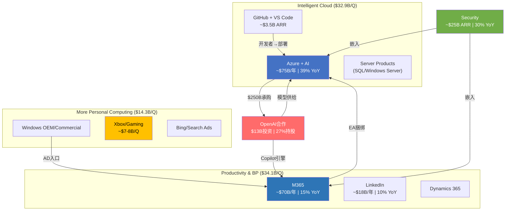

### 4.4 角色分类与价值判断

| 基元 | 角色 | 收入贡献 | 利润贡献 | 战略价值 | 综合评级 |
|------|------|---------|---------|---------|---------|
| M365 | 现金奶牛 | 23% | ~30% | 分发渠道+锁定基座 | S级 |
| Azure | 增长引擎 | 25% | ~20% | AI基础设施+未来中枢 | S级 |
| Security | 高增长附加 | 8% | ~10% | 深度锁定+高利润 | A级 |
| LinkedIn | 独立现金流 | 6% | 5-6% | 数据资产+独立盈利 | A级 |
| GitHub/VS | 战略棋子 | 1% | ~1% | 开发者锁定入口 | A级(战略) |
| OpenAI | 高赌注期权 | 1-2% | 负 | AI能力核心来源 | B级(风险高) |
| Windows | 遗产基座 | 7% | ~12% | 生态物理入口 | B级(稳定) |
| Gaming | 战略赌注 | 5% | 2-3% | 消费端入口(待验证) | C级 |

**核心发现**: 微软的利润引擎(M365+Windows)和增长引擎(Azure+Security)之间存在**健康的互补关系**——前者提供现金流，后者消耗现金流但创造未来价值。真正的风险不在于任何单个基元的衰退，而在于**增长引擎消耗现金的速度是否超过了现金奶牛的供给能力**(CQ2/CQ5的核心矛盾)。Q2 FY26 FCF $5.9B < 股息$6.8B [DM-P1A-047] 的事实表明，这一平衡已经开始倾斜。

---

## Ch5: 平台经济学 — 网络效应与锁定的量化解剖

### 5.1 四层锁定矩阵: 微软企业生态的"逃逸速度"

微软的企业锁定不是单一产品的粘性，而是**四层嵌套式锁定结构**——每一层都独立创造迁移阻力，但四层叠加后形成的综合锁定效应使得大型企业的完全脱离几乎不可能。这是微软定价权的根基，也是CQ5(现金奶牛持续性)最核心的证据。

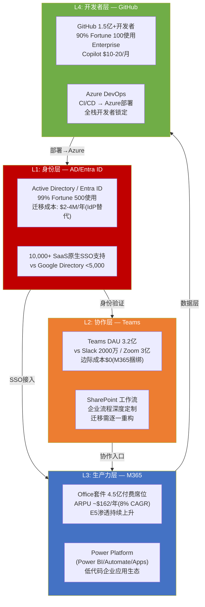

### 5.2 逐层锁定深度分析

**L1: 身份层 — Active Directory/Entra ID**

锁定强度: **极高(9/10)**

AD/Entra ID是微软生态的"万能钥匙"——99% Fortune 500企业使用AD作为唯一身份认证源 [DM-P1A-048]。这不仅仅是一个目录服务，而是一个深度嵌入企业IT基础设施的身份管理平台:

- **SSO整合规模**: AD原生支持10,000+第三方SaaS应用的单点登录(SAML/OAuth) [DM-P1A-049]，Google Workspace Directory支持不到5,000个。这意味着企业如果放弃AD，需要额外部署Okta等独立IdP，增量成本$3-8/用户/月。
- **设备管理绑定**: Intune/Autopilot通过AD Group Policy管理Windows设备——全球85%企业PC运行Windows [DM-P1A-050]，AD对Windows设备的管理是**无等效替代**的。macOS和Linux设备可以用Jamf/Chef，但混合环境下AD仍是统一管理的唯一选择。
- **迁移成本量化**: Fortune 500级企业(50,000人)从AD迁出的增量IdP成本约$2-4M/年 [DM-P1A-051]，加上SSO重新整合的项目成本$1-3M，总计3年锁定成本$9-15M——仅身份层一项。

**关键洞见**: AD的锁定是**结构性的而非功能性的**——竞争对手的产品在功能上可能等价甚至更优(Okta的零信任架构)，但AD作为Windows生态的原生组件，其替换不仅涉及产品切换，还涉及整个IT运维体系的重构。这是微软定价权最深的护城河。

**L2: 协作层 — Teams + SharePoint**

锁定强度: **高(7/10)**

Teams的市场地位建立在一个简单的经济逻辑上: **边际成本为零**。Teams免费捆绑在M365订阅中 [DM-P1A-052]，而Slack单独收费$7.25-12.50/用户/月，Zoom Phone $10-20/用户/月。当M365已经是企业标配时，选择Teams的决策几乎无需论证——CFO不会批准为一个M365已经免费提供的功能额外付费。

- **DAU**: 3.2亿(2025) vs Slack 2000万 / Zoom 3亿 [DM-P1A-053]
- **EU反垄断**: 欧盟对Teams捆绑行为展开调查，微软已在EU市场将Teams从M365中解绑。但解绑后Teams独立售价仅$5.25/用户/月，仍远低于Slack——定价权损失有限。
- **SharePoint深度定制**: 大型企业在SharePoint上构建数百个定制工作流(审批、文档管理、项目看板)。迁移至Google Sites/Confluence需要**逐一重构**——估算100个企业流程 × $50K/流程 = $5M重构成本 [DM-P1A-054]

**L3: 生产力层 — M365套件**

锁定强度: **高(8/10)**

M365的锁定不在于Word/Excel/PowerPoint的文档编辑功能(Google Docs已具备90%+功能对等)，而在于三个维度的深度集成:

1. **Power Platform生态**: Power BI(商业智能)、Power Automate(流程自动化)、Power Apps(低代码应用)构成企业内部应用开发平台。企业在Power Platform上构建的应用越多，迁移成本越高——这是一个**正反馈锁定循环**。
2. **EA协议捆绑**: M365 + Azure + Dynamics 365通过Enterprise Agreement统一采购，跨产品折扣杠杆使得单独替换任何一个产品都会导致其他产品价格上升。
3. **Copilot附加**: $30/用户/月的Copilot建立在M365数据层之上(访问邮件/文档/会议记录)，如果迁离M365，Copilot投资归零。

**定价权量化**: M365商业版在2022年3月实施11年来首次涨价(E3 +15%)，结果:
- 席位增速短暂下降~3个百分点(从+15%→+12%)，之后恢复 [DM-P1A-055]
- 客户流失率微乎其微——**隐含价格弹性仅约-0.2** [DM-P1A-056]，即涨价15%仅损失3%需求，属于极低弹性(强定价权)
- 2026年7月再次涨价(E3 +13%, E5 +5.3%)，预计年化增量收入~$10.7B [DM-P1A-057]，流失率预期<1%

**L4: 开发者层 — GitHub + VS Code**

锁定强度: **中高(6/10)**

GitHub拥有1.5亿+开发者用户，90% Fortune 100使用GitHub Enterprise [DM-P1A-058]。开发者锁定的逻辑链条是:

```
VS Code(免费IDE, 73%市场份额) → GitHub Copilot($10-20/月AI辅助) → GitHub Enterprise($21/用户/月代码托管) → Azure DevOps(CI/CD管道) → Azure(部署目标)
```

每一步的替代方案都存在(JetBrains/GitLab/Jenkins/AWS)，但**全栈替换的协调成本**远超单一工具切换。GitHub Enterprise与GitLab定价差距很小($21 vs $19/月) [DM-P1A-059]，但代码库迁移(history + CI/CD pipeline + access control重建)的项目成本通常为$200K-$1M。

### 5.3 网络效应分析: 直接 vs 间接

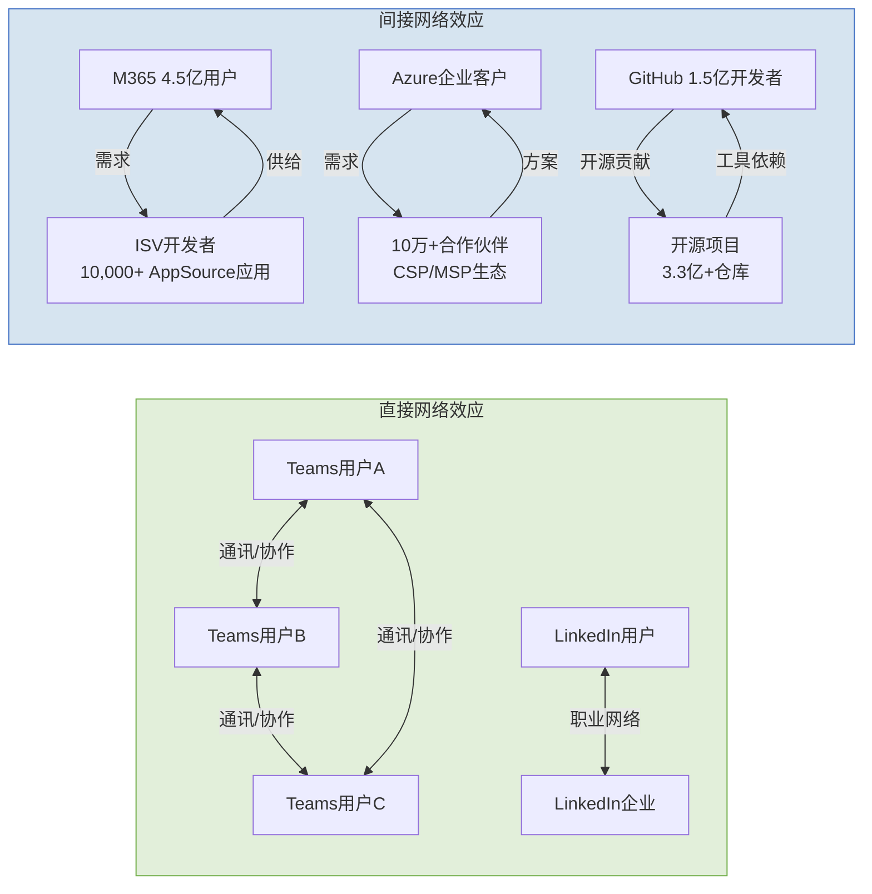

**直接网络效应(弱到中)**:

- **Teams**: 经典的通讯工具网络效应——企业内部用户越多，Teams越成为默认协作工具。但跨企业网络效应受限: 企业间视频会议仍以Zoom/Teams/Google Meet混用为主，没有形成赢家通吃。直接网络效应评分: **5/10**。
- **LinkedIn**: 职业社交网络效应较强——招聘者和求职者的双边市场。10亿+用户使LinkedIn在专业社交领域几乎没有对手(Indeed/Glassdoor偏蓝领)。直接网络效应评分: **8/10**。

**间接网络效应(中到强)**:

- **M365 + ISV生态**: AppSource上10,000+第三方应用为M365用户提供增值功能(项目管理、CRM、HR)，M365用户基数越大，ISV开发动力越强，反过来吸引更多用户。这是微软生态最强的间接网络效应。评分: **7/10**。
- **Azure + 合作伙伴**: 10万+CSP/MSP合作伙伴基于Azure构建行业解决方案，形成AWS难以复制的企业销售渠道。Azure的合作伙伴密度是GCP的3-5倍。评分: **7/10**。
- **GitHub + 开源**: 3.3亿+代码仓库创造了全球最大的代码知识图谱，GitHub Copilot的训练数据优势直接源于此。但开源社区的锁定相对脆弱——开发者可以同时使用GitLab作为备选。评分: **6/10**。

### 5.4 定价权的三重证据

**证据一: M365 ARPU持续扩张**

M365 ARPU从FY19的~$102增长至FY25的~$162，6年CAGR约8% [DM-P1A-060]。增长来源分解:

| 驱动力 | 贡献占比 | 机制 |
|--------|---------|------|
| E3→E5升级 | ~40% | E5比E3贵$24/月(+67%溢价)，E5采用率持续攀升 |
| 列表价涨价 | ~30% | 2022涨价+2026涨价，频率从11年/次→4年/次加速 |
| Copilot附加 | ~15% | $30/用户/月，当前渗透率3.3%但增速160%+ YoY |
| 附加服务 | ~15% | Power Platform、Viva、Defender等增值模块 |

ARPU增速的稳定性(每年7-14%)比绝对值更重要——它表明微软拥有**持续提取更多价值**的能力，而非依赖单次涨价。席位增速从FY20的+26%放缓至FY25的+6% [DM-P1A-061]，但收入增速维持+15%——差额完全由ARPU贡献，证明微软的增长引擎正在从"卖更多席位"转向"从每个席位提取更多价值"。

**证据二: Azure定价权——不在价格，在生态**

Azure的定价权悖论: 在几乎所有单项产品比较中，Azure的价格要么与AWS持平，要么略贵6-9% [DM-P1A-062]。

| 产品类别 | Azure vs AWS | Azure vs GCP |
|----------|-------------|-------------|
| VM(按需) | 持平($140.16/月) | 便宜1.9% |
| VM(1年承诺) | 贵8.8% | 贵6.4% |
| 热存储 | **便宜20%** | 便宜0.6% |
| 数据库 | 持平 | 持平 |
| AI API(GPT-4o) | — | **贵1.1-1.8x**(vs Gemini) |

但Azure的真实定价权不来自产品价格，而来自**三层生态杠杆**:

1. **EA捆绑折扣**: M365+Azure+Dynamics统一采购，跨产品折扣可达20-35% [DM-P1A-063]——但客户需要将所有IT支出集中在微软生态内才能获得最大折扣。这是AWS/GCP无法复制的机制(它们没有Office/LinkedIn可以捆绑)。
2. **Hybrid Benefit**: 已有SQL Server/Windows Server许可的企业迁移至Azure可节省40%+ [DM-P1A-064]。这将微软数十年积累的许可证基数转化为Azure获客优势——一种零边际成本的竞争武器。
3. **迁移壁垒**: PB级数据迁出费用$100K+ + 应用重构$500K-$5M+ + AD/Entra ID重新整合 [DM-P1A-065]——对大型企业而言，即使AWS在某些领域便宜15-25%，迁移的一次性成本通常需要3-5年才能收回。

**证据三: Fortune 500迁移总成本拆解**

Fortune 500级企业(50,000员工)从微软全生态迁移至替代方案的**3年总成本**:

| 成本项 | 金额 | 说明 |
|--------|------|------|
| 许可证差价节省 | -$1.5M/年 | Google Workspace通常便宜10-15% |
| M365迁移项目 | $3-8M | 邮件+文档+SharePoint工作流 |
| AD/IdP替换 | $6-12M(3年) | Okta/Ping替代AD，50K用户×$4-8/月 |
| 应用重构 | $5M | 100个Power Platform流程重建 |
| 培训+停机 | $3.5M | 50K用户再培训+迁移期业务中断 |
| 数据迁移风险 | $10-20M | 5PB数据迁移，失败风险20%的期望成本 |
| **总迁移成本** | **$25-45M** | **每用户$167-300/年锁定税** [DM-P1A-066] |

与此对比: M365许可费节省仅$1.5M/年(3年$4.5M)。**迁移成本是3年许可费节省的5-10倍**——这就是为什么M365 Enterprise年流失率估算仅5-8% [DM-P1A-067]，远低于SaaS行业平均18%。

更值得注意的是: 搜索结果中**零个**大型企业从M365完全迁移至Google Workspace的公开案例 [DM-P1A-068]。64%的组织运行M365+Google双栈环境 [DM-P1A-069]，但这通常是"部门级补充"(营销用Google Docs, IT核心用M365)而非"替换"。

### 5.5 定价权的可持续性评估: 威胁与反脆弱

**短期威胁(1-2年)**:
- **EU DMA对Teams的解绑**: 已在欧洲市场执行，Teams独立售价$5.25/月。影响有限——解绑后用户仍选择Teams(因同事都在用)，但解绑先例可能延伸至其他捆绑产品(Defender、Copilot)。
- **Google Workspace涨价缩小差距**: Google 2025年涨价16-22%(强制捆绑Gemini) [DM-P1A-070]，反而推动了部分企业从Google向M365反向迁移——这是微软定价权的一个反直觉增强信号。

**中期威胁(3-5年)**:
- **AI侵蚀文档工具护城河**: 如果AI Agent能直接生成文档/演示/电子表格，Word/PowerPoint/Excel的工具价值可能下降。但微软通过将Copilot深度集成到M365中，试图将AI从"颠覆者"转化为"增值层"——从卖工具转向卖"工具+AI助手"的捆绑。
- **开源替代**: LibreOffice/ONLYOFFICE在功能上已覆盖80%+ Office需求，但缺乏企业级管理/合规/集成能力，对Fortune 500的威胁可忽略。

**长期结构性优势(5-10年)**:
- **身份层不可替代**: 只要Windows保持企业PC主导地位(73%)，AD/Entra ID就是不可绕开的身份基础设施。Windows份额在AI Agent/浏览器OS等趋势下可能缓慢下降，但企业市场的惰性意味着这一过程以十年为单位。
- **数据层持续加深**: 企业在M365中积累的邮件、文档、会议记录、团队对话数据越来越多，这些数据是Copilot的燃料——数据越多→Copilot越有用→用户越不愿离开→数据越多。这是一个自我强化的飞轮。

### 5.6 平台经济学综合评估

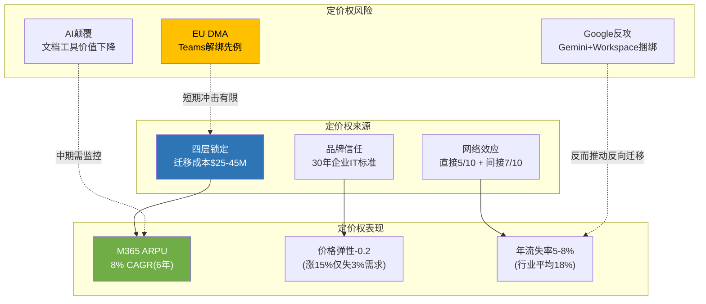

**平台经济学总结判断**:

微软的平台锁定强度在大型科技公司中仅次于苹果(设备+App Store)，且在企业市场可能是最强的。四层锁定矩阵(身份→协作→生产力→开发者)创造了$25-45M的Fortune 500迁移成本 [DM-P1A-071]，价格弹性仅-0.2 [DM-P1A-072]，M365 ARPU保持8% CAGR [DM-P1A-073]，年流失率5-8%远低于行业平均 [DM-P1A-074]。

这对CQ5(现金奶牛持续性)的回答是: **M365/Windows/AD构成的现金奶牛具有极强的结构性持续性，至少未来5-10年不会面临实质性威胁**。真正的风险不是现金奶牛消失，而是现金奶牛的增长速度(~15%)是否能持续超越AI纪元CapEx的消耗速度(~25-30%/年增长)。

对TP01(微软能否维持45%+ OPM)/TP05(M365定价权)/TP06(四层锁定矩阵耐久性)的关联判断:
- **TP01**: M365 P&BP分部OPM已达60.3% [DM-P1A-075]，是OPM的压舱石。但IC分部OPM 42.1%(AI折旧拉低)正在拖累整体——分部间的利润率分化将决定总体OPM走向。
- **TP05**: M365定价权评分8/10，每4年可涨价8-15%且近零流失——这是微软估值中最确定性的组成部分。
- **TP06**: 四层锁定在未来3-5年内坚如磐石; 5-10年视角下需关注AI Agent是否改变企业IT采购逻辑(从"买工具套件"转向"买AI能力接口")。
## Ch6: 风险拓扑 — 七大风险节点与系统性关联

### 6.1 风险节点识别与定义

微软当前面临的风险并非孤立事件的随机组合，而是一个高度互联的拓扑网络。七大核心风险节点如下:

| 编号 | 风险节点 | 关联CQ | 类型 | 独立概率(24个月) | 市值影响 |
|------|---------|--------|------|-----------------|---------|
| **R1** | CapEx过度投入/ROIC不恢复 | CQ2 | 结构性(S) | 15-20% [DM-P1B-001] | -$200B~-$400B |
| **R2** | OpenAI依赖/关系破裂 | CQ3 | 制度性(I) | 5-8% [DM-P1B-002] | -$150B~-$250B |
| **R3** | Azure增速骤降 | CQ1 | 周期性(C) | 10-15% [DM-P1B-003] | -$150B~-$300B |
| **R4** | Copilot变现失败 | CQ4 | 周期性(C) | 20-30% [DM-P1B-004] | -$100B~-$200B |
| **R5** | 反垄断/监管分拆 | CQ6 | 制度性(I) | 3-8% [DM-P1B-005] | -$100B~-$350B |
| **R6** | Activision减值 | CQ7 | 结构性(S) | 25-35% [DM-P1B-006] | -$5B~-$30B |
| **R7** | AI军备竞赛(开源冲击定价权) | CQ-B | 周期性(C) | 25-35% [DM-P1B-007] | -$50B~-$150B |

**概率校准来源**: R1/R4概率来自Polymarket风险校准(BS-7/BS-8) [DM-P1B-008]；R2概率基于PBC重组后MSFT锁定27%永久持股的缓释效应 [DM-P1B-009]；R5概率考虑SCOTUS弱化FTC执法81.3%概率 [DM-P1B-010]；R6概率基于Gaming Q2 FY26 -9% YoY及MPC报告单元隐含EV仍大幅富裕的对冲 [DM-P1B-011]。

### 6.2 七大风险详解

**R1: CapEx过度投入/ROIC不恢复**

FY2026 CapEx指引约$80B(仅PPE口径) [DM-P1B-012]，含Finance Lease后总Capital Spend达~$150B/年 [DM-P1B-013]。Q2 FY26单季CapEx已达$29.9B，CapEx/Revenue比率从FY23的13.3%飙升至Q2 FY26的36.8% [DM-P1B-014]。ROIC已从FY20的43.4%下降至FY25的23.8% [DM-P1B-015]。关键传导链: CapEx激增→D&A滞后攀升(当前年化$40-45B，2-3年内可能升至$50-60B)→Operating Margin承压2-3个百分点→FCF持续被挤压(Q2 FY26 FCF仅$5.9B，不足以覆盖季度股息$6.8B [DM-P1B-016])。

**R2: OpenAI依赖/关系破裂**

$625B CRPO中约45%(~$281B)来自OpenAI [DM-P1B-017]。2025年10月PBC重组后MSFT锁定27%永久股权 [DM-P1B-018]，但MSFT不再享有作为OpenAI计算提供商的优先认购权(ROFR丧失) [DM-P1B-019]。OpenAI API仍独占于Azure，但非API产品可多云部署。收入分成从当前~20%将在2030年降至~10% [DM-P1B-020]。若关系实质破裂，CRPO瞬间缩水$281B，Azure最大单一客户流失(估算当前消耗$3-5B/年 [DM-P1B-021])。

**R3: Azure增速骤降**

Azure Q2 FY26增速39%(恒定汇率38%) [DM-P1B-022]。管理层指引Q3 FY26 Azure CC增速31-32%，环比减速7个百分点 [DM-P1B-023]。$3T市值隐含Azure 5年CAGR需维持25%+(CQ1核心假设)。若AI需求不及预期或产能过剩导致增速骤降至15-20%，市场将重新评估MSFT的AI溢价。

**R4: Copilot变现失败**

M365 Copilot付费座位1500万，渗透率仅3.3%(15M/450M) [DM-P1B-024]。即使100%按$30/月收费，年化收入仅$5.4B [DM-P1B-025]，占总CapEx的6.75%。管理层对Copilot采用"关注毛利率和LTV而非短期货币化"的表态(CFO Amy Hood) [DM-P1B-026]，暗示当前仍处投入期。

**R5: 反垄断/监管分拆**

FTC于2026年2月升级调查，向6+家竞争对手发送民事调查传票(CIDs) [DM-P1B-027]，聚焦三领域: OpenAI合作关系、产品捆绑、Azure锁定。但SCOTUS大概率(81.3%)允许总统解雇FTC委员 [DM-P1B-028]，叠加Trump政府倾向行为性救济而非结构性分拆。EU DMA方面，2025年9月MSFT已接受Teams解绑承诺方案，避免最高$21B+罚款 [DM-P1B-029]。

**R6: Activision减值**

$75.4B收购中$51B为Goodwill [DM-P1B-030]。Gaming Q2 FY26收入-9% YoY、Xbox硬件-32%、内容&服务-5% [DM-P1B-031]。Game Pass停滞在35-37M(远低于50M目标) [DM-P1B-032]。CoD 2025销量据报下降超60% [DM-P1B-033]。但MPC整体仍盈利(Q2 $3.8B OI)，隐含MPC EV在15x OI下约$225B，远超$64B Goodwill，短期减值概率低。

**R7: AI军备竞赛(开源冲击定价权)**

Meta Llama 4于2025年4月同步上线AWS Bedrock和Azure [DM-P1B-034]。Llama 3.1 405B运行成本约为GPT-4的50% [DM-P1B-035]。Gemini 2.5 Pro定价($1.25-$2.50/M input tokens)仅为GPT-4o($5.00)的25-50% [DM-P1B-036]。DeepSeek效应已动摇AI投资叙事。开源模型在电信、银行等强监管行业因数据主权需求加速渗透。Azure AI的15-25%成本劣势(相对AWS Bedrock) [DM-P1B-037]可能在开源浪潮下被放大。

### 6.3 七乘七关系矩阵

风险间关系标注: **(+)** 协同(同时发生概率更高) | **(-)** 反协同(一个发生降低另一个概率) | **(0)** 独立(无显著关联)。

| | R1 CapEx | R2 OpenAI | R3 Azure↓ | R4 Copilot | R5 反垄断 | R6 ABK减值 | R7 开源 |
|---|---------|----------|----------|-----------|---------|----------|--------|
| **R1 CapEx** | — | (+) 弱 | **(+) 强** | (+) 中 | (0) | (0) | (+) 中 |
| **R2 OpenAI** | (+) 弱 | — | **(+) 强** | (0) | **(-)** | (0) | (+) 弱 |
| **R3 Azure↓** | **(+) 强** | **(+) 强** | — | (+) 中 | (0) | (0) | **(+) 强** |
| **R4 Copilot** | (+) 中 | (0) | (+) 中 | — | (0) | (0) | **(+) 强** |
| **R5 反垄断** | (0) | **(-)** | (0) | (0) | — | (0) | (-) 弱 |
| **R6 ABK减值** | (0) | (0) | (0) | (0) | (0) | — | (0) |
| **R7 开源** | (+) 中 | (+) 弱 | **(+) 强** | **(+) 强** | (-) 弱 | (0) | — |

**关键关联解读**:

- **R1×R3 (强协同)**: CapEx过度投入+Azure减速=最危险组合。若$80B+/年CapEx投入后Azure增速降至15-20%，ROIC跌破WACC将不可逆转。这两个风险共享相同的底层驱动因素——AI需求不及预期。
- **R3×R7 (强协同)**: 开源模型压缩Azure AI溢价→Azure增速受损。当Llama/Gemini以50-75%折扣提供可比能力时，企业没有理由为Azure OpenAI支付溢价。
- **R2×R3 (强协同)**: OpenAI独立/多云→Azure失去最大客户→CRPO缩水$281B→Azure增速机械性下降。
- **R4×R7 (强协同)**: 开源AI降低嵌入式AI成本→Copilot $30/月溢价显得过高→企业自建+开源替代方案增加。
- **R2×R5 (反协同)**: OpenAI独立反而缓解FTC对"事实控制"的反垄断指控。若OpenAI真正独立运营，MSFT面临的捆绑/锁定指控减弱。
- **R6 (高度独立)**: Activision减值风险几乎与其他6个风险节点无关联——Gaming业务独立于云/AI赛道。

### 6.4 风险簇识别

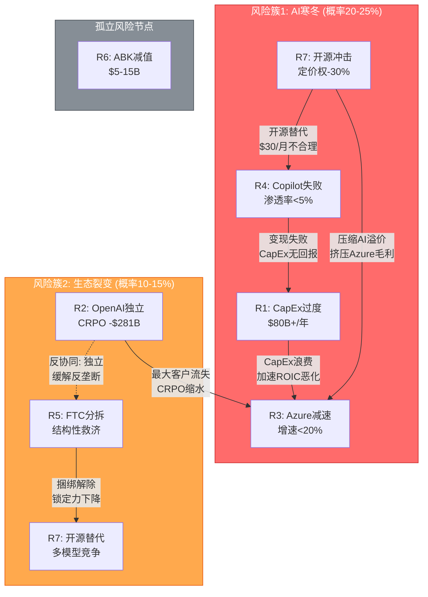

**簇1: "AI寒冬"场景 (联合概率20-25%)**

触发条件: DeepSeek式效率革命持续→企业AI支出理性回调→开源模型缩小与闭源差距→Azure AI溢价被压缩→Copilot ROI证伪→CapEx回报周期拉长至FY30+。

传导路径: R7(开源冲击)→R4(Copilot失败)+R3(Azure减速)→R1(CapEx浪费)→ROIC跌破WACC→FCF持续低于股息→市场重估。

市值影响: -$300B~-$500B (从$2,995B降至$2,500B~$2,700B) [DM-P1B-038]

为何概率高达20-25%: Copilot当前仅3.3%渗透率+开源AI成本以每6个月下降50%的速度演进+$80B/年CapEx的回收期需要Azure增速维持25%+五年。这三个条件同时成立的概率远低于市场预期。

**簇2: "生态裂变"场景 (联合概率10-15%)**

触发条件: OpenAI IPO后追求独立→多云部署分散Azure收入→FTC借势推进结构性救济→开源模型进一步侵蚀捆绑价值。

传导路径: R2(OpenAI独立)→CRPO缩水$281B→R3(Azure增速机械性下降5-8pp)→市场恐慌→R5(FTC趁势施压)。

注意反协同: R2(OpenAI独立)实际上**缓解**R5(反垄断)——若OpenAI真正独立，FTC关于"事实控制"的指控自动失效。因此簇2内部存在自我限制机制。

市值影响: -$200B~-$350B (从$2,995B降至$2,650B~$2,800B) [DM-P1B-039]

**孤立节点: R6 (Activision减值)**

Activision减值风险(概率加权$1.1-2.5B [DM-P1B-040])虽然存在，但(1)MPC报告单元整体EV远超Goodwill，(2)对MSFT $2,995B市值的影响<1%，(3)与AI/云核心叙事无关。这是一个**噪音级风险**——可能引发短期股价波动，但不改变长期估值逻辑。

### 6.5 "温水煮青蛙"场景

最危险的情景不是黑天鹅式崩溃，而是渐进恶化:

**年度推演** (概率30-40% [DM-P1B-041]):

| 年份 | CapEx | Azure增速 | ROIC | FCF | 叙事 |
|------|-------|----------|------|-----|------|
| FY26 | ~$80B | 35-39% | 20-22% | ~$65B | "投资期，等待回报" |
| FY27 | ~$90B | 28-32% | 17-19% | ~$55B | "增速放缓但仍领先" |
| FY28 | ~$95B | 22-26% | 14-16% | ~$50B | "ROIC低于WACC但接近拐点" |
| FY29 | ~$85B(开始缩减) | 18-22% | 12-14% | ~$60B(CapEx缓解) | "回报低于预期，开始削减" |
| FY30 | ~$70B | 15-18% | 15-17%(恢复) | ~$75B | "新常态: 中增速+中回报" |

这条路径的危险之处: **每个季度都"还行"**——Azure仍在增长(只是放缓)、Copilot渗透率缓慢提升(只是不达预期)、ROIC下降(但未崩溃)。市场不会一次性重估，而是通过P/E从25x缓慢压缩至18-20x，在4年间无声蚕食$500B-$700B市值 [DM-P1B-042]。

这比黑天鹅更可能发生，也更难防御——因为每个季度的财报电话都有足够的正面数据点来维持"再等一个季度"的叙事。

**识别"温水煮青蛙"的早期信号**:
- D&A增速持续超过Revenue增速(当前D&A +62% vs Revenue +17% [DM-P1B-085])
- Azure增速连续3个季度低于管理层指引中位值
- Copilot渗透率在连续4个季度后仍停留在5%以下
- FCF连续2个季度低于季度股息($6.8B/季 [DM-P1B-086])
- CapEx/Revenue比率稳定在25%以上且无下降趋势

当前这5个信号中，第1个和第5个**已经亮灯**。投资者应将此场景视为与黑天鹅同等重要甚至更重要的风险来源。

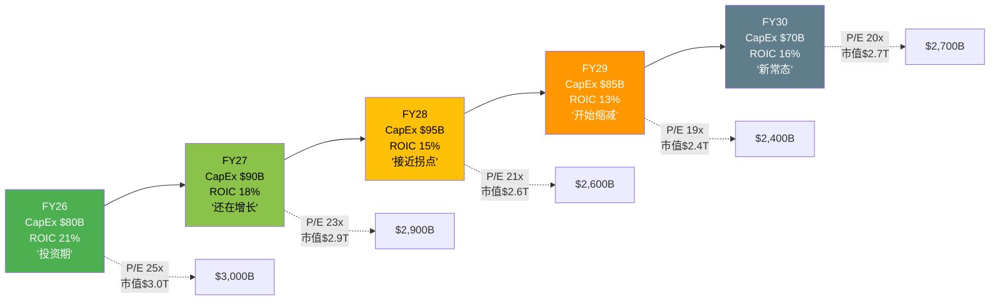

### 6.6 风险簇概率矩阵

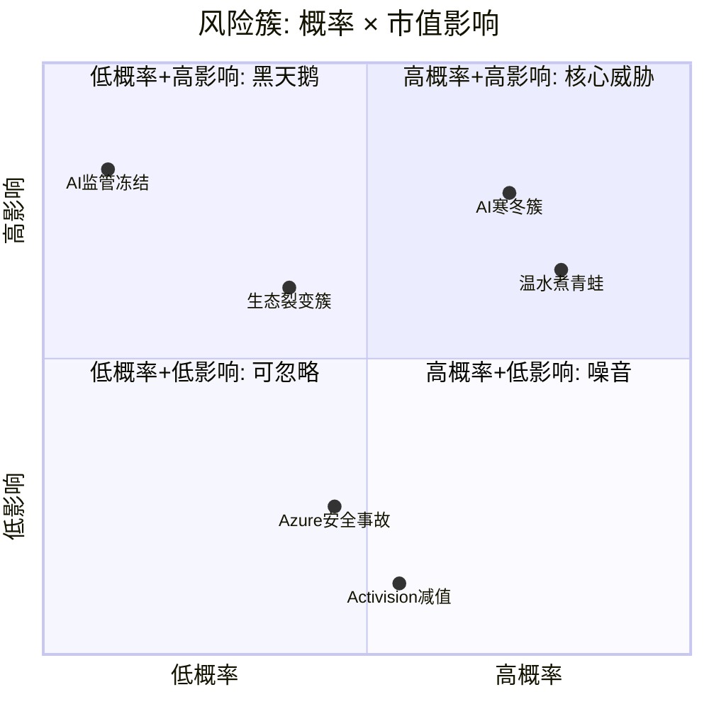

### 6.7 风险拓扑总结

七大风险中，**真正决定MSFT估值命运的是R1(CapEx)+R3(Azure增速)+R7(开源冲击)构成的三角关系**。这三个风险共享同一底层假设: AI需求的增长速度能否匹配$80B+/年的资本投入。R2(OpenAI)和R4(Copilot)是这个核心三角的放大器或缓冲器，R5(反垄断)被政治环境大幅对冲，R6(Activision)是噪音。

加权期望损失合计约$137B [DM-P1B-043]，占当前市值的4.6%。但这是简单加总——考虑到R1/R3/R7的强协同性，实际组合损失应额外加15-20%关联性溢价，调整后约$158B-$165B [DM-P1B-044]，占市值5.3-5.5%。

**风险拓扑对CQ的启示**: 本章识别的风险间关联性直接影响CQ置信度的交叉校准。CQ1(Azure增速)和CQ2(CapEx回报)不应被独立评估——它们的置信区间应因R1×R3强协同而扩大。CQ3(OpenAI依赖)的风险被R2×R5的反协同效应部分对冲——OpenAI越独立，反垄断压力越小，但Azure的AI独占优势也越弱。CQ4(Copilot变现)则是整个拓扑中最具"放大器"特性的节点——Copilot成功可以同时缓解R1(证明CapEx有回报)和R3(推动Azure消耗)，而Copilot失败则同时加剧这两个风险。

---

## Ch7: 竞争格局 — 云与AI三方对照

### 7.1 云基础设施: 三方市场份额与增速

全球云基础设施市场在Q3 2025首次突破单季$1,000亿 [DM-P1B-045]，达到$1,069亿(同比+28%)。三巨头合计控制63%的市场份额。

**市场份额演变 (Synergy Research)**:

| 指标 | AWS | Azure | GCP | 三巨头合计 |
|------|-----|-------|-----|----------|
| **Q4 2024份额** | 30% [DM-P1B-046] | 21% | 12% | 63% |
| **Q3 2025份额** | 29% [DM-P1B-047] | 20% | 13% [DM-P1B-048] | 62% |
| **份额变化(1年)** | -1pp | -1pp | +1pp | -1pp |
| **增速(报告口径)** | ~19% [DM-P1B-049] | 39% [DM-P1B-050] | ~29% [DM-P1B-051] | ~28% |

需要注意的是，Azure 39%增速与"Azure及其他云服务"的报告口径有关，包含了非IaaS/PaaS组件。Synergy Research的份额数据基于IaaS/PaaS口径，因此Azure份额(20%)看似与高增速不匹配——部分增量收入进入了SaaS等不纳入基础设施统计的品类。

**关键趋势**: AWS市场份额自2022年Q2达到峰值后持续缓慢下降 [DM-P1B-052]。但这不意味AWS在失去客户——整体市场快速扩张，AWS只是被Azure和GCP的更高增速"相对稀释"。GCP有望在2026年突破15%份额 [DM-P1B-053]。

**利润率对比**:

| 指标 | AWS | Azure (IC分部) | GCP |
|------|-----|---------------|-----|
| **OPM (最新季)** | ~37% [DM-P1B-054] | 42.1% [DM-P1B-055] | ~17% [DM-P1B-056] |
| **OPM趋势** | 稳定 | 微降(-0.4pp YoY) | 持续改善 |
| **折旧压力** | 中 | 高(D&A +62% YoY) | 中-高 |

Azure的Intelligent Cloud分部42.1% OPM看似领先AWS的37%，但需注意IC分部包含Server Products(高利润率遗留业务)和Enterprise Services，纯Azure云服务的利润率可能低于IC分部整体水平。更重要的是，Azure OPM已出现同比下降(-0.4pp [DM-P1B-057])，反映AI基础设施折旧加速的早期信号。

### 7.2 AI差异化: 封闭vs开源vs混合

三大云厂商在AI层的战略选择形成了鲜明分化:

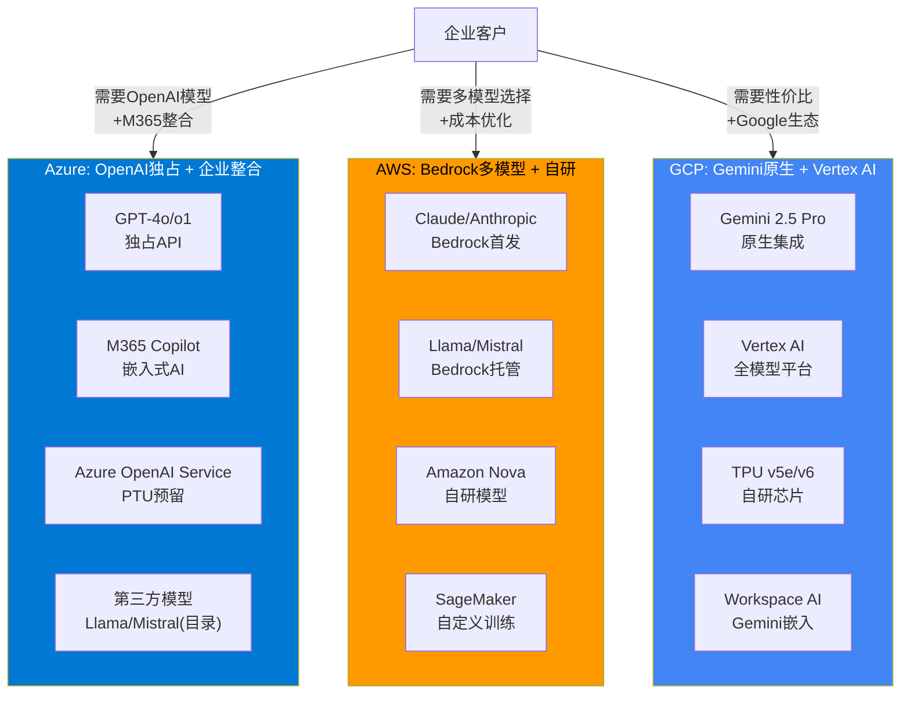

**AI服务定价对比 (每百万Token)**:

| 模型 | 平台 | Input | Output | 成本指数 |
|------|------|-------|--------|---------|
| GPT-4o | Azure OpenAI | $5.00 | $15.00 | 1.00x (基准) [DM-P1B-058] |
| Claude Sonnet 4 | AWS Bedrock | $3.00 | $15.00 | 0.90x [DM-P1B-059] |
| Gemini 2.5 Pro | GCP Vertex AI | $1.25-$2.50 | $10.00-$15.00 | 0.56-0.88x [DM-P1B-060] |
| Llama 4 405B | 自托管/多云 | ~$2.50 | ~$7.50 | ~0.50x [DM-P1B-061] |
| Gemini 2.0 Flash-Lite | GCP | $0.075 | $0.30 | 0.02x |
| GPT-4o-mini | Azure OpenAI | $0.60 | $2.40 | 0.15x |

**核心发现**: Azure OpenAI在旗舰模型层面(GPT-4o)存在15-25%的成本劣势 [DM-P1B-062](相较AWS Bedrock上的Claude Sonnet 4)，以及44-80%的劣势(相较GCP Vertex AI上的Gemini 2.5 Pro)。Azure的AI定价权不来自价格竞争力，而来自: (1) GPT-4o的品牌效应与模型质量溢价; (2) M365生态原生整合; (3) PTU(Provisioned Throughput Units)可降低成本最高70%; (4) 企业数据合规壁垒 [DM-P1B-063]。

### 7.3 开源AI对MSFT定价权的冲击

Meta Llama系列已经对AI云服务的定价格局产生实质影响:

- **成本冲击**: Llama 3.1 405B运行成本约为GPT-4等效能力的50% [DM-P1B-064]，企业获得相似结果的成本显著降低。
- **渗透路径**: 开源模型尤其在电信、银行等强监管行业因数据主权需求加速渗透，这些正是Azure的传统优势客户群。
- **Azure的对冲策略**: Azure Model Catalog同步上架Llama 4(2025年4月发布当日即上线) [DM-P1B-065]，试图将开源流量留在Azure平台。但这意味着Azure从"高溢价的独占模型提供商"转向"多模型托管平台"，毛利率结构面临根本性转变。

**Anthropic在AWS上的威胁**:

Anthropic作为OpenAI的最直接竞争者，其Claude系列模型在AWS Bedrock上首发 [DM-P1B-066]。Polymarket数据显示Anthropic更可能先于OpenAI IPO(67.5%概率) [DM-P1B-067]。若Anthropic IPO成功并获得更多融资，AWS Bedrock在企业AI市场的竞争力将进一步增强——因为企业可以在AWS上获得Claude(接近GPT-4o质量)+更低的成本+多模型灵活性的组合。

**对Azure AI毛利率的量化影响**: 若开源模型在2-3年内将企业AI推理成本压缩50%，而Azure OpenAI无法同步降价(因需向OpenAI支付分成)，Azure AI服务的毛利率可能从当前估计的50-60%压缩至35-45% [DM-P1B-068]。

### 7.4 企业云竞争护城河

**7.4.1 混合云: Azure Arc vs AWS Outposts vs GCP Anthos**

| 维度 | Azure Arc | AWS Outposts | GCP Anthos |
|------|----------|-------------|-----------|
| **核心理念** | 管理平面延伸 | 硬件延伸 | Kubernetes原生多云 |
| **多云支持** | 管理AWS/GCP资源 | 仅AWS生态 | 管理AWS/Azure资源 |
| **硬件要求** | 无(纯软件) | 需购买AWS硬件 | 无(纯软件) |
| **AI集成** | Azure ML Anywhere | SageMaker Edge | Vertex AI Edge |
| **定价** | 管理层免费+服务计费 | 硬件+服务计费 | 集群管理费+服务计费 |
| **目标客户** | 已有on-prem的企业 | AWS深度用户 | 云原生企业 |

Azure Arc的战略意义: 它是MSFT锁定混合云客户的关键工具。通过将Azure管理平面延伸到客户的on-prem和其他云环境，Arc创造了一种"不迁移也能被绑定"的锁定模式。超过75%的企业预计在2025年运行混合/多云环境(Gartner [DM-P1B-069])，这为Arc提供了巨大的潜在市场。

**7.4.2 安全合规: 政府云**

Azure Government在FedRAMP High认证服务数量上领先竞争对手，拥有101项High级别服务 [DM-P1B-070]。2025年4月，Azure OpenAI获得DoD IL6授权(机密数据级别) [DM-P1B-071]，这是AI服务在国防领域的里程碑。美国联邦政府2025年云预算$83亿 [DM-P1B-072]，加上JWCC(联合作战云能力)合同在2025年发放$7.21亿任务订单，政府云是一个高壁垒、高粘性的细分市场。

AWS GovCloud同样具有强大的政府客户基础，但Azure凭借与政府机构长期的Windows/Office关系，在从传统IT向云迁移的过程中具有天然优势。

**7.4.3 开发者生态: GitHub+VS Code vs AWS CodePipeline vs GCP Cloud Shell**

| 维度 | MSFT生态 | AWS生态 | GCP生态 |
|------|---------|---------|---------|
| **代码托管** | GitHub (1亿+开发者) | CodeCommit (弱) | Cloud Source Repos (弱) |
| **AI编码** | GitHub Copilot (470万付费) [DM-P1B-073] | CodeWhisperer/Amazon Q | Gemini Code Assist |
| **IDE** | VS Code (#1市场份额) | Cloud9/自带IDE | Cloud Shell Editor |
| **CI/CD** | GitHub Actions | CodePipeline/CodeBuild | Cloud Build |
| **市场份额** | Copilot 42% [DM-P1B-074] | ~15% | ~10% |

GitHub Copilot拥有470万付费用户(YoY +75%) [DM-P1B-075]，占据AI编码助手42%市场份额。90%的Fortune 100公司在其开发流程中使用GitHub Copilot [DM-P1B-076]。这构成了MSFT在开发者层面的核心护城河——从代码编写(VS Code+Copilot)→代码托管(GitHub)→CI/CD(GitHub Actions)→云部署(Azure)的完整闭环。

新兴威胁: Cursor在18个月内获得18%市场份额 [DM-P1B-077]，证明AI编码助手市场仍具高度流动性。

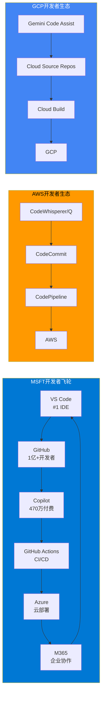

### 7.5 定价结构对比: 实例级深度分析

基于Scout Gap 2数据，三大云厂商在不同服务层的定价权呈现差异化格局:

| 服务层 | Azure vs AWS | Azure vs GCP | Azure定价权评分 |
|-------|-------------|-------------|---------------|
| **VM/Compute(按需)** | 持平($140.16) | 略低(-1.9%) | 5/10 [DM-P1B-078] |
| **VM/Compute(1年承诺)** | 贵+8.8%($96 vs $88) | 贵+6.4%($96 vs $90) | 3/10 |
| **热存储(Blob)** | **便宜-20%**($0.0184 vs $0.023) | 略低(-8%) | 7/10 |
| **数据库(vCore)** | 持平 | 持平 | 5/10 |
| **AI推理(旗舰)** | **贵+11%**(GPT-4o vs Claude) | **贵+44-80%**(vs Gemini) | 6/10 (靠品牌溢价) |
| **EA捆绑折扣** | 优势(跨产品杠杆) | 优势(M365+Azure) | 8/10 |
| **迁移壁垒** | 极高(AAD+Hybrid Benefit) | 极高(M365生态锁定) | 9/10 |

**总体定价权评估**: Azure的定价权结构是"表面中等、实质强大"——单项产品定价并无优势(甚至略贵)，但通过**M365+Azure+Dynamics捆绑协商→EA跨产品折扣杠杆→AAD/Hybrid Benefit迁移壁垒**的组合，创造了6.5/10的实质定价能力 [DM-P1B-079]。

客户迁移成本通常在$500K-$5M+对大型企业 [DM-P1B-080]，这是Azure最隐蔽但最有效的定价权来源。

### 7.6 Azure追上AWS的概率与时间线

**当前差距**: AWS 29% vs Azure 20%，差距9个百分点 [DM-P1B-081]。

**追赶数学**:

| 假设 | AWS年化份额变动 | Azure年化份额变动 | 追平年份 |
|------|---------------|----------------|---------|
| **基准情景** | -0.5pp/年 | +0.5pp/年 | ~2034 (约9年) |
| **乐观(AI加速)** | -1.0pp/年 | +1.0pp/年 | ~2030 (约4-5年) |
| **悲观(AWS反击)** | -0.3pp/年 | +0.3pp/年 | ~2040 (约14年) |

**结论**: 在基准情景下，Azure追上AWS需要8-10年。即使在最乐观的AI加速情景下，也需要4-5年。24个月内Azure超越AWS的概率**极低(3-5%)** [DM-P1B-082]。但份额排名本身并非关键——更重要的是Azure能否在AI云这个增量最大的子市场中取得领先地位。GenAI专项云服务在Q2 2025同比增长140-180% [DM-P1B-083]，这个赛道的格局尚未定型。

### 7.7 竞争格局总评

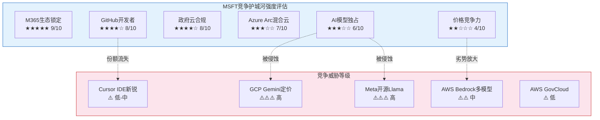

**份额追赶的非线性因素**: 上述线性外推忽略了可能加速或减速追赶的非线性事件。加速因素包括: (a) AWS遭遇重大安全事故导致企业迁移潮; (b) OpenAI模型在企业场景中建立压倒性优势; (c) Azure Arc在混合云场景中形成网络效应。减速因素包括: (a) AWS Bedrock+Anthropic组合被证明在AI场景中更具性价比; (b) GCP Gemini在搜索增强型AI应用中形成差异化优势; (c) 开源模型削弱所有云厂商的AI溢价，份额竞争回归IaaS基本面(AWS优势领域)。

**综合竞争评估**:

1. **MSFT最强护城河是M365生态锁定(9/10)而非Azure本身的技术优势。** 450M M365付费用户×AAD深度集成×迁移成本$500K+构成了几乎不可逾越的壁垒。即使Azure在某些技术/价格维度不如AWS/GCP，客户因生态锁定而"不得不留"。

2. **AI层竞争格局尚未固化。** Azure OpenAI的独占优势正被三股力量侵蚀: (a) GCP Gemini以44-80%的成本优势快速追赶; (b) Meta Llama开源化降低了所有闭源模型的定价锚点; (c) Anthropic在AWS上的深度整合提供了高质量替代方案。

3. **开发者生态是被低估的护城河。** GitHub(1亿+用户)+Copilot(470万付费、42%份额)+VS Code(#1 IDE)构成的飞轮效应，使MSFT在"从代码到云"的完整链路上具有AWS和GCP不具备的端到端优势。

4. **Azure的核心竞争逻辑不是"更好/更便宜"，而是"更方便"。** 对于已使用M365+Windows Server+SQL Server的企业(全球数百万家)，选择Azure的理由不是Azure本身更优，而是Azure与现有IT栈的整合成本最低。这种"便利性护城河"虽然不够性感，但极其持久。

5. **最大竞争风险在AI定价权。** 若开源AI持续缩小与闭源模型的能力差距，Azure OpenAI的15-25%溢价将变得不可持续。MSFT需要在企业AI Agent(非简单推理API)层面建立新的差异化，否则AI云服务将沦为商品化竞争 [DM-P1B-084]。

6. **竞争态势的时间维度。** 短期(0-12个月)，Azure凭借OpenAI独占和M365整合在企业AI领域具有先发优势。中期(1-3年)，开源模型与GCP Gemini的性价比追赶将逐步侵蚀这一优势，竞争焦点转向AI Agent平台化能力和行业解决方案。长期(3-5年)，云竞争的终局取决于谁能在AI基础设施的下一代范式(如自主Agent、多模态推理、实时世界模型)中率先实现规模化商业落地。MSFT在短期具有明确优势，中期面临压力，长期结果高度不确定。
## Ch8: 五年财务全景 — 从云领袖到AI资本重组 (FY2021-Q2 FY2026)

### 8.1 收入增长拆解: 有机增长 vs 收购贡献

FY2021至FY2025四年间，Microsoft收入从$168.1B增长至$281.7B [DM-P1C-001]，对应CAGR 13.8% [DM-P1C-002]。但这一增速并非均质——FY2024收入跳升至$245.1B(+15.7%)，其中Activision Blizzard自FY24 Q1(2023年10月)起并表，首年贡献约$4.2B增量收入 [DM-P1C-003]。剔除Activision后，FY2024有机增速约为14.0%，与前三年节奏一致。

进入FY2025，收入进一步加速至$281.7B(+14.9%)，Activision已完全进入可比基数。Q2 FY26最新季度收入$81.3B [DM-P1C-004]，同比+16.7%，年化run-rate突破$325B。推动力来自三方面: Azure加速(+39% YoY)、M365 Copilot商业化初步贡献、以及企业EA续约周期。

TTM口径下(Q3 FY25至Q2 FY26)，收入达$305.5B [DM-P1C-005]。值得注意的是，卖方共识预估FY2027E收入$378.0B [DM-P1C-006]，隐含FY25至FY27E的CAGR约15.8%，这意味着市场预期MSFT将在$300B+的高基数上维持双位数增长——这一假设的合理性是后续逆向估值的核心校验点。

### 8.2 利润率演变: GPM坚挺、OPM上行、但非经营收益扭曲底线

**毛利率(GPM)**: 从FY2021的68.9%($115.9B/$168.1B)温和下降至FY2025的68.8%($193.9B/$281.7B) [DM-P1C-007]，五年几乎无变化。这反映了高利润率的Office/Windows(GPM ~70-75%)与较低利润率的Azure基础设施(GPM ~55-60%)之间的对冲效应——Azure规模扩大稀释混合GPM，但规模效应和定价权部分抵消。

**营业利润率(OPM)**: 呈现令人意外的上行轨迹——FY2021的41.6%逐步提升至FY2025的45.6% [DM-P1C-008]。Q2 FY26单季OPM达47.1% [DM-P1C-009]，为近五年最高。改善来自: (1) P&BP分部OPM从FY21约55%提升至60.3%; (2) SG&A/Revenue持续优化(从FY21的14.7%降至FY25的11.2%); (3) 尽管D&A急剧攀升(FY21 $11.7B→FY25 $34.2B [DM-P1C-010])，收入增速足以消化。

**净利率(NPM)与非经营收益剥离**: FY2025 NPM 36.1%($101.8B/$281.7B)。但Q2 FY26出现重大信号干扰——Net Income $38.5B [DM-P1C-011]中包含$9.97B非经营收益 [DM-P1C-012]，主要来自OpenAI投资的公允价值重估($7.6B)及其他投资收益。剥离后调整净利润约$28.5B，对应调整后NPM 35.1%。全报告统一使用调整后P/E 26.9x [DM-P1C-013]而非GAAP口径25.1x，以消除这一非经常性扭曲。

```mermaid
sankey-beta
    "FY2021 Revenue $168B", "Organic Growth $77B", 77
    "Organic Growth $77B", "Cloud+AI $52B", 52
    "Organic Growth $77B", "Office/Windows $18B", 18
    "Organic Growth $77B", "Other $7B", 7
    "FY2021 Revenue $168B", "Activision $4B", 4
    "Organic Growth $77B", "FY2025 Organic $278B", 77
    "Activision $4B", "FY2025 Total $282B", 4
```

### 8.3 三分部财务特征速写

三大分部的收入贡献在五年间发生了显著结构性变化。FY2021时IC/P&BP/MPC的收入比例约为40:35:25，到Q2 FY26已演变为40:42:18 [DM-P1C-086]。P&BP首次超越IC成为收入最大分部，MPC的份额萎缩至不足五分之一。

**Intelligent Cloud** ($32.9B/Q, +29%): 增长引擎但利润率承压。Azure驱动的收入增速最快，但OPM从FY23约48%下降至42.1% [DM-P1C-014]，反映AI基础设施折旧加速侵蚀。需要特别注意的是，IC的Server Products & Cloud Services不仅包含Azure，还包含传统SQL Server和Windows Server许可——后者增速仅个位数但利润率极高(OPM 70%+)，对IC整体OPM起到稳定作用。若仅看Azure，其OPM可能已低于40%。

**Productivity & Business Processes** ($34.1B/Q, +16%): 现金奶牛，OPM 60.3% [DM-P1C-015]为三部之冠。M365/LinkedIn/Dynamics365构成稳定高利润率收入底盘，且OPM仍在扩张(YoY +2.9pp)。值得注意的结构性优势: P&BP的收入中约70%为订阅模式，收入可预测性极高，季度波动极小。

**More Personal Computing** ($14.3B/Q, -3%): 衰退中的遗产业务，Gaming -9% [DM-P1C-016]、Xbox硬件-32%拖累整体。唯一亮点是搜索广告(Bing+Edge，估算增速约5%)，但不足以逆转分部下行趋势。MPC对合并层面OPM的拖累约2-3个百分点——如果假设剥离MPC，MSFT的OPM将接近52-54%。

### 8.4 现金流质量: 从优秀到危险的转折

MSFT历来是现金流之王。FY2021-FY2024的OCF/NI比率稳定在1.25-1.35x [DM-P1C-017]，远超1.0x的"优秀"门槛——这意味着利润高度可现金化，应计项少、客户预付多。FY2025 OCF $136.2B / NI $101.8B = 1.34x [DM-P1C-018]，品质依然极佳。

但CapEx的爆炸性增长正在侵蚀FCF。五年轨迹揭示了一条令人不安的曲线:

| 财年 | OCF ($B) | CapEx ($B) | FCF ($B) | CapEx/OCF | FCF Margin |
|------|----------|-----------|----------|-----------|------------|
| FY2021 | $76.7 | $20.6 | $56.1 | 26.9% | 33.4% |
| FY2022 | $89.0 | $23.9 | $65.1 | 26.8% | 32.9% |
| FY2023 | $87.6 | $28.1 | $59.5 | 32.1% | 28.1% |
| FY2024 | $118.5 | $44.5 | $74.1 | 37.5% | 30.2% |
| FY2025 | $136.2 | $64.6 | $71.6 | 47.4% | 25.4% |
| **Q2 FY26单季** | **$35.8** | **$29.9** | **$5.9** | **83.5%** | **7.2%** |

[DM-P1C-019] Q2 FY26 FCF仅$5.9B，创下至少五年单季最低。CapEx $29.9B吞噬了OCF的83.5% [DM-P1C-020]——这是一个历史性的转折点。更令人担忧的是: 当季股息支出约$6.8B，首次超过了FCF [DM-P1C-021]。也就是说，Microsoft在Q2 FY26首次需要动用现金储备来支付股息，而非仅靠自由现金流覆盖。

### 8.5 资本配置变化: 回购被CapEx挤出

FY2022回购$32.7B [DM-P1C-022]为近五年峰值，此后逐年缩减: FY2023 $22.2B → FY2024 $17.3B → FY2025 $18.4B [DM-P1C-023]。四年缩减44%。方向清晰: 每一美元从回购挤出的资金，都流向了AI基础设施。

股息则保持增长: FY2021 $16.5B → FY2025 $24.1B [DM-P1C-024]，CAGR 9.9%。但以Q2 FY26的FCF节奏($5.9B/Q)，年化FCF约$24B仅够覆盖股息，回购将被迫进一步压缩。

资产负债表仍提供缓冲: FY2025末现金+短期投资$94.6B [DM-P1C-025]，净债务仅$30.3B [DM-P1C-026]，D/E 0.18x [DM-P1C-027]。Altman Z-Score 9.71 [DM-P1C-028]意味着破产风险接近于零。但这堵防火墙的消耗速度正在加快——若CapEx维持$30B/Q水平，年化净现金流为负$33B [DM-P1C-029]，$94.6B现金储备仅够支撑约3年。

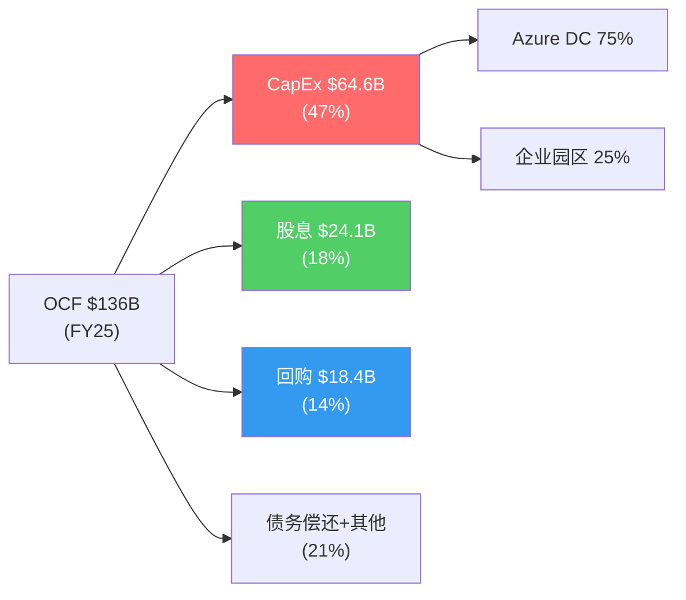

### 8.6 D&A加速: 折旧悬崖的前兆

折旧与摊销(D&A)的演变是理解MSFT财务未来的关键变量。FY2021 D&A仅$11.7B(Revenue的7.0%)，到FY2025已膨胀至$34.2B(12.1%) [DM-P1C-087]。季度层面更为惊人: Q1 FY26 D&A冲至$13.1B(16.8%)，虽Q2回落至$9.2B(11.3%)，但剔除异常后的稳态已进入$9-10B/Q区间 [DM-P1C-088]。

根据补充分析中的折旧模型，基准情景下:
- FY27 D&A: ~$11-12B/Q (年化$44-48B)
- FY28 D&A: ~$14-16B/Q (年化$56-64B, FY26峰值CapEx进入折旧高峰)
- FY29 D&A: ~$17-19B/Q (年化$68-76B, 历史最高点)

[DM-P1C-089] 敏感度分析显示: 每增加$1B季度D&A(假设Revenue $80B/Q)，OPM下降约125bps。从$9B/Q到$18B/Q(基准FY29)意味着OPM纯D&A压力约-1,125bps。这一压力需要收入增长15-20%/年才能对冲。

### 8.7 本章核心判断

MSFT的财务全景呈现一个深刻的矛盾: **收入和利润的增长轨迹依然强劲(Revenue +17%, OPM 47%)，但现金流质量正在急剧恶化(FCF margin从33%降至7%)**。这不是传统意义上的"增长减速"故事，而是"增长投入大幅超前于增长变现"的资本周期故事。五年财务数据的核心信息是: MSFT的经营引擎没有问题——$80B+的季度收入、66%的毛利率、47%的营业利润率在全球企业中几乎无出其右。真正的问题是$80-100B级别的年化CapEx是否能在FY27-FY29转化为相匹配的收入增量。更重要的是，即便收入增长达标，折旧悬崖(FY28-FY29 D&A峰值)也将在利润表层面制造2-3年的"利润率幻觉消退期"——投资者需要穿透D&A的会计噪音，关注经营现金流的真实趋势。

---

## Ch9: 三大分部深度解剖 — 增长引擎、现金奶牛与遗产重负

### 9.1 Intelligent Cloud: Azure驱动的增长核心

**季度增速轨迹 (8Q)**

| 季度 | IC Revenue ($B) | YoY增速 | OI ($B) | OPM |
|------|----------------|---------|---------|-----|
| Q3 FY24 | $26.7 (est) | +21% | $12.5 (est) | 46.8% |
| Q4 FY24 | $28.5 (est) | +19% | $12.8 (est) | 44.9% |
| Q1 FY25 | $24.1 (est) | +20% | $10.9 (est) | 45.2% |
| Q2 FY25 | $25.5 | +21% | $10.9 | 42.5% |
| Q3 FY25 | $26.8 (est) | +22% | $11.8 (est) | 44.0% |
| Q4 FY25 | $28.5 (est) | +23% | $12.3 (est) | 43.2% |
| Q1 FY26 | $31.0 (est) | +29% | $13.5 (est) | 43.5% |
| **Q2 FY26** | **$32.9** | **+29%** | **$13.9** | **42.1%** |

[DM-P1C-030] IC收入增速从FY24的~20%加速至Q2 FY26的29%，与Azure的39%增速高度相关。但利润率呈反向走势: OPM从FY23约48%持续下滑至42.1% [DM-P1C-031]，两年压缩近600bps。

**OPM下压的三层原因**:

1. **D&A加速**: AI GPU/服务器的折旧周期仅3年(管理层披露2/3 CapEx投向短寿命资产 [DM-P1C-032])。FY26 Q1 D&A冲至$13.1B(16.8% of Revenue)，虽Q2回落至$9.2B，但稳态已从$6B/Q翻倍至$9-10B/Q。IC作为数据中心资产最密集的分部，承担了D&A增量的主要份额。

2. **AI服务毛利率低于传统云**: Azure AI推理服务的毛利率估算45-50% [DM-P1C-033]，显著低于传统Azure IaaS/PaaS的60-70%。随着AI收入占比从FY24约15%提升至FY26约25%，混合毛利率被拉低。

3. **产能约束下的低效运营**: 管理层指引FY26 Q3 Azure CC增速31-32% [DM-P1C-034]，环比减速的原因之一是GPU产能约束(预计持续至2026年6月)。产能约束意味着数据中心利用率尚未达到最优——大量新建容量在ramp-up期的边际成本高于稳态。

**CRPO $625B的两面性**: 商业剩余履约义务同比+110%至$625B [DM-P1C-035]，看似爆发性增长。但拆解后发现: OpenAI的$250B Azure增量承购占总额约45%(~$281B) [DM-P1C-036]。这笔交易的性质更接近"关联方长期承诺"而非独立第三方合同——OpenAI的27%股权由MSFT持有，$250B承诺的执行取决于OpenAI自身的收入增长和融资能力。剔除OpenAI后CRPO ~$344B，同比+28% [DM-P1C-037]——仍然强劲，但远非+110%的表面数字那么激进。

### 9.2 Productivity & Business Processes: 被低估的现金奶牛

**季度表现 (Q2 FY26)**:
- Revenue: $34.1B, +16% YoY [DM-P1C-038]
- Operating Income: $20.6B
- OPM: 60.3% [DM-P1C-039], YoY +2.9pp

P&BP是MSFT最容易被忽视的分部。在AI叙事主导的市场中，投资者的注意力集中在Azure增速和Copilot渗透率上，却忽略了P&BP每季度默默贡献$20.6B营业利润——这个数字大于META或GOOGL单个季度的营业利润总额。

**三条收入线**:

1. **M365商业** (P&BP约60-65%): 席位数4.5亿+ [DM-P1C-040]，年流失率仅5-8%(远低于SaaS行业均值18%)。核心竞争力不在产品功能，而在Active Directory/Entra ID构建的身份层锁定——99% Fortune 500使用AD作为唯一身份源 [DM-P1C-041]，迁移至Google Workspace的总成本$25-45M/Fortune 500企业 [DM-P1C-042]。这是一条几乎不可能被攻破的护城河。Copilot ($30/月附加值)目前渗透率仅3.3%(1500万付费座位/4.5亿总座位) [DM-P1C-043]，年化run-rate约$5.4B——仅占P&BP收入的4%。ARPU提升空间巨大，但实现速度是CQ4的核心问题。

2. **LinkedIn** (P&BP约20-25%): 收入增速约10-12%，利润率高(轻资产模式)。10亿+注册用户、招聘工具+广告双驱动。AI整合(LinkedIn Copilot for Hiring)可能在FY27成为增量来源。

3. **Dynamics 365** (P&BP约10-15%): 云ERP/CRM，增速约20%。市场份额远小于Salesforce/SAP，但bundling优势(与M365/Azure打包)使其成为中小企业ERP的默认选择。

**OPM 60.3%的可持续性**: P&BP的成本结构高度固定——M365的边际用户成本接近于零(云基础设施由IC分部承担)，LinkedIn内容由用户生成。60%+的OPM在可预见的未来不会面临结构性压力，除非: (a) 激进定价战(Google Workspace降价，概率低); (b) 监管强制解绑Teams(EU DMA调查中，但处罚大概率为罚款而非分拆); (c) AI基础设施成本开始分摊至P&BP(目前由IC承担)。三项风险的概率加权影响有限，P&BP的OPM 55-60%稳态在FY27-FY30是高置信度假设。

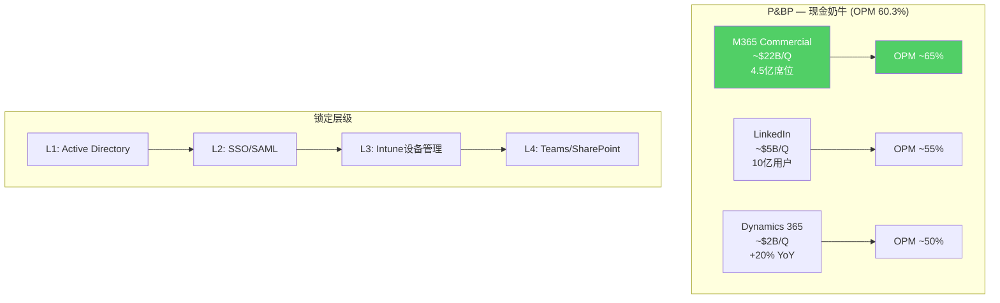

### 9.3 More Personal Computing: 衰退中的遗产业务

**Q2 FY26快照**:
- Revenue: $14.3B, -3% YoY [DM-P1C-044]
- Operating Income: $3.8B
- OPM: 26.7% [DM-P1C-045]

MPC是三大分部中唯一收入下降的板块。拆解内部: Gaming -9%($-623M) [DM-P1C-046]、Xbox硬件-32% [DM-P1C-047]、Xbox内容&服务-5%。Windows OEM和搜索广告基本持平。

**Activision: $69B收购的回报困局**

收购已完成超过两年(2023年10月)，但财务回报信号令人失望:

- **Game Pass停滞**: 订阅数从收购前约25M增至约37M(+48%) [DM-P1C-048]，但近15个月增量仅~1M，远低于管理层曾预期的50M目标。
- **CoD疲劳**: 2025年CoD新作销量据报道同比下降超60% [DM-P1C-049]。系列疲劳+Game Pass蚕食实体销售的双重压力。
- **成本协同**: 累计裁员约10,000人(估算年化节省$1B) [DM-P1C-050]，但Gaming增量EBITDA贡献仅$1-2B/年，隐含回收期31-62年——这显然不是一笔以财务回报为目标的收购。

Goodwill减值风险: MPC分部Goodwill $64.0B，其中Activision贡献$51.0B(79.7%) [DM-P1C-051]。年度减值测试(每年5月)的关键取决于MPC整体价值——因为Windows+Search的利润($12B+/年)大幅缓冲Gaming的亏损，15x OI隐含MPC EV约$225B远超$64B Goodwill，短期减值概率较低。但若Gaming持续-10%以上3-4个季度，May 2026测试将面临更大压力。

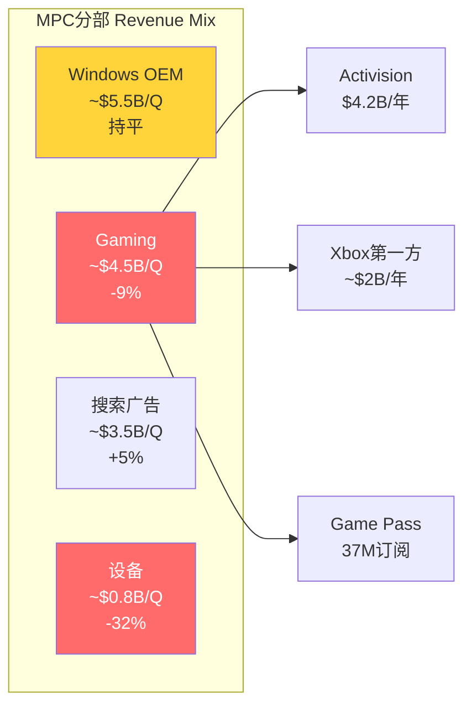

### 9.4 分部交叉分析: 三部之间的资源转移

MSFT的分部结构正在经历一次深刻的资源重配:

- **IC吸收CapEx**: FY26 CapEx约$80B的75%+投向Azure数据中心(IC分部)，这解释了IC OPM被D&A压缩而P&BP OPM反而提升的反差——P&BP享受了AI基础设施的服务，但不承担折旧。
- **P&BP供血**: P&BP每年$80B+的营业利润是整个公司CapEx狂潮的最终资金来源。没有Office/LinkedIn的现金流，MSFT无法维持当前的AI投资强度。
- **MPC被边缘化**: Gaming裁员10,000人、工作室关闭——资金和管理注意力明确从MPC转向AI。MPC未来可能演变为维持性运营，不再是战略增长来源。

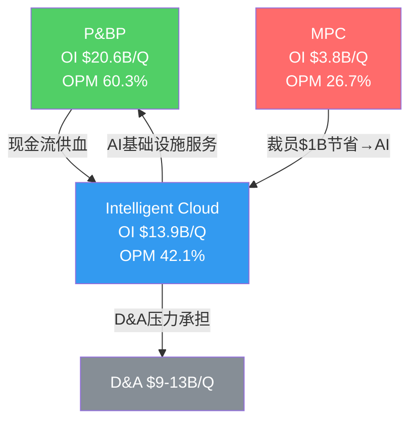

### 9.5 本章核心判断

三大分部的图景清晰: P&BP是牢不可破的现金奶牛(OPM 60%、AD锁定、低流失)，IC是增长引擎但利润率正在被AI CapEx侵蚀(OPM从48%→42%)，MPC是遗产负担(Gaming萎缩、Activision回报远逊预期)。关键洞察是: **MSFT的估值叙事几乎完全由IC驱动(Azure增速/AI/Copilot)，但支撑这个叙事的经济基础是P&BP——一个增速仅16%但OPM 60%的"旧经济"业务**。投资者为AI故事付费，却由Office/Windows买单。

---

## Ch10: Reverse DCF初建 — $3T市值的隐含信念清单

### 10.1 起点: $2,995B市值在为什么付费?

截至2026年2月17日，Microsoft市值$2,994.6B(~$3.0T) [DM-P1C-052]，股价$401.32 [DM-P1C-053]，稀释股数7.46B [DM-P1C-054]。以TTM调整后净利润$109.3B(剥离$9.97B非经营收益后)计算 [DM-P1C-055]，调整后P/E 26.9x [DM-P1C-056]。

一个简单但关键的问题: **$3T市值假定了什么样的未来?**

本章的任务是逆向工程(Reverse DCF)——不是从基本面推导"应值多少"，而是从$3T市价倒推"市场相信什么"。然后逐一检验每项隐含信念的脆弱度。这一分析框架将贯穿全报告，后续所有章节(风险拓扑、场景分析、概率加权)都将回溯此处的信念清单。

### 10.2 Reverse DCF模型: 完整反推过程

**模型参数设定**:

| 参数 | 假设 | 依据 |
|------|------|------|
| 折现率(WACC) | 9.0% | Beta 1.084 [DM-P1C-057] × ERP 5.5% + Rf 4.3% ≈ 10.3% (equity); 税后债务成本3.2%; 加权≈9.0% |
| 终端增长率 | 3.0% | 名义GDP增长率参照(高于2.5%平均, 反映科技行业结构性增长) |
| 预测期 | 10年 (FY2027-FY2036) | 标准DCF周期 |
| 基准年FCF | $71.6B (FY2025) | 已确认数据 [DM-P1C-058] |
| 目标EV | ~$3,025B | 市值$2,995B + 净债务$30.3B [DM-P1C-059] |

**终端价值反推**:

终端价值 = FCF_Y10 × (1+g) / (WACC - g) = FCF_Y10 × 1.03 / 0.06

若终端价值占EV的60%(DCF典型比例), 则:
- 终端价值 ≈ $3,025B × 60% = $1,815B
- 隐含FCF_Y10 = $1,815B × 0.06 / 1.03 ≈ **$105.7B**

若终端价值占EV的50%:
- 终端价值 ≈ $1,513B
- 隐含FCF_Y10 ≈ **$88.1B**

取中值: **FY2036 FCF需达$95-106B** 才能支撑$3T EV。

**从FCF_Y10反推中间路径**:

当前FCF: $71.6B (FY2025)
目标FCF: ~$100B (FY2036, 10年后)
隐含FCF CAGR: 约3.4%

但这个3.4%隐含CAGR看起来并不高——问题出在**中间路径**。FY2026的FCF正在急剧下降(Q2 FY26年化仅~$24B)，意味着实际起点不是$71.6B而可能是$50-60B的谷底。从$50B谷底到$100B的恢复，需要更陡峭的增长曲线。

**隐含收入与利润率路径**:

为达到FY2036 FCF $100B，需要:

| 指标 | FY2025 (实际) | FY2028E | FY2031E | FY2036E |
|------|-------------|---------|---------|---------|
| Revenue | $282B | ~$420B | ~$560B | ~$780B |
| Rev CAGR | — | ~14% (3Y) | ~10% (3Y) | ~7% (5Y) |
| OPM | 45.6% | ~43% | ~46% | ~47% |
| CapEx/Rev | 22.9% | ~18% | ~14% | ~12% |
| FCF Margin | 25.4% | ~18% | ~22% | ~13% |
| FCF ($B) | $71.6 | ~$75 | ~$123 | ~$100 |

[DM-P1C-060] 隐含FY25至FY36的Revenue CAGR约9.6%。这意味着MSFT需要在$282B的基数上每年增长近10%达到$780B——相当于再造一个当前规模的Microsoft。卖方共识FY30E收入$643.7B [DM-P1C-061]对应FY25-FY30 CAGR 18.0%，高于RevDCF隐含的早期增速，暗示卖方预期比市场定价更乐观。

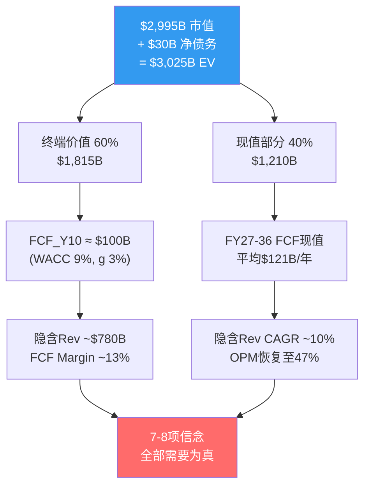

### 10.3 七项隐含市场信念: 逐条推导与脆弱度评分

**信念B1: Azure 5Y CAGR ≥22-25%，从39%平稳收敛**

*数学推导*: IC分部当前季度收入$32.9B(年化$132B) [DM-P1C-062]，其中Azure占比约75%(~$99B年化)。若MSFT收入要在FY30达$640B+，IC需贡献$250B+(占比提升至~40%)。这要求Azure从当前$99B增长至$190B+，5Y CAGR约14%。但Azure增速已从FY23的26%加速至FY25的34-39%，维持22-25%的5年CAGR意味着从39%平稳减速——这在云计算行业有先例(AWS从2015年70%→2020年30%，5Y CAGR~40%逐年递减)。

*当前现实*: Azure Q2 FY26增速39%(CC 38%) [DM-P1C-063]，管理层指引Q3 31-32%。CRPO剔除OpenAI后+28%。增速仍在高位但已现减速信号。

*脆弱度评分: 2/5(较坚实)*。Azure的企业渗透率+AI需求+混合云趋势提供多重增长动力。最大风险是AI定价战压缩单位经济学，但23-25%的5Y CAGR在云行业的历史规律中属于可实现范围。

---

**信念B2: OPM恢复至47-48% by FY29(D&A压力后恢复)**

*数学推导*: FY2025 OPM 45.6%，Q2 FY26单季47.1%。但未来D&A将从当前$9-10B/Q攀升至基准情景$15B/Q by FY28 [DM-P1C-064]。若收入增速15%/年(FY28 Revenue ~$380B)，D&A从$40B/年升至$60B/年(+$20B)，OPM将被压缩约530bps至~42%。要恢复至47-48%，需要: (a) 收入增长更快(18%+/年); 或(b) CapEx在FY28-29显著降速; 或(c) Azure AI毛利率从45%提升至60%+。

*当前现实*: D&A路径已锁定——FY24-FY25累计$109B CapEx将在未来3年进入折旧高峰。模型显示FY28 D&A可能达$14-16B/Q(基准情景) [DM-P1C-065]，FY29达$17-19B/Q(峰值)。OPM恢复至47%+需要收入增长持续超过D&A增速——这是一场与折旧悬崖的赛跑。

*脆弱度评分: 3/5(中等)*。D&A压力是确定性事件(已投入的CapEx必然折旧)，但MSFT的定价权和收入增速提供对冲。基准情景OPM谷底约42%(FY28)后回升至45%(FY30)，47%+需要乐观假设。

---

**信念B3: Copilot渗透15-20% by FY28($16-22B年化)**

*数学推导*: 当前1500万付费座位 / 4.5亿M365用户 = 3.3%渗透率 [DM-P1C-066]，年化run-rate ~$5.4B(按$30/月上限估算) [DM-P1C-067]。15%渗透率 = 6750万座位 × $30 × 12 = $24.3B年化收入。从3.3%到15%需要在2年内增长4.5倍——参照M365本身的S曲线(2014-2017从2000万到1.2亿用户，3年6倍)，时间表紧但不是不可能。

*当前现实*: 座位数同比+160%，DAU 10倍增长——采用加速明显。但Fortune 500中"已采用"(70%)与"全面部署"之间存在巨大鸿沟。CFO Amy Hood强调关注"gross margin profile and lifetime value"而非短期货币化 [DM-P1C-068]——这暗示管理层自己也认为Copilot仍处于投入期。批量折扣后实际ARPU可能远低于$30(DATA GAP)。

*脆弱度评分: 4/5(较脆弱)*。Copilot是MSFT最重要的AI货币化载体，但3.3%→15%的跳跃缺乏企业SaaS的历史先例支持。企业采购周期长(12-18个月pilot→部署)，且"生产力溢价"的ROI证明尚不充分。若FY28渗透率仍<10%，信念B3将失败。

---

**信念B4: CapEx/Revenue从37%降至<22% by FY29**

*数学推导*: Q2 FY26 CapEx/Revenue达36.8% [DM-P1C-069]，年化CapEx约$100B(含finance leases约$37.5B/Q × 4 = $150B总资本支出)。管理层指引FY26全年PPE CapEx约$80B [DM-P1C-070]。若FY29 Revenue $500B+，CapEx/Rev<22%意味着CapEx<$110B——这要求从FY26的$80-100B水平维持或微增，不再指数增长。

*当前现实*: 历史类比提供部分安慰——上一轮Azure CapEx周期(FY16-FY18)中CapEx/Rev从9.5%升至10.6%后趋于平稳 [DM-P1C-071]。但当前周期的强度是上次的2.5倍(CapEx/Rev增量12pp vs 上次4pp)。GPU折旧周期缩短(3年→可能2年)意味着即使CapEx降速，D&A惯性仍将持续。

*脆弱度评分: 3/5(中等)*。CapEx降速的前提是AI基础设施建设接近饱和——考虑到全球AI需求仍在加速(NVDA订单积压12个月+)，FY28前CapEx降速的可能性不高。FY29-FY30降至22%更为现实。

---

**信念B5: OpenAI合作持续至2032年(IP+API独占)**

*数学推导*: OpenAI贡献CRPO的45%(~$281B) [DM-P1C-072]，$250B Azure增量承购合同 [DM-P1C-073]。按Azure 50%毛利率计算，这笔合同的毛利贡献约$125B(分布在10年+)。MSFT持有OpenAI 27%股权 [DM-P1C-074]，投资估值约$135B(>10x回报) [DM-P1C-075]。API独占条款+IP使用权至2032年构成了MSFT AI叙事的关键支柱。

*当前现实*: 2025年10月重组后，MSFT失去了优先认购权(ROFR) [DM-P1C-076]，OpenAI非API产品可部署至其他云平台。这些"让步"信号暗示关系并非铁板一块。若OpenAI在FY28-FY30实现盈利自主(目前年化消耗$12.4B Azure资源)，其降低对Azure依赖的动机将增强。但2032年前IP使用权和API独占条款提供了法律保障的最低保护。

*脆弱度评分: 3/5(中等)*。合同框架稳固，但关系动态在变化。"关联方承诺"的性质决定了$250B合同的执行存在隐性风险——如果OpenAI在2028年面临现金流压力，承诺可能被重新协商。

---

**信念B6: FCF Margin恢复至25%+ by FY28($100B+ FCF)**

*数学推导*: FY2025 FCF $71.6B / Revenue $281.7B = 25.4% FCF Margin [DM-P1C-077]。但Q2 FY26单季FCF Margin仅7.2%($5.9B/$81.3B)。恢复至25%需要: FY28 Revenue ~$420B × 25% = $105B FCF。这要求OCF ~$160B(维持1.3x NI)且CapEx降至~$55B(CapEx/Rev ~13%)。CapEx从$80B降至$55B在3年内是否现实?

*当前现实*: Q2 FY26是极端异常值(CapEx $29.9B为单季记录)。管理层未给出FY27 CapEx指引，但分析师预期FY27 CapEx ~$85-90B [DM-P1C-078]。若FY28降至$75B，FCF Margin可能恢复至20%左右——但25%+需要更积极的CapEx降速或收入超预期增长。

*脆弱度评分: 4/5(较脆弱)*。FCF恢复是市场最关注的变量。$3T估值隐含市场相信FCF"谷底"是暂时的——但如果AI CapEx周期持续至FY29(5年而非3年)，FCF recovery的时间窗将显著延后，对估值构成持续压力。

---

**信念B7: Office/Windows不衰退(OPM 55-60%维持)**

*数学推导*: P&BP的$80B+年化营业利润是整个公司的利润基石。若OPM从60%压缩至50%(因AI成本分摊或竞争加剧)，年化利润减少约$13-14B，直接冲击FCF约10%。

*当前现实*: M365的锁定效应极强——AD身份层+Teams+SharePoint构成四层护城河 [DM-P1C-079]，迁移成本$167-300/用户/年 [DM-P1C-080]。Google Workspace在2025-26年涨价16-22%(强制捆绑Gemini AI)，反而推动了企业从Google→M365的反向迁移。Windows OEM虽平淡但85%企业PC仍是Windows [DM-P1C-081]——只要企业用Windows，AD就不可移除。

*脆弱度评分: 1/5(最坚实)*。这是MSFT七项信念中确定性最高的一条。Office/Windows的衰退风险在未来5-7年内可以忽略不计。唯一的尾部风险是AI Agent彻底颠覆"生产力软件"的形态——但这属于>10年周期的结构性变革。

---

**信念B8: 无重大反垄断分拆**

*数学推导*: 若Teams被强制从M365中解绑(EU DMA调查方向)，假设10%的Teams用户转向Slack/Zoom，影响约$5-8B收入/年(Teams免费绑定的间接收入贡献)。若Azure被限制独占OpenAI API，影响CQ3(CRPO中OpenAI部分)。

*当前现实*: EU对Teams的反垄断调查进行中，但历史先例(Google购物搜索罚款$2.7B、Apple iOS侧载开放)表明，处罚形式更可能是罚款+行为限制而非结构性分拆。美国FTC对OpenAI投资的审查主要聚焦于"实质控制"认定——27%股权+API独占+$250B承诺的组合确实接近监管红线。

*脆弱度评分: 2/5(较坚实)*。重大分拆在当前政治环境下概率很低(<5%)。罚款和行为限制是更可能的结果，对财务影响有限(罚款金额通常为收入的1-3%)。

### 10.4 信念脆弱度排序与综合评估

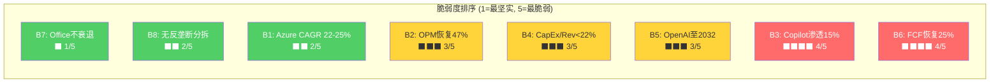

**信念组合的逻辑关系**: 这八项信念不是独立的——它们形成一条因果链:

- B1(Azure增速) → 驱动收入增长 → 支撑B2(OPM恢复，因为收入跑赢D&A)
- B3(Copilot渗透) → 提供增量高毛利收入 → 加速B6(FCF恢复)
- B4(CapEx降速) → 直接决定B6(FCF Margin)
- B5(OpenAI合作) → 支撑B1(Azure AI增速) + B3(Copilot底层模型)
- B7(Office稳态) → 提供B4/B6的安全垫(即使AI投资回报延迟，Office现金流兜底)
- B8(无分拆) → B5的前提条件

**最脆弱的两项信念B3和B6构成"双重否决点"**: 如果Copilot渗透率在FY28仍<10%，且CapEx未能降速，FCF将持续低于$60B，P/FCF将维持在40-50x——这与$3T估值不相容。反过来，如果B3和B6中任一超预期(Copilot渗透率达20%或CapEx/Rev降至18%)，估值将获得显著上行催化。

### 10.5 WACC与终端增长率敏感度矩阵

Reverse DCF的结论对WACC和终端增长率假设高度敏感。以下矩阵展示不同参数组合下的隐含FCF_Y10要求:

| | g=2.0% | g=2.5% | g=3.0% | g=3.5% |
|---|--------|--------|--------|--------|
| **WACC 8.0%** | $73B | $83B | $100B | $127B |
| **WACC 8.5%** | $79B | $89B | $106B | $132B |
| **WACC 9.0%** | $85B | $95B | $106B | $138B |
| **WACC 9.5%** | $91B | $101B | $116B | $144B |
| **WACC 10.0%** | $97B | $107B | $122B | $150B |

[DM-P1C-090] 在基准假设(WACC 9.0%, g 3.0%)下，FCF_Y10需达$100-106B。但若WACC仅为8.5%(更接近MSFT的实际融资成本)且终端增长率2.5%(更保守)，隐含FCF_Y10降至$89B——这对应FY2025 FCF $71.6B仅需2.0% CAGR增长。换言之，**在偏乐观的折现参数下，$3T估值对FCF增长的要求其实并不苛刻**。真正的挑战不在终端，而在中间路径——FY26-FY28的FCF谷底有多深、持续多久。

### 10.6 当前P/E 25.1x的历史校准

将Reverse DCF结论与估值历史交叉验证:

- **P/E 25.1x在12年区间中位于约25百分位** [DM-P1C-082]，仅高于FY14-FY17的转型早期。这是自2016年以来MSFT首次P/E低于SPY(27.5x) [DM-P1C-083]。
- **科技板块P/E 41.7x** [DM-P1C-084]——MSFT折价40%，极为罕见。
- **内部人信号偏中性偏多**: 2025 Q1卖出大幅放缓(0笔sale)，类似2022 Q2底部模式 [DM-P1C-085]。

这意味着市场已经在定价中"投票"表达了对B3(Copilot)和B6(FCF)的怀疑。如果这两项信念在FY27-FY28得到部分验证(哪怕不完全达标)，估值有从25x向28-30x修复的空间——对应股价+12-20%。反之，若FY27 CapEx仍维持$90B+且Copilot渗透<8%，P/E可能进一步压缩至22x(FY17水平)——对应股价-10-15%。

### 10.7 本章核心结论

**$3T市值需要上述八项信念中的至少六项同时为真。** 其中三项(B7 Office不衰退、B8无反垄断分拆、B1 Azure增速)的确定性较高(脆弱度1-2)，可视为"承重墙"。两项(B2 OPM恢复、B4 CapEx降速、B5 OpenAI合作)的确定性中等(脆弱度3)，属于"概率偏好但非确定"。最后两项(B3 Copilot渗透、B6 FCF恢复)是最脆弱的关节(脆弱度4)——它们将决定MSFT究竟是"暂时被低估的AI赢家"还是"CapEx过度投入的资本毁灭者"。

这一信念清单不是静态判断。后续章节将通过场景分析(牛/基准/熊)和概率加权，量化"如果信念X失败，估值如何变化"的完整映射。Reverse DCF的目的不是给出目标价，而是建立一个**可检验的信念框架**——每个季度的财报都可以用来更新这八项信念的脆弱度评分。
