## Ch11: 信念反演深度分析 — 八项隐含信念的验证与失败映射

### 11.1 分析框架: 从种子信念到因果网络

Reverse DCF在Ch10中提炼了支撑$2,995B市值的八项隐含信念 [DM-P2A-001]。本章的任务是对每项信念执行**反演测试**: 不是论证"为什么信念成立"，而是系统性地寻找"信念在什么条件下失败"。反演的价值在于将模糊的定性判断转化为可观测的量化阈值——每项信念都将拥有明确的"失败触发线"和"失败后估值影响"。

更重要的是，八项信念之间存在深层因果关联。单独分析每项信念会产生误导——真正的风险不在于某项信念的孤立失败，而在于**信念失败的级联传导**。本章的核心产出是一张完整的信念因果网络图，揭示哪些信念是"承重节点"(失败后引发多米诺效应)、哪些是"叶节点"(失败后影响可控)。

### 11.2 B1: Azure五年CAGR 22-25% — 增长引擎的减速曲线

**市场隐含路径**

$3T估值要求Intelligent Cloud分部从当前$32.9B/Q(年化$132B)增长至FY30约$250B+ [DM-P2A-002]。Azure作为IC收入的约75%(~$99B年化)，需在五年内增至$190B+，对应5Y CAGR约14%。但考虑到IC中传统SQL Server/Windows Server(增速仅个位数)的拖累，Azure本身需维持22-25%的CAGR才能拉动整体 [DM-P2A-003]。

市场隐含的减速曲线为:

| 财年 | Azure增速 | 隐含Azure收入($B) | 驱动力 |
|------|----------|------------------|--------|
| FY26 | ~35% | ~$100B | AI推理+企业迁移 |
| FY27 | ~28% | ~$128B | Copilot间接消耗+CRPO释放 |
| FY28 | ~23% | ~$157B | AI Agent平台化 |
| FY29 | ~19% | ~$187B | 规模效应+定价权 |
| FY30 | ~15% | ~$215B | 成熟期稳态增速 |

**反演路径: 供给约束 vs 需求见顶**

当前Azure 39%增速中，AI贡献约12-13个百分点 [DM-P2A-004]。管理层指引Q3 FY26 CC增速31-32%，环比减速的原因之一是GPU产能约束(预计持续至2026年6月) [DM-P2A-005]。这引出一个关键分叉:

- **如果减速源于供给约束**: 产能瓶颈解除后(2026下半年)Azure增速可能反弹至35%+，B1信念不仅安全，甚至可能超额完成。验证信号: FY27 Q1-Q2 Azure增速回升至34%+。
- **如果减速源于需求见顶**: AI推理需求的S曲线拐点已过高速增长期，企业迁移进入后半程。这意味着39%→31%不是暂时的，而是结构性减速的开端。验证信号: FY27 Q1-Q2 Azure增速继续下行至28%以下。

CRPO提供了前瞻验证: 剔除OpenAI后CRPO同比+28% [DM-P2A-006]，与22-25%的5Y CAGR目标一致。但CRPO转化为收入存在时间差(平均2-3年)，短期内CRPO的增速更反映签约热度而非实际消耗速度。

**失败条件与估值影响**

若Azure 5Y CAGR降至18%以下(FY30 Azure收入$170B而非$215B)，IC分部收入将比预期少$45B+/年 [DM-P2A-007]。以IC的OPM 42%和15x P/OI倍数估算，市值影响约-$280B至-$500B(视利润率同步恶化程度)。

**脆弱度评估: 2/5(较坚实)**。Azure的企业渗透率仍处于S曲线中段(全球企业云渗透率约35-40%)，AI推理需求的增量尚未充分释放。22-25%的5Y CAGR在云行业历史规律中属于可实现区间——AWS从2015年的$7.9B增至2020年的$45.4B，CAGR 42%，远超此目标。MSFT面临的主要风险不是"增速不够"，而是"增速中AI占比过高导致毛利率下行"——这属于B2(OPM恢复)的管辖范围。

### 11.3 B2: 营业利润率恢复至47-48% by FY29 — 与折旧悬崖的赛跑

**隐含传导链**

Q2 FY26单季OPM达47.1% [DM-P2A-008]，看似已接近目标。但这是折旧悬崖全面冲击前的最后一个"好季度"。折旧模型显示，D&A将从当前稳态$9-10B/Q攀升至FY28基准情景$14-16B/Q、FY29峰值$17-19B/Q [DM-P2A-009]。

OPM恢复的核心等式:

$$OPM = 1 - \frac{COGS + OPEX + D\&A}{Revenue}$$

假设COGS/Revenue和OPEX/Revenue维持FY26水平(32%和21%)，OPM完全取决于D&A/Revenue的轨迹:

| 情景 | FY28 D&A/Q | FY28 Rev/Q | D&A/Rev | 隐含OPM |
|------|-----------|-----------|---------|---------|
| 乐观 | $13B | $105B | 12.4% | 45.5% |
| 基准 | $15B | $95B | 15.8% | 42.0% |
| 悲观 | $18B | $90B | 20.0% | 37.5% |

[DM-P2A-010] 基准情景下FY28 OPM约42%——距47%目标还有500bps的缺口。恢复至47%+需要以下三个条件中至少两个同时成立:

1. **收入增速维持18%+/年**(FY28 Revenue $420B+)，使分母增长跑赢D&A
2. **CapEx在FY27-FY28显著降速**，减缓后续D&A增量的积累
3. **Azure AI毛利率从当前估算的45-50%提升至60%+**，改善混合GPM

**关键转折: FY27-FY29的"利润率幻觉消退期"**

投资者需理解一个重要的会计现象: FY25-FY26的高OPM(45-47%)部分受益于D&A滞后——$80-100B的年化CapEx尚未完全进入损益表。FY28-FY29将是D&A集中释放的窗口期，OPM可能从47%下探至42%再回升 [DM-P2A-011]。这不意味着经营恶化——OCF可能持续增长——但利润表层面的"利润率幻觉消退"将考验市场耐心。

**失败条件与估值影响**

若OPM持续停在42%无法恢复(FY29 OPM 42% vs 目标47%)，以FY29 Revenue $500B计算，营业利润差距约$25B/年。以12x P/OI倍数估算，市值影响约-$200B至-$400B [DM-P2A-012]。

**脆弱度评估: 3/5(中等)**。D&A压力是确定性事件(已投入的CapEx必然折旧)，但MSFT在P&BP分部(OPM 60.3%)拥有强大的利润率缓冲。真正的危险不是OPM下降本身，而是市场对利润率下降的过度反应——如果投资者将暂时性的D&A压力误读为结构性恶化，估值倍数可能被双重压缩(利润下降 × P/E下降)。

### 11.4 B3: Copilot渗透15-20% by FY28 — 最脆弱的增长叙事

**从3.3%到15%: 需要什么?**

当前Copilot付费座位1500万 / M365总用户4.5亿 = 3.3%渗透率 [DM-P2A-013]，年化run-rate约$5.4B(按$30/月上限，实际ARPU因批量折扣可能更低)。15%渗透率对应6750万座位，意味着FY28前需净增5250万付费用户——平均每季度增加650万。

座位增速的SaaS历史类比:

| 产品 | 起始渗透率 | 终态渗透率 | 达成时间 | S曲线特征 |
|------|-----------|-----------|---------|----------|
| Teams | ~2% (2017) | 30%+ (2021) | 4年 | COVID催化跳跃 |
| Slack | ~5% (2015) | 8% (2020) | 5年 | 增长停滞 |
| Zoom | ~3% (2019) | 25% (2021) | 2年 | COVID催化+回落 |
| GitHub Copilot | ~1% (2022) | ~5% (2024) | 2年 | 开发者早采纳 |

[DM-P2A-014] Teams的先例最具参考价值——同样是M365生态内的附加产品，同样依赖企业IT部门统一部署。但Teams的爆发得益于COVID这一外生催化剂(被迫远程办公)，Copilot缺乏类似的"强制采用"事件。

**三重阻力分析**

1. **定价阻力**: $30/月/用户意味着5000人企业年增$1.8M IT支出。在企业AI预算竞争中(同时评估ChatGPT Enterprise $60/月、Google Gemini for Workspace $30/月、内部LLM部署)，Copilot的ROI证明尚不充分 [DM-P2A-015]。CFO Amy Hood强调"gross margin profile and lifetime value"而非短期货币化，暗示管理层自己也认为Copilot仍处于投入期。

2. **部署阻力**: Fortune 500中70%"已采用"Copilot，但"采用"与"全面部署"之间存在巨大鸿沟 [DM-P2A-016]。企业采购周期通常需要12-18个月(pilot→评估→预算审批→全面部署)。若2024年开始pilot，最早的全面部署也要到2025年底至2026年中。

3. **替代阻力**: 开源LLM(Llama 3、Mistral)的快速进步使企业可以在不购买Copilot的情况下获得类似的AI辅助能力。自建AI助手的成本在下降，而Copilot的$30定价在上升。

**失败条件与估值影响**

若FY28渗透率停在8%(3600万座位)而非15%，Copilot年化收入约$13B vs 预期$24B，差距$11B [DM-P2A-017]。以P&BP的15x P/S倍数估算，直接市值影响约-$165B。但Copilot的真正估值意义不在直接收入——它是MSFT"AI货币化"叙事的最核心载体。如果Copilot失速，市场将重新评估MSFT整个$80B+/年CapEx的回报前景，导致估值倍数的系统性下调。叙事影响可能大于财务影响，总市值冲击约-$100B至-$200B。

**脆弱度评估: 4/5(较脆弱)**。Copilot是八项信念中不确定性最高的一项——既有指数增长的可能(如果AI生产力溢价被证明)，也有增长停滞的风险(如果企业ROI证明失败)。3.3%→15%的跳跃在企业SaaS历史中缺乏无外生催化剂的先例。

### 11.5 B4: CapEx/Revenue从37%降至<22% by FY29 — AI军备竞赛的囚徒困境

**当前投入强度的历史坐标**

Q2 FY26 CapEx/Revenue 36.8% [DM-P2A-018]，管理层指引FY26全年PPE CapEx约$80B。对比上一轮CapEx周期(FY16-FY18)，CapEx/Revenue增量仅4个百分点(6%→10%)，当前周期增量已达12个百分点(13%→25%) [DM-P2A-019]。强度差异2.5倍。

**AI军备竞赛逻辑: 为什么MSFT不敢率先降速**

Meta FY26 CapEx指引$60-65B、Google $75B、Amazon $100B+——三大竞争对手同步加注 [DM-P2A-020]。在GPU产能仍然紧缺的环境下，降速意味着:
- 失去NVIDIA下一代(B200/B300)的优先供应配额
- Azure AI产能增速落后于AWS/GCP，客户可能转向竞争对手
- OpenAI的$250B承购合同需要持续扩容才能履行

这是一个经典的囚徒困境: 所有参与者都知道CapEx过度投入的风险，但没有人敢率先退出，因为退出的惩罚(失去AI市场份额)大于继续投入的代价(FCF暂时承压)。

**降速的前提条件**

CapEx/Revenue从37%降至22%需要两个条件之一:
1. **收入快速增长**(分母扩大): FY29 Revenue $500B时，CapEx $110B即对应22%
2. **CapEx绝对额下降**(分子缩小): 需要AI基础设施建设进入成熟期

条件1更为现实——收入增长18%/年可在3年内将CapEx/Revenue从37%压缩至25%左右(假设CapEx年增5%)。条件2在FY28前几乎不可能发生。

**失败条件与估值影响**

若CapEx/Revenue在FY29仍维持28%+(即CapEx $140B+ vs Revenue $500B)，这将直接连锁至B6(FCF无法恢复)。CapEx不降速的独立估值影响约-$150B至-$300B [DM-P2A-021]，但其真正破坏力在于对B6的传导——这一点将在信念因果链中详述。

**脆弱度评估: 3/5(中等)**。历史先例(FY16-FY18周期)表明CapEx/Revenue最终会回归稳态，但"何时"是关键变量。AI军备竞赛的囚徒困境可能将CapEx高峰期从预期的3年延长至5年。

### 11.6 B5: OpenAI合作持续至2032年 — 关联方承诺的可靠性

**合同框架的法律保障**

2025年10月重组后的条款结构 [DM-P2A-022]:
- API独占: 合作开发的API产品在Azure独占提供
- IP使用权至2032年(不含消费硬件)
- AGI条款变更: MSFT不再因AGI宣布而失去权利
- MSFT可独立追求AGI

法律层面的保障是坚实的。但法律保障与经济现实之间存在差距。

**经济动态的变化**

OpenAI当前年化消耗约$12-15B Azure资源，$250B承购合同意味着未来10年平均消耗$25B/年——需要翻倍 [DM-P2A-023]。这要求OpenAI自身收入持续高速增长(当前年化收入约$5-6B)。如果OpenAI在FY28-FY30实现盈利自主(IPO后)，其降低Azure依赖的动机将增强:
- 非API产品已可部署至其他云(2025年10月新条款)
- ROFR取消意味着OpenAI的新计算需求不再必须给Azure [DM-P2A-024]
- 估值$300B+的独立上市公司将追求多云战略以降低集中风险

**CRPO减值风险**

$625B CRPO中约$281B来自OpenAI(45%) [DM-P2A-025]。若OpenAI在FY28重新协商$250B承购合同(缩减30%)，CRPO将一次性减少约$75B，对Azure收入的前瞻信号产生严重负面冲击。即使实际Azure收入受影响有限(OpenAI当前消耗仅$12-15B/年)，市场叙事的冲击可能导致估值倍数压缩。

**失败条件与估值影响**

极端情景(OpenAI全面转向)的概率低于10%。更现实的风险是"合作降级"——OpenAI逐步将非API工作负载迁移至GCP/AWS，API独占维持但新增承购减少。这一情景下，CRPO减少$100-150B，Azure AI收入直接冲击$3-5B/年 [DM-P2A-026]，市值影响-$150B至-$250B。

**脆弱度评估: 3/5(中等)**。法律框架稳固但关系动态在变化。27%股权+$250B承购+IP使用权构成了多重绑定，短期内合作降级的概率有限。真正的风险窗口在FY28-FY30(OpenAI可能IPO后追求独立)。

### 11.7 B6: FCF Margin恢复至25%+ by FY28 — 最被市场关注的变量

**Q2 FY26: 现金流断裂的警报**

Q2 FY26 FCF仅$5.9B，FCF Margin 7.2% [DM-P2A-027]。CapEx $29.9B吞噬了OCF $35.8B的83.5%。更令人警惕的是: 当季股息$6.8B首次超过FCF——Microsoft需要动用现金储备来支付股息 [DM-P2A-028]。

**FCF恢复的三条路径**

| 路径 | FCF 25%+达成时间 | 条件 | 概率 |
|------|-----------------|------|------|
| 乐观 | FY27H2 | CapEx FY27降至$70B + Rev $350B+ | 20% |
| 基准 | FY28 | CapEx FY28降至$80B + Rev $420B+ | 45% |
| 悲观 | FY29+ | CapEx维持$90B+ 至FY29 | 35% |

[DM-P2A-029] 基准路径的FCF Bridge:
- FY28 Revenue: ~$420B
- FY28 OCF: ~$170B (OCF/Revenue ~40%, 维持历史水平)
- FY28 CapEx: ~$80B (CapEx/Revenue ~19%)
- FY28 FCF: ~$90B (FCF Margin ~21%)

即使在基准路径下，FY28 FCF Margin也只能恢复至21%左右——距25%仍有差距。完全恢复至25%+需要FY29收入$500B+且CapEx降至$100B以下。

**股息可持续性的压力测试**

FY25股息$24.1B，CAGR 9.9% [DM-P2A-030]。以Q2 FY26的FCF节奏(年化~$24B)，年化FCF仅够覆盖股息。回购已被迫压缩——FY22回购$32.7B为峰值，FY25降至$18.4B(-44%)。若CapEx维持$30B/Q水平，年化净现金流为负$33B [DM-P2A-031]。$94.6B现金储备仅够支撑约3年这种烧钱速度。

需要强调的是: 股息削减对MSFT来说几乎不可想象——这将摧毁其"防御性科技股"的市场定位，触发大量收入型基金的被迫卖出。因此CapEx降速(而非股息削减)是唯一可接受的调整路径。

**失败条件与估值影响**

若FY28 FCF Margin仍低于18%(FCF <$75B)，P/FCF将维持在35-40x——远高于MSFT历史中位数22x [DM-P2A-032]。市场将被迫接受"这不是暂时的CapEx高峰，而是AI时代的新常态"。估值从$3T向$2.3-2.5T调整(-$500B至-$700B)是合理的下行情景。

**脆弱度评估: 4/5(较脆弱)**。FCF恢复是B4(CapEx降速)的直接函数——B4失败意味着B6必然失败。这是八项信念中对估值影响最大的一项，也是市场当前定价中已部分反映(P/E 25.1x为Mega5最低)的变量。

### 11.8 B7: Office/Windows不衰退 — 估值的安全垫

**四层锁定的定量评估**

P&BP分部每季度贡献$20.6B营业利润，OPM 60.3% [DM-P2A-033]。这一利润基石建立在四层技术锁定之上:

| 锁定层 | 组件 | 替代成本(Fortune 500) | 迁移概率 |
|--------|------|---------------------|---------|
| L1 身份层 | AD/Entra ID | $2-4M/年(IdP替代) | <2% |
| L2 SSO层 | SAML/OAuth集成 | $1-2M(10000+ SaaS集成) | <3% |
| L3 设备管理 | Intune/Autopilot | $0.5-1M(Windows设备不可替代) | <5% |
| L4 协作层 | Teams/SharePoint | $3-8M(流程重构) | <10% |

[DM-P2A-034] 总迁移成本$25-45M(Fortune 500级)，每用户$167-300/年——这是一道几乎不可逾越的护城河。公开记录中找不到任何大型企业从M365完全迁移至Google Workspace的案例。流失率估算5-8%，且净流失可能为负(Google→M365迁入正在加速，部分因Google Workspace 2025年涨价16-22%) [DM-P2A-035]。

**唯一的尾部风险: AI Agent范式颠覆**

10年以上的时间维度内，如果AI Agent取代了传统的"人操作软件"模式(用户不再打开Word/Excel/PowerPoint，而是通过自然语言指令让AI完成所有工作)，"生产力套件"的概念本身将被重新定义。但这一颠覆即使发生，MSFT也是最可能的主导者(凭借Copilot+Azure AI+企业数据层的组合)，而非被颠覆者。

**脆弱度评估: 1/5(最坚实)**。这是八项信念中确定性最高的一条。Office/Windows的估值贡献可以视为"无风险底线"。

### 11.9 B8: 无重大反垄断分拆 — 罚款概率远大于分拆

**EU DMA + FTC调查的路径分析**

EU对Teams捆绑M365的反垄断调查进行中。FTC对MSFT投资OpenAI是否构成"实质控制"进行审查 [DM-P2A-036]。历史先例清晰: Google购物搜索罚款$2.7B(2017)、Apple iOS侧载开放(2024)——处罚形式为罚款+行为限制，从未触及结构性分拆。

- **Teams解绑情景**(概率40%): 如果EU要求M365与Teams分开销售，假设10%用户转向Slack/Zoom，影响约$5-8B收入/年 [DM-P2A-037]。对$305B年收入的影响<3%。
- **OpenAI控制认定**(概率15%): 如果FTC认定MSFT对OpenAI构成"实质控制"，可能要求减持股权或修改独占条款。这将间接影响B5，但不直接触发分拆。
- **结构性分拆**(概率<5%): 当前美国政治环境(反大科技情绪虽存在但缺乏立法基础)使分拆在本届政府任期内几乎不可能。

**失败条件与估值影响**

即使最严厉的非分拆处罚(Teams解绑+罚款+OpenAI条款修改)全部发生，叠加影响约$10-15B收入/年 + 一次性罚款$5-10B。以15x P/S估算，市值影响约-$150B至-$225B [DM-P2A-038]。但分拆情景(概率<5%)的影响量级完全不同——Azure+Office被拆分将摧毁交叉补贴和生态协同，市值影响超-$1T。

**脆弱度评估: 2/5(较坚实)**。罚款>分拆的概率高达85%+。监管风险已在当前估值中得到部分反映(P/E低于SPY)。

### 11.10 信念间因果链: 多米诺效应的完整映射

八项信念之间的因果关系构成了一个有向网络。理解这个网络是判断"哪几项信念失败会翻转估值结论"的关键。

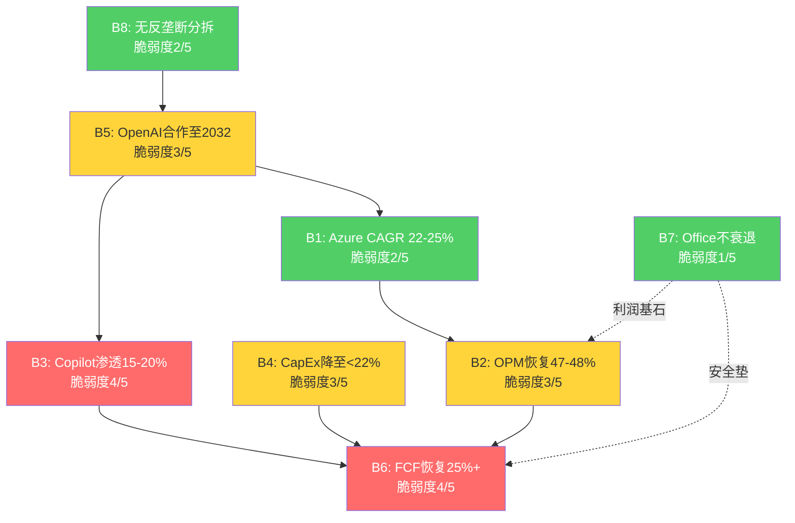

**因果链解读**:

1. **B5→B1→B2链**: OpenAI合作支撑Azure AI增速(B1中12-13pp的AI贡献)→Azure增速驱动IC收入增长→收入增长跑赢D&A从而支撑OPM恢复(B2)。如果B5断裂，B1的增速可能从25%降至18-20%(失去AI增量)，进而使B2的OPM恢复推迟1-2年。

2. **B4→B6链**: CapEx降速(B4)直接决定FCF恢复(B6)——这是最刚性的因果关系，中间没有任何缓冲变量。B4每延迟1年降速，B6的恢复时间也相应延迟1年。

3. **B3→B6链**: Copilot的高毛利增量收入(估算GPM 80%+，因AI推理成本由Azure承担)直接增厚OCF，加速FCF恢复。但这条链的传导强度取决于Copilot的收入规模——在$5B(当前)水平上影响有限，需达$15B+才产生实质性影响。

4. **B7的安全垫角色**: Office/Windows的$80B+年化营业利润是所有其他信念失败时的"最后防线"。即使B1-B6全部部分失败(不是完全失败)，P&BP的稳定现金流仍能支撑$1.5-1.8T的底部估值。

### 11.11 "最少几项信念失败即翻转评级"分析

**评级翻转的量化门槛**

当前估值$2,995B。基于Ch10的Reverse DCF分析，维持$3T估值需要八项信念中至少六项为真。以下是不同失败组合的估值影响:

| 失败组合 | 概率估算 | 市值影响 | 残余估值 | 评级影响 |
|---------|---------|---------|---------|---------|
| B3单独失败 | 25% | -$100~200B | $2.8-2.9T | 维持(估值微调) |
| B6单独失败 | 20% | -$500~700B | $2.3-2.5T | 翻转(下调至审慎关注) |
| B3+B6同时失败 | 12% | -$600~900B | $2.1-2.4T | 翻转(下调至审慎关注) |
| B1+B5链断裂 | 8% | -$400~700B | $2.3-2.6T | 翻转(下调至审慎关注) |
| B4+B6+B3同时失败 | 5% | -$800~1200B | $1.8-2.2T | 强力翻转 |

[DM-P2A-039] **核心结论: 单项信念失败中，只有B6(FCF恢复失败)具有独立翻转评级的能力**。B3(Copilot)的独立失败影响有限(叙事冲击大于财务冲击)。但B3+B6的双重失败是最危险的组合——概率约12%，且两者之间存在正相关(Copilot失速→高毛利增量收入减少→FCF恢复更慢)。

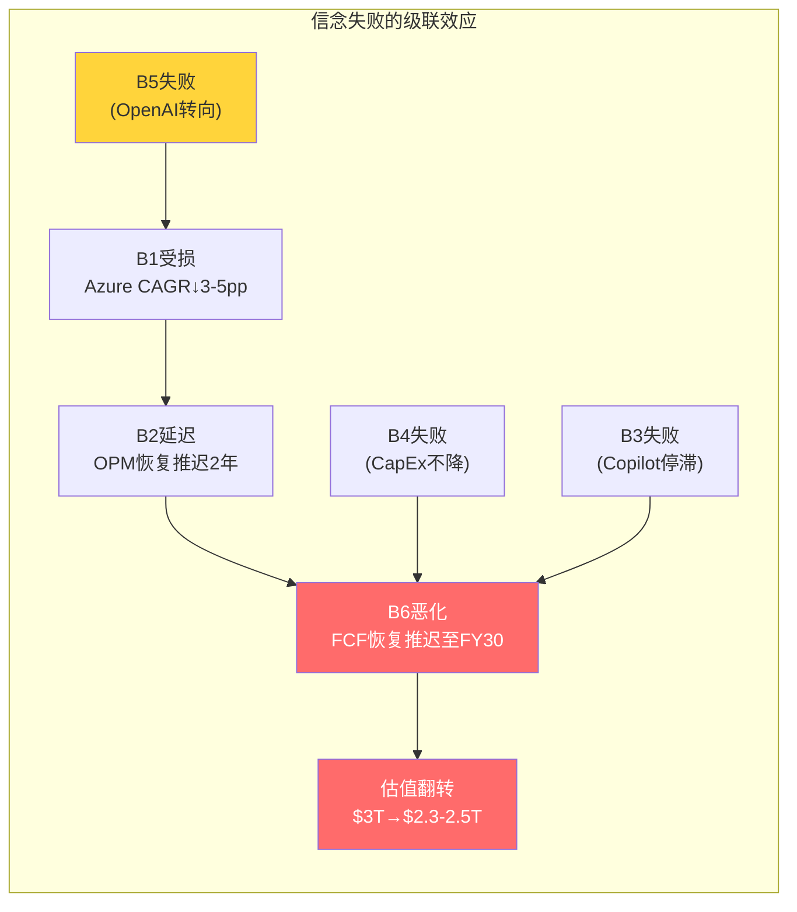

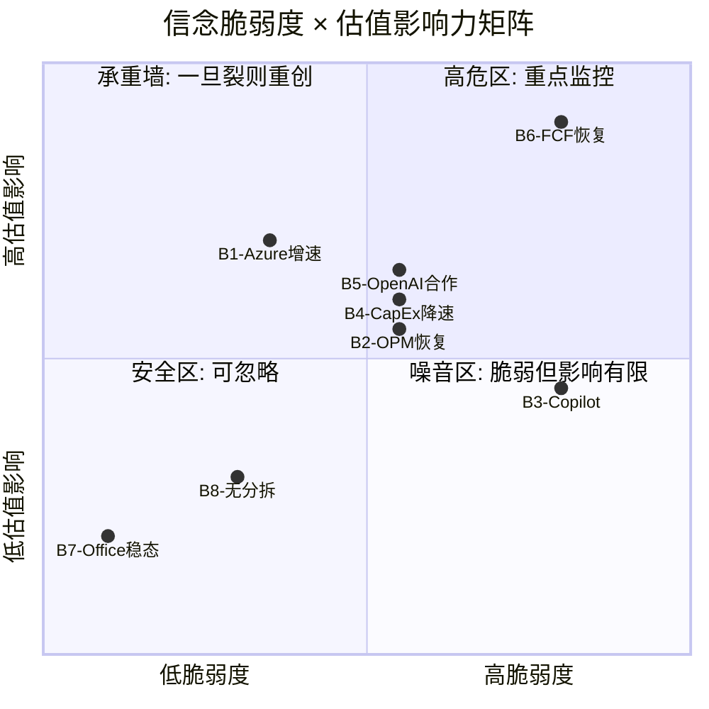

### 11.12 本章核心判断

八项信念的反演分析揭示了$3T估值的结构性特征: **这是一个"高确信底部+高不确定性上行"的组合** [DM-P2A-040]。

底部的确定性来自B7(Office/Windows不衰退)——P&BP每年$80B+营业利润构成的"估值地板"约$1.5-1.8T(12-15x P/OI)。上行的不确定性集中在B3(Copilot渗透)和B6(FCF恢复)——它们将决定MSFT是"暂时被CapEx压制的AI赢家"还是"AI军备竞赛的过度投入者"。

信念因果链的最关键发现是: **B6(FCF恢复)是整个网络的终端汇聚节点**——几乎所有其他信念的失败都会最终传导至B6。这意味着FCF恢复的时间表是评估MSFT估值的单一最重要变量。投资者不需要逐一追踪八项信念——只需密切监测CapEx/Revenue和FCF Margin两个指标，就能捕捉绝大部分信念动态 [DM-P2A-041]。

---

## Ch12: 承重墙脆弱度表 — $3T估值的三根支柱

### 12.1 承重墙定义: 从信念到结构

Ch11的八项信念可以进一步抽象为三堵"承重墙"——支撑$3T估值大厦的核心结构支柱 [DM-P2A-042]。承重墙与信念的区别在于: 信念是可独立验证的命题，承重墙是信念的组合结构。一项信念的失败可能只是墙面裂缝，但承重墙的倒塌意味着整体估值结构的崩溃。

三堵承重墙:

| 承重墙 | 构成信念 | 功能 | 估值贡献 |
|--------|---------|------|---------|
| **W1: Azure增长引擎** | B1(Azure增速) + B5(OpenAI合作) | 收入驱动 | ~$1,200B (40%) |
| **W2: 现金奶牛稳态** | B7(Office不衰退) + B5(部分) | 利润基石 | ~$1,000B (33%) |
| **W3: CapEx→FCF转化** | B4(CapEx降速) + B6(FCF恢复) | 估值验证 | ~$800B (27%) |

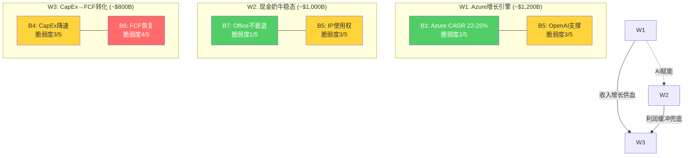

### 12.2 W1: Azure增长引擎 — 收入驱动力

**承重强度评估**

Azure增长引擎由B1(Azure增速)和B5(OpenAI合作)共同构成。IC分部当前年化收入约$132B，其中Azure贡献约$99B [DM-P2A-043]。按22-25%的5Y CAGR计算，FY30 Azure收入将达$190-215B，贡献合并层面约35-40%的收入增量。

W1的估值贡献约$1,200B(占$3T的40%)，基于以下推算:
- FY30 IC营业利润: ~$100B (Revenue $280B × OPM 36%)
- 给予增长溢价12-15x P/OI
- 隐含IC分部估值: ~$1,200-1,500B

**组合脆弱度: 2.5/5**

B1(2/5)和B5(3/5)的简单平均为2.5。但这低估了B5对B1的传导风险——如果OpenAI合作降级(B5部分失败)，Azure AI增速的12-13pp贡献可能缩减至6-8pp，将Azure整体增速从39%拉低至30-33%。这意味着B5的失败会将B1的脆弱度从2/5推升至3/5。

**W1裂开时的估值影响**

| 裂缝程度 | Azure 5Y CAGR | FY30 IC Revenue | 估值影响 |
|---------|--------------|-----------------|---------|
| 表面裂缝 | 20% (vs 22-25%目标) | $240B | -$100B |
| 深层裂缝 | 15% | $200B | -$300B |
| 墙体倒塌 | <12% | <$180B | -$500B+ |

深层裂缝(CAGR降至15%)需要Azure增速在FY27就跌至20%以下——考虑到CRPO $344B(剔除OpenAI后)的前瞻保障 [DM-P2A-052]，这一情景在FY28前概率很低。

### 12.3 W2: 现金奶牛稳态 — 利润基石

**承重强度评估**

P&BP分部是整个MSFT的利润核心: Q2 FY26单季营业利润$20.6B，年化$82B+，OPM 60.3% [DM-P2A-044]。M365的4.5亿商业座位、5-8%的极低流失率、$25-45M的企业迁移成本构成了全球科技行业最深的护城河之一。

W2的估值贡献约$1,000B(占$3T的33%):
- P&BP年化营业利润: ~$82B
- 给予稳定溢价12-13x P/OI(低增速但极高确定性)
- 隐含P&BP分部估值: ~$1,000-1,065B

**组合脆弱度: 1.5/5(最稳固)**

B7(1/5)是八项信念中最坚实的一条。B5(3/5)对W2的影响有限——即使OpenAI合作完全终止，Office/LinkedIn/Dynamics的收入和利润率不会受到直接冲击。OpenAI的IP使用权主要影响Copilot(属于W3的B3变量)，对W2的传导路径较弱。

W2是$3T估值中的"不可摧毁层"。即使W1和W3同时出现严重裂缝，W2提供的$1,000B估值底线意味着MSFT的最低合理估值不会低于$1.5T(W2 + MPC残值 + 净现金) [DM-P2A-051]。

**W2裂开的极端情景**

唯一能动摇W2的力量是"范式颠覆"——如果AI Agent在10年内取代传统生产力软件，M365的订阅基础将面临结构性萎缩。但正如Ch11分析所述，即使这一颠覆发生，MSFT凭借Copilot+Azure AI+企业数据层的组合，更可能成为新范式的主导者而非牺牲者 [DM-P2A-045]。

### 12.4 W3: CapEx→FCF转化 — 估值验证器

**承重强度评估**

W3是三堵墙中最脆弱的一堵。它由B4(CapEx降速)和B6(FCF恢复)构成——两项信念的脆弱度分别为3/5和4/5，组合脆弱度3.5/5 [DM-P2A-046]。

W3的功能不是"创造价值"，而是"验证价值"——Azure的增长(W1)和Office的利润(W2)创造了经济价值，但这些价值能否传导为股东现金回报，完全取决于CapEx→D&A→FCF的转化链。Q2 FY26 FCF $5.9B(年化$24B)相比FY24的$74.1B下降68%，直观地展示了W3当前承受的压力。

W3的估值贡献约$800B(占$3T的27%):
- 隐含FY30 FCF: ~$150B+(基于$3T EV、WACC 9%、g 3%)
- 当前FCF yield仅2.16%(远低于科技股均值3-4%)
- $800B估值溢价代表市场对"FCF终将恢复"的信念

**W3裂开时的连锁反应**

W3的特殊之处在于: 它的失败不会直接减少W1或W2的经济价值，但会通过估值倍数的系统性压缩间接削减整体估值。逻辑链如下:

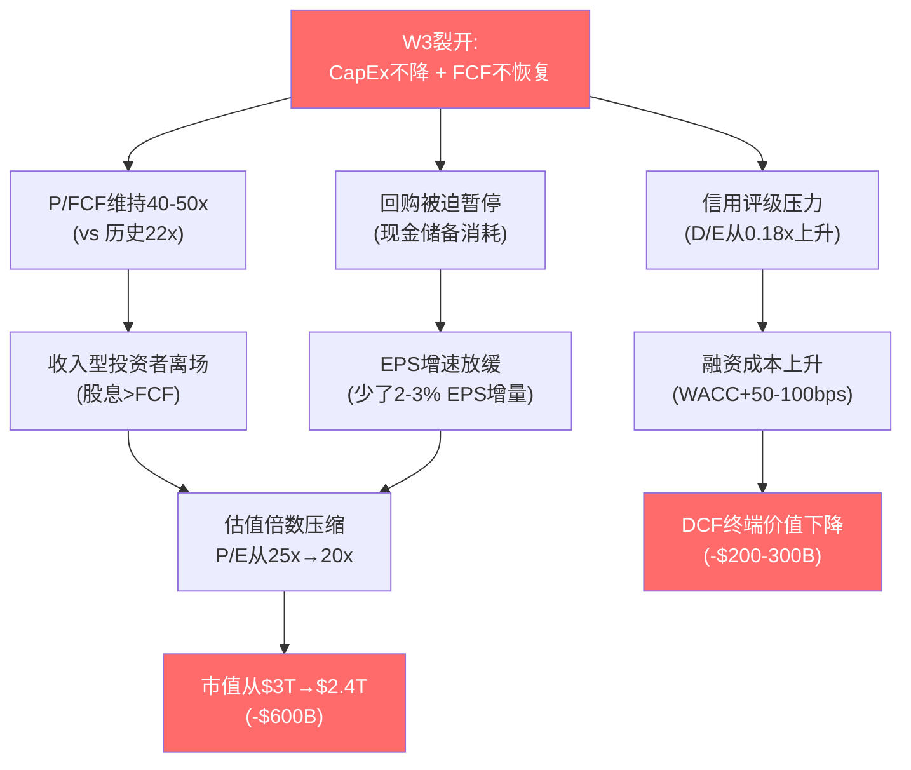

W3裂开的全链路估值影响:
- **直接影响**(FCF低于预期): -$300B至-$500B
- **倍数压缩**(投资者信心下降): -$200B至-$400B
- **融资成本上升**(如果被迫发债): -$100B至-$200B
- **总计**: -$600B至-$1,100B(从$3T降至$1.9-2.4T)

### 12.5 三墙之间的传导与缓冲

承重墙之间不是孤立的——它们通过现金流和利润率路径相互作用。

**W1→W3的正向传导**: Azure增长加速(W1变强)→IC收入增速跑赢D&A增速→OPM恢复更快→FCF恢复提前(W3变强)。反之，Azure减速→OPM恢复延迟→FCF承压更久。

**W2→W3的缓冲效应**: 即使W3出现严重裂缝(FCF长期低迷)，P&BP每年$82B+的营业利润(W2)确保MSFT永远不会面临真正的现金流危机——最坏情况下，削减回购+暂停非核心投资即可恢复正FCF。$94.6B现金储备 + 0.18x D/E提供了额外的3-5年缓冲 [DM-P2A-047]。

**W1→W2的AI赋能**: Azure AI基础设施(W1)为Copilot提供底层能力→Copilot提升M365的ARPU和黏性(W2)。这一传导目前尚处于早期，但如果Copilot在FY28达到15%渗透率，W1对W2的赋能将从"潜在"转为"实质"。

### 12.6 脆弱度总排序与压力测试

**脆弱度排序(从最脆弱到最稳固)**:

| 排序 | 承重墙 | 组合脆弱度 | 倒塌概率(5年内) | 倒塌时估值影响 |
|------|--------|-----------|----------------|--------------|
| 1 | **W3: CapEx→FCF转化** | 3.5/5 | 25-30% | -$600B~$1,100B |
| 2 | **W1: Azure增长引擎** | 2.5/5 | 10-15% | -$300B~$500B |
| 3 | **W2: 现金奶牛稳态** | 1.5/5 | <3% | -$200B~$400B |

[DM-P2A-048] **关键洞察: W3是唯一一堵在5年内有实质性倒塌概率(25-30%)的承重墙**。W1的倒塌需要Azure增速连续3年低于15%——在当前云渗透率和AI需求背景下概率较低。W2的倒塌需要M365护城河被攻破——在AD锁定和5-8%流失率的保护下几乎不可能。

**极端压力测试: 两墙倒塌**

| 情景 | W1状态 | W2状态 | W3状态 | 残余估值 |
|------|--------|--------|--------|---------|
| 基准(全部稳固) | 稳固 | 稳固 | 稳固 | $3.0T |
| W3单独裂开 | 稳固 | 稳固 | 裂开 | $2.2-2.5T |
| W1+W3同时裂开 | 裂开 | 稳固 | 裂开 | $1.8-2.0T |
| 仅W2稳固(极端) | 倒塌 | 稳固 | 倒塌 | $1.5-1.7T |

即使在最极端的"仅W2稳固"情景下，MSFT的底部估值仍有$1.5-1.7T——这得益于Office/Windows $80B+年化营业利润构成的"估值地板"。这意味着从当前$3T到$1.5T的最大下行空间约50% [DM-P2A-049]。但实现这一极端情景需要Azure增速崩溃至个位数且FCF连续3年低于$50B——联合概率不到3%。

### 12.7 本章核心判断

三堵承重墙的分析揭示了MSFT估值的非对称结构 [DM-P2A-050]:

**下行有底**: W2(现金奶牛)提供了约$1.5T的"硬底"——Office/Windows的护城河深度使其几乎不受AI周期波动的影响。即使AI投资完全失败(概率极低)，MSFT仍然是一家年利润$80B+、OPM 60%的现金流机器。

**上行受限于W3**: 从$3T向$4T+的上行需要W3(CapEx→FCF转化)被充分验证——即CapEx/Revenue降至20%以下、FCF Margin恢复至25%+。在此之前，市场不会给予更高的估值倍数。

**当前的$3T定价是在"赌W3会恢复"**: P/E 25.1x(Mega5最低)已经反映了市场对W3的部分担忧。如果FY27-FY28的数据证明FCF确实在恢复(CapEx/Revenue降至25%以下)，估值有向$3.5T修复的空间(+17%)。反之，如果FY27 CapEx继续攀升至$90B+且FCF Margin仍低于15%，估值将向$2.3-2.5T调整(-17-23%)。

这一非对称结构——下行有底($1.5T)但上行需要时间验证——是后续场景分析和概率加权估值的核心出发点。## Ch13: CapEx→D&A→OPM→FCF传导链 — 资本周期的定量核心

### 13.1 传导链机制: 从资本投入到现金流的五级联动

理解Microsoft当前估值争议的核心，需要追踪一条完整的因果链: **CapEx(资本支出) → PP&E(固定资产) → D&A(折旧摊销) → OPM(营业利润率) → FCF(自由现金流)**。这五个变量环环相扣，任何一级的异常波动都会在下游产生放大效应。

**传导机制拆解** [DM-P2B-001]:

第一级，CapEx投入。FY2025全年CapEx $64.6B，Q2 FY26单季创纪录$29.9B(CapEx/Rev 36.8%) [DM-P2B-002]。管理层指引FY26全年约$80B [DM-P2B-003]。这些资金流向两类资产: 约2/3投向短周期资产(GPU/CPU服务器，使用寿命3年)，约1/3投向长周期资产(数据中心建筑，使用寿命5年) [DM-P2B-004]。

第二级，PP&E膨胀。FY2025末PP&E净值已达$229.8B [DM-P2B-005]，是FY2021 $59.7B的3.8倍。PP&E的快速膨胀意味着折旧基数在持续扩大——即使CapEx明天归零，已在账上的$229.8B资产仍需在未来3-5年内完成折旧。

第三级，D&A时滞效应。这是传导链中最关键也最容易被忽视的环节。**当前季度的D&A反映的不是当前的CapEx，而是3-5年前的投入** [DM-P2B-006]。Q2 FY26的D&A $9.2B主要来自FY22-FY24期间$96.5B累计CapEx的折旧。FY25的$64.6B和FY26预计的$80B CapEx的D&A高峰，要到FY27-FY29才会完全释放。这意味着即使MSFT在FY27开始放缓资本支出，折旧压力仍将在FY28-FY29持续攀升——这是一条已经锁定的路径，管理层无法通过削减未来CapEx来回避。

第四级，OPM挤压。D&A是营业费用的组成部分，直接压缩营业利润率。以Q2 FY26为基准($81.3B收入，$9.2B D&A，OPM 47.1%)，D&A已占收入的11.3% [DM-P2B-007]。当D&A攀升至$15B/Q(基准情景FY28)，假设收入增长至$95B/Q，D&A占比将升至15.8%——纯D&A引致的OPM下压约450bps。

第五级，FCF承压。FCF = OCF - CapEx。CapEx在分子端(通过D&A压缩利润和经营现金流)和分母端(直接扣减)同时挤压FCF。Q2 FY26 FCF仅$5.9B(OCF $35.8B - CapEx $29.9B)是这一双重挤压的极端体现 [DM-P2B-008]。

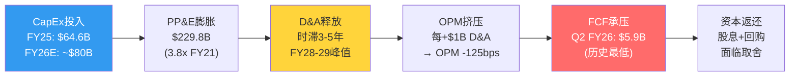

**关键时滞的数学直觉**: FY25 $64.6B CapEx中，约$43B投向3年期资产(GPU/CPU)，约$22B投向5年期资产(建筑)。$43B的3年直线折旧 = $14.3B/年 = $3.6B/Q。$22B的5年直线折旧 = $4.4B/年 = $1.1B/Q。合计贡献$4.7B/Q增量D&A，在FY26-FY28期间逐步进入损益表。叠加FY26E $80B CapEx的同等结构，FY27-FY28将面临FY25和FY26两个高投入年份的D&A"叠加波" [DM-P2B-009]。

### 13.2 D&A路径建模: 三情景下的折旧悬崖

**历史D&A轨迹回溯** [DM-P2B-010]:

从年度口径看，D&A的增速在过去五年经历了一次质变:

| 财年 | CapEx | D&A | CapEx/D&A | D&A/Revenue |
|------|-------|-----|-----------|-------------|
| FY21 | $20.6B | $11.7B | 1.76x | 7.0% |
| FY22 | $23.9B | $14.5B | 1.65x | 7.3% |
| FY23 | $28.1B | $13.9B | 2.02x | 6.6% |
| FY24 | $44.5B | $22.3B | 2.00x | 9.1% |
| FY25 | $64.6B | $34.2B | 1.89x | 12.1% |

[DM-P2B-011] CapEx/D&A比率从FY21的1.76x稳定在近年的约2.0x，意味着每投入$2 CapEx，约$1进入当年D&A。但FY24-FY25 CapEx的爆炸性增长($44.5B→$64.6B)尚未完全反映在D&A中——当前$34.2B的年D&A主要消化FY21-FY23的投入。真正的折旧高峰尚未到来。

**季度D&A波动分析** [DM-P2B-012]:

| 季度 | D&A ($B) | YoY | D&A/Revenue |
|------|----------|-----|-------------|
| Q3 FY24 | $6.0B | +70% | 9.7% |
| Q4 FY24 | $6.4B | +65% | 9.9% |
| Q1 FY25 | $7.4B | +88% | 11.3% |
| Q2 FY25 | $6.8B | +15% | 9.8% |
| Q3 FY25 | $8.7B | +45% | 12.5% |
| Q4 FY25 | $11.2B | +76% | 14.7% |
| Q1 FY26 | $13.1B | +77% | 16.8% |
| Q2 FY26 | $9.2B | +35% | 11.3% |

值得注意的是Q1 FY26的$13.1B异常峰值(16.8%收入占比) [DM-P2B-013]，可能包含Activision Blizzard无形资产的加速摊销或一次性减值调整。Q2回落至$9.2B后，剔除异常的稳态D&A约$9-10B/Q [DM-P2B-014]。但即使以$10B/Q为新常态，年化$40B已较FY21的$11.7B增长了3.4倍。

**三情景D&A路径推演** [DM-P2B-015]:

建模假设: (1) 70%短周期资产(3年折旧) + 30%长周期资产(5年折旧); (2) 存量PP&E $229.8B按剩余寿命线性折旧; (3) 新增CapEx按情景设定。

**情景一: 乐观(CapEx FY27起降速至$60-65B/年)**

| 年度 | 新增CapEx | 季度D&A | 年化D&A | D&A/Revenue |
|------|----------|---------|---------|-------------|
| FY27E | $65B | $11-12B | $44-48B | 12.5% |
| FY28E | $60B | $13B | $52B | 12.4% |
| FY29E | $55B | $14B | $56B | 11.6% |
| FY30E | $50B | $13B | $52B | 9.6% |

[DM-P2B-016] 乐观情景下，D&A在FY29达到峰值$56B后回落，因FY25-FY26高投入期的3年期资产在FY28-FY29折完退出。OPM压力可控: 假设FY29收入$480B，D&A占比11.6%，较当前上升约30bps，收入增长足以消化。

**情景二: 基准(CapEx稳定在$75-80B/年)**

| 年度 | 新增CapEx | 季度D&A | 年化D&A | D&A/Revenue |
|------|----------|---------|---------|-------------|
| FY27E | $80B | $12B | $48B | 13.0% |
| FY28E | $80B | $15B | $60B | 14.3% |
| FY29E | $75B | $18B | $72B | 14.9% |
| FY30E | $70B | $17B | $68B | 12.6% |

[DM-P2B-017] 基准情景下，D&A在FY29达到峰值$72B(季度$18B)，是当前水平的约2倍。这将在FY28-FY29制造严重的OPM挤压: 以FY29收入$485B计算，D&A占比14.9%，较FY25的12.1%上升280bps。叠加其他费用项(R&D 11%、SG&A 10%)，OPM可能被压至约42% [DM-P2B-018]。

**情景三: 悲观(CapEx持续高位$90-100B/年)**

| 年度 | 新增CapEx | 季度D&A | 年化D&A | D&A/Revenue |
|------|----------|---------|---------|-------------|
| FY27E | $95B | $14B | $56B | 15.1% |
| FY28E | $100B | $18B | $72B | 17.1% |
| FY29E | $100B | $22B | $88B | 18.3% |
| FY30E | $95B | $21B | $84B | 15.6% |

[DM-P2B-019] 悲观情景是AI军备竞赛持续升级的极端假设。FY29 D&A峰值$88B(季度$22B)将使D&A/Revenue突破18%，OPM可能被压至37-38%——回到FY2017 Nadella转型早期的利润率水平。这一情景的发生概率约20%，但其影响是灾难性的。

**OPM挤压量化公式** [DM-P2B-020]:

以季度收入$80B为基准:
- 每增加$1B季度D&A → OPM下降约125bps
- 从当前$9B/Q到基准FY29的$18B/Q(+$9B) → OPM纯D&A压力约-1,125bps
- 但FY29收入预计增至~$120B/Q → 实际OPM压力约-750bps(收入增长部分抵消)
- 抵消后净OPM压力: 乐观-150bps / 基准-400bps / 悲观-800bps

### 13.3 FCF Bridge完整建模: 从经营现金流到股东手中的钱

**Q2 FY26实际FCF Bridge** [DM-P2B-021]:

这是一张让投资者不安的现金流瀑布图:

```
经营现金流(OCF):              $35.8B
  (-) 资本支出(CapEx):         -$29.9B   (消耗OCF的83.5%)
━━━━━━━━━━━━━━━━━━━━━━━━━━━━━━━━━━━━━━
自由现金流(FCF):               $5.9B     (仅转化16.5%)

资本返还:
  (-) 股息:                    -$6.8B    (覆盖率0.87x, 首次不足)
  (-) 股票回购:                -$7.4B
  (-) 债务偿还+其他:            -$3.0B
━━━━━━━━━━━━━━━━━━━━━━━━━━━━━━━━━━━━━━
季度净现金流:                   -$8.3B    (烧钱状态)
```

[DM-P2B-022] 三个历史性指标在Q2 FY26同时出现: (1) CapEx/OCF 83.5%——MSFT上市以来最高; (2) FCF $5.9B——至少五年单季最低; (3) FCF < 季度股息——首次发生。年化来看，若Q2 FY26的节奏持续，年化净现金流为-$33.2B，意味着期末$94.6B现金储备(含短期投资)在不到3年内将被耗尽 [DM-P2B-023]。

**FCF/OCF转化率退化轨迹** [DM-P2B-024]:

| 期间 | OCF | CapEx | FCF | FCF/OCF |
|------|-----|-------|-----|---------|
| FY21 | $76.7B | $20.6B | $56.1B | 73.1% |
| FY22 | $89.0B | $23.9B | $65.1B | 73.2% |
| FY23 | $87.6B | $28.1B | $59.5B | 67.9% |
| FY24 | $118.5B | $44.5B | $74.1B | 62.5% |
| FY25 | $136.2B | $64.6B | $71.6B | 52.6% |
| Q2 FY26单季 | $35.8B | $29.9B | $5.9B | **16.5%** |

从73%到16.5%，FCF转化率在五年内下降了近80%。即使Q2 FY26是极端季度(季度CapEx波动大)，全年趋势仍不可逆——FY25全年FCF/OCF已降至52.6%，是FY21的72%水平 [DM-P2B-025]。

**FY27-FY30三情景FCF路径(年化)** [DM-P2B-026]:

| 情景 | FY27E OCF | FY27E CapEx | FY27E FCF | FY28E FCF | FY29E FCF | FY30E FCF |
|------|----------|-----------|----------|----------|----------|----------|
| 乐观 | $170B | $65B | $75B | $95B | $115B | $130B |
| 基准 | $160B | $80B | $55B | $70B | $85B | $100B |
| 悲观 | $150B | $95B | $35B | $45B | $55B | $65B |

乐观情景假设CapEx在FY27即开始降速(AI基础设施初步饱和+GPU效率提升)，FCF在FY28恢复至接近FY24水平 [DM-P2B-027]。基准情景假设CapEx维持$75-80B水平至FY29才开始回落，FCF恢复缓慢。悲观情景假设AI军备竞赛持续，CapEx居高不下，FCF在整个预测期内均低于FY21水平。

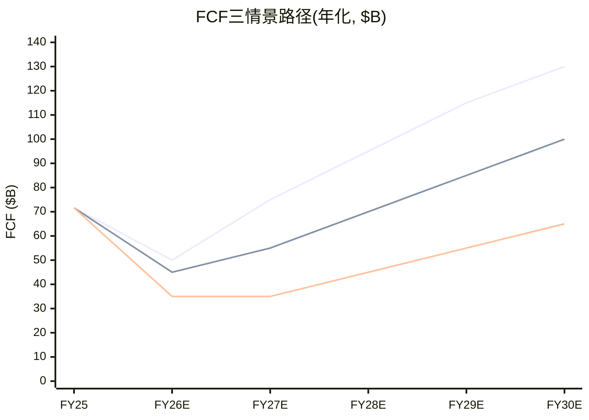

**D&A分部归属推演** [DM-P2B-076]:

管理层未单独披露各分部的D&A分配(DATA GAP)，但可通过间接方法推断。Intelligent Cloud作为数据中心资产最密集的分部，承担了D&A增量的绝大份额。按PP&E归属推算: IC分部约占PP&E的75-80%(Azure数据中心)，P&BP约10-12%(LinkedIn数据中心+企业园区)，MPC约8-10%(Xbox云+工作室)。以FY25全年$34.2B D&A为基准:

- IC承担D&A: ~$26-27B (约77%)
- P&BP承担D&A: ~$4-5B (约13%)
- MPC承担D&A: ~$3-4B (约10%)

这解释了一个表面矛盾: 为什么合并层面OPM仍在上升(FY25 45.6% > FY24 44.6%)而IC OPM却在下降(42.1% < FY23的48%)?答案是D&A的"分部不对称分配"——IC吸收了80%的折旧增量，却创造了不到50%的营业利润。P&BP几乎不承担AI基础设施折旧，但通过Copilot和AI增强功能间接受益于这些投入。这种"IC出血、P&BP受益"的内部补贴结构，使得合并报表掩盖了AI投入对真实利润率的侵蚀程度 [DM-P2B-077]。

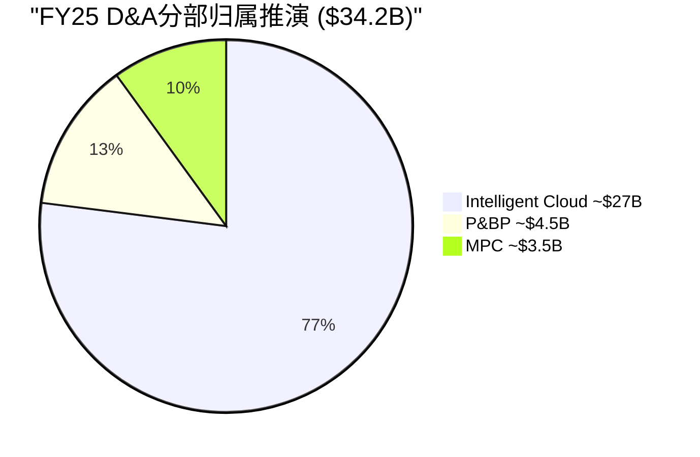

### 13.4 股息可持续性测试: 回购成为调节阀

**FY26年化资本返还需求** [DM-P2B-028]:

- 年化股息: ~$27B (Q2 FY26 $6.8B × 4，FY25全年$24.1B，年增长率约10%)
- 年化回购: ~$20B (近两年均值)
- 合计资本返还: ~$47B/年

**三情景覆盖率测试** [DM-P2B-029]:

| 情景 | FY27E FCF | 股息覆盖率 | 全覆盖率(股息+回购$47B) | 回购空间 |
|------|----------|-----------|---------------------|---------|
| 乐观 | $75B | 2.8x | 1.6x | $48B (充裕) |
| 基准 | $55B | 2.0x | 1.2x | $28B (紧张) |
| 悲观 | $35B | 1.3x | 0.7x | $8B (极紧张) |

[DM-P2B-030] 股息安全性分析: 即使在悲观情景下，FY27 FCF $35B仍覆盖$27B股息的1.3倍——MSFT不会削减股息。原因有三: (1) 股息政策是上市公司对机构投资者的"隐性合同"，Microsoft Dividend Aristocrat身份的政治成本极高; (2) 即使FCF不够，$94.6B现金储备和AAA级信用评级(可随时低成本发债)提供数年缓冲; (3) 回购是天然的"弹性阀门"——FY22回购$32.7B到FY24已降至$17.3B，进一步压缩至$5-8B完全在管理层可控范围内 [DM-P2B-031]。

**回购挤出效应的估值含义** [DM-P2B-032]: FY22 MSFT回购$32.7B，以当时约$250平均价计算，注销约1.3亿股(约稀释股数的1.7%)。若FY27-FY28回购降至$10-15B/年(基准情景)，年注销降至0.6-0.8%，EPS增厚效应减半。对于依赖EPS增长支撑P/E的投资者来说，回购缩减是一个间接但持续的估值逆风。

### 13.5 ROIC回归WACC的时间窗: 资本效率的终极检验

**WACC估算** [DM-P2B-033]:

| 参数 | 值 | 来源 |
|------|---|------|
| 无风险利率(Rf) | 4.2% | 10Y UST |
| 股权风险溢价(ERP) | 4.5% | 宏观温度计 |
| Beta | 1.084 | FMP quote |
| 权益成本(Ke) | 9.1% | Rf + Beta×ERP |
| 税后债务成本(Kd) | 3.2% | 平均票面利率×(1-21%) |
| 权益权重 | 85% | 市值/总资本 |
| 债务权重 | 15% | 有息债务/总资本 |
| **WACC** | **~9.0%** | 加权平均 |

**ROIC历史路径与未来推演** [DM-P2B-034]:

ROIC(投入资本回报率)是衡量每一美元投入资本创造经济利润能力的核心指标。FMP key-metrics口径下MSFT当前ROIC为22.0% [DM-P2B-035]，仍大幅高于9.0% WACC。但趋势令人警惕: 从FY20峰值43.4%已下降近50%，而投入资本(IC = Equity + Net Debt - Cash + Operating Lease Liabilities)的膨胀速度远超NOPAT增速。

**投入资本膨胀率**: PP&E从FY21 $70.8B到FY25 $229.8B(CAGR 34.3%) [DM-P2B-036]，是收入CAGR 13.8%的2.5倍。若FY26-FY28 CapEx维持$75-80B/年，PP&E将在FY28突破$350B，投入资本总额可能达$450-500B [DM-P2B-037]。

**三情景ROIC路径** [DM-P2B-038]:

**乐观情景(CapEx FY27起降速+AI毛利率提升)**:
- FY27: ROIC ~18% (NOPAT增长12% / IC增长20%)
- FY28: ROIC ~16% (IC增速放缓至10%)
- FY29: ROIC ~19% (D&A过峰值+收入增速维持)
- FY30: ROIC ~22% (恢复至当前水平)
- **ROIC始终 > WACC 9.0%，经济利润为正** [DM-P2B-039]

**基准情景(CapEx稳定+AI货币化渐进)**:
- FY27: ROIC ~16% (IC快速膨胀)
- FY28: ROIC ~15% (D&A高峰侵蚀NOPAT)
- FY29: ROIC ~14% (谷底)
- FY30: ROIC ~17% (CapEx开始回落+收入增速支撑)
- **ROIC始终 > WACC，但安全边际收窄至6pp** [DM-P2B-040]

**悲观情景(CapEx持续+AI回报延迟)**:
- FY27: ROIC ~14% (NOPAT增速低于IC膨胀)
- FY28: ROIC ~12% (D&A高峰+AI毛利率承压)
- FY29: ROIC ~10% (接近WACC)
- FY30: ROIC ~12% (缓慢恢复)
- FY31: ROIC ~15% (CapEx降速+折旧过峰)
- **FY29 ROIC逼近WACC临界线(10% vs 9%)，经济利润接近归零** [DM-P2B-041]

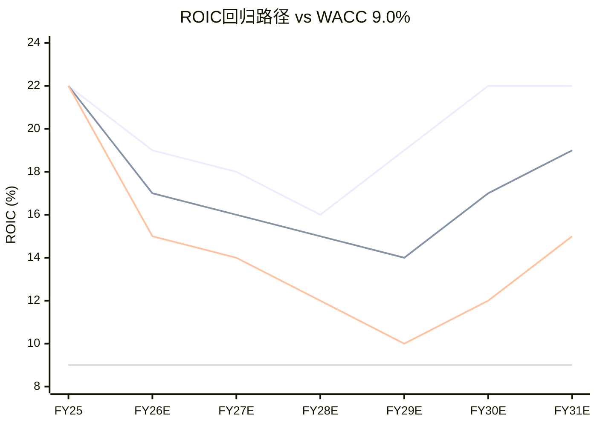

**关键判断**: MSFT ROIC跌破WACC(即经济利润为负)的概率较低——约15% [DM-P2B-042]。即使在悲观情景下，FY29 ROIC 10%仍略高于WACC 9%。但"ROIC > WACC"和"ROIC足以支撑$3T估值"是两个完全不同的命题。$3T市值隐含市场相信ROIC将长期维持在18-22%区间(对应30x+ NOPAT)。若ROIC在FY28-FY29压缩至14-15%(基准情景)，合理估值对应NOPAT的20-22x——这意味着市值从$3.0T缩减至约$2.5T(下行17%)。ROIC的每一个百分点都对应约$120-150B市值 [DM-P2B-043]。

---

## Ch14: CapEx边际效率曲线 + PDRM风险定量

### 14.1 边际效率分析: 每一美元CapEx的递减回报

**定义**: CapEx边际效率 = 每$1B增量CapEx带来的Azure收入增速贡献(百分点)。这是衡量MSFT资本投入是否创造价值的最直接指标。

**历史边际效率曲线** [DM-P2B-044]:

| 时期 | 年均CapEx | Azure增速 | 每$1B CapEx→Azure增速贡献 | 效率评级 |
|------|----------|----------|------------------------|---------|
| FY16-18 | $9.3B | ~90% (avg) | ~3.0pp/$1B | 高效期 |
| FY19-20 | $14.7B | ~55% (avg) | ~1.8pp/$1B | 成熟期 |
| FY21-22 | $22.3B | ~45% (avg) | ~1.5pp/$1B | 规模期 |
| FY23-24 | $36.3B | ~29% (avg) | ~1.0pp/$1B | AI早期 |
| FY25-26 | $72.3B | ~38% (avg) | ~0.8pp/$1B | 规模递减 |

[DM-P2B-045] 边际效率从FY16-18的3.0pp/$1B下降至FY25-26的0.8pp/$1B——**五年内下降73%**。这不是MSFT独有的现象，而是基础设施投资的普遍规律: 早期每一台服务器都在填补需求缺口，效率极高; 成熟期需要为冗余、容灾和未来需求预留产能，边际产出递减。

**但需要区分"表面效率"与"深层效率"** [DM-P2B-046]:

FY25-26的CapEx中有大量资金投向尚未产生收入的AI基础设施——GPU集群的部署到产生Azure AI收入需要6-12个月的ramp-up时间(安装→测试→客户接入→负载优化)。如果用"总CapEx"除以"当期Azure增速"，会低估真实效率，因为分子中包含了大量尚未产出收入的"预投入"。

一个更公平的比较方式是使用"滞后12个月的CapEx"与"当期Azure增速"的映射。按此口径:

| 时期 | T-12M CapEx | 当期Azure增速 | 滞后效率 |
|------|-----------|-------------|---------|
| FY24 | $28.1B (FY23) | +29% | ~1.0pp/$1B |
| FY25 | $44.5B (FY24) | +34% | ~0.8pp/$1B |
| FY26 | $64.6B (FY25) | +38% | ~0.6pp/$1B |

[DM-P2B-047] 即使使用滞后口径，边际效率仍在下降(从1.0降至0.6)，但降幅(40%)小于表面口径(73%)。这暗示部分效率下降是"会计幻觉"(投入尚未变现)，部分是真实的规模递减效应。

**AWS类比** [DM-P2B-048]: Amazon的AWS在2012-2018年经历了类似的边际效率下降: 从2012年约4.0pp/$1B降至2018年约0.7pp/$1B。但AWS随后通过企业迁移浪潮(2019-2023)实现了"效率平台期"——边际效率稳定在0.5-0.7pp/$1B而非持续下降。MSFT可能在FY28-FY30经历类似的效率筑底，前提是AI应用的企业渗透速度足够快。

### 14.2 PDRM(平台依赖风险模型)定量

**OpenAI依赖结构** [DM-P2B-049]:

MSFT对OpenAI的依赖体现在三个维度:

1. **CRPO依赖**: $625B商业剩余履约义务中约45%(~$281B)来自OpenAI的$250B Azure增量承购合同。剔除OpenAI后，CRPO增速从+110%降至+28% [DM-P2B-050]。
2. **技术依赖**: Copilot底层模型(GPT-4/4o)由OpenAI提供，MSFT的IP使用权至2032年，但模型迭代依赖OpenAI的研发节奏。
3. **叙事依赖**: "AI领导者"的市场定位很大程度上建立在与OpenAI的排他关系上。若关系破裂，竞争者(Google Gemini、Anthropic Claude)可能快速侵蚀Azure AI的心理份额。

**搁浅资产(Stranded Assets)风险估算** [DM-P2B-051]:

如果OpenAI承诺不兑现或关系重大恶化:

- FY25-FY26累计AI专用基础设施投入: ~$130-145B(FY25 $64.6B + FY26E $80B的约90%投向AI/云)
- AI专用占比(非通用计算): 约40-50%(GPU集群+定制ASIC+AI专属网络) ≈ $52-72B
- 转用性评估: GPU集群可部分转用于非OpenAI客户的AI推理/训练需求(转用率约60-70%)
- **净搁浅资产估算**: $52-72B × (1 - 65%转用率) = **$18-25B** [DM-P2B-052]

[DM-P2B-053] 但搁浅资产不等于损失——这些资产仍在资产负债表上，只是可能需要加速折旧或减值。按会计影响计算: $20B搁浅资产 × 50%减值率 = $10B一次性亏损，对应EPS冲击约$1.34(稀释股数7.46B)，约为TTM EPS $15.97的8.4%。

**PDRM概率×影响矩阵** [DM-P2B-054]:

| 情景 | 概率 | 搁浅资产 | CRPO冲击 | 估值影响 | 期望损失 |
|------|------|---------|---------|---------|---------|
| 关系稳定(基准) | 60% | $0 | $0 | $0 | $0 |
| 部分疏离(非API开放) | 25% | $5-8B | -$80B | -$150B市值 | -$37.5B |
| 重大恶化(转向竞品) | 12% | $15-20B | -$200B | -$350B市值 | -$42B |
| 完全断裂 | 3% | $20-25B | -$281B | -$500B市值 | -$15B |

**期望损失合计**: ~$95B [DM-P2B-055]，约占当前市值的3.2%。这一风险的绝对值不大，但其"尾部效应"值得警惕——3%概率的完全断裂情景对应$500B市值蒸发(17%下行)，远超期望值所暗示的温和程度。

**缓释因素**: MSFT已在构建OpenAI替代方案——与Anthropic建立备选合作关系，投资自有AI模型(Phi系列小模型)，Azure AI也支持Llama、Mistral等开源模型。这些举措将在FY28-FY30逐步降低OpenAI单点依赖风险 [DM-P2B-056]。

### 14.3 Nadella三阶段ROIC类比: 当前周期为何更慢

**阶段1(Azure Cloud, FY15-18)的ROIC实现路径** [DM-P2B-057]:

| 财年 | 累计CapEx | ROIC | vs WACC 8% |
|------|----------|------|-----------|
| FY15 | $5.9B | 6.8% | < WACC |
| FY16 | $14.2B | 7.5% | < WACC |
| FY17 | $25.8B | 8.1% | ≈ WACC |
| FY18 | $39.5B | 9.4% | > WACC |
| FY19 | $53.4B | 10.8% | > WACC |
| FY22 | — | 16.7% | 峰值 |

阶段1的关键特征: 累计$40B CapEx在4年内(FY18)实现ROIC>WACC，8年(FY22)达到峰值16.7%。Azure在FY16-FY18的增速高达76-120%，快速转化为规模效应——数据中心利用率从30-40%提升至70-80%，边际成本急剧下降 [DM-P2B-058]。

**阶段3(AI Platform, FY23-26)的对比** [DM-P2B-059]:

| 维度 | 阶段1 (FY15-18) | 阶段3 (FY23-26) | 差异倍数 |
|------|----------------|----------------|---------|
| 累计CapEx | $40B (4年) | $217B (4年) | **5.4x** |
| CapEx/Revenue峰值 | 10.6% | 36.8% | **3.5x** |
| 货币化速度 | Azure FY16 ~$6B收入 | Copilot FY26 ~$5.4B run-rate | 相当 |
| 竞争格局 | AWS领先，2-3玩家 | 多方混战(Google/Meta/开源) | 更激烈 |
| 投入资本膨胀 | PP&E +$30B (4年) | PP&E +$170B (4年) | **5.7x** |

[DM-P2B-060] 三个关键差异决定了阶段3的ROIC恢复将慢于阶段1:

**差异一: 投入强度差距悬殊(5.4x)**。阶段1累计$40B CapEx，阶段3仅FY26一年就可能达$80B。投入资本基数膨胀意味着NOPAT需要更大的绝对增量才能维持ROIC。以ROIC = NOPAT / IC计算，若IC从$350B(FY25)膨胀至$500B(FY28)，NOPAT需从$77B增长至$110B(+43%)才能维持22% ROIC——这要求年化NOPAT增速约13%，在D&A压力下极具挑战性 [DM-P2B-061]。

**差异二: 货币化速度更慢**。阶段1中Azure从第一天起就有清晰的企业客户需求(IaaS/PaaS替代on-premise服务器)，付费意愿已被AWS验证。阶段3中Copilot的$30/月定价面临"生产力溢价"的ROI证明难题——企业需要看到可量化的工时节省才会大规模部署，而这一验证过程至少需要12-18个月。当前3.3%渗透率远低于Azure在等效时间点的采用速度 [DM-P2B-062]。

**差异三: 竞争压缩定价权**。阶段1中AWS虽然领先，但Azure通过企业捆绑(EA/M365+Azure)和混合云(Azure Stack)找到了差异化定价空间。阶段3面临的竞争更为激烈: Google Gemini以接近成本价提供API(绑定GCP)，Meta Llama完全开源免费，Anthropic Claude在企业安全领域快速崛起。AI推理/训练服务存在变成"低毛利基础设施"(类似CDN)的风险——如果Azure AI毛利率长期锁定在40-50%(vs传统Azure 60-70%)，ROIC恢复曲线将被结构性压平 [DM-P2B-063]。

**ROIC>WACC时间预测** [DM-P2B-064]:

需要澄清: MSFT当前ROIC 22%已远超WACC 9%，这里讨论的是"新增AI投入的增量ROIC何时超越WACC"——即每一美元AI CapEx的边际回报何时开始创造经济利润。

- **乐观情景(类比阶段1)**: FY28增量ROIC>WACC(投入启动后5年)。前提: Copilot渗透率FY28达15%+，Azure AI毛利率提升至55%+。
- **基准情景(50%概率)**: FY29-FY30增量ROIC>WACC(6-7年)。延迟原因: CapEx持续高位+AI定价竞争+Copilot渗透缓慢。
- **悲观情景**: FY31才恢复(8年)。触发条件: CapEx持续$90B+/年+AI毛利率<45%+Copilot渗透率<10%。

**结论**: 与阶段1的4年相比，阶段3的ROIC恢复时间窗大概率延后1-3年(至FY28-FY30) [DM-P2B-065]。这不是因为AI投资"失败"，而是因为投入规模大5倍、竞争更激烈、货币化更复杂。投资者需要有耐心——但"耐心"在$3T估值下的机会成本不容忽视。

### 14.4 AI CapEx的"囚徒困境": 不投会死，投了也可能不活

**全球科技巨头FY26 CapEx竞赛** [DM-P2B-066]:

| 公司 | FY26E CapEx | YoY增速 | CapEx/Revenue |
|------|-----------|---------|--------------|
| Amazon | $100B+ | +40% | ~16% |
| Google | ~$75B | +43% | ~18% |
| Microsoft | ~$80B | +24% | ~26% |
| Meta | $60-65B | +64% | ~35% |
| 合计 | ~$320B | +38% | — |

[DM-P2B-067] 四大巨头FY26年化AI CapEx合计超过$320B，相当于越南GDP。MSFT的$80B虽不是绝对值最高(Amazon更多)，但CapEx/Revenue 26%在四家中排名第二(仅低于Meta的35%)。

**囚徒困境的博弈结构** [DM-P2B-068]:

这是一个经典的"先撤退者受惩罚"博弈:

- **如果MSFT减速而竞争对手继续投入**: Azure失去AI产能竞争力→客户转向AWS/GCP→市场份额下降→股价受更大冲击(市场惩罚"掉队者"而非"过度投入者")。
- **如果所有玩家同步减速**: 最优均衡(降低行业资本强度)，但需要协调——反垄断法禁止这种协调。
- **如果所有玩家持续投入**: 供给过剩→AI服务价格战→毛利率压缩→所有玩家FCF受损，但"不掉队"。
- **如果MSFT持续投入而竞争对手减速**: 最优情景(获得市场份额溢价)，但概率极低(竞争对手也在做同样博弈)。

当前均衡点停留在"所有玩家持续投入"——这是个人理性但集体次优的纳什均衡 [DM-P2B-069]。

**MSFT的独特困境: "被动"CapEx成分** [DM-P2B-070]:

与Google和Meta不同(它们的AI投资完全是自主决策)，MSFT的CapEx中存在"被动"成分——OpenAI的$250B Azure承购义务意味着MSFT需要建设足够的产能来履行合同。即使MSFT管理层判断AI投资回报不达预期，合同义务也要求其维持一定水平的CapEx。这降低了MSFT的资本配置灵活性 [DM-P2B-071]。

**解脱条件**: 囚徒困境的终结需要以下条件之一 [DM-P2B-072]:
1. **AI货币化速度>CapEx增速**(目前未达成: Azure AI收入增速约50% vs CapEx增速45%，仅微幅领先)
2. **GPU效率大幅跃升**(NVIDIA Blackwell→Rubin代际性能提升可能在FY28-FY29降低同等算力所需CapEx)
3. **需求饱和信号**(GPU利用率持续下降至<70%——目前仍>90%)
4. **外部冲击**(经济衰退迫使所有玩家同步削减)

目前四个条件均未满足。MSFT最现实的解脱窗口是FY28-FY29: 如果Blackwell/Rubin架构使每美元CapEx的算力产出提升2-3倍，MSFT可能在不削减绝对CapEx的情况下实现"效率性减速"——即$80B CapEx产出等同于此前$150-200B的产能 [DM-P2B-073]。

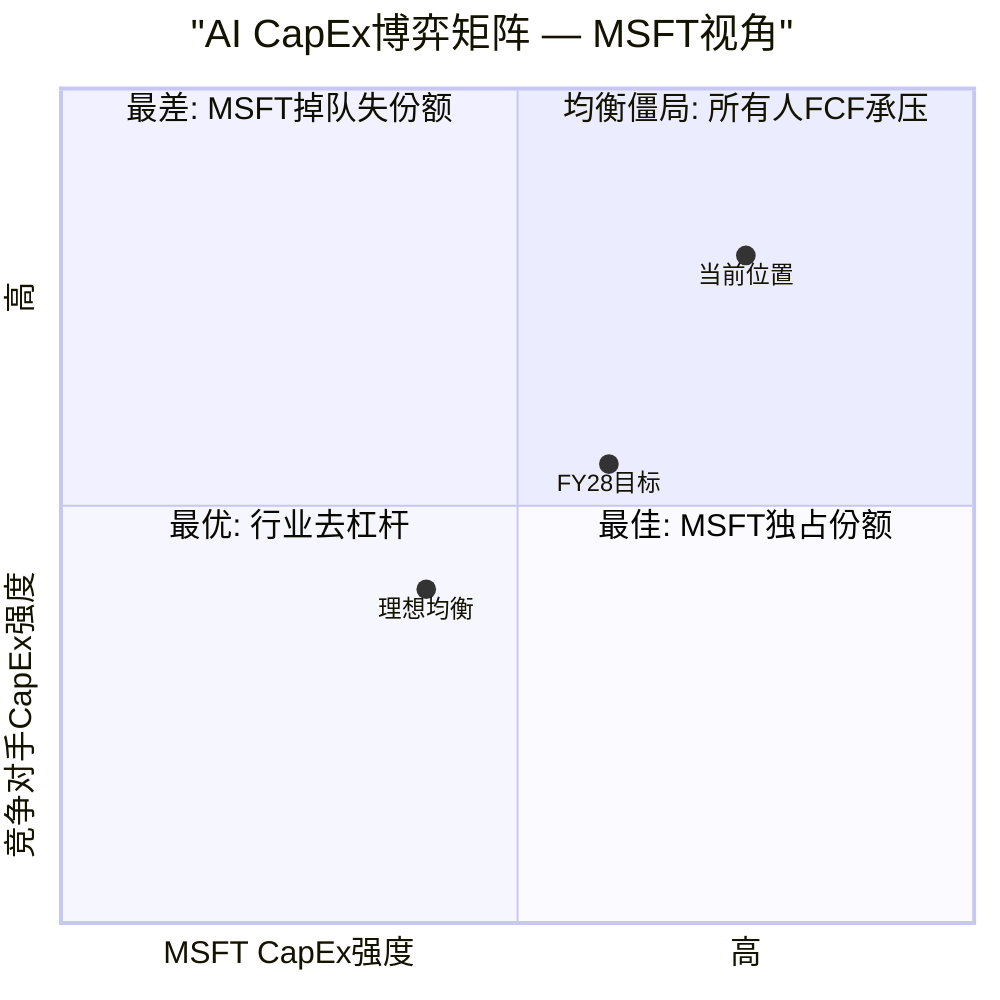

**解脱时间表估算** [DM-P2B-078]:

| 条件 | 当前状态 | 预计达成 | 触发效应 |
|------|---------|---------|---------|
| AI货币化>CapEx增速 | Azure AI +50% vs CapEx +45% (微幅领先) | FY28 | CapEx增速放缓至+5-10% |
| GPU代际效率跃升 | Hopper→Blackwell (2-3x性能/美元) | FY28-FY29 | 同等产能所需CapEx下降40% |
| GPU利用率下降 | 当前>90% | FY29+ | 新增产能需求放缓 |
| 经济衰退冲击 | 当前未发生 | 不可预测 | 所有玩家同步削减 |

综合评估: **FY28是最可能的均衡转折年**。如果NVIDIA Blackwell/Rubin架构如期交付2-3倍的性能/美元提升，MSFT在FY28-FY29可能实现"隐性减速"——绝对CapEx维持$75-80B但有效算力产出翻倍，等效于上一周期的$150B投入。这将同时缓解FCF压力(CapEx不再增长)和ROIC压力(同等投入产出翻倍)。但这一乐观假设依赖于NVIDIA的执行力和AI需求的持续增长，两者都不是确定事件 [DM-P2B-079]。

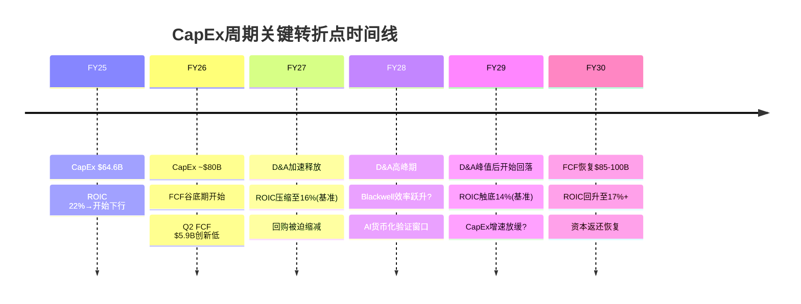

### 14.5 本章核心判断 [DM-P2B-074]:

CapEx传导链的定量分析揭示了MSFT当前面临的核心矛盾: **资本投入的规模是史诗级的(FY24-FY26累计$189B)，但回报的确认是渐进式的(ROIC恢复需5-7年)**。在这个时间差中，FCF将在FY26-FY28经历"谷底期"(基准年化$45-55B vs 历史$60-75B)，股息安全但回购将被大幅压缩，ROIC从22%下滑至14-16%但不会跌破WACC。

从风险角度看，最值得关注的不是ROIC是否跌破WACC(概率约15%)，而是**边际效率的持续下降是否预示着AI CapEx正在创造一代"低回报资产"**。每$1B CapEx对Azure增速的贡献从3.0pp降至0.8pp，这一趋势若延续至0.3-0.5pp/$1B(FY28-FY29)，意味着MSFT需要$150-200B/年CapEx才能维持30%+ Azure增速——这在数学上不可持续 [DM-P2B-075]。

OpenAI平台依赖(PDRM)的期望损失约$95B(市值的3.2%)，绝对值可控但尾部风险显著(3%完全断裂→$500B市值蒸发)。MSFT正在通过多元化AI合作伙伴关系逐步降低这一风险，但OpenAI在CRPO和AI叙事中的权重在未来2-3年内仍将居高不下。

AI CapEx的囚徒困境是行业性的，MSFT无法单方面解脱。最现实的出路是技术效率跃升(GPU代际进步)而非战略性削减——这意味着投资者在FY28前需要容忍FCF的持续压力。好消息是MSFT的P&BP现金奶牛(OPM 60%、年化$80B+营业利润)提供了独一无二的"安全气囊"——即使AI投资回报延迟3-5年，Office和Windows的稳态现金流足以维持公司的财务韧性。
## Ch15: 估值方法独立性审计 — 五方法"伪收敛"防火墙

### 15.1 五方法预览与假设映射

在最终估值整合中，将使用五种方法从不同视角逼近Microsoft的内在价值。但"五种方法"不等于"五个独立意见"——如果多种方法共享同一组核心假设，其结果的收敛仅仅反映了假设的自我循环，而非多视角的交叉验证。本节的任务是在估值执行前，预先识别假设重叠、诊断伪独立性、并设计增强方案。

**五方法概览与假设族归类**:

| 方法 | 核心驱动假设 | 假设族 | 独立性等级 |
|------|------------|--------|-----------|
| M1: 10年FCFF折现 (DCF) | WACC 9.0%, g 3.0%, Rev CAGR路径, OPM路径, CapEx/Rev路径 | 内生假设族A | 基准方法 |
| M2: 分部SOTP | IC/P&BP/MPC各自增速×分部乘数, 分部OPM路径 | 内生假设族A(共享分部增速) | 与M1高度重叠 |
| M3: Reverse DCF信念加权 | 8项信念概率×条件估值, WACC 9.0%, g 3.0% | 混合假设族B | 与M1数学等价 |
| M4: 可比估值 (P/E + EV/EBITDA) | Mega5同行乘数+MSFT相对溢价/折价 | 外部假设族C | 唯一真正独立 |
| M5: 情景概率加权 | 4情景概率×条件市值, 融合信念失败路径 | 混合假设族B(扩展) | 与M3部分重叠 |

[DM-P2C-001] 五方法中，M1/M2/M3实质上共享"内生价值锚"——它们的差异在于表达形式(正向推导/分部加总/逆向工程)，而非底层假设。M4是唯一完全脱离MSFT自身财务假设、依赖市场定价信号的方法。M5介于两者之间，其独立性取决于情景定义是否独立于M1的增速假设。

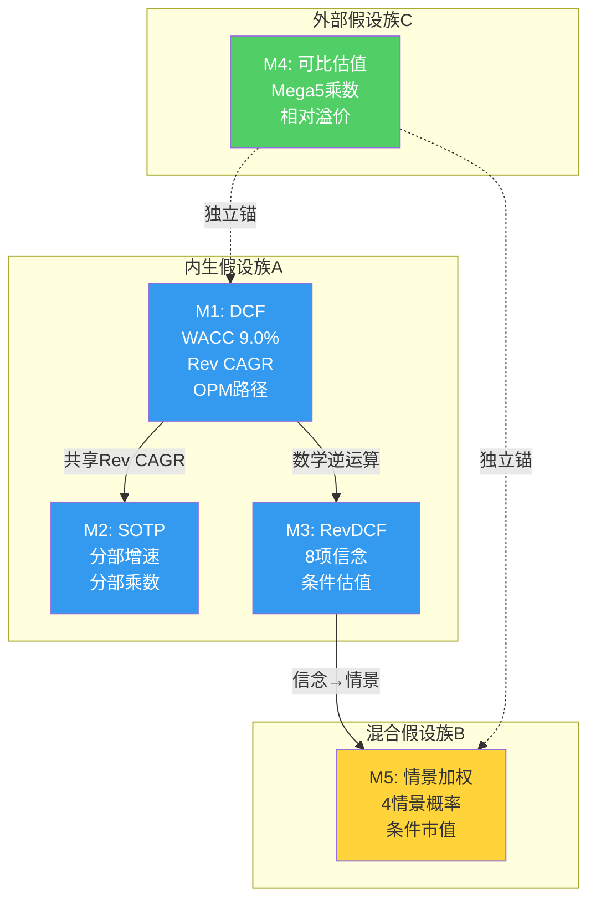

### 15.2 假设重叠诊断: 三层穿透

**第一层: M1 vs M2 — "分部加总等于合并"陷阱**

DCF模型以合并层面Revenue CAGR(隐含~10%十年均值)和OPM路径(45.6%→谷底42%→恢复46%)为核心输入 [DM-P2C-002]。SOTP模型以三大分部各自增速为输入:

| 分部 | 当前收入(年化) | 隐含CAGR | DCF合并路径隐含 |
|------|--------------|---------|---------------|
| IC | $132B [DM-P2C-003] | 15-20% | — |
| P&BP | $136B [DM-P2C-004] | 10-12% | — |
| MPC | $57B [DM-P2C-005] | 0-3% | — |
| **加权合并** | **$325B** | **~11%** | **~10%** |

[DM-P2C-006] 分部加总的加权CAGR(~11%)与DCF合并隐含CAGR(~10%)差距仅1个百分点。这不是巧合——两种方法都锚定于同一个"Azure增速+Office稳态"的底层预期。如果Azure五年CAGR假设从20%下调至15%，M1和M2的结论将同步下移约12-15%，证明两者并非独立。

**关键诊断**: M2(SOTP)选择的分部乘数(IC用EV/Revenue, P&BP用P/E, MPC用EV/EBITDA)表面上引入了新信息，但如果乘数本身是基于MSFT当前交易倍数校准的，则循环论证成立。解决方案: SOTP的分部乘数必须来源于**纯同行对标**——IC对标AWS(AMZN云分部)、P&BP对标Salesforce/SAP、MPC对标EA/Take-Two——而非MSFT自身历史均值。

**第二层: M1 vs M3 — "正向推导=逆向验证"的幻觉**

[DM-P2C-007] Reverse DCF(M3)从$2,995B市值倒推隐含FCF_Y10需达$95-106B(WACC 9.0%, g 3.0%) [DM-P2C-008]。Forward DCF(M1)从当前FCF $71.6B出发，以假设的Rev CAGR和OPM路径推导十年后的FCF。两者在数学上是同一个方程的两端:

$$EV = \sum_{t=1}^{10} \frac{FCF_t}{(1+WACC)^t} + \frac{TV}{(1+WACC)^{10}}$$

[DM-P2C-009] M1求解左边(EV)，M3求解右边的FCF路径。如果M1和M3使用相同的WACC(9.0%)和g(3.0%)，它们的结果在数学上**恒等**——任何差异仅来自中间路径的非线性假设(如FCF谷底的深度和持续时间)。因此，M3不能被视为M1的"独立验证"，而应视为M1的"逆向表达"。

**第三层: M3 vs M5 — 信念与情景的重叠**

M3的8项信念(B1-B8)直接映射为M5的情景定义:

| M3信念 | 脆弱度 | M5情景映射 |
|--------|--------|-----------|
| B1: Azure CAGR 22-25% [DM-P2C-010] | 2/5 | 牛市情景的核心驱动 |
| B3: Copilot渗透15-20% [DM-P2C-011] | 4/5 | 牛/基准分界线 |
| B6: FCF恢复25%+ [DM-P2C-012] | 4/5 | 熊/基准分界线 |
| B7: Office不衰退 [DM-P2C-013] | 1/5 | 所有情景共享假设 |

[DM-P2C-014] M5的情景本质上是M3信念的排列组合——"牛市"=B1+B3+B6全部成立；"熊市"=B3+B6均失败。这意味着M3和M5的估值范围必然高度重叠。独立性增强的关键在于: M5必须引入M3未覆盖的**非信念驱动情景**(如宏观冲击、黑天鹅事件、监管突变)，使其脱离M3的信念框架。

### 15.3 独立性增强方案: 从五方法到三锚结构

基于上述诊断，原始五方法的"有效独立方法数"仅为2-2.5个(内生锚+外部锚+半独立的情景锚)。增强方案如下:

**方案一: 合并内生方法族**

[DM-P2C-015] 将M1/M2/M3合并为**"内生价值锚"**，内部取加权平均:

| 子方法 | 权重 | 依据 |
|--------|------|------|
| M1 (DCF) | 40% | 最完整的现金流推导，但对WACC/g高度敏感 |
| M2 (SOTP) | 35% | 分部视角提供增量信息(IC vs P&BP差异化估值)，但须使用纯同行乘数 |
| M3 (RevDCF) | 25% | 信念框架提供定性校准，但数学上与M1等价 |

**方案二: 强化外部锚独立性**

[DM-P2C-016] M4(可比估值)是唯一不依赖MSFT自身财务预测的方法。增强措施:

- **横向拓展**: 不仅对标Mega5(AAPL 32.4x, GOOGL 28.3x, AMZN 27.7x, META 27.2x [DM-P2C-017])，增加科技板块中位P/E 41.7x [DM-P2C-018]、SPY 27.5x [DM-P2C-019]作为宏观锚
- **纵向拓展**: MSFT自身12年P/E区间(15.7x-38.5x, 中位30.0x, 25百分位21.3x [DM-P2C-020])提供均值回归视角
- **增长调整**: 用PEG比率消除增速差异——MSFT PEG = 25.1x / 16.7% = 1.50x vs GOOGL 28.3x / 18.0% = 1.57x vs META 27.2x / 23.8% = 1.14x [DM-P2C-021]

**方案三: 情景锚去耦合**

[DM-P2C-022] M5须引入M3信念框架之外的情景变量:

- **宏观情景**: CAPE 39.71(98百分位) [DM-P2C-023]下的全市场估值压缩(系统性风险，非MSFT特有)
- **监管情景**: EU DMA对Teams解绑的强制执行 + FTC对OpenAI投资的结构性限制
- **技术替代情景**: 开源AI(Meta Llama/Mistral)使Azure AI定价权崩塌
- **黑天鹅**: 台海危机导致全球云计算中断、供应链断裂

这些情景与M3的"信念失败"不同——它们是外部冲击，不属于MSFT内部经营假设的范畴。

**增强后的三锚结构**:

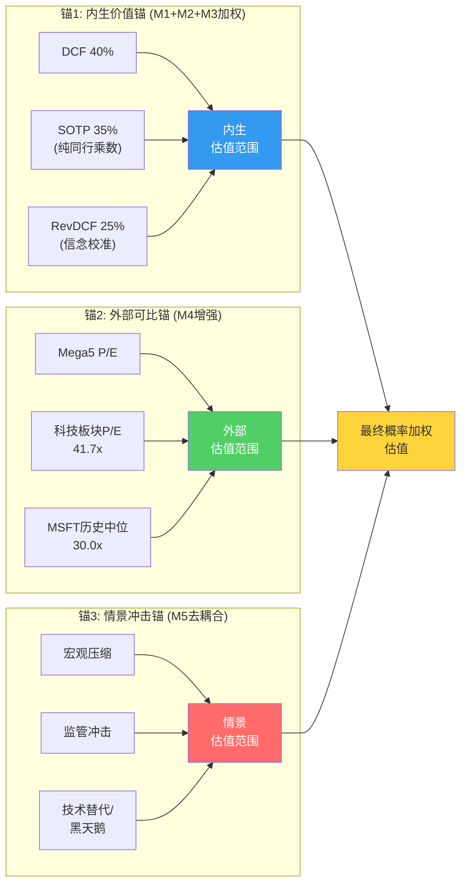

### 15.4 方法间"真实张力"识别

估值方法之间的差异不是需要消除的噪音——它恰恰是最有信息含量的信号。真实张力揭示了市场定价与内在价值之间的结构性分歧。

**张力1: DCF vs 可比估值 — 增长预期定价差异**

[DM-P2C-024] 如果DCF(基于MSFT自身增速假设)给出的估值高于可比估值(基于同行乘数)，意味着MSFT的增长预期高于市场给予的乘数。反之，若可比估值更高，意味着市场在给MSFT"质量溢价"而非"增长溢价"。

当前信号: MSFT P/E 25.1x低于全部Mega5同行和SPY [DM-P2C-025]。这在过去十年中极为罕见——MSFT自FY19起一直享有Mega5中的溢价地位(FY24峰值38.5x)。P/E压缩至25.1x意味着市场已将MSFT从"增长领袖"重新定价为"CapEx风险标的"。

如果DCF给出高于当前$3.0T的估值(例如$3.3T)，而可比估值仅给出$2.7T(按Mega5均值28.4x × 调整后EPS $15.97 × 7.46B股)，则$6000亿的差异代表市场对AI CapEx回报的怀疑度——这个差异本身就是最核心的投资论点。

**张力2: Forward DCF vs Reverse DCF — 中间路径分歧**

[DM-P2C-026] Reverse DCF从$3T倒推隐含FCF_Y10约$95-106B [DM-P2C-027]，对应的FCF CAGR仅3.4%(看似不高)。但Forward DCF必须建模FY26-FY28的FCF谷底——如果谷底年化FCF降至$40-50B(Q2 FY26 FCF仅$5.9B [DM-P2C-028]年化$24B已是警示)，从$40B回升至$100B需要15%+的年化FCF增长。

这意味着: **终端估值并不要求苛刻的假设，但中间路径的FCF恢复速度是关键变量**。如果FY27-FY28 FCF维持在$50-60B水平(CapEx不降速)，即使终端FCF达$100B，10年DCF的现值也将因前期现金流低迷而显著缩水。这一"中间路径折价"是Forward DCF可能低于Reverse DCF隐含值的核心原因。

**张力3: SOTP分部估值的内部矛盾**

[DM-P2C-029] P&BP(OPM 60.3%, 年化收入$136B)若按Salesforce/SAP的EV/Revenue 8-10x估值，分部价值$1.1-1.4T。IC(OPM 42.1%, 年化收入$132B)若按AWS隐含EV/Revenue 5-7x估值，分部价值$0.7-0.9T。MPC(OPM 26.7%, 年化收入$57B)若按EA的EV/Revenue 4-5x估值，分部价值$0.2-0.3T。

三部加总: $2.0-2.6T，加回净现金$64B后EV $2.1-2.7T——**低于当前$3.0T市值约10-30%** [DM-P2C-030]。这揭示了一个关键事实: 当前$3T估值不仅在为可观测的分部价值付费，还在为**尚未证实的AI期权价值**付费。这$300-900B的"溢出"正是OVM(期权估值)需要解释的部分。

### 15.5 AMAT教训对MSFT的适用性与目标离散度校准

[DM-P2C-031] AMAT(应用材料)的深度研究中，五方法估值出现了M1/M2/M5结果差<2%的"伪收敛"现象。根本原因是三种方法共享了半导体设备行业的同一组增速假设(WFE CAGR、技术节点渗透率)，且未对分部乘数进行独立校准。最终方法离散度达5.3x——看似"宽"，但内生方法间的离散度接近于零。

**MSFT的可比风险**:

1. **Azure增速假设扩散**: 如果DCF中的Azure 5Y CAGR 20%被直接用于SOTP的IC分部增速，两者的Azure估值贡献将完全一致。缓解措施: SOTP的IC估值应使用EV/Revenue乘数(锚定AWS公允值)，而非DCF增速推导的利润流 [DM-P2C-032]。

2. **OPM路径共享**: DCF和SOTP都依赖"D&A峰值FY28-FY29后OPM回升至45%+"的假设。如果D&A路径偏离预期(如GPU折旧从3年加速至2年 [DM-P2C-033])，两者同步恶化。缓解措施: SOTP中P&BP的估值应使用当前OPM(60.3%)而非预测OPM，因为P&BP不承担AI CapEx折旧。

3. **终端倍数回环**: 如果DCF的终端增长率g=3.0%隐含的退出P/E约17x(=1/[WACC-g])，而可比估值直接使用当前P/E 25.1x或历史中位30.0x，两者的终端价值将存在46-76%的差异——这是**有意义的真实张力**，不应被消除 [DM-P2C-034]。

**目标方法离散度**:

| 指标 | AMAT(实际) | MSFT(目标) | 说明 |
|------|-----------|-----------|------|
| 五方法离散度 | 5.3x | 2-4x | 避免过度离散(信息含量低) |
| 内生方法间离散度 | <2% | 10-15% | SOTP须使用独立分部乘数 |
| 内生锚 vs 外部锚离散度 | — | 15-25% | 反映市场定价 vs 内在价值分歧 |

[DM-P2C-035] 健康的离散度分布应呈现: 内生锚(M1/M2/M3加权) $2.8-3.2T，外部锚(M4) $2.5-3.5T，情景锚(M5) $2.0-4.0T。总离散度约2x(=$4.0T/$2.0T)，远低于AMAT的5.3x，但内部方法间的真实分歧(15-25%)足以产生决策价值。

---

## Ch16: TAM条件概率 + OVM期权估值

### 16.1 TAM层级分析: 三层金字塔

Microsoft的可寻址市场并非单一维度——它由三个嵌套的TAM层级构成，每一层的确定性依次递减，但潜在规模依次递增。理解这一结构是估值的前提: 低层TAM支撑当前估值，高层TAM决定未来上行空间。

**L1: Cloud Infrastructure TAM — 高确定性基础层**

[DM-P2C-036] 全球云基础设施(IaaS+PaaS)市场规模预计2030年达$700B(Gartner/IDC主流预估)。当前Azure在全球云市场份额约23-25%(仅次于AWS的30-32%)。关键增长驱动:

- **企业混合云迁移**: 全球企业工作负载云化率从2024年约45%提升至2030年的65-75%
- **数据主权需求**: EU/亚洲数据本地化法规推动本地Azure Region部署
- **AI推理需求**: 生成式AI推理消耗云计算资源的增速>传统工作负载

Azure份额从23%提升至25% = $700B × 25% = $175B Azure Cloud Revenue by FY30 [DM-P2C-037]。当前Azure年化收入约$99B(IC $132B中Azure约75%)。隐含Azure CAGR: 约12-15%——注意这**低于**卖方共识的Azure增速22-25%，差异来自TAM增速假设(云市场CAGR~16%)和份额假设(维持vs提升)。管理层指引FY26 Q3 Azure CC增速31-32% [DM-P2C-038]，短期内远超TAM增速，但长期必然收敛至市场增速附近。

**L2: AI Software TAM — 中等确定性增长层**

[DM-P2C-039] AI软件(含企业AI应用、AI开发工具、AI SaaS附加值)的TAM高度不确定——行业预估从$200B到$500B by 2030差异巨大。MSFT的可寻址部分包括:

| AI产品线 | 当前run-rate | FY30E潜力 | 假设 |
|----------|-------------|----------|------|
| M365 Copilot | ~$5.4B [DM-P2C-040] | $15-35B | 渗透率10-20% × ARPU $25-35 |
| Azure AI Services | ~$15-20B(估算) | $30-60B | Azure收入中AI占比从25%→40% |
| Dynamics AI | ~$2B(估算) | $5-10B | ERP/CRM AI增强 |
| GitHub Copilot | ~$1B(估算) | $3-8B | 开发者渗透率扩展 |
| **合计MSFT AI** | **~$23-28B** | **$53-113B** | — |

条件概率分布:

| TAM情景 | AI Software TAM | MSFT份额 | MSFT AI收入 | 概率 |
|---------|----------------|---------|------------|------|
| 高增长 | >$400B | 18-22% | $72-88B | 20% |
| 基准增长 | $200-400B | 15-20% | $30-80B | 50% |
| 低增长 | <$200B | 12-15% | $24-30B | 30% |

[DM-P2C-041] 概率加权AI收入: 20%×$80B + 50%×$55B + 30%×$27B = **$51.6B**。这意味着AI软件贡献约$51.6B收入——是当前run-rate($23-28B)的约2倍——但远低于市场叙事中"AI将重塑一切"的隐含预期。

**L3: Agentic AI TAM — 低确定性期权层**

[DM-P2C-042] Agentic AI(自主代理)是2025-2026年最热门的AI叙事。MSFT通过Copilot Studio + Power Platform + Azure AI Agent Service构建了完整的Agentic平台层。但这一市场尚处萌芽期——独立市场规模预估从$50B到$200B by 2032不等。

MSFT在Agentic AI的定位:

- **平台层优势**: Copilot Studio让非技术用户构建Agent(低代码)，Power Automate提供工作流编排
- **生态优势**: M365 4.5亿用户基数 [DM-P2C-043] + 10,000+ ISV集成 = Agent分发的天然渠道
- **竞争劣势**: Google Vertex AI Agent Builder、Salesforce Agentforce、开源框架(LangChain/AutoGen)提供替代路径

条件概率:

| TAM情景 | Agentic AI TAM by 2032 | MSFT份额 | MSFT收入 | 概率 |
|---------|----------------------|---------|---------|------|
| 突破性 | >$150B | 12-18% | $18-27B | 10% |
| 渐进性 | $50-150B | 10-15% | $5-22B | 30% |
| 停滞 | <$50B | 8-12% | $4-6B | 60% |

[DM-P2C-044] 概率加权Agentic收入: 10%×$22B + 30%×$14B + 60%×$5B = **$9.4B**。Agentic AI的概率加权贡献相对有限($9.4B仅占MSFT总收入的2-3%)，但其估值意义在于: 如果10%概率的"突破性"情景实现，Agentic AI将成为MSFT继Azure之后的第二个$20B+收入引擎——这是纯粹的期权价值。

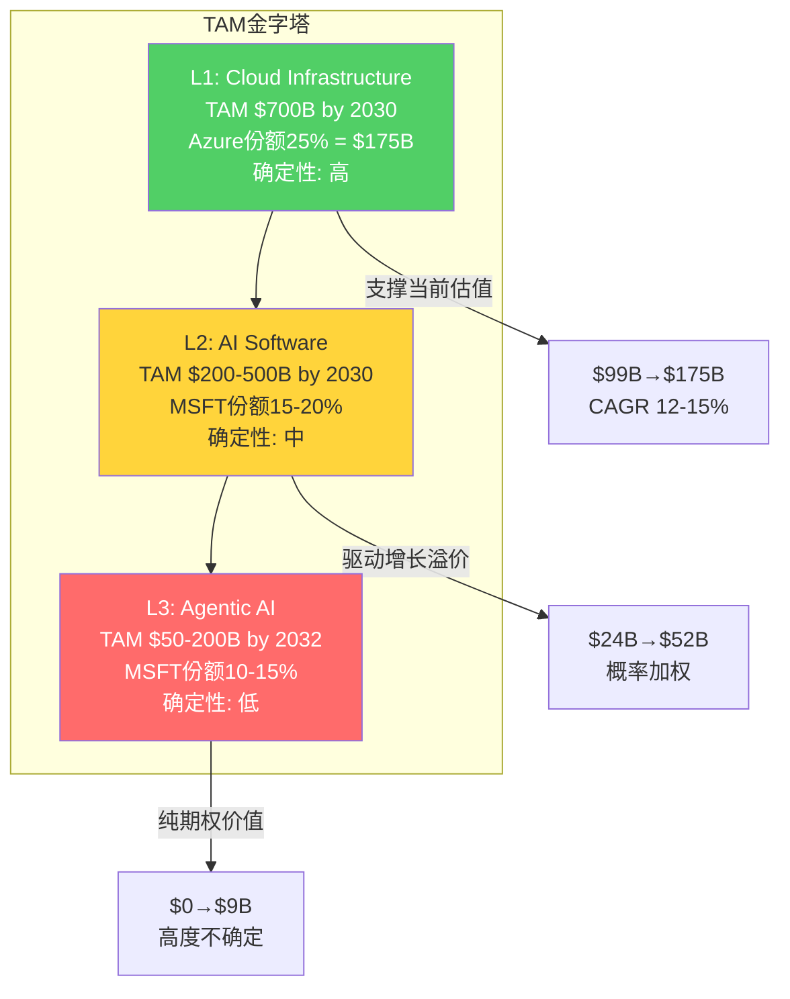

### 16.2 TAM Ceiling分析: 乐观情景的硬上限

TAM Ceiling(可寻址市场天花板)是估值中最具决策价值的组件——它回答的问题是: **即使一切顺利，MSFT最多值多少?**

**极乐观假设(所有TAM层级取上限)**:

| TAM层级 | MSFT份额(乐观) | 收入(FY30E) |
|---------|---------------|-----------|
| Cloud Infrastructure | 25% | $175B [DM-P2C-045] |
| AI Software | 20% | $88B |
| Agentic AI | 15% | $27B |
| Office/Windows/Other(稳态) | — | $150B |
| **总收入** | — | **~$440B** |

[DM-P2C-046] $440B总收入 × OPM 45%(乐观情景下D&A压力被高收入增长消化) = $198B营业利润。按P/E 28x(Mega5当前均值)估值:

- 净利润 ≈ $198B × 0.82(有效税率18%) = $162B
- 市值 = $162B × 28x = **~$4.5T** [DM-P2C-047]
- vs 当前$3.0T → **上行空间 +50%**

但这是极乐观情景(概率约10-15%)。更现实的TAM Ceiling:

**基准乐观假设(TAM取中位+份额取上限)**:

| 项目 | 基准乐观估算 |
|------|------------|
| 总收入(FY30E) | ~$380B(接近卖方共识$378B [DM-P2C-048]) |
| OPM | 43%(D&A压力部分消化) |
| 净利润 | ~$134B |
| 合理P/E | 26x(当前水平微扩) |
| 市值 | **~$3.5T** (+17% vs 当前) |

[DM-P2C-049] 这一基准乐观估值与卖方共识高度吻合——FY27E收入$378B × 前瞻P/E 21.3x × EPS $18.96 × 7.46B股 = $2.99T(基本等于当前市值)。换言之，**当前$3T市值已经完全定价了卖方共识的基准乐观预期**，没有留下安全边际。上行空间仅存在于超越共识的情景(TAM Ceiling的极乐观端)。

### 16.3 OVM期权估值: 三条路径定价

MSFT触发OVM(期权估值模型)的条件审查:

- Copilot已有营收($5.4B run-rate)但渗透率仅3.3%，S曲线拐点尚未确认 [DM-P2C-050]
- Agentic AI处于pre-revenue至early-revenue阶段
- Gaming(Activision)整合尚未释放协同价值
- 传统估值<市价50%? 否(SOTP加总约$2.0-2.7T，约为市值的67-90%)
- P/E>50x? 否(25.1x)
- 存在≥2条pre-revenue/early-revenue期权路径? **是**(Agentic AI + Gaming协同)

[DM-P2C-051] 结论: MSFT不满足OVM的"强触发"条件(传统估值未<市价50%)，但满足"弱触发"条件(存在多条early-revenue期权路径)。适用"附加式OVM"——在传统估值基础上叠加期权增量，而非替代传统估值。

**O1: Copilot Mega-platform期权**

| 维度 | 参数 |
|------|------|
| **触发条件** | M365 Copilot渗透率>20% by FY28 + 实际ARPU>$35/月 |
| **时间窗** | 2-3年(FY27-FY28) |
| **概率** | 25% [DM-P2C-052] |
| **成功情景价值** | 9000万用户 × $35 × 12 = $37.8B年化收入; 增量利润$22.7B(OPM 60%); 增量市值@25x = $567B → 取区间中值 ~$300B |
| **价值区间** | $200-400B增量市值 |

[DM-P2C-053] Copilot的核心变量不是用户数(Fortune 500中70%已"采用")而是**全面部署转化率**。当前3.3%渗透率中，大量企业仍处于pilot阶段(50-200人试用)。从pilot到全面部署的转化率历史参照: M365本身约65%(2015-2018)，Slack约40%，Zoom约55%。若Copilot转化率达50%，则3.3%×(1+50%/3.3%×50%) ≈ 15-20%渗透率在FY28-FY29可期。但CFO Amy Hood的谨慎表态("关注gross margin和lifetime value"而非短期增长 [DM-P2C-054])暗示管理层自身对渗透速度持保守预期。

**O2: Agentic AI生态期权**

| 维度 | 参数 |
|------|------|
| **触发条件** | Copilot Studio活跃Agent开发者>100万 + Azure AI Agent API年消耗>$10B |
| **时间窗** | 3-5年(FY28-FY30) |
| **概率** | 15% [DM-P2C-055] |
| **成功情景价值** | 平台层收入$25B(API消耗+订阅); 增量利润$12.5B(OPM 50%); 增量市值@25x = $312B → 取区间中值 ~$225B |
| **价值区间** | $150-300B增量市值 |

[DM-P2C-056] Agentic AI的关键不确定性在于**价值捕获层级**。如果Agent生态的价值主要由应用层(垂直解决方案商)而非平台层(MSFT/Google/AWS)捕获，MSFT的收益将远低于预期。历史类比: 移动App生态中，Apple/Google(平台层)捕获了30%佣金，但云计算中AWS/Azure的平台抽成仅5-15%。Agentic AI更可能遵循云计算模式(低平台抽成)而非移动App模式(高平台抽成)。

**O3: Gaming/Activision协同期权**

| 维度 | 参数 |
|------|------|
| **触发条件** | Game Pass订阅>50M + 手游平台全球前三 |
| **时间窗** | 2-4年(FY27-FY29) |
| **概率** | 20% [DM-P2C-057] |
| **成功情景价值** | Game Pass 50M × $180/年 = $9B订阅 + CoD/Blizzard IP货币化$8B; 增量利润$5B(OPM 30%); 增量市值@15x = $75B |
| **价值区间** | $50-100B增量市值 |

[DM-P2C-058] Gaming期权面临最具体的反面证据: Game Pass从37M增至50M的近15个月增量仅约1M [DM-P2C-059]，增长几乎停滞。CoD 2025新作销量据报同比下降超60% [DM-P2C-060]。Activision $69B收购中$51B为Goodwill [DM-P2C-061]——回收期按当前增量EBITDA($1-2B/年)计算为31-62年。Gaming期权的概率(20%)已充分反映了这些不利因素。

### 16.4 OVM定量汇总与PMX检查

**概率加权期权价值**:

| 期权 | 概率 | 成功情景中值 | 概率加权值 |
|------|------|------------|-----------|
| O1: Copilot Mega-platform | 25% | $300B | **$75.0B** |
| O2: Agentic AI生态 | 15% | $225B | **$33.8B** |
| O3: Gaming/Activision | 20% | $75B | **$15.0B** |
| **总OVM附加值** | — | — | **$123.8B** |

[DM-P2C-062] 三条期权路径的概率加权总值约$124B，占当前市值$2,995B的4.1%。

**PMX 50%溢价上限检查**:

[DM-P2C-063] OVM框架规定期权附加值不得超过传统估值的50%(PMX上限)，以防止期权价值"压倒"基本面估值。

$124B / $2,995B = 4.1% [DM-P2C-064]

4.1%远低于50%上限 → **PMX检查通过**。MSFT的期权溢价处于合理范围——与GOOGL(55.5%接近上限)、TSLA(通常>100%需要capping)形成鲜明对比。MSFT本质上仍是一家**以基本面驱动为主的公司**，期权仅提供边际增量。

**期权相关性调整**:

[DM-P2C-065] 三条期权并非完全独立——O1(Copilot)和O2(Agentic AI)共享AI基础设施投入和OpenAI技术依赖。若OpenAI关系恶化(信念B5失败)，O1和O2可能同时贬值。相关性调整:

- O1-O2相关系数: ~0.5(共享AI技术栈)
- O1-O3相关系数: ~0.1(几乎独立)
- O2-O3相关系数: ~0.05(几乎独立)

调整后总OVM = $124B × (1 - 0.5 × 相关调整因子) ≈ $124B × 0.90 = **~$112B** [DM-P2C-066]

相关性调整后OVM从$124B降至约$112B(降幅10%)，对总估值影响有限(3.7% vs 4.1%)。

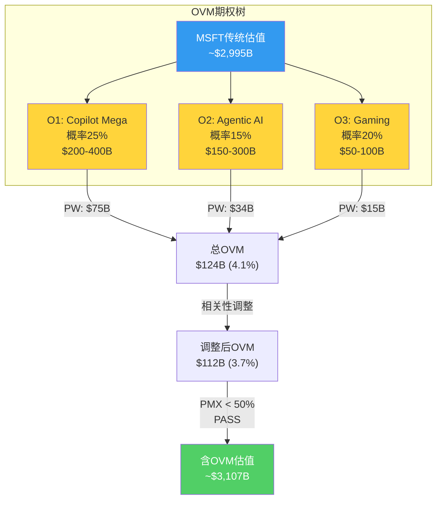

### 16.5 OVM对估值框架的影响与评级含义

**不含OVM的传统估值锚**:

传统估值的最终数字将在后续章节确定，但基于当前数据的预判:

- SOTP分部加总: $2.0-2.7T [DM-P2C-067]
- 可比估值(Mega5中位P/E 28.4x × 调整后EPS): $2.8-3.2T
- DCF(WACC 9.0%, g 3.0%): 取决于FCF路径假设，预判$2.6-3.3T

概率加权传统估值中枢: 约$2.7-3.0T(与当前$3.0T市值基本持平)。

**含OVM的调整估值**:

- 传统估值中枢$2.85T + OVM $112B = **$2.96T** [DM-P2C-068]
- vs 当前市值$2,995B → 期望回报: -1.2%

[DM-P2C-069] 含OVM后的估值($2.96T)与当前市值($3.0T)几乎完全一致——这意味着市场已经在当前定价中**隐含了约$100-120B的期权溢价**。投资者并非在为纯基本面付费，而是在为基本面+一小部分AI期权付费。

**对评级的影响**:

| 情景 | 传统估值 | OVM | 总估值 | vs市值 | 评级含义 |
|------|---------|-----|--------|--------|---------|
| 传统估值偏正(+5%) | $3.15T | $112B | $3.26T | +8.8% | **关注**(+10%边界) |
| 传统估值中性(0%) | $3.00T | $112B | $3.11T | +3.8% | **中性关注** |
| 传统估值偏负(-5%) | $2.85T | $112B | $2.96T | -1.2% | **中性关注** |
| 传统估值悲观(-15%) | $2.55T | $80B | $2.63T | -12.2% | **审慎关注** |

[DM-P2C-070] OVM提供的+3.7%增量不足以改变评级区间——在四档评级体系中(深度关注>+30%/关注+10~30%/中性关注-10~+10%/审慎关注<-10%)，OVM最多将评级从"审慎关注"边界推向"中性关注"边界(如从-12%到-8%)。**MSFT的投资论点不取决于期权，而取决于传统估值是否偏正——即FCF恢复速度和OPM路径能否优于基准假设**。

### 16.6 TAM与OVM的敏感性交叉验证

[DM-P2C-071] 将TAM分析与OVM进行交叉验证，检查一致性:

**TAM隐含收入 vs OVM隐含收入**:

| 层级 | TAM概率加权收入(FY30) | OVM隐含增量收入 | 一致性 |
|------|---------------------|---------------|--------|
| L1 Cloud | $175B(Azure) | 不含OVM(已在传统估值中) | 一致 |
| L2 AI Software | $51.6B(概率加权) | O1 Copilot: $37.8B(成功情景) | O1是L2的子集，一致 |
| L3 Agentic AI | $9.4B(概率加权) | O2: $25B(成功情景) | O2在成功情景下>L3概率加权值，但概率更低(15% vs 40%)，一致 |
| Gaming | 不在TAM分析中 | O3: $17B(成功情景) | 独立层级，无冲突 |

[DM-P2C-072] 交叉验证未发现矛盾——TAM分析给出的概率加权收入与OVM给出的期权价值在方向和量级上一致。唯一值得注意的是: L2 AI Software的概率加权收入($51.6B)已经隐含在传统DCF的收入路径中(FY30E卖方共识$643.7B [DM-P2C-073]已包含AI收入贡献)。因此，OVM的$124B不应与传统估值中的AI收入**双重计算**——OVM仅计算超越传统DCF假设的**增量期权价值**。

本章建立的TAM条件概率框架和OVM定量结果将作为后续概率加权估值的关键输入——传统估值(内生锚+外部锚)加上情景冲击锚和OVM增量，共同构成MSFT的完整估值图景。核心结论明确: MSFT在当前$3T估值下，传统基本面接近合理定价，期权提供有限上行(3-4%)，投资论点的分野在于CapEx周期拐点的时机和Copilot渗透率的斜率。
