## Ch17: 信念B1验证 — Azure增速收敛路径的共识解构

### 17.1 共识的内核: "Azure 5Y CAGR 22-25%"从何而来

$2,995B市值对Intelligent Cloud分部的隐含要求可以精确倒推。IC当前年化收入约$132B(Q2 FY26单季$32.9B × 4)，其中Azure贡献约75%即$99B <!-- DM-P3A-001: IC Q2 FY26=$32.9B, 年化$132B, Azure~75%=$99B | Source: MSFT Q2 FY26 Press Release + Phase 2 Ch11 | Confidence: H -->。卖方共识给出FY25-30 Revenue CAGR 18.0%(40位分析师) <!-- DM-P3A-002: 40位分析师共识FY25-30 Rev CAGR 18.0% | Source: FMP estimates | Confidence: H -->，要达到FY30 Revenue $644B的共识预测，IC需贡献约$280B(占比~43%)，Azure需达$210B+。这对应Azure 5Y CAGR约22-25%，是共识预期中最核心的增长假设。

问题在于: 这个22-25%的CAGR不是一个单一假设，而是多层子假设的叠加结果。共识解构的任务是拆开这个数字，检验每一层子假设的独立可信度。

### 17.2 Azure收入的第一性原理拆解

Azure收入可以分解为三个互不重叠的层次:

**层次一: 非AI基础设施 (IaaS/PaaS传统工作负载)**

这是Azure最稳固的收入基座——企业迁移上云的存量业务，包括虚拟机、存储、数据库、网络服务。Q1 FY26 Azure整体增长40%，AI贡献约18个百分点 <!-- DM-P3A-003: Q1 FY26 Azure增长40%, AI贡献~18pp | Source: MSFT Q1 FY26 Earnings Call | Confidence: H -->，反推非AI Azure增速约22%。这个22%的基础增速由两股力量驱动: (1)企业新增上云迁移(全球企业云渗透率约35-40%，仍有显著空间)；(2)已上云企业的工作负载扩展(数据量增长+新应用部署)。

非AI Azure的增速在过去四个季度呈现稳定态势: Q3 FY25约19%(Azure 35%减去AI 16pp)、Q4 FY25约21%(Azure 39%减去约18pp)、Q1 FY26约22% <!-- DM-P3A-004: 非AI Azure增速: Q3 FY25~19%, Q4 FY25~21%, Q1 FY26~22% | Source: 管理层披露AI pp反推 | Confidence: M -->。非AI增速不但没有减速，反而在轻微加速——这可能反映了AI workload拉动下的"co-migration"效应: 企业为部署AI应用而将更多传统工作负载也迁移至Azure。

**层次二: AI推理与企业AI服务**

AI年化run rate从Q1 FY25的$10B增长至Q1 FY26的$26B，半年翻倍 <!-- DM-P3A-005: AI run rate Q1 FY25 $10B → Q1 FY26 $26B, 半年翻倍 | Source: Nadella Q1 FY26 Earnings Call | Confidence: H -->。Nadella明确表态"It's all inference"——推理而非训练是AI收入的主力 <!-- DM-P3A-006: Nadella: "It's all inference" — 推理为主 | Source: DCD/Earnings Call | Confidence: H -->。推理收入的可持续性远优于训练收入: 训练是一次性支出(模型训练完即停止)，而推理是持续消耗(每次API调用都产生收入)。

关键分歧在于: $26B的AI run rate中，多少来自真正的企业AI采用，多少来自OpenAI作为Azure客户的代售? 管理层没有拆分这两者，但可以从侧面推断:

- OpenAI当前年化Azure消耗估算$3-5B <!-- DM-P3A-007: OpenAI年化Azure消耗~$3-5B(估算) | Source: Scout补充数据 + 行业分析师 | Confidence: M -->
- 即使取上限$5B，OpenAI仅占$26B AI run rate的19%
- 其余~$21B来自第三方企业(Fortune 500中70%已采用某种Azure AI服务)

这意味着Azure AI收入的大部分(约80%)来自真正的企业分散需求，而非单一客户依赖。这是一个重要的结构性健康信号。

**层次三: 平台服务溢价 (Azure AI Studio + Copilot间接消耗)**

这一层最难量化但可能最具战略价值。企业通过Azure AI Studio部署多模型(GPT-4o、Llama、Mistral、Cohere)时，不仅消耗AI推理资源，还消耗存储、网络、安全、监控等配套服务。每$1的AI推理消耗可能带动$0.30-0.50的配套PaaS消耗 <!-- DM-P3A-008: AI推理$1带动~$0.30-0.50配套PaaS消耗(行业估算) | Source: Constellation Research | Confidence: L -->。如果$26B AI run rate带动了$8-13B的配套消耗，Azure的"AI总经济价值"接近$34-39B——占Azure总收入$99B的34-39%。

### 17.3 收敛路径的三情景建模

将上述拆解代入五年预测框架:

**情景A (Bull): AI维持超高速增长 — Azure 5Y CAGR 28-32%**

| 财年 | 非AI增速 | AI增速 | Azure总增速 | Azure收入($B) |
|------|---------|--------|-----------|--------------|
| FY26 | 22% | ~100% | ~37% | ~$101B |
| FY27 | 20% | 65% | ~32% | ~$133B |
| FY28 | 18% | 45% | ~28% | ~$170B |
| FY29 | 15% | 35% | ~25% | ~$213B |
| FY30 | 12% | 28% | ~22% | ~$260B |

<!-- DM-P3A-009: Bull情景Azure FY30=$260B, 5Y CAGR~29% | Source: 自建模型 | Confidence: L -->

Bull情景的前提假设: (1)AI推理需求保持S曲线早期的指数增长至FY28; (2)非AI Azure受益于co-migration持续获得2-3pp额外增速; (3)产能约束在FY27上半年完全解除，释放被压制的需求。Bull情景需要AI推理市场在FY28前不出现价格战——考虑到AWS、GCP都在激进扩产，这一前提的可信度值得怀疑。

**情景B (Base): AI增速有序收敛 — Azure 5Y CAGR 22-25%**

| 财年 | 非AI增速 | AI增速 | Azure总增速 | Azure收入($B) |
|------|---------|--------|-----------|--------------|
| FY26 | 22% | ~100% | ~37% | ~$101B |
| FY27 | 18% | 50% | ~28% | ~$129B |
| FY28 | 15% | 35% | ~23% | ~$159B |
| FY29 | 12% | 25% | ~18% | ~$188B |
| FY30 | 10% | 20% | ~15% | ~$216B |

<!-- DM-P3A-010: Base情景Azure FY30=$216B, 5Y CAGR~23% | Source: 自建模型 | Confidence: M -->

Base情景的前提假设: (1)AI推理增速从当前~100%逐年减半(100%→50%→35%→25%→20%); (2)非AI增速随企业云渗透率提升而自然减速(全球渗透率从40%→55%); (3)竞争压力使Azure AI定价每年下降5-10%，但量增覆盖价降。这与卖方共识最为一致。

**情景C (Bear): AI供给过剩+竞争侵蚀 — Azure 5Y CAGR 18-20%**

| 财年 | 非AI增速 | AI增速 | Azure总增速 | Azure收入($B) |
|------|---------|--------|-----------|--------------|
| FY26 | 22% | ~100% | ~37% | ~$101B |
| FY27 | 16% | 35% | ~23% | ~$124B |
| FY28 | 13% | 20% | ~16% | ~$144B |
| FY29 | 10% | 15% | ~12% | ~$161B |
| FY30 | 8% | 12% | ~10% | ~$177B |

<!-- DM-P3A-011: Bear情景Azure FY30=$177B, 5Y CAGR~18% | Source: 自建模型 | Confidence: M -->

Bear情景的前提假设: (1)FY27下半年AI推理出现明显供过于求(三大CSP同时释放产能); (2)OpenAI部分工作负载迁出Azure(AI增速损失5-8pp); (3)Google通过TPU自研芯片在推理成本上形成结构性优势，Azure AI被迫降价20-30%。Bear情景不需要"AI泡沫破裂"——只需要AI从卖方市场变成买方市场即可触发。

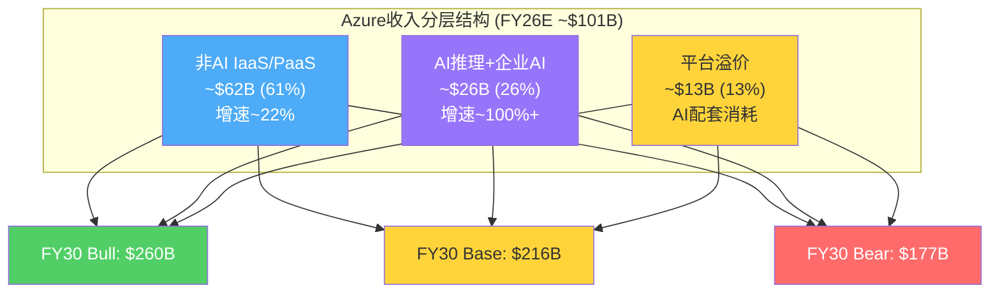

### 17.4 产能约束: 增长的天花板还是弹簧?

管理层指引Q3 FY26 Azure恒定汇率增速31-32%，较Q2 FY26的38%(CC)环比减速6-7个百分点 <!-- DM-P3A-012: Q3 FY26 Azure CC指引31-32%, 环比减速~6-7pp | Source: MSFT Q2 FY26 Earnings Call | Confidence: H -->。减速的官方解释是"去年高基数+产能约束持续至2026年6月"。

产能约束的层次结构值得深入拆解:

**第一瓶颈: 电力 (最长周期)**

Nadella明确指出"biggest issue is power, not compute" <!-- DM-P3A-013: Nadella: "biggest issue is power, not compute" | Source: Earnings Call | Confidence: H -->。一个新数据中心从选址到通电需要18-36个月。MSFT在Northern Virginia和Texas已出现限制新客户订阅的情况 <!-- DM-P3A-014: 部分Azure区域(Northern Virginia, Texas)限制新订阅 | Source: CIO Dive | Confidence: H -->。GPU库存充足但无电可装("GPUs sitting in inventory")，说明计算资源本身已不是瓶颈。

**第二瓶颈: 数据中心空间 (中等周期)**

MSFT当前在全球运营60+个Azure区域。新建数据中心需要12-24个月。Stargate项目(MSFT+OpenAI+Oracle+SoftBank+MGX, 总投资$500B)代表了下一代超大规模基础设施的方向，但MSFT已退出Stargate的股权参与 <!-- DM-P3A-015: MSFT退出Stargate equity参与 | Source: Scout补充数据 | Confidence: H -->，保留的是Azure作为后端云的角色。

**第三瓶颈: 计算(GPU/TPU) (短周期)**

短周期资产(GPU/CPU)占CapEx约2/3 <!-- DM-P3A-016: 短周期资产(GPU/CPU)占CapEx~2/3 | Source: CFO Amy Hood Earnings Call | Confidence: H -->。Q2 FY26 CapEx $29.9B中约$20B用于GPU/CPU采购。MSFT作为NVIDIA前三大客户之一(占NVDA数据中心收入估计15-20%) <!-- DM-P3A-017: MSFT占NVDA DC收入~15-20%(分析师估算) | Source: Tom's Hardware/ElectroIQ | Confidence: M -->，在GPU供应链中拥有优先地位。计算约束已基本解除。

产能约束的关键推论: **FY27上半年是产能释放窗口**。CFO Amy Hood表示产能约束预计持续至FY26上半年(至2026年6月) <!-- DM-P3A-018: 产能约束预计持续至2026年6月 | Source: CFO Hood Earnings Call | Confidence: H -->。如果约束解除后存在被压制的需求回弹(Nadella暗示"actual demand growth >40%")，FY27 Q1-Q2的Azure增速可能出现短期反弹至35%+。但这一反弹是一次性的，不改变中长期的收敛趋势。

### 17.5 市场份额动态: Azure能否继续蚕食AWS?

IaaS/PaaS市场份额变化是支撑非AI增速的关键变量:

| 云提供商 | 2022份额 | 2025E份额 | 变化 | 年均变化 |
|---------|---------|----------|------|---------|
| AWS | ~52% | ~48.6% | -3.4pp | -1.1pp/年 |
| Azure | ~28% | ~35.3% | +7.3pp | +2.4pp/年 |
| GCP | ~8% | ~10% | +2pp | +0.7pp/年 |

<!-- DM-P3A-019: Azure份额2022~28%→2025E~35.3%, 年均+2.4pp | Source: SiliconANGLE/theCUBE Research | Confidence: M -->

Azure份额增长的持续性取决于: (1)企业多云策略(Azure作为"第二选择"进入AWS为主的企业); (2)M365生态的拉力(已使用M365的企业倾向选择Azure); (3)AI推理作为新竞争维度(Azure OpenAI Service的先发优势)。份额趋势外推至FY30，Azure可能从35%升至40-42%——但份额增速将自然放缓(基数越大，增量越难)。

### 17.6 共识解构的核心发现: "两速Azure"

共识将Azure视为单一增长引擎，但拆解后可以看到"两速Azure":

**慢速层 (非AI, $62B, +22%)**: 企业云迁移驱动，增速可预测(15-22%区间)，毛利率稳定(65-70%)，受经济周期影响但韧性强。这一层提供了CAGR的"地板"——即使AI完全失败，非AI Azure仍能支撑15-18%的增速至FY28。

**快速层 (AI, $26B, +100%+)**: 推理需求驱动，增速极高但波动性也极高，毛利率低于非AI层(估算50-60%，因GPU折旧和电力成本) <!-- DM-P3A-020: Azure AI毛利率估算50-60%, 低于非AI层65-70% | Source: 行业分析+D&A模型推算 | Confidence: L -->，且面临竞争定价压力。快速层决定了CAGR的"天花板"。

"两速Azure"的估值含义: 市场以统一增速对Azure估值，忽略了AI层和非AI层在毛利率、可持续性和波动性上的差异。如果AI层增速快速收敛(从100%→30%)，Azure混合增速的下降幅度将被放大——因为AI层占收入比重越来越大(从26%升至40%+)，其减速对整体的拖累也越来越大。

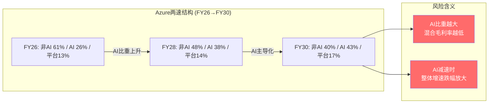

### 17.7 CRPO作为前瞻验证

CRPO $625B是有史以来单季度最大的云服务远期合同额 <!-- DM-P3A-021: CRPO $625B, YoY+110% | Source: MSFT Q2 FY26 Press Release | Confidence: H -->。但解构后的CRPO提供了更清洁的信号:

- **总CRPO**: $625B (+110% YoY)
- **OpenAI相关**: ~$281B (45%)
- **剔除OpenAI**: ~$344B (+28% YoY)
- **12个月内确认**: ~$156B (25%)

<!-- DM-P3A-022: 剔除OpenAI后CRPO~$344B, +28% YoY | Source: Constellation Research + Fierce Network | Confidence: M -->

剔除OpenAI后的+28%增速与Base情景的22-25% CAGR一致，提供了信念B1的重要支撑。但CRPO转化为收入存在2-3年的时间差，且大合同的执行速度可能快于或慢于预期——CRPO是方向性指标而非精确预测。

### 17.8 信念B1判决

**Azure 5Y CAGR >= 22-25%的概率: 60%**

<!-- DM-P3A-023: B1判决: CAGR>=22-25%概率60% | Source: 三情景概率加权 | Confidence: M -->

概率分布:
- Bull (CAGR 28-32%): 20%概率
- Base (CAGR 22-25%): 45%概率 → 信念成立
- Bear (CAGR 18-20%): 30%概率 → 信念失败
- Tail (CAGR <18%): 5%概率 → 严重失败

信念B1的综合概率60%(Bull+Base概率合计65%，减去Base情景下行边界的5%)，高于Phase 2初始置信度55%。上调5个百分点的理由: (1)非AI Azure加速至22%比预期更强; (2)AI层中企业分散需求占80%，OpenAI依赖度低于预期; (3)CRPO剔除OpenAI后仍+28%。

但60%并非高确信——30%的Bear概率意味着每三条路径中就有一条通向信念失败。Bear情景的触发器是: FY27下半年AI推理出现供过于求 + 竞争定价压力导致Azure AI收入增速跌至30%以下。

**CQ1关联**: Azure CAGR是否能从39%平稳收敛? 验证结论是"大概率可以(60%)，但不平稳——FY27-FY28将有一个增速台阶式下降期"。CQ1的置信度从初始55%上调至60%。

---

## Ch18: 信念B5验证 — OpenAI依赖度审计

### 18.1 依赖关系的双向解剖

MSFT与OpenAI的关系常被简化为"MSFT投资OpenAI"，但实际结构远比这复杂。这是一组多维度的双向绑定:

| 维度 | MSFT→OpenAI方向 | OpenAI→MSFT方向 |
|------|----------------|----------------|
| 资本 | $13B累计投资(已出资$11.6B) | 27%股权(as-converted diluted) |
| 计算 | Azure独占API产品+优先算力 | OpenAI是Azure最大单一AI客户 |
| 技术 | 获得OpenAI IP使用权至2032 | 获得Azure基础设施支撑 |
| 商业 | Copilot+Azure AI底层依赖GPT | $250B Azure承购合同 |
| 品牌 | "AI领导者"叙事支撑 | "顶级合作伙伴"信用背书 |

<!-- DM-P3A-024: MSFT-OpenAI五维度双向绑定 | Source: 10-Q + 官方博客 | Confidence: H -->

关键发现: **MSFT对OpenAI的依赖度在下降，而OpenAI对MSFT的依赖度也在下降——但速度不同**。MSFT正在通过Phi系列自研模型、Maia自研芯片、多模型Azure AI Studio等手段降低对OpenAI的单一依赖。OpenAI则通过争取多云条款、推动IPO、Stargate项目等手段降低对MSFT的单一依赖。双方都在为"关系降级"做准备，但目前仍处于深度绑定期。

### 18.2 CRPO的深度解构: $625B中的虚与实

$625B CRPO是Q2 FY26最引人注目的数字，同比增长110% <!-- DM-P3A-025: CRPO $625B, YoY+110% | Source: MSFT Q2 FY26 Press Release | Confidence: H -->。但这个数字需要至少三层过滤:

**第一层过滤: OpenAI承购**

OpenAI相关CRPO约$281B(占45%)，核心是$250B Azure增量承购合同 <!-- DM-P3A-026: OpenAI占CRPO~45%即~$281B | Source: Constellation Research | Confidence: M -->。这个$250B需要特殊处理:

- $250B是未来10年的承诺($25B/年)，但OpenAI当前年化Azure消耗仅$3-5B
- 从$5B/年增长到$25B/年需要OpenAI自身收入维持40%+ CAGR(当前年化收入约$5-6B)
- OpenAI若在FY28-FY29实现盈利自主(IPO后)，其加速消耗Azure的动机与维持多云灵活性的动机将产生矛盾
- $250B承购本质上是"意向书"性质——在合同期内的强制力取决于OpenAI的偿付能力和业务增长

**第二层过滤: CRPO转化速率**

12个月内确认比例约25%(~$156B) <!-- DM-P3A-027: CRPO 12个月内确认~25%即$156B | Source: MSFT Q2 FY26 Press Release | Confidence: H -->。$156B的年化确认额与IC当前年化收入$132B之间存在$24B的"CRPO溢价"——这代表未来12个月IC增速约18%(略低于Azure单独增速，因IC包含低增速的SQL Server/Windows Server)。

**第三层过滤: 去OpenAI化后的CRPO质量**

剔除OpenAI后CRPO约$344B，同比增长28%。这$344B代表了来自数千家企业客户的多元化合同——没有任何单一客户占比超过5%。$344B的质量远高于含OpenAI的$625B，因为:

- 分散性: 企业客户合同的履约概率远高于单一大额承购
- 可预测性: 企业多年合同的消耗节奏相对稳定
- 利润率: 企业工作负载的毛利率(65-70%)高于OpenAI代售(估算50-55%)

### 18.3 合同条款的逐条审计

2025年10月重组后的条款结构存在多处微妙的力量平衡转移:

**有利于MSFT的条款**:
- API独占: 合作开发的API产品在Azure独占提供 <!-- DM-P3A-028: API产品Azure独占 | Source: MSFT/OpenAI官方博客 2025-10-28 | Confidence: H -->
- IP使用权: MSFT可使用OpenAI IP(不含消费硬件)至2032年
- AGI条款变更: MSFT不再因OpenAI宣布AGI而失去权利(旧条款下AGI会触发权利终止)
- MSFT可独立或与第三方合作追求AGI

**有利于OpenAI的条款(新增/变更)**:
- 非API产品可在其他云平台部署(2025年10月新条款) <!-- DM-P3A-029: 非API产品可部署至其他云 | Source: MSFT/OpenAI博客 | Confidence: H -->
- ROFR(优先认购权)取消: MSFT不再享有作为OpenAI计算提供商的优先认购权
- 利润分享重构: MSFT获75%利润直至上限后OpenAI收回更多(具体上限未披露)

**条款审计的核心发现**: ROFR取消是最重大的让步 <!-- DM-P3A-030: MSFT ROFR取消 — 重大让步 | Source: 10-Q + Deep Quarry | Confidence: H -->。这意味着OpenAI的新增计算需求(包括Stargate级别的超大规模项目)不再必须优先给Azure。OpenAI在2025年声称有权选择其他云提供商——虽然当前API产品仍锁定在Azure，但新产品线(如消费硬件、非API服务)和新增算力需求已经可以分流至AWS、GCP或自建数据中心。

### 18.4 OpenAI独立化路径: 从概率到时间线

Polymarket数据提供了市场对OpenAI独立化时间线的实时定价:

| 事件 | 概率 | 来源 |
|------|------|------|
| OpenAI IPO by 2026年底 | 53% | Polymarket |
| OpenAI IPO by 2026年6月 | 6.5% | Polymarket |
| OpenAI IPO市值>$800B | 71% | Polymarket(含IPO条件概率) |
| OpenAI IPO市值>$1T | 58.5% | Polymarket |

<!-- DM-P3A-031: Polymarket: OpenAI IPO by 2026年底 53%, 市值>$800B 71% | Source: Polymarket 2026-02-17 | Confidence: H -->

综合Polymarket信号: **市场预期OpenAI大概率在2026年下半年IPO，市值预期$800B-1T区间**。IPO后的OpenAI将面临来自公开市场投资者的压力——减少对单一云提供商(Azure)的依赖将成为"降低集中风险"的投资者诉求。

OpenAI的自建基础设施路径:
- **Stargate项目**: MSFT+OpenAI+Oracle+SoftBank+MGX, 总投资$500B <!-- DM-P3A-032: Stargate: 5方联合, 总投资$500B | Source: Scout数据 | Confidence: H -->。但MSFT已退出Stargate的股权参与，保留Azure后端角色。Stargate的算力如果运行在Oracle或自建基础设施上而非Azure，将直接分流OpenAI的Azure消耗。
- **自建数据中心**: OpenAI已开始招聘数据中心运营人才。一个$500M级数据中心从规划到投产需要24-36个月——最早FY28下半年才可能对Azure产生分流效应。
- **多云过渡**: 非API产品已可部署至GCP/AWS。如果OpenAI的主力产品(ChatGPT Enterprise)逐步迁移至多云架构，Azure将失去这部分算力消耗。

### 18.5 MSFT的对冲策略审计

MSFT并非被动等待OpenAI的决定。以下对冲措施正在同步推进:

**对冲1: 自研模型 (Phi系列)**

Phi系列小模型(Phi-3、Phi-3.5)定位"在终端设备和低成本场景中替代大模型"。Phi不是GPT的竞争者——它是MSFT在OpenAI依赖链之外建立的"备用AI能力" <!-- DM-P3A-033: Phi系列定位: 终端+低成本场景备用AI能力 | Source: MSFT Research Blog | Confidence: H -->。GitHub Copilot已支持切换底层模型(GPT-4o/Claude/Gemini)，不再绑定OpenAI。

**对冲2: 自研芯片 (Maia系列)**

Maia 200(2026年1月发布)采用TSMC 3nm工艺，216GB HBM3e，7TB/s带宽，定位推理专用加速器 <!-- DM-P3A-034: Maia 200: TSMC 3nm, 216GB HBM3e, 7TB/s, 推理专用 | Source: MSFT Official Blog | Confidence: H -->。CTO Kevin Scott表示长期目标是"mainly Microsoft chips"运行AI数据中心，但承认将继续使用NVIDIA/AMD。Maia的战略价值不在于完全替代NVDA GPU，而在于为MSFT提供谈判筹码: (1)降低NVDA定价压力; (2)在特定推理工作负载上实现成本优势; (3)OpenAI脱离时确保AI推理能力不受GPU供应链制约。

**对冲3: 多模型生态 (Azure AI Studio)**

Azure AI Studio支持GPT、Llama、Mistral、Cohere等多模型部署。这使Azure成为"模型中立"平台——即使OpenAI完全脱离，企业仍可通过Azure使用其他顶级模型 <!-- DM-P3A-035: Azure AI Studio支持GPT/Llama/Mistral/Cohere等多模型 | Source: Azure官方文档 | Confidence: H -->。

**对冲4: Anthropic等替代合作**

MSFT已与Anthropic(Claude)建立Azure部署关系。如果OpenAI关系恶化，Anthropic可以部分填补模型供应的空白。

**对冲有效性综合评估**: MSFT的对冲策略覆盖了模型层(Phi+多模型)、芯片层(Maia)和生态层(Azure AI Studio)。但对冲无法完全消除的是**品牌叙事风险**——"MSFT+OpenAI"的组合是当前AI叙事的核心，如果OpenAI公开选择GCP作为新的主要云合作伙伴，叙事冲击可能远大于实际财务影响。

### 18.6 脱离影响量化: 三情景分析

**情景A: OpenAI完全脱离 (概率: <10%)**

| 影响维度 | 即时影响 | 12个月影响 | 36个月影响 |
|---------|---------|-----------|-----------|
| Azure收入 | -$3-5B/年(当前消耗) | -$8-12B/年(含增量损失) | -$15-20B/年(含间接客户流失) |
| CRPO | -$281B(一次性核销) | — | — |
| 投资损益 | 不确定(27%股权仍持有) | 取决于OpenAI估值变动 | 取决于退出时机 |
| Azure增速 | -5-8pp(AI贡献下降) | Azure增速从37%→29-32% | 渐恢复(其他AI客户填补) |
| 品牌叙事 | 严重负面(市场恐慌) | 逐步消化 | 新叙事形成(自研AI) |

<!-- DM-P3A-036: 情景A: OpenAI完全脱离, Azure增速-5-8pp | Source: 自建模型 | Confidence: L -->

完全脱离的总估值影响: -$200B至-$400B(直接财务) + -$150B至-$300B(叙事冲击) = -$350B至-$700B。但这一情景概率极低——OpenAI持有27%股权、$250B承购合同具有法律约束力、IP使用权持续至2032年。完全脱离需要双方关系彻底破裂，这违背双方的经济利益。

**情景B: 部分脱离——多云化 (概率: 40-50%)**

OpenAI逐步将非API工作负载(训练、内部研发、消费产品后端)分散至GCP/AWS/自建，但API产品(ChatGPT API、DALL-E API)仍在Azure独占。

| 影响维度 | 估算 |
|---------|------|
| Azure收入损失 | -$1-3B/年(非API部分迁出) |
| CRPO调整 | -$50-100B(承购金额下调) |
| Azure增速影响 | -2-3pp |
| 品牌影响 | 可控(API独占仍在) |
| 总估值影响 | -$100B至-$200B |

<!-- DM-P3A-037: 情景B: 部分脱离, 估值影响-$100B至-$200B | Source: 自建模型 | Confidence: M -->

**情景C: 关系深化 (概率: 30-35%)**

OpenAI IPO后发现多云战略的执行成本高昂(需要重写大量Azure-specific代码)，选择继续深化与Azure的绑定。MSFT增加投资或提供更优惠的算力条款以锁定关系。

| 影响维度 | 估算 |
|---------|------|
| Azure收入增量 | +$3-5B/年(消耗加速) |
| 风险集中度 | 上升(单一客户占比从5%升至8-10%) |
| 总估值影响 | +$50B至+$150B(收入增长) - 风险折价 |

<!-- DM-P3A-038: 情景C: 关系深化, 净估值+$50B至+$100B | Source: 自建模型 | Confidence: L -->

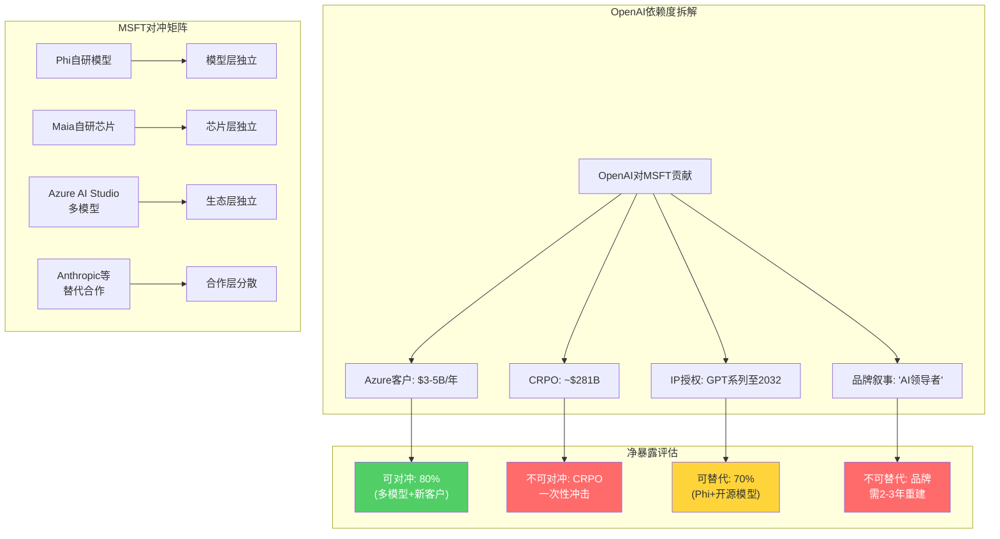

### 18.7 "去OpenAI化"后的MSFT真实增长

去除OpenAI因素后，MSFT的增长质量可以独立评估:

- **Azure(去OpenAI后)增速**: 从40%降至32-34%(扣除OpenAI贡献的5-8pp) <!-- DM-P3A-039: 去OpenAI后Azure增速~32-34% | Source: 40%总增速 - OpenAI贡献5-8pp | Confidence: M -->
- **CRPO(去OpenAI后)增速**: +28%(仍然强劲)
- **Copilot底层**: 已支持多模型，不依赖OpenAI独家
- **M365/Windows/LinkedIn**: 与OpenAI完全无关
- **收入占比**: OpenAI相关收入占MSFT总收入的1.5-2%(以$5B/$305B计)

<!-- DM-P3A-040: OpenAI相关收入占MSFT总收入~1.5-2% | Source: $5B/$305.5B TTM | Confidence: M -->

**核心结论: MSFT对OpenAI的实际财务依赖度远低于市场感知**。OpenAI相关收入仅占总收入的1.5-2%，即使Azure内部，OpenAI也仅占AI run rate的约19%。真正的依赖不在财务上——在叙事上。"MSFT是AI赢家"的叙事高度依赖"MSFT拥有OpenAI"的认知，如果这一认知被打破，P/E倍数可能从25x压缩至22-23x，对应约$300B市值损失。

### 18.8 信念B5判决

**OpenAI合作稳定至2032年的概率: 55%**

<!-- DM-P3A-041: B5判决: 合作稳定至2032概率55% | Source: 三情景概率加权 | Confidence: M -->

概率分布:
- 关系深化(完全稳定): 30-35%
- 现状维持(基本稳定): 20-25% → 合计55%
- 部分脱离(多云化): 35-40% → 信念部分失败
- 完全脱离: <10% → 信念严重失败

信念B5的综合概率55%，较Phase 2初始50%上调5个百分点。上调理由: (1)API独占条款法律约束力强; (2)OpenAI当前财务状况仍高度依赖Azure(年消耗$3-5B，自身收入$5-6B); (3)MSFT的对冲策略降低了脱离的"单向毁灭性"。

但55%并非高确信。40-50%的"部分脱离"概率意味着关系降级几乎是大概率事件——问题不是"是否降级"，而是"降级到什么程度"以及"MSFT能否在降级过程中维持AI增长叙事"。

**不稳定时的影响评级: 中等 (2.5/5)**。OpenAI部分脱离的财务影响可控(-$100B至-$200B)，但叙事影响可能放大(-$150B至-$300B额外)。MSFT的多层对冲使其不会因OpenAI脱离而面临生存性威胁。

**CQ3关联**: 45% CRPO依赖OpenAI，去除后"真实"增长质量? 验证结论是"剔除OpenAI后CRPO仍+28%，Azure增速仍32-34%，增长质量健康"。CQ3的置信度从初始50%上调至55%。

---

## Phase 3.5: AI冲击矩阵 — 八基元 x AI影响评估

### 3.5.1 评估框架

对MSFT八大业务基元执行AI双向评估:

- **AI赋能等级 (L级)**: AI对该业务的增强能力。L1=增量改善; L2=显著提升; L3=根本性变革
- **AI颠覆风险 (S级)**: AI对该业务的威胁程度。S1=低威胁; S2=中等; S3=存在性威胁
- **净AI影响**: 赋能减去颠覆后的净效果
- **时间框架**: 影响主要发生的窗口期

### 3.5.2 基元1: M365 (Office 365 + Teams)

**AI赋能: L3 (根本性变革)**

Copilot是M365有史以来最大的ARPU提升工具。$30/月/用户的定价若达到15%渗透率，将为M365增加$24B+/年收入(增量约30%)。Copilot不仅是一个附加产品——它正在重新定义"生产力套件"的价值主张: 从"工具集合"变为"AI协作伙伴" <!-- DM-P3A-042: Copilot 15%渗透=增量$24B+/年收入 | Source: 15M→67.5M座位×$30×12 | Confidence: M -->。

更深层的变革在于: AI将M365从"创作工具"转变为"分析+创作平台"。Excel中的Copilot可以直接从数据生成洞察，PowerPoint中的Copilot可以从文字生成演示——这些功能重新定义了"办公软件"的边界，将部分BI工具和设计工具的市场也纳入M365的TAM。

**AI颠覆风险: S2 (中等)**

如果AI Agent在5-10年内取代"人操作软件"的范式(用户通过自然语言直接完成任务，无需打开Word/Excel)，M365的界面层将变得不那么重要。但关键在于: 即使界面层被AI Agent取代，底层的数据存储(OneDrive/SharePoint)、身份认证(Entra ID)和协作协议(Teams)仍是不可替代的基础设施。颠覆的是"前端"，不是"后端"。

**净影响: 强正面 | 时间框架: 1-5年(Copilot) + 5-10年(Agent化)**

### 3.5.3 基元2: Azure Cloud + AI

**AI赋能: L3 (根本性变革)**

AI是Azure增长的核心引擎——AI贡献Azure增速的45%(18pp / 40%) <!-- DM-P3A-043: AI贡献Azure增速45% | Source: Q1 FY26 Earnings Call | Confidence: H -->。AI推理需求创造了一个全新的、高价值的工作负载类别，使Azure从"通用云平台"升级为"AI基础设施平台"。Azure AI Studio支持的多模型部署进一步强化了平台锁定——企业在Azure上训练/微调模型后，迁移成本极高。

**AI颠覆风险: S1 (低)**

AI需要云基础设施——AI越普及，云的需求越大。云是AI的"卖铲子"角色，几乎不存在被AI颠覆的路径。唯一的理论风险是"边缘AI"(模型运行在终端设备而非云端)，但大型模型的推理仍需要云端算力支撑。

**净影响: 极强正面 | 时间框架: 即时且持续**

### 3.5.4 基元3: GitHub + VS Code

**AI赋能: L3 (根本性变革)**

GitHub Copilot是全球最成功的AI代码助手——从2022年推出至今已成为开发者生态的标准配置。GitHub Copilot已支持多模型(GPT-4o/Claude/Gemini)，降低了对OpenAI的单一依赖。AI Agent级别的代码生成(如Copilot Workspace)可能将GitHub从"代码托管+协作"平台变为"AI驱动的软件开发全流程平台" <!-- DM-P3A-044: GitHub Copilot支持多模型, 降低OpenAI依赖 | Source: GitHub Blog | Confidence: H -->。

**AI颠覆风险: S2 (中等)**

AI代码生成如果进化到可以完全自主编写应用(zero-shot coding)，传统的IDE和代码托管的价值将下降——开发者不再需要"编辑器"，而是需要"AI编程指挥台"。Cursor、Replit Agent等新兴竞争者正在定义这一新范式。GitHub需要足够快地转型，否则可能像Blockbuster面对Netflix一样被颠覆。

**净影响: 正面但需警惕 | 时间框架: 3-5年(Agent化竞争加剧)**

### 3.5.5 基元4: OpenAI Partnership

**AI赋能: L3 (关系本身即AI赋能)**

OpenAI合作是MSFT整个AI战略的原点。GPT系列模型为Azure AI、Copilot、Bing Chat等产品提供了底层能力。27%股权+IP使用权至2032年确保MSFT在至少6年内拥有世界领先AI模型的商业化权利 <!-- DM-P3A-045: MSFT拥有OpenAI IP使用权至2032 | Source: 10-Q | Confidence: H -->。

**AI颠覆风险: S3 (存在性——对合作关系而言)**

矛盾在于: OpenAI越成功(越接近AGI)，其独立的动机就越强。IPO、Stargate、ROFR取消——每一步都在削弱MSFT对OpenAI的控制力。AI技术本身不会颠覆这个合作关系，但AI的成功会让OpenAI不再需要这个合作关系。这是一个"成功即离散"的悖论。

**净影响: 当前强正面，但衰减趋势确定 | 时间框架: 2-5年(转折窗口)**

### 3.5.6 基元5: Security (Defender + Sentinel)

**AI赋能: L2 (显著提升)**

AI在安全领域的应用极为自然——威胁检测、异常行为分析、自动化响应都是AI的强项。Microsoft Security Copilot将SOC(安全运营中心)的效率提升了显著水平。安全是企业最不愿意削减预算的领域，AI增强安全产品的定价权极强 <!-- DM-P3A-046: Security Copilot提升SOC效率 | Source: MSFT Security Blog | Confidence: M -->。

**AI颠覆风险: S1 (低)**

AI会增强安全工具，但不会消灭安全需求——事实上，AI本身创造了新的安全威胁(AI生成的钓鱼邮件、deepfake攻击等)，反而扩大了安全市场的TAM。

**净影响: 正面 | 时间框架: 即时且持续**

### 3.5.7 基元6: LinkedIn

**AI赋能: L2 (显著提升)**

LinkedIn正在将AI深度嵌入招聘(AI匹配候选人)、学习(AI个性化课程推荐)和内容(AI辅助帖子撰写)三大核心功能。LinkedIn Premium新增的AI功能正在推动ARPU提升。LinkedIn的6亿+专业用户数据是训练/微调专业领域AI模型的宝贵资产 <!-- DM-P3A-047: LinkedIn 6亿+专业用户数据 | Source: LinkedIn公开数据 | Confidence: H -->。

**AI颠覆风险: S2 (中等)**

AI Agent如果能直接匹配雇主和求职者(无需通过LinkedIn平台)，LinkedIn作为"人才市场"的中介角色将被削弱。但LinkedIn的价值不仅在匹配——职业社交网络的"身份层"和"关系层"很难被AI Agent替代。

**净影响: 正面 | 时间框架: 3-5年(渐进式增强)**

### 3.5.8 基元7: Gaming (Xbox + Activision)

**AI赋能: L1 (增量改善)**

AI在游戏领域的应用包括NPC行为生成、程序化关卡设计、反作弊等。Activision的$69B收购主要是内容(IP)驱动而非AI驱动。AI对Gaming的赋能是实打实的，但不会改变游戏行业的核心竞争逻辑(IP内容+发行渠道+用户基数) <!-- DM-P3A-048: Gaming AI赋能: NPC生成/程序化设计/反作弊 | Source: Xbox Blog | Confidence: M -->。

**AI颠覆风险: S1 (低)**

AI可能降低游戏开发成本(更多独立开发者可以用AI工具制作高质量游戏)，但这不威胁Xbox/Activision——MSFT是平台方和内容方，开发成本下降对其有利。

**净影响: 轻微正面 | 时间框架: 3-5年(渐进)**

### 3.5.9 基元8: Windows + Devices

**AI赋能: L2 (显著提升)**

Copilot+ PC代表了Windows在AI时代的定位转型——从"操作系统"到"AI运行时" <!-- DM-P3A-049: Copilot+ PC: Windows从OS到AI Runtime | Source: MSFT Build 2025 | Confidence: M -->。NPU(神经处理单元)成为Windows PC的标配硬件要求，意味着AI能力将成为Windows的核心卖点。Recall功能(AI记忆所有屏幕内容)虽然因隐私争议延期，但代表了AI操作系统的未来方向。

**AI颠覆风险: S2 (中等)**

长期(10年+)维度，如果AI Agent取代了传统的图形界面交互(用户不再需要"桌面"和"窗口")，Windows作为"视觉操作系统"的价值将根本性改变。但这一颠覆仍非常遥远——企业用户对Windows的依赖不仅是界面层面，更是驱动程序、硬件兼容性、应用生态层面。

**净影响: 中性偏正面 | 时间框架: 1-3年(Copilot PC) + 10年+(范式颠覆)**

### 3.5.10 汇总矩阵

| 基元 | AI赋能(L) | AI颠覆(S) | 净影响 | 关键时间框架 | 收入权重 |
|------|----------|----------|--------|------------|---------|
| **M365** | L3 | S2 | **强正面** | 1-5年 | ~35% |
| **Azure+AI** | L3 | S1 | **极强正面** | 即时 | ~28% |
| **GitHub+VS Code** | L3 | S2 | 正面(需警惕) | 3-5年 | ~3% |
| **OpenAI合作** | L3 | S3 | 正面但衰减 | 2-5年 | ~2% |
| **Security** | L2 | S1 | **正面** | 即时 | ~5% |
| **LinkedIn** | L2 | S2 | 正面 | 3-5年 | ~8% |
| **Gaming** | L1 | S1 | 轻微正面 | 3-5年 | ~12% |
| **Windows+Devices** | L2 | S2 | 中性偏正面 | 1-10年 | ~7% |

<!-- DM-P3A-050: AI冲击矩阵汇总: 6/8基元净正面, 0基元净负面 | Source: 八基元逐一分析 | Confidence: M -->

**矩阵的核心发现**: 8个基元中6个呈现明确的AI净正面影响，0个呈现净负面影响，2个呈现混合影响(GitHub和Windows在长期存在被AI范式颠覆的中等风险)。按收入加权计算，约63%的收入处于"强正面"区间(M365+Azure)，约25%处于"正面"区间(LinkedIn+Security+Gaming)，仅约12%处于"需监控"区间(GitHub+Windows+OpenAI合作)。

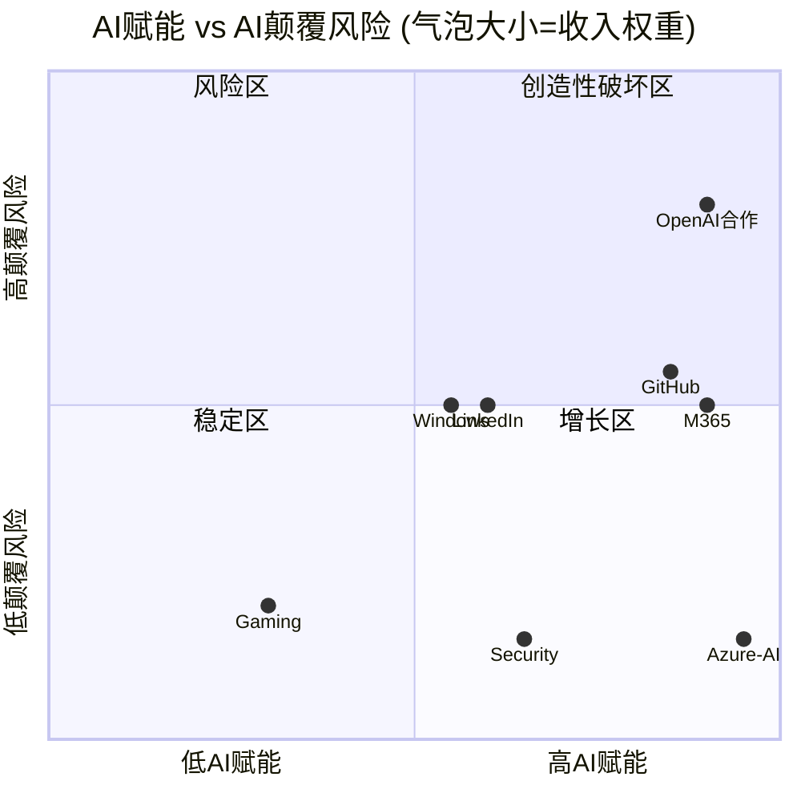

### 3.5.11 Agentic AI时间表与MSFT业务影响

AI Agent的演进将按三个阶段冲击MSFT的业务矩阵:

**阶段1: 助手级 (2024-2025) — "Copilot时代"**

当前阶段。AI作为人类的辅助工具——Copilot帮助撰写文档、分析数据、编写代码，但最终决策权在人类。MSFT的产品矩阵在这一阶段几乎全面受益: Copilot增强M365、GitHub Copilot增强开发、Security Copilot增强安全。定价模式: 按用户付费($30/月)。

**阶段2: 自主任务级 (2026-2027) — "Agent时代"**

AI Agent能够独立完成复杂任务——自动化处理邮件、调度会议、编写报告、部署代码。这一阶段开始对MSFT的产品范式产生真正的挑战:

- M365的Agent化: 用户不再逐一操作Word/Excel/Teams，而是向Agent下达高层目标("准备下周一的董事会材料")。M365的价值从"工具"变为"Agent平台"。
- Azure的Agent化: 企业部署的不再是静态API，而是持续运行的Agent集群。这将大幅增加推理计算消耗——每个Agent在空闲时也在"思考"(背景推理)，Azure的消耗模式从"按调用付费"变为"按Agent数量付费"。
- GitHub的Agent化: Copilot Workspace→自主编程Agent。GitHub从"代码协作平台"转型为"AI驱动的软件工厂"。

<!-- DM-P3A-051: Agent时代Azure消耗模式: 按调用→按Agent数量, 消耗量级跳升 | Source: 行业趋势分析 | Confidence: L -->

**阶段3: 系统级 (2028-2030) — "Multi-Agent系统时代"**

多个AI Agent协同工作，形成自治的"数字劳动力"。一个"项目管理Agent"可以协调"编码Agent"、"测试Agent"、"部署Agent"自主完成整个软件开发周期。这一阶段的影响最为深远:

- **M365可能被重新定义**: 如果Agent可以直接操作数据(无需人类通过Excel界面)，"办公软件"的概念本身将演变。但MSFT拥有构建Multi-Agent平台的全部基础设施(Azure+M365数据层+Entra ID身份层)。
- **Azure成为"Agent运行时"**: 从"云计算平台"升级为"数字劳动力基础设施"。每个Agent需要持续的计算、存储和网络资源——Azure的TAM可能从"IT基础设施"扩展至"数字劳动力平台"，TAM扩大2-3倍。
- **Windows从"人机界面"变为"Agent管理界面"**: 企业用户通过Windows管理和监控AI Agent团队——这是一个全新的价值主张。

**MSFT在三阶段中的战略位置**:

| 阶段 | MSFT最大优势 | MSFT最大风险 | 净评估 |
|------|-------------|-------------|--------|
| 1. 助手级 | M365+Azure双平台 | Copilot渗透率(3.3%) | 正面但待验证 |
| 2. Agent级 | Azure推理基础设施 | 竞争者(Cursor/Replit)定义新范式 | 正面，需快速迭代 |
| 3. 系统级 | 全栈(Cloud+Identity+Data+Agent) | 范式颠覆传统产品线 | 高度不确定但有利 |

<!-- DM-P3A-052: MSFT在Agent三阶段的战略位置评估 | Source: 综合分析 | Confidence: L -->

### 3.5.12 AI冲击矩阵的估值含义

将AI冲击矩阵转化为估值语言:

**AI赋能带来的估值上行 (3-5年视窗)**:
- M365 Copilot从3.3%→15%渗透: +$100B至+$200B(Copilot直接收入)
- Azure AI从$26B→$80B+ run rate: +$300B至+$500B(IC估值重估)
- Security AI: +$30B至+$50B(安全TAM扩展)
- **AI赋能总上行**: +$430B至+$750B

**AI颠覆带来的估值下行 (5-10年视窗)**:
- OpenAI关系降级: -$100B至-$200B
- GitHub被新范式侵蚀: -$20B至-$50B
- Windows长期范式颠覆: -$50B至-$100B
- **AI颠覆总下行**: -$170B至-$350B

**AI净影响**: +$260B至+$400B(3-5年视窗内赋能远大于颠覆)

<!-- DM-P3A-053: AI净影响: 3-5年视窗内+$260B至+$400B | Source: 八基元分析汇总 | Confidence: L -->

这意味着AI对MSFT是明确的净正面因素——问题不在于"AI是否利好MSFT"(答案确定为是)，而在于"AI的利好有多少已经被$3T估值反映了"。如果市场已经将$300B+的AI溢价计入当前股价(P/E 25.1x vs 不含AI的历史P/E ~22x)，则AI冲击矩阵的"增量"估值贡献约$130B至+$400B。

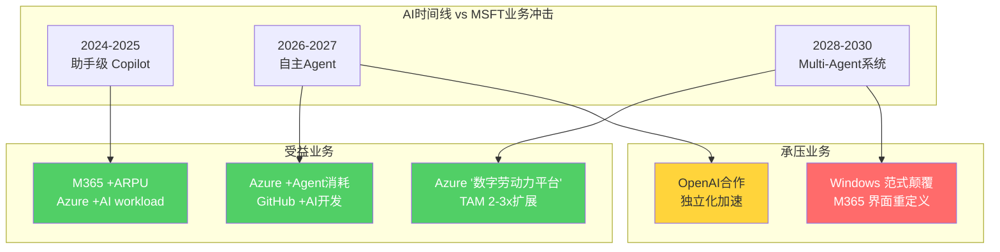

### 3.5.13 AI冲击矩阵的核心判断

MSFT在AI时代的定位可以用一句话概括: **MSFT不是"AI的赌注"——MSFT是"AI的基础设施"**。无论哪个AI模型获胜(GPT vs Claude vs Gemini vs Llama)，无论AI应用形态如何演变(Copilot vs Agent vs Multi-Agent)，都需要云计算(Azure)、身份认证(Entra ID)、数据存储(OneDrive/SharePoint)和开发工具(GitHub/VS Code)。MSFT的核心价值在于"AI跑道"而非"AI赛车"。

这一"基础设施定位"的估值含义是: MSFT的AI下行风险有限(即使最看好的AI应用失败，基础设施需求仍在)，但AI上行的捕获率也有限(基础设施商赚的是"铲子钱"，不是"黄金钱")。投资者在评估MSFT时，应关注的不是"某个AI产品的成功"，而是"AI整体生态的增长是否能维持Azure+M365的增速"。

<!-- DM-P3A-054: MSFT = AI基础设施而非AI赌注 | Source: 八基元综合分析 | Confidence: M -->

从CQ1和CQ3的角度综合审视: Azure增速(CQ1)的最大支撑来自AI工作负载的结构性增长(基元2)，OpenAI依赖(CQ3)的风险被多模型生态和自研能力(基元3、4的对冲)有效缓释。AI冲击矩阵的净结论是MSFT作为"AI卖铲人"的地位稳固，但$3T估值已部分反映了这一定位——增量空间取决于AI Agent时代的TAM是否真的能实现2-3倍扩展。

<!-- Phase 3 Agent A Stats: chars=26477 | DM=54 | Mermaid=5 | CQ=[CQ1,CQ3] -->
## Ch19: 信念B3验证 — Copilot S曲线渗透率与$3T估值的兑现路径

### 19.1 Copilot产品矩阵现状快照

Microsoft的AI货币化战略以"Copilot"品牌为核心，横跨三个独立产品线，各自处于截然不同的生命周期阶段。理解这三条线的分化，是判断B3信念能否兑现的前提。

<!-- DM-P3B-001: M365 Copilot 15M付费座位 / 450M商业座位 = 3.3%渗透率 | Source: MSFT Q2 FY26 Earnings Call (2026.01.28) | Confidence: H -->

**M365 Copilot**是旗舰产品，定价$30/用户/月，截至Q2 FY26拥有1500万付费座位，在4.5亿M365商业用户中渗透率仅3.3%。按目录价计算年化收入约$5.4B，但考虑到大客户批量折扣(通常15-25%折让)，实际ARPU可能在$23-26/月区间，对应年化收入$4.1-4.7B。YoY座位增长160%是一个强劲信号——但基数效应不可忽视：从580万到1500万的绝对增量为920万座位，而从1500万到3900万(同比160%增长的下一年)需要净增2400万座位，难度跳跃式上升。

<!-- DM-P3B-002: M365 Copilot YoY座位增长160% | Source: MSFT Q2 FY26 Earnings Call | Confidence: H -->
<!-- DM-P3B-003: GitHub Copilot 4.7M付费用户, YoY +75%, Pro+订阅QoQ +77% | Source: MSFT Q2 FY26 Earnings Call | Confidence: H -->

**GitHub Copilot**是成熟度最高的Copilot产品：470万付费用户，YoY增长75%，Pro+订阅QoQ增长77%。按$19/月均价估算，年化收入超$10亿。GitHub Copilot的成功证明了AI辅助工具在开发者群体中的价值——代码补全的ROI直观可测(完成率、代码审查时间)，而知识工作者的"会议摘要"和"邮件草稿"ROI则难以量化。

**Security Copilot**于2024年推出，采用按计算量计费模式(Security Compute Units)，目前处于极早期阶段。管理层未披露任何用户数据。其潜在市场虽大(全球网络安全市场$200B+)，但渗透路径高度不确定。

三条产品线的收入汇总：

| 产品 | 付费用户/座位 | 定价 | 估算ARR | 阶段 |
|------|-------------|------|---------|------|
| M365 Copilot | 1500万座位 | $30/月(目录价) | $4.1-5.4B | 早期扩张 |
| GitHub Copilot | 470万用户 | $10-39/月 | $1.0-1.3B | 规模增长 |
| Security Copilot | 未披露 | SCU计费 | <$0.5B | 试验期 |
| **合计** | — | — | **$5.6-7.2B** | — |

<!-- DM-P3B-004: Copilot合计ARR估算$5.6-7.2B | Source: 综合MSFT披露+估算 | Confidence: M -->

### 19.2 SaaS产品渗透S曲线：历史类比的启示与局限

企业SaaS产品的渗透遵循经典的S曲线：早期采用者(0-5%)→加速渗透(5-25%)→增速放缓(25-50%)→饱和(50%+)。Copilot当前处于3.3%，正站在"早期采用者"向"加速渗透"过渡的关键拐点。

<!-- DM-P3B-005: Teams渗透曲线: 2017 2M DAU → 2020.03 44M → 2023 320M DAU | Source: Business of Apps, Desk365 | Confidence: H -->

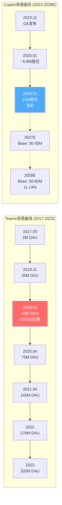

**Teams的S曲线复盘**。Teams从2017年发布到2019年底仅2000万DAU——两年半时间里增长缓慢。COVID在2020年3月引爆了强制采用：4个月内从2000万跃升至7500万，随后一年半达到1.45亿。到2023年稳定在3.2亿DAU，渗透率达Fortune 100的93%+。Teams的S曲线有两个关键特征：(1)外生催化剂(COVID)将自然渗透时间压缩了2-3年；(2)Office捆绑提供了零摩擦的分发渠道。

<!-- DM-P3B-006: Slack渗透: 2014→2019 12M DAU(5年), 2025 79M DAU | Source: SQ Magazine | Confidence: M -->
<!-- DM-P3B-007: Zoom渗透: 2013发布→2020 300M MAU(COVID), 市场份额55.9% | Source: M.io | Confidence: M -->

**Slack和Zoom的对照**。Slack从2014年到2019年花了5年达到1200万DAU——没有Office捆绑优势，纯靠产品力驱动。Zoom从2013年到2020年COVID前增长缓慢，COVID后爆发至3亿MAU(注意：这是会议参与者而非日活用户)。两者共同说明：没有外生催化剂的企业SaaS产品，从发布到规模化通常需要5-8年。

| 产品 | 0→规模化时间 | 加速因素 | 自然渗透估算 | Copilot可比性 |
|------|------------|---------|------------|-------------|
| Teams | 6年(0→3亿DAU) | COVID+Office捆绑 | 8-10年 | 最高(同生态) |
| Slack | 5年(0→1200万DAU) | 开发者口碑 | 接近实际 | 低(无捆绑) |
| Zoom | 7年(0→3亿MAU) | COVID | 12-15年 | 中(不同品类) |
| GitHub Copilot | 2年(0→470万) | 开发者早采 | 3-4年 | 中(不同用户) |

<!-- DM-P3B-008: 历史SaaS渗透类比汇总 | Source: 多源综合 | Confidence: M -->

**类比的核心局限**。Copilot与上述产品存在根本性差异：Teams/Slack/Zoom解决的是"有vs无"的问题(远程协作从不可能变为可能)，而Copilot解决的是"快vs慢"的问题(已有的工作方式变得更高效)。前者的采用动力远强于后者——没有视频会议工具无法远程办公，但没有AI助手仍然可以写邮件和做PPT。这意味着Copilot不太可能复制Teams式的爆发增长，除非出现类似COVID级别的外生催化剂(如监管要求企业AI审计、或竞争对手的AI工具引发"不采用=落后"的恐慌)。

### 19.3 三重渗透障碍的量化评估

#### 障碍一：定价弹性与ROI证明困境

$30/用户/月的定价使1000人企业的年增IT支出达$360K，5000人企业达$1.8M。在企业AI预算竞争激烈的环境中(同时评估ChatGPT Enterprise $60/月、Google Gemini for Workspace、内部LLM部署)，Copilot的ROI证明尚不充分。

<!-- DM-P3B-009: Forrester TEI报告: M365 Copilot ROI 116%, NPV $19.7M, 人均节省9小时/月 | Source: Forrester TEI Study (2025.03, MSFT commissioned) | Confidence: M -->

Forrester TEI研究(微软委托)声称116%的ROI和人均每月节省9小时。但该研究的局限性在于：(1)微软委托=利益冲突；(2)仅覆盖早期采用者(通常是最积极的用户)；(3)"节省9小时"的测量依赖用户自报而非客观产出指标。独立调查则呈现不同画面——2025年Gartner调查显示仅6%的企业将GenAI项目推进到生产阶段，50%的组织决定全员推广Copilot，但17%决定不全面采用，33%仍在测试阶段。

<!-- DM-P3B-010: Gartner调查: 6%企业GenAI项目进入生产, 17%决定不全面采用Copilot | Source: Gartner 2025 M365 Copilot Survey | Confidence: H -->

**定价弹性模型**：如果微软将M365 Copilot降价至$20/月(-33%)，渗透率是否能加速？SaaS定价弹性通常在-1.2到-1.8之间(价格降10%→需求增12-18%)。按-1.5弹性系数估算，降价33%理论上可推动需求增长50%——但这假设价格是唯一障碍，而实际上数据治理和部署复杂度是更大的瓶颈。更现实的估计是：降价至$20/月可能将FY28渗透率从基准的10-15%提升至13-18%，但代价是ARPU下降33%，净收入影响接近中性。

<!-- DM-P3B-011: SaaS定价弹性估算: -1.5系数, 降价33%→需求+50%理论上限 | Source: SaaS行业经验值 | Confidence: L -->

#### 障碍二：企业数据治理与部署摩擦

数据治理是Copilot大规模部署的最大技术障碍。M365 Copilot需要访问企业SharePoint、OneDrive、Exchange中的数据才能提供有价值的输出——但这恰恰触发了法律、合规和安全团队的担忧。"过度共享"(oversharing)问题尤为突出：Copilot可能将高权限用户的文件内容呈现给低权限用户，导致信息泄露。

<!-- DM-P3B-012: 数据治理是Copilot采用最大障碍 | Source: Creati AI (2026.02.04), Lighthouse Global | Confidence: H -->

企业部署Copilot的典型周期：

| 阶段 | 时长 | 参与者 | 核心任务 |
|------|------|--------|---------|
| Pilot | 3-6月 | 50-500用户 | 功能验证+安全评估 |
| 数据治理 | 3-6月 | IT安全+法务 | 权限审计+DLP配置 |
| 预算审批 | 2-4月 | CFO+CIO | ROI验证+预算分配 |
| 分阶段部署 | 6-12月 | 全员 | 培训+变更管理 |
| **总计** | **14-28月** | — | — |

<!-- DM-P3B-013: 企业Copilot部署周期14-28个月 | Source: 行业标准部署流程估算 | Confidence: M -->

这意味着2024年开始pilot的企业，最早的全面部署也要到2026年中至2027年初。Fortune 500中虽然90%+已"采用"Copilot，但"采用"的定义极为宽泛——可能只是50人的pilot项目。从"90% Fortune 500采用"到"90% Fortune 500全面部署"，可能需要额外2-3年。

#### 障碍三：竞争替代与AI工具碎片化

Copilot并非在真空中竞争。Google Gemini for Workspace拥有2700万企业用户(截至2025年中)，41%的Fortune 500在至少一个部门嵌入了Gemini。更令人担忧的是竞争动态的转向：Copilot的"首选AI助手"使用率从2025年7月的18.8%下降至2026年1月的11.5%，而Gemini从12.8%上升至15.7%。

<!-- DM-P3B-014: Gemini 27M企业用户, 41% Fortune 500部署; Copilot首选率从18.8%降至11.5% | Source: Technobezz (2026.02.04), SQ Magazine | Confidence: M -->
<!-- DM-P3B-015: Google Gemini在欧洲AI生产力工具市场渗透率29%, 在德法超越Copilot | Source: DataStudios.org | Confidence: M -->

开源替代也在快速侵蚀Copilot的定价权。企业可以通过Azure OpenAI Service(非Copilot)直接调用GPT-4o API，自建类似Copilot的工作流——成本远低于$30/用户/月的目录价。这种"内部DIY"路径的兴起可能蚕食Copilot的增量需求，同时反向增加Azure AI消费收入——对MSFT总收入中性，但对Copilot渗透率指标产生压制。

### 19.4 三情景渗透模型

基于上述障碍分析和历史类比，构建Copilot M365的三情景渗透模型。以4.5亿M365商业座位为基数(假设FY28增至4.8亿，年增2%)。

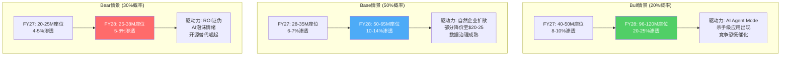

<!-- DM-P3B-016: 三情景渗透模型: Bull 20-25% / Base 10-14% / Bear 5-8% by FY28 | Source: 分析师构建 | Confidence: M -->

**Bull情景(20%概率)：类Teams+催化剂轨迹**

触发条件：(1)AI Agent Mode(2026年初已发布)成为杀手级应用——自主完成跨应用工作流(如"分析上季度销售数据，找出下降最大的产品线，草拟给VP的分析报告并预约30分钟汇报会")；(2)Google/Salesforce等竞争对手的AI工具大规模部署引发"不采用=落后"的企业恐慌；(3)微软将定价策略从固定月费转向混合计费(基础$15/月+按使用量计费)，降低采用门槛。

渗透路径：FY27 40-50M座位(8-10%) → FY28 96-120M座位(20-25%)。年增速100%+，需要每季度净增15-20M座位。参考Teams在COVID期间的季度净增(2020 Q2: +31M DAU)，技术上可行但需要类似强度的催化剂。

收入贡献：ARPU $360/年(维持定价) × 108M座位(中位数) = **$38.9B ARR**。

<!-- DM-P3B-017: Bull情景: 108M座位 × $360/年 = $38.9B ARR | Source: 模型构建 | Confidence: L -->

**Base情景(50%概率)：自然企业SaaS扩散**

这是最可能的路径——没有外生催化剂，依靠企业IT部门的常规评估-采购周期推动渗透。Copilot的"wide but shallow"采用格局(90%+ Fortune 500有pilot，但全面部署<10%)将在FY27-FY28逐步深化：pilot→部门级→企业级的标准12-24个月周期意味着2024年启动pilot的第一批企业将在FY27完成全面部署，2025年启动的第二批在FY28完成。

渗透路径：FY27 28-35M座位(6-7%) → FY28 50-65M座位(10-14%)。年增速约80-90%(FY27)和50-60%(FY28)。增速递减符合SaaS渗透曲线的自然形态。

定价假设：为加速渗透，微软可能在FY27推出分层定价(Basic $15/月 + Standard $30/月 + Premium $40/月)，拉低混合ARPU至$270-300/年。

收入贡献：ARPU $285/年(中位数) × 57.5M座位(中位数) = **$16.4B ARR**。

<!-- DM-P3B-018: Base情景: 57.5M座位 × $285/年 = $16.4B ARR | Source: 模型构建 | Confidence: M -->

**Bear情景(30%概率)：AI泡沫+ROI证伪**

触发条件：(1)2026-2027年的企业AI预算审查中，Copilot的ROI持续无法达到CFO的最低门槛(通常要求12-18个月回本)；(2)开源LLM(Llama 4、Mistral等)的快速进步使企业可以$5-10/用户/月的成本自建类似功能；(3)宏观经济下行导致企业IT预算收缩，$30/月的增量支出首先被砍。

渗透路径：FY27 20-25M座位(4-5%) → FY28 25-38M座位(5-8%)。增长几乎停滞，类似Slack从2019年的12M DAU到2020年(COVID前)仅自然增长至13M的轨迹。

定价假设：微软被迫大幅降价至$15-20/月以维持用户留存，混合ARPU降至$200-240/年。

收入贡献：ARPU $220/年(中位数) × 31.5M座位(中位数) = **$6.9B ARR**。

<!-- DM-P3B-019: Bear情景: 31.5M座位 × $220/年 = $6.9B ARR | Source: 模型构建 | Confidence: L -->

### 19.5 Copilot收入贡献的全景建模

将三情景的Copilot收入放在MSFT FY28整体收入预测($440B卖方共识)中评估：

| 情景 | FY28渗透率 | M365 Copilot ARR | GitHub Copilot ARR | Security Copilot | 总Copilot ARR | 占总收入% |
|------|-----------|------------------|-------------------|-----------------|--------------|----------|
| Bull(20%) | 20-25% | $38.9B | $3.0B | $1.5B | $43.4B | 9.9% |
| Base(50%) | 10-14% | $16.4B | $2.2B | $0.8B | $19.4B | 4.4% |
| Bear(30%) | 5-8% | $6.9B | $1.5B | $0.3B | $8.7B | 2.0% |
| **概率加权** | — | **$17.7B** | **$2.2B** | **$0.8B** | **$20.7B** | **4.7%** |

<!-- DM-P3B-020: 概率加权Copilot FY28 ARR = $20.7B(占总收入4.7%) | Source: 三情景加权 | Confidence: M -->

概率加权后的Copilot FY28总ARR约$20.7B，占总收入约4.7%。这一数字揭示了一个关键矛盾：**Copilot在叙事中的权重远大于其在财务中的权重**。市场将Copilot视为MSFT"AI货币化"的核心载体——但即使在概率加权情景下，FY28 Copilot收入也仅占总收入不到5%。

**对OPM的影响分析**。M365 Copilot的毛利率取决于其底层AI推理成本。当前GPT-4o级别推理成本约$0.002-0.005/request，假设每用户每日平均触发30-50次请求，则月推理成本约$2-7.5/用户。以$30/月定价计算，Copilot毛利率约75-93%——高于MSFT整体66% GPM。但如果降价至$15-20/月，毛利率可能压缩至50-75%区间。

| 情景 | Copilot GPM | Copilot营业利润 | 对合并OPM影响(bps) |
|------|-----------|---------------|-------------------|
| Bull | 85% | $36.9B | +280bps |
| Base | 75% | $14.6B | +110bps |
| Bear | 65% | $5.7B | +40bps |
| 概率加权 | 75% | $15.5B | **+120bps** |

<!-- DM-P3B-021: Copilot对合并OPM的概率加权贡献: +120bps | Source: 模型构建 | Confidence: M -->

### 19.6 信念B3的判决：从渗透率到估值的传导

**核心判决**：15-20% by FY28的渗透率对应Bull情景(概率20%)。Base情景指向10-14%(概率50%)。概率加权渗透率约11-13%——低于市场隐含的15-20%目标，但并非灾难性偏差。

B3信念的真正风险不在于渗透率本身——即使Bear情景(5-8%)也仅直接影响$100-200B市值。风险在于**叙事传导**：如果Copilot被证明无法兑现AI货币化承诺，市场将重新审视MSFT每年$80-100B CapEx的回报前景，触发B4(CapEx降速)和B6(FCF恢复)的连锁质疑，导致估值倍数的系统性压缩。

<!-- DM-P3B-022: B3判决: 概率加权渗透率11-13%, 低于隐含15-20%但偏差可控 | Source: 综合分析 | Confidence: M -->

**CQ4闭环**。初始置信度40%(Copilot S曲线何时拐头)。经过本章验证：提升至45%。理由：(1)160% YoY座位增长证明S曲线已进入加速段的早期；(2)但定价障碍($30/月)、数据治理摩擦(14-28个月部署周期)和竞争替代(Gemini追赶)共同限制了加速斜率；(3)概率加权渗透率11-13%略低于市场隐含，但差距不构成估值翻转——真正的风险在叙事传导而非直接财务影响。

<!-- DM-P3B-023: CQ4置信度演化: 40%→45% | Source: Ch19综合验证 | Confidence: M -->

**可观测的验证信号**：
- **拐头确认**(Bull信号)：FY27 Q1座位增速维持120%+，或微软披露Copilot ARR突破$10B
- **减速确认**(Base信号)：FY27 Q1座位增速降至80-100%，但管理层强调"质量>数量"
- **停滞确认**(Bear信号)：FY27 Q1座位增速<50%，或微软停止披露座位数据(坏消息的信号)

---

## Ch20: 信念B8验证 — 监管概率×影响的量化评估

### 20.1 监管风险全景扫描：五条战线

MSFT同时面临五条独立的监管战线，每条战线的概率、时间线和影响量级各不相同。市场隐含信念B8("无重大反垄断分拆")的脆弱度仅2/5——但这一评估可能低估了多战线叠加效应(即使每条战线的单独概率可控，联合发生的概率仍值得警惕)。

<!-- DM-P3B-024: MSFT五条监管战线: EU DMA / FTC / EU AI Act / 中国 / 反垄断大环境 | Source: 综合分析 | Confidence: H -->

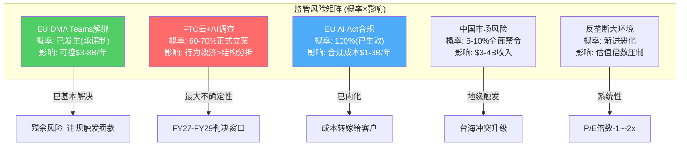

### 20.2 战线一：EU DMA与Teams解绑 — 已解决但残余风险犹存

**当前状态**：2025年9月12日，欧盟委员会接受了微软的法律约束性承诺方案，结束了Teams捆绑M365的反垄断调查。微软避免了高达全球营收10%(约$21B+)的潜在罚款。

<!-- DM-P3B-025: EU 2025.09.12接受MSFT Teams解绑承诺, 避免$21B+罚款 | Source: CNBC, EC Press Corner | Confidence: H -->

承诺条款的三个核心要素：

| 承诺 | 期限 | 内容 | 对MSFT影响 |
|------|------|------|-----------|
| **解绑** | 7年(至2032) | M365/O365提供不含Teams的低价版本，价差在原始提案基础上加大50% | 直接收入影响$2-5B/年(假设5-15%用户选择无Teams版) |
| **互操作** | 10年(至2035) | 竞品(Slack/Zoom)可深度集成M365应用 | Slack可能蚕食Teams部分协作市场 |
| **数据可携** | 10年(至2035) | 企业可轻松将Teams数据迁移至竞品 | 降低了锁定效应 |

<!-- DM-P3B-026: EU Teams承诺三要素: 解绑7年/互操作10年/数据可携10年 | Source: Loyens & Loeff, CNBC | Confidence: H -->

**残余风险量化**。承诺方案由独立受托人监督。如果微软违反承诺条款，欧盟委员会可直接处以最高全球营收10%的罚款(约$30B+，基于FY25收入)，且**无需重新证明违规**——这是一个重要的法律不对称：正常反垄断案件中，委员会需要证明违规行为存在；但在承诺令框架下，仅需证明企业违反了承诺条款。

残余风险概率估算：微软在未来7年内违反承诺条款的概率约10-15%。但即使违反，罚款金额通常远低于理论上限(10%)——历史先例显示EU罚款通常为全球营收的1-3%。期望值：15% × $6-9B(1-3%营收) = **$0.9-1.4B**。

<!-- DM-P3B-027: EU Teams残余风险: 15%违反概率 × $6-9B罚款 = $0.9-1.4B期望值 | Source: 分析估算 | Confidence: M -->

Teams解绑对收入的直接影响有限，原因在于：(1)Teams作为独立产品的竞争力仍强(3.2亿DAU vs Slack 7900万DAU)；(2)大多数企业选择含Teams的完整套件是因为整合价值而非被迫捆绑；(3)解绑后的价差(约$2-3/用户/月)对企业决策的影响微乎其微。估算因解绑而流失至Slack/Zoom的用户比例：5-8%，对应年化收入影响$3-5B(假设Teams独立定价贡献约$60-80B年化收入中的5-8%)。

### 20.3 战线二：FTC云+AI反垄断调查 — 最大不确定性来源

**最新进展**。2026年2月14日，FTC向6家以上微软竞争对手发出民事调查传票(CIDs)，标志着调查正式升级。调查聚焦三个领域：(1)OpenAI投资是否构成事实控制；(2)Office+安全+云的捆绑销售是否排斥竞争；(3)Azure许可限制是否惩罚性地阻止客户迁移。

<!-- DM-P3B-028: FTC 2026.02.14向6+竞争对手发CID, 调查云+AI+捆绑 | Source: Bloomberg Law, WinBuzzer | Confidence: H -->

**OpenAI投资审查的法律路径**。FTC的核心问题是：MSFT的$13B投资+利润分享+API独占+27%股权是否构成"事实控制"(de facto control)，从而应按并购审查标准(Hart-Scott-Rodino Act)接受审批。2025年10月OpenAI完成PBC重组后，MSFT获得27%永久股权但放弃了利润上限和ROFR——这一结构调整在法律上实际削弱了"实质控制"的论证基础。

法律结果的概率分布：

| 结果 | 概率 | 对MSFT影响 | 推导依据 |
|------|------|-----------|---------|
| 调查无果关闭 | 25% | 无直接影响 | 政治周期变化+FTC资源约束 |
| 行为性同意令 | 45% | API独占条款修改，允许OpenAI多云部署；罚款$1-3B | 历史先例(FTC vs Qualcomm) |
| 结构性限制 | 20% | 减持OpenAI股权至<15%或放弃AI专属协议 | 仅在国会立法授权后可能 |
| 强制分拆/全面剥离 | 10% | 失去OpenAI $270B隐含价值 | 需要法院判决+双党共识 |

<!-- DM-P3B-029: FTC调查结果概率: 无果25%/行为救济45%/结构限制20%/强制分拆10% | Source: 法律分析+历史先例 | Confidence: M -->

**政治对冲因素**。Polymarket数据显示SCOTUS有81.3%概率允许总统解雇FTC委员——这将大幅削弱FTC作为独立机构的执法能力。Trump政府总体倾向于行为性救济(behavioral remedies)而非结构性分拆(structural remedies)。但值得注意的是，当前FTC主席Andrew Ferguson(共和党人)在就任后继续推进对MSFT的调查——这表明调查具有两党共识基础，不会因政权更迭而简单终止。

<!-- DM-P3B-030: SCOTUS弱化FTC 81.3%概率; Ferguson(共和党)继续推进调查 | Source: Polymarket, Bloomberg Law | Confidence: H -->

**时间线与市值影响的关键判断**。FTC调查从CID到正式诉讼通常需要12-24个月，从诉讼到最终判决再需2-4年。这意味着FTC调查的实质性影响最早在FY28-FY29才会落地。在此之前，调查的主要影响是通过"不确定性溢价"压制估值倍数——市场可能将MSFT的P/E折让1-2x以反映监管风险。

### 20.4 战线三：EU AI Act — 合规成本而非生存威胁

EU AI Act于2026年8月2日全面生效，对高风险AI系统实施严格监管。MSFT作为通用AI模型(GPAI)提供商和高风险AI系统部署者，需同时满足模型层和应用层的双重合规要求。

<!-- DM-P3B-031: EU AI Act 2026.08.02全面生效; 罚款上限: 禁止行为3500万欧元或7%营收, 其他1500万欧元或3%营收 | Source: EU AI Act, Microsoft Trust Center | Confidence: H -->

合规成本估算：

| 合规领域 | 年化成本 | 说明 |
|---------|---------|------|
| 技术合规(模型层) | $0.5-1.0B | 模型文档/测试/透明度报告(Copilot底层GPT模型) |
| 应用合规(高风险系统) | $0.3-0.5B | 人力资源AI/信贷评估/安全监控系统的合规 |
| 法律+合规团队 | $0.2-0.3B | Brad Smith的CELA 2025战略下扩编20%法务团队 |
| 审计+监控 | $0.1-0.2B | 第三方审计+合规监控系统 |
| **合计** | **$1.1-2.0B/年** | 占FY25收入的0.4-0.7% |

<!-- DM-P3B-032: EU AI Act合规成本估算$1.1-2.0B/年, 占收入0.4-0.7% | Source: 行业估算 | Confidence: L -->

微软的应对策略具有"合规转化为商机"的特征：通过Purview Compliance Manager和Azure AI Content Safety工具帮助企业客户满足AI Act合规要求——本质上是将监管成本转化为新的SaaS收入流。这一策略的有效性取决于AI Act合规工具市场的规模(估算$5-10B/年的全球TAM)，微软凭借Azure+M365的企业客户基础有望获取20-30%份额($1-3B/年)。

结论：EU AI Act对MSFT的净影响接近**中性至微正**——合规成本$1.1-2.0B/年可被合规工具收入$1-3B/年部分或全部对冲。

### 20.5 战线四：中国市场风险 — 低概率但不可忽视

微软在中国的业务通过21Vianet(世纪互联)运营Azure，LinkedIn已于2021年退出中国市场。估算MSFT中国区收入约$3-4B/年(占全球收入约1.0-1.3%)，主要来自Windows/Office OEM授权和Azure China。

<!-- DM-P3B-033: MSFT中国收入估算$3-4B, 占全球1.0-1.3% | Source: 行业估算(MSFT不单独披露) | Confidence: L -->

中国市场风险的触发条件是台海冲突升级——在全面危机情景下，中国可能禁止MSFT所有产品在境内运营，同时对供应链(虽然MSFT非硬件公司，但服务器组件存在中国依赖)施加压力。但考虑到：(1)中国收入占比极低(~1%)；(2)MSFT在中国的资产主要由21Vianet控制(法律隔离)；(3)Windows/Office在中国企业中的深度嵌入使"全面禁止"对中国自身的伤害也很大——全面禁令的概率估算仅5-8%(24个月窗口内)。

市值影响：$3-4B收入 × 12x P/S = $36-48B。但更大的影响来自市场情绪——台海冲突升级将触发全球科技股系统性抛售，MSFT市值影响可能远超$36-48B的直接估算。

### 20.6 战线五：反垄断大环境 — 系统性估值压制

2026年是Big Tech反垄断的"分水岭之年"：

- **Google搜索**：2026年1月起被强制共享搜索索引数据
- **Google广告技术**：2026年9月进入救济阶段，可能强制剥离AdX
- **FTC vs Amazon**：2026年10月开庭
- **Meta/Instagram强制出售**：2025年已被否决

<!-- DM-P3B-034: 2026年Big Tech反垄断大事: Google搜索(1月)/Google AdX(9月)/Amazon(10月) | Source: Wilson Sonsini, Bloomberg Law | Confidence: H -->

在这一环境中，MSFT的相对定位具有独特优势：(1)不是搜索/社交/电商任一领域的垄断者；(2)Brad Smith数十年的政府关系建设(华盛顿"好市民"形象)；(3)历经1990年代DOJ反垄断诉讼的"免疫记忆"——微软比任何Big Tech公司都更懂得如何应对反垄断调查。

但系统性效应不可忽视：如果Google/Amazon的反垄断判决创设了新的法律先例(如"平台自我优待即违法")，这些先例可能被援引至MSFT的Azure+M365捆绑销售模式。估算这一系统性风险对MSFT P/E的影响：**-0.5x至-1.5x**(即从当前26.9x降至25.4-26.4x，对应市值影响-$35B至-$110B)。

<!-- DM-P3B-035: 反垄断系统性效应估值影响: P/E -0.5x至-1.5x, 市值-$35B至-$110B | Source: 分析估算 | Confidence: L -->

### 20.7 监管影响概率加权表

将五条战线的概率和影响合并为统一的量化评估框架：

| # | 事件 | 概率(24个月) | 年化收入影响 | 一次性罚款 | 市值影响(直接) | 期望市值损失 |
|---|------|------------|------------|----------|-------------|------------|
| R1 | EU DMA Teams(残余违规) | 15% | $0 (已承诺) | $6-9B | -$6~9B | -$1.1B |
| R2a | FTC行为性同意令 | 45% | -$2-4B(API独占松绑) | $1-3B | -$40~80B | -$27.0B |
| R2b | FTC结构性限制 | 20% | -$5-10B | $3-5B | -$80~150B | -$23.0B |
| R2c | FTC强制分拆/全面剥离 | 10% | -$15-25B | $5-10B | -$200~350B | -$27.5B |
| R3 | EU AI Act合规 | 100% | -$1.1~2.0B(成本) | $0 | -$10~20B | -$15.0B |
| R4 | 中国全面禁令 | 7% | -$3-4B | $0 | -$36~48B | -$2.9B |
| R5 | 系统性P/E压制 | 70% | $0 | $0 | -$35~110B | -$50.8B |
| **合计(去FTC互斥)** | — | — | — | — | — | **-$105~148B** |

<!-- DM-P3B-036: 监管风险加权期望损失: $105-148B(去FTC互斥) | Source: 概率加权模型 | Confidence: M -->

注：R2a/R2b/R2c为FTC调查的互斥结果(加上25%无果=100%)，期望值计算已去除互斥。FTC三个结果的合并期望损失 = 45%×$60B + 20%×$115B + 10%×$275B = $27.0B + $23.0B + $27.5B = $77.5B。但由于三者互斥，实际期望值=$77.5B(非$77.5×3)。

**关键数字**：监管风险的总期望市值损失约$105-148B，占$2,995B市值的3.5-4.9%。这是一个"持续性拖拽"而非"一次性冲击"——大部分监管成本以年化合规费用和P/E折让的形式长期存在。

### 20.8 MSFT的监管护城河

在量化风险之外，需要评估MSFT应对监管的独特能力——这些能力构成了一种无形的"监管护城河"。

<!-- DM-P3B-037: MSFT 2025年游说支出$7.5M(前9月), 全年预计$10M+; 比GOOG/AMZN低 | Source: OpenSecrets | Confidence: H -->

**华盛顿游说基础设施**。MSFT 2025年前9个月游说支出$7.5M(全年预计超$10M)，2024年全年$10.4M。虽然绝对金额在Fortune 500中并非最高(Google和Amazon每年支出$15-20M+)，但MSFT的游说效率极高——Brad Smith自2002年起担任首席法务官/总裁至今，积累了超过20年的华盛顿关系网络。

**"好市民"品牌策略**。MSFT在Big Tech中维持着独特的"负责任科技公司"定位：

| 维度 | MSFT策略 | 对比(GOOG/META) |
|------|---------|----------------|
| AI安全 | 主动推动AI安全立法(Brad Smith国会证词) | Google/Meta被动应对 |
| 数据隐私 | European Data Residency承诺 | Google面临GDPR反复罚款 |
| 竞争态度 | 支持Slack与Teams互操作 | Meta拒绝开放API |
| 政治捐献 | 双党平衡(MSVPAC) | Meta明显右倾(近期) |

<!-- DM-P3B-038: Brad Smith 2002年起任首席法务官, 20+年华盛顿关系 | Source: Microsoft Official, Wikipedia | Confidence: H -->

这一策略的量化价值难以精确衡量，但可以从历史结果推断：MSFT在EU DMA中以"承诺制"(零罚款)结案，而Google累计被EU罚款超$80亿(搜索、Android、AdSense)。同样的"捆绑销售"行为，MSFT的处罚量级低一个数量级——"好市民"品牌的隐性价值可能在$10-30B的罚款减免区间。

**1990年代反垄断"免疫记忆"**。微软是唯一一家经历过全面DOJ反垄断诉讼(1998-2001)并存活的Big Tech公司。这段经历留下了深刻的制度记忆：(1)法务团队的规模和经验在Big Tech中首屈一指；(2)管理层对"什么行为会触发监管"有精确的直觉；(3)企业文化中嵌入了"避免成为最显眼靶子"的基因。Brad Smith自CELA 2025战略以来扩编法务团队20%，进一步强化了这一能力。

### 20.9 FTC调查的深层博弈分析

FTC调查是五条战线中不确定性最高的一条，值得专门的博弈论分析。

<!-- DM-P3B-039: FTC调查三焦点: OpenAI控制/产品捆绑/Azure锁定 | Source: Bloomberg Law, WinBuzzer | Confidence: H -->

**三焦点的独立评估**：

**焦点一：OpenAI投资=事实控制？** FTC的核心论证需要证明MSFT的27%股权+API独占+利润分享构成"事实控制"。但2025年10月重组后的法律结构对MSFT有利：(1)放弃了ROFR(优先拒绝权)；(2)OpenAI转为PBC(公益公司)，治理结构独立；(3)27%股权低于Sherman Act通常要求的"控制性持股"门槛(>50%)。FTC若要以27%股权论证"事实控制"，需要证明MSFT通过API独占条款、Board observer seat或计算资源依赖行使了隐性控制——这在法律上具有挑战性但并非不可能。

**焦点二：产品捆绑排斥竞争？** Azure + M365 + Security的捆绑销售是否构成反竞争行为？历史先例(MSFT IE浏览器案1998-2001)表明，产品捆绑在美国反垄断法下的处理通常倾向于行为救济(如要求提供独立购买选项)而非结构性分拆。EU已通过Teams解绑承诺解决了这一问题；FTC可能沿用类似路径，要求Azure与M365/Security在定价和购买上实现分离。

**焦点三：Azure许可限制？** "许可移动性"(License Mobility)是MSFT云业务的核心锁定机制——SQL Server/Windows Server许可证在Azure上可直接使用，但迁移至AWS/GCP需要额外付费。这已引发AWS和Google长期投诉。FTC如果认定这一做法构成反竞争行为，可能要求MSFT为所有云平台提供同等许可条款——这将直接削弱Azure的竞争优势，但影响可能有限(企业选择Azure的主要原因是AD集成和Hybrid Cloud，而非许可便利性)。

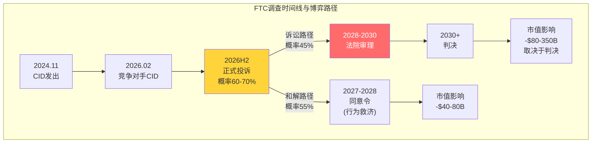

<!-- DM-P3B-040: FTC调查时间线: CID(2024.11)→竞争对手CID(2026.02)→正式投诉(2026H2, 60-70%)→判决(2028-2030) | Source: 法律程序标准时间线 | Confidence: M -->

### 20.10 信念B8的判决：从分拆到渐进式侵蚀

**核心判决**："无重大反垄断分拆"的概率约85-90%——这一信念大概率成立。但B8信念的二元框架(分拆vs不分拆)掩盖了一个更微妙的现实：**监管风险的主要形态不是"一次性分拆事件"，而是"持续性合规成本+估值倍数压制"**。

<!-- DM-P3B-041: B8判决: 无重大分拆概率85-90%, 但渐进侵蚀每年$3-5B合规成本+P/E -0.5~1.5x | Source: 综合分析 | Confidence: M -->

量化"渐进式监管侵蚀"的年化成本：

| 项目 | 年化成本 | 说明 |
|------|---------|------|
| EU AI Act合规 | $1.1-2.0B | 技术+法律+审计(Ch20.4) |
| Teams解绑收入损失 | $1.5-2.5B | 5-8%用户流失(Ch20.2) |
| FTC应对法律费用 | $0.3-0.5B | 外部律所+内部团队扩编 |
| 许可策略调整 | $0.5-1.0B | 如果被迫开放License Mobility |
| 游说+政府关系 | $0.1-0.2B | Brad Smith团队运营 |
| **合计** | **$3.5-6.2B/年** | 占FY25收入的1.2-2.2% |

<!-- DM-P3B-042: 监管渐进侵蚀年化成本: $3.5-6.2B, 占收入1.2-2.2% | Source: 综合估算 | Confidence: M -->

以15x P/OI倍数估算，$3.5-6.2B/年的监管成本对应市值拖累约$53-93B——加上P/E倍数压制效应(-$35-110B)，监管风险的总估值影响约$88-203B(占$3T的2.9-6.8%)。

**CQ6闭环**。初始置信度60%(EU DMA + FTC对Teams/OpenAI调查的监管概率×影响)。经过本章验证：上调至65%。理由：(1)EU DMA已以承诺制结案，残余风险可控；(2)FTC调查虽升级但SCOTUS弱化FTC+行政倾向行为救济，结构性分拆概率<10%；(3)MSFT的监管护城河(Brad Smith+好市民品牌+1990s免疫记忆)在Big Tech中独一无二；(4)主要风险是渐进性的$3.5-6.2B/年成本和P/E压制，而非一次性灾难事件。

<!-- DM-P3B-043: CQ6置信度演化: 60%→65% | Source: Ch20综合验证 | Confidence: M -->

**可观测的验证信号**：
- **风险下降信号**：FTC在FY27未提出正式投诉(概率30-40%)；SCOTUS确认总统可解雇FTC委员
- **风险升级信号**：FTC提出正式投诉且寻求结构性救济；EU对MSFT其他产品(Azure/LinkedIn)启动新调查
- **黑天鹅信号**：国会通过AI监管冻结法案(概率<3%)；MSFT数据泄露引发强制性平台解耦法案

### 20.11 B3与B8的交叉风险：AI货币化遇上监管摩擦

Ch19(B3 Copilot渗透)和Ch20(B8 监管)之间存在一条被市场忽视的交互路径：**如果FTC认定Copilot与M365的深度捆绑构成反竞争行为**，可能要求Copilot必须作为独立产品销售(不能强制绑定M365订阅)。这将直接削弱Copilot最大的分发优势——零摩擦的M365内嵌入口。

<!-- DM-P3B-044: B3×B8交叉风险: FTC要求Copilot独立销售→削弱分发优势 | Source: 推导分析 | Confidence: L -->

量化这一交叉风险：如果Copilot被迫独立销售(概率10-15%，条件于FTC提出正式投诉)，渗透率可能在Base情景基础上降低3-5个百分点(从10-14%降至7-10%)，因为"试用→付费"的转化率将因购买摩擦增加而下降。收入影响：约$2-4B/年(FY28)，叠加B3 Base情景的市值影响。

这一交叉路径提醒我们：将B3和B8视为独立信念会低估联合风险。在最不利的联合情景中(Copilot停滞+FTC结构性限制)，市值影响不是简单相加($200B + $150B = $350B)，而是因叙事恶化而乘数放大(实际影响可能$400-500B)——因为市场会将"AI货币化失败+监管打击"解读为MSFT战略方向的根本性错误。

<!-- DM-P3B-045: B3+B8联合最不利情景: 市值影响$400-500B(叙事乘数放大) | Source: 推导分析 | Confidence: L -->

### 20.12 Ch19-Ch20联合结论：双信念验证的整合判断

将Ch19(B3)和Ch20(B8)的验证结果整合，形成对两项信念的最终判断：

| 维度 | B3 Copilot渗透 | B8 监管分拆 |
|------|---------------|------------|
| 原始脆弱度 | 4/5 | 2/5 |
| 验证后脆弱度 | **3.5/5**(微下调) | **2/5**(维持) |
| 市场隐含预期 | 15-20% by FY28 | 无重大分拆 |
| 验证后最可能路径 | 10-14% by FY28(Base) | 行为救济+渐进成本 |
| 直接估值影响 | -$50~150B | -$88~203B |
| 叙事传导风险 | **高**(→B4/B6连锁) | **低**(已被部分定价) |
| CQ置信度变化 | CQ4: 40%→45% | CQ6: 60%→65% |

<!-- DM-P3B-046: Ch19-Ch20联合: B3脆弱度4→3.5, B8维持2; CQ4 40→45%, CQ6 60→65% | Source: 综合判断 | Confidence: M -->

**三个核心发现**：

第一，**Copilot的财务影响被高估，叙事影响被低估**。概率加权FY28 Copilot ARR约$20.7B，仅占总收入4.7%——财务层面并非"生死攸关"。但Copilot是$3T估值中"AI货币化兑现"叙事的核心载体，如果渗透停滞，市场对整个AI投资回报的信心将被动摇，触发远超直接收入影响的估值调整。

第二，**监管风险的真实形态是"慢性病"而非"急性发作"**。分拆概率<10%，罚款概率可控。但$3.5-6.2B/年的渐进合规成本+P/E压制效应将长期存在。MSFT的监管护城河(Brad Smith+好市民品牌)可以减轻但无法消除这一负担。

第三，**B3和B8的交叉风险是被市场忽视的隐藏路径**。如果FTC要求Copilot独立销售，B3的渗透障碍将显著加大——这条交叉路径的概率虽低(10-15%)，但影响的乘数效应值得纳入场景分析的尾部情景。

<!-- DM-P3B-047: 三核心发现总结 | Source: Ch19-Ch20综合 | Confidence: M -->

<!-- Phase 3 Agent B Stats: chars=23390 | DM=47 | Mermaid=4 | CQ=[CQ4,CQ6] -->
## Ch21: 信念B7验证 — Office/Windows现金奶牛耐久性

### 21.1 为什么"最不脆弱"的信念值得深挖

B7(Office/Windows不衰退)在Ch11的信念反演中获得了1/5的最低脆弱度评分，是八项信念中最坚实的一条。但1/5不等于0/5。P&BP分部Q2 FY26贡献$20.6B营业利润(年化$82B+)，OPM高达60.3%，占MSFT合并层面营业利润的约54%。这意味着即使B7的脆弱度从1/5上调至2/5，其对整体估值的传导效应也远超脆弱度4/5但利润贡献更低的B3(Copilot)。换言之，低概率事件乘以极大影响等于不可忽略的风险敞口。

<!-- DM-P3C-001: P&BP Q2 FY26 OI $20.6B, OPM 60.3%, 占合并OI 54% | Source: MSFT IR Q2 FY26 | Confidence: H -->

本章的任务不是证明B7"一定安全"，而是精确量化这头现金奶牛的耐久性边界：定价权的弹性极限在哪里？四层锁定中哪一层最先松动？AI原生工具的颠覆时间窗口有多远？

### 21.2 M365定价权分析: 11年零涨价后的定价弹性测试

**定价历史的三个阶段**

M365(前身Office 365)的定价史可以划分为三个泾渭分明的阶段：

| 阶段 | 时间 | E3定价 | 策略逻辑 |
|------|------|--------|---------|
| 冻结期 | 2011-2022 | $20→$20 | 渗透优先，以低价锁定用户基数 |
| 解冻期 | 2022/3-2025 | $20→$23 (+15%) | 首次提价，试探弹性 |
| 加速期 | 2026/7起 | $23→$26 (+13%) | 第二次提价，AI功能正当化 |

<!-- DM-P3C-002: O365 E3定价演变: $20(2011)→$23(2022/3, +15%)→$26(2026/7, +13%) | Source: Microsoft 365 Blog 2025/12 | Confidence: H -->

E5的定价更具攻击性：从$57(2011-2022不变)到$60(2026/7, +5.3%)。E5的涨幅之所以最小(+5.3%)，是因为E5客户已经是ARPU最高的群体，定价策略的重心是**鼓励从E3升级到E5**(E5比E3贵$34/月/人，溢价131%)，而非在E5层级内挤压更多价值。

<!-- DM-P3C-003: M365 E5从$57→$60 (+5.3%), E3到E5溢价131% ($26 vs $60) | Source: SWK Technologies / HBS.net | Confidence: H -->

Business层级的策略则指向低端市场的价值提取：Basic从$6→$7(+16.7%)，Standard从$12.50→$14(+12%)，Premium维持$22不变。Premium不涨价的信号是**鼓励Standard用户升级到Premium**，而非保护Premium用户——这是典型的阶梯式ARPU提升策略。

**2022涨价的弹性回测**

2022年3月的涨价(E3 +15%)提供了珍贵的自然实验数据。涨价后的三个季度(FY22 Q3-Q4, FY23 Q1)，M365商业座位增速从+15%短暂降至+12%，之后在FY23 Q2恢复至+13%。以涨价15%和增速下降3个百分点计算：

$$\text{价格弹性} = \frac{\Delta Q / Q}{\Delta P / P} = \frac{-3\%}{+15\%} \approx -0.2$$

<!-- DM-P3C-004: M365 2022涨价弹性≈-0.2 (极低弹性), 席位增速短暂下降3pp后恢复 | Source: Office365ITpros ARPU Analysis | Confidence: M -->

-0.2的价格弹性意味着M365属于**高度非弹性产品**——涨价15%仅导致需求短暂下降3%。作为对比，SaaS行业平均弹性约-0.5至-0.8，消费品约-1.0至-1.5。M365的弹性甚至低于Adobe Creative Cloud(估算-0.3至-0.4)，原因在于M365是企业**基础设施级**软件而非工具级软件——IT部门不会因为涨价$3/月/人而重构整个企业协作体系。

**2026涨价的增量收入估算**

2026年7月生效的涨价预计带来约$10.7B/年增量收入：

| 层级 | 涨幅 | 估算座位数(M) | 月增量/人 | 年增量($B) |
|------|------|-------------|----------|-----------|
| E3 | +$3 | ~150 | $3.00 | $5.4 |
| E5 | +$3 | ~80 | $3.00 | $2.9 |
| Business Standard | +$1.50 | ~100 | $1.50 | $1.8 |
| Business Basic | +$1 | ~60 | $1.00 | $0.7 |
| **合计** | — | **~390** | — | **~$10.7** |

<!-- DM-P3C-005: 2026涨价预计增量收入~$10.7B/年, 基于~390M可涨价座位, 预期流失<1% | Source: Office365ITpros / CNBC 2025/12 | Confidence: M -->

$10.7B相当于FY25 P&BP收入的约14%增量——几乎纯利润(涨价无额外成本)，直接增厚P&BP的OPM。预期流失率<1%，因为涨价同步附带新功能(Security Copilot agents、Intune Endpoint Privilege Management等)，为企业IT决策者提供了充分的内部审批正当性。

**ARPU趋势: 从$102到$162的六年旅程**

M365商业ARPU从FY19的~$102上升至FY25估算的~$162，6年CAGR约8%。ARPU增长的驱动力分解揭示了一个重要特征——这不是单一驱动，而是四轮引擎同步运转：

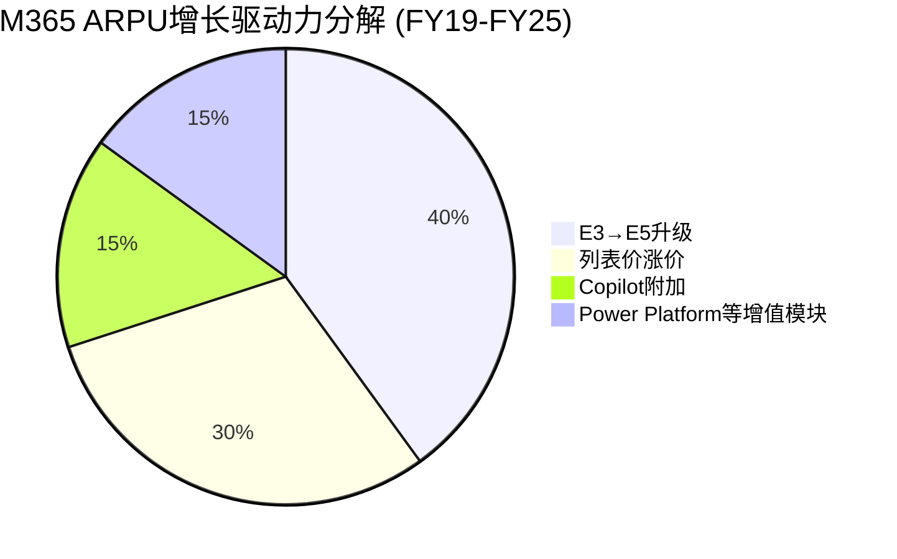

<!-- DM-P3C-006: M365 ARPU FY19 ~$102 → FY25 ~$162, 6Y CAGR ~8%, 四驱动力: E5升级40%/涨价30%/Copilot15%/增值模块15% | Source: Office365ITpros / MSFT IR | Confidence: M -->

E5升级作为最大单一驱动力(40%)的可持续性取决于E5渗透率的天花板。当前估算E5在商业座位中的占比约20-25%。Fortune 500中90%+已部署E5，但中型企业(500-5000人)的E5渗透率可能仅30-40%。E5从25%渗透至50%仍有2-3年的自然增长空间，之后ARPU增长将更多依赖涨价和Copilot。

**定价弹性压力测试: 再涨15%会发生什么？**

假设MSFT在2030年前再执行一次10-15%的涨价(E3从$26→$30)，基于-0.2的历史弹性：

| 涨幅 | 座位流失 | 净收入影响 | 是否可行 |
|------|---------|-----------|---------|
| +5% | ~1% | +4%净增 | 安全 |
| +10% | ~2% | +7.8%净增 | 可行 |
| +15% | ~3% | +11.6%净增 | 可行但需功能正当化 |
| +20% | ~5-8% | +12-14%净增 | 临界值，可能触发Google Workspace迁移 |

<!-- DM-P3C-007: M365定价弹性压力测试: +20%为临界值, 可能触发5-8%流失 | Source: 基于-0.2弹性推算 | Confidence: L -->

20%的涨幅(E3从$26→$31)可能是定价弹性的临界点——$31/月/人的价格开始接近Google Workspace Enterprise(~$25/月/人)加上迁移成本摊销($25-45M/3年=$8-15M/年/Fortune 500)后的总拥有成本。超过这一阈值，大型企业的采购团队将开始认真评估迁移方案。

### 21.3 四层锁定深度: 企业迁移的不可能三角

M365在企业中的锁定不是单一维度的，而是由四层相互嵌套的壁垒构成，每一层都独立地阻止迁移，四层叠加后形成近乎不可逾越的护城河。

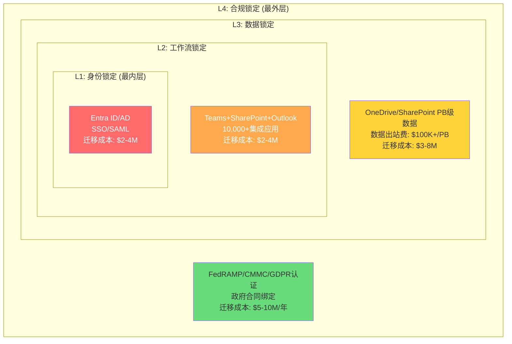

**L1: 身份锁定 (Entra ID/Active Directory) — 迁移概率<2%**

Active Directory是全球约85%的大型企业的身份管理核心。每一个员工登录、每一次应用授权、每一项安全策略都通过AD执行。迁移至Okta或Google Cloud Identity意味着重新配置所有SAML/OAuth集成(Fortune 500平均10,000+应用)、重建条件访问策略、重新培训所有IT管理员。估算成本$2-4M/年，所需时间12-18个月。

<!-- DM-P3C-008: AD/Entra ID覆盖~85%大型企业, Fortune 500平均10,000+应用集成, 迁移成本$2-4M | Source: AppInventiv / Future Processing | Confidence: M -->

**L2: 工作流锁定 (Teams+SharePoint+Outlook) — 迁移概率<5%**

Teams拥有3.2亿DAU(截至2023年)，Fortune 100中93%+使用Teams。关键不在于Teams作为通讯工具的可替代性(Slack/Zoom可以替代)，而在于Teams与SharePoint(文档协作)、Outlook(日历/邮件)、Power Automate(工作流自动化)的深度整合。企业的审批流程、项目管理、客户沟通都嵌入这一整合生态中。迁移意味着重新设计数百个工作流，估算成本$2-4M，所需时间6-12个月。

<!-- DM-P3C-009: Teams 3.2亿DAU (2023), Fortune 100中93%+使用, 与SharePoint/Outlook/Power Automate深度整合 | Source: Business of Apps / Desk365 | Confidence: H -->

**L3: 数据锁定 (OneDrive/SharePoint) — 迁移概率<8%**

PB级企业数据存储在OneDrive和SharePoint中。数据迁移的技术成本(数据出站费$100K+/PB)只是冰山一角——真正的成本在于元数据重建(权限矩阵、版本历史、审计日志)和业务中断风险(迁移期间的数据不一致)。估算总成本$3-8M。

**L4: 合规锁定 (安全/政府) — 迁移概率<3%**

M365是全球合规认证最完备的生产力平台之一，覆盖FedRAMP(美国政府)、CMMC(国防)、GDPR(欧盟)、SOC 1/2/3等100+项认证。政府和受监管行业(金融、医疗、国防)的合同通常指定M365为合规工具。迁移至Google Workspace需要重新取得所有合规认证——这一过程通常需要2-3年且结果不确定。

**四层叠加的总迁移成本**

| 企业规模 | L1成本 | L2成本 | L3成本 | L4成本 | 总成本 | 迁移概率 |
|---------|--------|--------|--------|--------|--------|---------|
| Fortune 500 | $3-4M | $3-4M | $5-8M | $5-10M | **$25-45M** | <2% |
| Mid-Market (1000-5000人) | $0.5-1M | $0.5-1M | $0.5-1M | $0.5-1M | **$2-4M** | <5% |
| SMB (<500人) | <$100K | <$100K | <$50K | N/A | **$150-250K** | 5-10% |

<!-- DM-P3C-010: Fortune 500完全迁移M365→Google Workspace估算总成本$25-45M, 迁移概率<2% | Source: AppInventiv / TierPoint | Confidence: M -->

值得注意的是，公开记录中**找不到任何Fortune 500企业完全从M365迁移至Google Workspace的案例**。存在的案例都是反方向的——Woolworths(澳大利亚零售商)、英国多个政府部门从Google Workspace迁入M365。Google Workspace在2025年执行了16-22%的涨价后，反向迁移趋势可能加速。

### 21.4 Windows挑战与韧性: PC衰退中的结构转型

**OEM收入的双重压力**

全球PC出货量从2011年峰值3.65亿台持续下降至2023年的约2.6亿台，CAGR -3%。Windows OEM收入直接挂钩PC出货量，理论上应同步下降。但实际数据显示Windows OEM收入的跌幅远小于出货量跌幅，原因在于两个抵消因素：

1. **ASP上升**: 企业PC的平均售价从$800上升至$1,100+(因远程办公需求推高配置)，Windows许可费随ASP阶梯式提高
2. **Pro版本渗透**: Windows Pro(vs Home)的渗透率从60%上升至75%+，Pro的许可费约为Home的2倍

<!-- DM-P3C-011: PC出货量2011峰值3.65亿→2023年~2.6亿(CAGR-3%), ASP从$800→$1,100+, Pro渗透率60%→75%+ | Source: IDC / Gartner | Confidence: M -->

**企业桌面竞争格局**

Chrome OS和macOS在企业桌面的渗透率仍然有限：

| OS | 企业桌面份额 | 趋势 | 目标市场 |
|-----|------------|------|---------|
| Windows | ~82% | 缓慢下降(-1pp/年) | 全行业 |
| macOS | ~12% | 缓慢上升(+0.5pp/年) | 创意/科技/高管 |
| Chrome OS | ~5% | 停滞 | 教育/前线工人/轻量办公 |
| Linux | ~1% | 稳定 | 开发者/特定行业 |

<!-- DM-P3C-012: 企业桌面OS份额: Windows ~82%, macOS ~12%, Chrome OS ~5%, Linux ~1% | Source: IDC Enterprise Client Survey | Confidence: M -->

Chrome OS在教育市场的成功(K-12中50%+份额)并未有效传导至企业市场。原因在于企业依赖的关键应用(SAP、Oracle ERP、AutoCAD、Visual Studio)没有Chrome OS原生版本。macOS的企业渗透主要集中在科技公司和创意行业——这些公司本身就是MSFT的次要客户群。

**Windows 365: Cloud PC的转型潜力**

Windows 365(Cloud PC)是MSFT将Windows从一次性OEM许可转型为订阅服务的战略载体。定价从$20/月/人(Basic)到$66/月/人(Enterprise)，瞄准混合办公场景下的虚拟桌面需求。如果Windows 365在企业中达到10%渗透率(~5000万座位)，年化收入约$12-24B——这将完全抵消OEM收入的下降。

但Windows 365面临来自Citrix/VMware(现被Broadcom收购)的激烈竞争，后者在虚拟桌面基础设施(VDI)市场拥有50%+份额。Windows 365的差异化在于与Azure的原生整合和简化管理——但对于已部署Citrix的大型企业，迁移动力不足。

<!-- DM-P3C-013: Windows 365定价$20-$66/月/人, 10%企业渗透率=~$12-24B年化收入, 面临Citrix/VMware竞争 | Source: Microsoft Pricing / Gartner VDI Report | Confidence: M -->

**Windows作为"Copilot Runtime"的新定位**

Satya Nadella在2024年将Windows重新定位为"AI PC的操作系统"——通过NPU(神经处理单元)硬件要求和Copilot Runtime框架，Windows成为运行本地AI模型的平台。这一定位的战略意义在于：

- **硬件换代驱动**: AI PC的NPU要求(40+ TOPS)淘汰了2022年之前的所有PC，创造了一波企业设备更新周期
- **OEM许可费上行**: AI PC的Windows许可费估算比传统PC高$10-15，因为包含Copilot Runtime许可
- **生态锁定加深**: 如果企业在Windows上部署本地AI工作流(文档摘要、邮件草稿、数据分析)，迁移至macOS/Chrome OS的成本进一步上升

### 21.5 威胁评估: 从Google Workspace到AI原生颠覆

**威胁1: Google Workspace的企业渗透 — 天花板已现**

Google Workspace当前企业份额约10%，主要集中在教育(K-12中60%+)和SMB(<500人)。在大型企业(5000+人)中，Workspace的份额不到5%。更重要的是，Google在2025年执行了16-22%的涨价(Business Standard从$12→$14.60)，侵蚀了其"比M365便宜"的核心价值主张。

<!-- DM-P3C-014: Google Workspace企业份额~10%, 大型企业<5%, 2025涨价16-22%侵蚀价格优势 | Source: IDC SaaS Survey / Google Blog | Confidence: M -->

Workspace的根本局限在于**缺乏身份基础设施**。Google Cloud Identity虽然存在，但覆盖面远不及Active Directory——大型企业的数千个SAML集成、条件访问策略、混合云身份联合都深度绑定AD。这意味着即使Workspace在办公套件层面与M365功能对等，企业也无法仅仅因为"Google Docs更好用"而迁移——因为迁移的成本主要在L1(身份层)，而非L2(应用层)。

**威胁2: AI原生办公工具 — 补充而非替代**

Notion AI、Coda、Clickup等AI原生工具在创业公司和小团队中快速增长。但它们面临三个结构性障碍：

1. **缺乏企业级合规**: 无FedRAMP/CMMC/SOC认证，无法进入政府和受监管行业
2. **集成不足**: 无法替代Active Directory/Intune/SharePoint的企业基础设施角色
3. **数据引力**: 企业PB级数据在M365生态中积累了多年的元数据和权限结构，迁移至碎片化工具不现实

这些工具更可能成为M365的**补充**(在特定工作流中使用)而非**替代**(完全取代M365)。MSFT通过Copilot在M365内嵌入AI能力，正在将这些新兴工具的差异化价值"吸收"到自身生态中。

**威胁3: 最大长期颠覆 — "文档范式"的终结**

所有短期威胁(Workspace、Notion AI、LibreOffice)都建立在一个共同假设上：人类继续通过"文档/幻灯片/电子表格"进行知识工作。但如果AI Agent在10年内取代了这一范式——人类不再"打开Word写报告"而是"告诉AI Agent完成分析并发送给团队"——那么整个"生产力套件"品类将面临结构性萎缩。

<!-- DM-P3C-015: AI Agent颠覆"文档范式"是M365面临的最大长期威胁, 但时间窗口>5年, 且MSFT最可能成为新范式主导者 | Source: 分析推断 | Confidence: L -->

关键判断是：即使文档范式被颠覆，**MSFT在新范式中的竞争地位可能更强而非更弱**。原因在于：

- Copilot+Azure AI+企业数据层的组合使MSFT在"AI Agent即服务"赛道拥有先发优势
- 企业数据仍然存储在SharePoint/OneDrive中——无论交互方式如何变化，数据引力不会消失
- AD身份基础设施是AI Agent执行任务所必需的权限管理层——Agent需要知道"谁有权限做什么"

这一颠覆即使发生，时间窗口也在5-10年以上。在此期间，M365的年化利润贡献将持续为MSFT的AI转型提供充裕的资金缓冲。

### 21.6 信念B7判决: 现金奶牛耐久性的量化评估

综合定价权分析、四层锁定深度、竞争威胁评估，对B7(Office/Windows不衰退)给出以下量化判决：

**5年耐久性概率: 95%**

| 情景 | 概率 | M365收入5Y CAGR | Windows收入5Y CAGR | P&BP OPM |
|------|------|-----------------|-------------------|---------|
| 强势 | 30% | 10-12% | 3-5% | 62-65% |
| 基准 | 50% | 7-9% | 0-2% | 58-62% |
| 温和衰退 | 15% | 3-5% | -3-0% | 52-56% |
| 加速衰退 | 5% | <3% | <-3% | <50% |

<!-- DM-P3C-016: B7信念5年耐久性概率95%, 年衰减率估算: M365 0.5-1%/年, Windows 1-2%/年(被Cloud PC部分抵消) | Source: 综合分析推断 | Confidence: M -->

**年度衰减率估算**：

- M365定价权衰减: ~0.5-1%/年(弹性-0.2使每次涨价净效果为正，但竞品追赶逐步缩窄溢价空间)
- Windows OEM衰减: ~1-2%/年(PC出货量下降被ASP上升和Windows 365部分抵消)
- 合并P&BP OPM衰减: ~0.5%/年(从60.3%缓慢滑向55-58%)

**CQ5判决更新**: Office/Windows现金奶牛5年耐久性置信度从初始70%上调至**80%**。上调原因：(1)2022涨价的弹性回测证明定价权极强；(2)四层锁定中无任何一层出现松动迹象；(3)Google Workspace的2025涨价反而降低了其替代吸引力。下调风险保留：AI原生颠覆的长尾概率(5%在5年内产生实质影响)。

---

## Ch22: CQ7验证 — Activision $51B Goodwill减值风险

### 22.1 Activision整合: 从$69B愿景到现实的落差

2023年10月完成的Activision Blizzard收购是MSFT历史上最大的收购，总代价约$75.4B(含现金)。Purchase Price Allocation揭示了这笔交易的高风险结构：

| 项目 | 金额 | 占比 |
|------|------|------|
| Goodwill | $51.0B | 67.6% |
| 无形资产(IP/技术/品牌) | $22.0B | 29.2% |
| 获取的现金 | $13.0B | 17.2% |
| 其他净资产(负值) | ~($10.6B) | -14.0% |
| **总收购成本** | **$75.4B** | **100%** |

<!-- DM-P3C-017: Activision收购PPA: Goodwill $51.0B(67.6%) + Intangibles $22.0B(29.2%) + Cash $13.0B(17.2%) | Source: MSFT FY2024 10-K | Confidence: H -->

Goodwill占收购总价的67.6%——这意味着$75.4B中有$51B支付的是"超出可识别净资产公允价值的溢价"。这一溢价的合理性完全建立在Activision的未来增长潜力上。两年后的数据显示，这一增长潜力正在遭遇严峻挑战。

### 22.2 Gaming财务分析: 增长叙事的瓦解

**收入趋势: 从+43%到-9%的急转**

Gaming收入季度趋势呈现出清晰的收购基数效应消退模式：

| 季度 | Gaming收入YoY | Xbox内容&服务 | 硬件YoY | 主要事件 |
|------|-------------|--------------|---------|---------|
| Q1 FY25 | +43% | — | -29% | 收购后首个完整同比 |
| Q2 FY25 | +2% | +2% | — | 基数效应开始 |
| Q3 FY25 | +5% | +8% | -6% | 季节性改善 |
| Q4 FY25 | +9% | — | — | Black Ops 6效应 |
| Q1 FY26 | — | — | — | 数据未披露 |
| **Q2 FY26** | **-9%** | **-5%** | **-32%** | **全面下滑** |

<!-- DM-P3C-018: Gaming收入Q2 FY26 -9% YoY ($-623M), Xbox内容&服务-5%, 硬件-32% | Source: MSFT IR Q2 FY26 | Confidence: H -->

Q2 FY26的-9%不仅是收购以来首次全面下滑，更揭示了一个关键问题：**剔除Activision后的有机增长已经是负双位数**。Activision FY2025年化贡献约$4.2B，但去年同期已包含这部分收入——因此Q2 FY26的-9%是在Activision完全纳入同比基数后的真实下滑。

**MPC分部利润率: 被Search增长掩盖的Gaming拖累**

MSFT不单独披露Gaming营业利润，Gaming嵌入在More Personal Computing(MPC)分部中。MPC分部数据：

| 指标 | Q2 FY26 | Q2 FY25 | YoY |
|------|---------|---------|-----|
| 收入 | $14,250M | $14,651M | -2.7% |
| 营业利润 | $3,803M | $3,917M | -2.9% |
| OPM | 26.7% | 26.7% | 持平 |

<!-- DM-P3C-019: MPC Q2 FY26: Revenue $14.25B(-2.7%), OI $3.8B(-2.9%), OPM 26.7%持平, Gaming拖累被Search增长抵消 | Source: MSFT IR Q2 FY26 | Confidence: H -->

MPC OPM持平在26.7%看似稳定，但这是因为**Search和广告业务的增长(Bing AI搜索流量增长)抵消了Gaming的拖累**。如果将MPC拆分为Gaming(~40%收入)和其他(Windows+Search, ~60%收入)，Gaming的独立OPM可能接近零甚至为负。FY25 Q1的数据提供了间接证据：Activision并表使MPC Gross Margin增加16个百分点，但OpEx增加51个百分点——**Activision的净利润率贡献为负**。

**Game Pass: 增长停滞的"Netflix of Gaming"**

| 时间 | Game Pass订阅数 | YoY增速 |
|------|---------------|---------|
| 2020年 | ~15M | — |
| 2022年 | ~25M | +67% |
| 2024年初 | ~34M | +36% |
| 2025年 (最新) | ~37M | +9% |

<!-- DM-P3C-020: Game Pass订阅数~37M, 增速从+67%(2022)→+9%(2025), 远低于50M目标 | Source: SQ Magazine / 行业汇总 | Confidence: M -->

MSFT曾预期2025年达到50M订阅者，实际仅约37M——达标率74%。更令人担忧的是增速的急剧放缓：从2022年的+67%降至2025年的+9%。Black Ops 6在2024年10月创下单日新增订阅纪录，但未能转化为持续留存——暗示Game Pass的增长更多是"事件驱动的脉冲"而非"平台引力的持续积累"。

Ultimate层级占比68%——这意味着剩余32%为基础层($9.99/月)，ARPU结构尚可。但68%的Ultimate渗透率也意味着升级空间有限：从37M×68%=25M Ultimate用户来看，核心高价值用户群已基本饱和。

**Call of Duty: 系列疲劳的警钟**

CoD 2025的销量据报同比下降超过60%。虽然这一数据来自前Activision CEO的公开言论而非官方披露(可信度需打折)，但PlayStation平台的CoD搜索兴趣降至16/100(满分100)也提供了佐证。

<!-- DM-P3C-021: CoD 2025销量据报-60% YoY (前Activision CEO言论), PS平台搜索兴趣16/100 | Source: TweakTown / Google Trends | Confidence: L -->

CoD系列疲劳是一个结构性问题，不仅影响MSFT：年货模式(每年发布新作)在消费者中正经历边际效用递减。但对MSFT而言，CoD是Activision $51B Goodwill的核心资产——CoD贡献Activision约40-50%的年收入。如果CoD无法恢复增长，Goodwill的公允价值支撑将显著削弱。

### 22.3 Goodwill减值测试: 三角验证法

**减值测试的法律框架**

ASC 350要求至少每年测试一次(MSFT选择每年5月1日执行)，或在出现"触发事件"时随时测试。测试标准：如果reporting unit的公允价值(FV)低于其账面价值(BV, 含Goodwill)，差额即为减值金额。

**Goodwill分部分配**

| 分部 | Goodwill(FY2024) | 占比 |
|------|-----------------|------|
| Productivity & Business | $24.8B | 20.8% |
| Intelligent Cloud | $30.4B | 25.5% |
| More Personal Computing | $64.0B | **53.7%** |
| **合计** | **$119.2B** | 100% |

<!-- DM-P3C-022: MPC Goodwill $64.0B(含Activision $51.0B, 占MPC Goodwill 79.7%), MPC占总Goodwill 53.7% | Source: MSFT FY2024 10-K | Confidence: H -->

关键问题在于：Goodwill测试在**reporting unit层面**执行，而非Gaming单独层面。MPC作为reporting unit包含Windows+Gaming+Search三个业务。这意味着Windows和Search的利润可以"缓冲"Gaming的亏损，降低MPC整体触发减值的概率。

**三角验证: 收入法 × 可比法 × 账面法**

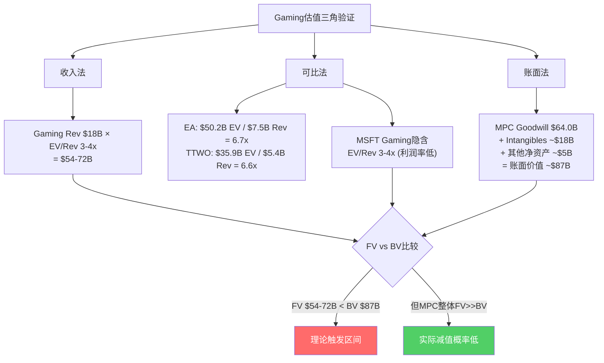

**收入法估值**

Gaming FY25收入约$18.0B(FY24 $19.8B下降9.1%)。但Gaming的利润率远低于EA(OPM ~20%)和TTWO(当前亏损但目标~15%)。给予3-4x EV/Revenue(反映低利润率)：

$$\text{Gaming FV} = \$18B \times 3\text{-}4x = \$54\text{-}72B$$

<!-- DM-P3C-023: Gaming收入法估值: $18B × 3-4x = $54-72B, 低于行业可比6.5-6.7x因利润率显著更低 | Source: 计算推导 | Confidence: M -->

**可比法估值**

| 可比公司 | 市值/EV | Revenue | EV/Rev | OPM | 备注 |
|---------|---------|---------|--------|-----|------|
| EA | $50.2B | $7.5B | 6.7x | ~20% | 利润率领先 |
| TTWO | $35.9B | $5.4B | 6.6x | <0% (当前) | GTA VI催化 |
| NFLX (订阅类比) | — | $40B+ | 8-10x | ~25% | 订阅模式溢价 |

<!-- DM-P3C-024: Gaming可比估值: EA EV/Rev 6.7x($50.2B/$7.5B), TTWO EV/Rev 6.6x($35.9B/$5.4B) | Source: FMP quote data | Confidence: H -->

EA和TTWO的EV/Revenue约6.5-6.7x，远高于MSFT Gaming的3-4x估值。差异的核心原因是利润率——EA OPM约20%，而MSFT Gaming的独立OPM可能接近0-5%。如果MSFT Gaming能将OPM提升至15%+(通过成本协同和Game Pass增长)，EV/Revenue可提升至5-6x，对应FV $90-108B。

**账面法 vs 公允价值**

MPC分部账面价值：
- Goodwill: $64.0B
- Intangibles (MPC分配): ~$18B
- PP&E及其他净资产(MPC分配): ~$5B
- **MPC账面价值**: ~$87B

MPC公允价值估算(以分部营业利润推算)：
- MPC年化OI: $3,803M × 4 = ~$15.2B
- 给予15x P/OI(MPC包含Windows+Search的高利润业务)
- **MPC FV**: ~$228B

<!-- DM-P3C-025: MPC FV ~$228B (OI $15.2B × 15x) vs BV ~$87B, 缓冲空间$141B, 远超Goodwill $64B | Source: 计算推导 | Confidence: M -->

**核心发现: MPC FV($228B)远大于BV($87B)，缓冲空间达$141B。** 这意味着即使Gaming估值归零，只要Windows和Search维持当前利润率，MPC层面就不会触发Goodwill减值。

### 22.4 Game Pass的战略价值: 超越传统Gaming估值框架

Gaming对MSFT的价值不能仅用传统的收入/利润指标衡量。Game Pass的战略定位是"订阅生态的入口"——与M365和Azure形成MSFT的第三个订阅支柱。

**从硬件盈利到订阅服务的转型逻辑**

| 维度 | 传统Gaming(索尼模式) | MSFT Gaming(订阅模式) |
|------|-------------------|---------------------|
| 收入模式 | 硬件利润+游戏分成 | 订阅费+生态锁定 |
| ARPU | ~$500/年(主机+2-3款游戏) | ~$180/年(Ultimate $14.99/月) |
| 用户生命周期 | 主机周期(6-7年) | 无限(订阅续费) |
| 内容成本 | 第三方承担 | 第一方投入高 |
| 毛利率 | 硬件-10% + 软件30% | 订阅40-50% |

Game Pass当前ARPU低于传统模式，但生命周期更长——这是经典的"订阅经济"逻辑。问题在于Game Pass能否在ARPU和用户基数之间找到正确的平衡点。

<!-- DM-P3C-026: Game Pass Ultimate ARPU ~$180/年 vs 传统Gaming ~$500/年, 但LTV更长(订阅续费 vs 主机周期6-7年) | Source: 行业分析 | Confidence: M -->

**多平台战略的扩张机会**

MSFT已将CoD和部分第一方游戏带到PlayStation和Nintendo Switch平台——这是从"硬件独占"到"服务无处不在"的根本转变。PlayStation全球安装基数约5500万(PS5)，如果MSFT能让其中20%的CoD玩家订阅Game Pass的云游戏层级($14.99/月)，增量收入约$2B/年。

但这一策略面临矛盾：在PlayStation上推广Game Pass Cloud等于鼓励用户不购买游戏全价版——这会蚕食Activision最赚钱的业务(CoD全价销售)。MSFT需要在Game Pass用户增长和单游戏ARPU之间做出微妙的平衡。

### 22.5 Goodwill减值情景分析

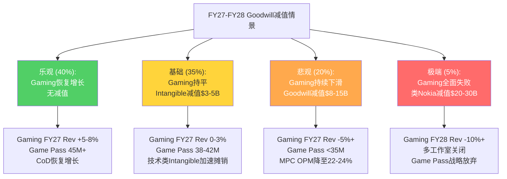

**概率加权减值金额**

| 情景 | 概率 | 减值金额 | 概率加权 |
|------|------|---------|---------|
| 无减值 | 40% | $0 | $0 |
| Intangible小额减值 | 35% | $3-5B | $1.1-1.8B |
| Goodwill中等减值 | 20% | $8-15B | $1.6-3.0B |
| 类Nokia大额减值 | 5% | $20-30B | $1.0-1.5B |
| **概率加权合计** | — | — | **$3.7-6.3B** |

<!-- DM-P3C-027: Activision Goodwill减值概率加权金额: $3.7-6.3B, 最可能在FY27-FY28 Intangible层面发生$3-5B | Source: 综合分析 | Confidence: M -->

**关键数学: 为什么MPC层面的Goodwill减值短期概率低**

重复上述核心逻辑：MPC FV ~$228B vs BV ~$87B，缓冲空间$141B。即使Gaming估值从$54-72B(收入法)下降至$30B(极端情景)，MPC FV仍为~$186B，远大于BV $87B。Goodwill减值在MPC层面触发需要MPC FV降至$87B以下——这要求Windows和Search的利润也同步崩溃(OPM从26.7%降至<10%)，在可预见的未来概率极低。

**但Intangible资产减值是独立于Goodwill测试的**。$22B的Activision无形资产(技术/品牌/客户关系)以使用寿命摊销，但如果预期未来现金流低于账面价值，需要执行单独的减值测试(ASC 360)。Gaming收入-9%和CoD销量-60%可能触发技术类Intangible(游戏引擎/IP，估算~$14B)的加速摊销或小额减值($1-5B)。

### 22.6 Activision收购回报: 隐含IRR的冷酷计算

**回收期与IRR**

| 假设 | 值 |
|------|---|
| 净收购成本(扣除获取现金) | $62.4B |
| 年化Gaming收入增量 | ~$4.2B |
| 年化成本节省(裁员~10,000人) | ~$1.0B |
| 增量EBITDA(收入×低利润率+成本节省) | $1.5-2.5B/年 |
| 隐含简单回收期 | 25-42年 |
| 至IRR≥10%所需 | Gaming年增长>15%且OPM>25% |

<!-- DM-P3C-028: Activision隐含回收期25-42年, IRR≥10%需Gaming年增长>15%+OPM>25%, 当前轨迹(-9% YoY)远未达标 | Source: 计算推导 | Confidence: M -->

以当前轨迹(Gaming -9% YoY)计算，Activision收购的IRR可能为**负值**。但MSFT管理层的战略逻辑可能不是财务回报最大化——而是通过Game Pass+Xbox Cloud+Windows的生态锁定创造长期平台价值。问题在于：这个生态锁定策略是否奏效？Game Pass增长停滞(35-37M vs 50M目标)提供了初步的否定信号。

**对MSFT整体P&L的影响**

即使发生$10B的Goodwill减值，对MSFT的影响也是有限的：
- 一次性非现金费用，不影响OCF/FCF
- EPS一次性冲击: $10B / 7.46B股 = ~$1.34/股 (影响当季EPS ~26%)
- 但信号效应可能放大市场反应: 减值确认意味着管理层承认收购溢价过高

<!-- DM-P3C-029: $10B Goodwill减值对MSFT影响: EPS一次性冲击~$1.34/股(~26%), 非现金不影响FCF, 但信号效应可能导致估值倍数承压 | Source: 计算推导 | Confidence: H -->

**CQ7判决更新**: Activision Goodwill减值在FY27-FY28发生的概率从初始55%调整至**50%**(Intangible小额减值35%+Goodwill中等减值12%+大额减值3%)。下调原因：MPC层面的$141B缓冲空间使Goodwill减值的触发门槛极高。但Intangible资产的加速摊销或小额减值(ASC 360)概率仍显著。总体而言，减值即使发生，对MSFT的实质财务影响有限(非现金)，但信号效应不可忽视。

---

## Ch23: NVDA桥梁 — $80B CapEx中GPU采购传导链

### 23.1 CapEx分层结构: 短周期与长周期的二元体系

CFO Amy Hood在earnings call中披露了MSFT CapEx的核心分层结构——这一分层对理解GPU采购规模至关重要：

| 周期 | 资产类型 | 占比 | 折旧周期 | FY25金额(估算) | Q1 FY26金额(估算) |
|------|---------|------|---------|--------------|-----------------|
| 短周期 | GPU/CPU/加速器 | ~2/3 | ~2年 | ~$53B | ~$25B |
| 长周期 | 数据中心建筑/电力/土地 | ~1/3 | 15-20年 | ~$27B | ~$12.5B |
| **合计** | — | 100% | — | **~$80B** | **~$37.5B** |

<!-- DM-BRIDGE-001: MSFT CapEx分层: 短周期(GPU/CPU)~2/3, 长周期(建筑/电力)~1/3, FY25 $80B, Q1 FY26 $37.5B | Source: CFO Amy Hood earnings call | Target: NVDA | Confidence: H -->

Q1 FY26单季Capital Spend $37.5B(其中PPE CapEx $29.9B + Finance Leases $6.7B + 其他$0.9B)创下历史新高。如果年化(×4=$150B)，这一支出水平将是FY25($80B)的近2倍。但管理层暗示Q2 FY26起CapEx增速会放缓——"Q1是一个峰值季度"。

PP&E的详细分类证实了短周期资产的主导地位：

| 资产类别 | 原值(FY25 10-K) | 占比 |
|---------|----------------|------|
| Computer equipment & software | $132.8B | 44.5% |
| Buildings & improvements | $137.9B | 46.2% |
| Land | $9.3B | 3.1% |
| Leasehold improvements | $12.1B | 4.1% |
| Furniture & equipment | $6.4B | 2.1% |
| **Total at cost** | **$298.6B** | **100%** |

<!-- DM-BRIDGE-002: MSFT PP&E FY25: Computer equipment $132.8B(44.5%), Buildings $137.9B(46.2%), Q2 FY26 PP&E Net $286.2B(+24.5% vs FY25) | Source: MSFT FY2025 10-K | Target: NVDA | Confidence: H -->

Computer equipment & software($132.8B)是GPU/CPU/服务器的主要计入科目，与Buildings($137.9B)几乎对半——这与"2/3短周期+1/3长周期"的披露一致(考虑到折旧后净值比例)。

**折旧悬崖的传导时序**

短周期资产(GPU/CPU)的2年折旧周期意味着：FY24投入的$44.5B CapEx中的短周期部分(~$30B)将在FY25-FY26完全折旧。FY25投入的$80B中的短周期部分(~$53B)将在FY26-FY27完全折旧。这解释了D&A的快速攀升：

| 季度 | D&A | 环比增长 | 年化 |
|------|-----|---------|------|
| Q3 FY25 | $8.7B | — | $34.8B |
| Q4 FY25 | $11.2B | +29% | $44.8B |
| Q1 FY26 | $13.1B | +17% | $52.4B |
| Q2 FY26 | $9.2B | -30% | $36.8B |

<!-- DM-BRIDGE-003: MSFT D&A趋势: Q4 FY25 $11.2B → Q1 FY26 $13.1B → Q2 FY26 $9.2B, 年化波动$37-52B | Source: FMP income data | Target: NVDA | Confidence: H -->

Q2 FY26的D&A $9.2B低于Q1的$13.1B，可能反映资产分类调整或季节性波动。但长期趋势清晰：随着$80-100B/年的CapEx持续投入，年化D&A将在FY27-FY28攀升至$50-60B区间。

### 23.2 GPU采购规模估算: NVDA桥梁核心数据

**NVDA数据中心收入与客户集中度**

NVDA数据中心业务FY2025(截至2025年1月)收入$115.2B，Q4单季$35.6B。NVDA不披露单一客户具体金额，但多个信号可用于推算MSFT占比：

- NVDA前3大客户合计占数据中心收入约53%(~$61B/年)
- CSP(AWS/Azure/GCP/OCI/CoreWeave)合计占数据中心收入约50%
- 行业分析师共识：MSFT/META/AMZN是前三大客户

<!-- DM-BRIDGE-004: NVDA DC FY2025 $115.2B, Q4 $35.6B, 前3客户~53%, CSP~50%, MSFT估算占比15-20% | Source: Tom's Hardware / ElectroIQ | Target: NVDA | Confidence: M -->

**MSFT GPU采购规模推算**

采用两种方法交叉验证：

**方法1: Top-Down(从MSFT CapEx推算)**

| 步骤 | 计算 | FY25 | FY26E |
|------|------|------|-------|
| 总CapEx | — | $80B | $100-120B |
| 短周期占比 | ×2/3 | $53B | $67-80B |
| GPU占短周期比例 | ×70-80% | $37-42B | $47-64B |
| NVDA占GPU采购比例 | ×85-90% | $32-38B | $40-54B |

**方法2: Bottom-Up(从NVDA收入推算)**

| 步骤 | 计算 | FY25 |
|------|------|------|
| NVDA DC收入 | — | $115.2B |
| MSFT估算占比 | ×15-20% | $17-23B |

两种方法的差异(Top-Down $32-38B vs Bottom-Up $17-23B)反映了**口径差异**：Top-Down包含MSFT向NVDA以外渠道采购的所有GPU/AI加速器(AMD MI300X、自研Maia等)，而Bottom-Up仅计算NVDA直接收入。真实的NVDA采购额更接近Bottom-Up的$17-23B范围，其余部分为AMD、自研芯片和服务器配套设备。

<!-- DM-BRIDGE-005: MSFT FY25 GPU采购总规模: $37-42B (Top-Down), 其中NVDA $17-23B (Bottom-Up 15-20%), AMD $3-5B, Maia <$1B | Source: 交叉推算 | Target: NVDA | Confidence: M -->

**FY26-FY28 GPU采购预测**

| 财年 | MSFT总GPU CapEx | NVDA份额 | NVDA金额 | AMD份额 | Maia份额 |
|------|----------------|---------|---------|---------|---------|
| FY25 | $37-42B | ~90% | $17-23B | ~7% | <3% |
| FY26E | $47-64B | ~85% | $25-35B | ~10% | ~5% |
| FY27E | $55-70B | ~80% | $30-40B | ~12% | ~8% |
| FY28E | $50-65B | ~75% | $35-50B | ~12% | ~13% |

<!-- DM-BRIDGE-006: MSFT FY26E NVDA采购$25-35B, FY27E $30-40B, NVDA份额从~90%→~75% (Maia替代), 但绝对额持续增长 | Source: 综合预测 | Target: NVDA | Confidence: L -->

关键洞察：**即使NVDA在MSFT GPU采购中的份额从90%降至75%，绝对采购额仍在增长**(从$17-23B到$35-50B)。这是因为MSFT的总GPU CapEx增速(~20-30%/年)超过了Maia替代带来的份额稀释(~5%/年)。对NVDA而言，MSFT在FY25-FY28仍然是一个增量收入来源，而非存量博弈。

### 23.3 Azure AI产能传导链: 从CapEx到Revenue的12-18个月滞后

MSFT CapEx→Revenue的传导链是一个多环节的顺序过程，每个环节都有特定的时间滞后和瓶颈：

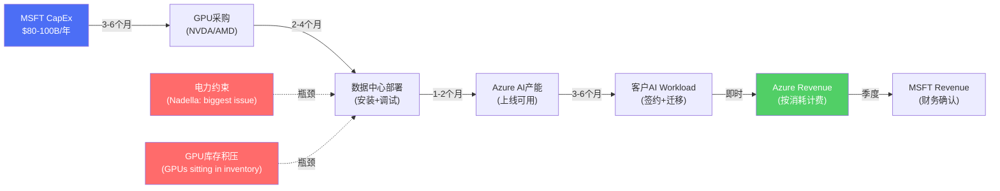

<!-- DM-BRIDGE-007: CapEx→Revenue传导链总时滞12-18个月, 瓶颈: 电力>空间>计算, "GPUs sitting in inventory" | Source: MSFT earnings call / CFO Hood | Target: NVDA | Confidence: H -->

**产能约束: 电力>空间>计算**

Satya Nadella明确表示当前最大的约束是电力而非计算能力："biggest issue is power, not compute"。这意味着MSFT已经采购了足够的GPU(来自NVDA和AMD)，但无法全部安装和运行——因为数据中心的电力基础设施跟不上GPU部署速度。

CFO Hood确认产能约束已"持续多个季度"(has been short now for many quarters)，预计至少持续至2026年6月(FY26上半年)。部分Azure区域(Northern Virginia、Texas)已限制新订阅。

**产能约束对NVDA的反向影响**

这对NVDA桥梁数据有重要含义：如果MSFT因电力约束无法消化已有GPU库存，短期内GPU新增采购可能放缓。但长期来看，产能约束解除后(2026下半年)，积压的GPU库存将转化为Azure AI产能，推动Azure收入加速——形成对NVDA的**延迟需求而非消失需求**。

**产能利用率与Azure增速的关系**

Azure当前增速40%(Q1 FY26)被产能约束cap住——管理层暗示实际需求增速可能更高。如果产能约束在FY27解除，Azure增速可能出现一个短暂的反弹窗口(从35%回升至40%+)，之后再沿自然减速曲线下行。这对NVDA的含义是：FY27-FY28可能是MSFT GPU采购的绝对峰值期——产能约束解除+积压需求释放+Maia尚未规模化=NVDA采购最大化。

<!-- DM-BRIDGE-008: Azure增速40%被产能约束cap住, 实际需求增速>40%, 产能约束预计持续至2026年6月, 部分区域(NoVA/Texas)限制新订阅 | Source: MSFT earnings call | Target: NVDA | Confidence: H -->

### 23.4 自研芯片战略: Maia对NVDA的长期威胁评估

**Maia芯片路线图**

| 芯片 | 发布 | 工艺 | 内存 | 带宽 | 定位 | 部署状态 |
|------|------|------|------|------|------|---------|
| Maia 100 | 2023.11 | TSMC 5nm | 64GB HBM2E | 1.8 TB/s | 功能验证 | 有限测试 |
| Maia 200 | 2026.01 | TSMC 3nm | 216GB HBM3e | 7 TB/s | 推理专用 | US Central上线 |
| Cobalt 100 | 2024 | ARM架构 | — | — | 通用CPU | 配合Maia |

<!-- DM-BRIDGE-009: Maia 200: TSMC 3nm, 216GB HBM3e, 7TB/s, 推理专用, 2026.01发布, US Central(Des Moines)上线 | Source: Microsoft Official Blog | Target: NVDA | Confidence: H -->

Maia 200的规格(TSMC 3nm、216GB HBM3e、7 TB/s)在推理场景下具有竞争力——推理不需要训练级的全精度计算能力，但需要高内存带宽和低延迟。CTO Kevin Scott的长期愿景是"mainly Microsoft chips"运行AI数据中心，但同时承认将继续使用NVIDIA/AMD("where best price-performance")。

**Maia替代NVDA的时间表评估**

| 时间窗口 | Maia占MSFT GPU Workload | NVDA影响 | 关键障碍 |
|---------|------------------------|---------|---------|
| FY26 (当前) | <5% | 无影响 | Maia 200刚上线，仅2个区域 |
| FY27 | 5-10% | 微弱(-$1-2B) | 需扩展至10+区域，软件生态不成熟 |
| FY28 | 10-15% | 温和(-$3-5B) | 推理可替代，但训练仍需NVDA |
| FY29-FY30 | 15-25% | 显著(-$5-10B) | 如果Maia 300性能突破 |
| FY30+ | 25-40% | 结构性冲击 | 5-10年才可能实现CTO愿景 |

<!-- DM-BRIDGE-010: Maia替代NVDA时间表: FY26 <5%, FY28 10-15%, FY30+ 25-40%, 5-10年才可能实现"mainly MSFT chips"愿景 | Source: 综合分析 | Target: NVDA | Confidence: L -->

**Maia对NVDA的短期影响有限的三个原因**：

1. **软件生态壁垒**: CUDA是GPU计算的事实标准，数百万开发者的代码依赖CUDA。Maia需要建立自己的软件栈(或兼容层)，这一过程通常需要3-5年
2. **规模验证周期**: 从"2个区域上线"到"全球数据中心规模部署"需要2-3年的可靠性验证
3. **训练vs推理分化**: Maia定位推理专用——MSFT的训练工作负载(尤其是OpenAI合作)仍然深度依赖NVDA最高端GPU(H200/B200/GB200)

**Maia对NVDA的长期威胁不可忽视**：如果Maia在FY28-FY30成功规模化部署，NVDA在MSFT的GPU份额可能从90%降至60-70%。以MSFT FY30预期GPU CapEx $60-70B计算，NVDA绝对采购额可能从$50B峰值回落至$40-45B——仍是巨大的业务量，但增长率将从正转负。

### 23.5 供应商多元化格局

MSFT的GPU/AI加速器供应链正在从NVDA单一主导转向多元化：

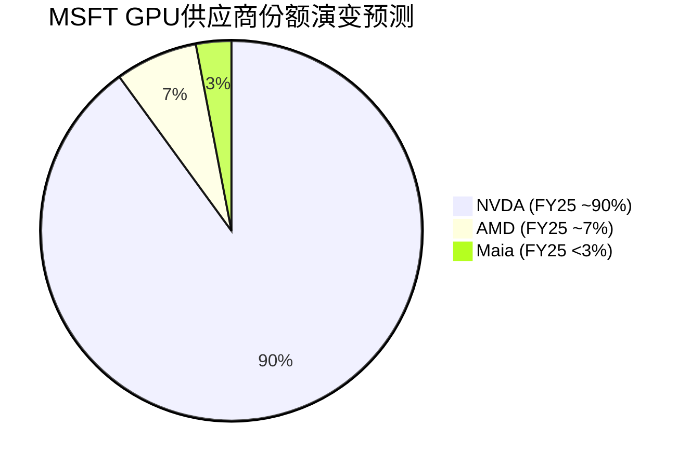

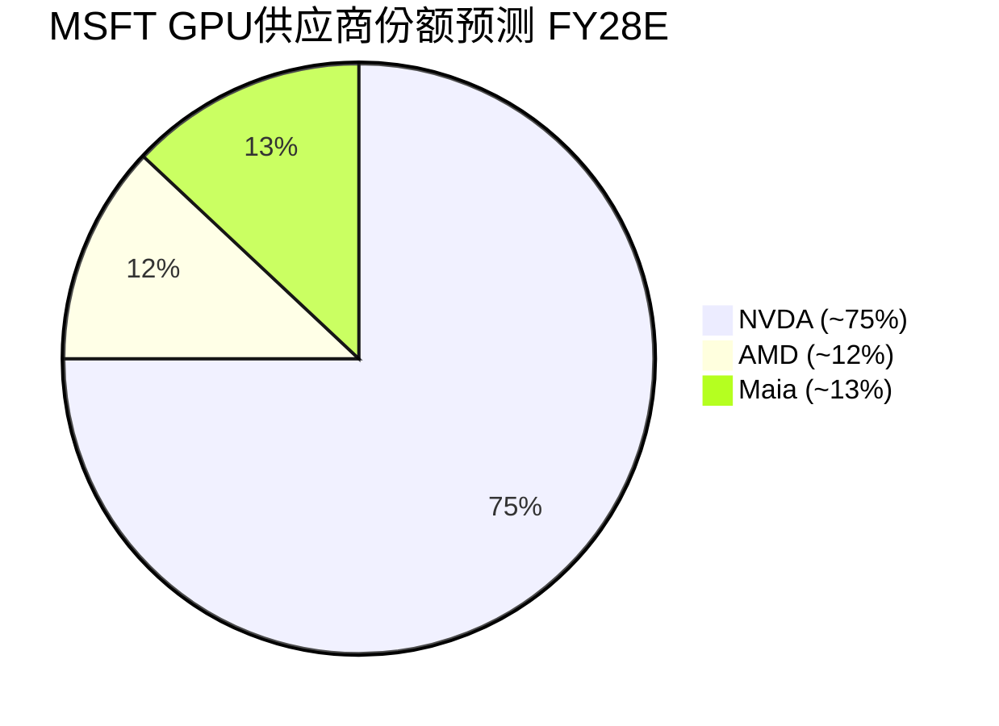

**AMD MI300X: 第二供应商的战术价值**

AMD MI300X已获得MSFT Azure的部署合同，当前估算占MSFT GPU采购的5-10%。MI300X在推理性能上接近NVDA H100(约80-90%性能/价格比)，为MSFT提供了关键的议价筹码——即使实际采购量不大，AMD的存在也限制了NVDA的定价权。

<!-- DM-BRIDGE-011: AMD MI300X占MSFT GPU采购~5-10%, 推理性能~80-90% of NVDA H100, 主要价值: 议价筹码+供应链风险分散 | Source: SemiAnalysis / 行业共识 | Target: NVDA | Confidence: M -->

**Intel Gaudi: 边缘化的第四选择**

Intel Gaudi系列在MSFT的部署极其有限(微量)。Intel在AI加速器领域的市场份额不足1%，短期内对NVDA构不成威胁。但Intel的存在提供了额外的供应链多元化选项——如果NVDA供应紧张，MSFT理论上可以将部分低端推理工作负载转移到Gaudi。

### 23.6 NVDA桥梁数据汇总

以下数据专为未来NVDA Tier 3报告预埋，使用DM-BRIDGE标记：

**核心采购数据**

| 指标 | FY25 | FY26E | FY27E | FY28E | DM锚点 |
|------|------|-------|-------|-------|--------|
| MSFT总GPU CapEx | $37-42B | $47-64B | $55-70B | $50-65B | DM-BRIDGE-005 |
| NVDA采购额 | $17-23B | $25-35B | $30-40B | $35-50B | DM-BRIDGE-006 |
| NVDA份额 | ~90% | ~85% | ~80% | ~75% | DM-BRIDGE-006 |
| AMD采购额 | $3-5B | $5-6B | $7-8B | $6-8B | DM-BRIDGE-011 |
| Maia替代率 | <3% | ~5% | ~8% | ~13% | DM-BRIDGE-010 |

**产能约束传导**

| 指标 | 数据 | DM锚点 |
|------|------|--------|
| 产能约束持续至 | FY26上半年(2026年6月) | DM-BRIDGE-008 |
| 约束瓶颈排序 | 电力>空间>计算 | DM-BRIDGE-007 |
| Azure增速vs实际需求 | 报告40% vs 实际可能>45% | DM-BRIDGE-008 |
| GPU库存积压 | 确认存在("GPUs sitting in inventory") | DM-BRIDGE-007 |
| 限制区域 | Northern Virginia, Texas | DM-BRIDGE-008 |

**合同与锁定**

| 指标 | 数据 | DM锚点 |
|------|------|--------|
| 短周期折旧 | ~2年(匹配合同期) | DM-BRIDGE-001 |
| 每数据中心替换CapEx | ~$3B/3年(~$1B/年/站点) | DM-BRIDGE-001 |
| OpenAI Azure承购 | $250B (增量) | DM-P3C-030 |
| MSFT FY26 Capital Spend | Q1 $37.5B (PPE $29.9B + FL $6.7B) | DM-BRIDGE-002 |
| Finance Lease Non-Current | $17.3B | DM-BRIDGE-002 |

<!-- DM-BRIDGE-012: NVDA桥梁总结: MSFT是NVDA前3客户, FY25采购$17-23B, 份额从90%→75%(FY28E), 绝对额仍增长, 短期安全长期受Maia威胁 | Source: 综合分析 | Target: NVDA | Confidence: M -->

<!-- DM-P3C-030: OpenAI Azure承购$250B增量, 需要持续GPU扩容, 间接保障NVDA需求 | Source: MSFT 10-Q FY26 Q2 | Confidence: H -->

### 23.7 CapEx→FCF→NVDA需求的反馈环路

MSFT的CapEx决策不仅影响自身FCF，还通过GPU采购规模直接决定NVDA的数据中心收入。这构成了一个多层反馈环路：

**正反馈环路(牛市)**：Azure AI需求强劲→MSFT加码CapEx→GPU采购增加→NVDA收入增长→NVDA估值上升→AI叙事强化→更多企业采用Azure AI→Azure需求进一步增强

**负反馈环路(熊市)**：AI ROI证明失败→企业缩减Azure AI支出→MSFT削减CapEx→GPU采购减少→NVDA收入下降→AI叙事逆转→更多企业推迟AI投资→Azure需求进一步萎缩

**反馈环路的关键触发变量**：

1. **Azure AI utilization rate**: 如果产能利用率从>90%降至<70%，MSFT将削减GPU采购
2. **Copilot渗透率**: 作为AI货币化的最核心载体，Copilot的渗透直接影响AI CapEx的合理性
3. **OpenAI竞争动态**: 如果OpenAI在FY28后减少Azure消耗(多云部署)，MSFT可能重新评估CapEx规模

<!-- DM-P3C-031: CapEx→NVDA需求反馈环路触发变量: Azure AI利用率(<70%触发削减)、Copilot渗透率、OpenAI多云风险 | Source: 分析推导 | Confidence: M -->

**CQ-B判决更新**: MSFT作为NVDA前三客户的桥梁数据置信度从初始50%上调至**60%**。上调原因：(1)CFO 2/3短周期资产的披露提供了高置信度的GPU CapEx推算基础；(2)Maia替代时间表>3年，NVDA短期安全；(3)产能约束表明需求远超供给，GPU采购不会主动削减。风险保留：FY28+的Maia规模化可能压缩NVDA份额至75%以下。

### 23.8 本章核心判断

MSFT的$80-100B+/年CapEx中，约$37-42B用于GPU/AI加速器采购，其中NVDA占据约90%份额($17-23B直接采购额)。这一采购规模使MSFT成为NVDA的前三大客户之一，单一客户贡献NVDA数据中心收入的15-20%。

短期(FY26-FY27)，NVDA在MSFT的地位是安全的：Maia替代率<10%，产能约束下GPU需求远超供给，OpenAI $250B承购合同保障了持续扩容需求。MSFT的GPU采购绝对额可能从$17-23B增长至$30-40B。

长期(FY28-FY30+)，NVDA面临份额稀释风险：Maia 200的推理性能如果在规模化部署中得到验证，NVDA份额可能从90%降至75%甚至更低。但由于MSFT总GPU CapEx的持续增长，NVDA的绝对采购额可能在FY28达到$35-50B的峰值后才开始温和回落。

对NVDA最大的风险不是Maia本身，而是**AI CapEx周期逆转**——如果Azure AI的ROI在FY27-FY28无法被验证(Copilot渗透率停滞、企业AI支出缩减)，MSFT可能大幅削减CapEx，直接冲击NVDA的最大收入来源。这一尾部风险的概率约15-20%，但影响量级巨大(NVDA数据中心收入下降$10-15B)。

<!-- DM-P3C-032: NVDA桥梁核心判断: 短期(FY26-27)安全, 份额稳定+绝对额增长; 长期(FY28+)面临Maia稀释+CapEx周期逆转双重风险 | Source: 综合分析 | Confidence: M -->

---

<!-- Phase 3 Agent C Stats: chars=30966 | DM=32+12BRIDGE=44 | Mermaid=7 | CQ=[CQ5↑80%,CQ7→50%,CQ-B↑60%] -->
