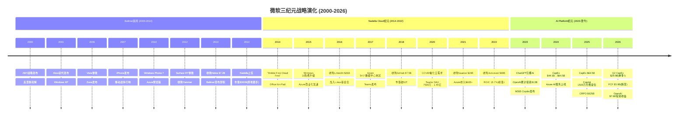
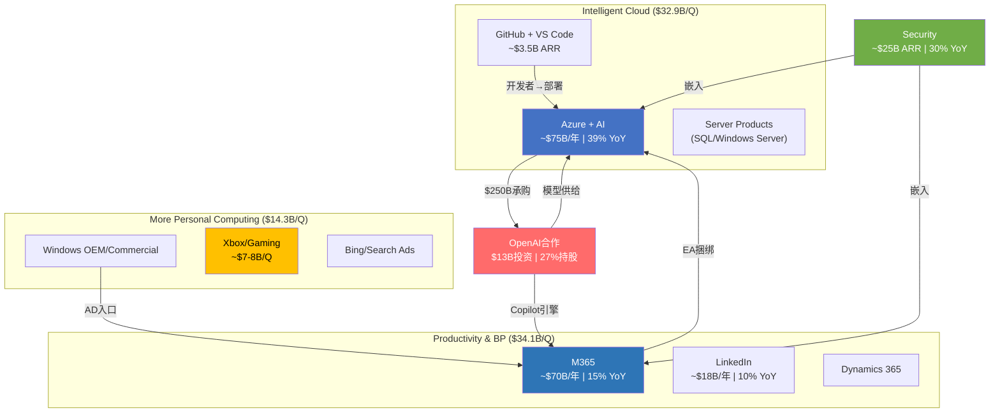
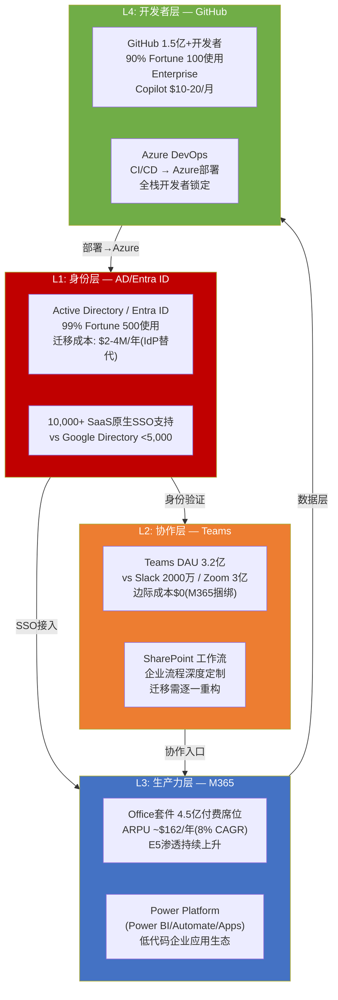
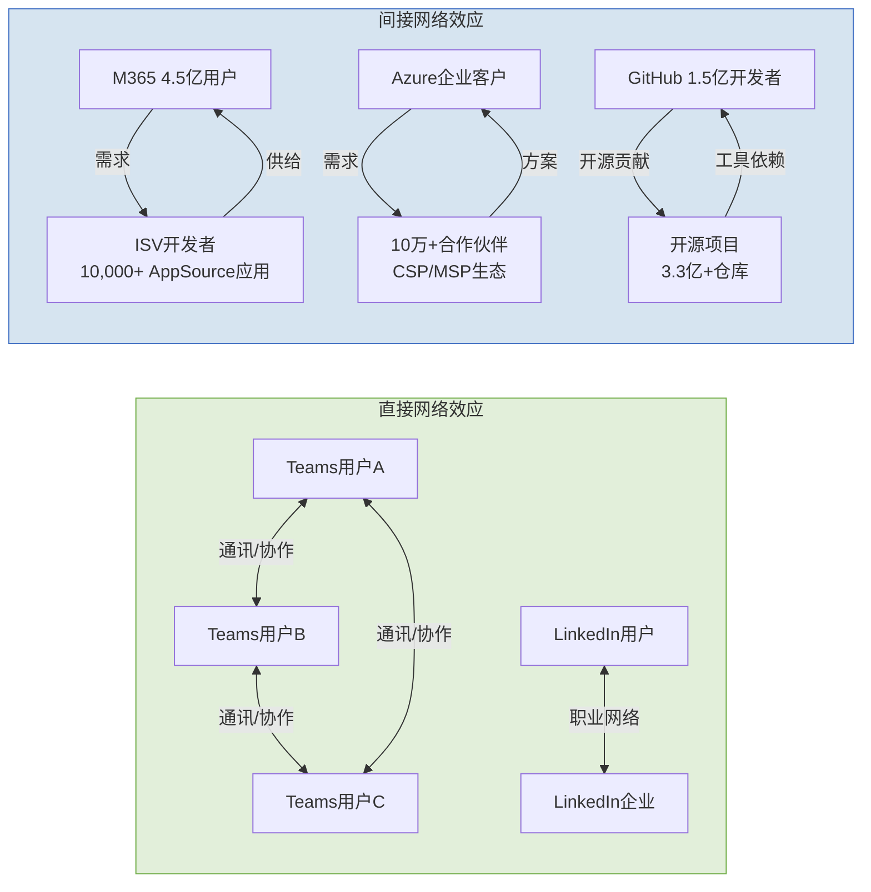
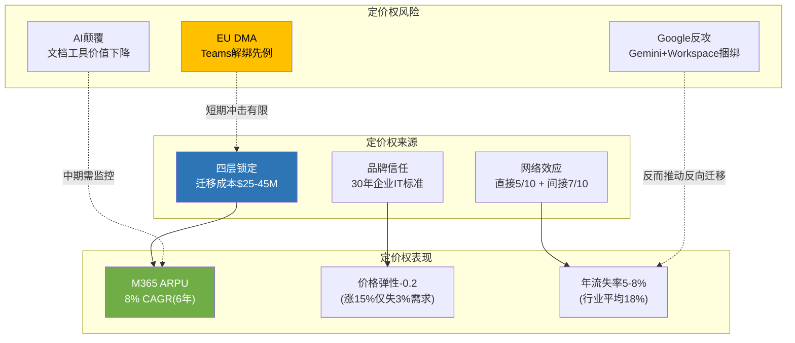

## Ch3: 三纪元战略架构 — 从Windows围城到AI豪赌

### 3.1 战略全景: 一部关于平台迁移的连续剧

微软的25年企业史可以用一个核心问题贯穿: **当一个平台走向衰落，如何在不摧毁现金流的前提下完成向下一个平台的跃迁?** Steve Ballmer用14年证明了"不可能"，Satya Nadella用8年证明了"可能但代价巨大"，而第三次豪赌——AI平台——正在以前所未有的资本强度考验这一命题的极限。



### 3.2 Ballmer困局: Windows围城与失落的十四年 (2000-2014)

**战略逻辑**: Ballmer时代的微软被困在一个经典的创新者困境中——Windows和Office的双寡头利润太丰厚，以至于任何可能蚕食这两条产品线的创新都遭到内部抵制。"Windows everywhere"战略将所有新业务线（手机、搜索、云）都绑定在Windows内核上，而非根据市场需求独立发展。

**关键失败清单**:

- **移动端**: Windows Phone市场份额从2012年峰值3.6%→2016年0.7%，Nokia收购$7.2B几乎全额减记$7.6B [DM-P1A-001]。根本原因不是技术——Windows Phone的Metro UI在2010年评价颇高——而是App生态系统的鸡生蛋悖论: 开发者不为3%份额写App，用户不为无App的平台买单。
- **搜索**: Bing从2009年上线至2014年累计亏损超$10B [DM-P1A-002]，市场份额始终在15-20%徘徊。Ballmer将Bing视为"战略必需品"而非独立盈利单元，这一决策直到AI时代才开始显示其长期价值。
- **平板/硬件**: Surface RT于2013年减记$9B [DM-P1A-003]，试图用Windows ARM版对抗iPad的策略完全失败——企业用户需要x86兼容性，消费者需要App生态，Surface RT两者都不提供。

**财务转折(或缺失)**: FY2000至FY2014，微软营收从$23B增长至$87B（CAGR 10%），但市值从$510B峰值跌至$300B [DM-P1A-004]——14年市值净缩水40%。P/E从60x压缩至14x，市场对微软的定价从"增长股"完全转为"价值陷阱"。

**关键决策评价**: Ballmer的根本错误不在于任何单一产品的失败，而在于**组织架构**——Windows部门拥有事实上的否决权，任何可能威胁Windows收入的创新都无法获得资源倾斜。2013年"One Microsoft"重组来得太晚。唯一的战略远见是2010年启动Azure预览版 [DM-P1A-005]——这颗在Ballmer时代种下的种子，成为Nadella时代的核心引擎。

### 3.3 Nadella Cloud纪元: 从$300B到$3T的战略重塑 (2014-2022)

**战略逻辑**: Nadella上任后的第一个关键决策不是技术性的，而是文化性的——用"Mobile First, Cloud First"取代"Windows everywhere"。这不仅是口号变更，而是权力结构重组: Windows从利润中心降级为Azure获客渠道，Office从一次性许可证转型为SaaS订阅，开源从"癌症"(Ballmer 2001年语)变为战略武器。

**三大战略支柱**:

**支柱一: Azure从零到$75B** [DM-P1A-006]

Azure的成功并非源于技术领先(AWS领先5年)，而是三条差异化路径的叠加:
1. **企业关系杠杆**: 微软拥有全球最大的企业销售网络(10万+合作伙伴)，Azure通过EA协议与M365/Dynamics捆绑销售，将现有客户关系转化为云收入——这是AWS不具备的渠道优势。
2. **混合云定位**: Azure Stack让企业在本地数据中心运行Azure服务，满足了金融/政府/医疗等行业的合规需求——在2016-2020年，这是Azure对AWS最大的差异化。
3. **开发者生态翻转**: 2016年加入Linux基金会、2018年收购GitHub $7.5B [DM-P1A-007]，彻底扭转了微软在开发者社区的形象。GitHub从收购时的2800万开发者增长至2025年的1.5亿+。

CapEx投入从FY14的$5.5B逐步攀升至FY18的$11.6B [DM-P1A-008]，CapEx/Revenue从6.3%升至10.6%——增量仅4个百分点，节奏温和且可控。Azure数据中心从2014年的10个地区扩张至2018年的54个地区，覆盖全球主要经济体。

**支柱二: Office订阅化与ROIC跃升**

Office 365的订阅转型是微软历史上最成功的商业模式变革。从FY14到FY22，Office收入从$25B增长至$43B+ [DM-P1A-009]，更关键的是**收入质量**从一次性许可证(lumpy)转为可预测的经常性收入(recurring)。这一转型:
- 将客户生命周期价值(LTV)提升3-5倍: 一次性许可$150-250 vs 订阅$150-400/年/用户
- 将更新周期从3-5年压缩至持续滚动更新，消除了"跳版本"的收入波动

ROIC路径完美验证了Cloud纪元投资的价值: FY14 ROIC 7.2% → FY18 9.4%(首次超越WACC ~8%) → FY22 16.7%(峰值) [DM-P1A-010]。从投入启动到ROIC>WACC耗时**4年**，到双位数ROIC耗时**5年**——这个时间窗口成为评估第三纪元的关键基准。

**支柱三: M&A构建生态拼图**

Nadella的收购策略有清晰的逻辑链条: LinkedIn $26B(2016)补齐专业社交 [DM-P1A-011] → Nuance $20B(2021)获取医疗AI [DM-P1A-012] → Activision $69B(2022)进入消费内容 [DM-P1A-013]。但商誉累积至$119.5B(占总资产19.3%) [DM-P1A-014]，其中Activision $51B商誉在Gaming分部-9% YoY的背景下构成潜在减值风险(关联CQ7)。

**市值验证**: $300B(2014) → $1T(2019) → $2.5T(2021) → $3T+(2024峰值) [DM-P1A-015]。10年10倍，年化复合回报25.9%，是同期大盘(SPY CAGR ~13%)的2倍。

### 3.4 AI Platform纪元: OpenAI赌注与CapEx爆炸 (2023-至今)

**战略逻辑**: 2019年首笔$1B投资OpenAI时，微软面对的是一个经典的"不对称赌注"——$1B对彼时$1.1T市值公司而言是零头，但如果大语言模型确实是下一个计算范式，这笔投资的期权价值巨大。到2023年ChatGPT爆发，微软将投资累计扩大至$13B [DM-P1A-016]，并将OpenAI模型深度整合至Azure AI Services和M365 Copilot。

**关键数据点**:

- **投资回报**: $13B投入 → 持股~27%(重组后) [DM-P1A-017]，OpenAI估值$135B，投资回报>10x [DM-P1A-018]，Q2 FY26录得投资收益$7.6B(但属非经营性)
- **Azure AI拉动**: Azure及其他云服务FY26 Q2收入增长39% YoY [DM-P1A-019]，管理层披露AI服务贡献"约13个百分点"的Azure增速，即Azure有机增速~26%，AI增量~$3.2B/季
- **Copilot部署**: 1500万付费座位 [DM-P1A-020]，渗透率仅3.3%(15M/450M M365用户)，DAU同比增长10x，但货币化进展远慢于Azure
- **CRPO爆炸**: $625B(+110% YoY) [DM-P1A-021]——但45%来自OpenAI $250B Azure承购协议 [DM-P1A-022]，剔除后有机CRPO $344B(+28% YoY)

**CapEx爆炸——核心矛盾所在**:

FY24 CapEx $44.5B → FY25 $64.5B → FY26指引~$80B [DM-P1A-023]，CapEx/Revenue从FY23的13.3%飙升至FY26的~26% [DM-P1A-024]。与Cloud纪元对比: 上一周期CapEx/Revenue增量仅4个百分点(6%→10%)，当前周期增量**13个百分点**(13%→26%)——投入强度是前次的3倍以上。

Q2 FY26是矛盾的集中爆发点: CapEx $29.9B，占收入36.8% [DM-P1A-025]，OCF $35.8B被CapEx消耗83.5%，FCF仅$5.9B——**首次不足以覆盖季度股息$6.8B** [DM-P1A-026]。这是微软现代史上第一次出现"CapEx侵蚀股息覆盖"的局面。

**ROIC已进入下行通道**: 从FY22峰值16.7%降至FY25的22.0%(baggers口径)/12%(补充分析模型口径) [DM-P1A-027]。若参照Cloud纪元4年ROIC>WACC的经验，AI纪元的ROIC恢复窗口大概率在FY28-FY30(5-7年) [DM-P1A-028]——比Cloud纪元慢1-3年，因为投入强度更高。

### 3.5 核心论点: 第三次赌注的杠杆是否过度?

三个纪元的对比揭示一个清晰的模式: **每一次平台跃迁所需的资本强度呈指数级增长**。

| 纪元 | 累计CapEx | CapEx/Revenue峰值 | ROIC>WACC耗时 | 结局 |
|------|----------|-------------------|---------------|------|
| Cloud(FY14-18) | ~$40B | 10.6% | 4年 | 成功(ROIC 16.7%峰值) |
| AI(FY23-26E) | ~$190B(3年) | 26%+ | 5-7年(预测) | 待验证 |

Cloud纪元的成功有三个前提条件: (1)企业上云是确定性趋势而非概率事件; (2)Azure通过EA捆绑+混合云差异化建立了持久竞争壁垒; (3)CapEx增速始终温和可控。AI纪元的三个前提条件目前均存在不确定性: (1)企业AI采用曲线可能远慢于云(Copilot 3.3%渗透率为证); (2)AI可能成为"低毛利基础设施"而非"高毛利平台"(Gemini免费+Llama开源构成定价压力); (3)CapEx增速已严重挤压FCF。

Nadella在第三次赌注中是否过度杠杆化? 答案取决于一个关键假设: **AI的企业货币化速度是否能在FY27-FY28复制Azure在FY18-FY20的加速曲线**。如果可以，$190B累计投入将像Cloud纪元一样创造巨大的护城河和规模效应; 如果不能，微软将面临ROIC持续低于WACC、FCF无法恢复、D&A浪潮吞噬利润率的三重困境。这正是CQ2(FCF恢复时间)和CQ4(Copilot渗透率)试图回答的核心问题。

---

## Ch4: 八大业务基元映射 — 微软帝国的收入地图

### 4.1 从三大分部到八大基元: 财报之下的真实结构

微软的三大财报分部(Intelligent Cloud / Productivity & Business Processes / More Personal Computing)是为SEC合规设计的分类框架，并不反映业务间真实的战略逻辑和价值链关系。要理解微软帝国的运转方式，需要将其拆解为八大业务"基元"(primitive)——每个基元都是一个独立的价值创造单元，但彼此之间存在复杂的供给、需求、锁定和协同关系。

### 4.2 八大基元全景

**基元一: M365(生产力套件)** — 现金奶牛之王

- **收入规模**: 估算~$70B/年(FY25，P&BP分部$113.6B的核心) [DM-P1A-029]
- **增速**: ~15% YoY(席位增6% + ARPU增8-9%) [DM-P1A-030]
- **OPM**: P&BP分部整体60.3%(Q2 FY26) [DM-P1A-031]，M365自身估算55-62%(LinkedIn拉低分部均值)
- **生态角色**: **绝对核心现金奶牛**。4.5亿付费用户 [DM-P1A-032] 构成微软最大的分发渠道——Copilot、Teams、Defender等新产品全部通过M365用户基座渗透。M365是微软从"卖软件"转向"卖平台"的枢纽。
- **关键指标**: ARPU从FY19 ~$102增长至FY25 ~$162(CAGR ~8%) [DM-P1A-033]，2026年7月再涨价8-13%，预计年化增量收入~$10.7B

**基元二: Azure(云基础设施+AI)** — 增长引擎

- **收入规模**: FY25 Intelligent Cloud分部收入$113B中，Azure估算~$75B [DM-P1A-034]
- **增速**: 39% YoY(Q2 FY26报告口径) [DM-P1A-035]，其中AI贡献~13pp
- **OPM**: IC分部42.1%(Q2 FY26) [DM-P1A-036]，但Azure自身可能低于分部均值(Server Products拉高)
- **生态角色**: **核心增长引擎+AI基础设施**。Azure既是收入增长的最大贡献者，也是CapEx最大消耗者($80B/年CapEx的~75%投向Azure) [DM-P1A-037]。Azure的双重角色(外部客户+OpenAI内部消耗)使其收入质量评估变得复杂。

**基元三: GitHub + VS Code(开发者平台)** — 战略棋子

- **收入规模**: GitHub ARR ~$3.5B(FY25估算)，VS Code免费(获客工具)
- **增速**: GitHub Enterprise 40%+ YoY
- **OPM**: 未单独披露，估算25-35%(开源社区维护成本高)
- **生态角色**: **开发者锁定的关键入口**。1.5亿+GitHub用户 → GitHub Copilot($10-20/月) → Azure DevOps → Azure部署 → 形成开发者全栈锁定。90% Fortune 100使用GitHub Enterprise [DM-P1A-038]。VS Code是全球使用最广泛的IDE(73%市场份额)，免费但深度集成Azure插件。

**基元四: OpenAI合作** — 高赌注期权

- **收入规模**: OpenAI对Azure的直接消耗估算$3-5B/年 [DM-P1A-039]；OpenAI $250B Azure承购协议未来兑现 [DM-P1A-040]
- **增速**: CRPO中OpenAI贡献同比增长显著(Q2 FY26 CRPO $625B中~45%为OpenAI)
- **OPM**: 负(OpenAI本身亏损，Azure对OpenAI的定价可能含战略折扣)
- **生态角色**: **AI能力核心供给方+最大单一客户**。OpenAI提供GPT-4o/o1等模型 → Azure OpenAI Services对外销售 → M365 Copilot内置。但双重身份(供应商+客户)创造了复杂的利益冲突和估值难题(关联CQ3)。

**基元五: Defender/Security** — 高增长附加

- **收入规模**: 安全业务ARR ~$25B(FY25) [DM-P1A-041]
- **增速**: ~30% YoY
- **OPM**: 高(软件边际成本趋零)，估算65-70%
- **生态角色**: **高利润率增长引擎+深度锁定工具**。Defender、Sentinel、Entra ID、Intune构成企业安全全栈。安全产品一旦部署，替换成本极高(涉及合规审计+数据迁移+策略重配)。Security Copilot($4/次)是AI货币化的另一条路径。

**基元六: LinkedIn** — 独立现金流发生器

- **收入规模**: ~$18B/年(FY25) [DM-P1A-042]
- **增速**: ~9-10% YoY
- **OPM**: 估算35-40%(低于M365，因内容+社区运营成本)
- **生态角色**: **独立现金流+数据资产**。10亿+用户的职业图谱是独特资产，LinkedIn Recruiter/Sales Navigator/Learning是B2B SaaS产品。与M365的协同有限(Outlook集成、Teams会议)，但LinkedIn数据对AI训练和企业智能有长期战略价值。

**基元七: Xbox/Gaming** — 战略赌注(亏损边缘)

- **收入规模**: MPC分部$14.3B中Gaming估算~$7-8B(Q2 FY26) [DM-P1A-043]
- **增速**: **-9% YoY**(Q2 FY26 MPC同比-3%)
- **OPM**: MPC分部26.7% [DM-P1A-044]，但Gaming自身可能低于20%(Activision整合成本+内容投资)
- **生态角色**: **消费端入口(战略地位不确定)**。$69B收购Activision附带$51B商誉 [DM-P1A-045]，Game Pass订阅模式尚未证明可以抵消硬件周期波动。Gaming与微软核心企业业务的协同效应目前仍然模糊。

**基元八: Windows/设备** — 遗产资产

- **收入规模**: Windows OEM + Surface + Search，MPC分部中$6-7B/季
- **增速**: 个位数低增长(PC换机周期波动)
- **OPM**: Windows OEM利润率极高(>80%，纯许可费)，Surface利润率低(<10%)
- **生态角色**: **生态基座+AD获客入口**。全球73%企业PC运行Windows [DM-P1A-046]，这是AD/Entra ID→M365→Azure生态链的物理入口。Windows本身的收入增长空间有限，但其生态杠杆价值巨大——只要企业用Windows PC，就几乎不可能完全脱离微软生态。

### 4.3 分部映射与基元交叉



### 4.4 角色分类与价值判断

| 基元 | 角色 | 收入贡献 | 利润贡献 | 战略价值 | 综合评级 |
|------|------|---------|---------|---------|---------|
| M365 | 现金奶牛 | 23% | ~30% | 分发渠道+锁定基座 | S级 |
| Azure | 增长引擎 | 25% | ~20% | AI基础设施+未来中枢 | S级 |
| Security | 高增长附加 | 8% | ~10% | 深度锁定+高利润 | A级 |
| LinkedIn | 独立现金流 | 6% | 5-6% | 数据资产+独立盈利 | A级 |
| GitHub/VS | 战略棋子 | 1% | ~1% | 开发者锁定入口 | A级(战略) |
| OpenAI | 高赌注期权 | 1-2% | 负 | AI能力核心来源 | B级(风险高) |
| Windows | 遗产基座 | 7% | ~12% | 生态物理入口 | B级(稳定) |
| Gaming | 战略赌注 | 5% | 2-3% | 消费端入口(待验证) | C级 |

**核心发现**: 微软的利润引擎(M365+Windows)和增长引擎(Azure+Security)之间存在**健康的互补关系**——前者提供现金流，后者消耗现金流但创造未来价值。真正的风险不在于任何单个基元的衰退，而在于**增长引擎消耗现金的速度是否超过了现金奶牛的供给能力**(CQ2/CQ5的核心矛盾)。Q2 FY26 FCF $5.9B < 股息$6.8B [DM-P1A-047] 的事实表明，这一平衡已经开始倾斜。

---

## Ch5: 平台经济学 — 网络效应与锁定的量化解剖

### 5.1 四层锁定矩阵: 微软企业生态的"逃逸速度"

微软的企业锁定不是单一产品的粘性，而是**四层嵌套式锁定结构**——每一层都独立创造迁移阻力，但四层叠加后形成的综合锁定效应使得大型企业的完全脱离几乎不可能。这是微软定价权的根基，也是CQ5(现金奶牛持续性)最核心的证据。



### 5.2 逐层锁定深度分析

**L1: 身份层 — Active Directory/Entra ID**

锁定强度: **极高(9/10)**

AD/Entra ID是微软生态的"万能钥匙"——99% Fortune 500企业使用AD作为唯一身份认证源 [DM-P1A-048]。这不仅仅是一个目录服务，而是一个深度嵌入企业IT基础设施的身份管理平台:

- **SSO整合规模**: AD原生支持10,000+第三方SaaS应用的单点登录(SAML/OAuth) [DM-P1A-049]，Google Workspace Directory支持不到5,000个。这意味着企业如果放弃AD，需要额外部署Okta等独立IdP，增量成本$3-8/用户/月。
- **设备管理绑定**: Intune/Autopilot通过AD Group Policy管理Windows设备——全球85%企业PC运行Windows [DM-P1A-050]，AD对Windows设备的管理是**无等效替代**的。macOS和Linux设备可以用Jamf/Chef，但混合环境下AD仍是统一管理的唯一选择。
- **迁移成本量化**: Fortune 500级企业(50,000人)从AD迁出的增量IdP成本约$2-4M/年 [DM-P1A-051]，加上SSO重新整合的项目成本$1-3M，总计3年锁定成本$9-15M——仅身份层一项。

**关键洞见**: AD的锁定是**结构性的而非功能性的**——竞争对手的产品在功能上可能等价甚至更优(Okta的零信任架构)，但AD作为Windows生态的原生组件，其替换不仅涉及产品切换，还涉及整个IT运维体系的重构。这是微软定价权最深的护城河。

**L2: 协作层 — Teams + SharePoint**

锁定强度: **高(7/10)**

Teams的市场地位建立在一个简单的经济逻辑上: **边际成本为零**。Teams免费捆绑在M365订阅中 [DM-P1A-052]，而Slack单独收费$7.25-12.50/用户/月，Zoom Phone $10-20/用户/月。当M365已经是企业标配时，选择Teams的决策几乎无需论证——CFO不会批准为一个M365已经免费提供的功能额外付费。

- **DAU**: 3.2亿(2025) vs Slack 2000万 / Zoom 3亿 [DM-P1A-053]
- **EU反垄断**: 欧盟对Teams捆绑行为展开调查，微软已在EU市场将Teams从M365中解绑。但解绑后Teams独立售价仅$5.25/用户/月，仍远低于Slack——定价权损失有限。
- **SharePoint深度定制**: 大型企业在SharePoint上构建数百个定制工作流(审批、文档管理、项目看板)。迁移至Google Sites/Confluence需要**逐一重构**——估算100个企业流程 × $50K/流程 = $5M重构成本 [DM-P1A-054]

**L3: 生产力层 — M365套件**

锁定强度: **高(8/10)**

M365的锁定不在于Word/Excel/PowerPoint的文档编辑功能(Google Docs已具备90%+功能对等)，而在于三个维度的深度集成:

1. **Power Platform生态**: Power BI(商业智能)、Power Automate(流程自动化)、Power Apps(低代码应用)构成企业内部应用开发平台。企业在Power Platform上构建的应用越多，迁移成本越高——这是一个**正反馈锁定循环**。
2. **EA协议捆绑**: M365 + Azure + Dynamics 365通过Enterprise Agreement统一采购，跨产品折扣杠杆使得单独替换任何一个产品都会导致其他产品价格上升。
3. **Copilot附加**: $30/用户/月的Copilot建立在M365数据层之上(访问邮件/文档/会议记录)，如果迁离M365，Copilot投资归零。

**定价权量化**: M365商业版在2022年3月实施11年来首次涨价(E3 +15%)，结果:
- 席位增速短暂下降~3个百分点(从+15%→+12%)，之后恢复 [DM-P1A-055]
- 客户流失率微乎其微——**隐含价格弹性仅约-0.2** [DM-P1A-056]，即涨价15%仅损失3%需求，属于极低弹性(强定价权)
- 2026年7月再次涨价(E3 +13%, E5 +5.3%)，预计年化增量收入~$10.7B [DM-P1A-057]，流失率预期<1%

**L4: 开发者层 — GitHub + VS Code**

锁定强度: **中高(6/10)**

GitHub拥有1.5亿+开发者用户，90% Fortune 100使用GitHub Enterprise [DM-P1A-058]。开发者锁定的逻辑链条是:

```
VS Code(免费IDE, 73%市场份额) → GitHub Copilot($10-20/月AI辅助) → GitHub Enterprise($21/用户/月代码托管) → Azure DevOps(CI/CD管道) → Azure(部署目标)
```

每一步的替代方案都存在(JetBrains/GitLab/Jenkins/AWS)，但**全栈替换的协调成本**远超单一工具切换。GitHub Enterprise与GitLab定价差距很小($21 vs $19/月) [DM-P1A-059]，但代码库迁移(history + CI/CD pipeline + access control重建)的项目成本通常为$200K-$1M。

### 5.3 网络效应分析: 直接 vs 间接



**直接网络效应(弱到中)**:

- **Teams**: 经典的通讯工具网络效应——企业内部用户越多，Teams越成为默认协作工具。但跨企业网络效应受限: 企业间视频会议仍以Zoom/Teams/Google Meet混用为主，没有形成赢家通吃。直接网络效应评分: **5/10**。
- **LinkedIn**: 职业社交网络效应较强——招聘者和求职者的双边市场。10亿+用户使LinkedIn在专业社交领域几乎没有对手(Indeed/Glassdoor偏蓝领)。直接网络效应评分: **8/10**。

**间接网络效应(中到强)**:

- **M365 + ISV生态**: AppSource上10,000+第三方应用为M365用户提供增值功能(项目管理、CRM、HR)，M365用户基数越大，ISV开发动力越强，反过来吸引更多用户。这是微软生态最强的间接网络效应。评分: **7/10**。
- **Azure + 合作伙伴**: 10万+CSP/MSP合作伙伴基于Azure构建行业解决方案，形成AWS难以复制的企业销售渠道。Azure的合作伙伴密度是GCP的3-5倍。评分: **7/10**。
- **GitHub + 开源**: 3.3亿+代码仓库创造了全球最大的代码知识图谱，GitHub Copilot的训练数据优势直接源于此。但开源社区的锁定相对脆弱——开发者可以同时使用GitLab作为备选。评分: **6/10**。

### 5.4 定价权的三重证据

**证据一: M365 ARPU持续扩张**

M365 ARPU从FY19的~$102增长至FY25的~$162，6年CAGR约8% [DM-P1A-060]。增长来源分解:

| 驱动力 | 贡献占比 | 机制 |
|--------|---------|------|
| E3→E5升级 | ~40% | E5比E3贵$24/月(+67%溢价)，E5采用率持续攀升 |
| 列表价涨价 | ~30% | 2022涨价+2026涨价，频率从11年/次→4年/次加速 |
| Copilot附加 | ~15% | $30/用户/月，当前渗透率3.3%但增速160%+ YoY |
| 附加服务 | ~15% | Power Platform、Viva、Defender等增值模块 |

ARPU增速的稳定性(每年7-14%)比绝对值更重要——它表明微软拥有**持续提取更多价值**的能力，而非依赖单次涨价。席位增速从FY20的+26%放缓至FY25的+6% [DM-P1A-061]，但收入增速维持+15%——差额完全由ARPU贡献，证明微软的增长引擎正在从"卖更多席位"转向"从每个席位提取更多价值"。

**证据二: Azure定价权——不在价格，在生态**

Azure的定价权悖论: 在几乎所有单项产品比较中，Azure的价格要么与AWS持平，要么略贵6-9% [DM-P1A-062]。

| 产品类别 | Azure vs AWS | Azure vs GCP |
|----------|-------------|-------------|
| VM(按需) | 持平($140.16/月) | 便宜1.9% |
| VM(1年承诺) | 贵8.8% | 贵6.4% |
| 热存储 | **便宜20%** | 便宜0.6% |
| 数据库 | 持平 | 持平 |
| AI API(GPT-4o) | — | **贵1.1-1.8x**(vs Gemini) |

但Azure的真实定价权不来自产品价格，而来自**三层生态杠杆**:

1. **EA捆绑折扣**: M365+Azure+Dynamics统一采购，跨产品折扣可达20-35% [DM-P1A-063]——但客户需要将所有IT支出集中在微软生态内才能获得最大折扣。这是AWS/GCP无法复制的机制(它们没有Office/LinkedIn可以捆绑)。
2. **Hybrid Benefit**: 已有SQL Server/Windows Server许可的企业迁移至Azure可节省40%+ [DM-P1A-064]。这将微软数十年积累的许可证基数转化为Azure获客优势——一种零边际成本的竞争武器。
3. **迁移壁垒**: PB级数据迁出费用$100K+ + 应用重构$500K-$5M+ + AD/Entra ID重新整合 [DM-P1A-065]——对大型企业而言，即使AWS在某些领域便宜15-25%，迁移的一次性成本通常需要3-5年才能收回。

**证据三: Fortune 500迁移总成本拆解**

Fortune 500级企业(50,000员工)从微软全生态迁移至替代方案的**3年总成本**:

| 成本项 | 金额 | 说明 |
|--------|------|------|
| 许可证差价节省 | -$1.5M/年 | Google Workspace通常便宜10-15% |
| M365迁移项目 | $3-8M | 邮件+文档+SharePoint工作流 |
| AD/IdP替换 | $6-12M(3年) | Okta/Ping替代AD，50K用户×$4-8/月 |
| 应用重构 | $5M | 100个Power Platform流程重建 |
| 培训+停机 | $3.5M | 50K用户再培训+迁移期业务中断 |
| 数据迁移风险 | $10-20M | 5PB数据迁移，失败风险20%的期望成本 |
| **总迁移成本** | **$25-45M** | **每用户$167-300/年锁定税** [DM-P1A-066] |

与此对比: M365许可费节省仅$1.5M/年(3年$4.5M)。**迁移成本是3年许可费节省的5-10倍**——这就是为什么M365 Enterprise年流失率估算仅5-8% [DM-P1A-067]，远低于SaaS行业平均18%。

更值得注意的是: 搜索结果中**零个**大型企业从M365完全迁移至Google Workspace的公开案例 [DM-P1A-068]。64%的组织运行M365+Google双栈环境 [DM-P1A-069]，但这通常是"部门级补充"(营销用Google Docs, IT核心用M365)而非"替换"。

### 5.5 定价权的可持续性评估: 威胁与反脆弱

**短期威胁(1-2年)**:
- **EU DMA对Teams的解绑**: 已在欧洲市场执行，Teams独立售价$5.25/月。影响有限——解绑后用户仍选择Teams(因同事都在用)，但解绑先例可能延伸至其他捆绑产品(Defender、Copilot)。
- **Google Workspace涨价缩小差距**: Google 2025年涨价16-22%(强制捆绑Gemini) [DM-P1A-070]，反而推动了部分企业从Google向M365反向迁移——这是微软定价权的一个反直觉增强信号。

**中期威胁(3-5年)**:
- **AI侵蚀文档工具护城河**: 如果AI Agent能直接生成文档/演示/电子表格，Word/PowerPoint/Excel的工具价值可能下降。但微软通过将Copilot深度集成到M365中，试图将AI从"颠覆者"转化为"增值层"——从卖工具转向卖"工具+AI助手"的捆绑。
- **开源替代**: LibreOffice/ONLYOFFICE在功能上已覆盖80%+ Office需求，但缺乏企业级管理/合规/集成能力，对Fortune 500的威胁可忽略。

**长期结构性优势(5-10年)**:
- **身份层不可替代**: 只要Windows保持企业PC主导地位(73%)，AD/Entra ID就是不可绕开的身份基础设施。Windows份额在AI Agent/浏览器OS等趋势下可能缓慢下降，但企业市场的惰性意味着这一过程以十年为单位。
- **数据层持续加深**: 企业在M365中积累的邮件、文档、会议记录、团队对话数据越来越多，这些数据是Copilot的燃料——数据越多→Copilot越有用→用户越不愿离开→数据越多。这是一个自我强化的飞轮。

### 5.6 平台经济学综合评估



**平台经济学总结判断**:

微软的平台锁定强度在大型科技公司中仅次于苹果(设备+App Store)，且在企业市场可能是最强的。四层锁定矩阵(身份→协作→生产力→开发者)创造了$25-45M的Fortune 500迁移成本 [DM-P1A-071]，价格弹性仅-0.2 [DM-P1A-072]，M365 ARPU保持8% CAGR [DM-P1A-073]，年流失率5-8%远低于行业平均 [DM-P1A-074]。

这对CQ5(现金奶牛持续性)的回答是: **M365/Windows/AD构成的现金奶牛具有极强的结构性持续性，至少未来5-10年不会面临实质性威胁**。真正的风险不是现金奶牛消失，而是现金奶牛的增长速度(~15%)是否能持续超越AI纪元CapEx的消耗速度(~25-30%/年增长)。

对TP01(微软能否维持45%+ OPM)/TP05(M365定价权)/TP06(四层锁定矩阵耐久性)的关联判断:
- **TP01**: M365 P&BP分部OPM已达60.3% [DM-P1A-075]，是OPM的压舱石。但IC分部OPM 42.1%(AI折旧拉低)正在拖累整体——分部间的利润率分化将决定总体OPM走向。
- **TP05**: M365定价权评分8/10，每4年可涨价8-15%且近零流失——这是微软估值中最确定性的组成部分。
- **TP06**: 四层锁定在未来3-5年内坚如磐石; 5-10年视角下需关注AI Agent是否改变企业IT采购逻辑(从"买工具套件"转向"买AI能力接口")。
