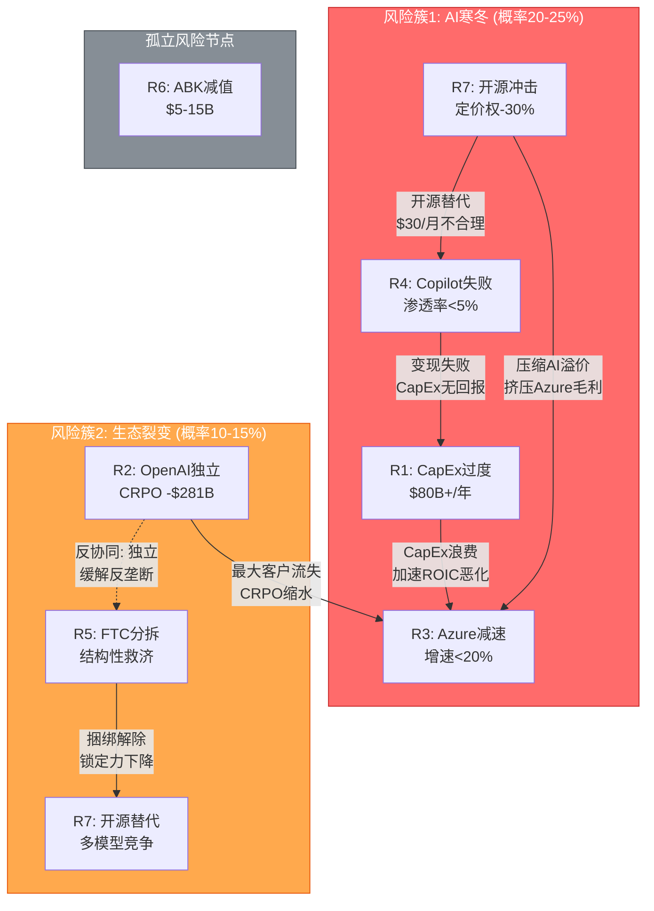
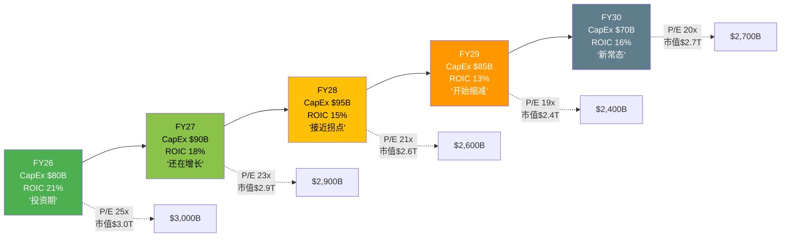
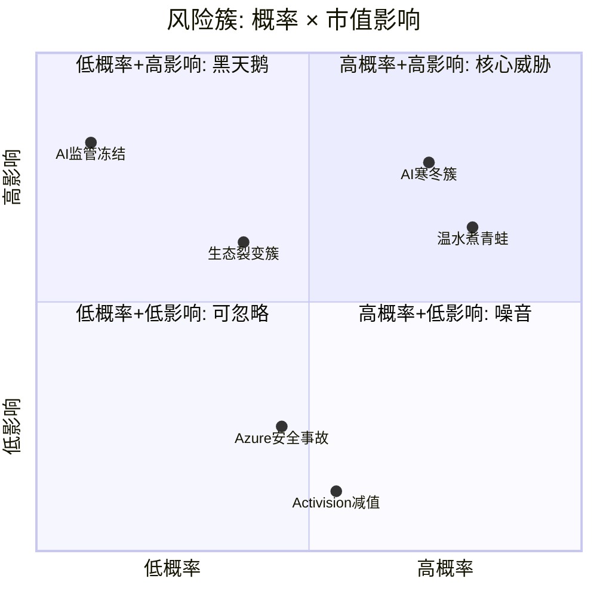
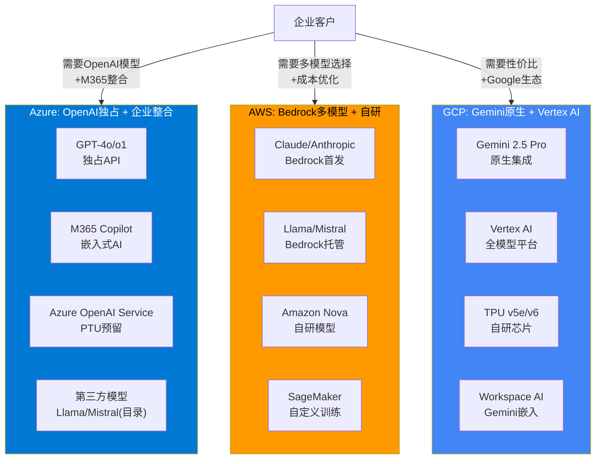
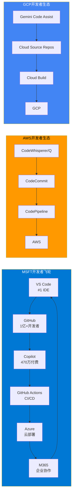
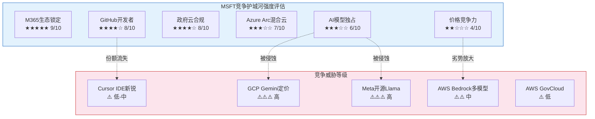

## Ch6: 风险拓扑 — 七大风险节点与系统性关联

### 6.1 风险节点识别与定义

微软当前面临的风险并非孤立事件的随机组合，而是一个高度互联的拓扑网络。七大核心风险节点如下:

| 编号 | 风险节点 | 关联CQ | 类型 | 独立概率(24个月) | 市值影响 |
|------|---------|--------|------|-----------------|---------|
| **R1** | CapEx过度投入/ROIC不恢复 | CQ2 | 结构性(S) | 15-20% [DM-P1B-001] | -$200B~-$400B |
| **R2** | OpenAI依赖/关系破裂 | CQ3 | 制度性(I) | 5-8% [DM-P1B-002] | -$150B~-$250B |
| **R3** | Azure增速骤降 | CQ1 | 周期性(C) | 10-15% [DM-P1B-003] | -$150B~-$300B |
| **R4** | Copilot变现失败 | CQ4 | 周期性(C) | 20-30% [DM-P1B-004] | -$100B~-$200B |
| **R5** | 反垄断/监管分拆 | CQ6 | 制度性(I) | 3-8% [DM-P1B-005] | -$100B~-$350B |
| **R6** | Activision减值 | CQ7 | 结构性(S) | 25-35% [DM-P1B-006] | -$5B~-$30B |
| **R7** | AI军备竞赛(开源冲击定价权) | CQ-B | 周期性(C) | 25-35% [DM-P1B-007] | -$50B~-$150B |

**概率校准来源**: R1/R4概率来自Polymarket风险校准(BS-7/BS-8) [DM-P1B-008]；R2概率基于PBC重组后MSFT锁定27%永久持股的缓释效应 [DM-P1B-009]；R5概率考虑SCOTUS弱化FTC执法81.3%概率 [DM-P1B-010]；R6概率基于Gaming Q2 FY26 -9% YoY及MPC报告单元隐含EV仍大幅富裕的对冲 [DM-P1B-011]。

### 6.2 七大风险详解

**R1: CapEx过度投入/ROIC不恢复**

FY2026 CapEx指引约$80B(仅PPE口径) [DM-P1B-012]，含Finance Lease后总Capital Spend达~$150B/年 [DM-P1B-013]。Q2 FY26单季CapEx已达$29.9B，CapEx/Revenue比率从FY23的13.3%飙升至Q2 FY26的36.8% [DM-P1B-014]。ROIC已从FY20的43.4%下降至FY25的23.8% [DM-P1B-015]。关键传导链: CapEx激增→D&A滞后攀升(当前年化$40-45B，2-3年内可能升至$50-60B)→Operating Margin承压2-3个百分点→FCF持续被挤压(Q2 FY26 FCF仅$5.9B，不足以覆盖季度股息$6.8B [DM-P1B-016])。

**R2: OpenAI依赖/关系破裂**

$625B CRPO中约45%(~$281B)来自OpenAI [DM-P1B-017]。2025年10月PBC重组后MSFT锁定27%永久股权 [DM-P1B-018]，但MSFT不再享有作为OpenAI计算提供商的优先认购权(ROFR丧失) [DM-P1B-019]。OpenAI API仍独占于Azure，但非API产品可多云部署。收入分成从当前~20%将在2030年降至~10% [DM-P1B-020]。若关系实质破裂，CRPO瞬间缩水$281B，Azure最大单一客户流失(估算当前消耗$3-5B/年 [DM-P1B-021])。

**R3: Azure增速骤降**

Azure Q2 FY26增速39%(恒定汇率38%) [DM-P1B-022]。管理层指引Q3 FY26 Azure CC增速31-32%，环比减速7个百分点 [DM-P1B-023]。$3T市值隐含Azure 5年CAGR需维持25%+(CQ1核心假设)。若AI需求不及预期或产能过剩导致增速骤降至15-20%，市场将重新评估MSFT的AI溢价。

**R4: Copilot变现失败**

M365 Copilot付费座位1500万，渗透率仅3.3%(15M/450M) [DM-P1B-024]。即使100%按$30/月收费，年化收入仅$5.4B [DM-P1B-025]，占总CapEx的6.75%。管理层对Copilot采用"关注毛利率和LTV而非短期货币化"的表态(CFO Amy Hood) [DM-P1B-026]，暗示当前仍处投入期。

**R5: 反垄断/监管分拆**

FTC于2026年2月升级调查，向6+家竞争对手发送民事调查传票(CIDs) [DM-P1B-027]，聚焦三领域: OpenAI合作关系、产品捆绑、Azure锁定。但SCOTUS大概率(81.3%)允许总统解雇FTC委员 [DM-P1B-028]，叠加Trump政府倾向行为性救济而非结构性分拆。EU DMA方面，2025年9月MSFT已接受Teams解绑承诺方案，避免最高$21B+罚款 [DM-P1B-029]。

**R6: Activision减值**

$75.4B收购中$51B为Goodwill [DM-P1B-030]。Gaming Q2 FY26收入-9% YoY、Xbox硬件-32%、内容&服务-5% [DM-P1B-031]。Game Pass停滞在35-37M(远低于50M目标) [DM-P1B-032]。CoD 2025销量据报下降超60% [DM-P1B-033]。但MPC整体仍盈利(Q2 $3.8B OI)，隐含MPC EV在15x OI下约$225B，远超$64B Goodwill，短期减值概率低。

**R7: AI军备竞赛(开源冲击定价权)**

Meta Llama 4于2025年4月同步上线AWS Bedrock和Azure [DM-P1B-034]。Llama 3.1 405B运行成本约为GPT-4的50% [DM-P1B-035]。Gemini 2.5 Pro定价($1.25-$2.50/M input tokens)仅为GPT-4o($5.00)的25-50% [DM-P1B-036]。DeepSeek效应已动摇AI投资叙事。开源模型在电信、银行等强监管行业因数据主权需求加速渗透。Azure AI的15-25%成本劣势(相对AWS Bedrock) [DM-P1B-037]可能在开源浪潮下被放大。

### 6.3 七乘七关系矩阵

风险间关系标注: **(+)** 协同(同时发生概率更高) | **(-)** 反协同(一个发生降低另一个概率) | **(0)** 独立(无显著关联)。

| | R1 CapEx | R2 OpenAI | R3 Azure↓ | R4 Copilot | R5 反垄断 | R6 ABK减值 | R7 开源 |
|---|---------|----------|----------|-----------|---------|----------|--------|
| **R1 CapEx** | — | (+) 弱 | **(+) 强** | (+) 中 | (0) | (0) | (+) 中 |
| **R2 OpenAI** | (+) 弱 | — | **(+) 强** | (0) | **(-)** | (0) | (+) 弱 |
| **R3 Azure↓** | **(+) 强** | **(+) 强** | — | (+) 中 | (0) | (0) | **(+) 强** |
| **R4 Copilot** | (+) 中 | (0) | (+) 中 | — | (0) | (0) | **(+) 强** |
| **R5 反垄断** | (0) | **(-)** | (0) | (0) | — | (0) | (-) 弱 |
| **R6 ABK减值** | (0) | (0) | (0) | (0) | (0) | — | (0) |
| **R7 开源** | (+) 中 | (+) 弱 | **(+) 强** | **(+) 强** | (-) 弱 | (0) | — |

**关键关联解读**:

- **R1×R3 (强协同)**: CapEx过度投入+Azure减速=最危险组合。若$80B+/年CapEx投入后Azure增速降至15-20%，ROIC跌破WACC将不可逆转。这两个风险共享相同的底层驱动因素——AI需求不及预期。
- **R3×R7 (强协同)**: 开源模型压缩Azure AI溢价→Azure增速受损。当Llama/Gemini以50-75%折扣提供可比能力时，企业没有理由为Azure OpenAI支付溢价。
- **R2×R3 (强协同)**: OpenAI独立/多云→Azure失去最大客户→CRPO缩水$281B→Azure增速机械性下降。
- **R4×R7 (强协同)**: 开源AI降低嵌入式AI成本→Copilot $30/月溢价显得过高→企业自建+开源替代方案增加。
- **R2×R5 (反协同)**: OpenAI独立反而缓解FTC对"事实控制"的反垄断指控。若OpenAI真正独立运营，MSFT面临的捆绑/锁定指控减弱。
- **R6 (高度独立)**: Activision减值风险几乎与其他6个风险节点无关联——Gaming业务独立于云/AI赛道。

### 6.4 风险簇识别

**簇1: "AI寒冬"场景 (联合概率20-25%)**

触发条件: DeepSeek式效率革命持续→企业AI支出理性回调→开源模型缩小与闭源差距→Azure AI溢价被压缩→Copilot ROI证伪→CapEx回报周期拉长至FY30+。

传导路径: R7(开源冲击)→R4(Copilot失败)+R3(Azure减速)→R1(CapEx浪费)→ROIC跌破WACC→FCF持续低于股息→市场重估。

市值影响: -$300B~-$500B (从$2,995B降至$2,500B~$2,700B) [DM-P1B-038]

为何概率高达20-25%: Copilot当前仅3.3%渗透率+开源AI成本以每6个月下降50%的速度演进+$80B/年CapEx的回收期需要Azure增速维持25%+五年。这三个条件同时成立的概率远低于市场预期。

**簇2: "生态裂变"场景 (联合概率10-15%)**

触发条件: OpenAI IPO后追求独立→多云部署分散Azure收入→FTC借势推进结构性救济→开源模型进一步侵蚀捆绑价值。

传导路径: R2(OpenAI独立)→CRPO缩水$281B→R3(Azure增速机械性下降5-8pp)→市场恐慌→R5(FTC趁势施压)。

注意反协同: R2(OpenAI独立)实际上**缓解**R5(反垄断)——若OpenAI真正独立，FTC关于"事实控制"的指控自动失效。因此簇2内部存在自我限制机制。

市值影响: -$200B~-$350B (从$2,995B降至$2,650B~$2,800B) [DM-P1B-039]

**孤立节点: R6 (Activision减值)**

Activision减值风险(概率加权$1.1-2.5B [DM-P1B-040])虽然存在，但(1)MPC报告单元整体EV远超Goodwill，(2)对MSFT $2,995B市值的影响<1%，(3)与AI/云核心叙事无关。这是一个**噪音级风险**——可能引发短期股价波动，但不改变长期估值逻辑。

### 6.5 "温水煮青蛙"场景

最危险的情景不是黑天鹅式崩溃，而是渐进恶化:

**年度推演** (概率30-40% [DM-P1B-041]):

| 年份 | CapEx | Azure增速 | ROIC | FCF | 叙事 |
|------|-------|----------|------|-----|------|
| FY26 | ~$80B | 35-39% | 20-22% | ~$65B | "投资期，等待回报" |
| FY27 | ~$90B | 28-32% | 17-19% | ~$55B | "增速放缓但仍领先" |
| FY28 | ~$95B | 22-26% | 14-16% | ~$50B | "ROIC低于WACC但接近拐点" |
| FY29 | ~$85B(开始缩减) | 18-22% | 12-14% | ~$60B(CapEx缓解) | "回报低于预期，开始削减" |
| FY30 | ~$70B | 15-18% | 15-17%(恢复) | ~$75B | "新常态: 中增速+中回报" |

这条路径的危险之处: **每个季度都"还行"**——Azure仍在增长(只是放缓)、Copilot渗透率缓慢提升(只是不达预期)、ROIC下降(但未崩溃)。市场不会一次性重估，而是通过P/E从25x缓慢压缩至18-20x，在4年间无声蚕食$500B-$700B市值 [DM-P1B-042]。

这比黑天鹅更可能发生，也更难防御——因为每个季度的财报电话都有足够的正面数据点来维持"再等一个季度"的叙事。

**识别"温水煮青蛙"的早期信号**:
- D&A增速持续超过Revenue增速(当前D&A +62% vs Revenue +17% [DM-P1B-085])
- Azure增速连续3个季度低于管理层指引中位值
- Copilot渗透率在连续4个季度后仍停留在5%以下
- FCF连续2个季度低于季度股息($6.8B/季 [DM-P1B-086])
- CapEx/Revenue比率稳定在25%以上且无下降趋势

当前这5个信号中，第1个和第5个**已经亮灯**。投资者应将此场景视为与黑天鹅同等重要甚至更重要的风险来源。

### 6.6 风险簇概率矩阵

### 6.7 风险拓扑总结

七大风险中，**真正决定MSFT估值命运的是R1(CapEx)+R3(Azure增速)+R7(开源冲击)构成的三角关系**。这三个风险共享同一底层假设: AI需求的增长速度能否匹配$80B+/年的资本投入。R2(OpenAI)和R4(Copilot)是这个核心三角的放大器或缓冲器，R5(反垄断)被政治环境大幅对冲，R6(Activision)是噪音。

加权期望损失合计约$137B [DM-P1B-043]，占当前市值的4.6%。但这是简单加总——考虑到R1/R3/R7的强协同性，实际组合损失应额外加15-20%关联性溢价，调整后约$158B-$165B [DM-P1B-044]，占市值5.3-5.5%。

**风险拓扑对CQ的启示**: 本章识别的风险间关联性直接影响CQ置信度的交叉校准。CQ1(Azure增速)和CQ2(CapEx回报)不应被独立评估——它们的置信区间应因R1×R3强协同而扩大。CQ3(OpenAI依赖)的风险被R2×R5的反协同效应部分对冲——OpenAI越独立，反垄断压力越小，但Azure的AI独占优势也越弱。CQ4(Copilot变现)则是整个拓扑中最具"放大器"特性的节点——Copilot成功可以同时缓解R1(证明CapEx有回报)和R3(推动Azure消耗)，而Copilot失败则同时加剧这两个风险。

---

## Ch7: 竞争格局 — 云与AI三方对照

### 7.1 云基础设施: 三方市场份额与增速

全球云基础设施市场在Q3 2025首次突破单季$1,000亿 [DM-P1B-045]，达到$1,069亿(同比+28%)。三巨头合计控制63%的市场份额。

**市场份额演变 (Synergy Research)**:

| 指标 | AWS | Azure | GCP | 三巨头合计 |
|------|-----|-------|-----|----------|
| **Q4 2024份额** | 30% [DM-P1B-046] | 21% | 12% | 63% |
| **Q3 2025份额** | 29% [DM-P1B-047] | 20% | 13% [DM-P1B-048] | 62% |
| **份额变化(1年)** | -1pp | -1pp | +1pp | -1pp |
| **增速(报告口径)** | ~19% [DM-P1B-049] | 39% [DM-P1B-050] | ~29% [DM-P1B-051] | ~28% |

需要注意的是，Azure 39%增速与"Azure及其他云服务"的报告口径有关，包含了非IaaS/PaaS组件。Synergy Research的份额数据基于IaaS/PaaS口径，因此Azure份额(20%)看似与高增速不匹配——部分增量收入进入了SaaS等不纳入基础设施统计的品类。

**关键趋势**: AWS市场份额自2022年Q2达到峰值后持续缓慢下降 [DM-P1B-052]。但这不意味AWS在失去客户——整体市场快速扩张，AWS只是被Azure和GCP的更高增速"相对稀释"。GCP有望在2026年突破15%份额 [DM-P1B-053]。

**利润率对比**:

| 指标 | AWS | Azure (IC分部) | GCP |
|------|-----|---------------|-----|
| **OPM (最新季)** | ~37% [DM-P1B-054] | 42.1% [DM-P1B-055] | ~17% [DM-P1B-056] |
| **OPM趋势** | 稳定 | 微降(-0.4pp YoY) | 持续改善 |
| **折旧压力** | 中 | 高(D&A +62% YoY) | 中-高 |

Azure的Intelligent Cloud分部42.1% OPM看似领先AWS的37%，但需注意IC分部包含Server Products(高利润率遗留业务)和Enterprise Services，纯Azure云服务的利润率可能低于IC分部整体水平。更重要的是，Azure OPM已出现同比下降(-0.4pp [DM-P1B-057])，反映AI基础设施折旧加速的早期信号。

### 7.2 AI差异化: 封闭vs开源vs混合

三大云厂商在AI层的战略选择形成了鲜明分化:

**AI服务定价对比 (每百万Token)**:

| 模型 | 平台 | Input | Output | 成本指数 |
|------|------|-------|--------|---------|
| GPT-4o | Azure OpenAI | $5.00 | $15.00 | 1.00x (基准) [DM-P1B-058] |
| Claude Sonnet 4 | AWS Bedrock | $3.00 | $15.00 | 0.90x [DM-P1B-059] |
| Gemini 2.5 Pro | GCP Vertex AI | $1.25-$2.50 | $10.00-$15.00 | 0.56-0.88x [DM-P1B-060] |
| Llama 4 405B | 自托管/多云 | ~$2.50 | ~$7.50 | ~0.50x [DM-P1B-061] |
| Gemini 2.0 Flash-Lite | GCP | $0.075 | $0.30 | 0.02x |
| GPT-4o-mini | Azure OpenAI | $0.60 | $2.40 | 0.15x |

**核心发现**: Azure OpenAI在旗舰模型层面(GPT-4o)存在15-25%的成本劣势 [DM-P1B-062](相较AWS Bedrock上的Claude Sonnet 4)，以及44-80%的劣势(相较GCP Vertex AI上的Gemini 2.5 Pro)。Azure的AI定价权不来自价格竞争力，而来自: (1) GPT-4o的品牌效应与模型质量溢价; (2) M365生态原生整合; (3) PTU(Provisioned Throughput Units)可降低成本最高70%; (4) 企业数据合规壁垒 [DM-P1B-063]。

### 7.3 开源AI对MSFT定价权的冲击

Meta Llama系列已经对AI云服务的定价格局产生实质影响:

- **成本冲击**: Llama 3.1 405B运行成本约为GPT-4等效能力的50% [DM-P1B-064]，企业获得相似结果的成本显著降低。
- **渗透路径**: 开源模型尤其在电信、银行等强监管行业因数据主权需求加速渗透，这些正是Azure的传统优势客户群。
- **Azure的对冲策略**: Azure Model Catalog同步上架Llama 4(2025年4月发布当日即上线) [DM-P1B-065]，试图将开源流量留在Azure平台。但这意味着Azure从"高溢价的独占模型提供商"转向"多模型托管平台"，毛利率结构面临根本性转变。

**Anthropic在AWS上的威胁**:

Anthropic作为OpenAI的最直接竞争者，其Claude系列模型在AWS Bedrock上首发 [DM-P1B-066]。Polymarket数据显示Anthropic更可能先于OpenAI IPO(67.5%概率) [DM-P1B-067]。若Anthropic IPO成功并获得更多融资，AWS Bedrock在企业AI市场的竞争力将进一步增强——因为企业可以在AWS上获得Claude(接近GPT-4o质量)+更低的成本+多模型灵活性的组合。

**对Azure AI毛利率的量化影响**: 若开源模型在2-3年内将企业AI推理成本压缩50%，而Azure OpenAI无法同步降价(因需向OpenAI支付分成)，Azure AI服务的毛利率可能从当前估计的50-60%压缩至35-45% [DM-P1B-068]。

### 7.4 企业云竞争护城河

**7.4.1 混合云: Azure Arc vs AWS Outposts vs GCP Anthos**

| 维度 | Azure Arc | AWS Outposts | GCP Anthos |
|------|----------|-------------|-----------|
| **核心理念** | 管理平面延伸 | 硬件延伸 | Kubernetes原生多云 |
| **多云支持** | 管理AWS/GCP资源 | 仅AWS生态 | 管理AWS/Azure资源 |
| **硬件要求** | 无(纯软件) | 需购买AWS硬件 | 无(纯软件) |
| **AI集成** | Azure ML Anywhere | SageMaker Edge | Vertex AI Edge |
| **定价** | 管理层免费+服务计费 | 硬件+服务计费 | 集群管理费+服务计费 |
| **目标客户** | 已有on-prem的企业 | AWS深度用户 | 云原生企业 |

Azure Arc的战略意义: 它是MSFT锁定混合云客户的关键工具。通过将Azure管理平面延伸到客户的on-prem和其他云环境，Arc创造了一种"不迁移也能被绑定"的锁定模式。超过75%的企业预计在2025年运行混合/多云环境(Gartner [DM-P1B-069])，这为Arc提供了巨大的潜在市场。

**7.4.2 安全合规: 政府云**

Azure Government在FedRAMP High认证服务数量上领先竞争对手，拥有101项High级别服务 [DM-P1B-070]。2025年4月，Azure OpenAI获得DoD IL6授权(机密数据级别) [DM-P1B-071]，这是AI服务在国防领域的里程碑。美国联邦政府2025年云预算$83亿 [DM-P1B-072]，加上JWCC(联合作战云能力)合同在2025年发放$7.21亿任务订单，政府云是一个高壁垒、高粘性的细分市场。

AWS GovCloud同样具有强大的政府客户基础，但Azure凭借与政府机构长期的Windows/Office关系，在从传统IT向云迁移的过程中具有天然优势。

**7.4.3 开发者生态: GitHub+VS Code vs AWS CodePipeline vs GCP Cloud Shell**

| 维度 | MSFT生态 | AWS生态 | GCP生态 |
|------|---------|---------|---------|
| **代码托管** | GitHub (1亿+开发者) | CodeCommit (弱) | Cloud Source Repos (弱) |
| **AI编码** | GitHub Copilot (470万付费) [DM-P1B-073] | CodeWhisperer/Amazon Q | Gemini Code Assist |
| **IDE** | VS Code (#1市场份额) | Cloud9/自带IDE | Cloud Shell Editor |
| **CI/CD** | GitHub Actions | CodePipeline/CodeBuild | Cloud Build |
| **市场份额** | Copilot 42% [DM-P1B-074] | ~15% | ~10% |

GitHub Copilot拥有470万付费用户(YoY +75%) [DM-P1B-075]，占据AI编码助手42%市场份额。90%的Fortune 100公司在其开发流程中使用GitHub Copilot [DM-P1B-076]。这构成了MSFT在开发者层面的核心护城河——从代码编写(VS Code+Copilot)→代码托管(GitHub)→CI/CD(GitHub Actions)→云部署(Azure)的完整闭环。

新兴威胁: Cursor在18个月内获得18%市场份额 [DM-P1B-077]，证明AI编码助手市场仍具高度流动性。

### 7.5 定价结构对比: 实例级深度分析

基于Scout Gap 2数据，三大云厂商在不同服务层的定价权呈现差异化格局:

| 服务层 | Azure vs AWS | Azure vs GCP | Azure定价权评分 |
|-------|-------------|-------------|---------------|
| **VM/Compute(按需)** | 持平($140.16) | 略低(-1.9%) | 5/10 [DM-P1B-078] |
| **VM/Compute(1年承诺)** | 贵+8.8%($96 vs $88) | 贵+6.4%($96 vs $90) | 3/10 |
| **热存储(Blob)** | **便宜-20%**($0.0184 vs $0.023) | 略低(-8%) | 7/10 |
| **数据库(vCore)** | 持平 | 持平 | 5/10 |
| **AI推理(旗舰)** | **贵+11%**(GPT-4o vs Claude) | **贵+44-80%**(vs Gemini) | 6/10 (靠品牌溢价) |
| **EA捆绑折扣** | 优势(跨产品杠杆) | 优势(M365+Azure) | 8/10 |
| **迁移壁垒** | 极高(AAD+Hybrid Benefit) | 极高(M365生态锁定) | 9/10 |

**总体定价权评估**: Azure的定价权结构是"表面中等、实质强大"——单项产品定价并无优势(甚至略贵)，但通过**M365+Azure+Dynamics捆绑协商→EA跨产品折扣杠杆→AAD/Hybrid Benefit迁移壁垒**的组合，创造了6.5/10的实质定价能力 [DM-P1B-079]。

客户迁移成本通常在$500K-$5M+对大型企业 [DM-P1B-080]，这是Azure最隐蔽但最有效的定价权来源。

### 7.6 Azure追上AWS的概率与时间线

**当前差距**: AWS 29% vs Azure 20%，差距9个百分点 [DM-P1B-081]。

**追赶数学**:

| 假设 | AWS年化份额变动 | Azure年化份额变动 | 追平年份 |
|------|---------------|----------------|---------|
| **基准情景** | -0.5pp/年 | +0.5pp/年 | ~2034 (约9年) |
| **乐观(AI加速)** | -1.0pp/年 | +1.0pp/年 | ~2030 (约4-5年) |
| **悲观(AWS反击)** | -0.3pp/年 | +0.3pp/年 | ~2040 (约14年) |

**结论**: 在基准情景下，Azure追上AWS需要8-10年。即使在最乐观的AI加速情景下，也需要4-5年。24个月内Azure超越AWS的概率**极低(3-5%)** [DM-P1B-082]。但份额排名本身并非关键——更重要的是Azure能否在AI云这个增量最大的子市场中取得领先地位。GenAI专项云服务在Q2 2025同比增长140-180% [DM-P1B-083]，这个赛道的格局尚未定型。

### 7.7 竞争格局总评

**份额追赶的非线性因素**: 上述线性外推忽略了可能加速或减速追赶的非线性事件。加速因素包括: (a) AWS遭遇重大安全事故导致企业迁移潮; (b) OpenAI模型在企业场景中建立压倒性优势; (c) Azure Arc在混合云场景中形成网络效应。减速因素包括: (a) AWS Bedrock+Anthropic组合被证明在AI场景中更具性价比; (b) GCP Gemini在搜索增强型AI应用中形成差异化优势; (c) 开源模型削弱所有云厂商的AI溢价，份额竞争回归IaaS基本面(AWS优势领域)。

**综合竞争评估**:

1. **MSFT最强护城河是M365生态锁定(9/10)而非Azure本身的技术优势。** 450M M365付费用户×AAD深度集成×迁移成本$500K+构成了几乎不可逾越的壁垒。即使Azure在某些技术/价格维度不如AWS/GCP，客户因生态锁定而"不得不留"。

2. **AI层竞争格局尚未固化。** Azure OpenAI的独占优势正被三股力量侵蚀: (a) GCP Gemini以44-80%的成本优势快速追赶; (b) Meta Llama开源化降低了所有闭源模型的定价锚点; (c) Anthropic在AWS上的深度整合提供了高质量替代方案。

3. **开发者生态是被低估的护城河。** GitHub(1亿+用户)+Copilot(470万付费、42%份额)+VS Code(#1 IDE)构成的飞轮效应，使MSFT在"从代码到云"的完整链路上具有AWS和GCP不具备的端到端优势。

4. **Azure的核心竞争逻辑不是"更好/更便宜"，而是"更方便"。** 对于已使用M365+Windows Server+SQL Server的企业(全球数百万家)，选择Azure的理由不是Azure本身更优，而是Azure与现有IT栈的整合成本最低。这种"便利性护城河"虽然不够性感，但极其持久。

5. **最大竞争风险在AI定价权。** 若开源AI持续缩小与闭源模型的能力差距，Azure OpenAI的15-25%溢价将变得不可持续。MSFT需要在企业AI Agent(非简单推理API)层面建立新的差异化，否则AI云服务将沦为商品化竞争 [DM-P1B-084]。

6. **竞争态势的时间维度。** 短期(0-12个月)，Azure凭借OpenAI独占和M365整合在企业AI领域具有先发优势。中期(1-3年)，开源模型与GCP Gemini的性价比追赶将逐步侵蚀这一优势，竞争焦点转向AI Agent平台化能力和行业解决方案。长期(3-5年)，云竞争的终局取决于谁能在AI基础设施的下一代范式(如自主Agent、多模态推理、实时世界模型)中率先实现规模化商业落地。MSFT在短期具有明确优势，中期面临压力，长期结果高度不确定。
