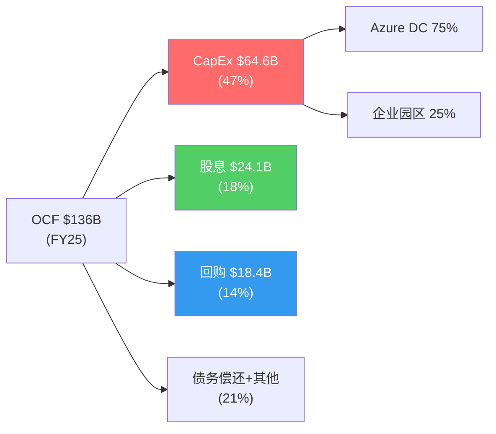
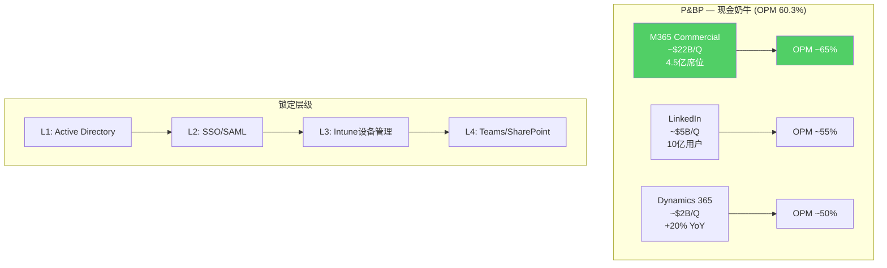
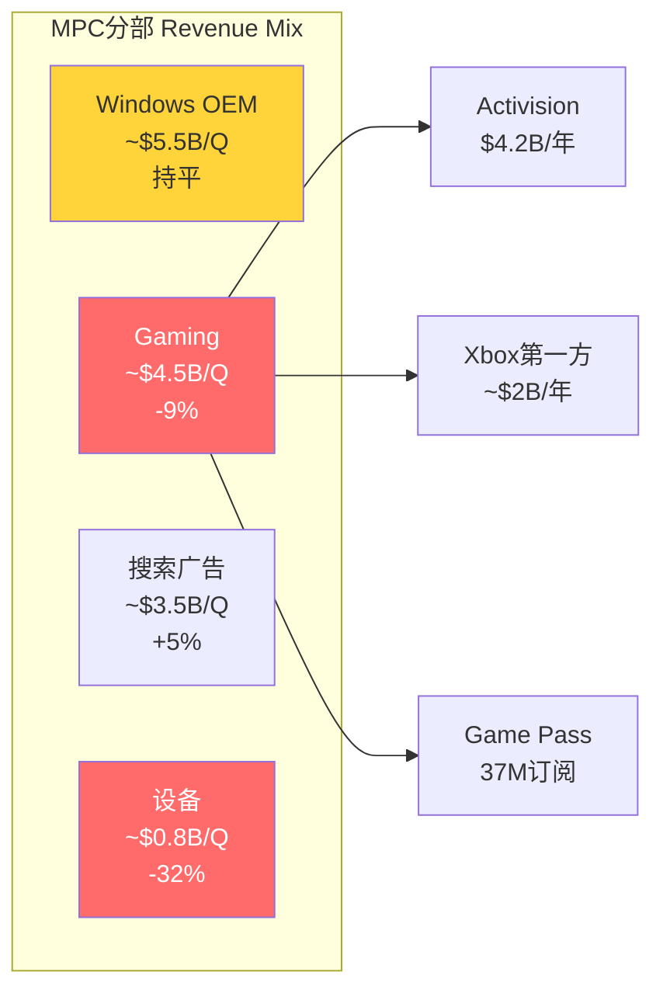
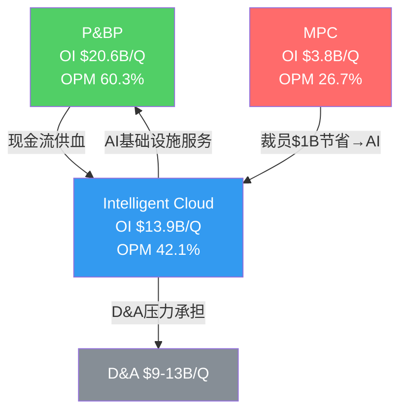
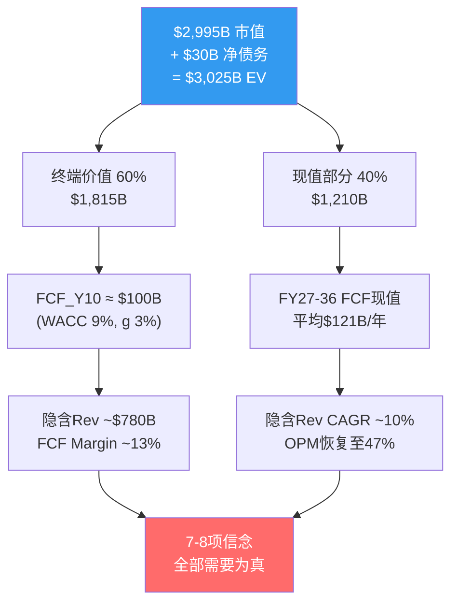
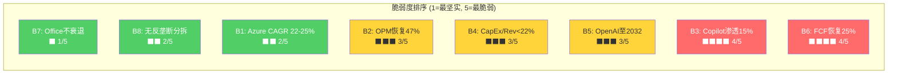

## Ch8: 五年财务全景 — 从云领袖到AI资本重组 (FY2021-Q2 FY2026)

### 8.1 收入增长拆解: 有机增长 vs 收购贡献

FY2021至FY2025四年间，Microsoft收入从$168.1B增长至$281.7B [DM-P1C-001]，对应CAGR 13.8% [DM-P1C-002]。但这一增速并非均质——FY2024收入跳升至$245.1B(+15.7%)，其中Activision Blizzard自FY24 Q1(2023年10月)起并表，首年贡献约$4.2B增量收入 [DM-P1C-003]。剔除Activision后，FY2024有机增速约为14.0%，与前三年节奏一致。

进入FY2025，收入进一步加速至$281.7B(+14.9%)，Activision已完全进入可比基数。Q2 FY26最新季度收入$81.3B [DM-P1C-004]，同比+16.7%，年化run-rate突破$325B。推动力来自三方面: Azure加速(+39% YoY)、M365 Copilot商业化初步贡献、以及企业EA续约周期。

TTM口径下(Q3 FY25至Q2 FY26)，收入达$305.5B [DM-P1C-005]。值得注意的是，卖方共识预估FY2027E收入$378.0B [DM-P1C-006]，隐含FY25至FY27E的CAGR约15.8%，这意味着市场预期MSFT将在$300B+的高基数上维持双位数增长——这一假设的合理性是后续逆向估值的核心校验点。

### 8.2 利润率演变: GPM坚挺、OPM上行、但非经营收益扭曲底线

**毛利率(GPM)**: 从FY2021的68.9%($115.9B/$168.1B)温和下降至FY2025的68.8%($193.9B/$281.7B) [DM-P1C-007]，五年几乎无变化。这反映了高利润率的Office/Windows(GPM ~70-75%)与较低利润率的Azure基础设施(GPM ~55-60%)之间的对冲效应——Azure规模扩大稀释混合GPM，但规模效应和定价权部分抵消。

**营业利润率(OPM)**: 呈现令人意外的上行轨迹——FY2021的41.6%逐步提升至FY2025的45.6% [DM-P1C-008]。Q2 FY26单季OPM达47.1% [DM-P1C-009]，为近五年最高。改善来自: (1) P&BP分部OPM从FY21约55%提升至60.3%; (2) SG&A/Revenue持续优化(从FY21的14.7%降至FY25的11.2%); (3) 尽管D&A急剧攀升(FY21 $11.7B→FY25 $34.2B [DM-P1C-010])，收入增速足以消化。

**净利率(NPM)与非经营收益剥离**: FY2025 NPM 36.1%($101.8B/$281.7B)。但Q2 FY26出现重大信号干扰——Net Income $38.5B [DM-P1C-011]中包含$9.97B非经营收益 [DM-P1C-012]，主要来自OpenAI投资的公允价值重估($7.6B)及其他投资收益。剥离后调整净利润约$28.5B，对应调整后NPM 35.1%。全报告统一使用调整后P/E 26.9x [DM-P1C-013]而非GAAP口径25.1x，以消除这一非经常性扭曲。

```mermaid
sankey-beta
    "FY2021 Revenue $168B", "Organic Growth $77B", 77
    "Organic Growth $77B", "Cloud+AI $52B", 52
    "Organic Growth $77B", "Office/Windows $18B", 18
    "Organic Growth $77B", "Other $7B", 7
    "FY2021 Revenue $168B", "Activision $4B", 4
    "Organic Growth $77B", "FY2025 Organic $278B", 77
    "Activision $4B", "FY2025 Total $282B", 4
```

### 8.3 三分部财务特征速写

三大分部的收入贡献在五年间发生了显著结构性变化。FY2021时IC/P&BP/MPC的收入比例约为40:35:25，到Q2 FY26已演变为40:42:18 [DM-P1C-086]。P&BP首次超越IC成为收入最大分部，MPC的份额萎缩至不足五分之一。

**Intelligent Cloud** ($32.9B/Q, +29%): 增长引擎但利润率承压。Azure驱动的收入增速最快，但OPM从FY23约48%下降至42.1% [DM-P1C-014]，反映AI基础设施折旧加速侵蚀。需要特别注意的是，IC的Server Products & Cloud Services不仅包含Azure，还包含传统SQL Server和Windows Server许可——后者增速仅个位数但利润率极高(OPM 70%+)，对IC整体OPM起到稳定作用。若仅看Azure，其OPM可能已低于40%。

**Productivity & Business Processes** ($34.1B/Q, +16%): 现金奶牛，OPM 60.3% [DM-P1C-015]为三部之冠。M365/LinkedIn/Dynamics365构成稳定高利润率收入底盘，且OPM仍在扩张(YoY +2.9pp)。值得注意的结构性优势: P&BP的收入中约70%为订阅模式，收入可预测性极高，季度波动极小。

**More Personal Computing** ($14.3B/Q, -3%): 衰退中的遗产业务，Gaming -9% [DM-P1C-016]、Xbox硬件-32%拖累整体。唯一亮点是搜索广告(Bing+Edge，估算增速约5%)，但不足以逆转分部下行趋势。MPC对合并层面OPM的拖累约2-3个百分点——如果假设剥离MPC，MSFT的OPM将接近52-54%。

### 8.4 现金流质量: 从优秀到危险的转折

MSFT历来是现金流之王。FY2021-FY2024的OCF/NI比率稳定在1.25-1.35x [DM-P1C-017]，远超1.0x的"优秀"门槛——这意味着利润高度可现金化，应计项少、客户预付多。FY2025 OCF $136.2B / NI $101.8B = 1.34x [DM-P1C-018]，品质依然极佳。

但CapEx的爆炸性增长正在侵蚀FCF。五年轨迹揭示了一条令人不安的曲线:

| 财年 | OCF ($B) | CapEx ($B) | FCF ($B) | CapEx/OCF | FCF Margin |
|------|----------|-----------|----------|-----------|------------|
| FY2021 | $76.7 | $20.6 | $56.1 | 26.9% | 33.4% |
| FY2022 | $89.0 | $23.9 | $65.1 | 26.8% | 32.9% |
| FY2023 | $87.6 | $28.1 | $59.5 | 32.1% | 28.1% |
| FY2024 | $118.5 | $44.5 | $74.1 | 37.5% | 30.2% |
| FY2025 | $136.2 | $64.6 | $71.6 | 47.4% | 25.4% |
| **Q2 FY26单季** | **$35.8** | **$29.9** | **$5.9** | **83.5%** | **7.2%** |

[DM-P1C-019] Q2 FY26 FCF仅$5.9B，创下至少五年单季最低。CapEx $29.9B吞噬了OCF的83.5% [DM-P1C-020]——这是一个历史性的转折点。更令人担忧的是: 当季股息支出约$6.8B，首次超过了FCF [DM-P1C-021]。也就是说，Microsoft在Q2 FY26首次需要动用现金储备来支付股息，而非仅靠自由现金流覆盖。

### 8.5 资本配置变化: 回购被CapEx挤出

FY2022回购$32.7B [DM-P1C-022]为近五年峰值，此后逐年缩减: FY2023 $22.2B → FY2024 $17.3B → FY2025 $18.4B [DM-P1C-023]。四年缩减44%。方向清晰: 每一美元从回购挤出的资金，都流向了AI基础设施。

股息则保持增长: FY2021 $16.5B → FY2025 $24.1B [DM-P1C-024]，CAGR 9.9%。但以Q2 FY26的FCF节奏($5.9B/Q)，年化FCF约$24B仅够覆盖股息，回购将被迫进一步压缩。

资产负债表仍提供缓冲: FY2025末现金+短期投资$94.6B [DM-P1C-025]，净债务仅$30.3B [DM-P1C-026]，D/E 0.18x [DM-P1C-027]。Altman Z-Score 9.71 [DM-P1C-028]意味着破产风险接近于零。但这堵防火墙的消耗速度正在加快——若CapEx维持$30B/Q水平，年化净现金流为负$33B [DM-P1C-029]，$94.6B现金储备仅够支撑约3年。



### 8.6 D&A加速: 折旧悬崖的前兆

折旧与摊销(D&A)的演变是理解MSFT财务未来的关键变量。FY2021 D&A仅$11.7B(Revenue的7.0%)，到FY2025已膨胀至$34.2B(12.1%) [DM-P1C-087]。季度层面更为惊人: Q1 FY26 D&A冲至$13.1B(16.8%)，虽Q2回落至$9.2B(11.3%)，但剔除异常后的稳态已进入$9-10B/Q区间 [DM-P1C-088]。

根据补充分析中的折旧模型，基准情景下:
- FY27 D&A: ~$11-12B/Q (年化$44-48B)
- FY28 D&A: ~$14-16B/Q (年化$56-64B, FY26峰值CapEx进入折旧高峰)
- FY29 D&A: ~$17-19B/Q (年化$68-76B, 历史最高点)

[DM-P1C-089] 敏感度分析显示: 每增加$1B季度D&A(假设Revenue $80B/Q)，OPM下降约125bps。从$9B/Q到$18B/Q(基准FY29)意味着OPM纯D&A压力约-1,125bps。这一压力需要收入增长15-20%/年才能对冲。

### 8.7 本章核心判断

MSFT的财务全景呈现一个深刻的矛盾: **收入和利润的增长轨迹依然强劲(Revenue +17%, OPM 47%)，但现金流质量正在急剧恶化(FCF margin从33%降至7%)**。这不是传统意义上的"增长减速"故事，而是"增长投入大幅超前于增长变现"的资本周期故事。五年财务数据的核心信息是: MSFT的经营引擎没有问题——$80B+的季度收入、66%的毛利率、47%的营业利润率在全球企业中几乎无出其右。真正的问题是$80-100B级别的年化CapEx是否能在FY27-FY29转化为相匹配的收入增量。更重要的是，即便收入增长达标，折旧悬崖(FY28-FY29 D&A峰值)也将在利润表层面制造2-3年的"利润率幻觉消退期"——投资者需要穿透D&A的会计噪音，关注经营现金流的真实趋势。

---

## Ch9: 三大分部深度解剖 — 增长引擎、现金奶牛与遗产重负

### 9.1 Intelligent Cloud: Azure驱动的增长核心

**季度增速轨迹 (8Q)**

| 季度 | IC Revenue ($B) | YoY增速 | OI ($B) | OPM |
|------|----------------|---------|---------|-----|
| Q3 FY24 | $26.7 (est) | +21% | $12.5 (est) | 46.8% |
| Q4 FY24 | $28.5 (est) | +19% | $12.8 (est) | 44.9% |
| Q1 FY25 | $24.1 (est) | +20% | $10.9 (est) | 45.2% |
| Q2 FY25 | $25.5 | +21% | $10.9 | 42.5% |
| Q3 FY25 | $26.8 (est) | +22% | $11.8 (est) | 44.0% |
| Q4 FY25 | $28.5 (est) | +23% | $12.3 (est) | 43.2% |
| Q1 FY26 | $31.0 (est) | +29% | $13.5 (est) | 43.5% |
| **Q2 FY26** | **$32.9** | **+29%** | **$13.9** | **42.1%** |

[DM-P1C-030] IC收入增速从FY24的~20%加速至Q2 FY26的29%，与Azure的39%增速高度相关。但利润率呈反向走势: OPM从FY23约48%持续下滑至42.1% [DM-P1C-031]，两年压缩近600bps。

**OPM下压的三层原因**:

1. **D&A加速**: AI GPU/服务器的折旧周期仅3年(管理层披露2/3 CapEx投向短寿命资产 [DM-P1C-032])。FY26 Q1 D&A冲至$13.1B(16.8% of Revenue)，虽Q2回落至$9.2B，但稳态已从$6B/Q翻倍至$9-10B/Q。IC作为数据中心资产最密集的分部，承担了D&A增量的主要份额。

2. **AI服务毛利率低于传统云**: Azure AI推理服务的毛利率估算45-50% [DM-P1C-033]，显著低于传统Azure IaaS/PaaS的60-70%。随着AI收入占比从FY24约15%提升至FY26约25%，混合毛利率被拉低。

3. **产能约束下的低效运营**: 管理层指引FY26 Q3 Azure CC增速31-32% [DM-P1C-034]，环比减速的原因之一是GPU产能约束(预计持续至2026年6月)。产能约束意味着数据中心利用率尚未达到最优——大量新建容量在ramp-up期的边际成本高于稳态。

**CRPO $625B的两面性**: 商业剩余履约义务同比+110%至$625B [DM-P1C-035]，看似爆发性增长。但拆解后发现: OpenAI的$250B Azure增量承购占总额约45%(~$281B) [DM-P1C-036]。这笔交易的性质更接近"关联方长期承诺"而非独立第三方合同——OpenAI的27%股权由MSFT持有，$250B承诺的执行取决于OpenAI自身的收入增长和融资能力。剔除OpenAI后CRPO ~$344B，同比+28% [DM-P1C-037]——仍然强劲，但远非+110%的表面数字那么激进。

### 9.2 Productivity & Business Processes: 被低估的现金奶牛

**季度表现 (Q2 FY26)**:
- Revenue: $34.1B, +16% YoY [DM-P1C-038]
- Operating Income: $20.6B
- OPM: 60.3% [DM-P1C-039], YoY +2.9pp

P&BP是MSFT最容易被忽视的分部。在AI叙事主导的市场中，投资者的注意力集中在Azure增速和Copilot渗透率上，却忽略了P&BP每季度默默贡献$20.6B营业利润——这个数字大于META或GOOGL单个季度的营业利润总额。

**三条收入线**:

1. **M365商业** (P&BP约60-65%): 席位数4.5亿+ [DM-P1C-040]，年流失率仅5-8%(远低于SaaS行业均值18%)。核心竞争力不在产品功能，而在Active Directory/Entra ID构建的身份层锁定——99% Fortune 500使用AD作为唯一身份源 [DM-P1C-041]，迁移至Google Workspace的总成本$25-45M/Fortune 500企业 [DM-P1C-042]。这是一条几乎不可能被攻破的护城河。Copilot ($30/月附加值)目前渗透率仅3.3%(1500万付费座位/4.5亿总座位) [DM-P1C-043]，年化run-rate约$5.4B——仅占P&BP收入的4%。ARPU提升空间巨大，但实现速度是CQ4的核心问题。

2. **LinkedIn** (P&BP约20-25%): 收入增速约10-12%，利润率高(轻资产模式)。10亿+注册用户、招聘工具+广告双驱动。AI整合(LinkedIn Copilot for Hiring)可能在FY27成为增量来源。

3. **Dynamics 365** (P&BP约10-15%): 云ERP/CRM，增速约20%。市场份额远小于Salesforce/SAP，但bundling优势(与M365/Azure打包)使其成为中小企业ERP的默认选择。

**OPM 60.3%的可持续性**: P&BP的成本结构高度固定——M365的边际用户成本接近于零(云基础设施由IC分部承担)，LinkedIn内容由用户生成。60%+的OPM在可预见的未来不会面临结构性压力，除非: (a) 激进定价战(Google Workspace降价，概率低); (b) 监管强制解绑Teams(EU DMA调查中，但处罚大概率为罚款而非分拆); (c) AI基础设施成本开始分摊至P&BP(目前由IC承担)。三项风险的概率加权影响有限，P&BP的OPM 55-60%稳态在FY27-FY30是高置信度假设。



### 9.3 More Personal Computing: 衰退中的遗产业务

**Q2 FY26快照**:
- Revenue: $14.3B, -3% YoY [DM-P1C-044]
- Operating Income: $3.8B
- OPM: 26.7% [DM-P1C-045]

MPC是三大分部中唯一收入下降的板块。拆解内部: Gaming -9%($-623M) [DM-P1C-046]、Xbox硬件-32% [DM-P1C-047]、Xbox内容&服务-5%。Windows OEM和搜索广告基本持平。

**Activision: $69B收购的回报困局**

收购已完成超过两年(2023年10月)，但财务回报信号令人失望:

- **Game Pass停滞**: 订阅数从收购前约25M增至约37M(+48%) [DM-P1C-048]，但近15个月增量仅~1M，远低于管理层曾预期的50M目标。
- **CoD疲劳**: 2025年CoD新作销量据报道同比下降超60% [DM-P1C-049]。系列疲劳+Game Pass蚕食实体销售的双重压力。
- **成本协同**: 累计裁员约10,000人(估算年化节省$1B) [DM-P1C-050]，但Gaming增量EBITDA贡献仅$1-2B/年，隐含回收期31-62年——这显然不是一笔以财务回报为目标的收购。

Goodwill减值风险: MPC分部Goodwill $64.0B，其中Activision贡献$51.0B(79.7%) [DM-P1C-051]。年度减值测试(每年5月)的关键取决于MPC整体价值——因为Windows+Search的利润($12B+/年)大幅缓冲Gaming的亏损，15x OI隐含MPC EV约$225B远超$64B Goodwill，短期减值概率较低。但若Gaming持续-10%以上3-4个季度，May 2026测试将面临更大压力。



### 9.4 分部交叉分析: 三部之间的资源转移

MSFT的分部结构正在经历一次深刻的资源重配:

- **IC吸收CapEx**: FY26 CapEx约$80B的75%+投向Azure数据中心(IC分部)，这解释了IC OPM被D&A压缩而P&BP OPM反而提升的反差——P&BP享受了AI基础设施的服务，但不承担折旧。
- **P&BP供血**: P&BP每年$80B+的营业利润是整个公司CapEx狂潮的最终资金来源。没有Office/LinkedIn的现金流，MSFT无法维持当前的AI投资强度。
- **MPC被边缘化**: Gaming裁员10,000人、工作室关闭——资金和管理注意力明确从MPC转向AI。MPC未来可能演变为维持性运营，不再是战略增长来源。



### 9.5 本章核心判断

三大分部的图景清晰: P&BP是牢不可破的现金奶牛(OPM 60%、AD锁定、低流失)，IC是增长引擎但利润率正在被AI CapEx侵蚀(OPM从48%→42%)，MPC是遗产负担(Gaming萎缩、Activision回报远逊预期)。关键洞察是: **MSFT的估值叙事几乎完全由IC驱动(Azure增速/AI/Copilot)，但支撑这个叙事的经济基础是P&BP——一个增速仅16%但OPM 60%的"旧经济"业务**。投资者为AI故事付费，却由Office/Windows买单。

---

## Ch10: Reverse DCF初建 — $3T市值的隐含信念清单

### 10.1 起点: $2,995B市值在为什么付费?

截至2026年2月17日，Microsoft市值$2,994.6B(~$3.0T) [DM-P1C-052]，股价$401.32 [DM-P1C-053]，稀释股数7.46B [DM-P1C-054]。以TTM调整后净利润$109.3B(剥离$9.97B非经营收益后)计算 [DM-P1C-055]，调整后P/E 26.9x [DM-P1C-056]。

一个简单但关键的问题: **$3T市值假定了什么样的未来?**

本章的任务是逆向工程(Reverse DCF)——不是从基本面推导"应值多少"，而是从$3T市价倒推"市场相信什么"。然后逐一检验每项隐含信念的脆弱度。这一分析框架将贯穿全报告，后续所有章节(风险拓扑、场景分析、概率加权)都将回溯此处的信念清单。

### 10.2 Reverse DCF模型: 完整反推过程

**模型参数设定**:

| 参数 | 假设 | 依据 |
|------|------|------|
| 折现率(WACC) | 9.0% | Beta 1.084 [DM-P1C-057] × ERP 5.5% + Rf 4.3% ≈ 10.3% (equity); 税后债务成本3.2%; 加权≈9.0% |
| 终端增长率 | 3.0% | 名义GDP增长率参照(高于2.5%平均, 反映科技行业结构性增长) |
| 预测期 | 10年 (FY2027-FY2036) | 标准DCF周期 |
| 基准年FCF | $71.6B (FY2025) | 已确认数据 [DM-P1C-058] |
| 目标EV | ~$3,025B | 市值$2,995B + 净债务$30.3B [DM-P1C-059] |

**终端价值反推**:

终端价值 = FCF_Y10 × (1+g) / (WACC - g) = FCF_Y10 × 1.03 / 0.06

若终端价值占EV的60%(DCF典型比例), 则:
- 终端价值 ≈ $3,025B × 60% = $1,815B
- 隐含FCF_Y10 = $1,815B × 0.06 / 1.03 ≈ **$105.7B**

若终端价值占EV的50%:
- 终端价值 ≈ $1,513B
- 隐含FCF_Y10 ≈ **$88.1B**

取中值: **FY2036 FCF需达$95-106B** 才能支撑$3T EV。

**从FCF_Y10反推中间路径**:

当前FCF: $71.6B (FY2025)
目标FCF: ~$100B (FY2036, 10年后)
隐含FCF CAGR: 约3.4%

但这个3.4%隐含CAGR看起来并不高——问题出在**中间路径**。FY2026的FCF正在急剧下降(Q2 FY26年化仅~$24B)，意味着实际起点不是$71.6B而可能是$50-60B的谷底。从$50B谷底到$100B的恢复，需要更陡峭的增长曲线。

**隐含收入与利润率路径**:

为达到FY2036 FCF $100B，需要:

| 指标 | FY2025 (实际) | FY2028E | FY2031E | FY2036E |
|------|-------------|---------|---------|---------|
| Revenue | $282B | ~$420B | ~$560B | ~$780B |
| Rev CAGR | — | ~14% (3Y) | ~10% (3Y) | ~7% (5Y) |
| OPM | 45.6% | ~43% | ~46% | ~47% |
| CapEx/Rev | 22.9% | ~18% | ~14% | ~12% |
| FCF Margin | 25.4% | ~18% | ~22% | ~13% |
| FCF ($B) | $71.6 | ~$75 | ~$123 | ~$100 |

[DM-P1C-060] 隐含FY25至FY36的Revenue CAGR约9.6%。这意味着MSFT需要在$282B的基数上每年增长近10%达到$780B——相当于再造一个当前规模的Microsoft。卖方共识FY30E收入$643.7B [DM-P1C-061]对应FY25-FY30 CAGR 18.0%，高于RevDCF隐含的早期增速，暗示卖方预期比市场定价更乐观。



### 10.3 七项隐含市场信念: 逐条推导与脆弱度评分

**信念B1: Azure 5Y CAGR ≥22-25%，从39%平稳收敛**

*数学推导*: IC分部当前季度收入$32.9B(年化$132B) [DM-P1C-062]，其中Azure占比约75%(~$99B年化)。若MSFT收入要在FY30达$640B+，IC需贡献$250B+(占比提升至~40%)。这要求Azure从当前$99B增长至$190B+，5Y CAGR约14%。但Azure增速已从FY23的26%加速至FY25的34-39%，维持22-25%的5年CAGR意味着从39%平稳减速——这在云计算行业有先例(AWS从2015年70%→2020年30%，5Y CAGR~40%逐年递减)。

*当前现实*: Azure Q2 FY26增速39%(CC 38%) [DM-P1C-063]，管理层指引Q3 31-32%。CRPO剔除OpenAI后+28%。增速仍在高位但已现减速信号。

*脆弱度评分: 2/5(较坚实)*。Azure的企业渗透率+AI需求+混合云趋势提供多重增长动力。最大风险是AI定价战压缩单位经济学，但23-25%的5Y CAGR在云行业的历史规律中属于可实现范围。

---

**信念B2: OPM恢复至47-48% by FY29(D&A压力后恢复)**

*数学推导*: FY2025 OPM 45.6%，Q2 FY26单季47.1%。但未来D&A将从当前$9-10B/Q攀升至基准情景$15B/Q by FY28 [DM-P1C-064]。若收入增速15%/年(FY28 Revenue ~$380B)，D&A从$40B/年升至$60B/年(+$20B)，OPM将被压缩约530bps至~42%。要恢复至47-48%，需要: (a) 收入增长更快(18%+/年); 或(b) CapEx在FY28-29显著降速; 或(c) Azure AI毛利率从45%提升至60%+。

*当前现实*: D&A路径已锁定——FY24-FY25累计$109B CapEx将在未来3年进入折旧高峰。模型显示FY28 D&A可能达$14-16B/Q(基准情景) [DM-P1C-065]，FY29达$17-19B/Q(峰值)。OPM恢复至47%+需要收入增长持续超过D&A增速——这是一场与折旧悬崖的赛跑。

*脆弱度评分: 3/5(中等)*。D&A压力是确定性事件(已投入的CapEx必然折旧)，但MSFT的定价权和收入增速提供对冲。基准情景OPM谷底约42%(FY28)后回升至45%(FY30)，47%+需要乐观假设。

---

**信念B3: Copilot渗透15-20% by FY28($16-22B年化)**

*数学推导*: 当前1500万付费座位 / 4.5亿M365用户 = 3.3%渗透率 [DM-P1C-066]，年化run-rate ~$5.4B(按$30/月上限估算) [DM-P1C-067]。15%渗透率 = 6750万座位 × $30 × 12 = $24.3B年化收入。从3.3%到15%需要在2年内增长4.5倍——参照M365本身的S曲线(2014-2017从2000万到1.2亿用户，3年6倍)，时间表紧但不是不可能。

*当前现实*: 座位数同比+160%，DAU 10倍增长——采用加速明显。但Fortune 500中"已采用"(70%)与"全面部署"之间存在巨大鸿沟。CFO Amy Hood强调关注"gross margin profile and lifetime value"而非短期货币化 [DM-P1C-068]——这暗示管理层自己也认为Copilot仍处于投入期。批量折扣后实际ARPU可能远低于$30(DATA GAP)。

*脆弱度评分: 4/5(较脆弱)*。Copilot是MSFT最重要的AI货币化载体，但3.3%→15%的跳跃缺乏企业SaaS的历史先例支持。企业采购周期长(12-18个月pilot→部署)，且"生产力溢价"的ROI证明尚不充分。若FY28渗透率仍<10%，信念B3将失败。

---

**信念B4: CapEx/Revenue从37%降至<22% by FY29**

*数学推导*: Q2 FY26 CapEx/Revenue达36.8% [DM-P1C-069]，年化CapEx约$100B(含finance leases约$37.5B/Q × 4 = $150B总资本支出)。管理层指引FY26全年PPE CapEx约$80B [DM-P1C-070]。若FY29 Revenue $500B+，CapEx/Rev<22%意味着CapEx<$110B——这要求从FY26的$80-100B水平维持或微增，不再指数增长。

*当前现实*: 历史类比提供部分安慰——上一轮Azure CapEx周期(FY16-FY18)中CapEx/Rev从9.5%升至10.6%后趋于平稳 [DM-P1C-071]。但当前周期的强度是上次的2.5倍(CapEx/Rev增量12pp vs 上次4pp)。GPU折旧周期缩短(3年→可能2年)意味着即使CapEx降速，D&A惯性仍将持续。

*脆弱度评分: 3/5(中等)*。CapEx降速的前提是AI基础设施建设接近饱和——考虑到全球AI需求仍在加速(NVDA订单积压12个月+)，FY28前CapEx降速的可能性不高。FY29-FY30降至22%更为现实。

---

**信念B5: OpenAI合作持续至2032年(IP+API独占)**

*数学推导*: OpenAI贡献CRPO的45%(~$281B) [DM-P1C-072]，$250B Azure增量承购合同 [DM-P1C-073]。按Azure 50%毛利率计算，这笔合同的毛利贡献约$125B(分布在10年+)。MSFT持有OpenAI 27%股权 [DM-P1C-074]，投资估值约$135B(>10x回报) [DM-P1C-075]。API独占条款+IP使用权至2032年构成了MSFT AI叙事的关键支柱。

*当前现实*: 2025年10月重组后，MSFT失去了优先认购权(ROFR) [DM-P1C-076]，OpenAI非API产品可部署至其他云平台。这些"让步"信号暗示关系并非铁板一块。若OpenAI在FY28-FY30实现盈利自主(目前年化消耗$12.4B Azure资源)，其降低对Azure依赖的动机将增强。但2032年前IP使用权和API独占条款提供了法律保障的最低保护。

*脆弱度评分: 3/5(中等)*。合同框架稳固，但关系动态在变化。"关联方承诺"的性质决定了$250B合同的执行存在隐性风险——如果OpenAI在2028年面临现金流压力，承诺可能被重新协商。

---

**信念B6: FCF Margin恢复至25%+ by FY28($100B+ FCF)**

*数学推导*: FY2025 FCF $71.6B / Revenue $281.7B = 25.4% FCF Margin [DM-P1C-077]。但Q2 FY26单季FCF Margin仅7.2%($5.9B/$81.3B)。恢复至25%需要: FY28 Revenue ~$420B × 25% = $105B FCF。这要求OCF ~$160B(维持1.3x NI)且CapEx降至~$55B(CapEx/Rev ~13%)。CapEx从$80B降至$55B在3年内是否现实?

*当前现实*: Q2 FY26是极端异常值(CapEx $29.9B为单季记录)。管理层未给出FY27 CapEx指引，但分析师预期FY27 CapEx ~$85-90B [DM-P1C-078]。若FY28降至$75B，FCF Margin可能恢复至20%左右——但25%+需要更积极的CapEx降速或收入超预期增长。

*脆弱度评分: 4/5(较脆弱)*。FCF恢复是市场最关注的变量。$3T估值隐含市场相信FCF"谷底"是暂时的——但如果AI CapEx周期持续至FY29(5年而非3年)，FCF recovery的时间窗将显著延后，对估值构成持续压力。

---

**信念B7: Office/Windows不衰退(OPM 55-60%维持)**

*数学推导*: P&BP的$80B+年化营业利润是整个公司的利润基石。若OPM从60%压缩至50%(因AI成本分摊或竞争加剧)，年化利润减少约$13-14B，直接冲击FCF约10%。

*当前现实*: M365的锁定效应极强——AD身份层+Teams+SharePoint构成四层护城河 [DM-P1C-079]，迁移成本$167-300/用户/年 [DM-P1C-080]。Google Workspace在2025-26年涨价16-22%(强制捆绑Gemini AI)，反而推动了企业从Google→M365的反向迁移。Windows OEM虽平淡但85%企业PC仍是Windows [DM-P1C-081]——只要企业用Windows，AD就不可移除。

*脆弱度评分: 1/5(最坚实)*。这是MSFT七项信念中确定性最高的一条。Office/Windows的衰退风险在未来5-7年内可以忽略不计。唯一的尾部风险是AI Agent彻底颠覆"生产力软件"的形态——但这属于>10年周期的结构性变革。

---

**信念B8: 无重大反垄断分拆**

*数学推导*: 若Teams被强制从M365中解绑(EU DMA调查方向)，假设10%的Teams用户转向Slack/Zoom，影响约$5-8B收入/年(Teams免费绑定的间接收入贡献)。若Azure被限制独占OpenAI API，影响CQ3(CRPO中OpenAI部分)。

*当前现实*: EU对Teams的反垄断调查进行中，但历史先例(Google购物搜索罚款$2.7B、Apple iOS侧载开放)表明，处罚形式更可能是罚款+行为限制而非结构性分拆。美国FTC对OpenAI投资的审查主要聚焦于"实质控制"认定——27%股权+API独占+$250B承诺的组合确实接近监管红线。

*脆弱度评分: 2/5(较坚实)*。重大分拆在当前政治环境下概率很低(<5%)。罚款和行为限制是更可能的结果，对财务影响有限(罚款金额通常为收入的1-3%)。

### 10.4 信念脆弱度排序与综合评估



**信念组合的逻辑关系**: 这八项信念不是独立的——它们形成一条因果链:

- B1(Azure增速) → 驱动收入增长 → 支撑B2(OPM恢复，因为收入跑赢D&A)
- B3(Copilot渗透) → 提供增量高毛利收入 → 加速B6(FCF恢复)
- B4(CapEx降速) → 直接决定B6(FCF Margin)
- B5(OpenAI合作) → 支撑B1(Azure AI增速) + B3(Copilot底层模型)
- B7(Office稳态) → 提供B4/B6的安全垫(即使AI投资回报延迟，Office现金流兜底)
- B8(无分拆) → B5的前提条件

**最脆弱的两项信念B3和B6构成"双重否决点"**: 如果Copilot渗透率在FY28仍<10%，且CapEx未能降速，FCF将持续低于$60B，P/FCF将维持在40-50x——这与$3T估值不相容。反过来，如果B3和B6中任一超预期(Copilot渗透率达20%或CapEx/Rev降至18%)，估值将获得显著上行催化。

### 10.5 WACC与终端增长率敏感度矩阵

Reverse DCF的结论对WACC和终端增长率假设高度敏感。以下矩阵展示不同参数组合下的隐含FCF_Y10要求:

| | g=2.0% | g=2.5% | g=3.0% | g=3.5% |
|---|--------|--------|--------|--------|
| **WACC 8.0%** | $73B | $83B | $100B | $127B |
| **WACC 8.5%** | $79B | $89B | $106B | $132B |
| **WACC 9.0%** | $85B | $95B | $106B | $138B |
| **WACC 9.5%** | $91B | $101B | $116B | $144B |
| **WACC 10.0%** | $97B | $107B | $122B | $150B |

[DM-P1C-090] 在基准假设(WACC 9.0%, g 3.0%)下，FCF_Y10需达$100-106B。但若WACC仅为8.5%(更接近MSFT的实际融资成本)且终端增长率2.5%(更保守)，隐含FCF_Y10降至$89B——这对应FY2025 FCF $71.6B仅需2.0% CAGR增长。换言之，**在偏乐观的折现参数下，$3T估值对FCF增长的要求其实并不苛刻**。真正的挑战不在终端，而在中间路径——FY26-FY28的FCF谷底有多深、持续多久。

### 10.6 当前P/E 25.1x的历史校准

将Reverse DCF结论与估值历史交叉验证:

- **P/E 25.1x在12年区间中位于约25百分位** [DM-P1C-082]，仅高于FY14-FY17的转型早期。这是自2016年以来MSFT首次P/E低于SPY(27.5x) [DM-P1C-083]。
- **科技板块P/E 41.7x** [DM-P1C-084]——MSFT折价40%，极为罕见。
- **内部人信号偏中性偏多**: 2025 Q1卖出大幅放缓(0笔sale)，类似2022 Q2底部模式 [DM-P1C-085]。

这意味着市场已经在定价中"投票"表达了对B3(Copilot)和B6(FCF)的怀疑。如果这两项信念在FY27-FY28得到部分验证(哪怕不完全达标)，估值有从25x向28-30x修复的空间——对应股价+12-20%。反之，若FY27 CapEx仍维持$90B+且Copilot渗透<8%，P/E可能进一步压缩至22x(FY17水平)——对应股价-10-15%。

### 10.7 本章核心结论

**$3T市值需要上述八项信念中的至少六项同时为真。** 其中三项(B7 Office不衰退、B8无反垄断分拆、B1 Azure增速)的确定性较高(脆弱度1-2)，可视为"承重墙"。两项(B2 OPM恢复、B4 CapEx降速、B5 OpenAI合作)的确定性中等(脆弱度3)，属于"概率偏好但非确定"。最后两项(B3 Copilot渗透、B6 FCF恢复)是最脆弱的关节(脆弱度4)——它们将决定MSFT究竟是"暂时被低估的AI赢家"还是"CapEx过度投入的资本毁灭者"。

这一信念清单不是静态判断。后续章节将通过场景分析(牛/基准/熊)和概率加权，量化"如果信念X失败，估值如何变化"的完整映射。Reverse DCF的目的不是给出目标价，而是建立一个**可检验的信念框架**——每个季度的财报都可以用来更新这八项信念的脆弱度评分。
