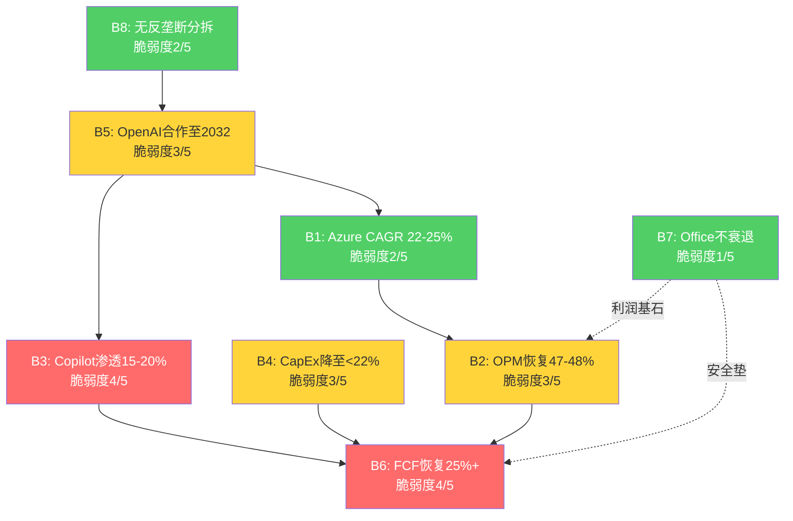
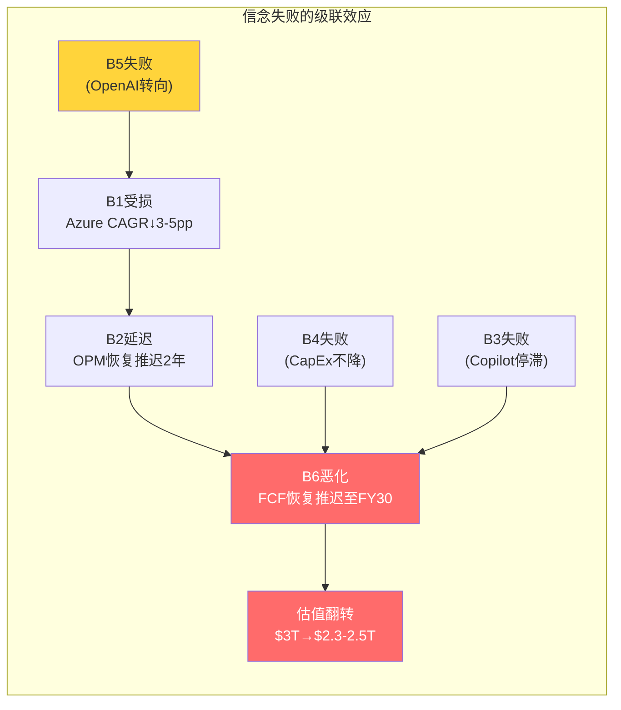
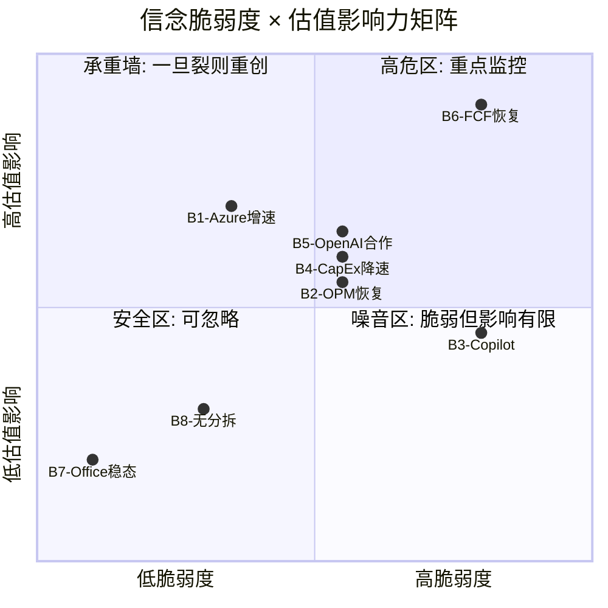
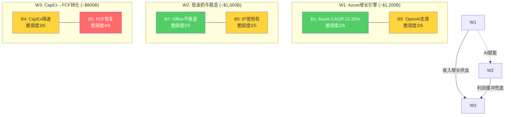
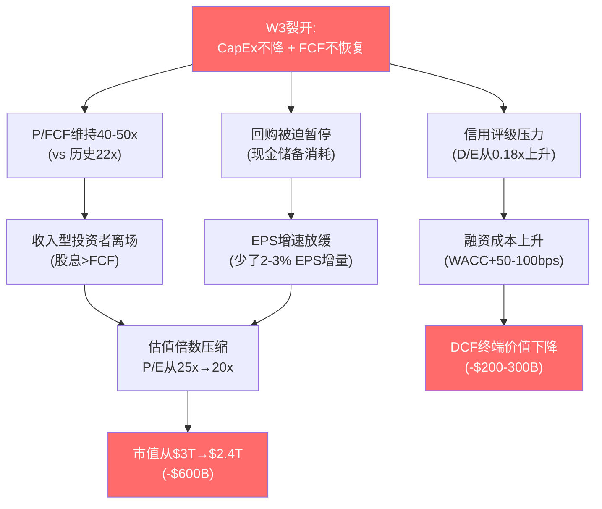

## Ch11: 信念反演深度分析 — 八项隐含信念的验证与失败映射

### 11.1 分析框架: 从种子信念到因果网络

Reverse DCF在Ch10中提炼了支撑$2,995B市值的八项隐含信念 [DM-P2A-001]。本章的任务是对每项信念执行**反演测试**: 不是论证"为什么信念成立"，而是系统性地寻找"信念在什么条件下失败"。反演的价值在于将模糊的定性判断转化为可观测的量化阈值——每项信念都将拥有明确的"失败触发线"和"失败后估值影响"。

更重要的是，八项信念之间存在深层因果关联。单独分析每项信念会产生误导——真正的风险不在于某项信念的孤立失败，而在于**信念失败的级联传导**。本章的核心产出是一张完整的信念因果网络图，揭示哪些信念是"承重节点"(失败后引发多米诺效应)、哪些是"叶节点"(失败后影响可控)。

### 11.2 B1: Azure五年CAGR 22-25% — 增长引擎的减速曲线

**市场隐含路径**

$3T估值要求Intelligent Cloud分部从当前$32.9B/Q(年化$132B)增长至FY30约$250B+ [DM-P2A-002]。Azure作为IC收入的约75%(~$99B年化)，需在五年内增至$190B+，对应5Y CAGR约14%。但考虑到IC中传统SQL Server/Windows Server(增速仅个位数)的拖累，Azure本身需维持22-25%的CAGR才能拉动整体 [DM-P2A-003]。

市场隐含的减速曲线为:

| 财年 | Azure增速 | 隐含Azure收入($B) | 驱动力 |
|------|----------|------------------|--------|
| FY26 | ~35% | ~$100B | AI推理+企业迁移 |
| FY27 | ~28% | ~$128B | Copilot间接消耗+CRPO释放 |
| FY28 | ~23% | ~$157B | AI Agent平台化 |
| FY29 | ~19% | ~$187B | 规模效应+定价权 |
| FY30 | ~15% | ~$215B | 成熟期稳态增速 |

**反演路径: 供给约束 vs 需求见顶**

当前Azure 39%增速中，AI贡献约12-13个百分点 [DM-P2A-004]。管理层指引Q3 FY26 CC增速31-32%，环比减速的原因之一是GPU产能约束(预计持续至2026年6月) [DM-P2A-005]。这引出一个关键分叉:

- **如果减速源于供给约束**: 产能瓶颈解除后(2026下半年)Azure增速可能反弹至35%+，B1信念不仅安全，甚至可能超额完成。验证信号: FY27 Q1-Q2 Azure增速回升至34%+。
- **如果减速源于需求见顶**: AI推理需求的S曲线拐点已过高速增长期，企业迁移进入后半程。这意味着39%→31%不是暂时的，而是结构性减速的开端。验证信号: FY27 Q1-Q2 Azure增速继续下行至28%以下。

CRPO提供了前瞻验证: 剔除OpenAI后CRPO同比+28% [DM-P2A-006]，与22-25%的5Y CAGR目标一致。但CRPO转化为收入存在时间差(平均2-3年)，短期内CRPO的增速更反映签约热度而非实际消耗速度。

**失败条件与估值影响**

若Azure 5Y CAGR降至18%以下(FY30 Azure收入$170B而非$215B)，IC分部收入将比预期少$45B+/年 [DM-P2A-007]。以IC的OPM 42%和15x P/OI倍数估算，市值影响约-$280B至-$500B(视利润率同步恶化程度)。

**脆弱度评估: 2/5(较坚实)**。Azure的企业渗透率仍处于S曲线中段(全球企业云渗透率约35-40%)，AI推理需求的增量尚未充分释放。22-25%的5Y CAGR在云行业历史规律中属于可实现区间——AWS从2015年的$7.9B增至2020年的$45.4B，CAGR 42%，远超此目标。MSFT面临的主要风险不是"增速不够"，而是"增速中AI占比过高导致毛利率下行"——这属于B2(OPM恢复)的管辖范围。

### 11.3 B2: 营业利润率恢复至47-48% by FY29 — 与折旧悬崖的赛跑

**隐含传导链**

Q2 FY26单季OPM达47.1% [DM-P2A-008]，看似已接近目标。但这是折旧悬崖全面冲击前的最后一个"好季度"。折旧模型显示，D&A将从当前稳态$9-10B/Q攀升至FY28基准情景$14-16B/Q、FY29峰值$17-19B/Q [DM-P2A-009]。

OPM恢复的核心等式:

$$OPM = 1 - \frac{COGS + OPEX + D\&A}{Revenue}$$

假设COGS/Revenue和OPEX/Revenue维持FY26水平(32%和21%)，OPM完全取决于D&A/Revenue的轨迹:

| 情景 | FY28 D&A/Q | FY28 Rev/Q | D&A/Rev | 隐含OPM |
|------|-----------|-----------|---------|---------|
| 乐观 | $13B | $105B | 12.4% | 45.5% |
| 基准 | $15B | $95B | 15.8% | 42.0% |
| 悲观 | $18B | $90B | 20.0% | 37.5% |

[DM-P2A-010] 基准情景下FY28 OPM约42%——距47%目标还有500bps的缺口。恢复至47%+需要以下三个条件中至少两个同时成立:

1. **收入增速维持18%+/年**(FY28 Revenue $420B+)，使分母增长跑赢D&A
2. **CapEx在FY27-FY28显著降速**，减缓后续D&A增量的积累
3. **Azure AI毛利率从当前估算的45-50%提升至60%+**，改善混合GPM

**关键转折: FY27-FY29的"利润率幻觉消退期"**

投资者需理解一个重要的会计现象: FY25-FY26的高OPM(45-47%)部分受益于D&A滞后——$80-100B的年化CapEx尚未完全进入损益表。FY28-FY29将是D&A集中释放的窗口期，OPM可能从47%下探至42%再回升 [DM-P2A-011]。这不意味着经营恶化——OCF可能持续增长——但利润表层面的"利润率幻觉消退"将考验市场耐心。

**失败条件与估值影响**

若OPM持续停在42%无法恢复(FY29 OPM 42% vs 目标47%)，以FY29 Revenue $500B计算，营业利润差距约$25B/年。以12x P/OI倍数估算，市值影响约-$200B至-$400B [DM-P2A-012]。

**脆弱度评估: 3/5(中等)**。D&A压力是确定性事件(已投入的CapEx必然折旧)，但MSFT在P&BP分部(OPM 60.3%)拥有强大的利润率缓冲。真正的危险不是OPM下降本身，而是市场对利润率下降的过度反应——如果投资者将暂时性的D&A压力误读为结构性恶化，估值倍数可能被双重压缩(利润下降 × P/E下降)。

### 11.4 B3: Copilot渗透15-20% by FY28 — 最脆弱的增长叙事

**从3.3%到15%: 需要什么?**

当前Copilot付费座位1500万 / M365总用户4.5亿 = 3.3%渗透率 [DM-P2A-013]，年化run-rate约$5.4B(按$30/月上限，实际ARPU因批量折扣可能更低)。15%渗透率对应6750万座位，意味着FY28前需净增5250万付费用户——平均每季度增加650万。

座位增速的SaaS历史类比:

| 产品 | 起始渗透率 | 终态渗透率 | 达成时间 | S曲线特征 |
|------|-----------|-----------|---------|----------|
| Teams | ~2% (2017) | 30%+ (2021) | 4年 | COVID催化跳跃 |
| Slack | ~5% (2015) | 8% (2020) | 5年 | 增长停滞 |
| Zoom | ~3% (2019) | 25% (2021) | 2年 | COVID催化+回落 |
| GitHub Copilot | ~1% (2022) | ~5% (2024) | 2年 | 开发者早采纳 |

[DM-P2A-014] Teams的先例最具参考价值——同样是M365生态内的附加产品，同样依赖企业IT部门统一部署。但Teams的爆发得益于COVID这一外生催化剂(被迫远程办公)，Copilot缺乏类似的"强制采用"事件。

**三重阻力分析**

1. **定价阻力**: $30/月/用户意味着5000人企业年增$1.8M IT支出。在企业AI预算竞争中(同时评估ChatGPT Enterprise $60/月、Google Gemini for Workspace $30/月、内部LLM部署)，Copilot的ROI证明尚不充分 [DM-P2A-015]。CFO Amy Hood强调"gross margin profile and lifetime value"而非短期货币化，暗示管理层自己也认为Copilot仍处于投入期。

2. **部署阻力**: Fortune 500中70%"已采用"Copilot，但"采用"与"全面部署"之间存在巨大鸿沟 [DM-P2A-016]。企业采购周期通常需要12-18个月(pilot→评估→预算审批→全面部署)。若2024年开始pilot，最早的全面部署也要到2025年底至2026年中。

3. **替代阻力**: 开源LLM(Llama 3、Mistral)的快速进步使企业可以在不购买Copilot的情况下获得类似的AI辅助能力。自建AI助手的成本在下降，而Copilot的$30定价在上升。

**失败条件与估值影响**

若FY28渗透率停在8%(3600万座位)而非15%，Copilot年化收入约$13B vs 预期$24B，差距$11B [DM-P2A-017]。以P&BP的15x P/S倍数估算，直接市值影响约-$165B。但Copilot的真正估值意义不在直接收入——它是MSFT"AI货币化"叙事的最核心载体。如果Copilot失速，市场将重新评估MSFT整个$80B+/年CapEx的回报前景，导致估值倍数的系统性下调。叙事影响可能大于财务影响，总市值冲击约-$100B至-$200B。

**脆弱度评估: 4/5(较脆弱)**。Copilot是八项信念中不确定性最高的一项——既有指数增长的可能(如果AI生产力溢价被证明)，也有增长停滞的风险(如果企业ROI证明失败)。3.3%→15%的跳跃在企业SaaS历史中缺乏无外生催化剂的先例。

### 11.5 B4: CapEx/Revenue从37%降至<22% by FY29 — AI军备竞赛的囚徒困境

**当前投入强度的历史坐标**

Q2 FY26 CapEx/Revenue 36.8% [DM-P2A-018]，管理层指引FY26全年PPE CapEx约$80B。对比上一轮CapEx周期(FY16-FY18)，CapEx/Revenue增量仅4个百分点(6%→10%)，当前周期增量已达12个百分点(13%→25%) [DM-P2A-019]。强度差异2.5倍。

**AI军备竞赛逻辑: 为什么MSFT不敢率先降速**

Meta FY26 CapEx指引$60-65B、Google $75B、Amazon $100B+——三大竞争对手同步加注 [DM-P2A-020]。在GPU产能仍然紧缺的环境下，降速意味着:
- 失去NVIDIA下一代(B200/B300)的优先供应配额
- Azure AI产能增速落后于AWS/GCP，客户可能转向竞争对手
- OpenAI的$250B承购合同需要持续扩容才能履行

这是一个经典的囚徒困境: 所有参与者都知道CapEx过度投入的风险，但没有人敢率先退出，因为退出的惩罚(失去AI市场份额)大于继续投入的代价(FCF暂时承压)。

**降速的前提条件**

CapEx/Revenue从37%降至22%需要两个条件之一:
1. **收入快速增长**(分母扩大): FY29 Revenue $500B时，CapEx $110B即对应22%
2. **CapEx绝对额下降**(分子缩小): 需要AI基础设施建设进入成熟期

条件1更为现实——收入增长18%/年可在3年内将CapEx/Revenue从37%压缩至25%左右(假设CapEx年增5%)。条件2在FY28前几乎不可能发生。

**失败条件与估值影响**

若CapEx/Revenue在FY29仍维持28%+(即CapEx $140B+ vs Revenue $500B)，这将直接连锁至B6(FCF无法恢复)。CapEx不降速的独立估值影响约-$150B至-$300B [DM-P2A-021]，但其真正破坏力在于对B6的传导——这一点将在信念因果链中详述。

**脆弱度评估: 3/5(中等)**。历史先例(FY16-FY18周期)表明CapEx/Revenue最终会回归稳态，但"何时"是关键变量。AI军备竞赛的囚徒困境可能将CapEx高峰期从预期的3年延长至5年。

### 11.6 B5: OpenAI合作持续至2032年 — 关联方承诺的可靠性

**合同框架的法律保障**

2025年10月重组后的条款结构 [DM-P2A-022]:
- API独占: 合作开发的API产品在Azure独占提供
- IP使用权至2032年(不含消费硬件)
- AGI条款变更: MSFT不再因AGI宣布而失去权利
- MSFT可独立追求AGI

法律层面的保障是坚实的。但法律保障与经济现实之间存在差距。

**经济动态的变化**

OpenAI当前年化消耗约$12-15B Azure资源，$250B承购合同意味着未来10年平均消耗$25B/年——需要翻倍 [DM-P2A-023]。这要求OpenAI自身收入持续高速增长(当前年化收入约$5-6B)。如果OpenAI在FY28-FY30实现盈利自主(IPO后)，其降低Azure依赖的动机将增强:
- 非API产品已可部署至其他云(2025年10月新条款)
- ROFR取消意味着OpenAI的新计算需求不再必须给Azure [DM-P2A-024]
- 估值$300B+的独立上市公司将追求多云战略以降低集中风险

**CRPO减值风险**

$625B CRPO中约$281B来自OpenAI(45%) [DM-P2A-025]。若OpenAI在FY28重新协商$250B承购合同(缩减30%)，CRPO将一次性减少约$75B，对Azure收入的前瞻信号产生严重负面冲击。即使实际Azure收入受影响有限(OpenAI当前消耗仅$12-15B/年)，市场叙事的冲击可能导致估值倍数压缩。

**失败条件与估值影响**

极端情景(OpenAI全面转向)的概率低于10%。更现实的风险是"合作降级"——OpenAI逐步将非API工作负载迁移至GCP/AWS，API独占维持但新增承购减少。这一情景下，CRPO减少$100-150B，Azure AI收入直接冲击$3-5B/年 [DM-P2A-026]，市值影响-$150B至-$250B。

**脆弱度评估: 3/5(中等)**。法律框架稳固但关系动态在变化。27%股权+$250B承购+IP使用权构成了多重绑定，短期内合作降级的概率有限。真正的风险窗口在FY28-FY30(OpenAI可能IPO后追求独立)。

### 11.7 B6: FCF Margin恢复至25%+ by FY28 — 最被市场关注的变量

**Q2 FY26: 现金流断裂的警报**

Q2 FY26 FCF仅$5.9B，FCF Margin 7.2% [DM-P2A-027]。CapEx $29.9B吞噬了OCF $35.8B的83.5%。更令人警惕的是: 当季股息$6.8B首次超过FCF——Microsoft需要动用现金储备来支付股息 [DM-P2A-028]。

**FCF恢复的三条路径**

| 路径 | FCF 25%+达成时间 | 条件 | 概率 |
|------|-----------------|------|------|
| 乐观 | FY27H2 | CapEx FY27降至$70B + Rev $350B+ | 20% |
| 基准 | FY28 | CapEx FY28降至$80B + Rev $420B+ | 45% |
| 悲观 | FY29+ | CapEx维持$90B+ 至FY29 | 35% |

[DM-P2A-029] 基准路径的FCF Bridge:
- FY28 Revenue: ~$420B
- FY28 OCF: ~$170B (OCF/Revenue ~40%, 维持历史水平)
- FY28 CapEx: ~$80B (CapEx/Revenue ~19%)
- FY28 FCF: ~$90B (FCF Margin ~21%)

即使在基准路径下，FY28 FCF Margin也只能恢复至21%左右——距25%仍有差距。完全恢复至25%+需要FY29收入$500B+且CapEx降至$100B以下。

**股息可持续性的压力测试**

FY25股息$24.1B，CAGR 9.9% [DM-P2A-030]。以Q2 FY26的FCF节奏(年化~$24B)，年化FCF仅够覆盖股息。回购已被迫压缩——FY22回购$32.7B为峰值，FY25降至$18.4B(-44%)。若CapEx维持$30B/Q水平，年化净现金流为负$33B [DM-P2A-031]。$94.6B现金储备仅够支撑约3年这种烧钱速度。

需要强调的是: 股息削减对MSFT来说几乎不可想象——这将摧毁其"防御性科技股"的市场定位，触发大量收入型基金的被迫卖出。因此CapEx降速(而非股息削减)是唯一可接受的调整路径。

**失败条件与估值影响**

若FY28 FCF Margin仍低于18%(FCF <$75B)，P/FCF将维持在35-40x——远高于MSFT历史中位数22x [DM-P2A-032]。市场将被迫接受"这不是暂时的CapEx高峰，而是AI时代的新常态"。估值从$3T向$2.3-2.5T调整(-$500B至-$700B)是合理的下行情景。

**脆弱度评估: 4/5(较脆弱)**。FCF恢复是B4(CapEx降速)的直接函数——B4失败意味着B6必然失败。这是八项信念中对估值影响最大的一项，也是市场当前定价中已部分反映(P/E 25.1x为Mega5最低)的变量。

### 11.8 B7: Office/Windows不衰退 — 估值的安全垫

**四层锁定的定量评估**

P&BP分部每季度贡献$20.6B营业利润，OPM 60.3% [DM-P2A-033]。这一利润基石建立在四层技术锁定之上:

| 锁定层 | 组件 | 替代成本(Fortune 500) | 迁移概率 |
|--------|------|---------------------|---------|
| L1 身份层 | AD/Entra ID | $2-4M/年(IdP替代) | <2% |
| L2 SSO层 | SAML/OAuth集成 | $1-2M(10000+ SaaS集成) | <3% |
| L3 设备管理 | Intune/Autopilot | $0.5-1M(Windows设备不可替代) | <5% |
| L4 协作层 | Teams/SharePoint | $3-8M(流程重构) | <10% |

[DM-P2A-034] 总迁移成本$25-45M(Fortune 500级)，每用户$167-300/年——这是一道几乎不可逾越的护城河。公开记录中找不到任何大型企业从M365完全迁移至Google Workspace的案例。流失率估算5-8%，且净流失可能为负(Google→M365迁入正在加速，部分因Google Workspace 2025年涨价16-22%) [DM-P2A-035]。

**唯一的尾部风险: AI Agent范式颠覆**

10年以上的时间维度内，如果AI Agent取代了传统的"人操作软件"模式(用户不再打开Word/Excel/PowerPoint，而是通过自然语言指令让AI完成所有工作)，"生产力套件"的概念本身将被重新定义。但这一颠覆即使发生，MSFT也是最可能的主导者(凭借Copilot+Azure AI+企业数据层的组合)，而非被颠覆者。

**脆弱度评估: 1/5(最坚实)**。这是八项信念中确定性最高的一条。Office/Windows的估值贡献可以视为"无风险底线"。

### 11.9 B8: 无重大反垄断分拆 — 罚款概率远大于分拆

**EU DMA + FTC调查的路径分析**

EU对Teams捆绑M365的反垄断调查进行中。FTC对MSFT投资OpenAI是否构成"实质控制"进行审查 [DM-P2A-036]。历史先例清晰: Google购物搜索罚款$2.7B(2017)、Apple iOS侧载开放(2024)——处罚形式为罚款+行为限制，从未触及结构性分拆。

- **Teams解绑情景**(概率40%): 如果EU要求M365与Teams分开销售，假设10%用户转向Slack/Zoom，影响约$5-8B收入/年 [DM-P2A-037]。对$305B年收入的影响<3%。
- **OpenAI控制认定**(概率15%): 如果FTC认定MSFT对OpenAI构成"实质控制"，可能要求减持股权或修改独占条款。这将间接影响B5，但不直接触发分拆。
- **结构性分拆**(概率<5%): 当前美国政治环境(反大科技情绪虽存在但缺乏立法基础)使分拆在本届政府任期内几乎不可能。

**失败条件与估值影响**

即使最严厉的非分拆处罚(Teams解绑+罚款+OpenAI条款修改)全部发生，叠加影响约$10-15B收入/年 + 一次性罚款$5-10B。以15x P/S估算，市值影响约-$150B至-$225B [DM-P2A-038]。但分拆情景(概率<5%)的影响量级完全不同——Azure+Office被拆分将摧毁交叉补贴和生态协同，市值影响超-$1T。

**脆弱度评估: 2/5(较坚实)**。罚款>分拆的概率高达85%+。监管风险已在当前估值中得到部分反映(P/E低于SPY)。

### 11.10 信念间因果链: 多米诺效应的完整映射

八项信念之间的因果关系构成了一个有向网络。理解这个网络是判断"哪几项信念失败会翻转估值结论"的关键。

**因果链解读**:

1. **B5→B1→B2链**: OpenAI合作支撑Azure AI增速(B1中12-13pp的AI贡献)→Azure增速驱动IC收入增长→收入增长跑赢D&A从而支撑OPM恢复(B2)。如果B5断裂，B1的增速可能从25%降至18-20%(失去AI增量)，进而使B2的OPM恢复推迟1-2年。

2. **B4→B6链**: CapEx降速(B4)直接决定FCF恢复(B6)——这是最刚性的因果关系，中间没有任何缓冲变量。B4每延迟1年降速，B6的恢复时间也相应延迟1年。

3. **B3→B6链**: Copilot的高毛利增量收入(估算GPM 80%+，因AI推理成本由Azure承担)直接增厚OCF，加速FCF恢复。但这条链的传导强度取决于Copilot的收入规模——在$5B(当前)水平上影响有限，需达$15B+才产生实质性影响。

4. **B7的安全垫角色**: Office/Windows的$80B+年化营业利润是所有其他信念失败时的"最后防线"。即使B1-B6全部部分失败(不是完全失败)，P&BP的稳定现金流仍能支撑$1.5-1.8T的底部估值。

### 11.11 "最少几项信念失败即翻转评级"分析

**评级翻转的量化门槛**

当前估值$2,995B。基于Ch10的Reverse DCF分析，维持$3T估值需要八项信念中至少六项为真。以下是不同失败组合的估值影响:

| 失败组合 | 概率估算 | 市值影响 | 残余估值 | 评级影响 |
|---------|---------|---------|---------|---------|
| B3单独失败 | 25% | -$100~200B | $2.8-2.9T | 维持(估值微调) |
| B6单独失败 | 20% | -$500~700B | $2.3-2.5T | 翻转(下调至审慎关注) |
| B3+B6同时失败 | 12% | -$600~900B | $2.1-2.4T | 翻转(下调至审慎关注) |
| B1+B5链断裂 | 8% | -$400~700B | $2.3-2.6T | 翻转(下调至审慎关注) |
| B4+B6+B3同时失败 | 5% | -$800~1200B | $1.8-2.2T | 强力翻转 |

[DM-P2A-039] **核心结论: 单项信念失败中，只有B6(FCF恢复失败)具有独立翻转评级的能力**。B3(Copilot)的独立失败影响有限(叙事冲击大于财务冲击)。但B3+B6的双重失败是最危险的组合——概率约12%，且两者之间存在正相关(Copilot失速→高毛利增量收入减少→FCF恢复更慢)。

### 11.12 本章核心判断

八项信念的反演分析揭示了$3T估值的结构性特征: **这是一个"高确信底部+高不确定性上行"的组合** [DM-P2A-040]。

底部的确定性来自B7(Office/Windows不衰退)——P&BP每年$80B+营业利润构成的"估值地板"约$1.5-1.8T(12-15x P/OI)。上行的不确定性集中在B3(Copilot渗透)和B6(FCF恢复)——它们将决定MSFT是"暂时被CapEx压制的AI赢家"还是"AI军备竞赛的过度投入者"。

信念因果链的最关键发现是: **B6(FCF恢复)是整个网络的终端汇聚节点**——几乎所有其他信念的失败都会最终传导至B6。这意味着FCF恢复的时间表是评估MSFT估值的单一最重要变量。投资者不需要逐一追踪八项信念——只需密切监测CapEx/Revenue和FCF Margin两个指标，就能捕捉绝大部分信念动态 [DM-P2A-041]。

---

## Ch12: 承重墙脆弱度表 — $3T估值的三根支柱

### 12.1 承重墙定义: 从信念到结构

Ch11的八项信念可以进一步抽象为三堵"承重墙"——支撑$3T估值大厦的核心结构支柱 [DM-P2A-042]。承重墙与信念的区别在于: 信念是可独立验证的命题，承重墙是信念的组合结构。一项信念的失败可能只是墙面裂缝，但承重墙的倒塌意味着整体估值结构的崩溃。

三堵承重墙:

| 承重墙 | 构成信念 | 功能 | 估值贡献 |
|--------|---------|------|---------|
| **W1: Azure增长引擎** | B1(Azure增速) + B5(OpenAI合作) | 收入驱动 | ~$1,200B (40%) |
| **W2: 现金奶牛稳态** | B7(Office不衰退) + B5(部分) | 利润基石 | ~$1,000B (33%) |
| **W3: CapEx→FCF转化** | B4(CapEx降速) + B6(FCF恢复) | 估值验证 | ~$800B (27%) |

### 12.2 W1: Azure增长引擎 — 收入驱动力

**承重强度评估**

Azure增长引擎由B1(Azure增速)和B5(OpenAI合作)共同构成。IC分部当前年化收入约$132B，其中Azure贡献约$99B [DM-P2A-043]。按22-25%的5Y CAGR计算，FY30 Azure收入将达$190-215B，贡献合并层面约35-40%的收入增量。

W1的估值贡献约$1,200B(占$3T的40%)，基于以下推算:
- FY30 IC营业利润: ~$100B (Revenue $280B × OPM 36%)
- 给予增长溢价12-15x P/OI
- 隐含IC分部估值: ~$1,200-1,500B

**组合脆弱度: 2.5/5**

B1(2/5)和B5(3/5)的简单平均为2.5。但这低估了B5对B1的传导风险——如果OpenAI合作降级(B5部分失败)，Azure AI增速的12-13pp贡献可能缩减至6-8pp，将Azure整体增速从39%拉低至30-33%。这意味着B5的失败会将B1的脆弱度从2/5推升至3/5。

**W1裂开时的估值影响**

| 裂缝程度 | Azure 5Y CAGR | FY30 IC Revenue | 估值影响 |
|---------|--------------|-----------------|---------|
| 表面裂缝 | 20% (vs 22-25%目标) | $240B | -$100B |
| 深层裂缝 | 15% | $200B | -$300B |
| 墙体倒塌 | <12% | <$180B | -$500B+ |

深层裂缝(CAGR降至15%)需要Azure增速在FY27就跌至20%以下——考虑到CRPO $344B(剔除OpenAI后)的前瞻保障 [DM-P2A-052]，这一情景在FY28前概率很低。

### 12.3 W2: 现金奶牛稳态 — 利润基石

**承重强度评估**

P&BP分部是整个MSFT的利润核心: Q2 FY26单季营业利润$20.6B，年化$82B+，OPM 60.3% [DM-P2A-044]。M365的4.5亿商业座位、5-8%的极低流失率、$25-45M的企业迁移成本构成了全球科技行业最深的护城河之一。

W2的估值贡献约$1,000B(占$3T的33%):
- P&BP年化营业利润: ~$82B
- 给予稳定溢价12-13x P/OI(低增速但极高确定性)
- 隐含P&BP分部估值: ~$1,000-1,065B

**组合脆弱度: 1.5/5(最稳固)**

B7(1/5)是八项信念中最坚实的一条。B5(3/5)对W2的影响有限——即使OpenAI合作完全终止，Office/LinkedIn/Dynamics的收入和利润率不会受到直接冲击。OpenAI的IP使用权主要影响Copilot(属于W3的B3变量)，对W2的传导路径较弱。

W2是$3T估值中的"不可摧毁层"。即使W1和W3同时出现严重裂缝，W2提供的$1,000B估值底线意味着MSFT的最低合理估值不会低于$1.5T(W2 + MPC残值 + 净现金) [DM-P2A-051]。

**W2裂开的极端情景**

唯一能动摇W2的力量是"范式颠覆"——如果AI Agent在10年内取代传统生产力软件，M365的订阅基础将面临结构性萎缩。但正如Ch11分析所述，即使这一颠覆发生，MSFT凭借Copilot+Azure AI+企业数据层的组合，更可能成为新范式的主导者而非牺牲者 [DM-P2A-045]。

### 12.4 W3: CapEx→FCF转化 — 估值验证器

**承重强度评估**

W3是三堵墙中最脆弱的一堵。它由B4(CapEx降速)和B6(FCF恢复)构成——两项信念的脆弱度分别为3/5和4/5，组合脆弱度3.5/5 [DM-P2A-046]。

W3的功能不是"创造价值"，而是"验证价值"——Azure的增长(W1)和Office的利润(W2)创造了经济价值，但这些价值能否传导为股东现金回报，完全取决于CapEx→D&A→FCF的转化链。Q2 FY26 FCF $5.9B(年化$24B)相比FY24的$74.1B下降68%，直观地展示了W3当前承受的压力。

W3的估值贡献约$800B(占$3T的27%):
- 隐含FY30 FCF: ~$150B+(基于$3T EV、WACC 9%、g 3%)
- 当前FCF yield仅2.16%(远低于科技股均值3-4%)
- $800B估值溢价代表市场对"FCF终将恢复"的信念

**W3裂开时的连锁反应**

W3的特殊之处在于: 它的失败不会直接减少W1或W2的经济价值，但会通过估值倍数的系统性压缩间接削减整体估值。逻辑链如下:

W3裂开的全链路估值影响:
- **直接影响**(FCF低于预期): -$300B至-$500B
- **倍数压缩**(投资者信心下降): -$200B至-$400B
- **融资成本上升**(如果被迫发债): -$100B至-$200B
- **总计**: -$600B至-$1,100B(从$3T降至$1.9-2.4T)

### 12.5 三墙之间的传导与缓冲

承重墙之间不是孤立的——它们通过现金流和利润率路径相互作用。

**W1→W3的正向传导**: Azure增长加速(W1变强)→IC收入增速跑赢D&A增速→OPM恢复更快→FCF恢复提前(W3变强)。反之，Azure减速→OPM恢复延迟→FCF承压更久。

**W2→W3的缓冲效应**: 即使W3出现严重裂缝(FCF长期低迷)，P&BP每年$82B+的营业利润(W2)确保MSFT永远不会面临真正的现金流危机——最坏情况下，削减回购+暂停非核心投资即可恢复正FCF。$94.6B现金储备 + 0.18x D/E提供了额外的3-5年缓冲 [DM-P2A-047]。

**W1→W2的AI赋能**: Azure AI基础设施(W1)为Copilot提供底层能力→Copilot提升M365的ARPU和黏性(W2)。这一传导目前尚处于早期，但如果Copilot在FY28达到15%渗透率，W1对W2的赋能将从"潜在"转为"实质"。

### 12.6 脆弱度总排序与压力测试

**脆弱度排序(从最脆弱到最稳固)**:

| 排序 | 承重墙 | 组合脆弱度 | 倒塌概率(5年内) | 倒塌时估值影响 |
|------|--------|-----------|----------------|--------------|
| 1 | **W3: CapEx→FCF转化** | 3.5/5 | 25-30% | -$600B~$1,100B |
| 2 | **W1: Azure增长引擎** | 2.5/5 | 10-15% | -$300B~$500B |
| 3 | **W2: 现金奶牛稳态** | 1.5/5 | <3% | -$200B~$400B |

[DM-P2A-048] **关键洞察: W3是唯一一堵在5年内有实质性倒塌概率(25-30%)的承重墙**。W1的倒塌需要Azure增速连续3年低于15%——在当前云渗透率和AI需求背景下概率较低。W2的倒塌需要M365护城河被攻破——在AD锁定和5-8%流失率的保护下几乎不可能。

**极端压力测试: 两墙倒塌**

| 情景 | W1状态 | W2状态 | W3状态 | 残余估值 |
|------|--------|--------|--------|---------|
| 基准(全部稳固) | 稳固 | 稳固 | 稳固 | $3.0T |
| W3单独裂开 | 稳固 | 稳固 | 裂开 | $2.2-2.5T |
| W1+W3同时裂开 | 裂开 | 稳固 | 裂开 | $1.8-2.0T |
| 仅W2稳固(极端) | 倒塌 | 稳固 | 倒塌 | $1.5-1.7T |

即使在最极端的"仅W2稳固"情景下，MSFT的底部估值仍有$1.5-1.7T——这得益于Office/Windows $80B+年化营业利润构成的"估值地板"。这意味着从当前$3T到$1.5T的最大下行空间约50% [DM-P2A-049]。但实现这一极端情景需要Azure增速崩溃至个位数且FCF连续3年低于$50B——联合概率不到3%。

### 12.7 本章核心判断

三堵承重墙的分析揭示了MSFT估值的非对称结构 [DM-P2A-050]:

**下行有底**: W2(现金奶牛)提供了约$1.5T的"硬底"——Office/Windows的护城河深度使其几乎不受AI周期波动的影响。即使AI投资完全失败(概率极低)，MSFT仍然是一家年利润$80B+、OPM 60%的现金流机器。

**上行受限于W3**: 从$3T向$4T+的上行需要W3(CapEx→FCF转化)被充分验证——即CapEx/Revenue降至20%以下、FCF Margin恢复至25%+。在此之前，市场不会给予更高的估值倍数。

**当前的$3T定价是在"赌W3会恢复"**: P/E 25.1x(Mega5最低)已经反映了市场对W3的部分担忧。如果FY27-FY28的数据证明FCF确实在恢复(CapEx/Revenue降至25%以下)，估值有向$3.5T修复的空间(+17%)。反之，如果FY27 CapEx继续攀升至$90B+且FCF Margin仍低于15%，估值将向$2.3-2.5T调整(-17-23%)。

这一非对称结构——下行有底($1.5T)但上行需要时间验证——是后续场景分析和概率加权估值的核心出发点。