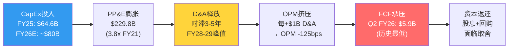
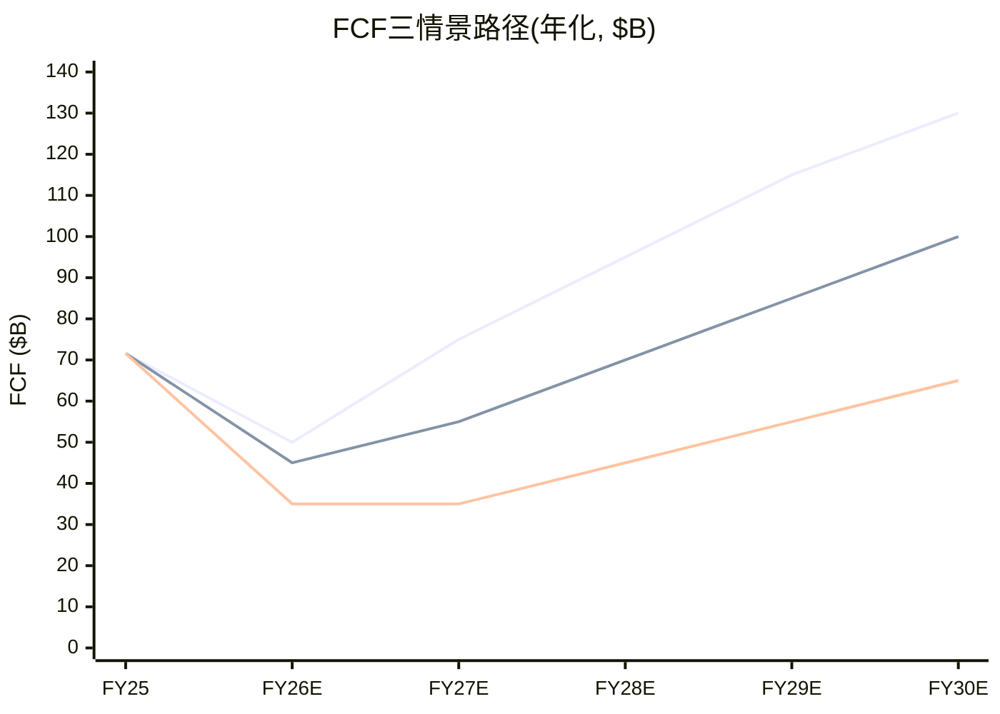
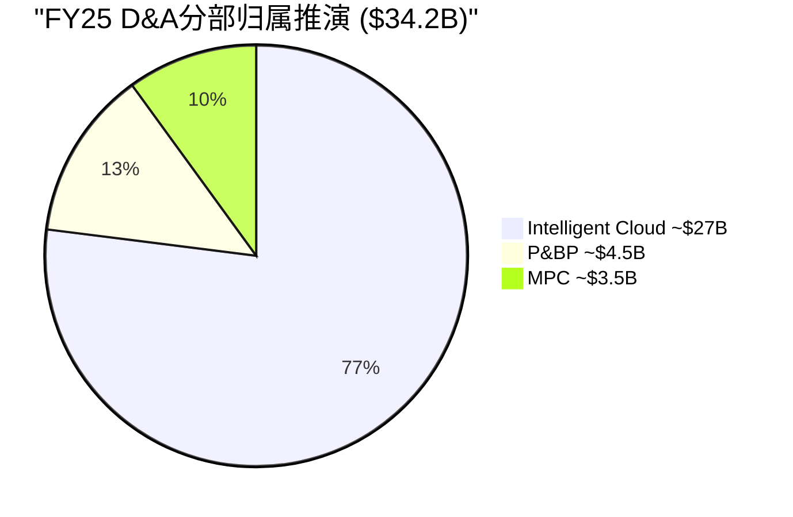
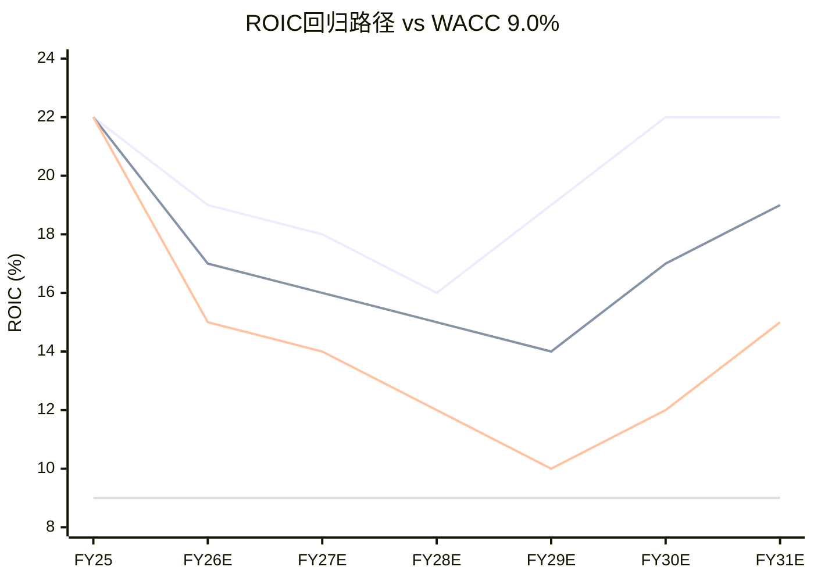
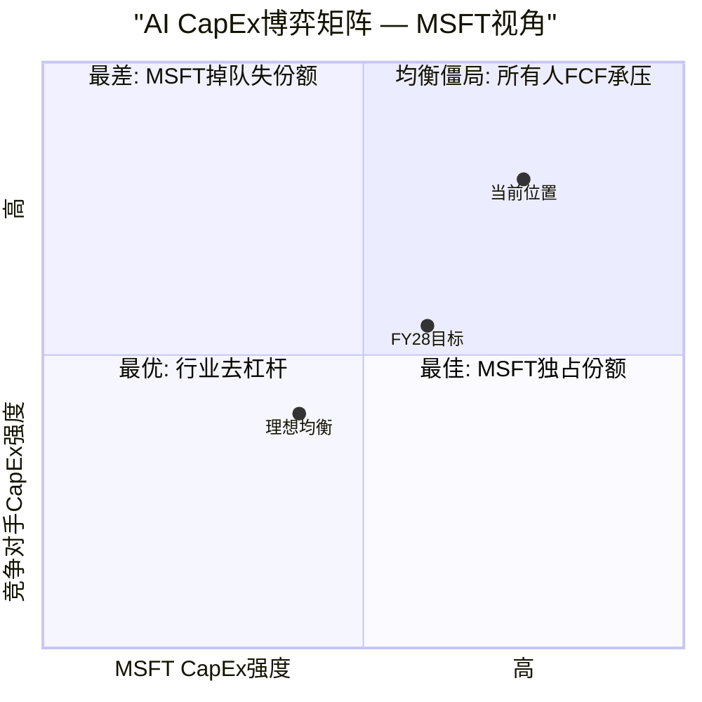
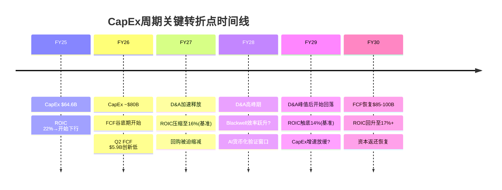

## Ch13: CapEx→D&A→OPM→FCF传导链 — 资本周期的定量核心

### 13.1 传导链机制: 从资本投入到现金流的五级联动

理解Microsoft当前估值争议的核心，需要追踪一条完整的因果链: **CapEx(资本支出) → PP&E(固定资产) → D&A(折旧摊销) → OPM(营业利润率) → FCF(自由现金流)**。这五个变量环环相扣，任何一级的异常波动都会在下游产生放大效应。

**传导机制拆解** [DM-P2B-001]:

第一级，CapEx投入。FY2025全年CapEx $64.6B，Q2 FY26单季创纪录$29.9B(CapEx/Rev 36.8%) [DM-P2B-002]。管理层指引FY26全年约$80B [DM-P2B-003]。这些资金流向两类资产: 约2/3投向短周期资产(GPU/CPU服务器，使用寿命3年)，约1/3投向长周期资产(数据中心建筑，使用寿命5年) [DM-P2B-004]。

第二级，PP&E膨胀。FY2025末PP&E净值已达$229.8B [DM-P2B-005]，是FY2021 $59.7B的3.8倍。PP&E的快速膨胀意味着折旧基数在持续扩大——即使CapEx明天归零，已在账上的$229.8B资产仍需在未来3-5年内完成折旧。

第三级，D&A时滞效应。这是传导链中最关键也最容易被忽视的环节。**当前季度的D&A反映的不是当前的CapEx，而是3-5年前的投入** [DM-P2B-006]。Q2 FY26的D&A $9.2B主要来自FY22-FY24期间$96.5B累计CapEx的折旧。FY25的$64.6B和FY26预计的$80B CapEx的D&A高峰，要到FY27-FY29才会完全释放。这意味着即使MSFT在FY27开始放缓资本支出，折旧压力仍将在FY28-FY29持续攀升——这是一条已经锁定的路径，管理层无法通过削减未来CapEx来回避。

第四级，OPM挤压。D&A是营业费用的组成部分，直接压缩营业利润率。以Q2 FY26为基准($81.3B收入，$9.2B D&A，OPM 47.1%)，D&A已占收入的11.3% [DM-P2B-007]。当D&A攀升至$15B/Q(基准情景FY28)，假设收入增长至$95B/Q，D&A占比将升至15.8%——纯D&A引致的OPM下压约450bps。

第五级，FCF承压。FCF = OCF - CapEx。CapEx在分子端(通过D&A压缩利润和经营现金流)和分母端(直接扣减)同时挤压FCF。Q2 FY26 FCF仅$5.9B(OCF $35.8B - CapEx $29.9B)是这一双重挤压的极端体现 [DM-P2B-008]。



**关键时滞的数学直觉**: FY25 $64.6B CapEx中，约$43B投向3年期资产(GPU/CPU)，约$22B投向5年期资产(建筑)。$43B的3年直线折旧 = $14.3B/年 = $3.6B/Q。$22B的5年直线折旧 = $4.4B/年 = $1.1B/Q。合计贡献$4.7B/Q增量D&A，在FY26-FY28期间逐步进入损益表。叠加FY26E $80B CapEx的同等结构，FY27-FY28将面临FY25和FY26两个高投入年份的D&A"叠加波" [DM-P2B-009]。

### 13.2 D&A路径建模: 三情景下的折旧悬崖

**历史D&A轨迹回溯** [DM-P2B-010]:

从年度口径看，D&A的增速在过去五年经历了一次质变:

| 财年 | CapEx | D&A | CapEx/D&A | D&A/Revenue |
|------|-------|-----|-----------|-------------|
| FY21 | $20.6B | $11.7B | 1.76x | 7.0% |
| FY22 | $23.9B | $14.5B | 1.65x | 7.3% |
| FY23 | $28.1B | $13.9B | 2.02x | 6.6% |
| FY24 | $44.5B | $22.3B | 2.00x | 9.1% |
| FY25 | $64.6B | $34.2B | 1.89x | 12.1% |

[DM-P2B-011] CapEx/D&A比率从FY21的1.76x稳定在近年的约2.0x，意味着每投入$2 CapEx，约$1进入当年D&A。但FY24-FY25 CapEx的爆炸性增长($44.5B→$64.6B)尚未完全反映在D&A中——当前$34.2B的年D&A主要消化FY21-FY23的投入。真正的折旧高峰尚未到来。

**季度D&A波动分析** [DM-P2B-012]:

| 季度 | D&A ($B) | YoY | D&A/Revenue |
|------|----------|-----|-------------|
| Q3 FY24 | $6.0B | +70% | 9.7% |
| Q4 FY24 | $6.4B | +65% | 9.9% |
| Q1 FY25 | $7.4B | +88% | 11.3% |
| Q2 FY25 | $6.8B | +15% | 9.8% |
| Q3 FY25 | $8.7B | +45% | 12.5% |
| Q4 FY25 | $11.2B | +76% | 14.7% |
| Q1 FY26 | $13.1B | +77% | 16.8% |
| Q2 FY26 | $9.2B | +35% | 11.3% |

值得注意的是Q1 FY26的$13.1B异常峰值(16.8%收入占比) [DM-P2B-013]，可能包含Activision Blizzard无形资产的加速摊销或一次性减值调整。Q2回落至$9.2B后，剔除异常的稳态D&A约$9-10B/Q [DM-P2B-014]。但即使以$10B/Q为新常态，年化$40B已较FY21的$11.7B增长了3.4倍。

**三情景D&A路径推演** [DM-P2B-015]:

建模假设: (1) 70%短周期资产(3年折旧) + 30%长周期资产(5年折旧); (2) 存量PP&E $229.8B按剩余寿命线性折旧; (3) 新增CapEx按情景设定。

**情景一: 乐观(CapEx FY27起降速至$60-65B/年)**

| 年度 | 新增CapEx | 季度D&A | 年化D&A | D&A/Revenue |
|------|----------|---------|---------|-------------|
| FY27E | $65B | $11-12B | $44-48B | 12.5% |
| FY28E | $60B | $13B | $52B | 12.4% |
| FY29E | $55B | $14B | $56B | 11.6% |
| FY30E | $50B | $13B | $52B | 9.6% |

[DM-P2B-016] 乐观情景下，D&A在FY29达到峰值$56B后回落，因FY25-FY26高投入期的3年期资产在FY28-FY29折完退出。OPM压力可控: 假设FY29收入$480B，D&A占比11.6%，较当前上升约30bps，收入增长足以消化。

**情景二: 基准(CapEx稳定在$75-80B/年)**

| 年度 | 新增CapEx | 季度D&A | 年化D&A | D&A/Revenue |
|------|----------|---------|---------|-------------|
| FY27E | $80B | $12B | $48B | 13.0% |
| FY28E | $80B | $15B | $60B | 14.3% |
| FY29E | $75B | $18B | $72B | 14.9% |
| FY30E | $70B | $17B | $68B | 12.6% |

[DM-P2B-017] 基准情景下，D&A在FY29达到峰值$72B(季度$18B)，是当前水平的约2倍。这将在FY28-FY29制造严重的OPM挤压: 以FY29收入$485B计算，D&A占比14.9%，较FY25的12.1%上升280bps。叠加其他费用项(R&D 11%、SG&A 10%)，OPM可能被压至约42% [DM-P2B-018]。

**情景三: 悲观(CapEx持续高位$90-100B/年)**

| 年度 | 新增CapEx | 季度D&A | 年化D&A | D&A/Revenue |
|------|----------|---------|---------|-------------|
| FY27E | $95B | $14B | $56B | 15.1% |
| FY28E | $100B | $18B | $72B | 17.1% |
| FY29E | $100B | $22B | $88B | 18.3% |
| FY30E | $95B | $21B | $84B | 15.6% |

[DM-P2B-019] 悲观情景是AI军备竞赛持续升级的极端假设。FY29 D&A峰值$88B(季度$22B)将使D&A/Revenue突破18%，OPM可能被压至37-38%——回到FY2017 Nadella转型早期的利润率水平。这一情景的发生概率约20%，但其影响是灾难性的。

**OPM挤压量化公式** [DM-P2B-020]:

以季度收入$80B为基准:
- 每增加$1B季度D&A → OPM下降约125bps
- 从当前$9B/Q到基准FY29的$18B/Q(+$9B) → OPM纯D&A压力约-1,125bps
- 但FY29收入预计增至~$120B/Q → 实际OPM压力约-750bps(收入增长部分抵消)
- 抵消后净OPM压力: 乐观-150bps / 基准-400bps / 悲观-800bps

### 13.3 FCF Bridge完整建模: 从经营现金流到股东手中的钱

**Q2 FY26实际FCF Bridge** [DM-P2B-021]:

这是一张让投资者不安的现金流瀑布图:

```
经营现金流(OCF):              $35.8B
  (-) 资本支出(CapEx):         -$29.9B   (消耗OCF的83.5%)
━━━━━━━━━━━━━━━━━━━━━━━━━━━━━━━━━━━━━━
自由现金流(FCF):               $5.9B     (仅转化16.5%)

资本返还:
  (-) 股息:                    -$6.8B    (覆盖率0.87x, 首次不足)
  (-) 股票回购:                -$7.4B
  (-) 债务偿还+其他:            -$3.0B
━━━━━━━━━━━━━━━━━━━━━━━━━━━━━━━━━━━━━━
季度净现金流:                   -$8.3B    (烧钱状态)
```

[DM-P2B-022] 三个历史性指标在Q2 FY26同时出现: (1) CapEx/OCF 83.5%——MSFT上市以来最高; (2) FCF $5.9B——至少五年单季最低; (3) FCF < 季度股息——首次发生。年化来看，若Q2 FY26的节奏持续，年化净现金流为-$33.2B，意味着期末$94.6B现金储备(含短期投资)在不到3年内将被耗尽 [DM-P2B-023]。

**FCF/OCF转化率退化轨迹** [DM-P2B-024]:

| 期间 | OCF | CapEx | FCF | FCF/OCF |
|------|-----|-------|-----|---------|
| FY21 | $76.7B | $20.6B | $56.1B | 73.1% |
| FY22 | $89.0B | $23.9B | $65.1B | 73.2% |
| FY23 | $87.6B | $28.1B | $59.5B | 67.9% |
| FY24 | $118.5B | $44.5B | $74.1B | 62.5% |
| FY25 | $136.2B | $64.6B | $71.6B | 52.6% |
| Q2 FY26单季 | $35.8B | $29.9B | $5.9B | **16.5%** |

从73%到16.5%，FCF转化率在五年内下降了近80%。即使Q2 FY26是极端季度(季度CapEx波动大)，全年趋势仍不可逆——FY25全年FCF/OCF已降至52.6%，是FY21的72%水平 [DM-P2B-025]。

**FY27-FY30三情景FCF路径(年化)** [DM-P2B-026]:

| 情景 | FY27E OCF | FY27E CapEx | FY27E FCF | FY28E FCF | FY29E FCF | FY30E FCF |
|------|----------|-----------|----------|----------|----------|----------|
| 乐观 | $170B | $65B | $75B | $95B | $115B | $130B |
| 基准 | $160B | $80B | $55B | $70B | $85B | $100B |
| 悲观 | $150B | $95B | $35B | $45B | $55B | $65B |

乐观情景假设CapEx在FY27即开始降速(AI基础设施初步饱和+GPU效率提升)，FCF在FY28恢复至接近FY24水平 [DM-P2B-027]。基准情景假设CapEx维持$75-80B水平至FY29才开始回落，FCF恢复缓慢。悲观情景假设AI军备竞赛持续，CapEx居高不下，FCF在整个预测期内均低于FY21水平。



**D&A分部归属推演** [DM-P2B-076]:

管理层未单独披露各分部的D&A分配(DATA GAP)，但可通过间接方法推断。Intelligent Cloud作为数据中心资产最密集的分部，承担了D&A增量的绝大份额。按PP&E归属推算: IC分部约占PP&E的75-80%(Azure数据中心)，P&BP约10-12%(LinkedIn数据中心+企业园区)，MPC约8-10%(Xbox云+工作室)。以FY25全年$34.2B D&A为基准:

- IC承担D&A: ~$26-27B (约77%)
- P&BP承担D&A: ~$4-5B (约13%)
- MPC承担D&A: ~$3-4B (约10%)

这解释了一个表面矛盾: 为什么合并层面OPM仍在上升(FY25 45.6% > FY24 44.6%)而IC OPM却在下降(42.1% < FY23的48%)?答案是D&A的"分部不对称分配"——IC吸收了80%的折旧增量，却创造了不到50%的营业利润。P&BP几乎不承担AI基础设施折旧，但通过Copilot和AI增强功能间接受益于这些投入。这种"IC出血、P&BP受益"的内部补贴结构，使得合并报表掩盖了AI投入对真实利润率的侵蚀程度 [DM-P2B-077]。



### 13.4 股息可持续性测试: 回购成为调节阀

**FY26年化资本返还需求** [DM-P2B-028]:

- 年化股息: ~$27B (Q2 FY26 $6.8B × 4，FY25全年$24.1B，年增长率约10%)
- 年化回购: ~$20B (近两年均值)
- 合计资本返还: ~$47B/年

**三情景覆盖率测试** [DM-P2B-029]:

| 情景 | FY27E FCF | 股息覆盖率 | 全覆盖率(股息+回购$47B) | 回购空间 |
|------|----------|-----------|---------------------|---------|
| 乐观 | $75B | 2.8x | 1.6x | $48B (充裕) |
| 基准 | $55B | 2.0x | 1.2x | $28B (紧张) |
| 悲观 | $35B | 1.3x | 0.7x | $8B (极紧张) |

[DM-P2B-030] 股息安全性分析: 即使在悲观情景下，FY27 FCF $35B仍覆盖$27B股息的1.3倍——MSFT不会削减股息。原因有三: (1) 股息政策是上市公司对机构投资者的"隐性合同"，Microsoft Dividend Aristocrat身份的政治成本极高; (2) 即使FCF不够，$94.6B现金储备和AAA级信用评级(可随时低成本发债)提供数年缓冲; (3) 回购是天然的"弹性阀门"——FY22回购$32.7B到FY24已降至$17.3B，进一步压缩至$5-8B完全在管理层可控范围内 [DM-P2B-031]。

**回购挤出效应的估值含义** [DM-P2B-032]: FY22 MSFT回购$32.7B，以当时约$250平均价计算，注销约1.3亿股(约稀释股数的1.7%)。若FY27-FY28回购降至$10-15B/年(基准情景)，年注销降至0.6-0.8%，EPS增厚效应减半。对于依赖EPS增长支撑P/E的投资者来说，回购缩减是一个间接但持续的估值逆风。

### 13.5 ROIC回归WACC的时间窗: 资本效率的终极检验

**WACC估算** [DM-P2B-033]:

| 参数 | 值 | 来源 |
|------|---|------|
| 无风险利率(Rf) | 4.2% | 10Y UST |
| 股权风险溢价(ERP) | 4.5% | 宏观温度计 |
| Beta | 1.084 | FMP quote |
| 权益成本(Ke) | 9.1% | Rf + Beta×ERP |
| 税后债务成本(Kd) | 3.2% | 平均票面利率×(1-21%) |
| 权益权重 | 85% | 市值/总资本 |
| 债务权重 | 15% | 有息债务/总资本 |
| **WACC** | **~9.0%** | 加权平均 |

**ROIC历史路径与未来推演** [DM-P2B-034]:

ROIC(投入资本回报率)是衡量每一美元投入资本创造经济利润能力的核心指标。FMP key-metrics口径下MSFT当前ROIC为22.0% [DM-P2B-035]，仍大幅高于9.0% WACC。但趋势令人警惕: 从FY20峰值43.4%已下降近50%，而投入资本(IC = Equity + Net Debt - Cash + Operating Lease Liabilities)的膨胀速度远超NOPAT增速。

**投入资本膨胀率**: PP&E从FY21 $70.8B到FY25 $229.8B(CAGR 34.3%) [DM-P2B-036]，是收入CAGR 13.8%的2.5倍。若FY26-FY28 CapEx维持$75-80B/年，PP&E将在FY28突破$350B，投入资本总额可能达$450-500B [DM-P2B-037]。

**三情景ROIC路径** [DM-P2B-038]:

**乐观情景(CapEx FY27起降速+AI毛利率提升)**:
- FY27: ROIC ~18% (NOPAT增长12% / IC增长20%)
- FY28: ROIC ~16% (IC增速放缓至10%)
- FY29: ROIC ~19% (D&A过峰值+收入增速维持)
- FY30: ROIC ~22% (恢复至当前水平)
- **ROIC始终 > WACC 9.0%，经济利润为正** [DM-P2B-039]

**基准情景(CapEx稳定+AI货币化渐进)**:
- FY27: ROIC ~16% (IC快速膨胀)
- FY28: ROIC ~15% (D&A高峰侵蚀NOPAT)
- FY29: ROIC ~14% (谷底)
- FY30: ROIC ~17% (CapEx开始回落+收入增速支撑)
- **ROIC始终 > WACC，但安全边际收窄至6pp** [DM-P2B-040]

**悲观情景(CapEx持续+AI回报延迟)**:
- FY27: ROIC ~14% (NOPAT增速低于IC膨胀)
- FY28: ROIC ~12% (D&A高峰+AI毛利率承压)
- FY29: ROIC ~10% (接近WACC)
- FY30: ROIC ~12% (缓慢恢复)
- FY31: ROIC ~15% (CapEx降速+折旧过峰)
- **FY29 ROIC逼近WACC临界线(10% vs 9%)，经济利润接近归零** [DM-P2B-041]



**关键判断**: MSFT ROIC跌破WACC(即经济利润为负)的概率较低——约15% [DM-P2B-042]。即使在悲观情景下，FY29 ROIC 10%仍略高于WACC 9%。但"ROIC > WACC"和"ROIC足以支撑$3T估值"是两个完全不同的命题。$3T市值隐含市场相信ROIC将长期维持在18-22%区间(对应30x+ NOPAT)。若ROIC在FY28-FY29压缩至14-15%(基准情景)，合理估值对应NOPAT的20-22x——这意味着市值从$3.0T缩减至约$2.5T(下行17%)。ROIC的每一个百分点都对应约$120-150B市值 [DM-P2B-043]。

---

## Ch14: CapEx边际效率曲线 + PDRM风险定量

### 14.1 边际效率分析: 每一美元CapEx的递减回报

**定义**: CapEx边际效率 = 每$1B增量CapEx带来的Azure收入增速贡献(百分点)。这是衡量MSFT资本投入是否创造价值的最直接指标。

**历史边际效率曲线** [DM-P2B-044]:

| 时期 | 年均CapEx | Azure增速 | 每$1B CapEx→Azure增速贡献 | 效率评级 |
|------|----------|----------|------------------------|---------|
| FY16-18 | $9.3B | ~90% (avg) | ~3.0pp/$1B | 高效期 |
| FY19-20 | $14.7B | ~55% (avg) | ~1.8pp/$1B | 成熟期 |
| FY21-22 | $22.3B | ~45% (avg) | ~1.5pp/$1B | 规模期 |
| FY23-24 | $36.3B | ~29% (avg) | ~1.0pp/$1B | AI早期 |
| FY25-26 | $72.3B | ~38% (avg) | ~0.8pp/$1B | 规模递减 |

[DM-P2B-045] 边际效率从FY16-18的3.0pp/$1B下降至FY25-26的0.8pp/$1B——**五年内下降73%**。这不是MSFT独有的现象，而是基础设施投资的普遍规律: 早期每一台服务器都在填补需求缺口，效率极高; 成熟期需要为冗余、容灾和未来需求预留产能，边际产出递减。

**但需要区分"表面效率"与"深层效率"** [DM-P2B-046]:

FY25-26的CapEx中有大量资金投向尚未产生收入的AI基础设施——GPU集群的部署到产生Azure AI收入需要6-12个月的ramp-up时间(安装→测试→客户接入→负载优化)。如果用"总CapEx"除以"当期Azure增速"，会低估真实效率，因为分子中包含了大量尚未产出收入的"预投入"。

一个更公平的比较方式是使用"滞后12个月的CapEx"与"当期Azure增速"的映射。按此口径:

| 时期 | T-12M CapEx | 当期Azure增速 | 滞后效率 |
|------|-----------|-------------|---------|
| FY24 | $28.1B (FY23) | +29% | ~1.0pp/$1B |
| FY25 | $44.5B (FY24) | +34% | ~0.8pp/$1B |
| FY26 | $64.6B (FY25) | +38% | ~0.6pp/$1B |

[DM-P2B-047] 即使使用滞后口径，边际效率仍在下降(从1.0降至0.6)，但降幅(40%)小于表面口径(73%)。这暗示部分效率下降是"会计幻觉"(投入尚未变现)，部分是真实的规模递减效应。

**AWS类比** [DM-P2B-048]: Amazon的AWS在2012-2018年经历了类似的边际效率下降: 从2012年约4.0pp/$1B降至2018年约0.7pp/$1B。但AWS随后通过企业迁移浪潮(2019-2023)实现了"效率平台期"——边际效率稳定在0.5-0.7pp/$1B而非持续下降。MSFT可能在FY28-FY30经历类似的效率筑底，前提是AI应用的企业渗透速度足够快。

### 14.2 PDRM(平台依赖风险模型)定量

**OpenAI依赖结构** [DM-P2B-049]:

MSFT对OpenAI的依赖体现在三个维度:

1. **CRPO依赖**: $625B商业剩余履约义务中约45%(~$281B)来自OpenAI的$250B Azure增量承购合同。剔除OpenAI后，CRPO增速从+110%降至+28% [DM-P2B-050]。
2. **技术依赖**: Copilot底层模型(GPT-4/4o)由OpenAI提供，MSFT的IP使用权至2032年，但模型迭代依赖OpenAI的研发节奏。
3. **叙事依赖**: "AI领导者"的市场定位很大程度上建立在与OpenAI的排他关系上。若关系破裂，竞争者(Google Gemini、Anthropic Claude)可能快速侵蚀Azure AI的心理份额。

**搁浅资产(Stranded Assets)风险估算** [DM-P2B-051]:

如果OpenAI承诺不兑现或关系重大恶化:

- FY25-FY26累计AI专用基础设施投入: ~$130-145B(FY25 $64.6B + FY26E $80B的约90%投向AI/云)
- AI专用占比(非通用计算): 约40-50%(GPU集群+定制ASIC+AI专属网络) ≈ $52-72B
- 转用性评估: GPU集群可部分转用于非OpenAI客户的AI推理/训练需求(转用率约60-70%)
- **净搁浅资产估算**: $52-72B × (1 - 65%转用率) = **$18-25B** [DM-P2B-052]

[DM-P2B-053] 但搁浅资产不等于损失——这些资产仍在资产负债表上，只是可能需要加速折旧或减值。按会计影响计算: $20B搁浅资产 × 50%减值率 = $10B一次性亏损，对应EPS冲击约$1.34(稀释股数7.46B)，约为TTM EPS $15.97的8.4%。

**PDRM概率×影响矩阵** [DM-P2B-054]:

| 情景 | 概率 | 搁浅资产 | CRPO冲击 | 估值影响 | 期望损失 |
|------|------|---------|---------|---------|---------|
| 关系稳定(基准) | 60% | $0 | $0 | $0 | $0 |
| 部分疏离(非API开放) | 25% | $5-8B | -$80B | -$150B市值 | -$37.5B |
| 重大恶化(转向竞品) | 12% | $15-20B | -$200B | -$350B市值 | -$42B |
| 完全断裂 | 3% | $20-25B | -$281B | -$500B市值 | -$15B |

**期望损失合计**: ~$95B [DM-P2B-055]，约占当前市值的3.2%。这一风险的绝对值不大，但其"尾部效应"值得警惕——3%概率的完全断裂情景对应$500B市值蒸发(17%下行)，远超期望值所暗示的温和程度。

**缓释因素**: MSFT已在构建OpenAI替代方案——与Anthropic建立备选合作关系，投资自有AI模型(Phi系列小模型)，Azure AI也支持Llama、Mistral等开源模型。这些举措将在FY28-FY30逐步降低OpenAI单点依赖风险 [DM-P2B-056]。

### 14.3 Nadella三阶段ROIC类比: 当前周期为何更慢

**阶段1(Azure Cloud, FY15-18)的ROIC实现路径** [DM-P2B-057]:

| 财年 | 累计CapEx | ROIC | vs WACC 8% |
|------|----------|------|-----------|
| FY15 | $5.9B | 6.8% | < WACC |
| FY16 | $14.2B | 7.5% | < WACC |
| FY17 | $25.8B | 8.1% | ≈ WACC |
| FY18 | $39.5B | 9.4% | > WACC |
| FY19 | $53.4B | 10.8% | > WACC |
| FY22 | — | 16.7% | 峰值 |

阶段1的关键特征: 累计$40B CapEx在4年内(FY18)实现ROIC>WACC，8年(FY22)达到峰值16.7%。Azure在FY16-FY18的增速高达76-120%，快速转化为规模效应——数据中心利用率从30-40%提升至70-80%，边际成本急剧下降 [DM-P2B-058]。

**阶段3(AI Platform, FY23-26)的对比** [DM-P2B-059]:

| 维度 | 阶段1 (FY15-18) | 阶段3 (FY23-26) | 差异倍数 |
|------|----------------|----------------|---------|
| 累计CapEx | $40B (4年) | $217B (4年) | **5.4x** |
| CapEx/Revenue峰值 | 10.6% | 36.8% | **3.5x** |
| 货币化速度 | Azure FY16 ~$6B收入 | Copilot FY26 ~$5.4B run-rate | 相当 |
| 竞争格局 | AWS领先，2-3玩家 | 多方混战(Google/Meta/开源) | 更激烈 |
| 投入资本膨胀 | PP&E +$30B (4年) | PP&E +$170B (4年) | **5.7x** |

[DM-P2B-060] 三个关键差异决定了阶段3的ROIC恢复将慢于阶段1:

**差异一: 投入强度差距悬殊(5.4x)**。阶段1累计$40B CapEx，阶段3仅FY26一年就可能达$80B。投入资本基数膨胀意味着NOPAT需要更大的绝对增量才能维持ROIC。以ROIC = NOPAT / IC计算，若IC从$350B(FY25)膨胀至$500B(FY28)，NOPAT需从$77B增长至$110B(+43%)才能维持22% ROIC——这要求年化NOPAT增速约13%，在D&A压力下极具挑战性 [DM-P2B-061]。

**差异二: 货币化速度更慢**。阶段1中Azure从第一天起就有清晰的企业客户需求(IaaS/PaaS替代on-premise服务器)，付费意愿已被AWS验证。阶段3中Copilot的$30/月定价面临"生产力溢价"的ROI证明难题——企业需要看到可量化的工时节省才会大规模部署，而这一验证过程至少需要12-18个月。当前3.3%渗透率远低于Azure在等效时间点的采用速度 [DM-P2B-062]。

**差异三: 竞争压缩定价权**。阶段1中AWS虽然领先，但Azure通过企业捆绑(EA/M365+Azure)和混合云(Azure Stack)找到了差异化定价空间。阶段3面临的竞争更为激烈: Google Gemini以接近成本价提供API(绑定GCP)，Meta Llama完全开源免费，Anthropic Claude在企业安全领域快速崛起。AI推理/训练服务存在变成"低毛利基础设施"(类似CDN)的风险——如果Azure AI毛利率长期锁定在40-50%(vs传统Azure 60-70%)，ROIC恢复曲线将被结构性压平 [DM-P2B-063]。

**ROIC>WACC时间预测** [DM-P2B-064]:

需要澄清: MSFT当前ROIC 22%已远超WACC 9%，这里讨论的是"新增AI投入的增量ROIC何时超越WACC"——即每一美元AI CapEx的边际回报何时开始创造经济利润。

- **乐观情景(类比阶段1)**: FY28增量ROIC>WACC(投入启动后5年)。前提: Copilot渗透率FY28达15%+，Azure AI毛利率提升至55%+。
- **基准情景(50%概率)**: FY29-FY30增量ROIC>WACC(6-7年)。延迟原因: CapEx持续高位+AI定价竞争+Copilot渗透缓慢。
- **悲观情景**: FY31才恢复(8年)。触发条件: CapEx持续$90B+/年+AI毛利率<45%+Copilot渗透率<10%。

**结论**: 与阶段1的4年相比，阶段3的ROIC恢复时间窗大概率延后1-3年(至FY28-FY30) [DM-P2B-065]。这不是因为AI投资"失败"，而是因为投入规模大5倍、竞争更激烈、货币化更复杂。投资者需要有耐心——但"耐心"在$3T估值下的机会成本不容忽视。

### 14.4 AI CapEx的"囚徒困境": 不投会死，投了也可能不活

**全球科技巨头FY26 CapEx竞赛** [DM-P2B-066]:

| 公司 | FY26E CapEx | YoY增速 | CapEx/Revenue |
|------|-----------|---------|--------------|
| Amazon | $100B+ | +40% | ~16% |
| Google | ~$75B | +43% | ~18% |
| Microsoft | ~$80B | +24% | ~26% |
| Meta | $60-65B | +64% | ~35% |
| 合计 | ~$320B | +38% | — |

[DM-P2B-067] 四大巨头FY26年化AI CapEx合计超过$320B，相当于越南GDP。MSFT的$80B虽不是绝对值最高(Amazon更多)，但CapEx/Revenue 26%在四家中排名第二(仅低于Meta的35%)。

**囚徒困境的博弈结构** [DM-P2B-068]:

这是一个经典的"先撤退者受惩罚"博弈:

- **如果MSFT减速而竞争对手继续投入**: Azure失去AI产能竞争力→客户转向AWS/GCP→市场份额下降→股价受更大冲击(市场惩罚"掉队者"而非"过度投入者")。
- **如果所有玩家同步减速**: 最优均衡(降低行业资本强度)，但需要协调——反垄断法禁止这种协调。
- **如果所有玩家持续投入**: 供给过剩→AI服务价格战→毛利率压缩→所有玩家FCF受损，但"不掉队"。
- **如果MSFT持续投入而竞争对手减速**: 最优情景(获得市场份额溢价)，但概率极低(竞争对手也在做同样博弈)。

当前均衡点停留在"所有玩家持续投入"——这是个人理性但集体次优的纳什均衡 [DM-P2B-069]。

**MSFT的独特困境: "被动"CapEx成分** [DM-P2B-070]:

与Google和Meta不同(它们的AI投资完全是自主决策)，MSFT的CapEx中存在"被动"成分——OpenAI的$250B Azure承购义务意味着MSFT需要建设足够的产能来履行合同。即使MSFT管理层判断AI投资回报不达预期，合同义务也要求其维持一定水平的CapEx。这降低了MSFT的资本配置灵活性 [DM-P2B-071]。

**解脱条件**: 囚徒困境的终结需要以下条件之一 [DM-P2B-072]:
1. **AI货币化速度>CapEx增速**(目前未达成: Azure AI收入增速约50% vs CapEx增速45%，仅微幅领先)
2. **GPU效率大幅跃升**(NVIDIA Blackwell→Rubin代际性能提升可能在FY28-FY29降低同等算力所需CapEx)
3. **需求饱和信号**(GPU利用率持续下降至<70%——目前仍>90%)
4. **外部冲击**(经济衰退迫使所有玩家同步削减)

目前四个条件均未满足。MSFT最现实的解脱窗口是FY28-FY29: 如果Blackwell/Rubin架构使每美元CapEx的算力产出提升2-3倍，MSFT可能在不削减绝对CapEx的情况下实现"效率性减速"——即$80B CapEx产出等同于此前$150-200B的产能 [DM-P2B-073]。



**解脱时间表估算** [DM-P2B-078]:

| 条件 | 当前状态 | 预计达成 | 触发效应 |
|------|---------|---------|---------|
| AI货币化>CapEx增速 | Azure AI +50% vs CapEx +45% (微幅领先) | FY28 | CapEx增速放缓至+5-10% |
| GPU代际效率跃升 | Hopper→Blackwell (2-3x性能/美元) | FY28-FY29 | 同等产能所需CapEx下降40% |
| GPU利用率下降 | 当前>90% | FY29+ | 新增产能需求放缓 |
| 经济衰退冲击 | 当前未发生 | 不可预测 | 所有玩家同步削减 |

综合评估: **FY28是最可能的均衡转折年**。如果NVIDIA Blackwell/Rubin架构如期交付2-3倍的性能/美元提升，MSFT在FY28-FY29可能实现"隐性减速"——绝对CapEx维持$75-80B但有效算力产出翻倍，等效于上一周期的$150B投入。这将同时缓解FCF压力(CapEx不再增长)和ROIC压力(同等投入产出翻倍)。但这一乐观假设依赖于NVIDIA的执行力和AI需求的持续增长，两者都不是确定事件 [DM-P2B-079]。



### 14.5 本章核心判断 [DM-P2B-074]:

CapEx传导链的定量分析揭示了MSFT当前面临的核心矛盾: **资本投入的规模是史诗级的(FY24-FY26累计$189B)，但回报的确认是渐进式的(ROIC恢复需5-7年)**。在这个时间差中，FCF将在FY26-FY28经历"谷底期"(基准年化$45-55B vs 历史$60-75B)，股息安全但回购将被大幅压缩，ROIC从22%下滑至14-16%但不会跌破WACC。

从风险角度看，最值得关注的不是ROIC是否跌破WACC(概率约15%)，而是**边际效率的持续下降是否预示着AI CapEx正在创造一代"低回报资产"**。每$1B CapEx对Azure增速的贡献从3.0pp降至0.8pp，这一趋势若延续至0.3-0.5pp/$1B(FY28-FY29)，意味着MSFT需要$150-200B/年CapEx才能维持30%+ Azure增速——这在数学上不可持续 [DM-P2B-075]。

OpenAI平台依赖(PDRM)的期望损失约$95B(市值的3.2%)，绝对值可控但尾部风险显著(3%完全断裂→$500B市值蒸发)。MSFT正在通过多元化AI合作伙伴关系逐步降低这一风险，但OpenAI在CRPO和AI叙事中的权重在未来2-3年内仍将居高不下。

AI CapEx的囚徒困境是行业性的，MSFT无法单方面解脱。最现实的出路是技术效率跃升(GPU代际进步)而非战略性削减——这意味着投资者在FY28前需要容忍FCF的持续压力。好消息是MSFT的P&BP现金奶牛(OPM 60%、年化$80B+营业利润)提供了独一无二的"安全气囊"——即使AI投资回报延迟3-5年，Office和Windows的稳态现金流足以维持公司的财务韧性。
