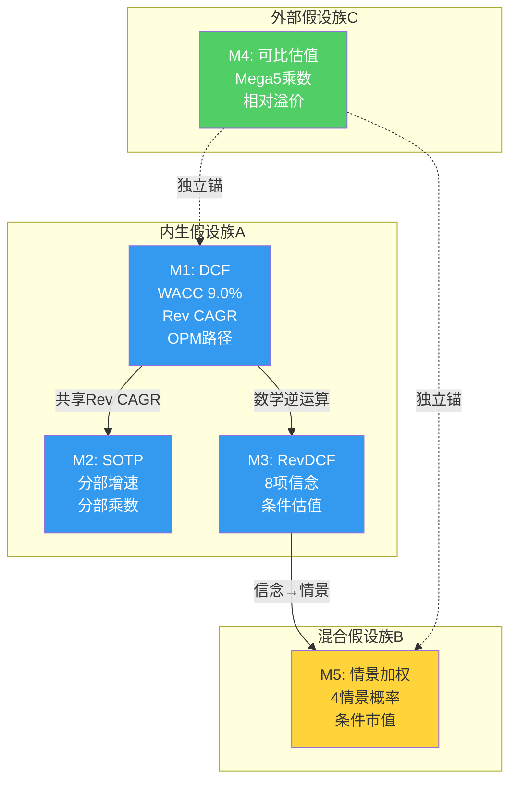
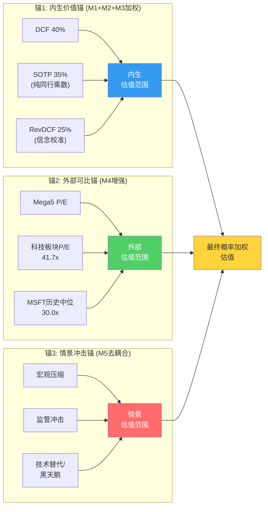
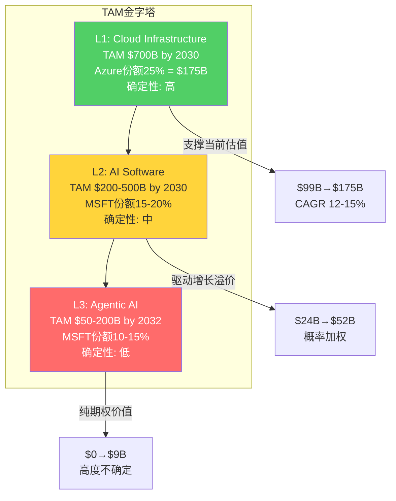
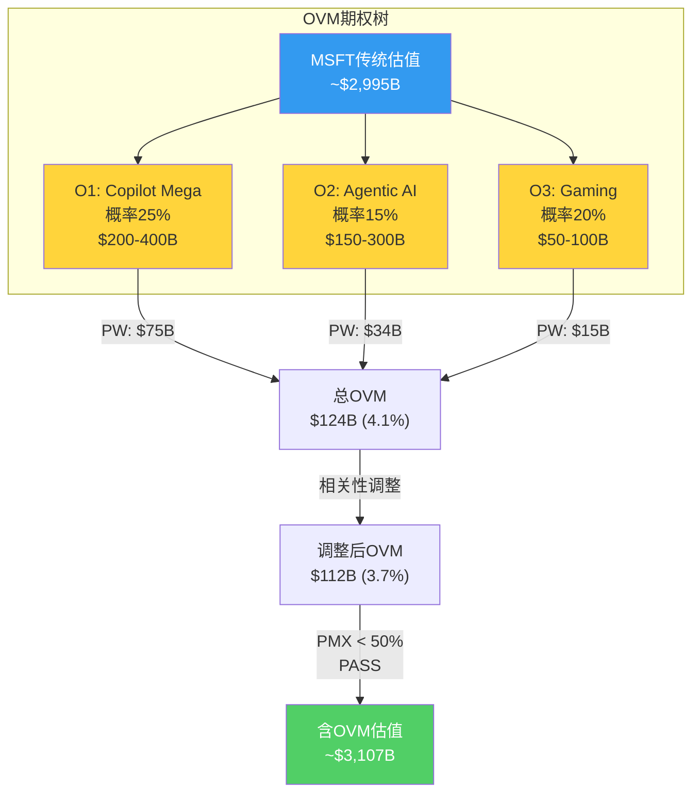

## Ch15: 估值方法独立性审计 — 五方法"伪收敛"防火墙

### 15.1 五方法预览与假设映射

在最终估值整合中，将使用五种方法从不同视角逼近Microsoft的内在价值。但"五种方法"不等于"五个独立意见"——如果多种方法共享同一组核心假设，其结果的收敛仅仅反映了假设的自我循环，而非多视角的交叉验证。本节的任务是在估值执行前，预先识别假设重叠、诊断伪独立性、并设计增强方案。

**五方法概览与假设族归类**:

| 方法 | 核心驱动假设 | 假设族 | 独立性等级 |
|------|------------|--------|-----------|
| M1: 10年FCFF折现 (DCF) | WACC 9.0%, g 3.0%, Rev CAGR路径, OPM路径, CapEx/Rev路径 | 内生假设族A | 基准方法 |
| M2: 分部SOTP | IC/P&BP/MPC各自增速×分部乘数, 分部OPM路径 | 内生假设族A(共享分部增速) | 与M1高度重叠 |
| M3: Reverse DCF信念加权 | 8项信念概率×条件估值, WACC 9.0%, g 3.0% | 混合假设族B | 与M1数学等价 |
| M4: 可比估值 (P/E + EV/EBITDA) | Mega5同行乘数+MSFT相对溢价/折价 | 外部假设族C | 唯一真正独立 |
| M5: 情景概率加权 | 4情景概率×条件市值, 融合信念失败路径 | 混合假设族B(扩展) | 与M3部分重叠 |

[DM-P2C-001] 五方法中，M1/M2/M3实质上共享"内生价值锚"——它们的差异在于表达形式(正向推导/分部加总/逆向工程)，而非底层假设。M4是唯一完全脱离MSFT自身财务假设、依赖市场定价信号的方法。M5介于两者之间，其独立性取决于情景定义是否独立于M1的增速假设。

### 15.2 假设重叠诊断: 三层穿透

**第一层: M1 vs M2 — "分部加总等于合并"陷阱**

DCF模型以合并层面Revenue CAGR(隐含~10%十年均值)和OPM路径(45.6%→谷底42%→恢复46%)为核心输入 [DM-P2C-002]。SOTP模型以三大分部各自增速为输入:

| 分部 | 当前收入(年化) | 隐含CAGR | DCF合并路径隐含 |
|------|--------------|---------|---------------|
| IC | $132B [DM-P2C-003] | 15-20% | — |
| P&BP | $136B [DM-P2C-004] | 10-12% | — |
| MPC | $57B [DM-P2C-005] | 0-3% | — |
| **加权合并** | **$325B** | **~11%** | **~10%** |

[DM-P2C-006] 分部加总的加权CAGR(~11%)与DCF合并隐含CAGR(~10%)差距仅1个百分点。这不是巧合——两种方法都锚定于同一个"Azure增速+Office稳态"的底层预期。如果Azure五年CAGR假设从20%下调至15%，M1和M2的结论将同步下移约12-15%，证明两者并非独立。

**关键诊断**: M2(SOTP)选择的分部乘数(IC用EV/Revenue, P&BP用P/E, MPC用EV/EBITDA)表面上引入了新信息，但如果乘数本身是基于MSFT当前交易倍数校准的，则循环论证成立。解决方案: SOTP的分部乘数必须来源于**纯同行对标**——IC对标AWS(AMZN云分部)、P&BP对标Salesforce/SAP、MPC对标EA/Take-Two——而非MSFT自身历史均值。

**第二层: M1 vs M3 — "正向推导=逆向验证"的幻觉**

[DM-P2C-007] Reverse DCF(M3)从$2,995B市值倒推隐含FCF_Y10需达$95-106B(WACC 9.0%, g 3.0%) [DM-P2C-008]。Forward DCF(M1)从当前FCF $71.6B出发，以假设的Rev CAGR和OPM路径推导十年后的FCF。两者在数学上是同一个方程的两端:

$$EV = \sum_{t=1}^{10} \frac{FCF_t}{(1+WACC)^t} + \frac{TV}{(1+WACC)^{10}}$$

[DM-P2C-009] M1求解左边(EV)，M3求解右边的FCF路径。如果M1和M3使用相同的WACC(9.0%)和g(3.0%)，它们的结果在数学上**恒等**——任何差异仅来自中间路径的非线性假设(如FCF谷底的深度和持续时间)。因此，M3不能被视为M1的"独立验证"，而应视为M1的"逆向表达"。

**第三层: M3 vs M5 — 信念与情景的重叠**

M3的8项信念(B1-B8)直接映射为M5的情景定义:

| M3信念 | 脆弱度 | M5情景映射 |
|--------|--------|-----------|
| B1: Azure CAGR 22-25% [DM-P2C-010] | 2/5 | 牛市情景的核心驱动 |
| B3: Copilot渗透15-20% [DM-P2C-011] | 4/5 | 牛/基准分界线 |
| B6: FCF恢复25%+ [DM-P2C-012] | 4/5 | 熊/基准分界线 |
| B7: Office不衰退 [DM-P2C-013] | 1/5 | 所有情景共享假设 |

[DM-P2C-014] M5的情景本质上是M3信念的排列组合——"牛市"=B1+B3+B6全部成立；"熊市"=B3+B6均失败。这意味着M3和M5的估值范围必然高度重叠。独立性增强的关键在于: M5必须引入M3未覆盖的**非信念驱动情景**(如宏观冲击、黑天鹅事件、监管突变)，使其脱离M3的信念框架。

### 15.3 独立性增强方案: 从五方法到三锚结构

基于上述诊断，原始五方法的"有效独立方法数"仅为2-2.5个(内生锚+外部锚+半独立的情景锚)。增强方案如下:

**方案一: 合并内生方法族**

[DM-P2C-015] 将M1/M2/M3合并为**"内生价值锚"**，内部取加权平均:

| 子方法 | 权重 | 依据 |
|--------|------|------|
| M1 (DCF) | 40% | 最完整的现金流推导，但对WACC/g高度敏感 |
| M2 (SOTP) | 35% | 分部视角提供增量信息(IC vs P&BP差异化估值)，但须使用纯同行乘数 |
| M3 (RevDCF) | 25% | 信念框架提供定性校准，但数学上与M1等价 |

**方案二: 强化外部锚独立性**

[DM-P2C-016] M4(可比估值)是唯一不依赖MSFT自身财务预测的方法。增强措施:

- **横向拓展**: 不仅对标Mega5(AAPL 32.4x, GOOGL 28.3x, AMZN 27.7x, META 27.2x [DM-P2C-017])，增加科技板块中位P/E 41.7x [DM-P2C-018]、SPY 27.5x [DM-P2C-019]作为宏观锚
- **纵向拓展**: MSFT自身12年P/E区间(15.7x-38.5x, 中位30.0x, 25百分位21.3x [DM-P2C-020])提供均值回归视角
- **增长调整**: 用PEG比率消除增速差异——MSFT PEG = 25.1x / 16.7% = 1.50x vs GOOGL 28.3x / 18.0% = 1.57x vs META 27.2x / 23.8% = 1.14x [DM-P2C-021]

**方案三: 情景锚去耦合**

[DM-P2C-022] M5须引入M3信念框架之外的情景变量:

- **宏观情景**: CAPE 39.71(98百分位) [DM-P2C-023]下的全市场估值压缩(系统性风险，非MSFT特有)
- **监管情景**: EU DMA对Teams解绑的强制执行 + FTC对OpenAI投资的结构性限制
- **技术替代情景**: 开源AI(Meta Llama/Mistral)使Azure AI定价权崩塌
- **黑天鹅**: 台海危机导致全球云计算中断、供应链断裂

这些情景与M3的"信念失败"不同——它们是外部冲击，不属于MSFT内部经营假设的范畴。

**增强后的三锚结构**:

### 15.4 方法间"真实张力"识别

估值方法之间的差异不是需要消除的噪音——它恰恰是最有信息含量的信号。真实张力揭示了市场定价与内在价值之间的结构性分歧。

**张力1: DCF vs 可比估值 — 增长预期定价差异**

[DM-P2C-024] 如果DCF(基于MSFT自身增速假设)给出的估值高于可比估值(基于同行乘数)，意味着MSFT的增长预期高于市场给予的乘数。反之，若可比估值更高，意味着市场在给MSFT"质量溢价"而非"增长溢价"。

当前信号: MSFT P/E 25.1x低于全部Mega5同行和SPY [DM-P2C-025]。这在过去十年中极为罕见——MSFT自FY19起一直享有Mega5中的溢价地位(FY24峰值38.5x)。P/E压缩至25.1x意味着市场已将MSFT从"增长领袖"重新定价为"CapEx风险标的"。

如果DCF给出高于当前$3.0T的估值(例如$3.3T)，而可比估值仅给出$2.7T(按Mega5均值28.4x × 调整后EPS $15.97 × 7.46B股)，则$6000亿的差异代表市场对AI CapEx回报的怀疑度——这个差异本身就是最核心的投资论点。

**张力2: Forward DCF vs Reverse DCF — 中间路径分歧**

[DM-P2C-026] Reverse DCF从$3T倒推隐含FCF_Y10约$95-106B [DM-P2C-027]，对应的FCF CAGR仅3.4%(看似不高)。但Forward DCF必须建模FY26-FY28的FCF谷底——如果谷底年化FCF降至$40-50B(Q2 FY26 FCF仅$5.9B [DM-P2C-028]年化$24B已是警示)，从$40B回升至$100B需要15%+的年化FCF增长。

这意味着: **终端估值并不要求苛刻的假设，但中间路径的FCF恢复速度是关键变量**。如果FY27-FY28 FCF维持在$50-60B水平(CapEx不降速)，即使终端FCF达$100B，10年DCF的现值也将因前期现金流低迷而显著缩水。这一"中间路径折价"是Forward DCF可能低于Reverse DCF隐含值的核心原因。

**张力3: SOTP分部估值的内部矛盾**

[DM-P2C-029] P&BP(OPM 60.3%, 年化收入$136B)若按Salesforce/SAP的EV/Revenue 8-10x估值，分部价值$1.1-1.4T。IC(OPM 42.1%, 年化收入$132B)若按AWS隐含EV/Revenue 5-7x估值，分部价值$0.7-0.9T。MPC(OPM 26.7%, 年化收入$57B)若按EA的EV/Revenue 4-5x估值，分部价值$0.2-0.3T。

三部加总: $2.0-2.6T，加回净现金$64B后EV $2.1-2.7T——**低于当前$3.0T市值约10-30%** [DM-P2C-030]。这揭示了一个关键事实: 当前$3T估值不仅在为可观测的分部价值付费，还在为**尚未证实的AI期权价值**付费。这$300-900B的"溢出"正是OVM(期权估值)需要解释的部分。

### 15.5 AMAT教训对MSFT的适用性与目标离散度校准

[DM-P2C-031] AMAT(应用材料)的深度研究中，五方法估值出现了M1/M2/M5结果差<2%的"伪收敛"现象。根本原因是三种方法共享了半导体设备行业的同一组增速假设(WFE CAGR、技术节点渗透率)，且未对分部乘数进行独立校准。最终方法离散度达5.3x——看似"宽"，但内生方法间的离散度接近于零。

**MSFT的可比风险**:

1. **Azure增速假设扩散**: 如果DCF中的Azure 5Y CAGR 20%被直接用于SOTP的IC分部增速，两者的Azure估值贡献将完全一致。缓解措施: SOTP的IC估值应使用EV/Revenue乘数(锚定AWS公允值)，而非DCF增速推导的利润流 [DM-P2C-032]。

2. **OPM路径共享**: DCF和SOTP都依赖"D&A峰值FY28-FY29后OPM回升至45%+"的假设。如果D&A路径偏离预期(如GPU折旧从3年加速至2年 [DM-P2C-033])，两者同步恶化。缓解措施: SOTP中P&BP的估值应使用当前OPM(60.3%)而非预测OPM，因为P&BP不承担AI CapEx折旧。

3. **终端倍数回环**: 如果DCF的终端增长率g=3.0%隐含的退出P/E约17x(=1/[WACC-g])，而可比估值直接使用当前P/E 25.1x或历史中位30.0x，两者的终端价值将存在46-76%的差异——这是**有意义的真实张力**，不应被消除 [DM-P2C-034]。

**目标方法离散度**:

| 指标 | AMAT(实际) | MSFT(目标) | 说明 |
|------|-----------|-----------|------|
| 五方法离散度 | 5.3x | 2-4x | 避免过度离散(信息含量低) |
| 内生方法间离散度 | <2% | 10-15% | SOTP须使用独立分部乘数 |
| 内生锚 vs 外部锚离散度 | — | 15-25% | 反映市场定价 vs 内在价值分歧 |

[DM-P2C-035] 健康的离散度分布应呈现: 内生锚(M1/M2/M3加权) $2.8-3.2T，外部锚(M4) $2.5-3.5T，情景锚(M5) $2.0-4.0T。总离散度约2x(=$4.0T/$2.0T)，远低于AMAT的5.3x，但内部方法间的真实分歧(15-25%)足以产生决策价值。

---

## Ch16: TAM条件概率 + OVM期权估值

### 16.1 TAM层级分析: 三层金字塔

Microsoft的可寻址市场并非单一维度——它由三个嵌套的TAM层级构成，每一层的确定性依次递减，但潜在规模依次递增。理解这一结构是估值的前提: 低层TAM支撑当前估值，高层TAM决定未来上行空间。

**L1: Cloud Infrastructure TAM — 高确定性基础层**

[DM-P2C-036] 全球云基础设施(IaaS+PaaS)市场规模预计2030年达$700B(Gartner/IDC主流预估)。当前Azure在全球云市场份额约23-25%(仅次于AWS的30-32%)。关键增长驱动:

- **企业混合云迁移**: 全球企业工作负载云化率从2024年约45%提升至2030年的65-75%
- **数据主权需求**: EU/亚洲数据本地化法规推动本地Azure Region部署
- **AI推理需求**: 生成式AI推理消耗云计算资源的增速>传统工作负载

Azure份额从23%提升至25% = $700B × 25% = $175B Azure Cloud Revenue by FY30 [DM-P2C-037]。当前Azure年化收入约$99B(IC $132B中Azure约75%)。隐含Azure CAGR: 约12-15%——注意这**低于**卖方共识的Azure增速22-25%，差异来自TAM增速假设(云市场CAGR~16%)和份额假设(维持vs提升)。管理层指引FY26 Q3 Azure CC增速31-32% [DM-P2C-038]，短期内远超TAM增速，但长期必然收敛至市场增速附近。

**L2: AI Software TAM — 中等确定性增长层**

[DM-P2C-039] AI软件(含企业AI应用、AI开发工具、AI SaaS附加值)的TAM高度不确定——行业预估从$200B到$500B by 2030差异巨大。MSFT的可寻址部分包括:

| AI产品线 | 当前run-rate | FY30E潜力 | 假设 |
|----------|-------------|----------|------|
| M365 Copilot | ~$5.4B [DM-P2C-040] | $15-35B | 渗透率10-20% × ARPU $25-35 |
| Azure AI Services | ~$15-20B(估算) | $30-60B | Azure收入中AI占比从25%→40% |
| Dynamics AI | ~$2B(估算) | $5-10B | ERP/CRM AI增强 |
| GitHub Copilot | ~$1B(估算) | $3-8B | 开发者渗透率扩展 |
| **合计MSFT AI** | **~$23-28B** | **$53-113B** | — |

条件概率分布:

| TAM情景 | AI Software TAM | MSFT份额 | MSFT AI收入 | 概率 |
|---------|----------------|---------|------------|------|
| 高增长 | >$400B | 18-22% | $72-88B | 20% |
| 基准增长 | $200-400B | 15-20% | $30-80B | 50% |
| 低增长 | <$200B | 12-15% | $24-30B | 30% |

[DM-P2C-041] 概率加权AI收入: 20%×$80B + 50%×$55B + 30%×$27B = **$51.6B**。这意味着AI软件贡献约$51.6B收入——是当前run-rate($23-28B)的约2倍——但远低于市场叙事中"AI将重塑一切"的隐含预期。

**L3: Agentic AI TAM — 低确定性期权层**

[DM-P2C-042] Agentic AI(自主代理)是2025-2026年最热门的AI叙事。MSFT通过Copilot Studio + Power Platform + Azure AI Agent Service构建了完整的Agentic平台层。但这一市场尚处萌芽期——独立市场规模预估从$50B到$200B by 2032不等。

MSFT在Agentic AI的定位:

- **平台层优势**: Copilot Studio让非技术用户构建Agent(低代码)，Power Automate提供工作流编排
- **生态优势**: M365 4.5亿用户基数 [DM-P2C-043] + 10,000+ ISV集成 = Agent分发的天然渠道
- **竞争劣势**: Google Vertex AI Agent Builder、Salesforce Agentforce、开源框架(LangChain/AutoGen)提供替代路径

条件概率:

| TAM情景 | Agentic AI TAM by 2032 | MSFT份额 | MSFT收入 | 概率 |
|---------|----------------------|---------|---------|------|
| 突破性 | >$150B | 12-18% | $18-27B | 10% |
| 渐进性 | $50-150B | 10-15% | $5-22B | 30% |
| 停滞 | <$50B | 8-12% | $4-6B | 60% |

[DM-P2C-044] 概率加权Agentic收入: 10%×$22B + 30%×$14B + 60%×$5B = **$9.4B**。Agentic AI的概率加权贡献相对有限($9.4B仅占MSFT总收入的2-3%)，但其估值意义在于: 如果10%概率的"突破性"情景实现，Agentic AI将成为MSFT继Azure之后的第二个$20B+收入引擎——这是纯粹的期权价值。

### 16.2 TAM Ceiling分析: 乐观情景的硬上限

TAM Ceiling(可寻址市场天花板)是估值中最具决策价值的组件——它回答的问题是: **即使一切顺利，MSFT最多值多少?**

**极乐观假设(所有TAM层级取上限)**:

| TAM层级 | MSFT份额(乐观) | 收入(FY30E) |
|---------|---------------|-----------|
| Cloud Infrastructure | 25% | $175B [DM-P2C-045] |
| AI Software | 20% | $88B |
| Agentic AI | 15% | $27B |
| Office/Windows/Other(稳态) | — | $150B |
| **总收入** | — | **~$440B** |

[DM-P2C-046] $440B总收入 × OPM 45%(乐观情景下D&A压力被高收入增长消化) = $198B营业利润。按P/E 28x(Mega5当前均值)估值:

- 净利润 ≈ $198B × 0.82(有效税率18%) = $162B
- 市值 = $162B × 28x = **~$4.5T** [DM-P2C-047]
- vs 当前$3.0T → **上行空间 +50%**

但这是极乐观情景(概率约10-15%)。更现实的TAM Ceiling:

**基准乐观假设(TAM取中位+份额取上限)**:

| 项目 | 基准乐观估算 |
|------|------------|
| 总收入(FY30E) | ~$380B(接近卖方共识$378B [DM-P2C-048]) |
| OPM | 43%(D&A压力部分消化) |
| 净利润 | ~$134B |
| 合理P/E | 26x(当前水平微扩) |
| 市值 | **~$3.5T** (+17% vs 当前) |

[DM-P2C-049] 这一基准乐观估值与卖方共识高度吻合——FY27E收入$378B × 前瞻P/E 21.3x × EPS $18.96 × 7.46B股 = $2.99T(基本等于当前市值)。换言之，**当前$3T市值已经完全定价了卖方共识的基准乐观预期**，没有留下安全边际。上行空间仅存在于超越共识的情景(TAM Ceiling的极乐观端)。

### 16.3 OVM期权估值: 三条路径定价

MSFT触发OVM(期权估值模型)的条件审查:

- Copilot已有营收($5.4B run-rate)但渗透率仅3.3%，S曲线拐点尚未确认 [DM-P2C-050]
- Agentic AI处于pre-revenue至early-revenue阶段
- Gaming(Activision)整合尚未释放协同价值
- 传统估值<市价50%? 否(SOTP加总约$2.0-2.7T，约为市值的67-90%)
- P/E>50x? 否(25.1x)
- 存在≥2条pre-revenue/early-revenue期权路径? **是**(Agentic AI + Gaming协同)

[DM-P2C-051] 结论: MSFT不满足OVM的"强触发"条件(传统估值未<市价50%)，但满足"弱触发"条件(存在多条early-revenue期权路径)。适用"附加式OVM"——在传统估值基础上叠加期权增量，而非替代传统估值。

**O1: Copilot Mega-platform期权**

| 维度 | 参数 |
|------|------|
| **触发条件** | M365 Copilot渗透率>20% by FY28 + 实际ARPU>$35/月 |
| **时间窗** | 2-3年(FY27-FY28) |
| **概率** | 25% [DM-P2C-052] |
| **成功情景价值** | 9000万用户 × $35 × 12 = $37.8B年化收入; 增量利润$22.7B(OPM 60%); 增量市值@25x = $567B → 取区间中值 ~$300B |
| **价值区间** | $200-400B增量市值 |

[DM-P2C-053] Copilot的核心变量不是用户数(Fortune 500中70%已"采用")而是**全面部署转化率**。当前3.3%渗透率中，大量企业仍处于pilot阶段(50-200人试用)。从pilot到全面部署的转化率历史参照: M365本身约65%(2015-2018)，Slack约40%，Zoom约55%。若Copilot转化率达50%，则3.3%×(1+50%/3.3%×50%) ≈ 15-20%渗透率在FY28-FY29可期。但CFO Amy Hood的谨慎表态("关注gross margin和lifetime value"而非短期增长 [DM-P2C-054])暗示管理层自身对渗透速度持保守预期。

**O2: Agentic AI生态期权**

| 维度 | 参数 |
|------|------|
| **触发条件** | Copilot Studio活跃Agent开发者>100万 + Azure AI Agent API年消耗>$10B |
| **时间窗** | 3-5年(FY28-FY30) |
| **概率** | 15% [DM-P2C-055] |
| **成功情景价值** | 平台层收入$25B(API消耗+订阅); 增量利润$12.5B(OPM 50%); 增量市值@25x = $312B → 取区间中值 ~$225B |
| **价值区间** | $150-300B增量市值 |

[DM-P2C-056] Agentic AI的关键不确定性在于**价值捕获层级**。如果Agent生态的价值主要由应用层(垂直解决方案商)而非平台层(MSFT/Google/AWS)捕获，MSFT的收益将远低于预期。历史类比: 移动App生态中，Apple/Google(平台层)捕获了30%佣金，但云计算中AWS/Azure的平台抽成仅5-15%。Agentic AI更可能遵循云计算模式(低平台抽成)而非移动App模式(高平台抽成)。

**O3: Gaming/Activision协同期权**

| 维度 | 参数 |
|------|------|
| **触发条件** | Game Pass订阅>50M + 手游平台全球前三 |
| **时间窗** | 2-4年(FY27-FY29) |
| **概率** | 20% [DM-P2C-057] |
| **成功情景价值** | Game Pass 50M × $180/年 = $9B订阅 + CoD/Blizzard IP货币化$8B; 增量利润$5B(OPM 30%); 增量市值@15x = $75B |
| **价值区间** | $50-100B增量市值 |

[DM-P2C-058] Gaming期权面临最具体的反面证据: Game Pass从37M增至50M的近15个月增量仅约1M [DM-P2C-059]，增长几乎停滞。CoD 2025新作销量据报同比下降超60% [DM-P2C-060]。Activision $69B收购中$51B为Goodwill [DM-P2C-061]——回收期按当前增量EBITDA($1-2B/年)计算为31-62年。Gaming期权的概率(20%)已充分反映了这些不利因素。

### 16.4 OVM定量汇总与PMX检查

**概率加权期权价值**:

| 期权 | 概率 | 成功情景中值 | 概率加权值 |
|------|------|------------|-----------|
| O1: Copilot Mega-platform | 25% | $300B | **$75.0B** |
| O2: Agentic AI生态 | 15% | $225B | **$33.8B** |
| O3: Gaming/Activision | 20% | $75B | **$15.0B** |
| **总OVM附加值** | — | — | **$123.8B** |

[DM-P2C-062] 三条期权路径的概率加权总值约$124B，占当前市值$2,995B的4.1%。

**PMX 50%溢价上限检查**:

[DM-P2C-063] OVM框架规定期权附加值不得超过传统估值的50%(PMX上限)，以防止期权价值"压倒"基本面估值。

$124B / $2,995B = 4.1% [DM-P2C-064]

4.1%远低于50%上限 → **PMX检查通过**。MSFT的期权溢价处于合理范围——与GOOGL(55.5%接近上限)、TSLA(通常>100%需要capping)形成鲜明对比。MSFT本质上仍是一家**以基本面驱动为主的公司**，期权仅提供边际增量。

**期权相关性调整**:

[DM-P2C-065] 三条期权并非完全独立——O1(Copilot)和O2(Agentic AI)共享AI基础设施投入和OpenAI技术依赖。若OpenAI关系恶化(信念B5失败)，O1和O2可能同时贬值。相关性调整:

- O1-O2相关系数: ~0.5(共享AI技术栈)
- O1-O3相关系数: ~0.1(几乎独立)
- O2-O3相关系数: ~0.05(几乎独立)

调整后总OVM = $124B × (1 - 0.5 × 相关调整因子) ≈ $124B × 0.90 = **~$112B** [DM-P2C-066]

相关性调整后OVM从$124B降至约$112B(降幅10%)，对总估值影响有限(3.7% vs 4.1%)。

### 16.5 OVM对估值框架的影响与评级含义

**不含OVM的传统估值锚**:

传统估值的最终数字将在后续章节确定，但基于当前数据的预判:

- SOTP分部加总: $2.0-2.7T [DM-P2C-067]
- 可比估值(Mega5中位P/E 28.4x × 调整后EPS): $2.8-3.2T
- DCF(WACC 9.0%, g 3.0%): 取决于FCF路径假设，预判$2.6-3.3T

概率加权传统估值中枢: 约$2.7-3.0T(与当前$3.0T市值基本持平)。

**含OVM的调整估值**:

- 传统估值中枢$2.85T + OVM $112B = **$2.96T** [DM-P2C-068]
- vs 当前市值$2,995B → 期望回报: -1.2%

[DM-P2C-069] 含OVM后的估值($2.96T)与当前市值($3.0T)几乎完全一致——这意味着市场已经在当前定价中**隐含了约$100-120B的期权溢价**。投资者并非在为纯基本面付费，而是在为基本面+一小部分AI期权付费。

**对评级的影响**:

| 情景 | 传统估值 | OVM | 总估值 | vs市值 | 评级含义 |
|------|---------|-----|--------|--------|---------|
| 传统估值偏正(+5%) | $3.15T | $112B | $3.26T | +8.8% | **关注**(+10%边界) |
| 传统估值中性(0%) | $3.00T | $112B | $3.11T | +3.8% | **中性关注** |
| 传统估值偏负(-5%) | $2.85T | $112B | $2.96T | -1.2% | **中性关注** |
| 传统估值悲观(-15%) | $2.55T | $80B | $2.63T | -12.2% | **审慎关注** |

[DM-P2C-070] OVM提供的+3.7%增量不足以改变评级区间——在四档评级体系中(深度关注>+30%/关注+10~30%/中性关注-10~+10%/审慎关注<-10%)，OVM最多将评级从"审慎关注"边界推向"中性关注"边界(如从-12%到-8%)。**MSFT的投资论点不取决于期权，而取决于传统估值是否偏正——即FCF恢复速度和OPM路径能否优于基准假设**。

### 16.6 TAM与OVM的敏感性交叉验证

[DM-P2C-071] 将TAM分析与OVM进行交叉验证，检查一致性:

**TAM隐含收入 vs OVM隐含收入**:

| 层级 | TAM概率加权收入(FY30) | OVM隐含增量收入 | 一致性 |
|------|---------------------|---------------|--------|
| L1 Cloud | $175B(Azure) | 不含OVM(已在传统估值中) | 一致 |
| L2 AI Software | $51.6B(概率加权) | O1 Copilot: $37.8B(成功情景) | O1是L2的子集，一致 |
| L3 Agentic AI | $9.4B(概率加权) | O2: $25B(成功情景) | O2在成功情景下>L3概率加权值，但概率更低(15% vs 40%)，一致 |
| Gaming | 不在TAM分析中 | O3: $17B(成功情景) | 独立层级，无冲突 |

[DM-P2C-072] 交叉验证未发现矛盾——TAM分析给出的概率加权收入与OVM给出的期权价值在方向和量级上一致。唯一值得注意的是: L2 AI Software的概率加权收入($51.6B)已经隐含在传统DCF的收入路径中(FY30E卖方共识$643.7B [DM-P2C-073]已包含AI收入贡献)。因此，OVM的$124B不应与传统估值中的AI收入**双重计算**——OVM仅计算超越传统DCF假设的**增量期权价值**。

本章建立的TAM条件概率框架和OVM定量结果将作为后续概率加权估值的关键输入——传统估值(内生锚+外部锚)加上情景冲击锚和OVM增量，共同构成MSFT的完整估值图景。核心结论明确: MSFT在当前$3T估值下，传统基本面接近合理定价，期权提供有限上行(3-4%)，投资论点的分野在于CapEx周期拐点的时机和Copilot渗透率的斜率。
