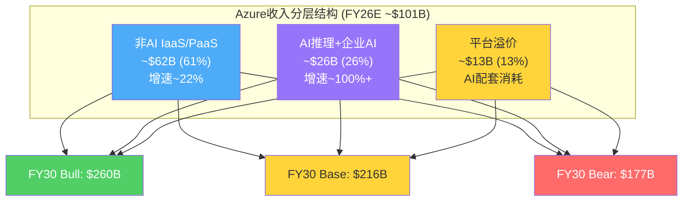
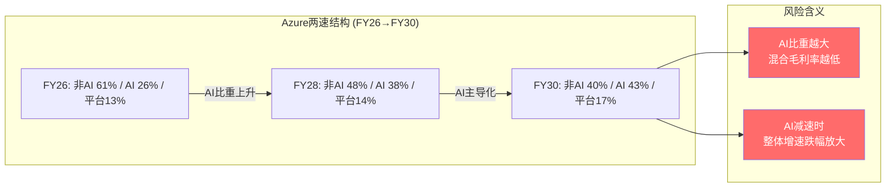
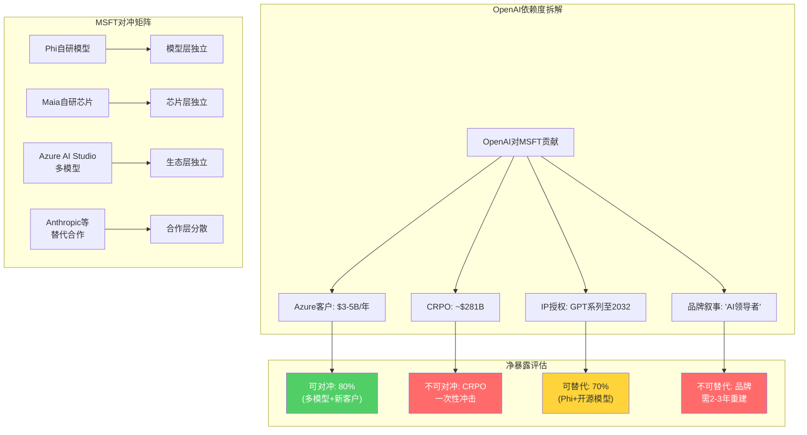
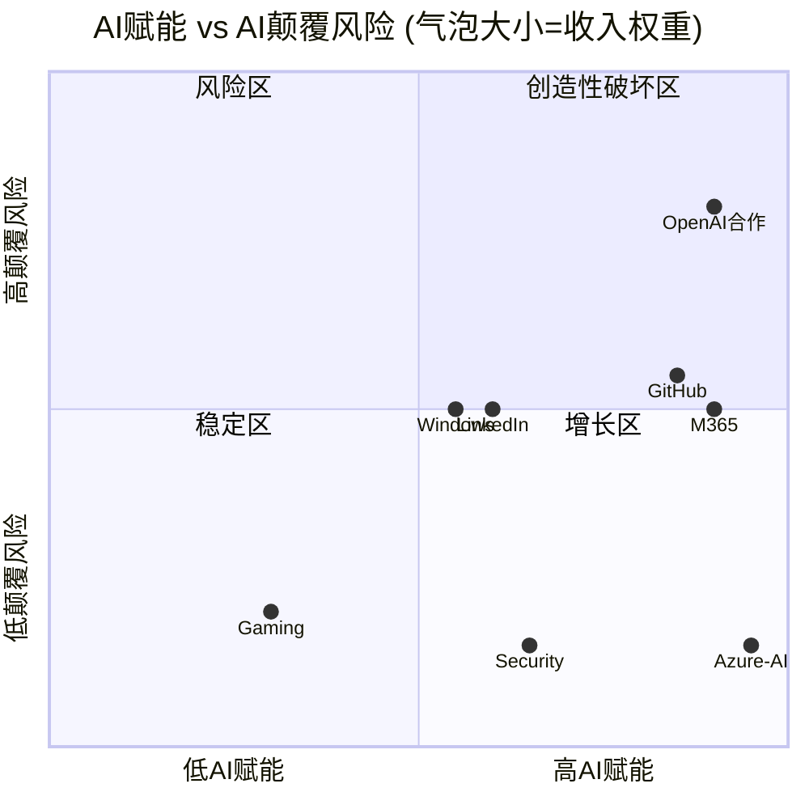
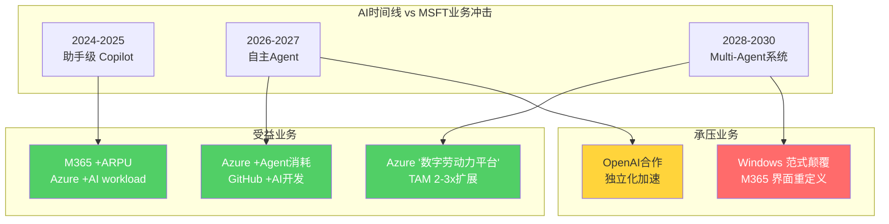

## Ch17: 信念B1验证 — Azure增速收敛路径的共识解构

### 17.1 共识的内核: "Azure 5Y CAGR 22-25%"从何而来

$2,995B市值对Intelligent Cloud分部的隐含要求可以精确倒推。IC当前年化收入约$132B(Q2 FY26单季$32.9B × 4)，其中Azure贡献约75%即$99B <!-- DM-P3A-001: IC Q2 FY26=$32.9B, 年化$132B, Azure~75%=$99B | Source: MSFT Q2 FY26 Press Release + Phase 2 Ch11 | Confidence: H -->。卖方共识给出FY25-30 Revenue CAGR 18.0%(40位分析师) <!-- DM-P3A-002: 40位分析师共识FY25-30 Rev CAGR 18.0% | Source: FMP estimates | Confidence: H -->，要达到FY30 Revenue $644B的共识预测，IC需贡献约$280B(占比~43%)，Azure需达$210B+。这对应Azure 5Y CAGR约22-25%，是共识预期中最核心的增长假设。

问题在于: 这个22-25%的CAGR不是一个单一假设，而是多层子假设的叠加结果。共识解构的任务是拆开这个数字，检验每一层子假设的独立可信度。

### 17.2 Azure收入的第一性原理拆解

Azure收入可以分解为三个互不重叠的层次:

**层次一: 非AI基础设施 (IaaS/PaaS传统工作负载)**

这是Azure最稳固的收入基座——企业迁移上云的存量业务，包括虚拟机、存储、数据库、网络服务。Q1 FY26 Azure整体增长40%，AI贡献约18个百分点 <!-- DM-P3A-003: Q1 FY26 Azure增长40%, AI贡献~18pp | Source: MSFT Q1 FY26 Earnings Call | Confidence: H -->，反推非AI Azure增速约22%。这个22%的基础增速由两股力量驱动: (1)企业新增上云迁移(全球企业云渗透率约35-40%，仍有显著空间)；(2)已上云企业的工作负载扩展(数据量增长+新应用部署)。

非AI Azure的增速在过去四个季度呈现稳定态势: Q3 FY25约19%(Azure 35%减去AI 16pp)、Q4 FY25约21%(Azure 39%减去约18pp)、Q1 FY26约22% <!-- DM-P3A-004: 非AI Azure增速: Q3 FY25~19%, Q4 FY25~21%, Q1 FY26~22% | Source: 管理层披露AI pp反推 | Confidence: M -->。非AI增速不但没有减速，反而在轻微加速——这可能反映了AI workload拉动下的"co-migration"效应: 企业为部署AI应用而将更多传统工作负载也迁移至Azure。

**层次二: AI推理与企业AI服务**

AI年化run rate从Q1 FY25的$10B增长至Q1 FY26的$26B，半年翻倍 <!-- DM-P3A-005: AI run rate Q1 FY25 $10B → Q1 FY26 $26B, 半年翻倍 | Source: Nadella Q1 FY26 Earnings Call | Confidence: H -->。Nadella明确表态"It's all inference"——推理而非训练是AI收入的主力 <!-- DM-P3A-006: Nadella: "It's all inference" — 推理为主 | Source: DCD/Earnings Call | Confidence: H -->。推理收入的可持续性远优于训练收入: 训练是一次性支出(模型训练完即停止)，而推理是持续消耗(每次API调用都产生收入)。

关键分歧在于: $26B的AI run rate中，多少来自真正的企业AI采用，多少来自OpenAI作为Azure客户的代售? 管理层没有拆分这两者，但可以从侧面推断:

- OpenAI当前年化Azure消耗估算$3-5B <!-- DM-P3A-007: OpenAI年化Azure消耗~$3-5B(估算) | Source: Scout补充数据 + 行业分析师 | Confidence: M -->
- 即使取上限$5B，OpenAI仅占$26B AI run rate的19%
- 其余~$21B来自第三方企业(Fortune 500中70%已采用某种Azure AI服务)

这意味着Azure AI收入的大部分(约80%)来自真正的企业分散需求，而非单一客户依赖。这是一个重要的结构性健康信号。

**层次三: 平台服务溢价 (Azure AI Studio + Copilot间接消耗)**

这一层最难量化但可能最具战略价值。企业通过Azure AI Studio部署多模型(GPT-4o、Llama、Mistral、Cohere)时，不仅消耗AI推理资源，还消耗存储、网络、安全、监控等配套服务。每$1的AI推理消耗可能带动$0.30-0.50的配套PaaS消耗 <!-- DM-P3A-008: AI推理$1带动~$0.30-0.50配套PaaS消耗(行业估算) | Source: Constellation Research | Confidence: L -->。如果$26B AI run rate带动了$8-13B的配套消耗，Azure的"AI总经济价值"接近$34-39B——占Azure总收入$99B的34-39%。

### 17.3 收敛路径的三情景建模

将上述拆解代入五年预测框架:

**情景A (Bull): AI维持超高速增长 — Azure 5Y CAGR 28-32%**

| 财年 | 非AI增速 | AI增速 | Azure总增速 | Azure收入($B) |
|------|---------|--------|-----------|--------------|
| FY26 | 22% | ~100% | ~37% | ~$101B |
| FY27 | 20% | 65% | ~32% | ~$133B |
| FY28 | 18% | 45% | ~28% | ~$170B |
| FY29 | 15% | 35% | ~25% | ~$213B |
| FY30 | 12% | 28% | ~22% | ~$260B |

<!-- DM-P3A-009: Bull情景Azure FY30=$260B, 5Y CAGR~29% | Source: 自建模型 | Confidence: L -->

Bull情景的前提假设: (1)AI推理需求保持S曲线早期的指数增长至FY28; (2)非AI Azure受益于co-migration持续获得2-3pp额外增速; (3)产能约束在FY27上半年完全解除，释放被压制的需求。Bull情景需要AI推理市场在FY28前不出现价格战——考虑到AWS、GCP都在激进扩产，这一前提的可信度值得怀疑。

**情景B (Base): AI增速有序收敛 — Azure 5Y CAGR 22-25%**

| 财年 | 非AI增速 | AI增速 | Azure总增速 | Azure收入($B) |
|------|---------|--------|-----------|--------------|
| FY26 | 22% | ~100% | ~37% | ~$101B |
| FY27 | 18% | 50% | ~28% | ~$129B |
| FY28 | 15% | 35% | ~23% | ~$159B |
| FY29 | 12% | 25% | ~18% | ~$188B |
| FY30 | 10% | 20% | ~15% | ~$216B |

<!-- DM-P3A-010: Base情景Azure FY30=$216B, 5Y CAGR~23% | Source: 自建模型 | Confidence: M -->

Base情景的前提假设: (1)AI推理增速从当前~100%逐年减半(100%→50%→35%→25%→20%); (2)非AI增速随企业云渗透率提升而自然减速(全球渗透率从40%→55%); (3)竞争压力使Azure AI定价每年下降5-10%，但量增覆盖价降。这与卖方共识最为一致。

**情景C (Bear): AI供给过剩+竞争侵蚀 — Azure 5Y CAGR 18-20%**

| 财年 | 非AI增速 | AI增速 | Azure总增速 | Azure收入($B) |
|------|---------|--------|-----------|--------------|
| FY26 | 22% | ~100% | ~37% | ~$101B |
| FY27 | 16% | 35% | ~23% | ~$124B |
| FY28 | 13% | 20% | ~16% | ~$144B |
| FY29 | 10% | 15% | ~12% | ~$161B |
| FY30 | 8% | 12% | ~10% | ~$177B |

<!-- DM-P3A-011: Bear情景Azure FY30=$177B, 5Y CAGR~18% | Source: 自建模型 | Confidence: M -->

Bear情景的前提假设: (1)FY27下半年AI推理出现明显供过于求(三大CSP同时释放产能); (2)OpenAI部分工作负载迁出Azure(AI增速损失5-8pp); (3)Google通过TPU自研芯片在推理成本上形成结构性优势，Azure AI被迫降价20-30%。Bear情景不需要"AI泡沫破裂"——只需要AI从卖方市场变成买方市场即可触发。

### 17.4 产能约束: 增长的天花板还是弹簧?

管理层指引Q3 FY26 Azure恒定汇率增速31-32%，较Q2 FY26的38%(CC)环比减速6-7个百分点 <!-- DM-P3A-012: Q3 FY26 Azure CC指引31-32%, 环比减速~6-7pp | Source: MSFT Q2 FY26 Earnings Call | Confidence: H -->。减速的官方解释是"去年高基数+产能约束持续至2026年6月"。

产能约束的层次结构值得深入拆解:

**第一瓶颈: 电力 (最长周期)**

Nadella明确指出"biggest issue is power, not compute" <!-- DM-P3A-013: Nadella: "biggest issue is power, not compute" | Source: Earnings Call | Confidence: H -->。一个新数据中心从选址到通电需要18-36个月。MSFT在Northern Virginia和Texas已出现限制新客户订阅的情况 <!-- DM-P3A-014: 部分Azure区域(Northern Virginia, Texas)限制新订阅 | Source: CIO Dive | Confidence: H -->。GPU库存充足但无电可装("GPUs sitting in inventory")，说明计算资源本身已不是瓶颈。

**第二瓶颈: 数据中心空间 (中等周期)**

MSFT当前在全球运营60+个Azure区域。新建数据中心需要12-24个月。Stargate项目(MSFT+OpenAI+Oracle+SoftBank+MGX, 总投资$500B)代表了下一代超大规模基础设施的方向，但MSFT已退出Stargate的股权参与 <!-- DM-P3A-015: MSFT退出Stargate equity参与 | Source: Scout补充数据 | Confidence: H -->，保留的是Azure作为后端云的角色。

**第三瓶颈: 计算(GPU/TPU) (短周期)**

短周期资产(GPU/CPU)占CapEx约2/3 <!-- DM-P3A-016: 短周期资产(GPU/CPU)占CapEx~2/3 | Source: CFO Amy Hood Earnings Call | Confidence: H -->。Q2 FY26 CapEx $29.9B中约$20B用于GPU/CPU采购。MSFT作为NVIDIA前三大客户之一(占NVDA数据中心收入估计15-20%) <!-- DM-P3A-017: MSFT占NVDA DC收入~15-20%(分析师估算) | Source: Tom's Hardware/ElectroIQ | Confidence: M -->，在GPU供应链中拥有优先地位。计算约束已基本解除。

产能约束的关键推论: **FY27上半年是产能释放窗口**。CFO Amy Hood表示产能约束预计持续至FY26上半年(至2026年6月) <!-- DM-P3A-018: 产能约束预计持续至2026年6月 | Source: CFO Hood Earnings Call | Confidence: H -->。如果约束解除后存在被压制的需求回弹(Nadella暗示"actual demand growth >40%")，FY27 Q1-Q2的Azure增速可能出现短期反弹至35%+。但这一反弹是一次性的，不改变中长期的收敛趋势。

### 17.5 市场份额动态: Azure能否继续蚕食AWS?

IaaS/PaaS市场份额变化是支撑非AI增速的关键变量:

| 云提供商 | 2022份额 | 2025E份额 | 变化 | 年均变化 |
|---------|---------|----------|------|---------|
| AWS | ~52% | ~48.6% | -3.4pp | -1.1pp/年 |
| Azure | ~28% | ~35.3% | +7.3pp | +2.4pp/年 |
| GCP | ~8% | ~10% | +2pp | +0.7pp/年 |

<!-- DM-P3A-019: Azure份额2022~28%→2025E~35.3%, 年均+2.4pp | Source: SiliconANGLE/theCUBE Research | Confidence: M -->

Azure份额增长的持续性取决于: (1)企业多云策略(Azure作为"第二选择"进入AWS为主的企业); (2)M365生态的拉力(已使用M365的企业倾向选择Azure); (3)AI推理作为新竞争维度(Azure OpenAI Service的先发优势)。份额趋势外推至FY30，Azure可能从35%升至40-42%——但份额增速将自然放缓(基数越大，增量越难)。

### 17.6 共识解构的核心发现: "两速Azure"

共识将Azure视为单一增长引擎，但拆解后可以看到"两速Azure":

**慢速层 (非AI, $62B, +22%)**: 企业云迁移驱动，增速可预测(15-22%区间)，毛利率稳定(65-70%)，受经济周期影响但韧性强。这一层提供了CAGR的"地板"——即使AI完全失败，非AI Azure仍能支撑15-18%的增速至FY28。

**快速层 (AI, $26B, +100%+)**: 推理需求驱动，增速极高但波动性也极高，毛利率低于非AI层(估算50-60%，因GPU折旧和电力成本) <!-- DM-P3A-020: Azure AI毛利率估算50-60%, 低于非AI层65-70% | Source: 行业分析+D&A模型推算 | Confidence: L -->，且面临竞争定价压力。快速层决定了CAGR的"天花板"。

"两速Azure"的估值含义: 市场以统一增速对Azure估值，忽略了AI层和非AI层在毛利率、可持续性和波动性上的差异。如果AI层增速快速收敛(从100%→30%)，Azure混合增速的下降幅度将被放大——因为AI层占收入比重越来越大(从26%升至40%+)，其减速对整体的拖累也越来越大。

### 17.7 CRPO作为前瞻验证

CRPO $625B是有史以来单季度最大的云服务远期合同额 <!-- DM-P3A-021: CRPO $625B, YoY+110% | Source: MSFT Q2 FY26 Press Release | Confidence: H -->。但解构后的CRPO提供了更清洁的信号:

- **总CRPO**: $625B (+110% YoY)
- **OpenAI相关**: ~$281B (45%)
- **剔除OpenAI**: ~$344B (+28% YoY)
- **12个月内确认**: ~$156B (25%)

<!-- DM-P3A-022: 剔除OpenAI后CRPO~$344B, +28% YoY | Source: Constellation Research + Fierce Network | Confidence: M -->

剔除OpenAI后的+28%增速与Base情景的22-25% CAGR一致，提供了信念B1的重要支撑。但CRPO转化为收入存在2-3年的时间差，且大合同的执行速度可能快于或慢于预期——CRPO是方向性指标而非精确预测。

### 17.8 信念B1判决

**Azure 5Y CAGR >= 22-25%的概率: 60%**

<!-- DM-P3A-023: B1判决: CAGR>=22-25%概率60% | Source: 三情景概率加权 | Confidence: M -->

概率分布:
- Bull (CAGR 28-32%): 20%概率
- Base (CAGR 22-25%): 45%概率 → 信念成立
- Bear (CAGR 18-20%): 30%概率 → 信念失败
- Tail (CAGR <18%): 5%概率 → 严重失败

信念B1的综合概率60%(Bull+Base概率合计65%，减去Base情景下行边界的5%)，高于Phase 2初始置信度55%。上调5个百分点的理由: (1)非AI Azure加速至22%比预期更强; (2)AI层中企业分散需求占80%，OpenAI依赖度低于预期; (3)CRPO剔除OpenAI后仍+28%。

但60%并非高确信——30%的Bear概率意味着每三条路径中就有一条通向信念失败。Bear情景的触发器是: FY27下半年AI推理出现供过于求 + 竞争定价压力导致Azure AI收入增速跌至30%以下。

**CQ1关联**: Azure CAGR是否能从39%平稳收敛? 验证结论是"大概率可以(60%)，但不平稳——FY27-FY28将有一个增速台阶式下降期"。CQ1的置信度从初始55%上调至60%。

---

## Ch18: 信念B5验证 — OpenAI依赖度审计

### 18.1 依赖关系的双向解剖

MSFT与OpenAI的关系常被简化为"MSFT投资OpenAI"，但实际结构远比这复杂。这是一组多维度的双向绑定:

| 维度 | MSFT→OpenAI方向 | OpenAI→MSFT方向 |
|------|----------------|----------------|
| 资本 | $13B累计投资(已出资$11.6B) | 27%股权(as-converted diluted) |
| 计算 | Azure独占API产品+优先算力 | OpenAI是Azure最大单一AI客户 |
| 技术 | 获得OpenAI IP使用权至2032 | 获得Azure基础设施支撑 |
| 商业 | Copilot+Azure AI底层依赖GPT | $250B Azure承购合同 |
| 品牌 | "AI领导者"叙事支撑 | "顶级合作伙伴"信用背书 |

<!-- DM-P3A-024: MSFT-OpenAI五维度双向绑定 | Source: 10-Q + 官方博客 | Confidence: H -->

关键发现: **MSFT对OpenAI的依赖度在下降，而OpenAI对MSFT的依赖度也在下降——但速度不同**。MSFT正在通过Phi系列自研模型、Maia自研芯片、多模型Azure AI Studio等手段降低对OpenAI的单一依赖。OpenAI则通过争取多云条款、推动IPO、Stargate项目等手段降低对MSFT的单一依赖。双方都在为"关系降级"做准备，但目前仍处于深度绑定期。

### 18.2 CRPO的深度解构: $625B中的虚与实

$625B CRPO是Q2 FY26最引人注目的数字，同比增长110% <!-- DM-P3A-025: CRPO $625B, YoY+110% | Source: MSFT Q2 FY26 Press Release | Confidence: H -->。但这个数字需要至少三层过滤:

**第一层过滤: OpenAI承购**

OpenAI相关CRPO约$281B(占45%)，核心是$250B Azure增量承购合同 <!-- DM-P3A-026: OpenAI占CRPO~45%即~$281B | Source: Constellation Research | Confidence: M -->。这个$250B需要特殊处理:

- $250B是未来10年的承诺($25B/年)，但OpenAI当前年化Azure消耗仅$3-5B
- 从$5B/年增长到$25B/年需要OpenAI自身收入维持40%+ CAGR(当前年化收入约$5-6B)
- OpenAI若在FY28-FY29实现盈利自主(IPO后)，其加速消耗Azure的动机与维持多云灵活性的动机将产生矛盾
- $250B承购本质上是"意向书"性质——在合同期内的强制力取决于OpenAI的偿付能力和业务增长

**第二层过滤: CRPO转化速率**

12个月内确认比例约25%(~$156B) <!-- DM-P3A-027: CRPO 12个月内确认~25%即$156B | Source: MSFT Q2 FY26 Press Release | Confidence: H -->。$156B的年化确认额与IC当前年化收入$132B之间存在$24B的"CRPO溢价"——这代表未来12个月IC增速约18%(略低于Azure单独增速，因IC包含低增速的SQL Server/Windows Server)。

**第三层过滤: 去OpenAI化后的CRPO质量**

剔除OpenAI后CRPO约$344B，同比增长28%。这$344B代表了来自数千家企业客户的多元化合同——没有任何单一客户占比超过5%。$344B的质量远高于含OpenAI的$625B，因为:

- 分散性: 企业客户合同的履约概率远高于单一大额承购
- 可预测性: 企业多年合同的消耗节奏相对稳定
- 利润率: 企业工作负载的毛利率(65-70%)高于OpenAI代售(估算50-55%)

### 18.3 合同条款的逐条审计

2025年10月重组后的条款结构存在多处微妙的力量平衡转移:

**有利于MSFT的条款**:
- API独占: 合作开发的API产品在Azure独占提供 <!-- DM-P3A-028: API产品Azure独占 | Source: MSFT/OpenAI官方博客 2025-10-28 | Confidence: H -->
- IP使用权: MSFT可使用OpenAI IP(不含消费硬件)至2032年
- AGI条款变更: MSFT不再因OpenAI宣布AGI而失去权利(旧条款下AGI会触发权利终止)
- MSFT可独立或与第三方合作追求AGI

**有利于OpenAI的条款(新增/变更)**:
- 非API产品可在其他云平台部署(2025年10月新条款) <!-- DM-P3A-029: 非API产品可部署至其他云 | Source: MSFT/OpenAI博客 | Confidence: H -->
- ROFR(优先认购权)取消: MSFT不再享有作为OpenAI计算提供商的优先认购权
- 利润分享重构: MSFT获75%利润直至上限后OpenAI收回更多(具体上限未披露)

**条款审计的核心发现**: ROFR取消是最重大的让步 <!-- DM-P3A-030: MSFT ROFR取消 — 重大让步 | Source: 10-Q + Deep Quarry | Confidence: H -->。这意味着OpenAI的新增计算需求(包括Stargate级别的超大规模项目)不再必须优先给Azure。OpenAI在2025年声称有权选择其他云提供商——虽然当前API产品仍锁定在Azure，但新产品线(如消费硬件、非API服务)和新增算力需求已经可以分流至AWS、GCP或自建数据中心。

### 18.4 OpenAI独立化路径: 从概率到时间线

Polymarket数据提供了市场对OpenAI独立化时间线的实时定价:

| 事件 | 概率 | 来源 |
|------|------|------|
| OpenAI IPO by 2026年底 | 53% | Polymarket |
| OpenAI IPO by 2026年6月 | 6.5% | Polymarket |
| OpenAI IPO市值>$800B | 71% | Polymarket(含IPO条件概率) |
| OpenAI IPO市值>$1T | 58.5% | Polymarket |

<!-- DM-P3A-031: Polymarket: OpenAI IPO by 2026年底 53%, 市值>$800B 71% | Source: Polymarket 2026-02-17 | Confidence: H -->

综合Polymarket信号: **市场预期OpenAI大概率在2026年下半年IPO，市值预期$800B-1T区间**。IPO后的OpenAI将面临来自公开市场投资者的压力——减少对单一云提供商(Azure)的依赖将成为"降低集中风险"的投资者诉求。

OpenAI的自建基础设施路径:
- **Stargate项目**: MSFT+OpenAI+Oracle+SoftBank+MGX, 总投资$500B <!-- DM-P3A-032: Stargate: 5方联合, 总投资$500B | Source: Scout数据 | Confidence: H -->。但MSFT已退出Stargate的股权参与，保留Azure后端角色。Stargate的算力如果运行在Oracle或自建基础设施上而非Azure，将直接分流OpenAI的Azure消耗。
- **自建数据中心**: OpenAI已开始招聘数据中心运营人才。一个$500M级数据中心从规划到投产需要24-36个月——最早FY28下半年才可能对Azure产生分流效应。
- **多云过渡**: 非API产品已可部署至GCP/AWS。如果OpenAI的主力产品(ChatGPT Enterprise)逐步迁移至多云架构，Azure将失去这部分算力消耗。

### 18.5 MSFT的对冲策略审计

MSFT并非被动等待OpenAI的决定。以下对冲措施正在同步推进:

**对冲1: 自研模型 (Phi系列)**

Phi系列小模型(Phi-3、Phi-3.5)定位"在终端设备和低成本场景中替代大模型"。Phi不是GPT的竞争者——它是MSFT在OpenAI依赖链之外建立的"备用AI能力" <!-- DM-P3A-033: Phi系列定位: 终端+低成本场景备用AI能力 | Source: MSFT Research Blog | Confidence: H -->。GitHub Copilot已支持切换底层模型(GPT-4o/Claude/Gemini)，不再绑定OpenAI。

**对冲2: 自研芯片 (Maia系列)**

Maia 200(2026年1月发布)采用TSMC 3nm工艺，216GB HBM3e，7TB/s带宽，定位推理专用加速器 <!-- DM-P3A-034: Maia 200: TSMC 3nm, 216GB HBM3e, 7TB/s, 推理专用 | Source: MSFT Official Blog | Confidence: H -->。CTO Kevin Scott表示长期目标是"mainly Microsoft chips"运行AI数据中心，但承认将继续使用NVIDIA/AMD。Maia的战略价值不在于完全替代NVDA GPU，而在于为MSFT提供谈判筹码: (1)降低NVDA定价压力; (2)在特定推理工作负载上实现成本优势; (3)OpenAI脱离时确保AI推理能力不受GPU供应链制约。

**对冲3: 多模型生态 (Azure AI Studio)**

Azure AI Studio支持GPT、Llama、Mistral、Cohere等多模型部署。这使Azure成为"模型中立"平台——即使OpenAI完全脱离，企业仍可通过Azure使用其他顶级模型 <!-- DM-P3A-035: Azure AI Studio支持GPT/Llama/Mistral/Cohere等多模型 | Source: Azure官方文档 | Confidence: H -->。

**对冲4: Anthropic等替代合作**

MSFT已与Anthropic(Claude)建立Azure部署关系。如果OpenAI关系恶化，Anthropic可以部分填补模型供应的空白。

**对冲有效性综合评估**: MSFT的对冲策略覆盖了模型层(Phi+多模型)、芯片层(Maia)和生态层(Azure AI Studio)。但对冲无法完全消除的是**品牌叙事风险**——"MSFT+OpenAI"的组合是当前AI叙事的核心，如果OpenAI公开选择GCP作为新的主要云合作伙伴，叙事冲击可能远大于实际财务影响。

### 18.6 脱离影响量化: 三情景分析

**情景A: OpenAI完全脱离 (概率: <10%)**

| 影响维度 | 即时影响 | 12个月影响 | 36个月影响 |
|---------|---------|-----------|-----------|
| Azure收入 | -$3-5B/年(当前消耗) | -$8-12B/年(含增量损失) | -$15-20B/年(含间接客户流失) |
| CRPO | -$281B(一次性核销) | — | — |
| 投资损益 | 不确定(27%股权仍持有) | 取决于OpenAI估值变动 | 取决于退出时机 |
| Azure增速 | -5-8pp(AI贡献下降) | Azure增速从37%→29-32% | 渐恢复(其他AI客户填补) |
| 品牌叙事 | 严重负面(市场恐慌) | 逐步消化 | 新叙事形成(自研AI) |

<!-- DM-P3A-036: 情景A: OpenAI完全脱离, Azure增速-5-8pp | Source: 自建模型 | Confidence: L -->

完全脱离的总估值影响: -$200B至-$400B(直接财务) + -$150B至-$300B(叙事冲击) = -$350B至-$700B。但这一情景概率极低——OpenAI持有27%股权、$250B承购合同具有法律约束力、IP使用权持续至2032年。完全脱离需要双方关系彻底破裂，这违背双方的经济利益。

**情景B: 部分脱离——多云化 (概率: 40-50%)**

OpenAI逐步将非API工作负载(训练、内部研发、消费产品后端)分散至GCP/AWS/自建，但API产品(ChatGPT API、DALL-E API)仍在Azure独占。

| 影响维度 | 估算 |
|---------|------|
| Azure收入损失 | -$1-3B/年(非API部分迁出) |
| CRPO调整 | -$50-100B(承购金额下调) |
| Azure增速影响 | -2-3pp |
| 品牌影响 | 可控(API独占仍在) |
| 总估值影响 | -$100B至-$200B |

<!-- DM-P3A-037: 情景B: 部分脱离, 估值影响-$100B至-$200B | Source: 自建模型 | Confidence: M -->

**情景C: 关系深化 (概率: 30-35%)**

OpenAI IPO后发现多云战略的执行成本高昂(需要重写大量Azure-specific代码)，选择继续深化与Azure的绑定。MSFT增加投资或提供更优惠的算力条款以锁定关系。

| 影响维度 | 估算 |
|---------|------|
| Azure收入增量 | +$3-5B/年(消耗加速) |
| 风险集中度 | 上升(单一客户占比从5%升至8-10%) |
| 总估值影响 | +$50B至+$150B(收入增长) - 风险折价 |

<!-- DM-P3A-038: 情景C: 关系深化, 净估值+$50B至+$100B | Source: 自建模型 | Confidence: L -->

### 18.7 "去OpenAI化"后的MSFT真实增长

去除OpenAI因素后，MSFT的增长质量可以独立评估:

- **Azure(去OpenAI后)增速**: 从40%降至32-34%(扣除OpenAI贡献的5-8pp) <!-- DM-P3A-039: 去OpenAI后Azure增速~32-34% | Source: 40%总增速 - OpenAI贡献5-8pp | Confidence: M -->
- **CRPO(去OpenAI后)增速**: +28%(仍然强劲)
- **Copilot底层**: 已支持多模型，不依赖OpenAI独家
- **M365/Windows/LinkedIn**: 与OpenAI完全无关
- **收入占比**: OpenAI相关收入占MSFT总收入的1.5-2%(以$5B/$305B计)

<!-- DM-P3A-040: OpenAI相关收入占MSFT总收入~1.5-2% | Source: $5B/$305.5B TTM | Confidence: M -->

**核心结论: MSFT对OpenAI的实际财务依赖度远低于市场感知**。OpenAI相关收入仅占总收入的1.5-2%，即使Azure内部，OpenAI也仅占AI run rate的约19%。真正的依赖不在财务上——在叙事上。"MSFT是AI赢家"的叙事高度依赖"MSFT拥有OpenAI"的认知，如果这一认知被打破，P/E倍数可能从25x压缩至22-23x，对应约$300B市值损失。

### 18.8 信念B5判决

**OpenAI合作稳定至2032年的概率: 55%**

<!-- DM-P3A-041: B5判决: 合作稳定至2032概率55% | Source: 三情景概率加权 | Confidence: M -->

概率分布:
- 关系深化(完全稳定): 30-35%
- 现状维持(基本稳定): 20-25% → 合计55%
- 部分脱离(多云化): 35-40% → 信念部分失败
- 完全脱离: <10% → 信念严重失败

信念B5的综合概率55%，较Phase 2初始50%上调5个百分点。上调理由: (1)API独占条款法律约束力强; (2)OpenAI当前财务状况仍高度依赖Azure(年消耗$3-5B，自身收入$5-6B); (3)MSFT的对冲策略降低了脱离的"单向毁灭性"。

但55%并非高确信。40-50%的"部分脱离"概率意味着关系降级几乎是大概率事件——问题不是"是否降级"，而是"降级到什么程度"以及"MSFT能否在降级过程中维持AI增长叙事"。

**不稳定时的影响评级: 中等 (2.5/5)**。OpenAI部分脱离的财务影响可控(-$100B至-$200B)，但叙事影响可能放大(-$150B至-$300B额外)。MSFT的多层对冲使其不会因OpenAI脱离而面临生存性威胁。

**CQ3关联**: 45% CRPO依赖OpenAI，去除后"真实"增长质量? 验证结论是"剔除OpenAI后CRPO仍+28%，Azure增速仍32-34%，增长质量健康"。CQ3的置信度从初始50%上调至55%。

---

## Phase 3.5: AI冲击矩阵 — 八基元 x AI影响评估

### 3.5.1 评估框架

对MSFT八大业务基元执行AI双向评估:

- **AI赋能等级 (L级)**: AI对该业务的增强能力。L1=增量改善; L2=显著提升; L3=根本性变革
- **AI颠覆风险 (S级)**: AI对该业务的威胁程度。S1=低威胁; S2=中等; S3=存在性威胁
- **净AI影响**: 赋能减去颠覆后的净效果
- **时间框架**: 影响主要发生的窗口期

### 3.5.2 基元1: M365 (Office 365 + Teams)

**AI赋能: L3 (根本性变革)**

Copilot是M365有史以来最大的ARPU提升工具。$30/月/用户的定价若达到15%渗透率，将为M365增加$24B+/年收入(增量约30%)。Copilot不仅是一个附加产品——它正在重新定义"生产力套件"的价值主张: 从"工具集合"变为"AI协作伙伴" <!-- DM-P3A-042: Copilot 15%渗透=增量$24B+/年收入 | Source: 15M→67.5M座位×$30×12 | Confidence: M -->。

更深层的变革在于: AI将M365从"创作工具"转变为"分析+创作平台"。Excel中的Copilot可以直接从数据生成洞察，PowerPoint中的Copilot可以从文字生成演示——这些功能重新定义了"办公软件"的边界，将部分BI工具和设计工具的市场也纳入M365的TAM。

**AI颠覆风险: S2 (中等)**

如果AI Agent在5-10年内取代"人操作软件"的范式(用户通过自然语言直接完成任务，无需打开Word/Excel)，M365的界面层将变得不那么重要。但关键在于: 即使界面层被AI Agent取代，底层的数据存储(OneDrive/SharePoint)、身份认证(Entra ID)和协作协议(Teams)仍是不可替代的基础设施。颠覆的是"前端"，不是"后端"。

**净影响: 强正面 | 时间框架: 1-5年(Copilot) + 5-10年(Agent化)**

### 3.5.3 基元2: Azure Cloud + AI

**AI赋能: L3 (根本性变革)**

AI是Azure增长的核心引擎——AI贡献Azure增速的45%(18pp / 40%) <!-- DM-P3A-043: AI贡献Azure增速45% | Source: Q1 FY26 Earnings Call | Confidence: H -->。AI推理需求创造了一个全新的、高价值的工作负载类别，使Azure从"通用云平台"升级为"AI基础设施平台"。Azure AI Studio支持的多模型部署进一步强化了平台锁定——企业在Azure上训练/微调模型后，迁移成本极高。

**AI颠覆风险: S1 (低)**

AI需要云基础设施——AI越普及，云的需求越大。云是AI的"卖铲子"角色，几乎不存在被AI颠覆的路径。唯一的理论风险是"边缘AI"(模型运行在终端设备而非云端)，但大型模型的推理仍需要云端算力支撑。

**净影响: 极强正面 | 时间框架: 即时且持续**

### 3.5.4 基元3: GitHub + VS Code

**AI赋能: L3 (根本性变革)**

GitHub Copilot是全球最成功的AI代码助手——从2022年推出至今已成为开发者生态的标准配置。GitHub Copilot已支持多模型(GPT-4o/Claude/Gemini)，降低了对OpenAI的单一依赖。AI Agent级别的代码生成(如Copilot Workspace)可能将GitHub从"代码托管+协作"平台变为"AI驱动的软件开发全流程平台" <!-- DM-P3A-044: GitHub Copilot支持多模型, 降低OpenAI依赖 | Source: GitHub Blog | Confidence: H -->。

**AI颠覆风险: S2 (中等)**

AI代码生成如果进化到可以完全自主编写应用(zero-shot coding)，传统的IDE和代码托管的价值将下降——开发者不再需要"编辑器"，而是需要"AI编程指挥台"。Cursor、Replit Agent等新兴竞争者正在定义这一新范式。GitHub需要足够快地转型，否则可能像Blockbuster面对Netflix一样被颠覆。

**净影响: 正面但需警惕 | 时间框架: 3-5年(Agent化竞争加剧)**

### 3.5.5 基元4: OpenAI Partnership

**AI赋能: L3 (关系本身即AI赋能)**

OpenAI合作是MSFT整个AI战略的原点。GPT系列模型为Azure AI、Copilot、Bing Chat等产品提供了底层能力。27%股权+IP使用权至2032年确保MSFT在至少6年内拥有世界领先AI模型的商业化权利 <!-- DM-P3A-045: MSFT拥有OpenAI IP使用权至2032 | Source: 10-Q | Confidence: H -->。

**AI颠覆风险: S3 (存在性——对合作关系而言)**

矛盾在于: OpenAI越成功(越接近AGI)，其独立的动机就越强。IPO、Stargate、ROFR取消——每一步都在削弱MSFT对OpenAI的控制力。AI技术本身不会颠覆这个合作关系，但AI的成功会让OpenAI不再需要这个合作关系。这是一个"成功即离散"的悖论。

**净影响: 当前强正面，但衰减趋势确定 | 时间框架: 2-5年(转折窗口)**

### 3.5.6 基元5: Security (Defender + Sentinel)

**AI赋能: L2 (显著提升)**

AI在安全领域的应用极为自然——威胁检测、异常行为分析、自动化响应都是AI的强项。Microsoft Security Copilot将SOC(安全运营中心)的效率提升了显著水平。安全是企业最不愿意削减预算的领域，AI增强安全产品的定价权极强 <!-- DM-P3A-046: Security Copilot提升SOC效率 | Source: MSFT Security Blog | Confidence: M -->。

**AI颠覆风险: S1 (低)**

AI会增强安全工具，但不会消灭安全需求——事实上，AI本身创造了新的安全威胁(AI生成的钓鱼邮件、deepfake攻击等)，反而扩大了安全市场的TAM。

**净影响: 正面 | 时间框架: 即时且持续**

### 3.5.7 基元6: LinkedIn

**AI赋能: L2 (显著提升)**

LinkedIn正在将AI深度嵌入招聘(AI匹配候选人)、学习(AI个性化课程推荐)和内容(AI辅助帖子撰写)三大核心功能。LinkedIn Premium新增的AI功能正在推动ARPU提升。LinkedIn的6亿+专业用户数据是训练/微调专业领域AI模型的宝贵资产 <!-- DM-P3A-047: LinkedIn 6亿+专业用户数据 | Source: LinkedIn公开数据 | Confidence: H -->。

**AI颠覆风险: S2 (中等)**

AI Agent如果能直接匹配雇主和求职者(无需通过LinkedIn平台)，LinkedIn作为"人才市场"的中介角色将被削弱。但LinkedIn的价值不仅在匹配——职业社交网络的"身份层"和"关系层"很难被AI Agent替代。

**净影响: 正面 | 时间框架: 3-5年(渐进式增强)**

### 3.5.8 基元7: Gaming (Xbox + Activision)

**AI赋能: L1 (增量改善)**

AI在游戏领域的应用包括NPC行为生成、程序化关卡设计、反作弊等。Activision的$69B收购主要是内容(IP)驱动而非AI驱动。AI对Gaming的赋能是实打实的，但不会改变游戏行业的核心竞争逻辑(IP内容+发行渠道+用户基数) <!-- DM-P3A-048: Gaming AI赋能: NPC生成/程序化设计/反作弊 | Source: Xbox Blog | Confidence: M -->。

**AI颠覆风险: S1 (低)**

AI可能降低游戏开发成本(更多独立开发者可以用AI工具制作高质量游戏)，但这不威胁Xbox/Activision——MSFT是平台方和内容方，开发成本下降对其有利。

**净影响: 轻微正面 | 时间框架: 3-5年(渐进)**

### 3.5.9 基元8: Windows + Devices

**AI赋能: L2 (显著提升)**

Copilot+ PC代表了Windows在AI时代的定位转型——从"操作系统"到"AI运行时" <!-- DM-P3A-049: Copilot+ PC: Windows从OS到AI Runtime | Source: MSFT Build 2025 | Confidence: M -->。NPU(神经处理单元)成为Windows PC的标配硬件要求，意味着AI能力将成为Windows的核心卖点。Recall功能(AI记忆所有屏幕内容)虽然因隐私争议延期，但代表了AI操作系统的未来方向。

**AI颠覆风险: S2 (中等)**

长期(10年+)维度，如果AI Agent取代了传统的图形界面交互(用户不再需要"桌面"和"窗口")，Windows作为"视觉操作系统"的价值将根本性改变。但这一颠覆仍非常遥远——企业用户对Windows的依赖不仅是界面层面，更是驱动程序、硬件兼容性、应用生态层面。

**净影响: 中性偏正面 | 时间框架: 1-3年(Copilot PC) + 10年+(范式颠覆)**

### 3.5.10 汇总矩阵

| 基元 | AI赋能(L) | AI颠覆(S) | 净影响 | 关键时间框架 | 收入权重 |
|------|----------|----------|--------|------------|---------|
| **M365** | L3 | S2 | **强正面** | 1-5年 | ~35% |
| **Azure+AI** | L3 | S1 | **极强正面** | 即时 | ~28% |
| **GitHub+VS Code** | L3 | S2 | 正面(需警惕) | 3-5年 | ~3% |
| **OpenAI合作** | L3 | S3 | 正面但衰减 | 2-5年 | ~2% |
| **Security** | L2 | S1 | **正面** | 即时 | ~5% |
| **LinkedIn** | L2 | S2 | 正面 | 3-5年 | ~8% |
| **Gaming** | L1 | S1 | 轻微正面 | 3-5年 | ~12% |
| **Windows+Devices** | L2 | S2 | 中性偏正面 | 1-10年 | ~7% |

<!-- DM-P3A-050: AI冲击矩阵汇总: 6/8基元净正面, 0基元净负面 | Source: 八基元逐一分析 | Confidence: M -->

**矩阵的核心发现**: 8个基元中6个呈现明确的AI净正面影响，0个呈现净负面影响，2个呈现混合影响(GitHub和Windows在长期存在被AI范式颠覆的中等风险)。按收入加权计算，约63%的收入处于"强正面"区间(M365+Azure)，约25%处于"正面"区间(LinkedIn+Security+Gaming)，仅约12%处于"需监控"区间(GitHub+Windows+OpenAI合作)。

### 3.5.11 Agentic AI时间表与MSFT业务影响

AI Agent的演进将按三个阶段冲击MSFT的业务矩阵:

**阶段1: 助手级 (2024-2025) — "Copilot时代"**

当前阶段。AI作为人类的辅助工具——Copilot帮助撰写文档、分析数据、编写代码，但最终决策权在人类。MSFT的产品矩阵在这一阶段几乎全面受益: Copilot增强M365、GitHub Copilot增强开发、Security Copilot增强安全。定价模式: 按用户付费($30/月)。

**阶段2: 自主任务级 (2026-2027) — "Agent时代"**

AI Agent能够独立完成复杂任务——自动化处理邮件、调度会议、编写报告、部署代码。这一阶段开始对MSFT的产品范式产生真正的挑战:

- M365的Agent化: 用户不再逐一操作Word/Excel/Teams，而是向Agent下达高层目标("准备下周一的董事会材料")。M365的价值从"工具"变为"Agent平台"。
- Azure的Agent化: 企业部署的不再是静态API，而是持续运行的Agent集群。这将大幅增加推理计算消耗——每个Agent在空闲时也在"思考"(背景推理)，Azure的消耗模式从"按调用付费"变为"按Agent数量付费"。
- GitHub的Agent化: Copilot Workspace→自主编程Agent。GitHub从"代码协作平台"转型为"AI驱动的软件工厂"。

<!-- DM-P3A-051: Agent时代Azure消耗模式: 按调用→按Agent数量, 消耗量级跳升 | Source: 行业趋势分析 | Confidence: L -->

**阶段3: 系统级 (2028-2030) — "Multi-Agent系统时代"**

多个AI Agent协同工作，形成自治的"数字劳动力"。一个"项目管理Agent"可以协调"编码Agent"、"测试Agent"、"部署Agent"自主完成整个软件开发周期。这一阶段的影响最为深远:

- **M365可能被重新定义**: 如果Agent可以直接操作数据(无需人类通过Excel界面)，"办公软件"的概念本身将演变。但MSFT拥有构建Multi-Agent平台的全部基础设施(Azure+M365数据层+Entra ID身份层)。
- **Azure成为"Agent运行时"**: 从"云计算平台"升级为"数字劳动力基础设施"。每个Agent需要持续的计算、存储和网络资源——Azure的TAM可能从"IT基础设施"扩展至"数字劳动力平台"，TAM扩大2-3倍。
- **Windows从"人机界面"变为"Agent管理界面"**: 企业用户通过Windows管理和监控AI Agent团队——这是一个全新的价值主张。

**MSFT在三阶段中的战略位置**:

| 阶段 | MSFT最大优势 | MSFT最大风险 | 净评估 |
|------|-------------|-------------|--------|
| 1. 助手级 | M365+Azure双平台 | Copilot渗透率(3.3%) | 正面但待验证 |
| 2. Agent级 | Azure推理基础设施 | 竞争者(Cursor/Replit)定义新范式 | 正面，需快速迭代 |
| 3. 系统级 | 全栈(Cloud+Identity+Data+Agent) | 范式颠覆传统产品线 | 高度不确定但有利 |

<!-- DM-P3A-052: MSFT在Agent三阶段的战略位置评估 | Source: 综合分析 | Confidence: L -->

### 3.5.12 AI冲击矩阵的估值含义

将AI冲击矩阵转化为估值语言:

**AI赋能带来的估值上行 (3-5年视窗)**:
- M365 Copilot从3.3%→15%渗透: +$100B至+$200B(Copilot直接收入)
- Azure AI从$26B→$80B+ run rate: +$300B至+$500B(IC估值重估)
- Security AI: +$30B至+$50B(安全TAM扩展)
- **AI赋能总上行**: +$430B至+$750B

**AI颠覆带来的估值下行 (5-10年视窗)**:
- OpenAI关系降级: -$100B至-$200B
- GitHub被新范式侵蚀: -$20B至-$50B
- Windows长期范式颠覆: -$50B至-$100B
- **AI颠覆总下行**: -$170B至-$350B

**AI净影响**: +$260B至+$400B(3-5年视窗内赋能远大于颠覆)

<!-- DM-P3A-053: AI净影响: 3-5年视窗内+$260B至+$400B | Source: 八基元分析汇总 | Confidence: L -->

这意味着AI对MSFT是明确的净正面因素——问题不在于"AI是否利好MSFT"(答案确定为是)，而在于"AI的利好有多少已经被$3T估值反映了"。如果市场已经将$300B+的AI溢价计入当前股价(P/E 25.1x vs 不含AI的历史P/E ~22x)，则AI冲击矩阵的"增量"估值贡献约$130B至+$400B。

### 3.5.13 AI冲击矩阵的核心判断

MSFT在AI时代的定位可以用一句话概括: **MSFT不是"AI的赌注"——MSFT是"AI的基础设施"**。无论哪个AI模型获胜(GPT vs Claude vs Gemini vs Llama)，无论AI应用形态如何演变(Copilot vs Agent vs Multi-Agent)，都需要云计算(Azure)、身份认证(Entra ID)、数据存储(OneDrive/SharePoint)和开发工具(GitHub/VS Code)。MSFT的核心价值在于"AI跑道"而非"AI赛车"。

这一"基础设施定位"的估值含义是: MSFT的AI下行风险有限(即使最看好的AI应用失败，基础设施需求仍在)，但AI上行的捕获率也有限(基础设施商赚的是"铲子钱"，不是"黄金钱")。投资者在评估MSFT时，应关注的不是"某个AI产品的成功"，而是"AI整体生态的增长是否能维持Azure+M365的增速"。

<!-- DM-P3A-054: MSFT = AI基础设施而非AI赌注 | Source: 八基元综合分析 | Confidence: M -->

从CQ1和CQ3的角度综合审视: Azure增速(CQ1)的最大支撑来自AI工作负载的结构性增长(基元2)，OpenAI依赖(CQ3)的风险被多模型生态和自研能力(基元3、4的对冲)有效缓释。AI冲击矩阵的净结论是MSFT作为"AI卖铲人"的地位稳固，但$3T估值已部分反映了这一定位——增量空间取决于AI Agent时代的TAM是否真的能实现2-3倍扩展。

<!-- Phase 3 Agent A Stats: chars=26477 | DM=54 | Mermaid=5 | CQ=[CQ1,CQ3] -->
