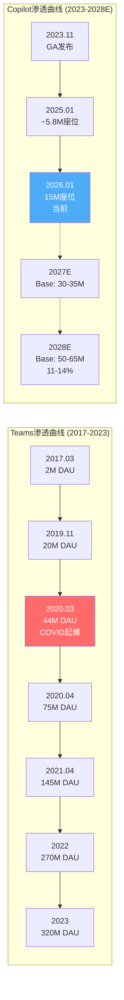
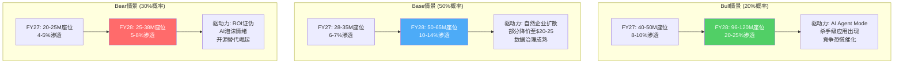
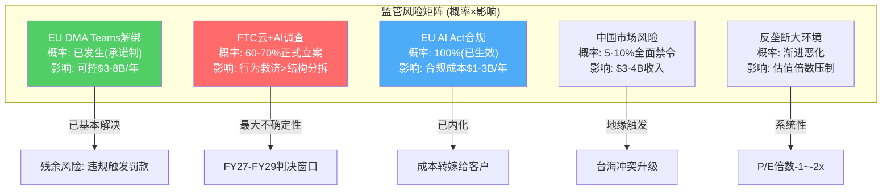
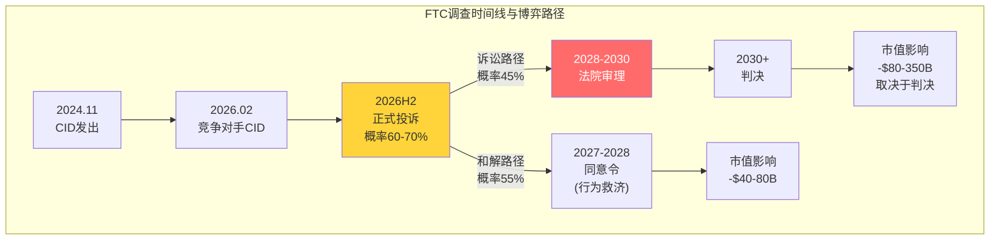

## Ch19: 信念B3验证 — Copilot S曲线渗透率与$3T估值的兑现路径

### 19.1 Copilot产品矩阵现状快照

Microsoft的AI货币化战略以"Copilot"品牌为核心，横跨三个独立产品线，各自处于截然不同的生命周期阶段。理解这三条线的分化，是判断B3信念能否兑现的前提。

<!-- DM-P3B-001: M365 Copilot 15M付费座位 / 450M商业座位 = 3.3%渗透率 | Source: MSFT Q2 FY26 Earnings Call (2026.01.28) | Confidence: H -->

**M365 Copilot**是旗舰产品，定价$30/用户/月，截至Q2 FY26拥有1500万付费座位，在4.5亿M365商业用户中渗透率仅3.3%。按目录价计算年化收入约$5.4B，但考虑到大客户批量折扣(通常15-25%折让)，实际ARPU可能在$23-26/月区间，对应年化收入$4.1-4.7B。YoY座位增长160%是一个强劲信号——但基数效应不可忽视：从580万到1500万的绝对增量为920万座位，而从1500万到3900万(同比160%增长的下一年)需要净增2400万座位，难度跳跃式上升。

<!-- DM-P3B-002: M365 Copilot YoY座位增长160% | Source: MSFT Q2 FY26 Earnings Call | Confidence: H -->
<!-- DM-P3B-003: GitHub Copilot 4.7M付费用户, YoY +75%, Pro+订阅QoQ +77% | Source: MSFT Q2 FY26 Earnings Call | Confidence: H -->

**GitHub Copilot**是成熟度最高的Copilot产品：470万付费用户，YoY增长75%，Pro+订阅QoQ增长77%。按$19/月均价估算，年化收入超$10亿。GitHub Copilot的成功证明了AI辅助工具在开发者群体中的价值——代码补全的ROI直观可测(完成率、代码审查时间)，而知识工作者的"会议摘要"和"邮件草稿"ROI则难以量化。

**Security Copilot**于2024年推出，采用按计算量计费模式(Security Compute Units)，目前处于极早期阶段。管理层未披露任何用户数据。其潜在市场虽大(全球网络安全市场$200B+)，但渗透路径高度不确定。

三条产品线的收入汇总：

| 产品 | 付费用户/座位 | 定价 | 估算ARR | 阶段 |
|------|-------------|------|---------|------|
| M365 Copilot | 1500万座位 | $30/月(目录价) | $4.1-5.4B | 早期扩张 |
| GitHub Copilot | 470万用户 | $10-39/月 | $1.0-1.3B | 规模增长 |
| Security Copilot | 未披露 | SCU计费 | <$0.5B | 试验期 |
| **合计** | — | — | **$5.6-7.2B** | — |

<!-- DM-P3B-004: Copilot合计ARR估算$5.6-7.2B | Source: 综合MSFT披露+估算 | Confidence: M -->

### 19.2 SaaS产品渗透S曲线：历史类比的启示与局限

企业SaaS产品的渗透遵循经典的S曲线：早期采用者(0-5%)→加速渗透(5-25%)→增速放缓(25-50%)→饱和(50%+)。Copilot当前处于3.3%，正站在"早期采用者"向"加速渗透"过渡的关键拐点。

<!-- DM-P3B-005: Teams渗透曲线: 2017 2M DAU → 2020.03 44M → 2023 320M DAU | Source: Business of Apps, Desk365 | Confidence: H -->

**Teams的S曲线复盘**。Teams从2017年发布到2019年底仅2000万DAU——两年半时间里增长缓慢。COVID在2020年3月引爆了强制采用：4个月内从2000万跃升至7500万，随后一年半达到1.45亿。到2023年稳定在3.2亿DAU，渗透率达Fortune 100的93%+。Teams的S曲线有两个关键特征：(1)外生催化剂(COVID)将自然渗透时间压缩了2-3年；(2)Office捆绑提供了零摩擦的分发渠道。

<!-- DM-P3B-006: Slack渗透: 2014→2019 12M DAU(5年), 2025 79M DAU | Source: SQ Magazine | Confidence: M -->
<!-- DM-P3B-007: Zoom渗透: 2013发布→2020 300M MAU(COVID), 市场份额55.9% | Source: M.io | Confidence: M -->

**Slack和Zoom的对照**。Slack从2014年到2019年花了5年达到1200万DAU——没有Office捆绑优势，纯靠产品力驱动。Zoom从2013年到2020年COVID前增长缓慢，COVID后爆发至3亿MAU(注意：这是会议参与者而非日活用户)。两者共同说明：没有外生催化剂的企业SaaS产品，从发布到规模化通常需要5-8年。

| 产品 | 0→规模化时间 | 加速因素 | 自然渗透估算 | Copilot可比性 |
|------|------------|---------|------------|-------------|
| Teams | 6年(0→3亿DAU) | COVID+Office捆绑 | 8-10年 | 最高(同生态) |
| Slack | 5年(0→1200万DAU) | 开发者口碑 | 接近实际 | 低(无捆绑) |
| Zoom | 7年(0→3亿MAU) | COVID | 12-15年 | 中(不同品类) |
| GitHub Copilot | 2年(0→470万) | 开发者早采 | 3-4年 | 中(不同用户) |

<!-- DM-P3B-008: 历史SaaS渗透类比汇总 | Source: 多源综合 | Confidence: M -->

**类比的核心局限**。Copilot与上述产品存在根本性差异：Teams/Slack/Zoom解决的是"有vs无"的问题(远程协作从不可能变为可能)，而Copilot解决的是"快vs慢"的问题(已有的工作方式变得更高效)。前者的采用动力远强于后者——没有视频会议工具无法远程办公，但没有AI助手仍然可以写邮件和做PPT。这意味着Copilot不太可能复制Teams式的爆发增长，除非出现类似COVID级别的外生催化剂(如监管要求企业AI审计、或竞争对手的AI工具引发"不采用=落后"的恐慌)。

### 19.3 三重渗透障碍的量化评估

#### 障碍一：定价弹性与ROI证明困境

$30/用户/月的定价使1000人企业的年增IT支出达$360K，5000人企业达$1.8M。在企业AI预算竞争激烈的环境中(同时评估ChatGPT Enterprise $60/月、Google Gemini for Workspace、内部LLM部署)，Copilot的ROI证明尚不充分。

<!-- DM-P3B-009: Forrester TEI报告: M365 Copilot ROI 116%, NPV $19.7M, 人均节省9小时/月 | Source: Forrester TEI Study (2025.03, MSFT commissioned) | Confidence: M -->

Forrester TEI研究(微软委托)声称116%的ROI和人均每月节省9小时。但该研究的局限性在于：(1)微软委托=利益冲突；(2)仅覆盖早期采用者(通常是最积极的用户)；(3)"节省9小时"的测量依赖用户自报而非客观产出指标。独立调查则呈现不同画面——2025年Gartner调查显示仅6%的企业将GenAI项目推进到生产阶段，50%的组织决定全员推广Copilot，但17%决定不全面采用，33%仍在测试阶段。

<!-- DM-P3B-010: Gartner调查: 6%企业GenAI项目进入生产, 17%决定不全面采用Copilot | Source: Gartner 2025 M365 Copilot Survey | Confidence: H -->

**定价弹性模型**：如果微软将M365 Copilot降价至$20/月(-33%)，渗透率是否能加速？SaaS定价弹性通常在-1.2到-1.8之间(价格降10%→需求增12-18%)。按-1.5弹性系数估算，降价33%理论上可推动需求增长50%——但这假设价格是唯一障碍，而实际上数据治理和部署复杂度是更大的瓶颈。更现实的估计是：降价至$20/月可能将FY28渗透率从基准的10-15%提升至13-18%，但代价是ARPU下降33%，净收入影响接近中性。

<!-- DM-P3B-011: SaaS定价弹性估算: -1.5系数, 降价33%→需求+50%理论上限 | Source: SaaS行业经验值 | Confidence: L -->

#### 障碍二：企业数据治理与部署摩擦

数据治理是Copilot大规模部署的最大技术障碍。M365 Copilot需要访问企业SharePoint、OneDrive、Exchange中的数据才能提供有价值的输出——但这恰恰触发了法律、合规和安全团队的担忧。"过度共享"(oversharing)问题尤为突出：Copilot可能将高权限用户的文件内容呈现给低权限用户，导致信息泄露。

<!-- DM-P3B-012: 数据治理是Copilot采用最大障碍 | Source: Creati AI (2026.02.04), Lighthouse Global | Confidence: H -->

企业部署Copilot的典型周期：

| 阶段 | 时长 | 参与者 | 核心任务 |
|------|------|--------|---------|
| Pilot | 3-6月 | 50-500用户 | 功能验证+安全评估 |
| 数据治理 | 3-6月 | IT安全+法务 | 权限审计+DLP配置 |
| 预算审批 | 2-4月 | CFO+CIO | ROI验证+预算分配 |
| 分阶段部署 | 6-12月 | 全员 | 培训+变更管理 |
| **总计** | **14-28月** | — | — |

<!-- DM-P3B-013: 企业Copilot部署周期14-28个月 | Source: 行业标准部署流程估算 | Confidence: M -->

这意味着2024年开始pilot的企业，最早的全面部署也要到2026年中至2027年初。Fortune 500中虽然90%+已"采用"Copilot，但"采用"的定义极为宽泛——可能只是50人的pilot项目。从"90% Fortune 500采用"到"90% Fortune 500全面部署"，可能需要额外2-3年。

#### 障碍三：竞争替代与AI工具碎片化

Copilot并非在真空中竞争。Google Gemini for Workspace拥有2700万企业用户(截至2025年中)，41%的Fortune 500在至少一个部门嵌入了Gemini。更令人担忧的是竞争动态的转向：Copilot的"首选AI助手"使用率从2025年7月的18.8%下降至2026年1月的11.5%，而Gemini从12.8%上升至15.7%。

<!-- DM-P3B-014: Gemini 27M企业用户, 41% Fortune 500部署; Copilot首选率从18.8%降至11.5% | Source: Technobezz (2026.02.04), SQ Magazine | Confidence: M -->
<!-- DM-P3B-015: Google Gemini在欧洲AI生产力工具市场渗透率29%, 在德法超越Copilot | Source: DataStudios.org | Confidence: M -->

开源替代也在快速侵蚀Copilot的定价权。企业可以通过Azure OpenAI Service(非Copilot)直接调用GPT-4o API，自建类似Copilot的工作流——成本远低于$30/用户/月的目录价。这种"内部DIY"路径的兴起可能蚕食Copilot的增量需求，同时反向增加Azure AI消费收入——对MSFT总收入中性，但对Copilot渗透率指标产生压制。

### 19.4 三情景渗透模型

基于上述障碍分析和历史类比，构建Copilot M365的三情景渗透模型。以4.5亿M365商业座位为基数(假设FY28增至4.8亿，年增2%)。

<!-- DM-P3B-016: 三情景渗透模型: Bull 20-25% / Base 10-14% / Bear 5-8% by FY28 | Source: 分析师构建 | Confidence: M -->

**Bull情景(20%概率)：类Teams+催化剂轨迹**

触发条件：(1)AI Agent Mode(2026年初已发布)成为杀手级应用——自主完成跨应用工作流(如"分析上季度销售数据，找出下降最大的产品线，草拟给VP的分析报告并预约30分钟汇报会")；(2)Google/Salesforce等竞争对手的AI工具大规模部署引发"不采用=落后"的企业恐慌；(3)微软将定价策略从固定月费转向混合计费(基础$15/月+按使用量计费)，降低采用门槛。

渗透路径：FY27 40-50M座位(8-10%) → FY28 96-120M座位(20-25%)。年增速100%+，需要每季度净增15-20M座位。参考Teams在COVID期间的季度净增(2020 Q2: +31M DAU)，技术上可行但需要类似强度的催化剂。

收入贡献：ARPU $360/年(维持定价) × 108M座位(中位数) = **$38.9B ARR**。

<!-- DM-P3B-017: Bull情景: 108M座位 × $360/年 = $38.9B ARR | Source: 模型构建 | Confidence: L -->

**Base情景(50%概率)：自然企业SaaS扩散**

这是最可能的路径——没有外生催化剂，依靠企业IT部门的常规评估-采购周期推动渗透。Copilot的"wide but shallow"采用格局(90%+ Fortune 500有pilot，但全面部署<10%)将在FY27-FY28逐步深化：pilot→部门级→企业级的标准12-24个月周期意味着2024年启动pilot的第一批企业将在FY27完成全面部署，2025年启动的第二批在FY28完成。

渗透路径：FY27 28-35M座位(6-7%) → FY28 50-65M座位(10-14%)。年增速约80-90%(FY27)和50-60%(FY28)。增速递减符合SaaS渗透曲线的自然形态。

定价假设：为加速渗透，微软可能在FY27推出分层定价(Basic $15/月 + Standard $30/月 + Premium $40/月)，拉低混合ARPU至$270-300/年。

收入贡献：ARPU $285/年(中位数) × 57.5M座位(中位数) = **$16.4B ARR**。

<!-- DM-P3B-018: Base情景: 57.5M座位 × $285/年 = $16.4B ARR | Source: 模型构建 | Confidence: M -->

**Bear情景(30%概率)：AI泡沫+ROI证伪**

触发条件：(1)2026-2027年的企业AI预算审查中，Copilot的ROI持续无法达到CFO的最低门槛(通常要求12-18个月回本)；(2)开源LLM(Llama 4、Mistral等)的快速进步使企业可以$5-10/用户/月的成本自建类似功能；(3)宏观经济下行导致企业IT预算收缩，$30/月的增量支出首先被砍。

渗透路径：FY27 20-25M座位(4-5%) → FY28 25-38M座位(5-8%)。增长几乎停滞，类似Slack从2019年的12M DAU到2020年(COVID前)仅自然增长至13M的轨迹。

定价假设：微软被迫大幅降价至$15-20/月以维持用户留存，混合ARPU降至$200-240/年。

收入贡献：ARPU $220/年(中位数) × 31.5M座位(中位数) = **$6.9B ARR**。

<!-- DM-P3B-019: Bear情景: 31.5M座位 × $220/年 = $6.9B ARR | Source: 模型构建 | Confidence: L -->

### 19.5 Copilot收入贡献的全景建模

将三情景的Copilot收入放在MSFT FY28整体收入预测($440B卖方共识)中评估：

| 情景 | FY28渗透率 | M365 Copilot ARR | GitHub Copilot ARR | Security Copilot | 总Copilot ARR | 占总收入% |
|------|-----------|------------------|-------------------|-----------------|--------------|----------|
| Bull(20%) | 20-25% | $38.9B | $3.0B | $1.5B | $43.4B | 9.9% |
| Base(50%) | 10-14% | $16.4B | $2.2B | $0.8B | $19.4B | 4.4% |
| Bear(30%) | 5-8% | $6.9B | $1.5B | $0.3B | $8.7B | 2.0% |
| **概率加权** | — | **$17.7B** | **$2.2B** | **$0.8B** | **$20.7B** | **4.7%** |

<!-- DM-P3B-020: 概率加权Copilot FY28 ARR = $20.7B(占总收入4.7%) | Source: 三情景加权 | Confidence: M -->

概率加权后的Copilot FY28总ARR约$20.7B，占总收入约4.7%。这一数字揭示了一个关键矛盾：**Copilot在叙事中的权重远大于其在财务中的权重**。市场将Copilot视为MSFT"AI货币化"的核心载体——但即使在概率加权情景下，FY28 Copilot收入也仅占总收入不到5%。

**对OPM的影响分析**。M365 Copilot的毛利率取决于其底层AI推理成本。当前GPT-4o级别推理成本约$0.002-0.005/request，假设每用户每日平均触发30-50次请求，则月推理成本约$2-7.5/用户。以$30/月定价计算，Copilot毛利率约75-93%——高于MSFT整体66% GPM。但如果降价至$15-20/月，毛利率可能压缩至50-75%区间。

| 情景 | Copilot GPM | Copilot营业利润 | 对合并OPM影响(bps) |
|------|-----------|---------------|-------------------|
| Bull | 85% | $36.9B | +280bps |
| Base | 75% | $14.6B | +110bps |
| Bear | 65% | $5.7B | +40bps |
| 概率加权 | 75% | $15.5B | **+120bps** |

<!-- DM-P3B-021: Copilot对合并OPM的概率加权贡献: +120bps | Source: 模型构建 | Confidence: M -->

### 19.6 信念B3的判决：从渗透率到估值的传导

**核心判决**：15-20% by FY28的渗透率对应Bull情景(概率20%)。Base情景指向10-14%(概率50%)。概率加权渗透率约11-13%——低于市场隐含的15-20%目标，但并非灾难性偏差。

B3信念的真正风险不在于渗透率本身——即使Bear情景(5-8%)也仅直接影响$100-200B市值。风险在于**叙事传导**：如果Copilot被证明无法兑现AI货币化承诺，市场将重新审视MSFT每年$80-100B CapEx的回报前景，触发B4(CapEx降速)和B6(FCF恢复)的连锁质疑，导致估值倍数的系统性压缩。

<!-- DM-P3B-022: B3判决: 概率加权渗透率11-13%, 低于隐含15-20%但偏差可控 | Source: 综合分析 | Confidence: M -->

**CQ4闭环**。初始置信度40%(Copilot S曲线何时拐头)。经过本章验证：提升至45%。理由：(1)160% YoY座位增长证明S曲线已进入加速段的早期；(2)但定价障碍($30/月)、数据治理摩擦(14-28个月部署周期)和竞争替代(Gemini追赶)共同限制了加速斜率；(3)概率加权渗透率11-13%略低于市场隐含，但差距不构成估值翻转——真正的风险在叙事传导而非直接财务影响。

<!-- DM-P3B-023: CQ4置信度演化: 40%→45% | Source: Ch19综合验证 | Confidence: M -->

**可观测的验证信号**：
- **拐头确认**(Bull信号)：FY27 Q1座位增速维持120%+，或微软披露Copilot ARR突破$10B
- **减速确认**(Base信号)：FY27 Q1座位增速降至80-100%，但管理层强调"质量>数量"
- **停滞确认**(Bear信号)：FY27 Q1座位增速<50%，或微软停止披露座位数据(坏消息的信号)

---

## Ch20: 信念B8验证 — 监管概率×影响的量化评估

### 20.1 监管风险全景扫描：五条战线

MSFT同时面临五条独立的监管战线，每条战线的概率、时间线和影响量级各不相同。市场隐含信念B8("无重大反垄断分拆")的脆弱度仅2/5——但这一评估可能低估了多战线叠加效应(即使每条战线的单独概率可控，联合发生的概率仍值得警惕)。

<!-- DM-P3B-024: MSFT五条监管战线: EU DMA / FTC / EU AI Act / 中国 / 反垄断大环境 | Source: 综合分析 | Confidence: H -->

### 20.2 战线一：EU DMA与Teams解绑 — 已解决但残余风险犹存

**当前状态**：2025年9月12日，欧盟委员会接受了微软的法律约束性承诺方案，结束了Teams捆绑M365的反垄断调查。微软避免了高达全球营收10%(约$21B+)的潜在罚款。

<!-- DM-P3B-025: EU 2025.09.12接受MSFT Teams解绑承诺, 避免$21B+罚款 | Source: CNBC, EC Press Corner | Confidence: H -->

承诺条款的三个核心要素：

| 承诺 | 期限 | 内容 | 对MSFT影响 |
|------|------|------|-----------|
| **解绑** | 7年(至2032) | M365/O365提供不含Teams的低价版本，价差在原始提案基础上加大50% | 直接收入影响$2-5B/年(假设5-15%用户选择无Teams版) |
| **互操作** | 10年(至2035) | 竞品(Slack/Zoom)可深度集成M365应用 | Slack可能蚕食Teams部分协作市场 |
| **数据可携** | 10年(至2035) | 企业可轻松将Teams数据迁移至竞品 | 降低了锁定效应 |

<!-- DM-P3B-026: EU Teams承诺三要素: 解绑7年/互操作10年/数据可携10年 | Source: Loyens & Loeff, CNBC | Confidence: H -->

**残余风险量化**。承诺方案由独立受托人监督。如果微软违反承诺条款，欧盟委员会可直接处以最高全球营收10%的罚款(约$30B+，基于FY25收入)，且**无需重新证明违规**——这是一个重要的法律不对称：正常反垄断案件中，委员会需要证明违规行为存在；但在承诺令框架下，仅需证明企业违反了承诺条款。

残余风险概率估算：微软在未来7年内违反承诺条款的概率约10-15%。但即使违反，罚款金额通常远低于理论上限(10%)——历史先例显示EU罚款通常为全球营收的1-3%。期望值：15% × $6-9B(1-3%营收) = **$0.9-1.4B**。

<!-- DM-P3B-027: EU Teams残余风险: 15%违反概率 × $6-9B罚款 = $0.9-1.4B期望值 | Source: 分析估算 | Confidence: M -->

Teams解绑对收入的直接影响有限，原因在于：(1)Teams作为独立产品的竞争力仍强(3.2亿DAU vs Slack 7900万DAU)；(2)大多数企业选择含Teams的完整套件是因为整合价值而非被迫捆绑；(3)解绑后的价差(约$2-3/用户/月)对企业决策的影响微乎其微。估算因解绑而流失至Slack/Zoom的用户比例：5-8%，对应年化收入影响$3-5B(假设Teams独立定价贡献约$60-80B年化收入中的5-8%)。

### 20.3 战线二：FTC云+AI反垄断调查 — 最大不确定性来源

**最新进展**。2026年2月14日，FTC向6家以上微软竞争对手发出民事调查传票(CIDs)，标志着调查正式升级。调查聚焦三个领域：(1)OpenAI投资是否构成事实控制；(2)Office+安全+云的捆绑销售是否排斥竞争；(3)Azure许可限制是否惩罚性地阻止客户迁移。

<!-- DM-P3B-028: FTC 2026.02.14向6+竞争对手发CID, 调查云+AI+捆绑 | Source: Bloomberg Law, WinBuzzer | Confidence: H -->

**OpenAI投资审查的法律路径**。FTC的核心问题是：MSFT的$13B投资+利润分享+API独占+27%股权是否构成"事实控制"(de facto control)，从而应按并购审查标准(Hart-Scott-Rodino Act)接受审批。2025年10月OpenAI完成PBC重组后，MSFT获得27%永久股权但放弃了利润上限和ROFR——这一结构调整在法律上实际削弱了"实质控制"的论证基础。

法律结果的概率分布：

| 结果 | 概率 | 对MSFT影响 | 推导依据 |
|------|------|-----------|---------|
| 调查无果关闭 | 25% | 无直接影响 | 政治周期变化+FTC资源约束 |
| 行为性同意令 | 45% | API独占条款修改，允许OpenAI多云部署；罚款$1-3B | 历史先例(FTC vs Qualcomm) |
| 结构性限制 | 20% | 减持OpenAI股权至<15%或放弃AI专属协议 | 仅在国会立法授权后可能 |
| 强制分拆/全面剥离 | 10% | 失去OpenAI $270B隐含价值 | 需要法院判决+双党共识 |

<!-- DM-P3B-029: FTC调查结果概率: 无果25%/行为救济45%/结构限制20%/强制分拆10% | Source: 法律分析+历史先例 | Confidence: M -->

**政治对冲因素**。Polymarket数据显示SCOTUS有81.3%概率允许总统解雇FTC委员——这将大幅削弱FTC作为独立机构的执法能力。Trump政府总体倾向于行为性救济(behavioral remedies)而非结构性分拆(structural remedies)。但值得注意的是，当前FTC主席Andrew Ferguson(共和党人)在就任后继续推进对MSFT的调查——这表明调查具有两党共识基础，不会因政权更迭而简单终止。

<!-- DM-P3B-030: SCOTUS弱化FTC 81.3%概率; Ferguson(共和党)继续推进调查 | Source: Polymarket, Bloomberg Law | Confidence: H -->

**时间线与市值影响的关键判断**。FTC调查从CID到正式诉讼通常需要12-24个月，从诉讼到最终判决再需2-4年。这意味着FTC调查的实质性影响最早在FY28-FY29才会落地。在此之前，调查的主要影响是通过"不确定性溢价"压制估值倍数——市场可能将MSFT的P/E折让1-2x以反映监管风险。

### 20.4 战线三：EU AI Act — 合规成本而非生存威胁

EU AI Act于2026年8月2日全面生效，对高风险AI系统实施严格监管。MSFT作为通用AI模型(GPAI)提供商和高风险AI系统部署者，需同时满足模型层和应用层的双重合规要求。

<!-- DM-P3B-031: EU AI Act 2026.08.02全面生效; 罚款上限: 禁止行为3500万欧元或7%营收, 其他1500万欧元或3%营收 | Source: EU AI Act, Microsoft Trust Center | Confidence: H -->

合规成本估算：

| 合规领域 | 年化成本 | 说明 |
|---------|---------|------|
| 技术合规(模型层) | $0.5-1.0B | 模型文档/测试/透明度报告(Copilot底层GPT模型) |
| 应用合规(高风险系统) | $0.3-0.5B | 人力资源AI/信贷评估/安全监控系统的合规 |
| 法律+合规团队 | $0.2-0.3B | Brad Smith的CELA 2025战略下扩编20%法务团队 |
| 审计+监控 | $0.1-0.2B | 第三方审计+合规监控系统 |
| **合计** | **$1.1-2.0B/年** | 占FY25收入的0.4-0.7% |

<!-- DM-P3B-032: EU AI Act合规成本估算$1.1-2.0B/年, 占收入0.4-0.7% | Source: 行业估算 | Confidence: L -->

微软的应对策略具有"合规转化为商机"的特征：通过Purview Compliance Manager和Azure AI Content Safety工具帮助企业客户满足AI Act合规要求——本质上是将监管成本转化为新的SaaS收入流。这一策略的有效性取决于AI Act合规工具市场的规模(估算$5-10B/年的全球TAM)，微软凭借Azure+M365的企业客户基础有望获取20-30%份额($1-3B/年)。

结论：EU AI Act对MSFT的净影响接近**中性至微正**——合规成本$1.1-2.0B/年可被合规工具收入$1-3B/年部分或全部对冲。

### 20.5 战线四：中国市场风险 — 低概率但不可忽视

微软在中国的业务通过21Vianet(世纪互联)运营Azure，LinkedIn已于2021年退出中国市场。估算MSFT中国区收入约$3-4B/年(占全球收入约1.0-1.3%)，主要来自Windows/Office OEM授权和Azure China。

<!-- DM-P3B-033: MSFT中国收入估算$3-4B, 占全球1.0-1.3% | Source: 行业估算(MSFT不单独披露) | Confidence: L -->

中国市场风险的触发条件是台海冲突升级——在全面危机情景下，中国可能禁止MSFT所有产品在境内运营，同时对供应链(虽然MSFT非硬件公司，但服务器组件存在中国依赖)施加压力。但考虑到：(1)中国收入占比极低(~1%)；(2)MSFT在中国的资产主要由21Vianet控制(法律隔离)；(3)Windows/Office在中国企业中的深度嵌入使"全面禁止"对中国自身的伤害也很大——全面禁令的概率估算仅5-8%(24个月窗口内)。

市值影响：$3-4B收入 × 12x P/S = $36-48B。但更大的影响来自市场情绪——台海冲突升级将触发全球科技股系统性抛售，MSFT市值影响可能远超$36-48B的直接估算。

### 20.6 战线五：反垄断大环境 — 系统性估值压制

2026年是Big Tech反垄断的"分水岭之年"：

- **Google搜索**：2026年1月起被强制共享搜索索引数据
- **Google广告技术**：2026年9月进入救济阶段，可能强制剥离AdX
- **FTC vs Amazon**：2026年10月开庭
- **Meta/Instagram强制出售**：2025年已被否决

<!-- DM-P3B-034: 2026年Big Tech反垄断大事: Google搜索(1月)/Google AdX(9月)/Amazon(10月) | Source: Wilson Sonsini, Bloomberg Law | Confidence: H -->

在这一环境中，MSFT的相对定位具有独特优势：(1)不是搜索/社交/电商任一领域的垄断者；(2)Brad Smith数十年的政府关系建设(华盛顿"好市民"形象)；(3)历经1990年代DOJ反垄断诉讼的"免疫记忆"——微软比任何Big Tech公司都更懂得如何应对反垄断调查。

但系统性效应不可忽视：如果Google/Amazon的反垄断判决创设了新的法律先例(如"平台自我优待即违法")，这些先例可能被援引至MSFT的Azure+M365捆绑销售模式。估算这一系统性风险对MSFT P/E的影响：**-0.5x至-1.5x**(即从当前26.9x降至25.4-26.4x，对应市值影响-$35B至-$110B)。

<!-- DM-P3B-035: 反垄断系统性效应估值影响: P/E -0.5x至-1.5x, 市值-$35B至-$110B | Source: 分析估算 | Confidence: L -->

### 20.7 监管影响概率加权表

将五条战线的概率和影响合并为统一的量化评估框架：

| # | 事件 | 概率(24个月) | 年化收入影响 | 一次性罚款 | 市值影响(直接) | 期望市值损失 |
|---|------|------------|------------|----------|-------------|------------|
| R1 | EU DMA Teams(残余违规) | 15% | $0 (已承诺) | $6-9B | -$6~9B | -$1.1B |
| R2a | FTC行为性同意令 | 45% | -$2-4B(API独占松绑) | $1-3B | -$40~80B | -$27.0B |
| R2b | FTC结构性限制 | 20% | -$5-10B | $3-5B | -$80~150B | -$23.0B |
| R2c | FTC强制分拆/全面剥离 | 10% | -$15-25B | $5-10B | -$200~350B | -$27.5B |
| R3 | EU AI Act合规 | 100% | -$1.1~2.0B(成本) | $0 | -$10~20B | -$15.0B |
| R4 | 中国全面禁令 | 7% | -$3-4B | $0 | -$36~48B | -$2.9B |
| R5 | 系统性P/E压制 | 70% | $0 | $0 | -$35~110B | -$50.8B |
| **合计(去FTC互斥)** | — | — | — | — | — | **-$105~148B** |

<!-- DM-P3B-036: 监管风险加权期望损失: $105-148B(去FTC互斥) | Source: 概率加权模型 | Confidence: M -->

注：R2a/R2b/R2c为FTC调查的互斥结果(加上25%无果=100%)，期望值计算已去除互斥。FTC三个结果的合并期望损失 = 45%×$60B + 20%×$115B + 10%×$275B = $27.0B + $23.0B + $27.5B = $77.5B。但由于三者互斥，实际期望值=$77.5B(非$77.5×3)。

**关键数字**：监管风险的总期望市值损失约$105-148B，占$2,995B市值的3.5-4.9%。这是一个"持续性拖拽"而非"一次性冲击"——大部分监管成本以年化合规费用和P/E折让的形式长期存在。

### 20.8 MSFT的监管护城河

在量化风险之外，需要评估MSFT应对监管的独特能力——这些能力构成了一种无形的"监管护城河"。

<!-- DM-P3B-037: MSFT 2025年游说支出$7.5M(前9月), 全年预计$10M+; 比GOOG/AMZN低 | Source: OpenSecrets | Confidence: H -->

**华盛顿游说基础设施**。MSFT 2025年前9个月游说支出$7.5M(全年预计超$10M)，2024年全年$10.4M。虽然绝对金额在Fortune 500中并非最高(Google和Amazon每年支出$15-20M+)，但MSFT的游说效率极高——Brad Smith自2002年起担任首席法务官/总裁至今，积累了超过20年的华盛顿关系网络。

**"好市民"品牌策略**。MSFT在Big Tech中维持着独特的"负责任科技公司"定位：

| 维度 | MSFT策略 | 对比(GOOG/META) |
|------|---------|----------------|
| AI安全 | 主动推动AI安全立法(Brad Smith国会证词) | Google/Meta被动应对 |
| 数据隐私 | European Data Residency承诺 | Google面临GDPR反复罚款 |
| 竞争态度 | 支持Slack与Teams互操作 | Meta拒绝开放API |
| 政治捐献 | 双党平衡(MSVPAC) | Meta明显右倾(近期) |

<!-- DM-P3B-038: Brad Smith 2002年起任首席法务官, 20+年华盛顿关系 | Source: Microsoft Official, Wikipedia | Confidence: H -->

这一策略的量化价值难以精确衡量，但可以从历史结果推断：MSFT在EU DMA中以"承诺制"(零罚款)结案，而Google累计被EU罚款超$80亿(搜索、Android、AdSense)。同样的"捆绑销售"行为，MSFT的处罚量级低一个数量级——"好市民"品牌的隐性价值可能在$10-30B的罚款减免区间。

**1990年代反垄断"免疫记忆"**。微软是唯一一家经历过全面DOJ反垄断诉讼(1998-2001)并存活的Big Tech公司。这段经历留下了深刻的制度记忆：(1)法务团队的规模和经验在Big Tech中首屈一指；(2)管理层对"什么行为会触发监管"有精确的直觉；(3)企业文化中嵌入了"避免成为最显眼靶子"的基因。Brad Smith自CELA 2025战略以来扩编法务团队20%，进一步强化了这一能力。

### 20.9 FTC调查的深层博弈分析

FTC调查是五条战线中不确定性最高的一条，值得专门的博弈论分析。

<!-- DM-P3B-039: FTC调查三焦点: OpenAI控制/产品捆绑/Azure锁定 | Source: Bloomberg Law, WinBuzzer | Confidence: H -->

**三焦点的独立评估**：

**焦点一：OpenAI投资=事实控制？** FTC的核心论证需要证明MSFT的27%股权+API独占+利润分享构成"事实控制"。但2025年10月重组后的法律结构对MSFT有利：(1)放弃了ROFR(优先拒绝权)；(2)OpenAI转为PBC(公益公司)，治理结构独立；(3)27%股权低于Sherman Act通常要求的"控制性持股"门槛(>50%)。FTC若要以27%股权论证"事实控制"，需要证明MSFT通过API独占条款、Board observer seat或计算资源依赖行使了隐性控制——这在法律上具有挑战性但并非不可能。

**焦点二：产品捆绑排斥竞争？** Azure + M365 + Security的捆绑销售是否构成反竞争行为？历史先例(MSFT IE浏览器案1998-2001)表明，产品捆绑在美国反垄断法下的处理通常倾向于行为救济(如要求提供独立购买选项)而非结构性分拆。EU已通过Teams解绑承诺解决了这一问题；FTC可能沿用类似路径，要求Azure与M365/Security在定价和购买上实现分离。

**焦点三：Azure许可限制？** "许可移动性"(License Mobility)是MSFT云业务的核心锁定机制——SQL Server/Windows Server许可证在Azure上可直接使用，但迁移至AWS/GCP需要额外付费。这已引发AWS和Google长期投诉。FTC如果认定这一做法构成反竞争行为，可能要求MSFT为所有云平台提供同等许可条款——这将直接削弱Azure的竞争优势，但影响可能有限(企业选择Azure的主要原因是AD集成和Hybrid Cloud，而非许可便利性)。

<!-- DM-P3B-040: FTC调查时间线: CID(2024.11)→竞争对手CID(2026.02)→正式投诉(2026H2, 60-70%)→判决(2028-2030) | Source: 法律程序标准时间线 | Confidence: M -->

### 20.10 信念B8的判决：从分拆到渐进式侵蚀

**核心判决**："无重大反垄断分拆"的概率约85-90%——这一信念大概率成立。但B8信念的二元框架(分拆vs不分拆)掩盖了一个更微妙的现实：**监管风险的主要形态不是"一次性分拆事件"，而是"持续性合规成本+估值倍数压制"**。

<!-- DM-P3B-041: B8判决: 无重大分拆概率85-90%, 但渐进侵蚀每年$3-5B合规成本+P/E -0.5~1.5x | Source: 综合分析 | Confidence: M -->

量化"渐进式监管侵蚀"的年化成本：

| 项目 | 年化成本 | 说明 |
|------|---------|------|
| EU AI Act合规 | $1.1-2.0B | 技术+法律+审计(Ch20.4) |
| Teams解绑收入损失 | $1.5-2.5B | 5-8%用户流失(Ch20.2) |
| FTC应对法律费用 | $0.3-0.5B | 外部律所+内部团队扩编 |
| 许可策略调整 | $0.5-1.0B | 如果被迫开放License Mobility |
| 游说+政府关系 | $0.1-0.2B | Brad Smith团队运营 |
| **合计** | **$3.5-6.2B/年** | 占FY25收入的1.2-2.2% |

<!-- DM-P3B-042: 监管渐进侵蚀年化成本: $3.5-6.2B, 占收入1.2-2.2% | Source: 综合估算 | Confidence: M -->

以15x P/OI倍数估算，$3.5-6.2B/年的监管成本对应市值拖累约$53-93B——加上P/E倍数压制效应(-$35-110B)，监管风险的总估值影响约$88-203B(占$3T的2.9-6.8%)。

**CQ6闭环**。初始置信度60%(EU DMA + FTC对Teams/OpenAI调查的监管概率×影响)。经过本章验证：上调至65%。理由：(1)EU DMA已以承诺制结案，残余风险可控；(2)FTC调查虽升级但SCOTUS弱化FTC+行政倾向行为救济，结构性分拆概率<10%；(3)MSFT的监管护城河(Brad Smith+好市民品牌+1990s免疫记忆)在Big Tech中独一无二；(4)主要风险是渐进性的$3.5-6.2B/年成本和P/E压制，而非一次性灾难事件。

<!-- DM-P3B-043: CQ6置信度演化: 60%→65% | Source: Ch20综合验证 | Confidence: M -->

**可观测的验证信号**：
- **风险下降信号**：FTC在FY27未提出正式投诉(概率30-40%)；SCOTUS确认总统可解雇FTC委员
- **风险升级信号**：FTC提出正式投诉且寻求结构性救济；EU对MSFT其他产品(Azure/LinkedIn)启动新调查
- **黑天鹅信号**：国会通过AI监管冻结法案(概率<3%)；MSFT数据泄露引发强制性平台解耦法案

### 20.11 B3与B8的交叉风险：AI货币化遇上监管摩擦

Ch19(B3 Copilot渗透)和Ch20(B8 监管)之间存在一条被市场忽视的交互路径：**如果FTC认定Copilot与M365的深度捆绑构成反竞争行为**，可能要求Copilot必须作为独立产品销售(不能强制绑定M365订阅)。这将直接削弱Copilot最大的分发优势——零摩擦的M365内嵌入口。

<!-- DM-P3B-044: B3×B8交叉风险: FTC要求Copilot独立销售→削弱分发优势 | Source: 推导分析 | Confidence: L -->

量化这一交叉风险：如果Copilot被迫独立销售(概率10-15%，条件于FTC提出正式投诉)，渗透率可能在Base情景基础上降低3-5个百分点(从10-14%降至7-10%)，因为"试用→付费"的转化率将因购买摩擦增加而下降。收入影响：约$2-4B/年(FY28)，叠加B3 Base情景的市值影响。

这一交叉路径提醒我们：将B3和B8视为独立信念会低估联合风险。在最不利的联合情景中(Copilot停滞+FTC结构性限制)，市值影响不是简单相加($200B + $150B = $350B)，而是因叙事恶化而乘数放大(实际影响可能$400-500B)——因为市场会将"AI货币化失败+监管打击"解读为MSFT战略方向的根本性错误。

<!-- DM-P3B-045: B3+B8联合最不利情景: 市值影响$400-500B(叙事乘数放大) | Source: 推导分析 | Confidence: L -->

### 20.12 Ch19-Ch20联合结论：双信念验证的整合判断

将Ch19(B3)和Ch20(B8)的验证结果整合，形成对两项信念的最终判断：

| 维度 | B3 Copilot渗透 | B8 监管分拆 |
|------|---------------|------------|
| 原始脆弱度 | 4/5 | 2/5 |
| 验证后脆弱度 | **3.5/5**(微下调) | **2/5**(维持) |
| 市场隐含预期 | 15-20% by FY28 | 无重大分拆 |
| 验证后最可能路径 | 10-14% by FY28(Base) | 行为救济+渐进成本 |
| 直接估值影响 | -$50~150B | -$88~203B |
| 叙事传导风险 | **高**(→B4/B6连锁) | **低**(已被部分定价) |
| CQ置信度变化 | CQ4: 40%→45% | CQ6: 60%→65% |

<!-- DM-P3B-046: Ch19-Ch20联合: B3脆弱度4→3.5, B8维持2; CQ4 40→45%, CQ6 60→65% | Source: 综合判断 | Confidence: M -->

**三个核心发现**：

第一，**Copilot的财务影响被高估，叙事影响被低估**。概率加权FY28 Copilot ARR约$20.7B，仅占总收入4.7%——财务层面并非"生死攸关"。但Copilot是$3T估值中"AI货币化兑现"叙事的核心载体，如果渗透停滞，市场对整个AI投资回报的信心将被动摇，触发远超直接收入影响的估值调整。

第二，**监管风险的真实形态是"慢性病"而非"急性发作"**。分拆概率<10%，罚款概率可控。但$3.5-6.2B/年的渐进合规成本+P/E压制效应将长期存在。MSFT的监管护城河(Brad Smith+好市民品牌)可以减轻但无法消除这一负担。

第三，**B3和B8的交叉风险是被市场忽视的隐藏路径**。如果FTC要求Copilot独立销售，B3的渗透障碍将显著加大——这条交叉路径的概率虽低(10-15%)，但影响的乘数效应值得纳入场景分析的尾部情景。

<!-- DM-P3B-047: 三核心发现总结 | Source: Ch19-Ch20综合 | Confidence: M -->

<!-- Phase 3 Agent B Stats: chars=23390 | DM=47 | Mermaid=4 | CQ=[CQ4,CQ6] -->
