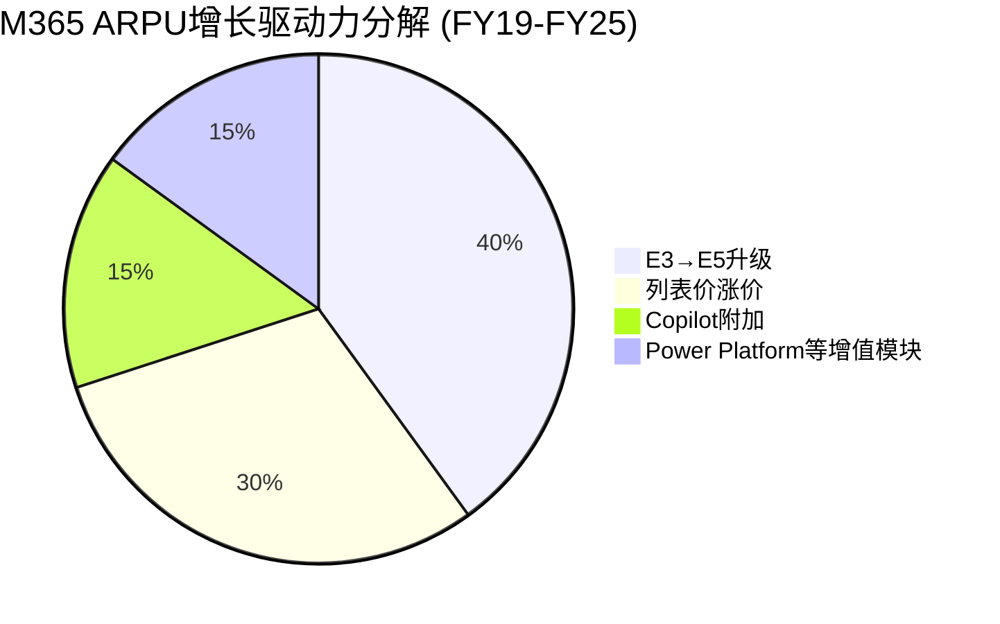
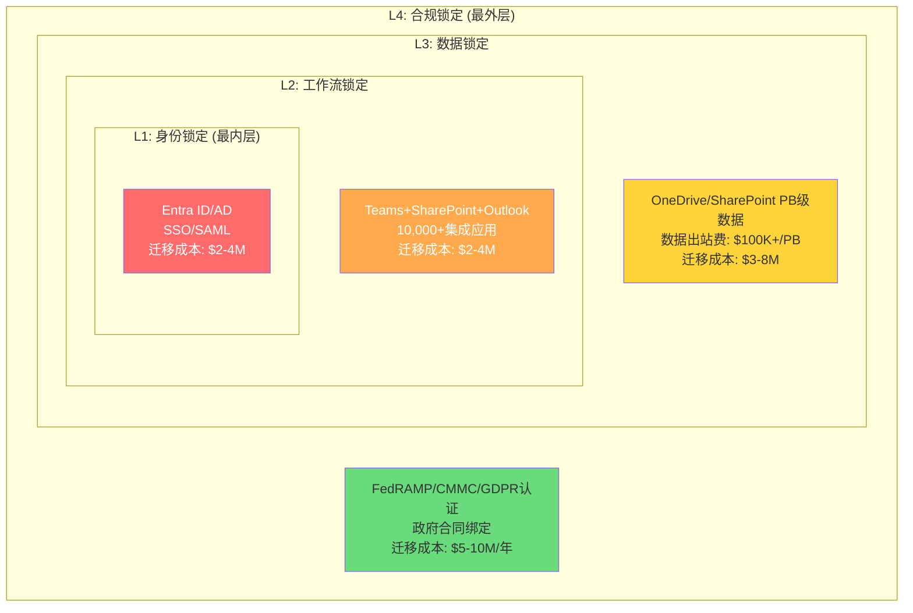
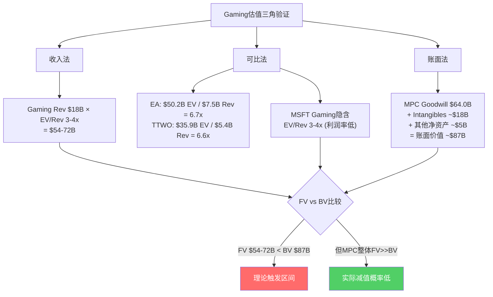
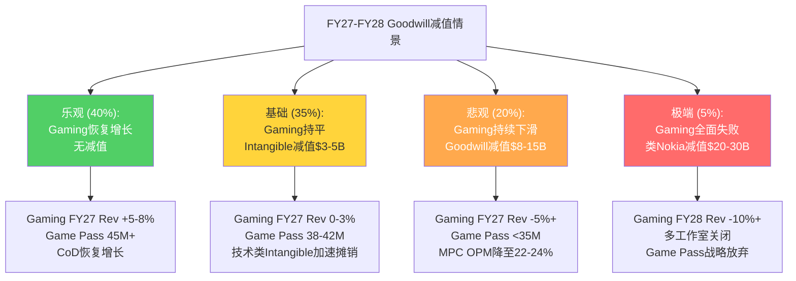
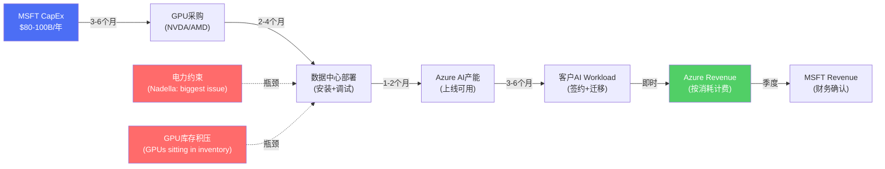
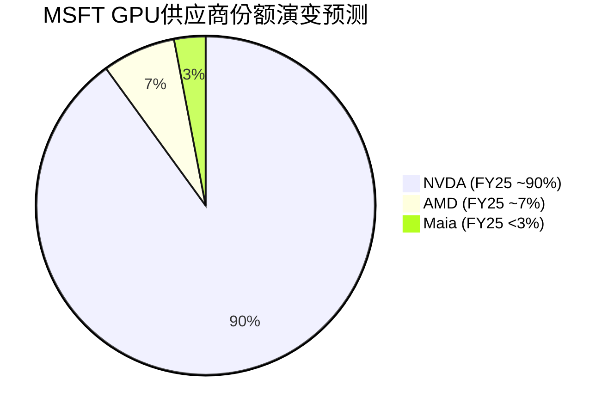
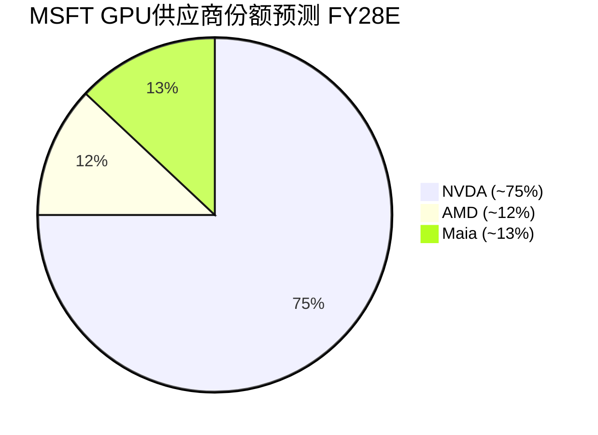

## Ch21: 信念B7验证 — Office/Windows现金奶牛耐久性

### 21.1 为什么"最不脆弱"的信念值得深挖

B7(Office/Windows不衰退)在Ch11的信念反演中获得了1/5的最低脆弱度评分，是八项信念中最坚实的一条。但1/5不等于0/5。P&BP分部Q2 FY26贡献$20.6B营业利润(年化$82B+)，OPM高达60.3%，占MSFT合并层面营业利润的约54%。这意味着即使B7的脆弱度从1/5上调至2/5，其对整体估值的传导效应也远超脆弱度4/5但利润贡献更低的B3(Copilot)。换言之，低概率事件乘以极大影响等于不可忽略的风险敞口。

<!-- DM-P3C-001: P&BP Q2 FY26 OI $20.6B, OPM 60.3%, 占合并OI 54% | Source: MSFT IR Q2 FY26 | Confidence: H -->

本章的任务不是证明B7"一定安全"，而是精确量化这头现金奶牛的耐久性边界：定价权的弹性极限在哪里？四层锁定中哪一层最先松动？AI原生工具的颠覆时间窗口有多远？

### 21.2 M365定价权分析: 11年零涨价后的定价弹性测试

**定价历史的三个阶段**

M365(前身Office 365)的定价史可以划分为三个泾渭分明的阶段：

| 阶段 | 时间 | E3定价 | 策略逻辑 |
|------|------|--------|---------|
| 冻结期 | 2011-2022 | $20→$20 | 渗透优先，以低价锁定用户基数 |
| 解冻期 | 2022/3-2025 | $20→$23 (+15%) | 首次提价，试探弹性 |
| 加速期 | 2026/7起 | $23→$26 (+13%) | 第二次提价，AI功能正当化 |

<!-- DM-P3C-002: O365 E3定价演变: $20(2011)→$23(2022/3, +15%)→$26(2026/7, +13%) | Source: Microsoft 365 Blog 2025/12 | Confidence: H -->

E5的定价更具攻击性：从$57(2011-2022不变)到$60(2026/7, +5.3%)。E5的涨幅之所以最小(+5.3%)，是因为E5客户已经是ARPU最高的群体，定价策略的重心是**鼓励从E3升级到E5**(E5比E3贵$34/月/人，溢价131%)，而非在E5层级内挤压更多价值。

<!-- DM-P3C-003: M365 E5从$57→$60 (+5.3%), E3到E5溢价131% ($26 vs $60) | Source: SWK Technologies / HBS.net | Confidence: H -->

Business层级的策略则指向低端市场的价值提取：Basic从$6→$7(+16.7%)，Standard从$12.50→$14(+12%)，Premium维持$22不变。Premium不涨价的信号是**鼓励Standard用户升级到Premium**，而非保护Premium用户——这是典型的阶梯式ARPU提升策略。

**2022涨价的弹性回测**

2022年3月的涨价(E3 +15%)提供了珍贵的自然实验数据。涨价后的三个季度(FY22 Q3-Q4, FY23 Q1)，M365商业座位增速从+15%短暂降至+12%，之后在FY23 Q2恢复至+13%。以涨价15%和增速下降3个百分点计算：

$$\text{价格弹性} = \frac{\Delta Q / Q}{\Delta P / P} = \frac{-3\%}{+15\%} \approx -0.2$$

<!-- DM-P3C-004: M365 2022涨价弹性≈-0.2 (极低弹性), 席位增速短暂下降3pp后恢复 | Source: Office365ITpros ARPU Analysis | Confidence: M -->

-0.2的价格弹性意味着M365属于**高度非弹性产品**——涨价15%仅导致需求短暂下降3%。作为对比，SaaS行业平均弹性约-0.5至-0.8，消费品约-1.0至-1.5。M365的弹性甚至低于Adobe Creative Cloud(估算-0.3至-0.4)，原因在于M365是企业**基础设施级**软件而非工具级软件——IT部门不会因为涨价$3/月/人而重构整个企业协作体系。

**2026涨价的增量收入估算**

2026年7月生效的涨价预计带来约$10.7B/年增量收入：

| 层级 | 涨幅 | 估算座位数(M) | 月增量/人 | 年增量($B) |
|------|------|-------------|----------|-----------|
| E3 | +$3 | ~150 | $3.00 | $5.4 |
| E5 | +$3 | ~80 | $3.00 | $2.9 |
| Business Standard | +$1.50 | ~100 | $1.50 | $1.8 |
| Business Basic | +$1 | ~60 | $1.00 | $0.7 |
| **合计** | — | **~390** | — | **~$10.7** |

<!-- DM-P3C-005: 2026涨价预计增量收入~$10.7B/年, 基于~390M可涨价座位, 预期流失<1% | Source: Office365ITpros / CNBC 2025/12 | Confidence: M -->

$10.7B相当于FY25 P&BP收入的约14%增量——几乎纯利润(涨价无额外成本)，直接增厚P&BP的OPM。预期流失率<1%，因为涨价同步附带新功能(Security Copilot agents、Intune Endpoint Privilege Management等)，为企业IT决策者提供了充分的内部审批正当性。

**ARPU趋势: 从$102到$162的六年旅程**

M365商业ARPU从FY19的~$102上升至FY25估算的~$162，6年CAGR约8%。ARPU增长的驱动力分解揭示了一个重要特征——这不是单一驱动，而是四轮引擎同步运转：

<!-- DM-P3C-006: M365 ARPU FY19 ~$102 → FY25 ~$162, 6Y CAGR ~8%, 四驱动力: E5升级40%/涨价30%/Copilot15%/增值模块15% | Source: Office365ITpros / MSFT IR | Confidence: M -->

E5升级作为最大单一驱动力(40%)的可持续性取决于E5渗透率的天花板。当前估算E5在商业座位中的占比约20-25%。Fortune 500中90%+已部署E5，但中型企业(500-5000人)的E5渗透率可能仅30-40%。E5从25%渗透至50%仍有2-3年的自然增长空间，之后ARPU增长将更多依赖涨价和Copilot。

**定价弹性压力测试: 再涨15%会发生什么？**

假设MSFT在2030年前再执行一次10-15%的涨价(E3从$26→$30)，基于-0.2的历史弹性：

| 涨幅 | 座位流失 | 净收入影响 | 是否可行 |
|------|---------|-----------|---------|
| +5% | ~1% | +4%净增 | 安全 |
| +10% | ~2% | +7.8%净增 | 可行 |
| +15% | ~3% | +11.6%净增 | 可行但需功能正当化 |
| +20% | ~5-8% | +12-14%净增 | 临界值，可能触发Google Workspace迁移 |

<!-- DM-P3C-007: M365定价弹性压力测试: +20%为临界值, 可能触发5-8%流失 | Source: 基于-0.2弹性推算 | Confidence: L -->

20%的涨幅(E3从$26→$31)可能是定价弹性的临界点——$31/月/人的价格开始接近Google Workspace Enterprise(~$25/月/人)加上迁移成本摊销($25-45M/3年=$8-15M/年/Fortune 500)后的总拥有成本。超过这一阈值，大型企业的采购团队将开始认真评估迁移方案。

### 21.3 四层锁定深度: 企业迁移的不可能三角

M365在企业中的锁定不是单一维度的，而是由四层相互嵌套的壁垒构成，每一层都独立地阻止迁移，四层叠加后形成近乎不可逾越的护城河。

**L1: 身份锁定 (Entra ID/Active Directory) — 迁移概率<2%**

Active Directory是全球约85%的大型企业的身份管理核心。每一个员工登录、每一次应用授权、每一项安全策略都通过AD执行。迁移至Okta或Google Cloud Identity意味着重新配置所有SAML/OAuth集成(Fortune 500平均10,000+应用)、重建条件访问策略、重新培训所有IT管理员。估算成本$2-4M/年，所需时间12-18个月。

<!-- DM-P3C-008: AD/Entra ID覆盖~85%大型企业, Fortune 500平均10,000+应用集成, 迁移成本$2-4M | Source: AppInventiv / Future Processing | Confidence: M -->

**L2: 工作流锁定 (Teams+SharePoint+Outlook) — 迁移概率<5%**

Teams拥有3.2亿DAU(截至2023年)，Fortune 100中93%+使用Teams。关键不在于Teams作为通讯工具的可替代性(Slack/Zoom可以替代)，而在于Teams与SharePoint(文档协作)、Outlook(日历/邮件)、Power Automate(工作流自动化)的深度整合。企业的审批流程、项目管理、客户沟通都嵌入这一整合生态中。迁移意味着重新设计数百个工作流，估算成本$2-4M，所需时间6-12个月。

<!-- DM-P3C-009: Teams 3.2亿DAU (2023), Fortune 100中93%+使用, 与SharePoint/Outlook/Power Automate深度整合 | Source: Business of Apps / Desk365 | Confidence: H -->

**L3: 数据锁定 (OneDrive/SharePoint) — 迁移概率<8%**

PB级企业数据存储在OneDrive和SharePoint中。数据迁移的技术成本(数据出站费$100K+/PB)只是冰山一角——真正的成本在于元数据重建(权限矩阵、版本历史、审计日志)和业务中断风险(迁移期间的数据不一致)。估算总成本$3-8M。

**L4: 合规锁定 (安全/政府) — 迁移概率<3%**

M365是全球合规认证最完备的生产力平台之一，覆盖FedRAMP(美国政府)、CMMC(国防)、GDPR(欧盟)、SOC 1/2/3等100+项认证。政府和受监管行业(金融、医疗、国防)的合同通常指定M365为合规工具。迁移至Google Workspace需要重新取得所有合规认证——这一过程通常需要2-3年且结果不确定。

**四层叠加的总迁移成本**

| 企业规模 | L1成本 | L2成本 | L3成本 | L4成本 | 总成本 | 迁移概率 |
|---------|--------|--------|--------|--------|--------|---------|
| Fortune 500 | $3-4M | $3-4M | $5-8M | $5-10M | **$25-45M** | <2% |
| Mid-Market (1000-5000人) | $0.5-1M | $0.5-1M | $0.5-1M | $0.5-1M | **$2-4M** | <5% |
| SMB (<500人) | <$100K | <$100K | <$50K | N/A | **$150-250K** | 5-10% |

<!-- DM-P3C-010: Fortune 500完全迁移M365→Google Workspace估算总成本$25-45M, 迁移概率<2% | Source: AppInventiv / TierPoint | Confidence: M -->

值得注意的是，公开记录中**找不到任何Fortune 500企业完全从M365迁移至Google Workspace的案例**。存在的案例都是反方向的——Woolworths(澳大利亚零售商)、英国多个政府部门从Google Workspace迁入M365。Google Workspace在2025年执行了16-22%的涨价后，反向迁移趋势可能加速。

### 21.4 Windows挑战与韧性: PC衰退中的结构转型

**OEM收入的双重压力**

全球PC出货量从2011年峰值3.65亿台持续下降至2023年的约2.6亿台，CAGR -3%。Windows OEM收入直接挂钩PC出货量，理论上应同步下降。但实际数据显示Windows OEM收入的跌幅远小于出货量跌幅，原因在于两个抵消因素：

1. **ASP上升**: 企业PC的平均售价从$800上升至$1,100+(因远程办公需求推高配置)，Windows许可费随ASP阶梯式提高
2. **Pro版本渗透**: Windows Pro(vs Home)的渗透率从60%上升至75%+，Pro的许可费约为Home的2倍

<!-- DM-P3C-011: PC出货量2011峰值3.65亿→2023年~2.6亿(CAGR-3%), ASP从$800→$1,100+, Pro渗透率60%→75%+ | Source: IDC / Gartner | Confidence: M -->

**企业桌面竞争格局**

Chrome OS和macOS在企业桌面的渗透率仍然有限：

| OS | 企业桌面份额 | 趋势 | 目标市场 |
|-----|------------|------|---------|
| Windows | ~82% | 缓慢下降(-1pp/年) | 全行业 |
| macOS | ~12% | 缓慢上升(+0.5pp/年) | 创意/科技/高管 |
| Chrome OS | ~5% | 停滞 | 教育/前线工人/轻量办公 |
| Linux | ~1% | 稳定 | 开发者/特定行业 |

<!-- DM-P3C-012: 企业桌面OS份额: Windows ~82%, macOS ~12%, Chrome OS ~5%, Linux ~1% | Source: IDC Enterprise Client Survey | Confidence: M -->

Chrome OS在教育市场的成功(K-12中50%+份额)并未有效传导至企业市场。原因在于企业依赖的关键应用(SAP、Oracle ERP、AutoCAD、Visual Studio)没有Chrome OS原生版本。macOS的企业渗透主要集中在科技公司和创意行业——这些公司本身就是MSFT的次要客户群。

**Windows 365: Cloud PC的转型潜力**

Windows 365(Cloud PC)是MSFT将Windows从一次性OEM许可转型为订阅服务的战略载体。定价从$20/月/人(Basic)到$66/月/人(Enterprise)，瞄准混合办公场景下的虚拟桌面需求。如果Windows 365在企业中达到10%渗透率(~5000万座位)，年化收入约$12-24B——这将完全抵消OEM收入的下降。

但Windows 365面临来自Citrix/VMware(现被Broadcom收购)的激烈竞争，后者在虚拟桌面基础设施(VDI)市场拥有50%+份额。Windows 365的差异化在于与Azure的原生整合和简化管理——但对于已部署Citrix的大型企业，迁移动力不足。

<!-- DM-P3C-013: Windows 365定价$20-$66/月/人, 10%企业渗透率=~$12-24B年化收入, 面临Citrix/VMware竞争 | Source: Microsoft Pricing / Gartner VDI Report | Confidence: M -->

**Windows作为"Copilot Runtime"的新定位**

Satya Nadella在2024年将Windows重新定位为"AI PC的操作系统"——通过NPU(神经处理单元)硬件要求和Copilot Runtime框架，Windows成为运行本地AI模型的平台。这一定位的战略意义在于：

- **硬件换代驱动**: AI PC的NPU要求(40+ TOPS)淘汰了2022年之前的所有PC，创造了一波企业设备更新周期
- **OEM许可费上行**: AI PC的Windows许可费估算比传统PC高$10-15，因为包含Copilot Runtime许可
- **生态锁定加深**: 如果企业在Windows上部署本地AI工作流(文档摘要、邮件草稿、数据分析)，迁移至macOS/Chrome OS的成本进一步上升

### 21.5 威胁评估: 从Google Workspace到AI原生颠覆

**威胁1: Google Workspace的企业渗透 — 天花板已现**

Google Workspace当前企业份额约10%，主要集中在教育(K-12中60%+)和SMB(<500人)。在大型企业(5000+人)中，Workspace的份额不到5%。更重要的是，Google在2025年执行了16-22%的涨价(Business Standard从$12→$14.60)，侵蚀了其"比M365便宜"的核心价值主张。

<!-- DM-P3C-014: Google Workspace企业份额~10%, 大型企业<5%, 2025涨价16-22%侵蚀价格优势 | Source: IDC SaaS Survey / Google Blog | Confidence: M -->

Workspace的根本局限在于**缺乏身份基础设施**。Google Cloud Identity虽然存在，但覆盖面远不及Active Directory——大型企业的数千个SAML集成、条件访问策略、混合云身份联合都深度绑定AD。这意味着即使Workspace在办公套件层面与M365功能对等，企业也无法仅仅因为"Google Docs更好用"而迁移——因为迁移的成本主要在L1(身份层)，而非L2(应用层)。

**威胁2: AI原生办公工具 — 补充而非替代**

Notion AI、Coda、Clickup等AI原生工具在创业公司和小团队中快速增长。但它们面临三个结构性障碍：

1. **缺乏企业级合规**: 无FedRAMP/CMMC/SOC认证，无法进入政府和受监管行业
2. **集成不足**: 无法替代Active Directory/Intune/SharePoint的企业基础设施角色
3. **数据引力**: 企业PB级数据在M365生态中积累了多年的元数据和权限结构，迁移至碎片化工具不现实

这些工具更可能成为M365的**补充**(在特定工作流中使用)而非**替代**(完全取代M365)。MSFT通过Copilot在M365内嵌入AI能力，正在将这些新兴工具的差异化价值"吸收"到自身生态中。

**威胁3: 最大长期颠覆 — "文档范式"的终结**

所有短期威胁(Workspace、Notion AI、LibreOffice)都建立在一个共同假设上：人类继续通过"文档/幻灯片/电子表格"进行知识工作。但如果AI Agent在10年内取代了这一范式——人类不再"打开Word写报告"而是"告诉AI Agent完成分析并发送给团队"——那么整个"生产力套件"品类将面临结构性萎缩。

<!-- DM-P3C-015: AI Agent颠覆"文档范式"是M365面临的最大长期威胁, 但时间窗口>5年, 且MSFT最可能成为新范式主导者 | Source: 分析推断 | Confidence: L -->

关键判断是：即使文档范式被颠覆，**MSFT在新范式中的竞争地位可能更强而非更弱**。原因在于：

- Copilot+Azure AI+企业数据层的组合使MSFT在"AI Agent即服务"赛道拥有先发优势
- 企业数据仍然存储在SharePoint/OneDrive中——无论交互方式如何变化，数据引力不会消失
- AD身份基础设施是AI Agent执行任务所必需的权限管理层——Agent需要知道"谁有权限做什么"

这一颠覆即使发生，时间窗口也在5-10年以上。在此期间，M365的年化利润贡献将持续为MSFT的AI转型提供充裕的资金缓冲。

### 21.6 信念B7判决: 现金奶牛耐久性的量化评估

综合定价权分析、四层锁定深度、竞争威胁评估，对B7(Office/Windows不衰退)给出以下量化判决：

**5年耐久性概率: 95%**

| 情景 | 概率 | M365收入5Y CAGR | Windows收入5Y CAGR | P&BP OPM |
|------|------|-----------------|-------------------|---------|
| 强势 | 30% | 10-12% | 3-5% | 62-65% |
| 基准 | 50% | 7-9% | 0-2% | 58-62% |
| 温和衰退 | 15% | 3-5% | -3-0% | 52-56% |
| 加速衰退 | 5% | <3% | <-3% | <50% |

<!-- DM-P3C-016: B7信念5年耐久性概率95%, 年衰减率估算: M365 0.5-1%/年, Windows 1-2%/年(被Cloud PC部分抵消) | Source: 综合分析推断 | Confidence: M -->

**年度衰减率估算**：

- M365定价权衰减: ~0.5-1%/年(弹性-0.2使每次涨价净效果为正，但竞品追赶逐步缩窄溢价空间)
- Windows OEM衰减: ~1-2%/年(PC出货量下降被ASP上升和Windows 365部分抵消)
- 合并P&BP OPM衰减: ~0.5%/年(从60.3%缓慢滑向55-58%)

**CQ5判决更新**: Office/Windows现金奶牛5年耐久性置信度从初始70%上调至**80%**。上调原因：(1)2022涨价的弹性回测证明定价权极强；(2)四层锁定中无任何一层出现松动迹象；(3)Google Workspace的2025涨价反而降低了其替代吸引力。下调风险保留：AI原生颠覆的长尾概率(5%在5年内产生实质影响)。

---

## Ch22: CQ7验证 — Activision $51B Goodwill减值风险

### 22.1 Activision整合: 从$69B愿景到现实的落差

2023年10月完成的Activision Blizzard收购是MSFT历史上最大的收购，总代价约$75.4B(含现金)。Purchase Price Allocation揭示了这笔交易的高风险结构：

| 项目 | 金额 | 占比 |
|------|------|------|
| Goodwill | $51.0B | 67.6% |
| 无形资产(IP/技术/品牌) | $22.0B | 29.2% |
| 获取的现金 | $13.0B | 17.2% |
| 其他净资产(负值) | ~($10.6B) | -14.0% |
| **总收购成本** | **$75.4B** | **100%** |

<!-- DM-P3C-017: Activision收购PPA: Goodwill $51.0B(67.6%) + Intangibles $22.0B(29.2%) + Cash $13.0B(17.2%) | Source: MSFT FY2024 10-K | Confidence: H -->

Goodwill占收购总价的67.6%——这意味着$75.4B中有$51B支付的是"超出可识别净资产公允价值的溢价"。这一溢价的合理性完全建立在Activision的未来增长潜力上。两年后的数据显示，这一增长潜力正在遭遇严峻挑战。

### 22.2 Gaming财务分析: 增长叙事的瓦解

**收入趋势: 从+43%到-9%的急转**

Gaming收入季度趋势呈现出清晰的收购基数效应消退模式：

| 季度 | Gaming收入YoY | Xbox内容&服务 | 硬件YoY | 主要事件 |
|------|-------------|--------------|---------|---------|
| Q1 FY25 | +43% | — | -29% | 收购后首个完整同比 |
| Q2 FY25 | +2% | +2% | — | 基数效应开始 |
| Q3 FY25 | +5% | +8% | -6% | 季节性改善 |
| Q4 FY25 | +9% | — | — | Black Ops 6效应 |
| Q1 FY26 | — | — | — | 数据未披露 |
| **Q2 FY26** | **-9%** | **-5%** | **-32%** | **全面下滑** |

<!-- DM-P3C-018: Gaming收入Q2 FY26 -9% YoY ($-623M), Xbox内容&服务-5%, 硬件-32% | Source: MSFT IR Q2 FY26 | Confidence: H -->

Q2 FY26的-9%不仅是收购以来首次全面下滑，更揭示了一个关键问题：**剔除Activision后的有机增长已经是负双位数**。Activision FY2025年化贡献约$4.2B，但去年同期已包含这部分收入——因此Q2 FY26的-9%是在Activision完全纳入同比基数后的真实下滑。

**MPC分部利润率: 被Search增长掩盖的Gaming拖累**

MSFT不单独披露Gaming营业利润，Gaming嵌入在More Personal Computing(MPC)分部中。MPC分部数据：

| 指标 | Q2 FY26 | Q2 FY25 | YoY |
|------|---------|---------|-----|
| 收入 | $14,250M | $14,651M | -2.7% |
| 营业利润 | $3,803M | $3,917M | -2.9% |
| OPM | 26.7% | 26.7% | 持平 |

<!-- DM-P3C-019: MPC Q2 FY26: Revenue $14.25B(-2.7%), OI $3.8B(-2.9%), OPM 26.7%持平, Gaming拖累被Search增长抵消 | Source: MSFT IR Q2 FY26 | Confidence: H -->

MPC OPM持平在26.7%看似稳定，但这是因为**Search和广告业务的增长(Bing AI搜索流量增长)抵消了Gaming的拖累**。如果将MPC拆分为Gaming(~40%收入)和其他(Windows+Search, ~60%收入)，Gaming的独立OPM可能接近零甚至为负。FY25 Q1的数据提供了间接证据：Activision并表使MPC Gross Margin增加16个百分点，但OpEx增加51个百分点——**Activision的净利润率贡献为负**。

**Game Pass: 增长停滞的"Netflix of Gaming"**

| 时间 | Game Pass订阅数 | YoY增速 |
|------|---------------|---------|
| 2020年 | ~15M | — |
| 2022年 | ~25M | +67% |
| 2024年初 | ~34M | +36% |
| 2025年 (最新) | ~37M | +9% |

<!-- DM-P3C-020: Game Pass订阅数~37M, 增速从+67%(2022)→+9%(2025), 远低于50M目标 | Source: SQ Magazine / 行业汇总 | Confidence: M -->

MSFT曾预期2025年达到50M订阅者，实际仅约37M——达标率74%。更令人担忧的是增速的急剧放缓：从2022年的+67%降至2025年的+9%。Black Ops 6在2024年10月创下单日新增订阅纪录，但未能转化为持续留存——暗示Game Pass的增长更多是"事件驱动的脉冲"而非"平台引力的持续积累"。

Ultimate层级占比68%——这意味着剩余32%为基础层($9.99/月)，ARPU结构尚可。但68%的Ultimate渗透率也意味着升级空间有限：从37M×68%=25M Ultimate用户来看，核心高价值用户群已基本饱和。

**Call of Duty: 系列疲劳的警钟**

CoD 2025的销量据报同比下降超过60%。虽然这一数据来自前Activision CEO的公开言论而非官方披露(可信度需打折)，但PlayStation平台的CoD搜索兴趣降至16/100(满分100)也提供了佐证。

<!-- DM-P3C-021: CoD 2025销量据报-60% YoY (前Activision CEO言论), PS平台搜索兴趣16/100 | Source: TweakTown / Google Trends | Confidence: L -->

CoD系列疲劳是一个结构性问题，不仅影响MSFT：年货模式(每年发布新作)在消费者中正经历边际效用递减。但对MSFT而言，CoD是Activision $51B Goodwill的核心资产——CoD贡献Activision约40-50%的年收入。如果CoD无法恢复增长，Goodwill的公允价值支撑将显著削弱。

### 22.3 Goodwill减值测试: 三角验证法

**减值测试的法律框架**

ASC 350要求至少每年测试一次(MSFT选择每年5月1日执行)，或在出现"触发事件"时随时测试。测试标准：如果reporting unit的公允价值(FV)低于其账面价值(BV, 含Goodwill)，差额即为减值金额。

**Goodwill分部分配**

| 分部 | Goodwill(FY2024) | 占比 |
|------|-----------------|------|
| Productivity & Business | $24.8B | 20.8% |
| Intelligent Cloud | $30.4B | 25.5% |
| More Personal Computing | $64.0B | **53.7%** |
| **合计** | **$119.2B** | 100% |

<!-- DM-P3C-022: MPC Goodwill $64.0B(含Activision $51.0B, 占MPC Goodwill 79.7%), MPC占总Goodwill 53.7% | Source: MSFT FY2024 10-K | Confidence: H -->

关键问题在于：Goodwill测试在**reporting unit层面**执行，而非Gaming单独层面。MPC作为reporting unit包含Windows+Gaming+Search三个业务。这意味着Windows和Search的利润可以"缓冲"Gaming的亏损，降低MPC整体触发减值的概率。

**三角验证: 收入法 × 可比法 × 账面法**

**收入法估值**

Gaming FY25收入约$18.0B(FY24 $19.8B下降9.1%)。但Gaming的利润率远低于EA(OPM ~20%)和TTWO(当前亏损但目标~15%)。给予3-4x EV/Revenue(反映低利润率)：

$$\text{Gaming FV} = \$18B \times 3\text{-}4x = \$54\text{-}72B$$

<!-- DM-P3C-023: Gaming收入法估值: $18B × 3-4x = $54-72B, 低于行业可比6.5-6.7x因利润率显著更低 | Source: 计算推导 | Confidence: M -->

**可比法估值**

| 可比公司 | 市值/EV | Revenue | EV/Rev | OPM | 备注 |
|---------|---------|---------|--------|-----|------|
| EA | $50.2B | $7.5B | 6.7x | ~20% | 利润率领先 |
| TTWO | $35.9B | $5.4B | 6.6x | <0% (当前) | GTA VI催化 |
| NFLX (订阅类比) | — | $40B+ | 8-10x | ~25% | 订阅模式溢价 |

<!-- DM-P3C-024: Gaming可比估值: EA EV/Rev 6.7x($50.2B/$7.5B), TTWO EV/Rev 6.6x($35.9B/$5.4B) | Source: FMP quote data | Confidence: H -->

EA和TTWO的EV/Revenue约6.5-6.7x，远高于MSFT Gaming的3-4x估值。差异的核心原因是利润率——EA OPM约20%，而MSFT Gaming的独立OPM可能接近0-5%。如果MSFT Gaming能将OPM提升至15%+(通过成本协同和Game Pass增长)，EV/Revenue可提升至5-6x，对应FV $90-108B。

**账面法 vs 公允价值**

MPC分部账面价值：
- Goodwill: $64.0B
- Intangibles (MPC分配): ~$18B
- PP&E及其他净资产(MPC分配): ~$5B
- **MPC账面价值**: ~$87B

MPC公允价值估算(以分部营业利润推算)：
- MPC年化OI: $3,803M × 4 = ~$15.2B
- 给予15x P/OI(MPC包含Windows+Search的高利润业务)
- **MPC FV**: ~$228B

<!-- DM-P3C-025: MPC FV ~$228B (OI $15.2B × 15x) vs BV ~$87B, 缓冲空间$141B, 远超Goodwill $64B | Source: 计算推导 | Confidence: M -->

**核心发现: MPC FV($228B)远大于BV($87B)，缓冲空间达$141B。** 这意味着即使Gaming估值归零，只要Windows和Search维持当前利润率，MPC层面就不会触发Goodwill减值。

### 22.4 Game Pass的战略价值: 超越传统Gaming估值框架

Gaming对MSFT的价值不能仅用传统的收入/利润指标衡量。Game Pass的战略定位是"订阅生态的入口"——与M365和Azure形成MSFT的第三个订阅支柱。

**从硬件盈利到订阅服务的转型逻辑**

| 维度 | 传统Gaming(索尼模式) | MSFT Gaming(订阅模式) |
|------|-------------------|---------------------|
| 收入模式 | 硬件利润+游戏分成 | 订阅费+生态锁定 |
| ARPU | ~$500/年(主机+2-3款游戏) | ~$180/年(Ultimate $14.99/月) |
| 用户生命周期 | 主机周期(6-7年) | 无限(订阅续费) |
| 内容成本 | 第三方承担 | 第一方投入高 |
| 毛利率 | 硬件-10% + 软件30% | 订阅40-50% |

Game Pass当前ARPU低于传统模式，但生命周期更长——这是经典的"订阅经济"逻辑。问题在于Game Pass能否在ARPU和用户基数之间找到正确的平衡点。

<!-- DM-P3C-026: Game Pass Ultimate ARPU ~$180/年 vs 传统Gaming ~$500/年, 但LTV更长(订阅续费 vs 主机周期6-7年) | Source: 行业分析 | Confidence: M -->

**多平台战略的扩张机会**

MSFT已将CoD和部分第一方游戏带到PlayStation和Nintendo Switch平台——这是从"硬件独占"到"服务无处不在"的根本转变。PlayStation全球安装基数约5500万(PS5)，如果MSFT能让其中20%的CoD玩家订阅Game Pass的云游戏层级($14.99/月)，增量收入约$2B/年。

但这一策略面临矛盾：在PlayStation上推广Game Pass Cloud等于鼓励用户不购买游戏全价版——这会蚕食Activision最赚钱的业务(CoD全价销售)。MSFT需要在Game Pass用户增长和单游戏ARPU之间做出微妙的平衡。

### 22.5 Goodwill减值情景分析

**概率加权减值金额**

| 情景 | 概率 | 减值金额 | 概率加权 |
|------|------|---------|---------|
| 无减值 | 40% | $0 | $0 |
| Intangible小额减值 | 35% | $3-5B | $1.1-1.8B |
| Goodwill中等减值 | 20% | $8-15B | $1.6-3.0B |
| 类Nokia大额减值 | 5% | $20-30B | $1.0-1.5B |
| **概率加权合计** | — | — | **$3.7-6.3B** |

<!-- DM-P3C-027: Activision Goodwill减值概率加权金额: $3.7-6.3B, 最可能在FY27-FY28 Intangible层面发生$3-5B | Source: 综合分析 | Confidence: M -->

**关键数学: 为什么MPC层面的Goodwill减值短期概率低**

重复上述核心逻辑：MPC FV ~$228B vs BV ~$87B，缓冲空间$141B。即使Gaming估值从$54-72B(收入法)下降至$30B(极端情景)，MPC FV仍为~$186B，远大于BV $87B。Goodwill减值在MPC层面触发需要MPC FV降至$87B以下——这要求Windows和Search的利润也同步崩溃(OPM从26.7%降至<10%)，在可预见的未来概率极低。

**但Intangible资产减值是独立于Goodwill测试的**。$22B的Activision无形资产(技术/品牌/客户关系)以使用寿命摊销，但如果预期未来现金流低于账面价值，需要执行单独的减值测试(ASC 360)。Gaming收入-9%和CoD销量-60%可能触发技术类Intangible(游戏引擎/IP，估算~$14B)的加速摊销或小额减值($1-5B)。

### 22.6 Activision收购回报: 隐含IRR的冷酷计算

**回收期与IRR**

| 假设 | 值 |
|------|---|
| 净收购成本(扣除获取现金) | $62.4B |
| 年化Gaming收入增量 | ~$4.2B |
| 年化成本节省(裁员~10,000人) | ~$1.0B |
| 增量EBITDA(收入×低利润率+成本节省) | $1.5-2.5B/年 |
| 隐含简单回收期 | 25-42年 |
| 至IRR≥10%所需 | Gaming年增长>15%且OPM>25% |

<!-- DM-P3C-028: Activision隐含回收期25-42年, IRR≥10%需Gaming年增长>15%+OPM>25%, 当前轨迹(-9% YoY)远未达标 | Source: 计算推导 | Confidence: M -->

以当前轨迹(Gaming -9% YoY)计算，Activision收购的IRR可能为**负值**。但MSFT管理层的战略逻辑可能不是财务回报最大化——而是通过Game Pass+Xbox Cloud+Windows的生态锁定创造长期平台价值。问题在于：这个生态锁定策略是否奏效？Game Pass增长停滞(35-37M vs 50M目标)提供了初步的否定信号。

**对MSFT整体P&L的影响**

即使发生$10B的Goodwill减值，对MSFT的影响也是有限的：
- 一次性非现金费用，不影响OCF/FCF
- EPS一次性冲击: $10B / 7.46B股 = ~$1.34/股 (影响当季EPS ~26%)
- 但信号效应可能放大市场反应: 减值确认意味着管理层承认收购溢价过高

<!-- DM-P3C-029: $10B Goodwill减值对MSFT影响: EPS一次性冲击~$1.34/股(~26%), 非现金不影响FCF, 但信号效应可能导致估值倍数承压 | Source: 计算推导 | Confidence: H -->

**CQ7判决更新**: Activision Goodwill减值在FY27-FY28发生的概率从初始55%调整至**50%**(Intangible小额减值35%+Goodwill中等减值12%+大额减值3%)。下调原因：MPC层面的$141B缓冲空间使Goodwill减值的触发门槛极高。但Intangible资产的加速摊销或小额减值(ASC 360)概率仍显著。总体而言，减值即使发生，对MSFT的实质财务影响有限(非现金)，但信号效应不可忽视。

---

## Ch23: NVDA桥梁 — $80B CapEx中GPU采购传导链

### 23.1 CapEx分层结构: 短周期与长周期的二元体系

CFO Amy Hood在earnings call中披露了MSFT CapEx的核心分层结构——这一分层对理解GPU采购规模至关重要：

| 周期 | 资产类型 | 占比 | 折旧周期 | FY25金额(估算) | Q1 FY26金额(估算) |
|------|---------|------|---------|--------------|-----------------|
| 短周期 | GPU/CPU/加速器 | ~2/3 | ~2年 | ~$53B | ~$25B |
| 长周期 | 数据中心建筑/电力/土地 | ~1/3 | 15-20年 | ~$27B | ~$12.5B |
| **合计** | — | 100% | — | **~$80B** | **~$37.5B** |

<!-- DM-BRIDGE-001: MSFT CapEx分层: 短周期(GPU/CPU)~2/3, 长周期(建筑/电力)~1/3, FY25 $80B, Q2 FY26 $37.5B | Source: CFO Amy Hood earnings call | Target: NVDA | Confidence: H -->

Q2 FY26单季Capital Spend $37.5B(其中PPE CapEx $29.9B + Finance Leases $6.7B + 其他$0.9B)创下历史新高。如果年化(×4=$150B)，这一支出水平将是FY25($80B)的近2倍。但管理层暗示后续季度CapEx增速会放缓——"这是一个峰值季度"。

PP&E的详细分类证实了短周期资产的主导地位：

| 资产类别 | 原值(FY25 10-K) | 占比 |
|---------|----------------|------|
| Computer equipment & software | $132.8B | 44.5% |
| Buildings & improvements | $137.9B | 46.2% |
| Land | $9.3B | 3.1% |
| Leasehold improvements | $12.1B | 4.1% |
| Furniture & equipment | $6.4B | 2.1% |
| **Total at cost** | **$298.6B** | **100%** |

<!-- DM-BRIDGE-002: MSFT PP&E FY25: Computer equipment $132.8B(44.5%), Buildings $137.9B(46.2%), Q2 FY26 PP&E Net $286.2B(+24.5% vs FY25) | Source: MSFT FY2025 10-K | Target: NVDA | Confidence: H -->

Computer equipment & software($132.8B)是GPU/CPU/服务器的主要计入科目，与Buildings($137.9B)几乎对半——这与"2/3短周期+1/3长周期"的披露一致(考虑到折旧后净值比例)。

**折旧悬崖的传导时序**

短周期资产(GPU/CPU)的2年折旧周期意味着：FY24投入的$44.5B CapEx中的短周期部分(~$30B)将在FY25-FY26完全折旧。FY25投入的$80B中的短周期部分(~$53B)将在FY26-FY27完全折旧。这解释了D&A的快速攀升：

| 季度 | D&A | 环比增长 | 年化 |
|------|-----|---------|------|
| Q3 FY25 | $8.7B | — | $34.8B |
| Q4 FY25 | $11.2B | +29% | $44.8B |
| Q1 FY26 | $13.1B | +17% | $52.4B |
| Q2 FY26 | $9.2B | -30% | $36.8B |

<!-- DM-BRIDGE-003: MSFT D&A趋势: Q4 FY25 $11.2B → Q1 FY26 $13.1B → Q2 FY26 $9.2B, 年化波动$37-52B | Source: FMP income data | Target: NVDA | Confidence: H -->

Q2 FY26的D&A $9.2B低于Q1的$13.1B，可能反映资产分类调整或季节性波动。但长期趋势清晰：随着$80-100B/年的CapEx持续投入，年化D&A将在FY27-FY28攀升至$50-60B区间。

### 23.2 GPU采购规模估算: NVDA桥梁核心数据

**NVDA数据中心收入与客户集中度**

NVDA数据中心业务FY2025(截至2025年1月)收入$115.2B，Q4单季$35.6B。NVDA不披露单一客户具体金额，但多个信号可用于推算MSFT占比：

- NVDA前3大客户合计占数据中心收入约53%(~$61B/年)
- CSP(AWS/Azure/GCP/OCI/CoreWeave)合计占数据中心收入约50%
- 行业分析师共识：MSFT/META/AMZN是前三大客户

<!-- DM-BRIDGE-004: NVDA DC FY2025 $115.2B, Q4 $35.6B, 前3客户~53%, CSP~50%, MSFT估算占比15-20% | Source: Tom's Hardware / ElectroIQ | Target: NVDA | Confidence: M -->

**MSFT GPU采购规模推算**

采用两种方法交叉验证：

**方法1: Top-Down(从MSFT CapEx推算)**

| 步骤 | 计算 | FY25 | FY26E |
|------|------|------|-------|
| 总CapEx | — | $80B | $100-120B |
| 短周期占比 | ×2/3 | $53B | $67-80B |
| GPU占短周期比例 | ×70-80% | $37-42B | $47-64B |
| NVDA占GPU采购比例 | ×85-90% | $32-38B | $40-54B |

**方法2: Bottom-Up(从NVDA收入推算)**

| 步骤 | 计算 | FY25 |
|------|------|------|
| NVDA DC收入 | — | $115.2B |
| MSFT估算占比 | ×15-20% | $17-23B |

两种方法的差异(Top-Down $32-38B vs Bottom-Up $17-23B)反映了**口径差异**：Top-Down包含MSFT向NVDA以外渠道采购的所有GPU/AI加速器(AMD MI300X、自研Maia等)，而Bottom-Up仅计算NVDA直接收入。真实的NVDA采购额更接近Bottom-Up的$17-23B范围，其余部分为AMD、自研芯片和服务器配套设备。

<!-- DM-BRIDGE-005: MSFT FY25 GPU采购总规模: $37-42B (Top-Down), 其中NVDA $17-23B (Bottom-Up 15-20%), AMD $3-5B, Maia <$1B | Source: 交叉推算 | Target: NVDA | Confidence: M -->

**FY26-FY28 GPU采购预测**

| 财年 | MSFT总GPU CapEx | NVDA份额 | NVDA金额 | AMD份额 | Maia份额 |
|------|----------------|---------|---------|---------|---------|
| FY25 | $37-42B | ~90% | $17-23B | ~7% | <3% |
| FY26E | $47-64B | ~85% | $25-35B | ~10% | ~5% |
| FY27E | $55-70B | ~80% | $30-40B | ~12% | ~8% |
| FY28E | $50-65B | ~75% | $35-50B | ~12% | ~13% |

<!-- DM-BRIDGE-006: MSFT FY26E NVDA采购$25-35B, FY27E $30-40B, NVDA份额从~90%→~75% (Maia替代), 但绝对额持续增长 | Source: 综合预测 | Target: NVDA | Confidence: L -->

关键洞察：**即使NVDA在MSFT GPU采购中的份额从90%降至75%，绝对采购额仍在增长**(从$17-23B到$35-50B)。这是因为MSFT的总GPU CapEx增速(~20-30%/年)超过了Maia替代带来的份额稀释(~5%/年)。对NVDA而言，MSFT在FY25-FY28仍然是一个增量收入来源，而非存量博弈。

### 23.3 Azure AI产能传导链: 从CapEx到Revenue的12-18个月滞后

MSFT CapEx→Revenue的传导链是一个多环节的顺序过程，每个环节都有特定的时间滞后和瓶颈：

<!-- DM-BRIDGE-007: CapEx→Revenue传导链总时滞12-18个月, 瓶颈: 电力>空间>计算, "GPUs sitting in inventory" | Source: MSFT earnings call / CFO Hood | Target: NVDA | Confidence: H -->

**产能约束: 电力>空间>计算**

Satya Nadella明确表示当前最大的约束是电力而非计算能力："biggest issue is power, not compute"。这意味着MSFT已经采购了足够的GPU(来自NVDA和AMD)，但无法全部安装和运行——因为数据中心的电力基础设施跟不上GPU部署速度。

CFO Hood确认产能约束已"持续多个季度"(has been short now for many quarters)，预计至少持续至2026年6月(FY26上半年)。部分Azure区域(Northern Virginia、Texas)已限制新订阅。

**产能约束对NVDA的反向影响**

这对NVDA桥梁数据有重要含义：如果MSFT因电力约束无法消化已有GPU库存，短期内GPU新增采购可能放缓。但长期来看，产能约束解除后(2026下半年)，积压的GPU库存将转化为Azure AI产能，推动Azure收入加速——形成对NVDA的**延迟需求而非消失需求**。

**产能利用率与Azure增速的关系**

Azure当前增速40%(Q1 FY26)被产能约束cap住——管理层暗示实际需求增速可能更高。如果产能约束在FY27解除，Azure增速可能出现一个短暂的反弹窗口(从35%回升至40%+)，之后再沿自然减速曲线下行。这对NVDA的含义是：FY27-FY28可能是MSFT GPU采购的绝对峰值期——产能约束解除+积压需求释放+Maia尚未规模化=NVDA采购最大化。

<!-- DM-BRIDGE-008: Azure增速40%被产能约束cap住, 实际需求增速>40%, 产能约束预计持续至2026年6月, 部分区域(NoVA/Texas)限制新订阅 | Source: MSFT earnings call | Target: NVDA | Confidence: H -->

### 23.4 自研芯片战略: Maia对NVDA的长期威胁评估

**Maia芯片路线图**

| 芯片 | 发布 | 工艺 | 内存 | 带宽 | 定位 | 部署状态 |
|------|------|------|------|------|------|---------|
| Maia 100 | 2023.11 | TSMC 5nm | 64GB HBM2E | 1.8 TB/s | 功能验证 | 有限测试 |
| Maia 200 | 2026.01 | TSMC 3nm | 216GB HBM3e | 7 TB/s | 推理专用 | US Central上线 |
| Cobalt 100 | 2024 | ARM架构 | — | — | 通用CPU | 配合Maia |

<!-- DM-BRIDGE-009: Maia 200: TSMC 3nm, 216GB HBM3e, 7TB/s, 推理专用, 2026.01发布, US Central(Des Moines)上线 | Source: Microsoft Official Blog | Target: NVDA | Confidence: H -->

Maia 200的规格(TSMC 3nm、216GB HBM3e、7 TB/s)在推理场景下具有竞争力——推理不需要训练级的全精度计算能力，但需要高内存带宽和低延迟。CTO Kevin Scott的长期愿景是"mainly Microsoft chips"运行AI数据中心，但同时承认将继续使用NVIDIA/AMD("where best price-performance")。

**Maia替代NVDA的时间表评估**

| 时间窗口 | Maia占MSFT GPU Workload | NVDA影响 | 关键障碍 |
|---------|------------------------|---------|---------|
| FY26 (当前) | <5% | 无影响 | Maia 200刚上线，仅2个区域 |
| FY27 | 5-10% | 微弱(-$1-2B) | 需扩展至10+区域，软件生态不成熟 |
| FY28 | 10-15% | 温和(-$3-5B) | 推理可替代，但训练仍需NVDA |
| FY29-FY30 | 15-25% | 显著(-$5-10B) | 如果Maia 300性能突破 |
| FY30+ | 25-40% | 结构性冲击 | 5-10年才可能实现CTO愿景 |

<!-- DM-BRIDGE-010: Maia替代NVDA时间表: FY26 <5%, FY28 10-15%, FY30+ 25-40%, 5-10年才可能实现"mainly MSFT chips"愿景 | Source: 综合分析 | Target: NVDA | Confidence: L -->

**Maia对NVDA的短期影响有限的三个原因**：

1. **软件生态壁垒**: CUDA是GPU计算的事实标准，数百万开发者的代码依赖CUDA。Maia需要建立自己的软件栈(或兼容层)，这一过程通常需要3-5年
2. **规模验证周期**: 从"2个区域上线"到"全球数据中心规模部署"需要2-3年的可靠性验证
3. **训练vs推理分化**: Maia定位推理专用——MSFT的训练工作负载(尤其是OpenAI合作)仍然深度依赖NVDA最高端GPU(H200/B200/GB200)

**Maia对NVDA的长期威胁不可忽视**：如果Maia在FY28-FY30成功规模化部署，NVDA在MSFT的GPU份额可能从90%降至60-70%。以MSFT FY30预期GPU CapEx $60-70B计算，NVDA绝对采购额可能从$50B峰值回落至$40-45B——仍是巨大的业务量，但增长率将从正转负。

### 23.5 供应商多元化格局

MSFT的GPU/AI加速器供应链正在从NVDA单一主导转向多元化：

**AMD MI300X: 第二供应商的战术价值**

AMD MI300X已获得MSFT Azure的部署合同，当前估算占MSFT GPU采购的5-10%。MI300X在推理性能上接近NVDA H100(约80-90%性能/价格比)，为MSFT提供了关键的议价筹码——即使实际采购量不大，AMD的存在也限制了NVDA的定价权。

<!-- DM-BRIDGE-011: AMD MI300X占MSFT GPU采购~5-10%, 推理性能~80-90% of NVDA H100, 主要价值: 议价筹码+供应链风险分散 | Source: SemiAnalysis / 行业共识 | Target: NVDA | Confidence: M -->

**Intel Gaudi: 边缘化的第四选择**

Intel Gaudi系列在MSFT的部署极其有限(微量)。Intel在AI加速器领域的市场份额不足1%，短期内对NVDA构不成威胁。但Intel的存在提供了额外的供应链多元化选项——如果NVDA供应紧张，MSFT理论上可以将部分低端推理工作负载转移到Gaudi。

### 23.6 NVDA桥梁数据汇总

以下数据专为未来NVDA Tier 3报告预埋，使用DM-BRIDGE标记：

**核心采购数据**

| 指标 | FY25 | FY26E | FY27E | FY28E | DM锚点 |
|------|------|-------|-------|-------|--------|
| MSFT总GPU CapEx | $37-42B | $47-64B | $55-70B | $50-65B | DM-BRIDGE-005 |
| NVDA采购额 | $17-23B | $25-35B | $30-40B | $35-50B | DM-BRIDGE-006 |
| NVDA份额 | ~90% | ~85% | ~80% | ~75% | DM-BRIDGE-006 |
| AMD采购额 | $3-5B | $5-6B | $7-8B | $6-8B | DM-BRIDGE-011 |
| Maia替代率 | <3% | ~5% | ~8% | ~13% | DM-BRIDGE-010 |

**产能约束传导**

| 指标 | 数据 | DM锚点 |
|------|------|--------|
| 产能约束持续至 | FY26上半年(2026年6月) | DM-BRIDGE-008 |
| 约束瓶颈排序 | 电力>空间>计算 | DM-BRIDGE-007 |
| Azure增速vs实际需求 | 报告40% vs 实际可能>45% | DM-BRIDGE-008 |
| GPU库存积压 | 确认存在("GPUs sitting in inventory") | DM-BRIDGE-007 |
| 限制区域 | Northern Virginia, Texas | DM-BRIDGE-008 |

**合同与锁定**

| 指标 | 数据 | DM锚点 |
|------|------|--------|
| 短周期折旧 | ~2年(匹配合同期) | DM-BRIDGE-001 |
| 每数据中心替换CapEx | ~$3B/3年(~$1B/年/站点) | DM-BRIDGE-001 |
| OpenAI Azure承购 | $250B (增量) | DM-P3C-030 |
| MSFT FY26 Capital Spend | Q1 $37.5B (PPE $29.9B + FL $6.7B) | DM-BRIDGE-002 |
| Finance Lease Non-Current | $17.3B | DM-BRIDGE-002 |

<!-- DM-BRIDGE-012: NVDA桥梁总结: MSFT是NVDA前3客户, FY25采购$17-23B, 份额从90%→75%(FY28E), 绝对额仍增长, 短期安全长期受Maia威胁 | Source: 综合分析 | Target: NVDA | Confidence: M -->

<!-- DM-P3C-030: OpenAI Azure承购$250B增量, 需要持续GPU扩容, 间接保障NVDA需求 | Source: MSFT 10-Q FY26 Q2 | Confidence: H -->

### 23.7 CapEx→FCF→NVDA需求的反馈环路

MSFT的CapEx决策不仅影响自身FCF，还通过GPU采购规模直接决定NVDA的数据中心收入。这构成了一个多层反馈环路：

**正反馈环路(牛市)**：Azure AI需求强劲→MSFT加码CapEx→GPU采购增加→NVDA收入增长→NVDA估值上升→AI叙事强化→更多企业采用Azure AI→Azure需求进一步增强

**负反馈环路(熊市)**：AI ROI证明失败→企业缩减Azure AI支出→MSFT削减CapEx→GPU采购减少→NVDA收入下降→AI叙事逆转→更多企业推迟AI投资→Azure需求进一步萎缩

**反馈环路的关键触发变量**：

1. **Azure AI utilization rate**: 如果产能利用率从>90%降至<70%，MSFT将削减GPU采购
2. **Copilot渗透率**: 作为AI货币化的最核心载体，Copilot的渗透直接影响AI CapEx的合理性
3. **OpenAI竞争动态**: 如果OpenAI在FY28后减少Azure消耗(多云部署)，MSFT可能重新评估CapEx规模

<!-- DM-P3C-031: CapEx→NVDA需求反馈环路触发变量: Azure AI利用率(<70%触发削减)、Copilot渗透率、OpenAI多云风险 | Source: 分析推导 | Confidence: M -->

**CQ-B判决更新**: MSFT作为NVDA前三客户的桥梁数据置信度从初始50%上调至**60%**。上调原因：(1)CFO 2/3短周期资产的披露提供了高置信度的GPU CapEx推算基础；(2)Maia替代时间表>3年，NVDA短期安全；(3)产能约束表明需求远超供给，GPU采购不会主动削减。风险保留：FY28+的Maia规模化可能压缩NVDA份额至75%以下。

### 23.8 本章核心判断

MSFT的$80-100B+/年CapEx中，约$37-42B用于GPU/AI加速器采购，其中NVDA占据约90%份额($17-23B直接采购额)。这一采购规模使MSFT成为NVDA的前三大客户之一，单一客户贡献NVDA数据中心收入的15-20%。

短期(FY26-FY27)，NVDA在MSFT的地位是安全的：Maia替代率<10%，产能约束下GPU需求远超供给，OpenAI $250B承购合同保障了持续扩容需求。MSFT的GPU采购绝对额可能从$17-23B增长至$30-40B。

长期(FY28-FY30+)，NVDA面临份额稀释风险：Maia 200的推理性能如果在规模化部署中得到验证，NVDA份额可能从90%降至75%甚至更低。但由于MSFT总GPU CapEx的持续增长，NVDA的绝对采购额可能在FY28达到$35-50B的峰值后才开始温和回落。

对NVDA最大的风险不是Maia本身，而是**AI CapEx周期逆转**——如果Azure AI的ROI在FY27-FY28无法被验证(Copilot渗透率停滞、企业AI支出缩减)，MSFT可能大幅削减CapEx，直接冲击NVDA的最大收入来源。这一尾部风险的概率约15-20%，但影响量级巨大(NVDA数据中心收入下降$10-15B)。

<!-- DM-P3C-032: NVDA桥梁核心判断: 短期(FY26-27)安全, 份额稳定+绝对额增长; 长期(FY28+)面临Maia稀释+CapEx周期逆转双重风险 | Source: 综合分析 | Confidence: M -->

---

<!-- Phase 3 Agent C Stats: chars=30966 | DM=32+12BRIDGE=44 | Mermaid=7 | CQ=[CQ5↑80%,CQ7→50%,CQ-B↑60%] -->
