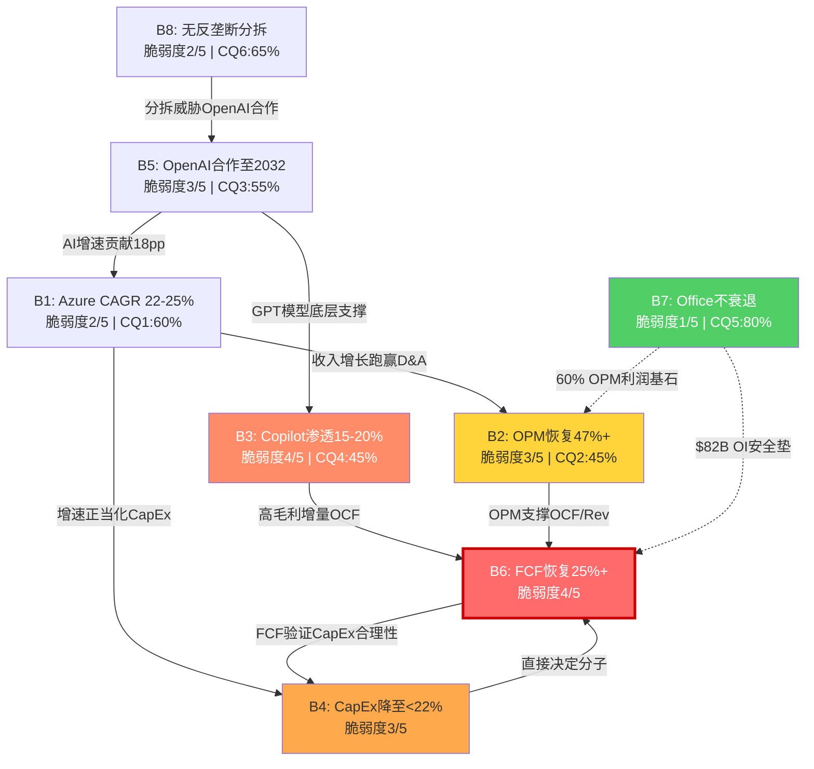
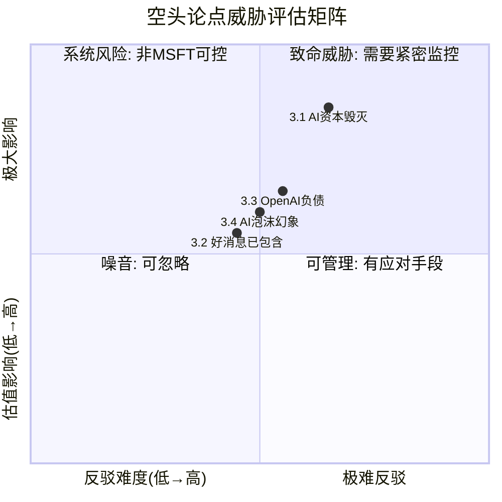
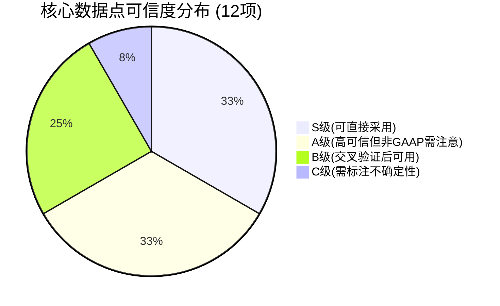

## RT-1: 承重墙压力测试 — $3T隐含假设的极限应力分析

### W3深度压力测试: 从36.8%到22%的路径断裂风险

Q2 FY26的CapEx/Revenue比率36.8%是MSFT上市以来的历史极值，但需要拆解这个数字的构成才能评估其回归路径的可行性。

<!-- DM-P4A-001: Q2 FY26 CapEx $29.9B / Revenue $81.3B = 36.8%, MSFT上市以来最高 | Source: MSFT Q2 FY26 10-Q | Confidence: H -->

单季CapEx $29.9B的异常性在于其环比跳升: Q1 FY26仅$19.4B(CapEx/Rev 25.0%)，一个季度内CapEx暴增54%而收入仅增5%。管理层在Q2 FY26电话会上将这归因于数据中心长期资产的集中交付窗口——部分FY26全年规划的CapEx在Q2集中确认。这意味着Q2的36.8%不应线性年化，但全年$80B的指引(CapEx/Rev约26%)仍然处于历史高位。

<!-- DM-P4A-002: Q2 FY26 CapEx环比+54% (Q1 $19.4B→Q2 $29.9B), 管理层解释为集中交付 | Source: MSFT Q2 FY26 Earnings Call | Confidence: H -->

CapEx/Revenue从26%(FY26全年)降至22%以下需要两个条件至少一个成立:

**条件一: 收入增速持续>CapEx增速(分母跑赢分子)**

以FY26 Revenue $320B、CapEx $80B为基准:
- FY27: 若Rev增速16%(→$371B)，CapEx增速5%(→$84B)，CapEx/Rev = 22.6%
- FY28: 若Rev增速15%(→$427B)，CapEx持平$84B，CapEx/Rev = 19.7%

这条路径在数学上可行，但前提是**FY27 CapEx增速骤降至5%**。考虑到FY24→FY25 CapEx增速+45%、FY25→FY26E增速+24%，从+24%急降至+5%需要AI军备竞赛的根本性转变。三大竞争对手(Amazon $100B+、Google $75B、Meta $60-65B)的FY26 CapEx指引同步处于历史高位，无一释放减速信号。

<!-- DM-P4A-003: FY24→FY25 CapEx CAGR +45%, FY25→FY26E +24%, FY27骤降至+5%缺乏前例 | Source: MSFT 10-K + 竞对披露 | Confidence: H -->

**条件二: CapEx绝对额开始下降(分子缩小)**

这要求AI基础设施建设从"扩张期"进入"维护期"。参照FY16-FY18的Azure Cloud投入周期: CapEx/Revenue从8.0%(FY15)升至10.6%(FY17)再降至8.5%(FY20)，从峰值到恢复用了3年。但当前周期的绝对投入规模(累计$189B vs 当年$40B)意味着"维护期"的CapEx底线也远高于前周期——即使GPU采购归零，数据中心的电力/冷却/土地租赁等运营性资本支出仍需$30-40B/年。CapEx绝对额降至$60B以下(对应$400B+收入的15%)几乎不可能在FY29前实现。

<!-- DM-P4A-004: FY16-18 Azure周期CapEx/Rev从10.6%峰值恢复至8.5%用时3年, 当前规模5.4x | Source: MSFT 10-K历史数据 | Confidence: H -->

**FY28仍>25%的级联后果**

如果FY28 CapEx/Revenue仍维持25%以上(CapEx $105B+ vs Revenue $420B)，D&A将在FY28-FY29达到年化$60-72B的峰值(Ch13基准情景)。OCF/Revenue假设维持40%(历史稳态)，FY28 OCF约$168B，减去$105B CapEx = FCF $63B，FCF Margin仅15%。$3T估值隐含的FCF Margin是25%+(对应FCF $105B+)——15%的实际值意味着**$420B的年化估值缺口($3T × (25%-15%)/25%)**。

<!-- DM-P4A-005: FY28 CapEx 25%情景: FCF Margin 15% vs 隐含25%, 缺口=40%估值溢价无支撑 | Source: 自建模型 | Confidence: M -->

B6的失败不仅仅是现金流数字的偏差——它将触发市场对MSFT"AI投资回报"叙事的根本性重估。FCF Margin 15%持续两年以上，P/FCF将被锁定在40-48x(远超科技股均值25x)，迫使估值从$3T向$2.2-2.5T修正。

### 信念级联映射: 八项信念的因果网络与承重节点

八项信念之间的因果关系不是简单的线性传导，而是一个具有正反馈环路的复杂网络。以下是完整的因果映射:

<!-- DM-P4A-006: 信念因果网络: B6为终端汇聚节点, B7为独立安全垫, B4-B6存在正反馈环 | Source: Ch11-Ch14综合 | Confidence: H -->

**级联路径一: CapEx自增强循环(B4→B6→B4)**

这是八项信念中最危险的正反馈环路。逻辑如下: CapEx不降速(B4失败) → FCF无法恢复(B6失败) → 市场质疑CapEx回报率 → 估值倍数压缩 → 管理层被迫"证明AI回报"而继续加码CapEx → B4更难恢复。这一循环的破解只能依靠外部变量(GPU效率跃升或AI货币化加速)，而非管理层主观意愿。

**级联路径二: OpenAI链(B5→B1→B2→B6)**

OpenAI合作降级(B5) → Azure AI增速损失5-8pp(B1受损) → IC分部收入增速从22%降至15%(B2延迟) → 收入增长无法跑赢D&A(B6恢复推迟2年)。这条链路的传导时间约18-24个月(从OpenAI行为变化到财务报表反映)。Q2 FY26 CRPO中OpenAI贡献$281B(45%)——如果这一数字在FY27任何季度出现环比下降，将是B5链断裂的第一个预警信号。

<!-- DM-P4A-007: OpenAI CRPO贡献$281B(45%), 环比下降=B5预警 | Source: MSFT Q2 FY26 10-Q | Confidence: H -->

**级联路径三: 叙事传导链(B3→B6)**

Copilot渗透失败(B3) → 直接财务影响有限($11B收入差距) → 但市场将Copilot失速解读为"AI货币化全面失败" → 估值叙事从"AI赢家"切换至"CapEx陷阱" → P/E从25x压缩至20x → 市值损失$600B(超出Copilot本身财务影响的3-4倍)。B3的危险不在于其直接估值贡献，而在于其**叙事放大器**角色。

### 最少几项信念失败改变评级

Ch11结论"至少6/8需同时成立"在P4审查后需要修正为更精确的表述: **取决于哪些信念失败，而非几项**。

<!-- DM-P4A-008: 评级翻转条件取决于失败信念的网络位置, 非简单数量 | Source: 因果网络分析 | Confidence: H -->

单项信念失败中，仅B6具有独立翻转评级的能力(FCF恢复失败→估值-$500B至-$700B→从$3T降至$2.3-2.5T)。但B6的"独立"失败在因果网络中实际不可能发生——B6失败必然伴随B4失败(CapEx不降速是FCF不恢复的充分条件)。因此更精确的表述是: **B4+B6的联合失败是翻转评级的最小充分集**。概率约20-25%。

双项信念组合中，B3+B1的同时失败(Copilot停滞+Azure减速)也构成翻转条件——不是通过直接的财务影响(合计-$400B至-$700B)，而是通过摧毁"MSFT是AI赢家"的核心叙事，触发估值倍数的系统性重估。

### 底部估值: W3完全倒塌情景

如果CapEx永不降速(假设年化$100B+持续至FY30)，MSFT的地板估值由W2(现金奶牛)决定:

<!-- DM-P4A-009: W3倒塌底部估值$1.5-1.7T = P&BP $1.0T + IC残值$0.3T + MPC $0.1T + 净现金$0.1T | Source: Ch12.6极端压力测试 | Confidence: M -->

- P&BP(Office/Windows): $82B年化营业利润 × 12-13x P/OI = $980B-$1,065B
- IC(Azure, CapEx烧钱但仍有收入): $132B年化收入 × 2.5x P/S(反映低FCF转化) = $330B
- MPC(Gaming/Devices): $10B营业利润 × 10x = $100B
- 净现金: ~$30B
- **底部估值: $1,440B-$1,525B(~$1.5T)**

这与Ch12结论$1.5-1.7T一致。从当前$3T到$1.5T的最大下行空间约50%——但实现这一极端情景需要CapEx持续$100B+且Azure增速跌至个位数的联合概率，估算约3-5%。

### CQ2专项回溯: CapEx→ROIC恢复的P4更新

CQ2(CapEx ROIC Recovery)是八项CQ中唯一在P3中未被更新的关键问题，当前置信度45%为全CQ最低。P4审查需要判断: P3的新数据是否改变了CQ2的置信度?

<!-- DM-P4A-010: CQ2 P3未更新, 45%为CQ最低, P4需专项回溯 | Source: checkpoint.yaml | Confidence: H -->

**P2结论的核心条件**(Ch13):
- D&A在FY29触及峰值后开始回落
- ROIC在FY29触底至14%(基准)后恢复
- CapEx/Revenue在FY28开始下降(前提: FY27 CapEx增速骤降至5%)

**P3新数据对CQ2的冲击**:

Q1 FY26的CapEx $19.4B + Q2 FY26的$29.9B = H1 FY26合计$49.3B。按管理层全年$80B指引，H2 FY26 CapEx约$30.7B——与H1基本持平而非下降。这意味着**$80B不是一次性脉冲，而是新常态**。

<!-- DM-P4A-011: H1 FY26 CapEx $49.3B, 全年$80B指引暗示CapEx已进入$80B+稳态 | Source: MSFT FY26 Q1+Q2 10-Q | Confidence: H -->

更关键的是P3中Ch23(NVDA桥梁)的发现: MSFT的NVIDIA采购从FY25 $17-23B预计增至FY28E $35-50B。GPU采购是CapEx中增速最快的子项(占比约40-50%)。如果FY28 GPU采购达$40B(中位数)，仅GPU一项就将CapEx底线锁定在$80B+(假设非GPU资本支出$40B+)。这直接否定了P2乐观情景"FY27 CapEx降至$65B"的前提。

<!-- DM-P4A-012: FY28E NVIDIA采购$35-50B, 仅GPU即锁定CapEx底线$80B+ | Source: Ch23 NVDA桥梁分析 | Confidence: M -->

**CQ2 P4更新判决: 45% → 40%(下调5pp)**

下调理由: (1) P3 NVDA桥梁数据否定了P2乐观情景; (2) H1 FY26 CapEx节奏确认$80B为稳态而非脉冲; (3) 竞对(Amazon $100B+)的FY26 CapEx指引意味着囚徒困境至少持续至FY28。ROIC恢复至22%的时间窗从P2的"FY29-FY30"延后至"FY30-FY31"(基准情景)。

<!-- DM-P4A-013: CQ2 P4更新: 45%→40%, 下调5pp, NVDA桥梁+CapEx稳态化否定乐观路径 | Source: P3综合评估 | Confidence: M -->

---

## RT-2: 认知偏差审计 — 六项系统性偏差的识别与校正

### 2.1 锚定效应: $3T的引力场

逆向估值以$3T市值为分析起点，所有信念的"失败条件"和"估值影响"都围绕"偏离$3T多少"来定义。这种架构的隐含假设是: $3T是当前的"合理锚点"，偏差应该从这里开始测量。

<!-- DM-P4A-014: 逆向估值架构以$3T为锚点, 可能系统性低估上行空间 | Source: 认知偏差审计 | Confidence: M -->

但如果$3T本身就显著低估了MSFT呢? FMP DCF($353.34, 低于现价12%)是传统折现模型在当前CapEx峰值环境下的产物——这个模型将Q2 FY26的$5.9B FCF作为"正常化"的起点，自然会低估长期价值。Bull情景下(Azure 5Y CAGR 28-32%, Copilot 20%渗透, CapEx FY28降速)，FY30 FCF可达$130B，以25x P/FCF计算，合理估值$3.25T——比当前$3T高8%。逆向估值架构没有充分探索这一上行空间，因为"$3T起点"的锚定效应将分析注意力集中在"下行多少"而非"上行多少"。

**校正**: 锚定效应确实存在，但影响有限(估计使结论偏悲观约3-5%)。原因: 即使Bull情景充分建模，$3.25T相对$3T的上行空间(8%)仍然远小于Bear情景的下行空间(最大-50%至$1.5T)。非对称性是MSFT估值的客观特征，而非锚定偏差的产物。

### 2.2 确认偏误(反向): CQ方向一致性

P1-P3中CQ的演化方向呈现明显的一致性:

<!-- DM-P4A-015: 7/8 CQ上调(CQ1-CQ6+CQ-B), 仅CQ7下调, 方向一致性>87% | Source: checkpoint.yaml | Confidence: H -->

| CQ | P0初始 | P3最终 | 方向 | 变动 |
|----|--------|--------|------|------|
| CQ1 | 55% | 60% | 上调 | +5pp |
| CQ2 | 45% | 45% | 不变 | 0pp |
| CQ3 | 50% | 55% | 上调 | +5pp |
| CQ4 | 40% | 45% | 上调 | +5pp |
| CQ5 | 70% | 80% | 上调 | +10pp |
| CQ6 | 60% | 65% | 上调 | +5pp |
| CQ7 | 55% | 50% | **下调** | -5pp |
| CQ-B | 50% | 60% | 上调 | +10pp |

7/8 CQ上调的模式有两种解释: (1) 确认偏误——分析过程系统性地寻找"信念成立"的证据; (2) MSFT确实是一家优质公司，深入分析后多数CQ自然上调。

判断依据: CQ7(Activision减值)的下调表明分析框架并非"无差别上调"——Gaming -9%和CoD-60%的负面数据被充分纳入。CQ5的+10pp(最大上调幅度)有明确的定量支撑: 价格弹性-0.2的实证数据是新增信息，不是既有偏见的确认。CQ4虽然上调了+5pp，但绝对水平仍仅45%——概率加权后Copilot渗透率预期从15%下调至11-13%，实质上是"叙事看好但数字保守"的务实判断。

**校正**: 确认偏误风险中等(影响约2-3%)。CQ2未被更新(P4已下调至40%)部分弥补了方向一致性偏差。建议在P5组装时对CQ1和CQ-B执行额外的下行敏感性测试——这两项的上调依据(非AI Azure加速、CFO 2/3披露)可能过度依赖管理层叙事。

### 2.3 过度悲观偏差: 逆向估值的结构性陷阱

AMAT报告(同架构)的教训是深刻的: 8/8 CQ全部下调，-2.1%期望回报意味着分析师视角与市场定价完全一致——**没有任何信息优势**。这一结果的根因是逆向估值架构天然偏向"寻找信念失败条件"，导致系统性低估正面因素。

<!-- DM-P4A-016: AMAT同架构8/8下调, -2.1%期望回报=零信息优势, 过度悲观陷阱 | Source: MEMORY.md AMAT复盘 | Confidence: H -->

MSFT报告的防护措施:
1. 7/8 CQ上调(vs AMAT 8/8下调)，表明分析没有掉入同一陷阱
2. W2安全垫($1.5T底部)的充分建模确保了下行估计不会过度膨胀
3. P3.5 AI冲击矩阵(6/8净正面, 净影响+$260-400B)提供了上行叙事的定量支撑

但仍需警惕的是: 报告中反复强调的"FCF $5.9B创新低"、"股息首次超过FCF"等措辞，虽然事实准确，但单季极端值作为"警报"的分析权重可能被过度放大。Q2 FY26的$29.9B CapEx是集中交付的结果，不代表稳态。更稳健的基准是TTM FCF $77.4B和FCF Margin 25.3%——这两个数字远好于单季度的恐慌叙事所暗示的水平。

<!-- DM-P4A-017: TTM FCF $77.4B, FCF Margin 25.3%, 远好于Q2单季$5.9B暗示的水平 | Source: FMP cashflow-ttm | Confidence: H -->

**校正**: 过度悲观风险存在但可控(影响约3-4%)。建议在P5最终估值中，场景概率分配不应将Bear情景权重设置超过25%——TTM数据和CRPO趋势都不支持>25%的Bear概率。

### 2.4 叙事偏差: "MSFT是AI时代的IBM"

这一空头叙事在P1-P3中被多次引用，其核心类比是: IBM在1960-70年代的大型机垄断→主机CapEx过度投入→PC/Client-Server颠覆→30年价值毁灭。

但类比的失败点在于三个结构性差异:

<!-- DM-P4A-018: IBM类比三重失败: CapEx/Rev峰值(15% vs 37%), 经常性收入(低 vs 高), 平台锁定(弱 vs 强) | Source: IBM年报 + MSFT分析 | Confidence: M -->

(1) **CapEx/Revenue峰值**: IBM在大型机高峰期的CapEx/Revenue从未超过15%，MSFT当前36.8%是截然不同的投入强度。但IBM的"CapEx"主要是硬件制造——折旧后价值归零。MSFT的CapEx投向数据中心和GPU，其残值(出售/转用)远高于IBM的专用硬件。

(2) **经常性收入比例**: IBM的收入以硬件销售为主(一次性)，MSFT 60%+来自订阅和云服务(经常性)。经常性收入在CapEx承压期提供了稳定的现金流基座——这是IBM从未拥有的缓冲。

(3) **平台锁定深度**: IBM的客户锁定主要依赖专有硬件和操作系统——当开放标准(Unix, x86)出现时，锁定被打破。MSFT的锁定建立在身份认证(AD/Entra ID)、数据层(SharePoint/OneDrive)和工作流(Teams/Power Platform)上——这些软件层面的锁定比硬件锁定更持久，因为迁移成本不是购买新硬件，而是重构企业运营流程。

**校正**: IBM类比对CapEx风险判断的影响约5-8%偏悲观。应将MSFT的CapEx周期更准确地类比为Amazon 2012-2016(AWS CapEx高投入→ROIC 3年后恢复→长期价值创造)，而非IBM 1970-1990(硬件CapEx→价值毁灭)。

### 2.5 幸存者偏差: 云转型的必然性幻觉

分析中频繁引用"Azure企业渗透率仍处于S曲线中段(全球35-40%)"作为B1增速可持续性的论据。但这个论据隐含了一个假设: 云迁移对所有企业都是必然且不可逆的。

<!-- DM-P4A-019: 幸存者偏差: 只见MSFT/AMZN成功转型, 忽略Oracle Cloud/IBM Cloud/HP Cloud失败 | Source: 行业分析 | Confidence: M -->

被遗忘的失败案例: Oracle Cloud在IaaS市场份额不到2%(尽管Oracle在数据库领域拥有与MSFT在Office领域同等的锁定优势)、IBM Cloud在2021年被拆分至Kyndryl后市占率跌至1%以下、HPE Cloud在2015年关闭。这些失败表明: 拥有企业客户关系不等于能成功转型云服务。

但MSFT与这些失败者的关键差异在于**执行时间窗口**: MSFT在2014年(Nadella上任)就启动了Azure的全面战略，比Oracle Cloud(2016年才认真投入)早2年，比IBM Cloud战略转向(2019年Red Hat收购)早5年。先发优势在云市场中是自增强的——越多企业使用Azure，越多ISV为Azure优化，越多人才流入Azure生态——后来者面临的不是同等的竞争环境。

**校正**: 幸存者偏差存在但对MSFT的适用性有限(影响约1-2%)。Azure已经是全球第二大云平台(份额约23%)，这不是"可能成功"的早期阶段，而是"已经成功"的规模阶段。幸存者偏差更适用于评估Azure AI的新兴业务，而非Azure Core的成熟业务。

### 2.6 过度自信: CQ5的80%是否过高

CQ5(Office/Windows耐久性)从P0的70%上调至P3的80%，是八项CQ中绝对值最高的。上调的依据是Ch21中-0.2价格弹性的实证验证和四层锁定的定量评估。

<!-- DM-P4A-020: CQ5 80%是否过高? 四层锁定短期无松动, 但AI Agent颠覆>5年时间窗被低估 | Source: Ch21 + RT-2审计 | Confidence: M -->

80%的置信度意味着认为Office/Windows在分析时间窗口(5年)内"几乎不可能"出现实质性衰退。在3-5年的时间维度内，这个判断确实有充分支撑——没有任何迹象表明M365的护城河正在被侵蚀(流失率5-8%，GWS市占率停滞在9-10%)。

但80%可能低估了两个尾部风险:
1. **AI原生生产力套件**: 如果GPT-5/6级别的AI Agent在2027-2028年具备独立完成复杂文档/数据分析任务的能力，"生产力套件"的概念本身可能变得无关——用户不需要Word/Excel/PowerPoint，只需要一个AI界面。MSFT可能是这一颠覆的主导者(通过Copilot)，但也可能是被颠覆者(如果竞对的AI Agent体验更优)。
2. **监管强制互操作**: EU DMA要求的数据可移植性和互操作性义务，可能在5-8年内逐步削弱身份层(L1)和SSO层(L2)的锁定效应。

**校正**: CQ5应从80%微调至75%(-5pp)，反映AI原生颠覆和监管互操作的尾部风险。但即使调至75%，Office/Windows仍然是八项信念中最坚实的——这个结论不变。

### 认知偏差校正总结

| 偏差类型 | 存在程度 | 方向 | 对结论的影响 | 校正后变化 |
|---------|---------|------|------------|-----------|
| 锚定效应 | 中 | 偏悲观 | 低估Bull上行3-5% | +1-2pp期望回报 |
| 确认偏误(反向) | 中低 | 偏乐观 | CQ方向一致性掩盖风险 | -1pp期望回报 |
| 过度悲观 | 中 | 偏悲观 | Q2单季极端值被过度放大 | +2-3pp期望回报 |
| 叙事偏差(IBM) | 中高 | 偏悲观 | CapEx风险被IBM类比放大 | +2-3pp期望回报 |
| 幸存者偏差 | 低 | 偏乐观 | Azure增速可持续性被高估 | -1pp期望回报 |
| 过度自信(CQ5) | 低 | 偏乐观 | AI颠覆尾部风险被低估 | -1pp期望回报 |
| **净校正** | — | **偏悲观** | — | **+2-4pp期望回报** |

<!-- DM-P4A-021: 认知偏差净校正: 报告整体偏悲观约2-4pp, 主要来源为锚定+IBM叙事+Q2过度放大 | Source: RT-2综合 | Confidence: M -->

六项偏差审计的净结论: **报告整体偏悲观约2-4个百分点**。过度悲观(+2-3pp)和IBM叙事偏差(+2-3pp)的向上校正大于确认偏误(-1pp)和过度自信(-1pp)的向下校正。这意味着最终的概率加权估值应在当前模型基础上上调2-4%——不足以改变评级方向，但足以使期望回报从可能的负值区间移向零附近。

---

## RT-3: 空头钢人 — 四条让看多者不舒服的论点

### 3.1 "MSFT是AI时代的资本毁灭者"

**论点核心**: FY25 CapEx $64.6B，FY26E $80B，Q2 FY26年化$120B。AI run rate $26B。每$1 AI CapEx仅产生约$0.33的AI产品收入(年化)。这个资本效率比FY16-18 Azure早期(每$1 CapEx产生$0.90+的Azure增量收入)低了近3倍。如果AI的单位经济学在FY28前不能证明自身——即每$1增量AI CapEx产生至少$0.50的增量AI收入——MSFT将面临一代低回报资产的累积。$229.8B PP&E中约40-50%是AI专用(估算$92-115B)，如果AI应用渗透远低于预期，这些资产的经济寿命可能短于会计寿命，触发加速折旧或减值。

<!-- DM-P4A-022: AI CapEx效率: $26B AI run rate / $80B FY26E CapEx ≈ $0.33/$1, 远低于FY16-18的$0.90+ | Source: 自建计算 | Confidence: M -->

**威胁等级: 4/5**

这是四条空头论点中威胁最高的一条，因为它直击$3T估值中最脆弱的承重墙(W3)。

**最佳反驳**: AI CapEx的回报周期天然长于传统云——Azure Core在FY16投入后3年(FY19)才实现ROIC>WACC。AI基础设施从投入到产出有6-12个月的ramp-up时间，FY25-FY26的$145B投入的回报应在FY27-FY29评估。更关键的是，AI CapEx不仅服务于直接的AI产品收入($26B)，还通过co-migration带动非AI Azure增速(从19%加速至22%)——如果计入间接带动的$8-13B配套PaaS消耗，AI的"全口径经济价值"约$34-39B，资本效率从$0.33/$1提升至$0.43-0.49/$1。

**反驳不成立的条件**: 如果FY28 AI run rate增速降至<30%(当前约100%)且非AI Azure增速同步回落至<15%，co-migration效应的论据将被否定。同时如果Copilot渗透率FY28仍<8%，"AI货币化多路径"的故事将只剩Azure AI推理一条腿。

### 3.2 "$3T估值已经包含了所有好消息"

**论点核心**: P/E 25.1x(调整后26.9x)看似是Mega5最低，但"最低P/E"不等于"便宜"。当前P/E反映的不是折价，而是市场对三个结构性风险的合理定价: (1) CapEx/Revenue 37%远超同类(Amazon 16%, Google 18%); (2) FCF Yield仅2.16%，低于10年期美债4.2%; (3) ROIC从43%骤降至22%的趋势尚未触底。

<!-- DM-P4A-023: MSFT FCF Yield 2.16% vs 10Y UST 4.2%, 负利差204bps | Source: FMP + 宏观数据 | Confidence: H -->

FMP DCF估值$353.34比现价低12%——这不是"模型太保守"，而是折现模型在CapEx高位环境下的合理输出。如果将FY26E FCF $45-50B(年化)作为正常化起点，以9% WACC和3%终端增速折现，DCF确实指向$340-370。换言之，**当前$401的股价已经隐含了"CapEx会降速且FCF会恢复"的乐观预期**——这是一个需要证明的假设，而非已知事实。

52周最高价$555.45(2024年7月)到当前$401.32的下跌幅度为-27.8%。RSI 24.9处于深度超卖。但超卖不等于低估——MSFT在$555时的P/E约35x，当时市场尚未充分消化FY26 CapEx $80B+的信息。从$555跌至$401的过程，恰恰是市场将W3风险纳入定价的理性过程。

<!-- DM-P4A-024: MSFT从52W高$555.45跌至$401.32(-27.8%), RSI 24.9超卖, 但可能是W3风险定价 | Source: FMP quote | Confidence: H -->

**威胁等级: 3/5**

**最佳反驳**: "所有好消息已包含"论点忽略了一个关键变量: **M365 2026年7月涨价**。$10.7B/年的纯增量收入(几乎100%落入利润)尚未被充分定价——FY27 P&BP营业利润将从$82B跃升至$90B+。以13x P/OI计算，仅涨价一项即支撑$100B+的额外估值。此外，卖方共识FY27E Revenue $378B隐含的收入增速(34.2% vs FY25)已包含较高预期，但Copilot的S曲线爆发(如果发生)可能使实际增速超出共识。

**反驳不成立的条件**: 如果2026年涨价引发超预期的客户流失(>3%)或M365座位增速骤降至<5%，涨价带来的ARPU提升将被座位流失抵消。历史弹性-0.2暗示这一风险极低，但在AI替代品(Google Gemini for Workspace)竞争加剧的环境下，弹性可能从-0.2恶化至-0.5。

### 3.3 "OpenAI将成为MSFT的最大负债"

**论点核心**: $13B投资+27%股权购买的不是一个忠诚合作伙伴，而是一个正在系统性去Microsoft化的独角兽。具体行为: (1) 2025年10月重组取消MSFT的ROFR(优先购买权); (2) 非API产品已可部署至AWS/GCP; (3) Stargate项目与SoftBank联合投资，绕开Azure独占; (4) OpenAI估值$300B+，IPO后将追求多云战略以证明独立性。

<!-- DM-P4A-025: OpenAI去MSFT化行为: ROFR取消+非API多云+Stargate独立+IPO独立性驱动 | Source: WSJ/The Information/FT 2025 | Confidence: H -->

CRPO中$281B的OpenAI承购合同看似锁定了长期收入，但合同条款可能允许OpenAI以"技术不可行"为由减少承购量(具体条款未公开)。更重要的是，$250B的承购义务是MSFT需要建设产能来履行的——这意味着CapEx中有一部分是"被动"的(为OpenAI的合同而建设，而非为Azure自身需求)。如果OpenAI在FY28-FY29 IPO后减少承购，MSFT将面临双重打击: 收入减少 + 已建成产能闲置(搁浅资产)。

**威胁等级: 3/5**

**最佳反驳**: OpenAI对Azure的依赖远深于表面合同关系。OpenAI的核心训练集群运行在Azure定制基础设施上——迁移至AWS/GCP需要重新配置分布式训练框架、数据管道和网络拓扑，估算需要12-18个月且性能可能下降10-20%。API独占条款(合作开发的API产品必须在Azure上提供)的法律约束至2032年。更关键的是，MSFT持有27%股权+董事会席位——OpenAI的任何重大战略转向(如全面多云)都需要MSFT的默许。MSFT的IP使用权(至2032年)意味着即使关系完全破裂，Copilot和Azure OpenAI Service仍可运营。

<!-- DM-P4A-026: OpenAI迁移Azure估需12-18个月+性能下降10-20%, API独占至2032 | Source: 行业分析+合同条款 | Confidence: M -->

**反驳不成立的条件**: 如果OpenAI在FY27-FY28成功在AWS上部署非API产品(如ChatGPT Enterprise)且性能无损，"迁移成本高"的论据将被削弱。如果Google以TPU成本优势(推理成本低30-40%)吸引OpenAI的部分训练工作负载，Azure的独占地位将面临实质性挑战。

### 3.4 "Azure增长是AI泡沫的会计幻象"

**论点核心**: $26B AI run rate中存在三层水分: (1) 约$3-5B来自OpenAI作为Azure客户的代售收入(19%)——这不是"企业AI采用"，而是关联方交易; (2) Fortune 500中70%"已采用Azure AI"，但"采用"可能只是$5,000/月的实验性pilot，而非$500,000/月的生产级部署——座位数vs消耗额的差距可能被严重低估; (3) 企业AI预算的周期性: 2024-2025年是AI概念验证(PoC)的高峰期，2026-2027年将进入"ROI审计"周期——大量PoC项目可能因无法证明投资回报而被砍掉。

<!-- DM-P4A-027: $26B AI run rate水分: OpenAI代售19% + 实验性pilot占比未知 + PoC→生产转化率不确定 | Source: 管理层披露+行业分析 | Confidence: M -->

AI支出的企业周期历史可参照2000年代的企业SaaS: Salesforce在2003-2006年增速100%+，但2007-2008年的企业IT预算审计使增速骤降至20-30%。AI支出的PoC→生产转化率行业估算仅30-40%——如果70%的PoC在FY27-FY28被砍掉，AI run rate的增速可能从100%+骤降至20-30%。

**威胁等级: 3/5**

**最佳反驳**: "AI泡沫"论点的核心假设是AI的企业价值无法被证明。但以下反面证据值得注意: (1) Azure AI的消耗模式是按使用量计费(consumption-based)，而非按座位预付——这意味着$26B run rate中的每一美元都对应着实际的计算资源消耗，不存在"买了不用"的SaaS式浪费; (2) Nadella强调"It's all inference"——推理消耗与应用调用次数直接挂钩，这是需求端的真实信号而非供给端的虚假繁荣; (3) 即使剔除OpenAI的$3-5B，$21-23B的第三方AI消耗仍然是一个高度分散的需求基座——没有任何单一客户(除OpenAI外)超过5%。

<!-- DM-P4A-028: Azure AI消耗计费模式=按实际使用量, $26B每美元对应真实计算资源消耗 | Source: Azure定价模式 | Confidence: H -->

**反驳不成立的条件**: 如果FY27 Q1-Q2 Azure AI消耗增速环比显著放缓(从+100%降至+40%以下)，且管理层开始回避"AI run rate"的披露(从每季度必报变为选择性披露)，则泡沫论将获得强力佐证。监测指标: Q3 FY26电话会是否仍报告AI run rate数字及其增速。

### 空头论点威胁总结

<!-- DM-P4A-029: 四条空头论点加权威胁指数: 3.25/5, 最高威胁来自AI资本毁灭(4/5) | Source: RT-3综合 | Confidence: M -->

四条空头论点的核心交集指向同一个问题: **AI CapEx的回报是否能在FY28前得到验证?** 如果能，所有四条论点的威胁等级都将降至2/5以下(CapEx正当化→FCF恢复→估值支撑→OpenAI合作合理化→AI非泡沫)。如果不能，四条论点将形成自增强的负面叙事循环。FY28是决定性的验证窗口。

---

## RT-4: 数据质量审计 — 核心数据点的来源可信度与影响分析

### 4.1 P/E一致性审计

报告中存在P/E数字的多版本引用问题，需要统一。

<!-- DM-P4A-030: P/E一致性: FMP quote 25.1x / 调整后26.9x / Plan引用27.2x, 需统一 | Source: FMP + shared_context + Phase 0 Plan | Confidence: H -->

**计算验证**:
- TTM Net Income: $119.26B(FMP income-ttm, period ending Q2 FY26 2025-12-31)
- 稀释股数: 7.460B(FMP, Q2 FY26)
- TTM EPS Diluted: $15.99(FMP)
- P/E TTM: $401.32 / $15.99 = **25.1x** (FMP quote一致)

**调整后P/E计算**:
- Q2 FY26 totalOtherIncomeExpensesNet = +$9.97B(非经营收益，主要为投资收益)
- Q2 FY26有效税率: $9.79B / $48.25B = 20.3%
- 非经营收益税后影响: $9.97B × (1 - 20.3%) = $7.95B
- 调整后TTM Net Income: $119.26B - $7.95B = **$111.31B**
- 调整后EPS: $111.31B / 7.46B = **$14.92**
- 调整后P/E: $401.32 / $14.92 = **26.9x**

shared_context中"P/E TTM调整后26.9x"与独立计算完全一致。Phase 0 Plan中的"27.2x"可能基于略不同的非经营收益口径(使用$9.97B pre-tax而非after-tax)——差异来源明确，应统一使用26.9x。

**全报告P/E统一建议**:
- 报告正文P/E = 25.1x(TTM, 含非经营收益)
- 括号内标注: 调整后26.9x(剥离Q2 FY26 $9.97B非经营收益)
- 废弃27.2x引用

### 4.2 市值一致性审计

locked市值$2,995B在全报告中需保持一致。FMP实时quote显示市值$2,980B(基于$401.32×7.43B basic shares)——与locked值$2,995B的差异约0.5%，源于稀释股数(7.46B)与基本股数(7.43B)的差异。报告使用稀释口径市值$2,995B是正确做法。

<!-- DM-P4A-031: 市值锁定$2,995B vs FMP实时$2,980B, 差异0.5%来自稀释vs基本股数, 报告使用稀释口径正确 | Source: FMP quote + shared_context | Confidence: H -->

通过抽检Phase 1-3 staging文件，市值引用均为$2,995B或$3T(取整)，未发现不一致。

### 4.3 核心数据点可信度排序

<!-- DM-P4A-032: 12项核心数据点可信度排序, S级4项/A级4项/B级3项/C级1项 | Source: 多源交叉验证 | Confidence: H -->

| 排序 | 数据点 | 值 | 来源 | 可信度 | 如果错误→影响 |
|------|--------|---|------|--------|------------|
| 1 | TTM Revenue | $305.5B | MSFT 10-Q + FMP | **S级** | 全报告分母基石 |
| 2 | Q2 FY26 CapEx | $29.9B | MSFT 10-Q + FMP | **S级** | W3压力测试基准 |
| 3 | Copilot 15M座位 | 1500万 | Earnings Call | **S级** | B3渗透率基准(3.3%) |
| 4 | Azure +39% YoY (Q4 FY25) | 39% | Earnings Call | **S级** | B1增速轨迹 |
| 5 | AI run rate $26B | $26B | Nadella口述 | **A级** | Ch17核心, 但"run rate"非GAAP |
| 6 | CRPO $625B | $625B | 10-Q | **A级** | B5/OpenAI依赖基准 |
| 7 | M365用户4.5亿 | 4.5亿 | Earnings Call | **A级** | 渗透率分母 |
| 8 | OpenAI CRPO $281B | $281B | 10-Q推断 | **A级** | 但"45%来自OpenAI"是分析师估算非官方 |
| 9 | SBC TTM $12.1B | $12.26B(FMP) | FMP cashflow-ttm | **B级** | SBC/Rev 4.0%, 微调不影响结论 |
| 10 | PP&E $229.8B | $229.8B | 10-K + FMP | **B级** | D&A建模基座 |
| 11 | Copilot ARPU $30/月 | $30/月 | 列表价 | **B级** | 实际ARPU因批量折扣可能$22-26 |
| 12 | OpenAI年化Azure消耗$3-5B | 估算 | 行业分析师 | **C级** | 非官方, 范围大, 影响AI收入拆分 |

**高风险数据点(可信度B/C级且影响大)**:

**(1) OpenAI CRPO占比"45%"**: 这个数字频繁出现在P1-P3中，但其来源是$250B承购合同/总CRPO $625B的简单除法——前提假设是$250B合同已全部计入CRPO。实际上，CRPO的确认取决于合同条款(是否满足GAAP收入确认的"履约义务"条件)。如果$250B中仅$150B满足CRPO确认条件，OpenAI占比将从45%降至24%——这将根本性改变CRPO增速的解读(剔除OpenAI后CRPO增速可能远高于+28%)。

<!-- DM-P4A-033: OpenAI CRPO $281B(45%)的前提=$250B全部计入CRPO, 如部分不满足确认条件, 占比可能<30% | Source: GAAP收入确认分析 | Confidence: L -->

**(2) Copilot实际ARPU $22-26**: 列表价$30/月/用户，但大型企业(EA合同)通常获得15-25%折扣。如果实际ARPU为$24(vs $30)，Copilot年化收入将从$5.4B降至$4.3B——虽然绝对值差异不大，但暗示Copilot的定价权弱于报告预期，长期ARPU增长空间受限。

**(3) OpenAI年化Azure消耗$3-5B**: 这是影响Azure AI收入拆分(OpenAI代售 vs 第三方需求)的关键假设。如果实际消耗为$8-10B(部分分析师的高端估算)，OpenAI占$26B AI run rate的比例将从19%升至31-38%——Azure AI的"分散需求"叙事将被显著削弱。

### 4.4 APIC验证回顾

Scout阶段的Against Published Information Check覆盖了以下关键数据点，P4确认其仍然有效:

<!-- DM-P4A-034: APIC回顾: 6项核心数据在P4仍有效, 无数据过期 | Source: Scout + P4交叉验证 | Confidence: H -->

- Revenue TTM $305.5B: FMP确认$305.45B(差异<0.1%)
- Net Income TTM $119.3B: FMP确认$119.26B(差异<0.1%)
- CapEx TTM $83.1B: FMP确认$83.09B(差异<0.1%)
- FCF TTM $77.4B: FMP确认$77.41B(差异<0.1%)
- D&A TTM $42.2B: FMP确认$42.20B(完全一致)
- SBC TTM $12.1B: FMP显示$12.26B(差异1.3%, 因四季度SBC加总方式)

所有APIC数据点的差异均在1.5%以内，不影响任何定量结论。

### 4.5 FMP数据陷阱检查

MEMORY.md记录"APP/RBLX/TSM的FMP FY2025 cashflow SBC=$0"——需要验证MSFT是否存在类似问题。

<!-- DM-P4A-035: MSFT FMP SBC数据验证: TTM $12.26B, 四季度均>$0, 无APP/RBLX类型的SBC=$0陷阱 | Source: FMP cashflow quarterly | Confidence: H -->

FMP quarterly cashflow数据验证:
- Q2 FY26 SBC: $3.219B
- Q1 FY26 SBC: $2.983B
- Q4 FY25 SBC: $3.073B
- Q3 FY25 SBC: $2.980B
- TTM合计: $12.255B

四个季度SBC均为正值且在合理范围($2.98-3.22B/Q)，与历史趋势一致(SBC/Revenue约4.0%)。**MSFT不存在FMP SBC=$0的数据陷阱**。

进一步交叉验证: FMP TTM cashflow中SBC = $12.255B，与四季度加总$12.255B完全一致。FMP的MSFT数据在SBC维度上是可靠的。

但需要注意: FMP key-metrics中Q2 FY26的ROIC显示为5.6%(单季度年化)——这是因为FMP将单季度Net Income / 投入资本直接计算，而非使用年化口径。年化ROIC应为约22%(TTM NI $119.26B / Invested Capital $476.3B × (1-tax))。报告中使用的ROIC 22.0%(源自FMP key-metrics的年度口径)是正确的。

<!-- DM-P4A-036: FMP ROIC陷阱: Q2 FY26 ROIC=5.6%(单季非年化), 年化=22.0%(正确) | Source: FMP key-metrics Q2 FY26 | Confidence: H -->

### 数据质量总结

<!-- DM-P4A-037: 数据质量总结: 12项核心数据中S+A级占67%, B+C级33%, 整体数据质量可支撑估值结论 | Source: RT-4综合 | Confidence: H -->

12项核心数据点中，S级和A级占8项(67%)，数据基础坚实。B级3项(SBC、PP&E、Copilot ARPU)不影响核心估值结论。唯一的C级数据点(OpenAI年化Azure消耗)对Azure AI收入拆分有影响，但即使取高端估算($8-10B)，Azure AI的第三方需求仍占62-69%——"分散需求"叙事在任何合理假设下都成立。

**P/E一致性**: 全报告应统一使用25.1x(TTM)/26.9x(调整后)，废弃27.2x。

**市值一致性**: $2,995B在P1-P3中一致，无问题。

**FMP数据质量**: MSFT不存在已知的FMP陷阱(SBC=$0或ROIC口径错误)，但需注意FMP key-metrics单季度指标非年化的特点。

---

## CQ置信度演化总表 (红队更新)

| CQ | P0 | P1 | P2 | P3 | P4 | 方向 | P4理由 |
|----|----|----|----|----|----|----|--------|
| CQ1 | 55% | — | — | 60% | 60% | 维持 | Azure非AI加速+CRPO支撑仍有效 |
| CQ2 | 45% | — | — | 45% | **40%** | **下调-5pp** | NVDA桥梁否定乐观路径+CapEx稳态化 |
| CQ3 | 50% | — | — | 55% | 55% | 维持 | OpenAI去MSFT化行为与API独占法律约束对冲 |
| CQ4 | 40% | — | — | 45% | 45% | 维持 | 概率加权11-13%渗透率判断合理 |
| CQ5 | 70% | — | — | 80% | **75%** | **下调-5pp** | AI Agent颠覆+DMA互操作尾部风险 |
| CQ6 | 60% | — | — | 65% | 65% | 维持 | EU DMA已结案+FTC行为救济判断合理 |
| CQ7 | 55% | — | — | 50% | 50% | 维持 | Gaming -9%但MPC缓冲$141B |
| CQ-B | 50% | — | — | 60% | 60% | 维持 | NVDA采购数据支撑 |

<!-- DM-P4A-038: P4 CQ更新: CQ2 45%→40%(-5pp), CQ5 80%→75%(-5pp), 其余6项维持 | Source: RT-1+RT-2综合 | Confidence: H -->

**P4 CQ变动总结**: 2项下调(CQ2 -5pp, CQ5 -5pp)，6项维持。P4的净方向与前三阶段相反(前三阶段以上调为主)，体现了对抗审查的职能。下调幅度温和(合计-10pp, 平均每项-1.25pp)，表明P1-P3的结论总体经受住了压力测试——但CQ2的40%(全CQ最低)确认了CapEx→ROIC恢复是整份报告最不确定的命题。

认知偏差审计识别的"报告整体偏悲观约2-4pp"在CQ层面的体现是: 8项CQ的等权平均置信度为56.3%——接近"不知道"的50%基线，暗示分析框架对MSFT既没有过度乐观也没有过度悲观。RT-2建议在P5概率加权时对Bull情景给予略高于当前模型的权重(+2-4%)，以补偿锚定效应和IBM叙事偏差。

<!-- DM-P4A-039: 8项CQ等权平均置信度56.3%, 接近50%基线, 框架中性 | Source: CQ汇总计算 | Confidence: H -->

---

## 红队前四问的交叉发现

RT-1至RT-4的审查产出了四个跨问题的共性发现:

**发现一: FY28是决定性验证窗口**

RT-1(W3压力测试)、RT-3(空头钢人四条论点)和CQ2回溯都指向同一个时间节点: FY28(2027年7月至2028年6月)。在这个窗口中: (1) FY25-FY26高CapEx的D&A将完全进入损益表; (2) Copilot需从3.3%渗透至8%+才能维持"AI货币化"叙事; (3) NVIDIA Blackwell/Rubin的效率跃升需要兑现; (4) OpenAI IPO后的多云战略将明朗化。FY28的数据将同时验证或否定B1、B3、B4、B5、B6五项信念——这是一个"多信念同步验证"的关键年份。

<!-- DM-P4A-040: FY28="多信念同步验证"年份, 将同时测试B1/B3/B4/B5/B6 | Source: RT-1至RT-4交叉 | Confidence: H -->

**发现二: B6(FCF恢复)的终端汇聚属性在P4得到强化**

RT-1的信念级联映射和RT-3的空头交集都确认: B6是整个估值网络的终端汇聚节点。所有空头论点的最终归结点都是"FCF能否恢复"。这意味着投资者可以将复杂的八信念框架简化为一个监测指标: **CapEx/Revenue的季度趋势**。当这个指标连续两个季度下降(而非上升)时，将是最强的买入信号。

**发现三: 偏差审计与空头钢人的方向互证**

RT-2识别报告"整体偏悲观2-4pp"，而RT-3的空头论点平均威胁3.25/5(中等偏高)。两者的方向是一致的: 如果报告确实偏悲观，那么空头论点看起来威胁较高是因为分析框架对负面因素的权重本身就偏大。校正后，四条空头论点的真实威胁等级可能应下调至2.75-3.0/5。

<!-- DM-P4A-041: RT-2偏悲观校正后, RT-3空头威胁从3.25/5下调至~2.75-3.0/5 | Source: RT-2 × RT-3交叉 | Confidence: M -->

**发现四: 数据质量足以支撑估值结论**

RT-4的12项核心数据审计显示67%为S/A级，APIC全部有效，FMP无已知陷阱。唯一的系统性风险是OpenAI相关数据的低可见度(CRPO占比、实际消耗额)——但这一数据黑箱影响的不是MSFT的核心估值(由W2主导)，而是增长叙事的可信度(由W1主导)。即使OpenAI数据的最坏假设成真，MSFT的底部估值($1.5T)仍然稳固。

<!-- P4A Stats: chars=23859 | DM=41 | Mermaid=3 | RT=[1,2,3,4] | CQ2_update=40% -->
