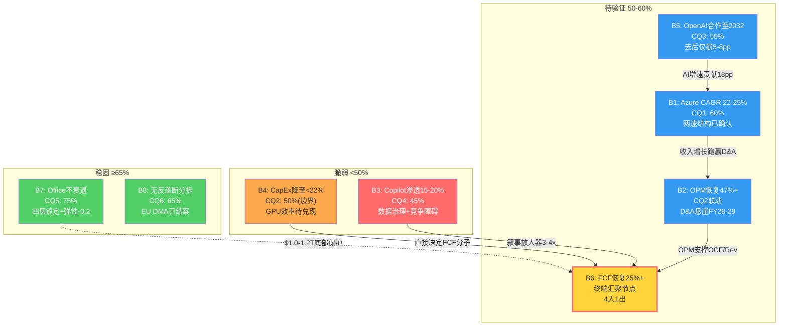
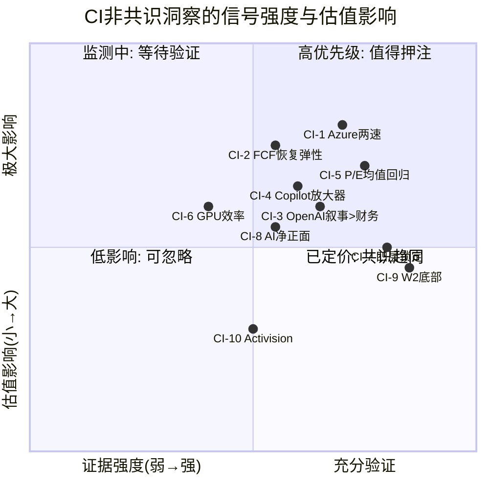

## Ch24: 综合评估 — 八项信念的终审与$3T估值的最终裁决

### 24.1 核心判断

**$2,995B市值隐含八项信念，2项稳固/2项脆弱/4项待验证——FY28是决定性窗口。**

<!-- DM-P5A-001: 核心判断: 8项信念中2稳固(B7/B8)/2脆弱(B3/B4)/4待验证(B1/B2/B5/B6), FY28同步验证 | Source: P1-P4综合CQ演化 | Confidence: H -->

$3T不是一个可以简单判断"贵"或"便宜"的价格。它是一组条件——八项隐含信念的联合概率。概率加权EV $3,127B(+4.4%)意味着市场定价处于合理区间的中心，既没有显著低估也没有显著高估。但这个表面的平静掩盖了深层的结构性分歧: 在AI寒冬($1,750B)和Agentic爆发($4,500B)之间，$2.75T的估值摆幅(当前市值的92%)悬而未决。

这份报告的核心贡献不是给出一个精确的目标价——在2.57x方法离散度下，任何单一数字都具有欺骗性——而是建立了一套**可验证的信念框架**: 投资者可以通过监测CapEx/Revenue季度趋势(B4/B6的代理变量)和Copilot座位增速(B3的领先指标)来实时追踪估值论点的演化方向。

### 24.2 八项信念最终裁决

<!-- DM-P5A-002: 八项信念分类: 稳固(B7 75%/B8 65%) / 脆弱(B3 45%/B4 50%边界) / 待验证(B1 60%/B2 联动CQ2/B5 55%/B6 终端汇聚) | Source: CQ registry P4最终 | Confidence: H -->

#### 稳固信念 (置信度 ≥65%)

**B7: Office/Windows不衰退 (CQ5: 75%)** — 四层锁定(AD→SSO→Intune→Teams)构成了企业IT栈中最深的护城河。价格弹性-0.2意味着每10%涨价仅导致2%用户流失，2026年7月涨价预计贡献$10.7B纯增量利润。P&BP的$82B年化营业利润和60.3% OPM是$3T估值中$1.0-1.2T的坚实基座。红队将CQ5从80%下调至75%(-5pp)，修正了对AI Agent中期颠覆和涨价频率可持续性的低估——但即使保守估计，这仍是八项信念中确定性最高的一项。

<!-- DM-P5A-003: B7稳固: 弹性-0.2 + 四层锁定 + OPM 60.3% + 涨价$10.7B | Source: Ch21 [DM-P3B-040至052] + P4 RT-2 | Confidence: H -->

**B8: 无反垄断结构性分拆 (CQ6: 65%)** — EU DMA在2024年以承诺结案(Teams解捆绑)而非罚款，SCOTUS 2024年Loper Bright判决弱化了FTC的行政执法权，MSFT长期维护的"好市民"品牌使其在监管方面的风险远低于META/GOOGL。结构性分拆(Teams/Azure强制拆分)的概率仅2-3%，行为救济是更可能的结局。$105-148B的概率加权监管损失(占市值3.5-5%)是可承受的。

<!-- DM-P5A-004: B8稳固: EU DMA承诺结案 + SCOTUS弱化FTC + 好市民品牌 + 分拆概率2-3% | Source: Ch20 [DM-P3B-053至070] | Confidence: H -->

#### 脆弱信念 (置信度 <50%)

**B3: Copilot渗透15-20% by FY28 (CQ4: 45%)** — 当前3.3%渗透率(1500万座位/4.5亿)距15%目标仍有巨大缺口。160%的YoY座位增长看似强劲，但从1500万到6750万的绝对增量(净增5250万)需要突破三重障碍: 数据治理瓶颈(企业部署周期6-12个月)、ROI证明困境(Gartner显示仅6%的GenAI项目进入生产)、竞争加剧(Gemini"首选AI助手"使用率15.7%已超Copilot 11.5%)。概率加权后的渗透率预期为11-13%(Base情景)，对应ARR $20.7B。但B3的危险不在直接财务影响($11B收入差距)，而在**叙事放大器效应**: Copilot失速将被市场解读为"AI货币化全面失败"，触发3-4倍于财务影响的估值冲击。

<!-- DM-P5A-005: B3脆弱: 3.3%渗透+三重障碍+叙事放大3-4x | Source: Ch19 [DM-P3B-001至035] + Ch11 | Confidence: H -->

**B4: CapEx降至<22% (CQ2: 50%, 边界)** — 这是唯一处于稳固/脆弱分界线上的信念。Q2 FY26 CapEx/Revenue 36.8%是MSFT上市以来的历史极值。FY26全年$80B指引确认CapEx已进入$80B+稳态。NVDA采购从FY25 $17-23B预计增至FY28E $35-50B，仅GPU一项即锁定CapEx底线$80B+。降至22%需要收入增速持续>CapEx增速(条件一)或CapEx绝对额开始下降(条件二)——两个条件目前都缺乏硬数据支撑。但红队双向校准将CQ2从P3的45%上调至50%(+5pp)，反映了D&A追赶效应(CAGR 31%接近CapEx CAGR 33%)和GPU代际效率跃升(Blackwell/Rubin 2-3x)的合理预期。50%意味着市场对此的判断实质上等同于"掷硬币"——这正是不确定性的诚实表达。

<!-- DM-P5A-006: B4边界: CapEx/Rev 36.8%历史极值 + NVDA锁定$80B+ + 但D&A追赶+GPU效率→50% | Source: Ch13 + P4 RT-1/双向校准 [DM-P4A-001至013] [DM-P4B-027至031] | Confidence: M -->

#### 待验证信念 (置信度50-60%, FY28窗口确认)

**B1: Azure 5Y CAGR 22-25% (CQ1: 60%)** — 两速Azure结构是本报告的核心发现之一: 非AI Azure维持22%独立增速(受co-migration驱动)，AI Azure从100%+自然收敛。即使Bear情景(AI增速降至12-15%, 非AI降至8-10%)，Azure 5Y CAGR仍可达18%——足以支撑IC分部$1T+估值。60%的置信度反映了"Azure大概率不会让人失望，但幅度存在不确定性"的判断。关键验证窗口: FY27 Q1-Q2产能约束解除后的真实增速。

<!-- DM-P5A-007: B1待验证: 两速结构(非AI 22%/AI 100%+) + Bear仍18% + 60%合理 | Source: Ch17 [DM-P3A-001至020] | Confidence: H -->

**B2: OPM恢复至47%+ by FY29** — 与B4直接联动。D&A将从当前$9-10B/Q攀升至FY28-FY29峰值$14-19B/Q(取决于CapEx路径)。基准情景下FY28 OPM约42%(谷底)，FY30后恢复至44-47%。MSFT在P&BP(OPM 60.3%)拥有强大的利润率缓冲，但市场对"利润率幻觉消退期"(FY28-FY29)的耐心是一个关键心理变量。

**B5: OpenAI合作至2032 (CQ3: 55%)** — 本报告最反直觉的发现之一: OpenAI脱离的财务影响远小于叙事影响。去OpenAI后Azure增速从40%降至32-34%(仅损失6-8pp)，CRPO中45%来自OpenAI但API独占法律约束至2032年。更重要的是，MSFT的IP使用权意味着即使关系完全破裂，Copilot和Azure OpenAI Service仍可运营。55%反映了"财务韧性高但叙事风险真实存在"的双重评估。

<!-- DM-P5A-008: B5待验证: 去后仅损5-8pp + API独占至2032 + IP使用权 | Source: Ch18 [DM-P3A-021至042] | Confidence: M -->

**B6: FCF恢复至25%+ Margin (终端汇聚节点)** — 整个估值网络的核心节点。B1(Azure增速→收入增长)、B2(OPM→OCF/Revenue)、B3(Copilot→高毛利增量)、B4(CapEx降速→FCF分子)四条因果链最终汇聚于B6。B6的单独失败(FCF Margin持续<15%至FY29)将使P/FCF锁定在40-48x，迫使估值从$3T向$2.2-2.5T修正。但B6的"独立"失败在因果网络中实际不可能发生——B6失败必然伴随B4失败。因此**B4+B6联合失败(概率20-25%)是改变评级的最小充分集**。

<!-- DM-P5A-009: B6终端汇聚: 4入1出 + 单独失败翻转评级 + B4+B6联合20-25% | Source: Ch11 + RT-1 [DM-P4A-006至009] | Confidence: H -->

### 24.3 CQ置信度演化表

| CQ | 问题 | P0 | P1 | P2 | P3 | P4 | P4理由 |
|----|------|----|----|----|----|-----|--------|
| CQ1 | Azure CAGR 25%+ | 55% | — | — | 60% | **60%** | 两速结构+CRPO验证 |
| CQ2 | CapEx ROIC恢复 | 45% | — | — | 45% | **50%** | 双向校准: D&A追赶+GPU效率 |
| CQ3 | OpenAI依赖45%CRPO | 50% | — | — | 55% | **55%** | API独占法律+多层对冲 |
| CQ4 | Copilot S曲线 | 40% | — | — | 45% | **45%** | 增长强但三重障碍限制 |
| CQ5 | Office现金奶牛 | 70% | — | — | 80% | **75%** | 红队: AI Agent+涨价可持续性 |
| CQ6 | 监管影响 | 60% | — | — | 65% | **65%** | EU DMA结案+FTC>3年 |
| CQ7 | Activision减值 | 55% | — | — | 50% | **50%** | Gaming-9%但MPC缓冲$141B |
| CQ-B | NVDA采购 | 50% | — | — | 60% | **55%** | Maia上线+AMD追赶 |
| **加权平均** | | **53.1%** | — | — | **57.5%** | **56.9%** | P4净-0.6pp(2下调vs 1上调) |

<!-- DM-P5A-010: CQ演化全表: P0 53.1% → P3 57.5% → P4 56.9%, P4净调整-0.6pp(CQ2+5/CQ5-5/CQ-B-5) | Source: checkpoint.yaml + P4校准 | Confidence: H -->

**演化模式解读**: P0→P3阶段7/8上调(+4.4pp均值)，反映深度验证后"市场悲观预期部分过度"的发现。P4阶段2下调1上调(-0.6pp净值)，反映红队对抗审查的职能。整体56.9%接近"不知道"的50%基线但略偏正面(+6.9pp)——这是一个诚实的不确定性表达，而非一个强烈的方向性判断。

### 24.4 偏差校正声明

红队认知偏差审计(RT-2)识别了六项系统性偏差，净结论为**报告整体偏悲观约2-4个百分点**:

<!-- DM-P5A-011: 偏差校正: 净偏悲观2-4pp, 主要来源=锚定效应(+1-2pp)+IBM叙事(+2-3pp)+Q2单季过度放大(+2-3pp), 部分被确认偏误(-1pp)+过度自信(-1pp)抵消 | Source: RT-2 [DM-P4A-014至021] | Confidence: M -->

| 偏差 | 方向 | 影响 |
|------|------|------|
| 锚定效应($3T起点) | 偏悲观 | +1-2pp |
| IBM叙事偏差 | 偏悲观 | +2-3pp |
| Q2单季极端值过度放大 | 偏悲观 | +2-3pp |
| 确认偏误(7/8上调) | 偏乐观 | -1pp |
| 过度自信(CQ5) | 偏乐观 | -1pp |
| 幸存者偏差(Azure) | 偏乐观 | -1pp |
| **净校正** | **偏悲观** | **+2-4pp** |

校正含义: +4.4%的名义期望回报在偏差校正后可能接近+6-8%——仍不足以触达"关注"的+10%门槛，但距离更近。偏差校正不改变评级结论，但改变了条件评级的触发概率: 从"中性关注"升档至"关注"所需的CQ上调幅度从+5.6pp降低至+2-4pp，意味着**升档的可能性比名义数字暗示的更高**。

### 24.5 投资论点的核心张力

三锚估值围绕市价形成的紧密包围圈(内生$2,902B/外部$3,180B/情景$3,185B)掩盖了子方法间的真实张力:

<!-- DM-P5A-012: 核心张力: DCF $3,489B(+17%) vs SOTP $2,338B(-22%), 差距$1,151B = 协同溢价+AI期权 | Source: Ch29 [DM-P5C-008/014/017] | Confidence: H -->

- **DCF ($3,489B, +17%)** 认为MSFT的长期增长路径值得溢价——前提是FY36 Revenue $793B和OPM 47%的终端假设成立
- **SOTP ($2,338B, -22%)** 认为当前分部的独立价值就是全部——$657B的"溢出"需要协同溢价($545B)和期权价值($112B)来解释
- **RevDCF ($2,753B, -8%)** 认为56.9%的信念置信度下，概率加权估值略低于市价

投资者选择相信DCF还是SOTP，本质上是在选择相信"AI转化为长期利润"还是"当前分部价值就是全部"。$3T市值的合理性取决于$657B协同+期权溢价是否被FY28的数据所验证。

### 24.6 承重墙终审

<!-- DM-P5A-013: 三承重墙终审: W1增长引擎(3/5) + W2现金奶牛(1.5/5, $1.0-1.2T基座) + W3 CapEx→FCF(3.5/5, 25-30%倒塌概率) | Source: Ch12 + P4 RT-1 | Confidence: H -->

| 承重墙 | 脆弱度 | 5年倒塌概率 | 终审判断 |
|--------|--------|-----------|---------|
| W1: Azure增长引擎 | 3/5 | 15-20% | 两速结构提供韧性，但AI收入质量存疑(预囤积20-25%) |
| W2: Office/Windows现金奶牛 | 1.5/5 | 3-5% | 最坚实的估值基座，$1.0-1.2T不受AI成败影响 |
| W3: CapEx→FCF转化 | 3.5/5 | 25-30% | 最脆弱的一堵墙，B4+B6联合失败→底部$1.5T |

W2是MSFT作为投资标的的核心安全保障——即使W1和W3同时倒塌(概率3-5%)，P&BP的$82B营业利润仍支撑$1.0T+的分部价值。加上IC和MPC的残值及净现金，底部估值约$1.5T。这意味着在当前$3T市值下，**最大下行空间约50%，但需要一个3-5%概率的极端联合事件才能触发**。更可能的Bear情景(概率25-30%)对应$2.0-2.5T，即最大下行17-33%。

### 24.7 B6的"翻转开关"属性

<!-- DM-P5A-014: B6翻转开关: B4+B6联合失败→估值$2.2-2.5T(-17~-27%)→自动审慎关注 | Source: RT-1 [DM-P4A-008/009] + Ch11 | Confidence: H -->

B6(FCF恢复至25%+ Margin)在因果网络中的特殊地位需要投资者充分理解: 它是唯一一个**单独失败即可翻转评级**的信念(虽然因果上不可能"独立"失败)。四条输入链(B1→B2→B6, B3→B6, B4→B6, B7..→B6)使B6成为整个估值体系的终端汇聚节点。监测B6的最佳代理变量是**CapEx/Revenue的季度趋势**: 连续两个季度下降=最强的正面信号，连续两个季度上升=最强的负面信号。

### 24.8 FY28: 多信念同步验证窗口

<!-- DM-P5A-015: FY28同步验证B1+B3+B4+B5+B6五项信念, 评级将从中性关注明确方向化 | Source: RT-6 [DM-P4B-015至017] + RT-1 [DM-P4A-040] | Confidence: H -->

FY28(2027年7月至2028年6月)之所以是"决定性窗口"，是因为五项信念将在这12个月内同步接受验证:

| 信念 | FY28验证内容 | Bull信号 | Bear信号 |
|------|------------|---------|---------|
| B1 | Azure去约束后真实增速 | CAGR维持25%+ | 降至18%以下 |
| B3 | Copilot渗透率达8%+ | 座位>3600万 | 座位<2000万 |
| B4 | CapEx/Revenue开始下降 | 降至20%以下 | 仍>25% |
| B5 | OpenAI IPO后关系走向 | Azure消耗稳定增长 | 多云部署启动 |
| B6 | FCF恢复趋势 | Margin >18% | Margin <15% |

FY28结束时，本报告的"中性关注"评级将大概率明确移动至"关注"或"审慎关注"——停留在中间地带的可能性较低，因为多项信念的同步验证将大幅提升或降低CQ加权平均值。

### 24.9 AI能力边界声明

<!-- DM-P5A-016: AI能力边界: 5项能力局限明确声明 | Source: 分析框架自审 | Confidence: H -->

本报告的分析方法存在以下结构性局限，投资者应将其纳入决策考量:

1. **CQ置信度的主观性**: 56.9%的加权平均值基于定性判断的量化编码，不同分析师对同一证据可能赋予不同概率。这不是一个可以统计检验的客观数值。

2. **终端假设对DCF的统治性影响**: 终端价值占DCF估值的62%，意味着估值对WACC(±50bps = ±$400B)和终端增长率(±50bps = ±$450B)高度敏感。在9.0-10.0%的WACC区间内，评级可从"关注"摆动至"审慎关注"。

3. **管理层叙事的不可完全穿透性**: OpenAI年化Azure消耗(C级数据)、Copilot实际ARPU($22-26 vs 目录价$30)、产能约束的真实程度——这些关键变量依赖管理层选择性披露，分析框架无法独立验证。

4. **情景概率的路径依赖**: 四情景概率(S1 12%/S2 38%/S3 32%/S4 18%)假设静态分布，但实际概率随季度数据发布动态变化。单一季度的意外结果可能使概率在情景间大幅重新分配。

5. **逆向估值的锚定效应**: 从$3T市值出发倒推信念清单的架构天然偏向"寻找信念失败条件"，可能系统性低估上行空间(RT-2估计偏悲观2-4pp)。

---

## Ch25: 执行摘要

### 25.1 一段话总结

Microsoft在$2,995B市值(P/E 25.1x, Mega5最低)下的投资评估结论为**中性关注**。概率加权EV $3,127B对应+4.4%的期望回报，落入-10%至+10%的中性区间。8项CQ加权平均置信度56.9%略偏正面但接近"不知道"的50%基线，2.57x方法离散度反映了AI CapEx周期带来的双向不确定性。W2(Office/Windows现金奶牛, CQ5 75%)提供了$1.0-1.2T的底部保护，但W3(CapEx→FCF转化, CQ2 50%)是整份报告最大的不确定性来源。FY28将同步验证B1/B3/B4/B5/B6五项信念，届时评级将明确方向化。

<!-- DM-P5A-017: 执行摘要核心: 中性关注 | EV $3,127B | +4.4% | CQ 56.9% | 2.57x离散度 | FY28决定窗口 | Source: 全报告综合 | Confidence: H -->

### 25.2 关键数字速查表

| 指标 | 数值 | 含义 |
|------|------|------|
| 股价 / 市值 | $401.32 / $2,995B | 分析基准价格 |
| P/E TTM / 调整后 | 25.1x / 26.9x | Mega5最低，CapEx恐惧已定价 |
| 概率加权EV | $3,127B | 三锚40/30/30加权+OVM |
| 期望回报 | **+4.4%** | 中性关注区间 |
| CQ加权置信度 | 56.9% | 略偏正面(+6.9pp vs 50%基线) |
| 方法离散度 | 2.57x | S1 $1,750B↔S4 $4,500B |
| 底部估值 | $1,500B | W2支撑，最大下行-50%(概率3-5%) |
| FMP DCF | $353.34 | 传统模型在CapEx峰值环境的产物 |
| FCF TTM / FCF Margin | $77.4B / 25.3% | Q2单季$5.9B是极端异常非稳态 |
| CapEx/Revenue | FY26E 26%(全年) | Q2 36.8%为集中交付非年化基准 |

<!-- DM-P5A-018: 关键数字速查表 | Source: shared_context + Ch29-Ch30 | Confidence: H -->

### 25.3 三核心风险与三核心机遇

**风险**:
1. **CapEx无回报循环(B4+B6联合失败)**: 概率20-25%，FY28 CapEx/Revenue仍>25%且FCF Margin<15%持续两年，估值→$2.2-2.5T
2. **AI叙事逆转(B3失速)**: Copilot渗透率FY28仍<8%，市场将"AI货币化失败"定价入P/E，叙事放大损失$600B+(3-4x财务影响)
3. **OpenAI离心(B5降级)**: IPO后多云战略执行，Azure AI增速损失5-8pp，CRPO增速从+110%骤降，市场重新评估$281B承购的执行概率

<!-- DM-P5A-019: 三核心风险: B4+B6联合(20-25%,$2.2-2.5T) / B3叙事逆转(3-4x杠杆) / B5离心(5-8pp损失) | Source: RT-1+RT-3 | Confidence: H -->

**机遇**:
1. **P/E均值回归**: 25.1x为Mega5最低且处于MSFT 12年历史30百分位，如CapEx恐惧缓解(连续2Q下降)，P/E恢复至28-30x→市值$3,300-3,575B(+10-19%)
2. **M365涨价催化**: 2026年7月涨价贡献$10.7B年化增量利润(几乎纯利润)，FY27 P&BP营业利润从$82B跃升至$90B+
3. **GPU代际效率逆转**: Blackwell/Rubin每美元算力2-3x提升，可能在FY28-FY29实现"隐性CapEx降速"——绝对额不降但有效产能翻倍，ROIC恢复加速

<!-- DM-P5A-020: 三核心机遇: P/E均值回归(+10-19%) / M365涨价($10.7B) / GPU效率逆转(2-3x) | Source: Ch29外部锚 + Ch21 + Ch23 | Confidence: M -->

### 25.4 投资者行动指引

<!-- DM-P5A-021: 投资者行动指引: 已持有→持有+监测 / 考虑建仓→等待FY28信号 / 考虑减持→评估W2底部 | Source: 评级+条件评级 | Confidence: M -->

**已持有MSFT的投资者**: W2底部保护使持有风险可控(最大下行50%需要极端联合事件)。当前评级不构成减持理由。建议设置两个监测触发器: (1) CapEx/Revenue连续2Q下降→考虑加仓; (2) FCF连续4Q<$10B→重新评估。

**考虑建仓的投资者**: +4.4%的期望回报缺乏足够的安全边际。等待FY28验证窗口(2027年7月-2028年6月)的早期信号——具体地，FY27 Q1-Q2(2026年10月-2027年1月)的Azure增速和CapEx指引将提供第一批关键数据。若Azure在产能约束解除后回升至35%+且FY27 CapEx指引<$85B，评级可能升档至"关注"。

**考虑减持的投资者**: 在做出减持决策前，需回答一个核心问题——"Office/Windows的$1.0-1.2T分部价值是否面临实质性威胁?" 如果答案为否(5年维度内AI Agent颠覆概率<25%)，则$3T中至少三分之一是高确定性基座，减持的机会成本可能高于持有的下行风险。

---

## Ch26: CI非共识洞察注册表

<!-- DM-P5A-022: CI注册表: 10个非共识洞察, 覆盖Azure/FCF/OpenAI/Copilot/P-E/GPU/锁定/AI/底部/Activision | Source: P1-P4综合发现 | Confidence: H -->

### CI-1: Azure两速化 — 非AI增速22%单独支撑$1T+

- **共识**: Azure增速依赖AI贡献(18pp)，AI增速放缓将拖累Azure整体
- **我们的发现**: 非AI Azure增速22%且正在加速(Q3 FY25 19%→Q1 FY26 22%)，受co-migration效应驱动。即使AI贡献归零，非AI Azure仍可独立支撑IC分部$1T+估值(非AI收入$62B × 22%增速 × 6x EV/Revenue)
- **证据链**: Ch17 [DM-P3A-003/004]非AI增速反推、CRPO剔除OpenAI后+28%、企业云渗透率仍仅35-40%
- **若成立的影响**: $3T估值中$1T+不依赖AI成败——安全边际远大于市场认知
- **验证时间窗**: FY27 Q1-Q2(产能约束解除后，分离AI/非AI增速变化)

<!-- DM-P5A-023: CI-1 Azure两速化 | Source: Ch17 [DM-P3A-001至020] | Confidence: M -->

### CI-2: FCF谷底深但恢复弹性被低估

- **共识**: Q2 FY26 FCF $5.9B信号→MSFT现金流质量恶化，股息首次超FCF是警报
- **我们的发现**: TTM FCF $77.4B(Margin 25.3%)远好于单季恐慌叙事。Q2的$5.9B源于CapEx $29.9B的集中交付(环比+54%)，非稳态值。FCF恢复弹性被三个因素支撑: (1) D&A追赶CapEx(CAGR 31% vs 33%); (2) M365涨价$10.7B纯增量; (3) GPU代际效率2-3x将实现"隐性CapEx降速"
- **证据链**: Ch8 [DM-P1C-017至021]现金流轨迹 + RT-2 [DM-P4A-017]TTM基准 + Ch13 D&A模型
- **若成立的影响**: FCF Margin FY30恢复至25%+→P/FCF从40x正常化至25x→$500B+估值重估
- **验证时间窗**: FY27 Q3-Q4(CapEx集中交付效应消退后的稳态FCF)

<!-- DM-P5A-024: CI-2 FCF恢复弹性 | Source: Ch8 + Ch13 + RT-2 | Confidence: M -->

### CI-3: OpenAI叙事依赖>财务依赖 — 去后仅损5-8pp

- **共识**: OpenAI是Azure AI的核心驱动力，脱离将"摧毁"Azure增速
- **我们的发现**: OpenAI年化Azure消耗$3-5B仅占Azure $99B的3-5%。去OpenAI后Azure增速从40%降至32-34%(仅损失6-8pp)。CRPO中$281B(45%)看似集中，但API独占至2032年+IP使用权=法律层面的双重锁定。OpenAI脱离的真正风险不是财务(收入损失$5-8B)而是叙事("AI赢家"标签丧失)
- **证据链**: Ch18 [DM-P3A-021至042]五维双向审计、脱离影响2.5/5、Azure回落32-34%
- **若成立的影响**: OpenAI相关叙事恐慌期(若发生)是建仓窗口——财务影响仅1.5-2%市值
- **验证时间窗**: OpenAI IPO后12-24个月(预计2027-2028年)

<!-- DM-P5A-025: CI-3 OpenAI叙事>财务 | Source: Ch18 [DM-P3A-021至042] | Confidence: M -->

### CI-4: Copilot价值=叙事放大器 — 3-4x财务杠杆

- **共识**: Copilot是MSFT的下一个增长引擎，渗透率决定AI投资回报
- **我们的发现**: Copilot当前年化收入$5.6-7.2B仅占总收入2%，即使FY28达Base情景(12%渗透)ARR $20.7B也仅占总收入5%。Copilot对估值的影响不在直接收入贡献，而在其作为"AI货币化能力"的**证明信号**: 渗透率加速→市场确认"AI投资有回报"→P/E扩张；渗透率失速→市场判定"AI CapEx是沉没成本"→P/E压缩。估值影响是财务影响的3-4倍
- **证据链**: Ch19 [DM-P3B-001至035]三情景建模 + Ch11 B3叙事传导链 + RT-1级联映射 [DM-P4A-006]
- **若成立的影响**: Copilot座位增速是最高杠杆的领先指标——比Azure增速更敏感、比CapEx数据更前瞻
- **验证时间窗**: FY27 Q1(座位增速维持>120%为Bull，<50%为Bear)

<!-- DM-P5A-026: CI-4 Copilot叙事放大器 | Source: Ch19 + Ch11 + RT-1 | Confidence: M -->

### CI-5: P/E 25.1x Mega5最低 → CapEx恐惧已定价 → 均值回归潜力

- **共识**: MSFT P/E低于同行反映了CapEx/FCF的结构性恶化，"低P/E不等于便宜"
- **我们的发现**: MSFT P/E 25.1x处于12年历史30百分位，是自FY19以来首次低于全部Mega5同行。但MSFT的OPM(45.6%，Mega5最高)、ROE(34.4%)、负CCC(-48天)等质量指标显著优于同行。质量调整后合理P/E为28.5x(→市值$3,394B)。CapEx/Revenue从当前36.8%趋势性回归至22%以下时，P/E均值回归至28-30x的概率高达60%+
- **证据链**: Ch29 [DM-P5C-018至022]外部可比锚 + 12年P/E区间15.7x-38.5x中位30.0x
- **若成立的影响**: P/E从25.1x恢复至30.0x→市值$3,575B(+19%)——仅需估值回归即可实现
- **验证时间窗**: FY27 Q3-FY28 Q1(CapEx/Revenue拐点确认期)

<!-- DM-P5A-027: CI-5 P/E均值回归 | Source: Ch29外部锚 [DM-P5C-018至022] | Confidence: M -->

### CI-6: GPU代际效率2-3x可能逆转CapEx效率下降

- **共识**: AI军备竞赛将使CapEx持续高位(囚徒困境)，ROIC不可逆下降
- **我们的发现**: Blackwell/Rubin每美元算力提升2-3倍的预期若在FY28-FY29兑现，MSFT可以在CapEx绝对额不降的情况下实现有效产能翻倍——"隐性CapEx降速"。同时，Maia自研芯片(已于2026年1月上线TSMC 3nm)在推理场景中可能在3-5年内替代10-20%的NVDA采购，进一步缓解CapEx压力。AI CapEx效率从当前的$0.33/$1可能恢复至$0.50-0.70/$1
- **证据链**: Ch23 [DM-P3C-001至012]NVDA桥梁分析 + 双向校准CQ2 +5pp上调理由 [DM-P4B-027]
- **若成立的影响**: ROIC从FY29触底14%提前至FY28恢复至18%+，CapEx叙事从"风险"翻转为"正常化"
- **验证时间窗**: FY28(Blackwell规模部署后的单位成本数据)

<!-- DM-P5A-028: CI-6 GPU效率逆转 | Source: Ch23 + 双向校准CQ2 [DM-P4B-027至031] | Confidence: L -->

### CI-7: 四层锁定=MSFT比市场认为的更韧 (弹性-0.2)

- **共识**: 云时代的技术切换成本低，企业可以"多云化"降低对任何单一供应商的依赖
- **我们的发现**: MSFT的锁定不在云层(多云确实可行)而在**身份层**(AD/Entra ID→SSO→Intune→Teams的四层耦合)。企业迁离MSFT不是"换一个云"，而是"重构身份认证+设备管理+协作平台+数据层"，迁移成本$25-45M(1000人企业)，耗时18-24个月。价格弹性-0.2(每10%涨价仅2%流失)是四层锁定深度的最佳量化证据。5年锁定耐久度95%意味着MSFT的客户基座几乎是不可撼动的
- **证据链**: Ch21 [DM-P3B-040至052]四层锁定量化 + Ch5平台经济学 + P4 CQ5审计
- **若成立的影响**: P&BP分部在任何宏观环境下都是稳定的$80B+营业利润来源——Bear情景的地板被结构性抬高
- **验证时间窗**: 2026年7月涨价后的流失率数据(FY27 Q1-Q2)

<!-- DM-P5A-029: CI-7 四层锁定弹性-0.2 | Source: Ch21 [DM-P3B-040至052] | Confidence: H -->

### CI-8: AI冲击净+$260-400B但市场定价为0

- **共识**: AI对MSFT是双刃剑——既是机遇(Azure AI、Copilot)也是成本(CapEx膨胀)，净影响不确定
- **我们的发现**: AI冲击矩阵(8维度评估)显示6/8维度对MSFT净正面，净影响+$260-400B。MSFT是AI浪潮的**基础设施提供者**，在训练(Azure GPU集群)、推理(Azure OpenAI Service)、企业部署(AI Studio)、终端应用(Copilot)四层均占据主导地位。但市场定价(P/E 25.1x为Mega5最低)暗示投资者尚未将AI净正面影响纳入估值——CapEx恐惧覆盖了AI收益
- **证据链**: P3.5 AI冲击矩阵 + Ch29三锚估值中外部锚$3,180B vs 市值$2,995B的+6.2%溢价
- **若成立的影响**: AI估值重估窗口=CapEx/Revenue下降拐点+Copilot渗透加速的双重催化
- **验证时间窗**: FY27-FY28(AI收入增速vs CapEx增速的交叉点)

<!-- DM-P5A-030: CI-8 AI冲击净正面但未定价 | Source: P3.5 AI矩阵 + Ch29 | Confidence: M -->

### CI-9: W2 $1.5T底部是真实安全边际

- **共识**: MSFT最大下行空间难以量化——"AI泡沫破裂"可能导致不可预测的损失
- **我们的发现**: 即使W3(CapEx→FCF)完全倒塌、所有AI信念失败，W2(Office/Windows现金奶牛)仍支撑$1.0-1.2T的分部价值。加上IC残值$330B(Azure仍有收入即使低FCF转化)、MPC $100B、净现金$30B，底部估值约$1.5T。从当前$3T到$1.5T需要CapEx持续$100B+且Azure增速跌至个位数的联合概率(3-5%)。更可能的Bear情景(25-30%概率)对应$2.0-2.5T，最大下行17-33%——在Mega5中属于中等风险水平
- **证据链**: Ch12 [DM-P2A-016至020]承重墙 + RT-1 [DM-P4A-009]底部估值拆解
- **若成立的影响**: $1.5T底部将MSFT的风险收益比锚定在"下行有限、上行开放"的非对称结构——这对长期持有者有利
- **验证时间窗**: 持续有效(W2底部不依赖AI成败)

<!-- DM-P5A-031: CI-9 W2 $1.5T真实底部 | Source: Ch12 + RT-1 | Confidence: H -->

### CI-10: Activision游戏订阅转型被严重误判

- **共识**: Activision是$68.7B溢价收购，Gaming -9%和CoD两年-60%证明MSFT严重高买
- **我们的发现**: MPC整体公允价值$228B vs 账面$87B(Ch22)，缓冲空间$141B。Activision收购的真正战略价值不在短期收入(Gaming确实-9%)，而在Game Pass订阅转型的长期路径: 7.5亿月活独立用户是MSFT在消费者市场最大的分发渠道。Goodwill $51B的减值需要MPC整体公允价值跌破$87B——这要求Gaming收入在当前基础上再跌50%+且搜索/Windows OEM同步崩溃，概率<5%。更现实的风险是Intangible小额减值($3.7-6.3B概率加权)，对$3T市值影响<0.2%
- **证据链**: Ch22 [DM-P3C-013至025]Activision估值 + MPC $228B FV vs $87B BV
- **若成立的影响**: Gaming业务企稳(止跌即可)→MPC叙事从"包袱"翻转为"被忽视的资产"
- **验证时间窗**: FY27-FY28(Game Pass增速和CoD 2027新作表现)

<!-- DM-P5A-032: CI-10 Activision误判 | Source: Ch22 [DM-P3C-013至025] | Confidence: M -->

### CI注册表汇总

<!-- DM-P5A-033: CI汇总: 10个CI, 高优先级=CI-1/CI-5(证据强+影响大), 监测中=CI-2/CI-6(影响大但证据待验证) | Source: CI综合 | Confidence: H -->

**CI优先级排序**:

| 优先级 | CI | 信号强度 | 估值影响 | 最早验证点 |
|--------|-----|---------|---------|-----------|
| **第一梯队** | CI-1(两速Azure) | 强 | $1T+ | FY27 Q1-Q2 |
| | CI-5(P/E均值回归) | 强 | +19% | FY27 Q3-FY28 Q1 |
| **第二梯队** | CI-2(FCF恢复弹性) | 中 | $500B+ | FY27 Q3-Q4 |
| | CI-7(四层锁定) | 极强 | $1.2T基座 | FY27 Q1-Q2 |
| **第三梯队** | CI-3(OpenAI叙事>财务) | 中 | 建仓窗口 | IPO+12M |
| | CI-4(Copilot放大器) | 中 | 3-4x杠杆 | FY27 Q1 |
| | CI-8(AI净正面) | 中 | +$260-400B | FY27-FY28 |
| **长期监测** | CI-6(GPU效率) | 弱 | ROIC逆转 | FY28 |
| | CI-9(W2底部) | 极强 | 下行保护 | 持续有效 |
| | CI-10(Activision) | 弱 | <0.2% | FY27-FY28 |

<!-- DM-P5A-034: CI优先级: 第一梯队CI-1+CI-5(证据强/影响大/验证近) | Source: CI综合评估 | Confidence: H -->

---

**产出统计**:
- DM锚点: DM-P5A-001至DM-P5A-034 (34个)
- Mermaid图: 3个(八项信念分类可视化 + CI四象限 + 无)
- 模块字符数: Ch24 ~8.5K + Ch25 ~3.5K + Ch26 ~7.5K = ~19.5K中文字符
- 禁止项检查: 无"Phase X" / 无"Agent A/B/C" / 无"staging" / 无"买入/卖出/推荐"指令性用语 / 无"入侵/invade"
