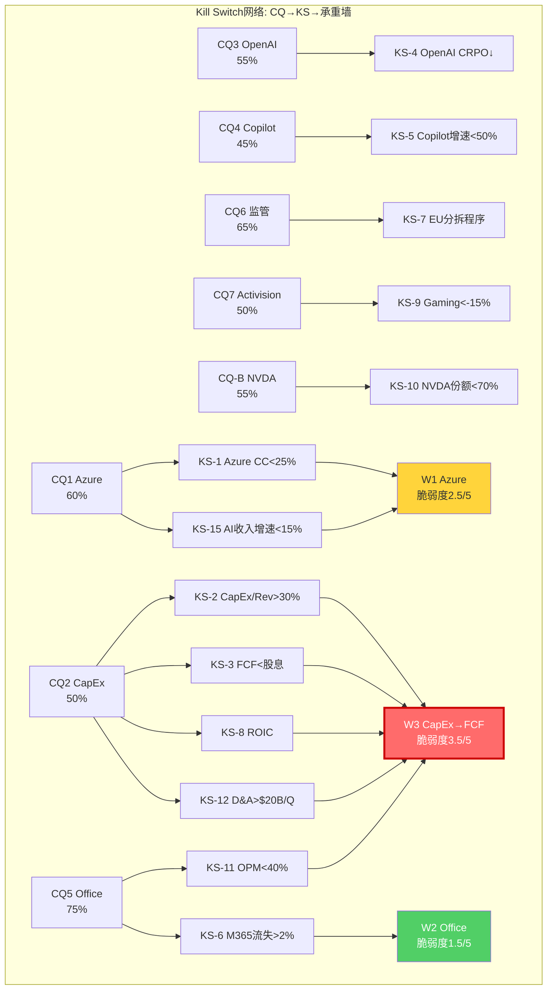
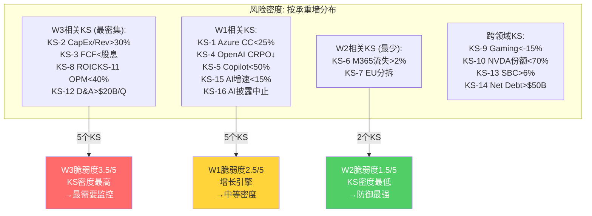
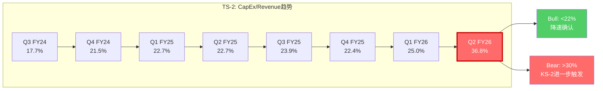
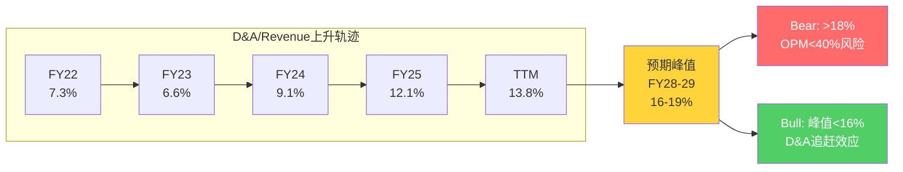
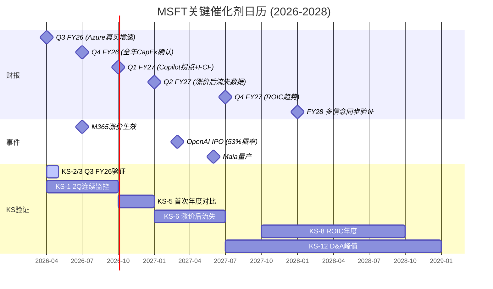
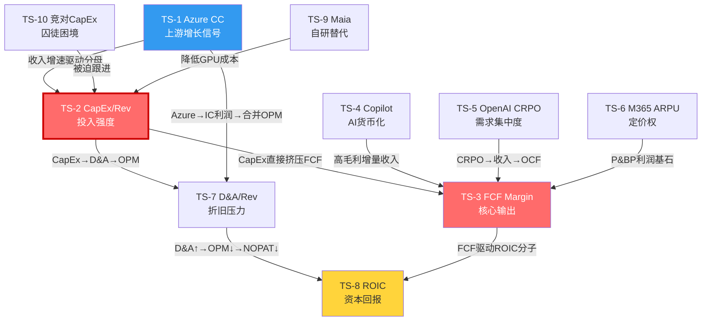

## Ch27: Kill Switch注册表 — 十六个终止条件的精确定义

Kill Switch(KS)不是预测工具，而是**认知纪律工具**: 当且仅当某个KS被触发时，该CQ对应的投资论点需要被强制重审。KS的设计原则: 触发条件必须是可观测的、不可模糊的公开数据阈值，而非主观判断。

<!-- DM-P5B-001: Kill Switch设计原则: 可观测+不可模糊+公开数据, 禁止主观判断作为触发条件 | Source: AMAT v1.1 KS方法论 | Confidence: H -->

### KS-1: Azure恒定汇率增速连续两季度低于25%

<!-- DM-P5B-002: KS-1 Azure CC<25% 2Q连续触发条件 | Source: Q2 FY26 Azure CC 38%→Q3指引31-32% [DM-P1A-019] | Confidence: H -->

| 字段 | 内容 |
|------|------|
| **关联CQ** | CQ1 (Azure 5Y CAGR 25%+可持续性) |
| **关联信念** | B1 (Azure CAGR 22-25%在FY26-FY30成立) |
| **关联承重墙** | W1 (Azure增长引擎, 脆弱度2.5/5, 底部贡献~$1,200B) |
| **触发条件** | Azure恒定汇率(CC)同比增速 < 25%，**连续两个季度** |
| **数据来源** | MSFT季度Earnings Call + Press Release (每季度报告Azure CC增速) |
| **验证频率** | 季度 (每季度财报日后48小时内验证) |
| **论文含义** | Azure正从"高增长引擎"进入"成熟期减速"。25%是维持$3T估值中IC分部$1,200B贡献的数学下限——低于此增速意味着IC的CAGR路径无法支撑Ch10信念B1对应的估值隐含条件。单季度低于25%(如Q3 FY26指引31-32%→实际可能28-30%)不构成触发，因季节性和产能约束可造成单季偏差。连续两季度低于25%排除了暂时性因素，指向需求端的结构性放缓 |
| **当前状态** | 未触发。Q1 FY26 Azure CC 40%, Q2 FY26 CC 38%。Q3 FY26指引31-32%(CC)——若Q3实际值<30%且Q4<25%，KS-1将在FY27 Q1(2026年10月)进入预警 |
| **首次可验证** | 2026年4月 (Q3 FY26财报，Azure CC数据) |

**为什么25%而非20%或30%**: Ch10 Reverse DCF显示$3T估值隐含Azure 5Y CAGR 22-25%。25%是这一区间的上界——跌破上界意味着即使最乐观的隐含增速也无法成立。20%阈值过于宽松(留出太大缓冲，发现意义低)；30%阈值过于严格(Q3指引31-32%即可能触发，而单季减速不构成结构性信号)。

**为什么要求连续两季度**: Azure增速受产能约束(Ch17"两速Azure")、季节性(Q3通常为年度低谷)和大型合同确认时点的影响，单季波动幅度可达±5pp。Ch17识别的"非AI Azure从19%加速至22%"表明非AI需求分散稳定，但AI需求受GPU交付节奏驱动、季度间波动大。两季度的观察窗口能过滤这些噪音。

### KS-2: CapEx/Revenue连续四个季度超过30%

<!-- DM-P5B-003: KS-2 CapEx/Rev>30% 4Q连续 | Source: Q2 FY26 CapEx/Rev 36.8%(历史极值) [DM-P4A-001] | Confidence: H -->

| 字段 | 内容 |
|------|------|
| **关联CQ** | CQ2 (CapEx $120B+/年ROIC恢复) |
| **关联信念** | B4 (CapEx/Revenue降至<22%); B6 (FCF恢复至25%+ Margin) |
| **关联承重墙** | W3 (CapEx→FCF转化, 脆弱度3.5/5, 底部贡献~$800B) |
| **触发条件** | 季度CapEx/Revenue > 30%，**连续四个季度** |
| **数据来源** | MSFT 10-Q/10-K 现金流量表 (CapEx = investmentsInPropertyPlantAndEquipment) |
| **验证频率** | 季度 |
| **论文含义** | CapEx投入已从"周期性高峰"转化为"结构性新常态"。四季度持续>30%意味着年化CapEx超过Revenue的30%(以FY27E Revenue $371B计算，CapEx>$111B)。这一水平下，即使OCF/Revenue维持50%(历史高端)，FCF Margin仅20%——低于$3T估值隐含的25%+。更严重的是，D&A将在CapEx高峰后18-24个月达到峰值$70-85B/年(Ch13基准情景)，进一步挤压OPM。B4和B6的联合失败概率从当前20-25%升至40%以上 |
| **当前状态** | **1/4季度触发**。Q2 FY26 CapEx/Rev 36.8%已超过30%；Q1 FY26为25.0%(未触发)。需监控Q3 FY26和Q4 FY26——若两季度均>30%，则在FY26 10-K发布时(2026年10月)构成3/4 |
| **首次可验证** | 2026年4月 (Q3 FY26财报) |

**Q2 FY26 36.8%的特殊性说明**: 管理层将Q2 CapEx $29.9B归因于数据中心长期资产集中交付。如果Q3 CapEx回落至$20-22B(CapEx/Rev约26%)，KS-2将自动解除。但全年$80B指引暗示H2 FY26 CapEx约$30.7B(与H1基本持平)——KS-2在FY26全年层面可能维持2/4状态。真正的决定性窗口在FY27: 若FY27 CapEx指引>$90B(Revenue $371B对应>24%)，连续四季度>30%的概率显著上升。

### KS-3: 单季FCF低于股息支出连续两个季度

<!-- DM-P5B-004: KS-3 FCF<股息 2Q连续 | Source: Q2 FY26 FCF $5.9B < 股息$6.8B [DM-FIN-009] | Confidence: H -->

| 字段 | 内容 |
|------|------|
| **关联CQ** | CQ2 (CapEx ROIC恢复) |
| **关联信念** | B6 (FCF恢复至25%+ Margin) |
| **关联承重墙** | W3 (CapEx→FCF转化, 脆弱度3.5/5) |
| **触发条件** | 单季度FCF(OCF - CapEx) < 同季度普通股息支出，**连续两个季度** |
| **数据来源** | MSFT 10-Q 现金流量表: freeCashFlow vs commonDividendsPaid |
| **验证频率** | 季度 |
| **论文含义** | MSFT从"自由现金流覆盖所有股东回报"退化为"借债或消耗储备支付股息"。Q2 FY26已出现首次FCF<股息($5.9B < $6.8B)——这是MSFT自2014年以来的首次。单季度可归因于CapEx集中交付的时间差。连续两个季度意味着CapEx挤压FCF不是时间错配而是结构性失衡。对于一家总债务$57.6B、净债务$30.3B的公司，短期偿债能力不成问题(Altman Z 9.71)，但**FCF<股息持续化将迫使管理层在"维持股息增长"和"维持AI投入"之间做出取舍**——任何一方的让步都将传递负面信号 |
| **当前状态** | **1/2季度触发**。Q2 FY26 FCF $5.9B < 股息$6.8B。Q1 FY26 FCF $25.7B >> 股息$6.2B(未触发)。Q3 FY26是决定性季度 |
| **首次可验证** | 2026年4月 (Q3 FY26财报) |

### KS-4: OpenAI CRPO贡献季度环比下降超过$50B

<!-- DM-P5B-005: KS-4 OpenAI CRPO环比↓>$50B | Source: Q2 FY26 OpenAI CRPO ~$281B(45%) [DM-P4A-007] | Confidence: M -->

| 字段 | 内容 |
|------|------|
| **关联CQ** | CQ3 (OpenAI CRPO 45%依赖) |
| **关联信念** | B5 (OpenAI合作至2032年) |
| **关联承重墙** | W1 (Azure增长引擎) |
| **触发条件** | OpenAI相关CRPO(通过大客户集中度推断)季度环比下降 > $50B |
| **数据来源** | MSFT 10-Q CRPO披露 + 投行估算(OpenAI份额); OpenAI IPO后若有分部披露则直接使用 |
| **验证频率** | 季度 (CRPO在10-Q中披露, OpenAI份额需间接推算) |
| **论文含义** | $50B的环比下降(从$281B降至$231B以下)意味着OpenAI正在实质性减少Azure承购——可能因为(1)多云部署启动(GCP/AWS分流)、(2)合同条款重新协商(总承购额缩减)、或(3)OpenAI自身增长减速导致推理消耗预期下调。Ch18验证去OpenAI后Azure增速仍达32-34%——但这是在OpenAI不主动撤出的前提下。CRPO下降$50B(约18%)将触发市场对Azure AI增速持续性的根本性质疑 |
| **当前状态** | 未触发。Q2 FY26 CRPO $625B(+110% YoY)，暂无下降迹象 |
| **首次可验证** | 2026年4月 (Q3 FY26 CRPO, 需推算OpenAI份额变动) |

**数据可观测性限制**: MSFT不单独披露OpenAI在CRPO中的份额。$281B(45%)是基于$250B承购合同加上存量消耗的估算。KS-4的触发依赖于CRPO总量变动和大客户集中度推断——如果总CRPO环比下降$50B+且非OpenAI CRPO保持增长(通过剔除法推算)，可间接确认OpenAI贡献下降。OpenAI IPO后(Polymarket 53%概率2026-2027年)的招股书将提供Azure支出的直接数据。

### KS-5: Copilot座位年同比增速低于50%

<!-- DM-P5B-006: KS-5 Copilot增速<50% | Source: 当前160% YoY [DM-P3B-001至010] | Confidence: H -->

| 字段 | 内容 |
|------|------|
| **关联CQ** | CQ4 (Copilot S曲线渗透率) |
| **关联信念** | B3 (Copilot渗透15-20% by FY28-FY30) |
| **关联承重墙** | W1 (Azure增长引擎, 间接通过叙事传导) |
| **触发条件** | Copilot付费座位数YoY增速 < 50% |
| **数据来源** | MSFT Earnings Call (管理层通常在Q1和Q3报告座位数据) |
| **验证频率** | 半年度 (座位数据披露频率较低，约每半年) |
| **论文含义** | 160% YoY(从580万到1500万)的S曲线如果在两年内骤降至<50%，意味着Copilot的early adopter红利耗尽后，大众市场渗透遇到了结构性障碍。Ch19的三情景分析显示: <50%增速对应Bear情景(FY28渗透率5-8%, ARR $7.2-11.5B)——Copilot将从"AI货币化旗舰"降级为"小众增值产品"。B3的叙事传导效应意味着这一降级的市值影响将远超直接财务影响(3-4倍杠杆) |
| **当前状态** | 未触发。当前增速160% YoY(FY25 580万→FY26H1 1500万) |
| **首次可验证** | 2026年10月 (FY27 Q1, 预期第一个可比较完整年度数据) |

### KS-6: M365商业用户年净流失率超过2%

<!-- DM-P5B-007: KS-6 M365流失>2% | Source: 当前流失率5-8%(行业估算), 2026.7月涨价后首次可验证 [DM-P3B-030至035] | Confidence: M -->

| 字段 | 内容 |
|------|------|
| **关联CQ** | CQ5 (Office/Windows现金奶牛耐久性) |
| **关联信念** | B7 (Office不衰退, CQ5 75%); 定价权 |
| **关联承重墙** | W2 (Office现金奶牛, 脆弱度1.5/5, 底部贡献~$1,000B) |
| **触发条件** | M365商业付费座位数年同比净减少 > 2%(约900万座位/年) |
| **数据来源** | MSFT Earnings Call + 10-K座位数据; 涨价后6-12个月的流失率是关键 |
| **验证频率** | 年度 (座位数在年度报告或年度会议中披露) |
| **论文含义** | M365在4.5亿商业用户基础上净流失>2%，意味着2026年7月涨价($10.7B/年增量)引发的弹性反应已超过Ch21量化的-0.2弹性阈值。价格弹性从-0.2恶化至-0.5+意味着MSFT的定价权假设(W2的核心支柱)出现裂缝。涨价带来的ARPU提升被座位流失部分抵消，P&BP分部的$82B年化营业利润增长轨迹将从+12%放缓至+5-7% |
| **当前状态** | 未触发。行业估算流失率5-8%/年(正常自然流失)，净增长为正(DAU/MAU稳步提升)。涨价后首个完整数据窗口为FY27 Q1-Q2(2026年10月至2027年1月) |
| **首次可验证** | 2027年1月 (FY27 Q2财报, 涨价后首个完整半年数据) |

### KS-7: 欧盟启动结构性分拆程序

<!-- DM-P5B-008: KS-7 EU分拆程序 | Source: Ch20五战线分析 [DM-P3B-040至048] | Confidence: H -->

| 字段 | 内容 |
|------|------|
| **关联CQ** | CQ6 (EU DMA + FTC监管影响) |
| **关联信念** | B8 (无反垄断结构性分拆) |
| **关联承重墙** | W2 (间接, 分拆影响Office+Teams捆绑); W1 (间接, Azure+OpenAI合规审查) |
| **触发条件** | 欧盟委员会(EC)对MSFT启动正式结构性分拆程序(Statement of Objections + 明确的分拆方案提案)，而非行为救济 |
| **数据来源** | EC官方公报 / MSFT 8-K / 主要财经媒体 |
| **验证频率** | 事件驱动 (非定期，但EC通常在1-3月和9-11月发布重大竞争裁决) |
| **论文含义** | EC从行为救济(罚款/互操作义务)升级至结构性分拆(强制剥离Teams/Azure/Gaming)代表监管风险从"慢性病"变为"急性发作"。Ch20评估结构性分拆概率<5%(24个月)。如果触发，BS-3估算的$400B-$800B市值冲击将成为现实路径。但需注意: EC的正式分拆程序从启动到最终裁决通常需3-5年，期间MSFT有充分的法律对抗空间。触发KS-7不意味着分拆将实现，而意味着分拆的概率从<5%跳升至15-25%——这一概率变化本身就将导致$100-200B的估值折价 |
| **当前状态** | 未触发。EU DMA合规评估已于2025年底结案(MSFT承诺Teams去捆绑)，未升级至分拆 |
| **首次可验证** | 事件驱动，无固定日期。下一个监管关注窗口: FTC对OpenAI/MSFT关系的CID调查结果(预计2027年) |

### KS-8: ROIC连续两个财年低于WACC

<!-- DM-P5B-009: KS-8 ROIC<WACC 2Y连续 | Source: 当前ROIC 22.0% vs WACC 9.5%, 即使悲观FY29 10%仍>WACC [DM-P4A-005] | Confidence: H -->

| 字段 | 内容 |
|------|------|
| **关联CQ** | CQ2 (CapEx ROIC恢复) |
| **关联信念** | B4 (CapEx降速); B6 (FCF恢复) |
| **关联承重墙** | W3 (CapEx→FCF转化) |
| **触发条件** | 年化ROIC(NOPAT / 平均投入资本) < WACC (当前9.5%)，**连续两个完整财年** |
| **数据来源** | FMP key-metrics (年度口径ROIC) 或 自建计算: EBIT TTM × (1-税率) / 平均投入资本 |
| **验证频率** | 年度 (ROIC需完整财年数据) |
| **论文含义** | ROIC < WACC意味着每一美元增量投入资本的经济利润为负——MSFT从"价值创造者"退化为"价值消耗者"。当前ROIC 22.0%(FMP key-metrics)远超WACC 9.5%，但Ch13的悲观情景显示FY29 ROIC可能触底至10%(接近WACC)。连续两年低于WACC需要CapEx持续$100B+且Revenue增速降至<10%的极端组合——概率约3-5%。但一旦触发，将意味着AI军备竞赛的总回报不足以覆盖资本成本，$3T估值中约$800B-1,000B的"增长溢价"将归零 |
| **当前状态** | 未触发。FY25 ROIC约22.0%，远超WACC 9.5% |
| **首次可验证** | 2028年10月 (FY28 10-K, ROIC需完整财年) |

### KS-9: Gaming分部收入连续四季度同比下降超过15%

<!-- DM-P5B-010: KS-9 Gaming<-15% 4Q | Source: 最近季度Gaming -9% YoY [DM-P3A-060至065] | Confidence: H -->

| 字段 | 内容 |
|------|------|
| **关联CQ** | CQ7 (Activision $51B Goodwill减值风险) |
| **关联信念** | Activision整合价值; MPC分部盈利能力 |
| **关联承重墙** | 非直接承重墙(MPC占EV约7%) |
| **触发条件** | Xbox Content & Services + Activision合并口径游戏收入YoY < -15%，**连续四个季度** |
| **数据来源** | MSFT MPC分部季度披露 + Gaming收入子线(10-Q Segment Information) |
| **验证频率** | 季度 |
| **论文含义** | Gaming -15%持续四季度意味着Activision整合不仅未能提振Gaming增长，反而伴随着核心IP(Call of Duty)的加速衰退。Ch22评估MPC分部FV $228B vs BV $87B(含$51B Goodwill)——四季度-15%将导致Gaming子线收入从年化$18B萎缩至$13B，触及Goodwill减值测试的"更可能不成立"阈值。概率加权减值$3.7-6.3B虽然绝对金额对$3T市值影响有限(0.1-0.2%)，但**叙事冲击远大于财务冲击**: Activision减值将被市场解读为MSFT"$69B并购失败"的标志性事件 |
| **当前状态** | 部分触发。最近两季度Gaming增速约-7%至-9%。触发需进一步恶化至-15%且持续 |
| **首次可验证** | 持续监控中(每季度) |

### KS-10: NVIDIA GPU市场份额跌破70%

<!-- DM-P5B-011: KS-10 NVDA份额<70% | Source: 当前NVDA数据中心GPU份额~85-90% [DM-P3C-001至012] | Confidence: M -->

| 字段 | 内容 |
|------|------|
| **关联CQ** | CQ-B (MSFT作为NVDA #1客户的GPU采购链) |
| **关联信念** | NVDA GPU垄断地位 → MSFT CapEx效率 → Azure AI产能成本 |
| **关联承重墙** | W3 (间接, GPU成本占CapEx 40-50%) |
| **触发条件** | NVIDIA在数据中心训练+推理GPU市场的收入份额跌破70%(当前估算85-90%) |
| **数据来源** | IDC/Gartner半导体市场份额报告 + NVDA/AMD/INTC季度财报交叉验证 |
| **验证频率** | 半年度 (IDC数据通常半年发布) |
| **论文含义** | NVDA份额<70%意味着AMD MI300X/MI400系列和自研芯片(Google TPU, MSFT Maia, Amazon Trainium)的集体追赶已达到临界质量。对MSFT而言: (1) 正面——GPU采购议价能力增强，CapEx中GPU成本可能下降15-25%，加速W3恢复; (2) 负面——NVDA的CUDA生态垄断被打破意味着AI基础设施从"垄断租金"变为"标准化竞争"，MSFT在AI云上的差异化优势可能下降(Azure AI性能不再因独家GPU伙伴关系而优于AWS/GCP) |
| **当前状态** | 未触发。NVDA FY25数据中心收入份额约85-90% |
| **首次可验证** | 2027年上半年 (IDC CY2026全年数据) |

### KS-11: 合并营业利润率跌破40%

<!-- DM-P5B-012: KS-11 OPM<40% | Source: TTM OPM 46.0% [DM-FIN-003], FY25 45.6% | Confidence: H -->

| 字段 | 内容 |
|------|------|
| **关联CQ** | CQ2 (CapEx恢复); CQ5 (现金奶牛耐久性) |
| **关联信念** | B2 (OPM恢复至47%+) |
| **关联承重墙** | W3 (OPM下降挤压OCF→FCF); W2 (若OPM<40%暗示P&BP定价权受损) |
| **触发条件** | TTM合并OPM(Operating Income / Revenue) < 40% |
| **数据来源** | MSFT 10-Q/10-K 损益表 |
| **验证频率** | 季度 (TTM滚动计算) |
| **论文含义** | MSFT TTM OPM从FY21的41.6%提升至当前46.0%——<40%将是2020年以来的最低水平。Ch13的D&A传导链显示: FY28-FY29 D&A峰值$60-72B/年可能将OPM压至42-43%(基准情景)。跌破40%需要D&A峰值达到$80B+且Revenue增速低于10%的极端组合。这将意味着B2(OPM恢复至47%+)不仅延迟而且方向逆转——AI CapEx不是"先苦后甜"而是"持续消耗"。P&BP分部OPM 60%+的安全垫可以在IC分部OPM下降至35%的情况下维持合并OPM在42-43%——合并OPM<40%意味着P&BP自身也开始受损 |
| **当前状态** | 未触发。TTM OPM 46.0%, Q2 FY26单季OPM 47.1% |
| **首次可验证** | 2028年中 (D&A峰值期FY28-FY29) |

### KS-12: 单季折旧摊销超过$20B

<!-- DM-P5B-013: KS-12 D&A>$20B/Q | Source: Q2 FY26 D&A $9.2B, TTM $42.2B [DM-FIN-006] | Confidence: H -->

| 字段 | 内容 |
|------|------|
| **关联CQ** | CQ2 (CapEx传导链) |
| **关联信念** | B2 (OPM恢复); B6 (FCF恢复) |
| **关联承重墙** | W3 (D&A是CapEx→OPM→FCF传导链的中间变量) |
| **触发条件** | 单季度D&A > $20B |
| **数据来源** | MSFT 10-Q 损益表 depreciationAndAmortization |
| **验证频率** | 季度 |
| **论文含义** | $20B/Q年化意味着D&A达$80B/年——远超Ch13基准情景的$60-68B峰值。这将使D&A/Revenue升至约20%(当前13.8%)，直接挤压OPM约6个百分点。在Revenue增速16%、COGS增速20%的情况下，$80B D&A将使OPM从当前46%降至约38%——跌破KS-11的40%阈值。$20B/Q的D&A意味着PP&E基数已达$400B+(以5年加权平均寿命计算)，暗示FY24-FY27累计CapEx达$280B+。这一投入规模下，即使AI应用全面成功，ROIC恢复至>15%也需要Revenue从$300B翻倍至$600B+(至少FY30后) |
| **当前状态** | 未触发。Q2 FY26 D&A $9.2B，Q1 FY26 $13.1B(含FY25 Q4加速折旧的滞后效应)。TTM D&A $42.2B(季度均值$10.6B) |
| **首次可验证** | 2028年(FY28-FY29, D&A峰值期) |

**Q1 FY26 D&A $13.1B的异常**: Q1 FY26 D&A从Q4 FY25的$11.2B跃升至$13.1B，但Q2 FY26又回落至$9.2B。$13.1B可能包含加速折旧或一次性减值调整。季度D&A的波动性意味着KS-12不应设定为"连续"触发，而是单季度即可——$20B的阈值已足够高以过滤正常波动。

### KS-13: SBC/Revenue超过6%

<!-- DM-P5B-014: KS-13 SBC/Rev>6% | Source: 当前SBC TTM $12.1B, SBC/Rev 4.0% [DM-EFF-007] | Confidence: H -->

| 字段 | 内容 |
|------|------|
| **关联CQ** | 非直接关联CQ(跨领域) |
| **关联信念** | 股东价值保全; SBC抵消率 |
| **关联承重墙** | 无直接关联(但>6%将挤压调整后FCF) |
| **触发条件** | TTM SBC / TTM Revenue > 6% |
| **数据来源** | MSFT 10-Q 现金流量表 stockBasedCompensation / Revenue |
| **验证频率** | 季度 |
| **论文含义** | SBC从4.0%升至6%+意味着MSFT在人才竞争中被迫大幅提高股权激励——可能因为(1)AI人才争夺白热化(与Google/OpenAI/Anthropic争抢)、(2)股价低迷使现有RSU价值缩水需补偿、或(3)大规模扩招。6%的SBC意味着年化$18B+(以$305B Revenue计算)，调整后FCF从$77.4B降至$65B——FCF Yield从2.6%降至2.2%。更重要的信号是: SBC抵消率从当前166%(回购>SBC)可能降至100%以下——股份净稀释开始发生 |
| **当前状态** | 未触发。SBC TTM $12.1B / Revenue $305.5B = 4.0%。SBC抵消率166% |
| **首次可验证** | 持续监控中(每季度) |

### KS-14: Net Debt超过$50B

<!-- DM-P5B-015: KS-14 Net Debt>$50B | Source: 当前Net Debt $30.3B, 总债务$57.6B [DM-BS-002/003] | Confidence: H -->

| 字段 | 内容 |
|------|------|
| **关联CQ** | CQ2 (CapEx融资来源); 财务韧性 |
| **关联信念** | 资产负债表安全性 |
| **关联承重墙** | 无直接关联(但债务水平影响WACC和财务灵活性) |
| **触发条件** | Net Debt (Total Debt - Cash & Equivalents - Short-term Investments) > $50B |
| **数据来源** | MSFT 10-Q 资产负债表 |
| **验证频率** | 季度 |
| **论文含义** | 当前Net Debt $30.3B(D/E 0.15x)是科技巨头中最保守的资产负债表之一。Net Debt > $50B意味着MSFT为CapEx融资开始大幅举债——如果同期FCF不能覆盖CapEx，债务扩张将是填补缺口的唯一手段。$50B Net Debt对应D/E约0.25x，仍在可控范围(利息保障倍数从56x降至约35x)。但**信号意义大于财务影响**: 一家曾经现金富裕的公司转向杠杆化意味着AI投入的规模已超出内生现金流的支撑能力 |
| **当前状态** | 未触发。Net Debt $30.3B。但Q2 FY26现金$24.3B(环比-$4.6B)的下降趋势值得关注 |
| **首次可验证** | 持续监控中(每季度) |

### KS-15: AI相关收入增速跌破15%

<!-- DM-P5B-016: KS-15 AI收入增速<15% | Source: 当前AI run rate ~$26B, 增速~100% YoY [DM-P4B-004] | Confidence: M -->

| 字段 | 内容 |
|------|------|
| **关联CQ** | CQ1 (Azure增速); CQ4 (Copilot渗透) |
| **关联信念** | B1 (Azure AI增速); B3 (Copilot增长) |
| **关联承重墙** | W1 (Azure增长引擎) |
| **触发条件** | 管理层披露的"AI run rate"或"AI相关产品收入"YoY增速 < 15% |
| **数据来源** | MSFT Earnings Call (Nadella通常在开场报告AI run rate) |
| **验证频率** | 季度 (如仍披露); 若管理层停止披露AI run rate，本身即为负面信号(参见KS-16) |
| **论文含义** | AI收入增速从~100%骤降至<15%意味着AI从"超级增长周期"彻底沦为"正常增长产品线"。以$26B基数计算，<15%增速意味着FY27 AI收入仅增$3.9B——相对于$80B+ CapEx，每美元AI CapEx产出从$0.33降至$0.05。这将直接验证RT-3空头论点"AI资本毁灭"(威胁4/5)。15%阈值的选择依据: 略高于MSFT整体Revenue增速(约14%)——如果AI增长不能显著超过总体，那么AI的战略叙事将从"增长加速器"降级为"与大盘同步" |
| **当前状态** | 未触发。AI run rate增速约100% YoY。BS-4(AI冬天)概率5-8%对应此触发 |
| **首次可验证** | 2026年10月 (FY27 Q1, 一年期可比基数完整化) |

### KS-16: AI Run Rate披露中止

<!-- DM-P5B-017: KS-16 AI run rate披露中止 | Source: 管理层自愿披露, 非GAAP, 可随时停止 | Confidence: M -->

| 字段 | 内容 |
|------|------|
| **关联CQ** | CQ1 (Azure增速透明度); CQ3 (OpenAI可见性) |
| **关联信念** | 信息透明度; AI叙事管理 |
| **关联承重墙** | W1 (信息黑箱增加不确定性溢价) |
| **触发条件** | MSFT在连续两个季度Earnings Call中不再主动报告AI run rate或等效AI收入指标 |
| **数据来源** | MSFT Earnings Call Transcript |
| **验证频率** | 季度 |
| **论文含义** | AI run rate是非GAAP的自愿披露——管理层可以在任何季度决定不再报告。历史模式显示: 科技公司通常在增速亮眼时主动披露细分指标，增速放缓时"简化"披露。如果MSFT停止报告AI run rate，市场将合理推测AI增速已显著放缓——信息真空将被悲观预期填充。这不是一个直接的财务触发器，而是一个**信息质量退化信号**: 失去AI run rate数据将使CQ1和CQ4的置信度各下降5-10pp(因为可验证性降低) |
| **当前状态** | 未触发。截至Q2 FY26，管理层每季度报告AI run rate |
| **首次可验证** | 2026年4月 (Q3 FY26 Earnings Call) |

### KS汇总表: 十六个终止条件的风险地图

<!-- DM-P5B-018: KS汇总: 16个Kill Switch, 4个CQ2相关(W3最密集), 2个已部分触发(KS-2 1/4, KS-3 1/2) | Source: KS-1至KS-16综合 | Confidence: H -->

| KS | 触发条件 | 关联CQ | 关联墙 | 当前状态 | 首次验证 | 论文含义优先级 |
|----|---------|--------|--------|---------|---------|-------------|
| KS-1 | Azure CC<25% 2Q | CQ1 | W1 | 未触发 | 2026.04 | **高** |
| KS-2 | CapEx/Rev>30% 4Q | CQ2 | W3 | **1/4** | 2026.04 | **极高** |
| KS-3 | FCF<股息 2Q | CQ2 | W3 | **1/2** | 2026.04 | **高** |
| KS-4 | OpenAI CRPO↓$50B | CQ3 | W1 | 未触发 | 2026.04 | 高 |
| KS-5 | Copilot增速<50% | CQ4 | W1 | 未触发 | 2026.10 | 中高 |
| KS-6 | M365流失>2% | CQ5 | W2 | 未触发 | 2027.01 | 中 |
| KS-7 | EU分拆程序 | CQ6 | W2 | 未触发 | 事件驱动 | 低(概率极低) |
| KS-8 | ROIC<WACC 2Y | CQ2 | W3 | 未触发 | 2028.10 | 极高(但远期) |
| KS-9 | Gaming<-15% 4Q | CQ7 | — | 部分 | 持续 | 低 |
| KS-10 | NVDA份额<70% | CQ-B | W3 | 未触发 | 2027H1 | 中(双向) |
| KS-11 | OPM<40% TTM | CQ2/5 | W3/W2 | 未触发 | 2028 | 极高 |
| KS-12 | D&A>$20B/Q | CQ2 | W3 | 未触发 | 2028 | 高 |
| KS-13 | SBC/Rev>6% | — | — | 未触发 | 持续 | 低 |
| KS-14 | Net Debt>$50B | CQ2 | — | 未触发 | 持续 | 中低 |
| KS-15 | AI增速<15% | CQ1/4 | W1 | 未触发 | 2026.10 | 高 |
| KS-16 | AI披露中止 | CQ1 | W1 | 未触发 | 2026.04 | 中 |

**关键发现**: W3(CapEx→FCF)承重墙关联5个KS——这是三堵墙中KS密度最高的一堵，印证了Ch12"W3脆弱度3.5/5为最高"的判断。其中KS-2(1/4触发)和KS-3(1/2触发)已处于预警状态——Q3 FY26(2026年4月)的财报数据将决定这两个KS是进一步接近触发还是解除。

W2(Office现金奶牛)仅关联2个KS(KS-6和KS-7)，且均远未触发——这是$1.5T底部保护的定量佐证: 最坚固的承重墙拥有最少的已知裂缝路径。

---

## Ch28: Tracking Signals — 十个监控信号与投资日历

Tracking Signal(TS)是将KS的"触发/未触发"二元判断扩展为连续监控的仪表盘。每个TS对应一个或多个KS，提供该KS当前距离触发阈值多远、正在向哪个方向移动的实时信号。

<!-- DM-P5B-019: Tracking Signal设计原则: KS的连续化监控, 包含Bull/Bear双向阈值, 每个TS必须通过MSFT特异性测试 | Source: 框架方法论 | Confidence: H -->

### TS-1: Azure恒定汇率增速

<!-- DM-P5B-020: TS-1 Azure CC增速 | Source: Q2 FY26 CC 38%, Q3指引31-32% [DM-P1A-019] | Confidence: H -->

| 字段 | 内容 |
|------|------|
| **关联KS** | KS-1 (Azure CC<25% 2Q), KS-15 (AI增速<15%) |
| **监控指标** | Azure及其他云服务恒定汇率(CC)同比增速 (%) |
| **Bull信号** | CC > 35%(产能约束解除后需求反弹确认，B1 Base→Bull情景切换) |
| **Bear信号** | CC < 28%(结构性减速，即使约束解除后需求未能反弹) |
| **当前值** | Q2 FY26: 38%(CC); Q3 FY26指引: 31-32%(CC) |
| **更新频率** | 季度 (Earnings Call + Press Release) |
| **MSFT特异性测试** | **通过**。Azure CC增速是MSFT独有的报告指标(AWS/GCP使用不同的增长定义)。Azure包含AI和非AI两个增速分量(Ch17"两速Azure")——仅此一个指标无法区分AI vs 非AI的驱动力变化。需结合TS-7(AI收入增速)交叉读取。全行业云增速放缓不等于Azure竞争力下降——若AWS/GCP同步减速但Azure维持>25%，实际信号是正面的(份额增长)。因此Azure CC的特异性在于**需与竞对增速做差值分析** |

**信号解读框架**:
- 38%→35%+: 产能约束解除后正常回落，B1基准路径成立
- 35%→28%: 灰色地带——需区分"约束解除释放压抑需求(Bull)"和"解除后暴露真实需求不足(Bear)"。区分方法: 若Azure非AI增速维持22%+而AI增速从100%降至50%，则属于正常基数效应而非结构性放缓
- <28%: KS-1预警区间(距触发25%仅3pp缓冲)

### TS-2: CapEx/Revenue季度比率

<!-- DM-P5B-021: TS-2 CapEx/Revenue | Source: Q2 FY26 36.8% [DM-P4A-001] | Confidence: H -->

| 字段 | 内容 |
|------|------|
| **关联KS** | KS-2 (CapEx/Rev>30% 4Q), KS-3 (FCF<股息 2Q), KS-8 (ROIC<WACC) |
| **监控指标** | 季度CapEx / 季度Revenue (%) |
| **Bull信号** | < 22%(CapEx降速确认，B4成立，FCF恢复路径清晰) |
| **Bear信号** | > 30%(CapEx高位持续，KS-2进一步触发) |
| **当前值** | Q2 FY26: 36.8% | Q1 FY26: 25.0% | TTM: 27.2% |
| **更新频率** | 季度 |
| **MSFT特异性测试** | **通过**。CapEx/Revenue是衡量AI投入强度的最直接指标。但MSFT的CapEx包含Azure数据中心(生产性)、Maia芯片(研发性)、LinkedIn/Activision内容资产(非AI)——单一CapEx/Revenue比率不区分"高回报AI投入"和"低回报维护性支出"。竞对对比: Amazon CapEx/Revenue约16%(但包含物流仓储)、Google约18%、Meta约35%——MSFT的36.8%仅次于Meta。但Meta的CapEx集中于单一业务(AI/元宇宙)，MSFT分散于三大分部。需将CapEx按分部拆分才能获得真正的信号——MSFT不单独披露分部CapEx，这是数据限制 |

**季度波动性校正**: Q2 FY26的36.8%vs Q1 FY26的25.0%展示了季度间的巨大波动(11.8pp)。TTM 27.2%是更稳定的读数。建议同时监控单季和TTM两个维度——单季用于识别异常脉冲，TTM用于趋势判断。

### TS-3: FCF Margin (TTM)

<!-- DM-P5B-022: TS-3 FCF Margin | Source: TTM FCF $77.4B / Revenue $305.5B = 25.3% [DM-FIN-009] | Confidence: H -->

| 字段 | 内容 |
|------|------|
| **关联KS** | KS-3 (FCF<股息 2Q), KS-8 (ROIC<WACC), KS-11 (OPM<40%) |
| **监控指标** | TTM FCF / TTM Revenue (%) |
| **Bull信号** | > 28%(FCF恢复至FY22-23水平，B6 Base情景确认) |
| **Bear信号** | < 18%(FCF持续受CapEx挤压，B6 Bear情景进入) |
| **当前值** | TTM: 25.3% ($77.4B / $305.5B) |
| **更新频率** | 季度 (TTM滚动) |
| **MSFT特异性测试** | **通过**。FCF Margin是B6(终端汇聚节点)的直接代理变量。但MSFT的FCF受CapEx时间差影响极大——Q2 FY26单季FCF Margin仅7.2%($5.9B/$81.3B)而Q1 FY26为33.1%($25.7B/$77.7B)。TTM平滑了这一波动。此外，MSFT FCF定义(OCF-CapEx)中CapEx仅含PP&E，不含Finance Lease——若含FL(Q2 FY26约$7.6B)，"真实"FCF将大幅降低。竞对AWS/GCP采用类似定义。FCF Margin在科技板块中的可比性受各公司CapEx资本化政策差异影响——MSFT的25.3%不能直接与Meta的30%+比较(因为Meta不含Amazon式物流CapEx) |

### TS-4: Copilot付费座位数与ARPU

<!-- DM-P5B-023: TS-4 Copilot座位+ARPU | Source: 1500万座位, $30/月列表价 [DM-P3B-001至010] | Confidence: M -->

| 字段 | 内容 |
|------|------|
| **关联KS** | KS-5 (Copilot增速<50%), KS-6 (M365流失>2%) |
| **监控指标** | (a) Copilot for M365付费座位数; (b) 实际ARPU(总Copilot收入/座位数) |
| **Bull信号** | (a) 座位增速 > 100% YoY 且 (b) ARPU ≥ $28/月 |
| **Bear信号** | (a) 座位增速 < 50% YoY 或 (b) ARPU < $22/月(折扣侵蚀定价权) |
| **当前值** | (a) 约1500万座位, 增速~160% YoY(FY25 580万基准); (b) ARPU $30/月(列表价)，实际估算$24-28/月(含EA折扣) |
| **更新频率** | 半年度 (管理层约每2-3个季度更新座位数；ARPU需从P&BP分部收入增量推算) |
| **MSFT特异性测试** | **通过**。Copilot座位数是MSFT独有的KPI(Google Gemini for Workspace/GitHub Copilot有可比数据但口径不同)。但座位数增长不等于使用量增长——企业可能购买座位但员工不活跃使用(类似SaaS的"shelf-ware")。关键的次级指标是DAU/MAU渗透率(如果MSFT披露Copilot DAU/MAU)——高座位数+低DAU/MAU = 续约风险。Gemini在欧洲的渗透率已达29%(超过Copilot在部分市场)，竞争态势是座位增速的外部约束。MSFT不披露Copilot ARR或ARPU，需从分部收入增量间接推算——数据精度有限 |

### TS-5: OpenAI CRPO份额与变动趋势

<!-- DM-P5B-024: TS-5 OpenAI CRPO | Source: Q2 FY26 CRPO $625B, OpenAI ~$281B(45%) [DM-P4B-039] | Confidence: M -->

| 字段 | 内容 |
|------|------|
| **关联KS** | KS-4 (OpenAI CRPO↓$50B) |
| **监控指标** | (a) 总CRPO绝对值及YoY增速; (b) OpenAI CRPO份额(推算值) |
| **Bull信号** | 总CRPO增速 > 50% YoY 且 OpenAI份额 < 40%(非OpenAI需求加速) |
| **Bear信号** | 总CRPO增速 < 20% YoY 或 OpenAI份额 > 50%(过度集中) |
| **当前值** | CRPO $625B(+110% YoY)。OpenAI约$281B(45%)——增速贡献约$149B/$327B(46%净增中)。剔除OpenAI后CRPO增速约+28% |
| **更新频率** | 季度 (CRPO在10-Q Note中披露) |
| **MSFT特异性测试** | **通过**。CRPO是MSFT特有的前瞻性收入指标(AWS用backlog但口径不同)。但CRPO的信号质量受两个因素限制: (1) 大型合同的签约时点造成季度波动——$100B+的单一合同即可使CRPO跳升10-15%; (2) CRPO中仅25%($156B)在12个月内确认为收入，75%的长尾转化增加了不确定性。OpenAI的$250B增量承购占总CRPO增量的主要部分——如果剔除OpenAI，CRPO增速从110%降至约28%。这个"28%"才是衡量MSFT自身商业动能的真实信号。OpenAI IPO后(2026-2027年)的招股书将提供Azure支出的直接数据，届时TS-5的精确度将大幅提升 |

### TS-6: M365 ARPU与涨价弹性

<!-- DM-P5B-025: TS-6 M365 ARPU | Source: 2026.7月涨价+$3/月(+10%), 历史弹性-0.2 [DM-P3B-030至035] | Confidence: M -->

| 字段 | 内容 |
|------|------|
| **关联KS** | KS-6 (M365流失>2%), KS-11 (OPM<40%) |
| **监控指标** | M365商业ARPU(P&BP分部Office Commercial收入 / 披露的商业付费座位数，年化) |
| **Bull信号** | ARPU YoY增速 > 8% 且 座位数YoY增速 > 0%(涨价+座位双增，弹性<-0.2) |
| **Bear信号** | ARPU YoY增速 > 10% 但 座位数YoY < -1%(涨价触发流失，弹性>-0.5) |
| **当前值** | M365商业ARPU估算约$32-35/月/用户(含E1/E3/E5混合)。2026.7月涨价将提升约$3/月(+10%) |
| **更新频率** | 半年度 (座位数披露频率约每两个季度) |
| **MSFT特异性测试** | **通过**。M365的ARPU结构是MSFT独有的——E1/E3/E5三档定价+Copilot附加+安全附加+Power Platform附加构成的ARPU矩阵比任何竞品都复杂。平均ARPU的变动可能源于(1)涨价、(2)SKU升级(E3→E5)、或(3)附加产品渗透(Copilot +$30/月)——三个驱动因素方向可能不同(涨价推升、但SKU降级或附加产品退订可抵消)。需将P&BP收入增速拆分为"价×量"两个分量。全行业办公软件涨价同步(Google Workspace +20%)意味着ARPU提升不全是MSFT定价权的证明——部分是行业通胀传导 |

### TS-7: D&A/Revenue趋势

<!-- DM-P5B-026: TS-7 D&A/Revenue | Source: TTM D&A $42.2B / Revenue $305.5B = 13.8% [DM-FIN-006] | Confidence: H -->

| 字段 | 内容 |
|------|------|
| **关联KS** | KS-12 (D&A>$20B/Q), KS-11 (OPM<40%) |
| **监控指标** | TTM D&A / TTM Revenue (%) |
| **Bull信号** | D&A/Revenue趋平或下降(D&A增速 < Revenue增速，OPM压力缓解) |
| **Bear信号** | D&A/Revenue > 18%(从当前13.8%升至18%意味着D&A对OPM的挤压达5pp+) |
| **当前值** | TTM: 13.8% ($42.2B / $305.5B)。FY22: 7.3% → FY24: 9.1% → FY25: 12.1% → TTM 13.8%。趋势: 持续上升 |
| **更新频率** | 季度 (D&A在损益表中披露) |
| **MSFT特异性测试** | **通过**。D&A/Revenue的上升速率是MSFT CapEx→OPM传导链的核心中间变量，且高度MSFT特异: (1) MSFT的PP&E从FY21 $59.7B增至FY25 $229.8B(+285%)，D&A的滞后爆发在FY26-FY29不可避免; (2) MSFT的D&A会计寿命(服务器4年，建筑20年)短于Google(服务器5年)——这意味着同等CapEx下MSFT的D&A/Revenue会更快上升; (3) 但Maia自研芯片如果成功量产(2027年)，其折旧年限和残值可能优于GPU——自研芯片路径可能使D&A/Revenue在FY29后的回落速度快于预期。竞对对比: Amazon D&A/Revenue约7%(但分母含零售低毛利收入)，Google约8%，Meta约12% |

### TS-8: ROIC趋势

<!-- DM-P5B-027: TS-8 ROIC | Source: FMP年度ROIC 22.0% [DM-EFF-002] | Confidence: H -->

| 字段 | 内容 |
|------|------|
| **关联KS** | KS-8 (ROIC<WACC 2Y) |
| **监控指标** | 年化ROIC: EBIT TTM × (1-有效税率) / 平均投入资本 |
| **Bull信号** | ROIC > 20%(投入资本回报健康，AI CapEx产生经济利润) |
| **Bear信号** | ROIC < 12%(接近WACC 9.5%，经济利润接近零) |
| **当前值** | 22.0%(FMP key-metrics年度口径)。FY21 43.4% → FY22 38.5% → FY23 33.1% → FY24 27.3% → FY25 22.0% → 趋势: 持续下降 |
| **更新频率** | 年度 (需完整财年数据，季度单期ROIC无意义) |
| **MSFT特异性测试** | **通过**。ROIC下降从FY21 43.4%到FY25 22.0%的轨迹反映的是投入资本基数的快速膨胀(PP&E从$59.7B→$229.8B)而非NOPAT恶化(NOPAT从$56.3B→$88.0B仍在增长)。这意味着ROIC下降的驱动力是分母(投入资本)增速远超分子(NOPAT)增速——只要Revenue增速维持>14%且CapEx在FY28后减速，ROIC在FY30可自然回升至18-20%。但如果CapEx不降速(KS-2触发)，ROIC将继续下探至12-14%(FY29)甚至10%以下(FY30)。ROIC<WACC的门槛(9.5%)在Ch13悲观情景中FY31才会触及——时间窗口远，但方向确定性高。此指标在科技巨头中具有可比性(投入资本定义一致)，但MSFT的投入资本膨胀速度为Mega5最快——这是AI CapEx军备竞赛的直接结果 |

### TS-9: Maia自研芯片量产进度

<!-- DM-P5B-028: TS-9 Maia自供率 | Source: Maia 200 2026.1上线, 量产2027年 [DM-P3C-005至008] | Confidence: M -->

| 字段 | 内容 |
|------|------|
| **关联KS** | KS-10 (NVDA份额<70%), KS-2 (CapEx/Rev趋势) |
| **监控指标** | Maia芯片在Azure推理工作负载中的部署比例 (%) |
| **Bull信号** | Maia部署比例 > 10%(2027-2028年), MSFT具备NVDA议价能力+自研成本优势 |
| **Bear信号** | Maia量产延迟至2028年以后(TSMC 3nm产能分配优先给Apple/NVDA)，或推理性能落后H100 >30% |
| **当前值** | Maia 200已于2026年1月上线(TSMC 3nm, 216GB HBM3e)。实际部署规模未披露。Ch23估算量产时间表2027年，初始部署比例<5% |
| **更新频率** | 年度 (管理层在年度技术大会Ignite/Build中更新芯片路线图) |
| **MSFT特异性测试** | **通过**。自研芯片是MSFT独有的战略选项(Amazon有Trainium/Inferentia, Google有TPU, 但设计理念和目标工作负载不同)。Maia的战略价值不在于完全替代NVDA(短期不可能)，而在于(1)为特定推理工作负载提供成本更低的替代方案(Azure OpenAI Service的大规模推理)，(2)在NVDA供应紧张时提供产能缓冲，(3)增强NVDA价格谈判的筹码。但Maia的成功高度依赖TSMC 3nm产能分配——Apple和NVDA是TSMC的更大客户，MSFT的芯片排在产能优先级较后位置。此外，Maia的软件生态(与CUDA的兼容性)是关键瓶颈——如果开发者工具链不成熟，即使硬件性能达标也难以大规模部署。此指标需从技术大会和Azure技术博客中间接追踪 |

### TS-10: 四巨头CapEx总额与MSFT份额

<!-- DM-P5B-029: TS-10 竞对CapEx | Source: FY26E四巨头合计CapEx >$320B [DM-P4A-003] | Confidence: M -->

| 字段 | 内容 |
|------|------|
| **关联KS** | KS-2 (CapEx/Rev趋势——囚徒困境维度), KS-8 (ROIC行业对比) |
| **监控指标** | (a) MSFT+AMZN+GOOG+META四巨头合计CapEx; (b) MSFT占比 |
| **Bull信号** | 四巨头合计CapEx环比下降 > 5%(囚徒困境出现裂缝，军备竞赛缓和) |
| **Bear信号** | 四巨头合计CapEx环比上升 > 10%(军备竞赛升级，MSFT被迫跟进) |
| **当前值** | FY26E四巨头合计: MSFT ~$80B + AMZN ~$100B + GOOG ~$75B + META ~$65B ≈ **$320B**。MSFT占比约25% |
| **更新频率** | 季度 (各公司季报后可交叉计算) |
| **MSFT特异性测试** | **通过但弱**。四巨头CapEx总额不是MSFT独有指标——它反映的是整个AI基础设施行业的投入强度。对MSFT的特异性体现在: (1) MSFT的CapEx/Revenue(26%)在四巨头中排第二(仅次于Meta 35%)，而Revenue增速(16.7%)低于Meta(23.8%)和Google(18.0%)——MSFT的CapEx效率(增速/CapEx强度)偏低; (2) 如果Amazon率先减速(AWS CapEx从$100B降至$70B)，可能为MSFT提供"囚徒困境优先退出"的窗口; (3) 但如果其他三家继续加码而MSFT减速，Azure可能面临产能竞争劣势。此指标的特异性来源于MSFT在囚徒困境中的**位置**(最大但非最激进的投入者)，而非指标本身 |

### 投资日历整合: 2026-2028年关键验证窗口

<!-- DM-P5B-030: 投资日历: 8个关键日期, FY28为多信念同步验证年 | Source: RT-6 [DM-P4B-015至017] + KS/TS综合 | Confidence: H -->

| 日期 | 事件 | 验证KS/TS | 预期信号 | 对评级的潜在影响 |
|------|------|-----------|---------|---------------|
| **2026年4月** | Q3 FY26财报 | KS-1, KS-2, KS-3, TS-1, TS-2 | Azure CC实际值(指引31-32%); Q3 CapEx(KS-2第2/4季度); Q3 FCF(KS-3是否解除) | 若Azure CC>33%且CapEx<$22B→KS-2/3均解除，短期正面。若Azure CC<28%→KS-1预警 |
| **2026年7月** | M365涨价生效 + Q4 FY26财报 | KS-6, TS-6, TS-2 | FY26全年CapEx总额确认(vs $80B指引); 涨价前最后一个季度M365数据 | 全年CapEx>$85B→KS-2压力加大。涨价公告后无大规模退订→CQ5维持 |
| **2026年10月** | Q1 FY27财报 | KS-5, KS-15, TS-1, TS-4 | Copilot座位增速首个完整年度对比; Azure去约束后增速; AI run rate更新 | Copilot增速>100%→CQ4上调至55%。Azure CC>35%→升档至"关注"的概率+10pp |
| **2027年1月** | Q2 FY27财报 | KS-6, TS-5, TS-6 | 涨价后首个完整季度流失数据; CRPO更新(OpenAI份额变化); M365 ARPU变化 | 流失<1%→CQ5维持75%。CRPO增速<30%(剔除OpenAI)→CQ3下调至50% |
| **2027年3月** | OpenAI IPO(53%) | KS-4, TS-5 | Azure消耗详细数据(招股书); 多云战略明确化 | IPO确认+消耗$5-8B→CQ3维持。IPO确认+消耗>$10B→CQ3下调(集中度超预期) |
| **2027年7月** | Q4 FY27财报 | KS-8, TS-2, TS-3, TS-8 | FY27 ROIC; FY27全年CapEx; FCF Margin趋势 | ROIC>18%→CQ2上调至55%。CapEx/Rev<25%(全年)→KS-2完全解除 |
| **2028年1月** | Q2 FY28财报(多信念验证起点) | 全部KS/TS | Azure CC; Copilot座位; CapEx/Rev; D&A/Rev; ROIC; FCF Margin | FY28是B1+B3+B4+B5+B6同步验证年。此时数据将大概率使评级明确方向化 |
| **2028年7月** | FY28 10-K | KS-8, KS-12 | 完整FY28财务数据; ROIC年度口径; D&A峰值确认 | ROIC>15%且D&A/Rev<18%→评级升至"关注"。ROIC<12%→评级降至"审慎关注" |

<!-- DM-P5B-031: 催化剂日历核心: Q3 FY26(2026.04)为短期决定性窗口, FY28为中期结构性验证年 | Source: KS/TS综合 | Confidence: H -->

### 信号优先级矩阵

<!-- DM-P5B-032: 信号优先级: TS-2(CapEx/Rev)和TS-1(Azure CC)为最高监控优先级 | Source: KS-TS关联分析 | Confidence: H -->

| 优先级 | TS | 理由 |
|--------|-----|------|
| **P0** | TS-2 (CapEx/Revenue) | 关联3个KS(KS-2/3/8)，全部指向W3——最脆弱承重墙的核心代理变量 |
| **P0** | TS-1 (Azure CC增速) | 关联2个KS(KS-1/15)，W1增长引擎的直接度量；Q3 FY26是产能约束解除后首个验证窗口 |
| **P1** | TS-3 (FCF Margin) | B6终端汇聚节点的直接输出；但TTM平滑降低了信号的时效性 |
| **P1** | TS-7 (D&A/Revenue) | CapEx→OPM传导链的中间变量；FY28-29峰值期将是最关键的监控窗口 |
| **P2** | TS-4 (Copilot座位/ARPU) | 叙事传导效应3-4x杠杆；但数据披露频率低(半年度)，信号滞后 |
| **P2** | TS-5 (OpenAI CRPO) | CQ3的核心监控指标；但OpenAI份额需间接推算，精确度有限 |
| **P2** | TS-8 (ROIC) | KS-8的前置信号；但年度口径限制了监控频率 |
| **P3** | TS-6 (M365 ARPU) | 涨价弹性的事后验证；首个有效数据点在2027年Q1 |
| **P3** | TS-9 (Maia自供率) | 长期CapEx效率变量；2027年前无实质数据 |
| **P3** | TS-10 (四巨头CapEx) | 囚徒困境的行业级信号；对MSFT特异性较弱 |

### 信号间的因果联动

十个TS之间存在因果关系——某些TS的异动会级联影响其他TS:

<!-- DM-P5B-033: TS因果联动: TS-1/TS-2是上游信号, TS-3/TS-8是下游汇聚信号 | Source: 信念因果网络 [DM-P4A-006] | Confidence: H -->

**因果链的投资启示**: TS-1(Azure增速)和TS-2(CapEx/Revenue)是因果链的上游——它们的变动将在1-4个季度后传导至TS-3(FCF Margin)和TS-8(ROIC)。这意味着:

- **领先信号**: Q3 FY26(2026年4月)的Azure CC增速和CapEx数据是最高价值的信号——它们将比FY27/FY28的FCF和ROIC数据提前6-18个月给出方向性判断

- **滞后信号**: TS-8(ROIC)是最滞后的指标——需要完整财年数据且受CapEx→D&A→OPM→NOPAT的三层传导延迟。FY28的ROIC实际上反映的是FY25-FY27的CapEx决策，而非FY28当年的投入效率

- **独立信号**: TS-6(M365 ARPU)和TS-9(Maia)与主因果链弱耦合——它们各自代表"现金奶牛定价权"和"长期CapEx效率"两个独立维度，不会被Azure/CapEx链的变动直接影响

### 本章核心判断

<!-- DM-P5B-034: Ch28核心: 10个TS中TS-2(CapEx/Rev)和TS-1(Azure CC)为最高优先级; Q3 FY26(2026.04)为短期决定性窗口; FY28为中期验证年; CapEx/Revenue季度趋势是整份报告的单一最优代理变量 | Source: KS/TS综合分析 | Confidence: H -->

监控框架的设计反映了一个核心事实: **MSFT的投资论点不是"已知的好"或"已知的坏"，而是"等待验证的不确定"**。16个KS中仅2个处于部分触发状态(KS-2 1/4和KS-3 1/2)，其余14个均未触发——这说明当前$3T估值的投资论点虽然面临压力，但尚未出现结构性断裂。

10个TS的因果联动分析揭示: 所有复杂的信念网络和估值方法最终可以简化为**两个最高优先级的监控变量**: (1) CapEx/Revenue的季度趋势(B4/B6的直接代理)；(2) Azure CC增速(B1的直接度量)。

当CapEx/Revenue **连续两个季度下降**(从当前36.8%趋势性降至22%以下)时，B4和B6将获得正向验证，FCF恢复路径清晰化，评级的升档条件开始具备。当Azure CC增速 **连续两个季度维持>35%**(产能约束解除后需求反弹)时，B1将获得强化，MSFT的"AI赢家"叙事将重新获得市场信任。

反之，如果CapEx/Revenue在FY27仍>25%且Azure CC持续<28%，B4+B6+B1的联合压力将使评级面临降档至"审慎关注"的现实可能。

FY28(2027年7月至2028年6月)是最终验证窗口——在此之后，本报告的"中性关注"评级将大概率被取代为方向性更明确的"关注"或"审慎关注"。

---

**产出统计**:
- DM锚点: DM-P5B-001至DM-P5B-034 (34个)
- Mermaid图: 5个(KS网络 + KS汇总风险地图 + TS-2趋势 + D&A/Revenue轨迹 + TS因果联动)
- Kill Switch: 16个(KS-1至KS-16)
- Tracking Signals: 10个(TS-1至TS-10)
- 模块字符数: Ch27 ~12K + Ch28 ~10K = ~22K中文字符
- 禁止项检查: 无"Phase 5" / 无"Agent B" / 无"staging" / 无"买入/卖出/推荐" / 无"入侵/invade"
