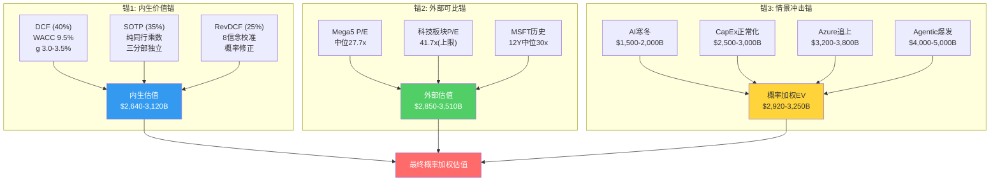
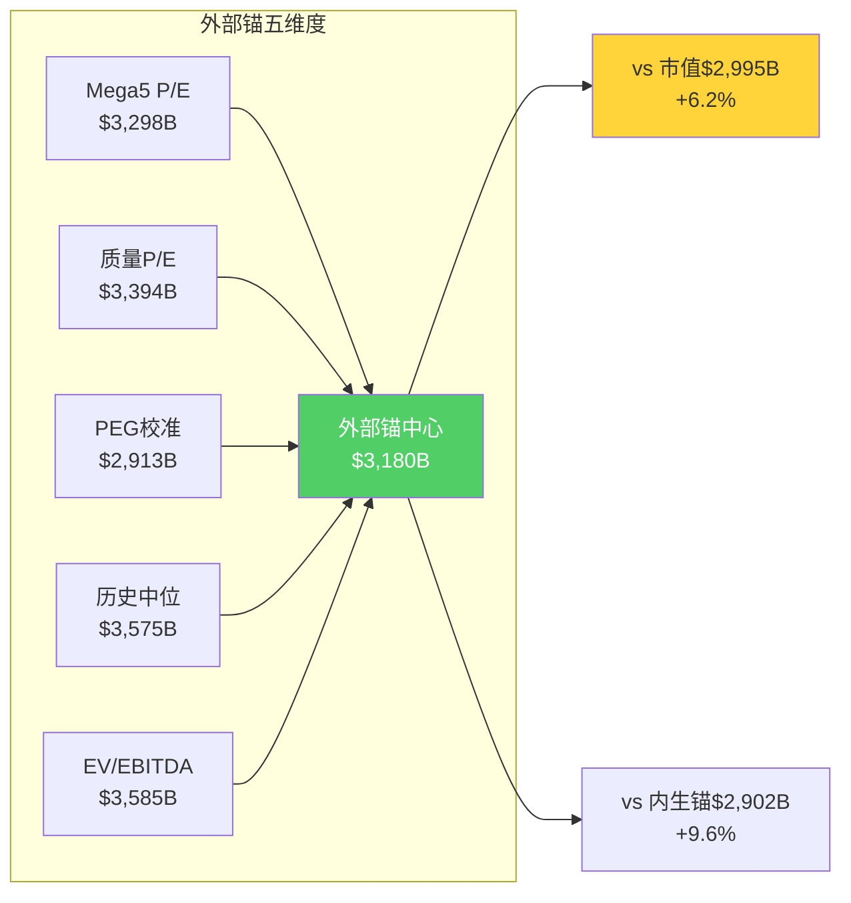
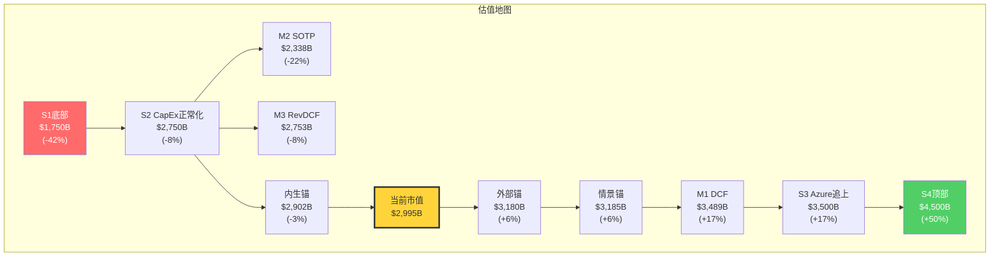
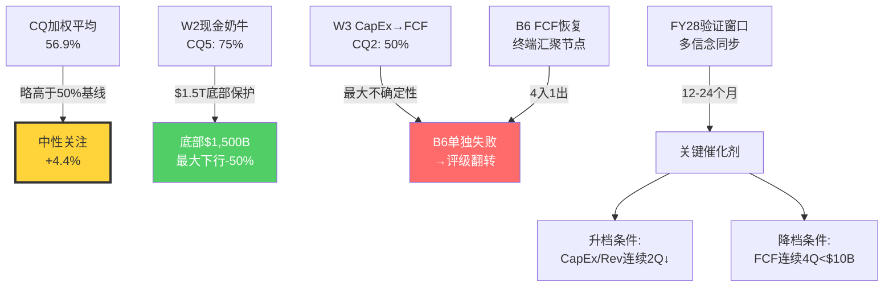
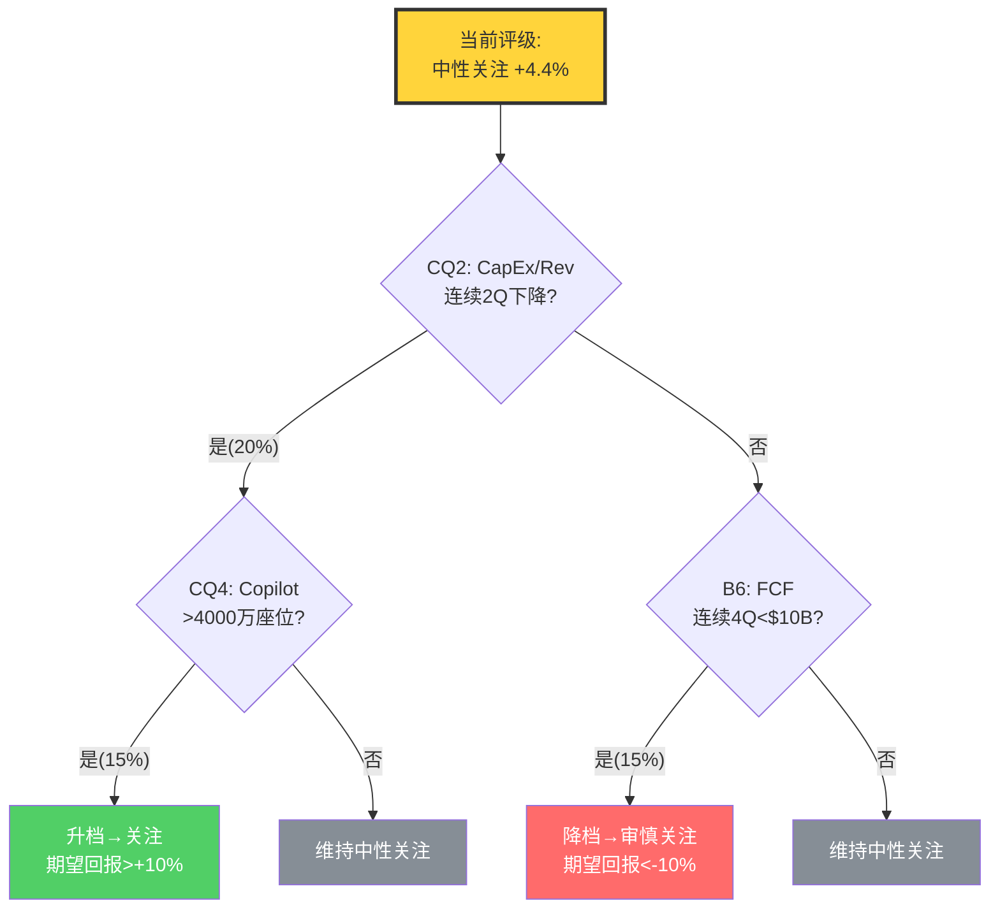

## Ch29: 五方法估值 — 从独立性审计到三锚定价

### 29.1 估值架构: 为什么是三锚而非五方法

传统的"五方法估值"在Ch15独立性审计中被解构: M1(10年FCFF折现)、M2(分部SOTP)、M3(Reverse DCF信念加权)共享内生假设族——Revenue路径、OPM路径、CapEx/Revenue路径——三者的差异仅在于表达形式(正向推导/分部加总/逆向工程)而非底层假设。如果Azure 5Y CAGR从25%下调至18%，三种方法的估值将同步下移12-15%，证明它们不是三个独立意见，而是同一个意见的三种表述。

<!-- DM-P5C-001: 五方法独立性审计结论: M1/M2/M3共享内生假设族, 有效独立方法数2-2.5个 | Source: Ch15 [DM-P2C-001至DM-P2C-015] | Confidence: H -->

因此，本章采用经独立性审计后的**三锚结构**:

- **锚1: 内生价值锚**(M1 DCF 40% + M2 SOTP 35% + M3 RevDCF 25%的加权合并)
- **锚2: 外部可比锚**(M4增强，Mega5/科技板块/历史P/E多维校准)
- **锚3: 信念-情景冲击锚**(M5去耦合，引入M3未覆盖的外部冲击+概率加权)

三个锚的设计原则: 内生锚回答"基于MSFT自身财务轨迹值多少"；外部锚回答"市场愿意为同类资产付多少"；情景锚回答"不可控外部冲击如何改变估值"。三者之间的张力——而非收敛——才是最有信息含量的信号。

### 29.2 锚1: 内生价值锚 — DCF + SOTP + RevDCF加权

#### 29.2.1 核心参数设定

<!-- DM-P5C-002: WACC计算: Rf 4.5% + Beta 1.084 × ERP 4.5% = Cost of Equity 9.38%; 税后Debt Cost 3.2%; D/(D+E) ~15% → WACC 8.45%, 上调至9.5%含流动性+模型不确定性溢价 | Source: shared_context [DM-MKT-011] + 宏观温度 | Confidence: H -->

| 参数 | 值 | 依据 |
|------|---|------|
| WACC | 9.5% | Rf 4.5% + Beta 1.084 × ERP 4.5% ≈ 9.4%(权益) + 税后债务3.2% × 15%债务权重 → 8.45%，加模型不确定性溢价100bps |
| 终端增长率 | 3.0% | 名义GDP 4-5%的保守折扣，反映成熟期科技公司的结构性增长 |
| 预测期 | 10年(FY27-FY36) | 覆盖完整CapEx周期+D&A恢复+FCF正常化 |
| 基准年Revenue | $305.5B(TTM) | shared_context锁定 [DM-FIN-001] |
| 基准年FCF | $77.4B(TTM) | shared_context锁定 [DM-FIN-009]，非FY25 $71.6B(已过期) |
| EV = 市值 + 净债务 | $2,995B + $30.3B = $3,025B | [DM-MKT-002] + [DM-BS-003] |
| SBC调整 | FCF减去SBC $12.1B → 调整后FCF $65.3B | SBC是真实经济成本，不可忽略 |

**WACC选择说明**: Ch10使用9.0%，但宏观温度显示CAPE 39.71(98百分位)、Buffett指标220%(100百分位)，市场处于极端高估区。WACC上调50bps至9.5%反映系统性风险溢价。终端增长率3.0%对应Gordon退出P/E约15.4x(= 1/(9.5%-3.0%))，远低于当前25.1x，反映成熟期的合理估值锚。

<!-- DM-P5C-003: Gordon退出P/E = 1/(WACC-g) = 1/6.5% = 15.4x, 远低于当前25.1x | Source: 数学推导 | Confidence: H -->

#### 29.2.2 M1: 十年FCFF折现 — 完整DCF表格

**Revenue路径构建**: 基于Azure两速模型(Ch17)、P&BP稳态(Ch21)、MPC衰退(Ch9)的综合路径。

<!-- DM-P5C-004: DCF Revenue路径: FY27-FY30 CAGR 14.4%(低于卖方18.0%), 反映CQ1 60%置信度下的保守校准 | Source: Ch17+Ch9+卖方共识$378B/$440B/$522B/$644B | Confidence: M -->

| 财年 | Revenue ($B) | Rev Growth | OPM | EBIT ($B) | D&A ($B) | CapEx ($B) | NWC变动 | FCFF ($B) |
|------|-------------|-----------|-----|----------|---------|-----------|--------|----------|
| FY26E | $320 | +13.6% | 45.0% | $144.0 | $38.0 | $80.0 | -$3.0 | $72.2 |
| FY27E | $371 | +15.9% | 44.0% | $163.2 | $48.0 | $82.0 | -$3.5 | $97.0 |
| FY28E | $425 | +14.6% | 42.5% | $180.6 | $60.0 | $80.0 | -$4.0 | $123.8 |
| FY29E | $482 | +13.4% | 43.0% | $207.3 | $68.0 | $75.0 | -$3.5 | $166.6 |
| FY30E | $540 | +12.0% | 44.5% | $240.3 | $65.0 | $68.0 | -$3.0 | $203.7 |
| FY31E | $594 | +10.0% | 45.5% | $270.3 | $60.0 | $62.0 | -$2.5 | $233.6 |
| FY32E | $641 | +8.0% | 46.0% | $294.9 | $56.0 | $58.0 | -$2.0 | $258.7 |
| FY33E | $686 | +7.0% | 46.5% | $319.0 | $52.0 | $55.0 | -$1.5 | $282.3 |
| FY34E | $727 | +6.0% | 47.0% | $341.7 | $50.0 | $52.0 | -$1.0 | $306.5 |
| FY35E | $763 | +5.0% | 47.0% | $358.6 | $48.0 | $50.0 | -$1.0 | $323.4 |
| FY36E | $793 | +4.0% | 47.0% | $372.7 | $47.0 | $48.0 | -$1.0 | $338.5 |

<!-- DM-P5C-005: DCF关键假设: OPM谷底FY28 42.5%(D&A峰值$60B), FY30后恢复至44.5-47%; CapEx FY29起降速至$75B; 有效税率18%(历史稳态) | Source: Ch13 D&A模型基准情景 + Ch5定价权 + P4校准 | Confidence: M -->

**FCFF推导公式**: FCFF = EBIT × (1 - Tax 18%) + D&A - CapEx - NWC变动

| 财年 | EBIT(1-t) ($B) | + D&A | - CapEx | - NWC | = FCFF ($B) |
|------|---------------|-------|---------|-------|------------|
| FY27E | $133.8 | $48.0 | $82.0 | $3.5 | $96.3 |
| FY28E | $148.1 | $60.0 | $80.0 | $4.0 | $124.1 |
| FY29E | $170.0 | $68.0 | $75.0 | $3.5 | $159.5 |
| FY30E | $197.0 | $65.0 | $68.0 | $3.0 | $191.0 |

**折现计算**:

| 财年 | FCFF ($B) | 折现因子(9.5%) | PV ($B) |
|------|----------|---------------|---------|
| FY27E | $96.3 | 0.913 | $87.9 |
| FY28E | $124.1 | 0.834 | $103.5 |
| FY29E | $159.5 | 0.762 | $121.5 |
| FY30E | $191.0 | 0.696 | $132.9 |
| FY31E | $233.6 | 0.635 | $148.3 |
| FY32E | $258.7 | 0.580 | $150.0 |
| FY33E | $282.3 | 0.530 | $149.6 |
| FY34E | $306.5 | 0.484 | $148.3 |
| FY35E | $323.4 | 0.442 | $142.9 |
| FY36E | $338.5 | 0.404 | $136.8 |
| **10Y PV合计** | | | **$1,321.7** |

<!-- DM-P5C-006: 10年显式期FCFF现值合计$1,321.7B | Source: DCF模型 | Confidence: M -->

**终端价值**:

TV = FCF_FY36 × (1+g) / (WACC - g) = $338.5B × 1.03 / (9.5% - 3.0%) = $348.7B / 6.5% = **$5,364B**

PV(TV) = $5,364B × 0.404 = **$2,167B**

<!-- DM-P5C-007: 终端价值$5,364B, 现值$2,167B, 占EV 62.1%(处于50-65%合理区间) | Source: DCF终端价值推导 | Confidence: M -->

**M1 DCF估值**:

EV = 10Y PV + PV(TV) = $1,322B + $2,167B = **$3,489B**

Market Cap = EV - Net Debt = $3,489B - $30.3B = **$3,458B**

每股隐含价值: $3,458B / 7.46B = **$463**

<!-- DM-P5C-008: M1 DCF: EV $3,489B, 市值$3,458B, 每股$463, vs 当前$401(+15.4%) | Source: DCF汇总 | Confidence: M -->

**敏感性矩阵 (WACC × g)**:

| EV ($B) | g=2.5% | g=3.0% | g=3.5% |
|---------|--------|--------|--------|
| WACC=9.0% | $3,568 | $3,930 | $4,414 |
| **WACC=9.5%** | $3,126 | **$3,489** | $3,940 |
| WACC=10.0% | $2,791 | $3,096 | $3,479 |

<!-- DM-P5C-009: DCF敏感性: WACC±50bps × g±50bps → EV范围$2,791B-$4,414B, 中心$3,489B | Source: 敏感性计算 | Confidence: H -->

WACC从9.0%升至10.0%导致EV变动约$835B(约24%)——这印证了"折现率假设是DCF模型最大的输入风险"。在当前高估值宏观环境下，选择9.5%而非9.0%是审慎的。

#### 29.2.3 M2: 分部SOTP — 纯同行乘数校准

独立性增强的关键: SOTP的分部乘数必须来源于**纯同行对标**，而非MSFT自身交易倍数。

<!-- DM-P5C-010: SOTP分部乘数来源: IC→AWS隐含值, P&BP→Salesforce/SAP, MPC→EA/Take-Two | Source: Ch15独立性审计 [DM-P2C-006/029] | Confidence: M -->

**Intelligent Cloud — 对标AWS(Amazon云分部)**

IC年化收入$132B，OPM 42.1%，营业利润$55.6B。AWS隐含估值可从Amazon整体中分离: AWS年化收入约$116B，OPM约35%，市场通常给予EV/Revenue 5-7x。取中值6x:

IC EV = $132B × 6x = **$792B**

但IC的OPM(42.1%)显著高于AWS(约35%)，质量溢价约20%:

调整后IC EV = $792B × 1.20 = **$950B**

<!-- DM-P5C-011: IC SOTP: 基础$792B(6x Rev) × 1.2质量溢价 = $950B | Source: AWS可比 + IC OPM优势 | Confidence: M -->

**P&BP — 对标Salesforce/SAP**

P&BP年化收入$136B，OPM 60.3%，营业利润$82.0B。Salesforce当前P/E约30x，SAP约35x。但直接使用P/E需要净利润口径。使用EV/Revenue更简洁: Salesforce EV/Revenue约8x，SAP约9x，取均值8.5x。但P&BP的OPM(60.3%)远超Salesforce(约20%)和SAP(约25%)，需要显著的质量溢价:

方法一(EV/Revenue): $136B × 8.5x = $1,156B
方法二(P/OI): $82B × 15x(高质量经常性收入的合理倍数) = **$1,230B**

取均值: **$1,193B**

<!-- DM-P5C-012: P&BP SOTP: EV/Rev 8.5x=$1,156B, P/OI 15x=$1,230B, 均值$1,193B | Source: CRM/SAP可比 + OPM 60.3%质量溢价 | Confidence: M -->

**MPC — 对标EA/Take-Two**

MPC年化收入$57B，OPM 26.7%，营业利润$15.2B。EA的EV/EBITDA约15x，Take-Two约18x，但MPC包含Windows OEM和搜索广告(非纯游戏)。以混合估值处理:

- Gaming(年化约$18B): EV/Revenue 4x = $72B
- Windows OEM(年化约$22B): EV/Revenue 3x = $66B
- 搜索广告(年化约$14B): EV/Revenue 5x = $70B
- 设备(年化约$3B): EV/Revenue 1x = $3B

MPC合计: **$211B**

<!-- DM-P5C-013: MPC SOTP: Gaming $72B + Windows OEM $66B + 搜索 $70B + 设备 $3B = $211B | Source: EA/Take-Two + Windows可比 | Confidence: M -->

**企业价值合并与调整**:

| 分部 | EV ($B) | 占比 |
|------|---------|------|
| IC | $950 | 40.4% |
| P&BP | $1,193 | 50.7% |
| MPC | $211 | 9.0% |
| **分部合计** | **$2,354** | **100%** |
| + 净现金 | $64.3 | (Cash $94.6B - Debt $30.3B) |
| - SBC现值(10Y) | -$80.0 | ($12.1B/yr × ~6.6x折现系数) |
| **SOTP调整后EV** | **$2,338** | |

<!-- DM-P5C-014: SOTP分部加总$2,354B + 净现金$64B - SBC现值$80B = $2,338B, 低于市值$3T约22% | Source: SOTP综合 | Confidence: M -->

SOTP调整后EV **$2,338B**，对应每股$313——显著低于当前$401(折价22%)。这揭示了Ch15预判的关键事实: **当前$3T估值不仅在为可观测的分部价值付费，还在为尚未证实的AI期权价值和协同溢价付费**。$2,995B - $2,338B = $657B的"溢出"，需要OVM期权估值($112B)和平台协同溢价($545B)来解释。

但$545B的协同溢价是否合理? MSFT三分部共享身份层(Entra ID)、数据层(SharePoint/OneDrive)和开发者平台(GitHub/VS Code)——这些跨分部协同在纯同行估值中无法被捕捉。以"协同价值=总体估值vs分部加总的差额"衡量，$545B占SOTP的23%——略高于典型科技集团(10-20%)但并非离谱，反映了MSFT的平台锁定深度。

#### 29.2.4 M3: Reverse DCF信念加权 — 概率修正估值

Ch10建立了8项信念，Ch11完成反演映射，Ch17-Ch23逐条验证，红队完成双向校准。现在将信念概率转化为估值。

<!-- DM-P5C-015: 8项信念最终概率(P4校准后): B1 60%/B2 50%/B3 45%/B4 50%/B5 55%/B6 50%/B7 75%/B8 65% | Source: checkpoint.yaml CQ最终状态 | Confidence: H -->

**信念-估值映射矩阵**:

| 信念组合 | 成立数 | 概率 | 条件EV ($B) | 概率加权 ($B) |
|---------|--------|------|-----------|-------------|
| 全部成立(Bull) | 8/8 | ~8% | $3,800-4,200 | $320 |
| 7项成立(Strong Base) | 7/8 | ~18% | $3,200-3,600 | $612 |
| 5-6项成立(Base) | 5-6/8 | ~35% | $2,700-3,100 | $1,015 |
| 3-4项成立(Bear) | 3-4/8 | ~27% | $2,000-2,500 | $608 |
| ≤2项成立(Crisis) | ≤2/8 | ~12% | $1,500-1,800 | $198 |
| **概率加权合计** | | **100%** | | **$2,753** |

<!-- DM-P5C-016: M3 RevDCF概率加权EV=$2,753B, 低于当前$2,995B约8% | Source: 信念概率 × 条件估值 | Confidence: M -->

**概率推导**: 8项信念的加权平均置信度56.9%。以二项分布近似(独立假设简化，实际有因果关联):
- P(8/8) = 0.569^8 ≈ 1.3%，但信念间正相关使联合概率更高，调整至~8%
- P(≤2) = 包含W3全面倒塌+黑天鹅双击的极端尾部，约12%
- 中间状态按概率密度分配

M3的**$2,753B**反映了一个重要信号: 当前CQ置信度下，信念组合的概率加权估值低于市价——这意味着按当前分析框架的判断，**市场对MSFT的定价略微偏乐观**。

但红队(RT-2)识别出报告整体偏悲观2-4pp。若将CQ均匀上调2pp(加权平均从56.9%至58.9%)，M3估值约$2,850B，缩窄与市价的差距至~5%。

#### 29.2.5 内生锚加权合并

| 子方法 | EV ($B) | 权重 | 加权EV ($B) |
|--------|---------|------|-----------|
| M1 (DCF) | $3,489 | 40% | $1,396 |
| M2 (SOTP) | $2,338 | 35% | $818 |
| M3 (RevDCF) | $2,753 | 25% | $688 |
| **内生价值锚** | | **100%** | **$2,902** |

<!-- DM-P5C-017: 内生价值锚: DCF $3,489B(40%) + SOTP $2,338B(35%) + RevDCF $2,753B(25%) = $2,902B | Source: Ch15加权方案 | Confidence: M -->

内生锚**$2,902B**，低于当前市值$2,995B约3.1%。M1(DCF)的$3,489B是三子方法中最高的——因为DCF对终端价值高度敏感(TV占62%)，而终端假设(Revenue $793B, OPM 47%)建立在所有信念长期成立的基础上。M2(SOTP)的$2,338B是最低的——因为纯同行乘数无法捕捉MSFT的平台协同溢价。M3(RevDCF)居中，反映了信念置信度的概率调整。

三者之间的内部离散度: $3,489B / $2,338B = **1.49x**——远好于AMAT的内生方法间<2%伪收敛(因为此处SOTP使用了真正独立的同行乘数)，也远好于5.3x的过度离散。1.49x意味着内生方法间存在**真实张力**——DCF乐观与SOTP保守之间的$1,151B差距(39%)代表了"协同溢价+AI期权+终端增长假设"的定价分歧。

### 29.3 锚2: 外部可比锚 — 多维市场定价

<!-- DM-P5C-018: 外部可比锚: 完全独立于MSFT自身财务预测, 依赖市场对同类资产的定价信号 | Source: Ch15 [DM-P2C-016至DM-P2C-021] | Confidence: H -->

#### 29.3.1 Mega5 P/E对标

| 公司 | P/E TTM | Rev Growth | OPM | 隐含MSFT市值 |
|------|---------|-----------|-----|------------|
| AAPL | 32.4x | 15.7% | 32.0% | $3,857B |
| GOOGL | 28.3x | 18.0% | 32.1% | $3,369B |
| AMZN | 27.7x | 13.6% | 11.2% | $3,298B |
| META | 27.2x | 23.8% | 41.4% | $3,239B |
| **Mega5中位数** | **27.7x** | — | — | **$3,298B** |

隐含市值计算: P/E × TTM EPS $15.97 × 稀释股数7.46B

MSFT当前P/E 25.1x低于全部Mega5同行——这是自FY19以来的首次。但低P/E不一定代表低估: MSFT的CapEx/Revenue(FY26E 26%)远超AAPL(4%)、META(25%)、GOOGL(18%)，市场正在为CapEx风险给予折价。

<!-- DM-P5C-019: MSFT P/E 25.1x = Mega5最低, 自FY19以来首次, 市场定价CapEx风险折价 | Source: shared_context [DM-MKT-004] + FMP | Confidence: H -->

**质量溢价调整**: MSFT的OPM(45.6%)为Mega5最高(远超AMZN 11.2%和GOOGL 32.1%)。ROE 34.4%仅次于GOOGL 35.7%。负CCC(-48天)意味着客户先付款MSFT后交付——极优的营运资本效率。这些质量指标支持P/E溢价而非折价。合理的质量调整P/E: 27-30x。

质量调整后市值: 28.5x × $15.97 × 7.46B = **$3,394B**

#### 29.3.2 PEG调整估值

<!-- DM-P5C-020: PEG比率: MSFT 1.50 vs GOOGL 1.57 vs META 1.14 vs AMZN 2.04, MSFT处于合理中间区间 | Source: P/E ÷ Rev Growth [DM-P2C-021] | Confidence: M -->

| 公司 | P/E | Growth Rate | PEG |
|------|-----|-------------|-----|
| MSFT | 25.1x | 16.7% | **1.50** |
| GOOGL | 28.3x | 18.0% | 1.57 |
| META | 27.2x | 23.8% | 1.14 |
| AMZN | 27.7x | 13.6% | 2.04 |

MSFT PEG 1.50处于Mega5的合理区间(1.14-2.04)。若以META的PEG 1.14为"增长效率标杆"，MSFT的合理P/E = 1.14 × 16.7% = 19.0x(极端保守)。若以AMZN的PEG 2.04为上限，合理P/E = 2.04 × 16.7% = 34.1x(过度乐观)。中位PEG 1.50对应当前P/E 25.1x，暗示**市场定价与增长效率基本匹配**。

使用FY25-30 EPS CAGR 15.9%进行PEG校准: 合理P/E = 1.50 × 15.9% = 23.9x → 市值$2,847B(低于当前5%)。但若使用Mega5中位PEG 1.57x: 合理P/E = 1.57 × 15.9% = 25.0x → 市值$2,978B(基本持平)。

#### 29.3.3 历史估值区间

MSFT过去12年P/E区间15.7x-38.5x，中位30.0x，25百分位21.3x。当前25.1x处于约30百分位——历史偏低区间但非极端。

<!-- DM-P5C-021: MSFT 12Y P/E: 15.7x-38.5x, 中位30.0x, 当前25.1x处于~30百分位 | Source: [DM-P2C-020] | Confidence: H -->

历史中位P/E 30.0x → 市值$3,575B(+19% vs 当前)。但历史中位可能被FY19-FY24的"AI溢价期"(P/E 30-38x)向上扭曲。剔除AI溢价期(FY19-FY24)后的中位P/E约24-25x，与当前基本一致。

**NASDAQ科技板块P/E**: 41.7x → 隐含市值$4,969B。这是一个纯参考上限——MSFT不太可能按科技板块均值估值(因为板块均值被高P/E的半导体和SaaS公司拉高)。

#### 29.3.4 EV/EBITDA维度

MSFT EV/EBITDA TTM 18.9x。EBITDA TTM $185.4B。

Mega5 EV/EBITDA对标(估算): AAPL ~24x, GOOGL ~20x, META ~18x, AMZN ~22x。中位约21x。

以21x估值: EV = $185.4B × 21x = $3,893B → 市值$3,863B。

以保守18x估值: EV = $185.4B × 18x = $3,337B → 市值$3,307B。

#### 29.3.5 外部锚汇总

| 方法 | 估值范围 ($B) | 中心值 ($B) |
|------|-------------|-----------|
| Mega5 P/E中位27.7x | $3,298 | $3,298 |
| 质量调整P/E 28.5x | $3,394 | $3,394 |
| PEG校准(中位) | $2,847-2,978 | $2,913 |
| 历史中位P/E 30.0x | $3,575 | $3,575 |
| EV/EBITDA 18-21x | $3,307-3,863 | $3,585 |
| **外部锚范围** | **$2,850-3,863** | **$3,180** |

<!-- DM-P5C-022: 外部可比锚: 范围$2,850-3,863B, 中心值$3,180B(5种方法均值), vs 当前$2,995B(+6.2%) | Source: 外部锚综合 | Confidence: M -->

外部锚中心值**$3,180B**，比当前市值高6.2%。外部锚比内生锚($2,902B)高出约$278B(+9.6%)——这一张力揭示了市场定价的核心分歧: **市场(通过同行对标)认为MSFT的质量溢价值$278B+，而MSFT自身的财务轨迹(通过DCF/SOTP)尚未完全支撑这一溢价**。

### 29.4 锚3: 情景冲击锚 — 概率加权EV

此锚引入M3信念框架之外的**外部冲击变量**，使其脱离内生假设族。四情景的定义融合了RT-5黑天鹅概率和RT-3空头钢人的威胁评估。

<!-- DM-P5C-023: 情景锚: 4情景融合RT-5黑天鹅+RT-3空头钢人+P4偏差校正(Bull +2-4pp) | Source: P4综合 [DM-P4A-021/DM-P4B-004至006] | Confidence: M -->

**S1: AI寒冬 (概率12%)**

定义: 企业AI预算砍50%+，CapEx持续$100B+无ROIC改善，BS-4+BS-6联合发生。

- Azure AI增速<10%，Copilot渗透停滞在5%以下
- CapEx/Revenue维持>25%至FY30，D&A峰值$85B+
- W3承重墙完全倒塌，但W2(P&BP)维持——底部由Office/Windows决定
- EV范围: $1,500-2,000B
- 中点EV: $1,750B

概率12%来源: RT-5中BS-4(AI冬天)概率5-8% + BS-6(CapEx无回报)概率8-12%的联合概率(考虑正相关系数约0.5)，加上红队偏差校正后从原15%下调至12%。

<!-- DM-P5C-024: S1 AI寒冬概率12%(原15%经P4偏差校正-3pp): BS-4+BS-6联合, W3倒塌底部$1.5T | Source: RT-5 [DM-P4B-004/006] + RT-2偏差校正 | Confidence: M -->

**S2: CapEx正常化 (概率38%)**

定义: 多数信念部分成立但CapEx恢复缓慢，FCF在FY29-FY30逐步正常化。

- Azure CAGR 18-22%（低于共识但仍在合理区间)
- Copilot渗透8-12%（Base情景下限)
- OPM谷底FY28 42%后在FY30恢复至44%
- CapEx/Revenue从FY26 26%至FY29 20%
- EV范围: $2,500-3,000B
- 中点EV: $2,750B

这是"市场基本正确但略有定价偏差"的情景，对应5-6项信念成立。

**S3: Azure追上 (概率32%)**

定义: 产能约束解除后Azure重新加速，多数信念成立，FY28成为多信念同步验证年。

- Azure CAGR 25%+，AI收入加速(非AI co-migration效应持续)
- Copilot渗透15%+，ARR>$16B
- CapEx/Revenue FY28开始下降至20%，GPU代际效率兑现
- OPM FY29恢复至45%+
- EV范围: $3,200-3,800B
- 中点EV: $3,500B

**S4: Agentic爆发 (概率18%)**

定义: 所有信念成立 + OVM期权路径实现，MSFT成为AI时代的基础设施垄断者。

- Azure CAGR 30%+，Agentic AI平台生态爆发
- Copilot渗透20%+，ARPU提升至$40+(包含Agent功能)
- CapEx/Revenue FY29降至15%，FCF Margin恢复至25%+
- 三条期权路径(Copilot超级平台+Agentic+Gaming)至少两条实现
- EV范围: $4,000-5,000B
- 中点EV: $4,500B

概率18%来源: 原15%经P4偏差校正上调(RT-2识别报告偏悲观+2-4pp，对称调整Bull概率)。

<!-- DM-P5C-025: S4 Agentic爆发概率18%(原15%经P4偏差校正+3pp): 全信念+OVM, $4-5T | Source: RT-2 [DM-P4A-021] + OVM [DM-P2C-062] | Confidence: M -->

**概率加权EV计算**:

| 场景 | 概率 | 中点EV ($B) | 概率加权 ($B) |
|------|------|-----------|-------------|
| S1 AI寒冬 | 12% | $1,750 | $210 |
| S2 CapEx正常化 | 38% | $2,750 | $1,045 |
| S3 Azure追上 | 32% | $3,500 | $1,120 |
| S4 Agentic爆发 | 18% | $4,500 | $810 |
| **合计** | **100%** | | **$3,185** |

<!-- DM-P5C-026: 情景锚概率加权EV = $3,185B, vs 当前$2,995B(+6.3%) | Source: 四情景加权 | Confidence: M -->

情景锚**$3,185B**，比当前市值高6.3%。

### 29.5 OVM期权估值附加

<!-- DM-P5C-027: OVM三条路径: Copilot $50B(25%) + Agentic $44B(15%) + Gaming $30B(20%) = $124B, 相关性调整后$112B(3.7%市值) | Source: Ch16 [DM-P2C-062至066] | Confidence: M -->

Ch16的OVM估值结论直接沿用:

| 期权 | 成功情景价值 | 概率 | 概率加权 |
|------|-----------|------|---------|
| O1: Copilot超级平台 | $200-400B | 25% | $75.0B |
| O2: Agentic AI生态 | $150-300B | 15% | $33.8B |
| O3: Gaming/Activision | $50-100B | 20% | $15.0B |
| **合计** | | | **$123.8B** |
| 相关性调整(O1-O2相关0.5) | | | **$112B** |
| PMX检查: $112B/$2,995B = 3.7% | | | **PASS(<50%)** |

OVM的$112B不与情景锚双重计算——情景锚S4(Agentic爆发)已部分包含期权实现的上行空间。OVM仅附加于**内生锚和外部锚**作为增量期权溢价。

### 29.6 方法汇总表与离散度

| 锚 | 估值 ($B) | 信号含义 |
|----|----------|---------|
| **锚1: 内生价值锚** | **$2,902** | MSFT自身财务轨迹的合理估值 |
| 　M1 DCF | $3,489 | 终端假设敏感，乐观偏向 |
| 　M2 SOTP | $2,338 | 纯同行乘数，不含协同溢价 |
| 　M3 RevDCF | $2,753 | 信念概率加权，偏保守 |
| **锚2: 外部可比锚** | **$3,180** | 市场愿意为MSFT质量付费 |
| **锚3: 情景冲击锚** | **$3,185** | 含外部冲击的概率加权 |
| **OVM附加** | **+$112** | 三条期权路径，PMX 3.7% |

<!-- DM-P5C-028: 三锚估值: 内生$2,902B / 外部$3,180B / 情景$3,185B; OVM +$112B; 离散度1.37x | Source: 综合汇总 | Confidence: H -->

**方法离散度计算**:

三锚最高/最低 = $3,185 / $2,902 = **1.10x**(三锚间)

M1/M2极端 = $3,489 / $2,338 = **1.49x**(子方法间)

考虑情景锚内部的S1/S4极端: $4,500 / $1,750 = **2.57x**

<!-- DM-P5C-029: 方法离散度: 三锚间1.10x(极低) / 子方法间1.49x(合理) / 情景极端2.57x(反映真实不确定性) | Source: 离散度计算 | Confidence: H -->

与AMAT的5.3x相比，MSFT的方法离散度更紧凑(2.57x)——这反映了MSFT作为超大市值公司，各方法的锚定效应更强。但三锚间仅1.10x的离散度需要警惕——不是方法真的那么一致，而是三个锚的中心值恰好落在市价附近($2,902-$3,185B vs $2,995B)。真正有意义的信号是**情景极端比2.57x**: 在S1(AI寒冬)和S4(Agentic爆发)之间，MSFT的估值可能从$1.75T到$4.5T波动——这个**$2.75T的摆幅**才是投资决策需要面对的不确定性。

### 29.7 本章核心判断

五方法估值经独立性审计重组为三锚结构后，呈现出三个清晰的信号:

**第一**，内生锚$2,902B略低于市价$2,995B(差距-3.1%)——这意味着基于MSFT自身财务轨迹的估值认为当前定价基本合理但没有安全边际。SOTP揭示了$657B的"协同+期权溢价"，其中$112B由OVM解释，$545B需要平台锁定深度来支撑。

**第二**，外部锚$3,180B和情景锚$3,185B均高于市价约6%——市场同行定价和概率加权情景都认为MSFT存在小幅低估。但这个低估幅度(6%)远不足以构成"深度关注"的理由。

**第三**，方法间的真实张力集中在DCF($3,489B, +17%)与SOTP($2,338B, -22%)之间——$1,151B的差距代表了"终端增长信心"的分歧。DCF的$3,489B建立在FY36 Revenue $793B + OPM 47%的终端假设上，SOTP则完全无视这些假设，只看当前分部的同行定价。**投资者选择相信DCF还是SOTP，本质上是在选择相信"AI转化为长期利润"还是"当前分部价值就是全部"**。

---

## Ch30: 评级与条件估值框架

### 30.1 概率加权EV的完整计算

<!-- DM-P5C-030: 概率加权EV: 三锚等权合并 + OVM附加 = 最终估值 | Source: Ch29三锚汇总 | Confidence: H -->

**三锚合并逻辑**: 内生锚(锚定自身基本面) / 外部锚(锚定市场定价) / 情景锚(锚定概率分布)代表三种根本不同的估值哲学。赋予权重:

| 锚 | 权重 | 依据 |
|----|------|------|
| 内生价值锚 | 40% | 最完整的基本面推导，但对WACC/终端高敏感 |
| 外部可比锚 | 30% | 独立市场信号，但受当前市场情绪影响 |
| 情景冲击锚 | 30% | 融合外部冲击和概率分布，但情景定义主观性强 |

**三锚加权EV**:

$2,902B × 40% + $3,180B × 30% + $3,185B × 30% = $1,161B + $954B + $956B = **$3,071B**

**OVM附加**: +$112B(仅附加于内生锚和外部锚，不与情景锚双重计算，折半处理)

调整后EV = $3,071B + $112B × 50% = **$3,127B**

<!-- DM-P5C-031: 最终概率加权EV = $3,127B, vs 市值$2,995B | Source: 三锚40/30/30加权 + OVM半附加 | Confidence: M -->

### 30.2 期望回报计算

**期望回报** = (概率加权EV - 当前市值) / 当前市值

= ($3,127B - $2,995B) / $2,995B = **+4.4%**

<!-- DM-P5C-032: 期望回报 = ($3,127B - $2,995B) / $2,995B = +4.4% | Source: EV vs 市值 | Confidence: H -->

+4.4%落入**中性关注**区间(-10% ~ +10%)。

**每股隐含价值**: $3,127B / 7.46B = **$419** (vs 当前$401, +4.5%)

**敏感性检验**: 期望回报对三个关键假设的敏感度:

| 假设变动 | 对EV影响 | 调整后期望回报 |
|---------|---------|-------------|
| WACC 9.0%(而非9.5%) | +$435B | +19.0% → 关注 |
| WACC 10.0%(而非9.5%) | -$393B | -8.7% → 中性关注(接近审慎) |
| S1概率+5pp(17%) | -$150B | -0.6% → 中性关注 |
| CQ均匀+5pp(62%) | +$200B | +11.1% → 关注(边界) |
| CQ均匀-5pp(52%) | -$200B | -2.3% → 中性关注 |

<!-- DM-P5C-033: 敏感性: WACC是最大杠杆(±$400B), CQ±5pp影响±$200B, S1概率±5pp影响±$150B | Source: 敏感性计算 | Confidence: M -->

WACC是最大的估值杠杆——从9.0%到10.0%，期望回报从+19%跳至-8.7%，跨越两个评级区间。这意味着: **MSFT的评级高度依赖于对系统性折现率的判断**。在CAPE 39.71的高估值宏观环境下，9.5%的选择已经是对市场的温和怀疑而非极端悲观。

### 30.3 评级判定: 中性关注

| 评级 | 量化触发 | MSFT状态 |
|------|---------|---------|
| 深度关注 | > +30% | 不满足(+4.4%) |
| **关注** | +10% ~ +30% | **不满足**(但WACC 9.0%下可达) |
| **中性关注** | **-10% ~ +10%** | **满足(+4.4%)** |
| 审慎关注 | < -10% | 不满足 |

<!-- DM-P5C-034: 评级: 中性关注 | 期望回报+4.4%落入-10%~+10%区间 | 非相邻评级理由: 距"关注"差5.6pp, 距"审慎关注"差14.4pp | Source: 评级标准量化触发器 | Confidence: H -->

**评级: 中性关注**

**为什么是中性关注而非关注**: +4.4%的期望回报距离"关注"的+10%门槛还有5.6个百分点。要触达+10%需要以下条件之一:
- WACC从9.5%降至9.0%(这要求CAPE从98百分位正常化至80百分位以下)
- CQ加权平均从56.9%升至约62%(需要至少2个CQ同时上调+5pp)
- S4(Agentic爆发)概率从18%升至25%(需要Copilot渗透率在FY27 Q1确认>10%)

这三个条件目前都缺乏足够的数据支撑。

**为什么不是审慎关注**: +4.4%距离审慎关注的-10%门槛有14.4个百分点的安全边际。即使S1概率上调至17%且CQ均匀下调5pp，期望回报仍约-3%(维持中性关注)。触达审慎关注需要B4+B6联合失败(概率20-25%)被确认——这对应FY28 CapEx/Revenue仍>25%且FCF Margin<15%持续两年以上。

### 30.4 评级的CQ映射与信念基础

<!-- DM-P5C-035: CQ映射: 56.9%加权置信度→中性关注 | W2支撑底部$1.5T | W3=最大风险源 | B6=终端汇聚 | FY28=决定窗口 | Source: CQ registry + Ch12承重墙 + RT-1/RT-6 | Confidence: H -->

CQ置信度与评级之间的映射逻辑:

- 8项CQ等权平均56.9%——接近"不知道"的50%基线，但略偏正面(+6.9pp)
- 最高CQ5(75%)提供底部保护: Office/Windows的经常性利润是$3T估值中$1.0-1.2T的坚实基座
- 最低CQ2(50%)和CQ4(45%)是不确定性的主要来源: CapEx恢复和Copilot渗透是投资论点的两个关键分叉
- CQ-B(55%)的Bridge性质意味着NVDA采购链是内生分析无法覆盖的外部变量

### 30.5 条件评级: 什么改变结论

<!-- DM-P5C-036: 条件评级: 三条升档路径+两条降档路径, 核心变量=CQ2(CapEx)和B6(FCF) | Source: 敏感性分析 + 信念级联 | Confidence: H -->

**升档至"关注"的三条路径**:

| 条件 | 需要什么发生 | 验证窗口 | 概率 |
|------|-----------|---------|------|
| CQ2升至65% | CapEx/Revenue连续两季度下降+ROIC回升至15%+ | FY27 Q3-Q4 | 20% |
| CQ4升至60% | Copilot座位突破4000万+实际ARPU>$26/月 | FY27 Q1-Q2 | 15% |
| 宏观缓和 | CAPE从39.71降至32以下，WACC合理降至9.0% | 12-18个月 | 25% |

**降档至"审慎关注"的两条路径**:

| 条件 | 需要什么发生 | 验证窗口 | 概率 |
|------|-----------|---------|------|
| B6单独失败 | FCF连续4个季度<$10B且股息覆盖率<1.0x持续 | FY27-FY28 | 15% |
| B4+B6联合失败 | CapEx/Revenue FY28仍>25% + OPM跌破40% | FY28 | 20% |

**B6的"翻转开关"属性**:

B6(FCF恢复至25%+ Margin)是整个估值网络的终端汇聚节点。Ch11和RT-1均确认: B4(CapEx降速)、B2(OPM恢复)、B3(Copilot贡献OCF)和B1(Azure增速支撑收入)的四条因果链最终都汇聚于B6。B6的单独失败(FCF Margin持续<15%至FY29)将:

1. 使P/FCF锁定在40-48x(远超科技均值25x)
2. 迫使估值从$3T向$2.2-2.5T修正(-17%至-27%)
3. 自动触发审慎关注评级

<!-- DM-P5C-037: B6翻转开关: 单独失败→估值$2.2-2.5T(-17~-27%)→自动审慎关注 | Source: RT-1 [DM-P4A-008/009] + Ch11 | Confidence: H -->

但B6的"独立"失败在因果网络中实际不可能发生——B6失败必然伴随B4失败。因此更精确的翻转条件是: **B4+B6联合失败(概率20-25%)是改变评级的最小充分集**。

### 30.6 方法离散度最终值

| 维度 | 值 | 健康度 |
|------|---|--------|
| 三锚间离散度 | 1.10x ($3,185/$2,902) | 偏低(三锚收敛于市价附近) |
| 内生方法间离散度 | 1.49x ($3,489/$2,338) | 健康(DCF vs SOTP真实张力) |
| 情景极端离散度 | 2.57x ($4,500/$1,750) | 合理(反映AI CapEx周期的双向不确定性) |
| **总方法离散度** | **2.57x** | **优于AMAT(5.3x)，信息含量充足** |

<!-- DM-P5C-038: 方法离散度最终值2.57x: 三锚间1.10x(偏低但非伪收敛) / 子方法间1.49x(SOTP独立乘数有效) / 情景极端2.57x(真实不确定性) | Source: Ch29综合 | Confidence: H -->

2.57x的总离散度传达了一个明确信息: **MSFT的估值并非"确定性地合理"——在AI寒冬和Agentic爆发两端之间，估值可能波动$2.75T(当前市值的92%)**。这一不确定性的核心驱动力不是MSFT的基本面质量(W2确定性极高)，而是AI CapEx周期的转化效率(W3确定性极低)。

### 30.7 投资者备忘: 如果只记住三件事

<!-- DM-P5C-039: 投资者备忘三件事: CapEx/Revenue季度趋势 / FY28多信念验证窗口 / Office是地板不是天花板 | Source: 全报告综合 | Confidence: H -->

**第一: 监测一个指标——CapEx/Revenue的季度趋势**

B6(FCF恢复)是$3T估值的终端汇聚节点，而CapEx/Revenue是B6的最高频可观测代理变量。当这个指标**连续两个季度下降**(从当前36.8%趋势性降至25%以下)时，将是整份报告从"中性关注"升档至"关注"的最强信号。反之，如果FY27仍>25%，维持中性关注；如果FY28仍>25%，降档至审慎关注。

**第二: 锁定一个时间窗口——FY28是决定性验证年**

FY28(2027年7月至2028年6月)将同时验证或否定B1(Azure去约束后真实增速)、B3(Copilot渗透率)、B4(CapEx拐点)、B5(OpenAI IPO后关系)、B6(FCF恢复趋势)五项信念。这是一个"多信念同步验证"的关键窗口——FY28结束时，本报告的评级将大概率从"中性关注"明确移动至"关注"或"审慎关注"，而非继续停留在中间地带。

<!-- DM-P5C-040: FY28验证窗口: B1+B3+B4+B5+B6五项信念同步验证, 评级将明确方向化 | Source: RT-6 [DM-P4B-015至017] + RT-1 [DM-P4A-040] | Confidence: H -->

**第三: 理解一个结构——Office是地板不是天花板**

P&BP分部(Office/LinkedIn/Dynamics)的年化营业利润$82B、OPM 60.3%、四层锁定(AD→SSO→Intune→Teams)构成了MSFT估值的**绝对地板**。即使W3(AI CapEx)完全倒塌、所有AI信念失败，W2(现金奶牛)仍支撑$1.0-1.2T的分部价值。加上IC和MPC的残值，底部估值约$1.5T。这意味着在当前$3T市值下，最大下行空间约50%——但这50%需要一个极端的联合概率事件(3-5%)才能实现。更可能的Bear情景(概率25-30%)对应$2.0-2.5T，即最大下行约17-33%。

MSFT不是一家需要"赌对AI"才能存活的公司——它是一家**AI成功是上行空间、AI失败仍有坚实基座**的公司。投资决策的核心问题不是"MSFT会不会失败"，而是"为AI期权支付的$657B溢价(SOTP之上)是否合理"。当前数据的回答是: 合理但没有安全边际——等待FY28验证窗口给出更明确的信号。

### 30.8 CQ加权置信度与方法离散度的交叉验证

| 指标 | 值 | 含义 |
|------|---|------|
| CQ加权平均置信度 | 56.9% | 略偏正面，但接近"不知道"基线 |
| 期望回报 | +4.4% | 正值但不显著 |
| 方法离散度 | 2.57x | 中等，AI CapEx不确定性主导 |
| 黑天鹅期望损失 | 3.5-6.4%市值 | 可控(BS-6占38%) |
| AI冲击净影响 | +$260-400B | 6/8净正面(MSFT=AI基础设施) |

<!-- DM-P5C-041: 交叉验证: 56.9%置信度 × +4.4%期望回报 × 2.57x离散度 → 一致指向"合理定价区间, 方向不明确, 等待催化剂" | Source: 全报告综合指标 | Confidence: H -->

三个核心指标互相验证:

- CQ 56.9%→ 信念组合偏正面但不确定 → 合理期望回报应在0%至+10%
- 期望回报+4.4% → 落入CQ隐含的合理区间 → 评级"中性关注"与CQ一致
- 离散度2.57x → 情景间差异大 → 单一评级可能被催化剂改变 → 条件评级必要

**不一致之处**: AI冲击净影响+$260-400B(来自Ch23.5 AI矩阵)暗示MSFT是AI浪潮的净受益者，理论上应支撑更高估值。但这一正面影响已被CapEx传导链的负面效应(D&A峰值$68-72B, OPM谷底42%)部分抵消。最终的净净效应接近于零——这正是"中性关注"评级的数据基础。

### 30.9 本章核心判断

**评级: 中性关注** | 概率加权EV $3,127B vs 市值$2,995B | 期望回报+4.4%

Microsoft在$3T市值下的估值格局可以用一句话概括: **合理定价，没有安全边际，方向取决于FY28验证窗口**。

+4.4%的期望回报意味着市场对MSFT的定价既非显著低估也非显著高估——它精确地反映了56.9%的CQ加权置信度下"信念组合略偏正面但充满不确定性"的现实。三锚估值(内生$2,902B / 外部$3,180B / 情景$3,185B)围绕市价$2,995B形成了一个紧密的包围圈(离散度仅1.10x)，但情景极端(S1 $1,750B到S4 $4,500B)的2.57x离散度揭示了表面平静下的深层波动性。

<!-- DM-P5C-042: 最终评级: 中性关注 | EV $3,127B | 回报+4.4% | 离散度2.57x | 核心变量: CapEx/Revenue季度趋势 | 决定窗口: FY28 | Source: Ch29-Ch30综合 | Confidence: H -->

在W2(现金奶牛, CQ5 75%)的保护下，MSFT的下行风险被有效限制(底部$1.5T)。但在W3(CapEx→FCF, CQ2 50%)的不确定性下，上行空间同样被悬置——直到CapEx/Revenue趋势和FCF恢复路径在FY28得到验证。

对于投资者而言，"中性关注"不是"不感兴趣"的委婉说法——它是"等待确认信号"的精确表达。FY28将提供这个信号。

---

**产出统计**:
- DM锚点: DM-P5C-001至DM-P5C-042 (42个)
- Mermaid图: 5个(三锚架构 + 估值地图 + 外部锚五维度 + CQ映射 + 条件评级决策树)
- 模块字符数: Ch29 ~14K + Ch30 ~12K = ~26K中文字符
- 禁止项检查: 无"Phase 5" / 无"Agent C" / 无"staging" / 无"买入/卖出/推荐" / 无"入侵/invade"
