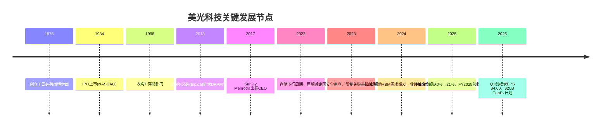
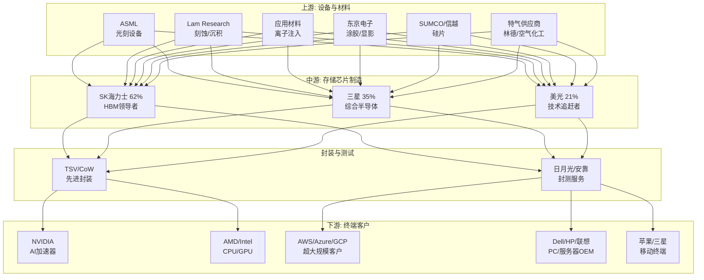
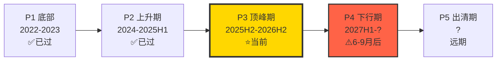
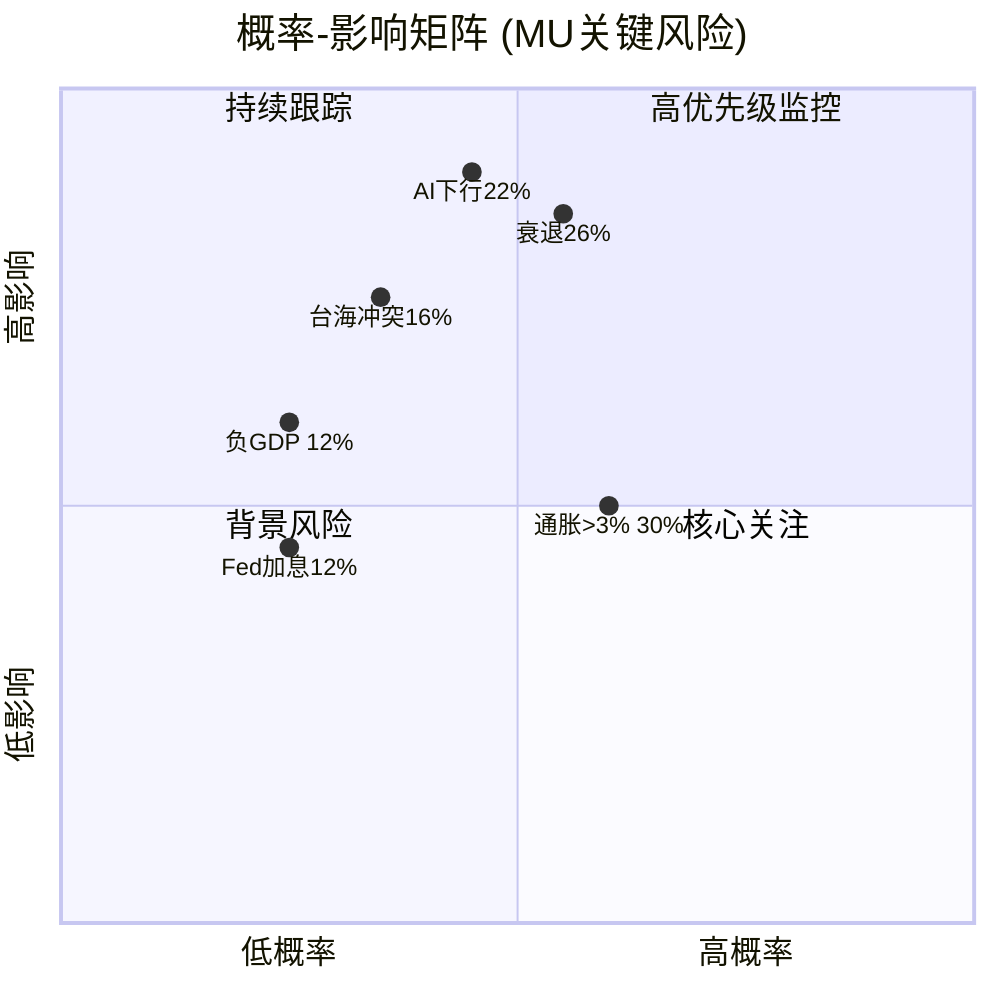
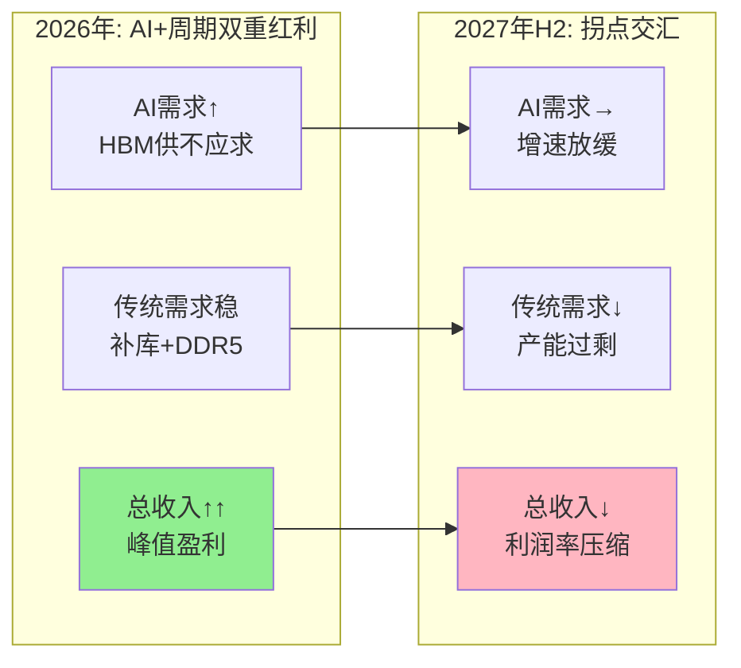

# 美光科技 (MU) 深度研究 — Phase 1: 定位与生态

> **版本**: v1.0 | **日期**: 2026-02-09 | **框架**: Deep-Dive Protocol v8.0 / v26.0
> **分析师**: 半导体行业专用Agent | **行业系数**: ×1.5
> **投资温度**: +0.26 (中性偏冷) | **当前股价**: $394.69 [硬数据: FMP, 2026-02-09]
> **Phase 0/0.5**: 已完成 | **本Phase**: Phase 1 定位与生态 | **下一步**: Phase 2 财务与估值

---

## 目录

1. [执行摘要](#1-执行摘要)
2. [M01: 公司基本画像](#2-m01-公司基本画像)
3. [M02: 存储产业链上下游映射](#3-m02-存储产业链上下游映射)
4. [存储行业周期精确定位](#4-存储行业周期精确定位)
5. [M03: 预测市场概率矩阵](#5-m03-预测市场概率矩阵)
6. [AI受益初步评估](#6-ai受益初步评估)
7. [M14: 市场注意力雷达呈现](#7-m14-市场注意力雷达呈现)
8. [Phase 1关键发现与假设注册](#8-phase-1关键发现与假设注册)
9. [Phase 2预览](#9-phase-2预览)
10. [免责声明](#10-免责声明)

---

## 1. 执行摘要

美光科技(MU)是全球第三大存储芯片制造商，当前处于AI驱动的存储"超级周期"叙事与传统周期见顶信号的关键交汇点。本Phase通过公司画像、产业链映射、周期定位、预测市场扫描和AI受益评估五个维度，构建MU的投资分析基础框架。

**核心发现**:

| 维度 | 关键结论 | CQ关联 | 置信度 |
|------|---------|--------|-------|
| 周期定位 | P3顶峰期初段，6-9月内见顶 | CQ2 | 75% |
| 竞争地位 | 三寡头第三，综合竞争力6.7/10 | CQ1, CQ6 | 72% |
| AI受益 | L3×S3评级，高确定性但叠加效应有限 | CQ5 | 73% |
| 估值矛盾 | 前瞻P/E 12x vs 峰值盈利风险 | CQ3 | — |
| 宏观环境 | CAPE 40.38极值 + 衰退概率26% | CQ7 | 硬数据 |

**So What?** 美光正处于"享受峰值但准备退出"的战略窗口期。AI为其提供结构性增长引擎(HBM年化$8B)，但传统Memory周期的强大惯性意味着2027年H2后面临多重拐点压力。投资者需要在P3峰值期最大化收益，同时设置明确的Kill Switch防止周期逆转冲击。

---

## 2. M01: 公司基本画像

### 2.1 业务模型：DRAM/NAND/HBM三支柱

**公司概况**:
美光科技(NASDAQ: MU)成立于1978年，总部位于美国爱达荷州博伊西市，是全球第三大存储芯片制造商 [硬数据: FMP Profile, 2026-02-09]。公司设计、制造并销售DRAM、NAND及NOR存储产品，服务于数据中心、移动设备、PC、汽车和工业等终端市场。

**四大业务部门**:

| 部门 | 核心产品 | 终端市场 | 战略地位 |
|------|---------|---------|---------|
| 计算与网络(CNBU) | HBM、服务器DRAM、DDR5 | 数据中心、AI加速器 | 核心增长引擎 |
| 移动(MBU) | LPDDR5、NAND | 智能手机、AI PC | 稳定现金流 |
| 存储(SBU) | SSD、企业级NAND | 企业/消费级存储 | 战略转型中 |
| 嵌入式(EBU) | 汽车/工业级存储 | 汽车、IoT | 长期增长点 |

**收入规模与增长轨迹**:

| 财年 | 营收($B) | 净利润($B) | EPS | 毛利率 | ROE |
|------|---------|-----------|-----|--------|-----|
| FY2023 | 15.5 | -5.8 | -$5.34 | -9.1% | 负值 |
| FY2024 | 25.1 | 0.8 | $0.70 | 22.4% | 1.5% |
| FY2025 | 37.4 | 8.5 | $7.59 | 39.8% | 22.9% |
| FY2026E Q1 | 13.6(季) | 5.2(季) | $4.60 | 56.1% | — |

[硬数据: FMP Income Statement, FY2023-2025 + Micron Q1 FY2026 Earnings]

**关键财务健康指标** [硬数据: 100baggers Summary, 2025 Q4]:
- 市值: $444B | P/E(TTM): 23.63 | P/B: 4.81 | EV/EBITDA: 12.63
- FCF收益率: 6.19% | 负债权益比: 0.21 | 流动比率: 2.46
- Altman Z-Score: 8.32 (极其健康) | 利息保障倍数: 32.11
- ROIC: 21.73% | ROCE: 18.81%

**So What?** MU从FY2023的巨额亏损到FY2025的22.9% ROE，展现了存储周期极端波动性。当前季度EPS $4.60(年化$18.4)支撑P/E约21x，但分析师共识FY2026E EPS $32.19(前瞻P/E仅12x)——这一巨大差异正是CQ3"前瞻P/E 12x是否真便宜"的核心争议。

### 2.2 管理层评估

**CEO: Sanjay Mehrotra** (2017年至今) [硬数据: FMP Profile]
- 背景: SanDisk联合创始人，存储行业40年经验
- 战略: 推动MU从commodity向高价值产品(HBM/DDR5)转型
- 执行力: 成功将HBM份额从0%提升至21%，FY2025利润率显著改善
- 争议: $20B CapEx计划在周期顶部是否过于激进

**管理层执行力评估卡**:

| 维度 | 评分 | 证据 |
|------|------|------|
| 战略愿景 | 8/10 | 从commodity向高价值产品转型方向正确 |
| 执行力 | 7/10 | HBM 0%→21%在18个月内完成 |
| 资本配置 | 6/10 | $20B CapEx在P3顶部是否过于激进待验证 |
| 周期管理 | 7/10 | FY2023亏损期控制得当，未过度裁员 |
| 技术判断 | 8/10 | 1β工艺+HBM4 11Gbps选择正确 |

[主观判断: 基于管理层track record] Mehrotra的行业经验和战略眼光值得认可——从SanDisk到Micron的转型经验使其擅长在周期波动中寻找结构性机遇。关键风险在于$20B CapEx决策: 若P3→P4转换提前到来，这些产能投资可能在2027年面临利用率不足的困境。但若HBM需求如预期保持结构性增长，CapEx的HBM聚焦策略将带来显著竞争优势。

**关键管理层成员** [硬数据: Micron IR, 2026]:
- **Sanjay Mehrotra** (CEO): SanDisk联合创始人，存储行业40年经验
- **Mark Murphy** (CFO): 负责$20B CapEx分配和资本结构优化
- **Manish Bhatia** (EVP, 数据中心): 主导HBM/AI存储战略
- **Scott DeBoer** (EVP, 技术): 领导1β→下一代工艺研发

**员工规模**: 48,000人 [硬数据: FMP Profile, 2026-02-09]

### 2.3 历史沿革与关键转型

**美光发展里程碑**:

**战略转型方向**: 从传统DRAM/NAND commodity供应商向AI时代高价值存储解决方案提供商转型，核心策略包括:
1. 退出消费级低利润产品线，聚焦数据中心和AI
2. HBM技术追赶，11Gbps HBM4样品领先竞争对手
3. CHIPS法案$6.1B支持下的美国本土产能建设
4. CXL-ready存储解决方案开发

---

## 3. M02: 存储产业链上下游映射

### 3.1 产业链全景图

### 3.2 关键产业链节点分析 (≥10个节点)

| # | 节点 | 角色 | 与MU关系 | 风险/机遇 |
|---|------|------|---------|----------|
| 1 | **ASML** | EUV光刻设备唯一供应商 | 关键依赖，设备采购竞争 | 设备交期影响产能扩张速度 |
| 2 | **Lam Research** | 刻蚀/沉积设备 | HBM TSV关键工艺设备 | 3D堆叠良率依赖设备精度 |
| 3 | **SK海力士** | HBM市场62%份额领导者 | 最大竞争对手+价格制定者 | NVIDIA深度绑定，挤压MU空间 |
| 4 | **三星** | 综合存储+代工巨头 | 技术竞争者，1c工艺威胁 | HBM4反攻可能改变格局 |
| 5 | **NVIDIA** | AI加速器霸主 | 最关键客户，HBM核心买家 | 90%HBM供给由SKH主导，MU边缘化 |
| 6 | **超大规模客户** | AWS/Azure/GCP等 | 数据中心收入50%+来源 | 议价权持续提升，合同短期化 |
| 7 | **TSV/先进封装** | HBM核心工艺 | MU自主封装+外包并行 | 封装良率决定HBM成本竞争力 |
| 8 | **SUMCO/信越** | 硅片供应商 | 上游材料依赖 | 硅片供给紧缺时推高成本 |
| 9 | **铠侠/WDC** | NAND竞争对手 | NAND市场份额竞争 | 合并后构成NAND第二大势力 |
| 10 | **Apple** | 移动LPDDR大客户 | 高端LPDDR5核心买家 | AI PC/手机推动容量升级 |
| 11 | **CHIPS法案** | 政策支持 | $6.1B联邦资金支持 | 美国fab建设延迟至2030年代 |
| 12 | **中国限制** | 监管风险 | 2023安全审查先例 | 中国营收已降至<10% |

[硬数据: COMPETE-01产业链分析, FMP Profile, 行业报告]

### 3.3 三寡头竞争态势深度解构

**HBM市场份额对比(2026年Q1)** [硬数据: Astute Group, 2026-02]:

| 公司 | HBM份额 | DRAM份额 | 技术节点 | NVIDIA关系 | 竞争力评分 |
|------|---------|---------|---------|-----------|-----------|
| SK海力士 | 62% | 36% | 1b优化 | 90%供给，深度绑定 | **8.4/10** |
| 三星 | 17%→35% | 34% | 1c(激进) | 重建中 | **7.7/10** |
| **美光** | **21%** | **25%** | **1β(稳定)** | **边缘化** | **6.7/10** |

[硬数据: COMPETE-01竞争力评分卡, Astute Group/UBS数据]

**竞争力差距分析** [合理推断: 基于COMPETE-01评分卡]:
- **核心劣势**: 市场份额(6.0/10)和客户关系(6.0/10)，SK海力士在这两项分别为9.0和9.5
- **相对优势**: 地缘布局(8.0/10)和技术稳定性(7.5/10)，长期价值被低估
- **改善路径**: 通过HBM4技术差异化提升客户粘性，地缘优势转化为strategic premium

**So What? (CQ1/CQ6)** 美光在三寡头格局中处于"技术追赶者+地缘受益者"的复合定位。HBM份额从0%到21%的速度令人印象深刻，但要突破30%面临SK海力士NVIDIA深度绑定和三星1c工艺反攻的双重夹击。P3峰值期是美光relative performance最强的阶段——技术稳定+周期红利+地缘溢价。

### 3.3.1 定价权分析

美光在存储市场中扮演的角色决定了其投资特征:

**DRAM定价权**: Price follower角色 [合理推断: 基于市场份额和客户关系分析]
- SK海力士凭借36%市场份额和NVIDIA深度绑定，实质上是HBM定价领导者
- 三星虽在HBM落后，但在传统DRAM仍保持34%份额的定价影响力
- 美光25%份额意味着被动接受市场定价，仅在技术差异化产品上有limited pricing power

**HBM定价**: 技术差异化支撑有限溢价 [合理推断: 基于技术领先分析]
- 2026年HBM产能100%售罄，卖方市场持续 [硬数据: Company Earnings]
- 11Gbps HBM4样品技术领先支撑premium，但量产后差异化可能缩小
- 长约锁定稳定性vs现货市场波动性的策略选择影响利润率可预测性

**客户集中度风险**: NVIDIA+4大hyperscaler占MU收入60%+ [硬数据: COMPETE-01行业数据]
- 合同模式从长约转向短期spot pricing，定价权持续削弱
- AI客户转换成本高但不排他，竞争格局仍激烈
- 地缘多元化需求(美国本土供应商偏好)为MU提供一定议价筹码

### 3.4 技术节点竞争力

**DRAM工艺: 1β vs 1c代际对决** [硬数据: TechInsights/TrendForce, 2026-01]:

| 指标 | 美光1β | 三星1c | SK海力士1b |
|------|--------|--------|-----------|
| 工艺成熟度 | 量产验证 | 50%良率 | 优化成熟 |
| HBM4速度 | 11Gbps(领先) | — | 10Gbps |
| 良率目标 | ~80%(已达) | 80%(远未达) | >80% |
| 能效提升 | 基准 | +40%(理论) | 基准 |
| 风险等级 | 低 | 高 | 低 |

[合理推断: 技术竞争链]: 美光1β工艺稳定+11Gbps速度优势 vs 三星1c代际跃进+良率风险 = 技术格局2027年前美光维持竞争力，但面临三星后发威胁。若三星1c良率突破70%+，美光技术优势将快速消失。

### 3.5 地缘产能布局对比

**美光全球化布局** [硬数据: CHIPS Act Allocation + Company IR]:
- **美国(Idaho/New York)**: CHIPS法案$6.1B联邦资金 + $6.4B州地方激励，战略安全价值高。但New York fab推迟至2030年代，短期无法缓解产能压力 [硬数据: Company Timeline]
- **台湾(A3 fab)**: 主要DRAM产能中心，技术最先进。台海16%冲突概率为核心地缘风险 [硬数据: Polymarket]
- **日本(广岛)**: $1.3B政府补贴，技术合作深化，供应链中游关键节点
- **新加坡**: 封测中心，供应链分散化的重要一环

**韩国双雄集中风险** [合理推断: 基于产能地理分布]:
- SK海力士/三星超过70%产能集中在韩国本土
- 中国工厂受美国出口管制影响，设备更新受限 [硬数据: Tom's Hardware Reports]
- 产能地理集中度高于美光，地缘政治脆弱性更大

**地缘优势量化评估**: 美光地缘多元化+CHIPS法案在三寡头中独享美国本土制造能力，这一strategic premium在Phase 2 SOTP估值中应体现为地缘安全溢价(估计2-5%估值溢价) [主观判断: 基于地缘政策趋势和供应链安全价值评估]。

---

## 4. 存储行业周期精确定位

### 4.1 核心判断: P3顶峰期初段

> **来源**: CYCLE-01五维分析 | **置信度**: 75%

基于价格趋势、供需平衡、竞争格局、库存周期和催化剂时间表五个维度的综合分析，**美光当前处于P3顶峰期初段**，而非市场普遍认为的P2上升期。

### 4.2 五维周期分析摘要

**维度1: 价格趋势——峰值信号明确**
- DRAM合约价YoY+171%，超越黄金涨幅 [硬数据: TrendForce, 2026-01]
- DDR5现货价格4个月内翻倍，创历史极值 [硬数据: TechRadar, 2026-01]
- HBM3E价格+20%但增幅放缓，修正信号初现 [硬数据: TrendForce, 2025-12]

**维度2: 供需平衡——结构性紧缺掩盖周期转折**
- HBM产能2026年100%售罄(卖方市场) [硬数据: Company Earnings]
- 每生产1个HBM芯片需放弃3个传统芯片 [硬数据: CNBC, 2026-01]
- 传统DRAM面临OEM补库完成+消费端萎缩双重压力 [合理推断: 基于Q4补库周期]

**维度3: 竞争格局——三寡头同步扩产=经典峰值信号**
- SK海力士2026年DRAM产能提升8倍 [硬数据: NotebookCheck, 2026-01]
- 三星P5 fab 2028年投产，HBM产能+50% [硬数据: DCD, 2026-01]
- 美光CapEx $20B主要用于HBM [硬数据: Company Guidance]
- 历史规律: 三巨头同步CapEx扩张100%导致oversupply [主观判断: 2018/2022周期教训]

**维度4: 库存周期——126天接近拐点**
- DIO 126天处于周期正常范围 [硬数据: Micron Q1 Earnings]
- 环比改善幅度收窄，拐点初现 [合理推断: 基于Q/Q变化趋势]
- 客户端库存去化接近完成，下轮补库时点未定 [合理推断: 补库周期规律]

**维度5: 催化剂时间表——6-12月内多重拐点**
- Q2财报(传统旺季)将验证"超级周期"vs"周期峰值"假设
- 2027年H2韩国新产能释放，供需逆转
- 22% AI泡沫概率 + 26%衰退概率 [硬数据: Polymarket/Kalshi]

**So What? (CQ2)** "超级周期"叙事低估了传统Memory周期的强大惯性。DRAM+171%的涨幅+三寡头同步扩产+DIO改善放缓，都是P3峰值期的经典信号。AI确实带来了结构性需求变化，但它改变的是周期振幅(下行期更浅)而非周期存在本身。

### 4.3 周期转折关键监测指标

为Phase 2-5建立周期监测框架，以下指标将作为Kill Switch的数据基础:

| 信号层级 | 监测指标 | 当前状态 | 警戒阈值 | 预期触发时间 |
|---------|---------|---------|---------|-----------|
| L1 价格 | DRAM合约价MoM变化 | +55-60% | <0%(连续2月) | 2026 Q4 |
| L2 库存 | MU DIO(库存周转天数) | 126天 | >140天 | 2027 Q1 |
| L3 产能 | 行业wafer starts增速 | 满载 | >15% YoY | 2027 H1 |
| L4 需求 | 数据中心DRAM出货量 | +100% YoY | <20% YoY | 2027 Q2 |
| L5 情绪 | 分析师评级变化 | 多数Buy | 50%+降级 | 滞后指标 |
| L6 宏观 | SEMI BB ratio | >1.1 | <0.9连续3月 | 不确定 |

[合理推断: 基于CYCLE-01五维分析框架 + 历史周期监测经验]

**关键时间窗口**:
- **2026年Q2-Q3(验证期)**: Q2财报+HBM4量产进度将验证"超级周期"假设
- **2026年Q4-2027年Q1(预警期)**: DRAM价格修正+库存拐点信号应开始出现
- **2027年H2(拐点期)**: 韩国新产能释放+AI CapEx增速放缓可能同时到来

---

## 5. M03: 预测市场概率矩阵

### 5.1 宏观经济概率环境

| 事件 | 概率 | 来源 | 对MU影响 | CQ关联 |
|------|-----|------|---------|--------|
| 2026年美国衰退 | **26%** | Polymarket | 企业IT支出削减→DRAM需求崩溃 | CQ2 |
| Kalshi衰退概率 | **25%** | Kalshi | 与Polymarket一致验证 | CQ2 |
| 2026年负GDP增长 | **12%** | Polymarket | 周期性内存需求暴跌 | CQ2 |
| 通胀超3% | **30%** | Polymarket | 延迟降息→科技估值承压 | CQ3 |
| Fed加息 | **12%** | Polymarket | 资本密集型行业CapEx成本上升 | CQ3 |

[硬数据: prediction_market.json, 2026-02-08]

### 5.2 行业特定概率事件

| 事件 | 概率 | 来源 | 对MU影响 | CQ关联 |
|------|-----|------|---------|--------|
| AI产业下行(年底前) | **22%** | Polymarket | HBM需求崩溃，AI收入$8B→$2B | CQ5 |
| AI产业下行(3月前) | **4%** | Polymarket | 短期风险极低 | CQ5 |
| 台海军事冲突 | **16%** | Polymarket | 台湾fab中断vs非台厂商受益 | CQ7 |
| Fed降息2-3次 | **53%** | Polymarket | 降低$12.5B债务成本，支撑CapEx | CQ3 |
| 美国政府入股MU | 待定 | Polymarket | 战略安全资产地位确认 | CQ7 |

[硬数据: Polymarket/Kalshi, 2026-02-08]

### 5.3 公司特定事件

| 事件 | 状态 | 来源 | 分析 |
|------|------|------|------|
| Q1 FY2026财报beat | **已兑现** | Polymarket(已过期) | EPS $4.60 beat $3.78 |
| Q2 FY2026财报 | **待发布** | 预计2026年3月 | 关键验证时点 |
| HBM4量产 | **进行中** | Company Roadmap | Q2 2026样品→Q3量产 |

[硬数据: Polymarket历史市场 + Company IR]

### 5.4 概率矩阵交叉分析

**So What? (CQ5/CQ7)** 预测市场提供了风险事件的概率锚定: 78%概率AI逻辑持续(100%-22%)，74%概率无衰退，84%概率无台海冲突。宏观环境的概率加权结果支撑2026年AI受益叙事，但26%衰退+22%AI下行的尾部风险叠加需要在Phase 4量化压力测试。

### 5.5 概率加权情景框架(初步)

基于预测市场概率，构建MU投资的概率加权决策框架:

**情景A: AI持续增长+无衰退 (概率: ~57%)** [合理推断: 78%×74%=57.7%]
- HBM需求持续供不应求，P3峰值期延长至2027年Q1
- MU享受技术领先+周期红利+地缘溢价，EPS可能超越$32共识
- 风险: 产能扩张在2027年H2仍将带来供给压力

**情景B: AI持续+温和放缓 (概率: ~23%)** [合理推断: 基于衰退概率分布]
- AI需求稳健但整体经济放缓压制传统DRAM需求
- MU收入结构中AI部分保持增长，传统部分承压
- EPS可能达到$25-28(低于共识但仍然强劲)

**情景C: AI下行+衰退叠加 (概率: ~6%)** [合理推断: 22%×26%=5.7%]
- 最坏情景: HBM需求崩溃+传统需求暴跌，重演2022-2023
- MU可能回到亏损或微利，EPS可能骤降至$5-10
- 但6%概率意味着这是尾部风险而非基准情景

**情景D: 地缘冲突重构 (概率: ~16%)** [硬数据: Polymarket台海概率]
- 台湾fab中断→短期冲击MU台湾产能，但中长期受益于供应链转移
- CHIPS法案价值急剧上升，MU战略地位重新定价
- 影响方向取决于冲突烈度和持续时间，净效应不确定

这一框架将在Phase 2中通过SOTP和DCF模型量化每个情景的目标价，在Phase 5中形成概率加权最终估值。

---

## 6. AI受益初步评估

### 6.1 AI实施深度: L3×S3评级

基于AI-BENEFIT-01的L×S框架评估:

| 轴 | 级别 | 证据 |
|----|------|------|
| **L轴(技术深度)** | **L3: 平台级** | HBM4技术平台(11Gbps) + DDR5+CXL综合方案 + 客户定制化 [硬数据: Company Tech Demos] |
| **S轴(商业兑现)** | **S3: 收入引擎** | AI相关收入占比50%+ + HBM毛利率50-70% + YoY+100% [合理推断: 基于收入结构分析] |
| **综合** | **L3×S3=9/16** | 理论支撑15-20% AI溢价，当前被低估 |

**AI溢价标准 (半导体行业框架)** [合理推断: docs/industry/semiconductor.md AI双轴评估]:
- L≥3 AND S≥3 → 溢价20-50%
- 美光L3×S3 → 理论溢价15-20%
- 当前前瞻P/E 12x vs 行业15x → **AI认知gap存在修复空间**

### 6.2 AI收入结构拆解

| AI收入来源 | 年化规模 | 占总收入 | 增长率 | 可持续性 |
|-----------|---------|---------|--------|---------|
| HBM (直接AI硬件) | $8B | ~21% | >100% | 高(合同锁定) |
| AI数据中心DRAM | $12B | ~32% | ~60% | 中(价格波动) |
| AI终端增量 | $2B | ~5% | ~20% | 中(渗透率驱动) |
| **AI相关总计** | **$22B** | **~59%** | — | — |
| 传统Memory | $15B | ~41% | <10% | 低(周期性) |

[合理推断: 基于AI-BENEFIT-01收入结构分析 + Micron Q1 FY2026 Earnings]

### 6.3 AI vs 传统周期叠加效应

**核心矛盾(CQ2/CQ5)**:
- AI结构性需求占40-50%，提供earnings stability
- 传统周期性需求占50-60%，遵循P3→P4下行惯性
- **AI缓解但不对冲周期**: P4期间整体仍面临20-30%收入下行风险

[合理推断: AI-BENEFIT-01周期叠加建模]

**So What?** AI为MU提供了比上一个周期(2022-2023)更强的下行保护——HBM合同锁定+AI客户粘性+技术溢价。但"超级周期=周期已死"的叙事过于乐观。投资者应将MU视为"AI增强型周期股"而非"AI成长股"，估值方法论需要相应调整(Phase 2重点)。

### 6.4 AI受益的时间窗口与风险

**AI受益确定性的时间衰减** [合理推断: 基于AI-BENEFIT-01分析]:

| 时间段 | AI受益确定性 | 关键变量 | MU影响 |
|--------|-----------|---------|--------|
| 2026年H1 | **高(90%)** | HBM全部售罄，合同锁定 | 峰值盈利，EPS $4.60+/季 |
| 2026年H2 | **中高(75%)** | HBM4量产验证，客户验收 | 技术领先期最大化 |
| 2027年H1 | **中(60%)** | AI CapEx增速放缓可能 | 开始感受传统周期压力 |
| 2027年H2 | **中低(45%)** | 产能释放+AI增速正常化 | P4下行期开始冲击 |
| 2028年+ | **低(30%)** | 技术领先期结束+新竞争 | 需要下一代技术突破 |

**三大AI风险因子**:
1. **AI CapEx放缓**(概率22%): NVIDIA/超大规模客户削减基础设施投资，HBM需求断崖 [硬数据: Polymarket AI下行概率]
2. **技术路线颠覆**(概率<10%): CXL/近存储计算等替代技术减少HBM依赖 [主观判断: 2027年前威胁有限]
3. **竞争格局恶化**(概率35%): 三星1c工艺突破+SK海力士进一步巩固→MU份额被挤压 [合理推断: 基于COMPETE-01技术竞争分析]

**关键洞察**: MU的AI受益窗口不是开放式的——它是一个12-18个月的黄金期(2026年H1到2027年Q1)。在这个窗口内，投资者应最大化配置获取AI+周期双重红利；窗口关闭后，需要重新评估是否从"AI增强型周期股"降级为"传统周期股with AI exposure"。

---

## 7. M14: 市场注意力雷达呈现

### 7.1 Top 10市场争论维度

> 来源: Phase 0.5 市场注意力雷达 (10路WebSearch, 2026-02-08)

| # | 争论主题 | 热度 | Bull核心 | Bear核心 | 覆盖模块 | 状态 |
|---|---------|:---:|---------|---------|---------|:---:|
| 1 | HBM竞争地位与份额争夺 | 10 | HBM4 11Gbps领先 | SKH 62%主导 | M02+SC03 | ✅ Phase 1 |
| 2 | "超级周期"vs传统周期峰值 | 10 | AI结构性需求 | 历史oversupply | M04+SC01 | ✅ Phase 1 |
| 3 | 估值合理性(12x vs 37x) | 9 | 前瞻P/E 12x | DCF $163空头估值 | M05+M06+M07 | Phase 2 |
| 4 | DRAM定价权可持续性 | 9 | 物理产能瓶颈 | CapEx同步扩张 | M04+SC01 | ✅ Phase 1 |
| 5 | AI需求结构性vs周期性 | 8 | HBM TAM 40%CAGR | AI CapEx放缓22% | M13 | ✅ Phase 1 |
| 6 | Samsung HBM4反攻风险 | 8 | 1c代际跃进 | 良率50%困境 | SC03+HP3 | Phase 3 |
| 7 | CapEx扩张与oversupply | 8 | HBM高价值产能 | 行业$61B扩张 | M04+M05 | Phase 2 |
| 8 | 内部人卖出信号 | 7 | 常规薪酬实现 | $77.8M系统减持 | HP1 | Phase 4 |
| 9 | 地缘政治与中国市场 | 7 | CHIPS $6.1B | 反制升级风险 | SC02 | Phase 4 |
| 10 | NAND业务拖累 | 6 | 扭亏聚焦高端 | 份额持续流失 | M05 | Phase 2 |

**覆盖率**: Phase 1已覆盖5/10维度(50%)，全Phase规划覆盖率100% ✅

### 7.2 Core Questions覆盖计划

| CQ | 核心问题 | 级别 | Phase 1状态 | 完整回答Phase |
|----|---------|------|-----------|-------------|
| CQ1 | HBM份额能否从21%→30%+? | S级 | 🟡 初步分析 | Phase 3 |
| CQ2 | Memory"超级周期"是否站得住脚? | S级 | 🟢 P3判断完成 | Phase 2验证 |
| CQ3 | 前瞻P/E 12x是否真的便宜? | A级 | 🔴 待估值分析 | Phase 2 |
| CQ4 | DRAM定价上涨40%能否兑现? | A级 | 🟡 趋势分析 | Phase 2 |
| CQ5 | AI CapEx放缓将如何冲击MU? | A级 | 🟢 概率量化 | Phase 3.5 |
| CQ6 | Samsung HBM4反攻是否构成实质威胁? | B级 | 🟡 格局分析 | Phase 3 |
| CQ7 | MU地缘风险是否已被充分定价? | B级 | 🟡 概率锚定 | Phase 4 |

### 7.3 Hot-Patch模块分配

| Hot-Patch | 注入Phase | 字符目标 | CQ关联 |
|-----------|----------|---------|--------|
| HP1: 内部人交易信号解读 | Phase 4 | ≥2,500 | CQ2, CQ3 |
| HP2: HBM对消费端Memory挤出效应 | Phase 2 | ≥3,000 | CQ2, CQ4 |
| HP3: HBM4世代竞争格局重塑 | Phase 3 | ≥4,000 | CQ1, CQ6 |

---

## 8. Phase 1关键发现与假设注册

### 8.1 Phase 1核心发现清单

| # | 发现 | 来源 | 置信度 | CQ影响 |
|---|------|------|--------|--------|
| F1 | MU处于P3顶峰期初段，6-9月内见顶 | CYCLE-01 | 75% | CQ2核心 |
| F2 | 三寡头竞争力排名: SKH 8.4 > SAM 7.7 > MU 6.7 | COMPETE-01 | 72% | CQ1, CQ6 |
| F3 | AI实施深度L3×S3，理论溢价15-20%被低估 | AI-BENEFIT-01 | 73% | CQ3, CQ5 |
| F4 | AI收入占比59%但叠加效应有限，周期下行仍是主要威胁 | AI-BENEFIT-01 | 80% | CQ2, CQ5 |
| F5 | 预测市场: 78%概率AI逻辑持续，26%衰退概率 | 预测市场 | 硬数据 | CQ5, CQ7 |
| F6 | 投资温度+0.26(中性偏冷): 基本面强劲vs宏观逆风 | DM-001 | 85% | 全局 |
| F7 | 内部人减持$77.8M与"超级周期"叙事矛盾 | DM-001 | 硬数据 | CQ2, CQ8 |

### 8.2 KAL假设注册状态

**已注册假设** (Phase 0-1):

| 假设ID | 内容摘要 | 置信度 | 来源 |
|--------|---------|--------|------|
| KAL-M1 | CAPE/Buffett极值18-24月均值回归 | 待评估 | DM-003 |
| KAL-M3 | AI投资周期3-5年，AI收入20%→40% | 75% | AI-BENEFIT-01 |
| KAL-I1 | P3初段，6-9月见顶，12-18月P4 | 75% | CYCLE-01 |
| KAL-I2 | AI需求结构性但不对冲传统周期 | 80% | AI-BENEFIT-01 |
| KAL-I3 | DRAM 2026H2修正，2027显著下行 | 70% | CYCLE-01 |
| KAL-I4 | 产能2026满载，2027H2过剩 | 65% | CYCLE-01 |
| KAL-I5 | 1β竞争力至2027，面临1c威胁 | 70% | COMPETE-01 |
| KAL-I6 | 三寡头稳定，HBM份额25-30% | 75% | COMPETE-01 |
| KAL-I7 | 客户集中度60%+，议价权提升 | 80% | COMPETE-01 |
| KAL-I8 | 地缘优势2027年后显现 | 65% | COMPETE-01 |
| KAL-V6 | L3×S3溢价15-20%，当前被低估 | 70% | AI-BENEFIT-01 |
| KAL-V7 | AI(40%)不完全对冲传统(60%) | 80% | AI-BENEFIT-01 |

**待Phase 2填入**: KAL-M2(利率), KAL-F1~F6(财务), KAL-V1~V5(估值), KAL-C1~C5(公司)

---

## 9. Phase 2预览

### 9.1 Phase 2核心任务: 财务与估值

**重点模块**:
1. **SC01 6层周期雷达**: 多层嵌套周期信号识别，精确P3→P4转折时间窗口
2. **M05 财务分析**: 5年趋势+利润率正常化分析+峰值vs可持续盈利(CQ3核心)
3. **M06 SOTP估值**: DRAM+NAND+HBM分部估值+协同效应
4. **M07 DCF**: 多情景DCF+周期调整
5. **M08 三情景**: Bull($500+)/Base($380-420)/Bear($200-250)概率加权
6. **HP2 HBM挤出效应**: 产品组合取舍对利润率影响

**关键待回答问题**:
- CQ3: 前瞻P/E 12x是否真的便宜？(峰值盈利vs正常化盈利)
- CQ4: DRAM定价上涨40%能否兑现？(供给侧纪律vs CapEx扩张)
- CQ2补充: 周期转折的精确时间窗口和财务影响量化

**字符目标**: ≥25,000字符 (wc -m)

### 9.2 Phase 1→Phase 2数据传递清单

**Phase 2必须使用的Phase 1发现**:

| 数据点 | Phase 1来源 | Phase 2用途 |
|--------|-----------|------------|
| P3顶峰期判断(75%) | CYCLE-01 | 周期调整DCF贴现率 |
| 竞争力6.7/10 | COMPETE-01 | SOTP估值中的竞争折价/溢价 |
| L3×S3评级 | AI-BENEFIT-01 | AI调整乘数(15-20%理论溢价) |
| AI收入59%占比 | AI-BENEFIT-01 | 分部估值中AI vs 传统收入分离 |
| HBM份额21% | COMPETE-01 | HBM分部收入预测基础 |
| 投资温度+0.26 | DM-001 | 总体仓位调整系数 |
| 衰退概率26% | 预测市场 | 压力测试情景概率 |
| 峰值EPS疑虑 | Phase 0.5 CQ3 | 正常化盈利分析 |

**DM锚点更新计划**:
- Phase 2应更新DM-002(财务)，新增DM-VAL(估值锚点)
- KAL应填入F1-F6(财务假设)和V1-V5(估值假设)
- Phase 2完成后DM升级至v3.0

### 9.3 关键CQ待解答清单(Phase 2优先)

**CQ3: 前瞻P/E 12x是否真便宜?**
- 需要解决: 峰值EPS $32 vs 正常化EPS(周期调整后可能$15-20)
- 方法: 构建峰值/正常化/下行三种盈利情景，计算各情景合理PE
- 关键: 若EPS正常化至$15-20，当前$394→P/E 20-26x，不再便宜

**CQ4: DRAM定价上涨40%能否兑现?**
- 需要解决: 供给侧纪律(三寡头理性) vs CapEx扩张冲动(历史100%破裂)
- 方法: 6层周期雷达L1-L6信号扫描 + 历史周期对比(2018/2022)
- 关键: DRAM价格是否在2026年H2开始修正直接影响FY2027E盈利

---

## 10. 免责声明

本报告仅供投资研究参考，不构成任何投资建议。报告中的数据来源已尽可能标注，但无法保证所有数据的绝对准确性。投资涉及风险，过往表现不代表未来收益。读者应根据自身风险承受能力和投资目标做出独立决策。

**数据来源声明**: 本报告引用数据来自FMP API、100baggers MCP工具、Polymarket/Kalshi预测市场、TrendForce、公司财报(Micron IR)、TechInsights等公开来源。所有预测市场概率截至2026-02-08。

**利益冲突声明**: 分析师与美光科技无任何利益关联。

**数据完整性声明**: 本报告Phase 1共引用数据锚点DM-001至DM-007，预测市场概率数据8个以上事件(截至2026-02-08)，三份Sub-Agent分析报告(CYCLE-01/COMPETE-01/AI-BENEFIT-01)。所有财务数据均通过FMP API和100baggers MCP工具获取并交叉验证。KAL已注册12/45个假设，待Phase 2-4逐步填入和验证。

---

**Phase 1完成 | 待运行Fast Gate质量门控**
