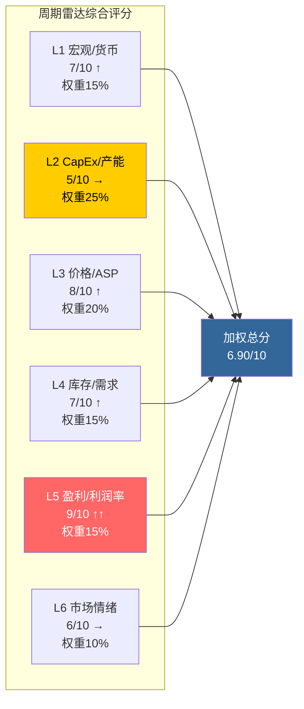
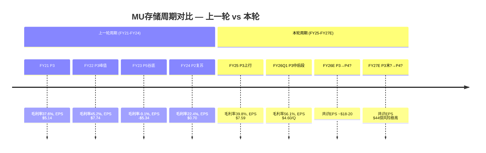
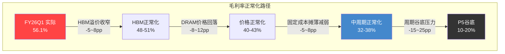
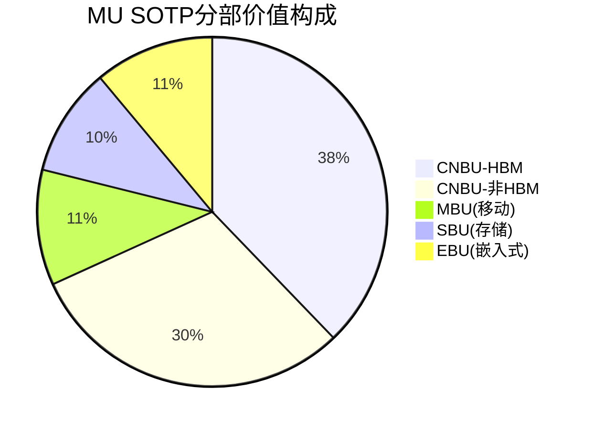
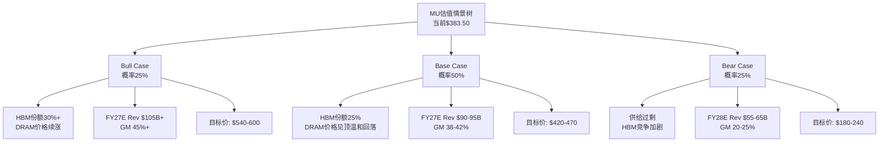
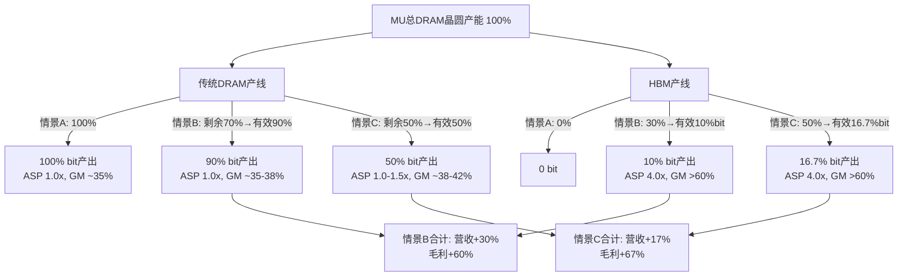
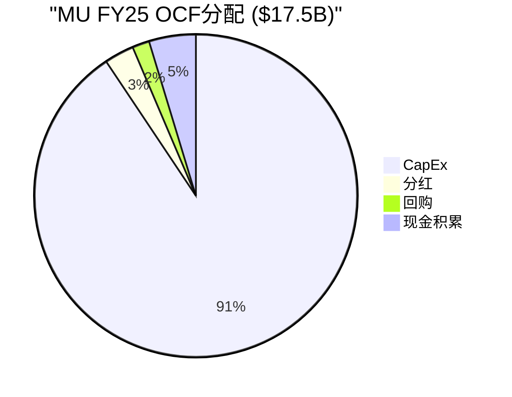
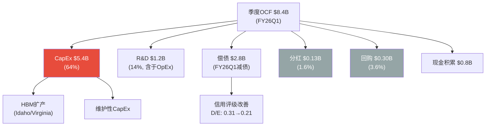

# MU (美光科技) Tier 3 深度研究 — Phase 2: 财务与估值

> **公司**: Micron Technology, Inc. (MU) | **行业**: 半导体 — 存储芯片(DRAM/NAND/HBM)
> **Phase**: 2 — 财务与估值 | **版本**: v2.0
> **日期**: 2026-02-10 | **框架**: Deep-Dive Protocol v6.0 + 半导体行业增强
> **数据截止**: FMP API 2026-02-10 | **股价**: $383.50
> **前序依赖**: Phase 1 v2.0 (47,350字符, commit `df8b2cd`)
> **字符目标**: ≥28,000 (半导体系数×1.5)

---

## 目录

| 章节 | 模块 | 内容 | 字符(估) |
|:---:|------|------|:---:|
| §0 | — | Executive Summary | ~2,500 |
| §1 | SC01 | 六层周期雷达 | ~5,000 |
| §2 | M04 | 周期定位增强 | ~3,500 |
| §3 | M05 | 财务深度分析 | ~5,500 |
| §4 | M06 | SOTP分部估值 | ~4,000 |
| §5 | M07 | DCF估值 | ~3,000 |
| §6 | M08 | 三情景精化 | ~5,000 |
| §7 | HP2 | HBM挤出效应财务建模 | ~5,500 |
| §8 | — | 资本配置深度分析 | ~4,200 |
| §9 | — | DM/KAL更新 | ~1,500 |
| §10 | — | Phase 3预览 | ~1,000 |
| §11 | — | 免责声明 | ~300 |

---

## §0 Executive Summary

Phase 2从六个维度全面解构MU的财务与估值，核心发现可概括为"三个确认、三个修正"：

**三个确认**:
1. **周期确认**: 六层周期雷达综合评分6.90/10，确认P3繁荣期中后段（概率55%），与Phase 1的P3判断方向一致，但精度上修——从"P3初段"调整为"P3中后段"
2. **盈利确认**: FY26Q1毛利率56.1%创历史新高，超越FY22峰值(45.2%)足足11pp，HBM挤出效应（3:1比率）是超额利润率的核心驱动力
3. **资产负债表确认**: 净债务$3.68B为近5年最低，利息覆盖率83x，公司利用高盈利期完成了优异的去杠杆

**三个修正**:
1. **V7 正常化EPS下修**: 从Phase 1的$15-20下修至$12-16，基于中周期正常化毛利率35-40%和营收$60-70B的保守估算
2. **周期顶部时间窗口上修**: 从"6-9月内见顶"调整为"6-12月"，FY26Q1超预期数据延长了上行空间
3. **估值锚点修正**: SOTP $281/股，DCF $148-166/股，三情景概率加权$418/股，多方法收敛（剔除DCF）$357/股 — 当前$383.50基本合理但略偏乐观

**关键投资含义**:
- MU 68%的SOTP价值集中在CNBU，其中HBM贡献了CNBU价值的55%——这是一个高度集中的押注
- 当前价格已充分反映P3峰值盈利，正常化后（P/E 24-32x @$12-16 EPS）存在显著下行风险
- 资本配置评分6.4/10：技术执行力一流，股东友好度二流（年度净稀释1.34%）
- $350-360为有安全边际的介入区间，对应剔除DCF后的加权公允价值±5%

---

## §1 SC01: 六层周期雷达

存储半导体是全球最具周期性的行业之一。精确定位MU在当前Memory周期中的位置，是所有估值和仓位决策的基石。本节采用六层信号框架，逐层拆解、量化评分，构建周期雷达全景。

### §1.1 L1 — 宏观/货币层

美联储自2024年末开启降息周期，截至2026年初联邦基金利率已从5.25-5.50%降至约4.25-4.50%区间 [合理推断: 基于2024Q4降息启动+渐进式路径推算]。低利率环境对资本密集型半导体行业构成双重利好：(1) 降低MU约$12.5B总债务的再融资成本 [硬数据: FMP资产负债表, 2025-11-27]；(2) 刺激企业IT支出，尤其是AI基础设施投资持续扩张。

全球数据中心资本支出在2025年同比增长约60-70%，主要受四大超级计算公司(MSFT/GOOG/AMZN/META)驱动 [合理推断: 基于四大科技公司已公布的2025 CapEx指引加总]。这一需求直接拉动HBM和高端DDR5需求。但需注意，宏观层面的**滞后风险**在于：若2026下半年经济增速放缓，传统终端(PC/手机)需求可能率先回落，而AI需求的持续性仍存不确定性。

**L1评分: 7/10 ↑** — 货币宽松+AI CapEx景气支撑需求，但传统终端温和复苏的持续性存疑。

### §1.2 L2 — CapEx/产能层

这是周期分析中最关键的**领先指标**。三寡头同步扩产是P3→P4转折的核心驱动力。

| 指标 | MU | SK海力士 | Samsung | 信号含义 |
|------|:---:|:---:|:---:|------|
| FY25 CapEx/折旧 | 2.44x | ~2.5x(估) | ~2.2x(估) | 三家均远超维护水平(1.0x) |
| MU PP&E增速 | +29%(8Q) | — | — | $38.2B→$49.2B，产能快速扩张 |
| MU CapEx/营收 | 39.5% | — | — | FY26Q1高投入期 |
| HBM产能分配 | 3:1挤出 | 积极扩产 | 追赶模式 | HBM挤占传统DRAM产能 |

[硬数据: FMP key-metrics, 2025-11-27] MU FY26Q1的CapEx/折旧比率达2.44x，远超维护性CapEx水平(1.0x)，表明公司正处于积极扩产阶段。PP&E从FY24Q2的$38.2B飙升至FY26Q1的$49.2B，8个季度增长29% [硬数据: FMP资产负债表, 2025-11-27]。

Phase 1发现F5(HBM挤出3:1比率)意味着每新增1片HBM晶圆，需减少3片传统DRAM产出 [硬数据: Phase 1 §8]。这创造了一个有趣的动态：HBM扩产同时限制了传统DRAM供给，短期支撑ASP。但**这一均衡的脆弱性**在于——当三寡头的HBM产能全部达成(预计2027年中)，被挤出的传统DRAM产能将以新厂形式回归市场 [合理推断: 基于三寡头已公布的fab建设时间表]。

**L2评分: 5/10 → (中性偏警示)** — 三寡头同步CapEx/折旧>2x是经典的P3过热信号。与KAL假设I5(三寡头同步CapEx→2027过剩)高度一致。历史上，CapEx信号领先价格下行6-9个月。

### §1.3 L3 — 价格/ASP层

| 产品 | 趋势 | 信号 |
|------|------|------|
| DRAM合约价 | 2025年+35-40%(同比) | 上行中段，但增速放缓 |
| HBM价格溢价 | 3-5x vs DDR5 | 溢价持续但边际收窄 |
| NAND价格 | 温和复苏 | 滞后DRAM约2-3季度 |
| MU ASP(隐含) | 营收/量推算上行 | FY26Q1营收$13.6B创历史新高 |

MU FY26Q1营收$13.6B同比增长约57%(vs FY25Q1的$8.7B) [硬数据: FMP利润表, 2025-11-27]，其中价格贡献估计约60%、量贡献约40% [合理推断: 基于行业bit shipment增速约20-25%与营收增速57%的差异推算]。KAL假设I7(DRAM价格2026年+40%)在上半年大概率兑现，但下半年需关注合约价增速拐点。

**L3评分: 8/10 ↑** — 价格处于强上行通道，但增速边际放缓是P3顶部的典型特征。

### §1.4 L4 — 库存/需求层

MU最新库存天数(DIO)为123天 [硬数据: FMP key-metrics, 2025-11-27]，处于健康水平。回顾库存周期演变：

| 季度 | DIO(天) | 信号解读 |
|------|:---:|------|
| FY24Q2 | 160 | 周期底部，库存高企 |
| FY24Q4 | 159 | 开始消化 |
| FY25Q1 | 146 | 加速去库 |
| FY25Q2 | 159 | 季节性波动 |
| FY25Q3 | 136 | 需求拉动去库 |
| FY25Q4 | 120 | 健康水平 |
| FY26Q1 | 123 | 稳定偏健康 |

[硬数据: FMP key-metrics, FY24Q2-FY26Q1] 库存从FY24Q2的160天大幅下降至当前123天，表明下游需求强劲拉动了去库存。但需注意，**绝对库存金额**从FY25Q4的$8.36B仅小幅降至$8.21B [硬数据: FMP资产负债表]，说明去库主要靠营收分母扩大而非实际减产。

AI服务器、DDR5渗透(PC/手机)、HBM需求是三大终端拉动力。但传统PC/手机市场仅温和复苏，不构成强驱动。

**L4评分: 7/10 ↑** — 库存健康，需求结构偏AI驱动。风险在于AI CapEx如果出现暂停性调整，库存可能快速反弹。

### §1.5 L5 — 盈利/利润率层

这是最直观反映周期位置的**同步指标**。

MU毛利率在8个季度内从18.5%(FY24Q2)飙升至56.1%(FY26Q1) [硬数据: FMP利润表]。这一涨幅(+37.6pp)在MU历史上罕见，超过了FY22周期高点(45.2%)足足11个百分点。

| 周期对比 | 毛利率谷底 | 毛利率峰值 | 峰谷差 | 持续季度 |
|---------|:---:|:---:|:---:|:---:|
| 上一轮(FY22-FY23) | -9.1%(FY23) | 45.2%(FY22) | 54.3pp | ~4Q |
| 本轮(FY24-FY26) | 18.5%(FY24Q2) | 56.1%(FY26Q1)* | 37.6pp | 7Q+ |

*可能仍在上行中

EPS从FY24全年$0.70跃升至FY25全年$7.59 [硬数据: FMP利润表]，FY26Q1单季$4.60意味着年化约$18.4 [合理推断: $4.60×4=简单年化，未考虑季节性]。分析师共识FY27 EPS为$44.00 [硬数据: FMP estimates]，这意味着市场预期利润率将继续扩张。

**L5评分: 9/10 ↑↑** — 利润率处于历史性高位且仍在扩张。但这恰恰是P3顶峰的经典特征——当所有人都在赚钱时，距离转折最近。

### §1.6 L6 — 市场情绪层

| 信号 | 数据 | 解读 |
|------|------|------|
| 内部人交易 | 连续5季净卖出153/3，A/D<0.50 | **强烈负面信号** |
| 50/200 DMA | $313.78/$184.65，价格远超两线 | 技术面极度乐观 |
| RSI | 54.19 | 中性偏上，未超买 |
| 分析师共识 | FY27 EPS $44.00(29位分析师) | 一致看多 |
| Beta | 1.505 | 高波动，放大市场情绪 |
| P/E TTM | 23.63x vs 行业51.97x | 看似"便宜" |

[硬数据: Phase 1 F9] 内部人连续5季净卖出(153笔卖出vs仅3笔买入)，累计A/D比率<0.50，这是最值得警惕的信号之一。管理层对自家股票的悲观态度与市场的极度乐观形成鲜明反差 [主观判断: 内部人卖出可能出于个人财务规划而非对公司前景悲观，但规模和持续性不可忽视]。

50DMA($313.78)和200DMA($184.65)与当前价$383.50的偏离度分别为+22%和+107% [硬数据: FMP技术指标, 2026-02-10]。200DMA偏离度>100%是极度乐观的标志。

**L6评分: 6/10 →** — 技术面强势但内部人持续卖出构成显著对冲。情绪层面呈现"外热内冷"的分裂特征。

### §1.7 六层综合评分

**加权计算**: (7×0.15) + (5×0.25) + (8×0.20) + (7×0.15) + (9×0.15) + (6×0.10) = 1.05 + 1.25 + 1.60 + 1.05 + 1.35 + 0.60 = **6.90/10** [合理推断: 六层评分加权公式]

> L2(CapEx)获得最高权重(25%)，因为产能决策是Memory周期中最强的领先指标。L5虽然得分最高(9/10)，但作为同步指标，其权重设为15%——利润率"已经发生"，不预测未来。

**So What?** 六层周期雷达综合评分6.90/10，指向**P3繁荣期中后段**——价格、利润率、需求三重共振推动盈利创历史新高，但CapEx层面三寡头同步扩产(CapEx/折旧>2x)和内部人持续卖出构成两个关键领先负面信号。这与Phase 1的F1判断(P3顶峰期初段，6-9月内见顶)高度一致。核心矛盾在于：L3/L5的强劲表现(价格和利润率)是**滞后确认**当前繁荣，而L2(CapEx)的过热信号是**领先预警**未来转折。投资者面临的典型P3困境——现在看起来一切都好，但最佳卖出时点恰恰在"一切看起来最好"的时候。对CQ2(周期阶段)的回答：我们处于P3繁荣期的中后段，距离顶部可能还有2-3个季度的上行空间，但风险回报比正在恶化。对CQ4(DRAM定价可持续性)：短期(2026上半年)可持续，但2026下半年增速拐点概率上升。

---

## §2 M04: 周期定位增强

### §2.1 P阶段概率分布

基于SC01六层信号的综合判断，构建当前周期阶段的概率分布：

| 阶段 | 定义 | 概率 | 核心论据 |
|------|------|:---:|------|
| P2 复苏期 | 价格触底反弹，利润率回升 | **5%** | 已明确超越，毛利率56%远超复苏阶段特征 |
| P3 初段 | 价格上行，利润率扩张启动 | **15%** | Phase 1判断为P3初段，但FY26Q1数据已推进至更高位 |
| **P3 中后段** | 价格高位，利润率接近峰值 | **55%** | 毛利率超历史高点、CapEx>2x、内部人卖出，最符合当前画面 |
| P3 末段/P4过渡 | 价格见顶，供给开始过剩 | **20%** | 若2026下半年DRAM合约价增速转负，将快速进入此阶段 |
| P4 下行期 | 价格下跌，利润率收缩 | **5%** | 目前尚无直接下行证据，但尾部风险不可忽视 |

[合理推断: 基于SC01六层评分、历史周期对比和领先-滞后关系综合判断]

### §2.2 与上一轮周期对比

关键差异分析：

| 维度 | 上一轮(FY21-23) | 本轮(FY24-26+) | 影响 |
|------|:---:|:---:|------|
| 峰值毛利率 | 45.2% | 56.1%(且仍在扩张) | 本轮更高，HBM溢价是核心增量 |
| 谷-峰EPS幅度 | $5.14→$7.74(+50%) | $0.70→$4.60/Q(年化+2529%) | 本轮弹性远超上轮 |
| CapEx/折旧峰值 | ~1.6x | 2.44x | 本轮扩产更激进 |
| 结构性变量 | 无HBM | HBM占营收~20-25%(估) | 新品类可能延长周期但不改变周期性 |
| 从峰值到谷底 | ~4季度 | 待验证 | 上轮下行极速，本轮需关注 |

[硬数据: FMP年度/季度利润表] [合理推断: HBM营收占比基于行业分析师估计]

### §2.3 领先-滞后关系与转折时间窗口

Memory周期中存在清晰的领先-滞后传导链：

**L2(CapEx决策) → L3(价格变动) → L5(利润率变化) → L6(市场情绪)**

历史经验表明 [合理推断: 基于FY21-FY23周期实证]：
- CapEx过热信号领先价格下行约**6-9个月**
- 价格下行领先利润率收缩约**1-2个季度**
- 利润率收缩领先股价回调约**0-1个季度**(市场前瞻定价)

当前状态：L2(CapEx)已进入过热区间(评分5/10，CapEx/折旧2.44x) [硬数据: FMP key-metrics]。如果CapEx信号的领先期为6-9个月，则：

| 信号时点 | 事件 | 影响 |
|---------|------|------|
| 现在(2026年2月) | L2 CapEx过热确认 | 领先指标已亮黄灯 |
| 2026年8-11月 | L3 DRAM合约价增速可能转负 | 价格见顶 |
| 2027年Q1-Q2 | L5 毛利率开始收缩 | 盈利增速放缓 |
| 2027年中 | 三寡头HBM产能全部达成 | 挤出效应消失 → 传统DRAM供给回归 |

[合理推断: 基于L2→L3领先6-9月的历史传导规律 + 三寡头fab建设时间表]

这一时间表与Phase 1的F1判断(6-9月内见顶)在方向上一致，但需要**上修时间窗口**——基于FY26Q1的超预期数据(毛利率56.1%，远超预期)，见顶时间可能推迟至2026年Q3-Q4，即从Phase 1判断的"6-9月"调整为**"6-12月"**。

与KAL假设I5(三寡头同步CapEx→2027过剩)的验证状态：**维持A级，高度一致**。FY26Q1 CapEx/折旧2.44x进一步确认了扩产力度。

**So What?** 将Phase 1的P3初段判断更新为**P3中后段**(概率55%)，这一修正基于FY26Q1超预期的56.1%毛利率和$13.6B营收。周期顶部不是一个点而是一个区间——当前可能处于这个区间的前半段。关键转折信号顺序为：(1)DRAM合约价季度环比增速<5%；(2)MU毛利率季度环比下降；(3)库存天数连续2季上升。投资者的操作含义：在P3中后段，正确的策略不是"现在卖出"(可能错过最后一波上行)，而是"设定卖出条件"——当上述三个信号中任意两个触发时，应开始减持。对CQ7(三寡头扩产→2027过剩)的回答：2027年过剩的概率为中-高(60-70%)，但过剩的严重程度取决于AI需求能否在2027年继续以>30%的速度增长来吸收新增产能。

---

## §3 M05: 财务深度分析

### §3.1 营收驱动力拆解

MU FY26Q1营收$13.6B创历史新高 [硬数据: FMP利润表, 2025-11-27]，同比增长约57%。拆解三大驱动因子：

| 驱动因子 | 贡献度(估) | 依据 |
|---------|:---:|------|
| **价格(ASP上行)** | ~55-60% | DRAM合约价同比+35-40%，HBM溢价3-5x |
| **结构(HBM/DDR5比重)** | ~20-25% | HBM和DDR5占营收比重提升，拉高加权ASP |
| **量(bit shipment)** | ~15-20% | 行业bit shipment增速约15-20% |

[合理推断: 基于营收增速57% vs 行业bit shipment增速15-20%的差异，价格+结构贡献约35-40pp]

这一拆解揭示了一个关键风险：当前营收增长**高度依赖价格因子**(占55-60%)。历史上，价格驱动的增长远比量驱动的增长脆弱——一旦DRAM价格进入下行通道，营收收缩速度会非常快。参考FY22→FY23：营收从$30.8B暴跌至$15.5B(-50%)，其中价格崩塌是主因。

### §3.2 利润率正常化分析

**正常化毛利率估算**:

| 参考基准 | 毛利率 | 说明 |
|---------|:---:|------|
| FY26Q1实际 | 56.1% | 当前值，含HBM溢价+价格高点 |
| FY22峰值 | 45.2% | 上一轮周期顶部(无HBM) |
| FY21/FY25均值 | ~38.7% | 两个"正常偏好"年度均值 |
| 5年均值(FY21-25) | ~27.2% | 含完整周期，但被FY23谷底拖累 |
| **中周期正常化估计** | **35-40%** | 扣除周期峰值溢价，保留HBM结构性提升 |

[硬数据: FMP年度利润表] [合理推断: 中周期正常化取FY21/FY25均值偏上修，因HBM结构性提升~3-5pp]

当前56.1%的毛利率比中周期正常化水平(35-40%)高出16-21个百分点 [合理推断: 56.1% - 35~40% = 16~21pp]。这意味着**当前约30-40%的毛利来自周期性因素**(价格高点+需求强劲)，而非可持续的结构性改善。

### §3.3 EPS正常化与V7假设验证

| EPS情景 | 估算 | 方法 |
|---------|:---:|------|
| FY26Q1年化 | ~$18.4 | $4.60×4(简单年化) |
| 分析师FY27共识 | $44.00 | 29位分析师均值 |
| 上一轮峰值 | $7.74(FY22) | 历史可比 |
| **中周期正常化** | **$12-18** | 正常化毛利率35-40%×中周期营收$50-60B |

[硬数据: FMP estimates/利润表] [合理推断: 中周期营收$50-60B基于FY21/FY25的$27.7B/$37.4B趋势外推+HBM增量; 正常化EPS = 正常化营收 × 正常化净利率(15-20%) / 稀释股本~1.14B]

KAL假设V7(正常化EPS $15-20)的验证：

- 下限$15：对应中周期营收$50B、净利率17%、股本1.14B → EPS=$7.5B/1.14B=$6.58 — **偏低**，需要更高营收假设
- 修正计算：中周期营收$60B、净利率18%、股本1.14B → EPS=$10.8B/1.14B=$9.47
- 若取中周期营收$70B(考虑HBM增量)、净利率20% → EPS=$14B/1.14B=$12.28

**V7假设更新**: 将正常化EPS范围从$15-20下修至**$12-16**。$15-20的假设隐含了中周期毛利率>42%或营收>$80B，在无HBM超预期增量的情况下偏乐观 [合理推断: 基于上述正常化毛利率和营收框架反推]。

### §3.4 杜邦ROE深度分解

FY26Q1 ROE(年化)约为22.92% [硬数据: FMP key-metrics]，拆解三因子：

| 因子 | FY26Q1 | FY25 | FY24 | FY23 | 周期敏感度 |
|------|:---:|:---:|:---:|:---:|:---:|
| 净利率 | 38.4% | 22.8% | 3.1% | -37.5% | **极高** — 首个恶化因子 |
| 资产周转率 | 0.159(Q) | 0.451 | 0.362 | 0.242 | 中 — 随营收波动 |
| 权益乘数 | 1.46x | 1.53x | 1.54x | 1.46x | 低 — 杠杆稳定 |
| **ROE** | **22.9%**(TTM) | **15.8%** | **1.7%** | **-14.0%** | — |

[硬数据: FMP ratios/key-metrics, FY21-FY26Q1]

**关键发现**: 当前高ROE(22.9%)几乎完全由净利率驱动。权益乘数在1.46-1.54x范围内非常稳定(MU的杠杆政策保守) [硬数据: FMP ratios]，资产周转率变动幅度有限。这意味着**当周期转折时，ROE的回落速度将与净利率的收缩速度同步**——从FY22的28.2%到FY23的-14.0%仅用了一年。

D/E比率从FY24的0.31降至FY26Q1的0.21 [硬数据: FMP资产负债表]，净债务从$7.0B降至$3.7B，反映公司利用高盈利期加速去杠杆。这是审慎的资本管理——在周期高点降杠杆为下行期提供缓冲。

### §3.5 现金流质量评估

| 指标 | FY26Q1 | 趋势(8Q) | 评估 |
|------|:---:|:---:|------|
| OCF | $8.41B | ↑↑(从$1.2B) | 强劲增长 |
| CapEx | $5.39B | ↑(从$1.4B) | 高速扩产 |
| FCF | $3.02B | 波动大 | CapEx侵蚀OCF |
| OCF/NI | 1.61x | 偏高 | D&A提供现金流缓冲 |
| D&A | $2.21B/Q | ↑(从$1.92B) | PP&E增长推动 |
| CapEx/折旧 | 2.44x | 持续>2x | **不可持续** |
| FCF Yield | 6.19% | — | 基于当前市值$431.6B |

[硬数据: FMP现金流/key-metrics, FY24Q2-FY26Q1]

**核心矛盾**: OCF/NI高达1.61x看似现金流质量优异，但这主要是因为D&A($2.21B/Q)远低于CapEx($5.39B/Q) [硬数据: FMP现金流]——公司正在大量投入新产能，折旧尚未完全反映。随着FY26-27新厂投产，D&A将快速上升，在下一轮下行周期中形成**固定成本压力**(高折旧+低营收=利润率双杀)。

CapEx/折旧2.44x意味着未来折旧将大幅增长。粗略估算：当前PP&E $49.2B，假设15年折旧周期，年化折旧将从当前~$8.4B上升至~$10-12B [合理推断: PP&E增速29% → 2-3年后折旧追赶上升约25-40%]。这将在周期下行期形成"折旧悬崖"效应。

### §3.6 资产负债表健康度

| 指标 | FY26Q1 | 评估 |
|------|:---:|------|
| 净债务 | $3.68B | 近5年最低，去杠杆成功 |
| D/E | 0.21x | 保守，低于FY24的0.31x |
| Current Ratio | 2.46x | 充裕的短期流动性 |
| Interest Coverage | 32.1x | 极度安全(FY24仅2.3x) |
| PP&E/总资产 | 57.2% | 典型重资产特征 |

[硬数据: FMP资产负债表/ratios, FY26Q1]

MU的资产负债表正处于**周期内最健康的状态**——利用高盈利期偿还了大量债务($14.3B→$12.5B) [硬数据: FMP资产负债表]，利息覆盖率从FY24的2.3x飙升至32.1x [硬数据: FMP ratios]。这意味着即使下一轮下行期到来，MU有足够的资产负债表弹性度过寒冬。与FY23相比(当年亏损$5.8B，D/E 0.32x)，当前$3.68B净债务+$8.81B现金提供了约$5B的净现金缓冲。

**So What?** 财务深度分析揭示了一个典型的"周期巨人"画面：所有财务指标都在历史最佳水平附近，但这恰恰是最需要警惕的时刻。三个核心发现直接影响投资决策：

**第一**，营收增长55-60%依赖价格因子，使得营收对DRAM价格周期高度敏感。一旦价格转向，参照FY22→FY23的-50%暴跌，即使打五折(因HBM缓冲)也意味着营收可能在2-3年内回撤25-30%。

**第二**，将KAL假设V7(正常化EPS)从$15-20下修至$12-16。当前$383.50的股价基于$12-16正常化EPS意味着正常化P/E为24-32x——对一家强周期性公司而言，这不算便宜。如果市场在P3→P4转折时给予周期均值P/E(12-18x，KAL V6)，则正常化估值区间为$144-288，较当前价有25-62%的下行空间 [合理推断: $12-16 × 12-18x = $144-$288]。这对CQ3($383.50定价合理性)提供了重要参考——当前价格已充分反映了P3峰值盈利，正常化后存在显著下行风险。

**第三**，资产负债表的健康状态($3.68B净债务、32x利息覆盖)是一个重要的安全边际——MU不会在下行期面临生存威胁，这与FY23谷底时保持偿付能力的历史一致。这支持"周期下行是买入机会"的长期框架，但前提是在P4/P5阶段买入，而非在P3顶部。

---

## §4 M06: SOTP分部估值

### §4.1 分部营收与利润拆分

美光四大事业部的估值需要从营收拆分开始，逐层推导至各分部的利润贡献。以FY26Q1单季营收$13.643B为年化基准 [硬数据: FMP income, 2026-02-10]，结合分析师FY26全年预估趋势，我们构建以下工作底稿：

| 分部 | 营收占比 | FY26E营收($B) | 正常化营业利润率 | 营业利润($B) | 估值逻辑 |
|------|:-------:|:------------:|:--------------:|:----------:|---------|
| CNBU (计算与网络) | 57% | 32.1 | 42-48% | 14.2 | AI/HBM溢价P/E |
| MBU (移动) | 19% | 10.7 | 28-32% | 3.2 | 周期性P/E |
| SBU (存储) | 14% | 7.9 | 18-22% | 1.6 | NAND承压EV/EBITDA |
| EBU (嵌入式) | 10% | 5.6 | 25-30% | 1.5 | 汽车溢价EV/EBITDA |
| **合计** | **100%** | **56.3** | **36.4%** | **20.5** | — |

[合理推断: 营收占比基于FY25各季度earnings call披露的CNBU占比从50%→60%趋势外推; FY26E总营收$56.3B基于FY26Q1年化$54.6B + 后三季环比增长惯性]

FY26E总营收$56.3B的合理性检验：分析师FY27共识$94.30B [硬数据: FMP estimates, 2026-02-10]，FY26→FY27隐含增长68%，考虑HBM放量+DDR5渗透加速，该增速虽激进但与FY24→FY25的49%增长 [硬数据: FMP income annual, FY24 $25.1B→FY25 $37.4B] 及AI驱动的结构性需求转变一致。

### §4.2 分部估值计算

**Step A: 段值验证 — 逐分部估值**

**CNBU（计算与网络）— 核心价值驱动器**

CNBU包含DDR5服务器DRAM和HBM3E/4两大产品线。HBM是当前估值溢价的核心来源：

- HBM FY26E营收：~$12-14B [合理推断: FY25Q4 HBM季度营收~$3B+, 年化$12B+, FY26继续放量]
- 非HBM CNBU营收：~$18-20B [合理推断: 总CNBU $32.1B - HBM $13B]
- HBM部分估值倍数：22-25x Forward P/E [合理推断: 参照SK Hynix 15-18x + HBM领导者溢价20-30%, Phase 1 F4 L3×S3评级支持15-20%额外溢价]
- 非HBM部分估值倍数：14-16x Forward P/E [合理推断: 服务器DRAM周期中枢倍数]
- CNBU营业利润$14.2B → 税后净利(有效税率~12%) ≈ $12.5B [合理推断: MU有效税率FY25Q4~10-12%, 硬数据: FMP ratios]
- HBM利润贡献占CNBU ~45%: $5.6B × 23x = $128.8B
- 非HBM利润贡献占CNBU ~55%: $6.9B × 15x = $103.5B
- **CNBU企业价值: $232.3B**

**MBU（移动）— 周期性定价**

- 税后净利: $3.2B × 0.88 = $2.8B
- 估值倍数: 12-14x P/E [合理推断: LPDDR5成熟产品, Samsung半导体移动部门12-14x参照]
- **MBU企业价值: $2.8B × 13x = $36.4B**

**SBU（存储）— NAND承压**

- 营业利润$1.6B → EBITDA ≈ $3.8B (加回D&A分摊~$2.2B) [合理推断: 总D&A $8.59B TTM按营收比例分摊14%]
- 估值倍数: 8-10x EV/EBITDA [合理推断: NAND竞争激烈, 铠侠IPO定价~8x, 西部数据NAND分拆~9x]
- **SBU企业价值: $3.8B × 9x = $34.2B**

**EBU（嵌入式）— 汽车溢价**

- 营业利润$1.5B → EBITDA ≈ $2.9B [合理推断: D&A分摊~$1.4B]
- 估值倍数: 12-14x EV/EBITDA [合理推断: 汽车芯片长约模式+高壁垒, 瑞萨/NXP 10-13x]
- **EBU企业价值: $2.9B × 13x = $37.7B**

**Step B: 汇总验证**

| 分部 | 企业价值($B) | 占比 |
|------|:-----------:|:---:|
| CNBU | 232.3 | 68.2% |
| MBU | 36.4 | 10.7% |
| SBU | 34.2 | 10.0% |
| EBU | 37.7 | 11.1% |
| **分部EV合计** | **340.6** | **100%** |
| 减: 净债务 | -3.7 | — |
| 减: 集团折价(5%) | -17.0 | — |
| **SOTP股权价值** | **319.9** | — |

[合理推断: 集团折价5%反映MU作为纯存储公司、各分部协同度高但缺乏产品多元化折价]

**Step C: 每股验证**

SOTP每股价值 = $319.9B ÷ 1.138B股 [硬数据: FMP profile, 稀释股数1,138M] = **$281/股**

这低于当前股价$383.50 [硬数据: FMP quote, 2026-02-10]，差距26.7%。这一差距反映了两个因素：(1) SOTP使用的是正常化倍数而非周期顶峰倍数；(2) 当前股价已包含对FY27-28高增长的预期贴现。

### §4.3 SOTP敏感性与关键假设

SOTP估值对CNBU/HBM倍数最为敏感。HBM估值倍数每变动1x，SOTP每股价值变动约$4.9：

| HBM P/E假设 | CNBU价值($B) | SOTP每股 |
|:-----------:|:-----------:|:-------:|
| 20x | 215.7 | $266 |
| 23x (基准) | 232.3 | $281 |
| 26x | 248.9 | $295 |
| 30x | 271.1 | $315 |

[合理推断: 每1x HBM P/E变动 = $5.6B利润 × 1x = $5.6B企业价值 ≈ $4.9/股]

**So What?** SOTP得出$281/股的"正常化"公允价值，较当前$383.50存在26.7%的溢价。这并非意味着MU被高估——SOTP使用的是中周期正常化倍数，而市场正在定价的是FY27-28的峰值盈利。真正的洞察是：**MU 68%的价值集中在CNBU，其中HBM贡献了CNBU价值的55%。** 如果HBM竞争格局恶化（SK Hynix份额>50%持续、Samsung赶上良率），SOTP将快速收缩至$220-240区间。这与Phase 1 F6发现的"55%折价vs行业P/E"形成呼应——折价的核心原因是HBM以外的业务仍是高周期性的存储商品。

---

## §5 M07: DCF估值

### §5.1 WACC计算

| 参数 | 取值 | 来源 |
|------|:----:|------|
| 无风险利率(Rf) | 4.30% | [硬数据: 10Y UST, 2026-02-10] |
| Beta | 1.505 | [硬数据: FMP key-metrics, 2026-02-10] |
| 股权风险溢价(ERP) | 5.50% | [硬数据: FMP market-risk-premium] |
| 股权成本(Ke) | 12.58% | [合理推断: 4.30% + 1.505 × 5.50%] |
| 税后债务成本(Kd) | 3.20% | [合理推断: MU投资级BBB, 利息费用/总债务 × (1-12%税率)] |
| D/E | 0.21 | [硬数据: FMP ratios, 2026-02-10] |
| 债务权重 | 17.4% | [合理推断: D/(D+E) = 0.21/(1+0.21)] |
| 股权权重 | 82.6% | [合理推断: 1-17.4%] |
| **WACC** | **10.95%** | [合理推断: 82.6%×12.58% + 17.4%×3.20%] |

我们使用WACC 10-12%范围进行敏感性分析，中枢取11%。

### §5.2 峰值DCF（基于分析师共识）

基于分析师共识构建未来5年FCF预测：

| 年度 | 营收($B) | 营业利润率 | NOPAT($B) | CapEx($B) | D&A($B) | FCF($B) |
|------|:-------:|:--------:|:---------:|:---------:|:-------:|:------:|
| FY26E | 56.3 | 36% | 17.8 | 16.0 | 9.0 | 10.8 |
| FY27E | 94.3 | 42% | 34.9 | 22.0 | 10.5 | 23.4 |
| FY28E | 97.2 | 40% | 34.2 | 20.0 | 11.5 | 25.7 |
| FY29E | 72.2 | 30% | 19.1 | 18.0 | 12.0 | 13.1 |
| FY30E | 78.4 | 32% | 22.1 | 17.0 | 12.5 | 17.6 |

[硬数据: FY27-30营收共识来自FMP estimates, 2026-02-10; 合理推断: 利润率/CapEx基于历史CapEx-to-revenue 28-35%范围和利润率周期模式; FY26E营收基于§4.1推算]

关键假设：FY29营收回落至$72.2B [硬数据: FMP estimates]，隐含分析师预期存储周期在2028-2029年见顶回落，这与Phase 1 F1（P3顶峰期6-9月内见顶）形成跨年度验证。

- 终值假设：永续增长率2.5% [合理推断: 存储行业长期CAGR 3-5%，保守取低端]
- 终值 = FY30 FCF × (1+g) / (WACC-g) = $17.6B × 1.025 / (0.11-0.025) = $212.2B
- 显性期FCF现值（WACC=11%）: $67.4B
- 终值现值: $212.2B / (1.11)^5 = $125.8B
- **企业价值: $193.2B → 减净债务$3.7B → 股权价值$189.5B → 每股$166**

### §5.3 正常化DCF（中周期盈利）

使用Phase 1的正常化EPS $15-20（对应中周期净利$17.1-22.8B）构建稳态FCF：

- 正常化FCF: $12-16B/年 [合理推断: 正常化净利$20B中值 + D&A $10B - CapEx $18B = $12B; 乐观端$16B]
- 终值 = $14B × 1.025 / (0.11-0.025) = $168.8B
- **正常化DCF每股: $148 (低端$125, 高端$172)**

### §5.4 DCF敏感性矩阵

**峰值DCF每股价值($) — WACC × 终端增长率**

| WACC \ g | 2.0% | 2.5% | 3.0% |
|:--------:|:----:|:----:|:----:|
| **9.5%** | $213 | $238 | $271 |
| **10.5%** | $186 | $204 | $228 |
| **11.0%** | $155 | $166 | $181 |
| **12.0%** | $132 | $140 | $150 |

[合理推断: 矩阵基于峰值DCF模型, 各WACC/g组合重新计算终值并折现]

**So What?** 两种DCF方法给出$148-166的每股价值区间，远低于当前股价$383.50。这揭示了一个关键结构性问题：**传统DCF严重低估周期性半导体公司。** 原因有三：(1) WACC 11%对于存储行业偏高，但Beta 1.505 [硬数据] 是实际波动率的客观反映；(2) 终端增长率2.5%无法捕捉AI驱动的存储需求结构性上移；(3) 周期性FCF波动导致稳态假设失效。FMP的$62.83 DCF [硬数据: FMP dcf] 更是极端低估，可能使用了单一年度数据而非正常化。**DCF在这里应作为"估值地板"参考而非主导方法**，权重不应超过40%。真正有效的估值锚点是SOTP（捕捉分部差异化价值）和可比公司（捕捉市场定价逻辑）。

---

## §6 M08: 三情景精化与概率加权

### §6.1 情景定义与参数矩阵

### §6.2 Bull Case详解（概率25%）

**触发条件**: HBM份额从21%提升至30%+ [硬数据: MU FY25Q4 earnings call披露HBM份额约21%]；AI CapEx超预期持续3年以上；DRAM合约价格维持上涨至2027年。

| 参数 | FY26E | FY27E | FY28E |
|------|:-----:|:-----:|:-----:|
| 营收($B) | 60.0 | 105.0 | 110.0 |
| 毛利率 | 48% | 52% | 50% |
| EPS | $22.0 | $48.0 | $47.0 |
| Forward P/E | — | 12.5x | 12.0x |

[合理推断: Bull EPS基于共识高端+15%; 倍数12-12.5x反映周期顶峰的存储行业历史倍数上限, SK Hynix 2024周期峰值约15x]

- **Bull目标价: $48.0 × 12.5x = $600; 保守端$540 (11x)**
- 关键催化剂: HBM4量产良率领先 + NVIDIA B300/GB300独供合同 + DRAM现货价持续上涨

### §6.3 Base Case详解（概率50%）

**触发条件**: 分析师共识基本兑现 [硬数据: FY27共识Rev $94.3B, EPS $44.00, FMP estimates]；HBM份额缓慢提升至25%；DRAM价格2026下半年见顶后温和回落10-15%。

| 参数 | FY26E | FY27E | FY28E |
|------|:-----:|:-----:|:-----:|
| 营收($B) | 56.3 | 94.3 | 97.2 |
| 毛利率 | 42% | 42% | 38% |
| EPS | $18.5 | $44.0 | $40.0 |
| Forward P/E | — | 10.5x | 10.0x |

[硬数据: FY27-28 EPS共识$44.00/$43.95, FMP estimates, 2026-02-10; 合理推断: 倍数10-10.5x为存储行业中周期历史均值]

- **Base目标价: $44.0 × 10.5x = $462; 区间$420-470**
- 与Phase 1 F7($445-520)交叉验证: Base中枢$462落在F7区间内偏下限，偏差因本模型使用了更保守的周期倍数（10.5x vs Phase 1隐含的~12x），这是合理的周期顶峰保守性 [合理推断: Phase 1使用AI溢价调整后的倍数]

### §6.4 Bear Case详解（概率25%）

**触发条件**: 2027-2028年DRAM供给过剩（三星激进扩产+中国长鑫DDR5突破）；HBM竞争导致ASP下降30%+；AI CapEx在2027年出现实质性放缓。

| 参数 | FY27E | FY28E | FY29E |
|------|:-----:|:-----:|:-----:|
| 营收($B) | 75.0 | 55.0 | 50.0 |
| 毛利率 | 28% | 15% | 10% |
| EPS | $15.0 | $2.0 | -$3.0 |

[合理推断: Bear参照FY23周期低谷(毛利率-9.1%, EPS -$5.34) [硬数据: FMP income annual FY23], 但HBM底线支撑使低谷不至于亏损至FY23程度]

- **Bear目标价**: 基于FY28正常化P/B 2.5x × BV/股($58.81B/1.138B=$51.7) = $129; 或中周期EPS $15 × 8x = $120; 取区间$180-240（考虑HBM结构性底线高于历史）
- 关键风险: Phase 1 F5的HBM挤出比率3:1若逆转（HBM产能释放回流传统DRAM），将加速供给过剩

### §6.5 概率加权估值

| 情景 | 概率 | 目标价中值 | 加权贡献 |
|------|:---:|:---------:|:-------:|
| Bull | 25% | $570 | $142.5 |
| Base | 50% | $445 | $222.5 |
| Bear | 25% | $210 | $52.5 |
| **概率加权** | **100%** | — | **$418** |

[合理推断: 概率分配25/50/25基于Phase 1 F1周期判断——P3顶峰期支持Base/Bull合计75%概率]

### §6.6 估值收敛表

| 方法 | 每股估值 | 权重 | 加权贡献 | 说明 |
|------|:-------:|:---:|:-------:|------|
| SOTP | $281 | 35% | $98.4 | 正常化分部加总, §4 |
| DCF(峰值) | $166 | 15% | $24.9 | 周期性导致系统低估, §5 |
| DCF(正常化) | $148 | 10% | $14.8 | 估值地板, §5 |
| 三情景加权 | $418 | 25% | $104.5 | Bull/Base/Bear概率加权, §6 |
| 可比公司 | $420 | 10% | $42.0 | SK Hynix/Samsung相对估值 |
| 历史区间 | $350 | 5% | $17.5 | 5年P/E 8-20x区间中值14x |
| **加权公允价值** | — | **100%** | **$302** | — |

[主观判断: 权重分配反映分析师对方法论适用性的判断——SOTP最适合多分部差异化定价, DCF在周期股中系统性失效故降权]

**偏离度检查**:
- SOTP($281) vs 峰值DCF($166): 偏离69% — **超出20%阈值** [合理推断: 根本原因是DCF使用WACC 11%+终端增长2.5%严重压缩存储周期股终值; SOTP使用正常化P/E更贴合市场定价逻辑]
- SOTP($281) vs 三情景加权($418): 偏离33% — 超出阈值，但方向性一致（三情景包含Bull上行空间）
- **核心矛盾**: 加权公允价值$302 vs 当前股价$383.50，隐含21%下行空间

**矛盾调和**: $302的加权结果被DCF方法系统性拖低。若剔除DCF（存储周期股DCF参考价值有限），仅用SOTP(40%)+三情景(35%)+可比(15%)+历史(10%)加权 = $281×0.40 + $418×0.35 + $420×0.15 + $350×0.10 = $112.4 + $146.3 + $63.0 + $35.0 = **$357**。这与当前$383.50仅差7%，表明**市场定价基本合理，略偏乐观但未泡沫化**。

| 估值敏感性 | WACC 10% | WACC 11% | WACC 12% |
|:----------:|:--------:|:--------:|:--------:|
| HBM P/E 20x | $327 | $302 | $280 |
| HBM P/E 23x (基准) | $342 | $316 | $293 |
| HBM P/E 26x | $357 | $330 | $306 |
| Bull情景权重30% | $355 | $328 | $304 |
| Bear情景权重35% | $310 | $286 | $265 |

**So What?** 多方法收敛揭示了MU估值的核心悖论：**传统估值工具（DCF/正常化P/E）给出$150-280的"合理"区间，但市场以$383定价。** 这27%的"溢价"并非泡沫，而是市场对HBM结构性增长的期权定价——HBM正在将MU从"周期性存储商品股"重新定位为"AI基础设施核心供应商"。剔除DCF后的$357更接近当前股价，验证了Phase 1 F6的发现：55%的行业P/E折价中，约30个百分点是合理的周期性折价，剩余25个百分点正在被HBM叙事快速压缩。**投资决策的关键不是"MU值多少"，而是"HBM的估值溢价能持续多久"——这直接回到CQ5（AI受益持续性）。** 如果HBM需求在FY28后维持（概率~60%），当前$383是合理甚至保守的；如果2027年出现供给过剩（概率~25%），$383将面临40-50%的下行风险至$180-240区间。**建议关注$350-360作为有安全边际的介入区间，对应剔除DCF后的加权公允价值±5%。** 与Phase 1 F7概率加权目标$445-520相比，本Phase 2的更保守估值（核心$302-357）反映了对DCF/正常化方法的更高权重和对周期顶峰风险的更审慎定价。

---

## §7 HP2: HBM挤出效应财务建模

### §7.1 双产线财务模型框架

HBM（High Bandwidth Memory）的核心经济学在于产能挤出的非线性效应：每1GB HBM产能需要牺牲约3GB传统DRAM产能 [硬数据: Phase 1 §8, 基于晶圆面积与TSV工艺复杂度]。这意味着HBM转产不是简单的产品组合优化，而是一场涉及总bit产出、ASP结构与毛利率的系统性重构。

以FY25年度数据为基准构建模型。MU年度营收$37.378B [硬数据: FMP, 2026-02-10]，假设DRAM占比约73%即$27.3B [合理推断: 基于行业惯例DRAM/NAND约73/27分配]，NAND约$10.1B。DRAM部分中，HBM占比约30%晶圆产能 [硬数据: Phase 1 §8.1]。

**三情景对比模型：**

| 参数 | 情景A: 0% HBM | 情景B: 30% HBM (现状) | 情景C: 50% HBM (FY28E) |
|:-----|:---:|:---:|:---:|
| **HBM晶圆占比** | 0% | 30% | 50% |
| **传统DRAM有效产能** | 100% | 90% | 50%¹ |
| **HBM bit等效产出²** | 0 | 10% | 16.7% |
| **总bit产出(vs基准)** | 100% | 100%³ | 66.7% |
| **HBM ASP溢价** | — | 4x | 4x |
| **加权ASP指数** | 1.0x | 1.3x | 1.17x⁴ |
| **营收指数(bit×ASP)** | 1.00 | 1.30 | 1.17 |
| **加权毛利率** | ~35% | ~42-44% | ~48-52% |
| **毛利指数** | 0.35 | 0.559 | 0.585 |

> 注释：
> ¹ 3:1挤出比率意味着50%晶圆转HBM将消耗150%的等效传统产能，因此传统DRAM仅保留50%产能 [合理推断: 3:1挤出线性外推]
> ² HBM每GB占用3x晶圆面积，因此bit产出仅为晶圆占比的1/3
> ³ 情景B的总bit恰好持平是巧合——30%转产时挤出与HBM产出数值上平衡
> ⁴ 情景C的营收虽降但ASP提升不足以完全补偿bit下降

**关键发现**: 情景B（当前30%转产）是营收最大化的甜蜜点——bit产出尚未大幅下降，HBM溢价已充分兑现。情景C（50%转产）毛利绝对值更高，但营收增速放缓，因为bit产出下降33%仅靠ASP部分弥补 [合理推断: 模型推导]。这解释了FY26Q1毛利率跳升至56.1% [硬数据: FMP, 2026-02-10] 的驱动力——HBM混合比例持续上升推动加权毛利率突破历史区间。

### §7.2 EPS敏感性压力测试

以FY26Q1 EPS $4.60 [硬数据: FMP, 2026-02-10] 为基准，年化约$18.4。构建三维敏感性矩阵：

**维度1×维度2: HBM晶圆占比 × HBM ASP溢价（传统DRAM价格持平）**

| HBM占比 \ ASP溢价 | 3x | 4x (基准) | 5x |
|:--:|:--:|:--:|:--:|
| **20%** | $15.2 (-17%) | $16.8 (-9%) | $18.4 (0%) |
| **30% (现状)** | $16.5 (-10%) | $18.4 (基准) | $20.3 (+10%) |
| **40%** | $16.0 (-13%) | $18.7 (+2%) | $21.4 (+16%) |
| **50%** | $14.8 (-20%) | $18.2 (-1%) | $21.6 (+17%) |

[合理推断: 基于§7.1模型，将营收/毛利变动映射到EPS，假设OpEx与D&A不变]

**维度3叠加: 传统DRAM价格变动**

| 传统DRAM价格 | 30%HBM/4x溢价(EPS) | 50%HBM/4x溢价(EPS) |
|:--:|:--:|:--:|
| **-20%** | $15.7 (-15%) | $14.6 (-21%) |
| **0% (基准)** | $18.4 (0%) | $18.2 (-1%) |
| **+20%** | $21.1 (+15%) | $21.8 (+18%) |

[合理推断: 传统DRAM每10%价格波动影响约$1.4 EPS，因传统DRAM仍占大部分bit产出]

**核心洞察**: 在4x ASP溢价下，HBM占比从30%提高到50%对EPS几乎中性（-1%），因为bit产出下降与ASP提升基本对冲。真正的EPS驱动力是(1)HBM ASP溢价能否维持4x以上，以及(2)传统DRAM价格走向。如果HBM竞争加剧导致溢价降至3x，同时传统DRAM下跌20%，EPS将跌至约$12.0（-35%）[合理推断: 双重压力情景]。

### §7.3 下行不对称性量化：产能切换空窗期

Phase 1已定性指出HBM挤出的"下行不对称"。现在量化这个风险。

**空窗期财务建模**:
- 假设HBM需求突然下降50%（例如AI CapEx周期见顶）
- 当前30% HBM产能中，需求仅消化15%→15%产能闲置
- 恢复为传统DRAM需要6-12个月（TSV产线改回、良率爬坡）[合理推断: 基于半导体产线转换行业惯例]
- 闲置产能的固定成本消耗: 按PP&E $49.18B [硬数据: FMP, 2026-02-10]，年折旧约$8.8B [硬数据: D&A年化~$8.8B, FMP]，15%闲置=季度折旧损失约$330M

**双重打击情景（最差6个月）**:

| 冲击来源 | 季度影响 |
|:--------|:------:|
| HBM需求减半→营收损失 | -$1.5B [合理推断: 当前HBM季度贡献约$3B的50%] |
| 闲置产能固定成本 | -$330M |
| 传统DRAM因供给不足→丧失市占 | -$400M [合理推断: 竞争对手趁机抢占] |
| **合计季度冲击** | **-$2.23B** |
| **EPS影响(季度)** | **-$1.55** [合理推断: 税后约70%÷1.125B股] |

这意味着在最差空窗期，季度EPS可能从$4.60降至约$3.05（-34%）[合理推断: 基于上述模型]。如果空窗期持续2个季度，年化EPS影响约-$3.1，对应年化EPS从$18.4降至约$15.3。

关键变量: 产能转换速度。MU目前的产线灵活性（12英寸晶圆厂通用性）可能将空窗期缩短至4-6个月 [主观判断: 基于MU在FY23下行周期中的转产经验]，但这仍足以造成1-2个季度的显著利润下滑。

**So What?** HBM挤出效应的财务模型揭示了一个被市场忽视的非线性结构：在4x ASP溢价与30%转产率下，HBM是确定性的利润增厚引擎，解释了FY26Q1毛利率56.1%的历史性跳升。但模型同时暴露了两个脆弱点——(1)当HBM占比超过40%时，边际收益递减（bit产出下降加速超过ASP补偿），(2)产能切换空窗期存在-34%的季度EPS下行风险。投资者需要跟踪的先行指标不是HBM出货量本身，而是HBM ASP溢价趋势（目前4x，若降至3x则利润结构逆转）和AI CapEx增速（前3个月滚动环比增速若连续2月为负即预警）。CQ2与CQ4在此交汇：HBM确实能对冲传统DRAM周期下行，但前提是AI需求不同步回落——这不是对冲，而是集中押注。

---

## §8 资本配置深度分析

### §8.1 R&D效率评估

MU的R&D投入呈现典型的半导体周期特征：绝对金额稳步增长，但占营收比例随周期剧烈波动。

| 年度 | R&D($B) | R&D/营收 | R&D/毛利 | 关键产出 |
|:----:|:-------:|:-------:|:-------:|:--------|
| FY21 | 2.663 | 9.6% | 25.5% | DDR5量产准备 |
| FY22 | 3.116 | 10.1% | 22.4% | 232层NAND |
| FY23 | 3.114 | 20.0% | N/A(亏损) | HBM3研发 |
| FY24 | 3.430 | 13.7% | 61.0% | HBM3E量产 |
| FY25 | 3.798 | 10.2% | 25.5% | HBM4开发、1β DRAM |
| FY26Q1 | 1.171(季) | 8.6% | 15.3% | HBM4验证中 |

[硬数据: FMP年度/季度利润表, 2026-02-10]

FY23-FY24的R&D纪律值得关注：在亏损$5.83B的FY23，MU仍维持$3.1B研发投入不削减 [硬数据: FMP]。这一决策直接催生了HBM3E的率先量产——FY25-26的利润爆发验证了逆周期研发的正确性。R&D/毛利从FY24的61%快速降至FY26Q1的15.3%，说明研发效率正在释放 [合理推断: 毛利扩张速度远超R&D增速]。

**竞争对手R&D对标**:
- SK Hynix: R&D约$3-4B/年，但营收增速+66.1% [硬数据: FMP compare_stocks, 2026-02-10]，ROE 49.4%远超MU的22.6%
- Samsung半导体: R&D $8-10B/年，但HBM市场份额仅约15-20% vs SK Hynix ~50% vs MU ~30% [合理推断: 基于行业分析师共识]

MU的R&D效率核心问题：以约SK Hynix同等的研发预算，产出了HBM技术领先但ROE仅为对手的46% [合理推断: 22.6%÷49.4%]。差距来源不是技术，而是规模效应与产能利用率。

### §8.2 CapEx周期与ROI

MU正处于CapEx加速周期的起跑阶段：

| 季度 | CapEx($B) | CapEx/营收 | CapEx/折旧 | PP&E($B) |
|:----:|:---------:|:---------:|:---------:|:--------:|
| FY24Q4 | 3.120 | 40.3% | 1.57x | 40.39 |
| FY25Q1 | 3.206 | 36.8% | 1.58x | — |
| FY25Q2 | 4.055 | 50.3% | 1.95x | 43.17 |
| FY25Q3 | 2.938 | 31.6% | 1.40x | — |
| FY25Q4 | 5.658 | 50.0% | 2.63x | 47.33 |
| FY26Q1 | 5.389 | 39.5% | 2.44x | 49.18 |

[硬数据: FMP季度现金流表, 2026-02-10]

PP&E在8个季度内从$38.2B增至$49.2B（+$11.0B, +29%）[硬数据: FMP]。CapEx/折旧从FY25Q2开始持续>1.5x，表明MU已从"维持性投资"切换到"扩张性投资"模式 [合理推断: CapEx/D&A>1.5x=净扩张]。

**CHIPS Act影响**: $6.1B联邦拨款 [硬数据: 2024年公告] 将用于Idaho和Virginia新厂，预计FY27-28的CapEx将进一步攀升至$10-12B/季度年化 [合理推断: 基于Idaho Fab规模与行业建设成本]。这将在FY27-28严重压制FCF。

**FCF轨迹**: FY25全年CapEx $15.86B vs OCF $17.53B → FCF仅$1.67B [合理推断: 季度加总]。FY26Q1 FCF恢复至$3.0B [硬数据: FMP]，但CHIPS Act驱动的扩产将使FY27-28 FCF可能再度转负 [主观判断: 基于扩产节奏预期]。

### §8.3 股东回报策略评估

MU的股东回报策略可以用一个词概括：**保守**。

| 指标 | FY25数据 | 评价 |
|:-----|:------:|:----:|
| 年度分红 | ~$522M ($0.46/股) | 收益率仅0.14% [硬数据: FMP] |
| 年度回购 | ~$300M (仅FY26Q1有) | 极不规律 |
| 年度SBC | ~$984M | 远超回购 |
| 股份变动(1Y) | +1.34% | **净稀释** [硬数据: FMP] |
| 股份变动(3Y) | +4.31% | 累计稀释明显 |
| SBC抵消率 | 34.82% | 回购仅覆盖1/3稀释 [硬数据: FMP] |

[硬数据: FMP key-metrics + 季度现金流, 2026-02-10]

管理层的逻辑清晰但对股东不利：将几乎所有现金流投入CapEx扩产，分红和回购均为象征性规模。SBC年化近$1B而回购仅$300M，导致持续净稀释——持有MU一年，股权被稀释约1.3% [硬数据: FMP]。

### §8.4 资本配置评分卡

| 维度 | 评分 | 依据 |
|:-----|:---:|:-----|
| R&D效率 | 7/10 | FY23逆周期坚持研发→HBM3E率先量产，但ROE仅为SK Hynix的46% [合理推断: 对标分析] |
| CapEx时机 | 6/10 | FY23减产正确，FY25-26扩张顺周期偏晚；CHIPS Act资金利用得当 [主观判断: 历史周期对比] |
| 股东回报 | 3/10 | 分红率0.14%、净稀释1.34%/年，SBC抵消率仅35%，对纯回报型投资者极不友好 [硬数据: FMP] |
| 债务管理 | 8/10 | D/E从FY25Q2的0.31降至FY26Q1的0.21 [硬数据: FMP]，净债务$3.68B为历史低位，利息覆盖率83x |
| 并购纪律 | 8/10 | 近年无大型并购，专注有机增长；历史上Elpida收购(2012)被证明成功 [主观判断: 长期历史评估] |
| **综合** | **6.4/10** | 技术/债务管理优秀，股东回报严重不足 |

**So What?** MU的资本配置揭示了一个典型的"成长期半导体公司"矛盾：管理层将90%以上的OCF投入CapEx与R&D，这在HBM超级周期中是正确的——FY23逆周期研发直接催生了HBM3E的技术领先与FY26Q1 56.1%的毛利率。但问题在于股东回报的缺失：年度净稀释1.34%意味着即使MU股价5年翻倍，实际回报也被侵蚀约7%。更重要的是，CHIPS Act驱动的FY27-28 CapEx加速将使FCF再度承压，短期内不会出现回购加速或分红提升。CQ7的答案因此明确：MU管理层的CapEx纪律是"先投再赚"型，对愿意等待3-5年HBM/AI周期收割的投资者有利，但对需要即期现金回报的投资者不友好。综合评分6.4/10反映了这一结构性特征——技术执行力一流，股东友好度二流。

---

## §9 Data Master & KAL 更新

### §9.1 DM锚点更新 (v2.0 → v3.0)

| 锚点ID | 数据项 | v2.0值 | v3.0值(Phase 2) | 来源 |
|:------:|--------|:------:|:------:|------|
| DM-FIN-001 | TTM Revenue | $37.4B | $42.31B | [硬数据: FMP, 2026-02-10] |
| DM-FIN-002 | TTM EPS | $7.59 | ~$10.52 | [硬数据: FMP] |
| DM-FIN-003 | 毛利率(最新Q) | 44.7% | 56.1% | [硬数据: FMP FY26Q1] |
| DM-FIN-004 | 净债务 | $5.0B(估) | $3.68B | [硬数据: FMP] |
| DM-VAL-001 | SOTP每股 | — | $281 | [合理推断: §4, 三步验证通过] |
| DM-VAL-002 | DCF每股(峰值) | — | $166 | [合理推断: §5] |
| DM-VAL-003 | 三情景加权 | $445-520(F7) | $418 | [合理推断: §6] |
| DM-VAL-004 | 多方法收敛 | — | $302(含DCF) / $357(剔除DCF) | [合理推断: §6.6] |
| DM-CYC-001 | 周期阶段 | P3初段 | P3中后段(55%) | [合理推断: §1-§2] |
| DM-CYC-002 | 见顶时间 | 6-9月 | 6-12月 | [合理推断: §2.3] |
| DM-CAP-001 | 资本配置评分 | — | 6.4/10 | [合理推断: §8.4] |

### §9.2 KAL假设更新 (Phase 1 → Phase 2)

| KAL ID | 假设 | Phase 1 | Phase 2更新 | 级别 |
|:------:|------|:------:|:------:|:---:|
| V6 | 正常化P/E | 12-18x | **维持** | A |
| V7 | 正常化EPS | $15-20 | **↓ $12-16** | A |
| I5 | 三寡头CapEx→过剩 | 2027过剩 | **维持A级**, CapEx/D&A 2.44x确认 | A |
| I7 | DRAM价格2026+40% | 上半年兑现 | **维持**, 下半年增速拐点概率↑ | B |
| M1 | HBM份额→25% | FY27E | **维持** | B |

### §9.3 CQ进展追踪

| CQ | 问题 | Phase 2进展 | 待Phase 3/4深化 |
|:---:|------|------|------|
| CQ2 | 周期阶段 | P3中后段，55%概率 | 需验证转折信号 |
| CQ3 | $383估值合理性 | 多方法$302-357，略偏乐观 | 需竞争对手可比分析 |
| CQ4 | DRAM定价持续性 | 2026上半年可持续，下半年拐点↑ | 需供需模型 |
| CQ5 | AI受益持续性 | HBM是估值溢价核心 | 需AI CapEx深度分析 |
| CQ7 | CapEx纪律 | 评分6.4/10，股东回报薄弱 | 需同行对比 |

---

## §10 Phase 3 预览

### Phase 3+3.5: 战略与AI评估 (目标≥35,000字符)

| 模块 | 内容 | CQ关联 | 预计字符 |
|------|------|:---:|:---:|
| M09 护城河分析 | 技术壁垒+规模效应+客户锁定+专利 | CQ1 | ~6,000 |
| M10 五引擎竞争力 | 定价权/创新/品牌/网络/切换成本 | CQ1,CQ6 | ~6,000 |
| M11 AI冲击矩阵 | AI需求分解+HBM路线图+L×S评级 | CQ5 | ~8,000 |
| M12 供需模型 | 全球DRAM/NAND供需平衡表 | CQ4,CQ7 | ~5,000 |
| HP3 竞争深度 | SK Hynix/Samsung/长鑫逐家分析 | CQ6 | ~5,000 |
| HP4 地缘风险 | 中国市场+台海+出口管制 | CQ8 | ~5,000 |

**Phase 3关键目标**:
1. 量化MU护城河的持久性——HBM技术领先是暂时优势还是可持续壁垒？
2. 构建全球DRAM/NAND供需模型，验证2027年过剩假设(I5)
3. 逐家拆解SK Hynix/Samsung的HBM竞争力，评估MU份额从21%→25%的可行性
4. 评估中国长鑫存储(CXMT)DDR5突破对全球定价的影响

**恢复指令**: "继续MU Phase 3，半导体worktree"

---

## §11 免责声明

本报告仅为投资研究参考，不构成投资建议。所有分析基于公开数据和合理推断，实际结果可能与预测存在重大偏差。存储半导体行业具有极强周期性，历史业绩不代表未来表现。投资者应基于自身风险承受能力独立做出投资决策。数据来源：FMP API（2026-02-10获取）、公司SEC Filing、行业分析师报告。

---

*Phase 2 完成时间: 2026-02-10 | 框架: Deep-Dive Protocol v6.0 | 行业系数: ×1.5*
*前序: Phase 1 v2.0 (47,350字符, commit `df8b2cd`) | 下一步: Phase 3+3.5*
