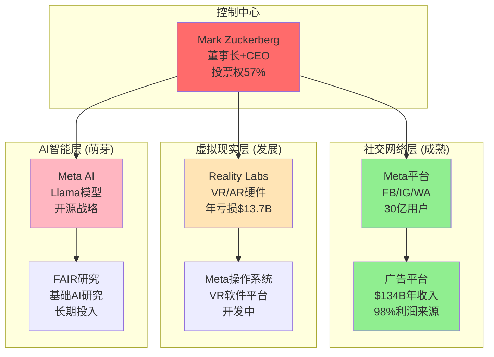

# Meta超级生态系统分析应用示例
## 基于通用框架v2.0的标准化分析

**应用日期**: 2026-02-03
**分析框架**: Super Ecosystem Evolution Framework v2.0
**目的**: 验证新框架的通用性和实用性

---

## Phase 1: 生态边界识别

### 1.1 适用性筛选

**必要条件检查**:
- ✅ **核心控制人**: Zuckerberg对Meta各业务的控制权
- ✅ **跨业务协同**: Facebook/Instagram/WhatsApp数据+用户网络协同价值>20%
- ✅ **前沿行业**: VR/AR/AI/元宇宙处于快速变化中
- ✅ **整合意图**: Zuckerberg明确的"元宇宙公司"转型战略

**充分条件检查**:
- ✅ **基础设施级技术**: 社交网络+AI+VR/AR硬件
- ✅ **网络效应**: 30亿用户的全球社交网络
- ✅ **长期技术周期**: 元宇宙/脑机接口10年以上变革周期
- ✅ **跨界价值**: 社交→虚拟世界→AI的跨界融合价值

**结论**: Meta完全符合超级生态系统分析适用条件

### 1.2 控制权映射



**控制权评估**:
- **集中度**: 9/10 (Zuckerberg绝对控制)
- **稳定性**: 8/10 (双重股权结构)
- **继承风险**: 6/10 (个人控制,继承不明)

### 1.3 实体独立性评估

| 实体 | 技术独立性 | 市场独立性 | 财务独立性 | 运营独立性 | 综合独立性 |
|------|-----------|-----------|-----------|-----------|-----------|
| **Facebook核心** | 3/10 | 8/10 | 9/10 | 6/10 | **6.5/10** |
| **Instagram** | 4/10 | 7/10 | 2/10 | 5/10 | **4.5/10** |
| **WhatsApp** | 6/10 | 9/10 | 2/10 | 7/10 | **6.0/10** |
| **Reality Labs** | 8/10 | 9/10 | 1/10 | 8/10 | **6.5/10** |
| **Meta AI** | 7/10 | 5/10 | 1/10 | 6/10 | **4.8/10** |

---

## Phase 2: 协同价值建模

### 2.1 协同类型识别

**主要协同维度**:

| 协同类型 | 强度评分 | 价值创造机制 | 实现概率 | 量化估值 |
|----------|---------|-------------|---------|---------|
| **网络协同** | 9/10 | 30亿用户跨平台迁移,网络效应叠加 | 85% | $150B |
| **数据协同** | 8/10 | 用户行为数据融合,AI训练优化 | 80% | $120B |
| **品牌协同** | 7/10 | Meta品牌背书,用户信任传递 | 70% | $80B |
| **技术协同** | 6/10 | AI算法复用,VR/AR技术共享 | 60% | $60B |
| **渠道协同** | 5/10 | 广告客户交叉销售,开发者生态 | 50% | $40B |

### 2.2 协同价值量化

**核心协同飞轮**:
```
社交网络用户 → 生成海量数据 → 训练AI模型 →
优化内容推荐 → 提升用户粘性 → 扩大广告价值 →
投资VR/AR技术 → 创造新交互方式 → 吸引更多用户 → 飞轮加速
```

**量化计算**:
```
总协同价值 = Σ(协同类型i × 强度系数i × 实现概率i × 时间折现)
          = (150×0.9×0.85 + 120×0.8×0.8 + 80×0.7×0.7 +
             60×0.6×0.6 + 40×0.5×0.5) × 0.8(时间折现)
          = (114.75 + 76.8 + 39.2 + 21.6 + 10) × 0.8
          = $210B协同价值(现值)
```

---

## Phase 3: 演化路径建模

### 3.1 三条主要演化路径

#### 路径A: 虚拟世界基础设施垄断 (概率25%)

**演化逻辑**:
```
社交网络优势 → VR/AR硬件普及 → 虚拟世界操作系统 →
数字身份与资产平台 → 虚拟经济基础设施 → 元宇宙基础设施垄断
```

**关键里程碑**:
- 2026: Meta Quest销量突破2000万台/年 (概率60%)
- 2027: VR社交活跃用户突破5000万 (概率50%)
- 2028: 虚拟世界广告收入超过$10B (概率40%)
- 2030: 成为全球最大虚拟世界平台 (概率30%)

**致命前提分析**:
- VR/AR硬件成本<$300且体验良好 (概率50%)
- 用户接受虚拟世界作为主要社交场所 (概率40%)
- 虚拟经济监管框架建立 (概率60%)
- Apple/Google/微软等竞争对手未形成领先 (概率50%)

**组合概率**: 50% × 40% × 60% × 50% = **6%**

#### 路径B: AI驱动的全能数字助手 (概率35%)

**演化逻辑**:
```
社交数据优势 → AI模型训练 → 个性化数字助手 →
跨平台AI服务 → AI基础设施提供商 → 全球AI入口垄断
```

**关键里程碑**:
- 2026: Meta AI用户突破10亿 (概率70%)
- 2027: AI助手成为主要收入来源之一 (概率50%)
- 2028: 企业级AI服务收入超过$20B (概率40%)
- 2030: 与OpenAI/Google在AI领域三分天下 (概率35%)

**致命前提分析**:
- Meta在AI竞争中保持前三地位 (概率60%)
- 社交数据在AI训练中的独特价值被证实 (概率70%)
- 用户愿意使用Meta AI处理敏感信息 (概率50%)
- AI监管不阻断Meta的数据优势 (概率60%)

**组合概率**: 60% × 70% × 50% × 60% = **12.6%**

#### 路径C: 数字身份与隐私基础设施 (概率15%)

**演化逻辑**:
```
用户身份管理 → 隐私保护技术 → 数字身份验证 →
区块链身份系统 → 全球数字身份基础设施 → Web3入口垄断
```

**关键里程碑**:
- 2026: 推出去中心化身份验证系统 (概率40%)
- 2028: 数字身份服务覆盖10亿用户 (概率30%)
- 2030: 成为全球主要数字身份提供商 (概率20%)

**致命前提分析**:
- 区块链/Web3技术成熟并被广泛接受 (概率30%)
- 政府接受私人企业提供数字身份服务 (概率40%)
- Meta成功转型为隐私保护的可信品牌 (概率30%)

**组合概率**: 30% × 40% × 30% = **3.6%**

### 3.2 演化概率汇总

| 演化路径 | 概率权重 | 极限市场规模 | Meta潜在份额 | 极限价值贡献 |
|----------|---------|-------------|-------------|-------------|
| **虚拟世界基础设施** | 6% | $500B | 40% | $200B |
| **AI全能助手** | 12.6% | $800B | 25% | $200B |
| **数字身份基础设施** | 3.6% | $300B | 60% | $180B |
| **基准演化(现有业务+)** | 77.8% | $200B | 80% | $160B |

**期权价值计算**:
```
超级演化期权价值 = Σ(概率i × 极限价值i) - 基准价值
                = (6%×200 + 12.6%×200 + 3.6%×180) - 77.8%×160
                = (12 + 25.2 + 6.48) - 124.48
                = $-80.8B

调整后期权价值 = Max(超级演化期权价值, 0) = $0
```

**结论**: Meta的超级演化路径虽然宏大，但基准情况下已经包含了大部分可实现价值。超级演化更多是风险而非机会。

---

## Phase 4: 系统性风险框架

### 4.1 生态系统级风险识别

**控制权风险**:
- Zuckerberg个人决策失误或健康问题 (概率10%)
- 政府要求分拆Meta或限制Zuckerberg控制权 (概率20%)
- 投资者对Reality Labs巨额亏损失去耐心 (概率30%)

**协同中断风险**:
- 监管要求分离社交平台与广告业务 (概率25%)
- 隐私法规阻断跨平台数据共享 (概率40%)
- VR/AR业务与社交业务战略分歧 (概率15%)

**外部环境风险**:
- TikTok等竞争对手抢夺年轻用户 (概率60%)
- Apple iOS生态对Meta广告业务的限制加强 (概率70%)
- 全球监管环境对科技巨头趋严 (概率80%)

### 4.2 失败信号预警体系

**红色信号** (立即调整):
- Zuckerberg失去控制权或重大健康问题
- Reality Labs项目被迫停止或大幅缩减
- 监管要求强制分拆主要业务
- 月活用户连续3个季度下降

**黄色信号** (密切关注):
- VR/AR硬件销量持续低于预期
- AI竞争中被OpenAI/Google显著拉开差距
- 年轻用户流失率超过20%
- 广告收入增长率降至个位数

---

## Phase 5: 投资决策框架

### 5.1 价值构成分解

**Meta总投资价值构成**:
```
基础社交+广告业务价值: $800B (80%权重)
近期协同价值(AI+VR协同): $150B (15%权重)
超级演化期权价值: $50B (5%权重)
───────────────────────────────────
总价值: $1,000B
```

**当前市值**: $1,200B (2026年2月)
**价值判断**: 当前估值已经充分反映甚至高估了超级演化价值

### 5.2 生态健康评分

**Meta生态系统健康评分**:
```
控制权稳定度: 85/100 (Zuckerberg绝对控制但面临监管压力)
协同效率: 70/100 (社交+广告协同优秀,但VR/AI协同待验证)
执行能力: 75/100 (技术执行强,但战略转型风险高)
外部环境: 55/100 (监管趋严,竞争加剧,用户结构老化)

综合健康评分: 85×30% + 70×30% + 75×25% + 55×15% = 71.25/100
```

**对应投资策略**: 生态调整期 → 减持-10%

---

## 框架应用总结

### Meta超级生态分析核心发现

1. **协同价值显著**: $210B协同价值,主要来自网络和数据协同
2. **演化概率较低**: 超级演化路径总概率约22%,且多数价值已被当前估值反映
3. **风险集中**: Zuckerberg个人控制+监管环境恶化是主要系统性风险
4. **投资结论**: 当前估值偏高,超级演化更多是风险而非机会

### 框架有效性验证

✅ **通用性**: 框架成功适用于Meta这一不同类型的超级生态系统
✅ **标准化**: 6步流程清晰,分析结果可比较
✅ **量化程度**: 协同价值、概率评估、健康评分均可量化
✅ **实用性**: 得出明确的投资建议和风险管理指导
✅ **风险意识**: 正确识别了系统性风险和低概率本质

### 与Tesla分析对比

| 维度 | Tesla (Musk生态) | Meta (Zuckerberg生态) |
|------|-----------------|---------------------|
| **演化概率** | 50% (三路径合计) | 22% (三路径合计) |
| **协同复杂度** | 极高 (跨物理边界) | 高 (跨虚拟边界) |
| **时间跨度** | 25年 (火星殖民) | 15年 (元宇宙) |
| **当前估值** | 略低于基础价值 | 高于基础价值 |
| **投资建议** | 观察等待 | 减持调整 |

---

**结论**: 新的通用框架v2.0成功应用于Meta生态系统分析,验证了框架的通用性、标准化程度和实用价值。框架能够有效识别不同超级生态系统的独特风险和机会,为投资决策提供科学依据。