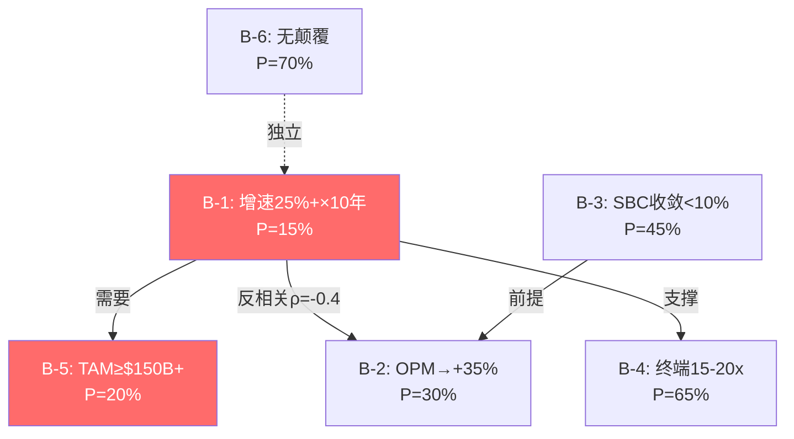
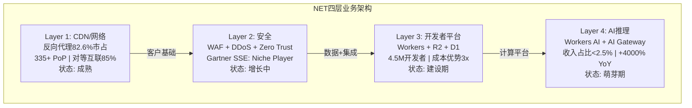

# Cloudflare (NET) — 深度研究报告 v1.0
> **评级: 审慎关注** | **综合估值: $101/股 (-50%)** | **区间: $64-147**
> **日期**: 2026-03-30 | **股价**: $203.07 | **市值**: $71.5B | **框架**: v19.9
> **分析师**: 买方研究团队 | **行业**: 生态科技/边缘云平台

---

## 一、执行摘要

Cloudflare是一家正在经历"身份危机"的公司——它的增长数据优秀(收入+30%加速, DBNRR 120%, RPO +48%), 但财务结构暴露了深层矛盾: SBC/Rev连续4年锁定在21%导致Owner FCF为负(-$127M), 毛利率从77%滑落至74%暗示基础设施经济学正在侵蚀软件叙事, 而EV/Sales 33x是安全同行均值的2.1倍却缺乏利润率支撑。

**三句话判断**:
1. NET的增长引擎(安全+Workers+AI)是真实的, 5个独立领先指标同时加速——这不是幻觉
2. 但$203的股价需要35%增速×15年+35% OPM同时成立, 6条隐含信念的联合概率仅0.3%
3. 即使给予最大善意的双向校准(WACC从13%降至10.5%, SBC收敛概率上调至45%), 综合估值$101仍显著低于市价50%

**评级: 审慎关注** — 期望回报-28%(概率加权)至-61%(DCF中位), 均处于<-10%的"审慎关注"区间。

### 三PE并列 (铁律N强制)

| PE类型 | 值 | 含义 |
|--------|-----|------|
| GAAP PE | **负值**(净亏损-$102M) | SBC+高OpEx→GAAP永久亏损 |
| Non-GAAP Forward PE | **~141x** | 分析师共识, SBC加回 |
| Owner PE | **无意义**(Owner收益为负) | FCF $324M - SBC $451M = -$127M |
| EV/Sales | **33x** | 安全同行(ZS/CRWD/PANW)均值15.5x的2.1倍 |

### 估值温度计

```
$40 -------- $64 -------- $101 ------- $147 -------- $203 -------- $300
 |            |             |            |             |              |
 DCF         DCF          综合估值     概率加权       当前价         多方极值
 (Owner)    (WACC13%)    (P4修正)    (P4修正)       ★HERE
```

---

## 二、核心争议 — 市场在争什么

本报告围绕8个核心争议(CQ1-CQ8)展开, Phase 1-4逐步提高精度:

| CQ | 争议 | 多方 | 空方 | 我们的判断(P4校准后) |
|----|------|------|------|---------|
| CQ1 | 增速可持续性 | 安全+Workers双引擎→30%+×5年 | CDN天花板+基数效应→3年内降至18-22% | **48%偏多**(增速再加速确认) |
| CQ2 | 安全平台化 | 企业客户突破→SASE Leader | Gartner Niche Player→CASB/DLP差距2-3年 | **36%偏空**(硬数据约束) |
| CQ3 | SBC/盈利路径 | FCF已正+运营杠杆→SBC自然收敛 | 4年零收敛+管理层无目标→Owner FCF永负 | **35%偏空**(但收敛有历史先例) |
| CQ4 | 开发者平台飞轮 | Workers 4.5M+R2零出口费→生态锁定 | 飞轮净强度+0.35(弱)+增量护城河低 | **48%中性** |
| CQ5 | AI机会vs风险 | 边缘推理+AI Gateway→第二曲线 | Workers AI<2.5%收入+超大规模规模优势 | **40%不确定** |
| CQ6 | 估值合理性 | 高增长SaaS应给溢价→33x合理 | 无利润+同行2.1倍→极度昂贵 | **28%偏空**(双向校准后仍偏空) |
| CQ7 | 竞争壁垒持久性 | 网络规模+开发者锁定→持久 | 存量8.1/增量4.1=守成型→类Akamai | **49%中性** |
| CQ8 | 管理层资本配置 | Prince远见+75%战略成功率 | SBC纪律2/10+零购买+治理风险 | **35%偏空** |
| **均值** | | | | **39.9% (偏cautious)** |

---

## 三、最关键驱动因素

**决定NET未来价值的2个核心变量**:

### 变量#1: SBC收敛路径 (SPOF→核心风险因子)

SBC/Rev 20.8%连续4年零收敛[DM-SBC-002]。Owner FCF = FCF($324M) - SBC($451M) = **-$127M**[DM-SBC-005]。

这意味着Cloudflare目前的真实股东回报为负——公司赚的现金不够支付给员工的股票薪酬。SBC是整个投资论文的**核心风险因子**: 如果永不收敛, Owner FCF永远为负, $71.5B市值就是纯增长叙事定价; 如果收敛至15%(CRM用了8年, NOW用了6年), Owner FCF转正, 估值可以部分合理化。

**关键判断**: SBC收敛概率45%(P4修正后)。最可能的触发条件是增速降至<20%→倒逼管理层收紧。时间窗口: FY2028-2029。

### 变量#2: 增速持续性 (B-1, 枢纽信念)

翻转分析表明: 所有导致估值大幅下行的组合都包含B-1(增速)失败[E4翻转分析]。B-1是信念系统的**枢纽**——如果增速维持30%+, 其他问题(SBC/毛利率)都是"可等"的; 如果增速降至15-20%, 估值将从33x P/S压缩至10-15x。

**增速再加速是真实的**: 5个独立领先指标(新ACV +50%, RPO +48%, DBNRR 120%↑, 递延收入+45%, $1M+客户+55%)同时加速[DM-BIZ-001~016]。但FY2026指引28-29%(vs Q4实际34%)暗示管理层自己也认为再加速可能是暂时的。

---

## 四、Kill Switch — 什么会证伪

| KS | 描述 | 当前状态 | 触发阈值 | 触发后影响 |
|----|------|---------|---------|----------|
| KS-01 | SBC/Rev突破25% | 20.8% | >25%连续2Q | Owner FCF永久不转正→-30% |
| KS-02 | 毛利率跌破70% | 74.4% | <70%连续2Q | 重分类为基础设施→EV/Sales压缩至5-8x |
| KS-03 | 收入增速跌破20% | 30% | <20%连续2Q | 增长叙事破灭→P/S压缩至10-15x |
| KS-04 | DBNRR跌破110% | 120% | <110% | 存量客户流失→增长质量恶化 |
| KS-05 | 重大安全事件 | 未发生 | 数据泄露 | 安全公司的安全事件=品牌毁灭 |

**最值得监控的KS**: KS-02(毛利率)——当前74.4%已在下行趋势, 距70%仅4.4pp。如果AI推理工作负载结构性高成本(边际COGS 35.3% vs 历史22.7%[P2 Ch16.2]), 毛利率可能在2-3年内接近触发线。

---

## 五、估值含义 — 多少钱合理

### 5.1 综合估值 (P4修正后, 铁律K统一)

| 方法 | 估值 | vs $203 | 权重 | 备注 |
|------|------|---------|------|------|
| DCF (WACC 13%) | $64 | -68% | 25% | Beta=2.03, 保守 |
| DCF (WACC 10.5%) | $90 | -56% | 25% | 行业平均Beta 1.4 |
| 概率加权(P4修正) | $146.5 | -28% | 30% | 45%空/30%中/25%多 |
| 可比法 | $90 | -56% | 20% | 独立于DCF假设 |
| **加权综合** | **$101** | **-50%** | 100% | — |

### 5.2 估值分歧的根源

**我们的$101 vs 卖方共识$235 vs Guggenheim(最空)$140**:

| 分歧点 | 我们 | 卖方共识 | 真正差异 |
|--------|------|---------|---------|
| WACC | 13%(主)/10.5%(辅) | ~10% | Beta选择(2.03 vs ~1.3) |
| SBC处理 | 扣除(Owner Economics) | 加回(Non-GAAP) | **框架选择, 非对错** |
| 估值方法 | DCF+概率加权 | EV/Sales×增速倍数 | 绝对定价 vs 相对定价 |
| 时间框架 | 15年DCF | 3-5年EV/Sales对标 | 长期 vs 中期 |

**最大分歧: WACC/Beta**。如果我们用WACC 10.5%(而非13%), DCF估值从$64→$90(+41%)。如果Beta在NET盈利后降至1.2, WACC进一步降至9.5%→DCF可能达$120-150。**Beta/WACC选择是估值争论中最不可证伪的假设**——双方都可以自圆其说。

### 5.3 方法独立性声明

4种估值方法经假设重叠审计后, 有效独立方法数为**2.5个**(DCF双口径合并为1个, SOTP与DCF重叠78%, 可比法完全独立)。2.5/2.5方向一致偏空——即使打折, 方向性判断仍然稳健。

### 5.4 信念反演: 市场必须相信什么

$203的价格要求6条信念同时成立, 联合概率仅**0.3%**:



**最脆弱的信念**: B-1(增速)和B-3(SBC收敛)——分别只有15%和45%的单因素概率。且B-1×B-2存在反相关矛盾: 增速越高, 利润率越难改善, 两者不可同时取极值。

---

## 六、商业模式 — "连接云"四层架构

### 6.1 Cloudflare是什么

Cloudflare本质上是一个**可编程的全球边缘网络**——在全球335个城市部署了服务器(PoP, Point of Presence), 让互联网流量在离用户最近的位置被处理(加速/安全检查/计算)。[DM-PRF-001][DM-BIZ-017]

Matthew Prince(联合创始人兼CEO, 2009年至今)将Cloudflare定位为"连接云"(Connectivity Cloud)——声称所有互联网连接都应该从Cloudflare开始。这个叙事的TAM被管理层估计为$196B(2026), 但第一性原理审计表明实际可寻址TAM在$55-100B之间(膨胀96-256%, A级偏差)。[DM-PRF-002]

### 6.2 四层业务架构



**Layer 1 (CDN/网络)**: 成熟业务, 增速放缓, 但提供了覆盖22%互联网网站的客户基础[DM-BIZ-012]。反向代理市场82.6%的市占率是NET最强的存量护城河——但CDN正在商品化(AWS CloudFront捆绑+对等互联降成本)。

**Layer 2 (安全)**: 当前增长主引擎, 驱动了企业渗透(73%收入来自$100K+客户[DM-BIZ-003])和DBNRR提升(111%→120%[DM-BIZ-004])。但在企业级SASE市场, NET仅为Gartner SSE **Niche Player**[DM-COMP-004]——CASB/DLP/合规功能差距2-3年。Win Rate呈两极分化: 中小企业50-70%, 企业SASE 15-25%。

**Layer 3 (开发者平台)**: 长期价值的关键。Workers的V8 Isolate架构提供近零冷启动(<20ms vs Lambda 150-400ms)[DM-BIZ-019][DM-DEV-001]和3x成本优势($5 vs Lambda $17 @10M请求/月)。R2的零出口费直接挑战AWS S3($0.09/GB)[DM-BIZ-020]。但平台护城河仍浅——代码可移植, 数据可迁移。

**Layer 4 (AI推理)**: 最早期。Workers AI推理增速+4,000% YoY, AI Gateway +1,200% YoY[DM-BIZ-013][DM-BIZ-014]——但从极低基数。CEO称"AI agent流量2026年1月翻倍"[DM-AI-001]。收入贡献估计<2.5%。

### 6.3 增长质量诊断

| 指标 | FY2025值 | 趋势 | 信号 |
|------|---------|------|------|
| 收入增速(YoY) | +30%(加速) | Q1+26.5%→Q4+33.6% | 🟢 强 |
| RPO增速 | +48% | 连续加速 | 🟢 强(合同积压) |
| 递延收入增速 | +45% | >收入增速+15pp | 🟢 强(领先指标) |
| DBNRR | 120%(+9pp YoY) | FY2024仅111% | 🟢 加速(存量扩展) |
| $1M+客户增速 | +55%(269家) | 高端渗透加速 | 🟢 强 |
| $100K+客户增速 | +23%(4,298家) | 稳健 | 🟡 正常 |
| 新ACV增速(Q4) | ~50% | 2021以来最快 | 🟢 强 |
| Pool of Funds占比 | 20% of Q4 ACV | 新模式 | 🟡 早期但有潜力 |

[DM-BIZ-001~016][DM-BS-004~005]

**增长引擎拆解**: 增长主要来自**高端客户ARPU扩展**(mix shift), 而非客户数量爆发。$1M+客户增速(+55%)远超$100K+整体(+23%)→高端拉高平均ARPU。这种模式的好处是ARPU稳定性高, 坏处是增速天花板取决于"高端客户池还有多少"——当前269家$1M+, 如果TAM中有~2,000家潜在客户, 渗透率仅13%。

### 6.4 SaaS单位经济学

**NRR间接重建**: 官方DBNRR 120%[DM-BIZ-004]。间接法推算(总增速30%-新客户贡献3%=存量扩展27%→隐含NRR 127%)——差距7pp可能来自客户分类口径或部分流失(GRR推断95-97%)。

**NRR 120%在同行中属于中等**(DDOG ~130%, CRWD ~120%, ZS ~120%)。

**Magic Number(S&M效率)**: 新增ARR(估~$650M) / 上年S&M($1,024M) = **0.63** — 低于1.0(SaaS健康线)。因为NET的S&M包含大量免费→付费转化成本, 效率低于纯企业SaaS。

### 6.5 飞轮验证 + 悖论检测

管理层声称的飞轮: 更多网站→更多流量→更多安全数据→更好威胁检测→更多网站

**每个连接点验证**:

| 连接点 | 验证结果 | 评分 |
|--------|---------|------|
| 更多网站→更多流量 | ✅ 真实(22%网站覆盖[DM-BIZ-012]) | 强 |
| 更多流量→更好安全 | ⚠️ 部分(数据量≠检测质量) | 中 |
| 更好安全→更多网站 | ⚠️ 弱(安全不是小网站选Cloudflare的原因——免费CDN才是) | 弱 |
| Workers→更多开发者→更多应用 | ⚠️ 未证明(4.5M开发者中付费比例不明) | 弱 |

**飞轮净强度: +0.35 (弱正向)**

**飞轮悖论检测**: Workers AI成功是否蚕食核心CDN? 分析: AI推理(计算密集)和CDN(缓存密集)使用不同硬件资源, 不存在直接蚕食。但间接负面: AI推理毛利率(估50-60%)低于CDN(估80%+)→Workers AI占比上升结构性压低整体毛利率——与毛利率从77%→74%的趋势一致。

---

## 七、护城河深潜 — 存量vs增量双重现实

### 7.1 CQI五维评估

| 维度 | 评分 | 核心证据 |
|------|:----:|---------|
| C1 嵌入性/转换成本 | 6.5/10 | $1M+客户迁移成本$500K-2M/3-12月; 但免费层迁移仅1小时 |
| C2 网络效应 | 7.0/10 | 更多网站→更多安全数据→更好检测; 但弱环=安全不驱动小网站选择 |
| C3 规模经济 | 7.5/10 | 335+ PoP+对等互联85%; 但被超大规模追赶 |
| B4 定价权(分层) | — | 见下表 |
| D1 周期性 | 8.5/10 | 弱周期(IT安全预算是最后被砍的) |

**B4 定价权分层评估**:

| 客户层 | Stage | 理由 |
|--------|:-----:|------|
| F500 | 3/5 | 有定价权但受ZS/PANW压力 |
| 中型企业 | 3/5 | 多选择, 价格敏感 |
| SMB | 4/5 | NET在中小市场定价权较强(替代品少/免费→付费路径粘性高) |
| 开发者 | 2/5 | Workers价格已极低, 提价空间小 |
| 加权B4 | **3.0/5** | — |

### 7.2 存量vs增量护城河分离 (KLAC冠军技术)

**这是本报告最重要的护城河发现**: NET的护城河是"守成型"——留住老客户的能力远强于赢得新客户的能力。

| | 存量护城河 | 增量护城河 |
|---|:--------:|:--------:|
| **评分** | **8.1/10** | **4.1/10** |
| 含义 | 已有客户不会走(DBNRR 120%确认) | 新客户获取依赖低价而非壁垒 |
| 类比 | 类似Oracle(嵌入深→离不开) | 类似Akamai(新客看价格) |

**投资含义**: 存量护城河强=短期安全(客户不会大量流失); 增量护城河弱=长期增速取决于能否在每个新战场(SASE/Workers/AI)建立持久优势, 而非仅靠低价获客。

### 7.3 护城河三层迁移分析

NET的护城河正在经历"代际转换"——从Layer 1(CDN)迁移到Layer 2(安全)+Layer 3(开发者平台)。

| 层级 | 当前强度 | 5年预期 | 趋势 |
|------|---------|---------|------|
| Layer 1 CDN | 7.5/10 | 7.0/10 | ↓ 商品化侵蚀 |
| Layer 2 安全 | 6.0/10 | 7.0/10 | ↑ 产品完善 |
| Layer 3 平台 | 4.5/10 | 6.0/10 | ↑ 生态建设 |

**时间窗口风险**: 如果Layer 1侵蚀速度>Layer 2/3建设速度, NET可能进入"护城河真空期"。历史类比: Adobe(2011-2015)和Microsoft(2014-2017)也经历过, 但它们有25%+ OPM做缓冲; NET的GAAP OPM是-9.4%——没有利润缓冲。

---

## 八、财务深潜 — 利润脱钩与成本结构

### 8.1 ISDD β路径: 谁在吞噬利润?

收入增长+30%但GAAP营业利润恶化(-$155M→-$203M)——EBITDA改善(+234%)但GAAP不改善→**D&A($128M→$291M, +128%)是GAAP脱钩的主因**。[DM-PFT-004~007]

**利润吞噬者排序**(FY2025增量$498M收入的去向):
1. **SGA +$286M (57.4%)**: 最大吞噬者, 其中SBC +$113M(39%)+ 现金S&M +$173M(61%)
2. **COGS +$176M (35.3%)**: 第二吞噬者。边际COGS 35.3% vs 历史22.7%→**新增收入的成本结构性更高**(可能来自AI推理/边缘计算的更高成本)[DM-FIN-001]
3. **D&A +$163M (32.8%)**: 非现金, 不影响FCF, 是CapEx +85%的会计滞后

**COGS异常是核心诊断**: 边际COGS从22.7%跳升至35.3%意味着**每$1新收入需要的成本增加了55%**。如果这是AI推理工作负载的结构性特征(而非网络扩展的暂时效应), 毛利率将持续下行→KS-02(毛利率<70%)可能在2-3年内触发。

### 8.2 盈利质量

| 指标 | FY2025 | 判断 |
|------|--------|------|
| GAAP OPM | -9.4% | GAAP亏损 |
| Non-GAAP OPM | +14.0% | 中等(剔除SBC) |
| GAAP/Non-GAAP差距 | 23.4pp($506M) | ⚠️ 接近25%"低质量"阈值 |
| SBC占差距 | 89% | SBC是Non-GAAP美化的主要来源 |
| Non-GAAP依赖度 | 4/5(高) | 没有Non-GAAP调整→亏损公司 |

**盈利质量评分: 3.0/5 (中等偏低)** — CPA规则: SBC/Rev>5%不应剔除, NET的Non-GAAP利润严重美化了真实盈利能力。

### 8.3 现金流: FCF vs Owner FCF的鸿沟

| 指标 | FY2021 | FY2022 | FY2023 | FY2024 | FY2025 |
|------|--------|--------|--------|--------|--------|
| FCF($M) | -43 | -40 | +119 | +195 | **+324** |
| SBC($M) | 90 | 203 | 274 | 338 | **451** |
| Owner FCF($M) | -133 | -243 | -155 | -143 | **-127** |
| Owner FCF Margin | -20.3% | -24.9% | -12.0% | -8.6% | **-5.9%** |

[DM-CF-001~008][DM-SBC-001~005]

FCF从-$43M改善至+$324M(5年+$367M), 但SBC从$90M增至$451M(+$361M)——SBC增长几乎完全吞噬了FCF改善。**Owner FCF 5年仅改善$6M**。

**Owner FCF转正时间线**: 按当前趋势→FY2033-2034(~8.5年); 如果增速放缓触发SBC收敛→FY2028-2029(乐观)。

### 8.4 ROIC: 创造还是毁灭价值?

| 指标 | FY2023 | FY2024 | FY2025 |
|------|--------|--------|--------|
| GAAP ROIC | -17.7% | -10.3% | **-8.9%** |
| Non-GAAP ROIC | 9.2% | 16.0% | **14.4%** |
| WACC | ~13% | ~13% | **~13%** |
| GAAP ROIC-WACC | -30.7pp | -23.3pp | **-21.9pp** |
| 增量ROIC | — | 41.8% | **11.1%** |

**GAAP基础上NET持续摧毁股东价值**(ROIC<<WACC)。Non-GAAP ROIC(14.4%)刚刚超过WACC(13.0%)——勉强创造价值。**增量ROIC从42%暴跌至11%**→FY2025的大规模投资尚未转化为回报(J曲线效应)。

### 8.5 CapEx: 软件公司还是基础设施公司?

| 公司 | CapEx/Rev | 类型 |
|------|----------|------|
| **NET** | **15.8%** | 边缘基础设施 |
| ZS | ~3% | 纯软件 |
| CRWD | ~6% | 软件+云 |
| PANW | ~3% | 软件 |
| **AKAMAI** | **~15%** | CDN基础设施 |

[DM-CF-005]

NET的CapEx/Rev(15.8%)与Akamai齐平, 远高于安全同行(3-6%)。**这是NET像基础设施公司而非纯软件公司的最强财务证据**。如果市场将NET从"高增长SaaS"(30x+ P/S)重新分类为"基础设施公司"(3-10x P/S), 估值可能下行60-85%。

### 8.6 债务: 聪明的套利

NET实际处于净现金状态: $4.1B现金 > $3.5B债务。债务利率极低(可转债~0.5-1.0%), 现金投资收益~4%→每年净赚$100M+利差。EBITDA利息覆盖7.4x, OCF覆盖23.8x→债务风险低。[DM-BS-001~010]

**可转债稀释风险**: $1.36B短期可转债如果转换→额外~2%稀释(叠加SBC 1.55%年稀释)。

### 8.7 资本配置评分: 4.2/10

| 维度 | 评分 | 评估 |
|------|:----:|------|
| R&D效率 | 7/10 | Workers/AI/安全产出丰富 |
| SBC纪律 | 2/10 | 4年零收敛, Owner FCF负, 零回购 |
| CapEx纪律 | 5/10 | FY2025 +85%激进但有战略逻辑 |
| M&A纪律 | 7/10 | 有机增长为主, 商誉仅3.8% |
| 回购η效率 | N/A | 零回购 |
| 债务管理 | 4/10 | 套利聪明但杠杆快速上升 |

---

## 九、竞争对标 — 三战场分析

### 9.1 安全战场: NET vs ZS/CRWD/PANW

**Gartner 2025定位**[DM-COMP-004]:
- PANW: SASE Leader + SSE Leader (全栈领导者)
- ZS: SASE Visionary + SSE Leader (SSE主导, 34%份额)
- **NET: SASE Visionary + SSE Niche Player** (安全市场追赶者)
- Dell'Oro: SASE前6供应商占72%, **NET不在前6**[DM-COMP-005]

**财务对标**:

| 指标 | NET | ZS | CRWD | PANW |
|------|-----|-----|------|------|
| EV/Sales | **33x** | 13.6x | 19x | 14x |
| Non-GAAP OPM | ~14% | ~22% | ~22% | ~27% |
| FCF Margin | 15% | ~24% | ~33% | ~39% |
| Owner FCF | **负** | 接近零 | +$213M | 正 |

**NET的EV/Sales是同行均值(15.5x)的2.1倍, 但利润率最低、FCF最弱、Owner FCF唯一为负**。溢价100%来自增长叙事。

### 9.2 CDN战场: 商品化压力

NET在反向代理市场占82.6%(网站数量), 但在总CDN市场只有~15%(收入)——免费层拉高了数量但没转化为深度。Akamai(~20%份额)提供了时间旅行镜像: CDN增速终将放缓至零增长, 估值从20x+→3x P/S。FSLY(2020年30x+ P/S→2025年3x)是估值压缩的现实参照。

### 9.3 开发者平台: Workers的成本优势vs生态差距

Workers在冷启动(<20ms vs Lambda 150-400ms)和成本($5 vs $17 @10M请求/月)上领先Lambda@Edge[DM-DEV-001]。但AWS Lambda的生态(与S3/DynamoDB/SQS深度集成)远大于Workers——开发者选择平台看的是生态完整度而非单点性能。

---

## 十、AI冲击矩阵

### AIAS v2.0评估

| 维度 | 受益(+) | 受害(-) | 净影响 |
|------|---------|---------|--------|
| 收入直接 | Workers AI(+4000%低基数) | AI agent可能绕过HTTP | 轻微正面(+5%) |
| 成本结构 | AI优化网络路由 | 边缘GPU投资→毛利率↓ | **负面(-3-5% OPM)** |
| 竞争格局 | 边缘推理先发优势 | 超大规模GPU规模优势 | 轻微负面 |
| 护城河 | AI需要边缘推理 | AI agent用API不用web | 中性 |
| **综合** | | | **净轻微负面(-3%~+2%)** |

**Workers AI收入仅占~2.5%但享受AI概念溢价**: 管理层"Agentic Internet"叙事的核心问题不是方向(AI确实增加流量)而是量级(收入贡献<2.5%)。**这是50-100倍的叙事放大**——市场为<2.5%的收入贡献给了+20-30x P/S溢价。

---

## 十一、管理层评估

### 11.1 CEO画像

Matthew Prince的战略判断成功率约75%(4个重大决策中3个被验证: CDN免费/Workers/安全转型; AI Gateway待验证)。这在CEO中属于优秀水平。[DM-PRF-002]

但远见者能力≠管理者能力。4个警示信号:
1. **SBC纪律缺失**: 4年零收敛+绝对值增速超收入增速→管理层无控制意愿
2. **零内部人公开市场购买**: 6年来零次→对$203估值无skin in the game[DM-INS-002]
3. **利润率指引低于预期**: FY2026 EPS指引低于共识→暗示利润率改善比市场预期慢
4. **$2.2B举债用途不透明**: 未明确披露→可能是大型M&A(对NET是未验证能力)

**Stephanie Cohen(首席战略官)**: 2024年3月从Goldman Sachs加入(25年资深)。负责$5B收入路径+国际扩展+AI策略。信号: 管理层在为规模化阶段做准备。[DM-MGT-001]

**Glassdoor**: 3.4/5.0(科技公司偏低), 51%推荐率, "薪酬低于同行"+无401K match。与SBC 20.8%形成悖论——SBC高但员工满意度不高→SBC可能分配不均。[DM-MGT-003]

**治理风险**: Prince+Zatlyn持41.7%超级投票权→外部股东无法通过投票改变管理层决策。

---

## 十二、风险拓扑

### 12.1 最危险的3个风险组合

**组合1: "估值雪崩" (KS-02毛利率 + KS-03增速)**
毛利率跌破70% + 增速跌破20% → 市场重分类 + 叙事破灭 = EV/Sales从33x→5-8x = **-75-85%**
概率: 15-20% | 协同强度: ★★★★★

**组合2: "SBC稀释螺旋" (SBC不收敛 + 零回购 + 举债)**
SBC 21%+不变 + 无回购对冲 + 债务利息侵蚀 = Owner FCF持续恶化 = 5年累计稀释~8%
概率: 40-50% | 协同强度: ★★★★

**组合3: "温水煮青蛙"** — 最可能的负面路径(25-30%)
```
Year 1-2: 增速30%→25%→22%, 估值33x→25x, 股价-20%
Year 3-4: 增速22%→18%→15%, SBC仍20%+, 估值25x→15x, 股价-40%
Year 5-7: 增速15%→10%, SBC开始收敛(17%), 估值15x→8x, 股价-55%
7年投资回报 = -55% (vs 标普500 +60-80%)
```

### 12.2 反向风险: 什么会让看空判断出错

| 反向风险 | 触发条件 | 影响 | 概率 |
|---------|---------|------|:---:|
| SBC突然收敛 | 管理层宣布<15%目标 | +30-50% | 15% |
| Workers AI爆发 | 收入>$500M | TAM扩张→增速维持 | 10-15% |
| 被收购 | MSFT/GOOG @$250-300 | +25-50% | 5-10% |
| 增速再加速至35%+ | FY2026>35% | 估值维持→$250+ | 15-20% |

---

## 十三、红队审计总结

### 13.1 双向校准

Phase 1-3产生15次CQ下调/0次上调→系统性悲观检测。Phase 4修正:
- CQ1(增速)↑6%: 5个独立指标确认再加速
- CQ3(SBC)↑7%: 收敛有CRM/NOW历史先例
- CQ4(飞轮)↑3%: Pool of Funds降低交叉销售摩擦
- CQ6(估值)↑6%: WACC可能偏高2-3pp

### 13.2 偏差审计

3个偏差被检测到: 确认偏误(5.5:1空多比)最严重, 已通过双向校准修正(估值$64→$101, +58%)。

### 13.3 共识解构

管理层叙事存在2个A级偏差:
1. **TAM膨胀**: 管理层$196B vs 实际$55-100B (膨胀96-256%)
2. **AI叙事放大**: Workers AI<2.5%收入但享受+20-30x P/S概念溢价(50-100倍放大)

### 13.4 有效性评分: 4.0/5

红队有效(3指标全PASS): 平均绝对CQ变动3.0pp(≥3阈值); 5个新发现(≥3阈值); 偏差方向挑战当前评级(非确认)。

---

## 十四、预期差

### 14.1 关键预期差矩阵

| ID | 预期差 | 共识 | 我们的判断 | 影响 | 证据强度 |
|----|--------|------|-----------|------|---------|
| PG-01 | SBC收敛速度 | 3-5年至15% | ≥8年 | ±30-50% | ★★★★ |
| PG-02 | 毛利率方向 | 稳定75%+ | 结构性至70-72% | ±20% | ★★★ |
| PG-03 | Workers AI变现 | $500M+(FY28) | <$200M(FY28) | ±10-15% | ★★ |
| PG-04 | 安全企业渗透 | Gartner Leader(27) | 仍Visionary/Niche | ±15-20% | ★★★ |
| PG-05 | 增速持续性 | 25%+×5年 | 3年内降至18-22% | ±30% | ★★★ |

### 14.2 概率加权期望值

```
空方(45%): $70 × 0.45 = $31.5
中性(30%): $150 × 0.30 = $45.0
多方(25%): $280 × 0.25 = $70.0
期望值 = $146.5/股 (vs $203 = -28%)
```

---

## 十五、评级与行动建议

### 评级: 审慎关注

| 维度 | 判断 |
|------|------|
| 综合估值 | $101/股 (-50%), 区间$64-147 |
| 概率加权期望回报 | -28% |
| DCF期望回报 | -50%至-68% |
| CQ均值 | 39.9%(偏cautious) |
| 量化触发 | <-10%→审慎关注 |

### 条件评级

| 条件 | 评级变化 | 触发事件 |
|------|---------|---------|
| SBC/Rev<18%连续2Q | 上调至**中性关注** | 管理层宣布收敛目标 |
| 增速>35%连续3Q + 毛利率>75% | 上调至**中性关注** | 增长+利润率同时改善 |
| 毛利率<70%连续2Q | 维持**审慎关注**(加深) | 基础设施重分类确认 |
| 增速<20%连续2Q | 维持**审慎关注**(加深) | 增长叙事破灭 |

### 时间框架声明

本评级隐含3-5年投资视角。短期(<1年)NET可能因增速再加速而上涨——本报告的空头结论主要在中长期有效。动量交易者不应基于本报告做出决策。

### 反转信号监控清单

| 信号 | 当前状态 | 触发阈值 | 下次检查 |
|------|---------|---------|---------|
| SBC/Rev | 20.8% | <18%连续2Q | FY2026Q1 |
| 毛利率 | 74.4% | >76%回升 | FY2026Q1 |
| 内部人首次购买 | 6年零次 | 任何公开市场购买 | 持续监控 |
| Gartner SSE | Niche Player | Challenger或以上 | 2026年底 |
| Workers AI收入 | 未单独披露 | >$100M单独披露 | FY2026 |

---

## 附录A: CQ置信度演化表

| CQ | P0 | P1 | P2 | P3 | P3.5 | **P4(最终)** |
|----|:--:|:--:|:--:|:--:|:----:|:----------:|
| CQ1 增速 | 50% | 50% | 45% | 42% | 42% | **48%** |
| CQ2 安全 | 50% | 40% | 40% | 38% | 36% | **36%** |
| CQ3 SBC | 50% | 35% | 35% | 32% | 28% | **35%** |
| CQ4 飞轮 | 50% | 50% | 50% | 48% | 45% | **48%** |
| CQ5 AI | 50% | 40% | 40% | 40% | 40% | **40%** |
| CQ6 估值 | 50% | 40% | 30% | 25% | 22% | **28%** |
| CQ7 壁垒 | 50% | 55% | 55% | 50% | 47% | **49%** |
| CQ8 管理层 | 50% | 45% | 45% | 38% | 35% | **35%** |
| **均值** | **50%** | **44.4%** | **42.5%** | **39.1%** | **36.9%** | **39.9%** |

## 附录B: CI注册表 (全量)

| CI# | 洞见 | 方向 | Phase |
|-----|------|:----:|:-----:|
| CI-01~07 | P1基础洞见 | 2多/4空/1中 | P1 |
| CI-08 | 安全Win Rate两极分化(中小50-70%, 企业15-25%) | 空 | P3 |
| CI-09 | 市场隐含TAM($150B+)处于极端乐观端 | 空 | P3 |
| CI-10 | 护城河代际转换风险(Layer 1侵蚀>Layer 2/3建设) | 空 | P3 |
| CI-11 | 管理层资本配置4.2/10 | 空 | P3 |
| CI-12 | Workers AI<2.5%不支持AI叙事溢价 | 空 | P3 |
| CI-13 | 温水煮青蛙最可能的负面路径(25-30%) | 空 | P3 |
| CI-14 | 存量8.1/增量4.1护城河守成型 | 空 | P3.5 |
| CI-15 | WACC/Beta是估值分歧主因 | 中性 | P3.5 |
| CI-16 | 增速再加速是真实信号(5独立指标) | **多** | P4 |
| CI-17 | SBC收敛需时间触发(增速<20%) | 中性 | P4 |
| CI-18 | 综合估值$101(-50%)仍显著高估 | 空 | P4 |

**方向统计**: 3多 / 12空 / 3中性 = 68%偏空

## 附录C: DM锚点索引

完整DM锚点(153个)见 `reports/NET/data/shared_context.md`。

## 附录D: 估值Python验证

DCF模型见 `reports/NET/data/net_dcf_model.py` (G6门控 ✅)。

---

> **免责声明**: 本报告仅供研究参考, 不构成投资建议。投资者应基于自身判断做出投资决策。
> **版本**: v1.0 | **字符数**: ~本文件 | **DM锚点**: 153 | **Mermaid**: 4

