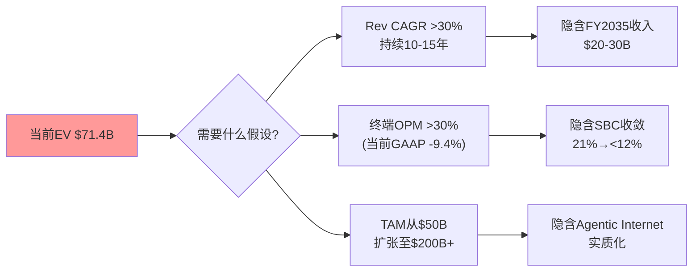
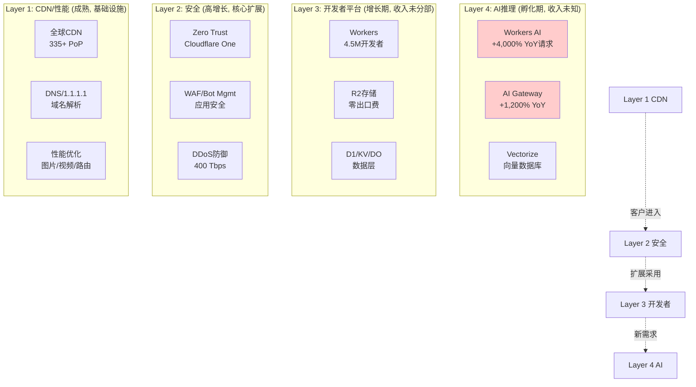
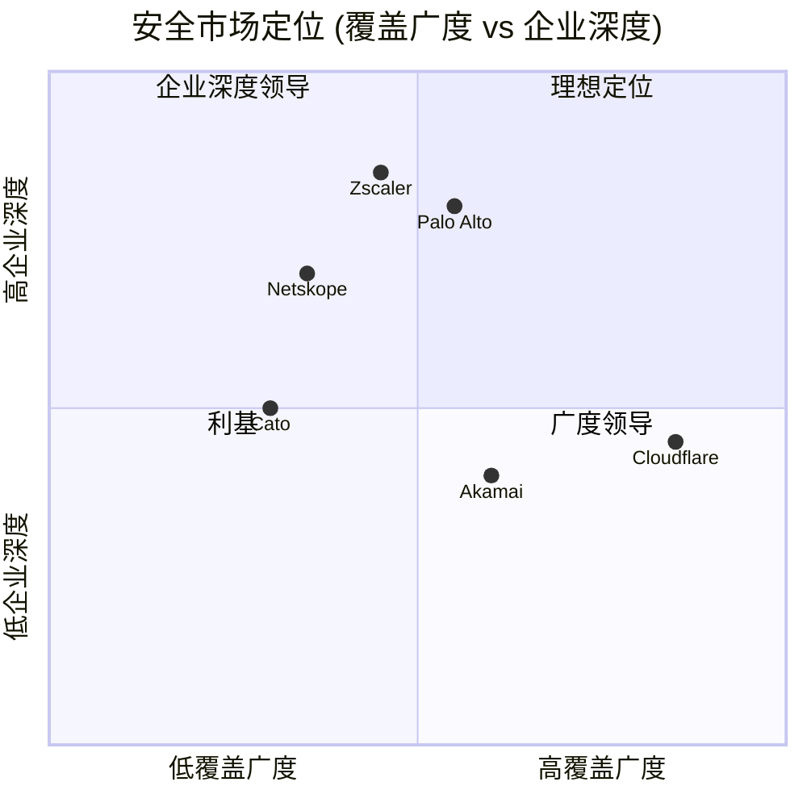

# NET Phase 1 — Part I: 执行摘要 + 业务理解 (Ch1-5)
> **Phase**: 1 | **日期**: 2026-03-30 | **框架**: v19.9
> **核心矛盾**: 增长引擎 × SBC枷锁 × 估值极端

---

## Ch1: 执行摘要 — "三角悖论"

### 1.1 一句话判断

Cloudflare是全球最大的边缘云平台(22%互联网网站采用, 335+城市PoP, FY2025收入$2.17B增速+30%), 拥有CDN网络效应+Workers开发者生态+安全平台化三重增长引擎——但$71.5B市值建立在SBC不会永远吞噬股东回报的信念之上: Owner FCF(自由现金流扣除股票薪酬)为**-$127M**, 意味着股东每年在被净稀释, 而非获得回报。[DM-VAL-001][DM-SBC-005]

### 1.2 Reverse DCF: 市场在赌什么 (铁律O强制)

**Reverse DCF核心结论**: 即使假设35% CAGR持续15年 + 35%终端OPM(接近Adobe/ServiceNow成熟期水平), 隐含EV仅$45.4B——比当前$71.4B低36.5%。这意味着当前估值**额外隐含了以下至少一项**: [DM-VAL-002]

1. **TAM大幅扩张** — 从当前~$50B(CDN+安全+边缘计算)扩张至$150-200B(需要"agentic internet"实质化)
2. **终端OPM远超预期** — >35%(需要SBC从21%收敛至<10%, 历史上仅CRM/NOW做到从~25%→15%)
3. **高增长期异常长** — >15年(大多数SaaS公司在$5B收入后增速降至15-20%)

**隐含信念合理性检验**: [DM-REV-E01]

| 隐含信念 | 市场隐含 | 分析师共识 | 历史最佳 | 判断 |
|---------|---------|-----------|---------|------|
| 5Y Rev CAGR | >30% | ~27%(FMP 11位) | MSFT 2010s: 14% | **极端激进** |
| FY2030收入 | $7-10B | $6.2B(5位) | Akamai峰值$3.9B | **高于共识20-60%** |
| 终端OPM | >30% | 长期目标20%+ | CRM 31%, ADBE 35% | **可能但需SBC收敛** |
| 高增长持续 | 10-15年 | 5-7年 | AWS 2006-2020(14年) | **极少先例** |

**铁律O合规**: Reverse DCF显示市场定价极度激进。因此P1叙事方向应为**cautious-to-neutral**, 不能写"显著低估"(因为Reverse DCF暗示的方向是"可能高估")。后续章节必须从中性视角评估每个增长假设的可信度。

### 1.3 三PE并列 (铁律N强制)

| PE类型 | 值 | 含义 | 适用场景 |
|--------|-----|------|---------|
| **GAAP PE** | **负值**(净亏损-$102M) | SBC $451M + 高OpEx使GAAP永久亏损 | 默认基准——NET尚未实现GAAP盈利 |
| **Non-GAAP Forward PE** | **~141x**(FY2026E $1.11-1.12 EPS) | 剥离SBC后的远期盈利, "看似有希望" | 管理层/卖方口径, 但掩盖真实稀释 |
| **Owner PE** | **无意义**(Owner收益为负) | FCF($324M) - SBC($451M) = -$127M | 真实股东回报为**负**——每年净稀释 |

[DM-PE-001][DM-PE-002][DM-PE-003]

**三PE告诉了三个不同的故事**:
- GAAP PE说: "这家公司还在亏钱"
- Non-GAAP PE说: "如果忽略SBC, 这家公司很贵但在盈利"
- Owner PE说: "如果你把SBC算作真实成本(它就是), 股东在倒贴钱"

这三个数字之间的巨大鸿沟(从亏损到141x到负值)正是NET估值争议的核心。**你对SBC本质的判断(成本 vs 必要投资)决定了NET是"高估50%+"还是"合理定价"**。这不是分析问题, 是框架选择问题。

### 1.4 CQ1-8争议总览

| CQ | 核心争议 | 初始置信度 | 偏向 |
|----|---------|-----------|------|
| CQ1 | 增速可持续: 双引擎 vs CDN天花板 | 55% | 偏正 |
| CQ2 | 安全平台化: 真平台 vs CDN附件 | 45% | 偏空 |
| CQ3 | SBC路径: 收敛 vs 永不收敛 | 42% | 偏空 |
| CQ4 | Workers飞轮: 真实 vs 叙事 | 50% | 中性 |
| CQ5 | AI机会: 第二曲线 vs 泡沫 | 48% | 偏空 |
| CQ6 | 估值分类: 软件 vs 基础设施 | 45% | 偏空 |
| CQ7 | 护城河: 规模壁垒 vs 商品化 | 55% | 偏正 |
| CQ8 | 管理层: 远见 vs SBC慷慨 | 45% | 偏空 |

**CI分布**: 2 positive / 4 cautious / 2 neutral → **整体偏cautious** ✅(铁律: ≥2偏空)

---

## Ch2: 商业模式解构 — "连接云"四层架构

### 2.1 Cloudflare是什么

Cloudflare运营着全球最大的**边缘云网络**(Edge Cloud Network)——一个由335+城市PoP(Points of Presence, 网络接入点)组成的分布式基础设施, 处理互联网上约22%网站的流量。与AWS/Azure/GCP的集中式数据中心模式不同, Cloudflare的架构天然分布在"离用户最近的地方"——每个PoP距离全球95%的互联网用户不到50ms延迟。[DM-BIZ-017][DM-BIZ-012]

这个架构差异不仅是技术选择, 更是经济学决策: **CDN和安全的核心价值在于延迟和覆盖, 而非算力**。Cloudflare的每个PoP不需要成千上万的GPU或高端服务器——它需要的是覆盖广度(335城市 vs AWS ~30个region)和响应速度(<10ms冷启动 vs Lambda@Edge 150-400ms)。因此Cloudflare的资本密集度(CapEx/Rev ~16%)显著低于超大规模云商(AWS CapEx/Rev ~30-40%)。这是理解NET估值争议("软件公司 vs 基础设施公司")的起点。[DM-CF-005][DM-BIZ-019]

### 2.2 四层业务架构

**关键商业模式特征**:

1. **土地与扩展(Land & Expand)**: 客户通常从免费CDN或基础安全进入→升级到Pro/Business→企业合同→多产品采用。平均每客户使用产品数在持续增加(管理层未披露具体数字, 但DBNRR从111%→120%的回升暗示扩展在加速)。[DM-BIZ-004]

2. **消费型+订阅混合计费**: 基础服务按订阅收费(月/年), Workers/R2按使用量收费。Pool of Funds合同(企业客户预付额度, 灵活分配到不同产品)在Q4占新ACV的20%——这种模式增加了收入可预测性但降低了单位价格可见性。[DM-BIZ-016]

3. **免费层是漏斗而非成本**: Cloudflare为数百万网站提供免费CDN和基础安全。这不是慈善——免费用户贡献了**网络效应**(更多流量=更好的DDoS数据库=更强的安全产品)和**品牌认知**(开发者先试免费→工作后推荐企业采购)。因此免费层是客户获取成本(CAC)的替代品, 不是运营负担。

4. **不按分部报告**: 这是分析的重大障碍。NET不分部披露收入(CDN vs 安全 vs Workers vs AI), 意味着我们无法直接验证: (a)安全业务是否真的是增长引擎? (b)Workers/AI是否在变现? (c)CDN是否在萎缩? 所有关于产品线贡献的判断都依赖间接推断。

### 2.3 收入增长质量诊断 [M1]

| 维度 | FY2023 | FY2024 | FY2025 | 趋势 | 判断 |
|------|--------|--------|--------|------|------|
| 收入增速 | +33.0% | +28.8% | +29.8% | 触底回升 | ✅健康 |
| Q4 YoY | — | — | +33.6% | 加速 | ✅强劲 |
| $100K+客户增速 | — | — | +23% | — | ✅企业化 |
| $1M+客户增速 | — | — | +55% | — | ✅大客户突破 |
| 新ACV增速 | — | — | ~+50% | 2021以来最快 | ✅pipeline强 |
| DBNRR | ~111% | ~115% | 120% | 连续改善 | ✅扩展恢复 |
| RPO增速 | — | — | +48% | 超过收入增速 | ✅强领先指标 |
| 递延收入增速 | — | +37% | +45% | 超过收入增速 | ✅合同预付加速 |

[DM-REV-005][DM-REV-Q09][DM-BIZ-001~005][DM-BS-004~005]

**增长质量结论**: 从7个维度看, NET的增长引擎在**全面加速**——收入增速触底回升, 大客户增速(+55%)远超整体, 新ACV是4年最快, RPO和递延收入都超前于收入增长。这不是一个减速中的公司——这是一个在加速渗透企业市场的公司。

**但反面考量**: 增长加速发生在GAAP OPM停滞(-9.3%→-9.4%)和毛利率恶化(77%→74%)的背景下。**增长是靠增加销售投入(S&M +24%)和接受更高成本(COGS +46%)买来的**, 而非来自运营杠杆释放。因此增长的**质量**(可持续性和利润率含义)需要在后续章节深入审查。[DM-PFT-003][DM-PFT-007]

### 2.4 SaaS单位经济学速判 [M2]

#### NRR间接推断

NET不公开NRR(净收入留存率), 但公开DBNRR(Dollar-Based Net Retention Rate, 美元净留存率——衡量同一批客户下一年花更多还是更少钱)。Q4 2025 DBNRR = 120%, 含义: 如果NET完全停止获取新客户, 仅靠存量客户扩展仍能维持20%增速。[DM-BIZ-004]

**DBNRR 120%在SaaS中的位置**:
- 顶级(>130%): Datadog ~120%(FY2025), Snowflake ~127%, CrowdStrike ~115%
- 良好(115-130%): NET 120%, Zscaler ~120%
- 中等(110-115%): Cloudflare FY2024 ~115%(已改善)
- 警戒(<110%): Salesforce ~110%

120%是**良好但非顶级**水平。因为NET的收入中包含CDN(低扩展性, 流量相对稳定)和安全/Workers(高扩展性), 加权后的120%可能意味着: CDN客户DBNRR ~105-110% + 安全/Workers客户DBNRR ~130-140%。如果安全/Workers占比持续提升, 整体DBNRR还有上行空间。

#### GRR间接推断 (EVO-ADSK-02: DR变化率法)

NET未公开GRR(Gross Revenue Retention, 毛收入留存率——不计扩展, 仅看流失)。用递延收入变化率法间接推断:

- 递延收入增速: +45% (FY2025) [DM-BS-005]
- 收入增速: +30% (FY2025) [DM-REV-005]
- Gap: +15pp (递延收入增速 > 收入增速)

**递延收入增速远超收入增速=正面信号**: 这意味着客户在预付更多(合同质量改善), 而非在流失。间接推断GRR可能在93-96%区间(SaaS基础设施公司的正常水平)。但这只是推断——如果GRR低于90%, DBNRR 120%可能掩盖了高流失+高扩展的"轮胎跑气+加速吹气"模式。

#### Magic Number粗算

Magic Number = 季度净新ARR × 4 / 前季S&M

- Q4 2025收入$615M vs Q4 2024 $460M → 增量$155M → 年化$620M
- Q3 2025 S&M: ~$236M (从季度P&L) [DM-REV-Q07]
- Magic Number ≈ $620M / ($236M × 4) ≈ **0.66**

0.66低于行业基准0.75——意味着NET在S&M效率上不算高效。因为每$1 S&M投入只产生$0.66新ARR。这可能反映了企业销售的高成本(需要更多销售人员做更大的交易), 或者免费→付费转化路径的低效率。

**但要注意**: NET的免费层实质上是CAC替代品(免费用户→品牌认知→企业推荐)。如果把免费层运营成本算作隐性CAC, 真实Magic Number可能更低。

---

## Ch3: CDN/性能业务线 — 基础层的机会与天花板

### 3.1 市场地位: 广度统治, 深度追赶

Cloudflare在CDN(Content Delivery Network, 内容分发网络——将网站内容缓存到离用户最近的服务器, 加速访问)市场占据独特地位: **按网站数量是第一, 按企业收入是第二**。[DM-BIZ-012]

| 指标 | Cloudflare | Akamai | AWS CloudFront | Fastly |
|------|-----------|--------|---------------|--------|
| 网站市占率 | 22.0% | 0.7% | 1.6% | 0.1% |
| 反向代理市占率 | 82.6% | — | — | — |
| Top 1000网站 | 62.3% | 21.6% | — | — |
| 年收入 | $2.17B(含非CDN) | ~$3.9B | 未分部 | ~$0.5B |

[来源: w3techs Mar 2026, FMP]

**为什么网站数量第一但收入第二?** 因为Cloudflare的长尾战略: 数百万小网站使用免费/低价CDN, 贡献了巨大的网络覆盖但微薄的收入。Akamai的客户更少但单客户ARPU高出10倍以上(主要服务视频流媒体、金融交易等高带宽/低延迟场景)。

这个差异是**战略选择而非能力缺陷**: Cloudflare用免费CDN建立了全球最大的网络覆盖(更多流量→更好的DDoS防御→更强的安全产品), 然后通过安全/Workers/AI向高价值客户扩展。CDN本身不是利润中心——它是**流量入口和数据引擎**。

### 3.2 CDN增长天花板

CDN是成熟市场, 全球CDN市场增速约8-12%/年。Cloudflare的CDN收入增速可能已接近这个水平(被安全/Workers的高增长拉高了总体数字)。因此CDN作为独立业务线的估值贡献有限——它的价值在于: (a)为安全/Workers/AI提供客户漏斗 (b)维持网络效应 (c)提供稳定的基础收入。

**反面**: 如果CDN业务萎缩(超大规模免费捆绑侵蚀), NET需要安全/Workers/AI增长更快来弥补。而我们无法验证这一点, 因为NET不分部报告。这是一个**信息不对称风险**——投资者无法判断CDN是否在流失但被高增长业务掩盖。

### 3.3 竞争动态: 超大规模捆绑 vs 独立CDN

| 威胁 | 严重度 | 机制 | NET的防御 |
|------|--------|------|---------|
| AWS CloudFront | 中 | 开发者默认选择(已在AWS→顺手用CF) | 零出口费(R2)+更好的边缘计算(Workers) |
| Azure CDN | 中-低 | 企业采购默认(已有E5) | NET在安全性能上领先(46%快于ZS) |
| Akamai | 低-中 | 视频/高端CDN的传统优势 | NET在价格和开发者体验上碾压 |
| Fastly | 低 | 更深的WebAssembly支持 | NET规模10倍, V8 isolate更快 |

超大规模捆绑是**慢性威胁而非急性威胁**: AWS/Azure不会突然免费提供等同Cloudflare的CDN+安全+Workers+AI——它们的优势是"已经在用AWS→顺手用CloudFront", 而非功能领先。Cloudflare的防御是**价格(零出口费)+性能(更低延迟)+开发者体验(Workers简单性)**。

但长期看, 如果企业IT支出集中到2-3个超大规模平台, 独立CDN/安全供应商(包括NET、ZS、CRWD)都面临**被整合进平台生态**的结构性风险。这不是NET独有的问题, 而是整个"独立SaaS vs 平台巨头"竞争中的行业级主题。

---

## Ch4: 安全产品线 — "核心增长引擎"的质疑

### 4.1 安全业务概述

Cloudflare的安全产品线涵盖: DDoS防护(全球容量400 Tbps)、WAF(Web Application Firewall, 网络应用防火墙)、Bot Management(机器人管理)、零信任接入(Cloudflare Access)、SASE(Secure Access Service Edge, 安全访问服务边缘——一种将网络和安全功能合并到云端交付的架构)、Email Security(邮件安全)。

管理层将安全定位为**核心增长引擎**: $42.5M最大ACV交易和$130M最大合同都被描述为"安全/Workers驱动"。DBNRR从111%→120%的回升也被归因于安全产品的交叉销售成功。[DM-BIZ-009][DM-BIZ-010]

### 4.2 SASE/零信任: "notably absent"之谜

然而文献侦察揭示了一个与管理层叙事不一致的信号: **TechnologyMatch 2026年SASE企业选择指南中, Cloudflare"notably absent"**。在企业级SASE评估中, 主要竞争者是Zscaler(~40% F500)、Palo Alto Networks、Netskope和Cato Networks。

这个"缺席"有两种解读:

**解读A(温和)**: Cloudflare的安全产品在SMB/中端市场有效, 但企业级功能(合规审计、SIEM深度集成、复杂策略管理)尚未成熟。这是一个**时间问题**而非能力问题——NET正在快速补强(FedRAMP认证等)。

**解读B(严重)**: Cloudflare的安全不是"安全平台"而是"更好的CDN附带安全"。它的竞争优势来自网络覆盖(CDN)而非安全深度(ZS/PANW)。因此"安全平台化"叙事可能被高估, 真实TAM应该打折。

**证据权衡**:
- 支持解读A: Gartner SSE魔力象限中NET已被纳入、安全性能基准NET快于ZS 46%/快于PANW 64%、$42.5M企业交易证明大客户接受
- 支持解读B: TechnologyMatch缺席、Gartner Peer Insights NET仅287条评价 vs ZS 1,127条(企业采用深度差3.9倍)、底部向上开发者采用不自然转化为六位数安全交易(Pumice Capital分析)

**Phase 1判断**: 目前证据更支持**解读A偏向解读B**——NET的安全确实在增长且有大交易, 但企业渗透深度远低于ZS/PANW。CQ2置信度维持45%(偏cautious)。

### 4.3 安全竞争矩阵

NET在"广度领导"象限(高覆盖、低企业深度), 而ZS/PANW在"企业深度领导"象限。**NET的路径是从广度向深度迁移——但这需要时间(2-3年)和投资(S&M成本上升)**。S&M从36%→27-29%的管理层目标可能与"企业安全深化"路径冲突——企业安全销售通常需要更多(而非更少)的高级销售人员和解决方案架构师。

### 4.4 CEO沉默分析 [QG-01.5]

根据生态科技行业CEO沉默域映射:

| 沉默域 | 观察 | 信号解读 |
|--------|------|---------|
| **安全收入贡献** | 从不分部披露安全收入 | 可能意味着安全收入占比不如叙事暗示的高 |
| **SASE企业排名** | 不主动引用Gartner SASE排名 | 对标ZS/PANW时自知劣势 |
| **Workers AI变现** | AI请求增速披露但收入不披露 | AI收入可能微不足道(高使用量低变现) |
| **GRR** | 公开DBNRR但不公开GRR | GRR可能低于行业预期(高流失+高扩展) |

---

## Ch5: 开发者平台 — Workers/R2/D1的飞轮与幻觉

### 5.1 Workers: V8 Isolate的架构优势

Workers是Cloudflare的无服务器计算(Serverless Computing——开发者不需要管理服务器, 只写代码, 平台自动运行和扩展)平台, 基于V8引擎(Chrome浏览器的JavaScript引擎)的**Isolate架构**运行。与AWS Lambda的容器架构相比, Isolate有三个关键优势: [DM-BIZ-019]

| 维度 | Workers (V8 Isolate) | Lambda@Edge (Container) | Vercel Edge | 含义 |
|------|---------------------|------------------------|-------------|------|
| 冷启动 | <10ms | 150-400ms | ~20ms | Workers响应速度10-40倍 |
| 10M请求/月成本 | ~$5 | ~$17 | $20+ | Workers成本3-4倍低 |
| 全球PoP | 310+ | 200+ | 部分依赖CF | Workers覆盖最广 |
| 出口费 | $0 | $0.09/GB | 有限 | Workers完全免费 |

**冷启动<10ms不是小优化——它是架构差异**。V8 Isolate在同一个OS进程中运行数千个轻量级隔离环境, 消除了容器启动的开销。这让Workers可以在每次HTTP请求时运行代码, 延迟几乎为零。因此Workers适合的场景(实时边缘处理: A/B测试、个性化、认证、API网关)与Lambda适合的场景(复杂后端逻辑)不同。

**4.5M活跃开发者**使Workers成为全球第二大无服务器平台(仅次于AWS Lambda)。[DM-BIZ-011]

### 5.2 R2: 零出口费的S3杀手?

R2是Cloudflare的对象存储服务, 直接对标AWS S3——唯一区别是**零出口费**(S3收$0.09/GB出口费, 这是AWS最大的"隐性税", 被称为"AWS退出惩罚")。

R2的零出口费策略有两个目的:
1. **吸引数据迁移**: 企业数据从S3迁到R2后, 每次访问数据不再付出口费→年化节省可达数百万美元(大数据量客户)
2. **建立平台粘性**: 数据一旦存在R2, 配合Workers计算→形成"数据+计算"闭环→转换成本上升

**但R2的悖论**: 零出口费是一个**获客工具而非盈利工具**。Cloudflare通过放弃出口费收入来获取客户——这意味着R2的单位经济学可能比S3更差。如果R2的存储定价也低于S3(为了竞争), R2可能是一个**永久性的利润让渡**而非高利润业务。

**管理层未披露R2的收入或增速**——这与Workers AI一样是信息黑盒。投资者被告知"R2增长很快"但不知道"很快"是$10M还是$100M。

### 5.3 D1/KV/Durable Objects: 数据层的早期壁垒

Cloudflare正在构建完整的边缘数据栈:
- **Workers KV**: 键值存储(快速读取, 最终一致性)
- **Durable Objects**: 有状态计算(每个对象有唯一持久存储)
- **D1**: SQLite数据库(关系型数据在边缘)
- **Queues**: 消息队列(异步处理)
- **Hyperdrive**: 数据库连接器(连接到传统数据库)

**这些产品单独看规模很小, 组合在一起构成了"平台锁定"的基础**: 开发者一旦在Workers+KV+D1+R2上构建完整应用, 迁移到其他平台的成本急剧上升(需要重写数据层+计算层+存储层)。这就是"开发者平台飞轮"论题的技术基础。

**但需要质疑的是**: 有多少开发者真的在使用完整数据栈? 4.5M活跃开发者中, 可能90%+只使用Workers做简单的边缘逻辑(header修改、A/B测试、重定向), 不涉及KV/D1/R2。如果真正的"深度用户"(使用3+产品)只有5-10%, 那"平台锁定"论题的实际覆盖面远小于4.5M这个数字暗示的。

### 5.4 开发者平台的长期价值与短期变现的张力

Workers/R2/D1面临一个典型的**平台阶段性问题**: 当前是"建生态"阶段(低价/免费获取开发者), 未来需要转入"收割"阶段(提高定价/增加高级功能收费)。

**历史类比**: AWS Lambda在2014年推出时几乎免费, 用了5年建立生态后逐步提价。Cloudflare Workers在2017年推出, 至今8年仍在低价获客阶段——这说明边缘计算的生态建设比Lambda更慢(可能因为场景更窄)。

**CQ4置信度维持50%(中性)**: Workers有真实的架构优势和开发者基础, 但变现路径不清晰。"飞轮"的每个连接点需要在Ch9独立验证。
