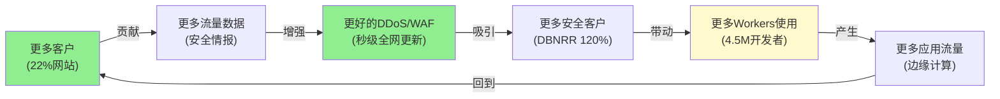

# NET Phase 1 — Part II: AI冲击 + 竞争 + 护城河 + 飞轮 (Ch6-10)

---

## Ch6: AI推理业务线 — 第二曲线还是叙事溢价?

### 6.1 Workers AI: 边缘推理的架构逻辑

Workers AI是Cloudflare在边缘网络上提供AI模型推理服务的产品。其核心主张: **AI推理(Inference——用训练好的模型做预测/生成)天然需要分布式部署**, 因为推理的核心指标是延迟而非吞吐量——用户不愿等2秒看到AI回答, 但不介意模型训练多花1小时。[DM-BIZ-013]

**Cloudflare的边缘AI推理优势**:
- **延迟**: 30-80ms(边缘) vs 200-500ms(集中式数据中心往返), 因为模型运行在离用户最近的PoP
- **Infire引擎**: 自研Rust推理引擎, GPU利用率~80%(vs 超大规模30-50%)——因为在同一GPU上用轻量隔离运行多个模型请求
- **成本**: 客户案例显示比AWS Bedrock/Azure AI低77%(某客户年化节省$2.4M)

**增速惊人但基数极小**: Workers AI推理请求+4,000% YoY, AI Gateway请求+1,200% YoY。因为增速是在近乎零的基数上计算的——$2.17B总收入中, AI推理贡献可能<$20M(管理层从未披露)。4,000%增长 × 微小基数 = 仍然微小的绝对值。[DM-BIZ-013][DM-BIZ-014]

### 6.2 AI Gateway: 更有变现潜力的间接打法

AI Gateway是Cloudflare为AI应用开发者提供的API管理层——缓存重复的AI API调用(减少对OpenAI/Anthropic API的重复付费)、监控延迟/成本/token使用量、提供安全防护(防止prompt injection)。

**为什么AI Gateway可能比Workers AI更有价值**: 它不需要GPU投资(纯软件层)、利润率接近CDN(75%+)、解决了AI开发者的真实痛点(API成本管理)。每个使用AI API的应用都是潜在客户——这个TAM远大于"在边缘运行推理模型"的TAM。

**AI Gateway的竞争**: LiteLLM(开源)、Portkey.ai、Helicone——都是较小的创业公司, 没有Cloudflare的网络规模和现有客户基础。但这些竞争者的存在说明AI Gateway不是垄断市场。

### 6.3 AIAS v2.0 评估: NET是AI净受益还是净受害?

#### 供给侧冲击 (5S)

| 维度 | 影响 | 评分 | 理由 |
|------|------|------|------|
| S1 自动化运维 | 正向 | +0.5 | AI辅助网络管理/故障检测→降低运维成本 |
| S2 产品开发加速 | 正向 | +0.3 | AI编码工具加速Workers/安全产品迭代 |
| S3 成本结构变化 | 负向 | -0.8 | 边缘GPU投资+AI推理COGS高于CDN=**毛利率压缩** |
| S4 人才竞争 | 负向 | -0.3 | AI人才稀缺→SBC上涨压力(已在20.8%锁定) |
| S5 架构颠覆 | 中性 | 0.0 | V8 isolate仍适合AI推理前处理, 非核心计算 |
| **5S小计** | | **-0.3** | **AI在供给侧是轻微净负面(成本>效率)** |

#### 需求侧冲击 (5B)

| 维度 | 影响 | 评分 | 理由 |
|------|------|------|------|
| B1 AI公司作为客户 | 强正向 | +1.2 | AI公司(OpenAI/Anthropic/Meta)需要CDN+安全→NET的最大客户增速驱动因素 |
| B2 企业AI应用需求 | 正向 | +0.8 | 企业部署AI→需要边缘推理/API管理/安全→NET产品组合天然适配 |
| B3 AI驱动流量倍增 | 正向 | +0.6 | AI agent产生更多API调用→通过NET网络的请求增加 |
| B4 AI安全需求 | 正向 | +0.5 | AI应用面临新安全威胁(prompt injection/数据泄露)→NET安全产品机会 |
| B5 AI替代NET客户 | 负向 | -0.3 | AI代码生成工具可能减少手动网站建设→小网站减少→CDN长尾收缩 |
| **5B小计** | | **+2.8** | **AI在需求侧是强正面(新客户+新需求)** |

#### 迁移冲击 (M)

| 维度 | 影响 | 评分 | 理由 |
|------|------|------|------|
| M1 超大规模自建AI边缘 | 负向 | -0.5 | AWS/Azure/GCP如果大规模在边缘部署GPU→挤压Workers AI空间 |
| M2 AI编码降低Workers门槛 | 正向 | +0.3 | Cursor/Copilot让更多开发者用Workers(降低学习曲线) |
| **M小计** | | **-0.2** | **竞争格局微负(超大规模潜在威胁)** |

#### AIAS总结

| 维度 | 评分 |
|------|------|
| 5S (供给侧) | -0.3 |
| 5B (需求侧) | +2.8 |
| M (迁移) | -0.2 |
| **AIAS净影响** | **+2.3 (正向)** |
| Split Index | **3.1 (低分裂)** |

**结论**: NET是**AI净受益者**(+2.3), 主要驱动力是需求侧(AI公司和企业AI应用需要CDN+安全+边缘)。但供给侧有成本压力(GPU投资+AI人才竞争→毛利率和SBC双重压缩)。**AI对NET的最大风险不是"被AI替代"而是"AI的利润率结构低于CDN/安全"**, 导致收入增速↑但利润率↓的"空转增长"。

### 6.4 "Agentic Internet"假说检验

Matthew Prince将Cloudflare的长期愿景押注在"Agentic Internet"(智能体互联网——AI agent取代人类成为互联网的主要用户)上。他的论据: [DM-BIZ-013]

- "仅1月份, AI agent周请求量翻倍"
- "预期2027年bot超过人类"
- 人类每会话~5个请求, AI agent每会话数千个请求="乘数效应"

**检验这个论题的三个关键问题**:

**问题1: AI agent是否通过HTTP/Web协议通信?**
- **如果是**(走HTTP/REST API): Agent流量通过Cloudflare网络→NET受益→TAM扩张
- **如果否**(走gRPC/MCP/专有协议): Agent流量绕过Cloudflare→NET的流量飞轮断裂

当前观察: 大部分AI agent确实使用HTTP API调用(OpenAI API、Anthropic API等都是REST over HTTPS)。因此**短期内agent流量确实经过CDN/安全层**。但长期趋势不明: MCP(Model Context Protocol)等新协议可能创造绕过HTTP的通道。

**问题2: Agent流量是否可变现?**
- Agent的API调用通常是高频低负载(JSON请求/响应), 不像视频流那样消耗大量带宽
- Cloudflare按请求数而非带宽收费(Workers), 因此**请求数倍增直接转化为Workers收入**
- 但安全产品按客户订阅收费→agent流量增加不直接增加安全收入

**问题3: 是否已有实质收入?**
- Prince说"AI agent请求翻倍"但未给绝对值——可能从100万翻倍到200万(微不足道)或从1亿翻倍到2亿(显著)
- 最大合同$130M(7年)被描述为"AI驱动"——这是目前最实质的验证点

**Phase 1判断**: "Agentic Internet"是一个**可能正确但目前无法定价**的长期论题。CQ5维持48%(偏cautious), 因为: (a)AI收入未单独披露 (b)agent流量的绝对规模不明 (c)变现模式不清晰。

---

## Ch7: 竞争格局 — 三战场分析

### 7.1 战场一: CDN/性能 (NET领先)

**NET的护城河**: 网站数量第一(22%), 覆盖最广(335+城市), 开发者体验最好(Workers), 价格最低(零出口费)。

**竞争威胁排序**:
1. **AWS CloudFront**: 中等威胁——开发者默认选择, 但NET在价格/延迟上领先
2. **Akamai**: 低威胁——在大客户视频/交易领域仍有优势, 但增速<5%在收缩
3. **Fastly**: 低威胁——WebAssembly优势但规模太小($0.5B vs NET $2.2B)

**CDN战场净评估**: NET在**份额扩张**——从长尾向企业渗透。CDN不是估值驱动力但提供了稳定的收入基础+网络效应基础。

### 7.2 战场二: SASE/安全 (NET追赶)

**NET的劣势**: SASE企业评估中缺席, Gartner评价数仅ZS的25%, F500渗透率远低于ZS。

**竞争威胁排序**:
1. **Zscaler**: 高威胁——F500 40%渗透率, 代理架构深度, 合规能力领先
2. **Palo Alto Networks**: 高威胁——全栈安全(防火墙+SASE+XDR), 品牌信任度最高
3. **Microsoft E5**: 中-高威胁——捆绑Zero Trust"免费"(实际含在E5订阅中), 企业采购默认选项
4. **Netskope**: 中等威胁——数据感知安全(DLP集成), 特定垂直行业强

**安全战场净评估**: NET在**追赶中**。性能优势(快于ZS 46%)是真实的, 但企业销售深度是短板。NET的安全定位更像"更好的CDN+安全附件"而非"纯安全平台"——这限制了在安全市场的天花板, 但也意味着NET不需要在安全领域赢——它可以通过"CDN带安全"的组合在中端市场取胜。

### 7.3 战场三: 边缘计算/AI推理 (NET探索中)

**NET的优势**: Workers V8 Isolate(<10ms冷启动), 全球覆盖(310+城市), 自研Infire推理引擎(80% GPU利用率)。

**竞争威胁排序**:
1. **AWS Lambda@Edge**: 中等威胁——更广语言支持, 但冷启动10-40倍慢, 成本3-4倍高
2. **Vercel**: 低-中威胁——开发者体验好, 但部分依赖Cloudflare基础设施, 市场更窄(前端开发)
3. **超大规模GPU集群**: 高长期威胁——如果AWS/Azure在边缘部署大量GPU, Workers AI的延迟优势可能被消除
4. **Deno Deploy**: 低威胁——V8兼容但规模极小

**边缘计算战场净评估**: NET有**架构先发优势**但市场尚未形成。边缘计算的TAM取决于"有多少工作负载真的需要在边缘运行"——目前答案不确定。ConvEquity描述为"第三S曲线, 仍在孵化模式"。

### 7.4 竞争弹性测试 [M8]

**假设四路竞争者同时在每个维度取得50%成功, NET收入损失多少?**

| 竞争者 | 攻击维度 | 成功50% | NET收入影响 |
|--------|---------|---------|-----------|
| AWS CloudFront+Lambda | CDN+计算 | 夺取NET 15%的企业CDN客户 | -$160M(-7.4%) |
| Zscaler | 安全 | 阻止NET 50%的新安全客户获取 | -$100M(-4.6%) |
| Microsoft E5 | 捆绑安全+CDN | 25%的中型企业选择M365自带而非NET | -$120M(-5.5%) |
| Vercel/Deno | 开发者计算 | 20%的Workers开发者迁移 | -$40M(-1.8%) |
| **合计** | | | **-$420M(-19.4%)** |

弹性测试结果: **-19.4%** → 位于15-30%区间(中等弹性)。NET不算极强弹性(因为CDN可替代性较高), 但也不算极弱(因为多产品组合提供了保护)。

---

## Ch8: 护城河五维评估 (CQI)

### 8.1 C1 嵌入性/转换成本: 6.5/10

**评估**: Cloudflare的转换成本是**产品分层的**:

| 产品 | 转换成本 | 理由 |
|------|---------|------|
| CDN | 低(3/10) | DNS切换1-2小时; 竞品容易替代 |
| 安全策略 | 中(5/10) | WAF规则/Bot策略迁移需1-2周, 但不涉及数据锁定 |
| Workers应用 | 高(8/10) | 代码需重写(V8 Isolate不兼容Lambda); KV/D1数据需迁移 |
| R2存储 | 中-高(7/10) | 大量数据迁移耗时(但零出口费=低退出成本!——R2悖论: 零出口费帮客户进来也帮客户出去) |
| 多产品组合 | 高(8/10) | 同时使用CDN+安全+Workers+R2的客户, 迁移成本=各产品之和, 非线性增加 |

**加权评估**: 大多数客户(80%+)仅使用CDN+安全(低-中转换成本)。深度使用Workers+R2的客户(<20%)有高转换成本。加权后C1 = 6.5/10。

**嵌入性性质**: 技术/架构嵌入(Workers V8运行时) + 数据嵌入(R2存储/D1数据库)。半衰期: 5-7年(技术标准可能变化, WebAssembly挑战)。

### 8.2 C2 网络效应: 7.0/10

**评估**: NET拥有SaaS行业中**罕见的双边网络效应**:

**效应1 — 安全数据飞轮(真实, 7/10)**:
更多网站使用Cloudflare → 更多攻击流量数据 → 更好的DDoS/Bot检测 → 更强的安全产品 → 吸引更多网站。这个循环是**真实且可验证的**: Cloudflare处理全球~22%的HTTP流量, 每次DDoS攻击都让全球防御规则更新(秒级传播到335+PoP)。因为攻击者无法只攻击"一部分Cloudflare网络"——他们攻击的模式会被全网学习。这是一个**同侧网络效应**(更多客户→每个客户受益)。[DM-BIZ-012]

**效应2 — 开发者生态(弱, 4/10)**:
更多开发者用Workers → 更多开源库/模板 → 新开发者更容易入门 → 更多开发者。这个循环存在但**远弱于AWS/Azure的生态**: Workers的开源生态规模(npm包, GitHub项目)约为Lambda的1/10。因为Workers的V8运行时限制了语言支持(主要JS/TS, Python GA仅2024年), 而Lambda支持几乎所有语言。

**效应3 — 带宽/成本飞轮(真实, 6/10)**:
更多流量 → 更强的互联网交换(Peering)议价权 → 更低的单位带宽成本 → 更有竞争力的定价 → 更多客户。Cloudflare的带宽成本因规模而持续下降——这是CDN行业的标准规模经济, 但NET的规模(22%网站)使这个效应更强。

### 8.3 C3 规模经济: 7.5/10

**评估**: NET享有三层规模经济:

1. **网络规模经济**: 335+PoP的固定成本已沉没, 每增加一个客户的边际成本极低(CDN的核心经济学)。Cloudflare的$20/月Pro计划在这个规模下仍然盈利——**小竞争者无法复制这个定价**(Pumice Capital的7 Powers分析确认"Scale Economies: Strong, Increasing")

2. **R&D规模经济**: $512M R&D(23.6% of rev)分摊到所有产品线——CDN、安全、Workers、AI都共享同一个网络基础设施和代码库。竞争者如Fastly($0.5B收入)无法在如此多的产品线上保持相同的R&D强度。[DM-PFT-002]

3. **数据规模经济**: 22%互联网流量产生的安全数据是独占的——ZS/PANW虽然在企业安全数据上更深, 但在互联网级威胁情报上远不如Cloudflare广。

### 8.4 B4 定价权: 分层评估 (v19.6强制)

| 客户层 | Stage | 理由 | 权重 |
|--------|-------|------|------|
| **Strategic ($1M+/yr)** | Stage 3(进攻) | $42.5M ACV证明, 多产品锁定, Pool of Funds合同模式 | 15% |
| **Enterprise ($100K-$1M)** | Stage 2-3 | 安全+Workers组合有切换成本, 但M365 E5替代压力 | 35% |
| **Business ($250-$5K/mo)** | Stage 2(防守) | 竞争激烈(Fastly/Vercel/CloudFront), 价格敏感 | 25% |
| **Pro ($20-$200/mo)** | Stage 1-2 | 近乎商品化, 主要靠价格竞争 | 15% |
| **Free** | Stage 0 | 无定价权(免费) | 10% |

**加权B4**: 0.15×3.0 + 0.35×2.5 + 0.25×2.0 + 0.15×1.5 + 0.10×0 = **2.10/5.0** (偏低)

**定价权剪刀差**(v19.6 CRM/ADBE验证模式): Strategic/Enterprise层定价权在增强(更大合同+Pool of Funds), 但Pro/Business层定价权在弱化(竞争加剧+开源替代)。**净效应**: 如果大客户占比持续提升(73%→80%), 加权定价权会自然改善——不需要小客户定价权增强。[DM-BIZ-003]

### 8.5 D1 周期性: 8.5/10 (弱周期)

NET的收入主要是**订阅型+使用型混合**, 客户不太可能在经济衰退中取消CDN和安全服务(网站仍需运行, 网络攻击反而增加)。2023年IT支出放缓时, NET增速仅从+49%降至+33%——幅度远小于多数SaaS公司(DDOG从+63%降至+27%)。这说明NET的收入基础具有**强韧性**。

但使用量计费部分(Workers/R2)有周期性: 企业在控制成本时会优化使用量。Pool of Funds合同(预付额度)部分缓解了这个风险。

### 8.6 CQI综合评分

| 维度 | 评分 | 权重(生态科技) | 加权 |
|------|------|-------------|------|
| C1 嵌入性 | 6.5 | 30%(×1.5) | 2.93 |
| C2 网络效应 | 7.0 | 15% | 1.05 |
| C3 规模经济 | 7.5 | 15% | 1.13 |
| B4 定价权 | 4.2(2.10×2) | 25% | 1.05 |
| D1 弱周期 | 8.5 | 15% | 1.28 |
| **CQI总分** | | | **64.3/100** |

**CQI 64.3: 中等偏上** — 护城河主要来自网络规模(C3)和网络效应(C2), 但**定价权是明显短板**(B4仅2.10/5.0)。与CRWD(69→64预计)和DDOG(46)相比, NET的护城河宽度介于两者之间——比DDOG宽(更多网络效应)但比CRWD窄(安全深度不足)。

---

## Ch9: 飞轮验证 + 悖论检测

### 9.1 管理层声称的飞轮

### 9.2 每个连接点验证

| 连接点 | 声称 | 验证 | 强度 |
|--------|------|------|------|
| A→B (客户→数据) | 更多客户=更多流量数据 | ✅**真实**: 22%网站流量是独占安全数据源 | **强** |
| B→C (数据→安全) | 更多数据=更好安全 | ✅**真实**: DDoS攻击模式全网秒级更新, 每次攻击提升全局防御 | **强** |
| C→D (安全→客户) | 更好安全=更多客户 | ⚠️**部分真实**: 安全质量是购买因素但非唯一——价格/品牌/合规同样重要 | **中** |
| D→E (安全客户→Workers) | 安全客户会用Workers | ⚠️**弱**: 安全客户(CISO采购)和开发者平台(CTO/工程师采购)是不同采购路径 | **弱** |
| E→F (Workers→流量) | 更多Workers应用=更多流量 | ⚠️**弱**: Workers应用大多是轻量边缘逻辑, 不产生大量流量 | **弱** |
| F→A (流量→客户) | 更多流量=更多客户 | ✅**真实**(间接): 流量带来的规模经济→更低成本→更有竞争力的定价→更多客户 | **中** |

### 9.3 飞轮净强度计算

| 连接点 | 强度(0-1) | 权重 |
|--------|----------|------|
| A→B | 0.9 | 20% |
| B→C | 0.85 | 20% |
| C→D | 0.5 | 20% |
| D→E | 0.25 | 15% |
| E→F | 0.2 | 15% |
| F→A | 0.5 | 10% |

**飞轮净强度 = Σ(强度×权重) = 0.18 + 0.17 + 0.10 + 0.04 + 0.03 + 0.05 = 0.57**

**0.57 (弱正)**: 飞轮存在但**前半段(流量→数据→安全)强, 后半段(安全→Workers→流量)弱**。NET的飞轮不是一个完整的自加速循环, 而是一个**半飞轮**: 安全数据飞轮是真实的, 但"安全客户→Workers开发者"的跨越是断裂的。

**与MCO/CRM飞轮对比**:
- MCO: 净强度~0(数据复用, 非自加速) → NET更强
- CRM: 净强度-0.2(飞轮悖论: Agent成功→seat减少) → NET更强
- NET: 净强度0.57(半飞轮: 安全段强, 开发者段弱) → 优于MCO/CRM但非真正的完整飞轮

### 9.4 飞轮悖论检测 (v19.6强制)

**检测1: Workers AI成功→是否蚕食CDN收入?**
- 逻辑: 如果AI在边缘处理请求并直接返回结果→减少回源流量→CDN带宽收入↓
- 评估: **悖论不成立**——AI推理的输出(文本/JSON)带宽远小于传统CDN内容(图片/视频)。AI处理不替代CDN缓存, 而是在CDN之上添加计算层
- 结论: ✅无蚕食

**检测2: R2成功→是否蚕食CDN带宽收入?**
- 逻辑: 数据本地化在R2→减少跨区域数据传输→CDN带宽↓
- 评估: **轻微悖论**——R2的零出口费意味着客户可以自由移动数据(不被带宽费锁定)→客户可能将数据从NET的CDN缓存移到R2直接访问→绕过CDN
- 结论: ⚠️轻微蚕食风险, 但R2带来的新客户增量可能>CDN流失

**检测3: 安全产品成功→是否增加运营成本?**
- 逻辑: 更多安全客户→需要更多安全运营/客户支持→G&A/S&M↑
- 评估: **正常商业成本**, 非悖论——安全收入利润率应>安全运营成本
- 结论: ✅非悖论

**飞轮悖论总结**: **无重大悖论**。与CRM(Agent成功→seat减少)和MCO(嵌入成功→仅增加粘性不增加收入)不同, NET的新产品(Workers AI/R2)是**增量式**而非**替代式**——它们添加新收入层而非蚕食核心收入层。

### 9.5 叙事溢价PE估算 (v1.1 EVO-CRWD-003)

**当前P/FCF**: $71.5B / $324M = **220x** [DM-VAL-006]
**无飞轮同行基线P/FCF**: Akamai ~15x (成熟CDN, 无飞轮叙事)
**增速PEG溢价**: NET增速30% / Akamai 5% = 6x → PEG溢价 = 15x × (6-1) = 75x
**飞轮叙事溢价P/FCF** = 220x - 15x - 75x = **130x**
**叙事溢价占比** = 130x / 220x = **59%**

**59%叙事溢价(vs CRWD 41%的"警告"阈值) → ⚠️⚠️严重警告**: 当前估值中近60%是"市场相信但数据未验证"的飞轮/平台/AI叙事溢价。如果Workers/AI增长不及预期, 或飞轮被证伪, 这60%的估值面临蒸发风险。

---

## Ch10: 预期差识别 — PEP模式匹配

### 10.1 市场共识vs数据现实

| 维度 | 市场共识 | 数据现实 | 预期差方向 |
|------|---------|---------|-----------|
| 增长 | 30%→25%渐进减速 | Q4 +34%在加速, 新ACV +50% | 🟢正向(比预期好) |
| 盈利 | Non-GAAP OPM→20%+ | GAAP OPM停滞-9.4%, EPS指引低于共识 | 🔴负向(比预期差) |
| SBC | 将自然收敛(CRM/NOW先例) | 4年零收敛, SBC增速>收入增速 | 🔴负向(比预期差) |
| 安全 | 正在成为安全平台 | SASE企业评估中缺席 | 🔴负向(比预期差) |
| AI | 第二曲线(巨大TAM) | 收入未披露, 增速在微小基数上 | ⚪未知(无法评估) |
| 竞争 | 护城河宽广 | CQI 64(中等), 定价权2.1/5(弱) | 🔴负向(比预期差) |
| 管理层 | Prince是远见者 | 零内部人购买, SBC慷慨 | 🔴负向(比预期差) |

**预期差分布**: 1正向 / 4负向 / 1未知 / 1中性 → **整体偏负向预期差**

### 10.2 PEP模式匹配

**最匹配的PEP模式**: **"高增长遮盖低质量"** (Growth Masking Quality)

特征:
- ✅收入增速惊人(+30%+)→市场给极高估值
- ✅但GAAP盈利遥远(GAAP OPM负值)
- ✅SBC/稀释侵蚀真实回报(Owner FCF负值)
- ✅管理层用Non-GAAP指标讲述"正在盈利"的故事
- ✅估值完全依赖增长持续+利润率改善的双重假设

**历史案例对标**:
- **Snowflake (SNOW)**: 2021年高峰P/S ~100x, 增速+100%→SBC ~30%→股价从$400→$120(-70%)
- **Twilio (TWLO)**: 2021年P/S ~25x, 增速+60%→SBC问题暴露→股价从$400→$50(-87%)
- **反例 Shopify (SHOP)**: 2022年P/S ~10x低谷→SBC收敛+AI成功→股价翻4倍

**NET目前更像SNOW(高估值+高增长+高SBC+未盈利)而非SHOP(已通过SBC收敛拐点)**。关键区别在于: NET的增速在加速(vs SNOW在减速)——这是唯一阻止大幅估值压缩的因素。

### 10.3 行业拐点信号

| 拐点信号 | 当前状态 | 触发含义 |
|---------|---------|---------|
| SBC/Rev连续2季下降 | 未触发(20.8%稳定) | SBC收敛启动→Owner FCF转正路径清晰→估值合理化 |
| 毛利率回升至76%+ | 未触发(74.4%在下降) | 证明AI/计算不压缩利润率→"软件公司"分类确认 |
| AI收入单独披露 | 未发生 | 如果AI>$200M→第二曲线确认; 如果<$50M→叙事溢价蒸发 |
| SASE Gartner Leader | 尚未达到 | 安全平台化确认→TAM扩张 |
| GAAP季度盈利 | Q3 2025接近(-$1.3M) | 心理拐点→吸引GAAP投资者→估值重估 |
| 内部人首次公开市场购买 | 从未发生 | 管理层用自己的钱投票→信号极强 |
