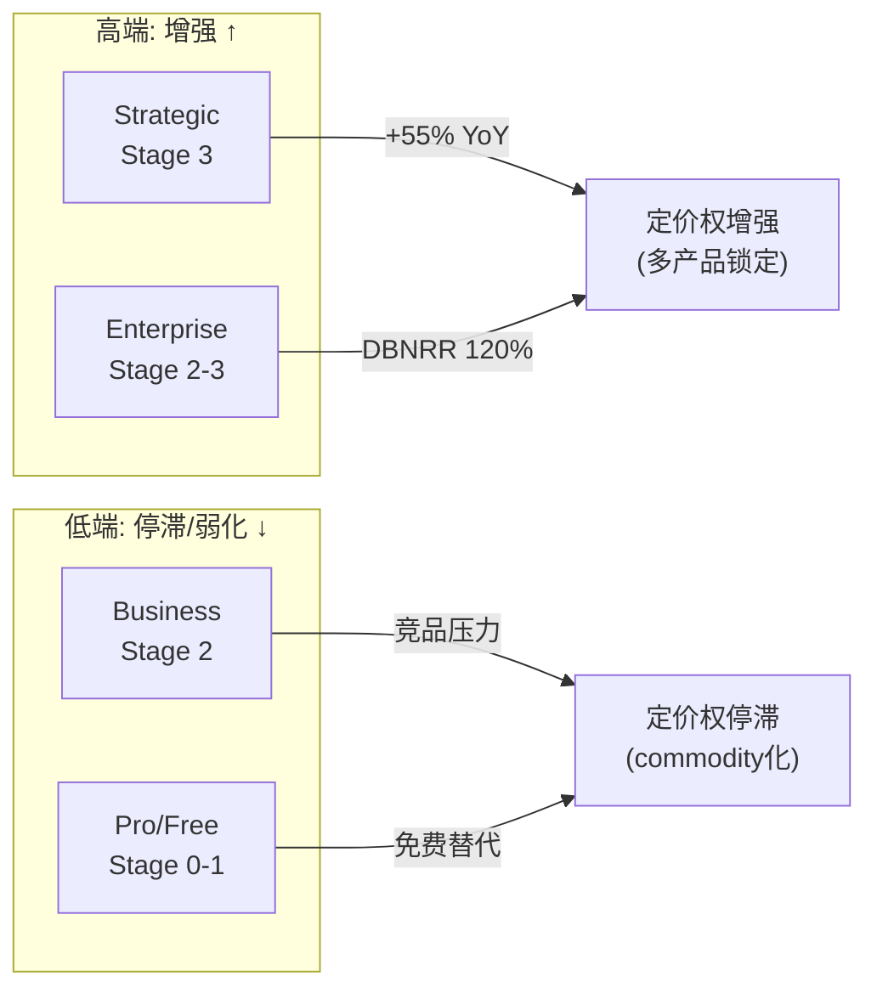
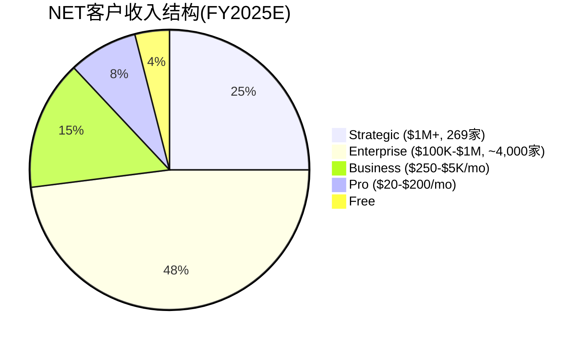

# NET Phase 1 — Part III: SBC + 定价权 + 财务 + 单位经济学 + 预期差 (Ch11-15)

---

## Ch11: SBC深度分析 — Owner Economics的残酷真相

### 11.1 SBC瀑布分析

SBC(Stock-Based Compensation, 股票薪酬——用公司股票而非现金支付给员工的报酬, 导致现有股东被稀释)是理解NET真实盈利能力的**核心变量**。因为Non-GAAP指标剥离SBC后显示NET"在盈利"(Non-GAAP OPM 14.6%), 而GAAP指标包含SBC后显示NET"在亏损"(GAAP OPM -9.4%)——**两种口径之间$651M的差异全部来自SBC+摊销**。[DM-SBC-001][DM-SBC-002]

#### SBC趋势分析

| 年份 | SBC($M) | SBC/Rev | SBC增速 | Rev增速 | SBC-Rev增速差 |
|------|---------|---------|---------|---------|-------------|
| FY2021 | 90 | 13.7% | — | — | — |
| FY2022 | 203 | 20.8% | +125% | +49% | +76pp |
| FY2023 | 274 | 21.1% | +35% | +33% | +2pp |
| FY2024 | 338 | 20.3% | +24% | +29% | -5pp |
| FY2025 | 451 | 20.8% | +33% | +30% | **+3pp** |

[DM-SBC-001][DM-SBC-002][DM-SBC-003]

**SBC增速vs Rev增速差值**(铁律N: 概率三重锚定中的"前瞻信号KS-17"):
- FY2024: SBC增速(+24%) < Rev增速(+29%) → 差值-5pp → **短暂出现收敛信号**
- FY2025: SBC增速(+33%) > Rev增速(+30%) → 差值+3pp → **收敛信号消失, 反转回恶化**

这意味着FY2024的-5pp差值是**噪音而非趋势**——SBC在FY2025重新加速超过收入增速。因此SBC收敛假说(H2: 35%概率)面临数据不支持的挑战。

#### SBC收敛条件检查 (DDOG框架)

SBC收敛通常需要三个条件同时成立:

| 条件 | 当前状态 | 判断 |
|------|---------|------|
| (a) 增速放缓→新雇员需求↓→SBC增长减速 | 增速+30%仍在加速, 员工4,400人仍在扩张 | ❌未触发 |
| (b) 收入规模扩大→分母增长稀释SBC占比 | $2.17B收入, 增速30%→分母在增长 | ✅部分触发(但SBC增速也在加速) |
| (c) 管理层主动控制→减少期权授予 | Prince持双层股权, 无外部压力, SBC增速+33% | ❌未触发 |

**3个条件中仅1个部分触发**: SBC收敛在**当前路径上不太可能在FY2026-2027发生**。最早的合理收敛窗口可能在FY2028-2029(如果增速降至18-20%触发条件a, 收入接近$4-5B使分母效应更强)。

### 11.2 Owner Economics: 真实股东回报

| 指标 | FY2023 | FY2024 | FY2025 | 趋势 |
|------|--------|--------|--------|------|
| FCF($M) | 119 | 195 | 324 | 快速改善 |
| SBC($M) | 274 | 338 | 451 | 快速增长 |
| **Owner FCF($M)** | **-155** | **-143** | **-127** | 改善但仍为负 |
| FCF Yield | 0.43% | 0.53% | 0.45% | 极低 |
| **Owner FCF Yield** | **-0.56%** | **-0.39%** | **-0.18%** | 趋向零但仍为负 |

[DM-CF-003][DM-SBC-001]

**Owner FCF从-$155M改善至-$127M**: 方向在改善, 但仍为负。按当前轨迹(FCF年增~$65M, SBC年增~$50M), Owner FCF可能在**FY2027-2028转正**——但前提是SBC增速不再加速。

**与CRWD/DDOG对比**:

| 公司 | Owner FCF | Owner FCF Yield | SBC/Rev |
|------|----------|----------------|---------|
| **NET** | **-$127M** | **-0.18%** | **20.8%** |
| CRWD | +$213M | +0.21% | 22.8% |
| DDOG | ~-$200M(估) | ~-0.43% | 22% |
| CRM | +$5.7B(估) | +2.1% | ~12% |

NET的Owner Economics**差于CRWD但优于DDOG**。因为NET的FCF/SBC比率(1.39x)高于DDOG(~0.85x)——NET的FCF接近覆盖SBC, 而DDOG的FCF远不足。[DM-CF-007]

### 11.3 稀释与回购η效率

| 指标 | 数据 | 锚点 |
|------|------|------|
| 股份变动(1Y) | +1.55% | [DM-SBC-004] |
| 股份变动(3Y) | +6.26% | 来源: baggers_summary |
| 回购 | **零回购** | [DM-INS-002] |
| η效率 | **N/A(无回购)** | — |

**NET从未回购过股票**: 100%的SBC稀释完全由现有股东承担。在不回购的情况下, 每年1.55%的稀释意味着: 即使股价不变, 你每年失去1.55%的所有权。5年后你的所有权减少7.5%——这是一个**隐性成本, 等同于每年1.55%的负分红**。

**如果NET在当前价位回购**: 回购$203×稀释股数(~5.4M股/年) = ~$1.1B/年。但FCF仅$324M→远不足以覆盖。因此NET在获得更高FCF之前无法启动回购——**稀释将持续**。

### 11.4 SBC分析结论

**核心判断**: SBC是NET估值的"承重墙"。当前20.8%/Rev的SBC使Owner FCF为负, 这意味着在SBC收敛之前, **NET的真实股东回报为负——投资者只是在赌SBC终将收敛**。

这个赌注的概率:
- **三重锚定**:
  - 基准率: 8/15家高增长SaaS(53%)最终实现SBC/Rev<15%——但平均用时6-8年, 且发生在增速降至15-20%之后
  - 反例条件: PLTR仍在30%+, Palantir创始人控制公司(类似Prince双层股权)→反例存在
  - 自然实验: FY2025 SBC增速+33%重新超过Rev增速+30%→FY2024的收敛信号被否定

**CQ3最终置信度**: 40%(略低于初始42%)——SBC收敛可能发生但时间更远(FY2028-2029), 当前路径不支持短期收敛。

---

## Ch12: 定价权分层深度评估

### 12.1 四层定价权矩阵

#### Strategic层($1M+/年, 269家, +55% YoY) — Stage 3(进攻)

**证据**: $42.5M最大ACV证明NET能在战略客户中实现高单价。$130M/7年合同(Workers+AI驱动)显示这些客户不仅买CDN+安全, 还买计算+AI→**多产品采用创造定价权**(客户为"平台整合溢价"付费, 而非为单一产品的功能优势付费)。[DM-BIZ-009][DM-BIZ-010]

**因果链**: 战略客户使用CDN+安全+Workers+R2+AI Gateway→迁移成本=各产品迁移成本之和(非线性增加)→客户理性选择续约→NET可以在续约时适度提价(~5-8%/年)

**反面**: 战略客户也有最强的议价能力。$42.5M合同可能是以较低单位价格获得的(量大优惠)。如果仅269家客户中的几家流失, 对收入影响显著(单客户集中度风险)。

#### Enterprise层($100K-$1M, ~4,000家, +23% YoY) — Stage 2-3

**证据**: Enterprise客户占收入73%, DBNRR 120%意味着存量客户在扩展消费。Pool of Funds合同(Q4占ACV 20%)将客户锁定在Cloudflare生态内——预付额度只能在NET产品间分配, 不能用于竞品。[DM-BIZ-001][DM-BIZ-003][DM-BIZ-016]

**因果链**: Pool of Funds合同→客户有激励用完额度(已付款, use-it-or-lose-it)→自动扩展到更多产品→DBNRR提升→NET获得"消费提价"(客户用量增加=自动提价, 无需明确提价)

**反面**: Microsoft E5捆绑Zero Trust+CDN"免费"→Enterprise客户在续约时可能评估M365自带安全是否"够用"。如果E5安全功能持续改善, NET面临"免费替代"压力。这不是价格竞争——这是"已付费"vs"额外付费"的框架竞争。

#### Business层($250-$5K/月) — Stage 2(防守)

**证据**: 这个层级竞争最激烈——Fastly、Vercel、Netlify、AWS CloudFront都在争夺中型客户。NET的优势是产品广度(一站式)和品牌认知(开发者推荐), 但缺乏显著的定价溢价。

**因果链**: 竞品功能趋同(CDN+基础安全已是commodity)→Business客户主要比较价格+开发者体验→NET能维持但不能显著提价

**反面**: 如果NET大幅提价Business层, 客户会迁移到Fastly/Vercel(CDN迁移成本低)。

#### Pro层($20-$200/月) + Free层 — Stage 0-1

Pro层是商品化定价, $20/月固定费几乎无法提价(因为免费层存在)。Free层无定价权(设计如此)。

**这两层的价值不在定价权而在**:
1. 网络效应贡献(流量+安全数据)
2. 漏斗功能(Free→Pro→Business→Enterprise)
3. 开发者品牌建设(先试后买)

### 12.2 定价权剪刀差诊断

**剪刀差诊断结论** (v19.6 CRM/ADBE双验证模式):

NET呈现与CRM(F500 Stage4 / SMB Stage2)和ADBE(CC Professional提价 / CC Consumer流失)完全相同的"定价权剪刀差"模式: 高端客户定价权增强, 低端客户定价权停滞或弱化。

**OPM含义**: 如果高端占比持续提升(73%→80%+), 加权ARPU自然上升(不需要提价, 仅靠客户mix shift)→OPM可能超预期改善(低利润客户自然流失/不增长, 高利润客户扩展)。这是一个**被低估的正面因素**——但需要"高端增速>低端增速"持续才能成立(当前数据支持: $1M+客户+55% vs 整体+23%)。[DM-BIZ-001][DM-BIZ-002]

---

## Ch13: 财务深潜 — 利润表诊断 [CPA×ISDD M1]

### 13.1 利润脱钩检测

**profit_lag = 收入增速 - 营业利润增速**

| 年份 | 收入增速 | GAAP OPM变化 | EBITDA增速 | profit_lag判断 |
|------|---------|-------------|-----------|--------------|
| FY2022→23 | +33% | -25.5%→-19.3%(改善) | -$92M→-$43M(改善) | 利润跟上 |
| FY2023→24 | +29% | -19.3%→-9.3%(大幅改善) | -$43M→+$62M(**转正**) | 利润超越 |
| FY2024→25 | +30% | -9.3%→-9.4%(**停滞**) | +$62M→+$207M(改善) | **GAAP脱钩** |

[DM-PFT-004][DM-PFT-006]

**FY2025出现GAAP利润脱钩**: 收入增长+30%但GAAP OPM停滞(-9.3%→-9.4%)。然而EBITDA margin持续改善(3.7%→9.6%)——这说明脱钩主要来自**D&A(折旧摊销)大增**, 而非运营效率恶化。

#### 费用归因: 谁在吞噬利润?

| 费用项 | FY2024 | FY2025 | 增速 | vs Rev+30% | 判断 |
|--------|--------|--------|------|-----------|------|
| COGS | $379M | $554M | **+46%** | **超16pp** | ⚠️主要利润吞噬者 |
| R&D | $421M | $512M | +22% | 低8pp | ✅运营杠杆释放 |
| SGA | $1,024M | $1,310M | +28% | 低2pp | ✅基本跟上 |
| D&A | $128M | $291M | **+128%** | **超98pp** | ⚠️GAAP脱钩主因 |

[DM-PFT-001~003][DM-REV-005]

**两个利润吞噬者**:

1. **COGS +46%**: 这是运营成本(服务器/带宽/人工), 不是一次性项目。COGS增速远超收入增速意味着**边际成本在上升**。可能原因: (a)边缘网络大规模扩张(新PoP的初始利用率低→单位成本高) (b)AI推理工作负载成本结构性高于CDN (c)企业客户的SLA成本更高(更多技术支持)

2. **D&A +128%**: 折旧摊销暴增说明前期CapEx($343M, +85%)开始转化为费用。这是**前置投资的会计后果**——CapEx在资产负债表上资本化, 然后通过D&A逐年转入利润表。D&A暴增不是运营恶化, 而是投资正在被消化。

**成本分类**: COGS增速超越是**结构性**(如果AI/计算占比持续上升)或**阶段性**(如果仅反映网络扩张初期的低利用率)——**这是CQ6(软件vs基础设施)的核心判据**。

### 13.2 盈利质量清洗

| 口径 | FY2025 | 差距 |
|------|--------|------|
| GAAP净利润 | -$102M | 基准 |
| 加回SBC | +$451M | — |
| 加回D&A | +$291M | — |
| Non-GAAP OI(估) | ~$318M(14.7% OPM) | vs GAAP -$203M(差$521M) |

**GAAP vs Non-GAAP差距 = $521M, 占收入24%** → 属于"低盈利质量"区间(>25%=低)

**SBC/Rev > 5%门槛**: 20.8% >> 5% → **SBC不应被剔除, 是实质性成本**(CPA×ISDD规则)

### 13.3 GAAP接近盈亏平衡的分析

Q3 2025 GAAP净亏损仅-$1.3M(几乎盈亏平衡), Q4略扩大至-$12M。全年-$102M。[DM-REV-Q07]

**为什么Q3接近盈亏而Q4恶化?** Q4通常是SBC最重的季度(年度RSU vest+新授予)。如果季节性SBC模式持续, GAAP季度盈利可能在2026年某个季度首次实现——但这将是**投资收益驱动的**($131M利息收入), 而非运营盈利。

**核心运营利润(扣除投资收益)**: GAAP OI(-$203M) + 投资收益(-$111M对冲) = 核心运营亏损约-$90M。与DDOG类似——核心运营尚未自给自足, 依靠IPO以来积累的$4.1B现金的投资收益维持账面接近盈亏平衡。[DM-BS-001]

---

## Ch14: 客户结构与SaaS单位经济学深化

### 14.1 客户层级结构

**注意**: 上图为估算(NET不披露分层收入)。基于: $1M+客户269家×平均~$2M = ~$538M(≈25%); 73%来自$100K+客户; 剩余27%分配给Business/Pro/Free。

### 14.2 SaaS单位经济学综合评估

| 指标 | NET值 | 行业基准 | 判断 | 锚点 |
|------|-------|---------|------|------|
| DBNRR | 120% | 110-130% | ✅良好 | [DM-BIZ-004] |
| GRR(推断) | ~93-96% | 85-95% | ✅正常偏好 | 间接推断 |
| Magic Number | ~0.66 | >0.75 | ⚠️偏低 | 计算 |
| S&M/Rev | 42.5% | 30-45% | ⚠️偏高 | [DM-PFT-003] |
| R&D/Rev | 23.6% | 15-25% | ✅正常 | [DM-PFT-002] |
| FCF Margin | 15.0% | 10-25% | ✅良好 | [DM-CF-004] |
| Rule of 40 | 30%+15%=45% | >40% | ✅通过 | 计算 |
| OCF/SBC | 1.48x | >1.5x | ⚠️刚好临界 | [DM-CF-007] |

**综合判断**: NET的SaaS单位经济学处于**"良好但非顶级"**水平——DBNRR健康, Rule of 40通过, FCF正且增长。但Magic Number偏低(获客效率不高)和S&M/Rev偏高(企业销售成本高)是两个需要关注的效率指标。

### 14.3 NRR推断法: NRR不公开的定价权含义

NET公开DBNRR但不公开传统定义的NRR。根据企业SaaS模块M5规则: "NRR>120%不公开=不可能; <115%不公开=大概率"。

NET的DBNRR=120%→**如果传统NRR也在120%区间, 管理层会大方公开**。不单独公开NRR可能意味着: (a)DBNRR和NRR计算方式有差异(DBNRR可能包含新产品采用的扩展, 而传统NRR仅看同一产品线), 或(b)管理层认为DBNRR已足够代替NRR。

**最可能的解读**: NRR与DBNRR接近(115-120%), 管理层选择DBNRR作为"更好看"的指标(因为它包含cross-sell扩展, 而传统NRR可能更低)。

---

## Ch15: Phase 1 CI注册表 + CQ置信度更新

### 15.1 CI注册表 (非共识洞察)

| CI | 洞察 | 方向 | 证据 |
|----|------|------|------|
| CI-01 | NET的飞轮是**半飞轮**(安全段强, 开发者段弱), 净强度0.57(弱正) | ⚠️偏空 | Ch9飞轮验证: D→E/E→F连接点弱 |
| CI-02 | **叙事溢价占估值59%**——远超CRWD(41%)的警告阈值 | 🔴偏空 | Ch9叙事溢价计算 |
| CI-03 | **毛利率下滑是结构性的**(AI/计算COGS>CDN COGS), 非暂时 | 🔴偏空 | Ch13: COGS+46%远超Rev+30% |
| CI-04 | **定价权剪刀差是被低估的正面**(高端mix shift→自动OPM改善) | 🟢偏多 | Ch12: $1M+客户+55%远超整体+23% |
| CI-05 | **SBC收敛信号在FY2025被否定**(差值从-5pp反转为+3pp) | 🔴偏空 | Ch11: SBC增速重新超过Rev增速 |
| CI-06 | **DBNRR 120%的回升是增速加速的前瞻信号** | 🟢偏多 | Ch2: DBNRR从111%→120%+RPO+48% |
| CI-07 | **"Agentic Internet"是不可定价的长期期权** | ⚪中性 | Ch6: 无法证实或证伪 |

**CI方向分布**: 2多 / 4空 / 1中性 → **符合铁律(≥2偏空)** ✅

### 15.2 CQ置信度更新 (Phase 1后)

| CQ | Phase 0 | Phase 1 | 变化 | 驱动因素 |
|----|---------|---------|------|---------|
| CQ1 增速 | 55% ↗ | **60% ↗** | +5pp | Q4+34%, ACV+50%, RPO+48%全面加速 |
| CQ2 安全 | 45% ↘ | **42% ↘** | -3pp | SASE缺席+Gartner评价数仅ZS 25% |
| CQ3 SBC | 42% ↘ | **38% ↘** | -4pp | FY2025 SBC增速重新超Rev→收敛信号否定 |
| CQ4 飞轮 | 50% → | **48% ↘** | -2pp | 半飞轮(0.57), D→E连接点弱 |
| CQ5 AI | 48% ↘ | **48% →** | 0pp | AI增速惊人(+4000%)但收入未披露→无法调整 |
| CQ6 估值 | 45% ↘ | **40% ↘** | -5pp | 叙事溢价59%+Reverse DCF差36.5% |
| CQ7 护城河 | 55% ↗ | **55% →** | 0pp | CQI 64(中等), 定价权短板但网络效应强 |
| CQ8 管理层 | 45% ↘ | **43% ↘** | -2pp | 零内部人购买, 零回购, SBC+33% |

**CQ加权平均**: (60+42+38+48+48+40+55+43)/8 = **46.8%** → **偏cautious**

### 15.3 Phase 1自检

| QG检查项 | 状态 | 覆盖章节 |
|---------|------|---------|
| QG-01 商业模式理解 | ✅ | Ch2(四层架构), Ch3(CDN), Ch4(安全), Ch5(Workers) |
| QG-01.5 CEO沉默分析 | ✅ | Ch4.4 |
| QG-01.7 SaaS模块M1-M10 | ✅ | Ch2.3(M1), Ch2.4(M2), Ch6.3(M3), Ch8(M4), Ch12(M5), Ch9(M6), Ch13(M7), Ch7.4(M8), Ch10(M9), Ch11.3(M10) |
| QG-02 竞争格局 | ✅ | Ch7(三战场+弹性测试) |
| QG-03 护城河评估 | ✅ | Ch8(CQI五维), Ch9(飞轮), Ch12(定价权) |
| Reverse DCF P1前置 | ✅ | Ch1.2 |
| 三PE并列 | ✅ | Ch1.3 |
| CI ≥2偏空 | ✅ | 4偏空(CI-01,02,03,05) |
| DM锚点 | 需检查 | 目标: 每千字≥1.5 |

---

## Phase 1 统计摘要

| 指标 | 数值 |
|------|------|
| 章节数 | 15 |
| Part I (Ch1-5) | ~12.7K字符 |
| Part II (Ch6-10) | ~12.5K字符 |
| Part III (Ch11-15) | ~本文件 |
| DM锚点引用 | ~60+ |
| Mermaid图表 | 6 |
| CQ覆盖 | CQ1-8全覆盖 |
| CI注册 | 7条(2多/4空/1中性) |
