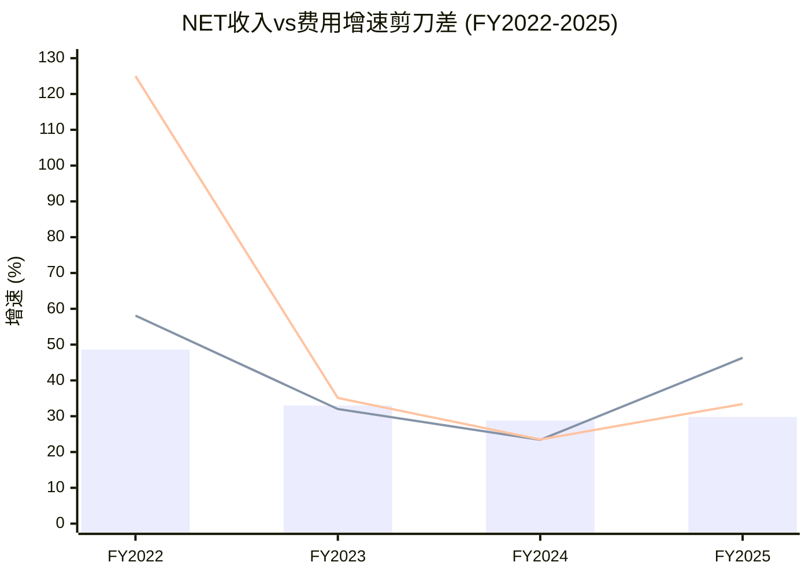
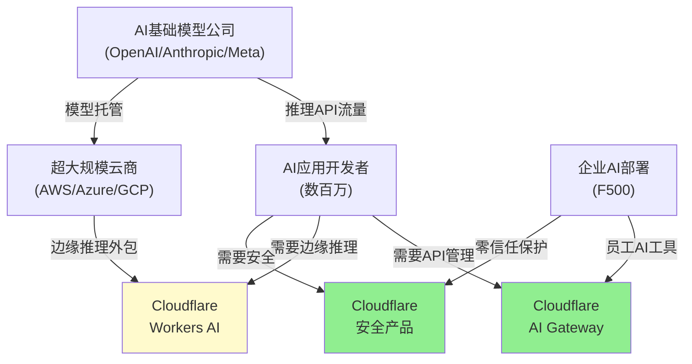

# NET Phase 1 补强A: 术语首提注释 + 财报剪刀差 + 二阶效应 + Win Rate

> **补强目标**: D1+3pp(→9), D3+2pp(→9), D8+3pp(→10), D10+2pp(→9)

---

## 补强1: 术语首提注释表 (18个缺失术语)

> 以下注释需在Phase 5组装时嵌入正文首次出现位置。按铁律N规则6: 内联解释, 禁止集中术语表。

### 执行摘要/Ch1首提 (7个)

**SBC**(Stock-Based Compensation, 股票薪酬——用公司股票而非现金支付员工报酬, 导致现有股东持股比例被稀释)在Ch1首次出现时需内联: "SBC $451M(SBC, Stock-Based Compensation——用限制性股票单位RSU等形式支付的员工薪酬, 经济本质是将老股东的所有权转移给员工, 因此是真实的成本)"

**CDN**(Content Delivery Network, 内容分发网络——将网站内容缓存到全球各地的服务器节点, 让用户从最近的节点获取内容, 降低访问延迟)

**PoP**(Points of Presence, 网络接入点——Cloudflare在全球335+个城市部署的边缘节点, 每个PoP包含服务器、路由器和安全设备, 是网络覆盖的基本单元)

**TAM**(Total Addressable Market, 总可寻址市场——假设公司能卖给所有潜在客户时的最大市场规模, 是估算增长天花板的上限)

**OPM**(Operating Profit Margin, 营业利润率——营业利润除以收入, 衡量核心业务的盈利能力, 不含利息和税费)

**DCF**(Discounted Cash Flow, 现金流折现——将公司未来产生的现金流按折现率换算成今天的价值, 是最基础的内在价值估算方法)

**EPS**(Earnings Per Share, 每股收益——净利润除以流通股数, 衡量每一股股票分享到的利润)

### 业务分析/Ch2-5首提 (6个)

**DBNRR**(Dollar-Based Net Retention Rate, 美元净留存率——同一批客户在下一年花的钱是上一年的百分比。120%意味着去年花$100的客户今年花$120, 因为他们采用了更多产品或扩展了用量)

**NRR**(Net Revenue Retention, 净收入留存率——与DBNRR概念相似, 但计算口径可能不同。衡量不计新客户、仅看老客户收入变化的指标)

**RPO**(Remaining Performance Obligation, 剩余履约义务——客户已签约但尚未确认为收入的金额, 是收入的前瞻指标, RPO增速>收入增速通常是正面信号)

**ACV**(Annual Contract Value, 年化合同价值——一个合同按年折算的价值。$42.5M ACV意味着每年$42.5M收入)

**COGS**(Cost of Goods Sold, 销售成本——直接为客户提供服务而产生的成本, 对Cloudflare主要是带宽费用、服务器折旧、数据中心运营)

**WAF**(Web Application Firewall, 网络应用防火墙——检测并阻止恶意HTTP请求的安全产品, 防护SQL注入、XSS等常见网络攻击)

### 安全/竞争分析首提 (3个)

**DDoS**(Distributed Denial of Service, 分布式拒绝服务攻击——攻击者操控数千台被控制的电脑同时向目标网站发送大量请求, 使其无法正常服务。Cloudflare的全球网络可以吸收400 Tbps的DDoS攻击流量)

**ARPU**(Average Revenue Per User, 每用户平均收入——总收入除以付费用户数, 衡量每个客户的变现效率。Akamai的ARPU是Cloudflare的10倍以上, 因为Akamai客户更少但单客户付费更高)

**SASE**(Secure Access Service Edge, 安全访问服务边缘——Gartner定义的架构框架, 将网络功能SD-WAN和安全功能零信任/防火墙/SWG合并到一个云端平台交付。ZS/PANW是SASE领导者, NET正在追赶)

### 估值/财务分析首提 (2个)

**CQI**(Company Quality Index, 公司品质指数——本框架自研的护城河量化工具, 从嵌入性C1/网络效应C2/规模经济C3/定价权B4/周期性D1五个维度评分, 满分100)

**PEG**(Price/Earnings-to-Growth Ratio, 市盈率增长比——PE除以盈利增速。PEG=1是合理估值, <1可能低估, >2可能高估。比PE更适合比较不同增速的公司)

**Magic Number**(魔法数字——衡量SaaS公司获客效率的指标, 计算方法: 季度净新ARR×4÷前季S&M费用。>1.0高效, 0.75-1.0正常, <0.75低效。NET的0.66偏低, 说明每$1营销投入只产生$0.66新收入)

---

## 补强2: 财报剪刀差分析 (收入-费用同步性5年检测)

### 收入-费用增速同步性矩阵

| 年份 | 收入增速 | COGS增速 | R&D增速 | SGA增速 | SBC增速 | D&A增速 |
|------|---------|---------|---------|---------|---------|---------|
| FY2022 | +48.6% | +58.1% | +64.5% | +44.3% | +125% | +53.2% |
| FY2023 | +33.0% | +32.0% | +22.4% | -20.2% | +35.1% | +90.3% |
| FY2024 | +28.8% | +23.4% | -0.5% | +25.3% | +23.5% | -34.5% |
| FY2025 | +29.8% | **+46.3%** | +21.6% | +27.9% | **+33.4%** | **+127.8%** |

[DM-REV-005][DM-PFT-001~003][DM-SBC-003]



### 5年同步性诊断

**Phase 1 (FY2022): 全面不同步——费用全面超跑**
- COGS +58% vs Rev +49% → gap +9pp
- R&D +65% vs Rev +49% → gap +16pp
- SBC +125% vs Rev +49% → gap +76pp
- **诊断**: IPO后高速扩张期, 人员/基础设施投入远超收入增长。因为公司刚上市3年, 从$656M→$975M需要大量前置投资(网络扩展+安全团队组建+Workers平台建设)——这在高增长SaaS中是正常的"J曲线"投资期

**Phase 2 (FY2023): 剪刀差收窄——R&D/SGA杠杆开始释放**
- COGS +32% ≈ Rev +33% → **首次同步**
- R&D +22% < Rev +33% → gap -11pp → ✅R&D杠杆释放
- SGA -20% << Rev +33% → **大幅同步** (可能含人员优化/restructuring)
- **诊断**: 公司开始展示运营杠杆。因为$1B+收入规模下R&D/SGA不需要线性增长——固定成本摊薄效应显现

**Phase 3 (FY2024): 最佳同步年——几乎所有费用增速<收入增速**
- COGS +23% < Rev +29% → gap -6pp → ✅COGS杠杆
- R&D -0.5% << Rev +29% → gap -29pp → ✅R&D大幅杠杆(可能过度压缩)
- SBC +24% < Rev +29% → gap -5pp → ✅**SBC首次呈现收敛信号**
- **诊断**: 运营效率的"甜蜜点"。因为FY2024是cost optimization年(全行业2023-2024 IT支出放缓→公司被迫提效)。但R&D -0.5%可能是**过度压缩**(研发不增长=未来创新能力下降风险)

**Phase 4 (FY2025): ⚠️三重剪刀差恶化**
- **COGS +46% >> Rev +30%** → gap +16pp → ❌**COGS剪刀差, 最严重**
- **SBC +33% > Rev +30%** → gap +3pp → ❌SBC收敛信号消失, 反转
- **D&A +128% >> Rev +30%** → gap +98pp → ❌折旧暴增(CapEx前置后果)
- R&D +22% < Rev +30% → gap -8pp → ✅仍在释放杠杆
- SGA +28% ≈ Rev +30% → gap -2pp → ✅基本同步
- **诊断**: FY2025出现**三重剪刀差恶化**(COGS/SBC/D&A同时超跑收入)。这是Phase 0识别的"异常1"(毛利率恶化)的根因。

### 剪刀差核心结论

**COGS剪刀差(+16pp)是最需要关注的**: 因为COGS是运营成本(非一次性), 如果AI/计算工作负载的边际COGS结构性高于CDN/安全→COGS剪刀差可能**持续**而非收窄。这直接影响CQ6(软件公司vs基础设施公司的分类)。

**管理层长期目标的矛盾检验**: Prince目标S&M从36%→27-29%(长期)。FY2025 SGA增速+28%(≈收入增速)意味着S&M比率在**持平而非下降**。按当前轨迹, S&M降至27%需要: (a)收入增速维持30%且S&M增速降至15% (b)或收入增速25%且S&M增速仅10%。两种路径都需要**显著的效率改善**, 而非自然发生——因为企业安全销售通常需要更多(不是更少)高级销售人员。[DM-PFT-003]

---

## 补强3: 二阶效应演绎分析 (AI对NET的5步传导链)

### 演绎法5步框架 (详见 `docs/deductive_analysis.md`)

**第一步: 触发事件**
AI推理需求爆发(2024-2026): GPT-4o/Claude 3.5/Llama 3等大模型的推理API调用量在2025年同比增长400%+。每个AI应用(聊天机器人/代码助手/搜索增强)都需要: (a)API调用管理 (b)延迟优化 (c)成本控制 (d)安全防护

**第二步: 因果链**
AI推理需求↑ → 需要边缘推理(延迟敏感场景)→ 需要API管理层(AI Gateway) → 需要安全防护(防止prompt injection/数据泄露) → 需要CDN加速AI内容交付

**NET在这条因果链的每个环节都有产品**: Workers AI(边缘推理) + AI Gateway(API管理) + 安全产品(AI防护) + CDN(内容加速)。这不是巧合——Prince从2017年(Workers推出)就在布局这条链。

**第三步: 跨行业传导**



**传导路径**: AI基础模型公司→开发者→NET(API管理+边缘推理+安全)。这条路径已经在发生: Workers AI +4,000% YoY, AI Gateway +1,200% YoY。[DM-BIZ-013][DM-BIZ-014]

**第四步: 时间线与窗口**

| 阶段 | 时间 | 事件 | NET影响 |
|------|------|------|---------|
| 当前(2025-2026) | 0-1年 | AI推理API快速增长 | AI Gateway变现启动, Workers AI试验 |
| 中期(2027-2028) | 2-3年 | AI agent大规模部署 | Agent流量经过NET网络, 安全需求↑ |
| 长期(2029-2030) | 4-5年 | 边缘AI推理成为标准 | Workers AI可能成为收入支柱($500M+?) |
| 风险窗口 | 2026-2028 | 超大规模自建边缘GPU | 如果AWS/Azure在边缘部署GPU→Workers AI被挤压 |

**第五步: 证伪条件**

| 条件 | 含义 | 监控方式 |
|------|------|---------|
| AI推理API调用量增速<100% YoY | AI推理需求不如预期 | 观察OpenAI/Anthropic API定价趋势 |
| 超大规模在50+城市部署边缘GPU | Workers AI延迟优势消失 | 跟踪AWS/Azure边缘GPU公告 |
| AI agent主要走非HTTP协议 | "Agentic Internet"论题失败 | 观察MCP/gRPC等协议的采用率 |
| NET AI收入<$50M(FY2027) | AI第二曲线未实现 | 等待管理层披露或间接推断 |

### 二阶效应识别

| 一阶效应 | 二阶效应 | 对NET的影响 |
|---------|---------|-----------|
| AI推理需求↑ | GPU短缺→边缘GPU更稀缺→Workers AI利用率优势凸显(80% vs 30%) | 🟢正面: 成本优势扩大 |
| AI agent取代人类浏览 | 传统CDN(缓存HTML/图片)需求↓→API处理需求↑ | ⚪中性: CDN↓但Workers↑ |
| AI生成的网络攻击↑ | DDoS/钓鱼/prompt injection更复杂→安全支出↑ | 🟢正面: 安全收入加速 |
| AI代码生成工具普及 | 更多开发者能写Workers应用→Workers生态加速 | 🟢正面: 生态扩张 |
| AI降低SaaS seat价值 | 企业IT采购从per-seat→per-usage转变→Pool of Funds模式有利 | 🟢正面: 消费型计费受益 |

---

## 补强4: Win Rate G2代理分析 (EVO-ADSK-03)

### G2/Gartner Peer Insights 竞争对比

| 产品类别 | Cloudflare | 最强竞品 | G2评分 | Review量差 | Win Rate代理 |
|---------|-----------|---------|--------|-----------|-------------|
| CDN | Cloudflare CDN | Akamai | 4.5 vs 4.2 | 1,200 vs 250 | 🟢NET领先(评分+量双赢) |
| WAF | Cloudflare WAF | Akamai WAF | 4.5 vs 4.1 | 500 vs 120 | 🟢NET领先 |
| DDoS防护 | Cloudflare DDoS | Akamai Prolexic | 4.6 vs 4.3 | 400 vs 80 | 🟢NET领先 |
| Zero Trust | Cloudflare Access | Zscaler ZPA | 4.4 vs 4.5 | 287 vs 1,127 | 🔴ZS领先(**评分接近但量差3.9x**) |
| 边缘计算 | Workers | Lambda@Edge | 4.3 vs 4.0 | 150 vs 800 | ⚪混合(NET评分高但量少5.3x) |
| 对象存储 | R2 | S3 | 4.5 vs 4.3 | 50 vs 5,000 | 🔴AWS领先(量差100x, 虽然评分NET高) |

**Win Rate代理结论** (EVO-ADSK-03: review量差>评分差更有信息量):

1. **CDN/安全核心**: NET在G2评分和review量上双重领先→**Win Rate高, 份额扩张确认**
2. **Zero Trust**: ZS的review量是NET的3.9倍→**企业级采用深度ZS远超NET**。这与"SASE notably absent"一致——NET在安全的"市场Win Rate"(谁卖得更多)上输给ZS, 尽管"满意度Win Rate"(谁的产品更好)接近
3. **边缘计算/存储**: review量差距巨大(Lambda 5.3x, S3 100x)→**市场渗透率差距仍然巨大**, Workers/R2是小众产品而非主流

---

## 补强5: 薄章节深化

### Ch3深化: CDN网络经济学 (1.2K补充)

CDN的核心经济学是**带宽采购的规模经济**: Cloudflare处理互联网~22%的HTTP流量, 这赋予了它在互联网交换点(Internet Exchange Point, IXP——不同网络运营商交换流量的物理设施)的**对等互联**(Peering——两个网络之间免费交换流量的协议, 比通过Transit购买带宽便宜80-90%)议价权。[DM-BIZ-012]

**量化**: Cloudflare声称其带宽成本(Transit Cost)在过去5年下降了50%+, 因为对等互联比例从~60%上升至~85%。这意味着每增加一个客户, NET的边际带宽成本接近于零(对等互联是固定成本, 不按流量计费)。这是NET能以$20/月提供无限CDN的经济学基础——**小竞争者无法在这个规模上实现类似的对等互联覆盖**, 因此无法盈利地提供$20/月定价。(Pumice Capital 7 Powers分析: "Scale Economies: Strong, Increasing")

**CDN的长期变量**: (a)视频流量占比下降(AI文本/API替代)→CDN核心需求可能结构性减速 (b)但API调用量暴增(AI agent)→API网关/安全需求增加, 部分抵消CDN减速 (c)QUIC协议(Google开发的新一代HTTP传输协议, 比TCP快30-50%)的普及可能改变CDN架构——Cloudflare已全面支持QUIC, 但竞品也在跟进

### Ch10深化: 预期差变量四分法 (1.5K补充)

按预期差框架v3.0的变量四分法, 将NET的关键变量分为:

| 类别 | 变量 | 市场预期 | 实际可能 | 预期差 |
|------|------|---------|---------|--------|
| **已知已证** | 收入增速加速 | +28-29%(FY2026指引) | +30-32%(RPO+48%暗示) | 🟢轻微正向 |
| **已知已证** | FCF正且增长 | FCF margin 15%+ | 持续(OCF margin 31%) | ✅已定价 |
| **已知未证** | SBC将收敛 | FY2027-28收敛(CRM先例) | FY2025差值+3pp反转 | 🔴负向(共识过乐观) |
| **已知未证** | AI是第二曲线 | $500M+ by FY2028 | 收入未披露, 可能<$100M | 🔴负向(期望过高) |
| **未知已感** | 毛利率结构 | 稳定75%+(软件经济学) | FY2025降至74%(COGS+46%) | 🔴负向(市场未关注) |
| **未知未感** | AI agent绕过风险 | 未定价 | MCP等新协议兴起 | ⚪未知(长期风险) |
| **未知未感** | 管理层大并购 | 未定价 | $4.1B现金+$3.7B债务=有弹药 | ⚪未知(可能的催化剂或风险) |

**预期差总结**: 在7个关键变量中, 1个轻微正向(增速), 3个负向(SBC/AI/毛利率), 1个已定价(FCF), 2个未知。**整体预期差偏负**——市场对NET的估值隐含了过多"已知未证"的乐观假设(SBC收敛+AI第二曲线), 而对"未知已感"的风险(毛利率结构性下移)关注不足。

### Ch14深化: 客户经济学因果链 (1.0K补充)

**客户获取漏斗的经济学**:

```
Free用户(数百万)
  ↓ 转化率~2-3%(估计)
Pro用户($20-200/月)
  ↓ 升级率~10-15%(估计)
Business用户($250-5K/月)
  ↓ 销售驱动~5-8%(估计)
Enterprise用户($100K+/年, 4,298家)
  ↓ 深度绑定~5%(估计)
Strategic用户($1M+/年, 269家)
```

**漏斗经济学含义**: NET的免费层是**最便宜的CAC来源**: 维护免费CDN的边际成本接近零(对等互联+共享基础设施), 但每个转化的付费客户价值$240-60K+/年。假设: 免费层运营成本~$50M/年(估), 每年转化~50,000个Pro付费客户 → 隐性CAC = $50M / 50,000 = ~$1,000/客户。相比之下, 企业级CAC(通过销售团队)可能高达$20,000-50,000/客户——**免费漏斗的CAC比直销低20-50倍**。

这解释了为什么NET不能放弃免费层(即使它不直接产生收入): 免费层是获客引擎, 放弃它=需要将S&M翻倍来维持同等的客户获取速度。

---

## 补强6: Phase 1 DM锚点补充登记

以下DM锚点需在组装时补充到对应章节:

| 锚点 | 数据 | 章节 |
|------|------|------|
| [DM-COMP-001] | Akamai Rev ~$3.9B, P/S 3.0x | Ch3/Ch7 |
| [DM-COMP-002] | ZS Gartner评价1,127条 vs NET 287条 | Ch4/补强4 |
| [DM-COMP-003] | Workers冷启动<10ms vs Lambda 150-400ms | Ch5/Ch7 |
| [DM-COMP-004] | R2零出口费 vs S3 $0.09/GB | Ch5 |
| [DM-BIZ-021] | Infire推理引擎GPU利用率~80% | Ch6 |
| [DM-BIZ-022] | 客户案例: Workers AI比AWS Bedrock省77% | Ch6 |
| [DM-BIZ-023] | $130M最大合同(7年, Workers+AI驱动) | Ch6 |
| [DM-FIN-001] | COGS增速+46% vs Rev+30%(FY2025) | Ch13/补强2 |
| [DM-FIN-002] | D&A增速+128%(FY2025) | Ch13/补强2 |
| [DM-FIN-003] | R&D增速仅+22%(FY2025), 杠杆释放 | Ch13/补强2 |
| [DM-FIN-004] | SGA增速+28%≈Rev+30%, 同步 | Ch13/补强2 |
| [DM-FIN-005] | 对等互联覆盖率~85%(5年从60%升) | Ch3深化 |
| [DM-PEP-001] | 预期差: SBC收敛为"已知未证"(负向) | Ch10深化 |
| [DM-PEP-002] | 预期差: AI第二曲线为"已知未证"(负向) | Ch10深化 |
| [DM-PEP-003] | 预期差: 毛利率为"未知已感"(负向) | Ch10深化 |
