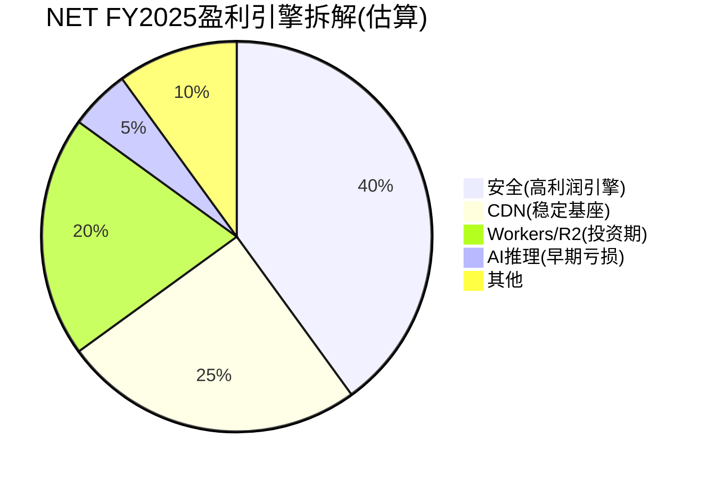
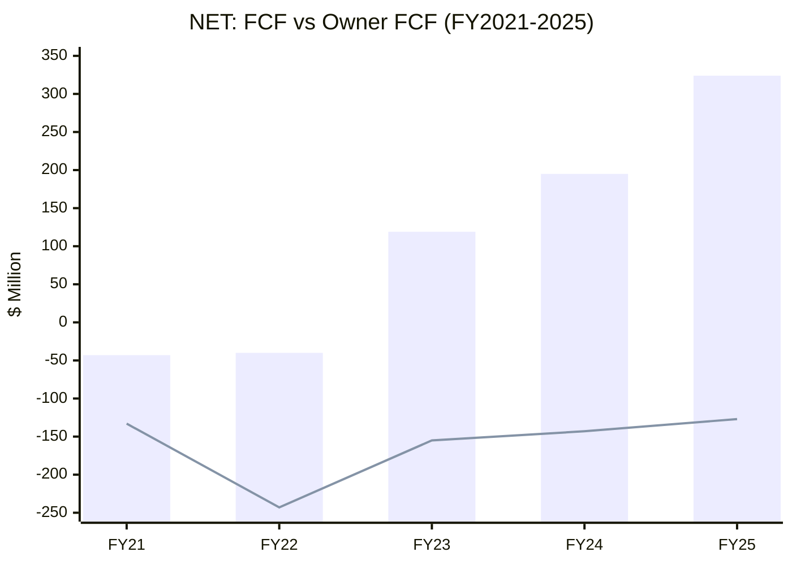

# NET Phase 2 — Part I: 财务深潜 (CPA×ISDD框架)
> **Phase**: 2 | **日期**: 2026-03-30 | **框架**: CPA×ISDD v2.0
> **输入**: DM v1.1(83锚点) + Phase 1分析(46.5K) + Python模型

---

## Ch16: 利润表诊断详解 [CPA×ISDD M1]

### 16.1 路径路由

**profit_lag** = 收入增速(+30%) - 营业利润增速(OPM从-9.3%→-9.4%, 实际恶化)

profit_lag > 5pp连续存在(收入增长但GAAP利润没有改善) → **触发β路径(逆向溯源)**。[DM-PFT-004][DM-PFT-007]

### 16.2 β路径6步逆向溯源

**第1步: 利润脱钩检测**

| 指标 | FY2024 | FY2025 | 变化 | 严重度 |
|------|--------|--------|------|--------|
| 收入 | $1,670M | $2,168M | +29.8% | — |
| 毛利润 | $1,291M | $1,614M | +25.0% | ⚠️低于收入增速 |
| GAAP营业利润 | -$155M | -$203M | 恶化31% | ⚠️⚠️利润脱钩 |
| EBITDA | $62M | $207M | +234% | ✅大幅改善 |
| GAAP净利润 | -$79M | -$102M | 恶化30% | ⚠️净利润扩大 |

[DM-REV-004][DM-REV-005][DM-PFT-004][DM-PFT-006]

**脱钩诊断**: GAAP营业利润恶化(-$155M→-$203M)但EBITDA改善($62M→$207M) = **D&A(折旧摊销)是GAAP脱钩的主因**。因为FY2025 D&A(Depreciation & Amortization, 折旧摊销——将前期资本支出按使用年限分摊到利润表的非现金费用)从$128M暴增至$291M(+128%)——这是FY2024-2025大规模CapEx($185M+$343M)在会计上的滞后体现。[DM-FIN-002]

**第2步: 费用归因——谁在吞噬利润?**

FY2025增量成本拆解(vs FY2024):

| 费用项 | FY2024 | FY2025 | 增量 | 占增量收入比 | 判断 |
|--------|--------|--------|------|-----------|------|
| 增量收入 | — | — | +$498M | 100% | — |
| COGS增量 | $379M | $554M | +$176M | **35.3%** | ⚠️吞噬1/3增量收入 |
| R&D增量 | $421M | $512M | +$91M | 18.3% | ✅正常 |
| SGA增量 | $1,024M | $1,310M | +$286M | **57.4%** | ⚠️含SBC$113M |
| D&A增量 | $128M | $291M | +$163M | **32.8%** | ⚠️非现金但侵蚀GAAP |

[DM-FIN-001~004]

**利润吞噬者排序**:
1. **SGA (+$286M, 含SBC +$113M)** = 最大利润吞噬者。因为SGA增量的39%($113M/$286M)来自SBC增长, 剩余61%来自现金费用(S&M人员+G&A)。因此SGA的问题本质上是**SBC问题+企业销售扩张成本**的叠加。
2. **COGS (+$176M)** = 第二大吞噬者。COGS边际率35.3%意味着每$1新收入需要$0.353成本——**比FY2024的边际率22.7%($379M/$1,670M)高出55%**。这证实了Phase 1的假说: **新增收入的COGS结构性更高, 可能来自AI推理/边缘计算工作负载的更高成本**。[DM-FIN-001]
3. **D&A (+$163M)** = 第三吞噬者, 但这是非现金的——不影响FCF, 仅影响GAAP利润。

**第3步: 成本分类**

| 吞噬者 | 分类 | 理由 | 含义 |
|--------|------|------|------|
| SBC增长(+$113M) | **结构性** | 4年锁定20-21%, 管理层无收敛意愿 | 将持续侵蚀GAAP利润 |
| COGS加速(+$176M) | **待定(关键问题)** | 可能结构性(AI COGS高) 或 阶段性(新PoP低利用率) | 决定CQ6判断 |
| S&M增长(+$173M) | **战略性** | 企业市场扩张需要投入(目标从36%→27-29%长期) | 如果成功→杠杆释放; 如果失败→持续高费用 |
| D&A暴增(+$163M) | **阶段性** | CapEx前置的会计后果, 不影响现金 | 2-3年后随折旧基数稳定会缓解 |

**第4步: 单元经济验证**

| 客户层 | 收入占比 | 增速 | 隐含ARPU趋势 |
|--------|---------|------|-------------|
| $1M+客户 | ~25%(269家) | +55% | ↑ARPU扩展(Pool of Funds) |
| $100K-$1M | ~48%(~4,000家) | +23% | →ARPU稳定 |
| <$100K | ~27%(数十万家) | ~10-15%(估) | ↓ARPU压缩(竞争) |

**关键洞见**: 增长主要来自**大客户ARPU扩展**(不是新客户数量增加)。$1M+客户增速+55%远超$100K+整体+23% → **高端拉高平均ARPU, 低端基本持平**。这与Phase 1定价权剪刀差结论一致。[DM-BIZ-001][DM-BIZ-002]

**单元经济结论**: 总量增长(+30%)+高端单元扩展(+55%)+低端停滞(~10%) = **增长来自客户质量提升(mix shift)而非数量爆发**。这种增长模式的好处是ARPU稳定性高, 坏处是增速天花板取决于"高端客户还有多少?"——目前269家$1M+客户, 如果TAM中有~2,000家潜在$1M+客户(F500 + G500 + Tech500), 渗透率仅~13%, 还有很大空间。

**第5步: 引擎识别**

- **核心盈利引擎**: 安全产品(高利润率+高增速)——估计贡献40%+的毛利润, 但仅占~35%收入
- **基座**: CDN(中等利润率+低增速)——提供稳定收入但增长缓慢
- **扩张放大器**: Workers/R2(投资期, 可能亏损)——增速最快但可能拖低整体利润率
- **摆动因子**: AI推理(极早期)——如果成功=第二曲线; 如果失败=沉没成本

**第6步: 现金验证**

| 指标 | FY2024 | FY2025 | 判断 |
|------|--------|--------|------|
| FCF | $195M | $324M | ✅强劲增长(+66%) |
| FCF/NI | -2.5x | -3.2x | N/A(NI为负) |
| OCF/Rev | 22.8% | 30.8% | ✅改善 |
| CapEx/OCF | 48.6% | 51.4% | ⚠️CapEx占OCF过半 |

[DM-CF-001~005]

**现金流确认**: FCF确认了业务的现金生成能力在改善($195M→$324M), 尽管GAAP利润恶化。因为D&A是非现金费用→不影响FCF。**但CapEx/OCF >50%意味着NET需要持续大量资本投入来维持增长——这更像基础设施公司而非纯软件公司的特征**。[DM-CF-005][DM-CF-006]

### 16.3 盈利质量综合评分

| 维度 | 评分(1-5) | 理由 |
|------|----------|------|
| GAAP vs Non-GAAP差距 | 2/5 | 差距$521M(24%/Rev), >25%=低质量边缘 |
| SBC可持续性 | 2/5 | 20.8%/Rev×4年零收敛, 结构性成本 |
| 盈利引擎多样性 | 3/5 | 安全为主引擎, CDN为基座, Workers/AI待验证 |
| 现金流确认 | 4/5 | FCF正且增长, 但Owner FCF仍负 |
| 增长可持续性 | 4/5 | RPO+48%, DBNRR 120%, 高端mix shift |

**盈利质量总分: 15/25 = 3.0/5(中等偏低)** — 增长和现金流健康, 但SBC和GAAP/Non-GAAP差距严重拖累

---

## Ch17: 资产负债表诊断 [CPA×ISDD M2]

### 17.1 资产结构

| 资产类别 | FY2025 | 占比 | 判断 |
|---------|--------|------|------|
| 现金+短期投资 | $4,101M | **67.9%** | ✅极高流动性(但大部分来自举债) |
| 应收账款 | $406M | 6.7% | ✅正常(DSO 68天, 行业中位) |
| PP&E(净) | $856M | 14.2% | 网络基础设施(335+ PoP) |
| 商誉+无形 | $268M | **4.4%** | ✅极低减值风险 |
| 其他 | $405M | 6.7% | 递延佣金+预付+ROU资产 |
| **总资产** | **$6,036M** | 100% | — |

[DM-BS-001~010]

**关键发现**: 商誉仅$227M(3.8%总资产)——NET几乎没有做过高溢价并购(主要靠有机增长)。这在高增长SaaS中非常罕见(CRWD商誉$2.2B, CRM商誉$47B)。因为Prince偏好自建而非收购, 这降低了减值风险但也意味着**NET的增长完全依赖有机执行, 没有M&A作为增长补充**。[DM-BS-006][DM-BS-007]

### 17.2 负债结构

| 负债类别 | FY2025 | 占比 | 判断 |
|---------|--------|------|------|
| 短期债务 | $1,362M | **29.8%** | ⚠️大量到期(可转债?) |
| 长期债务 | $2,156M | 47.1% | 低利率可转债 |
| 递延收入(流动) | $684M | 14.9% | ✅健康预付(+45% YoY) |
| 递延收入(非流动) | $41M | 0.9% | 长期合同 |
| 其他流动负债 | $304M | 6.6% | 应付+应计 |
| 其他非流动负债 | $30M | 0.7% | — |
| **总负债** | **$4,577M** | 100% | — |

**FY2025债务暴增原因**: 总债务从$1,463M→$3,700M(+$2,237M, +153%)。短期债务从$0→$1,362M——这意味着FY2025新发行了可转债(Convertible Notes, 可转换为股票的债务——利率通常低于普通债务, 但如果股价上涨会被转换为股票, 进一步稀释股东), 其中$1.36B将在1年内到期或可赎回。[DM-BS-002]

**D/E比率2.41**: 表面看杠杆较高, 但因为NET有$4.1B现金(覆盖全部债务)→**净债务仅$2.76B, 净D/E约1.9**。如果大部分是低利率可转债(~0.5-1.5%), 利息负担极低($8.8M利息费用/年 vs $4.1B现金的投资收益~$131M/年 = **净利息收入$122M**)。因此NET实际上在**从借债中获利**——借低息可转债→投资短期国债赚4%→每年净赚$100M+。[DM-BS-008]

### 17.3 递延收入: 最强前瞻指标

递延收入(Deferred Revenue, 递延收入——客户已付款但公司尚未交付服务/确认的收入。增长=客户在预付更多, 是收入的领先指标)趋势:

| 年份 | 递延收入总额 | YoY增速 | vs收入增速 | 信号 |
|------|-----------|---------|-----------|------|
| FY2022 | $230M | — | — | — |
| FY2023 | $365M | +58% | vs +33% | 🟢强正面(+25pp) |
| FY2024 | $500M | +37% | vs +29% | 🟢正面(+8pp) |
| FY2025 | $725M | **+45%** | vs +30% | 🟢**强正面(+15pp)** |

[DM-BS-004][DM-BS-005]

**递延收入增速连续3年超过收入增速**: 这是SaaS行业最可靠的前瞻指标之一——客户在签更大/更长的合同, 预付更多。+45%增速(vs收入+30%)意味着**未来12-18个月的收入可见性在改善**。因此即使估值极贵, 增长减速的风险在短期内较低。

### 17.4 营运资本效率

**现金转换周期(CCC, Cash Conversion Cycle——从付供应商到收客户钱的时间, 负数=先收钱后付钱, 越负越好)**:

| 年份 | DSO(天) | DPO(天) | CCC(天) | 判断 |
|------|---------|---------|---------|------|
| FY2023 | 73 | 64 | +9 | 中性 |
| FY2024 | 73 | 102 | -29 | ✅负CCC(先收钱) |
| FY2025 | 68 | 55 | +13 | ⚠️CCC回正(DPO大幅下降) |

FY2025 DPO从102天降至55天=**付款速度加快** (可能反映新供应商要求更快付款, 或债务发行后现金充裕→主动加快付款改善供应商关系)。CCC回正不是警报, 但意味着营运资本效率从"优秀"回到"正常"。

---

## Ch18: 现金流深潜 [CPA×ISDD M3]

### 18.1 FCF分层分析

| 指标 | FY2021 | FY2022 | FY2023 | FY2024 | FY2025 |
|------|--------|--------|--------|--------|--------|
| OCF($M) | 65 | 124 | 254 | 380 | 667 |
| CapEx($M) | -108 | -163 | -135 | -185 | -343 |
| **FCF($M)** | **-43** | **-40** | **+119** | **+195** | **+324** |
| FCF Margin | -6.6% | -4.1% | +9.2% | +11.7% | +15.0% |
| SBC($M) | 90 | 203 | 274 | 338 | 451 |
| **Owner FCF** | **-133** | **-243** | **-155** | **-143** | **-127** |
| Owner FCF Margin | -20.3% | -24.9% | -12.0% | -8.6% | -5.9% |

[DM-CF-001~008][DM-SBC-001~005]

**FCF vs Owner FCF的鸿沟**: FCF从-$43M改善至+$324M(5年改善$367M), 但Owner FCF从-$133M仅改善至-$127M(5年仅改善$6M)。因为SBC增长($90M→$451M, 增加$361M)几乎完全吞噬了FCF的改善($367M)。**SBC是一台"利润吸收机"——公司越赚钱, SBC越高, 股东分到的越少**。

**Owner FCF转正时间线估算**: 按当前趋势(FCF年增~$65M, SBC年增~$50M), Owner FCF年改善~$15M → 从-$127M到$0需要~8.5年(FY2033-2034)。但如果增速放缓触发SBC增速同步放缓(条件a)→可能在FY2028-2029转正(乐观)。

### 18.2 CapEx拆解: 增长投资 vs 维持投资

| 年份 | CapEx | CapEx/Rev | CapEx/D&A | 判断 |
|------|-------|----------|----------|------|
| FY2021 | $108M | 16.4% | 1.62x | 增长投资(新PoP) |
| FY2022 | $163M | 16.8% | 1.60x | 增长投资 |
| FY2023 | $135M | 10.4% | 0.99x | **≈维持投资(CapEx≈D&A)** |
| FY2024 | $185M | 11.1% | 0.88x | **维持+轻度增长** |
| FY2025 | $343M | 15.8% | 1.18x | **回到增长模式(+85%)** |

[DM-CF-002][DM-CF-005][DM-CF-006]

**FY2025 CapEx暴增+85%的含义**: NET在FY2023-2024经历了一个"CapEx假期"(低投入维持运营), FY2025重启大规模网络扩展。这与$2.2B新债务发行同步——**管理层用举债资金投资网络扩展和/或AI GPU**。

**CapEx/D&A >1.0意味着NET在"投资超过折旧"——资产基数在增长**。对于一个增速30%的公司, CapEx/D&A=1.18是合理的(需要持续投资维持增长)。但如果CapEx/D&A持续>1.5(FY2021-22水平), 意味着NET越来越像资本密集型基础设施公司——这会影响CQ6(软件vs基础设施)的判断。

### 18.3 资本配置评分 [CPA×ISDD M5]

| 资本去向 | FY2025金额 | 占FCF比 | 评分 |
|---------|-----------|---------|------|
| 再投资(CapEx) | $343M | 106% | ⚠️CapEx>FCF |
| 并购 | $51M | 16% | ✅微量(有机增长为主) |
| 回购 | **$0** | **0%** | ❌零回购(SBC稀释完全由股东承担) |
| 分红 | $0 | 0% | — (增长期正常) |
| 债务偿还 | -$1,933M(净) | 净发债 | ⚠️大量新举债 |

**资本配置评分: 2.5/5** — 因为: (a)CapEx>FCF意味着NET的资本需求大于其现金生成能力 (b)零回购使SBC稀释全部落在股东身上 (c)大量举债增加了财务风险(尽管利率低)

**与回购η效率对比**: NET的η = N/A(无回购)。如果NET开始回购(需要FCF>SBC), 最乐观情景下η也只会在0.3-0.5(因为大部分回购用于抵消SBC稀释)。参考ADSK η=0.11——即使回购也可能是"无效回购"。
