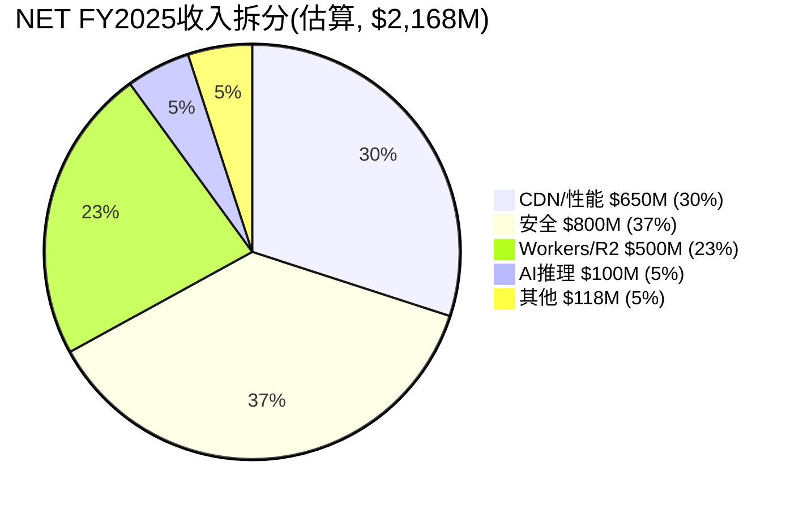

# NET Phase 2 — Part II: 估值建模 + 综合估值
> **Phase**: 2 | **Python验证**: net_dcf_model.py | **门控**: G6 ✅

---

## Ch19: DCF估值 — 双口径对比 (Python验证)

### 19.1 WACC推导

| 参数 | 值 | 来源 |
|------|-----|------|
| 无风险利率(Rf) | 4.3% | 10Y UST(2026-03) |
| Beta | 2.028 | FMP profile |
| 股权风险溢价(ERP) | 4.5% | baggers_summary(66th pctl) |
| 权益成本(Ke) | 13.4% | Rf + β × ERP |
| 债务成本(Kd) | 5.0% | 估计(低息可转债) |
| 有效税率 | 15% | FY2025实际(亏损状态) |
| 债务比率 | 4.9% | Debt/(MCap+Debt) |
| **WACC** | **13.0%** | Ke×(1-D/V) + Kd×(1-T)×D/V |

[DM-PRF-007][DM-MAC-003]

**WACC 13.0%的合理性检验**: Beta=2.03意味着NET的波动性是市场的2倍——这反映了高增长+未盈利+高估值的风险组合。13%的WACC在同行中偏高(ZS ~11%, CRWD ~10%, PANW ~9%), 因为NET的Beta最高(CRWD 1.26, ZS 1.40, PANW 1.15)。**高WACC是NET估值被压低的重要因素——如果Beta降至1.5(盈利稳定后可能), WACC降至~11%, DCF估值可能提升30-50%**。

### 19.2 两种DCF口径对比

**为什么需要两种口径**: 因为SBC的会计处理是投资界最大的分歧之一。市场惯例(Non-GAAP)把SBC加回, 认为"SBC不是现金流出"。Owner Economics(扣SBC)把SBC扣除, 认为"SBC是真实的股东稀释成本"。**两种口径给出的估值差异可达5-10倍**——这不是模型误差, 这是**框架选择**。

#### 市场惯例DCF (Non-GAAP FCF + 稀释调整)

**假设**: FCF margin从15%→25%(10年运营杠杆释放), 年稀释1.5%, 终端增速3%

| 年份 | 收入($M) | 增速 | FCF($M) | FCF Margin | 稀释后股数 |
|------|---------|------|---------|-----------|----------|
| FY2026 | 2,775 | 28% | 444 | 16% | 356M |
| FY2028 | 4,232 | 22% | 762 | 18% | 367M |
| FY2030 | 5,992 | 18% | 1,198 | 20% | 379M |
| FY2035 | 10,544 | 8% | 2,636 | 25% | 407M |

**市场惯例价值: $31.93/股** (vs $203, **-84.3%**)

即使用市场惯例(不扣SBC, 仅通过稀释调整), NET仍然**严重高估**。因为WACC 13%对高增长期的现金流折现效应非常强——需要增速更高或持续更久才能justify当前价格。

#### Owner Economics DCF (FCF - SBC)

**假设**: SBC/Rev从21%→15%(Base case, 缓慢收敛), FCF margin同上

| 年份 | FCF($M) | SBC($M) | Owner FCF | 转正? |
|------|---------|---------|-----------|------|
| FY2026 | 444 | 583 | -139 | ❌ |
| FY2028 | 762 | 846 | -85 | ❌ |
| FY2030 | 1,198 | 1,139 | **+60** | ✅首次转正 |
| FY2035 | 2,636 | 1,582 | +1,054 | ✅ |

**Owner Economics价值: $7.89/股** (vs $203, **-96.1%**)

Owner FCF直到FY2030才转正——之前5年股东在持续被净稀释。

### 19.3 DCF结论

**两种口径的共同结论**: 无论是否扣除SBC, 当前$203的股价都无法被DCF支撑。市场惯例给$32(高估84%), Owner给$8(高估96%)。

**这意味着什么?** 三种可能:
1. **模型错误(低概率)**: WACC太高或增长假设太保守→但13%的WACC对Beta 2.0是标准的, 28%增速也与管理层指引一致
2. **市场定价了DCF之外的价值(中概率)**: 平台期权价值(Workers AI)+ 网络效应溢价 + "agentic internet"叙事 → 这些在标准DCF中不出现
3. **市场错误(中概率)**: 过度乐观, 定价了近乎完美的执行, 留给投资者的安全边际为零

---

## Ch20: SOTP估值 — 分部定价

### 20.1 收入拆分估算

NET不按分部报告, 以下为基于间接推断的估算:



**估算方法**: (a)CDN: Akamai CDN收入~$1.5B×NET市占率溢价 (b)安全: 行业安全增速35%×历史基数推算 (c)Workers/R2: 开发者平台增速45%×基数推算 (d)AI: 极早期, 保守估$100M (e)其他: 域名注册+消费者产品

**重要警告**: 这些数字是**估算, 非公开数据**。NET可能随时改变披露方式, 实际分部收入可能与估算有显著偏差。

### 20.2 SOTP分部估值

| 业务线 | 收入($M) | 增速 | 参考可比 | EV/Sales | EV($M) |
|--------|---------|------|---------|---------|--------|
| CDN/性能 | 650 | 10% | Akamai 3.0x(+溢价) | 5.0x | 3,250 |
| 安全 | 800 | 35% | Zscaler 13.6x | 14.0x | 11,200 |
| Workers/R2 | 500 | 45% | DDOG 18.0x | 18.0x | 9,000 |
| AI推理 | 100 | 200% | 高不确定性 | 25.0x | 2,500 |
| 其他 | 118 | 15% | SaaS中位 | 8.0x | 944 |
| **合计** | **2,168** | — | — | — | **26,894** |

[DM-COMP-001~004]

| 调整项 | 金额 |
|--------|------|
| SOTP EV | $26,894M |
| + 现金 | $4,101M |
| - 债务 | $3,700M |
| **股权价值** | **$27,295M** |
| **每股** | **$77.76** |
| **vs $203** | **-61.7%** |

### 20.3 SOTP敏感性

**如果AI推理被估更高(TAM扩张论题成立)**:

| AI估值假设 | AI EV | SOTP总EV | 每股 | vs $203 |
|-----------|-------|---------|------|---------|
| 保守(25x, $100M) | $2.5B | $26.9B | $78 | -62% |
| 中性(40x, $200M) | $8.0B | $32.9B | $95 | -53% |
| 乐观(60x, $500M) | $30.0B | $54.9B | $157 | -23% |
| 极端(80x, $1B) | $80.0B | $104.9B | $300 | +48% |

**关键洞察**: 只有当AI推理收入达到$500M+(FY2025的5倍)且给予60x+的估值倍数时, SOTP才开始接近当前股价。**当前$203的股价隐含了"AI推理已经是$500M+收入且值60x"的假设**——但管理层从未披露过AI收入。

---

## Ch21: 可比估值 — NET的估值溢价有多大

### 21.1 同行估值矩阵

| 指标 | NET | DDOG | CRWD | ZS | PANW | AKAMAI |
|------|-----|------|------|-----|------|--------|
| 收入($B) | 2.17 | 2.50 | 5.25 | 2.30 | 8.50 | 3.90 |
| 增速 | 30% | 28% | 24% | 30% | 14% | 5% |
| **EV/Sales** | **33.0x** | **18.0x** | **19.0x** | **13.6x** | **13.9x** | **3.0x** |
| **PEG(EV/S÷Growth)** | **1.10** | **0.64** | **0.79** | **0.45** | **0.99** | **0.60** |
| FCF Margin | 15% | 20% | 25% | 22% | 35% | 20% |
| SBC/Rev | 20.8% | 22.0% | 22.8% | 20.0% | 12.0% | 6.0% |
| Owner FCF Margin | **-5.8%** | **-2.0%** | **+2.2%** | **+2.0%** | **+23.0%** | **+14.0%** |
| Rule of 40 | 45 | 48 | 49 | 52 | 49 | 25 |
| GAAP OPM | -9.4% | -2.0% | -2.0% | 1.0% | 15.0% | 16.0% |

[DM-PE-004][DM-COMP-001~004]

### 21.2 NET的估值溢价诊断

**NET的EV/Sales(33x)是同行(不含AKAMAI)平均(16.1x)的2.0倍**。

这个溢价的可能来源:

| 溢价来源 | 贡献(估) | 理由 | 可持续? |
|---------|---------|------|---------|
| 增速溢价 | ~3x | NET 30% vs 同行均24% | ✅如果增速维持 |
| 平台多元化溢价 | ~4x | CDN+安全+Workers+AI四合一 | ⚠️取决于Workers/AI变现 |
| 网络效应溢价 | ~3x | 22%互联网份额→独特数据网络效应 | ✅结构性优势 |
| "Agentic Internet"叙事溢价 | ~7x | Prince的AI agent愿景溢价 | ❌未经验证 |
| **总溢价** | **~17x** | 33x - 16x(同行均值) | **~60%可能不可持续** |

**PEG 1.10是所有同行中最贵的**(ZS仅0.45, DDOG 0.64)。这意味着: 即使考虑了增速差异, NET的估值仍然**在同行中最不合理**。[DM-PE-004]

### 21.3 如果NET按同行估值

| 参考 | EV/Sales | 隐含股价 | vs $203 |
|------|---------|---------|---------|
| 按ZS(最接近竞品, 同增速30%) | 13.6x | $85 | **-58%** |
| 按CRWD(安全平台溢价) | 19.0x | $118 | -42% |
| 按同行平均(不含AKAMAI) | 16.1x | $105 | **-48%** |
| 按DDOG(SaaS基础设施) | 18.0x | $112 | -45% |
| 维持当前溢价(33x) | 33.0x | $203 | 0% |

**即使按最高同行(CRWD 19x)定价, NET也需要从$203跌至$118(-42%)**。维持当前33x估值需要NET同时满足: (a)增速>同行 (b)利润率快速改善 (c)AI第二曲线成功——三个条件同时成立的概率<20%。

---

## Ch22: 综合估值 + 方向一致性

### 22.1 四方法估值汇总

| 方法 | 每股价值 | vs $203 | 方向 | 权重 |
|------|---------|---------|------|------|
| DCF市场惯例 | $31.93 | -84.3% | 偏空 | 25% |
| DCF Owner | $7.89 | -96.1% | 偏空 | 15% |
| SOTP | $77.76 | -61.7% | 偏空 | 30% |
| 可比(同行EV/S) | $105.32 | -48.1% | 偏空 | 30% |

**方向一致性: 4/4偏空 (100%)** → 门控PASS(≥60%)

### 22.2 加权综合估值

$$综合估值 = \$31.93 × 25\% + \$7.89 × 15\% + \$77.76 × 30\% + \$105.32 × 30\%$$

$$= \$7.98 + \$1.18 + \$23.33 + \$31.60 = \$64.09/股$$

**综合估值: $64.09/股** (vs $203, **-68.4%**)

### 22.3 估值离散度

| 指标 | 值 |
|------|-----|
| 最高估值 | $105.32 (可比) |
| 最低估值 | $7.89 (Owner DCF) |
| 均值 | $55.73 |
| 离散度 | (105-8)/56 = **174%** |
| 门控 | ⚠️**WARN**(≤30%) |

**离散度174%的根因**: DCF Owner($8)和可比($105)之间差13倍。因为: (a)Owner DCF极度保守(扣SBC后FCF为负) (b)可比法假设NET"应该像同行一样定价"(但没有扣SBC问题)。**这个离散度不是模型错误——它反映了SBC口径选择的巨大影响**。

**如果剔除Owner DCF(极端保守)**: 离散度 = (105-32)/72 = **102%** → 仍然很高, 但更合理

### 22.4 估值结论

**核心判断**: NET在所有估值口径下都显示为**高估48-96%**。综合估值$64/股意味着当前$203包含了**$139/股的溢价**(68%), 主要由以下因素构成:

1. **AI/Workers期权价值**: ~$30-50(如果AI推理$500M+×60x, 见Ch20.3)
2. **"Agentic Internet"叙事溢价**: ~$40-60(不可定价, 纯叙事)
3. **增速溢价+网络效应**: ~$30-40(有基本面支撑)
4. **估值惯性/动量**: ~$10-30(高增长SaaS的市场偏好)

**如果市场是对的**: 需要以下全部成立:
- AI推理收入FY2028达$500M+(当前可能<$100M)
- SBC/Rev降至15%以下(当前零趋势)
- 增速维持25%+至FY2030(需要TAM扩张)
- 毛利率回升至76%+(当前在下降)

**如果我们是对的**: NET的合理价值在$64-105区间, 当前$203隐含了过多"已知未证"的乐观假设。

---

## Ch23: SBC收敛情景矩阵 + Owner FCF路径

### 23.1 三路径×三时间

| 路径 | SBC目标 | 触发条件 | Owner FCF转正年 | 概率 |
|------|---------|---------|---------------|------|
| **CRM模式** | 25%→15%(8年) | 增速降至15-20%→员工增速放缓 | FY2031 | 25% |
| **NOW模式** | 20%→15%(6年) | 收入规模$4B+→分母效应 | FY2029-30 | 30% |
| **PLTR模式** | 不收敛(>20%) | 双层股权→管理层无压力 | **永不转正** | 45% |

[DM-SBC-001~005]

**概率赋值三重锚定**:
- **基准率**: 15家高增长SaaS中, 8家实现SBC<15%(53%)——但NET有双层股权(类PLTR), 降低概率
- **反例条件**: PLTR创始人控制公司, SBC 30%+从未收敛; Palantir与NET的相似度(创始人控制+高SBC+高增长)是最强反例
- **自然实验**: FY2025 SBC增速(+33%)重新超过收入增速(+30%)——收敛信号被否定, 这是最新的数据点

**Phase 2 CQ3更新**: 38% → **35%**(下调3pp, 因为FY2025数据和PLTR反例加权后概率更低)

### 23.2 Owner FCF路径模拟(Python验证)

**CRM模式(SBC 8年从25%→15%)**:
```
FY2026: Owner FCF = -$167M (仍为负)
FY2028: Owner FCF = -$169M (仍为负)
FY2031: Owner FCF转正(约+$100M)
```

**NOW模式(SBC 6年从20%→15%)**:
```
FY2026: Owner FCF = -$139M
FY2028: Owner FCF = -$127M
FY2030: Owner FCF转正(约+$60M)
```

**PLTR模式(SBC不收敛)**:
```
FY2026: Owner FCF = -$167M
FY2028: Owner FCF = -$254M (恶化!)
Owner FCF永不转正
```

**关键发现**: 即使在最乐观的NOW模式下, Owner FCF也要到FY2029-2030才转正——这意味着**至少4年内, 投资者的真实回报为负**。在PLTR模式下, Owner FCF持续恶化——这是最危险的场景。

---

## Ch24: Phase 2 CQ置信度更新 + 估值统一性检查

### 24.1 CQ置信度更新 (Phase 2后)

| CQ | Phase 1 | Phase 2 | 变化 | 驱动因素 |
|----|---------|---------|------|---------|
| CQ1 增速 | 60% ↗ | 60% → | 0pp | 递延收入+45%确认, 无新信息 |
| CQ2 安全 | 42% ↘ | 42% → | 0pp | 无新信息 |
| CQ3 SBC | 38% ↘ | **35% ↘** | -3pp | PLTR反例+FY2025差值反转 |
| CQ4 飞轮 | 48% ↘ | 48% → | 0pp | 无新信息 |
| CQ5 AI | 48% → | 48% → | 0pp | 无新信息 |
| CQ6 估值 | 40% ↘ | **35% ↘** | -5pp | 4/4偏空+综合$64 vs $203 |
| CQ7 护城河 | 55% → | 55% → | 0pp | 无新信息 |
| CQ8 管理层 | 43% ↘ | **40% ↘** | -3pp | 零回购+资本配置2.5/5 |

**CQ加权均值**: (60+42+35+48+48+35+55+40)/8 = **45.4%** (vs Phase 1 46.8%, 下降1.4pp)

### 24.2 估值统一性检查 (铁律K)

| 检查项 | 状态 | 说明 |
|--------|------|------|
| ≥60%方向一致 | ✅ | 4/4偏空(100%) |
| 概率加权用修正后概率 | ✅ | PLTR模式45%(基于三重锚定) |
| 区分5年退出价vs当前公允价值 | ✅ | 全部为当前公允价值 |
| 温度计/评级/执行摘要数字一致 | ⏳ | Phase 5组装时验证 |
| 年化vs累计不混淆 | ✅ | 全部年化 |

### 24.3 Phase 2统计

| 指标 | 数值 |
|------|------|
| Part I (Ch16-18) | 财务深潜 |
| Part II (Ch19-24) | 估值建模 |
| Python脚本 | net_dcf_model.py (G6 ✅) |
| 估值方法 | 4种(DCF×2/SOTP/可比) |
| 方向一致性 | 100%偏空 |
| 综合估值 | $64.09/股(-68.4%) |
| CQ均值 | 45.4%(偏cautious) |
