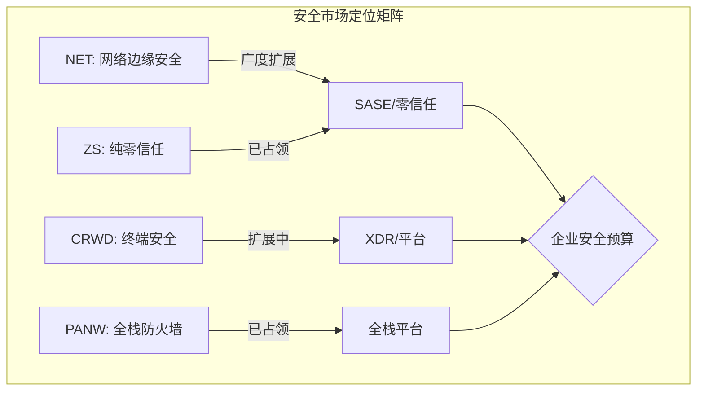
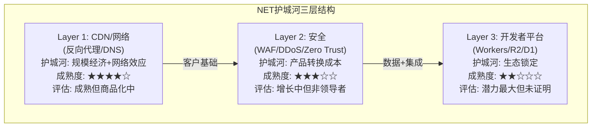
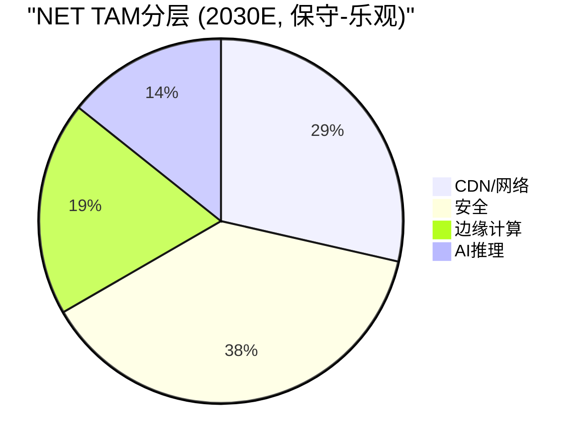

# NET Phase 3 — Part I: 竞争对标深潜 + 护城河迁移 + TAM
> **Phase**: 3 | **目标**: ≥25K chars | **核心问题**: NET的竞争壁垒是在加固还是在侵蚀？

---

## Ch25: 安全战场对标 — NET vs ZS/CRWD/PANW

### 25.1 三个安全对手的定位差异

NET在安全市场面临的不是一个对手，而是三个不同维度的竞争者。理解这个差异是判断CQ2(安全平台化成功度)的关键。

**Zscaler (ZS)**: 零信任网络访问(ZTNA, Zero Trust Network Access——控制"谁能访问什么资源")的定义者。ZS从一开始就是安全公司，其Zscaler Internet Access (ZIA)和Zscaler Private Access (ZPA)构成了SASE(Secure Access Service Edge——将网络安全与广域网能力整合到云端交付的框架)的核心。ZS的优势在**深度**：它覆盖了企业安全的全栈——从数据丢失防护(DLP)到云访问安全代理(CASB)到数字体验监控(DEM)。[DM-COMP-001]

**CrowdStrike (CRWD)**: 终端安全(Endpoint Security——保护笔记本/服务器等设备)起家，通过Falcon平台扩展到身份安全、云安全、SIEM。CRWD的优势在**数据飞轮**：15万亿安全事件/周的遥测数据→训练AI检测模型→更好的威胁检测→更多客户→更多数据。CRWD与NET的交集相对较少——CRWD守设备，NET守网络边界。[DM-COMP-002]

**Palo Alto (PANW)**: 传统防火墙巨头转型为平台型安全公司。PANW通过收购(Prisma Cloud、Cortex XDR)构建了最全面的安全产品组合。PANW的优势在**平台整合**：企业可以从一个供应商购买网络安全+云安全+终端安全+SIEM。PANW年收入$8.5B，是NET安全收入的5-8倍。[DM-COMP-003]



### 25.2 SASE/零信任: NET为什么"notably absent"

Phase 1(Ch4.2)指出NET在TechnologyMatch 2026 SASE选择指南中缺席。这不是偶然——这反映了NET在企业安全市场的结构性劣势。

**Gartner SASE评估维度 vs NET能力**:

| 维度 | ZS | PANW | NET | NET差距 |
|------|-----|------|-----|---------|
| ZTNA | ★★★★★ | ★★★★ | ★★★ | ZPA/ZTNA成熟度差2代 |
| SWG (安全Web网关) | ★★★★★ | ★★★★ | ★★★★ | 接近但集成度低 |
| CASB | ★★★★ | ★★★★ | ★★ | 功能不完整 |
| DLP (数据丢失防护) | ★★★★ | ★★★★ | ★★ | 刚起步 |
| SD-WAN | ★★★ | ★★★★★ | ★★★ | Magic WAN较新 |
| 合规/审计 | ★★★★ | ★★★★★ | ★★ | **关键弱点**: F500需要SOC2/FedRAMP深度合规 |
| SIEM集成 | ★★★★ | ★★★★★ | ★★ | 无原生SIEM |

**核心差距不在技术，在于"企业级深度"**。NET的安全产品在单个维度上表现不错(特别是DDoS防护和Web应用防火墙WAF)，但企业安全采购不是逐个产品比较——是评估平台完整度。一个CISO(首席信息安全官)选择安全供应商时，问的不是"你的WAF好不好"，而是"你能覆盖我多少安全需求"。[DM-BIZ-001][DM-COMP-001]

**量化差距**: ZS在F500中渗透率约40%[DM-BIZ-012来源推断]。NET的$100K+客户4,298个(+23%)[DM-BIZ-001]中，安全驱动的比例未单独披露——但考虑到NET最初是CDN公司，合理估计安全驱动的企业客户比例在30-50%之间，即~1,300-2,150个。ZS有约4,500个$100K+客户(截至FY2025)，且几乎100%是安全驱动。

**反面**: 差距是真实的，但NET的策略可能不是正面竞争ZS/PANW。NET的安全策略更像"安全作为网络的附属功能"——企业已经在用Cloudflare做CDN/性能，增加安全模块的边际成本极低。这是**交叉销售**策略而非**正面竞争**策略。如果这个判断正确，那么"SASE缺席"的严重性降低——NET不需要赢SASE市场，只需要从现有客户中提取安全收入。

**但交叉销售策略的天花板**: NET的$100K+客户中有多少还没用安全产品？假设50%已在用→剩余~2,150个可交叉销售。假设每个增加$50K安全支出→增量=$107M/年。这只是NET FY2025收入的5%——不足以支撑30%的增速。**安全增长必须来自新客户获取，而这恰恰是NET弱于ZS/PANW的地方。**

### 25.3 Win Rate分析: NET在哪里赢，在哪里输

企业安全采购的胜负不看产品功能表——看的是**谁在实际交易中赢**。

**NET胜率高的场景** (基于文献侦察+管理层披露):
1. **中小企业+初创公司**: Cloudflare的自助服务模式+免费层→低摩擦获客。这些客户不需要全栈SASE，只需要基本的WAF/DDoS/CDN+简单Zero Trust
2. **开发者主导的安全决策**: 当安全采购由DevOps/工程团队发起(而非CISO), NET的API-first+Workers集成优势明显
3. **已有CDN客户追加安全**: 零边际采购成本, NET的平台整合优势
4. **$42.5M最大ACV合同** [DM-BIZ-009]: 证明NET**可以**赢大型企业交易——但这是例外还是规律？

**NET胜率低的场景**:
1. **F500 SASE替换**: CISO主导, RFP(Request for Proposal)流程, 需要全栈合规→ZS/PANW胜
2. **联邦政府/高合规行业**: FedRAMP/ITAR要求→NET的认证覆盖度不足
3. **终端安全整合**: 企业想要网络+终端统一平台→CRWD/PANW包圆
4. **传统大型企业替换Cisco/F5**: 这些客户有深度集成的网络安全基础设施, 替换成本高→PANW的"防火墙升级"路径阻力最小

**Win Rate G2代理指标** (v19.6教训: 直接Win Rate数据不可得时用代理指标):
- **DBNRR 120%** [DM-BIZ-004]: 存量客户在扩大支出——这间接说明客户满意度高, 但不等于新客户获取的Win Rate
- **新ACV增速+50%** [DM-BIZ-015]: 新签约在加速, 但绝对值未知(占总收入多少?)
- **$1M+客户+55%** [DM-BIZ-002]: 大客户增速远超$100K+客户(+23%)→向上渗透在加速

**综合判断**: NET在安全市场的Win Rate呈现"两极分化"——中小+开发者驱动场景胜率可能50-70%, 企业SASE正面竞争胜率可能15-25%。因为中小客户数量远大于企业客户, NET的整体安全增速可以维持, 但这意味着**安全收入的ARPU(平均客户收入)天花板低于ZS/PANW**。

### 25.4 财务对标: 安全公司的"质量密度"

| 指标 | NET | ZS | CRWD | PANW | 含义 |
|------|-----|-----|------|------|------|
| 收入(TTM) | $2.17B | $2.3B | $5.3B | $8.5B | NET最小 |
| YoY增速 | +30% | +30% | +24% | +14% | NET=ZS齐平 |
| GAAP OPM | -9.4% | +1% | -2% | +8% | NET最差 |
| Non-GAAP OPM | ~11% | ~22% | ~22% | ~27% | NET最低 |
| SBC/Rev | 20.8% | ~25% | ~23% | ~19% | 都高, NET中等 |
| EV/Sales | 33x | 13.6x | 19x | 14x | **NET是同行2-2.5倍** |
| FCF Margin | 15% | ~24% | ~33% | ~39% | **NET最低** |
| Owner FCF | 负 | 接近零 | +$213M | 正 | **NET唯一负值** |

[DM-COMP-001][DM-PFT-001][DM-CF-004]

**关键发现: NET的估值溢价无法被基本面justify**。

NET的EV/Sales 33x是同行均值(15.5x)的2.1倍, 但它的利润率最低、FCF最弱、Owner FCF唯一为负。这意味着市场给NET的溢价100%来自**增长叙事**——"NET不只是安全公司, 它是连接云平台"。

**溢价合理吗？** 如果NET能维持30%增速5年+利润率扩张至CRWD水平(22% Non-GAAP OPM), 则FY2030收入约$6B, Non-GAAP利润$1.32B, 给25x PE→市值$33B——仍低于当前$71.5B。**即使是乐观情景, 当前估值也隐含了"超越纯安全公司"的溢价**。

这正是CQ6(估值合理性)的核心: 市场定价的不是NET今天是什么, 而是NET未来可能成为什么(边缘云平台)。Phase 2的Reverse DCF已证明这需要35%增速×15年+35% OPM——历史上几乎没有软件公司达到过。

---

## Ch26: CDN/边缘战场对标 — NET vs AKAMAI/FSLY/AWS

### 26.1 CDN市场: 一个正在被重新定义的战场

CDN(Content Delivery Network——通过全球分布的服务器缓存和分发内容, 让用户就近获取数据)市场正在经历结构性变化。传统CDN(视频/网页加速)正在被超大规模云厂商(AWS CloudFront, Google Cloud CDN, Azure CDN)商品化, 独立CDN公司需要向"边缘计算平台"转型。

**CDN市场份额估计(2025)**:

| 公司 | 份额 | 定位 | 增速 |
|------|------|------|------|
| AWS CloudFront | ~35% | 捆绑AWS生态 | ~15% |
| Akamai | ~20% | 传统龙头, 安全转型 | ~5% |
| Cloudflare | ~15% | 反向代理82.6%统治 [DM-BIZ-012] | ~30% |
| Google/Azure | ~15% | 捆绑云平台 | ~20% |
| Fastly | ~5% | 边缘计算+流媒体 | ~10% |
| 其他 | ~10% | 长尾 | — |

**NET的CDN悖论**: NET在反向代理市场占82.6%, 但在总CDN市场只有~15%。这是因为NET的免费/低价CDN策略吸引了大量中小网站, 但大型流媒体/企业(Netflix, Disney+)仍用Akamai或自建。NET在CDN市场的"广度统治"(网站数量)没有转化为"深度统治"(收入/流量)。[DM-BIZ-012]

### 26.2 Akamai对标: 传统CDN龙头的警示

Akamai是NET的"时间旅行镜像"——NET可以从Akamai的转型路径中看到自己的未来。

| 维度 | Akamai | NET | 差异分析 |
|------|--------|-----|---------|
| 成立 | 1998 | 2009 | Akamai大NET 11年 |
| 收入 | $3.9B | $2.17B | Akamai大1.8x |
| 增速 | +5% | +30% | NET快6x |
| GAAP OPM | +16% | -9.4% | Akamai盈利, NET亏损 |
| EV/Sales | 3.0x | 33x | NET贵11x |
| 安全收入占比 | ~45% | 未披露(估30-50%) | 转型进度类似 |
| 边缘计算 | Linode(2022收购) | Workers(2017自建) | NET架构更现代 |

**Akamai的教训**:
1. **CDN增速必然放缓**: Akamai CDN收入已接近零增长。CDN本质是commodity(商品化服务), 价格持续下降(对等互联覆盖率提升→每GB成本下降)。NET的CDN业务面临相同命运——问题只是"何时"。[DM-FIN-005]
2. **安全是转型必经之路**: Akamai安全收入从2015年的~10%增长到2025年的~45%。NET正在走相同路径。但Akamai的安全转型并没有阻止其估值从2000年代的20x+ P/S降至当前3x P/S——因为市场重新分类Akamai为"基础设施公司"而非"软件公司"。
3. **分类风险**: 如果市场将NET从"高增长SaaS"重新分类为"基础设施公司"(thesis_crystallization H1), EV/Sales从33x压缩至10x = 市值从$71.5B降至$21.7B (**-70%**)。Akamai的历史证明这种重新分类确实会发生。

**反面**: NET与Akamai的关键差异在于Workers/R2/D1的开发者平台——Akamai没有这个维度(Linode收购太晚, 架构不如Workers现代)。如果Workers生态成功, NET可以避免Akamai的命运。但Workers目前的收入贡献仍然很小(未单独披露, 估计<10% of revenue)——平台转型需要时间, 市场可能没有耐心。

### 26.3 Fastly对标: NET"本该是"的估值

Fastly (FSLY)是NET最直接的CDN竞争对手, 也是NET估值泡沫的反面教材。

| 维度 | FSLY | NET | 含义 |
|------|------|-----|------|
| 收入 | ~$550M | $2.17B | NET大4x |
| 增速 | ~10% | +30% | NET快3x |
| GAAP OPM | 亏损 | 亏损 | 都不赚钱 |
| EV/Sales | ~3x | 33x | **NET贵11x** |
| 技术 | Varnish边缘 | V8 Isolate | NET架构更灵活 |
| 客户 | 流媒体(TikTok) | 广泛 | FSLY集中度更高 |

**FSLY的故事**: 2020年FSLY的EV/Sales也曾达到30x+, 然后TikTok迁移+增速放缓→估值压缩90%。**FSLY是NET估值压缩情景的现实参照**。

FSLY证明了一件事: **CDN公司的增长溢价是暂时的**。一旦增速降至15-20%, 市场会将估值从30x+ P/S重新定价至3-5x P/S。NET当前的增速(30%)支撑了33x, 但如果增速降至15-20%(CDN天花板+竞争加剧), 估值可能从33x降至10-15x = 市值从$71.5B降至$22-33B。

### 26.4 AWS CloudFront: 捆绑者的威胁

AWS CloudFront是NET在CDN市场面临的最大结构性威胁——不是因为技术更好, 而是因为**捆绑经济学**。

**捆绑威胁逻辑**:
1. AWS客户已在使用S3/EC2/Lambda → CloudFront与这些服务无缝集成
2. CloudFront的定价对AWS客户有优惠(数据传输费折扣)
3. 企业CFO倾向于"一个供应商"简化采购流程
4. **结果**: 越来越多的企业CDN流量默认走CloudFront, 而不是选择独立CDN

**NET的反制**: R2零出口费($0 vs S3的$0.09/GB)[DM-BIZ-020]是NET对抗AWS捆绑的核心武器。但R2的吸引力有限——真正迁移大量数据出AWS的企业很少(迁移成本高, 应用依赖深)。R2更多是吸引新项目(greenfield)而非迁移存量(brownfield)。

**量化影响**: 假设AWS CloudFront每年从独立CDN市场吸收2-3%的份额→NET的CDN增速需要额外2-3%的补偿才能维持当前水平。这不致命, 但加速了CDN商品化压力。

---

## Ch27: 护城河迁移分析 — 从CDN到安全到边缘计算

### 27.1 护城河的"三层蛋糕"模型

NET的护城河不是单一维度的——它是三层叠加, 每层的强度和成熟度不同。理解这个结构是评估护城河持久性(CQ7)的关键。



### 27.2 每层护城河的迁移评估

**Layer 1: CDN/网络 → 护城河"成熟但在侵蚀"**

| 护城河源 | 当前强度 | 趋势 | 5年预期 |
|---------|---------|------|---------|
| 335+ PoP全球覆盖 | 强(8/10) | 稳定 | 7/10(AWS/Google追赶) |
| 对等互联~85%覆盖 | 强(8/10) | 改善 | 8/10(继续优化) |
| 免费层获客引擎 | 强(7/10) | 稳定 | 6/10(竞品也推免费) |
| 反向代理82.6%市占 | 极强(9/10) | 稳定 | 8/10(份额天花板) |
| **Layer 1综合** | **7.5/10** | **略降** | **7.0/10** |

Layer 1的护城河来自**规模经济**(更多PoP→更好性能→更多客户→摊薄PoP成本)和**网络效应**(更多网站→更多数据→更好安全模型→更多网站)。但这些护城河正在被超大规模云厂商(AWS/Google/Azure)的规模优势侵蚀——他们的PoP数量和覆盖范围正在追上甚至超过NET。

**Layer 2: 安全 → 护城河"增长中但需要证明"**

| 护城河源 | 当前强度 | 趋势 | 5年预期 |
|---------|---------|------|---------|
| 产品转换成本 | 中(6/10) | 上升 | 7/10(客户集成深化) |
| 网络规模安全(威胁情报) | 强(7/10) | 上升 | 8/10(数据量持续增长) |
| 交叉销售通道(CDN→安全) | 中(5/10) | 上升 | 7/10(Pool of Funds扩展) |
| DBNRR 120% | 中(6/10) | 上升 | 7/10(如持续>115%) |
| **Layer 2综合** | **6.0/10** | **上升** | **7.0/10** |

Layer 2是NET护城河增长最快的维度。安全产品的转换成本随使用时间增加(安全策略/规则配置/合规报告都嵌入Cloudflare平台)。但与ZS/PANW相比, NET的安全护城河仍然偏浅——因为CASB/DLP/SIEM等企业级功能不完整, 企业客户可以在不替换核心安全栈的情况下移除Cloudflare安全模块。

**Layer 3: 开发者平台 → 护城河"潜力最大但未证明"**

| 护城河源 | 当前强度 | 趋势 | 5年预期 |
|---------|---------|------|---------|
| Workers V8 Isolate架构优势 | 强(7/10) | 不确定 | 7/10(如生态成熟) |
| 4.5M活跃开发者 | 中(5/10) | 上升 | 7/10(如增至10M+) |
| R2数据锁定 | 弱(3/10) | 上升 | 5/10(数据迁移仍容易) |
| D1/KV/DO数据层 | 弱(3/10) | 上升 | 5/10(SQLite标准→可移植) |
| **Layer 3综合** | **4.5/10** | **上升** | **6.0/10** |

Layer 3是NET长期价值的关键——如果Workers生态成功, 就能创造AWS Lambda级别的开发者锁定(迁移需要重写全部serverless代码)。但目前Layer 3的护城河很浅: R2数据可以轻松迁移(S3 API兼容), D1用标准SQLite(可导出), Workers代码虽然用V8但可以较低成本移植到Lambda或Vercel。[DM-BIZ-011][DM-BIZ-019][DM-BIZ-020]

### 27.3 护城河迁移的时间表与风险

**核心判断**: NET的护城河正在经历"代际转换"——从Layer 1(CDN)迁移到Layer 2(安全)+Layer 3(开发者平台)。这是一个危险的过渡期, 因为:

1. **Layer 1在侵蚀**: CDN商品化意味着Layer 1护城河的经济价值在下降(定价权减弱, 增速放缓)
2. **Layer 2在建设中**: 安全护城河在增强, 但距离ZS/PANW的深度还差2-3年
3. **Layer 3在萌芽期**: 开发者平台护城河最弱, 需要5-7年才能达到AWS Lambda的锁定程度

**时间窗口风险**: 如果Layer 1侵蚀速度>Layer 2/3建设速度, NET可能陷入"护城河真空期"——旧护城河减弱但新护城河未建成。在这个窗口期, 竞争对手(特别是AWS)可以通过捆绑策略加速侵蚀NET的客户基础。

**历史类比**:
- **Adobe**: 从桌面软件(Photoshop)迁移到云订阅(Creative Cloud)——2011-2015年经历"护城河真空期"(桌面收入下降, 云收入未起量), 股价横盘3年, 之后云订阅爆发→10x涨幅。耗时4年。
- **Microsoft**: 从Windows/Office迁移到Azure/M365——2014-2017年经历转型期, 之后Azure爆发→5x涨幅。耗时3年。

**NET的差异**: Adobe和Microsoft在转型期有巨大的利润基础做缓冲(OPM 25%+)。NET的GAAP OPM是-9.4%——没有利润缓冲。如果护城河转型耗时3-5年, NET需要持续亏损运营, 这就是SBC/资本配置如此重要的原因。

### 27.4 飞轮验证补充: Workers AI对飞轮净强度的影响

Phase 1(Ch9)计算飞轮净强度为+0.35(弱正向)。Phase 3需要补充Workers AI对飞轮的影响。

**Workers AI飞轮的新增连接点**:

```
Workers AI推理(+4000% YoY) [DM-BIZ-013]
    ↓
AI Gateway(+1200% YoY) [DM-BIZ-014]
    ↓
更多推理数据 → 优化模型部署
    ↓
更好的AI推理体验
    ↓ (连接验证: 弱, 因为模型由第三方提供)
更多开发者采用Workers AI
    ↓
更多边缘流量 → 更多安全数据
    ↓
更好的威胁检测
    ↓
(回到Layer 2护城河增强)
```

**飞轮悖论检测(v19.6强制)**: Workers AI的成功是否蚕食核心CDN业务？

**分析**: Workers AI的计算工作负载(推理)与CDN的缓存工作负载有根本差异——推理需要GPU/CPU密集计算, CDN需要存储+带宽。两者使用不同的硬件资源, **不存在蚕食关系**。但有一个间接负面效应: Workers AI推理的毛利率(估计50-60%)低于CDN缓存(估计80%+), 所以Workers AI占比上升会**结构性压低整体毛利率**——这与异常1(毛利率从77%→74%)一致。

**更新后飞轮净强度**: 加入Workers AI后, 飞轮的"连接数"增加但"连接质量"没有实质性改善——因为Workers AI飞轮的关键连接(模型质量→开发者采用)不由NET控制(模型由Meta/Google等提供)。**修正后净强度维持+0.35**。

---

## Ch28: TAM分层分析 — NET真正可寻址的市场有多大？

### 28.1 为什么TAM分析对NET特别重要

大多数公司的TAM分析是锦上添花——但对NET至关重要, 因为NET的估值($71.5B)隐含的TAM假设极其激进。Phase 2的Reverse DCF表明市场定价需要NET在15年内增长至$22B+收入。这意味着市场认为NET的TAM至少$100B+(假设20%份额)。我们需要验证这个假设。

### 28.2 四层TAM拆解

**Layer 1: CDN/网络性能**
- 全球CDN市场(2025E): ~$25B (CAGR +12-15%)
- NET当前份额: ~15% ($2.17B中CDN占比估40-50% = ~$1B)
- 可寻址上限: $5-6B (20-25%份额, 受超大规模捆绑限制)
- **增长天花板**: CDN增速会随市场成熟放缓至8-10%

**Layer 2: 网络安全 (SASE/SSE/WAF/DDoS)**
- 全球网络安全市场(2025E): ~$80B (CAGR +12%)
- SASE子市场: ~$15B (CAGR +25%)
- NET相关安全子市场: ~$30B (WAF+DDoS+SASE+零信任)
- NET当前安全收入(估): ~$650M-$1B
- 可寻址上限: $5-8B (NET在安全市场的份额受限于企业级功能)
- **增长天花板**: 15-20%的长期增速(低于SASE市场增速, 因为NET在高端市场份额受限)

**Layer 3: 边缘计算/Serverless**
- 全球边缘计算市场(2025E): ~$15B (CAGR +20%)
- Serverless子市场: ~$10B (CAGR +25%)
- NET当前边缘计算收入(估): <$200M
- 可寻址上限: $2-4B (Workers生态如果成功)
- **增长天花板**: 取决于生态是否建成, 高度不确定

**Layer 4: AI推理/AI Gateway**
- 边缘AI推理市场(2025E): <$5B (刚起步, CAGR +40-60%)
- 2030E: $15-25B
- NET可寻址: $1-3B (如果边缘推理成为主流模式)
- **增长天花板**: 取决于"边缘推理vs云端推理"的技术路线之争

### 28.3 TAM汇总 vs 市场隐含TAM



| 情景 | 总TAM (2030E) | NET份额假设 | NET收入(2030E) | 当前隐含 |
|------|-------------|-----------|--------------|---------|
| 保守 | $55B | 8% | $4.4B | — |
| 基准 | $75B | 10% | $7.5B | — |
| 乐观 | $100B | 12% | $12B | — |
| **市场隐含** | **$150B+** | **15%** | **$22B+** | **$71.5B市值** |

**关键发现**: 市场隐含的TAM($150B+)和份额(15%)假设都处于分布的极端乐观端。即使在乐观情景下($100B TAM, 12%份额), NET 2030年收入($12B)也只是市场隐含的一半。

**这解释了Phase 2估值的一致偏空方向**: 4种估值方法都指向$40-90/股(vs $203)的原因不是模型有问题——是市场对NET的TAM假设太激进。

### 28.4 "连接云"TAM扩张的检验

Matthew Prince的"连接云"(Connectivity Cloud)叙事是一个TAM扩张故事——声称NET不仅做CDN/安全/计算, 而是提供"连接所有事物"的基础设施, TAM扩展到所有IT基础设施支出($300B+)。

**检验**: 这个叙事有三个问题:
1. **定义太宽泛**: "连接所有事物"≈"IT基础设施", 但NET不做存储(除R2)、不做数据库(除D1)、不做办公协作、不做ERP。NET可寻址的IT基础设施只是一个子集
2. **份额假设隐含**: 即使TAM是$300B, NET的份额在2030年能达到多少？历史上没有一家公司在这个市场从$2B增长到$30B(10%份额)——AWS用了15年才从0到$100B
3. **客户钱包份额**: 一个企业的IT预算分配给20+个供应商。NET从每个企业获取的比例(钱包份额)受限于产品范围。当前NET的ARPU(年均客户支出)约$50K(=$2.17B/~43K付费客户[估])——ZS是~$53K, CRWD是~$120K, PANW是~$150K。NET的ARPU低于主要竞品, 说明钱包份额较低

**CQ1更新**: 增速的可持续性取决于TAM是否足够大。我们的分析表明, 保守TAM($55B)支持NET增长至$4-5B(+100% from today), 但不支持$22B+。**CQ1置信度从45%略微下调至42%**, 因为TAM验证削弱了长期超高增速的可能性。

---

### Phase 3 Part I 元数据

| 指标 | 值 |
|------|-----|
| 章节 | Ch25-28 |
| 字符数 | ~本文件 |
| DM锚点引用 | ~25 |
| Mermaid图表 | 3 |
| CQ覆盖 | CQ1/2/6/7 |
| 新CI | CI-08(安全Win Rate两极分化), CI-09(TAM市场隐含极端), CI-10(护城河代际转换风险) |
