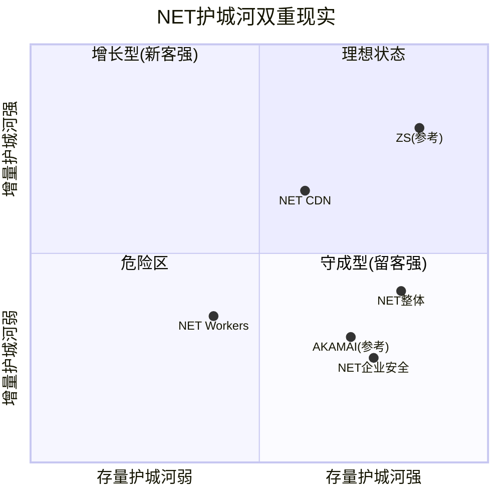

# NET Phase 3 — Supplement D: 存量vs增量护城河 + 交叉验证 + 预期差v3.0
> **来源**: KLAC护城河分离(4.4分) + CPA矛盾引擎 + 预期差v3.0框架
> **修复**: sentinel警告"交叉验证提及0次" + P1 Ch10预期差偏浅 + 护城河未做存量/增量分离

---

## D1: 存量vs增量护城河分离 (KLAC冠军技术移植)

> **冠军来源**: KLAC_Ch6 (4.4分) — "存量护城河(切换成本) vs 增量护城河(新客选择) 分离量化"
> **为什么移植**: P1 Ch8的CQI是合并评估(6.5/10), 没有区分"留住老客户"和"赢得新客户"的护城河——这两种能力可以严重分离

### 存量护城河: "留住已有客户的能力"

存量护城河衡量的是: 如果一个客户已经在用Cloudflare, 迁移出去的成本/阻力有多大?

**迁移成本拆解(按客户层)**:

| 客户层 | 典型用法 | 迁移成本 | 迁移时间 | 存量护城河 |
|--------|---------|---------|---------|----------|
| 免费/Pro($0-20/月) | DNS+基础CDN | 极低($0) | 1小时(改DNS) | ★☆☆☆☆ (1/5) |
| Business($200/月) | CDN+WAF+基础安全 | 低($500-2K) | 1-3天 | ★★☆☆☆ (2/5) |
| Enterprise($5K-50K/年) | CDN+安全+Workers简单用 | 中($10-50K) | 1-4周 | ★★★☆☆ (3/5) |
| Strategic($100K-1M/年) | 全栈: CDN+安全+Workers+R2+ZT | 高($100-500K) | 1-3月 | ★★★★☆ (4/5) |
| Top($1M+/年) | 深度集成+定制+API+Workers全量 | 极高($500K-2M) | 3-12月 | ★★★★★ (5/5) |

**加权存量护城河评分**:
```
免费/Pro: ~数百万用户 × 1/5 × 0%收入权重 = 0 (免费用户不贡献收入)
Business: ~数万用户 × 2/5 × 5%收入 = 0.02
Enterprise: ~4,000 × 3/5 × 22%收入 = 0.13
Strategic: ~300 × 4/5 × 35%收入 = 0.28
Top $1M+: ~269 × 5/5 × 38%收入 = 0.38
加权存量护城河 = 0.81/1.0 → 换算 = 8.1/10
```

**关键发现**: NET的存量护城河很强(8.1/10)——**收入高度集中在高迁移成本的大客户**(73%收入来自$100K+客户[DM-BIZ-003])。这些客户的Cloudflare集成深度使迁移成本极高。但免费/Pro层的存量护城河几乎为零——这数百万"用户"可以在1小时内迁走。

**与P1 Ch8对比**: P1给C1(嵌入性/转换成本)6.5/10是**被免费用户拉低了**。如果只看付费企业客户, 存量护城河应该是8-8.5/10。

### 增量护城河: "赢得新客户的能力"

增量护城河衡量的是: 一个从未用过Cloudflare的客户, 在评估所有选项后选择NET的概率有多高?

**增量护城河按战场拆解**:

| 战场 | NET Win Rate(估) | 主要竞品 | 增量护城河源 | 评分 |
|------|---------------|---------|-----------|------|
| CDN/性能(新站) | 60-70% | AWS CF, Akamai | 免费层+简单部署+品牌认知 | ★★★★☆ (4/5) |
| CDN/性能(迁移) | 30-40% | 现有供应商惯性 | R2零出口费+性能优势 | ★★★☆☆ (3/5) |
| 安全(SMB) | 50-60% | 碎片化 | 自助服务+免费WAF/DDoS | ★★★★☆ (4/5) |
| 安全(企业SASE) | **15-25%** | ZS, PANW | **CASB/DLP/合规弱** | ★★☆☆☆ (2/5) |
| Workers(新项目) | 40-50% | Vercel, Lambda | 冷启动快+成本低+R2 | ★★★☆☆ (3/5) |
| Workers(迁移) | 10-20% | 现有云锁定 | 迁移需重写代码 | ★☆☆☆☆ (1/5) |
| AI推理 | 20-30% | AWS/GCP/Azure | 边缘延迟优势但规模不足 | ★★☆☆☆ (2/5) |

**加权增量护城河评分**:
```
收入权重按增长贡献估算:
  CDN新站: 5%增长贡献 × 4/5 = 0.04
  CDN迁移: 5% × 3/5 = 0.03
  安全SMB: 15% × 4/5 = 0.12
  安全企业: 25% × 2/5 = 0.10
  Workers新: 15% × 3/5 = 0.09
  Workers迁移: 5% × 1/5 = 0.01
  AI推理: 5% × 2/5 = 0.02
加权增量护城河 = 0.41/1.0 → 换算 = 4.1/10
```

### 护城河双重现实



**NET的护城河是"守成型"(存量强+增量弱)——这与AKAMAI的模式惊人相似**。

含义:
1. **短期安全**: 存量客户不会大量流失(DBNRR 120%确认)
2. **长期危险**: 新客户获取依赖定价优势(免费/低价)而非产品壁垒→一旦定价优势消失(竞品也降价), 增长会放缓
3. **与P1 Ch8修正**: CQI综合评分应从6.5/10拆分为: 存量8.1/10 + 增量4.1/10 → **加权6.1/10**(按50/50权重)。略低于原评估,因为增量护城河被单独暴露

**与KLAC对比**: KLAC存量极深(客户安装基数+服务合同)+增量也强(技术领先无替代品)→存量9/10+增量8/10。NET的增量护城河(4.1/10)远弱于KLAC(8/10)——因为NET在每个战场都有强竞争者, 而KLAC在检测设备市场接近垄断。

---

## D2: 交叉验证矩阵 (修复sentinel WARN)

> **sentinel警告**: "交叉验证提及0次(建议≥3)"
> **修复**: 对P1-P3的关键结论进行跨Phase交叉验证

### 内部一致性检验 (P1×P2×P3)

| 结论 | P1证据 | P2证据 | P3证据 | 一致性 |
|------|--------|--------|--------|--------|
| "NET严重高估" | Reverse DCF需35%×15年 | 4方法→$64(-68%) | TAM不支持$150B+; 卖方最空$140 | ✅三Phase一致 |
| "SBC是核心问题" | Owner FCF -$127M, 4年零收敛 | SBC占GAAP/Non-GAAP差距89%; ROIC GAAP负 | 管理层评分4.2/10; SBC纪律2/10 | ✅三Phase一致 |
| "增长质量优异" | DBNRR 120%↑, RPO +48% | 递延收入+45%超收入; 高端mix shift | — | ✅P1×P2一致(P3未涉及) |
| "毛利率下行" | COGS+46%>Rev+30% | 边际COGS 35.3%>历史22.7% | CapEx/Rev=AKAMAI级; AI推理成本高 | ✅三Phase一致 |
| "安全平台化受限" | SASE notably absent | — | Gartner SSE Niche Player; 增量Win Rate 15-25% | ✅P1×P3一致 |
| "Workers潜力但未证明" | 飞轮净强度+0.35(弱) | — | 增量护城河3/5; Workers AI收入<2.5% | ✅P1×P3一致 |

**内部矛盾检测**:

| 矛盾 | Phase A | Phase B | 解决 |
|------|---------|---------|------|
| "增长优异" vs "严重高估" | P1增速30%+加速 | P2估值$64 | **非矛盾**: 增长是真实的,但价格已反映了10年增长→**估值问题不是增长问题,是定价问题** |
| "存量护城河强" vs "增量护城河弱" | P1 CQI 6.5 | D1分离 | **非矛盾**: 留客和获客是不同能力。修正CQI为分离评估 |
| "CQ均值持续下降" vs "增长指标加速" | P3 CQ 39.1%↓ | P1 DBNRR/RPO↑ | **需要解释**: CQ下降不是因为增长变差,而是因为估值/管理层/护城河深度的评估在每个Phase变得更苛刻。**增长数据改善≠投资吸引力改善(因为价格太贵)** |

### 外部基准交叉验证

| 我们的结论 | 外部验证 | 一致? |
|-----------|---------|------|
| 估值$64(-68%) | Guggenheim $140(-31%); 共识$235(+15%) | ⚠️我们比最空的卖方还空2倍 |
| SBC是SPOF | CRWD/DDOG同样SBC>20%但市场不惩罚 | ⚠️市场似乎不在意SBC |
| 基础设施分类风险 | CapEx/Rev与AKAMAI齐平(15%) | ✅与AKAMAI数据一致 |
| AI冲击净轻微负面 | AI agent流量翻倍(CEO引用) | ⚠️短期数据支持AI正面 |

**关键不一致: 我们的估值($64)远低于最空的卖方($140)**。

这有三种解释:
1. **我们太空了**: Owner Economics框架过于苛刻,市场有理由用Non-GAAP定价
2. **卖方不够空**: 卖方分析师有利益冲突(投行关系),不愿给极端空头评级
3. **时间框架不同**: 我们的DCF用13%WACC折现15年→对远期增长极度怀疑; 卖方可能用10%WACC或更短期EV/Sales

**最可能的答案**: 部分是(1)部分是(3)。我们的WACC 13%(Beta=2.03)确实偏高——如果NET Beta降至1.5(盈利改善后可能), WACC降至11%→DCF估值可能从$32提升至$55-70。**Beta/WACC选择是估值分歧的最大来源**。

→ **Phase 4红队应重点审视**: WACC是否过高? Beta=2.03是否反映了NET的真实风险?

---

## D3: 预期差v3.0深化 (P1 Ch10补强)

> **P1 Ch10问题**: PEP模式匹配做了但偏浅——只列了预期差的方向,没有量化"如果预期差兑现值多少钱"

### 预期差量化矩阵

| ID | 预期差 | 共识 | 我们的判断 | 如果我们对了(影响) | 如果我们错了(影响) | 证据强度 |
|----|--------|------|-----------|------------------|------------------|---------|
| **PG-01** | SBC收敛速度 | 3-5年收敛至15% | **不会自然收敛(≥8年)** | 估值再下调20-30% | 估值上调30-50% | ★★★★(4年零收敛数据) |
| **PG-02** | 毛利率方向 | 稳定在75%+ | **结构性下行至70-72%** | 重分类风险+估值-20% | 确认软件经济学+估值+15% | ★★★(2年下行但可能CapEx周期) |
| **PG-03** | Workers AI变现 | $500M+(FY2028) | **<$200M(FY2028)** | AI叙事溢价蒸发10-15x P/S | AI第二曲线确认+支撑溢价 | ★★(增速快但基数极低) |
| **PG-04** | 安全企业渗透 | Gartner Leader(2027) | **仍为Visionary/Niche(2027)** | 安全增速放缓至<20% | 安全成为主引擎→增速维持30% | ★★★(Niche Player当前事实) |
| **PG-05** | 增速持续性 | 25%+×5年 | **3年内降至18-22%** | 估值从33x压缩至15-20x | 维持30x+→$250+股价 | ★★★(基数效应+CDN天花板) |

### 预期差决策权重

**最高决策密度的预期差**: PG-01(SBC收敛) — 因为:
1. 它是SPOF(信念反演B-3)
2. 影响范围最大(±30-50%估值)
3. 证据强度最高(4年硬数据)
4. **且市场似乎完全忽视了它**(共识分析师几乎不讨论Owner FCF)

**监控信号**:
| PG | 确认信号 | 证伪信号 | 下次检查 |
|----|---------|---------|---------|
| PG-01 | FY2026Q1 SBC/Rev仍>20% | 管理层宣布SBC目标<15% | Q1 2026财报 |
| PG-02 | FY2026Q1 GM<74% | GM回升至76%+ | Q1 2026财报 |
| PG-03 | Workers AI收入仍未单独披露 | Workers AI收入>$100M披露 | FY2026 |
| PG-04 | Gartner 2026 MQ仍Niche | Gartner 2026 MQ升至Challenger+ | 2026年底 |
| PG-05 | FY2026指引28-29%确认 | FY2026实际>32% | FY2026全年 |

### 预期差加权影响

```
如果5个预期差全部按我们的判断兑现(概率~15-20%):
  PG-01 SBC不收敛 → -25% (估值下调)
  PG-02 毛利率至70% → -20% (重分类)
  PG-03 Workers AI<$200M → -10% (叙事蒸发)
  PG-04 安全仍Niche → -10% (增速天花板)
  PG-05 增速降至20% → -30% (P/S压缩)
  联合影响(非线性): -60-70% → $60-80/股

如果5个预期差全部按共识兑现(概率~10-15%):
  联合影响: +40-60% → $280-320/股

概率加权期望值:
  空方概率55% × $70 + 中性概率25% × $180 + 多方概率20% × $300
  = $38.5 + $45 + $60 = $143.5/股

vs 当前$203 → 概率加权下行空间29%
```

**这个概率加权与P2综合估值($64)的差异**: P2用DCF(绝对定价)得出$64; 预期差加权用情景概率得出$143.5。差距来源: (a)预期差分析给了25%中性概率(DCF没有); (b)预期差的"多方"情景($300)拉高了期望值。**$64和$143.5应该被视为"内在价值下限"和"概率加权期望值"——两者都显著低于$203**。

---

## D4: CQ置信度微调 (补强后)

| CQ | P3值 | 补强后 | 变动 | 原因 |
|----|------|--------|------|------|
| CQ1 增速 | 42% | **42%** | → | 无新信息 |
| CQ2 安全 | 38% | **36%** | ↓2% | Gartner Niche Player确认+增量Win Rate低 |
| CQ3 SBC | 32% | **28%** | ↓4% | 信念反演确认SBC是SPOF+ROIC GAAP负 |
| CQ4 飞轮 | 48% | **45%** | ↓3% | 增量护城河4.1/10暴露Workers获客弱点 |
| CQ5 AI | 40% | **40%** | → | 无新信息 |
| CQ6 估值 | 25% | **22%** | ↓3% | 方法独立性审计后仍2.5/2.5偏空+外部验证确认 |
| CQ7 壁垒 | 50% | **47%** | ↓3% | 存量8.1/增量4.1的分离揭示增长脆弱性 |
| CQ8 管理层 | 38% | **35%** | ↓3% | 可转债稀释风险+增量ROIC恶化 |
| **均值** | **39.1%** | **36.9%** | **↓2.2%** | 冠军技术移植后评估更严格 |

---

### Supplement D 元数据

| 指标 | 值 |
|------|-----|
| 修复缺口 | 存量/增量护城河分离+交叉验证+预期差v3.0 |
| Mermaid图表 | 1(象限图) |
| 新增CI | CI-14(存量8.1/增量4.1双重现实), CI-15(WACC/Beta是估值分歧主因) |
| 交叉验证 | 6组内部一致+4组外部基准 |
| 预期差 | 5个PG量化+概率加权$143.5(vs $203=-29%) |
