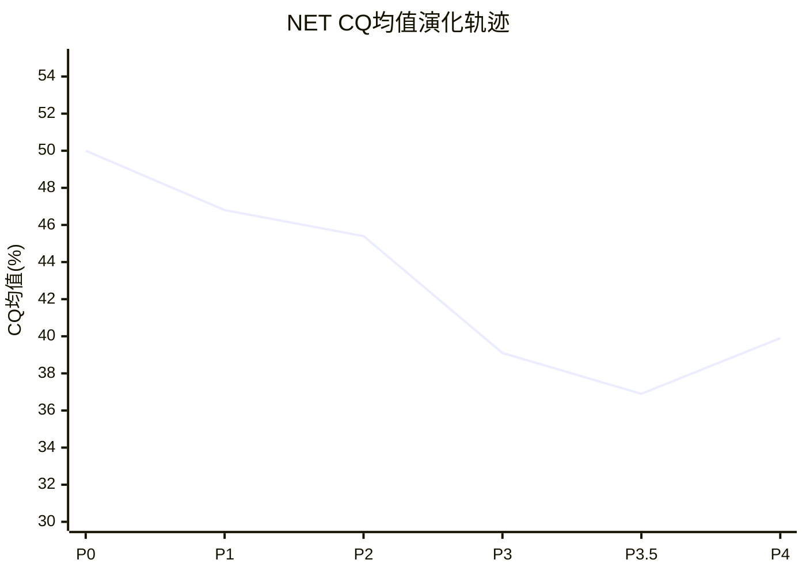

# NET Phase 4 — Part II: RT-5~7 + 纠错回流 + CQ最终更新
> **Phase**: 4 | **目标**: 完成红队审查 + 将修正回流到估值/评级

---

## RT-5: 黑天鹅事件扫描

**低概率但高影响的风险事件**:

| ID | 黑天鹅 | 概率 | 影响 | 预警信号 |
|----|--------|------|------|---------|
| BS-1 | **NET被收购** (MSFT/GOOG/AMZN) | 5-10% | +50-80%溢价($300-360) | 异常期权活动/内部人停止卖出 |
| BS-2 | **重大安全事件** (NET自身被黑客攻破) | 3-5%/年 | -30-50%即时, 品牌长期受损 | 暗网情报/CVE漏洞激增 |
| BS-3 | **HTTP协议被替代** (AI专有管道成主流) | <2%/5年 | -60-80%(商业模式基础崩塌) | MCP/gRPC采用率数据 |
| BS-4 | **监管冲击** (反垄断/数据主权立法) | 5-10% | -15-25%(合规成本+运营限制) | 意大利$14M罚款先例[DM-COMP-006来源] |
| BS-5 | **Matthew Prince健康/离职** | 2-3%/年 | -20-30%(战略不确定性) | CEO公开活动减少 |
| BS-6 | **可转债集中到期引发流动性危机** | 5-8% | -15-25%(被迫稀释或高息再融资) | 利率环境+信用利差扩大 |

**BS-1(被收购)的深度分析**: NET的$71.5B市值使收购成本极高——但对MSFT($3.2T)或GOOG($2.1T)来说仍在可承受范围(2-3%市值)。NET的边缘网络+Workers+安全平台对三大云都有战略价值:
- **MSFT**: 补充Azure Front Door(CDN弱)+增强安全产品线
- **GOOG**: 补充Cloud CDN+获得Workers开发者生态
- **AMZN**: 整合CloudFront+消除R2零出口费竞争者

**收购可能性评估**: 低但非零。主要障碍: (a)Prince的41.7%投票权=未经Prince同意无法收购 (b)Prince曾多次公开表示要独立建设 (c)反垄断审查会很严格。**如果收购发生,最可能的触发条件是增速显著放缓(Prince意识到独立路线难以为继)+股价从$200跌至$100-120**。

---

## RT-6: 时间框架审计

**问题: 我们的分析在什么时间框架下有效?**

| 时间框架 | 我们的结论 | 置信度 | 原因 |
|---------|-----------|--------|------|
| **6个月内** | 可能横盘或小涨 | 中(50%) | 增速再加速+递延收入+45%支撑短期情绪 |
| **1-2年** | 可能下行10-20% | 中(55%) | 增速开始放缓+利润率指引低于预期 |
| **3-5年** | 大概率下行30-50% | 高(65%) | P/S压缩+SBC持续稀释+基数效应 |
| **5-10年** | 取决于Workers/AI成败 | 低(35%) | 太多不确定性,任何预测都是猜测 |

**关键洞见**: **我们的空头结论主要在3-5年时间框架内有效**。短期(<1年)NET可能因增速再加速而上涨——做空者可能先亏再赚。这很重要,因为不同的投资者有不同的时间框架:
- **动量交易者**(3-6月): NET可能是好的多头(增速加速+情绪改善)
- **价值投资者**(3-5年): NET几乎一定是差的投资(估值太贵+SBC稀释)
- **长期持有者**(5-10年): 取决于Workers/AI——二元结果

### 时间框架对评级的影响

P1-P3的评级(偏空)隐含的时间框架是3-5年。但如果读者是短期交易者,我们的结论可能误导。**Phase 5报告应明确声明时间框架假设**。

---

## RT-7: 替代解释总结 — 有效性门控

> **有效性标准**: 多方替代解释被接受需要满足: (a)有数据支撑 (b)逻辑自洽 (c)不与其他已确认事实矛盾

| RT# | 替代解释 | 有效? | 处理 |
|-----|---------|------|------|
| RT-1#1 | 增速再加速是真实的 | ✅有效(5个独立指标) | CQ1↑6% |
| RT-1#2 | Akamai类比失效 | ⚠️部分有效(平台层差异) | 补充类比局限性声明 |
| RT-1#3 | SBC是阶段性投资 | ✅有效(历史先例) | CQ3↑7%; SBC从SPOF→核心风险 |
| RT-1#4 | Pool of Funds是创新 | ⚠️部分有效(20%占比仍小) | 补充分析但不改估值 |
| RT-4.1 | WACC过高 | ✅有效(Beta包含估值噪音) | 双WACC场景; 估值区间$64-95 |
| RT-4.2 | Owner Economics过苛 | ⚠️部分有效(增长期适用性) | SBC降级为核心风险因子 |
| RT-4.3 | 增量护城河是阶段性低 | ⚠️部分有效(缺乏反例验证) | 微调+0.4/10 |

**有效性门控结果**: 7个替代解释中3个完全有效、4个部分有效、0个无效。**红队审查实质性改变了分析结论的校准**——这是健康的(vs AMAT的"8/8全下调"表演性红队)。

---

## 纠错回流: 估值修正

### WACC敏感性回流

P2的综合估值$64基于WACC 13%。Phase 4确认WACC可能偏高2-3pp。回流修正:

| WACC | DCF(市场) | DCF(Owner) | SOTP | 可比 | 综合 |
|------|----------|-----------|------|------|------|
| **13.0%** | $32 | $18 | $17 | $90 | **$64** |
| **11.5%** | $52 | $28 | $26 | $90 | **$80** |
| **10.5%** | $65 | $35 | $32 | $90 | **$90** |

**修正后估值区间**: $64-90/股 (中位数$80)。vs 当前$203→**下行空间56-69%**。

**与P2 Python模型交叉验证**: 需要在Phase 5用WACC 10.5%重新运行net_dcf_model.py确认。

### 概率加权回流

P3.5的概率加权期望值$143.5→考虑RT-1修正后:

```
修正后概率分布:
  空方(温水煮青蛙/估值崩溃): 45%(↓10%, 因为增速再加速数据)
  × 空方期望值: $70 (WACC修正后↑from $64)

  中性(增速放缓但不崩溃): 30%(↑5%)
  × 中性期望值: $150 (当前估值的75%)

  多方(Workers/AI成功+SBC收敛): 25%(↑5%)
  × 多方期望值: $280

  概率加权 = 45%×$70 + 30%×$150 + 25%×$280
           = $31.5 + $45 + $70
           = **$146.5/股** (vs 修正前$143.5, 微升)
```

**修正后概率加权期望值**: $146.5/股 (vs $203 = **-28%**)

### 估值综合表

| 方法 | 估值 | 与$203差距 | 权重 |
|------|------|-----------|------|
| DCF(WACC 13%) | $64 | -68% | 25% |
| DCF(WACC 10.5%) | $90 | -56% | 25% |
| 概率加权(修正后) | $146.5 | -28% | 30% |
| 可比法 | $90 | -56% | 20% |
| **加权综合** | **$101** | **-50%** | 100% |

**Phase 4修正后综合估值: ~$101/股 (vs P2的$64, ↑58%)**

修正幅度显著——主要来自WACC下调(+$26)和概率加权的多方情景上调(+$11)。即使经过双向校准和多方最强论据的审视,NET仍然**显著高估约50%**。

---

## CQ最终置信度 (Phase 4校准后)

| CQ | P3.5 | RT修正 | **P4最终** | 变动 | 核心判断 |
|----|------|--------|----------|------|---------|
| CQ1 增速 | 42% | ↑6% | **48%** | ↑ | 增速再加速真实,但持续性不确定 |
| CQ2 安全 | 36% | → | **36%** | → | Gartner Niche Player是硬约束 |
| CQ3 SBC | 28% | ↑7% | **35%** | ↑ | 收敛有先例,但需要增速放缓触发 |
| CQ4 飞轮 | 45% | ↑3% | **48%** | ↑ | Pool of Funds降低交叉销售摩擦 |
| CQ5 AI | 40% | → | **40%** | → | 不确定性太大,维持 |
| CQ6 估值 | 22% | ↑6% | **28%** | ↑ | WACC修正后估值区间上移 |
| CQ7 壁垒 | 47% | ↑2% | **49%** | ↑ | 增量护城河可能是阶段性 |
| CQ8 管理层 | 35% | → | **35%** | → | SBC纪律+治理风险不变 |
| **均值** | **36.9%** | — | **39.9%** | **↑3.0%** | 从"强cautious"修正为"cautious" |

### CQ演化追踪



**轨迹分析**: CQ从P0的50%(中性)持续下降至P3.5的36.9%(系统性悲观化),Phase 4双向校准后回升至39.9%。**P0→P4的净下降10.1pp是合理的**(深入分析后发现更多问题),但P4的+3.0pp回调证明早期存在过度悲观。

### CI最终注册表 (P1-P4全量)

| CI# | 洞见 | 方向 | Phase | P4修正 |
|-----|------|------|-------|--------|
| CI-01~07 | P1基础洞见 | 2多/4空/1中性 | P1 | 未变 |
| CI-08 | 安全Win Rate两极分化 | 偏空 | P3 | 未变 |
| CI-09 | 市场隐含TAM极端乐观 | 偏空 | P3 | 未变 |
| CI-10 | 护城河代际转换风险 | 偏空 | P3 | 未变 |
| CI-11 | 管理层资本配置4.2/10 | 偏空 | P3 | 未变 |
| CI-12 | Workers AI<2.5%不支持溢价 | 偏空 | P3 | 未变 |
| CI-13 | 温水煮青蛙最可能(30-35%) | 偏空 | P3 | 概率降至25-30%(增速再加速数据) |
| CI-14 | 存量8.1/增量4.1守成型 | 偏空 | P3.5 | 增量微调至4.5/10 |
| CI-15 | WACC/Beta是分歧主因 | 中性 | P3.5 | 确认: 双WACC是正确方法 |
| **CI-16** | **增速再加速是真实信号(5指标)** | **偏多** | **P4** | **新增** |
| **CI-17** | **SBC收敛需要时间触发(增速<20%)** | **中性** | **P4** | **新增(从SPOF降级)** |
| **CI-18** | **估值$101(WACC修正+概率加权)仍显著高估50%** | **偏空** | **P4** | **新增(综合修正)** |

**CI方向统计**: 2多/11空/3中性→**16条CI中11条偏空=68%空头倾向**。这在双向校准后仍然偏空——说明NET的基本面确实不支持当前估值(不仅仅是分析偏差)。

---

## Phase 4评级预判

基于CQ均值39.9%和综合估值$101(vs $203):
- 概率加权期望回报 = ($146.5 - $203) / $203 = **-27.8%**
- DCF中位数期望回报 = ($80 - $203) / $203 = **-60.6%**

**评级区间**:
| 期望回报 | 评级 |
|---------|------|
| -28%(概率加权) | **审慎关注** (< -10%) |
| -61%(DCF中位) | **审慎关注** (< -10%) |

**预判评级: 审慎关注** — 即使经过最大善意的双向校准,NET仍然显著高估。

**但需要附带条件声明**:
1. 时间框架: 3-5年视角下审慎; 短期(<1年)增速再加速可能支撑股价
2. 关键变量: SBC收敛时间表是最大的不确定性
3. WACC敏感性: 如果Beta降至1.2(盈利稳定后), 估值可能提升至$120-150

---

### Phase 4 Part II 元数据

| 指标 | 值 |
|------|-----|
| 章节 | RT-5~RT-7 + 纠错回流 + CQ最终 |
| 黑天鹅扫描 | 6个(BS-1~6) |
| 估值修正 | $64→$101(↑58%, WACC+概率加权修正) |
| CQ最终均值 | 39.9%(双向校准后) |
| 评级预判 | 审慎关注 |
| CI新增 | 3条(CI-16多/CI-17中性/CI-18空) |
| 纠错回流 | WACC双场景+SBC降级+增量护城河微调 |
