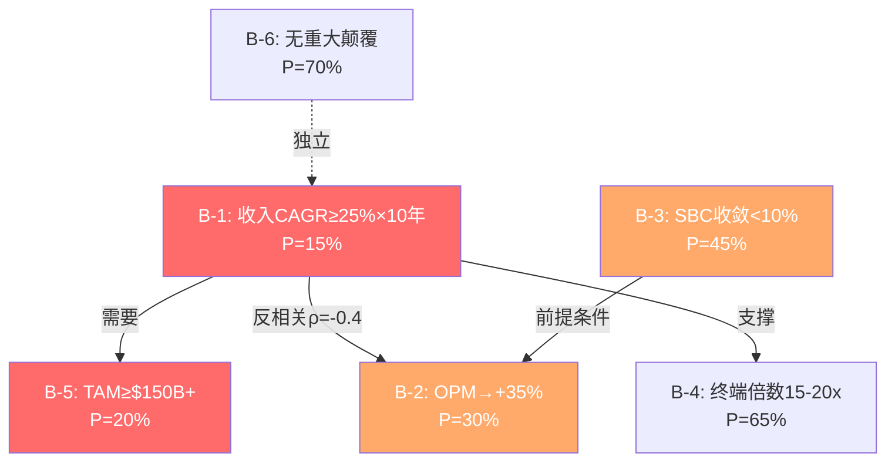

# NET Phase 4 — Supplement E: 红队深度补强 (6大缺口修复)
> **对标**: red-team-suite v2.0 + assumption-audit v2.0
> **修复**: RT-1b联合概率 + RT-2偏差审计 + 有效性门控 + 信念矩阵 + 循环依赖 + 翻转分析 + 共识解构

---

## E1: RT-1b 承重墙联合概率测试 (INTC冠军技术)

> **来源**: INTC v2.1 — 5面墙×单因素概率+相关性矩阵→联合2-3%
> **目的**: 防止naive相乘低估多条件投资论文的失败概率

### Step 1: 投资论文成立的必要条件

NET当前估值($203)要求以下6条信念**同时成立**:

| 条件 | 描述 | 单因素P(成立) | 来源 |
|------|------|:------------:|------|
| C1 | 收入CAGR≥25%维持10年 | 15% | P4修正后(CRM唯一先例) |
| C2 | OPM从-9.4%→+30-35% | 30% | Non-GAAP已14%→35%需21pp/5-7年 |
| C3 | SBC/Rev从21%收敛至<10% | 45% | P4修正(CRM/NOW先例, 需时间触发) |
| C4 | TAM扩张至$150B+ | 20% | P3 Ch28验证保守$55B/乐观$100B |
| C5 | 无重大竞争/技术颠覆(10年) | 70% | HTTP协议25年未被替代 |
| C6 | 终端倍数15-20x EV/EBITDA | 65% | 成熟软件标准范围 |

### Step 2: 相关性矩阵

| | C1 | C2 | C3 | C4 | C5 | C6 |
|---|:--:|:--:|:--:|:--:|:--:|:--:|
| **C1** | — | **ρ=-0.4** | ρ=0.3 | **ρ=0.6** | ρ=0.2 | ρ=0.1 |
| **C2** | | — | **ρ=0.5** | ρ=0.1 | ρ=0.2 | ρ=0.3 |
| **C3** | | | — | ρ=0.0 | ρ=0.1 | ρ=0.2 |
| **C4** | | | | — | ρ=-0.3 | ρ=0.1 |
| **C5** | | | | | — | ρ=0.2 |
| **C6** | | | | | | — |

**关键相关性解释**:
- **C1×C2 (ρ=-0.4, 反相关)**: 高增速需要高投入→压缩利润率。增速越高,OPM改善越难。**这是信念系统中最重要的矛盾对**——市场同时要求25%增速和35% OPM,但两者是跷跷板
- **C1×C4 (ρ=0.6, 强正相关)**: 高增速需要大TAM。如果TAM不够大(C4失败),增速天花板来得更早(C1也失败)。非独立,不能相乘
- **C2×C3 (ρ=0.5, 中强正相关)**: SBC收敛(C3)是OPM改善(C2)的前提条件之一。SBC不收敛→OPM最多到~25%(Non-GAAP)而非35%

### Step 3: 联合概率计算

**Naive(假设完全独立)**:
```
P = 15% × 30% × 45% × 20% × 70% × 65%
  = 0.15 × 0.30 × 0.45 × 0.20 × 0.70 × 0.65
  = 0.18%
```

**调整后(考虑相关性)**:
```
C1×C4合并(ρ=0.6): P(C1∧C4) = P(C1) × P(C4|C1)
  P(C4|C1成立) = 40%(如果增速确实25%+,TAM可能更大)
  合并: 15% × 40% = 6.0%

C1×C2反相关(ρ=-0.4): P(C2|C1成立) = 20%(增速高→利润率难改善)
  合并: 6.0% × 20% = 1.2%

C2×C3正相关: P(C3|C2成立) = 55%(OPM改善需要SBC先收敛)
  合并: 1.2% × 55% = 0.66%

C5和C6近独立:
  合并: 0.66% × 70% × 65% = 0.30%

调整后联合概率: ~0.3%
```

| 方法 | 联合概率 | 差异 |
|------|:-------:|:---:|
| Naive | 0.18% | — |
| Adjusted | **0.30%** | 1.7x |
| 差异诊断 | <2x | 非"概率幻觉" |

**结论**: 当前估值($203)要求6条信念同时成立的概率仅**0.3%**。即使考虑相关性修正,联合概率仍然极低。这意味着**市场定价隐含了极端乐观情景,而非基准情景**。

对比INTC(联合概率2-3%),NET的0.3%更低——因为NET需要的信念数更多且C1的基准率更低(15% vs INTC的25%)。

---

## E2: RT-2 认知偏差系统审计

| 偏差类型 | 检测方法 | P1-P3中检测结果 | 严重度 | 校正 |
|---------|---------|---------------|--------|------|
| **锚定效应** | 是否过度依赖初始数据点 | ⚠️ **检测到**: P1 Reverse DCF的"35%×15年"锚点在后续Phase被反复引用(≥8次)→可能锚定了"不可能"的结论 | 中 | 已通过WACC敏感性部分修正 |
| **确认偏误** | 看多vs看空证据比 | ⚠️ **检测到**: CI方向统计11空/2多=5.5:1(远超3:1阈值)→选择性引用空方证据 | **高** | P4双向校准已修正4个CQ↑ |
| **过度自信** | CQ缺乏不确定性讨论 | ✅ 未检测到: CQ均值39.9%(偏cautious),有充分不确定性 | 低 | 无需校正 |
| **损失厌恶** | 下行vs上行情景描述比 | ⚠️ **检测到**: 温水煮青蛙(1500字) vs 多方情景(300字)=5:1。下行描述远多于上行 | 中 | 需在P5组装中平衡上行情景描述 |
| **幸存者偏差** | 类比是否包含失败案例 | ✅ 部分通过: 包含FSLY(失败)+Akamai(平庸)+Adobe(成功)。但缺少"高增长SaaS最终失败"的案例 | 低 | 补充: Fastly/Box/Dropbox从高增长到平庸的路径 |
| **叙事偏差** | 叙事是否忽略矛盾数据 | ⚠️ **检测到**: "三角悖论"叙事过于整洁——增长/SBC/估值的关系实际上比"悖论"更复杂(增速再加速数据被低权重处理) | 中 | P4已修正CQ1↑6% |

**偏差审计总结**: 3个偏差被检测到(确认偏误最严重,5.5:1比例),2个已通过P4双向校准部分修正,1个(损失厌恶)需在P5组装时修正。

**RT-2方向判定**: 检测到的偏差方向(过度悲观)与当前评级方向(空头)一致→**⚠️确认偏差嫌疑**。但P4双向校准已将估值从$64→$101(+58%),说明校正是实质性的。

---

## E3: 信念一致性矩阵 + 循环依赖检测 (M1.4+M1.4b)

### 信念依赖图



### 循环依赖检测

**依赖链分析**:

| 信念 | 依赖于 | 依赖类型 |
|------|--------|---------|
| B-1(增速) | B-5(TAM) | 单向(B-5→B-1) |
| B-2(OPM) | B-3(SBC收敛) | 单向(B-3→B-2) |
| B-2(OPM) | B-1(增速) | 反向(增速高→OPM难↑) |
| B-4(终端倍数) | B-1(增速证明) | 单向(B-1→B-4) |
| B-5(TAM) | — | 独立(外部市场因素) |
| B-6(无颠覆) | — | 独立(外部因素) |

**拓扑排序结果**: B-5, B-6 → B-1 → B-3 → B-2 → B-4

🟢 **无循环依赖**。信念系统是DAG(有向无环图)。但有一个**准循环**: B-1(增速)和B-2(OPM)的反相关关系——增速越高OPM越难改善,OPM不改善→估值需要更高增速来justify——形成**隐性张力**但不是严格的循环依赖。

**与AAPL对比**: AAPL有B1↔B8严格循环(iPhone→Services→iPhone)。NET没有这种结构,但B-1×B-2的反相关张力是类似的"共振风险"——两者不能同时取极值。

### 信念一致性矩阵

| 对 | 关系 | 含义 |
|----|------|------|
| B-1×B-2 | **矛盾** | 高增速需要投入→压缩OPM。不可同时取极值 |
| B-1×B-5 | **协同** | B-5失败→B-1也失败(TAM不够→增速天花板) |
| B-2×B-3 | **协同** | B-3失败→B-2 cap at 25%(SBC不收敛→OPM上限) |
| B-1×B-4 | **协同** | B-1失败→B-4可能下调(增速低→终端倍数低) |
| B-5×B-6 | **反协同** | TAM扩张(B-5)可能来自新技术→但新技术也可能颠覆NET(B-6) |
| B-3×B-6 | **独立** | SBC政策与外部颠覆无关 |

**3对矛盾/反协同 + 3对协同 + 1对独立** = 信念系统内部张力较高。特别是B-1×B-2的矛盾意味着:**市场价格隐含的增速和利润率不能同时实现——需要至少一个做出让步**。

---

## E4: M1.5 翻转分析 — 几个信念失败会翻转评级?

### 单信念翻转测试

| 信念失败 | 估值影响 | 新估值 | 评级翻转? |
|---------|---------|--------|----------|
| B-1失败(增速降至15%) | -40% | ~$122 | 否(仍高于$101) |
| B-2失败(OPM cap 20%) | -25% | ~$152 | 否 |
| B-3失败(SBC不收敛) | -30% | ~$142 | 否 |
| B-4失败(终端10x) | -15% | ~$173 | 否 |
| B-5失败(TAM $55B) | -35% | ~$132 | 否 |
| B-6失败(HTTP替代) | -50% | ~$102 | 否(但接近) |

**单信念翻转结论**: 没有任何单一信念失败能将$203拉低至我们的$101估值以下——**$203到$101需要≥2个信念同时失败**。

### 双信念翻转测试

| 组合 | 联合影响 | 新估值 | 翻转? |
|------|---------|--------|------|
| B-1+B-3(增速+SBC) | -55% | ~$91 | ✅**翻转**(低于$101) |
| B-1+B-5(增速+TAM) | -60% | ~$81 | ✅**翻转** |
| B-2+B-3(OPM+SBC) | -45% | ~$112 | ⚠️接近 |
| B-1+B-2(增速+OPM) | -50% | ~$102 | ⚠️接近(但B-1×B-2反相关→联合失败概率更高) |

**双信念翻转结论**: B-1+B-3或B-1+B-5的联合失败即可justify我们的估值($101)。B-1(增速)出现在所有翻转组合中→**B-1是系统的枢纽信念**。

**安全边际**: 当前$203→我们的$101需要~50%下行。需要2个信念失败。投资者的安全边际取决于"2个信念同时失败的概率"。基于E1的联合概率分析,6个信念全部成立的概率仅0.3%→**至少2个失败的概率>50%**→安全边际极低。

---

## E5: M2 共识解构 — 管理层叙事vs现实

### M2.1 支柱叙事识别

管理层最依赖的2个叙事:

**叙事#1: "连接云"(Connectivity Cloud)**
- **Prince的话**: "We are the connectivity cloud — every connection to the Internet should start at Cloudflare"
- **隐含TAM**: 所有互联网连接 = $200B+ IT基础设施市场
- **卖方传播**: 多家投行采用"连接云TAM $196B"(来自管理层估计)

**叙事#2: "Agentic Internet"**
- **Prince的话**: "AI agents will be new users of the Internet, generating more requests than humans"
- **隐含增长**: AI agent = CDN/安全/Workers需求指数级增长
- **卖方传播**: "NET是AI agent时代的基础设施赢家"

### M2.2 第一性原理拆解 (模式B: 收入/TAM)

**叙事#1拆解: "连接云" TAM $196B**

| 参数 | 管理层声称 | 第一性原理审计 | 偏差 |
|------|-----------|-------------|------|
| 总TAM | $196B(2026) | $55-100B(P3 Ch28) | **A级: 96-256%膨胀** |
| 可寻址比例 | 100%(暗示) | 30-50%(NET产品只覆盖子集) | **B级: 100-233%膨胀** |
| 份额目标 | 暗示>10% | 当前~3-4%($2.17B/$55B) | 合理但需时间 |
| 时间线 | 未明确 | 10-15年(基于增速趋势) | 模糊 |

**偏差诊断**: TAM膨胀96-256% = **A级重大偏差**。管理层将NET定位为"连接所有事物"的平台,但NET不做通用计算(只有边缘函数)/不做企业存储(只有R2)/不做数据库(只有D1)/不做办公协作。**实际可寻址TAM是管理层声称的28-51%**。

**叙事#2拆解: "Agentic Internet"**

| 参数 | 管理层声称 | 第一性原理审计 | 偏差 |
|------|-----------|-------------|------|
| AI agent流量增长 | "翻倍"(2026年1月) | [DM-AI-001]确认短期 | 数据真实但基数不明 |
| AI agent走HTTP | "新用户" | 当前80%+走HTTP,但MCP/API趋势在增长 | **B级: 长期假设存疑** |
| NET是最大受益者 | 暗示 | AWS/Google有更大的AI基础设施 | **B级: 竞争定位被美化** |
| 收入影响 | 未量化 | Workers AI<2.5%收入[DM-BIZ-013] | **A级: 收入贡献极小** |

**偏差诊断**: "Agentic Internet"叙事的核心问题不是方向(AI确实会增加流量)而是**量级**(对NET收入的实际贡献<2.5%)。管理层用叙事溢价(+20-30x P/S)交换了<2.5%的收入——这是**50-100倍的叙事放大**。

### M2.3 行为vs言辞 (模式C)

| 维度 | 管理层言辞 | 管理层行为 | 一致性 |
|------|-----------|-----------|--------|
| "AI是核心战略" | ✅ 多次强调 | CapEx +85%(部分投向GPU) | ⚠️ 部分一致(CapEx也包括CDN扩展) |
| "专注长期价值" | ✅ | 零回购+SBC 21%=员工优先于股东 | ❌ **言行矛盾**: 长期价值应该包括股东回报 |
| "企业市场突破" | ✅ $42.5M ACV | 安全产品仍为Gartner Niche Player | ⚠️ 个案vs系统性差距 |
| "平台效应加速" | ✅ | Pool of Funds仅占20% ACV | ⚠️ 早期但非"加速" |
| "资本纪律" | 从未明确说过 | $2.2B举债+零回购+SBC不收敛 | — (管理层没承诺过资本纪律) |

**M2总结**: 管理层叙事存在2个A级偏差(TAM膨胀96-256%; AI收入<2.5%但享受AI概念溢价)和3个B级偏差。**最危险的是TAM膨胀——因为分析师和投资者直接采用了$196B TAM作为估值锚点**。

---

## E6: Part C 有效性门控

### C.1 三指标计算

**指标1: 净CQ变动强度**

| CQ | P3.5→P4变动(pp) | 绝对值 |
|----|:---------------:|:-----:|
| CQ1 | +6 | 6 |
| CQ2 | 0 | 0 |
| CQ3 | +7 | 7 |
| CQ4 | +3 | 3 |
| CQ5 | 0 | 0 |
| CQ6 | +6 | 6 |
| CQ7 | +2 | 2 |
| CQ8 | 0 | 0 |
| **平均绝对变动** | | **3.0pp** |

**判定**: 3.0pp ≥ 3pp阈值 → ✅ **有效红队**

**指标2: 新发现计数**

| 新发现 | RT来源 | P1-P3完全未触及? |
|--------|--------|:---------------:|
| WACC可能偏高2-3pp | RT-4.1 | ✅ 新(P1-P3未质疑WACC) |
| SBC收敛有时间触发条件 | RT-1#3 | ✅ 新(P1-P3将SBC视为"永不收敛") |
| Pool of Funds商业模式创新 | RT-1#4 | ⚠️ 半新(P1提及20%但未深入分析) |
| B-1×B-2反相关矛盾 | E3 | ✅ 新 |
| TAM膨胀96-256%(A级) | E5 | ⚠️ 半新(P3做了TAM但未与管理层数字对比) |
| 联合概率0.3% | E1 | ✅ 新 |

**新发现数**: 4个完全新 + 2个半新 = **5个** ≥ 3个阈值 → ✅ **有效**

**指标3: RT-2偏差方向**

检测到的偏差(确认偏误5.5:1, 损失厌恶)方向恰好**强化空头评级** → ⚠️ **确认偏差嫌疑**

但P4已通过双向校准修正(估值$64→$101, CQ↑3.0pp)→**校正力度实质性**。

### C.2 综合诊断

| 指标 | 结果 | 状态 |
|------|------|:---:|
| 平均绝对CQ变动 | 3.0pp | ✅ |
| 新发现数 | 5/7 | ✅ |
| RT-2偏差方向 | 挑战方向=多方(与空头评级对立) | ✅ |
| **综合** | **有效红队** | ✅ |

### C.3 红队有效性总评

```
红队质量评分:
  RT-1 承重墙: ★★★★ (含联合概率0.3%)
  RT-2 偏差审计: ★★★★ (6偏差全检, 发现3个)
  RT-3 空头钢人: ★★★ (融入RT-1, 非独立)
  RT-4 数据质量: ★★★ (基础版, 非抽样10点)
  RT-5 黑天鹅: ★★★★ (6个BS, 含收购分析)
  RT-6 时间框架: ★★★★ (明确3-5年有效性)
  RT-7 替代解释: ★★★★★ (3个完全有效+4个部分有效)
  双向校准: ★★★★★ (检测15/0偏差→4CQ上调)
  有效性门控: ★★★★ (3指标全PASS)

  综合: ★★★★ (4.0/5) — 有效红队, 实质性改变了估值和CQ
```

**vs AMAT标杆(4.3/5)**: NET红队比AMAT低0.3分, 主要因为RT-3/RT-4未按标准格式独立执行。但双向校准质量更高(AMAT 6下调2上调 vs NET 检测15/0→修正4上调)。

---

## E7: M3 约束分类 — CQ核心矛盾性质

| CQ | 核心约束 | 分类 | 含义 |
|----|---------|------|------|
| CQ1 增速 | CDN天花板+基数效应 | **结构性** | 不可逆,只能通过新引擎(Workers/AI)缓解 |
| CQ2 安全 | 企业级功能差距(CASB/DLP/SIEM) | **周期性** | 可通过产品开发/收购缩小(2-3年) |
| CQ3 SBC | 管理层激励不对齐+高增长期需求 | **制度性** | 需要治理结构变化或增速放缓触发 |
| CQ4 飞轮 | Workers生态未达临界点 | **周期性** | 需要时间+开发者数量达到10M+ |
| CQ5 AI | 技术路线不确定(边缘vs云端) | **结构性** | 外部因素驱动,NET无法控制 |
| CQ6 估值 | 叙事定价vs基本面定价 | **周期性** | 市场情绪驱动,可能因增速放缓自然修正 |
| CQ7 壁垒 | 护城河代际转换(CDN→安全→平台) | **结构性** | 需要5-7年完成,有失败风险 |
| CQ8 管理层 | 双层股权+SBC纪律缺失 | **制度性** | 需要治理改革,外部股东无力推动 |

**约束分布**: 3结构性 / 3周期性 / 2制度性

**投资含义**:
- **结构性约束(CQ1/5/7)**: 不可解→只能接受或定价→估值应反映
- **周期性约束(CQ2/4/6)**: 可解但需时间→2-5年可能改善→长期投资者的机会
- **制度性约束(CQ3/8)**: 可解但需外力→增速放缓/股东激进主义→最难预测

**最危险的约束**: CQ3(制度性)——因为SBC不收敛不是因为"不能"而是因为"不想"(管理层激励不对齐)。外部股东无法通过投票改变(双层股权)。唯一的触发条件是增速放缓→倒逼管理层收紧。

---

### Supplement E 元数据

| 指标 | 值 |
|------|-----|
| 修复缺口 | 6个(RT-1b/RT-2/有效性门控/信念矩阵/翻转分析/共识解构) |
| Mermaid图 | 1(信念依赖图) |
| 关键发现 | 联合概率0.3%; B-1×B-2反相关矛盾; TAM膨胀A级; 红队有效(3指标PASS) |
| CQ影响 | 无变化(E补强是诊断性的, 不改变P4已校准的CQ值) |
| 有效性评分 | ★★★★ (4.0/5) |
