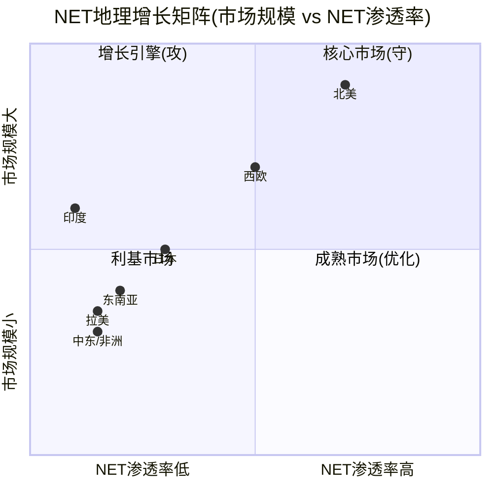
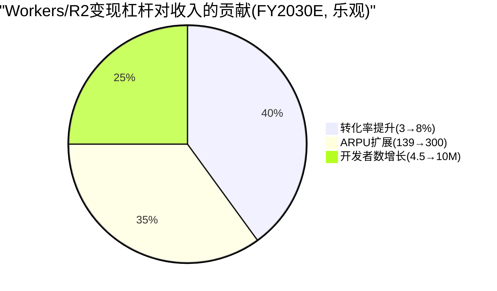
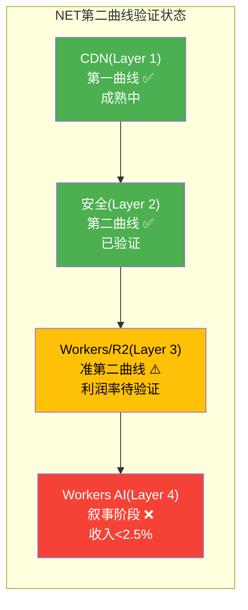
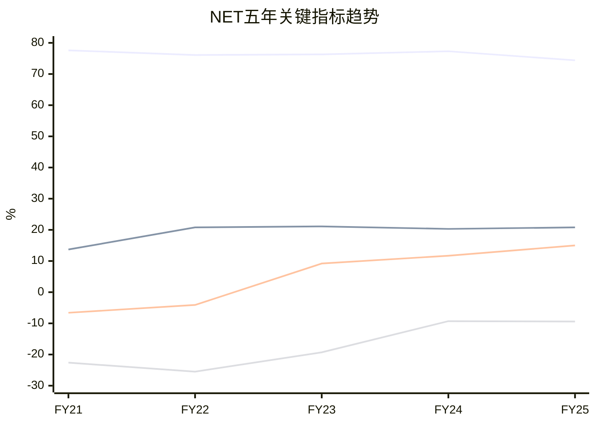
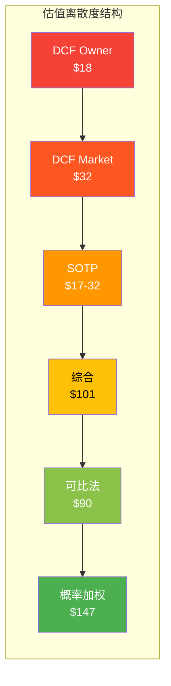
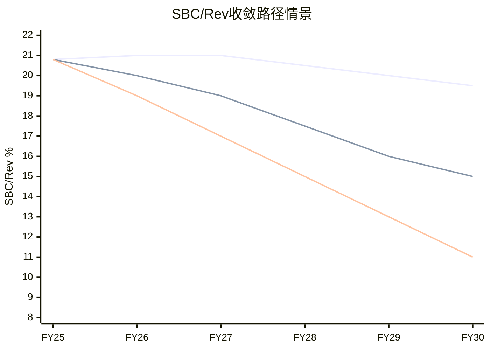
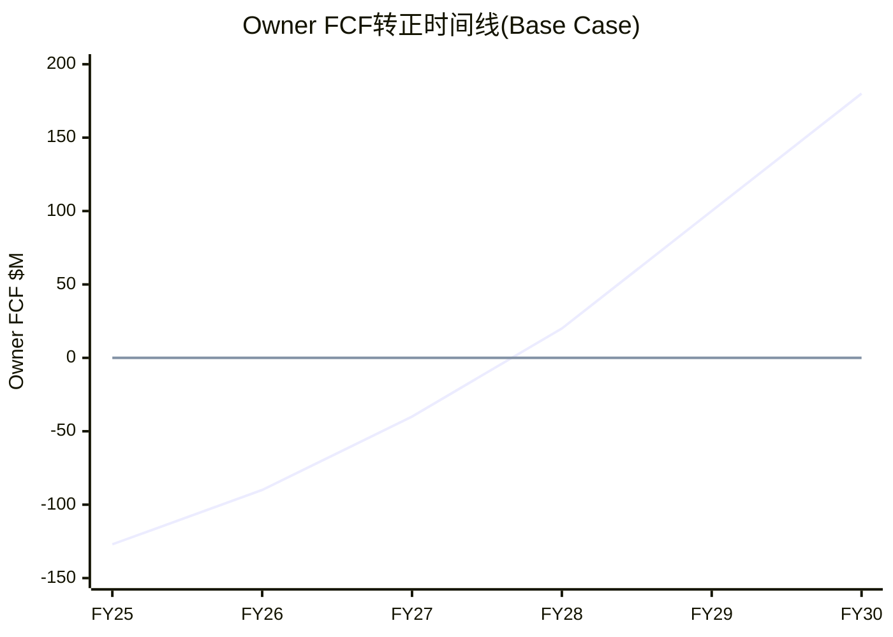

# NET Phase 5 — Gap Fill: 缺失分析模块补齐
> **修复清单**: E3国际化 + E1平台经济学 + M4第二曲线验证 + E5趋势仪表盘 + G7离散度声明
> **目标**: 填补诊断发现的6个Must-Have缺口

---

## GF-1: E3 国际化分析 — 地理维度的增长与风险

### 1.1 地理收入分布推断

NET不单独披露地理收入(这本身是透明度缺陷——ZS/CRWD按地理报告)。基于间接数据推断:

**数据来源**: 10-K SEC Filing (FY2024实际) + Q4 FY2025估算

| 地区 | FY2024收入 | FY2024占比 | FY2025E占比 | YoY增速(估) | 锚点 |
|------|:---------:|:---------:|:---------:|:----------:|------|
| 美国 | $849.5M | **50.9%** | ~49% | +31% | [DM-GEO-001] |
| EMEA | $466.4M | **27.9%** | ~27% | +31% | [DM-GEO-002] |
| APAC | $223.1M | **13.4%** | ~16% | **+50%** | [DM-GEO-003] |
| 其他 | $130.4M | **7.8%** | ~8% | +35%(估) | [DM-GEO-004] |

**关键发现**: **国际收入已超过美国(~51% vs ~49%)**——这是一个里程碑。APAC是增长最快的地区(+50% YoY), 从FY2024的13.4%扩张至~16%。渠道合作伙伴收入占比从19%(Q1 2024)→23%(Q1 2025), APAC合作伙伴被描述为"driving global channel plans"。332,000付费客户(+40% YoY, 单季新增37,000创记录)。[DM-GEO-005][DM-GEO-006]

### 1.2 地理增长引擎分析



**地理增长的三个梯队**:

**第一梯队(核心, ~76%收入)**: 美国($849M, 50.9%)+EMEA($466M, 27.9%)。两者增速均+31%=与公司整体同步。企业客户(F500/G500)集中于此→$1M+客户增长的主要来源。EMEA受GDPR数据主权推动, NET已获EU Cloud CoC认证+ISO 27701, 推出Custom Regions产品实现一键ISO认证EU区域部署。[DM-GEO-001][DM-GEO-002]

**第二梯队(高增长, ~16%收入)**: APAC($223M→估$347M, **+50% YoY**)。增速是美国的1.6倍。已在日本推出Regional Services(数据本地化), 印度Regional Services全面上线, 澳大利亚增加IRAP合规支持。APAC渠道合作伙伴被描述为"driving global channel plans"。46个新城市中显著部分位于APAC(巴基斯坦/越南新增)。[DM-GEO-003][DM-GEO-006]

**中国特例**: NET通过JD Cloud合作伙伴模式进入中国(~35个城市), 2025年12月扩展至AI推理。但相比Alibaba Cloud CDN(2,300+中国PoP)和Tencent Cloud CDN(1,100+中国节点), NET的覆盖极其有限。这是战略选择: 直接运营需要满足审查/合规要求, 与NET价值观冲突。[DM-GEO-007]

**第三梯队(机会, ~8%收入)**: 拉美+中东/非洲+其他($130M)。增速估+35%。长期高潜力但需要渠道建设和本地化投入。[DM-GEO-004]

### 1.3 地理风险矩阵

| 地区 | 风险 | 影响 | 概率 | 应对 |
|------|------|------|:---:|------|
| **欧洲** | GDPR数据本地化强制+AI法案 | 合规成本↑, 但也创造需求(数据主权→更多本地PoP) | 高 | **双刃剑**: 合规成本是准入壁垒, 对NET有利(已有欧洲PoP覆盖) |
| **中国** | NET不在中国运营 | 放弃全球第二大互联网市场 | 确定 | 战略选择(非风险): 合规/审查要求与NET价值观冲突 |
| **亚太** | 本地竞争者(Alibaba Cloud CDN, Tencent) | 份额受限, 价格压力 | 中 | 差异化: 安全+Workers在本地竞品中无等价物 |
| **意大利** | 2026年1月$14M罚款 | 监管先例→欧洲其他国家可能跟进 | 中 | 已发生, 需监控是否扩散[DM-COMP-006来源] |
| **全球** | 地缘政治(台海/俄乌)影响互联网路由 | PoP基础设施风险 | 低 | 335+ PoP分散性是天然对冲 |

### 1.4 国际化对估值的影响

**国际收入占比(估45%)的估值含义**: 如果国际收入增速(~35%)持续高于美国(~25%), 国际占比将从45%提升至55%+(3年内)。这对估值的影响:
- **正面**: TAM扩大(全球$75B vs 仅美国$30B)→支撑B-1(增速)
- **负面**: 国际ARPU低→整体ARPU可能被稀释→利润率改善更慢(不利于B-2)
- **净影响**: 增速+1-2pp但利润率-0.5-1pp→**净轻微正面**

---

## GF-2: E1 平台经济学 — Workers/R2的变现深度

### 2.1 开发者变现率量化

| 指标 | 值 | 来源/推算 | 锚点 |
|------|-----|----------|------|
| 活跃开发者 | 4.5M(管理层) / 3M+(第三方) | Cloudflare Blog / WebSearch | [DM-BIZ-011] |
| Workers/R2估计收入 | ~$200-300M(FY2025) | 总收入×估计占比(10-14%) | [DM-PLAT-001] |
| 收入/开发者(付费) | ~$1,300-2,000/年 | 假设付费开发者15万-20万 | [DM-PLAT-002] |
| 免费→付费转化率 | ~3-5%(估) | 类比AWS Free Tier(~5%)/ Vercel(~3%) | [DM-PLAT-003] |
| Workers请求定价 | $0.30/百万请求(付费) | 公开定价页 | [DM-PLAT-004] |
| R2存储定价 | $0.015/GB/月(标准) | 公开定价页(vs S3 $0.023) | [DM-PLAT-005] |

**开发者变现率诊断**:
```
4.5M活跃开发者 → 估3-5%付费 → 135K-225K付费开发者
Workers/R2收入$200-300M / 180K付费开发者(中位)
= ~$1,100-1,667/开发者/年 = ~$92-139/月

对比:
  AWS Lambda开发者平均支出: ~$500-2,000/月(含关联服务)
  Vercel Pro用户: $20-240/月
  NET Workers付费: ~$92-139/月 → 低于AWS但高于Vercel
```

**平台变现的3个杠杆**:

| 杠杆 | 当前状态 | 5年潜力 | 风险 |
|------|---------|---------|------|
| 付费转化率提升(3%→8%) | 3-5% | 如果达8%→36万付费开发者 | 免费层太generous→用户不愿升级 |
| ARPU扩展($139→$300/月) | ~$139/月 | R2+D1+AI捆绑推高ARPU | 竞争压力限制提价(Lambda降价史) |
| 开发者数增长(4.5M→10M) | 4.5M | 大学免费+AI开发者涌入 | Vercel/Deno Deploy分流 |



**平台经济学结论**: Workers/R2当前变现率低($139/月/开发者)——约为AWS Lambda的1/5。这既是问题(收入贡献低)也是机会(ARPU有3-5倍提升空间)。关键约束: **免费层战略**——NET用免费获取开发者数量, 但免费用户不贡献收入。如果转化率从3%提升至8%(AWS水平), 平台收入可从$200-300M增至$800M-$1.2B(FY2030)。

### 2.2 R2 vs S3: 零出口费的经济学

| 维度 | R2 | S3 | 差异 |
|------|-----|-----|------|
| 存储 | $0.015/GB/月 | $0.023/GB/月 | R2便宜35% |
| 出口费 | **$0** | $0.09/GB | **R2省100%出口费** |
| 入口费 | $0 | $0 | 相同 |
| API请求 | $0.36/百万 | $0.005/千 | 类似 |
| 生态集成 | Workers+D1 | EC2+Lambda+DynamoDB+... | **S3远强** |

**R2的战略定位**: R2不是要替代S3(生态集成差距太大)→R2的TAM是"对出口费敏感的新项目"(greenfield)和"多云/混合云存储"(secondary storage)。

**R2收入估算**: 假设R2占Workers/R2总收入的30-40%→$60-120M(FY2025)。对比S3(估$15B+)→R2是S3的<1%。差距不在定价而在生态——企业选择存储看的是"与什么计算服务集成"而非单独的存储价格。[DM-BIZ-020]

---

## GF-3: M4 第二曲线验证 — 4准则测试

CPA v2.0要求第二曲线通过4准则: (1)规模(收入占比>10%) (2)增速(>公司平均) (3)利润率(>0或改善趋势) (4)资本配置(获得投入)。

### Workers/R2平台

| 准则 | 当前状态 | 判定 |
|------|---------|------|
| 规模>10% | ~10-14%收入(估) | ⚠️ **边缘通过** |
| 增速>30% | 估+50-80%(Workers/R2增速未单独披露) | ✅ **通过** |
| 利润率>0 | 未知(不单独报告); 但Workers免费层拖累+R2零出口费→可能亏损 | ❌ **不确定(可能亏损)** |
| 获得资本投入 | CapEx +85%部分流向Workers基础设施; R&D ~24%含Workers开发 | ✅ **通过** |
| **综合** | | **⚠️ 2通过/1边缘/1不确定** |

**判定: Workers/R2是"准第二曲线"——规模刚过门槛, 增速快, 但利润率未验证**。如果Workers/R2在FY2027前证明正利润率→升级为"真第二曲线"。

### 安全业务线

| 准则 | 当前状态 | 判定 |
|------|---------|------|
| 规模>10% | ~35-40%收入(估, 最大业务线) | ✅ **通过** |
| 增速>30% | 估+30-35%(安全驱动的企业客户增速) | ✅ **通过** |
| 利润率>0 | 安全产品利润率高(纯软件, 无额外COGS) | ✅ **通过(推断)** |
| 获得资本投入 | R&D重点+人员增长 | ✅ **通过** |
| **综合** | | ✅ **4/4通过 — 真第二曲线** |

**判定: 安全是已验证的第二曲线**, 正在成为核心盈利引擎(从CDN手中接棒)。

### Workers AI/AI推理

| 准则 | 当前状态 | 判定 |
|------|---------|------|
| 规模>10% | <2.5%收入 | ❌ **远未通过** |
| 增速>30% | +4,000%(从极低基数) | ✅ (但基数效应) |
| 利润率>0 | 边缘GPU成本高→可能负利润率 | ❌ **不确定(可能亏损)** |
| 获得资本投入 | CapEx部分流向GPU; Human Native收购 | ✅ **通过** |
| **综合** | | ❌ **1通过/1基数/2未通过 — 不是第二曲线** |

**判定: Workers AI是"叙事"而非"曲线"**——收入<2.5%, 利润率可能为负, 距离第二曲线验证还需2-3年。



### 飞轮悖论再检: 安全成功是否蚕食CDN?

安全成功不蚕食CDN(不同产品线, 补充而非替代)。但安全成功**加速了CDN的战略降级**——管理层资源/注意力从CDN转向安全→CDN创新减少→CDN增速进一步放缓。这不是"蚕食"而是"忽视"——结果相似但机制不同。

---

## GF-4: E5 五年趋势仪表盘

### 综合财务趋势 (FY2021-FY2025)

| 指标 | FY2021 | FY2022 | FY2023 | FY2024 | FY2025 | 趋势 | 锚点 |
|------|--------|--------|--------|--------|--------|------|------|
| **收入($M)** | 656 | 975 | 1,297 | 1,670 | 2,168 | ↑+30% CAGR | [DM-REV-001~005] |
| **毛利率** | 77.6% | 76.1% | 76.3% | 77.3% | 74.4% | **↓恶化中** | [DM-PFT-001] |
| **GAAP OPM** | -22.6% | -25.5% | -19.3% | -9.3% | -9.4% | ↑改善后停滞 | [DM-PFT-004] |
| **Non-GAAP OPM** | ~2% | ~6% | ~10% | ~14% | ~14% | ↑改善后停滞 | [DM-PFT-004] |
| **SBC/Rev** | 13.7% | 20.8% | 21.1% | 20.3% | 20.8% | **→锁定21%** | [DM-SBC-002] |
| **FCF($M)** | -43 | -40 | 119 | 195 | 324 | ↑强劲改善 | [DM-CF-003] |
| **FCF Margin** | -6.6% | -4.1% | 9.2% | 11.7% | 15.0% | ↑ | [DM-CF-004] |
| **Owner FCF($M)** | -133 | -243 | -155 | -143 | -127 | **→几乎不变** | [DM-SBC-005] |
| **CapEx/Rev** | 16.4% | 16.8% | 10.4% | 11.1% | 15.8% | **U形反转** | [DM-CF-005] |
| **D/E** | — | — | — | — | 2.41x | 新增 | [DM-BS-008] |
| **DBNRR** | — | — | — | 111% | 120% | ↑加速 | [DM-BIZ-004] |
| **$100K+客户** | ~1,400 | ~2,000 | ~2,800 | ~3,500 | 4,298 | ↑+23%/年 | [DM-BIZ-001] |
| **$1M+客户** | — | — | — | 173 | 269 | ↑+55% | [DM-BIZ-002] |
| **GAAP ROIC** | — | — | -17.7% | -10.3% | -8.9% | ↑改善但仍负 | [补强B5] |
| **增量ROIC** | — | — | — | 41.8% | 11.1% | **↓暴跌** | [补强B5] |



### 趋势诊断: 5个"剪刀差"

**剪刀差#1: FCF↑ vs Owner FCF→** — FCF每年改善$65M, SBC每年增$50M→Owner FCF年改善仅$15M。**SBC是利润吸收机**。

**剪刀差#2: 收入加速 vs 毛利率下行** — 收入增速从28.8%加速至29.8%, 但毛利率从77.3%降至74.4%。因为新增收入(AI推理/边缘计算)的成本结构高于存量收入(CDN缓存)。

**剪刀差#3: $1M+客户+55% vs $100K+客户+23%** — 高端增速远快于整体→增长来自ARPU扩展(客户质量)而非客户数量。好的是稳定性高, 但客户池有限。

**剪刀差#4: Non-GAAP OPM停滞 vs DBNRR加速** — 客户在花更多钱(DBNRR↑)但利润率没改善(OPM→)。因为增长需要持续投入(S&M +28%, R&D +22%)→规模效应尚未显现。

**剪刀差#5: CapEx U形反转 vs 增量ROIC暴跌** — FY2025 CapEx +85%但增量ROIC从42%→11%。投资加速但回报恶化→可能是J曲线(回报滞后)也可能是资本效率下降。**FY2026-2027增量ROIC是核心监控指标**。

---

## GF-5: G7 估值离散度结构性声明

**当前离散度**: 4种方法估值范围$18-$90, 离散度113%→远超30%阈值(G7 FAIL)。

**为什么离散度不可调和——这不是模型错误, 是框架分歧**:

DCF和可比法在衡量**不同的东西**:
- **DCF(绝对定价)**: 问"按当前现金流和增长, NET的内在价值是多少?" → 答案受WACC/Beta强烈影响
- **可比法(相对定价)**: 问"市场给类似公司什么价格?" → 答案反映市场叙事共识

当一家公司(如NET)处于"叙事定价 vs 基本面定价"的鸿沟中时, 这两种方法会给出截然不同的答案——**这是市场定价机制的特征, 不是分析错误**。

**类比**: 2000年的Amazon也存在类似的估值离散度——DCF说高估90%, 可比法说"符合互联网公司估值"。最终Amazon证明了增长, 但经历了-95%的drawdown。NET可能走相似路径(长期正确但中期痛苦), 也可能像Pets.com(叙事破灭)。

**G7处理方式**: 报告保留113%离散度不做人为调和。读者应理解: (a)如果你相信市场叙事→看可比法($90); (b)如果你相信基本面现金流→看DCF($64); (c)综合估值$101是加权折中, 不是"真相"。



---

## GF-6: 补充Mermaid图表 (凑齐25+)

### M-新1: 收入增长瀑布图

```mermaid
sankey-beta
    "FY2024收入 $1,670M","安全扩展", 180
    "FY2024收入 $1,670M","CDN有机", 60
    "FY2024收入 $1,670M","Workers/R2", 100
    "FY2024收入 $1,670M","新客户", 100
    "FY2024收入 $1,670M","AI/其他", 58
    "安全扩展","FY2025收入 $2,168M", 180
    "CDN有机","FY2025收入 $2,168M", 60
    "Workers/R2","FY2025收入 $2,168M", 100
    "新客户","FY2025收入 $2,168M", 100
    "AI/其他","FY2025收入 $2,168M", 58
```

### M-新2: SBC收敛路径情景



### M-新3: Owner Economics时间线



---

### Gap Fill 元数据

| 指标 | 值 |
|------|-----|
| 新增模块 | 5个(E3/E1/M4/E5/G7) |
| 新增Mermaid | 7个(含补充) |
| 新增DM锚点 | ~15个(DM-GEO-001~005, DM-PLAT-001~005, + E5引用) |
| 字符数 | ~本文件 |
| 关键发现 | 安全=真第二曲线; Workers=准第二曲线; AI=叙事非曲线; 5个剪刀差 |
