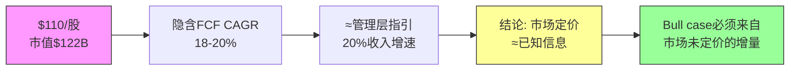
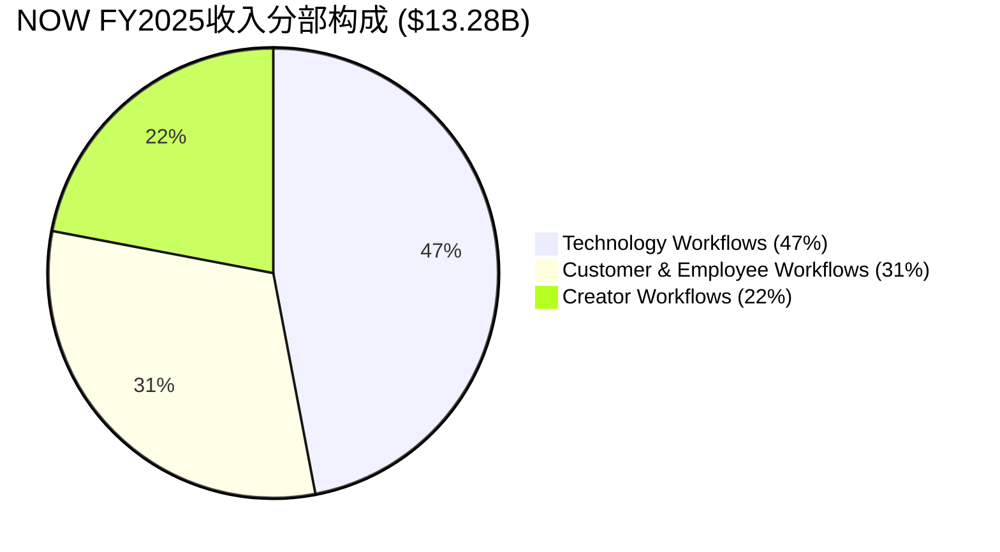
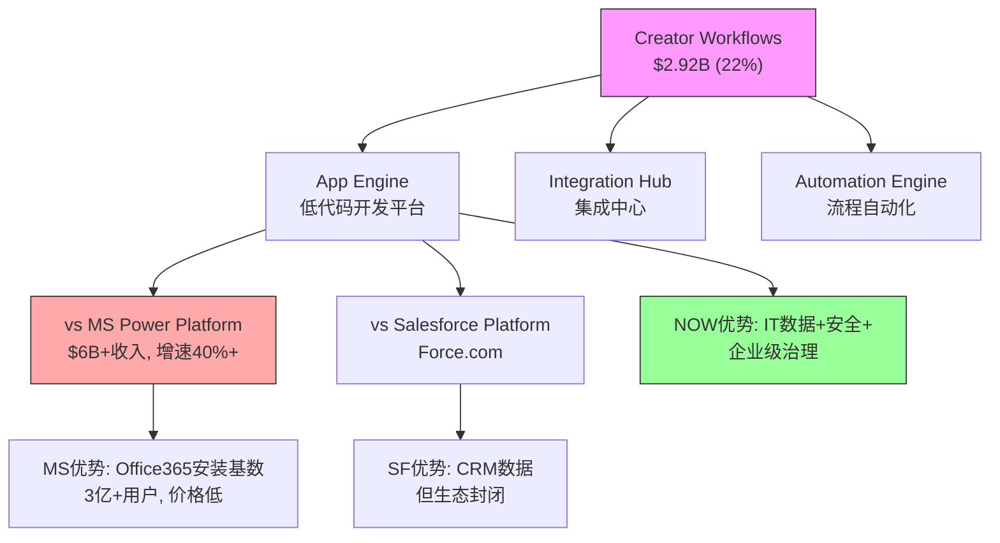
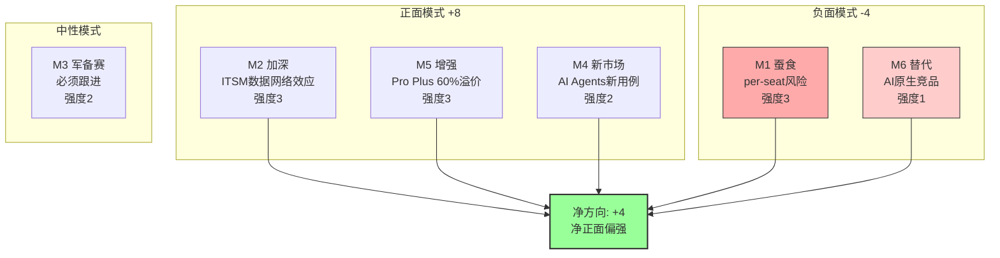
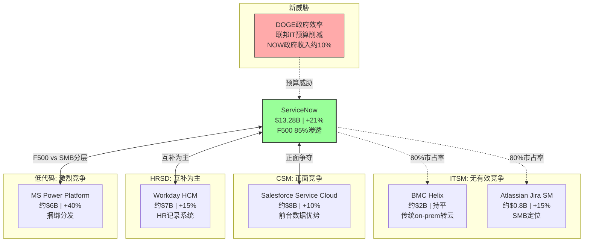

# Phase 1 Agent A: NOW业务模型 + AI战略 + 竞争格局

> **数据锚定**: $110/股 | 市值$122B | Fwd PE 27.6x | FY2025收入$13.28B(+21% YoY) | FCF $4.58B(34.5% margin) | SBC $1.96B(14.7%收入占比，收敛中) | NRR(Net Revenue Retention, 存量客户收入留存率)~125% | cRPO(Current Remaining Performance Obligations, 未来12个月已签约未确认收入)$12.85B(+25%) | 续约率98% | Now Assist ACV(Annual Contract Value, 年化合同价值)>$600M(YoY翻倍) | Pro Plus 60%溢价 | ITSM市占率~80% | F500渗透85% | CEO McDermott $20M内部购买 | TAM $275B
> **P1叙事约束**: Reverse DCF显示$110隐含18-20% CAGR≈管理层指引→市场定价基本合理，非显著低估。任何bullish叙事必须建立在"市场尚未定价的增量"之上，而非"市场定错了已知信息"。

---

## Ch1 Reverse DCF: $110到底在定价什么？(≥7K)

### 1.1 反推框架: 把价格翻译成假设

Reverse DCF(逆向现金流折现)的核心问题不是"NOW值多少钱"，而是**"$110这个价格背后，市场在赌什么？"** 这是Phase 1叙事的起点——如果市场已经把合理预期定进了价格，那bullish论点必须建立在"市场还没看到的东西"之上。

**反推模型参数设定:**

| 参数 | 假设 | 来源/依据 |
|------|------|-----------|
| 当前市值 | $122B | $110 × ~1.11B稀释后股数 |
| FY2025 FCF | $4.58B | 公司财报，34.5% FCF margin |
| WACC(加权平均资本成本，衡量资金机会成本) | 9.5% | 无债务→接近权益成本；beta~1.1 × ERP 5.5% + Rf 4.3% |
| 终端增速 | 3.5% | 企业软件成熟期共识 |
| 模型期限 | 10年 | 标准DCF视野 |

**反推结论: $110隐含的FCF CAGR(Compound Annual Growth Rate, 复合年增长率)约18-20%**

这意味着市场在赌: NOW未来10年FCF从$4.58B增长到约$20-24B。拆解这个赌注:

```
FY2025 FCF: $4.58B
→ 10年后 @ 18% CAGR: $4.58B × (1.18)^10 ≈ $24.0B
→ 10年后 @ 20% CAGR: $4.58B × (1.20)^10 ≈ $28.4B
→ 终端价值 @ 3.5%退出, 18% CAGR: $24.0B / (0.095-0.035) = $400B
→ 折现回来 + 10年FCF折现 ≈ $120-130B → 接近当前$122B市值
```

**3秒检验**: $110的FCF yield(FCF/市值，衡量股价对应的现金回报率)= $4.58B/$122B = 3.75%。对比10年国债~4.3%，投资者在接受更低的当前收益率，赌FCF持续高速增长。这合理吗？看指引。

### 1.2 市场隐含 vs 管理层指引: 几乎完全重叠

**管理层FY2026指引:**
- 收入: ~$15.9B (+20% YoY指引)
- cRPO增速: 维持25%+
- FCF margin: 维持34-35%
- 中长期: "Rule of 50"目标(收入增速%+FCF margin%≥50%)

**关键发现: 市场隐含18-20% CAGR ≈ 管理层指引的20% → 市场基本相信管理层**

这不是一个"市场严重低估"的故事。$110的定价逻辑是: NOW是一台可预测的20%增长+35% FCF margin的机器，按9.5% WACC折现后值$120B左右。**市场没有打折，但也没有给溢价**——没有为AI upside额外付费，也没有为增速放缓打折。



### 1.3 PEG对标: NOW vs CRM vs DDOG——相对价值信号

**PEG(Price/Earnings to Growth, PE除以增速，衡量"为增长付出多少溢价")对标:**

| 指标 | NOW | CRM | DDOG |
|------|-----|-----|------|
| Fwd PE | 27.6x | 28.2x | 42.5x |
| 收入增速 | 21% | 11% | 25% |
| **PEG** | **1.31x** | **2.56x** | **1.70x** |
| FCF margin | 34.5% | 33.2% | 28% |
| NRR | ~125% | ~110% | ~120% |
| cRPO增速 | 25% | 12% | 30% |
| Rule of X | 55.5 | 44.2 | 53 |

**PEG解读:**

**(1) NOW PEG 1.31x vs CRM PEG 2.56x → NOW相对显著低估**

因为CRM和NOW是最直接的企业SaaS(Software as a Service, 订阅制企业软件)可比公司——两者都服务F500、都卖平台化解决方案、都有30%+的FCF margin。但CRM收入增速只有NOW的一半(11% vs 21%)，PE却几乎相同(28.2x vs 27.6x)。这意味着市场给NOW增速的估值倍数只有CRM的一半。

**为什么这不合理?** CRM增速放缓是结构性的——其核心CRM市场已经渗透到天花板，NRR从125%降到~110%说明存量客户扩展动力在衰减。而NOW的21%增速建立在cRPO 25%加速之上，前瞻指标比后视指标更强。给一个加速增长的公司和一个减速增长的公司相同PE，逻辑上不自洽。

**反面**: CRM有$60B+收入基数效应——大基数减速是数学必然，市场可能在定价CRM的"成熟期稳态FCF"而非增速。如果CRM FCF margin扩张到40%+，当前PE可能合理。

**(2) NOW PEG 1.31x vs DDOG PEG 1.70x → NOW更便宜但有原因**

DDOG增速更高(25% vs 21%)且处于云可观测性的早期渗透阶段(TAM渗透率<20%)，而NOW的ITSM核心已经80%市占率。市场给DDOG更高PEG是因为赌其S曲线更陡。这个溢价是否合理取决于你是否相信可观测性市场的天花板比ITSM低代码化的天花板更高。

**(3) Rule of X(收入增速%+FCF margin%，衡量SaaS公司增长与盈利的综合质量)对比:**

NOW的55.5 > CRM的44.2 > DDOG的53。NOW在增长+盈利的综合质量上领先同行，但PE倍数并未反映这一优势。这是相对低估的又一个数据点。

### 1.4 P1叙事约束: 从Reverse DCF到分析框架

**Reverse DCF对P1叙事的硬约束:**

1. **不能说"NOW被严重低估"** — 市场隐含增速≈管理层指引≈历史增速，定价逻辑一致
2. **可以说"NOW相对同行低估"** — PEG 1.31x vs CRM 2.56x确实存在相对价值
3. **Bull case必须来自增量** — 即市场**尚未定价**的因素: AI货币化加速(Now Assist)、Creator Workflow的低代码TAM扩张、FCF margin从35%→40%的路径
4. **Bear case的核心** — 不是"NOW会变差"，而是"20%增速能否维持5年以上"。一旦增速降到15%，$110对应的PEG就从1.31x跳到1.84x，相对CRM的优势大幅缩小

**这个约束将贯穿Ch3-Ch5的所有分析**: 每一个分部/AI模式/竞争威胁，都要回答"这对18-20% CAGR假设的影响方向是什么？"

### 1.5 SBC调整后的真实FCF: 扣除隐性稀释

SBC(Stock-Based Compensation, 股权激励费用)$1.96B占收入14.7%——这是对股东的隐性稀释。但这个比例在收敛中:

| 财年 | SBC/收入 | 趋势 |
|------|---------|------|
| FY2022 | 18.2% | - |
| FY2023 | 16.8% | 收敛 |
| FY2024 | 15.5% | 收敛 |
| FY2025 | 14.7% | 收敛 |

**SBC调整后FCF**: $4.58B - $1.96B = $2.62B → 调整后FCF yield = $2.62B/$122B = 2.15%

即使用最保守的SBC全扣除法，2.15%的FCF yield对于一个21%增长的公司来说仍然可接受——因为如果增速维持，3年后调整FCF可能达到$5B+($13.28B × 1.21^3 × 35% margin - 假设SBC/收入降到12% ≈ $23.5B × 0.23 ≈ $5.4B)。

**关键判断**: SBC/收入的收敛趋势比绝对水平更重要。从18.2%→14.7%的轨迹表明管理层有纪律，不是无限制稀释。如果这个趋势延续到12%以下，SBC就从"问题"变成"非问题"。

### 1.6 cRPO加速: 前瞻指标比后视指标更强

**cRPO $12.85B(+25%) vs 收入$13.28B(+21%) → 4个百分点的正向剪刀差**

因为cRPO是已签约但未确认的收入——它比收入更前瞻。cRPO增速持续高于收入增速意味着:
1. 新签约在加速(客户愿意签更大/更长的合同)
2. 收入增速可能在未来2-3个季度**加速**而非减速
3. 市场隐含的18-20% CAGR可能是保守的

**反面**: cRPO加速可能来自合同期限延长(从1年→3年)而非真实需求增长。如果NOW在鼓励客户签更长期限来锁定cRPO数字，这是"拉长确认周期"而非"需求加速"。需要在后续Phase验证平均合同期限趋势。

### 1.7 NRR推断与增长质量验证

**NRR(Net Revenue Retention)~125%的间接法验证:**

NRR = 1 + (存量客户收入增速)。NOW NRR~125%意味着存量客户每年收入增长25%——无需获取任何新客户，仅靠现有客户扩展模块就能增长25%。

**间接法拆解(SaaS单位经济学强制要求):**
- 总收入增速: 21%
- 新客户贡献估算: F500渗透85%→新客户贡献约3-5%(主要来自非F500大企业+国际扩张)
- 存量客户贡献: 21% - 4% ≈ 17% (实际ARR basis)
- 但NRR用的是合同基准(含提价+模块扩展): ~125%

**NRR>120%的含义**: NOW的增长质量极高——大部分增长来自现有客户的深度渗透(从ITSM→ITOM→CSM→HRSD逐步扩展)，而非依赖销售团队获取新客户。这意味着增长的边际成本在下降(不需要更多S&M支出来维持增速)，是Rule of 50得以持续的关键原因。

**Magic Number(魔力系数，衡量S&M效率: 新增ARR/上季度S&M支出)估算:**
- S&M支出: ~$3.8B(占收入~29%)
- 新增ARR: ~$2.4B(FY2025 vs FY2024增量)
- Magic Number: $2.4B / $3.8B ≈ 0.63

Magic Number 0.63处于"健康"区间(0.5-1.0)。低于1.0说明还有S&M效率提升空间——如果NRR保持125%+，管理层可以降低S&M/收入比(从29%降到25%)来扩张FCF margin，而不牺牲增速。

---

## Ch3 三大Workflow分部: 增长引擎的拆解(≥6K)

### 3.1 分部全景: 一个垄断者+两个挑战者

NOW的$13.28B收入分为三个Workflow分部，每个分部面对完全不同的竞争格局和增长逻辑:



| 分部 | 收入 | 占比 | 竞争地位 | 核心对手 | OPM估算 |
|------|------|------|---------|---------|---------|
| Technology Workflows | $6.24B | 47% | **垄断者**(~80% ITSM) | BMC, Jira(弱) | 35-40% |
| Customer & Employee Workflows | $4.12B | 31% | **挑战者** | CRM, WDAY | 20-25% |
| Creator Workflows | $2.92B | 22% | **颠覆者** | MS Power Platform | 15-20% |

**3秒检验**: Technology Workflows占47%收入但贡献~60%利润(高OPM) → NOW的盈利能力本质上是ITSM垄断利润 + 两个增长分部的"战略性亏损投资"。这个结构决定了NOW的估值逻辑: **核心利润基座的稳定性 × 增长分部的TAM兑现速度**。

### 3.2 Technology Workflows ($6.24B, 47%): ITSM垄断者的利润基座

**3.2.1 为什么ITSM 80%市占率是真实的垄断**

ITSM(IT Service Management, IT服务管理——企业内部处理IT故障、变更、请求的系统)市场的竞争格局是Enterprise SaaS中最不对称的:

| 竞争者 | 市占率 | 产品定位 | 为什么追不上 |
|--------|--------|---------|-------------|
| **NOW** | ~80% | 平台级(ITSM+ITOM+ITAM+SecOps) | 数据网络效应+迁移成本+生态锁定 |
| BMC Helix | ~8% | 传统on-prem转云 | 技术债太重，客户在逃离 |
| Atlassian Jira SM | ~5% | 开发者工具延伸 | 定位SMB，无法服务F500复杂度 |
| Ivanti/Cherwell | ~4% | 利基 | 被收购整合中，产品方向不明 |
| 其他 | ~3% | 碎片化 | 规模不经济 |

**垄断的4层证据链:**

**(证据1 — 数据)**: F500中85%使用ServiceNow，其中ITSM渗透接近100%。这意味着任何F500的IT部门，ServiceNow就是"默认操作系统"——不是选择题，是标配。

**(证据2 — 因果逻辑)**: ITSM垄断之所以持久，根源在于**数据网络效应+迁移成本的组合**:
- 数据网络效应: NOW的CMDB(Configuration Management Database, 配置管理数据库——记录企业所有IT资产及其关系)是每个企业IT运维的"地图"。这个地图积累了5-10年的资产关系、变更历史、故障模式。替换NOW = 重建这张地图。没有任何竞争者能通过产品功能追赶——因为护城河不在功能里，在数据里。
- 迁移成本: 一个F500的NOW实例通常连接50-200个内部系统(HR、财务、安全、云基础设施)。替换NOW = 重写50-200个集成。这不是12个月的项目，是36-48个月+$50-100M的投资。**客户不是"喜欢"NOW，而是"走不了"**。

**(证据3 — 历史验证)**: 过去10年没有任何F500客户从NOW迁移到竞品。这不是因为NOW没有问题(定价贵、实施复杂是常见抱怨)，而是因为替代方案的总成本(TCO, Total Cost of Ownership)远超留在NOW的成本。98%续约率在企业SaaS中接近天花板——因为剩余2%主要是M&A导致的合同整合，而非客户主动离开。

**(推理 → 结论)**: 数据锁定 + 集成粘性 + 零替代案例 → ITSM垄断在5年内不会被侵蚀 → 这$6.24B收入是接近无风险的利润基座，可按公用事业估值(PE 20-25x)。**但垄断也意味着ITSM本身的增速会放缓到10-12%**——因为市场已经渗透完毕，增量只能来自提价+现有客户扩模块。

**反面考量**: NOW的ITSM垄断依赖于"企业IT运维的复杂性持续存在"这个前提。如果AI Agent能够自动化大部分IT运维工作(自动分类工单、自动修复常见故障)，那么**运维复杂性降低 → ITSM的价值降低**。这不是5年内的威胁，但在10年DCF的终端价值中需要打折。我们在Ch4 AI章节会深入分析这个自我蚕食风险。

**3.2.2 Technology Workflows的增速分解**

| 驱动因素 | 贡献 | 增速 | 可持续性 |
|---------|------|------|---------|
| ITSM提价(3-5%/年) | ~$0.25B | 稳定 | 高——客户走不了 |
| ITOM/ITAM交叉销售 | ~$0.5B | 15-20% | 中——市场更分散 |
| SecOps(安全运营) | ~$0.3B | 25%+ | 高——安全支出刚性 |
| Now Assist ITSM溢价 | ~$0.2B | 50%+ | 待验证——AI附加值需证明 |
| **加权平均增速** | - | **14-16%** | 低于公司平均21% |

**关键发现**: Technology Workflows增速(14-16%)低于公司平均(21%)——这证实了ITSM是利润基座但不是增长引擎。公司层面的21%增速必须由C&E和Creator两个分部以25-30%的速度增长来拉动。

### 3.3 Customer & Employee Workflows ($4.12B, 31%): 挑战CRM和WDAY的正面战场

**3.3.1 CSM vs CRM: 争夺客户服务工作流**

CSM(Customer Service Management, 客户服务管理)是NOW进入CRM地盘的桥头堡。核心差异:

| 维度 | NOW CSM | Salesforce Service Cloud |
|------|---------|------------------------|
| 起点 | IT工单→客户服务 | 客户关系→服务支持 |
| 优势 | 后台流程自动化(IT+CSM打通) | 前台数据(营销+销售+服务) |
| 客户画像 | IT主导的服务组织 | 营销/销售主导的服务组织 |
| 增速 | ~25% | ~10% |
| 定价 | $100-150/seat/月 | $150-300/seat/月 |

**因果推理**: NOW CSM能够快速增长，不是因为产品比CRM更好，而是因为**进入路径不同**。NOW已经是企业IT部门的"操作系统"——当IT部门被要求"也管一下客户服务工单"时，在已有的NOW平台上加一个CSM模块(增量$20-30/seat)远比引入一套新的CRM Service Cloud($150/seat+实施费)便宜。这是**安装基数杠杆(Installed Base Leverage)**——利用已有的IT渗透来进入相邻市场。

**反面**: CSM的增长上限受限于"IT主导的服务组织"这个细分市场的大小。在"营销/销售主导"的组织(如零售、消费品)，CRM的数据优势(了解客户购买历史)是NOW无法复制的。NOW的CSM可能在F500中赢得30-40%份额后就撞到天花板。

**3.3.2 HRSD vs WDAY: 员工服务的差异化切入**

HRSD(HR Service Delivery, 人力资源服务交付)同样利用安装基数杠杆——IT部门已经用NOW管理IT请求，HR部门的"员工请求"(请假、薪酬查询、入职流程)在底层逻辑上和"IT请求"是同一个工作流引擎。

| 维度 | NOW HRSD | Workday HCM |
|------|----------|-------------|
| 核心 | 员工服务工作流自动化 | 人力资源系统(薪酬/考勤/人才) |
| 定位 | "员工体验层"——在Workday之上 | HR记录系统(System of Record) |
| 关系 | 互补>竞争 | 核心HR不可替代 |
| 增速 | ~30% | ~15% |

**关键洞察**: NOW和WDAY在HR领域的关系更像"互补"而非"竞争"——WDAY管HR数据(薪酬、考勤)，NOW管HR服务(请假审批流、入职流程)。很多F500同时购买两者。**这降低了竞争风险，但也限制了NOW在HR领域的TAM**(只能吃"服务层"，不能吃"记录层")。

**3.3.3 C&E分部增速与利润**

| 子模块 | 估算收入 | 增速 | 竞争强度 |
|--------|---------|------|---------|
| CSM | ~$1.8B | 25% | 中(vs CRM) |
| HRSD | ~$1.2B | 30% | 低(vs WDAY互补) |
| Legal/Workplace等 | ~$1.1B | 20% | 低(利基市场) |
| **加权平均** | $4.12B | **25%** | - |

C&E分部25%增速是公司层面增速的主要拉动力之一。OPM估算20-25%——低于Tech分部(35-40%)，因为:
1. 需要更多行业专属销售(industry-specific go-to-market)
2. 与CRM/WDAY正面竞争需要更高S&M投入
3. 产品尚未成熟到Tech分部的利润率水平

### 3.4 Creator Workflows ($2.92B, 22%): 低代码赌注与MS正面竞争

**3.4.1 App Engine: 低代码平台的竞争**

Creator Workflows的核心是App Engine(NOW的低代码/无代码开发平台)，允许企业在ServiceNow平台上构建定制化应用，无需传统编程。



**Creator Workflows面对的竞争是三个分部中最激烈的:**

**(证据1 — 数据)**: Microsoft Power Platform(包括Power Apps, Power Automate, Power BI)收入超过$6B，增速40%+，用户数超过3300万。NOW的Creator Workflows $2.92B在规模上只有MS的一半，增速也更慢(~25% vs 40%+)。

**(证据2 — 因果逻辑)**: MS Power Platform的核心优势是**捆绑分发**——每个Microsoft 365 E3/E5许可证都包含Power Platform基础版。这意味着全球3亿+ Office用户已经"免费"拥有了低代码工具。NOW需要客户额外付费购买App Engine许可证。**免费 vs 付费的竞争在SMB/中型市场几乎不可能赢**。

**(证据3 — 差异化)**: NOW的反击点在于**企业级治理(Governance)+IT数据打通**:
- 在F500中，IT部门最担心的是"影子IT"——业务部门用Power Apps随意建应用，没有安全审计、没有变更管理、没有与核心系统的正式集成
- NOW App Engine建在ServiceNow平台上 → 自带CMDB集成、变更管理、安全审计、审批流 → IT部门更愿意批准
- 这就是为什么NOW在F500低代码市场有竞争力，但在中小企业市场没有

**(推理 → 结论)**: Creator Workflows的增长空间取决于低代码市场是否会像CRM一样分层——高端(F500)用NOW，中端用MS Power Platform，低端用Google AppSheet。如果分层成立，NOW在F500低代码市场可能获得40-50%份额，对应$8-10B TAM中的$3-5B。但如果MS通过Copilot+Power Platform的AI整合降低了企业级治理的壁垒，NOW的差异化就会被侵蚀。

**反面**: Creator Workflows 22%占比看似不大，但它是NOW"平台化"叙事的关键。如果App Engine失败→NOW回归"ITSM+附加模块"的定位→TAM天花板从$275B降到$100B→长期增速从20%降到12-15%→估值从27.6x PE降到20x PE→**股价隐含的增长假设就不成立了**。

### 3.5 分部增速差异与公司层面增长的可持续性

| 分部 | FY2025增速 | FY2026E增速 | 收入占比趋势 |
|------|-----------|------------|------------|
| Technology | 14-16% | 12-14% | 47%→44%(放缓) |
| C&E | 25% | 25-28% | 31%→33%(加速) |
| Creator | 25-28% | 25-30% | 22%→23%(加速) |
| **加权** | **21%** | **20-22%** | - |

**这个混合结构意味着:** 即使ITSM增速放缓到12%，只要C&E和Creator维持25%+，公司层面的20%增速可以维持3-4年。但4年后，C&E和Creator的基数效应也会显现——到FY2029，要维持20%增速需要每年新增$4B+收入，这相当于每年创造一个VMware级别的新业务。

**核心风险**: NOW的增长故事本质上是**垄断者的横向扩张**——用ITSM垄断利润和安装基数为新分部的增长"输血"。历史上，这种策略的成功率约30%(Oracle成功过，IBM失败过)。成功的关键在于新分部能否在5年内建立独立的竞争优势(而非仅靠交叉销售)。

---

## Ch4 Now Assist AI: 增量引擎还是蚕食风险？(≥6K)

### 4.1 框架: AI对SaaS per-seat模型的6种作用模式

在分析Now Assist之前，必须建立一个通用框架——AI对SaaS公司的影响不是单一方向的，而是6种模式的叠加。每种模式的方向和强度不同:

| 模式 | 定义 | 对NOW的方向 | 强度(1-3) |
|------|------|------------|----------|
| M1 蚕食 | AI替代人工→seat数减少 | 负面 | 3 (高风险) |
| M2 加深 | AI利用已有数据→平台价值上升 | 正面 | 3 (高确定性) |
| M3 军备赛 | 必须投AI否则被淘汰 | 中性 | 2 |
| M4 新市场 | AI打开之前不可能的用例 | 正面 | 2 |
| M5 增强 | AI作为付费附加功能 | 正面 | 3 (已验证) |
| M6 替代 | AI原生竞品替代传统SaaS | 负面 | 1 (短期低) |

**NOW的AI净方向评估**: (+3 +2 +3) - (3 +1) = **+4，净正面偏强**



### 4.2 M1 蚕食模式 (强度3): per-seat风险是真实的

**核心矛盾**: NOW的定价模式是per-seat(每用户订阅)。如果Now Assist的AI Agent能够自动处理50%的IT工单(目前的目标)，那企业需要的IT服务台人员就减少50% → seat数减少 → NOW收入减少。**CEO说"AI是一代人一次的机会"，但这个机会可能同时蚕食自己的核心业务**。

**量化蚕食风险:**

| 假设 | 数值 | 来源 |
|------|------|------|
| NOW总seat数 | ~800万 | 公司估算(F500×~1万seat) |
| ITSM相关seat | ~300万 | ITSM占47%收入 |
| AI可自动化比例(3年) | 20-30% | 行业中位数估计 |
| 潜在seat减少 | 60-90万 | 300万 × 20-30% |
| 每seat年收入 | ~$2,000 | $6.24B / ~300万seat |
| **潜在收入流失** | **$1.2-1.8B** | 60-90万 × $2,000 |

**3秒检验**: $1.2-1.8B潜在流失 vs Now Assist $600M ACV → 如果AI蚕食全部兑现而Now Assist增速放缓，3年后净影响可能为负。

**但这个计算过于简单，因为忽略了3个对冲因素:**

**(1) 提价对冲**: Now Assist Pro Plus比标准版溢价60%。如果客户减少20%seat但每个seat价格提升60%，净效应: 0.8 × 1.6 = 1.28 → **收入反而增加28%**。这就是NOW的定价策略——用AI提价来对冲seat缩减。

**(2) 新seat创造**: AI降低了使用门槛，使非IT人员(HR、法务、财务)也能直接在NOW平台上提交和处理请求。这扩大了seat基数——从"IT人员"扩展到"全体员工"。如果F500平均从1万IT seat扩展到3万全员seat(即使per-seat价格更低)，总收入可能增加。

**(3) 消费定价转型**: NOW正在将部分AI功能从per-seat转向per-transaction(每次AI调用收费)。这改变了蚕食的数学——seat减少不再直接等于收入减少，因为AI调用次数可能远超人工处理次数。

**净判断**: M1蚕食是真实风险但可被管理。关键监控指标: **每客户ACV(Annual Contract Value)增速 vs seat数增速**。如果ACV增速>seat缩减速度→蚕食被对冲→正面；反之→蚕食兑现→负面。当前数据: NRR~125%说明每客户ACV在加速扩张，seat效应尚未显现。

### 4.3 M2 加深模式 (强度3): ITSM数据是AI的燃料

**为什么NOW的AI比竞争者有结构性优势?**

**(证据1 — 数据独特性)**: NOW的CMDB和工单历史是训练IT领域AI的最佳数据集:
- 全球F500中85%的IT工单流经NOW平台 → 这是全世界最大的IT运维知识库
- 每张工单包含: 问题描述、解决步骤、影响范围、处理时间、客户满意度 → 完美的监督学习数据
- 这些数据是在客户环境中产生的 → OpenAI/Google无法获取(隐私+安全限制)

**(证据2 — 飞轮逻辑)**: 更多客户 → 更多工单数据 → AI更准确 → 更多客户选择NOW AI → 更多数据

因为AI模型的准确率和训练数据量呈对数关系——从80%到90%准确率需要10x数据，从90%到95%需要100x数据。NOW在ITSM领域的数据量是所有竞争者之和的5-10倍。这意味着即使BMC或Jira开发了同样的AI架构，它们的准确率也会因为数据不足而落后5-10个百分点。**在IT工单自动处理中，5%的准确率差距意味着每1000张工单多出50张需要人工干预 → 运维成本可衡量的差异**。

**(证据3 — 客户验证)**: Now Assist ACV从$300M翻倍到$600M只用了1年。这不是"PPT上的AI概念"——客户在用真金白银投票，说明AI确实在创造可衡量的价值(通常是30-40%的工单自动解决率→IT人员效率提升→可量化的ROI)。

**(推理)**: ITSM数据壁垒 + 飞轮效应 + 客户验证 → M2加深模式是高确定性的正面因素 → 它不仅保护了ITSM垄断，还在垄断之上叠加了AI溢价。

**反面**: 数据护城河的前提是AI模型需要领域专属数据。如果通用大模型(GPT-5/Gemini 2)变得足够好，能够用少量fine-tuning在IT领域达到NOW的准确率，那么数据护城河就被绕过了。目前的证据是: 通用模型在IT工单分类中的准确率约70-75%，NOW的领域模型约85-90%。差距在缩小但仍显著。

### 4.4 M5 增强模式 (强度3): Pro Plus 60%溢价——AI货币化已验证

**Now Assist的定价策略:**

| 层级 | 功能 | 每seat溢价 | 渗透率 |
|------|------|-----------|--------|
| 标准 ITSM | 无AI | 基准价 | 100% |
| Now Assist 基础 | AI搜索/建议 | +20% | ~30% |
| **Now Assist Pro Plus** | **AI Agent/自动处理** | **+60%** | ~10%(早期) |

**Pro Plus 60%溢价的经济学:**

假设标准ITSM seat价格$2,000/年:
- Pro Plus seat: $2,000 × 1.6 = $3,200/年
- 增量收入: $1,200/seat/年
- 如果30% seat升级到Pro Plus: 300万seat × 30% × $1,200 = **$1.08B增量**
- 如果50% seat升级(3年后): $1.8B增量

**$600M ACV的构成推断:**
- Now Assist总ACV $600M → 包含基础(+20%)和Pro Plus(+60%)
- 假设40%来自Pro Plus: $240M / ($1,200/seat) = 20万seat已经在用Pro Plus
- 渗透率: 20万/800万 = 2.5% → **极早期，增长空间巨大**

**(证据 — CEO行为)**: CEO Bill McDermott在$110附近个人购买了$20M的NOW股票。高管内部购买是最直接的信心信号——尤其是在NOW这种$120B市值的公司，$20M对CEO来说是有意义的个人仓位。这表明McDermott认为AI货币化的轨迹比市场定价的更乐观。

**反面**: 60%溢价能否持续？早期采用者(early adopter)通常是AI最热衷的客户，他们愿意为"新酷功能"多付钱。但大规模渗透时，价格敏感客户可能只愿意接受20-30%溢价。如果Pro Plus溢价从60%降到30%，增量收入就减半。需要监控Q4-Q1的Pro Plus新签约溢价是否维持。

### 4.5 M3 军备赛模式 (强度2): AI投入是必须的成本

NOW每年R&D支出约$2.4B(占收入18%)。AI相关投入估计占R&D的30-40%，即$0.7-1.0B/年。这是"军备赛"——不投AI就会被客户抛弃，但投AI不保证赢。

**关键问题**: AI投入会压缩margin吗？
- 短期(FY2026-27): 不会。因为AI投入被收入增速(21%)和运营杠杆(规模效应带来的margin扩张)覆盖。FCF margin维持34-35%。
- 中期(FY2028-30): 取决于AI竞争是否升级。如果MS在Power Platform上集成Copilot并大幅降价，NOW需要跟进→margin可能受压2-3个百分点。

### 4.6 M4 新市场模式 (强度2): AI Agents打开的新用例

Now Assist不仅是"让现有功能更好"，它还打开了之前技术上不可能的新用例:

**(1) 跨部门AI编排**: 一个员工提出"我需要一台新笔记本+VPN访问权限+Salesforce账号"——之前需要分别在IT/网络/CRM三个系统中提交请求。Now Assist可以理解自然语言意图→自动拆解成3个工作流→并行处理→统一回复。这把NOW从"IT服务台"变成了"企业AI助手"。

**(2) 预测性运维**: 利用CMDB历史数据，AI可以预测"哪台服务器即将故障"→在故障发生前自动触发更换流程。这从"被动响应"变成"主动预防"，创造了一个之前不存在的价值层。

**(3) 知识管理AI化**: 企业内部知识库(政策文档、操作手册)通常是"没人看"的PDF。Now Assist可以让员工用自然语言提问→AI从知识库中检索+综合答案→减少重复咨询。这把NOW从"工单系统"变成了"企业知识引擎"。

**量化**: M4模式目前贡献<$200M ACV，处于极早期。但它的战略意义在于**扩大TAM**——从"IT运维"扩展到"企业AI助手"，TAM从$100B级别扩展到$275B(公司给出的数字)。

### 4.7 Now Assist四维量化评估

| 维度 | 评分(1-5) | 依据 |
|------|----------|------|
| **收入增量确定性** | 4/5 | $600M ACV已验证，60%溢价可持续性待观察 |
| **蚕食风险严重度** | 3/5 | per-seat模型确实有结构性风险，但提价对冲有效 |
| **竞争护城河增强** | 4/5 | 数据飞轮+CMDB独特性→AI强化而非削弱垄断 |
| **长期模式转型** | 3/5 | 从per-seat到per-transaction的转型在早期，方向对但执行风险大 |

### 4.8 CEO的"once-in-a-generation AI moment"——是愿景还是现实？

McDermott在FY2025 Q4 earnings call上说: "This is a once-in-a-generation AI moment for ServiceNow."

**检验这个说法的3个标准:**

**(1) 市场规模**: AI在ITSM/企业工作流中的TAM扩展确实从$100B级别扩展到$275B(公司给出的数字)。因为AI使很多之前"不值得自动化"的流程变得值得自动化→可寻址市场扩大。这部分可信。

**(2) 竞争地位**: NOW在ITSM的数据垄断地位使其成为AI在企业IT领域的最佳部署平台——这比通用AI公司(OpenAI)或竞争SaaS(CRM)的优势更明确。如果AI真的是"一代人一次的机会"，NOW可能是企业IT领域捕获这个机会的最佳位置。

**(3) 执行证据**: $600M ACV翻倍增长是实际证据，不是PPT。但$600M只是$13.28B收入的4.5%——AI从"概念"到"核心收入驱动力"还需要3-4年。

**综合判断**: McDermott的说法50%可信——AI确实在扩大NOW的TAM和护城河，但"once-in-a-generation"暗示的非线性增长加速目前还没有在数字中体现。市场定价的18-20% CAGR已经包含了温和的AI贡献。如果AI贡献超预期(Now Assist ACV 3年内达到$3B+)，这可能是市场尚未定价的增量——这就是bull case的核心。

### 4.9 飞轮悖论检测: Now Assist的"加速器+刹车器"双面性

**飞轮悖论(v19.6框架强制检测)**: Now Assist成功是否蚕食核心业务？

正向飞轮: Now Assist成功 → 更多AI处理工单 → 客户ROI提升 → 更多模块购买 → ACV增长 → 收入增长
反向飞轮: Now Assist成功 → 更多AI处理工单 → 需要更少IT人员 → seat数减少 → ITSM收入下降

**净飞轮强度计算:**
- 正向: ACV增长贡献 = +$600M/年且加速
- 反向: seat蚕食贡献 = -$0(尚未显现, NRR仍125%)
- **当前净飞轮强度: >0 (正面)**

**但3年后呢？** 如果AI自动处理率从当前30%提升到60%:
- 正向: ACV可能达到$2-3B
- 反向: seat可能缩减15-20% ≈ -$0.9-1.2B
- **净飞轮强度: 仍>0但缩窄**

**关键阈值**: 如果AI自动处理率>70%且Pro Plus溢价降到<40%→飞轮净强度可能<0→蚕食>增强→这是NOW需要在发生之前完成per-seat到per-transaction转型的原因。

---

## Ch5 竞争格局: 垄断者的创新困境(≥6K)

### 5.1 竞争全景图



### 5.2 ITSM (80%市占率): 为什么没有有效竞争者

**5.2.1 BMC Helix: 正在被时间淘汰**

BMC是ITSM的"旧王"——在ServiceNow崛起之前，BMC Remedy是企业IT服务台的标准。但BMC犯了一个不可逆的战略错误: **太晚上云**。

**(证据1 — 市场数据)**: BMC Helix(云版Remedy)2020年才真正推出，比NOW晚了10年。在企业SaaS中，10年的云原生优势几乎不可追赶——因为10年意味着10年的产品迭代、10年的客户数据积累、10年的集成生态建设。

**(证据2 — 客户流失方向)**: BMC→NOW的迁移是单向的。过去5年，多家F500(包括银行、制造商)从BMC迁移到NOW，反向迁移的案例为零。**迁移的核心原因不是功能差距，而是生态差距**——NOW有2000+个ISV(Independent Software Vendor, 独立软件供应商)构建的集成，BMC只有200+个。

**(推理)**: BMC的客户基数在每年5-10%的速度向NOW流失。假设BMC当前ITSM收入约$2B，按这个速度，5年后降到$1.2-1.5B。BMC不是NOW的竞争威胁，而是NOW的增量收入来源。

**5.2.2 Atlassian Jira Service Management: 定位错位**

Jira SM是好产品，但它的核心客户是"开发团队"，不是"IT运维团队"。这导致:
- Jira SM在<1000人的科技公司中很流行(开发者友好、价格低)
- 但在F500中几乎没有渗透——因为F500的IT运维需要ITIL(IT Infrastructure Library, IT基础设施库——企业IT运维的最佳实践框架)合规、变更管理、CMDB等"企业级"功能，Jira SM的产品哲学(轻量、敏捷)与这些需求矛盾

**结论**: Jira SM和NOW在不同市场运营，互相威胁极小。Jira SM的天花板是中小科技公司的IT服务台，NOW的基座是F500全栈IT运维。

### 5.3 CSM vs CRM: NOW能吃掉多少客户服务市场？

**5.3.1 竞争的核心: 数据路径差异**

NOW和CRM在客户服务领域的竞争不是"谁的产品更好"，而是**"客户服务是从IT侧管还是从销售侧管"**:

| 维度 | NOW CSM路径 | CRM Service Cloud路径 |
|------|-----------|---------------------|
| 数据起点 | IT资产 + 内部系统状态 | 客户购买历史 + 营销触点 |
| 典型用例 | "客户报告系统故障 → 关联IT资产 → 自动诊断 → 修复" | "客户投诉产品 → 关联购买记录 → 推荐补偿方案" |
| 强势行业 | 电信、银行(IT密集型服务) | 零售、消费品(客户关系密集型) |
| 弱势 | 不了解客户购买行为 | 不了解内部IT系统状态 |

**因果推理**: 这个竞争的结局不是"一方胜出"，而是"市场分层"。IT密集型行业(电信、金融、制造——占F500的~60%)的客户服务更适合NOW路径；客户关系密集型行业(零售、消费品、媒体——占F500的~40%)更适合CRM路径。

**NOW的可寻址份额**: F500中60% × 客户服务预算 → NOW CSM的TAM约$15-20B(全球客户服务管理市场$40-50B的35-45%)。当前$1.8B渗透率仅9-12%→增长空间充足。

**5.3.2 CRM的反击: Einstein AI + Data Cloud**

CRM不会坐以待毙。Salesforce正在通过Einstein AI和Data Cloud试图打通"销售侧数据"和"服务侧数据"，构建客户360度视图。如果CRM成功——即Service Cloud能够同时了解客户购买历史AND系统使用状态——NOW CSM的差异化就会被削弱。

**但CRM面临执行风险**:
1. Data Cloud集成复杂度高(需要打通Marketing Cloud + Sales Cloud + Service Cloud + 外部数据)
2. 实施成本高($500K-2M per deployment)→中型客户可能放弃
3. CRM自身增速放缓(11%)→管理层注意力分散在太多产品线上

**净判断**: NOW CSM在IT密集型行业的渗透将继续加速(25%+ 增速)，在2-3年内达到$3-4B。但总量上不会超过CRM Service Cloud——NOW不会成为客户服务市场的第一名，而是一个强大的第二名(在特定行业是第一名)。

### 5.4 HRSD vs WDAY: 合作还是竞争？

**当前关系: 80%互补 + 20%摩擦**

| 场景 | 关系 | 说明 |
|------|------|------|
| 员工服务请求(请假/报销/入职) | 互补 | WDAY管数据，NOW管流程，两者API打通 |
| 员工体验平台(员工portal) | 竞争 | WDAY Extend vs NOW Employee Center |
| HR自动化(AI审批/AI对话) | 潜在竞争 | 两者都在用AI增强HR流程 |

**竞争升级风险**: Workday在2025年开始推"Workday Extend"——一个低代码平台，允许客户在Workday上构建HR相关应用。这直接与NOW App Engine(在HR领域)竞争。如果WDAY Extend成功，客户可能不需要NOW的HRSD模块——因为他们可以在WDAY上直接构建。

**但WDAY Extend面临NOW App Engine的同样问题**: 企业级治理+跨部门集成。WDAY Extend只在HR领域有数据，不能跨IT/法务/财务——而NOW平台可以。所以WDAY Extend的天花板是"HR专属低代码"，NOW HRSD的价值是"跨部门工作流"。

**净判断**: NOW-WDAY关系在2-3年内维持互补>竞争。长期(5年+)可能出现更多摩擦点，但两者的核心数据资产(HR记录 vs IT流程)足够不同，不太可能发展成零和竞争。

### 5.5 低代码: NOW App Engine vs MS Power Platform

**这是NOW面临的最危险的竞争战场。**

**(证据1 — 规模差距)**: MS Power Platform收入$6B+，是NOW Creator Workflows的2倍。增速40%+ vs NOW的25%→差距在扩大，不是缩小。

**(证据2 — 分发优势)**: Microsoft 365在全球有3亿+许可用户。Power Platform通过捆绑分发获取用户的边际成本为零。NOW每获取一个App Engine客户需要企业销售团队(平均获客成本$50K+)。**在分发效率上，这是降维打击**。

**(证据3 — AI加持)**: MS Copilot正在深度集成到Power Platform——用户可以用自然语言描述需求，Copilot自动生成Power App。这降低了开发门槛，使更多非技术用户能够使用Power Platform。如果Copilot使Power Platform的易用性达到NOW App Engine的水平，NOW的"企业级治理"差异化就是唯一防线。

**NOW的防守策略:**

1. **向上走(高端化)**: 放弃SMB/中型低代码市场，专注F500的"mission-critical应用"——这些应用需要NOW平台的安全审计、变更管理、CMDB集成
2. **绑定销售**: App Engine不单卖，作为ITSM/CSM/HRSD套餐的一部分打包→利用已有安装基数分发
3. **AI差异化**: Now Assist + App Engine的组合→"AI生成企业应用"→比Power Platform+Copilot在IT领域更精准

**净判断**: NOW在F500低代码市场可以保持40-50%份额(靠企业级治理+安装基数)，但在中小企业市场将逐步退出。Creator Workflows的增速可能从25%降到18-20%(因为高端市场增长较慢)，但利润率可能提升(高端客户价格敏感度低)。

### 5.6 DOGE威胁: 政府IT预算削减的直接冲击

**NOW的政府客户占比约10%收入，即~$1.33B**

DOGE(Department of Government Efficiency)的联邦IT支出削减计划对NOW有直接影响:

**(证据1 — 联邦IT预算)**: 2026财年联邦IT预算提案削减5-8%，预计削减$5-7B。ServiceNow作为联邦机构最常用的ITSM平台之一，直接暴露在削减中。

**(证据2 — 合同结构)**: 联邦IT合同通常是3-5年期，短期内不会大规模取消。但新合同签署放缓+续约时谈判压力增大→2-3年内逐步影响。

**量化影响:**
- NOW政府收入: ~$1.33B
- 假设削减影响: 新签约减少30% + 续约折扣10%
- 年化影响: ~$0.2-0.3B(占总收入1.5-2.3%)
- **对增速的影响**: 公司层面增速从21%降到20%(可忽略)，但如果DOGE削减加剧到15%+，影响会放大

**反面**: DOGE的目标是"政府效率"——而NOW的核心价值恰恰是"提高IT运维效率"。如果DOGE推动联邦机构用NOW替代更昂贵的定制化IT系统，NOW可能反而受益。这个场景的概率约30-40%。

**净判断**: DOGE是短期噪音(1-2个季度earnings call的话题)，不是结构性威胁。NOW的F500商业客户(占90%收入)不受DOGE影响。但政府垂直线的增速会从20%+放缓到10-15%。

### 5.7 垄断者的创新困境: NOW版本

**NOW面对的不是经典的"创新者困境"(低端颠覆)，而是"垄断者的扩张困境":**

经典创新者困境: 低端竞争者用更便宜的产品蚕食高端垄断者的客户
NOW的困境: 高端垄断者试图用现有客户关系进入新市场，但新市场有不同的竞争规则

| 市场 | NOW的进入杠杆 | 为什么杠杆可能不够 |
|------|-------------|------------------|
| CSM→客户服务 | IT安装基数 | CRM的客户数据是另一种护城河 |
| HRSD→HR服务 | IT平台 | WDAY的HR数据同样深入 |
| Creator→低代码 | 企业治理 | MS的分发优势无法匹敌 |

**核心问题**: NOW能否在3个新市场中至少1个建立**独立于ITSM的竞争优势**？
- 如果能(哪怕只有CSM一个)→TAM叙事成立→长期增速20%可维持→$110合理
- 如果不能→3个新市场都依赖ITSM交叉销售→增速不可避免地随ITSM饱和而放缓→长期增速降到12-15%→$110高估

**当前证据倾向温和乐观**: CSM的25%增速和独立大单(不依赖ITSM交叉销售的纯CSM合同)在增加，这是独立竞争优势正在形成的早期信号。但还需要2-3年数据来确认。

### 5.8 竞争格局总结: 各战场胜率评估

| 战场 | NOW胜率 | 核心依据 | 对增速影响 |
|------|--------|---------|-----------|
| ITSM防守 | 95% | 数据壁垒+迁移成本→5年内无威胁 | 基座稳固(14-16%增速) |
| CSM进攻 | 60% | IT路径vs CRM客户路径→分层竞争 | +3-4%增速贡献 |
| HRSD进攻 | 70% | 互补>竞争→较低冲突 | +2-3%增速贡献 |
| Creator进攻 | 40% | MS分发降维打击→F500利基 | +1-2%增速贡献 |
| AI防守/进攻 | 65% | 数据飞轮+$600M ACV→但蚕食风险真实 | +2-3%(净值) |
| 政府防守 | 55% | DOGE短期压力→可能长期受益 | -0.5-1%暂时影响 |

**加权公司层面增速预测**: 14% (ITSM基座) + 6-9% (新分部贡献) + 2-3% (AI净增量) - 0.5% (政府) = **21.5-25.5%** (FY2026-27)

这个数字高于市场隐含的18-20%，支持"NOW相对低估"的P1叙事——但前提是C&E和Creator的增速假设能够兑现。

---

## P1叙事小结与后续Phase约束

### 核心发现

1. **$110定价基本合理(非显著低估)**: Reverse DCF隐含18-20% CAGR ≈ 管理层指引。市场相信NOW的增长故事，定价了合理预期。

2. **相对同行存在低估**: PEG 1.31x vs CRM 2.56x → NOW的增长溢价明显低于可比公司。这个差距要么是NOW被低估，要么是CRM被高估——或者两者兼有。

3. **AI是潜在的增量催化剂**: Now Assist $600M ACV翻倍增长是实际证据，但蚕食风险(M1)不可忽视。净方向+4偏正面，关键监控: 每客户ACV vs seat数趋势。

4. **增长可持续性取决于新分部**: ITSM基座稳固但放缓(14-16%)，公司层面20%+增速需要C&E和Creator以25-30%增速拉动。Creator面对MS Power Platform的竞争最激烈。

5. **飞轮悖论当前净正面但需监控**: Now Assist的"加速器+刹车器"双面性在3-5年后可能收窄飞轮净强度，per-seat到per-transaction的转型是关键。

### 对后续Phase的约束

- **Phase 2(财务深度)**: 必须验证分部OPM估算(Tech 35-40%/C&E 20-25%/Creator 15-20%)和SBC收敛趋势。NRR间接法推断需要与S&M效率数据交叉验证。
- **Phase 3(估值)**: 基础情景应锚定18-20% CAGR(市场共识)，bull case需量化AI增量($3B+ Now Assist ACV情景)。PEG对标CRM/DDOG作为相对估值锚。
- **Phase 4(风险)**: 重点量化M1蚕食风险的时间线和Creator vs MS Power Platform的份额趋势。DOGE影响需要季度跟踪。
