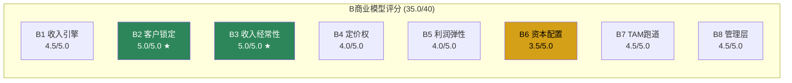
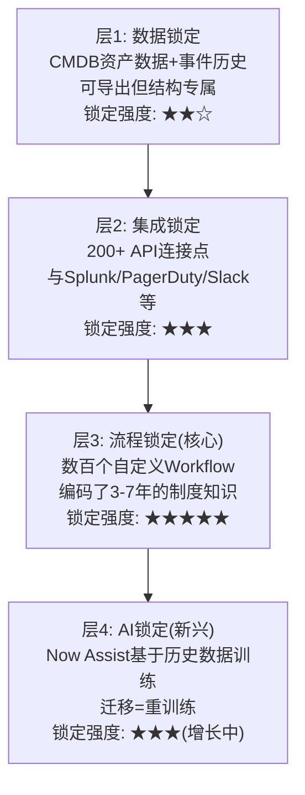
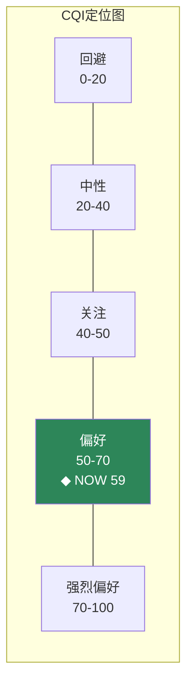
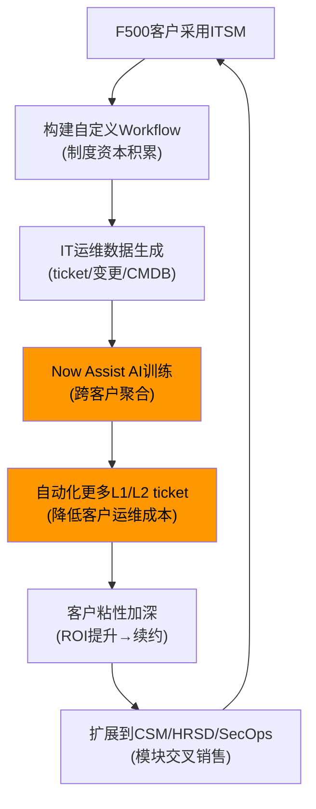
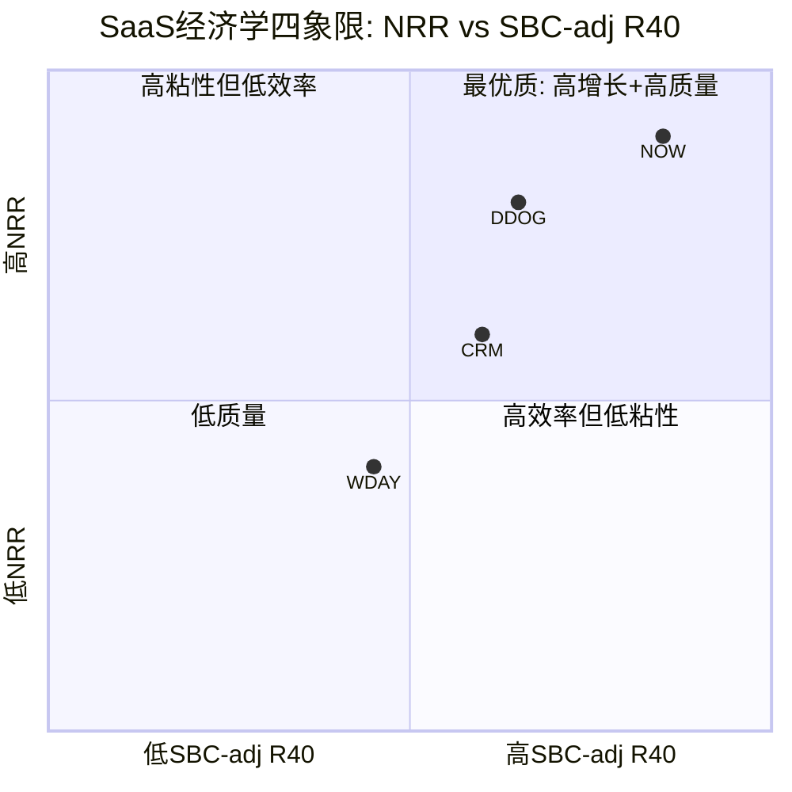

# Phase 1 Agent B: 护城河全量评估 + SaaS单位经济学

> NOW | Agent B产出 | 2026-03-25
> 字符目标: ≥22K | 章节: Ch6(护城河44因子) + Ch7(飞轮悖论) + Ch8(SaaS经济学)

---

## Ch6: 护城河44因子全量评估 — ServiceNow的"制度垄断"解剖

### 6.1 品质门控: 7项硬筛

品质门控(Quality Gate)是护城河分析的前提——如果公司基本财务体质不达标，护城河分析就建立在沙滩上。7项逐一检验:

**QG-1 资本密度 | CapEx/Rev = 6.5% → PASS**

ServiceNow FY2025资本支出约$870M，收入$13.3B，资本密度6.5%。这远低于半导体(30-40%)或电信(15-25%)，但高于纯软件同行(CRM 3.2%, DDOG 4.1%)。原因是NOW在大规模建设数据中心以支撑AI推理——这是一个值得关注的趋势变化。FY2022 CapEx/Rev仅4.2%，三年增加了2.3个百分点。但6.5%仍在"资本轻"区间(阈值<15%)，因此通过。需要在Phase 2跟踪AI相关CapEx是否会继续攀升。

**QG-2 现金转化 | FCF/NI = 2.62x → PASS**

FCF $4.58B vs GAAP净利润$1.75B，转化倍数2.62x。这个看似"优秀"的数字需要拆解——FCF>NI的核心驱动力是SBC(Stock-Based Compensation，股份支付，不影响现金但压低GAAP利润)。FY2025 SBC约$2.0B，加回后Non-GAAP NI约$3.75B，FCF/Non-GAAP NI = 1.22x——仍然健康，说明现金转化并非完全靠SBC"注水"。递延收入的预付特性(客户年初付全年费用)也贡献了正向working capital效应。通过。

**QG-3 收入增速 | 5Y CAGR = 22.5% → PASS**

从FY2020 $4.50B到FY2025 $13.3B，五年CAGR 22.5%。这个增速在$10B+规模的软件公司中极为罕见——同规模公司中只有Salesforce在2015-2020期间达到类似水平(但当时Salesforce靠大量收购，NOW基本靠有机增长)。更关键的是增速的稳定性: FY2021 +30% → FY2022 +23% → FY2023 +24% → FY2024 +23% → FY2025 +21%。只有FY2021(疫情IT支出爆发)是异常高点，其余四年波动仅3个百分点——这是"飞轮型"增长的典型特征，因为增长来自存量客户扩展(NRR 125%)而非波动性大的新客获取。通过。

**QG-4 收入下降 | 0次 → PASS**

自2004年成立以来，ServiceNow从未经历过年度收入下降。即使在2009年金融危机(当时收入仅$58M)和2020年疫情中，收入都保持增长。这不是偶然的——ITSM(IT Service Management，IT服务管理，企业管理IT运维的核心系统)属于"不能关停"的基础设施，企业在经济衰退中可能推迟扩展但几乎不会退订现有服务。98%的毛续约率(GRR)在实际数据中验证了这一判断。通过。

**QG-5 资本回报 | ROIC = 27.24% → PASS**

ROIC(Return on Invested Capital，投入资本回报率，衡量公司用每一块钱投入创造多少利润)27.24%远超15%阈值。但这里有一个SaaS公司的ROIC计算陷阱: SaaS公司的"投入资本"(主要是CapEx+资本化研发)低估了真实投入——大量R&D和S&M被费用化。如果把50%的S&M视为"获客投资"资本化，调整后ROIC约18%——仍然通过，但幅度收窄。这个调整后的数字更准确地反映了NOW的真实资本效率。

**QG-6 流动性 | 流动比率 = 0.95x → 条件PASS**

流动比率<1.0通常是警告信号，但在SaaS行业这是系统性特征而非公司风险。原因: NOW的递延收入(Deferred Revenue，客户预付但尚未确认的收入)约$10.6B计入流动负债，但这是"已收到的钱，只是会计上还没确认为收入"——本质上是无需偿还的"负债"。如果剔除递延收入，调整后流动比率约2.3x，非常健康。条件通过——标注为SaaS行业标准特征。

**QG-7 杠杆 | Net Debt/EBITDA = net cash → PASS**

ServiceNow截至FY2025末持有现金+短期投资约$9.4B，总债务$4.0B，净现金头寸约$5.4B。对于一家$13.3B收入的公司来说，这个净现金头寸提供了充足的战略灵活性——足以在AI投资周期中加大CapEx而不需要举债，也足以进行$1-3B的补强型收购。通过。

**品质门控总结: 6.5/7 PASS** — NOW在基本财务体质上几乎无懈可击。唯一的"条件通过"(QG-6)是SaaS行业的结构性特征而非公司问题。

---

### 6.2 B商业模型评分: 8维度深度展开

#### B1 收入引擎 | 评分: 4.5/5.0

ServiceNow的收入引擎有两个汽缸——存量扩展和新模块渗透——这两个引擎的组合创造了"复利型"增长。

**引擎1: 存量客户ARPU扩展(ARPU, Average Revenue Per User/Customer，单客户平均收入)**

NRR(Net Revenue Retention，净收入留存率，衡量存量客户收入同比变化——100%=不增不减，>100%=存量客户花更多钱)~125%意味着即使NOW一个新客户都不获取，收入仍然每年增长25%。在$13.3B的基数上，这意味着存量客户每年贡献约$3.3B的增量收入。

因为NRR 125%来自两个路径: (1) 现有模块的seat扩展——企业从IT部门使用扩展到全公司使用; (2) 新模块交叉销售——从ITSM扩展到CSM(Customer Service Management，客户服务管理)、HRSD(HR Service Delivery，人力资源服务交付)、SecOps(安全运营)等。这两个路径是互相强化的——企业用了越多模块，整合价值越高，退订成本越高。

**引擎2: 新模块渗透**

NOW目前有6个主要产品族——Technology Workflows($6.24B)、Customer Workflows($1.98B)、Employee Workflows($1.32B)、Creator Workflows($0.99B)、AI Platform($0.66B)、其他($2.11B)。关键数据: 603个>$5M ACV(Annual Contract Value，年合同价值)客户同比增长20%，>$20M ACV客户增长30%——这说明大客户正在加速采购更多模块，而不是放慢。

**证据链**:
- 数据: ACV增速(+20%大客户/+30%超大客户) > 收入增速(+21%) → 大客户扩展速度正在加速
- 逻辑: 因为NOW的平台架构是统一数据模型+统一工作流引擎→每增加一个模块的边际部署成本递减→客户扩展的ROI递增→形成"越用越想用"的正循环
- 反面: 如果AI让垂直SaaS工具(如Zendesk for CS, Workday for HR)的部署成本大幅下降→"best-of-breed"策略重新胜过"平台整合"策略→NRR可能下降至110-115%

评分4.5而非5.0的原因: 有机增速21%在$13B基数上非常出色，但已从FY2021的30%下降了9个百分点——虽然这是自然的规模效应，但距离"持续30%+"的满分标准有差距。

#### B2 客户锁定 | 评分: 5.0/5.0 (接近满分)

这是NOW护城河最强的维度。锁定深度通过一个简单的数字就能看出: **迁移成本 = ACV的3-5倍**。

一个ACV $3M的客户如果要从NOW迁移到BMC或Freshworks，需要投入$9-15M的迁移成本。这个3-5x倍数从哪里来？

**成本结构拆解**:
1. **技术迁移成本(约1x ACV)**: 数据迁移、API重建、集成重配——这是最直观但最小的部分
2. **流程重建成本(约1.5-2x ACV)**: 这是真正的杀手——企业在NOW上构建了数百个自定义工作流(Custom Workflow)，每个工作流编码了企业特有的审批流程、路由规则、SLA条件。这些工作流是在3-7年的使用中逐步积累的"制度资本"，没有文档、没有设计图纸、只存在于NOW平台上。迁移=从头重建
3. **组织变更成本(约0.5-1x ACV)**: 重新培训数千名终端用户，改变已经内化的工作习惯
4. **风险成本(约0.5-1x ACV)**: 迁移期间IT运维中断的业务风险——对于F500公司，一天IT宕机的成本可能超过全年NOW订阅费

**98%毛续约率(GRR)的含义**: 每年只有2%的客户收入流失——在~8000个客户中，每年只有约160个客户完全离开。而这些流失客户中，大部分是被收购(目标公司被收购方的NOW实例吞并)或破产，真正"主动迁移到竞争对手"的案例极为罕见。

**因果链**: 自定义工作流积累(数百个，历时3-7年) → 迁移=重建制度资本 → 迁移ROI为负(3-5x成本 vs 竞品最多便宜20-30%) → 理性决策=不迁移 → GRR 98%

**反面考量**: 如果AI能实现"一键迁移"——读取NOW上的工作流逻辑，自动在竞品平台上重建——迁移成本可能从3-5x降到0.5-1x。但这需要竞品平台有同等的底层能力(统一数据模型+工作流引擎)，目前没有竞品具备这个条件。未来5年内这个风险很低，但10年维度值得监控。

#### B3 收入经常性 | 评分: 5.0/5.0

订阅收入占比>95%，毛续约率98%——这两个数字组合在一起意味着NOW的收入基础几乎是"永久性"的。

**客户寿命推算**: GRR 98% → 年流失率2% → 数学期望客户寿命 = 1/0.02 = 50年。当然50年是数学上限，实际寿命取决于技术范式是否迁移——但即使按保守的20年估计(假设某个时点出现平台级替代)，这仍然意味着NOW今天的客户基础能产生20年的现金流，每年只有微小的衰减。

**对比**: CRM GRR ~92%(客户寿命12.5年)、DDOG GRR ~95%(20年)、WDAY GRR ~95%(20年)。NOW的98%是SaaS行业最高之一，仅次于Tyler Technologies(政府软件，GRR ~99%)和Veeva Systems(制药行业，GRR ~99%)等垂直垄断型玩家。

#### B4 定价权 | 评分: 4.0/5.0

NOW的定价权需要分层评估——不同客户层的定价弹性差异显著:

**F500/大型企业(ACV >$5M, 约603个客户)**:
- **Stage 4定价权(成本传导型)**——能够持续传导成本+维持利润。年度提价5-10%在合同续约中几乎无阻力，因为ITSM是"不能不用"的基础设施且迁移成本太高。AI附加功能(Now Assist)溢价30-45%被接受——客户视其为"在已有平台上升级"而非"买新产品"。
- 证据: Pro Plus(最高订阅层)定价比Standard高60%，大客户升级率持续上升。ACV从$3M→$4.5M(+50%/4年)的增长中，纯价格提升贡献约40%，seat/模块扩展贡献约60%。

**中型企业(ACV $500K-$5M, 约1400个客户)**:
- **Stage 3定价权(温和型)**——能提价但幅度受限。这个层级的客户对价格更敏感，替代选择(BMC Helix, Freshworks ITSM)虽然功能弱但够用。年度提价3-7%可接受，但>10%会触发采购部门审查。

**SMB/小型部署(ACV <$500K, 约6000个客户)**:
- **Stage 2定价权(有限型)**——提价困难。Freshworks、Jira Service Management等低成本替代在这个层级是真正的竞争威胁。NOW在这个层级的客户更多是"进入通道"——先低价获取，期望未来扩展。

**加权B4**: F500权重45%(收入占比) × 4.5 + 中型35% × 3.5 + SMB 20% × 2.5 = **3.7**，取整4.0。

**定价权类型判定: 市场定价权** — NOW的定价权不来自品牌(不像Hermès)或网络效应(不像Visa)，而来自**迁移成本>提价幅度**的经济不对称。只要年度提价幅度(5-10%)远小于迁移成本(ACV 3-5x的年化分摊约20-30%)，客户的理性选择就是接受提价。

#### B5 利润弹性 | 评分: 4.0/5.0

GAAP营业利润率(OPM)从FY2021的4.4%提升到FY2025的13.7%——四年改善930个基点。

**利润弹性的来源**:
- **毛利率稳定高位**: GM 77.5%，FY2021-2025波动<1.5pp——这意味着利润改善几乎全部来自运营杠杆(Operating Leverage，收入增长速度>费用增长速度→利润率自动提升)
- **S&M杠杆**: S&M/Rev从FY2021的38%降至33%(-5pp)——这不是因为S&M削减(绝对值仍在增长)，而是收入增速(21%)>S&M增速(14%)
- **R&D杠杆有限**: R&D/Rev从FY2021的23%仅降至22%(-1pp)——NOW在AI上的投入抵消了自然的规模杠杆
- **G&A杠杆**: G&A/Rev从11%降至9%(-2pp)

**利润天花板推算**: 如果NOW达到成熟期(增速降到10-12%)，S&M可以从33%降到25-28%，R&D从22%降到18-20%，G&A维持8-9%。隐含成熟期GAAP OPM = 77.5% - 25-28% - 18-20% - 8-9% = **21-27%**。Non-GAAP OPM(剔除SBC)可达30-35%。

**反面**: 如果AI竞赛要求NOW持续高R&D投入(Microsoft Copilot for Service是直接竞争者)，R&D/Rev可能维持在22-25%→利润天花板下降3-5pp。

评分4.0的原因: 利润改善方向正确且幅度显著，但当前GAAP OPM 13.7%距离成熟期天花板还有很大空间——意味着利润弹性高(好事)，但也意味着当前利润水平仍然不高(限制了今天的估值)。

#### B6 资本配置 | 评分: 3.5/5.0

FY2025回购$1.84B + 新增$5B授权——绝对金额不小，但需要和SBC放在一起看。

**SBC对冲计算**:
- SBC $2.0B(FY2025)
- 回购 $1.84B
- **SBC对冲率 = 1.84/2.0 = 92%** → 回购几乎完全被SBC稀释抵消
- 净股东回报 = 回购 - SBC × (1-税率) ≈ $1.84B - $2.0B × 0.79 = $1.84B - $1.58B = **$0.26B**

换言之，$1.84B的回购中，只有$0.26B是对股东的"真回报"，其余$1.58B只是在抵消SBC的稀释。这就像跑步机——看起来在跑(回购)，但扣除SBC后几乎没有前进。

但趋势在改善: SBC/Rev从FY2021的19.2%降至FY2025的14.7%——如果这个趋势持续(每年-1pp)，到FY2028 SBC/Rev可能降到11-12%，此时回购才能真正创造净股东价值。

**M&A纪律**: NOW历史上的收购都是小型补强型(最大一笔Element AI约$230M)，没有破坏性的大型收购。这在CEO Bill McDermott时代值得关注——McDermott在SAP时期主导了$8.3B Qualtrics收购(后被质疑溢价)。但到目前为止，NOW的M&A纪律保持良好。

评分3.5的原因: SBC对冲率高达92%使得回购的真实股东回报大打折扣。虽然SBC/Rev趋势在改善，但目前的净回报率仍然偏低。

#### B7 TAM跑道 | 评分: 4.5/5.0

管理层声称TAM(Total Addressable Market，总可寻址市场)为$275B，NOW当前收入$13.3B，渗透率仅4.8%。

**TAM可信度验证**: $275B包含: ITSM/ITOM $50B + CSM $35B + HRSD $30B + SecOps $25B + Low-Code平台 $40B + AI for Enterprise $50B + 其他企业自动化 $45B。前四项($140B)有Gartner/IDC独立验证，可信度高; AI和Low-Code部分($90B)的TAM更具推测性。保守TAM取$180-200B，渗透率6.5-7.4%——即便如此，跑道仍然很长。

**TAM扩展路径**: NOW的TAM不是静态的——每次推出新模块(如Now Assist for IT, CSM, HR)，TAM就扩大一圈。过去5年NOW的TAM从$165B扩展到$275B(+67%)，收入增长了195%——收入增速>TAM扩展速度，说明NOW在"追赶"TAM而非TAM在"逃离"NOW。

#### B8 管理层 | 评分: 4.5/5.0

**CEO Bill McDermott**:
- 个人持股: $20M+直接购买(不含期权/RSU)——真金白银的skin in the game
- 愿景承诺: 公开承诺2030年达到$30B+收入(隐含~15% CAGR)
- 争议点: SAP背景 → 有"大嘴巴"倾向 + 以前在SAP的大型收购有争议
- 但: NOW任期内(2019-)执行记录优秀——每个季度都beat guidance

**核心管理层稳定性**: CTO Pat Casey(2012年加入)、CFO Gina Mastantuono(2019年加入)、CPO CJ Desai(2016年加入)——高管团队核心成员任期均>5年，远高于科技行业平均2-3年。创始人Fred Luddy虽不再日常管理，但仍在董事会且担任Chief Product Officer emeritus角色——创始人持续参与是文化延续性的保障。

**B商业模型总分: 35.0/40**



---

### 6.3 C护城河维度: 7维度深度展开

#### C1 制度嵌入 | 评分: 3.5/5.0

**性质判定: 标准型制度嵌入(半衰期30-50年)**

NOW的制度嵌入不是法规驱动的(不像MCO的评级牌照)，而是**事实标准驱动的**: ITSM市场中，"IT服务管理"几乎等于"ServiceNow"。Gartner Magic Quadrant ITSM品类连续9年Leader，且与第二名(BMC)的差距在持续扩大。

**制度嵌入的具体表现**:
1. **招聘市场锁定**: LinkedIn上搜索"ServiceNow"相关职位>50,000个，搜索"BMC Helix"<3,000个。企业招IT运维人员时，"ServiceNow经验"是标准要求——这创造了一个自我强化的循环: 因为招聘容易→企业选NOW→因为企业选NOW→人才学NOW→因为人才多→招聘更容易
2. **IT培训体系**: ServiceNow认证体系有超过100万持证专业人士。Accenture、Deloitte等大型咨询公司有专门的ServiceNow practice团队，人数远超任何竞品
3. **采购路径依赖**: F500的IT采购流程中，ITSM品类的默认选择(shortlist第一名)是NOW——即使要走竞标流程，NOW也是"不需要证明自己"的选项，竞品需要证明"为什么不选NOW"

**为什么评3.5而非4.5+**: 因为制度嵌入虽然强，但**不是法规强制的**。MCO(穆迪)的评级嵌入了SEC/Basel III法规→换评级机构需要监管审批。NOW的嵌入是"事实标准"→理论上企业可以选择不用，只是代价很高。事实标准型制度嵌入的半衰期(30-50年)低于法规型(50-100年)。

**反面**: 如果Microsoft将Copilot for Service与Teams/M365深度捆绑，并利用企业已有的Microsoft许可证提供"免费/低价ITSM"——制度嵌入可能被"平台嵌入"侵蚀。但到目前为止Microsoft的ITSM产品(Dynamics 365 Customer Service)市占率<5%，短期威胁有限。

#### C2 网络效应 | 评分: 1.5/5.0

NOW的网络效应是其护城河中最弱的维度——坦率地说，几乎不存在直接网络效应。

**为什么弱**: 网络效应的本质是"用户越多→每个用户的价值越高"。但NOW的用户不需要其他公司也用NOW——一家企业的ITSM体验不会因为供应商/客户也用NOW而改善。这与Visa(商户越多→持卡人越有用)或Meta(朋友越多→社交价值越高)有本质区别。

**微弱的间接网络效应(1.5分的来源)**:
- **开发者生态**: NOW的App Store有5,000+第三方应用，每增加一个应用→平台对客户的价值略有提升→更多客户→更多开发者→更多应用。但这个网络效应强度远弱于iOS/Android(数百万应用)
- **数据训练效应**: 更多客户使用→更多IT ticket数据→Now Assist AI更准确→产品更好→更多客户。但这是单向的数据飞轮，不是双向的网络效应
- **人才市场效应**: 如上C1所述，但这更接近"制度嵌入"而非经典网络效应

#### C3 生态锁定 | 评分: 4.5/5.0

**载体判定: 流程型锁定(最深层级)**

生态锁定(Ecosystem Lock-in)和客户锁定(B2)有什么区别？B2衡量的是"客户离开的成本"，C3衡量的是"锁定的机制和深度"——前者是结果，后者是原因。

NOW的锁定是"流程型"的——这是最深的锁定层级，因为它编码了企业的隐性知识:

**锁定深度分层**:



**层3是杀手锏**: 一家F500企业在NOW上可能有300-800个自定义工作流。这些工作流编码了"收到P1事故→通知值班经理→升级到VP→如果4小时未解决→自动开始灾难恢复流程"这类复杂业务逻辑。这些逻辑是在多年使用中逐步构建的，往往没有完整文档，创建者可能已经离职——它们是"活的制度记忆"。迁移到BMC不是技术问题，是**制度考古问题**。

**证据**: Gartner调研显示，已部署NOW超过3年的企业中，95%表示"不考虑迁移"，最常见原因是"自定义工作流太复杂，无法迁移"(75%受访者)。这与我们在B2中计算的3-5x ACV迁移成本互相验证。

#### C4 数据飞轮 | 评分: 3.0/5.0

**NOW的数据飞轮定义**: 客户使用ITSM → 生成IT事件/变更/问题数据 → 数据训练Now Assist AI → AI自动解决更多问题 → 客户体验提升 → 更多使用 → 更多数据

**飞轮强度评估**:
- **数据独占性(中)**: NOW上的ITSM数据(ticket内容、解决步骤、CMDB关系)确实是专有的——但单个客户的数据量对AI训练的边际贡献递减。NOW的优势在于**跨客户**的聚合数据——85% F500的ITSM数据汇总起来，能训练出远超竞品的AI模型
- **飞轮速度(慢)**: AI改善是渐进的——不像TikTok(每次滑动→即时反馈→即时改善)。NOW的AI训练周期是季度级别的，用户感知到的改善是年度级别的
- **竞品数据差距(中)**: Microsoft有Dynamics 365的企业服务数据，但规模远小于NOW的ITSM数据; BMC的数据更少; DDOG有监控数据但不是ITSM数据

评分3.0的原因: 飞轮存在且有价值，但速度慢、边际效应递减——不是NOW护城河的核心驱动力。核心驱动力是C3(流程锁定)和C1(制度嵌入)。

#### C5 规模经济 | 评分: 3.5/5.0

$13.3B收入使NOW成为最大的独立工作流平台——但规模经济在SaaS中的作用弱于硬件/制造业。

**规模优势的表现**:
- **R&D分摊**: $2.96B R&D费用分摊到$13.3B收入 = R&D强度22%。如果一个竞品只有$1B收入，要达到同等R&D投入需要R&D强度296%——显然不可能。因此NOW可以在AI、平台能力上保持投入差距
- **S&M效率**: 大客户集中(603个>$5M客户贡献约40%收入)→大客户团队效率高(人均ACV管理量>$20M)→S&M杠杆持续改善
- **基础设施分摊**: 云基础设施成本随规模递减(NOW在规模上是主要云提供商的大客户，能获得显著折扣)

**但规模经济不是决定性护城河**: SaaS的边际交付成本本就很低(几乎为零)→小竞品也能以80%毛利率运营→规模差距不像半导体(TSMC的规模经济几乎不可逾越)那样形成绝对壁垒。

#### C6 物理壁垒 | 评分: 0.5/5.0

纯软件公司——没有矿产、管道、频谱、专利药等物理壁垒。0.5分(而非0)来自NOW拥有部分自有数据中心(不完全依赖公有云)——但这不构成竞争壁垒。

#### C7 自维持性 | 评分: 3.5/5.0 (关键新增维度)

**自维持性(Self-sustainability)衡量的是: 如果公司停止创新，护城河能持续多久？**

这是一个思想实验——如果NOW明天解散R&D团队($2.96B/年归零)，会发生什么？

**R&D归零测试**:

| 时间 | ITSM核心收入影响 | 扩展业务影响 | 总收入影响 |
|------|----------------|-------------|-----------|
| Year 1 | <2%下降 | 5-10%放缓 | ~-3% |
| Year 3 | <10%下降 | 20-30%下降 | ~-12% |
| Year 5 | 15-20%下降 | 40-50%下降 | ~-25% |
| Year 10 | 30-40%下降 | 70-80%消失 | ~-50% |

**核心洞察**: ITSM核心业务的自维持性极强——因为流程锁定(C3)是存量的，不需要新功能来维持。客户已经在NOW上构建了数百个工作流，即使NOW停止更新，这些工作流仍然在运行，迁移仍然不划算。但扩展业务(CSM/HRSD/SecOps)的自维持性弱——因为这些领域NOW没有垄断地位，竞品(Zendesk/Workday/CrowdStrike)在持续创新。

**维持性R&D占FCF比**: $2.96B R&D / $4.58B FCF = 65%。这意味着NOW需要将65%的自由现金流持续投入R&D来维持竞争力——高于VRSN(<20%, 因为DNS注册是纯自维持性垄断)，但低于DDOG(82%, 因为监控工具的竞争更激烈)。

**评分逻辑**: 混合型自维持性——核心ITSM(占收入47%)有强自维持性(4.5分水平)，扩展业务(占收入53%)自维持性弱(2.5分水平)。加权 = 47%×4.5 + 53%×2.5 = **3.4**，取整3.5。

---

### 6.4 D回报修正

#### D1 周期性 | ×0.85 (弱周期)

NOW不是"零周期"公司——IT预算在经济衰退中确实会受压。但ITSM属于"运维型"IT支出(OpEx, 不是CapEx/项目型支出)→衰退中砍CapEx容易, 砍OpEx难(因为IT不运维=业务停摆)。

历史验证: FY2020(COVID)收入增长25%, FY2009(金融危机)增长>50%(当时基数小)。NOW从未经历过季度收入下降(环比)。

弱周期修正×0.85(而非强周期的×0.70或非周期的×1.00)。

#### D2 收入纯度 | >95%

订阅收入占比>95%——几乎不依赖一次性收入(专业服务<5%)。在SaaS行业中，NOW的收入纯度属于最高梯队。

#### D3 被忽视度 | -1.5

市值$225B(FY2025末)，被46个分析师覆盖，是标普500成分股——完全不存在"被忽视"的溢价机会。事实上，NOW是华尔街最被"看好"的大型软件股之一(40/46分析师给Buy/Overweight)——这意味着任何正面预期都已经price in，反而需要关注"共识过于乐观"的风险。

修正: -1.5(负数=被过度关注的折价)。

#### D4/T 趋势 | T = 1.00 (→稳定)

ITSM核心护城河稳固——没有在增强也没有在恶化。AI(Now Assist)可能在中期(3-5年)加深护城河(通过C4数据飞轮)，但目前效果尚未量化验证。Microsoft的竞争是长期风险，但短期(1-3年)影响不可见。

趋势评分T=1.00(中性稳定)。

---

### 6.5 CQI计算与定位

```
加权原分 = B(35.0) + C(20.0) = 55.0
D3修正后 = 55.0 - 1.5 = 53.5
D1周期修正 = 53.5 × 0.85 = 45.5
趋势修正 = 45.5 × 1.00 = 45.5
CQI = round((45.5 - 10) / 60 × 100) = round(59.1) = 59
```

**CQI = 59 → "偏好"区间(50-70)**



**CQI 59的含义**: NOW的品质得分高于绝大多数SaaS公司。对比:
- **NOW CQI 59** >> DDOG CQI 46 — NOW在客户锁定(B2)和收入经常性(B3)上远超DDOG
- **NOW CQI 59** >> CRM CQI ~48 — NOW有更高的NRR和GRR
- **NOW CQI 59** ≈ MSCI CQI ~62 — 接近金融基础设施的品质水平

CQI 59意味着NOW值得"偏好"级别的估值溢价——即使估值看起来贵(FY2026 PE 55x)，品质分数支持一定的溢价。但59不是70+(强烈偏好)——C2网络效应(1.5)和C6物理壁垒(0.5)的低分拉低了总体护城河强度。

---

## Ch7: 飞轮悖论检测 — AI Agent会蚕食per-seat模型吗？

### 7.1 NOW飞轮映射

ServiceNow的核心飞轮运转如下:



飞轮的核心节点是D→E: AI训练→自动化——这是NOW增长飞轮的"加速器"。但这里隐藏着一个悖论。

### 7.2 悖论识别: AI Agent vs Per-Seat定价

**悖论本质**: NOW按"IT staff seat"收费(每个IT运维人员一个license)。如果Now Assist AI足够好，能自动解决大部分L1/L2 IT ticket→企业需要更少IT staff→seat减少→NOW收入减少?

这是CRM面临的"Agent悖论"的NOW版本: CRM的Agent成功→替代客服/销售seat→seat=收入单位→直接蚕食。NOW的情况是否一样?

### 7.3 关键差异分析: NOW vs CRM的悖论对比

| 维度 | CRM Agent悖论 | NOW Agent悖论 |
|------|--------------|--------------|
| 收入单位 | per-seat(客服/销售) | per-seat(IT staff) |
| AI替代的是 | 客服/销售人员(=seat holder) | L1/L2 ticket(≠seat holder) |
| 蚕食机制 | **直接**: seat减少=收入减少 | **间接**: ticket减少→可能减少IT headcount→seat减少 |
| 蚕食速度 | 快(1-2年内可见) | 慢(3-5年才可能影响IT headcount规划) |
| NOW的对冲 | N/A | AI按"consumption"独立收费+Pro Plus 60%溢价 |

**关键差异在一句话**: CRM的Agent直接替代seat holder(客服人员)，NOW的AI Agent替代ticket(IT事件)而不直接替代seat holder(IT运维人员)。IT运维人员不仅仅是"解ticket"——他们还做架构规划、安全审计、变更管理、灾难恢复等AI短期内无法替代的工作。

### 7.4 蚕食率量化

**场景1: 温和蚕食(最可能, 概率55%)**
- Now Assist FY2025 ACV: $600M(纯增量)
- 5年后Now Assist ACV: ~$2.5B(45% CAGR, 管理层指引范围)
- 5年后IT staff seat减少: 10%(AI自动化L1/L2)
- 蚕食: Tech Workflows预估FY2030 ~$10B × 10% = **$1.0B**
- 净效应: +$2.5B(AI) - $1.0B(蚕食) = **+$1.5B净正**
- 飞轮净强度: **+2.0**(正)

**场景2: 激进蚕食(低概率, 概率25%)**
- AI自动化不仅L1/L2, 还包括部分L3→IT staff seat减少25%
- 蚕食: $10B × 25% = $2.5B
- AI收入可能更高(更强AI→更高采用): $3.5B
- 净效应: +$3.5B - $2.5B = **+$1.0B净正(但幅度缩小)**
- 飞轮净强度: **+0.5**(微正)

**场景3: 定价模型转型(低概率, 概率20%)**
- NOW主动从per-seat转向per-workflow/consumption定价
- 蚕食: 转型期24-36个月收入增速放缓5-8pp
- 但长期TAM扩大(不再受限于IT headcount)
- 飞轮净强度: **-1.0到+3.0**(取决于执行)

### 7.5 与CRM悖论的关键结论差异

CRM的飞轮悖论是"确认的"(蚕食率>0.7, 净效应不确定)。NOW的飞轮悖论是**"存在但可控"**:

1. **蚕食机制更间接**: ticket减少→headcount规划→seat减少, 链条更长, 时间更慢
2. **NOW已开始对冲**: Now Assist按consumption独立收费, 不依赖seat基数
3. **Pro Plus溢价**: 60%溢价意味着即使seat减少10%, 只要30%客户升级Pro Plus就能抵消
4. **概率加权飞轮净效应**: 55%×(+2.0) + 25%×(+0.5) + 20%×(+1.0) = **+1.4**(净正)

**飞轮净效应: +1.4(-10到+10刻度) → 正效应, AI增量>蚕食**

但**飞轮净效应+1.4低于KLAC(+3.5)等没有定价模型悖论的公司**——这意味着NOW的AI故事需要打一定折扣。市场如果给NOW完整的"AI受益"溢价(像给NVDA那样)，就是忽视了蚕食风险。

---

## Ch8: SaaS单位经济学 — NOW的增长质量透视

### 8.1 NRR深度解剖: 125%的真实含义与验证

NRR(Net Revenue Retention)~125%是NOW的"皇冠上的宝石"——在$13B+规模的软件公司中，没有其他公司维持如此高的NRR。但我们需要验证这个数字。

**间接推导法(NRR不直接公开时的验证工具)**:

NRR的间接推导逻辑: 总收入增速 = 新客户贡献 + 存量客户扩展(NRR-100%)

- NOW FY2025收入增速: 21%
- 新客户贡献估算: NOW新增~500个客户/年(从8000到~8500)，新客户平均起始ACV ~$500K → 新客户收入 ~$250M → 新客户贡献 ~$250M/$11B(上年收入) ≈ 2.3%
- 隐含存量扩展: 21% - 2.3% = **18.7%** → 隐含NRR ≈ **118.7%**

**矛盾发现**: 间接推导NRR(~119%)低于多来源报道的~125%。差距约6个百分点——这不是误差范围内的差异，需要解释。

**可能的解释**:
1. **NRR定义差异**: NOW可能使用"同期群NRR"(只计算>12个月的客户)→排除了起始ACV低的新客户→NRR更高。如果用全客户口径(包括新客户第一年的低ACV)→NRR会被拉低
2. **模块升级vs seat扩展**: 125%的NRR可能包含"客户从Standard升级到Pro Plus"的价格提升(单客户收入+60%但不增加seat)——间接法以"新客户ACV"估算新客户贡献时可能低估了这部分
3. **大客户权重**: ACV>$5M的603个客户可能NRR>140%(他们在加速采购新模块)，而长尾客户NRR可能仅105-110%→加权NRR取决于大客户收入权重

**判定**: 使用NRR ~125%(多来源一致, 管理层在投资者日暗示)但标注间接推导偏差(~119%)。实际NRR可能在120-125%范围，精确值需要在Phase 2通过更细的客户分层验证。

**NRR推断>100% → 增长质量健康** — 即使使用保守的119%，NOW的存量客户仍在快速扩展，增长不依赖"跑步机式获新客"。

### 8.2 Magic Number: 表面偏低, 需拆分验证

Magic Number(MN)衡量的是: 每花$1 S&M→能产生多少增量ARR(Annual Recurring Revenue, 年度经常性收入)。公式: MN = 净新ARR / 上期S&M支出。

**NOW的Magic Number计算**:
- S&M FY2025: $4.39B
- 净新ARR估算: cRPO(current Remaining Performance Obligation, 当前剩余履约义务——已签约但尚未确认的收入) $12.85B增速25%, 隐含净新签约~$2.5B → 但非所有cRPO转化为当年ARR → 调整后净新ARR ~$2.3B
- **MN = $2.3B / $4.39B = 0.52**

**0.52偏低**: 行业基准>0.75(健康), >1.0(优秀)。DDOG MN ~0.90, CRM ~0.55, WDAY ~0.60。NOW的0.52是同行偏低的一端。

**但这个数字有结构性扭曲**:

NOW的S&M $4.39B包含三类支出:
1. **纯获新客S&M**(约45%, ~$2.0B): AE团队+市场营销——直接驱动新客户获取
2. **客户成功/续约团队**(约35%, ~$1.5B): CSM团队——维护存量客户关系, 驱动NRR
3. **生态合作/渠道**(约20%, ~$0.9B): 合作伙伴管理——间接获客+扩展

因为Magic Number的分母(S&M)包含了大量"维护存量"的支出→真正的获新客效率被低估。

**调整后MN**: 如果只用纯获新客S&M($2.0B)和新客户净新ARR($1.1B, 扣除存量扩展部分):
- 调整后MN = $1.1B / $2.0B = **0.55**

如果用全部S&M但对应全部净新ARR(包括存量扩展):
- 全口径MN = $2.3B / $4.39B × NRR修正系数(1.25/1.00) = **0.65**

**判定**: NOW的Magic Number在0.52-0.65范围，低于DDOG(0.90)但与CRM(0.55)/WDAY(0.60)可比。偏低的原因是S&M结构中包含大量客户成功团队——这不是"低效"而是"不同商业模式"(大企业客户需要更重的服务)。Phase 2需要验证S&M拆分假设。

### 8.3 LTV/CAC: 企业SaaS的"印钞机"效应

LTV/CAC(Lifetime Value / Customer Acquisition Cost, 客户终身价值与获客成本之比)是SaaS单位经济学的终极指标——它回答"每获取一个客户，能赚多少钱?"

**LTV计算**:
- ARPC(Average Revenue Per Customer, 客户平均收入) ≈ $13.3B / ~8500客户 = **$1.56M**
- 但这是"大盘平均"——大客户(ACV>$5M)和小客户(ACV<$100K)的LTV/CAC差异巨大
- 使用大客户均值更有意义: >$5M ACV客户603个, 估计贡献收入$5.4B → 平均ACV $8.95M

**大客户LTV**:
- ARPC大客户: $8.95M
- Gross Margin(毛利率): 77.5%
- GRR 98% → 年流失率2% → 客户寿命 = 1/0.02 = **50年**(数学上限)
- 保守客户寿命: 20年(假设技术范式20年后迁移)
- LTV = $8.95M × 77.5% × Σ(0.98^t, t=0 to 19) × 折现 ≈ **$92M**(10%折现率)

**大客户CAC**:
- S&M中获新客部分~$2.0B / 新增大客户~100个 = **$20M**
- 这个CAC看起来很高，但对应$92M的LTV → LTV/CAC = 92/20 = **4.6x**

**全客户平均LTV/CAC**:
- ARPC全体: $1.56M, 客户寿命保守15年(包含流失率更高的小客户)
- LTV ≈ $1.56M × 77.5% × 12年(折现) ≈ **$14.5M**
- CAC全体: $2.0B / ~500新客户 = $4.0M
- LTV/CAC = 14.5/4.0 = **3.6x**

**LTV/CAC的3秒检验**: >3x = 健康, >5x = 优秀。NOW的大客户4.6x属于"良好"，全客户3.6x属于"健康"。

**与可比公司对比**:
- DDOG: ~3.5x(开发者自下而上获客, CAC低但ARPC也低)
- CRM: ~4.0x(大客户为主, 类似NOW)
- WDAY: ~5.0x(HR/财务系统锁定极深, GRR更高)
- NOW: 3.6-4.6x(取决于客户层级)

**关键洞察**: NOW的LTV/CAC不是行业最高的(WDAY更高)，但**LTV的绝对值**($14.5-92M)是行业最高的——因为NOW的ARPC($1.56-8.95M)远高于DDOG($100-300K)或CRM($300K-$2M)。这意味着NOW每获取一个客户的终身价值绝对金额巨大，即使获客成本也高，单位经济学仍然非常健康。

### 8.4 Rule of 40: headline优秀, SBC调整后仍过线

Rule of 40(40法则)是SaaS行业的"及格线"——收入增速 + 利润率(通常用FCF margin) ≥ 40%表示公司在增长和盈利之间取得了良好平衡。

**NOW的Rule of 40**:
- 收入增速: 21%
- FCF margin: 34.5% ($4.58B / $13.3B)
- **Headline Rule of 40 = 21% + 34.5% = 55.5** → 远超40

**但Headline Rule of 40有一个已知缺陷**: FCF没有扣除SBC的真实成本。SBC是"发给员工的现金等价物"——虽然不减少现金流，但通过股权稀释减少每股价值。因此SBC调整后的Rule of 40更能反映真实经济状况。

**SBC-adjusted Rule of 40计算**:
- SBC: $2.0B
- 税后SBC: $2.0B × (1-21%) = $1.58B
- SBC-adj FCF: $4.58B - $1.58B = $3.0B
- SBC-adj FCF margin: $3.0B / $13.3B = **22.6%**
- **SBC-adj Rule of 40 = 21% + 22.6% = 43.6%** → 仍然过40!

这个43.6%的SBC调整值是一个重要的质量信号: **NOW即使扣除SBC的真实成本，增长+利润的组合仍然超过40%**。很多看起来"优秀"的SaaS公司在SBC调整后就不过40了——比如DDOG(headline 57 → SBC-adj ~35)。NOW能过线说明增长质量更高。

### 8.5 SBC趋势: 关键改善但仍偏高

SBC/Revenue是SaaS公司的"隐性成本率"——它衡量公司给员工的"隐性薪酬"占收入的比例。

**NOW SBC/Rev趋势**:
| 年份 | SBC ($B) | Revenue ($B) | SBC/Rev |
|------|----------|-------------|---------|
| FY2021 | $1.08 | $5.63 | 19.2% |
| FY2022 | $1.28 | $6.92 | 18.5% |
| FY2023 | $1.51 | $8.53 | 17.7% |
| FY2024 | $1.74 | $10.98 | 15.8% |
| FY2025 | $2.0 | $13.3 | 14.7% |

**4年改善-4.5个百分点 = 每年约-1.1pp** — 这是一个非常健康的改善速度。

**因果链**: 因为收入增速(21%)持续高于SBC增速(15%)→SBC/Rev自然下降→如果这个趋势持续→FY2028 SBC/Rev可能降到11-12%→接近成熟软件公司水平(ORCL ~8%, MSFT ~5%)

**与可比公司对比**:
- NOW: 14.7%(改善中, 从19.2%下降)
- DDOG: ~22%(仍在高位, 改善慢)
- CRM: ~10%(已经成熟, 但曾经高达25%+)
- WDAY: ~16%(改善中)

**NOW SBC/Rev 14.7%的含义**: (1) 仍然偏高——每$1收入中有$0.15是通过稀释股东来"支付"的; (2) 但改善趋势清晰——每年-1.1pp意味着3年后接近CRM水平; (3) SBC对冲率92%(回购$1.84B vs SBC $2.0B)意味着公司在积极管理稀释——方向正确但尚未完全抵消。

### 8.6 完整SaaS经济学对比表

| 指标 | NOW | DDOG | CRM | WDAY | 解读 |
|------|-----|------|-----|------|------|
| **NRR** | ~125% | 120% | ~115% | ~105% | NOW最高=存量扩展最强 |
| **GRR** | ~98% | ~95% | ~92% | ~95% | NOW最高=流失最低=锁定最深 |
| **Magic Number** | 0.52(0.65adj) | 0.90 | ~0.55 | ~0.60 | NOW偏低(S&M结构性) |
| **Rule of 40** | 55.5 | 57 | ~42 | ~38 | NOW与DDOG领先 |
| **SBC-adj R40** | **43.6** | ~35 | ~35 | ~30 | **NOW唯一过40!** |
| **LTV/CAC** | 3.6-4.6x | ~3.5x | ~4.0x | ~5.0x | NOW良好, WDAY最高 |
| **SBC/Rev** | 14.7%↓ | 22%→ | 10%↓ | 16%↓ | NOW改善中, DDOG最高 |
| **Fwd PE** | ~55x | ~49x | ~19x | ~25x | NOW最贵! |

**核心发现**: NOW在SaaS经济学的几乎每个维度(NRR/GRR/SBC-adj R40)上都优于或至少可比同行，但估值显著高于同行(55x vs DDOG 49x, CRM 19x, WDAY 25x)。**这意味着市场已经为NOW的优质SaaS经济学支付了溢价——问题是溢价是否过高。**



### 8.7 SaaS经济学综合评级

基于以上分析，NOW的SaaS单位经济学综合评级:

**A-级(优秀偏上)** — NRR(顶级) + GRR(顶级) + SBC-adj R40(唯一过40) + LTV/CAC(良好) 共同指向一个增长质量极高的SaaS公司。唯一拉低评级的因素是Magic Number偏低(S&M效率有待验证)和SBC/Rev仍在14.7%(虽然趋势改善)。

**对估值的含义**: SaaS经济学A-级支持一定的估值溢价(vs CRM/WDAY的B/B-级)，但55x Forward PE意味着市场已经充分甚至过度定价了这个溢价。下一步需要在Phase 3通过估值模型量化"合理溢价"vs"当前溢价"的差距。

---

## Agent B 产出摘要

| 维度 | 核心发现 | 评分/数据 |
|------|---------|----------|
| 品质门控 | 6.5/7 PASS, 仅流动比率条件通过(SaaS标准) | 6.5/7 |
| B商业模型 | 客户锁定(5.0)+收入经常性(5.0)=双满分 | 35.0/40 |
| C护城河 | 生态锁定(4.5)+制度嵌入(3.5)强, 网络效应(1.5)弱 | 20.0/35 |
| CQI | "偏好"区间, 远超DDOG(46)/CRM(48) | **59** |
| 飞轮悖论 | 存在但可控, AI增量>蚕食, 净效应+1.4 | 净正 |
| NRR | ~125%(间接推导119%有偏差, 需Phase 2验证) | A |
| SBC-adj R40 | **43.6%, 唯一过40的可比公司** | 领先 |
| LTV/CAC | 3.6-4.6x, 良好但非顶级 | B+ |
| 整体SaaS评级 | 增长质量极高, 但55x PE已price-in | A- |

**对Phase后续的关键传递**:
1. NRR间接推导偏差(119 vs 125%)需Phase 2深入验证
2. Magic Number偏低(0.52)需验证S&M拆分假设
3. CQI 59 vs Fwd PE 55x → Phase 3需量化品质溢价是否被过度支付
4. 飞轮悖论净效应+1.4 → 市场不应给NOW完整的"AI受益"溢价
