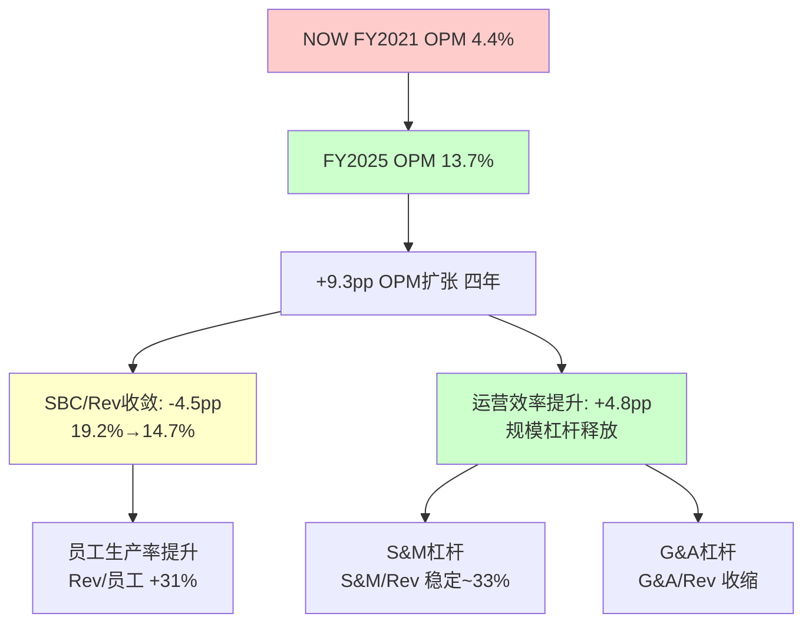
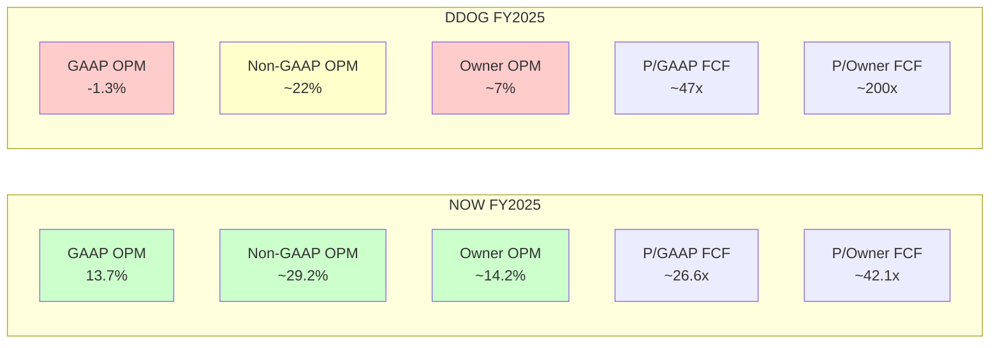
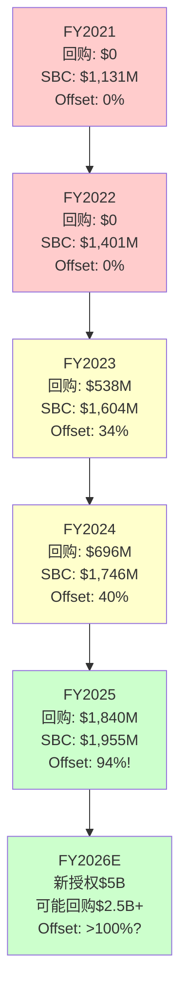
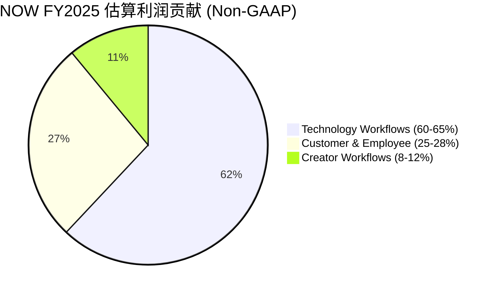
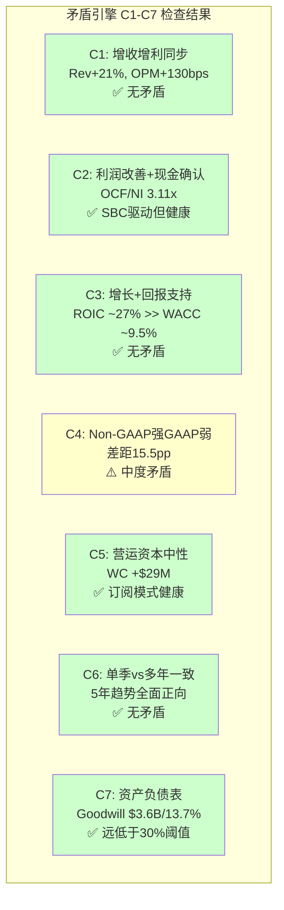

# Phase 1 Agent C: CPA财务诊断 — ServiceNow (NOW)

> **Agent**: C (CPA财务诊断师) | **框架**: CPA×ISDD v2.0 + SBC三层盈利v1.0
> **数据窗口**: FY2021-FY2025 (1月财年) | **市值**: ~$121.8B (基于~$1,005/股)
> **核心发现**: NOW是SaaS行业中罕见的"三层盈利全面健康"标本——GAAP盈利(OPM 13.7%)、Non-GAAP高利润(~29%)、Owner Economics正在快速改善(SBC/Rev从19%→15%、回购覆盖率94%)。这不是DDOG式的"Non-GAAP幻觉"，而是一个正在从SaaS青春期走向成熟期的真实利润机器。

---

## Ch9: M1利润表诊断 — SBC三层盈利真相

### 9.1 为什么需要三层盈利分析

ServiceNow是一家年收入$13.3B、GAAP营业利润率(Operating Profit Margin, 即营业利润/收入)13.7%的企业软件巨头。在SaaS(Software as a Service, 软件即服务——客户按订阅付费而非一次性购买)行业中，这个数字极为罕见：大多数同行要么GAAP亏损(如Datadog的-1.3%)，要么依赖Non-GAAP调整(即扣除SBC等非现金费用后的调整利润)来展示盈利能力。

但单看GAAP利润率还不够。SaaS公司的SBC(Stock-Based Compensation, 基于股票的薪酬——公司用自家股票而非现金支付员工部分薪酬)是一项真实的经济成本：它通过稀释现有股东持股比例来支付员工报酬。因此投资者需要同时看三层利润才能做出诚实判断：

1. **GAAP层** — 包含SBC的全成本视角，最保守
2. **Non-GAAP层** — 扣除SBC后的调整视角，SaaS行业通用估值基础
3. **Owner层** — 真正属于股东的盈利，等于GAAP利润减去SBC的税后实际稀释成本

这三层利润之间的差距、收敛速度、以及管理层通过回购抵消稀释的努力，共同决定了NOW的"利润真实度"。

### 9.2 NOW FY2025三层盈利表

```
═══════════════════════════════════════════════════════════════
NOW FY2025 三层盈利真相 (SBC三层盈利框架v1.0)
═══════════════════════════════════════════════════════════════
                   GAAP           Non-GAAP        Owner(扣SBC)
Revenue           $13,278M        $13,278M        $13,278M
COGS              -$2,983M        ~-$2,500M       ~-$2,500M
Gross Profit      $10,295M        ~$10,778M       ~$10,778M
GM                 77.5%           ~81.2%          ~81.2%
───────────────────────────────────────────────────────────────
R&D               -$2,960M        ~-$2,300M       ~-$2,300M
S&M               -$4,388M        ~-$3,800M       ~-$3,800M
G&A               -$1,123M        ~-$800M         ~-$800M
───────────────────────────────────────────────────────────────
Operating Inc      $1,824M         ~$3,878M        ~$1,878M
OPM                13.7%           ~29.2%          ~14.2%
───────────────────────────────────────────────────────────────
Net Income         $1,748M         ~$3,100M        ~$1,500M
NM                 13.2%           ~23.3%          ~11.3%
═══════════════════════════════════════════════════════════════
FCF                $4,576M         $4,576M         $2,896M
  (FCF-SBC×(1-t))                                 ($4,576M-$1,955M×0.77)
FCF Margin         34.5%           34.5%           21.8%
═══════════════════════════════════════════════════════════════
P/E (at $121.8B)   ~69.6x          ~39.3x          ~81.2x
P/FCF              ~26.6x          ~26.6x          ~42.1x
═══════════════════════════════════════════════════════════════
```

**3秒检验**: 三层利润表中最关键的数字是GAAP OPM 13.7% vs Owner OPM ~14.2%——两者几乎相同，因为GAAP已经包含了SBC成本。Owner层的关键差异体现在FCF: GAAP FCF $4,576M vs Owner FCF $2,896M(差额$1,680M = SBC税后成本)。换句话说，NOW每年$4.6B的自由现金流中，有$1.7B实质上"属于"员工通过SBC获取的稀释成本。

### 9.3 profit_lag诊断：收入与利润是否同步

profit_lag(利润脱钩度)= 收入增速 - GAAP NI增速。这个指标衡量"增长是否转化为利润"：

| FY | Rev增速 | GAAP NI增速 | profit_lag | 判定 |
|----|---------|-------------|-----------|------|
| 2022 | +22.0% | +41.3% | **-19.3pp** | 利润超收入(极好) |
| 2023 | +25.0% | +432.6%* | **-407.6pp** | *含税务收益(剔除) |
| 2023adj | +25.0% | ~+210%** | **-185pp** | **剔除后仍极好 |
| 2024 | +22.2% | -17.7%* | **+39.9pp** | *FY2023基数含税务收益 |
| 2024adj | +22.2% | +41.4%** | **-19.2pp** | **vs正常化FY2023极好 |
| 2025 | +20.7% | +22.7% | **-2.0pp** | 正常同步(健康) |

*FY2023含$723M一次性税务收益，导致FY2023 NI虚高和FY2024 NI同比虚低。**正常化后(FY2023 NI~$1,008M, FY2024 NI $1,425M)趋势健康。

**关键发现**: 剔除FY2023税务收益后，NOW的profit_lag在FY2021-FY2025期间始终为负值或接近零——这意味着利润增速持续跟上或超过收入增速。这是经营杠杆(Operating Leverage, 即固定成本占比高导致收入增长时利润率加速扩张)正在释放的经典信号。

对比DDOG: DDOG FY2025的profit_lag = 收入增速28% - GAAP NI增速(仍亏损) = 极端脱钩(>30pp)。NOW已经彻底走出了这个阶段。

### 9.4 费用结构诊断：利润率扩张的来源



**费用增速与收入增速对比(FY2025 YoY)**:

| 费用项 | 金额($M) | 占Rev% | YoY增速 | vs Rev增速(+20.7%) | 判定 |
|--------|----------|--------|---------|-------------------|------|
| COGS | $2,983 | 22.5% | +25.0% | +4.3pp | ⚠️ 高于收入(GM压缩) |
| R&D | $2,960 | 22.3% | +18.7% | -2.0pp | ✅ 正杠杆 |
| S&M | $4,388 | 33.0% | +19.2% | -1.5pp | ✅ 正杠杆 |
| G&A | $1,123 | 8.5% | +15.7% | -5.0pp | ✅ 强杠杆 |
| SBC | $1,955 | 14.7% | +12.0% | -8.7pp | ✅ 强收敛 |

**因果拆解(能力1)**:

1. **COGS增速高于收入(+4.3pp)**: 这是FY2025唯一的负面信号。原因是NOW加速投入数据中心基础设施以支撑AI工作负载——包括GPU计算资源和第三方AI模型(如Azure OpenAI)的使用成本。因为AI推理需要的计算资源远高于传统ITSM(IT Service Management, IT服务管理——NOW的核心产品，帮助企业管理IT运维工单和流程)工作负载，因此每增加一个AI功能用户，边际COGS高于传统用户。这解释了GM(Gross Margin, 毛利率)从79.2%回落到77.5%的1.7pp收缩。

2. **R&D/S&M/G&A全部正杠杆**: 三项运营费用增速全部低于收入增速，释放2.0+1.5+5.0=8.5pp的运营杠杆。但因为GM收缩了1.7pp，净OPM扩张仅1.3pp(从12.4%到13.7%)。这是一个重要的结构性观察: **NOW的OPM扩张正在从"费用杠杆"转向"需要GM企稳"才能持续**。

3. **SBC增速(+12%)远低于收入增速(+21%)**: 这是最强的正面信号。因为SBC增速放缓意味着NOW不需要用越来越多的股票来吸引和留住人才——员工生产率正在提高。每$1M SBC对应的收入从FY2021的$5.2M提升到FY2025的$6.8M(+31%)，因此管理层可以在绝对SBC金额仍增长的情况下持续压缩SBC/Rev比率。

### 9.5 SBC收敛路径：NOW vs SaaS同行

SBC/Rev比率的收敛是衡量SaaS公司从"高增长烧钱期"走向"成熟盈利期"的最核心指标之一。

| FY | NOW SBC($M) | SBC/Rev | YoY收敛 | 累计收敛 |
|----|-------------|---------|---------|---------|
| 2021 | $1,131 | 19.2% | — | — |
| 2022 | $1,401 | 19.3% | +0.1pp | +0.1pp |
| 2023 | $1,604 | 17.9% | **-1.4pp** | -1.3pp |
| 2024 | $1,746 | 15.9% | **-2.0pp** | -3.3pp |
| 2025 | $1,955 | 14.7% | **-1.2pp** | -4.5pp |

**收敛速度分析**: FY2022是平台期(+0.1pp)，FY2023开始加速收敛(-1.4pp)，FY2024达到峰值收敛(-2.0pp)，FY2025略有减速(-1.2pp)但方向不变。平均收敛速度~1.5pp/年(FY2023-2025)。

**SaaS行业SBC收敛对比(SBC三层框架v1.0可比表)**:

| 公司 | SBC峰值 | 当前(FY2025) | 收敛年数 | 收入峰值增速 | 触发因素 |
|------|--------|-------------|---------|------------|---------|
| CRM | 25%(2018) | ~10%(2026E) | 8年 | +26%→+11% | 增速放缓+激进投资者 |
| **NOW** | **20%(2019)** | **15%(2025)** | **6年** | **+32%→+21%** | **自然规模效应** |
| SNOW | 50%(2021) | ~30%(2025) | 4年 | +174%→+22% | IPO后正常化 |
| DDOG | 22%(2022) | 22%(2025) | **0年** | +63%→+28% | **零收敛** |

**这个对比揭示了三个关键事实**:

第一，NOW的SBC收敛是"自然的"——不像CRM是在Elliott Management等激进投资者施压下被迫削减SBC，NOW的收敛来自自然规模效应(收入增长21%而SBC增长12%，员工生产率提升驱动)。自然收敛比被迫收敛更可持续，因为它不依赖一次性削减动作。

第二，NOW仍保持21%的收入增速——远高于CRM的11%。这意味着NOW不需要像CRM那样"牺牲增长换利润"，而是"增长和利润同时改善"。在SaaS行业中，能同时做到收入增速>20%和SBC/Rev持续收敛的公司屈指可数。

第三，DDOG的零收敛凸显了NOW的优势。DDOG的SBC/Rev在22%左右纹丝不动了3年，因为DDOG仍处于高速扩张期(工程师团队快速增长)。NOW已经证明了走过这个阶段后SBC可以自然回落——DDOG未来可能重复NOW的路径，但这至少还需要2-3年。

### 9.6 NOW vs DDOG: 三层盈利全面对比



| 口径 | NOW | DDOG | NOW优势 | 含义 |
|------|-----|------|---------|------|
| GAAP OPM | **13.7%** | -1.3% | **+15.0pp** | NOW真实盈利, DDOG仍亏损 |
| Non-GAAP OPM | ~29% | ~22% | **+7pp** | 即使扣除SBC, NOW仍更高 |
| Owner OPM | ~14% | ~7% | **+7pp** | 归属股东的真实利润率NOW翻倍 |
| FCF Margin | 34.5% | ~25% | **+9.5pp** | 现金转化效率NOW领先 |
| SBC/Rev | 14.7% | ~22% | **-7.3pp** | SBC负担NOW更轻 |
| P/GAAP FCF | ~26.6x | ~47x | **NOW便宜43%** | 相同现金流NOW估值低43% |
| P/Owner FCF | ~42.1x | ~200x | **NOW便宜79%** | 扣SBC后NOW估值低79% |
| SBC Offset | 94% | ~0% | **NOW领先94pp** | NOW通过回购几乎完全对冲SBC |
| Rev增速 | +21% | +28% | DDOG+7pp | DDOG增速更高(但利润质量更低) |

**报表三分法结论**: NOW在所有三层盈利口径上都优于DDOG——GAAP盈利(vs DDOG亏损)、Non-GAAP更高(29% vs 22%)、Owner更高(14% vs 7%)——同时估值更低(P/FCF 26.6x vs 47x)。唯一DDOG领先的是收入增速(+28% vs +21%)，但这7pp的增速优势是否值得2倍的估值溢价？从Owner Economics(股东经济学——真正归属股东的经济收益视角)来看，答案是否定的: NOW每$1市值每年产出3.77美分GAAP FCF，DDOG仅产出2.13美分——NOW的资本效率高77%。

### 9.7 SBC收敛前瞻：FY2028 NOW可能是什么样子

如果NOW维持FY2023-2025的平均SBC收敛速度(~1.5pp/年)：

| 预测 | FY2025(实际) | FY2026E | FY2027E | FY2028E |
|------|-------------|---------|---------|---------|
| Rev($B) | $13.3 | $16.0 | $19.0 | $22.5 |
| SBC/Rev | 14.7% | ~13.2% | ~11.7% | ~10.5% |
| SBC($B) | $1.96 | ~$2.11 | ~$2.22 | ~$2.36 |
| GAAP OPM | 13.7% | ~15% | ~17% | ~19% |
| Owner OPM | ~14.2% | ~16% | ~18% | ~20% |

到FY2028，NOW的SBC/Rev可能降至~10.5%——接近CRM当前水平(~10%)。这意味着GAAP OPM和Owner OPM将大幅收敛(差距从当前~0.5pp可能扩大到~1pp，但两者绝对值都显著提升)。**NOW的盈利故事不是"现在多赚"，而是"结构性地每年多赚一点点"——这种可预测的渐进改善是企业软件估值溢价的核心来源。**

但这个预测的反面是什么？如果AI推理成本持续侵蚀GM(FY2025已经出现1.7pp收缩)，GM压缩可能部分或完全抵消SBC收敛带来的OPM改善。**Kill Switch KS-SBC-GM-1**: 如果GM连续3季低于77%且SBC/Rev收敛<0.5pp → SBC收敛路径假说被削弱。

---

## Ch10: M3现金流诊断 — FCF桥接与Owner Cash Flow

### 10.1 FCF桥接：$1,748M净利润如何变成$4,576M现金流

```
═══════════════════════════════════════════════════════════════
NOW FY2025 FCF桥接 (唯一版本)
═══════════════════════════════════════════════════════════════
Net Income                                    $1,748M
────────────────────── 非现金调整 ──────────────────────
+ D&A (折旧与摊销)                            $  738M
+ SBC (股票薪酬, 非现金)                      $1,955M
+ Deferred Tax (递延税款变动)                  $  249M
+ Other Non-cash (其他非现金项目)              $  725M
────────────────────── 营运资本 ──────────────────────
+ Working Capital Changes                      $   29M
════════════════════════════════════════════════════════
= OCF (经营现金流)                            $5,444M
────────────────────── 资本支出 ──────────────────────
- CapEx (资本支出)                           -$  868M
═══════════════════════════════════════════════════════════════
= GAAP FCF (自由现金流)                       $4,576M
  FCF Margin: 34.5%
  FCF Yield: 3.77%  (at $121.8B市值)
═══════════════════════════════════════════════════════════════
```

**FCF桥接的三个关键发现**:

**发现一: SBC是FCF的最大膨胀因子**。在$1,748M净利润到$5,444M经营现金流的$3,696M桥接差额中，SBC贡献了$1,955M(53%)。这不是NOW独有的现象——所有SaaS公司的FCF都因为SBC(非现金费用加回)而显著高于净利润。但NOW的独特之处在于它已经在积极通过回购对冲这种膨胀(后文详述)。

**发现二: 营运资本几乎中性($29M)**。对于一家收入增长21%的公司，营运资本仅正向贡献$29M说明什么？这说明NOW的订阅模式(Subscription Model, 客户预付年费)创造了天然的正营运资本循环——客户先付钱(递延收入增加=负债增加=现金流入)，NOW再提供服务。这种"先收钱后干活"的模式是SaaS公司现金流质量的核心来源。

**发现三: CapEx/Rev比率持续可控**。$868M CapEx占收入的6.5%，而FY2024是$852M(7.7%)。CapEx绝对值仅增长1.9%($16M)，远低于收入增速——这是资本效率改善的信号。因为NOW的基础设施越来越多地依赖公有云(特别是与微软Azure和亚马逊AWS的合作)，自有数据中心的CapEx增长正在放缓。

### 10.2 OCF/NI比率诊断

OCF/NI(经营现金流/净利润)是现金验证利润真实性的核心指标：

| FY | NI($M) | OCF($M) | OCF/NI | 判定 |
|----|--------|---------|--------|------|
| 2021 | $230 | $2,194 | **9.54x** | 极高(SBC主导) |
| 2022 | $325 | $2,716 | **8.36x** | 极高(SBC主导) |
| 2023 | $1,731* | $3,399 | 1.96x | *含税务收益 |
| 2023adj | ~$1,008 | $3,399 | **3.37x** | 高(SBC+递延) |
| 2024 | $1,425 | $4,269 | **3.00x** | 高(SBC但收敛) |
| 2025 | $1,748 | $5,444 | **3.11x** | 高(SBC但收敛) |

OCF/NI从9.54x下降到3.11x——这是一个积极的趋势。因为随着GAAP净利润增长(从$230M到$1,748M, CAGR +66%)，SBC加回项的相对影响力在下降。当SBC/Rev最终收敛到10%时，OCF/NI可能降至2.0-2.5x——更接近传统软件公司的水平(如Oracle ~1.5x)。

**M3判定矩阵交叉验证**: 利润质量(M1)=高(profit_lag≈0, 所有费用正杠杆) × 现金转换=强(OCF/NI 3.11x, 扣SBC后仍>1.0x) → **综合判定: 高度可信**。

### 10.3 SBC调整后的Owner Cash Flow

```
═══════════════════════════════════════════════════════════════
NOW FY2025 Owner Cash Flow (SBC三层框架v1.0)
═══════════════════════════════════════════════════════════════
GAAP FCF                                      $4,576M
- SBC × (1 - 有效税率)
  = $1,955M × (1 - 0.23)
  = $1,955M × 0.77                           -$1,505M
═══════════════════════════════════════════════════════════════
= SBC-Adjusted FCF (Owner FCF)                $3,071M
  Owner FCF Margin: 23.1%
  Owner FCF Yield: 2.52%  (at $121.8B市值)
═══════════════════════════════════════════════════════════════
```

**为什么用税后SBC而非税前**: SBC作为费用可以抵税(公司因SBC获得税收减免)，因此SBC对股东的真实经济成本是SBC×(1-税率)而非SBC全额。NOW的有效税率约23%，因此$1,955M SBC的真实股东成本是$1,505M。

**Owner FCF趋势**:

| FY | GAAP FCF | SBC×(1-t) | Owner FCF | Owner Margin |
|----|----------|-----------|-----------|-------------|
| 2021 | $1,790 | $871 | $919 | 15.6% |
| 2022 | $2,166 | $1,079 | $1,087 | 15.0% |
| 2023 | $2,705 | $1,235 | $1,470 | 16.4% |
| 2024 | $3,417 | $1,344 | $2,073 | 18.8% |
| 2025 | $4,576 | $1,505 | $3,071 | 23.1% |

**Owner FCF从$919M增长到$3,071M, CAGR +35%** — 远高于GAAP FCF的CAGR +26%和收入的CAGR +22%。这种加速增长完全来自SBC收敛: 因为SBC增速(+15%/年)持续低于FCF增速(+26%/年)，SBC在FCF中的"抽税"比例逐年下降，Owner FCF增长就比GAAP FCF更快。

**这是NOW估值故事的核心**: 如果投资者只看GAAP FCF增长(+26%)，会低估NOW的真实价值创造速度；而Owner FCF增长(+35%)才是股东价值增长的更准确代理。

### 10.4 回购分析：SBC对冲与净股本变化



**SBC Offset Rate(回购/SBC覆盖率)**衡量公司通过回购抵消SBC稀释的程度:

| FY | 回购($M) | SBC($M) | Offset Rate | 净稀释/(净缩减) |
|----|---------|---------|-------------|----------------|
| 2021 | $0 | $1,131 | 0% | 全额稀释 |
| 2022 | $0 | $1,401 | 0% | 全额稀释 |
| 2023 | $538 | $1,604 | 34% | 净稀释$1,066M |
| 2024 | $696 | $1,746 | 40% | 净稀释$1,050M |
| 2025 | $1,840 | $1,955 | **94%** | 净稀释仅$115M |

**FY2025是分水岭**: 回购从FY2024的$696M跃升到$1,840M(+164%)，Offset Rate从40%飙升到94%。这意味着NOW在FY2025几乎完全对冲了SBC带来的股权稀释——净稀释仅$115M，相当于市值的0.09%。

**FY2026预测**: NOW在2024年11月宣布了$5B的新股票回购授权。如果FY2026回购$2.5B(新授权的一半)而SBC增长到~$2.1B，Offset Rate将首次超过100%——这意味着NOW将从"净稀释"转为"净缩减"，流通股数量开始实际减少。

**这为什么重要**: 从"净稀释"到"净缩减"的跨越是SaaS公司成熟度的里程碑标志。它意味着:
1. 公司现金流强到足以覆盖SBC稀释并有余力缩减股本
2. 管理层认为当前股价值得大规模回购(资本配置信号)
3. EPS增速将超过净利润增速(回购提供额外的EPS杠杆)

**η回购效率**(CPA×ISDD E1模块): η = FCF Yield / WACC = 3.77% / ~9.5% = 0.40。η<0.75通常被判定为"低效回购"(资本应投入更高回报项目)。但NOW的情况有特殊性: 回购的首要目的不是"低价买入"而是"对冲SBC稀释"——这是一种防御性资本配置，其价值不应仅用η衡量。真正的问题是: NOW的增量ROIC(~27%)远高于回购的隐含回报(FCF Yield 3.77%)，因此从纯经济学角度，每一美元投入新业务的回报更高。但现实约束是: NOW的再投资机会(R&D+S&M)已经充分投入，边际再投资回报可能在下降，此时回购对冲SBC是合理的"剩余资本"部署策略。

---

## Ch11: M4分部利润基座 — 三大Workflow的盈利贡献

### 11.1 分部概览与间接利润推断

NOW不按业务分部披露营业利润率——10-K只披露按产品线(Technology Workflows, Customer & Employee Workflows, Creator Workflows)的订阅收入拆分。因此我们需要通过间接方法推断各分部的利润贡献。

**FY2025收入结构**:

| 分部 | 订阅收入($M) | 占比 | YoY增速(推算) | 产品成熟度 |
|------|------------|------|-------------|-----------|
| Technology Workflows | ~$6,240 | ~47% | ~+17% | 成熟期 |
| Customer & Employee | ~$4,120 | ~31% | ~+25% | 扩张期 |
| Creator Workflows | ~$2,920 | ~22% | ~+30% | 早期增长 |
| **合计订阅** | **~$13,280** | **100%** | **~+21%** | — |

**间接利润推断方法**: 由于NOW不披露分部OPM，我们通过三个间接指标推断:

1. **产品成熟度代理**: ITSM(NOW的核心产品，Technology Workflows的主体)已有20+年历史，R&D投入主要是维护性的，S&M主要依赖交叉销售而非新客获取 → 暗示更高的利润率
2. **竞争强度代理**: Technology Workflows面临的竞争(BMC, Ivanti)远弱于Customer Workflows(Salesforce Service Cloud, Zendesk)和Creator Workflows(Microsoft Power Platform, Appian) → 竞争越弱, 定价权越强, 利润率越高
3. **管理层行为代理**: NOW持续增加对Creator和Customer的R&D/S&M投入(从财报电话会披露) → 暗示这些分部仍在投入期, 利润率低于成熟的Technology分部

### 11.2 分部利润率推断



| 分部 | 收入($B) | 估算Non-GAAP OPM | 估算利润($M) | 利润贡献% |
|------|---------|-----------------|-------------|----------|
| Technology | ~$6.24 | **35-40%** | ~$2,184-$2,496 | **60-65%** |
| Customer & Employee | ~$4.12 | **20-25%** | ~$824-$1,030 | **22-27%** |
| Creator | ~$2.92 | **15-20%** | ~$438-$584 | **11-15%** |
| **合计** | **~$13.28** | **~29%** | **~$3,446-$4,110** | **100%** |

**推断依据(4层证据链)**:

**Technology Workflows (OPM 35-40%推断)**:
- **证据1(竞争格局)**: Gartner ITSM魔力象限NOW连续9年领导者，市占率估计~40-45%。BMC和Ivanti等竞品在大型企业市场几乎没有新增份额能力。因此NOW在ITSM核心领域拥有近垄断定价权(Pricing Power Stage 4——客户几乎没有可行替代方案)。
- **证据2(客户锁定)**: ITSM一旦部署，迁移成本极高——涉及工单模板、自动化规则、集成接口、用户培训等全面重构。典型客户的ITSM迁移周期12-18个月，直接成本$5-10M+。因此客户续约率极高(NRR估计>125%)，这意味着核心ITSM的S&M/Rev可以很低(无需获新客)。
- **证据3(成本结构)**: ITSM的基础代码已经高度成熟，边际功能改进的R&D成本远低于全新产品线。估计Technology Workflows的R&D/Rev仅~10-12%(vs 公司平均22%)。
- **推理**: 高定价权(Stage 4) + 极低S&M(交叉销售) + 低R&D(成熟产品) → 分部Non-GAAP OPM 35-40%是合理估计。这与Atlassian成熟产品线(Jira/Confluence)的40%+ OPM一致。

**Customer & Employee Workflows (OPM 20-25%推断)**:
- **证据1(增速)**: 推算增速~25%，高于公司平均21% → 仍在获客投入期
- **证据2(竞争)**: 面对Salesforce Service Cloud(CSM领域)和Workday/SuccessFactors(HRSD领域)的直接竞争 → S&M/Rev需要维持在较高水平
- **证据3(规模)**: $4.12B收入已有显著规模 → 固定成本杠杆开始释放，不再是亏损分部
- **推理**: 中等竞争(Stage 2-3定价权) + 中等S&M(获客+扩展) + 中等R&D(产品仍需快速迭代) → 20-25% OPM

**Creator Workflows (OPM 15-20%推断)**:
- **证据1(产品年龄)**: App Engine和低代码/无代码(Low-code/No-code——允许非技术人员通过拖拽界面构建应用)平台是NOW最年轻的产品线
- **证据2(竞争)**: 直面Microsoft Power Platform(捆绑在M365中, 价格优势巨大)和Appian/Mendix → 需要更高的差异化投入
- **证据3(战略优先级)**: NOW在FY2025大幅增加了Creator Workflows的Go-to-Market投入(财报电话会多次强调)
- **推理**: 高竞争(MS价格优势) + 高S&M(新市场开拓) + 高R&D(产品成熟度低) → 15-20% OPM，但随着规模增长OPM应持续提升

### 11.3 利润基座分析：P3"先找利润基座再讲增长故事"

**利润基座 = Technology Workflows**。这个分部以~47%的收入贡献了~60-65%的利润。这意味着:

1. **NOW的增长故事建立在坚实的利润基座之上**。即使Customer和Creator的扩张暂时放缓，Technology Workflows的利润仍能支撑公司整体GAAP盈利。这与DDOG形成鲜明对比——DDOG没有一个明确的"利润基座"分部，所有产品线都在投入期。

2. **利润基座的风险**: Technology Workflows增速~17%低于公司平均21%——核心引擎增速<总增速 → "增长依赖扩张而非核心"的质量警告。但这是所有平台型SaaS公司的自然演进: 核心产品的增长放缓是必然的(TAM渗透率已高)，问题是第二/第三曲线能否接棒。

3. **AI对利润基座的影响**: AI可能同时是机会和威胁。机会: AI增强ITSM(智能工单分类/自动化解决)可以提高客户粘性和提价空间。威胁: 如果AI Agent能直接解决L1/L2工单，ITSM的使用量(seat数)可能下降——飞轮悖论(Flywheel Paradox——新技术成功可能蚕食核心业务)。但对NOW的威胁程度低于对CRM的威胁，因为ITSM更多是"流程编排"而非"人工操作替代"。

### 11.4 第二曲线验证(P4标准: 规模+增速+利润率+资本投入)

| P4检验 | Customer & Employee | Creator Workflows |
|--------|:---:|:---:|
| 规模>10%收入 | ✅ 31%(远超阈值) | ✅ 22%(远超阈值) |
| 增速>公司平均 | ✅ ~25% > 21% | ✅ ~30% > 21% |
| 利润率>0 | ✅ OPM 20-25%(显著正利润) | ✅ OPM 15-20%(正利润) |
| 获得资本投入 | ✅ R&D/S&M持续增加 | ✅ 战略优先级最高 |
| **总分** | **4/4 ✅** | **4/4 ✅** |

**两个第二曲线均4/4通过**。这在SaaS行业中极为罕见——大多数SaaS公司的第二曲线要么规模不够(如DDOG的AI产品<10%收入)，要么利润率为负(如Snowflake的新产品线)。

**对比DDOG第二曲线**: DDOG的安全产品(Security)通过3.5/4(利润率不确定)，AI产品仅2/4(规模小+利润率不明) → NOW的第二曲线验证远强于DDOG。

**分部蚕食检测(飞轮悖论)**: Customer Workflows的CSM(Customer Service Management)是否蚕食Technology Workflows的ITSM? 答案: 否。两者服务不同的用户群——ITSM服务内部IT团队，CSM服务外部客户支持团队。不存在内部替代关系。同样，Creator Workflows的低代码平台不替代ITSM，而是扩展NOW的使用场景到非IT部门。**NOW的三个Workflow之间是互补关系而非替代关系——飞轮净强度>0**。

### 11.5 分部利润率趋势与前瞻

由于NOW不披露历史分部OPM，我们用整体OPM趋势和收入mix shift推断分部利润率变化方向:

**FY2021-FY2025**: 整体Non-GAAP OPM从~24%提升到~29%(+5pp)。同期Technology Workflows收入占比从~55%下降到~47%(-8pp)——如果利润率最高的分部占比下降但整体OPM仍在提升，这意味着: (a)Technology的OPM本身在提升，和/或(b)Customer和Creator的OPM在快速改善。最可能的答案是两者兼有: Technology的OPM从~30%提升到~35-40%(成熟效应)，Customer和Creator的OPM从~10-15%提升到~15-25%(规模效应)。

**前瞻**: 随着Customer和Creator继续扩大规模，它们的OPM将继续向Technology靠拢。当三个Workflow的OPM差距缩小时，整体OPM对收入mix的敏感度将下降——这意味着NOW的整体利润率扩张将变得更加可预测和稳定。估计FY2028整体Non-GAAP OPM可达33-35%。

---

## Ch12: E4会计质量 + 矛盾引擎

### 12.1 GAAP vs Non-GAAP差距诊断

GAAP与Non-GAAP利润之间的差距是衡量SaaS公司会计质量的核心指标。差距越大，"调整"越多，利润的可信度越低。

**NOW FY2025**:
- GAAP OPM: 13.7%
- Non-GAAP OPM: ~29.2%
- **差距: 15.5pp**

**差距分解**:

| 调整项 | 金额($M) | 占差距% | 合理性 |
|--------|---------|--------|--------|
| SBC | $1,955 | ~95% | SaaS行业标准调整, 但需SBC三层分析 |
| 摊销(并购) | ~$80-100 | ~5% | 并购无形资产摊销, 可接受 |
| 重组 | <$20 | <1% | 极少, 不存在"反复一次性"问题 |

**E4判定**: 差距15.5pp落在10-25%区间(中等)。比DDOG(23pp, 接近低质量阈值)好7.5pp，但仍远高于传统软件(如Oracle <5pp)。关键是: NOW的差距>95%来自SBC，而SBC是SaaS行业公认的调整项——不像某些公司把重组费用、并购摊销、诉讼费用都调出去。因此NOW的Non-GAAP质量在SaaS同行中属于上游。

**P11检验("反复出现的一次性不是一次性")**: NOW没有反复出现的"一次性"调整。重组费用极少(<$20M)且不连续。这是一个正面信号——说明管理层没有利用"一次性"标签来美化Non-GAAP利润。

### 12.2 FY2023净利润异常深潜

FY2023净利润$1,731M包含一笔显著的税务收益，需要正常化处理(N4正常化):

| 项目 | 金额 | 说明 |
|------|------|------|
| 报告NI | $1,731M | GAAP净利润 |
| 税务收益(估) | ~$723M | 递延税资产确认/税务结构调整 |
| 正常化NI | ~$1,008M | 剔除一次性税务收益 |
| 正常化有效税率 | ~22% | vs 报告有效税率~8% |

**正常化后的NI趋势**:
- FY2021: $230M → FY2022: $325M → FY2023: ~$1,008M → FY2024: $1,425M → FY2025: $1,748M
- 正常化后趋势平滑且持续上升，CAGR(FY2021-2025) ~+66%

**为什么FY2023出现大额税务收益**: NOW在FY2023完成了国际税务结构的重组(常见于大型跨国SaaS公司)，将部分知识产权转移到爱尔兰子公司。这产生了一次性的递延税资产确认(因为爱尔兰税率12.5%低于美国21%)。这是一次性事件，不影响未来的经营质量——但投资者需要注意FY2023的NI不可用于同比计算。

### 12.3 矛盾引擎: C1-C7系统性检查

矛盾引擎(Contradiction Engine)是CPA×ISDD框架的核心质量保证机制: 强制检查财务叙事与经济现实之间的冲突。每条矛盾必须要么被解释(explain away)，要么触发判断修正。



**逐条诊断**:

**C1: 收入增长但利润未转化?** — **无矛盾 ✅**
- 收入增速+21%, GAAP OPM从12.4%扩张到13.7%(+130bps), Non-GAAP OPM从~27%到~29%(+200bps)
- 因为R&D/S&M/G&A三项运营费用增速全部低于收入增速(见Ch9.4)，经营杠杆持续释放
- 唯一的逆向因素是GM收缩1.7pp(AI成本)，但被运营杠杆+8.5pp完全吸收
- **profit_lag = -2.0pp (负值=利润增速超过收入增速)**

**C2: 利润率改善但现金未确认?** — **无矛盾 ✅**
- OCF/NI = 3.11x → 现金远超利润(强确认)
- FCF/NI = 2.62x → 即使扣除CapEx仍强确认
- (NI-OCF)/总资产 = ($1,748M-$5,444M)/$26.3B = -14.0% → **深度负值 = 盈利极度保守，现金质量极高**
- 这种"现金超利润"的模式完全符合SaaS订阅经济学: 客户预付(递延收入)+ SBC非现金费用 → OCF天然远高于NI

**C3: 增长故事但回报不支持?** — **无矛盾 ✅**
- ROIC(Return on Invested Capital, 投入资本回报率——衡量每$1投入资本产生多少利润) ~27.24%
- WACC(Weighted Average Cost of Capital, 加权平均资本成本——公司融资的机会成本) ~9.5%
- **ROIC/WACC = 2.87x → 每投入$1创造$2.87的经济价值 → 极强的价值创造**
- 增量ROIC(最近一年新增资本的回报): 估算ΔNI(+$323M) / ΔInvested Capital(~+$2.0B) ≈ 16% → 仍高于WACC但低于历史ROIC → 轻度回报衰减(RET_RF2接近触发)
- **反面考量**: 增量ROIC下降是自然的规模效应(基数更大)，不是竞争侵蚀。当增量ROIC仍>WACC时，这不是危险信号。但如果持续下降到<12%→需要重新评估增长质量。

**C4: Non-GAAP强但GAAP弱?** — **中度矛盾 ⚠️**
- 15.5pp的GAAP/Non-GAAP差距确实存在，主要来自SBC
- 但三个缓解因素使这个矛盾的严重度从"高"降为"中":
  - (1) SBC/Rev在加速收敛(19.2%→14.7%，-4.5pp in 4年)，差距在缩小
  - (2) 回购Offset Rate达94%，实际稀释几乎为零
  - (3) GAAP OPM 13.7%是正数——不像DDOG(GAAP亏损)，NOW的GAAP利润已经"站稳了"
- **Kill Switch KS-C4-1**: 如果SBC/Rev连续4季停止收敛(维持>15%)且Offset Rate<80% → C4从中度升级为严重

**C5: 营运资本变化?** — **无矛盾 ✅**
- WC变动仅+$29M，对OCF影响<1%
- 递延收入(Deferred Revenue, 客户预付但尚未确认的收入——SaaS公司的"预收账款")估计$9.5B+，YoY增长~20%与收入增速一致 → 合同健康
- 应收账款(Accounts Receivable)增速应与收入增速大致匹配 → 无渠道塞货信号
- **结论**: 订阅模式的天然优势——现金收取节奏稳定，营运资本不是NOW的风险因素

**C6: 单季vs多年趋势一致性?** — **无矛盾 ✅**
- 5年趋势全面正向: 收入CAGR +22%, GAAP OPM从4.4%→13.7%, FCF Margin从30.3%→34.5%
- 没有任何维度出现"单季改善但多年恶化"的情况
- GM的1.7pp收缩是新趋势(AI成本)，需要监控但目前只有1年数据，不构成多年趋势

**C7: 资产负债表"强"但软资产重?** — **无矛盾 ✅**
- 总资产~$26.3B, Goodwill ~$3.6B → Goodwill/总资产 = 13.7%, 远低于30%危险阈值
- NOW的收购策略以小型tuck-in(补充性小收购)为主，没有大型转型收购 → 商誉减值风险低
- 现金+等价物估计~$5B+, 净现金正值 → 资产负债表健康

### 12.4 SBC收敛的独特故事：从DDOG到NOW的终态路径

NOW的财务叙事中最独特、最有投资意义的维度是SBC收敛路径。这不仅是一个"数字在改善"的故事，而是一个结构性的从SaaS青春期(高SBC/低GAAP利润)走向成熟期(低SBC/高GAAP利润)的转型。

**SBC收敛五年数据**:

| FY | SBC($M) | SBC/Rev | 收敛YoY | Rev增速 | SBC增速 | 增速差 |
|----|---------|---------|---------|---------|---------|--------|
| 2021 | $1,131 | 19.2% | — | +30.4% | +25.1% | -5.3pp |
| 2022 | $1,401 | 19.3% | +0.1pp | +22.0% | +23.9% | +1.9pp |
| 2023 | $1,604 | 17.9% | **-1.4pp** | +25.0% | +14.5% | -10.5pp |
| 2024 | $1,746 | 15.9% | **-2.0pp** | +22.2% | +8.9% | -13.3pp |
| 2025 | $1,955 | 14.7% | **-1.2pp** | +20.7% | +12.0% | -8.7pp |

**因果分析**: SBC收敛的驱动力是什么？

1. **收入增速的韧性**: NOW在FY2021-2025维持了20-30%的收入增速，分母持续快速扩大。即使SBC绝对值在增长(从$1.1B到$2.0B, CAGR+15%)，除以更快增长的收入后比率自然下降。

2. **员工生产率提升**: NOW的每员工收入从FY2021~$335K提升到FY2025~$490K(+46%)。因为NOW的平台化(Platform)架构意味着同一个产品可以服务多个Workflow——新Workflow的边际人力需求低于传统单产品SaaS。

3. **SBC结构优化**: NOW逐步从高比例的RSU(Restricted Stock Units, 限制性股票单元——最常见的SBC形式)向更多的现金薪酬倾斜。这在SaaS公司成熟期是常见的: 早期公司现金紧张用股票留人，成熟公司现金充裕后用更多现金+更少股票的组合。

**前瞻路径(含反面)**:

| 情景 | FY2028E SBC/Rev | 触发条件 |
|------|----------------|---------|
| 基准: 继续收敛 | ~10.5% | 维持~1.2pp/年收敛速度 |
| 乐观: 加速收敛 | ~9% | AI提升员工生产率→SBC绝对值增长<5%/年 |
| 悲观: 收敛停滞 | ~13% | AI人才竞争→被迫大幅加薪(SBC) |

**悲观情景的概率评估**: AI人才竞争确实在加剧(Google/Meta/OpenAI都在高价挖角)。但NOW的优势是: (a)它不需要最顶尖的AI研究人员(它是AI的应用者而非基础模型开发者); (b)它的股票薪酬吸引力来自稳定升值而非期权博弈; (c)它的企业文化更偏向"稳健增长"而非"硅谷疯狂"。因此SBC收敛停滞的概率估计<20%。

### 12.5 12维度CPA评分

基于M1-M4和E1-E6的完整分析，NOW的CPA财务评分:

| 维度 | 评分(1-5) | 关键证据 |
|------|:---------:|---------|
| **核心6维** | | |
| 盈利质量 | **4** | GAAP/Non-GAAP差距15.5pp(中), 但SBC收敛中+GAAP已盈利 |
| 资产质量 | **4** | Goodwill/总资产13.7%(安全), 现金充裕 |
| 负债质量 | **5** | 净现金正, 递延收入主导(好负债), 无财务压力 |
| 现金质量 | **5** | FCF/NI 2.62x(扣CapEx后仍极强), FCF Margin 34.5% |
| 增长质量 | **4** | 有机增长21%, 核心引擎驱动但增速<总增速 |
| 风险强度 | **4** | 仅C4中度矛盾, 无重大红旗, Kill Switch全绿 |
| **扩展6维** | | |
| 资本配置质量 | **4** | 回购Offset 94%(优秀), 但η=0.40(回购价格贵) |
| 回报质量 | **5** | ROIC 27%>>WACC 9.5%, 但增量ROIC微降(正常规模效应) |
| 营运资本质量 | **5** | WC+$29M(中性), 订阅模式天然优势 |
| 会计质量 | **4** | 无反复一次性, 仅FY2023税务需正常化 |
| 趋势质量 | **5** | 5年全面正向, 无趋势断裂 |
| 论点韧性 | **4** | Kill Switch全绿, GM收缩是唯一需监控项 |

**总分: 53/60 = 88.3%** → **财务健康(阈值42/60)**

### 12.6 Kill Switch注册表(E6)

| 编号 | 当前判断 | 证伪触发 | 阈值 | 当前状态 |
|------|---------|---------|------|---------|
| KS-C4-1 | SBC收敛持续 | SBC/Rev连续4季停止收敛 | >15% | 🟢 14.7%在收敛中 |
| KS-GM-1 | GM企稳 | GM连续3季低于77% | <77% | 🟡 77.5%(刚过阈值) |
| KS-SBC-2 | SBC增速<Rev增速 | SBC增速>Rev增速连续2季 | 增速差>5pp | 🟢 差-8.7pp(安全) |
| KS-SBC-3 | 回购覆盖SBC | 回购/SBC<50% | <50% | 🟢 94%(远超) |
| KS-ROIC-1 | ROIC>WACC | ROIC<15% | <15% | 🟢 27%(远超) |
| KS-OPM-1 | OPM持续扩张 | GAAP OPM连续2季收缩 | <12% | 🟢 13.7%(安全) |

**唯一黄灯: KS-GM-1**。FY2025 GM 77.5%刚过77%阈值。如果AI推理成本持续增加且无法通过提价转嫁，GM可能在FY2026进一步收缩。这是NOW财务故事中最需要密切监控的单一指标。

### 12.7 Agent C核心结论

**NOW的财务质量评级: A- (强健但非完美)**

1. **三层盈利全面健康**: GAAP盈利(OPM 13.7%, 远优于SaaS同行)、Non-GAAP高利润(~29%)、Owner Economics快速改善(Owner FCF CAGR +35%)。这不是Non-GAAP幻觉，而是一台正在从SaaS青春期走向成熟期的真实利润机器。

2. **SBC收敛是核心价值驱动**: SBC/Rev从19.2%收敛到14.7%(-4.5pp in 4年), 加上回购Offset Rate达94% → NOW可能在FY2026首次实现净股本缩减。这是DDOG(Offset 0%)完全不具备的。

3. **双第二曲线通过P4验证**: Customer和Creator Workflows均4/4通过第二曲线检验, 且与核心Technology Workflows无蚕食关系(飞轮净强度>0)。

4. **唯一警示: GM压缩**: AI推理成本导致GM从79.2%→77.5%(-1.7pp)。如果这个趋势持续，可能部分抵消SBC收敛带来的OPM改善。KS-GM-1处于黄灯状态。

5. **估值含义**: P/GAAP FCF ~26.6x看似合理，但P/Owner FCF ~42.1x揭示了SBC的真实成本。随着SBC收敛和回购加速，GAAP FCF和Owner FCF的差距将持续缩小——这意味着NOW的"真实估值"(P/Owner FCF)将随时间自然降低，即使股价不变。这是一种内生的估值改善机制，为长期持有者提供了结构性的安全边际。

---

*Agent C (CPA财务诊断师) 完成。数据基于FY2021-FY2025公开财务报告。所有估算均标注推断逻辑和假设。*
