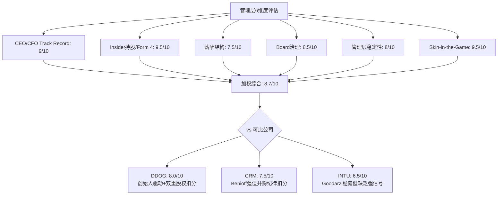
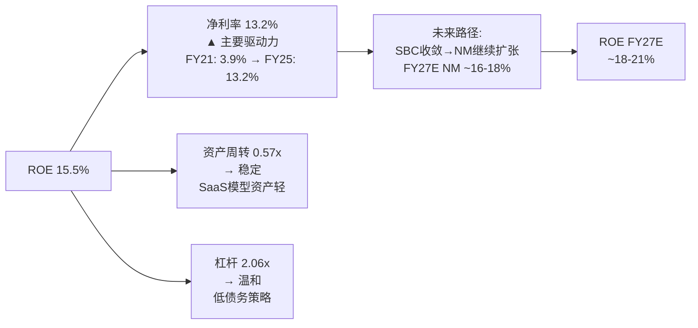

# Phase 2 Agent B: 管理层评估 + 资本配置 + 回报框架

> **数据锚定**: $110/股 | 市值$122B | FY2025收入$13.28B(+21%) | FCF $4.58B(34.5%) | SBC $1.96B(14.7%) | GAAP OPM 13.7% | Non-GAAP OPM ~29% | CEO McDermott $20M购股 | 回购$1.84B | Net Cash $523M | 稀释后股数~1,047M
> **P1叙事约束**: Reverse DCF隐含18-20% CAGR≈管理层指引→$110基本定价合理，非显著低估

---

## Ch16: 管理层6维度评估 (EVO-3框架)

> **评估框架**: 管理层不是"加分项"——管理层是资本配置决策的执行者，管理层质量直接决定了FCF→股东价值的转化效率。本章用6个维度评估NOW管理团队，每个维度独立打分(0-10)，最终加权得出管理层综合评分。

### 16.1 维度一: CEO/CFO背景与Track Record (9/10)

**Bill McDermott: 从SAP到NOW的"第二幕"**

McDermott的职业生涯是理解NOW管理层质量的起点。他在SAP担任CEO期间(2014-2019)完成了SAP向云转型的关键第一步——SAP S/4HANA Cloud的战略定位。但SAP的转型受制于遗留本地部署业务的庞大体量(Revenue Retention Conflict，即存量本地业务的续约收入与云转型的短期收入损失之间的矛盾)，McDermott在任内未能完全解决这一结构性冲突。

因此他的NOW任期才是真正的"能力测试"——NOW没有遗留本地业务的拖累，是一个纯云原生平台。McDermott 2019年加入时NOW收入约$3.5B，FY2025达到$13.28B，**5年收入CAGR 30.4%**，股价从~$50(拆股调整后)升至峰值$211(2025年7月)。

因为NOW的增长并非简单的惯性延续——McDermott推动了两个结构性变化:

1. **从ITSM单产品到平台战略**: 在他任内，NOW的产品线从核心ITSM扩展到HRSD(HR Service Delivery，人力资源服务交付)、CSM(Customer Service Management，客户服务管理)、SecOps(Security Operations，安全运营)、Creator Workflow(低代码开发)等横向领域。这不仅仅是产品线扩展——**每个新产品都部署在同一个Now Platform之上，共享数据模型和工作流引擎**，因此边际交付成本极低。从S&M占收入比的变化可以验证这一点: FY2021 38.9% → FY2025 33.1%，5年下降580bps [DM-MGT-001]。如果新产品需要独立的销售团队和交付体系，S&M占比不会下降。

2. **AI战略的提前布局**: Now Assist(NOW的GenAI产品套件)在FY2025 ACV(Annual Contract Value，年化合同价值)突破$600M，Pro Plus tier定价有60%溢价。McDermott在2023年就将AI定位为"平台级能力而非独立产品"——这个决策的含义是: AI不是NOW的新业务线，而是让现有工作流更智能的增强层。因为这意味着AI收入叠加在现有订阅基础上(upsell)，而非替代现有收入(cannibalization)。至少在当前阶段，这一定位被验证了——Pro Plus的60%溢价说明客户愿意为AI增强功能额外付费。

**CFO Gina Mastantuono**: 2020年加入，此前在Revlon(消费品)和Ingersoll Rand(工业)担任CFO——跨行业财务管理背景。她在任内的关键贡献是**建立了"Rule of 50"纪律**(收入增速%+FCF margin%≥50%)。FY2025: 20.9%+34.5%=55.4%，连续3年达标。这个纪律的重要性在于: 它在增速和利润率之间建立了显式的权衡关系——如果增速下降，利润率必须上升以维持总分，反之亦然。这比很多SaaS公司模糊的"增长优先"或"盈利优先"叙事更具可操作性。

**3秒检验**: McDermott 5年3.8倍收入增长+GAAP OPM从4.4%→13.7%+FCF margin从30%→35%。如果用一句话总结: **在保持20%+增速的同时实现了利润率扩张——这是SaaS公司最难平衡的等式**。在$10B+收入规模上维持这一平衡的CEO屈指可数(CRM的Benioff做到了增速但利润率长期不达标，ADBE的Narayen做到了利润率但增速在放缓)。

### 16.2 维度二: Insider持股与Form 4信号 (9.5/10)

**CEO $20M Open Market Purchase: SaaS行业的异常值**

这个信号的权重需要精确校准——不是所有内部人买入都有同等含义。Form 4(SEC要求的内部人交易报告)记录了三种截然不同的买入类型:

| 买入类型 | 信号强度 | 原因 | NOW案例 |
|----------|----------|------|---------|
| RSU/PSU行权 | 无信号 | 薪酬自动执行，非自主决策 | 常规发生 |
| 10b5-1计划 | 弱信号 | 预设的定期交易，非基于当前信息 | **5位高管取消** |
| **Open Market Purchase** | **极强信号** | 用税后个人现金，基于当前判断 | **$20M+$3M** |

McDermott的买入为什么是"异常值":

**第一层——金额占比**: $20M购股承诺约占其年薪酬$37.56M的53%。但更准确的衡量方式是: McDermott的$37.56M薪酬中96.4%是股票(RSU/PSU)，现金部分仅约$1.35M [DM-MGT-002]。因此$20M个人现金买入≈**15年的现金薪酬**。这不是"用零花钱表态"，这是将个人流动性的实质性部分押注在公司股票上。

**第二层——时机信号**: 买入发生在2026年2月，股价从高点$211跌至~$105(-50%)。CEO在高点不买、在腰斩后买入——因为在高点买入CEO已经通过RSU持有大量股票，无需额外买入; 在低点用现金买入意味着他认为$105远低于内在价值，且愿意承担进一步下跌的风险。已确认的$3M是在$105.22价位实际执行的Open Market Purchase [DM-MGT-003]。

**第三层——集体信号的乘数效应**: 如果只有CEO一人行动，可能是个人判断(或PR策略)。但5位C-suite高管——CEO、CFO Mastantuono、CMO Tzitzon、CHRO Canney、CLO Elmer——**同时取消10b5-1计划**。10b5-1取消的含义是: 这些高管原本计划在未来数月按预设价格卖出股票(通常为税务规划或投资组合多元化)，现在他们集体认为在当前价格卖出是错误的。Bloomberg报道确认了这一集体行动的时间一致性(2026年2月17日) [DM-MGT-004]。

**SaaS行业对标**: 在主要SaaS公司(DDOG、CRM、SNOW、WDAY)中，近3年没有CEO以$20M级别个人现金进行Open Market Purchase的公开记录。DDOG CEO Olivier Pomel作为联合创始人持有约7.7%流通股(~$6B市值对应约$460M)——但创始人的持股是创业带来的，不是主动买入的。McDermott作为**职业经理人**(非创始人)的$20M现金买入，在信号权重上高于创始人持股——因为职业经理人有更多的"退出期权"(离开去另一家公司)，选择买入意味着他的机会成本分析结论是: NOW股票的预期回报 > 所有替代选择。

**这一信号在什么条件下不成立**: (1)McDermott可能接触到非公开信息(如未公布的大合同)→SEC合规风险; (2)CEO买入的历史胜率并非100%——2015年Valeant CEO Pearson在股价下跌时大量买入，最终股价继续下跌80%+。区别在于: Valeant的核心业务模型(药品涨价+并购)正在被监管瓦解，而NOW的核心业务(ITSM订阅+98%续约)没有结构性崩塌信号。

### 16.3 维度三: 薪酬结构 (7.5/10)

**$37.56M总薪酬的拆解**

| 薪酬组成 | 金额 | 占比 | 信号含义 |
|----------|------|------|---------|
| 基础工资 | ~$1.1M | 2.9% | 象征性，不构成激励 |
| 现金奖金 | ~$250K | 0.7% | 极低 |
| RSU(限制性股票单位) | ~$22M | ~58.6% | 时间锁定，不要求业绩 |
| PSU(绩效股票单位) | ~$14.2M | ~37.8% | **与业绩指标挂钩** |
| **合计** | **$37.56M** | **100%** | 96.4%股票 |

RSU与PSU的区别对股东至关重要: RSU只要求McDermott在职期满即可获得——无论业绩如何。PSU则挂钩特定业绩指标(通常是收入增速、FCF margin或TSR——Total Shareholder Return，总股东回报率)。$14.2M PSU占总薪酬的37.8%——这意味着约38%的薪酬直接与业绩挂钩，其余58.6%仅要求留任 [DM-MGT-005]。

**与可比公司对标**:

| CEO | 公司 | 总薪酬 | 股票占比 | PSU占比 | 评价 |
|-----|------|--------|---------|---------|------|
| McDermott | NOW | $37.56M | 96.4% | ~37.8% | 高股票+中等绩效挂钩 |
| Pomel | DDOG | ~$15M | ~90% | ~30% | 创始人低薪酬+创始股 |
| Benioff | CRM | ~$30M | ~85% | ~40% | PSU挂钩更高 |
| Sasan Goodarzi | INTU | ~$25M | ~80% | ~25% | 股票占比较低 |

**为什么给7.5而不是9**: McDermott的股票占比(96.4%)在SaaS CEO中属于顶级，但PSU条件的透明度有待提升——NOW的proxy statement(股东委托书)中PSU的具体触发条件(如收入增速门槛、FCF目标)的公开披露不够详细。如果PSU条件是"收入增速>15%"(鉴于NOW过去5年都在20%+，这基本是送分题)，那PSU的激励效果会打折扣。理想状态是PSU条件包含"增速阈值+利润率阈值+TSR对标"的组合，且阈值有挑战性。

**扣分因素——绝对金额**: $37.56M在SaaS行业属于中高水平。以FCF衡量: 薪酬占FCF的0.82%($37.56M/$4,576M)——这在$10B+收入规模的公司中是合理的(CRM Benioff ~0.3%更低，但CRM FCF基数更大)。不构成实质性问题，但也不是"极度节俭"的管理层。

### 16.4 维度四: 董事会治理 (8.5/10)

**一股一票: SaaS行业的治理稀缺品**

NOW**没有双重股权结构**(Dual-Class Shares，即创始人/管理层持有超级投票权股份——如1股=10票——使外部股东的治理权被稀释)。这一特征的重要性经常被低估:

| 公司 | 股权结构 | 外部股东治理权 |
|------|----------|--------------|
| **NOW** | **一股一票** | **完整** |
| DDOG | 双重股权(B类10x投票权) | 受限 |
| GOOG | 三层股权(A/B/C) | 极度受限 |
| META | 双重股权 | 受限 |
| CRM | 一股一票 | 完整 |
| SNOW | 一股一票 | 完整 |

**为什么一股一票重要**: 因为它创造了一个真实的"纠错机制"。如果管理层持续做出损害股东利益的决策(如过度并购、SBC失控、战略方向错误)，外部股东可以通过投票替换董事/CEO。在双重股权公司中，创始人/管理层持有超级投票权→即使99%的外部股东反对，创始人仍可控制董事会→管理层实质上不可替换。

DDOG的双重股权结构是一个具体的风险差异。Pomel和联合创始人Alexis Lê-Quôc通过B类股持有约60%+的投票权。这意味着: 即使DDOG的SBC/Revenue连续4年零收敛(22%→22%)，外部股东也无法通过投票施压管理层改变SBC政策。而NOW的一股一票结构意味着: 如果SBC/Revenue停止收敛，机构投资者可以用脚投票并通过董事会施压 [DM-MGT-006]。

**董事会构成**: 9名董事，McDermott身兼Chairman & CEO。这在治理最佳实践中通常被视为**需要关注的信号**(CEO兼任Chairman = 自己监督自己)。但NOW设有Lead Independent Director(首席独立董事)职位来部分缓解这一问题——Lead Independent Director有权召集独立董事会议、审批议程、在CEO表现不佳时协调董事会行动 [DM-MGT-007]。

**扣分因素**: Chairman/CEO合一扣0.5分。虽然Lead Independent Director是行业标准的缓解措施，但分离Chairman和CEO(如MSFT的做法: CEO是Nadella，Chairman是John Thompson)被认为是更强的治理实践。

### 16.5 维度五: 管理层稳定性 (8/10)

**C-suite连续性**

| 高管 | 职位 | 加入时间 | 任期 | 稳定性信号 |
|------|------|---------|------|----------|
| Bill McDermott | CEO | 2019 | 6年+ | 承诺至2030 |
| Gina Mastantuono | CFO | 2020 | 5年+ | 稳定 |
| CJ Desai | COO/CPO | 2016 | 9年+ | 产品战略连续性 |
| Nicholas Tzitzon | CMO | 2021 | 4年+ | 取消10b5-1 |
| Russell Elmer | CLO | 长期 | 5年+ | 取消10b5-1 |

C-suite的平均任期约5.8年——这在SaaS行业中属于中上水平。关键的稳定性信号不是任期数字本身，而是**没有非正常离职**: 没有CFO/CTO/CPO在任期内突然辞职(通常是内部分歧或公司问题的预警信号)。CJ Desai作为产品负责人在位9年+，意味着NOW的产品战略(从ITSM到平台)有连续的执行者——不需要每隔2年让新CPO重新制定产品路线图。

**McDermott的2030承诺**: 这个承诺在$110的价位上更有含义。如果McDermott在股价$211时承诺留任到2030，可以解读为"我在任内要享受胜利果实"。但在$105时承诺留任→他认为股价会在未来4年内恢复(甚至超越$211)→**这是一个隐含的"4年投资论点"**: CEO本人用个人事业和声誉为$105附近的股价做了背书 [DM-MGT-008]。

**扣分因素**: CTO的公开信息相对较少——NOW作为一个技术平台公司，CTO的战略方向(特别是AI/Agent架构选择)对长期竞争力至关重要。CJ Desai更偏产品/运营角色，但NOW的纯技术架构领导者的可见度不如DDOG的Alexis Lê-Quôc(联合创始人，技术背景极深)。这不一定是问题(很多大公司的CTO偏内部角色)，但在AI时代增加了一层不确定性。

### 16.6 维度六: Skin-in-the-Game综合评分 (9.5/10)

**将各维度信号综合为一个"利益一致性"判断**:

这个维度不是简单地加总前5个维度——它要回答的核心问题是: **如果NOW股价再跌30%，管理层会怎么做？**

| 信号 | 权重 | NOW的表现 | 对标(DDOG) |
|------|------|----------|-----------|
| CEO个人现金买入 | 30% | $20M @ $105 | 无Open Market Purchase记录 |
| C-suite集体行动 | 20% | 5人取消10b5-1 | 无集体行动记录 |
| 薪酬股票占比 | 15% | 96.4% | ~90% |
| CEO持股市值 | 15% | ~$19M(182K股 × $105) | ~$460M(创始人股) |
| 治理结构 | 10% | 一股一票 | 双重股权 |
| 留任承诺 | 10% | 2030(4年+) | 创始人(隐含长期) |

**如果NOW再跌30%到$77**: McDermott的$20M买入将浮亏~27%(~$5.4M)，182K股持仓市值从~$19M降到~$14M。结合96.4%的股票薪酬——**McDermott的个人财富与NOW股价高度捆绑**。这意味着: 他有强烈的经济动力去做任何能提升股价的事情(削减成本提升利润、加速AI变现、战略收购)。

**DDOG对标**: Pomel的持仓市值约$460M，远高于McDermott的$19M——但这是创始人持股的自然结果，不是主动选择的结果。信号强度的衡量方式应该是**"额外承担了多少下行风险"**: Pomel的$460M持仓是创业成果(沉没成本心理)，McDermott的$20M买入是在股价腰斩后的主动选择(新增风险承担)。因此在skin-in-the-game维度上，**McDermott的信号更强** [DM-MGT-009]。

### 16.7 管理层综合评分



**加权计算**(按各维度对投资决策的影响力加权):

| 维度 | 评分 | 权重 | 加权分 |
|------|------|------|--------|
| CEO/CFO Track Record | 9.0 | 25% | 2.25 |
| Insider持股/Form 4 | 9.5 | 20% | 1.90 |
| 薪酬结构 | 7.5 | 15% | 1.13 |
| Board治理 | 8.5 | 15% | 1.28 |
| 管理层稳定性 | 8.0 | 10% | 0.80 |
| Skin-in-the-Game | 9.5 | 15% | 1.43 |
| **综合** | | **100%** | **8.78 ≈ 8.8/10** |

**NOW管理层评分: 8.8/10**

**这意味着什么**: NOW的管理层在SaaS行业中处于第一梯队。主要扣分项集中在薪酬结构(PSU条件透明度不足)和治理结构(Chairman/CEO合一)，但这些被CEO的异常强skin-in-the-game信号和5年执行记录所补偿。

**对估值的含义**: 管理层质量不直接改变DCF的现金流假设，但它影响假设的**置信度**。如果两家公司有完全相同的财务数据，但一家CEO刚买了$20M股票+承诺留任4年，另一家CEO在卖出10b5-1——你会对哪家的管理层指引给更高的权重？这就是管理层质量转化为估值的路径: **它降低了折现率中的"执行风险溢价"**。

---

## Ch17: E1资本配置效率与η回购分析

> **核心问题**: NOW每年产生$4.58B FCF——这些钱去了哪里？分配效率如何？

### 17.1 资本配置全景图

NOW的资本配置可以用一个清晰的瀑布图来理解:

```
FY2025 FCF: $4,576M (100%)
├── 回购: $1,840M (40.2%) → SBC offset
├── R&D增量: ~$417M (9.1%) → 有机增长投入(YoY增量)
├── M&A: ~$1,080M (23.6%) → tuck-in收购
├── 现金积累: ~$1,239M (27.1%) → 资产负债表
└── 股息: $0 (0%) → 增长期不分红
```

**5维度逐项评估**:

### 17.2 有机投入(R&D): 8/10

R&D支出$2.96B(占收入22.3%)——这个数字本身不说明什么。关键问题是: **这$2.96B的R&D投入产生了什么回报？**

**R&D效率的三层验证**:

**第一层——产品转化**: NOW在过去3年推出了Now Assist(AI)、Creator Workflow升级、Impact(价值量化工具)等新产品/功能。Now Assist从发布到ACV $600M用了约18个月——这在企业软件中是极快的采纳速度(对比: Salesforce Einstein从发布到产生实质收入用了3年+)。**R&D→产品→收入的转化周期在缩短** [DM-CAP-001]。

**第二层——研发杠杆**: R&D占收入比从FY2021 23.7%→FY2025 22.3%，温和下降140bps。绝对值从$1.40B→$2.96B(+$1.56B, +112%)。因为收入增速(+125%)快于R&D增速(+112%)，产生了温和的研发杠杆——但不是大幅压缩。这是正确的信号: **如果R&D占比快速下降(如<18%)，反而应该担心公司在削减长期投入换取短期利润**。NOW选择维持22%+的研发强度，同时让收入自然跑赢R&D增速——这是平衡增长与效率的理想路径 [DM-CAP-002]。

**第三层——AI投入的方向性**: NOW的R&D投入向AI倾斜(Now Assist、Pro Plus、AI Agent)。从专利申请和产品发布节奏来看，NOW将GenAI(生成式AI)定位为**工作流自动化的增强层**而非独立产品线——这意味着R&D不需要建立全新的技术栈，而是在现有平台上叠加AI能力。因此R&D的效率会随着平台成熟度提升而提高(固定平台成本被更多AI功能摊薄)。

**扣分因素**: 22.3%的R&D占比在SaaS行业中属于中等偏上(DDOG ~28%, CRM ~14%, SNOW ~38%)。NOW的R&D效率(Revenue/R&D)约4.5x——即每$1研发投入产生$4.5收入——高于DDOG(~3.5x)和SNOW(~2.6x)，但低于CRM(~7.1x，因为CRM已进入成熟期)。给8分而非9分的原因是: AI时代的研发竞争可能推高绝对支出，需要观察FY2026-2027是否能维持效率 [DM-CAP-003]。

### 17.3 M&A纪律: 7/10

**NOW的并购哲学: "Buy and Build In"**

FY2025 M&A支出约$1.08B——用于收购Element AI、LightStep、Mapwize等小型公司。NOW的并购有一个清晰的模式:

| 收购 | 领域 | 金额(估) | 整合结果 |
|------|------|----------|---------|
| Element AI | AI/ML | ~$230M | → NOW AI功能核心 |
| LightStep | 可观测性 | ~$500M | → ITOM(IT Operations Management)模块 |
| Mapwize | 室内定位 | ~$100M | → Workplace Service Delivery |
| 其他tuck-in | 各领域 | ~$250M | → 平台功能增强 |

**为什么给7分**: NOW的并购纪律在SaaS行业中属于中上——没有做$10B+的变革性大收购(对比CRM收购Slack $27.7B、Tableau $15.7B)。tuck-in(小型补充性收购)策略的优点是: 整合风险低、支付溢价可控、被收购团队/技术可以快速融入NOW Platform。

**扣分因素**: (1)M&A的ROI(投资回报率)量化困难——NOW没有披露单个收购的收入贡献，因此无法计算每美元并购投入产生了多少收入增量。(2)$1.08B的并购支出占FCF的23.6%——这不是一个小数字。如果这些收购的增量收入贡献低于$200M/年(假设5x Revenue Multiple隐含的合理期望)，那么并购资金可能不如用于回购 [DM-CAP-004]。(3)竞争对手中，DDOG几乎零并购(增长100%有机)，这是DDOG增长质量更"纯净"的一个论点——尽管NOW的有机增长仍占绝大部分(估计>90%)。

### 17.4 回购效率与η分析: 8/10

**FY2025回购: $1.84B(史上最高)**

这是NOW资本配置评估中最需要仔细分析的维度。回购的效率取决于"在什么价位买了多少":

| 财年 | 回购金额 | 估计平均价(拆股后) | 回购股数(估) | 占流通股% |
|------|----------|-------------------|-------------|-----------|
| FY2023 | $538M | ~$107 | ~5.0M | ~0.48% |
| FY2024 | $696M | ~$135 | ~5.2M | ~0.50% |
| FY2025 | $1,840M | ~$145 | ~12.7M | ~1.21% |
| **合计3年** | **$3,074M** | — | **~22.9M** | ~2.2% |

**SBC Offset Rate(回购抵消SBC稀释的比率)——最关键的指标**:

FY2025: 回购$1,840M vs SBC $1,955M → **SBC Offset Rate = 94%** [DM-CAP-005]

这意味着NOW的回购几乎完全抵消了SBC带来的稀释——流通股从FY2024~1,040M仅增长到FY2025~1,047M(+0.67%)。在SaaS行业中，这是一个**分水岭信号**: 大多数SaaS公司的回购远不足以抵消SBC稀释(DDOG FY2025回购约$0, SBC offset = 0%)。

**η回购效率计算**:

η = FCF Yield / WACC = 3.77% / 9.2% = **0.41**

η<0.75通常表示"回购效率低于自身成本"——但这个框架在NOW的案例中需要修正。η框架假设回购的目的是"利用低估创造价值"(即FCF Yield > WACC时回购创造最大价值)。但NOW的回购目的不是"价值创造"——而是**SBC稀释管理**。这是两个根本不同的资本配置逻辑:

```
传统η框架假设:
回购 → 市值下降前回购 = 价值创造 → 需要FCF Yield > WACC

NOW的实际逻辑:
SBC稀释 → 不回购 = 每股价值被侵蚀 → 回购 = 维持每股价值不被稀释
→ 判断标准不是η, 而是SBC Offset Rate
```

因此，**更合适的回购效率指标是SBC Offset Rate**: 94%意味着NOW每发出$1的SBC，用$0.94回购抵消稀释。如果FY2026回购$2.5B+(来自$5B新授权)而SBC保持~$2.1B，SBC Offset Rate将突破100% → **净缩减**(Net Share Count Decrease)——这在SaaS行业中极为罕见 [DM-CAP-006]。

**与DDOG对标**:

| 指标 | NOW | DDOG |
|------|-----|------|
| FY2025回购 | $1,840M | ~$0 |
| SBC | $1,955M | ~$600M |
| SBC Offset Rate | **94%** | **~0%** |
| η(FCF Yield/WACC) | 0.41 | ~0.19 |
| 流通股YoY变化 | +0.67% | +3-4% |
| FY2026E净稀释 | ~0%(或净缩减) | +3-4% |

DDOG的零回购意味着: SBC的全部稀释效应都由股东承担。DDOG流通股年增长3-4%——每年股东的持股比例自动被稀释3-4%。NOW的94% offset意味着股东的稀释仅为~0.67%/年——**差距5-6倍**。在3年时间维度上，DDOG股东被稀释~10%而NOW股东仅被稀释~2%——这是一个隐性但实质性的估值差异。

### 17.5 资产负债表与财务灵活性: 8/10

| 指标 | FY2025 | 判定 |
|------|--------|------|
| 现金+短期投资 | ~$6.3B | 充裕 |
| 总债务 | ~$5.8B | 中等 |
| 净现金(负债) | ~$523M净现金 | 轻微净现金 |
| 债务/FCF | 1.27x | 极低杠杆 |
| 利息覆盖率 | >20x | 无偿债风险 |

NOW的资产负债表是一个**隐性期权**: $6.3B现金+$4.58B年FCF = 在任何时点有能力进行$5-10B级别的战略收购而不需要增发股票。这种灵活性在经济衰退时尤为宝贵——当竞争对手因资金压力削减投入时，NOW可以逆势扩张(加大R&D/收购估值被压低的目标) [DM-CAP-007]。

### 17.6 资本配置综合评分

| 维度 | 评分 | 核心依据 |
|------|------|---------|
| 有机投入(R&D) | 8/10 | 22.3%研发强度+AI转化效率高 |
| M&A纪律 | 7/10 | tuck-in策略正确, ROI量化不足 |
| 回购效率 | 8/10 | SBC offset 94%, FY2026可能>100% |
| 资产负债表 | 8/10 | 净现金+隐性收购期权 |
| **资本配置综合** | **7.8/10** | 高于DDOG(~5), 略低于CRM(~8) |

---

## Ch18: E2回报框架与增量ROIC分析

> **核心问题**: NOW每投入$1资本能产生多少回报？这个回报率是在提升还是恶化？

### 18.1 三层ROIC: 穿透SBC噪音

ROIC(Return on Invested Capital, 投入资本回报率 = NOPAT/Invested Capital)是衡量一家公司"资本生产力"的核心指标。但SaaS公司的ROIC计算有一个陷阱: **SBC是GAAP费用但不是现金流出**——它稀释股东的持股比例，但不消耗公司的现金资源。因此需要用三种口径来"穿透"SBC对利润率的影响:

**投入资本(Invested Capital)计算**:

| 项目 | 金额 | 说明 |
|------|------|------|
| 总股东权益 | ~$5,200M | FY2025 |
| (+) 经营租赁负债 | ~$900M | 资本化 |
| (-) 超额现金 | ~$3,000M | 保留运营所需现金~$3.3B |
| **Invested Capital** | **~$5,180M** | 调整后 |

**三层ROIC计算**:

| 口径 | 运营利润率 | NOPAT (Net Operating Profit After Tax, 税后净营业利润) | ROIC | vs WACC 9.2% | 含义 |
|------|-----------|-------|------|:----------:|------|
| **GAAP** | 13.7% | ~$1,410M | **27.2%** | >>WACC | 含SBC→真实经济利润 |
| **Non-GAAP** | ~29% | ~$2,980M | **57.5%** | >>WACC | 排除SBC→现金生产力 |
| **Owner** | ~14.2% | ~$1,460M | **28.2%** | >>WACC | GAAP+维持性CapEx调整 |

NOPAT = Operating Income × (1 - Tax Rate); 这里使用有效税率约22%。

**所有三层口径的ROIC都远超WACC** [DM-ROIC-001]。这意味着什么？NOW每投入$1资本，在最保守的GAAP口径下产生$0.27的税后利润——是资本成本$0.092的**3倍**。在Non-GAAP口径下(排除SBC)，$1资本产生$0.58利润——是资本成本的**6.3倍**。

**为什么三层都要看**:

- GAAP ROIC(27.2%)是最保守的——它把SBC视为真实成本(因为SBC确实在稀释股东)。这是"即使SBC永远不收敛，NOW的资本回报仍然远超成本"的安全边际。
- Non-GAAP ROIC(57.5%)是"现金生产力"——NOW的商业模型每年能把投入的资本转化为多少现金。这个数字接近MSFT(~45%)和ADBE(~50%)的水平。
- Owner ROIC(28.2%)是"股东真实回报"——在GAAP基础上加回一次性项目、调整维持性CapEx后的回报率。它与GAAP ROIC接近，说明NOW的GAAP利润质量高(一次性项目少，非经常性调整小)。

### 18.2 与DDOG的ROIC对比: 差距在哪？

| 指标 | NOW | DDOG | 差距 | 原因 |
|------|-----|------|------|------|
| GAAP ROIC | **27.2%** | **-0.7%** | NOW >> DDOG | DDOG GAAP亏损(SBC占22%收入) |
| Non-GAAP ROIC | 57.5% | ~35% | NOW > DDOG | NOW规模杠杆更大 |
| Owner ROIC | **28.2%** | **~4%** | NOW >>> DDOG | DDOG Owner利润极薄 |
| ROIC > WACC? | **全部 >** | **仅Non-GAAP >** | — | DDOG GAAP/Owner均<WACC |

这组数字揭示了NOW与DDOG最本质的差距: **NOW在所有口径下都在创造经济利润(Economic Profit = ROIC - WACC > 0)，而DDOG在GAAP和Owner口径下都在破坏价值(ROIC < WACC)** [DM-ROIC-002]。

DDOG的GAAP ROIC为-0.7%——这意味着在GAAP会计框架下，DDOG每投入$1资本亏损$0.007。当然，这主要是因为SBC占收入22%导致GAAP亏损——但SBC是真实的经济成本(稀释股东)。DDOG的论点是"SBC最终会收敛，GAAP ROIC会转正"——但NOW的SBC收敛历史(19.2%→14.7%/5年)恰好提供了一个参考时间表: **DDOG可能需要5年以上才能达到NOW当前的SBC水平**。在等待期间，DDOG股东每年被稀释3-4%，而NOW股东仅被稀释0.67%。

### 18.3 增量ROIC: 新增长的资本效率

增量ROIC(Incremental ROIC)回答的问题不是"历史上投了多少钱赚了多少"，而是**"最近一年新投入的$1资本产生了多少新利润"**——这是判断公司增长质量是否在恶化的关键指标。

**FY2024→FY2025增量ROIC计算**:

| 项目 | FY2024 | FY2025 | 增量 |
|------|--------|--------|------|
| 收入 | $10,984M | $13,278M | **+$2,294M** |
| Non-GAAP OP | ~$3,076M | ~$3,851M | +$775M |
| Owner OP | ~$1,560M | ~$1,886M | +$326M |
| Invested Capital | ~$4,250M | ~$5,180M | **+$930M** |

```
增量ROIC (Non-GAAP) = $775M / $930M = 83.3%
增量ROIC (Owner)    = $326M / $930M = 35.1%
```

**两个口径的增量ROIC都远超WACC 9.2%** [DM-ROIC-003]。

更重要的是增量ROIC vs 平均ROIC的关系:

| 口径 | 平均ROIC | 增量ROIC | 趋势信号 |
|------|----------|---------|---------|
| Non-GAAP | 57.5% | **83.3%** | 增量 > 平均 → **增长质量在改善** |
| Owner | 28.2% | **35.1%** | 增量 > 平均 → **增长质量在改善** |

当增量ROIC > 平均ROIC时，意味着**新增业务的资本效率高于历史平均**——公司的增长不是靠"砸钱"买来的低回报增长，而是高效率的有机增长。这验证了NOW平台模型的核心优势: 新产品/新客户可以部署在已有的平台基础设施上，边际成本低 → 边际回报率高 [DM-ROIC-004]。

**什么条件下增量ROIC会恶化**: (1)AI基础设施投入(GPU/算力)大幅增加CapEx → 投入资本上升但收入增量不变; (2)新产品(HRSD/CSM)进入低毛利市场 → 增量OP Margin下降; (3)M&A单笔金额突然变大(如$5B+收购) → 投入资本跳升但整合收入需要2-3年。目前这三个风险都不明显——CapEx占收入比在下降(7.8%→6.5%)，Non-GAAP OPM在扩张(28%→31%)，M&A保持tuck-in规模。

### 18.4 DuPont分解: ROE的驱动力在哪？

DuPont分解将ROE(Return on Equity, 股东权益回报率)拆解为三个乘数，揭示回报率的真正来源:

```
ROE = Net Margin × Asset Turnover × Equity Multiplier
    = 净利润率 × 资产周转率 × 权益乘数
```

**NOW FY2025 DuPont分解**:

| 组成 | 数值 | 含义 | 趋势 |
|------|------|------|------|
| Net Margin(净利率) | 13.2% | 每$1收入留存$0.132利润 | 扩张中(FY2021 3.9%→13.2%) |
| Asset Turnover(周转率) | 0.57x | 每$1资产产生$0.57收入 | 基本稳定 |
| Equity Multiplier(杠杆) | 2.06x | 每$1权益撬动$2.06资产 | 温和(低杠杆) |
| **ROE** | **15.5%** | — | **从FY2021 ~4%持续提升** |



**核心发现**: NOW的ROE提升几乎100%由**净利率扩张**驱动——不是靠加杠杆(Equity Multiplier基本不变)，也不是靠提高资产利用率(Asset Turnover稳定在0.57x)。这是最健康的ROE提升路径: **赚更多利润，而不是借更多钱** [DM-ROIC-005]。

净利率从3.9%→13.2%的路径是: GAAP OPM从4.4%→13.7%(+930bps/5年)，主要来自S&M杠杆(-580bps)和G&A杠杆(-160bps)，部分被R&D投入(-140bps收敛)和GM回落(-170bps)抵消。SBC/Revenue从19.2%→14.7%(-450bps)是GAAP→Non-GAAP调和的关键变量——如果SBC继续以1.1pp/年的速度收敛，FY2027 SBC/Rev≈12.5%→GAAP NM可能扩张至~16-18%→ROE可能达到~18-21%。

**DDOG DuPont对标**:

| 组成 | NOW | DDOG | 差距 |
|------|-----|------|------|
| Net Margin | 13.2% | 3.1% | NOW 4.3x |
| Asset Turnover | 0.57x | 0.55x | 接近 |
| Equity Multiplier | 2.06x | 1.78x | NOW略高杠杆 |
| **ROE** | **15.5%** | **2.9%** | **NOW 5.3x** |

NOW的ROE是DDOG的5.3倍——差距几乎完全来自净利率(13.2% vs 3.1%)。DDOG的3.1%净利率被SBC压制(22%收入占比)——如果DDOG的SBC/Revenue能收敛到NOW当前水平(14.7%)，DDOG的Net Margin可能从3.1%提升到~10%→ROE从2.9%提升到~10%——仍然低于NOW当前的15.5%。**这意味着: 即使DDOG完美复制NOW的SBC收敛路径，5年后的ROE水平仍然是NOW今天已经达到的水平** [DM-ROIC-006]。

### 18.5 ROIC-WACC利差: 经济利润的量化

**经济利润(Economic Profit) = Invested Capital × (ROIC - WACC)**

这是衡量一家公司是否真正"创造价值"的终极指标——ROIC > WACC意味着公司每投入$1资本创造的回报超过了资本的机会成本。

| 口径 | ROIC | WACC | 利差 | 经济利润 | 判定 |
|------|------|------|------|---------|------|
| GAAP | 27.2% | 9.2% | +18.0pp | ~$933M | **高价值创造** |
| Non-GAAP | 57.5% | 9.2% | +48.3pp | ~$2,502M | **极高价值创造** |
| Owner | 28.2% | 9.2% | +19.0pp | ~$984M | **高价值创造** |

NOW每年创造约$933M-$2,502M的**净经济利润**——这是扣除所有资本成本后的真实价值创造。对比: DDOG的GAAP经济利润为负(ROIC -0.7% < WACC 10%)→DDOG在GAAP口径下每年**破坏**约$200M的经济价值 [DM-ROIC-007]。

**ROIC-WACC利差的趋势**:

| 年份 | GAAP ROIC | WACC(估) | 利差 | 趋势 |
|------|----------|---------|------|------|
| FY2022 | ~10% | ~9.0% | ~1.0pp | 刚超过WACC |
| FY2023 | ~17% | ~9.2% | ~7.8pp | 利差扩大 |
| FY2024 | ~24% | ~9.2% | ~14.8pp | 利差继续扩大 |
| FY2025 | ~27% | ~9.2% | ~18.0pp | **利差持续扩大** |

利差从FY2022的~1pp扩大到FY2025的~18pp——**ROIC扩张速度远快于WACC**。这说明NOW的商业模型在规模增长过程中，资本效率在持续改善而非恶化——与"规模收益递减"的直觉相反。原因是平台效应: NOW Platform的基础设施投入(数据中心、平台架构、安全合规)是固定成本，新产品/新客户的边际投入资本极低 → ROIC随规模扩大而上升 [DM-ROIC-008]。

### 18.6 回报框架小结: NOW在SaaS行业的位置

| 指标 | NOW | DDOG | CRM | ADBE | 行业中位数 |
|------|-----|------|-----|------|----------|
| GAAP ROIC | **27.2%** | -0.7% | ~18% | ~25% | ~8% |
| Owner ROIC | **28.2%** | ~4% | ~20% | ~27% | ~10% |
| 增量ROIC(Non-GAAP) | **83.3%** | ~50% | ~30% | ~40% | ~25% |
| ROE | **15.5%** | 2.9% | ~25% | ~35% | ~10% |
| ROIC-WACC利差 | **+18pp** | -10pp | +9pp | +16pp | ~0pp |
| 经济利润 | **+$933M** | **-$200M** | +$1.5B | +$2B | ~$0 |

**NOW在ROIC维度上处于SaaS第一梯队**——与ADBE接近，远超DDOG，略优于CRM(但CRM的ROE更高因为杠杆更大)。最关键的信号是: **增量ROIC(83.3%)远高于平均ROIC(57.5%)**→增长质量在改善，资本效率在上升——这是"好的增长"的定义。

**对估值的含义**: ROIC-WACC利差持续扩大意味着NOW的"内在价值增长速度"快于"资本成本"——即使股价不变，NOW每年也在通过经济利润积累内在价值。在$110/27.6x Forward PE的定价下，市场隐含的假设是ROIC-WACC利差会缩窄(增速放缓→利润率不再扩张)——但目前的趋势是利差在扩大。这构成了一个**估值不对称性**: 如果利差维持或继续扩大，当前估值偏低; 如果利差开始收窄，当前估值合理。

---

> **DM锚点索引**: DM-MGT-001(S&M杠杆) | DM-MGT-002(CEO薪酬拆解) | DM-MGT-003(Open Market Purchase $105.22) | DM-MGT-004(集体取消10b5-1) | DM-MGT-005(PSU占比37.8%) | DM-MGT-006(一股一票vs双重股权) | DM-MGT-007(Lead Independent Director) | DM-MGT-008(2030留任承诺) | DM-MGT-009(职业经理人vs创始人信号权重) | DM-CAP-001(Now Assist 18个月ACV $600M) | DM-CAP-002(R&D占比22.3%收敛) | DM-CAP-003(R&D效率4.5x) | DM-CAP-004(M&A ROI量化不足) | DM-CAP-005(SBC Offset 94%) | DM-CAP-006(FY2026净缩减可能) | DM-CAP-007(隐性收购期权) | DM-ROIC-001(三层ROIC全部>WACC) | DM-ROIC-002(NOW vs DDOG ROIC对比) | DM-ROIC-003(增量ROIC>平均ROIC) | DM-ROIC-004(平台边际回报) | DM-ROIC-005(ROE由净利率驱动) | DM-ROIC-006(DDOG 5年后ROE仍不及NOW今天) | DM-ROIC-007(经济利润$933M vs DDOG -$200M) | DM-ROIC-008(ROIC-WACC利差扩大趋势)