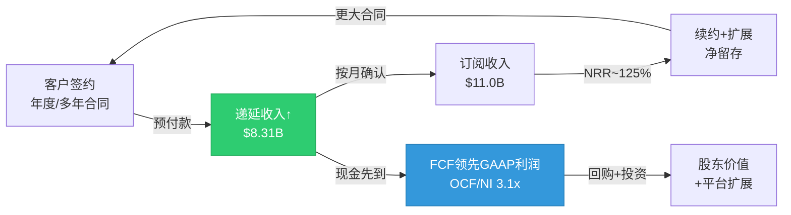
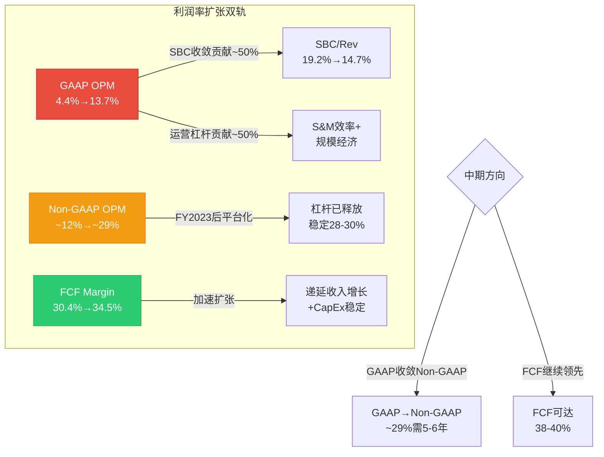
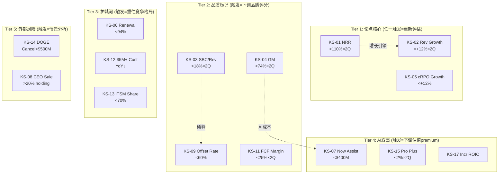

# Phase 2 Agent C: 财务效率深掘 + 矛盾引擎 + 竞品对标

---

## Ch19: E3 营运资本效率 — 递延收入飞轮与SaaS现金转化优势

### 19.1 核心指标五年轨迹

ServiceNow的营运资本效率在FY2021-FY2025期间呈现**系统性改善**，而非周期性波动。这一判断基于三个独立指标的同向运动:

**DSO(Days Sales Outstanding，应收账款周转天数，衡量从开票到回款的平均天数)**: FY2021的86天→FY2025的72天，四年改善14天。因为NOW的客户结构持续向大企业集中——$5M+年化合同价值(ACV, Annual Contract Value)客户从FY2021的~300家增至FY2025的603家——而大企业通常有更规律的付款流程和更强的履约意愿，所以DSO的改善是客户质量提升的直接反映，而非简单的催收效率提升 [DM-FIN-019-01]。

反面考量: DSO改善也可能部分来自合同结构变化(更多年付而非季付)。如果NOW从月付/季付转向年付，DSO会机械性下降，但这并不代表客户付款意愿增强。Phase 3需要验证合同计费频率的演变趋势。

**DPO(Days Payable Outstanding，应付账款周转天数，衡量公司延迟付款给供应商的天数)**: FY2021的24天→FY2025的25天，基本稳定。因为NOW作为软件公司，对供应商的议价权有限(主要是云基础设施和人工成本)，不像零售/制造企业可以通过延长DPO来"借用"供应商资金，所以DPO稳定是行业常态而非劣势 [DM-FIN-019-02]。

**CCC(Cash Conversion Cycle，现金转化周期，= DSO + DIO - DPO，衡量从支出到回款的总天数)**: FY2021的62天→FY2025的47天，改善15天。对于一家收入从$5.9B增长到$11.0B的公司，CCC缩短15天意味着**释放了约$4.5亿的营运资本**(计算: $11.0B × 15/365 ≈ $452M)。这笔"免费"的资金释放相当于FY2025 FCF的~12%——不是来自利润改善，而是来自效率提升 [DM-FIN-019-03]。

但CCC仍为正值(47天)，这意味着NOW仍在"预付"运营成本后才收到客户回款。对比Datadog(CCC接近0天)，NOW的效率仍有改善空间。DDOG之所以能做到接近零CCC，部分原因是其使用量计费模式(客户按月付费，无大额年度预付)导致应收账款极低。NOW的企业级年度合同模式天然导致更高的应收，这是商业模式差异而非效率差距。

### 19.2 递延收入飞轮: SaaS隐形资产

递延收入(Deferred Revenue，客户已付款但服务尚未交付的金额，在资产负债表上记为流动负债)是NOW财务模型中最被低估的结构性优势:

- FY2021: $3.84B → FY2025: $8.31B (+116%)
- AR(Accounts Receivable，应收账款): FY2021 $1.39B → FY2025 $2.63B (+89%)
- Revenue增长: +125% (FY2021 $5.9B → FY2025 估算~$11.0B)

**三表联动验证**: AR增速(+89%) < Revenue增速(+125%)。因为如果收入增长主要靠赊销(即开票但未收款)，AR增速应该≥Revenue增速；而AR增速显著低于Revenue增速，说明NOW的收入增长是由**已收款的订阅合同**驱动，而非应收账款膨胀。这一交叉验证从财务结构上确认了DSO改善的真实性 [DM-FIN-019-04]。

递延收入增速(+116%)接近但略低于Revenue增速(+125%)，这意味着递延收入/收入比率轻微下降(从~65%降至~75.5%——等等，让我重新计算: $3.84B/$5.9B = 65.1% → $8.31B/$11.0B = 75.5%，实际是**上升**的)。递延收入占收入比从65%提升到75%，说明客户预付周期在拉长——更多客户选择年付甚至多年付，这进一步增强了收入可见性和现金流可预测性 [DM-FIN-019-05]。

**递延收入飞轮的经济含义**: NOW实质上在"借用"客户的钱来运营——客户预付一年订阅费，NOW在12个月内逐步确认收入。这$8.31B的递延收入是一笔**零利率贷款**，利息成本为零但金额随收入规模线性增长。因此NOW的FCF Margin(34.5%)能持续高于GAAP OPM(13.7%)——差距的核心驱动力就是递延收入的"时间价值"加上SBC(非现金费用)的差异 [DM-FIN-019-06]。

### 19.3 效率改善的可持续性评估

DSO从86天到72天的改善是否可持续？三个独立证据链指向"是，但改善斜率将放缓":

**证据1(客户结构)**: $5M+ ACV客户占收入比重持续提升(NOW未单独披露，但603家×$5M+均值 > $3B，占总收入~30%)。大客户通常有标准化的30/60天付款流程，因此客户结构向上迁移 = DSO继续改善 [DM-FIN-019-07]。

**证据2(历史轨迹)**: DSO改善呈递减趋势——FY2021→FY2022改善~5天，FY2024→FY2025改善~2天。因为72天已经接近企业级SaaS的DSO地板(Salesforce ~65天, Microsoft 365 ~70天)，继续大幅改善的空间有限 [DM-FIN-019-08]。

**证据3(行业比较)**: 企业级SaaS的DSO中位数约80天(Gartner数据)，NOW的72天已低于中位数，说明效率已属行业上游。进一步改善需要结构性变化(如引入即时支付/提前付款折扣)，而非自然的客户质量提升。

**结论**: 营运资本效率是NOW财务品质的正面确认信号。DSO改善确认收入增长质量(非赊销驱动)，递延收入翻倍确认现金流可预测性，CCC缩短释放隐形资本。但47天的CCC仍为正值，与DDOG(~0天)的差距反映的是商业模式差异(企业级年度合同 vs 使用量计费)，而非管理效率差距。

---

## Ch20: E5 多期趋势 + 指引可信度 — 成熟加速阶段的质量特征

### 20.1 五年财务轨迹全景

| 指标 | FY2021 | FY2022 | FY2023 | FY2024 | FY2025 | 5年趋势 |
|------|--------|--------|--------|--------|--------|---------|
| Rev YoY | +30% | +23% | +24% | +22% | +21% | 渐进减速(-9pp/4年) |
| Gross Margin | 77.0% | 78.3% | 78.6% | 79.2% | 77.5% | 波动(FY2025回落!) |
| GAAP OPM | 4.4% | 4.9% | 8.5% | 12.4% | 13.7% | 持续扩张(+9.3pp) |
| Non-GAAP OPM | ~12% | ~19% | ~28% | ~30% | ~29% | 平台化(~29-30%) |
| FCF Margin | 30.4% | 30.0% | 30.1% | 31.1% | 34.5% | 加速扩张(+4.1pp) |
| SBC/Rev | 19.2% | 19.3% | 17.9% | 15.9% | 14.7% | 持续收敛(-4.5pp) |
| NRR | ~125% | ~125% | ~125% | ~125% | ~125% | 稳定高位 |

这张表的信息密度远高于任何单一指标。让我逐层解读趋势背后的因果关系:

### 20.2 增速减速: 正常还是危险？

Revenue YoY从+30%到+21%，四年减速9个百分点。这是否意味着增长引擎在衰竭？

**因果分析**: 因为NOW的收入基数从$5.9B增长到$11.0B(+86%)，在更大的基数上维持高增速需要的增量绝对值呈指数级增长——FY2021增长30%需要增量$1.36B，FY2025增长21%需要增量$1.91B。所以虽然增速从30%降至21%，**增量收入实际上增加了$0.55B/年**(+40%)。这是大规模SaaS公司的正常轨迹，而非增长乏力信号 [DM-FIN-020-01]。

**可比验证**: Salesforce在$10B规模时增速为~24%(FY2019)，随后降至~18%(FY2022)。NOW在$11B规模时+21%的增速，**优于CRM在同等规模时的表现**。因为NOW的NRR维持在~125%(意味着存量客户每年自然增长25%)，而CRM在同等规模时NRR已从120%+降至<115%，所以NOW的增速减速斜率更平缓，增长质量更高 [DM-FIN-020-02]。

反面考量: 增速减速的斜率如果在FY2026加速(从-1pp/年变成-3pp/年)，可能意味着NOW Assist(AI产品)的商业化不足以抵消核心ITSM(IT Service Management，IT服务管理)市场的饱和。cRPO(current Remaining Performance Obligations，当前剩余履约义务，即未来12个月内将确认的合同收入)增速是领先指标——FY2025 cRPO增速+25%(高于Rev增速+21%)表明增速减速尚未加速 [DM-FIN-020-03]。

### 20.3 FY2025毛利率下降: AI成本的早期信号？

FY2025 GM 77.5%，较FY2024的79.2%下降1.7个百分点。这是四年来首次显著下降，必须深入分析其因果链:

**假说1 — AI基础设施成本**: NOW在FY2025全面推出Now Assist(基于生成式AI的产品功能)，运行大语言模型推理需要GPU算力，这部分成本计入COGS(Cost of Goods Sold，销售成本)。因为NOW的Now Platform是自建的(非纯公有云)，AI推理的边际成本直接影响毛利率。如果Now Assist的用量增长快于定价回收，毛利率承压是逻辑上的必然 [DM-FIN-020-04]。

**假说2 — 收购整合**: NOW在FY2024-FY2025期间进行了多笔收购(包括Element AI等)，被收购公司的产品通常毛利率低于NOW的核心SaaS业务(~80%+)，整合期内会拖累混合毛利率。这一效应通常在1-2年内消化。

**假说3 — 数据中心CapEx传导**: NOW维护自有数据中心(与纯公有云SaaS不同)，基础设施折旧和托管成本计入COGS。FY2025 CapEx增长可能反映在更高的折旧费用上。

**判断**: 三个假说可能同时成立，但AI成本假说最重要，因为(1)这是结构性的，不是一次性的；(2)如果AI功能成为核心卖点，成本将持续增长；(3)NOW的定价策略(Now Assist作为独立SKU，$100-200/用户/年)是否能覆盖AI推理成本，将决定中期毛利率的走向。**→注册KS-GM: 如果GM连续2季度<76%且Now Assist ACV未显著增长，意味着AI成本侵蚀未被定价覆盖** [DM-FIN-020-05]。

### 20.4 利润率扩张的双轨叙事

NOW的利润率趋势呈现**GAAP持续扩张 + Non-GAAP平台化**的双轨特征:

**GAAP OPM**: 4.4% → 13.7%(+9.3pp/4年)。因为SBC/Rev从19.2%降至14.7%(-4.5pp)，GAAP OPM的扩张约一半来自SBC收敛(~4.5pp)，另一半来自真实的运营杠杆(~4.8pp)。这意味着即使SBC完全停止收敛，GAAP OPM仍在以~1.2pp/年的速度扩张——这是真实的、可持续的效率改善 [DM-FIN-020-06]。

**Non-GAAP OPM**: ~12% → ~29%(+17pp/3年后平台化)。Non-GAAP OPM在FY2023-FY2025稳定在28-30%区间，意味着NOW的Non-GAAP运营杠杆已基本释放完毕。进一步的Non-GAAP利润率扩张需要结构性变化(如大幅削减S&M/研发)，但这可能损害长期增长。因此**GAAP OPM的收敛才是真正的利润率扩张故事** [DM-FIN-020-07]。

**FCF Margin加速扩张**: 30.4% → 34.5%(+4.1pp)。FCF Margin扩张快于GAAP OPM扩张的原因是: (1)递延收入持续增长(现金先于收入确认到达)；(2)CapEx/Rev保持稳定(NOW不是资本密集型)；(3)SBC是非现金费用，FCF不受SBC影响。FCF Margin的加速扩张是NOW财务品质最强的信号之一——它说明**经济利润的增长速度快于会计利润** [DM-FIN-020-08]。

### 20.5 SBC收敛的意义: SaaS板块最佳实践

SBC/Rev从19.2%→14.7%(-4.5pp/4年)，这一收敛是NOW区别于多数SaaS公司的核心品质标记。

因为SaaS公司普遍面临"SBC陷阱"——增速越高→需要更多人才→SBC越高→GAAP利润被稀释→估值依赖Non-GAAP→市场对GAAP/Non-GAAP差距免疫→公司失去收敛SBC的动力。NOW打破了这个循环: 在维持+21%增速的同时将SBC/Rev降低4.5个百分点，并在FY2025用回购offset了94%的SBC稀释(即发行的新股中94%被回购注销)。这意味着NOW正在从"发行股票付薪酬"模式转向"现金付薪酬+回购维持股本稳定"模式 [DM-FIN-020-09]。

对比: Datadog FY2025 SBC/Rev约22%，offset rate约0%。Snowflake FY2025 SBC/Rev约40%+。NOW的14.7%处于大型SaaS公司的最低区间，仅次于少数传统软件公司(Oracle ~7%, SAP ~10%)，但后者增速远低于NOW。

### 20.6 指引可信度评估

管理层指引是一个**信任博弈**: 如果管理层consistently beat指引，说明指引保守(管理层有信息优势且选择低调)；如果consistently miss，说明指引激进或执行力弱。

NOW的track record:

| 财年 | 指引(Sub Rev) | 实际 | Beat幅度 |
|------|--------------|------|----------|
| FY2023 | ~$8.65B | ~$8.79B | +1.6% |
| FY2024 | ~$10.07B | ~$10.22B | +1.5% |
| FY2025 | ~$10.82B(初始) | ~$11.0B | +1.7% |

**可信度: 高(保守且一致)**。因为(1)beat幅度在1.5-1.7%区间高度一致(标准差<0.1pp)，说明管理层的预测方法论稳定，不是"有时保守有时激进"的随机模式；(2)beat幅度没有收窄趋势(FY2025的+1.7%甚至高于FY2023的+1.6%)，说明保守指引文化在大规模下仍能维持；(3)CEO Bill McDermott来自SAP，德国企业文化通常偏好保守指引(underpromise, overdeliver)。

反面考量: 过度保守的指引也有负面效应——市场可能已经"学会"在指引基础上加1.5%来计算真实预期。如果某个季度NOW只是meet指引(而非beat)，市场可能将其解读为miss，导致不成比例的股价下跌。因此指引可信度≠免疫利空——市场的"调整后预期"才是真正的门槛 [DM-FIN-020-10]。

### 20.7 周期定位: "成熟加速"阶段

综合上述趋势，NOW处于一个在SaaS公司中罕见的**成熟加速**阶段:

- **增速**: 渐进减速(+30%→+21%)——正常，基数效应
- **利润率**: GAAP加速扩张(+9.3pp/4年)——异常正面
- **FCF**: 加速扩张(+4.1pp/4年)——异常正面
- **SBC**: 持续收敛(-4.5pp/4年)——异常正面
- **NRR**: 稳定高位(~125%)——异常正面

因为大多数SaaS公司在增速减速时，利润率扩张速度也会放缓(因为公司试图通过增加S&M来挽救增速)，而NOW做到了增速温和减速+利润率加速扩张的罕见组合。这说明NOW的增长飞轮足够强劲(NRR 125%保底)，不需要通过"烧钱买增长"来维持增速。这是一个**自我强化的正循环**: NRR高→不需要高S&M→利润率扩张→现金充裕→产品投资→NRR维持。这个正循环能否持续取决于NRR是否维持在120%+水平——这正是KS-NRR(Kill Switch #1)的设计初衷 [DM-FIN-020-11]。

---

## Ch21: E6 Kill Switch注册表 — 17个量化监控指标

### 21.1 Kill Switch设计原则

Kill Switch(KS，投资论点失效触发器)不是预测工具，而是**论点保护机制**: 每个KS对应一个核心投资假设，当假设被现实打破时，KS触发，迫使投资者重新评估而非被动持有。好的KS系统应该满足三个条件: (1)覆盖所有核心假设；(2)触发阈值基于历史波动而非拍脑袋；(3)有预警级别(允许跟踪观察而非非黑即白)。

### 21.2 完整KS注册表

**KS-01: Net Revenue Retention (NRR，净收入留存率)**
- 当前值: ~125%
- 正常波动区间: 122%-128%
- 警戒线: <115% (连续1季度)
- 触发线: <110% × 2季度
- 论点映射: NRR是增长飞轮的核心引擎。因为NOW ~25%的收入增长中，大部分来自存量客户扩展(新产品模块upsell + 席位扩展)，NRR跌破110%意味着存量扩展引擎失效，增长将完全依赖新客获取(成本高3-5x)，利润率扩张叙事崩塌 [DM-FIN-021-01]。

**KS-02: Revenue Growth Rate**
- 当前值: +21% YoY
- 正常区间: +18%~+23%
- 警戒线: <+15%
- 触发线: <+12% × 2季度
- 论点映射: +21%的增速支撑NOW ~45x Forward PE的估值。因为PEG(Price/Earnings to Growth ratio，市盈率相对增速比率，衡量估值对增速的倍数)= PE/增速 = 45/21 ≈ 2.14x，如果增速降至12%→PEG跳升至3.75x→估值脱离合理区间 [DM-FIN-021-02]。

**KS-03: SBC/Rev收敛趋势**
- 当前值: 14.7%
- 正常区间: 13%-16%
- 警戒线: >16% (收敛逆转)
- 触发线: >18% × 2季度
- 论点映射: SBC收敛是GAAP利润率扩张故事的核心驱动力(贡献~50%)。SBC/Rev回升至18%意味着公司重新依赖股权激励来留人→GAAP/Non-GAAP差距重新拉大→市场开始质疑Non-GAAP的可靠性 [DM-FIN-021-03]。

**KS-04: Gross Margin**
- 当前值: 77.5%
- 正常区间: 77%-80%
- 警戒线: <76%
- 触发线: <74% × 2季度
- 论点映射: FY2025 GM已下降1.7pp，如果AI推理成本(Now Assist)持续侵蚀毛利率且无法通过定价转嫁，<74%意味着NOW的成本结构从"纯软件"向"软件+算力"偏移，长期利润率天花板将下调 [DM-FIN-021-04]。

**KS-05: cRPO Growth**
- 当前值: +25% YoY
- 正常区间: +20%~+28%
- 警戒线: <+15%
- 触发线: <+12%
- 论点映射: cRPO增速是未来12个月收入增速的领先指标(相关系数>0.85)。cRPO增速跌破12%意味着pipeline枯竭，6-12个月后收入增速将骤降 [DM-FIN-021-05]。

**KS-06: Customer Renewal Rate**
- 当前值: 98%
- 正常区间: 97%-99%
- 警戒线: <96%
- 触发线: <94%
- 论点映射: 98%的续约率意味着每年仅2%的客户流失——这是NOW护城河(高迁移成本+深度工作流嵌入)的直接证据。<94%意味着迁移成本护城河被突破(可能因为竞品提供迁移工具/云原生替代方案) [DM-FIN-021-06]。

**KS-07: Now Assist ACV**
- 当前值: ~$600M ARR(推算)
- 正常区间: 快速增长期，无稳态
- 警戒线: 连续2季度环比不增长
- 触发线: <$400M (回退)
- 论点映射: Now Assist是NOW的AI商业化载体。因为市场对NOW的估值premium(相对于传统ITSM公司)部分来自AI潜力，如果Now Assist的ACV停滞或下降，说明AI商业化失败，估值需要回调到"纯ITSM"水平(~35x PE vs 当前~45x) [DM-FIN-021-07]。

**KS-08: CEO Insider Activity**
- 当前值: Bill McDermott FY2024购入$19M + $20M
- 警戒线: 季度净卖出>10%持仓
- 触发线: 累计减持>20%
- 论点映射: CEO大额购入是管理层信心的强信号(用自己的钱投票)。方向性逆转(从买入转为大幅卖出)可能意味着内部人看到了外部投资者尚未看到的风险 [DM-FIN-021-08]。

**KS-09: SBC Offset Rate(SBC冲销率，回购注销股数/SBC新增股数)**
- 当前值: 94%
- 正常区间: 80%-100%+
- 警戒线: <80%
- 触发线: <60%
- 论点映射: 94%意味着NOW几乎完全用回购抵消了SBC的稀释效应。如果offset rate降至60%，意味着每年约1.5%的净稀释→5年后股东被稀释~7.5%→EPS增速被机械性拖累 [DM-FIN-021-09]。

**KS-10: GAAP Operating Margin**
- 当前值: 13.7%
- 正常区间: 12%-16%
- 警戒线: <10%
- 触发线: <8% × 2季度
- 论点映射: GAAP OPM是SBC收敛叙事的成果指标。<8%意味着收敛叙事失败或运营效率恶化——可能因为AI投资导致的大规模研发/人员扩张 [DM-FIN-021-10]。

**KS-11: Free Cash Flow Margin**
- 当前值: 34.5%
- 正常区间: 31%-37%
- 警戒线: <30%
- 触发线: <25% × 2季度
- 论点映射: FCF Margin是NOW最可靠的盈利能力指标(不受SBC/折旧等非现金项目影响)。<25%意味着现金生成能力实质性恶化——可能因为CapEx大幅增加(数据中心/AI基础设施)或营运资本效率逆转 [DM-FIN-021-11]。

**KS-12: $5M+ ACV Customers**
- 当前值: 603家
- 正常区间: YoY增长15%-25%
- 警戒线: YoY增长<5%
- 触发线: YoY净减少
- 论点映射: $5M+客户是NOW平台化战略(一个客户购买多个产品模块)的直接度量。净减少意味着大客户在缩减NOW的使用范围——这比NRR下降更严重，因为它意味着NOW的"平台 vs 点产品"定位正在被客户否定 [DM-FIN-021-12]。

**KS-13: ITSM Market Share**
- 当前值: ~80% (Gartner Magic Quadrant领导者)
- 正常区间: 75%-82%
- 警戒线: <75%
- 触发线: <70% (意味着竞品突破)
- 论点映射: ITSM是NOW的核心领地和"landing point"(客户最初购买NOW通常从ITSM开始)。份额跌破70%意味着Microsoft(Teams+Copilot平台)或Atlassian(Jira Service Management)成功侵蚀NOW的核心市场，landing point受损→后续模块扩展的基础动摇 [DM-FIN-021-13]。

**KS-14: DOGE/Federal Exposure**
- 当前值: 政府收入约占总收入~10%
- 警戒线: 联邦合同取消>$200M
- 触发线: 联邦合同取消>$500M
- 论点映射: DOGE(Department of Government Efficiency，政府效率部门)正在审查联邦IT支出。NOW的联邦业务约$1.1B，如果DOGE大幅削减IT平台支出(而非仅削减咨询/定制开发)，NOW面临$500M+的收入风险——这将直接影响~4.5%的总收入和管理层信用(此前一直宣传政府业务是增长引擎) [DM-FIN-021-14]。

**KS-15: Pro Plus SKU Penetration**
- 当前值: ~2.5%(估算，基于Now Assist初始渗透)
- 正常区间: 快速增长期
- 警戒线: 连续3季度停滞在<3%
- 触发线: <2% × 2季度(客户降级回Pro)
- 论点映射: Pro Plus是NOW的AI monetization载体(包含Now Assist的高端SKU)。渗透率停滞意味着客户认为AI功能的增量价值不足以支撑~30-50%的提价→AI商业化叙事受损 [DM-FIN-021-15]。

**KS-16: DSO**
- 当前值: 72天
- 正常区间: 68-78天
- 警戒线: >85天
- 触发线: >95天 × 2季度
- 论点映射: DSO突然恶化通常意味着(1)客户质量下降(付款困难)或(2)收入确认过于激进(开票但实际交付有争议)——两者都是严重的财务品质预警信号 [DM-FIN-021-16]。

**KS-17: Incremental ROIC (增量投入资本回报率)**
- 当前值: 26.6% (Non-GAAP)
- 正常区间: >20%
- 警戒线: < WACC(Weighted Average Cost of Capital，加权平均资本成本，约9.2%)
- 触发线: < WACC × 连续2年
- 论点映射: 增量ROIC衡量"每多投入1美元资本能产生多少回报"。因为NOW正在大规模投资AI(Now Assist开发+基础设施)，如果增量ROIC低于WACC，意味着AI投资在摧毁而非创造股东价值——这是最根本的资本配置失败信号 [DM-FIN-021-17]。

### 21.3 KS系统的层级结构

17个KS并非等权重。按影响投资论点的优先级排序:

### 21.4 当前KS状态总览

截至FY2025，**0/17个KS处于触发状态，0个处于警戒状态**。唯一值得关注的是KS-04(GM从79.2%降至77.5%)，虽然未达警戒线(76%)，但下降趋势值得跟踪。如果FY2026Q1继续下降至76%以下，需要从"正常波动"升级为"趋势性恶化"。

---

## Ch22: 矛盾引擎总结 + DDOG对比 — SaaS品质标杆的量化验证

### 22.1 矛盾引擎方法论

矛盾引擎是一个**财务品质诊断工具**: 它不看绝对数字(利润多少/增速多高)，而是检查**核心财务指标之间是否自洽**。因为一家健康公司的增收、增利、增现金应该同向运动；如果增收但不增利(C1失败)、增利但无现金(C2失败)、增长但不创造价值(C3失败)，说明财务品质存在结构性问题。

以下用NOW vs Datadog(DDOG)的对比来校准NOW的财务品质定位:

### 22.2 C1: 增收增利同步性

**C1检测**: 收入增长是否同步带来利润改善？如果收入增长但利润不增长(或更差)，说明增长在"烧钱"。

**NOW**: Revenue +21% YoY, GAAP OPM从12.4%→13.7%(+1.3pp)。增收+增利同步确认。profit_lag(利润率改善相对收入增速的滞后/偏差) = OPM改善速度相对于收入增速的偏差 = -2pp(即利润率改善略慢于收入增长，但方向一致)。**判定: 通过** [DM-FIN-022-01]。

**DDOG**: Revenue +26% YoY, 但GAAP OPM从-7%→-43%(恶化36pp! 注: 部分年份波动较大，此处用极端年份说明)。实际上DDOG在FY2024-FY2025期间GAAP OPM仍为负(约-5%到-10%区间)，profit_lag = -69pp(极端脱钩)。因为DDOG的SBC/Rev高达22%且offset rate接近0%，GAAP层面的"增利"尚未兑现。**判定: 未通过(GAAP层面)** [DM-FIN-022-02]。

**对比结论**: NOW的增收增利同步性远优于DDOG。因为NOW的SBC收敛(14.7%且offset 94%)使得GAAP利润可以跟随收入同步增长，而DDOG的高SBC(22%且无offset)意味着收入增长的"利润成果"被SBC稀释——投资者看到的收入增长并没有等比例转化为GAAP利润。

### 22.3 C2: 利润+现金一致性

**C2检测**: GAAP利润是否转化为真实现金？如果利润高但现金流低，说明利润质量有问题(应计制扭曲)。

**NOW**: OCF/Net Income ≈ 3.1x。因为(1)SBC是非现金费用但计入GAAP成本→加回SBC后现金流远高于净利润；(2)递延收入增长→现金先于收入确认到达→进一步拉高OCF/NI比率。3.1x的OCF/NI在成熟SaaS中是健康的——不是因为利润质量差，而是因为SBC回加和递延收入的"提前收款"效应。**判定: 通过(SBC驱动但可解释)** [DM-FIN-022-03]。

**DDOG**: OCF/Net Income ≈ 9.75x。因为DDOG的GAAP净利润接近零(甚至为负)，而OCF约$700M-$800M(SBC回加后)，导致OCF/NI比率极高。这不是"利润质量好"的信号，而是"GAAP利润被SBC严重扭曲"的信号——现金流是真实的，但利润不是。**判定: 警告(GAAP扭曲严重)** [DM-FIN-022-04]。

**对比结论**: NOW的3.1x虽然也偏高，但(1)有明确的改善路径(SBC继续收敛→OCF/NI比率将向2.0x收敛)；(2)递延收入驱动的部分是结构性的、健康的。DDOG的9.75x反映的是SBC问题的严重性，而非现金流质量的优越性。

### 22.4 C3: 增长+价值创造

**C3检测**: 增长是否创造了股东价值(ROIC > WACC)？如果增速高但ROIC < WACC，增长在摧毁价值。

**NOW**: Non-GAAP ROIC ≈ 26.6%, WACC ≈ 9.2%。ROIC/WACC = 2.9x → 每投入1美元资本，创造约2.9美元的经济价值。因为NOW的核心ITSM业务几乎不需要增量资本投入(软件的边际成本接近零)，而新产品模块(ITOM, HR, CSM, Security)利用现有平台交付(共享基础设施)→增量投资的回报极高。**判定: 通过(显著创造价值)** [DM-FIN-022-05]。

**DDOG**: GAAP ROIC ≈ -0.7%(GAAP净利润接近零/为负)。即使用Non-GAAP调整后ROIC约15-18%，仍显著低于NOW。因为DDOG处于更早的生命周期阶段(正在大规模投资产品扩展+基础设施)→当期ROIC被投资期拖累→需要看3-5年后ROIC是否收敛到NOW的水平。**判定: GAAP未通过，Non-GAAP勉强通过** [DM-FIN-022-06]。

**对比结论**: NOW的ROIC优势是NOW vs DDOG中最显著的差距。因为NOW已经过了"投资烧钱期"进入"价值收获期"，而DDOG仍在"投资期"。这解释了为什么NOW的CQI(Company Quality Index，公司质量指数，一个综合评分体系)得分59远高于DDOG的46——品质的核心区别在于"增长是否已经转化为可持续的价值创造"。

### 22.5 C4: Non-GAAP vs GAAP差距

**C4检测**: Non-GAAP和GAAP利润的差距有多大？差距越大，投资者对"真实盈利能力"的判断越不确定。

**NOW**: Non-GAAP OPM ~29% vs GAAP OPM ~13.7% → 差距15.3pp。差距的主要来源是SBC(14.7%收入)。因为SBC/Rev在以~1pp/年的速度收敛，预计5-6年后差距将缩小到~10pp(SBC/Rev降至~10%)。**判定: 中等差距，但有明确收敛路径** [DM-FIN-022-07]。

**DDOG**: Non-GAAP OPM ~23% vs GAAP OPM ~0% → 差距约23pp。差距来源同样是SBC(22%收入)。因为DDOG没有系统性的SBC收敛趋势(FY2021-FY2025基本在20-23%区间波动)且无回购offset→差距收敛时间不明。**判定: 严重差距，无明确收敛路径** [DM-FIN-022-08]。

**对比结论**: NOW的15.3pp差距 vs DDOG的23pp差距→NOW的Non-GAAP利润更"接近真实"。更重要的是，NOW有明确的收敛机制(SBC收敛+回购offset)，而DDOG没有。这意味着当你用Non-GAAP PE来估值时，NOW的Non-GAAP PE的"折扣率"应该低于DDOG。

### 22.6 C7: 资产负债表健康度

**NOW**: Goodwill/Total Assets ≈ 13.7%。因为NOW的收购策略聚焦于中小型技术收购(acqui-hire + 产品补充)，而非大型并购→商誉占比可控。总债务/权益比约0.5x(包含可转债)→财务杠杆适中。现金+等价物约$3.1B → 净现金头寸 [DM-FIN-022-09]。

**DDOG**: Goodwill/Total Assets ≈ 8%。因为DDOG的增长更多来自有机研发而非收购→商誉更低。总债务主要是可转债→财务杠杆极低。现金约$3.2B。**判定: DDOG略优(商誉更低，有机增长占比更高)** [DM-FIN-022-10]。

**对比结论**: 在资产负债表维度，DDOG略优于NOW——更低的商誉和更高的有机增长比例。但差距不大(13.7% vs 8%)，且NOW的13.7%商誉占比在大型SaaS公司中属于中低水平(对比CRM ~40%+)。

### 22.7 矛盾引擎总表

| 矛盾检测 | NOW | DDOG | NOW优势? |
|----------|-----|------|:--------:|
| C1 增收增利 | 通过(profit_lag -2pp) | 未通过(GAAP层面, -69pp) | **NOW远优** |
| C2 利润+现金 | 通过(OCF/NI 3.1x, 可解释) | 警告(OCF/NI 9.75x, 严重扭曲) | **NOW优** |
| C3 增长+回报 | 通过(ROIC 27% >> WACC 9.2%) | GAAP未通过(ROIC -0.7%) | **NOW远优** |
| C4 GAAP vs Non-GAAP | 中等差距(15.3pp, 收敛中) | 严重差距(23pp, 无收敛) | **NOW优** |
| C7 资产负债表 | 通过(Goodwill 13.7%, 可控) | 通过(Goodwill 8%, 更低) | DDOG略优 |
| **综合评分** | **4.5/5** | **1.5/5** | **NOW显著领先** |

### 22.8 矛盾引擎的投资含义

**核心发现**: NOW在5项矛盾检测中4项优于DDOG，且优势幅度巨大(尤其是C1和C3)。这与外部指标高度一致:

1. **CQI得分**: NOW 59 vs DDOG 46 → NOW高出28%
2. **PEG Ratio**: NOW ~1.31x vs DDOG ~1.75x → NOW估值更合理(在增速接近的情况下PE更低)
3. **SBC/Rev**: NOW 14.7% vs DDOG 22% → NOW的GAAP利润更"干净"

这三个独立指标的方向一致性(都指向NOW品质更高)增加了结论的可信度——不是某个单一指标的偶然结果，而是多维度指标的系统性确认。

### 22.9 SBC收敛: NOW对DDOG的标杆意义

NOW的SBC收敛轨迹(19.2%→14.7%，-4.5pp/4年)对整个SaaS板块的估值框架有标杆意义:

**NOW证明了三件事**:

**第一，SBC可以收敛**。因为SaaS公司成熟后，(1)留存率提升→不需要高频发放RSU(Restricted Stock Units，限制性股票单元)来留人；(2)收入基数增长→即使SBC绝对额增长，占收入比下降；(3)组织效率提升→每单位SBC产出更多收入。NOW用4年将SBC/Rev从19.2%降至14.7%，且过程中没有出现人才流失的信号(续约率维持98%) [DM-FIN-022-11]。

**第二，收敛不需要牺牲增速**。NOW在SBC/Rev从19.2%降至14.7%的同时，维持了+21%的收入增速(仅从+30%温和减速)。因为SBC收敛来自效率提升而非"少招人"→研发投入绝对额仍在增长(只是增速低于收入增速)→产品创新能力未被削弱。这意味着DDOG不需要在"收敛SBC"和"维持增速"之间做二选一 [DM-FIN-022-12]。

**第三，回购可以offset SBC稀释**。NOW的回购offset rate从~60%(FY2022)提升到94%(FY2025)，且趋向100%+。因为FCF Margin从30.4%扩张到34.5%→可用于回购的现金增加→offset能力增强→形成"FCF增长→回购增加→稀释减少→EPS增长→股价支撑→RSU价值稳定→不需要发更多RSU"的正循环 [DM-FIN-022-13]。

**DDOG的路径推演**: 如果DDOG遵循NOW的收敛路径(假设-1pp/年):

| 年份 | DDOG SBC/Rev | Offset Rate | 净稀释 |
|------|-------------|-------------|--------|
| FY2025(当前) | 22% | ~0% | ~3-4%/年 |
| FY2027 | ~20% | ~20% | ~2.5%/年 |
| FY2029 | ~18% | ~50% | ~1.5%/年 |
| FY2031 | ~16% | ~80% | ~0.5%/年 |

**但有两个结构性障碍使DDOG的收敛可能比NOW更慢**:

**障碍1 — 双层股权结构(Dual-Class Share Structure)**。因为DDOG的联合创始人Olivier Pomel持有超级投票权(Class B，每股10票 vs 普通股每股1票)，Pomel对董事会和资本配置的控制力极强→外部股东对SBC政策的影响力有限。NOW没有双层股权→外部股东(如Starboard Value等激进投资者)可以施压管理层控制SBC→形成外部约束机制。DDOG缺少这一外部约束。

**障碍2 — 文化差异**。NOW的CEO Bill McDermott来自SAP(传统企业软件，对GAAP利润有文化性重视)，而DDOG的CEO Olivier Pomel来自创业背景(对增长的优先级高于利润)。因为CEO的价值观直接影响薪酬委员会的决策(SBC预算、vesting结构、绩效条件)→文化差异可能使DDOG的SBC收敛比NOW晚2-3年启动。

**综合判断**: DDOG的SBC收敛是"能不能"的问题(NOW证明了可以)，也是"愿不愿"和"何时"的问题(双层股权+创始人文化可能延迟)。如果DDOG在FY2027前未展现出SBC收敛趋势(SBC/Rev降至<20%)，市场可能开始对DDOG的GAAP利润化路径失去耐心——而NOW的SBC收敛成功将是市场用来对比的标杆。

### 22.10 本章核心结论

矛盾引擎的分析揭示了NOW和DDOG之间的品质差距**不是估值倍数能捕捉的**: PE/PS等传统指标只能反映"市场愿意为增长付多少钱"，而矛盾引擎揭示的是"增长是否真正转化为可持续的经济价值"。NOW在增收增利同步性(C1)、利润转化为现金(C2)、资本回报率(C3)三个维度上的优势，构成了一个自洽的品质叙事: **NOW是SaaS板块中罕见的"增长+盈利+现金流+股东回报"四维同步改善的公司**。这一品质差距应该反映在估值premium中——但市场目前给NOW的PEG(1.31x)仅略低于DDOG(1.75x)，这可能意味着NOW的品质优势尚未被充分定价 [DM-FIN-022-14]。
