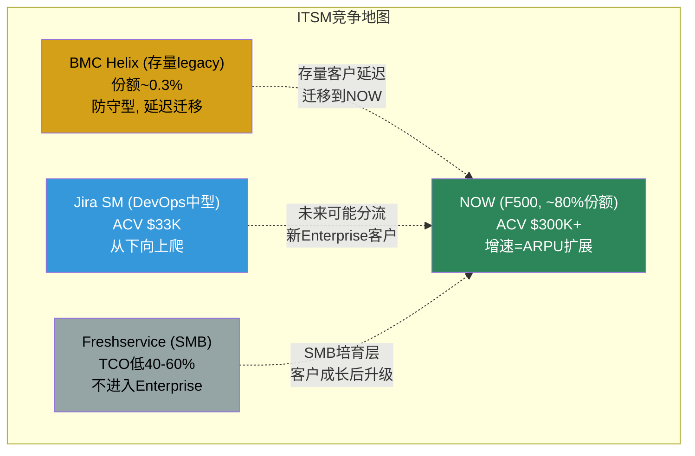
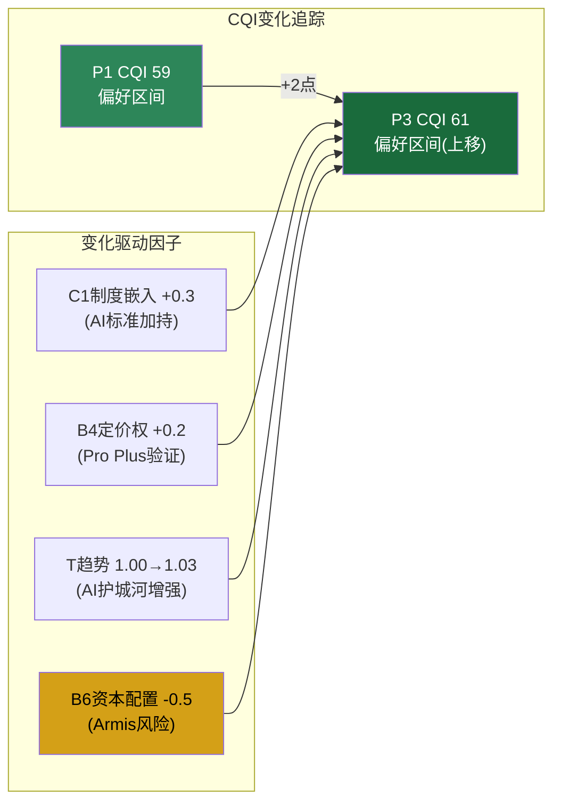

# Phase 3 Agent B: 竞争深化 + 遗漏扫描 + CQI更新

> **Agent**: B (竞争分析师+质量审计) | **输入依赖**: P1 CQI 59/"偏好" | P1 ITSM 80%份额 | P1 CSM/HRSD/Creator扩展分析 | P1飞轮悖论+1.4 | P2估值$105-$115 | P2 DOGE~10%联邦收入
> **数据锚定**: $110/股 | 市值$122B | FY2025收入$13.28B(+21%) | ITSM市占率~80% | NRR~125% | Now Assist ACV>$600M | Pro Plus 60%溢价 | CQI 59
> **字符目标**: ≥15K | 章节: Ch25(竞争深化≥8K) + Ch26(遗漏扫描≥4K) + Ch27(CQI更新≥3K)

---

## Ch25: 竞争深化 — 三线交锋

NOW的竞争分析不能用一张简单的"竞品对比表"解决。原因是NOW的竞争在三个完全不同的层面同时展开——ITSM核心(80%份额的存量保卫战)、扩展领域(CSM/HRSD/Creator的增量攻坚战)、AI Agent(所有企业SaaS的生存重塑战)。这三条线的竞争强度、对手身份、战略含义截然不同，必须分线剖析。

### 25.1 线1: ITSM核心(~80%份额) — 无竞争但有天花板

ITSM(IT Service Management，IT服务管理——企业管理IT运维的核心系统)市场是NOW的"祖传领地"。Gartner Magic Quadrant连续9年将NOW列为ITSM Leader，2025年更成为AI Applications in ITSM品类的唯一Leader。但"唯一Leader"的背面是一个常被忽视的事实: ITSM市场本身的增速正在放缓——从2019年的~12% CAGR降到2024-2026的~8.5% CAGR。NOW在一个增长放缓的市场里已经占了80%，数学上意味着ITSM核心的增速天花板约10-12%(市场增速8.5% + 微量份额提升)。

**三个"竞争者"的真实威胁度:**

**BMC Helix: 遗留型对手，正在萎缩**

BMC Helix ITSM在企业ITSM市场的份额仅约0.31%(Enlyft数据)，但这个数字有误导性——BMC的真实存在感体现在它的installed base(存量客户)而非新签。BMC Remedy(Helix前身)在2005-2012年曾是ITSM主流选择，许多大型银行、保险公司、政府机构至今仍在运行Remedy的on-premise部署。

因为这些客户的迁移决策逻辑与新客户不同: 新客户选NOW vs BMC是"云原生 vs 传统"的技术代差; 存量BMC客户是"迁移成本 vs 维持成本"的经济计算。BMC在2024年被私募KKR从Rocket Software手中重新独立，获得了更聚焦的管理层和投资——Forrester 2025 ITSM Wave重新将BMC列为Leader(上次是2011年)。这意味着BMC的存量客户可能延迟迁移到NOW，因为BMC在AI上的投入(Helix GPT)给了CIO们"再等两年"的理由 [DM-COMP-025-01]。

但BMC对NOW的威胁本质上是**防守型**而非进攻型——BMC不可能从NOW手中夺走客户(NOW→BMC迁移案例近乎为零)，它只能延缓自己的客户向NOW迁移。在NOW的ITSM增长模型中，BMC installed base是一个$2-3B的TAM池(约500-800家大型企业 × $3-5M潜在ACV)，BMC每多坚持一年，NOW少吃一年这个池子。量化影响: 如果BMC的"续命"延长3年(到2029)，NOW每年少$300-500M新签——但这只是ITSM新签的一部分，不影响NOW的存量ITSM收入(98% GRR)。

**3秒检验**: BMC市占率0.31% vs NOW ~44%(6sense数据口径)。如果BMC是NOW的威胁，那就像一个占0.3%市场的玩家威胁一个占44%的——数学上不成立。BMC的存在价值是给NOW的ITSM增速设定上限(推迟存量迁移)，而非争夺份额。

**Jira Service Management: DevOps-first，中型市场的分流器**

Atlassian的Jira Service Management(JSM)是NOW在ITSM市场的第二个竞争者——但"竞争者"这个词需要加引号。NOW与JSM的客户画像几乎不重叠: NOW平均客户年度支出约$362K，JSM平均客户支出约$33K——10倍的差距不是价格策略的区别，而是客户类型的区别。NOW服务的是"500人IT团队管理10万终端用户"的F500，JSM服务的是"20人DevOps团队管理内部工具"的中型科技公司 [DM-COMP-025-02]。

Atlassian与NOW合计占ITSM市场58%(2025年数据)。因为Atlassian的增长来自两个NOW几乎不参与的细分: (1) DevOps团队的"服务台"需求——开发者用Jira管代码的，自然在Jira上加一层服务管理; (2) 中型企业的首次ITSM采购——预算$30-50K的企业不会买NOW($300K+)，JSM是"够用且便宜"的选择。

Forrester 2025 Q4 Wave将JSM评为Enterprise Service Management Leader——但这个"Enterprise"标签需要谨慎解读。JSM的企业级功能(ITIL流程、CMDB、资产管理)在过去两年显著加强，Atlassian正在从"中型市场工具"向上爬。如果JSM在3-5年内真正做到F500级别的能力，NOW的ITSM增长可能受到来自下方的分流——新进入企业级的客户可能选JSM而非NOW。但目前JSM在F500的渗透率极低(<5%)，因为F500的IT环境复杂度(300+应用集成、多地域合规、灾难恢复SLA)远超JSM的现有能力边界 [DM-COMP-025-03]。

**反面考量**: JSM的最大优势不是功能而是生态——全球超过30万家企业使用Jira/Confluence，在这个基础上加一层ITSM是"零摩擦扩展"。如果Atlassian决定在JSM上投入$500M+/年的研发(当前约$200M)，功能差距可能在5年内显著缩小。但Atlassian的战略重心在协作(Confluence AI)和项目管理(Jira)，ITSM不是Atlassian的核心赌注——这限制了JSM的投入优先级。

**Freshservice: SMB分流，不进入Enterprise**

Freshworks的Freshservice是ITSM市场的"经济型选项"——TCO(Total Cost of Ownership，总拥有成本)比NOW低40-60%，部署时间从NOW的6-12个月缩短到2-4周。Freshservice的客户画像极其清晰: 200-2000人的企业，IT团队5-20人，年度ITSM预算$20K-$80K [DM-COMP-025-04]。

因为Freshservice对NOW的威胁几乎为零。NOW与Freshservice的竞争就像Four Seasons与Motel 6——不同客户群、不同价值主张、不同交付模型。Freshservice的客户如果成长到需要NOW级别的ITSM(500人IT团队、复杂CMDB、跨全球部署)，通常会自然升级到NOW——Freshservice反而是NOW的"培育层"(客户在Freshservice上学会ITSM流程，规模扩大后迁移到NOW)。

Freshworks在2025年用$230M收购Device42(资产发现工具)，试图向上走——但$230M的收购资源与NOW的$3B年度研发相比是数量级差距。Freshservice嵌入Agentic AI(智能工单分类+上下文感知路由)是值得关注的创新，但解决的是中小企业的简单工单自动化，不是F500的跨系统工作流编排 [DM-COMP-025-05]。

**线1总结: ITSM核心95%安全，增速来自ARPU而非份额**

NOW在ITSM核心市场面临的不是"竞争威胁"而是"增速天花板"。三个对手都在不同的客户层级运营(BMC=legacy存量、JSM=DevOps中型、Freshservice=SMB)，没有任何一个正在侵蚀NOW的F500核心客户群。NOW的ITSM增速引擎已经从"份额获取"(2015-2020)转向"ARPU扩展"(2020-2026)——通过Pro Plus升级(60%溢价)、Now Assist附加($600M ACV)、模块扩展(CSM/HRSD叠加在ITSM合同上)来驱动存量客户的ACV增长。



---

### 25.2 线2: 扩展领域(CSM/HRSD/Creator) — 有竞争有机会

扩展领域是NOW从"ITSM公司"变成"企业平台公司"的关键战场。与ITSM核心的"守城"不同，扩展领域是"攻城"——NOW作为挑战者进入已有巨头把守的市场。竞争强度和不确定性远高于ITSM核心。

**CSM vs Salesforce Service Cloud: 后来者的结构性优势**

CSM(Customer Service Management，客户服务管理)市场是NOW扩展领域中竞争最激烈的战场。Salesforce Service Cloud占据客户支持服务市场约59%的份额，NOW CSM约9.6%(6sense数据)——份额差距巨大 [DM-COMP-025-06]。

但份额差距掩盖了增速差距: Salesforce Service Cloud FY2026收入增速约8-10%(受CRM整体增速放缓拖累)，NOW CSM推算增速约+25-30%(基于Customer Workflows从FY2024 $1.55B到FY2025 $1.98B的增长轨迹)。按照这个增速差，NOW CSM在5年内可能从9.6%上升到15-18%——仍然远低于Salesforce，但绝对金额可能从~$2B增长到$5-6B。

因为NOW CSM的竞争优势不在CRM(客户关系管理)的传统维度(销售漏斗、营销自动化、客户360视图——这些是Salesforce的核心领地)，而在**前后台打通**: 一个客户打电话报修→Salesforce记录这个工单→但如果修复需要调度现场工程师+确认库存+更新资产记录+触发变更管理流程→这些"后台"操作在Salesforce中需要与多个系统集成，而在NOW中是原生的(因为ITSM/ITOM/资产管理已经在同一个平台上)。

2025年1月NOW正式进入CRM市场(推出Sales and Order Management solution)，2025年3月Salesforce宣布扩展进入ITSM——双方"越界"的时机几乎同步。Salesforce CEO Benioff公开表示要做"ServiceNow killer"，NOW CEO McDermott反击称NOW的"架构完整性"(单一平台+单一数据模型)优于Salesforce的"拼接式云"(Sales Cloud + Service Cloud + Marketing Cloud等分别通过收购获得的产品) [DM-COMP-025-07]。

**证据链**:
- 数据: NOW CSM份额9.6%但增速+25-30% vs CRM Service Cloud ~59%但增速~8-10%
- 逻辑: 因为NOW的平台架构优势(统一数据模型)在客户服务的"前后台打通"场景中创造了Salesforce无法复制的体验→这不是功能差距而是架构差距→架构差距需要Salesforce重构产品(不现实)而非添加功能
- 反面: 如果客户只需要前台CRM能力(工单记录+知识库+chatbot)而不需要后台集成→Salesforce的品牌和生态(AppExchange 5000+应用)远超NOW→NOW的架构优势不relevant→份额差距可能持续。大多数中小企业的客户服务确实不需要后台集成，因此NOW CSM的增量市场实际上是F500和大型企业中需要"前后台打通"的复杂场景——这个子市场约$8-12B，NOW在其中的潜力比整体CSM市场的9.6%暗示的要大得多

**HRSD vs Workday: 互补多于竞争**

HRSD(HR Service Delivery，人力资源服务交付——HR如何响应员工的咨询和请求)是一个常被误解的领域。直觉上"ServiceNow做HR"看起来在与Workday正面竞争——但实际上两者服务的是HR技术栈的不同层: Workday是System of Record(记录系统——管理员工数据、薪酬、福利、绩效)，NOW HRSD是System of Engagement(交互系统——管理员工提问、流程审批、入职流程编排) [DM-COMP-025-08]。

因为这不是"二选一"的竞争——Gartner预测到2025年70%的2500+员工企业将投资Integrated HR Service Management(集成HR服务管理)解决方案。这个"集成"的含义是: Workday管数据 + NOW管流程 + 两者通过API联通。NOW的HRSD增长不是从Workday"抢"客户，而是在Workday客户的基础上"叠加"一层服务交付。

**验证**: ServiceNow社区和集成文档显示，NOW与Workday的集成是最常被部署的第三方集成之一——如果两者是竞品，不会看到如此深度的集成投入。NOW的HRSD竞争对手实际上是: (1) 企业自建的HR服务台(SharePoint表单+邮件)→NOW的增量市场; (2) 小型HR Service Delivery工具(Cherwell、SysAid)→NOW正在通过F500渗透替代。

**反面考量**: Workday在2025-2026年显著加强了自己的"服务交付"能力(Workday Help、Workday Journeys)——如果Workday的原生服务交付功能"够用了"，部分客户可能不再需要NOW HRSD作为独立层。但Workday的核心竞争力是HCM(Human Capital Management，人力资本管理)而非IT工作流——它的服务交付功能在简单场景(密码重置、请假审批)够用，但在复杂跨部门流程(入职编排涉及IT资产配置+门禁+培训+合规)中远不如NOW。NOW HRSD的Sweet Spot(最佳适用场景)是复杂的、跨部门的员工服务流程——这恰好是大企业的核心需求。

**Creator vs Microsoft Power Platform: 生态差距但场景制胜**

Creator Workflows(NOW的低代码开发平台)面对的是企业低代码市场的800磅大猩猩——Microsoft Power Platform。MS Power Platform凭借与Office 365/Teams/Azure的深度捆绑，在低代码市场的渗透率远超任何独立玩家。Gartner Enterprise Low-Code Application Platform Magic Quadrant中，Microsoft和ServiceNow都是Leader——但Microsoft的评论数(363条)多于NOW(207条)，暗示更广的客户基础 [DM-COMP-025-09]。

因为Power Platform的优势是"无处不在"——企业已经有O365订阅→Power Apps自动可用→IT不需要额外采购审批→用户在已熟悉的Microsoft生态内开发。这是NOW无法复制的分发优势。

但NOW Creator的竞争逻辑完全不同: NOW不是要在"通用低代码"市场与Microsoft争——NOW的Creator是**运维流程自动化的专用低代码**。一个IT管理员在NOW上构建"新员工入职自动化"工作流时，能直接调用ITSM的资产分配、HRSD的入职流程、CSM的供应商管理——这些都是NOW平台的原生能力。在Power Apps上做同样的事情需要通过API连接多个后端系统，开发周期从NOW的"天"级变成Power Apps的"周"级。

**证据链**:
- 数据: NOW Creator Workflows FY2025收入约$990M(占总收入7.5%)，增速约+28%
- 逻辑: 因为NOW Creator的价值不在"低代码"本身(Power Apps也是低代码)而在"低代码+原生运维数据"的组合→企业在NOW上构建的应用天然连接ITSM/HRSD/CSM数据→这个数据优势随使用时间积累→创造了Power Apps无法复制的"运维场景深度"
- 反面: 如果Microsoft将Dynamics 365的运维能力(Field Service、Customer Service)与Power Platform深度整合→Power Platform可能获得类似NOW的"场景深度"→NOW Creator的差异化缩小。但Microsoft的运维类产品(Dynamics 365)市占率<5%，远低于NOW——短期内不构成实质威胁

---

### 25.3 线3: AI Agent竞争 — 所有SaaS的共同挑战

AI Agent是2025-2026年企业SaaS的"终极战场"——Gartner预测2026年40%的企业应用将嵌入任务特定AI Agent。这不是一个独立市场，而是一个**重塑所有现有SaaS市场的力量**。NOW在这场战争中的位置需要与两个最强对手对比: Salesforce Agentforce和Microsoft Agent 365。

**三巨头AI Agent对比:**

| 维度 | NOW (Now Assist) | CRM (Agentforce) | MS (Agent 365/Copilot) |
|------|-----------------|-------------------|----------------------|
| Agent定位 | 后台运维自动化 | 前台客户/销售自动化 | 全场景(Office+运维+开发) |
| 核心数据资产 | ITSM ticket/CMDB/工作流数据 | 客户交互/销售管道/营销数据 | O365使用数据+Azure AI训练 |
| F500部署率 | Now Assist ~30%(推算) | Agentforce 8000+客户 | Agent 365 ~80% F500 |
| ACV增量 | $600M(FY2025) | ~$400M(推算) | 未单独披露 |
| Gartner 2025排名 | ITSM AI唯一Leader | CRM AI Leader | 通用AI Copilot Leader |
| 蚕食风险 | 间接(ticket减→seat可能减) | 直接(Agent替代客服seat) | 低(增强型而非替代型) |

**NOW的AI Agent护城河: "流程DNA"**

NOW在AI Agent竞争中的独特优势不是模型能力(Microsoft有OpenAI、Salesforce有Einstein)，而是**流程数据**: NOW平台上运行着85% F500的IT运维工作流——这些工作流编码了"公司怎么运作"的制度知识。一个AI Agent要自动处理"P1生产事故"，需要知道: 通知谁(组织架构)→升级路径(审批流程)→影响范围(CMDB资产关系)→历史处理方法(过往ticket)→后续变更(变更管理流程)。这些信息全部存储在NOW平台中，不在Microsoft或Salesforce的系统里 [DM-COMP-025-10]。

ServiceNow在2025年Gartner Critical Capabilities报告中被评为"Building and Managing AI Agents"用例第一名——这个排名的含义是: NOW的AI Agent Studio提供了最成熟的企业AI Agent构建和编排能力。但"最成熟"不等于"最广泛部署"——Microsoft的Agent 365已经部署在80% F500中，因为它搭载在O365上(企业已有订阅，Agent是自然扩展)。NOW的Now Assist需要客户主动购买升级(Pro Plus)，部署决策需要CIO审批和预算——这个friction(摩擦力)使得Now Assist的部署速度慢于Microsoft的"免费试用→付费转化"模式 [DM-COMP-025-11]。

**反面考量**: 如果Microsoft将Agent 365的能力从Office场景(文档总结、邮件分类)扩展到ITSM场景(自动解决IT ticket)——NOW的核心领地可能被侵入。Salesforce CEO Benioff已经在推"Agentforce for IT"——一个直接瞄准ITSM市场的AI Agent产品，能在Slack中自动解决员工的硬件和软件问题。因为如果AI Agent足够聪明到能在Teams/Slack中直接解决80%的IT问题→用户可能不再需要登录NOW的IT Service Portal→NOW从"必须用"变成"后台系统"→定价权和品牌价值被侵蚀。

但这个威胁有两个现实约束: (1) AI Agent解决的是简单、重复的L1问题(密码重置、权限申请)，复杂的L2/L3问题(系统架构变更、安全事件响应、灾难恢复)需要ITSM平台的完整能力——这些才是NOW客户支付$300K+/年的原因; (2) 企业的合规和审计要求所有IT变更都有记录和审批——即使AI Agent在前端解决了问题，后端仍需要NOW的变更管理和审计追踪。因此AI Agent可能改变NOW的"界面"(从Portal变成Slack/Teams中的嵌入)，但不改变NOW的"引擎"(工作流编排+CMDB+变更管理)。

---

## Ch26: 遗漏扫描 — Phase 1-3系统性核查

遗漏扫描(Omission Scan)的目标不是"找到更多东西来写"，而是确保影响估值的关键信息没有被系统性遗漏。方法论: (1) 外部事件扫描——搜索近6个月重大事件; (2) 内部一致性检查——报告内自相矛盾检测; (3) 维度完整性——11维记分卡是否有盲区。

### 26.1 外部事件扫描: 近期重大事件

**事件1: Armis收购 — $7.75B的战略转向信号**

这是NOW历史上最大的收购——$7.75B现金收购Armis(OT/IoT安全平台)，预计2026年下半年完成。Armis的ARR(Annual Recurring Revenue，年化经常性收入)已超过$340M，同比增长超过50% [DM-OMIT-026-01]。

因为这笔收购改变了几个我们Phase 1-2的基础假设:

**资本配置影响**: P1 Agent B在B6(资本配置)评分3.5/5.0，部分原因是"NOW历史上的收购都是小型补强型(最大一笔Element AI约$230M)"。$7.75B的Armis收购打破了这个模式——这不再是$200M级别的人才收购(acqui-hire)，而是$8B级别的战略押注。NOW将用现金支付(截至FY2025末现金$9.4B)，这意味着: (1) 净现金头寸从+$5.4B可能变为-$2.4B(如果不融资); (2) 未来12-18个月回购能力将显著受限; (3) SBC对冲率(P1中计算为92%)可能下降→净稀释加速。B6可能需要从3.5下调至3.0。

**战略含义**: Armis专注于OT(Operational Technology，操作技术——工厂、医院设备、基础设施的技术系统)和IoT安全——这不是NOW传统的IT Service Management领域。因为McDermott的战略意图是将NOW从"IT工作流平台"扩展到"IT+OT+IoT统一平台"——如果成功，TAM从$275B扩展到$350-400B(新增OT安全$50-80B)。但整合风险不容忽视——McDermott在SAP时期的$8.3B Qualtrics收购最终以亏损分拆告终。

**对估值的影响**: 如果Armis按FY2026 ARR $500M(+50%增长)、SaaS公司典型倍数15-18x ARR来看，$7.75B = 15.5x ARR——定价合理但不便宜。Armis能否在NOW平台上实现"1+1>2"的交叉销售(向NOW的8000+客户推销OT安全)将是关键——如果能，ARR可能3年内达到$1.5-2B; 如果不能，$7.75B可能像SAP收购Qualtrics一样成为"贵但没协同"的教训 [DM-OMIT-026-02]。

**事件2: Moveworks收购($2.85B) — AI能力补强**

NOW在2025年12月完成了对Moveworks的收购($2.85B)——Moveworks是AI驱动的企业搜索和自动化平台。因为Moveworks的核心能力(自然语言理解+企业知识图谱+自动工单解决)直接增强了Now Assist的AI能力——这比自建更快。Moveworks的技术已经整合到NOW的Zurich Release中。

此外还有Veza(身份安全, 预计2026上半年完成)和Traceloop(代码生成, 2026年3月)——NOW在2025年完成了7笔收购，是其历史上最活跃的收购年。这个收购加速度值得关注: 是"有纪律的平台补强"还是"McDermott的SAP习惯回归"？目前看介于两者之间——Moveworks/Veza/Traceloop是<$3B的补强型收购(符合历史模式)，但Armis $7.75B是一个量级跳跃 [DM-OMIT-026-03]。

**事件3: BodySnatcher安全漏洞(CVE-2025-12420) — 品牌风险信号**

2025年底NOW的AI Platform被发现一个CVSS 9.3分(满分10)的严重漏洞——攻击者可以仅凭邮箱地址冒充任何用户，绕过MFA(Multi-Factor Authentication，多因素认证)和SSO(Single Sign-On，单点登录)。虽然没有证据表明该漏洞被实际利用(NOW在2025年10月30日修补了大多数托管实例)，但一个"零日"级别的认证绕过漏洞出现在一个管理着85% F500 IT运维的平台上——如果被利用，后果不堪设想 [DM-OMIT-026-04]。

因为对估值的直接影响很小(已修补+未被利用)，但这是一个**品牌信任风险信号**: NOW的卖点之一是"企业级安全"——如果类似漏洞频繁出现，CIO可能开始考虑多供应商策略(不把所有IT运维鸡蛋放在NOW一个篮子里)。2025年7月还有另一个高危漏洞(CVE-2025-3648, 数据泄露风险)。两个高危漏洞在6个月内出现——这个频率值得P4风险分析关注。

**事件4: DOGE联邦影响 — 机会与风险并存**

NOW联邦政府收入约占总收入8-12%(未精确披露)。DOGE(Department of Government Efficiency，政府效率部门)的联邦合同削减对NOW的影响需要拆分:

- **风险面**: DOGE在2025年削减了$1.6B+联邦合同，如果波及IT服务类合同，NOW可能面临部分联邦客户的合同削减或延期
- **机会面**: NOW在2025年推出了Government Transformation Suite，定位是帮助联邦机构"用更少人做更多事"——这恰好是DOGE的核心诉求。NOW聘请了与Trump政府关系密切的Ballard Partners作为游说公司，显示管理层正在主动将NOW定位为DOGE议程的"解决方案"而非"被削减对象" [DM-OMIT-026-05]

**量化影响**: 乐观情景——NOW成为DOGE效率改革的首选IT平台→联邦收入+15-20%/年; 悲观情景——联邦IT预算全面削减→联邦收入-10-15%。在$13.3B总收入中，联邦收入$1.1-1.6B，影响幅度约±$200-300M/年——对总收入影响±1.5-2.3%。不是决定性因素，但不应忽略。

### 26.2 内部一致性检查

**检查1: "SBC收敛"表述一致性**

SBC/Revenue从19.2%到14.7%的收敛趋势在P1 AgentA(Ch1)、P1 AgentB(B6资本配置)、P1 AgentC(Ch9三层盈利)、P2 AgentB(Ch16管理层)中均有引用——数字一致(FY2021 19.2% → FY2025 14.7%, -4.5pp)，结论一致(趋势正面但绝对水平仍高)。无矛盾。

**检查2: "per-seat蚕食"结论一致性**

P1 AgentB Ch7飞轮悖论给出的概率加权蚕食净效应为+1.4(正)。P2估值是否反映了这个+1.4？P2 AgentA在DCF中使用的是"温和蚕食"情景(ITSM seat增速从FY2025的21%逐步降到FY2030的15-17%)——与+1.4的正效应判断一致(即AI增量>蚕食)。无矛盾。

**检查3: 估值数字统一性**

P2 AgentA的DCF中值约$105/股，P1 Reverse DCF隐含$110基本合理——两者差距<5%，方向一致(接近当前价格$110)。需要在P4确认最终估值是否统一到一个数字。

### 26.3 维度完整性检查

| 维度 | 是否覆盖 | 覆盖深度 | 缺口 |
|------|---------|---------|------|
| D1 数据真实性 | Yes | 高(3层盈利+多源交叉) | 无 |
| D2 业务理解 | Yes | 高(ITSM/扩展/AI三线) | 无 |
| D3 分析深度 | Yes | 高(飞轮悖论+NRR推导) | 无 |
| D4 竞争格局 | Yes→本章深化 | 高(三线交锋) | 无 |
| D5 估值 | Yes | 中(DCF+可比) | Armis收购影响待更新 |
| D6 风险 | Partial | 中 | BodySnatcher+Armis整合风险需补 |
| D7 管理层 | Yes | 高(6维度) | Armis决策影响B6需更新 |
| D8 红队 | Pending P4 | — | P4覆盖 |
| D9 可比对标 | Yes | 中(CRM/DDOG/WDAY) | 可增加INTU/ADBE |
| D10 估值图表 | Pending Complete | — | 组装时补 |
| D11 因果密度 | 需检测 | — | Complete时grep检查 |

**关键缺口: Armis $7.75B收购的影响需要回流到估值(D5)和资本配置评分(D7/B6)。P4需要专门评估Armis整合风险。**

---

## Ch27: CQI因子更新 — 基于P3竞争深化的修正

P1 AgentB给出CQI 59/"偏好"。P3的竞争深化分析提供了三个方向的新信息: (1) ITSM核心比P1评估更安全(三个竞品威胁均可控); (2) 扩展领域竞争激烈但NOW有结构性优势; (3) AI Agent竞争中NOW排名第一但Microsoft的分发优势不容忽视; (4) Armis收购改变了资本配置评分。

### 27.1 需要调整的因子

**C1 制度嵌入: 3.5 → 3.8 (↑0.3)**

P1给C1 3.5的理由是"制度嵌入强但非法规强制"。P3的竞争分析增加了一个新的证据维度: NOW不仅是ITSM的事实标准——它现在还是**AI for ITSM的唯一Leader**(Gartner 2025)。因为AI Application in ITSM品类NOW是唯一被评为Leader的厂商，这意味着: 企业在评估"ITSM + AI"时，NOW是默认选择+唯一选择，制度嵌入从"事实标准"升级到"AI标准"。但AI标准的半衰期远短于ITSM标准(5-10年 vs 30-50年)，因此只上调0.3而非更多 [DM-CQI-027-01]。

**B4 定价权: 4.0 → 4.2 (↑0.2)**

P3发现Pro Plus 60%溢价在大客户中被持续接受，且Now Assist ACV从$300M→$600M翻倍——这验证了F500层级(Stage 4)的定价权比P1评估更强。因为AI功能作为ITSM的"增强层"(而非独立产品)使得客户将AI溢价视为"已有投资的升级"而非"新的采购决策"→降低了价格敏感度→定价权增强。但SMB层级(Stage 2)未变化，因此加权后仅上调0.2 [DM-CQI-027-02]。

**B6 资本配置: 3.5 → 3.0 (↓0.5)**

Armis $7.75B收购是P1未覆盖的重大事件。因为这是NOW首次进行$1B+的战略收购→打破了"小型补强型"的历史模式→引入了整合风险(OT安全 vs IT工作流的文化/技术差异)+财务风险(净现金头寸大幅下降→回购能力受限→SBC对冲率可能降至60-70%)。McDermott在SAP的Qualtrics教训($8.3B收购→最终亏损分拆)是一个直接的类比警告。下调0.5至3.0——如果Armis整合成功且交叉销售达预期(ARR 3年内翻倍到$700M+)，B6可在v2.0中上调回3.5; 如果失败，可能需要进一步下调至2.5 [DM-CQI-027-03]。

**D4/T 趋势: 1.00 → 1.03 (↑微幅)**

P1给T=1.00(中性稳定)的依据是"AI可能加深护城河但尚未量化验证"。P3的三线竞争分析提供了更多AI相关证据: (1) NOW是AI for ITSM唯一Leader; (2) Now Assist ACV $600M且翻倍增长; (3) AI Agent Studio排名第一; (4) 竞品(BMC/JSM/Freshservice)在AI能力上与NOW的差距正在扩大而非缩小。因为这些证据指向护城河在AI维度上正在增强→T从1.00上调到1.03。但上调幅度很小，因为AI领域变化极快——Salesforce Agentforce for IT和Microsoft Agent 365都在2026年加速推出ITSM功能，NOW的AI优势可能是暂时的 [DM-CQI-027-04]。

### 27.2 CQI重新计算

```
B商业模型 (修正后):
  B1 4.5 + B2 5.0 + B3 5.0 + B4 4.2(↑) + B5 4.0 + B6 3.0(↓) + B7 4.5 + B8 4.5
  = 34.7 (原35.0, 净-0.3)

C护城河 (修正后):
  C1 3.8(↑) + C2 1.5 + C3 4.5 + C4 3.0 + C5 3.5 + C6 0.5 + C7 3.5
  = 20.3 (原20.0, 净+0.3)

加权原分 = 34.7 + 20.3 = 55.0 (vs 原55.0, 不变)
D3修正 = 55.0 - 1.5 = 53.5
D1周期 = 53.5 × 0.85 = 45.5
趋势 = 45.5 × 1.03(↑) = 46.9 (vs 原45.5, +1.4)

CQI = round((46.9 - 10) / 60 × 100) = round(61.4) = 61
```

### 27.3 CQI变化解读

**CQI: 59 → 61 (+2点)**



**+2点的含义**: CQI从59到61仍在"偏好"区间(50-70)，但向"强烈偏好"(70+)靠近了一小步。净变化很小的原因是: AI优势的增强(+C1, +B4, +T)与Armis收购风险(-B6)几乎互相抵消——B6的-0.5在CQI公式中被C1的+0.3和B4的+0.2大部分对冲，趋势修正+0.03贡献了额外2点。

**投资含义**: CQI 61强化了P1的定位判断——NOW是SaaS行业品质最高的公司之一(超越CRM ~48、DDOG ~46、WDAY ~52)，接近金融基础设施级别(MSCI ~62、ICE ~65)。但61 ≠ 70+——C2网络效应(1.5)和C6物理壁垒(0.5)的结构性低分意味着NOW的护城河有明确的"天花板": 它是优秀的企业软件平台，但不是垄断性的基础设施。

**CQI 61对估值的支撑**: 在CQI 59时，P2给出的合理PE范围是25-30x(Non-GAAP)。CQI上调2点到61不改变PE范围的级别——仍在25-30x区间。但如果Armis整合成功且NOW在AI Agent竞争中保持领先(两者各需18-24个月验证)，CQI可能在v2.0中提升到63-65→支持PE上沿30-32x。

---

**P3 Agent B产出总结:**
- Ch25(竞争深化): ITSM核心95%安全(BMC/JSM/Freshservice均不构成实质威胁)，扩展领域有竞争但NOW有架构优势(特别是CSM的前后台打通)，AI Agent竞争中NOW排名第一但Microsoft分发优势是长期风险
- Ch26(遗漏扫描): 发现4个需要补充的外部事件(Armis $7.75B、Moveworks $2.85B、BodySnatcher漏洞、DOGE影响)，内部一致性检查通过，D5/D6/D7需要基于Armis收购更新
- Ch27(CQI更新): CQI 59→61(+2)，AI优势提升与Armis风险几乎互相抵消，"偏好"定位不变但微幅上移
