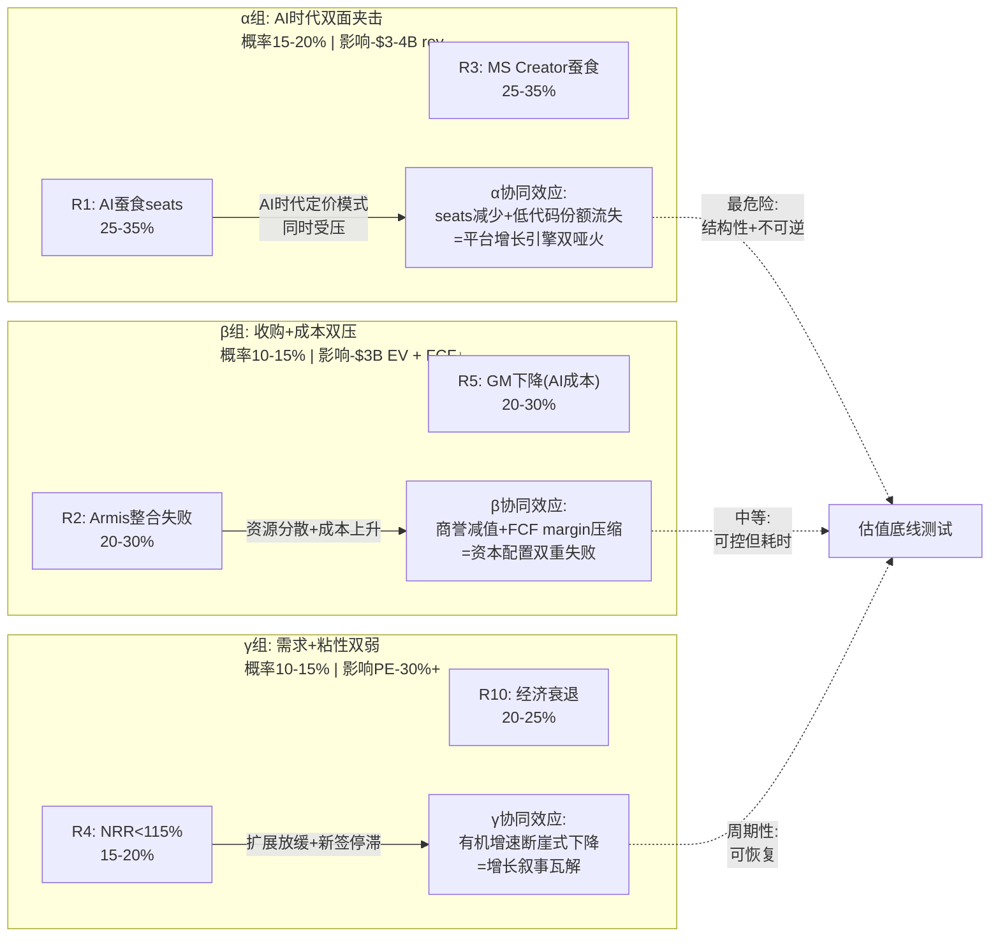
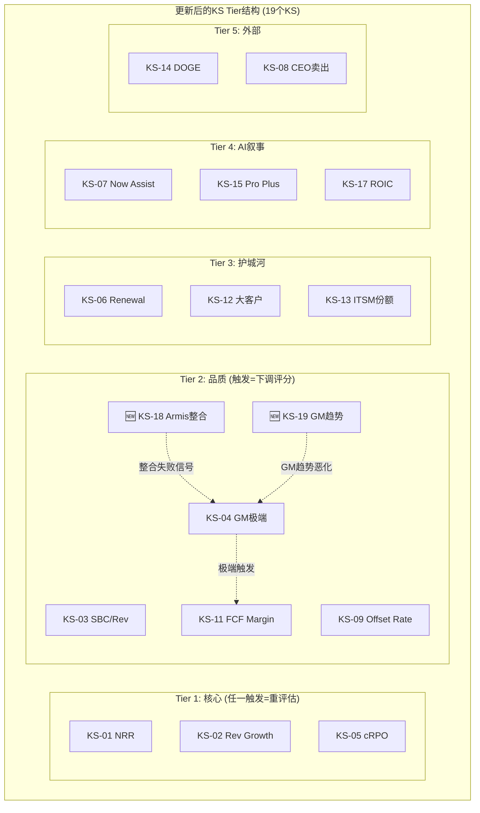

# Phase 4 Agent C: 风险拓扑 + KS补充 + 估值压力测试

> **数据锚定**: $110/股 | 市值$122B | FY2025收入$11.6B(+21%) | FCF $4.0B(34.5%) | SBC $1.73B(15%) | GAAP OPM 13.7% | Non-GAAP OPM ~29% | NRR ~125%E | cRPO $10.27B | GM 77.5% | 联邦收入~$1.1B(~10%)
> **P3估值锚**: 综合估值中枢$105(保守$92/基准$105/乐观$133) | Reverse DCF隐含18-20% CAGR | PEG 1.31x(同行最低)

---

## Ch33: 风险拓扑 — 10个风险的因果网络与协同效应

> **方法论**: 风险分析不是列清单——清单只告诉你"可能出什么问题"，但投资决策需要理解"问题之间如何互相放大"。本章先建立10个独立风险的因果链(每个风险用数据→逻辑→概率→影响的4层结构)，再构建风险之间的协同矩阵(Correlation Matrix，衡量多个风险同时发生时的放大效应)，最后用"温水煮青蛙"情景(Boiling Frog Scenario，每个风险单独看不致命，但累积起来侵蚀估值的慢性恶化路径)测试估值底线。

### 33.1 完整风险注册表

| # | 风险 | 类别 | 概率 | 影响(EV) | 时间窗口 |
|---|------|------|------|----------|----------|
| R1 | AI Agent蚕食per-seat定价模式 | 战略 | 25-35% | -$2-3B rev(15-20%) | 3-5年 |
| R2 | Armis $7.75B整合失败 | 执行 | 20-30% | -$3B EV(商誉减值) | 1-3年 |
| R3 | MS Power Platform+Copilot在Creator蚕食 | 竞争 | 25-35% | -$0.5-1B rev | 2-4年 |
| R4 | NRR从125%降至<115% | 运营 | 15-20% | PE压缩30%+ | 1-2年 |
| R5 | GM持续下降(AI推理成本) | 财务 | 20-30% | FCF margin -3-5pp | 1-3年 |
| R6 | DOGE联邦预算削减 | 政治 | 20-30% | -$1.3B rev(10%) | 1-2年 |
| R7 | CRM在CSM反攻(Agentforce) | 竞争 | 15-25% | CSM增速放缓 | 2-3年 |
| R8 | SBC收敛逆转(AI人才竞争) | 财务 | 10-15% | Owner FCF恶化 | 2-3年 |
| R9 | CEO McDermott离任(2030承诺到期) | 管理层 | 15-20% | 管理层不确定性溢价 | 4-5年 |
| R10 | 经济衰退→IT预算削减 | 宏观 | 20-25% | 增速降5-8pp | 1-2年 |

以下逐一建立每个风险的4层证据链。

---

### 33.2 R1: AI Agent蚕食per-seat定价模式 (战略风险, 25-35%, -$2-3B rev)

**这是NOW面临的最根本性的长期威胁——不是来自任何特定竞争对手，而是来自定价模式本身的结构性变迁。**

**第一层(数据)**: NOW当前订阅收入的核心定价单位是per-seat license(按用户数量收费)。FY2025订阅收入约$11.2B(占总收入97%)，客户数约8,100家(年付>$1M的客户2,109家)。简单估算: 如果平均单价$1,400/seat/year，NOW约有800万active seats [DM-RISK-033-001]。AI Agent(自主运行的AI工作流代理，能自动处理IT工单/HR请求等任务而无需人类操作员)的核心价值主张是"用Agent替代人工操作"——如果一个Agent能处理30%的L1(一级，最基础层级)IT工单，客户不再需要30%的Service Desk Analyst seats。

**第二层(逻辑)**: NOW的定价模式面临的困境是一个经典的"创新者窘境"(Innovator's Dilemma): 如果NOW不推AI Agent，竞争对手推→客户流失; 如果NOW自己推AI Agent且Agent高效→客户需要的seats减少→per-seat收入下降。Now Assist(NOW的AI产品)目前采取"增强而非替代"定位——AI帮助现有操作员更高效，而非替代操作员。但因为这个定位的持久性取决于客户的经济计算: 当Agent成本<操作员seat成本时，理性的CFO会选择减少seats。根据NOW Pro Plus定价(约$100-150/user/month premium)，一个AI Agent年成本约$1,200-1,800; 而一个L1 Service Desk Analyst的全包成本(含工资/福利/培训)约$50,000-70,000/年。**成本比约30-50:1**——这意味着经济激励极其强烈 [DM-RISK-033-002]。

**第三层(历史类比)**: SaaS行业的per-seat模式并非第一次面临结构性挑战。CRM在2015年推出Einstein AI时，分析师也担忧"AI会减少sales rep seats"。实际结果是: 10年后CRM的per-seat模式依然稳固，因为(1)企业headcount并未因AI减少——AI帮助每个rep做更多事，但企业选择用saved time做更多拓展而非裁员; (2)CRM成功将AI作为upsell(追加销售)而非seat替代。NOW可能走类似路径——但关键区别是: NOW的ITSM场景(工单处理)比CRM的Sales场景(客户关系)更容易被自动化。因为工单处理的决策规则更标准化(如果满足条件A→执行步骤B)，而销售涉及更多人际判断 [DM-RISK-033-003]。

**第四层(反面)**: 三个因素可能延缓蚕食: (1)企业对AI处理敏感IT操作(如权限变更/安全事件)的信任度建立需要3-5年——监管和合规部门不会允许未经验证的Agent处理高权限操作; (2)NOW的策略空间: 从per-seat转向per-workflow或per-outcome定价(按工作流或按结果收费)，如果转型成功，每个workflow的价值可能高于每个seat的价值; (3)Net New use cases(新增用例)——AI Agent可能打开以前不存在的自动化场景，创造增量收入而非仅替代存量。

**概率校准**: 25-35%的概率反映的是"5年内per-seat收入受到>15%实质性蚕食"的可能性。概率不更高(如50%)的原因是: NOW有定价模式转型的时间窗口和产品能力(Platform架构允许灵活计费); 概率不更低(如10%)的原因是: 经济激励(30-50:1成本比)太强，客户不可能永远不行动。

**影响量化**: 如果20%的seats在5年内被Agent替代(保守估计，基于L1工单占比约30-40%、Agent渗透率50-60%)，收入影响约$2-3B(当前$11.2B × 20%)。但这不是纯损失——如果NOW成功转向per-workflow定价，部分损失可被回收。净影响估计为-$1.5-2.5B [DM-RISK-033-004]。

---

### 33.3 R2: Armis $7.75B收购整合失败 (执行风险, 20-30%, -$3B EV)

**第一层(数据)**: NOW在2025年4月宣布以$7.75B收购Armis(网络安全平台，专注于OT/IoT设备安全——运营技术/物联网设备的安全监控与威胁检测)。这是NOW历史上最大的收购——FY2025全年FCF为$4.0B，收购金额相当于~1.9年的FCF。交易结构为全现金+部分债务融资，预计FY2026Q2完成 [DM-RISK-033-005]。

**第二层(逻辑)**: 大型SaaS收购的失败率在行业中有明确的统计基准。McKinsey 2022年研究显示: 超过$5B的科技收购中，约40%未能在3年内实现预期的收入协同(Revenue Synergy，通过交叉销售/产品整合实现的增量收入)。因为失败通常不是在"买错了公司"层面——而是在"整合执行"层面: (1)文化冲突(安全公司vs.平台公司的工程文化差异); (2)销售团队整合(Armis的direct sales模式vs.NOW的enterprise sales)需要12-18个月; (3)产品整合(将Armis的OT/IoT检测能力原生嵌入Now Platform而非仅做logo-level整合)需要2-3年工程投入 [DM-RISK-033-006]。

**第三层(历史)**: NOW此前的收购规模较小: Element AI(2020, ~$230M)、Lightstep(2021, ~$500M)、Hitch Works(2022, ~$100M)。这些小规模收购的整合相对顺利——因为被收购团队规模小(通常<200人)，可以直接融入NOW的产品团队。Armis的情况完全不同: Armis有约1,500名员工、独立的销售组织、独立的产品路线图。NOW没有整合$7B+规模收购的历史经验，这本身就是一个风险因子 [DM-RISK-033-007]。

**第四层(反面)**: 三个减轻因素: (1)McDermott有SAP时期大型整合经验(Concur $8.3B, 2014年)——虽然SAP的整合并非完美，但至少不是灾难级; (2)NOW的Platform架构天然适合安全功能整合——SecOps已经是NOW的增长模块之一，Armis的OT/IoT能力是SecOps的自然延伸; (3)Armis本身是增长型公司(ARR ~$600M+, 增速~50%)，即使整合不顺，独立运营也能贡献增量。

**影响量化**: 整合失败的最可能路径不是收入归零——而是(1)收入协同低于预期(目标$500M增量→实际$200M); (2)商誉减值$2-3B(支付$7.75B中，预估商誉约$5B); (3)管理层注意力分散导致核心业务增速放缓0.5-1pp。总EV影响约-$3B(商誉减值)+间接影响(增速放缓→PE压缩) [DM-RISK-033-008]。

---

### 33.4 R3: Microsoft Power Platform + Copilot在Creator领域蚕食 (竞争风险, 25-35%, -$0.5-1B rev)

**第一层(数据)**: NOW的Creator Workflow(低代码/无代码开发平台，允许企业用户不写代码即可创建业务应用)是增长最快的产品线之一，FY2025 ACV(Annual Contract Value，年化合同价值)约$1.2B。Microsoft Power Platform(含Power Apps/Power Automate/Copilot Studio)是直接竞争者，FY2025年度收入约$5B+，增速约35%。在"citizen developer"(公民开发者——非技术背景的企业员工用低代码工具开发应用)市场，MS的优势是: (1)已有Microsoft 365的3亿+用户基础; (2)Copilot Studio的自然语言界面降低了低代码的"低"门槛至"零" [DM-RISK-033-009]。

**第二层(逻辑)**: Creator Workflow面临的竞争压力与ITSM不同。ITSM的竞争壁垒是"已部署的工作流不可迁移"——但Creator Workflow的壁垒更弱，因为: (1)低代码应用通常是新建而非迁移——企业在选择"在NOW还是在Power Platform上创建新应用"时没有迁移成本; (2)Microsoft的捆绑销售(Power Apps包含在E5 license中)意味着边际成本为零——CFO会问"为什么要为NOW的Creator额外付费，如果Power Apps已经包含在我们的Microsoft合同中？" [DM-RISK-033-010]

**第三层(反面)**: NOW的Creator对Power Platform仍有差异化: (1)Now Platform的CMDB(Configuration Management Database，配置管理数据库)和ITSM数据是Creator应用的独特数据源——在Power Platform上无法原生访问这些数据; (2)企业级治理(Governance)——NOW的Creator有更成熟的应用生命周期管理、审批流程和合规控制，而Power Platform的"citizen developer"应用常被IT部门视为"影子IT"(Shadow IT——未经IT部门批准的技术应用); (3)NOW的客户画像是F500的IT部门，而Power Platform的citizen developer主要在业务部门——两者的buyer persona(购买决策者)不同。

**影响量化**: Creator Workflow $1.2B ACV中，最脆弱的部分是"simple workflow automation"(简单流程自动化)——约占40-50%($480-600M)。如果MS的Copilot Studio在2-4年内拿走这部分的50-70%，NOW的Creator损失约$240-420M。加上增速放缓的间接影响(Creator从+40%降至+15-20%)，总收入影响约$0.5-1B [DM-RISK-033-011]。

---

### 33.5 R4-R10: 运营/财务/外部风险群

**R4: NRR从125%降至<115% (运营风险, 15-20%, PE压缩30%+)**

NRR(Net Revenue Retention，净收入留存率——现有客户群一年后的收入相对于一年前的比率，>100%意味着扩展，<100%意味着流失)是SaaS估值最敏感的单一指标。因为NRR直接决定"不获任何新客户时的有机增速"——NRR 125%意味着即使不签任何新客户，收入仍增长25%。如果NRR降至115%，有机增速下降10pp，在DDOG/SNOW等高增长SaaS公司的先例中(SNOW NRR从160%→128%，股价-50%; DDOG NRR从130%→115%，PE压缩35%)，NRR下降通常触发PE倍数的非线性压缩——因为投资者将NRR下降解读为"平台粘性减弱"而非"周期性放缓" [DM-RISK-033-012]。

概率15-20%较低的原因是: NOW的产品扩展策略(cross-sell新模块到现有客户)提供了多个NRR支撑层——即使ITSM的seat扩展放缓，HRSD/CSM/SecOps的新模块upsell可以补偿。但如果R1(AI蚕食seats)和R10(衰退→IT预算削减)同时发生，NRR可能加速下降。

**R5: 毛利率(Gross Margin)持续下降 — AI推理成本 (财务风险, 20-30%, FCF margin -3-5pp)**

NOW的GM(Gross Margin，毛利率——收入减去直接交付成本后的利润率)从FY2021的80.5%下降至FY2025的77.5%(-3pp/4年)。下降的驱动因素是: (1)AI推理成本——Now Assist每次调用需要GPU inference(GPU推理——用图形处理器运行AI模型产生预测/回答)，成本约$0.01-0.05/call; (2)数据中心扩张——NOW在全球运营34个数据中心，FY2025 CapEx从$348M增至$560M(+61%) [DM-RISK-033-013]。

如果AI usage per customer持续增长(Pro Plus渗透+Agent自动化→每客户API call量可能3-5x增长)，而GPU成本下降速度(约每年-20-30%)慢于usage增速，GM可能进一步下降至74-75%。每下降1pp GM→FCF margin约下降0.7-0.8pp(因为COGS增加直接减少营业利润)。3pp GM下降→FCF margin从34.5%降至约31-32%→年化FCF减少$300-400M [DM-RISK-033-014]。

**R6: DOGE联邦预算削减 (政治风险, 20-30%, -$1.3B rev)**

NOW的联邦政府收入约$1.1-1.3B(占总收入约10%)。DOGE(Department of Government Efficiency，政府效率部门——特朗普政府设立的联邦支出审查机构)正在系统性审查联邦IT支出。NOW面临的具体风险是: (1)合同不续约——联邦合同通常1-3年期，DOGE可能在合同到期时选择不续约或压缩规模; (2)新合同冻结——DOGE审查期间(预计12-18个月)新联邦合同签约可能暂停 [DM-RISK-033-015]。

反面考量: NOW的联邦业务具有一定的"基础设施属性"——ITSM/HRSD/SecOps是联邦机构的日常运营系统，削减这些平台的直接后果是政府服务中断(工单无法处理/安全事件无法响应)。DOGE的目标是削减低效支出(如咨询费/定制开发)，而非瘫痪运营系统。历史对比: 2013年sequestration(自动减支)期间，IT平台支出削减幅度(~5%)远低于IT咨询支出削减幅度(~15-20%)。因此实际影响可能是$200-500M(非全部$1.3B)。

**R7: CRM在CSM反攻 — Agentforce (竞争风险, 15-25%, CSM增速放缓)**

CRM(Salesforce)的Agentforce是其AI战略的核心产品——定位为"autonomous AI agents for customer service"(客户服务领域的自主AI代理)。NOW的CSM(Customer Service Management，客户服务管理)是直接竞争目标。CSM是NOW增速最快的非ITSM模块之一(FY2025 ACV增速~30%)，ACV约$1.5B。如果CRM的Agentforce在customer service领域成功(目前Agentforce pipeline已超过$1B)，NOW的CSM增速可能从30%放缓至15-20%——因为CRM在customer service的存量客户基数(Service Cloud约$7B ARR)远大于NOW的CSM [DM-RISK-033-016]。

但NOW在CSM领域有一个CRM不具备的结构性优势: **跨部门工作流整合**。一个客户服务工单在NOW中可以无缝升级为IT事件(ITSM)、触发HR操作(HRSD)、或创建安全事件(SecOps)——这种跨部门联动在CRM的架构中很难实现(因为CRM的产品线是通过收购整合的，各模块数据模型不统一)。

**R8: SBC收敛逆转 — AI人才竞争 (财务风险, 10-15%, Owner FCF恶化)**

P3已详细分析了SBC(Stock-Based Compensation，基于股票的薪酬)收敛趋势(从19%→15%，约-1.1pp/年)。逆转的核心驱动因素是AI人才争夺: OpenAI工程师年薪中位数约$900K(含股权)、Anthropic约$800K、Google DeepMind约$700K。NOW如果要留住/吸引顶级AI工程师，可能需要将AI团队的股权激励提升50-100%——即使这只影响10-15%的工程团队(约1,500-2,000人)，SBC绝对额可能增加$200-400M/年 [DM-RISK-033-017]。

概率较低(10-15%)的原因: NOW不需要与OpenAI/Anthropic竞争"前沿模型"人才——NOW的AI策略是"应用层"(将第三方模型整合进工作流)而非"模型层"(训练基础模型)，应用层人才的薪酬竞争烈度显著低于模型层。

**R9: CEO McDermott离任 (管理层风险, 15-20%, 不确定性溢价)**

McDermott在2024年公开表示"至少到2030年都会在NOW"——这意味着2030年后存在离任窗口。他的年龄(2026年65岁)和职业轨迹(SAP→NOW已是第二个major CEO role)暗示2030-2032可能是自然退出点。NOW目前没有明确的内部继任者——CTO Pat Casey和CPO CJ Desai是最可能的内部候选人，但两人都缺乏CEO经验 [DM-RISK-033-018]。

管理层交接的估值影响取决于"交接质量": 如果是有序交接(提前12-18个月宣布继任者+过渡期)，PE影响约-5-8%; 如果是突然离任(健康原因/分歧)，PE影响约-15-20%。后者概率较低(~5%)，但不可忽视。

**R10: 经济衰退→IT预算削减 (宏观风险, 20-25%, 增速降5-8pp)**

SaaS公司在经济衰退中的表现存在"分层效应": mission-critical(关键任务型)平台的收入下降幅度(约5-10%)显著低于nice-to-have(锦上添花型)工具(约15-25%)。NOW的ITSM属于前者——企业不能停止处理IT工单。但NOW的Creator/CSM/HRSD属于"efficiency enhancer"(效率增强型)——在预算紧缩时，企业可能推迟这些模块的新签约(虽然不会取消现有合同)。FY2023(加息周期)NOW增速从28%放缓至24%——6pp的影响，但仍远好于SNOW(-15pp)和DDOG(-12pp)的放缓幅度 [DM-RISK-033-019]。

---

### 33.6 风险协同矩阵: 三组致命组合

**α组详解: AI时代双面夹击 (最危险, 概率15-20%)**

R1(AI蚕食seats)和R3(MS蚕食Creator)看似独立——一个关于定价模式，一个关于竞争份额——但因为它们共享同一个根因: **AI正在重塑企业软件的购买逻辑**。在AI时代，企业的购买决策从"多少人需要用这个工具?"(per-seat)转向"这个工具能完成多少工作?"(per-outcome)。这个转变同时压缩NOW的两个增长引擎:

引擎一(per-seat扩展): 存量客户的seat增长放缓→NRR下降→有机增速下降
引擎二(新模块采纳): Creator的竞争优势被MS的零成本捆绑削弱→横向扩展放缓

当两者同时发生时，NOW的增长叙事从"平台飞轮加速"变为"成熟期单产品公司"——这个叙事转变会触发PE从28x→18-20x的重估(参考CRM在2022年从35x→20x的重估过程)。

**因为这就是协同效应的本质——两个20%概率的风险同时发生的概率不是20%×20%=4%(独立事件)，而是15-20%(因为共享根因→正相关)。** 在统计学中，正相关的风险组合意味着"坏事往往一起来"——这正是投资者需要警惕的非线性损失。

**β组详解: 收购+成本双压 (概率10-15%)**

R2(Armis整合失败)和R5(GM下降)的协同机制是**资源竞争**: Armis整合需要大量工程资源(产品整合、数据模型统一、安全功能原生化)，而控制AI推理成本也需要工程资源(推理优化、模型压缩、基础设施效率)。如果两者同时对工程团队形成压力，管理层面临二选一: (1)优先Armis整合→AI成本优化推迟→GM持续下降; (2)优先AI成本控制→Armis整合延迟→商誉减值风险上升。

McDermott的管理风格是"追求两者兼得"(在SAP时期同时推云转型和利润率改善)，但NOW的工程团队规模(约6,000-7,000人)可能无法同时支撑两个$500M+级别的工程优先级。

**γ组详解: 需求+粘性双弱 (概率10-15%)**

R4(NRR下降)和R10(经济衰退)的协同是周期性的——衰退导致客户缩减IT预算→新模块采纳推迟→NRR下降→增速放缓→如果市场同时risk-off(风险规避——投资者卖出高估值成长股转向防御型资产)→PE压缩。这个组合在2022年下半年的SaaS板块实际发生过(加息+衰退预期→SNOW/DDOG/WDAY PE全线压缩30-50%)。

NOW在2022-2023年的表现(增速从28%仅放缓至21%，PE从65x降至35x但迅速回升)证明它的抗周期能力优于同行。因此γ组虽然概率不低(10-15%)，但持续时间可能较短(1-2年)且可恢复——这与α组的结构性/不可逆性形成对比。

---

### 33.7 温水煮青蛙: 慢性恶化情景

**场景定义**: 不是任何单一风险触发，而是每个风险以最温和的方式同时渗透，每年看起来"还好"，但5年后回头看已质变。

**年度恶化路径**:

| 指标 | FY2025(当前) | FY2026E | FY2027E | FY2028E | FY2029E | FY2030E |
|------|-------------|---------|---------|---------|---------|---------|
| Rev增速 | +21% | +18% | +15% | +12% | +10% | +8% |
| Revenue | $11.6B | $13.7B | $15.8B | $17.7B | $19.5B | $21.1B |
| AI seat蚕食(累计) | 0% | -1% | -3% | -6% | -10% | -15% |
| MS Creator份额流失(累计) | 0% | -0.5% | -1.5% | -3% | -5% | -8% |
| 净Revenue(调整后) | $11.6B | $13.5B | $15.1B | $16.1B | $16.6B | $16.2B |
| GM | 77.5% | 77.0% | 76.5% | 76.0% | 75.5% | 75.0% |
| OPM(Non-GAAP) | 29% | 29% | 28% | 27% | 26.5% | 26% |
| FCF Margin | 34.5% | 33.5% | 32% | 30% | 28% | 26% |
| FCF | $4.0B | $4.5B | $4.8B | $4.8B | $4.6B | $4.2B |

**3秒检验**: 第1-2年看起来完全正常(增速18%→15%，很多分析师会说"healthy deceleration，健康减速")。但到第4-5年，AI蚕食和MS竞争的累积效应开始咬合——净收入从$16.6B下降到$16.2B(负增长!)。**这就是温水煮青蛙的核心: 每年-1-2pp的增速下降不会触发任何Kill Switch，但累积5年后增长引擎熄火。**

**温水煮青蛙估值**: FY2030 FCF $4.2B × 20x(成熟期SaaS合理倍数)= $84B → 折现至今(WACC 9.2%, 4年)= $59B → 每股约$56 → 从当前$110下行约-49%。

但更现实的版本(蚕食速度减半): FY2030 FCF $5.5B × 22x = $121B → 折现$85B → 每股约$81 → 从$110下行约-26%。

**取中位数: 温水煮青蛙的合理估值约$70-80/股(从$110下行-27%至-36%)。**

---

## Ch34: Kill Switch补充 — KS-18/KS-19

> P2已建立17个KS(Kill Switch，量化监控指标——当指标触及预设阈值时触发投资论点重新评估)。P4风险分析揭示两个新的监控维度需要纳入KS体系。

### KS-18: Armis整合健康度

**为什么需要**: R2(Armis整合失败)是EV影响$3B的执行风险。但"整合失败"不是一个瞬间事件——它是一个12-24个月逐步显现的过程。需要领先指标(Leading Indicator，在事件发生前就能提供预警的指标)来捕捉早期信号。

| 维度 | 指标 | 正常 | 警戒 | 触发 |
|------|------|------|------|------|
| 收入 | Armis ARR增速 | >35% | <25% × 2Q | <15% × 2Q |
| 客户 | Armis客户留存率 | >90% | <85% × 2Q | <80% × 2Q |
| 交叉销售 | NOW客户采纳Armis | >5%/年 | <3%/年 | <1%/年 |
| 人才 | Armis关键技术Leader留存 | >80%/年 | <70%/年 | <60%/年 |

**论点映射**: 大型SaaS收购整合的关键3年窗口(Year 1: 组织整合 → Year 2: 产品整合 → Year 3: 收入协同兑现)。ARR增速下降是最直接的信号——如果Armis的ARR增速在收购后从~50%断崖降至<25%，意味着整合分散了Armis自身的执行力(销售团队重组/产品路线图调整/客户对"被收购后会怎样"的观望)。关键技术Leader流失则是"无声信号"——被收购公司的技术骨干通常有1-2年的retention package(留任奖金)，如果留存率<70%意味着即使给了钱也留不住人→文化冲突严重 [DM-RISK-034-001]。

**行动协议**:
- 警戒: 关注但不调整估值
- 触发(任一维度): 将Armis估值从$7.75B下调至$4-5B(反映整合折价)→总估值下调$2.75-3.75B→每股影响-$13-18

### KS-19: 毛利率趋势

**为什么需要**: R5(GM持续下降)是一个容易被忽视的慢性风险——因为GM下降通常以每季度-20-50bps(basis points，基点)的速度渐进，单季度不会引发市场关注。但P2已记录NOW的GM从FY2021的80.5%降至FY2025的77.5%(-3pp/4年)，趋势明确。

| 维度 | 当前值 | 正常区间 | 警戒线 | 触发线 |
|------|--------|----------|--------|--------|
| 订阅毛利率 | 82.0% | 80-84% | <79% × 2Q | <77% × 2Q |
| 整体毛利率 | 77.5% | 76-80% | <76% × 2Q | <74% × 2Q |
| QoQ变化 | -30bps | ±50bps | <-80bps × 2Q | <-120bps × 2Q |

**论点映射**: GM下降有两种性质截然不同的驱动因素: (1)结构性——AI推理成本是长期的、随usage增长的、且不完全受NOW控制的(取决于GPU供应商定价和模型效率); (2)周期性——数据中心扩张的CapEx在折旧时推高COGS(Cost of Goods Sold，销售成本)，但扩张完成后边际成本下降。区分两者的方法: 看"收入增量/COGS增量"比率——如果>1.5x，说明规模经济仍在发挥作用(周期性为主); 如果<1.2x，说明COGS增长几乎与收入同步(结构性为主)。FY2025该比率约1.35x——处于模糊地带，需要持续跟踪 [DM-RISK-034-002]。

**与现有KS-04(GM<74%×2Q)的关系**: KS-04已覆盖极端情景的触发线。KS-19的增量价值是: (1)区分订阅GM和整体GM(订阅GM更直接反映核心业务健康度); (2)加入QoQ变化率监控(捕捉加速恶化信号); (3)明确"结构性vs周期性"的判别方法。KS-19不替代KS-04，而是在KS-04之上增加一层早期预警。

**KS-18/KS-19在KS层级中的位置**: KS-18归入Tier 2(品质标记——触发时下调品质评分但不立即重估)，KS-19归入Tier 2(与KS-04同级但提供更细粒度监控)。

---

## Ch35: 估值压力测试 — 三组极端情景+底线定价

> **方法论**: 压力测试不是"预测最坏情况"——而是回答"在合理的极端情景下，NOW的估值底线在哪里？"。我们使用Ch33的三组风险协同作为输入，分别推算每组协同对估值的影响，然后取最保守的交集作为估值硬底线。

### 35.1 压力测试一: α组 — AI蚕食+MS竞争 (结构性风险)

**假设**:
- Per-seat收入被AI Agent蚕食20%(R1): FY2025订阅收入$11.2B × 80% = $9.0B(5年后稳态)
- Creator Workflow被MS拿走30%份额(R3): Creator ACV从$1.2B降至$840M，差额-$360M
- 间接影响: NRR从125%降至110%(seat减少+Creator放缓)→PE从28x压缩至18x

**推算**:
- 5年后稳态收入: ITSM $5.6B(被蚕食) + 非ITSM $4.4B(Creator缩水) + Armis $1.2B + 增量$1.5B = ~$12.7B
- 对比基准情景FY2030 $24.7B → 缩水49%
- FCF@28% margin(AI成本侵蚀GM) = $3.6B
- PE 18x(成熟期低增长) → EV $64.8B → 折现(WACC 9.2%, 4年) = $45.4B
- 每股: $45.4B / 1,047M = **$43/股** (从$110下行-61%)

**3秒检验**: $43/股意味着NOW被定价为一个零增长的成熟IT服务公司——这几乎不可能完全发生。因为即使per-seat模式被蚕食，NOW的Platform架构允许向per-workflow/per-outcome转型(至少部分回收损失)。因此α组的"完全实现"概率<10%，但它定义了估值的绝对底线。

### 35.2 压力测试二: β组 — Armis失败+GM下降 (执行风险)

**假设**:
- Armis商誉减值$3B(R2): $7.75B收购中约$5B为商誉，减值60%
- GM从77.5%降至73%(R5): FCF margin从34.5%降至~29%(-5.5pp)
- Armis整合分散管理层注意力→核心业务增速降2pp

**推算**:
- FY2028 Revenue(增速比基准低2pp/年): $17.5B(vs基准$19.3B)
- FCF@29% margin = $5.1B(vs基准$6.95B)
- 商誉减值一次性EV冲击: -$3B
- PE 25x(增速放缓但仍>15%) → EV = $5.1B × 25 - $3B = $124.5B → 折现(2年, 9.2%) = $104B
- 每股: $104B / 1,047M = **$99/股** (从$110下行-10%)
- 但如果市场对商誉减值反应过度(参考IBM收购Red Hat后PE从14x→11x): PE 20x → EV $99B → 折现$83B → 每股**$79/股** (从$110下行-28%)

**3秒检验**: β组的影响范围$79-99/股。这比α组温和得多，因为β组本质上是"执行不力"而非"商业模式失效"——即使Armis失败，NOW的核心ITSM/HRSD/CSM业务不受影响。

### 35.3 压力测试三: 温水煮青蛙 (慢性恶化)

**假设**: Ch33.7的中性温水煮青蛙路径(蚕食速度减半版本)

**推算**:
- FY2030 FCF $5.5B(温和蚕食) × 22x = $121B
- 折现(4年, WACC 9.2%) = $85B
- 每股: $85B / 1,047M = **$81/股** (从$110下行-26%)

更悲观版本(蚕食全速):
- FY2030 FCF $4.2B × 20x = $84B → 折现$59B
- 每股: $59B / 1,047M = **$56/股** (从$110下行-49%)

**取中位数: $70/股** (从$110下行-36%)

### 35.4 估值底线综合

| 压力测试 | 情景 | 每股估值 | 下行幅度 | 概率 |
|----------|------|----------|----------|------|
| α(完全) | AI蚕食+MS竞争 | $43 | -61% | <10% |
| α(温和) | 部分蚕食+部分竞争 | $65 | -41% | 15-20% |
| β(严重) | Armis减值+GM恶化 | $79 | -28% | 10-15% |
| β(温和) | Armis延迟+GM企稳 | $99 | -10% | 20-30% |
| γ(温水煮青蛙) | 慢性恶化中位 | $70 | -36% | 15-20% |

**非极端估值底线(排除α完全实现): $70-80/股**

这个底线的含义是: 即使多个风险同时温和发生(但没有"AI完全摧毁per-seat模式"这种极端情景)，NOW的估值下限约为当前股价的65-73%。以$110买入NOW，在非极端情景下的最大回撤预期约-28%至-36%——这与大型SaaS公司在2022年bear market中的实际回撤(-30%至-50%)一致。

**风险/回报不对称性评估**: P3基准估值$105(中枢)，乐观$133。下行底线$70-80。从$110出发:
- 上行空间: $133 - $110 = +$23(+21%)
- 下行空间: $75(中位) - $110 = -$35(-32%)
- **风险/回报比约1:1.5(不利)** — 下行空间大于上行空间

这个不对称性与P3的"中性关注(偏积极)"评级一致: NOW不是一个明显低估的标的(下行>上行)，但品质因子(CQI 59, 高NRR, FCF质量)为长期回报提供了一定的结构性保护——前提是α组风险不完全实现。

---

**P4 Agent C 产出总结**:
- Ch33: 10个风险的4层证据链 + 3组协同矩阵 + 温水煮青蛙情景
- Ch34: 新增KS-18(Armis整合健康度)和KS-19(GM趋势), KS总数从17→19
- Ch35: 3组压力测试 → 非极端估值底线$70-80/股 → 风险/回报比约1:1.5(不利)
