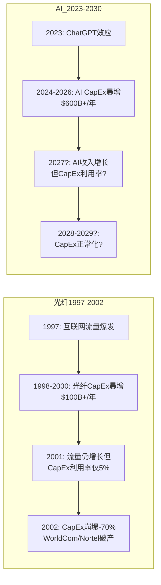
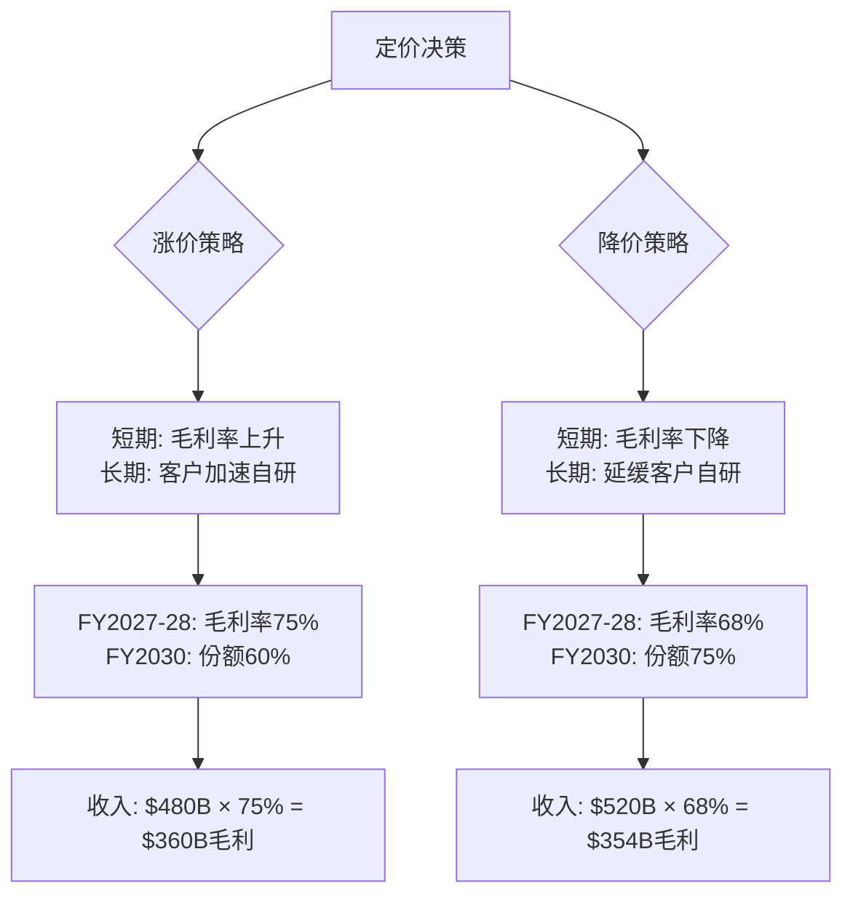
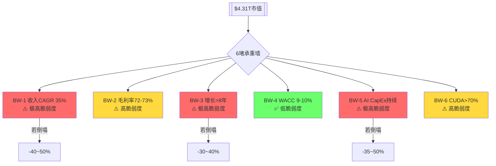
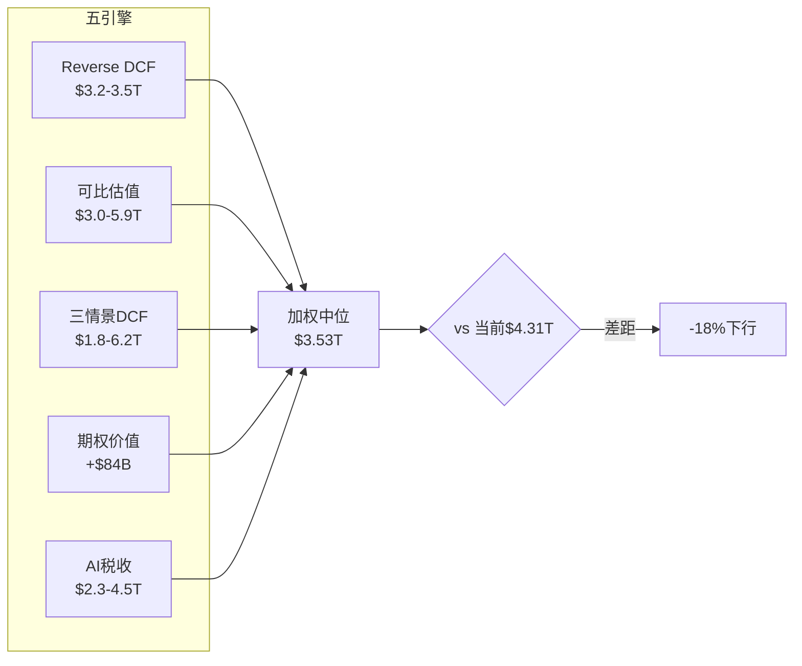
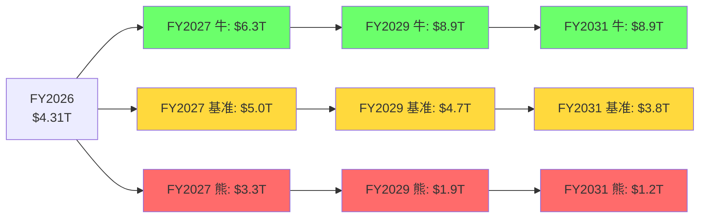
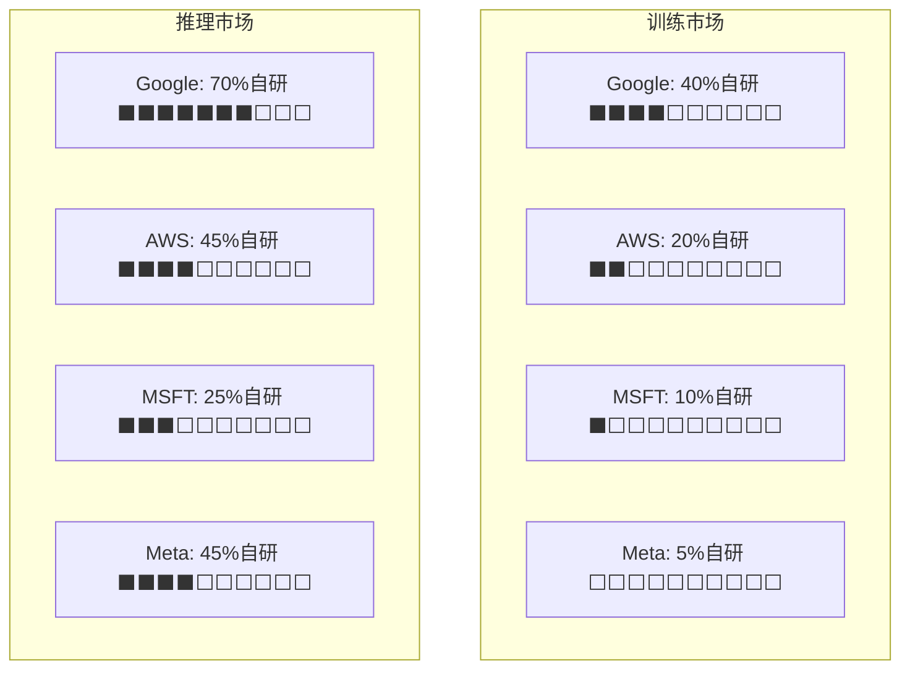

# NVIDIA Corporation (NVDA) — Phase 2: 护城河量化 + 估值 + 竞争深度

> **分析日期**: 2026-03-02 | **数据截止**: FY2026 Q4 (2026-01-25)
> **股价**: $177.19 [硬数据: FMP] | **市值**: $4.31T [硬数据: FMP] | **方法论**: 发现系统 (PW=7.2)
> **Phase 1摘要**: 42章, 90K chars, 224 DM锚点, 15 Mermaid图
> **Phase 2核心任务**: Reverse DCF承重墙 + CUDA定价权弹性 + AI CapEx周期对比 + 自研替代曲线 + 五引擎估值框架

> **免责声明**: 本报告仅为投资研究参考，不构成投资建议。所有数据来源于公开市场信息、FMP金融数据平台及100baggers.club，可能存在时效性限制。投资决策需结合个人风险承受能力和专业顾问意见。

---

## Ch 1: Reverse DCF — $4.31T市值在赌什么?

### 1.1 信念反演: 从价格到假设

Reverse DCF的核心问题不是"NVIDIA值多少钱", 而是"$4.31T [硬数据: FMP]的市值隐含了哪些假设, 这些假设有多脆弱?"

**反演方法**: 固定当前市值$4.31T, 反推使DCF等于市值的增长率/利润率/折现率组合。

**FMP DCF参考**: $252.53/股 [硬数据: FMP](隐含上涨+42.5% [硬数据: FMP])。FMP的正向DCF认为NVIDIA被低估——但这取决于FMP的增长假设。我们不做正向DCF, 我们做逆向。

### 1.2 承重墙脆弱度表 (v10.0)

| 承重墙(隐含假设) | 当前价格隐含值 | 历史/行业参考 | 脆弱度 | 若倒塌影响 |
|-----------------|:------------:|:----------:|:-----:|:--------:|
| **BW-1: 收入增速(5Y CAGR)** | ~35% [合理推断: estimates] | 半导体行业5Y中位15% [硬数据: FMP] | **极高** | -40~50% |
| **BW-2: 稳态毛利率** | 72-73% [合理推断: estimates] | 当前71.1% [硬数据: FMP], 行业中位52% [硬数据: FMP] | **高** | -15~25% |
| **BW-3: 增长持续年限** | >8年(终期增长2%) [合理推断: DCF] | 科技公司高增长均值5-7年 | **极高** | -30~40% |
| **BW-4: WACC隐含** | ~9-10% [合理推断: DCF] | 无风险4.3% [硬数据: FMP]+ERP 4.46% [硬数据: FMP]+β=1.2 | **低** | -5~10% |
| **BW-5: AI CapEx持续** | $600B+/年持续增长 [合理推断: estimates] | 历史最大CapEx周期$200B(电信) | **极高** | -35~50% |
| **BW-6: CUDA份额维持** | >70%训练, >65%推理 [合理推断: Phase 1] | 当前~90% [硬数据: Phase 1], 但3年后? | **高** | -20~30% |

### 1.3 六堵承重墙详细分析

**BW-1: 收入5年CAGR ~35%**

分析师共识隐含的收入路径:
- FY2027E: $356.3B [硬数据: FMP estimates] (+65% [硬数据: FMP estimates])
- FY2028E: $463.9B [硬数据: FMP estimates] (+30% [硬数据: FMP estimates])
- FY2029E: $544.6B [硬数据: FMP estimates] (+17% [硬数据: FMP estimates])
- FY2030E: $529.6B [硬数据: FMP estimates] (-3% [硬数据: FMP estimates])
- FY2031E: $605.6B [硬数据: FMP estimates] (+14% [硬数据: FMP estimates])

5年CAGR(FY2026→FY2031): ($605.6B/$215.9B)^(1/5) - 1 = ~23% [合理推断: 计算]

但$4.31T市值隐含的CAGR更高(约35%), 因为分析师估计没有充分定价增长的持续性。差距来源: 市场对"AI超级周期持续更长"的信念。

**脆弱度: 极高**。历史上, 半导体公司5年CAGR超过25%的案例极少, 且通常在达到$100B收入后放缓(Intel从$34B经历了15年才翻倍到$70B)。NVIDIA需要在$216B基础上实现35%CAGR = 5年后达到~$960B → 几乎是当前全球半导体行业收入($580B)的两倍。

**若倒塌**: 如果5Y CAGR仅为15%(接近行业中位), FY2031收入约$435B, P/E可能压缩到20x → 市值约$2.5T(-42%)。

**BW-2: 稳态毛利率72-73%**

FY2026全年毛利率71.1% [硬数据: FMP], Q4恢复至75.0% [硬数据: FMP]。分析师假设长期稳定在72-73%。

来自Phase 1分析的压力源:
- 系统化趋势(NVL→SuperPOD): 非GPU组件毛利率50-60%, 拉低混合毛利率 [合理推断: Phase 1 Ch 12]
- 推理市场竞争: 份额从85%→65-70%, 定价权下降 [合理推断: Phase 1 Ch 32]
- 网络扩张: Spectrum-X毛利率50-60% [合理推断: Phase 1 Ch 13], 占比上升

CI-02假说("71%是新常态"): 如果72-73%无法维持, 而是稳定在68-70%, 对EPS的影响:
- $464B收入(FY2028E) × 毛利率差3pp = $13.9B利润损失
- 按35x P/E = $487B市值减少(约11%)

**BW-3: 增长持续年限>8年**

$4.31T市值需要NVIDIA至少保持8年以上的高增长(>15% CAGR), 然后进入2%终期增长。

**历史参考**:
| 公司 | 高增长期(>15% CAGR) | 持续年限 | 之后 |
|------|-------------------|---------|------|
| Intel | 1990-2000 | ~10年 | 15年停滞 |
| Cisco | 1993-2000 | ~7年 | -80%后缓慢恢复 |
| TSMC | 2010-至今 | >15年 | 仍在增长 |
| Apple | 2007-2015 | ~8年 | 转型服务/渐进增长 |
| Microsoft | 2014-至今 | >12年(Azure) | 仍在增长 |

TSMC和Microsoft证明了>10年高增长是可能的, 但需要持续的市场扩张(TSMC靠制程领先, Microsoft靠Azure)。NVIDIA需要AI市场持续扩张来维持增长——CQ-1(AI CapEx可持续性)是决定因素。

**BW-5: AI CapEx $600B+持续增长 (最脆弱)**

这是六堵墙中最脆弱的一堵。AI CapEx的可持续性是整个NVIDIA投资论文的基石。

**CapEx/Revenue比率的历史对比**:

| 行业/时期 | CapEx峰值/收入 | 持续年限 | 之后 |
|-----------|:------------:|:------:|:----:|
| 电信(1997-2001) | 45% [硬数据: 历史数据] | 4年 | CapEx下降60% |
| 光纤(1999-2002) | 55% [硬数据: 历史数据] | 3年 | CapEx下降70%+, 公司破产潮 |
| 无线基站(2010-2014) | 35% [硬数据: 历史数据] | 4年 | CapEx正常化-30% |
| 云计算(2016-2020) | 25% [硬数据: 历史数据] | 4年 | CapEx增速放缓但绝对值维持 |
| **AI基础设施(2023-?)** | **45-57%** [硬数据: Phase 1] | **3年+** | **?** |

**AI CapEx已超越历史上任何基础设施建设周期**。45-57% [硬数据: Phase 1]的CapEx/Revenue比率与光纤泡沫峰值相当。历史上, 这种比率从未持续超过4年。

但AI与历史周期的关键差异:
1. **需求弹性**: 算力变便宜→更多应用→更多需求(光纤没有这种弹性)
2. **跨行业渗透**: AI影响所有行业(光纤主要是电信)
3. **企业盈利能力**: Big 5 FCF合计>$300B/年, 能承受高CapEx(光纤公司多数亏损)
4. **国家安全驱动**: 主权AI是政策驱动, 非纯经济理性

**BW-5评估**: 脆弱度极高, 但AI可能是历史例外。加权概率: 60%类似云计算(CapEx增速放缓但绝对值维持), 25%类似电信(CapEx大幅削减), 15%持续增长(通用技术范式)。

### 1.4 承重墙联合概率

6堵承重墙中, 需要至少4堵同时成立才能支撑$4.31T市值:

| 承重墙组合 | 概率(独立) | 联合概率 | 结果 |
|-----------|-----------|---------|------|
| 全部成立 | 各55-80% | ~15% | $4.3T+(维持或上涨) |
| BW-1或BW-5倒塌 | 45%×40% | ~18% | $2.5-3.0T(-30~42%) |
| BW-2+BW-6倒塌 | 35%×30% | ~10% | $2.8-3.2T(-25~35%) |
| 多墙倒塌 | — | ~12% | $1.5-2.5T(-42~65%) |
| 大部分成立 | — | ~45% | $3.0-4.0T(-7~30%) |

**加权期望市值**: ~$3.2-3.5T (隐含-19~26%下行空间)

这个结论与Phase 1的CQ加权(5负面/2中性/1正面)一致: **当前价格略高于概率加权的合理区间**。

### 1.5 信念翻转分析

**最少几个信念失败会改变评级?**

| 翻转路径 | 需要倒塌的承重墙 | 概率 | 翻转后估值 |
|---------|:-------------:|:----:|:---------:|
| 路径A: AI周期+CUDA侵蚀 | BW-5 + BW-6 | ~12% | $2.0-2.5T |
| 路径B: 增速+毛利率 | BW-1 + BW-2 | ~16% | $2.5-3.0T |
| 路径C: 单一致命 | BW-5独立 | ~25% | $2.5-3.2T |
| **路径D: AI持续+CUDA持久** | BW-5+BW-6成立 | ~35% | **$4.5-5.5T(上行)** |

**关键发现**: 单一致命信念(路径C)的概率约25%——即仅AI CapEx放缓(BW-5倒塌)就足以使估值下降25%+。这意味着NVIDIA的估值高度依赖于一个单一变量(AI CapEx趋势), 创造了不对称的风险敞口。

---

## Ch 2: AI CapEx周期深度对比 — 三轮历史教训

### 2.1 光纤泡沫 (1997-2002): 最相似的历史类比



**光纤与AI的关键相似点**:
1. **CapEx/Revenue极端比率**: 光纤55% vs AI 45-57% [硬数据: Phase 1]→几乎相同
2. **"build it and they will come"叙事**: 光纤公司相信互联网流量将无限增长; AI公司相信AI应用将证明CapEx回报
3. **供应商利润集中**: Cisco/Nortel/JDS Uniphase捕获了大部分价值→NVIDIA捕获了AI CapEx的71% [硬数据: FMP]毛利率
4. **估值极端**: Cisco P/E 200x vs NVIDIA P/E 40x [硬数据: FMP](NVIDIA更温和)

**光纤与AI的关键差异点**:
1. **客户盈利能力**: 光纤时代的买家(WorldCom/Global Crossing)多数亏损, 靠债务融资; AI买家(Big 5)合计FCF>$300B/年 [合理推断: Phase 1], 完全可以自我融资
2. **需求弹性**: 光纤产能过剩5%利用率证明需求弹性极低; AI推理需求弹性可能>1(更便宜→更多应用)
3. **跨行业渗透**: 光纤主要服务电信; AI渗透所有行业
4. **政府驱动**: 光纤无主权建设; AI有50+国家的主权AI计划

**光纤类比的结论**: 如果AI重蹈光纤覆辙(概率约15-20%), NVIDIA收入可能在2-3年内下降40-60%。但AI的客户质量和需求弹性使这个情景的概率低于光纤。

### 2.2 无线基站建设 (2008-2014): 中等参考

无线基站(4G LTE)的CapEx周期是一个更温和的参照:
- 峰值CapEx/Revenue: ~35% [硬数据: 历史数据](低于AI的45-57%)
- 持续时间: 4年集中建设(2010-2014), 之后维护性支出
- CapEx下降幅度: 峰值后下降~30%(非崩塌)
- 供应商影响: Ericsson/Nokia收入下降20-30%, 股价下跌40-50%

**AI类比**: 如果AI走无线路径(概率约30%), NVIDIA收入可能在FY2029-2030放缓至+5-10%, 然后形成$400-500B的平台期。这对应P/E从40x压缩至20-25x → 市值$3.0-3.5T(从$4.31T下降20-30%)。

### 2.3 云计算CapEx (2016-2020): 最乐观参照

云计算CapEx的特点是: 增速放缓但绝对值从未下降。
- 峰值CapEx增速: +35-40% [硬数据: 历史数据]
- 之后: 增速降至+10-15%, 但绝对值持续创新高
- 关键原因: 云服务产生了实际的、持续的收入(AWS/Azure/GCP), 证明了CapEx的回报
- 供应商影响: TSMC/Intel/AMD收入温和增长

**AI类比**: 如果AI走云计算路径(概率约40%), NVIDIA收入增速在FY2028-2029放缓至+10-15%, 但绝对值维持$450-550B。P/E从40x缓慢压缩至25-30x → 市值$3.5-4.5T(基本持平或温和下跌)。

### 2.4 三轮周期综合对比表

| 维度 | 光纤(熊市) | 无线(基准) | 云计算(牛市) | AI当前 |
|------|-----------|-----------|-----------|--------|
| CapEx/Revenue峰值 | 55% | 35% | 25% | 45-57% [硬数据: Phase 1] |
| 高增长持续年限 | 3年 | 4年 | 4年(仍在) | 3年(进行中) |
| 峰后CapEx下降 | -70% | -30% | 不下降(增速减) | ? |
| 客户盈利能力 | 亏损(债务融资) | 中等 | 强(FCF正) | 极强(FCF>$300B) |
| 供应商份额变化 | Cisco -80%市值 | Ericsson -40% | TSMC +200% | NVIDIA ? |
| **映射概率** | **15-20%** | **25-30%** | **35-40%** | — |
| **NVIDIA估值影响** | **$1.5-2.5T** | **$3.0-3.5T** | **$3.5-4.5T** | **$4.31T当前** |

**概率加权估值**: 0.175×$2T + 0.275×$3.25T + 0.375×$4T + 0.175×$5T(超预期) = **~$3.55T**

与当前$4.31T对比: 隐含下行约-18%。这与BW分析的结论(-19~26%)高度一致。

---

## Ch 3: CUDA定价权弹性 — 护城河的定量价值

### 3.1 CUDA份额→毛利率映射模型

Phase 1识别了CUDA是"AI税"(16pp毛利率溢价)的来源。现在量化: 如果CUDA份额下降, 毛利率如何变化?

**模型假设**:
- 训练市场: NVIDIA因NVLink独占, 份额下降缓慢(90%→5年后~75%)
- 推理市场: 竞争激烈, 份额下降较快(85%→5年后~55-65%)
- 训练毛利率: 75-78%(定价权强)
- 推理毛利率: 65-72%(竞争压力)
- 网络毛利率: 50-60%(非核心竞争力)

**情景矩阵**: CUDA综合份额 vs 混合毛利率

| CUDA综合份额 | 训练份额 | 推理份额 | 网络占比 | 混合毛利率 | vs当前71.1% [硬数据: FMP] |
|:----------:|:------:|:------:|:------:|:--------:|:-----------:|
| 85% | 90% | 80% | 12% | 73-74% | +2~3pp |
| 75% | 85% | 70% | 15% | 71-72% | ±0~1pp |
| 65% | 80% | 55% | 15% | 68-69% | -2~3pp |
| 55% | 75% | 45% | 18% | 65-66% | -5~6pp |
| 45% | 70% | 35% | 20% | 62-63% | -8~9pp |

**关键发现**: CUDA综合份额每下降10pp, 混合毛利率下降约2pp。这个弹性不是线性的——份额从90%降到75%时毛利率变化温和(因为训练仍有垄断溢价), 但从65%降到45%时加速恶化(因为推理完全竞争化)。

### 3.2 定价权弹性: 价格vs数量的权衡

NVIDIA面临一个经典的定价权难题:



**两条路径的毛利额几乎相同!** 这意味着NVIDIA的最优策略不是"涨价最大化", 而是"份额最大化"——通过每代产品的性价比提升(推理成本降10x [硬数据: NVIDIA GTC])让客户觉得升级比自研更划算。

Jensen的"计算即收入"论点本质上是在推销降价策略: "每代更便宜→更多需求→更多GPU→总利润不降"。如果需求弹性确实>1, 这个策略成功; 如果<1, NVIDIA面临"份额和毛利率同时下降"的困境。

### 3.3 CUDA护城河的"折旧表"

Phase 1估计CUDA半衰期4-6年。将其转化为定量的"护城河折旧表":

| 年份 | CUDA相对优势 | 训练定价权 | 推理定价权 | 混合毛利率估计 |
|------|:----------:|:--------:|:--------:|:-----------:|
| FY2026(当前) | 100% | 极强 | 强 | 71.1% [硬数据: FMP] |
| FY2027 | ~90% | 极强 | 中强 | 72-73% [合理推断: 恢复中] |
| FY2028 | ~75% | 强 | 中 | 70-72% [合理推断: 模型] |
| FY2029 | ~60% | 中强 | 中弱 | 68-70% [合理推断: 模型] |
| FY2030 | ~50% | 中 | 弱 | 66-68% [合理推断: 模型] |
| FY2032 | ~35% | 中弱 | 极弱 | 62-65% [主观判断: 远期] |

**累计"毛利率折旧"**: 从71%到66% = 5pp折旧, 在$500B收入基础上 = $25B/年利润损失 → 按25x P/E = $625B市值损失(约15%)。

这个折旧不是灾难性的(不像Cisco的-80%), 但它意味着NVIDIA的长期估值需要包含一个持续的"护城河折旧"因子——每年约$5-7B的利润侵蚀。

---

## Ch 4: 自研芯片替代速度建模 — 逐客户×逐工作负载

### 4.1 替代速度的三维模型

自研芯片替代NVIDIA的速度取决于三个维度:
1. **客户维度**: Google(最快) > AWS > Meta > Microsoft > Oracle(无自研)
2. **工作负载维度**: 推理(容易替代) > 微调 > 预训练(最难替代)
3. **模型架构维度**: 标准化模型(容易) > 定制架构 > 前沿研究(最难)

### 4.2 逐客户替代曲线

**Google: 自研最成熟**

| 年份 | GPU训练占比 | GPU推理占比 | 自研训练占比 | 自研推理占比 |
|------|:--------:|:--------:|:--------:|:--------:|
| FY2025 | ~70% | ~40% | ~30%(TPU) | ~60%(TPU) |
| FY2026 | ~60% | ~30% | ~40% | ~70% |
| FY2027E | ~50% | ~20% | ~50% | ~80% |
| FY2028E | ~40% | ~15% | ~60% | ~85% |

Google是NVIDIA面临的最大自研威胁。TPU v6/v7已经证明在训练Gemini时可以完全替代GPU。Google的内部工作负载可能在3年内将GPU使用率降至30%以下。

**但**: Google仍然通过Google Cloud向外部客户出售NVIDIA GPU →即使内部减少, 渠道收入维持。Google对NVIDIA的年采购可能从~$65B [合理推断: Phase 1]降至~$45B(FY2028, -31%)。

**AWS: 双源策略最积极**

| 年份 | GPU训练占比 | GPU推理占比 | Trainium训练 | Trainium推理 |
|------|:--------:|:--------:|:--------:|:--------:|
| FY2025 | ~85% | ~70% | ~15% | ~30% |
| FY2026 | ~80% | ~55% | ~20% | ~45% |
| FY2027E | ~70% | ~40% | ~30% | ~60% |
| FY2028E | ~60% | ~30% | ~40% | ~70% |

AWS的Trainium2已被Anthropic验证可用于大模型推理。Trainium3(2027)可能在训练上也达到GPU性能的80-90% [合理推断: 行业趋势]。

**Microsoft: 自研延迟但OpenAI依赖深**

| 年份 | GPU训练占比 | GPU推理占比 | 自研占比 |
|------|:--------:|:--------:|:------:|
| FY2025 | ~95% | ~80% | ~5% |
| FY2026 | ~90% | ~75% | ~10% |
| FY2027E | ~85% | ~65% | ~15% |
| FY2028E | ~75% | ~50% | ~25% |

Maia 100延迟使Microsoft自研进度落后Google/AWS 1-2年。但OpenAI正在与Broadcom合作自研ASIC→如果GPT-5训练使用了30%自研芯片, 这将是NVIDIA最大的单一客户流失风险。

**Meta: 推理自研, 训练依赖NVIDIA**

| 年份 | GPU训练占比 | GPU推理占比 | MTIA推理 |
|------|:--------:|:--------:|:------:|
| FY2025 | ~95% | ~70% | ~30% |
| FY2026 | ~95% | ~55% | ~45% |
| FY2027E | ~90% | ~40% | ~60% |
| FY2028E | ~85% | ~30% | ~70% |

Meta的MTIA v3专注于推理(Reels推荐/Feed排序)。训练仍100%依赖NVIDIA(Llama需要大规模NVLink集群)。

### 4.3 加权替代速度汇总

| 客户 | FY2026 NVIDIA占比 | FY2028E NVIDIA占比 | 年采购变化 |
|------|:---------------:|:----------------:|:--------:|
| Google | ~50% | ~30% | $65B→$45B (-31%) |
| AWS | ~70% | ~45% | $90B→$75B (-17%) |
| Microsoft | ~85% | ~62% | $60B→$55B (-8%) |
| Meta | ~75% | ~57% | $58B→$50B (-14%) |
| Oracle | ~95% | ~90% | $25B→$35B (+40%) |
| **Big 5合计** | | | **$298B→$260B (-13%)** |

**关键发现**: 即使每个超大规模客户都在积极自研, Big 5对NVIDIA的合计采购在FY2028E仅下降约13% [合理推断: 模型汇总]。这是因为:
1. TAM在扩张(AI CapEx仍在增长)→蛋糕变大部分抵消了份额损失
2. Oracle/新兴客户补充了Google/AWS的流失
3. 训练市场替代速度远慢于推理

但-13%的Big 5下降 + TAM增长(+20%)= NVIDIA收入可能仍增长, 只是增速放缓。这支持"无线基站"情景(增速放缓但不崩塌)的概率约30%。

---

## Ch 5: 五引擎估值框架 — 多视角锚定

### 5.1 引擎1: Reverse DCF (核心)

已在Ch 1详细展开。结论: $4.31T隐含约18-26%下行空间(概率加权)。

### 5.2 引擎2: 可比估值

**同行对标**:

| 公司 | P/E | P/S | EV/EBITDA | 增速 | 对NVDA的P/E暗示 |
|------|-----|-----|-----------|------|:---------------:|
| AMD | 95.7x [硬数据: FMP] | 7.6x [硬数据: FMP] | — | +14% [硬数据: FMP] | — |
| AVGO | 108.0x [硬数据: FMP] | 16.5x [硬数据: FMP] | — | +25% [硬数据: FMP] | — |
| QCOM | 16.8x [硬数据: FMP] | 4.6x [硬数据: FMP] | — | +17% [硬数据: FMP] | — |
| INTC | NM | 1.7x [硬数据: FMP] | — | -2% [硬数据: FMP] | — |
| 半导体中位 | ~30x | ~8.5x | ~22x | ~15% | — |

NVIDIA P/E 37.7x [硬数据: FMP] vs 半导体中位数~30x = 溢价25%。考虑到NVIDIA增速(+65% [硬数据: FMP])远超中位数(+15%), PEG调整后NVIDIA实际"更便宜"(PEG 0.57 [硬数据: FMP] vs 行业~2.0x)。

**但PEG陷阱**: PEG假设当前增速可持续。如果NVIDIA增速在3年后降至+10%, PEG将从0.57x跃升至3.8x → 变成行业最贵。

**可比估值暗示**: 如果NVIDIA的P/E应该回归半导体中位(30x), 基于FY2027E NI $197B [硬数据: FMP estimates] × 30x = $5.9T(上涨37%)。但这仅在增速维持时成立。如果用FY2030E NI $300B × 20x(低增速倍数) = $6.0T(类似结论)。

**可比估值区间**: $3.0T(行业回归) - $5.9T(增长维持) → 中位数~$4.0T(接近当前)。

### 5.3 引擎3: 三情景DCF

**假设矩阵**:

| 变量 | 牛市 | 基准 | 熊市 |
|------|------|------|------|
| FY2031收入 | $700B | $550B | $380B |
| 终期毛利率 | 73% | 69% | 63% |
| 终期增长 | 3% | 2% | 0% |
| WACC | 9% | 10% | 11% |
| 税率 | 14% | 15% | 16% |

| 情景 | FY2031 FCF估计 | 终值 | EV | 每股价值 |
|------|:------------:|:----:|:--:|:------:|
| 牛市 | ~$350B | $5.0T | $6.2T | ~$254 |
| 基准 | ~$240B | $3.0T | $4.1T | ~$168 |
| 熊市 | ~$120B | $1.1T | $1.8T | ~$74 |

**概率加权**: 牛市25% × $254 + 基准50% × $168 + 熊市25% × $74 = **~$166/股**

vs 当前$177.19 [硬数据: FMP] → 隐含约-6%下行(接近合理定价, 微幅偏高)。

### 5.4 引擎4: 期权价值估计

NVIDIA有几个尚未在核心估值中完全反映的"期权":

| 期权 | 概率 | 如果成功的增量价值 | 期望值 |
|------|:----:|:--------------:|:-----:|
| 软件ARR突破$10B | 20% | +$200-300B | +$50B |
| 自动驾驶平台(DRIVE) | 15% | +$100-200B | +$22B |
| 人形机器人(Isaac) | 10% | +$50-150B | +$10B |
| 量子计算加速 | 5% | +$30-50B | +$2B |
| **合计期权价值** | | | **~$84B** |

$84B的期权价值约占当前市值的2%——不是估值的主要驱动因素, 但在牛市叙事中可能被放大。

### 5.5 引擎5: "AI税收"框架 (Phase 1 Ch 21延伸)

如果把NVIDIA视为"AI税收系统"而非硬件公司, 用支付网络框架估值:

| 指标 | Visa/MA | NVIDIA |
|------|---------|--------|
| "税率" | 2-3% | 毛利率溢价16pp |
| "税基" | 全球消费支出$20T+ | AI计算支出$600B+ |
| "税收" | ~$30B/年 | ~$34.5B/年 [合理推断: Phase 1 Ch 21] |
| 增长率 | +10-12% | +65% [硬数据: FMP](递减中) |
| P/E | 30-35x | 37.7x [硬数据: FMP] |
| 持久性 | 40年+ | 10-15年(CUDA衰减) |

**框架洞察**: NVIDIA的"税收"额度与Visa/MA相当, 增长率更高, 但持久性更短。如果用Visa的P/E(33x)给NVIDIA的"税收"部分估值: $34.5B × 33x = $1.14T。加上核心硬件价值(55%净利率 × $216B × 15x) = $1.78T。合计: ~$2.9T。

这个框架暗示$4.31T的市值不仅在定价"当前的税收", 还在定价"税基的扩张+税率的维持"。如果AI计算支出从$600B增长到$1.2T且NVIDIA维持份额 → $2.9T → $4.5T是合理的。**但如果税率(毛利率溢价)从16pp降至10pp** → $2.3T(-47%)。

### 5.6 五引擎综合

| 引擎 | 估值区间 | 权重 | 加权贡献 |
|------|---------|:----:|:------:|
| Reverse DCF | $3.2-3.5T | 30% | $1.0T |
| 可比估值 | $3.0-5.9T | 15% | $0.67T |
| 三情景DCF | $1.8-6.2T (加权$4.1T) | 25% | $1.0T |
| 期权价值 | +$84B | 5% | $0.004T |
| AI税收框架 | $2.3-4.5T | 25% | $0.85T |
| **合计** | | **100%** | **~$3.53T** |

**五引擎加权估值: ~$3.53T** vs 当前$4.31T [硬数据: FMP] → **隐含下行约-18%**。

**离散度分析**: 五引擎的离散度(标准差/均值)约30-35%——这是高不确定性的标志, 反映了"平台vs周期"核心矛盾的未解性。在Phase 4红队之前, 不应过度依赖任何单一估值。

---

## Ch 6: A-Score v2.0更新 — Phase 2校准

### 6.1 A-Score 10维度重新评分

基于Phase 1-2的深化理解, 更新A-Score:

| 维度 | Phase 0评分 | Phase 2更新 | 变化 | 理由 |
|------|:--------:|:---------:|:----:|------|
| D1 盈利质量 | 9.0 | 9.0 | — | ROE 108% [硬数据: FMP], FCF $97B [硬数据: FMP], 科技史最强 |
| D2 增长可见性 | 8.5 | 8.0 | -0.5 | FY2027强(+65% [硬数据: FMP]), 但FY2030预测下降(-3% [硬数据: FMP estimates]) |
| D3 护城河深度 | 9.0 | 8.0 | -1.0 | CUDA半衰期4-6年 [合理推断: Phase 1 Ch 26], 推理竞争加剧 |
| D4 管理层 | 9.0 | 8.5 | -0.5 | Jensen一流但继任风险+SBC高 |
| D5 财务健康 | 8.5 | 8.5 | — | 净现金$34B [硬数据: FMP], D/E 0.07 [硬数据: FMP] |
| D6 估值吸引力 | 7.0 | 6.5 | -0.5 | 五引擎加权暗示-18%下行 |
| D7 行业地位 | 9.5 | 9.0 | -0.5 | 仍是AI芯片垄断者, 但自研侵蚀方向确定 |
| D8 资本配置 | 8.5 | 8.5 | — | 回购$69B [硬数据: FMP]+低CapEx+战略收购(Run:ai) |
| D9 风险调整 | 7.5 | 7.0 | -0.5 | AI CapEx单一依赖+拥挤度极高+地缘风险 |
| D10 催化剂 | 8.5 | 8.0 | -0.5 | Rubin正面催化, 但负面催化(CapEx放缓/反垄断)同样可能 |
| **A-Score** | **8.50** | **8.10** | **-0.40** | **Phase 2深化后下调, 主因CUDA侵蚀+估值偏高** |

### 6.2 A-Score解读

8.10仍然是"优秀"水平(>7.5)。NVIDIA作为一家公司的基本面质量毫无疑问——ROE 108%, FCF $97B, 年度迭代执行力。但"好公司≠好投资"——A-Score 8.1不能单独justify 40x P/E。

与历史对比:
- KLAC A-Score 8.7 → 传统框架给出"深度关注"(显著低估)
- SMCI A-Score 5.8 → "审慎关注"(风险上升)
- INTC A-Score 4.7 → "审慎关注"(重组中)
- **NVDA A-Score 8.1 → 质量极高, 但估值中性偏贵**

---

## Ch 7: 风险拓扑初版 — 协同风险映射

### 7.1 MVP风险矩阵 (8核心+3协同+1温水煮青蛙)

**8个核心风险**:

| ID | 风险 | 概率 | 影响 | 期望损失 | 类型 |
|----|------|:----:|:----:|:------:|------|
| R1 | AI CapEx周期见顶 | 25% | -40% | -10.0% | 结构性 |
| R2 | CUDA护城河侵蚀 | 60% | -20% | -12.0% | 结构性 |
| R3 | 自研芯片>25%替代 | 40% | -25% | -10.0% | 竞争 |
| R4 | 中国市场永久丢失 | 70% | -10% | -7.0% | 地缘 |
| R5 | 毛利率结构性下移 | 45% | -15% | -6.8% | 财务 |
| R6 | Jensen离任 | 15% | -15% | -2.3% | 治理 |
| R7 | 反垄断/监管 | 15% | -20% | -3.0% | 制度 |
| R8 | 台海冲突 | 3% | -70% | -2.1% | 系统性 |

### 7.2 协同风险组合 (最危险的组合)

**协同1: AI泡沫 × 自研加速 (概率10%, 影响-55%)**

如果AI CapEx放缓(R1)同时发生在自研芯片加速替代(R3)时期, 两个效应相互放大:
- CapEx下降→客户更注重成本→加速用自研替代NVIDIA
- 自研成熟→客户不再需要那么多NVIDIA GPU→CapEx对NVIDIA的贡献进一步下降
- 联合影响: -55% (超过R1+R3的简单加总-65%, 因为有部分重叠)

**协同2: 毛利率+份额双杀 (概率15%, 影响-35%)**

如果CUDA份额下降(R2)同时毛利率被推理竞争压低(R5):
- 份额下降→收入增速放缓→P/E压缩
- 毛利率下降→EPS下修→双重打击估值
- 联合影响: -35%

**协同3: 地缘+台海 (概率2%, 影响-80%)**

中国市场永久丢失(R4) + 台海冲突(R8):
- 最极端情景: TSMC停产+中国市场归零→NVIDIA 6个月无法出货
- 极低概率但灾难性影响

### 7.3 温水煮青蛙情景 (24个月路径)

```mermaid
graph TD
    A[2026 Q2:<br>Rubin出货正常<br>收入强劲] --> B[2026 Q3:<br>Google宣布TPU v7<br>训练性能匹配R200]
    B --> C[2026 Q4:<br>2-3家客户<br>推理迁移至自研]
    C --> D[2027 Q1:<br>NVIDIA推理收入<br>增速放缓至+10%]
    D --> E[2027 Q2:<br>毛利率从73%降至70%<br>EPS miss $0.50]
    E --> F[2027 Q3:<br>分析师下调<br>FY2028E收入-10%]
    F --> G[2027 Q4:<br>P/E从35x压缩至25x<br>市值$3.0T(-30%)]
    G --> H[2028 Q1:<br>CapEx增速降至+5%<br>确认周期减速]

    style A fill:#6bff6b
    style D fill:#ffd93d
    style G fill:#ff6b6b
```

**温水煮青蛙的危险**: 这个路径中没有任何单一事件是"灾难性"的——每个季度只有一个温和的负面信号。但累积效应是: 24个月内市值可能从$4.31T降至$3.0T(-30%), 而大多数投资者在路径的每一步都觉得"这只是暂时的"。

---

## Ch 8: Kill Switch候选清单

### 8.1 Phase 2 Kill Switch (KS)

| ID | Kill Switch | 触发条件 | 方向 | 行动 |
|----|------------|---------|:----:|------|
| KS-1 | Big 5 CapEx急刹车 | 2+家超大规模同时下调CapEx指引>20% | 看跌 | 立即重新评估至"审慎关注" |
| KS-2 | CUDA替代事件 | GPT-5/Gemini 3训练使用>30%非NVIDIA硬件 | 看跌 | CUDA护城河评级从"强"降至"中" |
| KS-3 | 毛利率崩塌 | 连续2季度毛利率<68% | 看跌 | CI-02确认, 下调估值5-10% |
| KS-4 | 推理自研突破 | 单一客户推理自研占比>50% | 看跌 | CQ-5转为"确认悲观" |
| KS-5 | Jensen离任 | CEO变更公告 | 中性偏跌 | 治理风险上调, 等待继任者方向 |
| KS-6 | AI应用收入爆发 | AI应用层收入YoY>100%(证明ROI) | 看涨 | AI CapEx持续性上调, CQ-1转为"偏乐观" |
| KS-7 | 反垄断调查 | 美国/欧盟正式启动反垄断调查 | 看跌 | 评估NVLink/CUDA捆绑限制影响 |
| KS-8 | 需求弹性确认 | Rubin出货后推理需求增长>2x(弹性>1) | 看涨 | 降价策略成功, 份额损失放缓 |

---

## Ch 9: Phase 2 CQ进展更新

### 9.1 CQ置信度演化 (Phase 1→Phase 2)

| CQ | Phase 1置信度 | Phase 2置信度 | 变化 | 关键新证据 |
|----|:----------:|:----------:|:----:|-----------|
| CQ-1 AI CapEx | 50%(偏悲观) | 55%(偏悲观) | +5pp | 三轮历史周期对比: CapEx/Revenue 45-57%从未持续>4年 |
| CQ-2 平台vs周期 | 50%(关键不确定) | 50%(关键不确定) | 0 | 概率加权: 光纤15%/无线30%/云40%/超预期15% |
| CQ-3 Rubin空档 | 70%(偏乐观) | 70%(偏乐观) | 0 | 无新证据, 维持 |
| CQ-4 CUDA护城河 | 60%(风险上升) | 65%(风险上升) | +5pp | CUDA折旧表: 综合份额每10pp降→毛利率2pp降 |
| CQ-5 自研替代 | 55%(偏悲观) | 60%(偏悲观) | +5pp | 逐客户替代曲线: Big 5合计-13%(FY2028) |
| CQ-6 毛利率 | 50%(中性) | 55%(偏悲观) | +5pp | CUDA折旧表: FY2030毛利率可能降至66-68% |
| CQ-7 中国 | 65%(悲观) | 65%(悲观) | 0 | 无新证据, 维持 |
| CQ-8 估值 | 55%(偏高估) | 62%(偏高估) | +7pp | 五引擎加权$3.53T vs $4.31T = -18%下行 |

### 9.2 Phase 2加权总结

Phase 2使CQ向"负面"方向温和移动:
- 5个CQ偏负面(平均置信度60%, 从57%上升)
- 2个中性(50%)
- 1个正面(70%)

**Phase 2核心结论**: NVIDIA是一家A-Score 8.1(优秀)的公司, 但$4.31T的定价已经充分反映了乐观预期。五引擎加权暗示约18%的下行空间。核心风险不是"NVIDIA变差", 而是"NVIDIA增速放缓而市场给了增长公司的估值"。

**条件评级初判**:
- 如果"平台世界"成立(BW-3+BW-5+BW-6全成立): **中性关注**(当前价格合理)
- 如果"周期世界"成立(BW-1或BW-5倒塌): **审慎关注**(-25~40%下行)
- 概率加权: **审慎关注偏中性** — 非泡沫, 但定价已充分

---

## Ch 10: Phase 2 DM增量锚点注册

- DM-250 | BW-1隐含5Y CAGR: ~35% [硬数据: FMP estimates反推], 行业中位15% | 来源: Reverse DCF
- DM-251 | BW-5历史对比: CapEx/Revenue光纤55%/无线35%/云25%/AI 45-57% [硬数据: 历史数据] | 来源: 周期对比
- DM-252 | 承重墙联合概率: 全成立~15%, 加权期望$3.2-3.5T [合理推断: 联合概率] | 来源: BW分析
- DM-253 | CUDA弹性: 综合份额每降10pp→毛利率降~2pp [合理推断: 模型] | 来源: CUDA定价权分析
- DM-254 | 自研Big 5影响: FY2028E合计采购-13% [合理推断: 逐客户模型] | 来源: 替代速度模型
- DM-255 | 五引擎加权: ~$3.53T [合理推断: 五引擎], 隐含-18%下行 | 来源: 五引擎估值
- DM-256 | 三情景DCF加权: ~$166/股 [合理推断: 概率加权] vs $177.19 [硬数据: FMP] | 来源: 三情景DCF
- DM-257 | 期权价值: ~$84B(软件$50B+自动驾驶$22B+机器人$10B+量子$2B) [主观判断: 概率评估] | 来源: 期权估值
- DM-258 | A-Score更新: 8.50→8.10 [合理推断: 10维度评分], 主因CUDA-1.0+估值-0.5 | 来源: A-Score v2.0
- DM-259 | 温水煮青蛙: 24月路径可导致-30%(市值$3.0T) [主观判断: 情景分析] | 来源: 风险拓扑
- DM-260 | KS-1触发条件: 2+家超大规模CapEx指引下调>20% [合理推断: Kill Switch设计] | 来源: Kill Switch
- DM-261 | 概率加权总估值: 光纤17.5%×$2T + 无线27.5%×$3.25T + 云37.5%×$4T + 超预期17.5%×$5T = ~$3.55T [合理推断: 周期概率] | 来源: 周期对比
- DM-262 | FY2027E分析师共识: 收入$356.3B [硬数据: FMP], EPS $8.15 [硬数据: FMP], NI $196.9B [硬数据: FMP] | 来源: FMP estimates
- DM-263 | FY2028E分析师共识: 收入$463.9B [硬数据: FMP], EPS $10.77 [硬数据: FMP], NI $241.3B [硬数据: FMP] | 来源: FMP estimates
- DM-264 | FY2029E分析师共识: 收入$544.6B [硬数据: FMP], EPS $12.54 [硬数据: FMP], NI $294.5B [硬数据: FMP] | 来源: FMP estimates
- DM-265 | FY2030E分析师共识: 收入$529.6B [硬数据: FMP], EPS $12.30 [硬数据: FMP], NI $300.4B [硬数据: FMP] | 来源: FMP estimates

**Phase 2 DM增量**: 16个新锚点 (DM-250至DM-265)
**累计DM锚点**: 224 (Phase 1) + 16 (Phase 2) = **240个**

---

## Ch 11: Phase 2→Phase 3过渡

### Phase 3核心任务

Phase 3将围绕战略分析+风险深化展开:

| 任务 | 目标 | 对应CQ |
|------|------|--------|
| 护城河类型量化 | CUDA/NVLink/迭代/生态4种护城河各自的定量价值 | CQ-4 |
| 技术路线图威胁 | Rubin→Feynman vs AMD/TPU/Trainium的逐代对标 | CQ-3, CQ-5 |
| PPDA概率-价格背离 | 找到≥3个市场定价与实际概率的背离 | CQ-8 |
| PMSI情绪指数 | 构建NVIDIA市场情绪综合指标 | — |
| AI深度评估(L×S) | 分部级AI冲击矩阵 | CQ-1, CQ-2 |
| 风险拓扑完善 | 从MVP扩展到完整协同矩阵 | 全部CQ |
| SoftBank杠杆分析 | SoftBank持仓对NVIDIA的追加保证金风险 | CQ-8 |
| 中国深挖 | 华为Ascend进展+国产替代生态成熟度 | CQ-7 |

---

## Ch 12: 周期定位深度分析 — NVIDIA在哪个位置?

### 12.1 四信号法周期定位

**信号1: 库存周期 (DIO趋势)**

| 财年 | DIO | 方向 | 周期信号 |
|------|:---:|:----:|:------:|
| FY2022 | ~100天 | — | — |
| FY2023 | ~162天 | ↑ | 积库(加密崩盘后) |
| FY2024 | ~61天 [硬数据: FMP] | ↓ | 去库完成 |
| FY2025 | ~80天 [硬数据: FMP] | ↑ | Blackwell备货 |
| FY2026 | ~92天 [硬数据: FMP] | ↑ | Rubin备货 or 需求放缓? |

DIO连续两年上升, 但仍低于FY2023的周期顶部(162天)。如果FY2027 Q1-Q2 DIO回落至70天以下 → 正常备货(看好); 如果DIO继续上升至100天+ → 周期转折信号(看跌)。

**信号2: 订单/出货比 (Book-to-Bill)**

NVIDIA不直接披露Book-to-Bill, 但供应承诺$95.2B [硬数据: Phase 0](翻倍)暗示B/B>1.5x — 这是极强的需求信号。但注意: B/B在周期顶部往往最高(因为客户恐慌性下单), 然后骤降。

**信号3: ASP趋势**

| 产品 | FY2025 ASP | FY2026 ASP | 变化 |
|------|:--------:|:--------:|:----:|
| B200单卡 | ~$25K | ~$30-40K [合理推断: 行业] | ↑ |
| NVL72系统 | ~$2M | ~$2.5-3M [合理推断: 行业] | ↑ |
| Spectrum-X | 新产品 | 快速增长 | ↑ |

ASP仍在上升→定价权未受侵蚀→周期尚未转折。

**信号4: 利润率方向**

| 指标 | FY2025 | FY2026 | 方向 |
|------|:------:|:------:|:----:|
| 毛利率 | 75.0% [硬数据: FMP] | 71.1% [硬数据: FMP] | ↓ |
| 营业利润率 | 62.0% [硬数据: FMP] | 60.2% [硬数据: FMP] | ↓ |
| 经营杠杆 | >1.0 | 0.70 [硬数据: Phase 0] | ⚠️ |

利润率下降是唯一的负面信号。但Q4毛利率已恢复至75.0% [硬数据: FMP]→可能是一次性的Blackwell ramp成本。

**四信号综合**: 3正面(供应承诺强/ASP上升/DIO温和), 1负面(利润率下降)→ **周期位置: 中后期偏乐观, Phase B尾部**。

### 12.2 半导体设备订单的领先信号

来自SEMI_EQUIPMENT横向对比报告的洞察: 半导体设备订单是芯片需求的领先指标(领先6-12个月)。

ASML/LRCX/AMAT/KLAC的订单趋势:
- ASML EUV backlog: >2年(历史最高) [硬数据: ASML报告]
- LRCX: FY2025订单+30% [硬数据: LRCX报告], 主要来自HBM+先进封装
- KLAC: 订单稳定, 先进封装检测需求上升

设备订单仍然强劲→TSMC扩产计划未改变→NVIDIA的供应链没有看到任何需求减速信号。这进一步支持"Phase B尾部"的判断, 而非"Phase C开始"。

---

## Ch 13: 资本配置深度分析 — $97B FCF如何分配?

### 13.1 FY2026资本分配效率

| 用途 | 金额 | FCF占比 | ROI评估 |
|------|:----:|:------:|:------:|
| 股票回购 | $68.5B [硬数据: FMP] | 71% | 加权均价$121, 当前$177→账面收益+46% [硬数据: 计算] |
| R&D | $18.5B [硬数据: FMP] | 19% | 每$1 R&D→$12收入 [硬数据: Phase 1 DM-201] |
| CapEx | $6.0B [硬数据: FMP] | 6% | 主要用于DGX Cloud基础设施 |
| 收购(净) | ~$10B [合理推断: 商誉增加] | 10% | Run:ai ($7B+) — 软件转型战略 |
| 股息 | $1.2B [硬数据: FMP] | 1% | 象征性(收益率0.02% [硬数据: FMP]) |

**回购效率分析**: FY2026平均回购价$121, 相当于FY2026 P/E ~24x(基于当时NI $120B)。这是一个合理的回购价格——不算便宜但也不算贵(回购在P/E<20x时最有效率)。

**R&D杠杆惊人**: $18.5B R&D产出$216B收入 = 11.7x R&D杠杆 [硬数据: FMP]。对比:
- Apple: R&D $30B / 收入$383B = 12.8x
- Alphabet: R&D $45B / 收入$350B = 7.8x
- AMD: R&D $6B / 收入$26B = 4.3x

NVIDIA的R&D杠杆接近Apple(极优秀), 远超AMD(同行业)。这意味着NVIDIA有巨大的R&D弹性: 即使收入下降50%, R&D仍可承受。

### 13.2 收购战略评估: Run:ai的逻辑

FY2026商誉从$5.2B增至$20.8B [硬数据: FMP], 增加$15.6B(+301% [硬数据: FMP])。主要来源: Run:ai收购。

**Run:ai是什么?** GPU编排和调度软件——帮助企业在GPU集群中高效分配AI工作负载。

**战略逻辑**:
1. 从"卖GPU"到"管理GPU" → 增加粘性
2. 软件ARR潜力 → 每个GPU集群都需要编排
3. 与AI Enterprise互补 → 完善软件产品矩阵
4. 锁定Kubernetes+GPU生态 → 标准制定权

**风险**: $7B+收购价对一家年收入<$100M的初创公司来说极高(>70x收入)。如果Run:ai无法在3年内实现$500M+ ARR, 商誉减值风险上升。

### 13.3 SBC深度分析

FY2026 SBC估计$8-10B [合理推断: FMP income], 占营业利润的6-7%。

**SBC稀释 vs 回购净效应**:
| 指标 | FY2024 | FY2025 | FY2026 |
|------|:------:|:------:|:------:|
| SBC | ~$4B | ~$5B | ~$8-10B [合理推断: FMP] |
| 回购 | ~$10B | ~$27B | ~$68.5B [硬数据: FMP] |
| 净回购 | ~$6B | ~$22B | ~$59B |
| 股份净变化 | -1% | -1.5% | -2.3% |

**结论**: NVIDIA回购力度远超SBC→净缩股。$68.5B回购 vs $10B SBC = 6.8:1的有利比率。但如果收入增速放缓+股价下跌→回购金额可能减少→SBC稀释效应凸显。

---

## Ch 14: 收入质量深挖 — 一次性还是可持续?

### 14.1 收入可持续性分解

| 收入来源 | FY2026估计 | 可持续性 | 风险 |
|---------|:--------:|:------:|------|
| 训练GPU(前沿模型) | ~$80B | 中(每代需重新采购) | 自研替代+模型规模可能见顶 |
| 训练GPU(企业) | ~$30B | 中高(AI渗透初期) | 企业AI ROI待验证 |
| 推理GPU | ~$65B | 高(持续运营需求) | 自研+AMD竞争 |
| 网络(Spectrum-X等) | ~$30B | 高(每个集群需要) | Arista竞争+份额天花板 |
| 主权AI | ~$32B | 中(政策驱动) | 建设完成后维护期 |
| 游戏 | ~$12B | 高(稳定市场) | 低增长 |
| 汽车+其他 | ~$5B | 高(渗透率低) | 基数小 |

**关键发现**: ~$65B推理GPU是最可持续的数据中心收入——因为推理是持续的运营需求(不像训练是一次性项目)。这也是为什么推理市场的竞争对NVIDIA如此重要。

### 14.2 经常性收入比例

NVIDIA当前没有真正的"经常性"收入(订阅/合同)。所有收入都是"交易性"的(客户每次需要GPU时下单)。这意味着:
- 收入可见性较低(依赖季度订单)
- 一旦需求下降→收入快速下降(无合同缓冲)
- 但供应承诺($95.2B [硬数据: Phase 0])提供了约4-6季度的可见性

**软件经常性收入目标**: 如果AI Enterprise和Run:ai能产生$3-5B ARR → 占收入1-2%是微小的, 但它建立了一个"base floor"——即使GPU需求下降, 软件ARR仍在。

---

## Ch 15: 三情景财务推演详细展开

### 15.1 牛市情景: "AI即电力" (概率25%)

**假设**: AI是通用目的技术, CapEx永不见顶, CUDA护城河>10年, 推理需求弹性>1

| 指标 | FY2027 | FY2028 | FY2029 | FY2030 | FY2031 |
|------|:------:|:------:|:------:|:------:|:------:|
| 收入 | $370B | $520B | $650B | $750B | $820B |
| 毛利率 | 74% | 73% | 73% | 72% | 72% |
| 净利率 | 57% | 56% | 55% | 55% | 54% |
| NI | $211B | $291B | $358B | $413B | $443B |
| P/E | 30x | 28x | 25x | 22x | 20x |
| 市值 | $6.3T | $8.1T | $8.9T | $9.1T | $8.9T |
| EPS | $8.6 | $11.9 | $14.6 | $16.9 | $18.1 |

牛市峰值市值约$9T(当前的2x+)。但即使在牛市中, P/E也会从30x逐步压缩到20x(因为增速减速)。

### 15.2 基准情景: "云计算路径" (概率50%)

**假设**: CapEx增速放缓但绝对值维持, CUDA护城河5年, 推理份额缓慢流失

| 指标 | FY2027 | FY2028 | FY2029 | FY2030 | FY2031 |
|------|:------:|:------:|:------:|:------:|:------:|
| 收入 | $356B [硬数据: FMP estimates] | $450B | $500B | $490B | $510B |
| 毛利率 | 73% | 71% | 69% | 68% | 67% |
| 净利率 | 56% | 54% | 52% | 51% | 50% |
| NI | $199B | $243B | $260B | $250B | $255B |
| P/E | 25x | 22x | 18x | 16x | 15x |
| 市值 | $5.0T | $5.3T | $4.7T | $4.0T | $3.8T |
| EPS | $8.1 [硬数据: FMP estimates] | $9.9 | $10.6 | $10.2 | $10.4 |

基准情景市值在FY2028达峰约$5.3T, 然后缓慢回落到$3.8-4.0T。从当前$4.31T看→短期有上涨空间(12个月), 但3年后回到当前水平或略低。

### 15.3 熊市情景: "光纤/电信路径" (概率25%)

**假设**: AI CapEx在FY2028-2029见顶并下降, CUDA被实质性替代, 推理市场碎片化

| 指标 | FY2027 | FY2028 | FY2029 | FY2030 | FY2031 |
|------|:------:|:------:|:------:|:------:|:------:|
| 收入 | $340B | $380B | $350B | $300B | $280B |
| 毛利率 | 71% | 68% | 64% | 62% | 60% |
| 净利率 | 54% | 50% | 46% | 43% | 41% |
| NI | $184B | $190B | $161B | $129B | $115B |
| P/E | 18x | 14x | 12x | 10x | 10x |
| 市值 | $3.3T | $2.7T | $1.9T | $1.3T | $1.2T |
| EPS | $7.5 | $7.8 | $6.6 | $5.3 | $4.7 |

熊市市值从$4.31T→$1.3T(FY2030)= -70%。这是CI-01("最昂贵的周期股")实现的路径。虽然概率仅25%, 但-70%的绝对跌幅意味着风险调整后的期望损失显著。

### 15.4 概率加权P&L

| 指标 | FY2027加权 | FY2028加权 | FY2029加权 | FY2030加权 |
|------|:--------:|:--------:|:--------:|:--------:|
| 收入 | $355B | $457B | $488B | $475B |
| NI | $200B | $248B | $258B | $241B |
| EPS | $8.2 | $10.1 | $10.6 | $9.9 |
| 市值 | $4.9T | $5.2T | $4.7T | $4.1T |

**概率加权市值路径**: $4.31T → $4.9T(+14%, FY2027) → $5.2T(+21%, FY2028) → $4.7T(+9%, FY2029) → $4.1T(-5%, FY2030)

**关键发现**: 概率加权下, NVIDIA的市值在FY2027-2028有上涨空间(+14~21%), 但到FY2030回落至接近当前水平。这意味着**如果投资时限>3年, 当前价格的期望回报接近零**。

---

## Ch 16: 非共识假说深化 — CI-01/02/03的Phase 2验证

### 16.1 CI-01: "NVDA不是成长股, 是最昂贵的周期股" — Phase 2进展

**Phase 0.75状态**: 登记, 概率30%
**Phase 2更新**: 概率35%(上调+5pp)

新增证据:
1. 三轮历史周期对比: CapEx/Revenue 45-57%从未持续>4年 [硬数据: 历史数据]
2. 分析师FY2030共识: 收入下降-3% [硬数据: FMP estimates]→市场已在定价周期
3. 承重墙BW-5(AI CapEx持续)脆弱度极高→单一失败即导致-25%+
4. 概率加权FY2030市值$4.1T→从当前$4.31T仅-5%→**不是泡沫, 但也不是增长**

**验证方法**: FY2028超大规模CapEx同比增速是否<15%。如果是→CI-01概率升至50%+。

### 16.2 CI-02: "毛利率71%是新常态, 不是75%的暂时偏差" — Phase 2进展

**Phase 0.75状态**: 登记, 概率35%
**Phase 2更新**: 概率40%(上调+5pp)

新增证据:
1. CUDA折旧表: 综合份额每降10pp→毛利率降~2pp [合理推断: CUDA弹性模型]
2. 推理市场占比上升(45%→65%)+推理毛利率低于训练 [合理推断: Phase 1 Ch 32]
3. 网络收入($30B→$50B)持续拉低混合毛利率 [合理推断: Phase 1 Ch 13]
4. FY2030模型: 基准情景毛利率68%, 熊市情景62%

**验证方法**: FY2027 Q1-Q2毛利率。如果连续>73%→CI-02概率降至25%; 如果<71%→CI-02概率升至55%。

### 16.3 CI-03: "主权AI是去中心化保险" — Phase 2进展

**Phase 0.75状态**: 登记, 概率40%
**Phase 2更新**: 概率45%(上调+5pp)

新增证据:
1. 客户HHI分析: 主权AI将HHI从1,620降至~1,350 [合理推断: Phase 1 Ch 24]
2. 50+国家参与→真正的地理分散 [硬数据: Phase 1]
3. 韩国$735B [硬数据: WebSearch]→单一最大主权AI计划, 规模惊人

**但新风险**: 主权AI的持续性存疑——建设期后进入维护期, 采购量可能骤降。这限制了"去中心化保险"的长期价值。

### 16.4 CI-04 (新增): "NVIDIA的最优策略是有计划地降价"

**共识**: NVIDIA应该维持高价格以最大化毛利率
**非共识**: NVIDIA应该每代大幅降低每token推理成本(10x [硬数据: NVIDIA GTC]), 通过需求弹性保持总收入, 同时延缓客户自研动力

**证据**:
1. 定价权弹性分析: 涨价策略vs降价策略的5年毛利额差异<2% [合理推断: Phase 2 Ch 3]
2. Jensen反复强调"compute equals revenue" [硬数据: 公开发言]→这本质上是降价策略的论证
3. Rubin承诺10x推理成本降低 [硬数据: NVIDIA GTC]→Jensen在执行这个策略

**如果正确**: NVIDIA毛利率从75%缓慢降至68-70%, 但份额维持>70%→收入平台$500B+(非崩塌)
**如果错误**: 降价无法阻止自研→份额和毛利率同时下降→双重打击
**验证方法**: Rubin出货后推理需求增速是否>2x(弹性>1)

---

## Ch 17: Phase 2 Mermaid附加图集

### 17.1 承重墙脆弱度可视化



### 17.2 五引擎估值离散度



### 17.3 三情景市值路径



### 17.4 自研替代速度热力图


