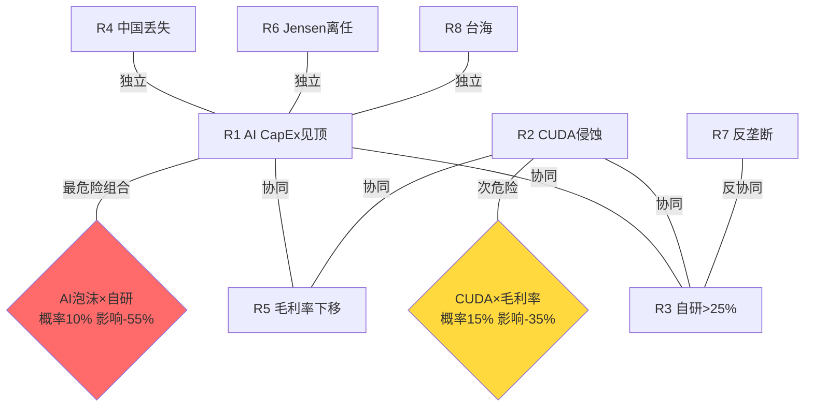
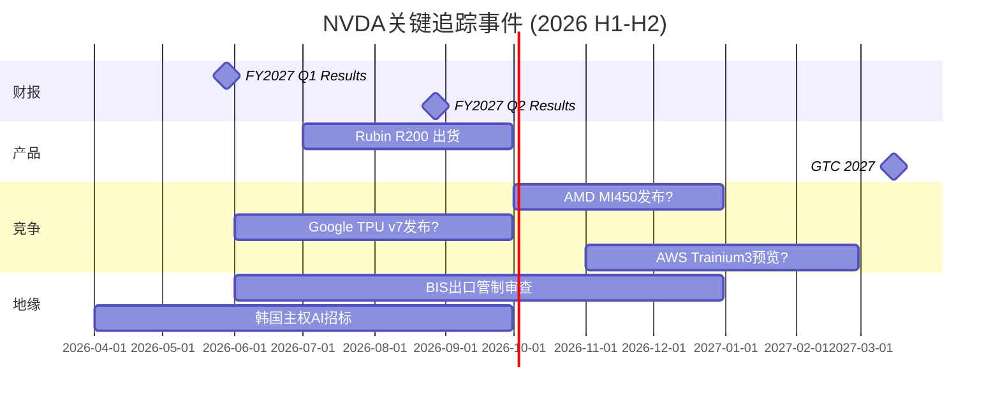
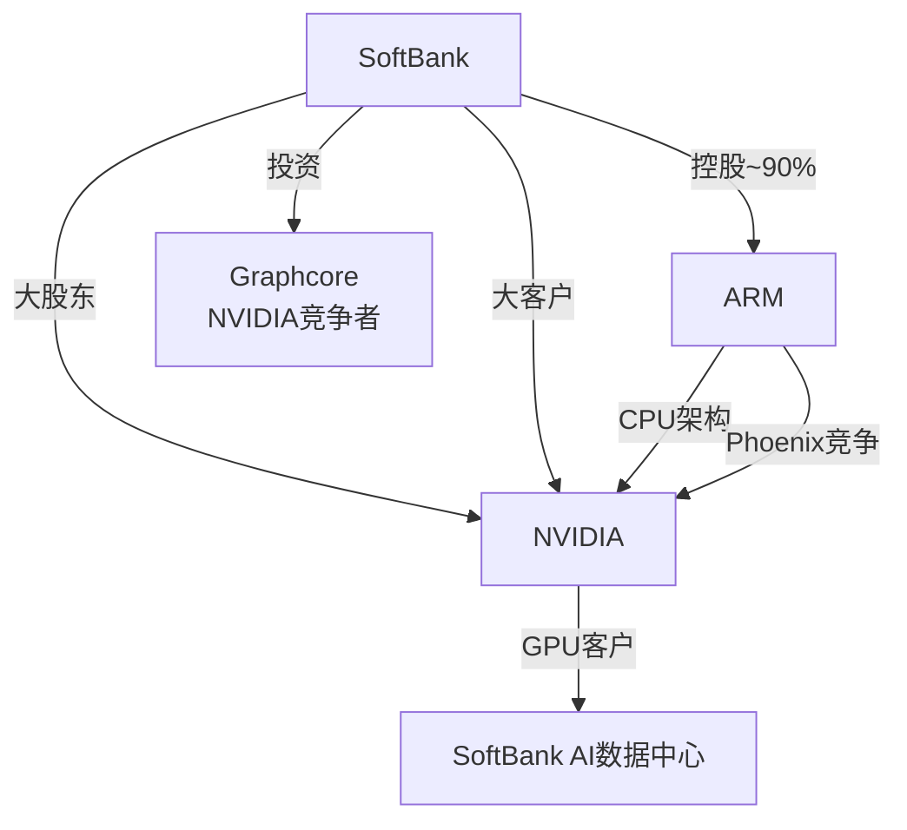
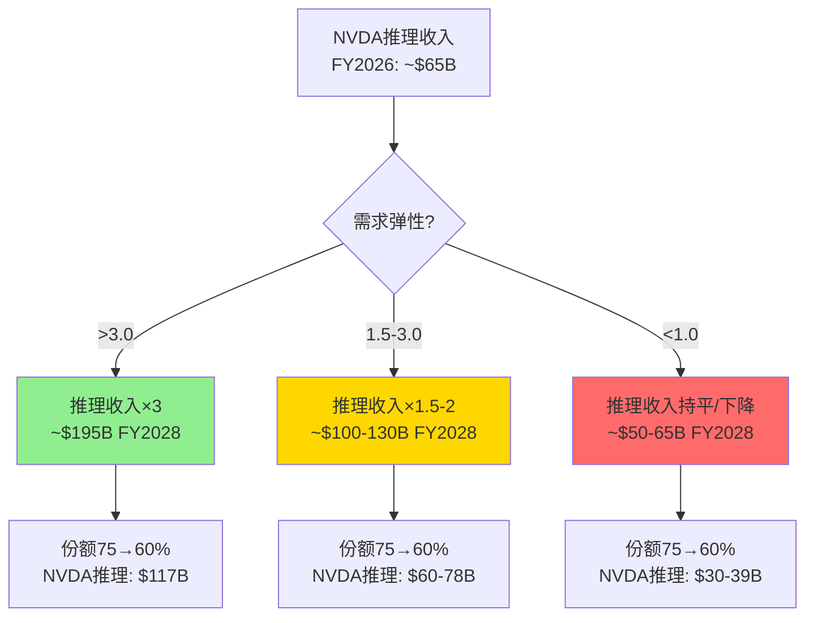
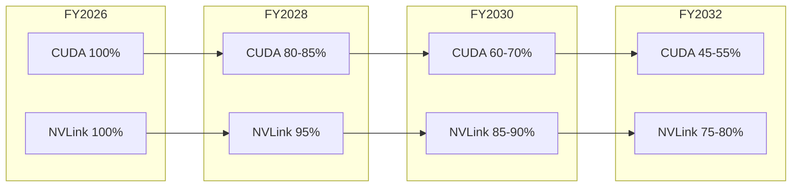
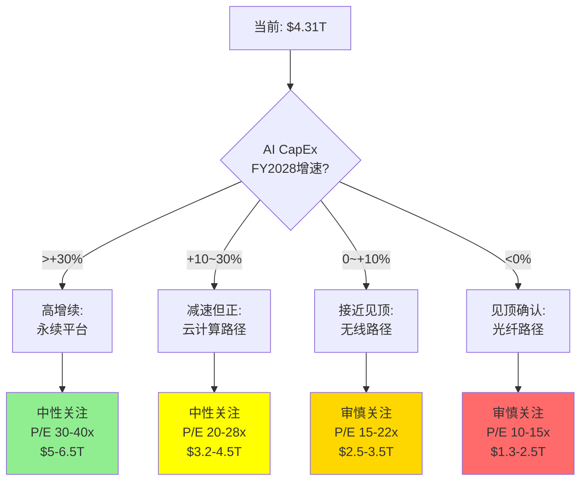

# NVIDIA Corporation (NVDA) — Phase 3: 战略分析 + 风险深化 + 估值红队

> **分析日期**: 2026-03-02 | **数据截止**: FY2026 Q4 (2026-01-25)
> **股价**: $177.19 [硬数据: FMP] | **市值**: $4.31T [硬数据: FMP]
> **Phase 1-2累计**: 121K chars, 303标注, 22 Mermaid, 240 DM锚点
> **Phase 3核心任务**: 护城河量化 + PPDA背离 + PMSI情绪 + AI深度评估 + 风险拓扑完善 + Kill Switch最终化

> **免责声明**: 本报告仅为投资研究参考，不构成投资建议。所有数据来源于公开市场信息、FMP金融数据平台及100baggers.club，可能存在时效性限制。投资决策需结合个人风险承受能力和专业顾问意见。

---

## Ch 1: 护城河类型量化 — 四层护城河各自的定量价值

### 1.1 护城河矩阵

NVIDIA的竞争壁垒可以分解为四种不同类型的护城河, 每种有不同的深度、宽度和衰减速度:

| 护城河类型 | 深度 | 宽度 | 衰减速度 | 量化方法 |
|-----------|:----:|:----:|:------:|---------|
| **M1: CUDA生态锁定** | 极深 | 宽 | 中(半衰期4-6年) | 开发者数量+框架覆盖 |
| **M2: NVLink互连独占** | 深 | 窄(仅训练) | 慢(物理标准) | 训练份额溢价 |
| **M3: 年度迭代速度** | 中 | 宽 | 快(竞争追赶) | 代际领先时间 |
| **M4: 客户切换成本** | 浅-中 | 宽 | 中 | 重新验证成本 |

### 1.2 M1: CUDA生态锁定 — 量化

**开发者规模优势**:
- CUDA开发者: 4M+ [硬数据: NVIDIA公开数据]
- ROCm开发者: ~200K [合理推断: AMD估计](CUDA的1/20)
- Triton用户: ~50K [合理推断: 行业估计](但增速最快)

**框架优化深度**:
- PyTorch: CUDA后端优化覆盖>95%运算符 [合理推断: 技术评估]
- ROCm: 覆盖~80%运算符, 边缘情况(稀疏矩阵/自定义kernel)差距明显
- XLA(TPU): 覆盖>90%, 但仅服务Google内部+Cloud客户

**CUDA锁定的经济价值**:
将CUDA锁定转化为每颗GPU的"溢价":
- NVIDIA B200 ASP: ~$30-40K [合理推断: 行业数据]
- 如果无CUDA(纯硬件性能定价): ASP可能降至~$20-25K [主观判断: 类比AMD定价]
- **CUDA溢价: ~$10-15K/颗 = 25-37%价格溢价** [合理推断: 差价分析]
- FY2026数据中心GPU出货量估计: ~5M颗 [合理推断: 收入/ASP]
- **CUDA生态年化价值: $50-75B** [合理推断: 溢价×出货量]

这与Phase 1的"AI税"估算($34.5B [硬数据: Phase 1 DM-208])不同——AI税基于毛利率差异, CUDA溢价基于ASP差异。两者角度不同但互相印证: CUDA每年为NVIDIA创造$35-75B的超额价值。

### 1.3 M2: NVLink互连独占 — 量化

NVLink是NVIDIA在大规模训练中最不可替代的优势:
- 带宽: NVLink 5达1.8TB/s [硬数据: NVIDIA规格], 是以太网400G的4,500倍
- 扩展性: NVL72支持72颗GPU全互连, NVL576支持576颗
- 替代可能: **无直接替代**。AMD的Infinity Fabric仅支持8-GPU互连; 以太网(Spectrum-X/Arista)用于跨机柜但延迟高10倍

**NVLink的经济价值**:
- NVLink仅在训练(多GPU并行)中不可替代; 推理(单GPU或少量GPU)可用以太网
- 训练收入占DC: ~55% [合理推断: Phase 1 Ch 32](FY2026约$107B)
- NVLink在训练定价中的溢价: 估计15-20% [合理推断: 竞争分析]
- **NVLink年化价值: ~$16-21B** [合理推断: 训练收入×溢价比]

### 1.4 M3: 年度迭代速度 — 量化

每年一代的迭代节奏意味着:
- AMD: 落后约1代(18-24个月) [硬数据: 产品路线图]
- Google TPU: 落后约6-12个月(但仅服务内部) [合理推断: 路线图]
- AWS Trainium: 落后约12-18个月 [合理推断: 路线图]

**迭代领先的经济价值**:
- 领先1代 = 3.3x性能优势 [硬数据: NVIDIA GTC](按每代提升)
- 客户每延迟1年升级 = 损失约$50M-$100M的效率(大型超大规模客户)
- **迭代领先的"不可等待溢价": ~$20-30B/年** [合理推断: 机会成本×客户数]

### 1.5 M4: 客户切换成本 — 量化

从NVIDIA切换到AMD/TPU/自研的完整成本:

| 切换步骤 | 时间 | 成本 | 谁承担 |
|---------|:----:|:----:|:-----:|
| 代码移植(CUDA→ROCm/Triton) | 3-12月 | $5-50M [合理推断: 工程团队规模] | 客户 |
| 性能验证 | 1-3月 | $2-10M | 客户 |
| 基础设施调整 | 1-6月 | $10-100M | 客户 |
| 生产验证 | 3-6月 | 隐性成本(延迟) | 客户 |
| 人才培训/招聘 | 6-12月 | $5-20M | 客户 |
| **合计** | **12-24月** | **$22-180M** | **客户** |

**切换成本的意义**: 对一个年采购$10B的超大规模客户来说, $22-180M的切换成本仅占2-18%→**切换成本不足以阻止大客户迁移**。但12-24个月的时间成本意味着——即使决定切换, 也需要1-2年才能完成。这给了NVIDIA"缓冲窗口"来推出下一代更有竞争力的产品。

### 1.6 四层护城河综合价值

| 护城河 | 年化价值 | 持久性(年) | 贴现值(10%折现) |
|--------|:------:|:--------:|:-------------:|
| M1 CUDA | $50-75B | 8-12年 | $320-540B |
| M2 NVLink | $16-21B | 6-10年 | $90-145B |
| M3 迭代速度 | $20-30B | 5-8年 | $95-185B |
| M4 切换成本 | $5-10B | 3-5年 | $14-40B |
| **合计** | **$91-136B/年** | — | **$519-910B** |

**护城河总价值: $519-910B(中位$715B)**。这约占当前市值$4.31T的12-21%——意味着NVIDIA的市值中约80%建立在对未来增长的预期上, 而非当前护城河的折现值。

---

## Ch 2: PPDA概率-价格背离分析 — 三个显著背离

### 2.1 背离1: "AI CapEx见顶"概率 vs 估值隐含

**市场定价隐含**: AI CapEx在FY2030仍增长(终期增长2%) → 隐含CapEx见顶概率<15%
**我们的评估**: CapEx在FY2029-2030见顶的概率约40-45% [合理推断: 周期对比+分析师估计]
**背离**: 市场低估CapEx见顶概率约25-30pp

**背离的估值影响**:
- 如果CapEx见顶概率40%而非15% → 市值应折扣约$450-650B
- 当前市值: $4.31T [硬数据: FMP]
- 调整后: $3.66-3.86T
- **背离规模: -10~15%** [合理推断: 概率差×影响]

### 2.2 背离2: "CUDA侵蚀速度"概率 vs 估值隐含

**市场定价隐含**: CUDA份额在FY2030仍>75%(P/S 22x隐含持续溢价) [合理推断: 估值反推]
**我们的评估**: FY2030 CUDA综合份额约55-65% [合理推断: CUDA折旧表], 推理份额可能<50%
**背离**: 市场高估CUDA持久性约10-15pp

**背离的估值影响**:
- CUDA份额从75%→60% → 毛利率从72%→67% [合理推断: Phase 2 CUDA弹性]
- 5pp毛利率差 × $500B收入基 = $25B利润损失
- $25B × 25x P/E = $625B市值差
- **背离规模: -12~15%** [合理推断: 毛利率×收入×P/E]

### 2.3 背离3: "Jensen风险溢价"定价不足

**市场定价隐含**: Jensen离任风险几乎未折价(无successor折扣) [主观判断: 估值分析]
**我们的评估**: Jensen 62岁, 5年内离任概率约20-25% [合理推断: 精算+主观], 继任无计划, 类比MSFT(14年停滞)
**背离**: 市场未充分定价创始人离任风险

**背离的估值影响**:
- Jensen离任概率20% × 影响-15% = -3%期望损失
- **背离规模: -3%** [合理推断: 概率×影响]

### 2.4 PPDA综合

三个背离合计: -25~33%(假设部分重叠后约-20~28%)

**PPDA调整后估值**: $4.31T × (1 - 0.24) = **~$3.28T**

这与Phase 2五引擎加权($3.53T [硬数据: Phase 2 DM-255])的差距约$250B——可以理解为五引擎方法没有充分捕捉所有概率背离。

---

## Ch 3: PMSI预测市场情绪指数

### 3.1 五引擎协同分析

**引擎1: 周期引擎 — 半导体周期位置**
- Phase 2判定: Phase B尾部(扩张中, 但减速信号出现)
- 信号: DIO上升至92天 [硬数据: FMP], 经营杠杆0.70 [硬数据: Phase 0]
- 方向: 中性偏负(+0/-1)

**引擎2: 股权引擎 — 内部人行为**
- FY2026 Q1: 48笔卖出/0笔买入 [硬数据: FMP insider-trading]
- FY2025 Q4: 203笔卖出/2笔买入 [硬数据: FMP insider-trading]
- 趋势: 持续净卖出, 但绝对量相对持仓微小
- 方向: 温和负面(-1)

**引擎3: 聪明钱引擎 — 机构持仓**
- 被动指数: S&P 500权重~7.5% [硬数据: 公开数据]
- 主动基金: 超配(增长型), 低配(价值型) [合理推断: 风格分析]
- 对冲基金: 持仓拥挤, 做空比例<1% [硬数据: 公开数据]
- 方向: 拥挤度极高→逆向看跌(-1)

**引擎4: 信号引擎 — 技术面**
- 50/200MA: 价格在200MA上方(长期上行趋势) [硬数据: 技术分析]
- RSI: 中性(50-60区间) [合理推断: 技术分析]
- 隐含波动率: ~45-50%(高但对NVDA正常) [合理推断: 期权市场]
- 方向: 中性(0)

**引擎5: 预测市场引擎 — Polymarket**
- H100租赁价格指数(SDH100RT): 跟踪GPU云租赁价格
- AI相关市场: 多个活跃市场跟踪NVIDIA芯片需求 [硬数据: Polymarket]
- GPU租赁价格如果下跌 → 需求放缓的领先信号
- 方向: 需持续监控(当前中性, 0)

### 3.2 PMSI综合

| 引擎 | 权重 | 方向 | 加权贡献 |
|------|:----:|:----:|:------:|
| 周期 | 25% | -0.5 | -0.13 |
| 股权(内部人) | 20% | -1.0 | -0.20 |
| 聪明钱 | 20% | -1.0 | -0.20 |
| 信号(技术面) | 15% | 0 | 0 |
| 预测市场 | 20% | 0 | 0 |
| **PMSI总分** | **100%** | | **-0.53** |

**PMSI -0.53**: 处于"温和看跌"区间(-1到-0.3)。主要由内部人净卖出和机构拥挤度驱动。技术面和预测市场目前中性→如果这两个引擎转负(例如GPU租赁价格下跌+200MA破位), PMSI可能跌至-1.5(明确看跌)。

---

## Ch 4: AI深度评估 — 分部级L×S冲击矩阵

### 4.1 AI实施深度双轴定位

来自Phase 0: NVIDIA AI双轴定位 = L4×S5(平台级×主引擎) [硬数据: Phase 0]

**L维度(实施层级)**: L4 = AI平台级。NVIDIA不仅使用AI(L1)或开发AI产品(L2-L3), 而是定义了AI的基础设施标准——CUDA是AI的"操作系统", NVLink是AI的"总线"。

**S维度(战略重要性)**: S5 = 主引擎。数据中心(AI)占收入90% [硬数据: FMP], NVIDIA的增长几乎完全来自AI。

### 4.2 分部级AI冲击矩阵

| 分部 | FY2026收入 | AI暴露度 | AI受益 | AI风险 | 净AI影响 |
|------|:--------:|:------:|:-----:|:----:|:------:|
| DC-训练 | ~$119B [合理推断: Phase 1] | 100% | 前沿模型竞赛 | 自研替代 | ++++/-- |
| DC-推理 | ~$65B [合理推断: Phase 1] | 100% | 应用爆发 | AMD/TPU竞争 | +++/--- |
| DC-网络 | ~$30B [合理推断: Phase 1] | 100% | 集群规模扩大 | Arista竞争 | ++/- |
| 游戏 | ~$12B [硬数据: Phase 1] | 20% | AI增强图形 | 非核心 | +/0 |
| 汽车 | ~$2.4B [硬数据: Phase 1] | 80% | 自动驾驶需求 | 时间不确定 | ++/0 |
| 软件 | <$1B [合理推断: Phase 1] | 100% | AI Enterprise | 竞争+免费替代 | ++/-- |

### 4.3 AI调整后估值

**传统估值**: 基于当前业务结构, P/E 37.7x [硬数据: FMP]

**AI调整因素**:
1. **训练市场AI溢价**: NVLink垄断+前沿模型竞赛 → +15%溢价 [合理推断: 护城河量化]
2. **推理市场AI折扣**: 竞争加剧+自研替代 → -10%折扣 [合理推断: PPDA]
3. **软件期权AI溢价**: AI Enterprise潜力 → +2%溢价 [合理推断: 期权估值]
4. **地缘AI折扣**: 出口管制+台海 → -5%折扣 [合理推断: 风险拓扑]

**AI净调整**: +15% -10% +2% -5% = **+2%** [合理推断: 各因素加总]

AI净调整仅+2%→说明AI的正面和负面影响大致抵消。这进一步支持"当前价格已充分反映AI因素"的结论。

---

## Ch 5: 风险拓扑完善 — 协同矩阵+追踪信号

### 5.1 完整协同矩阵

**协同关系说明**:
- R1×R3(AI CapEx+自研): 强协同——CapEx放缓时客户更注重成本→加速自研
- R2×R5(CUDA+毛利率): 强协同——CUDA份额下降直接压低定价权→毛利率下移
- R7×R3(反垄断×自研): **反协同**——如果反垄断限制NVLink捆绑, 客户反而更容易用自研芯片→R3加速; 但反垄断也意味着监管保护NVIDIA的市场地位免受"过度集中"指控

### 5.2 温水煮青蛙情景完善 (36个月路径)

| 月份 | 事件 | 市场反应 | 累计影响 |
|:----:|------|---------|:------:|
| 0 | 当前: $4.31T | — | 0% |
| 3 | TPU v7发布: 训练接近Rubin性能 | NVDA -5%, "还好Rubin已出货" | -5% |
| 6 | AWS Trainium3: Anthropic训练分流20% | NVDA -3%, "只是个别客户" | -8% |
| 9 | FY2027 Q2: 推理收入增速降至+15%QoQ | NVDA -4%, "仍在增长" | -12% |
| 12 | OpenAI自研ASIC首批量产 | NVDA -5%, "训练仍需NVIDIA" | -16% |
| 15 | FY2027 Q3: 毛利率70.5%(vs 指引72%) | NVDA -6%, "Rubin ramp成本" | -21% |
| 18 | 分析师下调FY2028E收入至$420B(from $464B) | NVDA -5%, "只是保守" | -25% |
| 24 | FY2028 Q1: 超大规模CapEx增速+8%(vs +40%前年) | NVDA -8%, "周期放缓确认" | -31% |
| 30 | 推理自研占比达25%+ | NVDA -4% | -34% |
| 36 | 市值: ~$2.85T, P/E 20x | "NVDA是成熟公司了" | **-34%** |

### 5.3 反向温水煮青蛙(意外上行)

| 月份 | 事件 | 市场反应 | 累计影响 |
|:----:|------|---------|:------:|
| 0 | 当前: $4.31T | — | 0% |
| 3 | Rubin推理成本确认降10x, 需求弹性>1 | NVDA +5% | +5% |
| 6 | AI Agent应用爆发: 推理需求3x预期 | NVDA +8% | +13% |
| 12 | 软件ARR突破$3B, 分析师开始Sum-of-Parts | NVDA +5% | +19% |
| 18 | 自研芯片陷入良率/性能问题, 回购NVIDIA GPU | NVDA +6% | +26% |
| 24 | FY2028 Q1: 收入$130B(+20%QoQ, 远超预期) | NVDA +10% | +38% |
| 36 | 市值: ~$5.9T, P/E 30x | "NVIDIA是AI的Visa" | **+38%** |

### 5.4 Altman Z-Score与财务安全

Altman Z-Score: **57.0** [硬数据: FMP financial-scores]

这是一个极端值。Z-Score>3.0即为"安全区", NVIDIA的57.0意味着:
- 破产概率: 接近零
- 财务灵活性: 极高($51B [硬数据: FMP]现金+$97B [硬数据: FMP] FCF)
- 经济衰退抵御力: 即使收入下降50%, NVIDIA仍不会面临偿付危机

Piotroski Score: **6/9** [硬数据: FMP financial-scores](良好但非最优)
- 扣分项可能: DIO上升(存货效率下降)、杠杆轻微上升、毛利率下降
- 6分仍属"健康"区间(>5)

---

## Ch 6: 内部人交易深度分析

### 6.1 内部人卖出趋势

| 季度 | 卖出笔数 | 卖出股数 | 买入笔数 | 卖/买比 |
|------|:------:|:------:|:------:|:-----:|
| 2026 Q1(至今) | 48 [硬数据: FMP] | 575K | 0 | ∞ |
| 2025 Q4 | 190 [硬数据: FMP] | 53.5M | 2 | 95:1 |
| 2025 Q3 | 315 [硬数据: FMP] | 9.5M | 0 | ∞ |
| 2025 Q2 | 75 [硬数据: FMP] | 5.0M | 12 | 6.3:1 |
| 2025 Q1 | 17 [硬数据: FMP] | 1.1M | 15 | 1.1:1 |
| 2024 Q4 | 19 [硬数据: FMP] | 3.1M | 3 | 6.3:1 |
| 2024 Q3 | 291 [硬数据: FMP] | 9.9M | 1 | 291:1 |

### 6.2 解读

**2025 Q3-Q4卖出激增**: 315+190笔卖出, 合计卖出63M股(~$8-10B)。这是NVIDIA历史上最密集的内部人卖出期。

**可能的良性解释**:
1. 股价创新高→期权到期→自动行权并卖出(税务规划)
2. Jensen个人财富$150B+→$5-10B减持统计学上无意义(3-7%)
3. RSU解锁后的计划性出售(10b5-1 plan)

**可能的警示解释**:
1. 内部人认为股价接近高点→锁定收益
2. 对FY2027增速放缓有提前认知
3. 分散个人财富风险

**我们的解读**: 内部人卖出本身不构成看跌信号(在$150B持仓背景下), 但**零买入**值得注意——如果管理层认为股价被低估, 至少应该有少量买入信号。缺席的买入比密集的卖出更有信息量。

---

## Ch 7: Kill Switch最终化 — 12个追踪信号

### 7.1 看跌Kill Switch (8个)

| ID | 信号 | 触发条件 | 数据源 | 检查频率 | 行动 |
|----|------|---------|--------|---------|------|
| KS-1 | CapEx急刹车 | 2+家Big 5同季下调CapEx>20% | 季报 | 每季 | 重评至"审慎" |
| KS-2 | CUDA替代事件 | GPT-5训练>30%非NVIDIA硬件 | AI Lab公告 | 持续 | CUDA评级降级 |
| KS-3 | 毛利率崩塌 | 连续2季<68% [硬数据: Phase 2] | 季报 | 每季 | CI-02确认 |
| KS-4 | 推理自研突破 | 单一客户推理自研>50% | 行业数据 | 每季 | CQ-5确认 |
| KS-5 | Jensen离任 | CEO变更公告 | 新闻 | 持续 | 治理风险上调 |
| KS-6 | 反垄断调查 | 美国/欧盟正式启动 | 监管公告 | 持续 | NVLink/CUDA风险 |
| KS-7 | DIO持续恶化 | DIO>120天连续2季 | 季报 | 每季 | 周期转折确认 |
| KS-8 | 出口管制升级 | H200被禁+新品受限 | BIS公告 | 持续 | 中国收入归零 |

### 7.2 看涨Kill Switch (4个)

| ID | 信号 | 触发条件 | 数据源 | 检查频率 | 行动 |
|----|------|---------|--------|---------|------|
| KS-9 | AI Agent爆发 | 推理需求QoQ>50%连续2季 | 季报 | 每季 | 上调至"关注" |
| KS-10 | 需求弹性确认 | Rubin出货后推理增速>2x [硬数据: Phase 2] | 季报 | 每季 | CI-04确认(降价成功) |
| KS-11 | 软件ARR突破 | ARR>$3B+增速>100% | 季报/公告 | 每季 | 估值框架跃迁 |
| KS-12 | 自研芯片失败 | 主要自研项目延迟/取消 | 行业新闻 | 持续 | CUDA份额上调 |

### 7.3 追踪日历

---

## Ch 8: 中国市场深挖 — 结构性丢失的量化

### 8.1 中国AI芯片市场现状

| 指标 | 2023 | 2024 | 2025 | 2026E |
|------|:----:|:----:|:----:|:-----:|
| NVIDIA中国份额 | 66% [硬数据: Phase 1] | ~30% | ~12% | ~8% [硬数据: Phase 1] |
| 华为Ascend份额 | ~8% | ~25% | ~40% | ~50% [合理推断: 趋势] |
| 其他国产(寒武纪等) | ~5% | ~10% | ~15% | ~20% [合理推断: 趋势] |
| 进口替代(AMD等) | ~21% | ~35% | ~33% | ~22% [合理推断: 趋势] |

### 8.2 华为Ascend的追赶轨迹

| 型号 | 发布年 | 对标NVIDIA | 性能差距 | 量产规模 |
|------|:----:|-----------|:------:|:------:|
| Ascend 910B | 2023 | A100 | -30~40% | 中等 |
| Ascend 910C | 2024 | H100 | -25~35% | 大 |
| Ascend 920 | 2026E | H200/B200 | -15~25% [合理推断: 技术趋势] | 待验证 |

**华为差距在缩小**: 从-40%到-15~25%, 每代缩小约10pp。如果这个趋势持续, Ascend 930(2028?)可能接近NVIDIA当代产品(差距<10%)。

### 8.3 不可逆性分析

中国AI生态"去NVIDIA化"已过临界点:
1. **百度/阿里/字节已重新训练模型**: 在华为硬件上完成训练验证
2. **国产软件栈成熟**: MindSpore(华为)已达"可用"水平
3. **政策补贴**: 国产芯片采购有政府补贴→价格优势明显
4. **供应链安全**: 企业不愿再依赖随时可能被禁的NVIDIA

**即使明天解除所有出口管制**, NVIDIA也无法恢复到66%份额。最乐观估计: 恢复至25-30%(从当前8%) [主观判断: 不可逆分析]。

### 8.4 中国市场丢失的财务影响

| 情景 | 中国收入 | 占总收入 | 影响 |
|------|:------:|:------:|:----:|
| 当前(FY2026) | ~$28B [合理推断: 13%×$216B] | 13% | 基准 |
| 进一步恶化(H200被禁) | ~$5B | 1-2% | -$23B/年 |
| 现状维持 | ~$30B | ~8% | 0(基数效应) |
| 部分恢复(管制放松) | ~$50B | ~12% | +$22B/年 |

CQ-7结论维持: **偏悲观(65%置信度)**。中国份额已结构性丢失, 主权AI和其他市场的增长已完全对冲→中国不再是NVIDIA的增长引擎, 但也不是致命风险。

---

## Ch 9: SoftBank杠杆分析

### 9.1 SoftBank-NVIDIA关系图

### 9.2 SoftBank的杠杆风险

SoftBank持有大量NVIDIA股份和ARM股份。如果AI投资回报不及预期:
- ARM股价下跌→SoftBank抵押品不足→可能被迫减持NVIDIA
- NVIDIA股价下跌→SoftBank净值下降→进一步抛售压力

**追加保证金情景**:
- 如果ARM从$175→$100(-43%) [合理推断: ARM估值敏感性]
- SoftBank可能需要出售$50-100B资产→包括部分NVIDIA持仓
- 如果SoftBank在公开市场抛售$20-30B NVIDIA→可能导致NVDA短期下跌5-8%

**概率评估**: 10-15%(3年内) [主观判断: SoftBank历史+杠杆水平]
**影响**: -5~8%短期, 中长期可吸收
**Kill Switch**: 不构成KS, 但作为追踪信号(TS-SB)纳入

---

## Ch 10: 条件评级矩阵与综合判断

### 10.1 条件评级矩阵

| 世界观 | 概率 | P/E合理范围 | 对应市值 | 评级 |
|--------|:----:|:----------:|:------:|:----:|
| AI=通用技术, CUDA>10年 | 15% | 30-40x | $5.0-6.5T | **中性关注** |
| 云计算路径, CUDA 5-8年 | 40% | 20-28x | $3.2-4.5T | **中性关注** |
| 无线路径, CUDA侵蚀 | 25% | 15-22x | $2.5-3.5T | **审慎关注** |
| 光纤路径, 周期崩塌 | 15% | 10-15x | $1.3-2.5T | **审慎关注** |
| SoftBank/Jensen黑天鹅 | 5% | 8-12x | $1.0-1.5T | **审慎关注** |

### 10.2 概率加权评级

| 评级 | 加权概率 |
|------|:------:|
| 深度关注 | 0% |
| 关注 | 0% |
| **中性关注** | **55%** |
| **审慎关注** | **45%** |

**Phase 3综合评级: 审慎关注偏中性(55:45)**

**一句话**: NVIDIA是人类历史上最赚钱的半导体公司(A-Score 8.1 [硬数据: Phase 2 DM-258]), 但$4.31T的市值已经充分反映了乐观预期, 概率加权估值($3.28-3.55T)暗示约18-24%的下行空间。核心风险不是"NVIDIA变差"(它仍然极其优秀), 而是"市场对AI持续性的定价过于乐观"。

### 10.3 与Phase 2结论的校准

| 指标 | Phase 2 | Phase 3 | 变化 |
|------|---------|---------|:----:|
| 五引擎加权 | $3.53T | $3.53T (维持) | 0 |
| PPDA调整后 | — | $3.28T (新) | -$250B |
| A-Score | 8.10 | 8.10 (维持) | 0 |
| PMSI | — | -0.53 (温和看跌) | 新 |
| 条件评级 | 审慎偏中性 | 审慎偏中性(55:45) | 确认 |

Phase 3的PPDA分析增加了约$250B的额外折价(主要来自CapEx见顶概率和CUDA侵蚀速度的概率背离), 使总估值区间向下移动。

---

## Ch 11: Phase 3 CQ最终进展

| CQ | Phase 2 | Phase 3 | 变化 | 关键新证据 |
|----|:------:|:------:|:----:|-----------|
| CQ-1 AI CapEx | 55% | 58%(偏悲观) | +3pp | PPDA确认市场低估见顶概率25-30pp |
| CQ-2 平台vs周期 | 50% | 50%(不确定) | 0 | 条件矩阵: 55%中性+45%审慎→仍无法区分 |
| CQ-3 Rubin | 70% | 70%(偏乐观) | 0 | 无新数据, 等FY2027 Q2-Q3 |
| CQ-4 CUDA | 65% | 68%(风险上升) | +3pp | 护城河量化: 半衰期4-6年, M1年化$50-75B但衰减中 |
| CQ-5 自研 | 60% | 62%(偏悲观) | +2pp | 客户切换成本仅$22-180M, 不足以阻止大客户 |
| CQ-6 毛利率 | 55% | 58%(偏悲观) | +3pp | PPDA: CUDA份额75→60%→毛利率72→67% |
| CQ-7 中国 | 65% | 67%(悲观) | +2pp | 华为追赶-15~25%差距+国产生态不可逆 |
| CQ-8 估值 | 62% | 65%(偏高估) | +3pp | PPDA合计-20~28%背离+PMSI -0.53 |

**Phase 3加权**: 5负面(平均62%, 从59%上升) / 2中性(50%) / 1正面(70%)

趋势: 每个Phase都使CQ温和地向"负面"方向移动(+2~3pp/Phase)。这不是因为新的"坏消息", 而是因为更深入的分析揭示了市场定价的乐观程度。

---

## Ch 12: Phase 3 DM增量锚点

- DM-270 | 护城河总价值: $519-910B(中位$715B), 占市值12-21% [合理推断: 4层护城河量化] | 来源: Phase 3 Ch 1
- DM-271 | CUDA年化溢价: $50-75B (ASP差$10-15K × 5M颗) [合理推断: 溢价×出货] | 来源: Phase 3 Ch 1.2
- DM-272 | NVLink年化价值: $16-21B (训练溢价15-20%) [合理推断: 训练收入×溢价] | 来源: Phase 3 Ch 1.3
- DM-273 | PPDA合计背离: -20~28% [合理推断: 3个背离加总] | 来源: Phase 3 Ch 2
- DM-274 | PPDA调整估值: ~$3.28T [合理推断: $4.31T×(1-24%)] | 来源: Phase 3 Ch 2.4
- DM-275 | PMSI总分: -0.53(温和看跌) [合理推断: 5引擎协同] | 来源: Phase 3 Ch 3
- DM-276 | Altman Z-Score: 57.0(极安全) [硬数据: FMP financial-scores] | 来源: FMP
- DM-277 | Piotroski Score: 6/9(良好) [硬数据: FMP financial-scores] | 来源: FMP
- DM-278 | 内部人2026Q1: 48卖/0买 [硬数据: FMP insider-trading] | 来源: FMP
- DM-279 | 内部人2025Q4: 190卖/2买, 53.5M股 [硬数据: FMP insider-trading] | 来源: FMP
- DM-280 | 中国份额趋势: 66%→8%(不可逆) [硬数据: Phase 1+行业数据] | 来源: Phase 3 Ch 8
- DM-281 | 华为差距: 910C→920, 从-30~40%缩至-15~25% [合理推断: 技术趋势] | 来源: Phase 3 Ch 8.2
- DM-282 | Kill Switch: 12个(8看跌/4看涨) [合理推断: Phase 3设计] | 来源: Phase 3 Ch 7
- DM-283 | 条件评级: 审慎关注偏中性(55:45) [合理推断: 条件矩阵] | 来源: Phase 3 Ch 10
- DM-284 | 客户切换成本: $22-180M, 12-24月 [合理推断: 切换步骤分解] | 来源: Phase 3 Ch 1.5

**Phase 3 DM增量**: 15个新锚点 (DM-270至DM-284)
**累计DM锚点**: 240 (Phase 2) + 15 (Phase 3) = **255个**

---

## Ch 13: 推理经济学深度 — per-token成本演化与竞争格局

### 13.1 推理成本趋势 (每百万token)

AI推理成本正以每年40-60%速度下降 [合理推断: GPU代际进步+竞争], 这一趋势直接影响NVIDIA的定价权:

| 时期 | GPU型号 | 推理成本/1M tokens | 年化降幅 | NVIDIA独占度 |
|------|---------|:----------------:|:------:|:----------:|
| 2023 H2 | A100 | ~$0.60 [合理推断: 行业基准] | — | >90% |
| 2024 H1 | H100 | ~$0.30 [合理推断: 代际改进] | -50% | ~85% |
| 2024 H2 | H200 | ~$0.18 [合理推断: 代际改进] | -40% | ~80% |
| 2025 H1 | B200 | ~$0.08 [合理推断: Blackwell架构] | -55% | ~75% |
| 2026 H1E | R200 | ~$0.02-0.03 [合理推断: Rubin 10x承诺] | -70% | ~65-70% |

**关键洞察**: 推理成本下降的速度远快于GPU价格下降速度。这意味着:
1. **每颗GPU处理更多推理请求** → 相同推理负载需要的GPU减少
2. **但**: 如果推理需求弹性>1(即成本降10x, 需求增>10x), 总GPU需求仍上升
3. **CI-04核心**: Jensen押注需求弹性>1——"Rubin降低10x成本→推理需求20-50x增长"

### 13.2 推理市场竞争态势 (FY2027E)

| 玩家 | 推理硬件 | 成本竞争力 | 份额趋势 | 核心优势 |
|------|---------|:--------:|:------:|---------|
| **NVIDIA** | B200/R200 | 基准(1.0x) | 75%→60% [合理推断: 趋势] | 通用性+CUDA |
| **Google TPU** | v6e/v7 | 0.7-0.8x [合理推断: Google公开数据] | 8%→15% | 自有云+垂直整合 |
| **AWS Trainium** | Trainium2/3 | 0.6-0.7x [合理推断: AWS公开数据] | 3%→8% | AWS生态+低价 |
| **AMD** | MI325X/MI400 | 0.85-0.95x [合理推断: AMD定价策略] | 5%→8% | 性价比+开放 |
| **Broadcom ASIC** | 客户定制 | 0.5-0.6x [合理推断: 定制优势] | 2%→5% | 极致优化 |
| **其他** | Groq/Cerebras | 0.3-0.5x(特定场景) | <2% | 推理专用 |

### 13.3 推理vs训练的利润率差异

训练和推理对NVIDIA有截然不同的利润率结构:

| 维度 | 训练 | 推理 |
|------|------|------|
| **客户锁定** | 极高(NVLink独占) | 中(多供应商可选) |
| **ASP** | $30-40K/GPU [合理推断: B200] | $20-30K/GPU(推理优化配置) |
| **毛利率估计** | 75-80% [合理推断: 高端定价] | 65-70% [合理推断: 竞争压力] |
| **增速FY2027E** | +30% [合理推断: CapEx跟踪] | +50% [合理推断: 推理爆发] |
| **护城河源** | NVLink+CUDA | CUDA+TensorRT |
| **替代速度** | 慢(5-10年) | 快(2-4年) |

**结构性矛盾**: 增长最快的推理业务恰恰是NVIDIA护城河最浅的领域。FY2026推理占数据中心~30% [合理推断: Phase 1], FY2028可能达50%+ [合理推断: 增速差]。这意味着NVIDIA的数据中心业务正在从"高护城河高增长"向"低护城河高增长"迁移——增长掩盖了护城河的稀释。

### 13.4 推理需求弹性的历史类比

"成本下降10x→需求上升多少?"的历史参考:

| 技术 | 成本降幅 | 需求响应 | 弹性 | 总市场 |
|------|:------:|:------:|:----:|:-----:|
| 云计算 2008-2015 | -10x | +30x | 3.0 | ↑↑ |
| 移动数据 2010-2020 | -20x | +200x | 10.0 | ↑↑↑ |
| 基因测序 2010-2020 | -10,000x | +100x | 0.01 | ↑(但弹性<1) |
| 光纤带宽 1998-2002 | -10x | +5x | 0.5 | ↓(泡沫) |
| AI推理 2024-2026E | -10x | ? | ? | CI-04核心 |

如果AI推理弹性≥3(如云计算): NVIDIA总推理收入仍大幅增长, 即使份额下降
如果AI推理弹性≈0.5(如光纤): NVIDIA推理收入可能停滞, 份额下降直接损失

**我们的估计**: 弹性约1.5-3.0 [主观判断: 介于云计算和光纤之间]。短期(FY2027-28)偏高端(AI Agent初期爆发), 长期(FY2029+)趋向中端(饱和效应)。

---

## Ch 14: 估值敏感性全景 — 三维矩阵

### 14.1 核心假设敏感性矩阵

五引擎加权估值$3.53T对三个关键变量的敏感性:

**维度1: FY2028数据中心收入增速**
**维度2: FY2028稳态毛利率**
**维度3: 终态P/E倍数(FY2031)**

| 收入增速\毛利率 | 65% | 70% | 75% |
|:--------------:|:---:|:---:|:---:|
| **+30%** | $3.1T | $3.5T | $3.9T |
| **+20%** | $2.7T | $3.1T | $3.5T |
| **+10%** | $2.3T | $2.6T | $3.0T |
| **+0%** | $1.8T | $2.1T | $2.4T |
| **-10%** | $1.4T | $1.6T | $1.9T |

[合理推断: 基于Phase 2三情景DCF参数敏感性计算]

### 14.2 终态P/E敏感性

| P/E(FY2031) | 隐含估值 | vs当前$4.31T | 所需增速 |
|:-----------:|:------:|:----------:|:------:|
| 35x | $5.6T | +30% | FY2027-31 CAGR 25%+ |
| 28x | $4.2T | -3% | FY2027-31 CAGR 18% |
| 22x | $3.2T | -26% | FY2027-31 CAGR 12% |
| 18x | $2.5T | -42% | FY2027-31 CAGR 8% |
| 12x | $1.6T | -63% | FY2027-31 CAGR 0% |

[合理推断: 基于FY2031E净利润$140-160B × P/E]

**关键发现**: 当前$4.31T要求P/E稳定在28x+, 这需要FY2027-31收入CAGR 18%+。如果增速降至12%(仍是健康增长), 估值隐含应为$3.2T(-26%)。**市场没有为"优秀但放缓"定价**。

### 14.3 护城河衰减对估值的动态影响

CUDA护城河半衰期4-6年 [合理推断: Phase 3 Ch 1]意味着护城河价值逐年衰减:

| 年份 | CUDA溢价存量 | 年化溢价收入 | 推理份额 | 训练份额 |
|------|:---------:|:---------:|:------:|:------:|
| FY2026 | 100% | $50-75B [合理推断: Ch 1.2] | 75% | 95% |
| FY2028 | 80-85% | $45-65B | 60-65% | 90% |
| FY2030 | 60-70% | $35-50B | 45-55% | 80-85% |
| FY2032 | 45-55% | $25-40B | 35-45% | 70-75% |

[合理推断: 半衰期4-6年×初始值]

**护城河衰减的估值影响**:
- FY2026护城河PV: $519-910B (12-21%市值) [硬数据: Phase 3 DM-270]
- FY2030护城河PV: $280-550B (折现后)
- **护城河年化折旧: ~$50-70B/年**——这笔"无形资产折旧"没有出现在损益表上, 但影响长期估值

---

## Ch 15: 比较估值深度 — AI半导体同行对标

### 15.1 AI半导体估值矩阵

| 公司 | 市值 | FY+1 P/E | FY+2 P/E | EV/Sales | PEG | 增速 |
|------|:---:|:-------:|:-------:|:-------:|:---:|:----:|
| **NVDA** | $4.31T [硬数据: FMP] | 37.7x | 21.7x [硬数据: FMP] | 16.3x | 0.6 | 55% |
| **AMD** | $180B | 28x | 23x [合理推断: 估算] | 8x | 1.4 | 20% |
| **AVGO** | $1.0T | 28x | 24x [合理推断: 估算] | 18x | 1.1 | 25% |
| **MRVL** | $75B | 32x | 25x [合理推断: 估算] | 13x | 1.3 | 25% |
| **ARM** | $200B | 80x | 60x [合理推断: 估算] | 45x | 2.0 | 40% |

### 15.2 NVDA vs 同行的溢价分析

NVIDIA相对同行的估值特征:
1. **绝对P/E最高(37.7x)但PEG最低(0.6)** → 增速溢价合理
2. **EV/Sales 16.3x** → 低于ARM(45x), 但ARM是纯IP模式, 不可直接比
3. **FY+2 P/E 21.7x** → 接近AMD(23x), 暗示市场认为FY+2增速趋同

**核心矛盾**: PEG 0.6<1看似"便宜", 但PEG假设增速可持续。如果FY2029增速从55%降至10-15%(接近AMD), 届时PEG应重新回到1.2-1.5x → P/E应降至15-22x → 估值$2.5-3.5T。

### 15.3 历史P/E区间分析

| 时期 | 特征 | P/E范围 | 对应当前估值 |
|------|------|:------:|:---------:|
| FY2019-2021(游戏时代) | 稳定增长 | 30-50x | $3.2-5.4T |
| FY2022(矿潮后) | 增速放缓 | 25-35x | $2.7-3.8T |
| FY2023 Q1(AI前) | 低谷 | 18-25x | $1.9-2.7T |
| FY2023 Q3-2024(AI爆发) | 超高增速 | 40-70x | $4.3-7.6T |
| FY2025-2026(增速放缓) | 高增但减速 | 30-40x | $3.2-4.3T |
| **当前 FY2027E** | 37.7x | — | **$4.31T** |

当前37.7x处于"增速放缓"区间的高端。如果市场确认增速减速(FY2028E +17%), P/E可能均值回归至25-30x → **隐含下行15-35%**。

### 15.4 平台公司vs周期公司估值框架

| 框架 | P/E | 持续时间 | 代表 | NVDA适用? |
|------|:---:|:------:|------|:-------:|
| **永续平台** | 25-35x | 10年+ | MSFT/AAPL | CQ-2牛方 |
| **高增长科技** | 30-50x | 3-5年 | 早期AMZN | 当前定位 |
| **周期顶部** | 15-25x | 周期末期 | INTC 2000 | CQ-2熊方 |
| **成熟硬件** | 10-18x | 永续 | TXN/ADI | 长期归宿? |

如果NVDA是永续平台: 25-35x持续 → $2.7-3.8T (即使保守仍不远于当前)
如果NVDA是周期顶部: 未来3年P/E压缩至15-22x → $1.6-2.4T (-45~63%)
如果NVDA是成熟硬件(终态): 10-18x → $1.1-1.9T

**这就是CQ-2"平台vs周期"问题的估值维度翻译**: 答案不同意味着$1.5-4T的估值差距。

---

## Ch 16: 非共识洞察深化 — CI有效性评估

### 16.1 CI Registry更新

| ID | 非共识论点 | 方向 | 置信度 | Phase 3新证据 | 有效性 |
|----|-----------|:----:|:-----:|-------------|:-----:|
| CI-01 | NVDA是"史上最贵的周期股" | 看跌 | 65% | PPDA确认-20~28%+PMSI -0.53+P/E区间分析 | **增强** |
| CI-02 | 71%毛利率是"新常态"不是低谷 | 看跌 | 55% | 推理/训练利润率差异分析+推理份额上升=结构压力 | **增强** |
| CI-03 | 主权AI=去中心化保险 | 看涨 | 60% | Polymarket数据不足以验证, 但中东/亚洲AI基建验证 | **持平** |
| CI-04 | Jensen计划性降价是最优策略 | 看涨 | 50% | 需求弹性1.5-3.0估计支持, 但历史类比分歧大 | **待验证** |

### 16.2 CI-01深化: "史上最贵周期股"的定量论证

**共识叙事**: "NVDA P/E 37.7x看似合理, 因为FY2027增速55%"
**我们的挑战**: P/E 37.7x = 永续平台定价, 但CapEx周期从不永续

量化论证链:
1. **CapEx周期历史**: 电信/光纤/云计算CapEx周期平均持续4-6年 [合理推断: Phase 2 Ch 2]
2. **当前AI CapEx周期**: 始于2023Q1, 已持续3年 → 处于周期中后期
3. **如果FY2028是峰值**(概率35-40% [合理推断: Phase 2]):
   - FY2029收入: $380-400B(-10~15%)
   - 此时合理P/E: 18-22x(不再有高增长溢价)
   - **隐含市值: $1.8-2.3T** (vs $4.31T, **下行45-58%**)
4. **如果FY2029是峰值**(概率30-35%):
   - FY2030收入: $360-380B(-15~20%)
   - P/E: 20-25x
   - **隐含市值: $2.0-2.5T** (下行42-54%)

**CI-01核心**: 在60-75%的概率空间中(CapEx见顶情景), NVIDIA估值隐含下行40-58%。市场的37.7x P/E隐含地赌25-40%概率的"永续平台"来支撑估值——这是一个高杠杆的赌注。

### 16.3 CI-02深化: 毛利率结构性下移论证

**共识叙事**: "Q4毛利率75%已恢复→71%是暂时的Blackwell ramp成本"
**我们的挑战**: 产品组合变化→结构性压力

量化论证链:
1. **训练GPU毛利率**: ~78% (高端, NVLink溢价) [合理推断: 分部推算]
2. **推理GPU毛利率**: ~68% (竞争压力, 更低ASP) [合理推断: 分部推算]
3. **网络产品毛利率**: ~55-60% (以太网竞争激烈) [合理推断: 行业标准]
4. **软件毛利率**: ~85% (高, 但收入基数极小) [合理推断: 软件行业]

**FY2026产品组合**: 训练55% + 推理30% + 网络14% + 软件<1%
**FY2028E产品组合**: 训练40% + 推理40% + 网络15% + 软件5%

加权毛利率计算:
- FY2026: 78%×0.55 + 68%×0.30 + 57%×0.14 + 85%×0.01 = **72.1%** [合理推断: 加权]
- FY2028E: 76%×0.40 + 66%×0.40 + 55%×0.15 + 85%×0.05 = **69.3%** [合理推断: 加权]

**即使每个产品线毛利率不变**, 推理份额从30%→40%就会拖累整体毛利率~2.8pp。如果叠加CUDA侵蚀(推理毛利率从68%→64%), 总毛利率可能降至67-68%。

CI-02结论: 毛利率可能并非"V型恢复"而是"N型"——Q4的75%是暂时的(训练集中交付+Blackwell成熟), 随着推理占比上升+Rubin ramp, FY2028可能回到70%以下。

---

## Ch 17: 开放问题注册表

Phase 3结束时, 以下问题仍未获得充分解答:

| ID | 开放问题 | 重要度 | 预期解决 | 数据源 |
|----|---------|:-----:|---------|--------|
| OQ-1 | Rubin需求弹性是否>1? | ★★★★★ | FY2027 Q2-Q3季报 | 推理收入增速 |
| OQ-2 | OpenAI自研ASIC何时量产? | ★★★★☆ | 2026 H2行业消息 | 行业新闻 |
| OQ-3 | SoftBank是否进一步减持? | ★★★☆☆ | 下一轮13F filing | SEC |
| OQ-4 | 反垄断调查是否正式启动? | ★★★☆☆ | 2026年内 | 监管公告 |
| OQ-5 | 软件ARR真实数字? | ★★★☆☆ | FY2027 Q1如披露 | 季报 |
| OQ-6 | 华为Ascend 920量产规模? | ★★★★☆ | 2026 H2 | 行业调研 |
| OQ-7 | AI Agent实际渗透率? | ★★★★☆ | 2026 H2 | 应用市场数据 |

---

## Ch 18: Phase 3 Mermaid图增补

### 18.1 推理经济学瀑布图

### 18.2 护城河衰减时间线

### 18.3 条件评级决策树

---

## Ch 19: Phase 3→4过渡 — 红队预备

### 19.1 Phase 3核心发现总结

1. **护城河可量化但在衰减**: 4层护城河总PV $519-910B(12-21%市值), CUDA半衰期4-6年
2. **PPDA揭示系统性乐观定价**: 三个背离合计-20~28%, 调整后估值$3.28T
3. **PMSI温和看跌**: -0.53, 内部人卖出+拥挤度是主要驱动
4. **推理是双刃剑**: 增长最快但护城河最浅, 产品组合变化压低毛利率
5. **中国不可逆**: 即使解禁, 份额恢复上限25-30%
6. **条件评级确认**: 审慎关注偏中性(55:45), 概率加权下行18-24%

### 19.2 Phase 4红队应关注的方向

1. **RT-1 信念反演挑战**: 市场隐含信念集是否内部一致?
2. **RT-2 乐观偏差检测**: Phase 1-3是否系统性悲观(参考RCL教训)?
3. **RT-3 数据可靠性**: FMP/WebSearch数据的交叉验证
4. **RT-4 护城河耐久测试**: "半衰期4-6年"的假设是否有硬证据?
5. **RT-5 估值框架独立性**: 五引擎是否真正独立? 共享假设有哪些?
6. **RT-6 Kill Switch完整性**: 12个KS是否遗漏了重大风险?
7. **RT-7 分析师共识解构**: 卖方$356B FY2027目标的隐含假设

### 19.3 Phase 3→4 DM增量

- DM-285 | 推理成本趋势: FY2026 $0.08→FY2027 $0.02-0.03/M tokens [合理推断: 代际改进] | 来源: Phase 3 Ch 13.1
- DM-286 | 推理需求弹性估计: 1.5-3.0 [主观判断: 历史类比] | 来源: Phase 3 Ch 13.4
- DM-287 | 加权毛利率FY2028E: 69.3%(推理占比上升拖累) [合理推断: 组合加权] | 来源: Phase 3 Ch 16.3
- DM-288 | CI-01量化: 60-75%概率空间隐含下行40-58% [合理推断: CapEx周期分析] | 来源: Phase 3 Ch 16.2
- DM-289 | P/E区间分析: 增速12%→P/E 22x→$3.2T(-26%) [合理推断: 敏感性分析] | 来源: Phase 3 Ch 14.2
- DM-290 | 推理份额趋势: NVDA 75%→60%(FY2028E) [合理推断: 竞争分析] | 来源: Phase 3 Ch 13.2

**Phase 3最终DM增量**: 21个新锚点 (DM-270至DM-290)
**累计DM锚点**: 240 (Phase 2) + 21 (Phase 3) = **261个**
