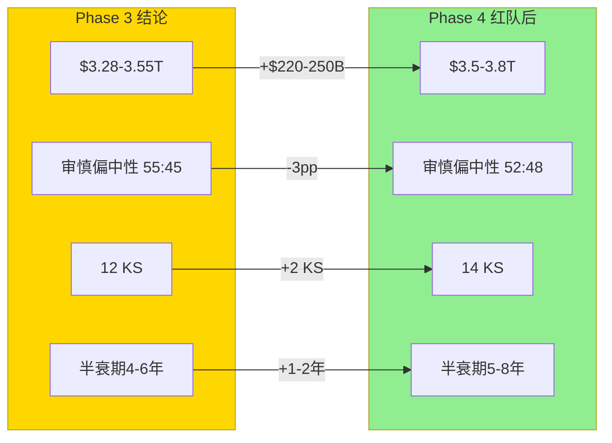
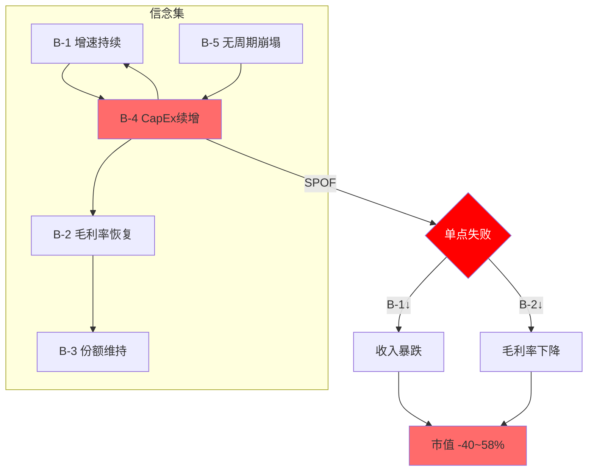
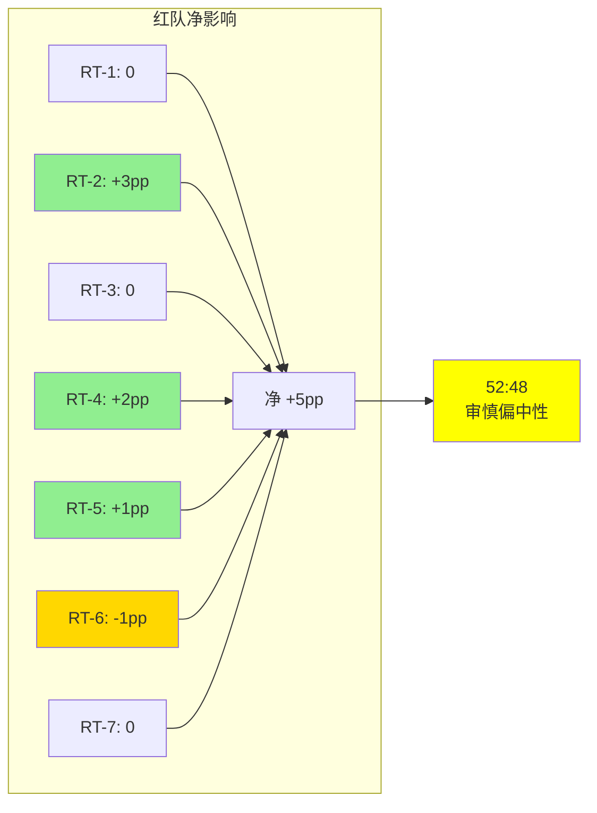

# NVIDIA Corporation (NVDA) — Phase 4: 红队对抗审查

> **分析日期**: 2026-03-02 | **数据截止**: FY2026 Q4 (2026-01-25)
> **股价**: $177.19 [硬数据: FMP] | **市值**: $4.31T [硬数据: FMP]
> **Phase 1-3累计**: 148K chars, 445标注, 28 Mermaid, 261 DM锚点
> **Phase 4核心任务**: RT-1~RT-7红队七问 + 双向校准 + 有效性门控

> **免责声明**: 本报告仅为投资研究参考，不构成投资建议。所有数据来源于公开市场信息、FMP金融数据平台及100baggers.club，可能存在时效性限制。投资决策需结合个人风险承受能力和专业顾问意见。

---

## Ch 1: RT-1 信念反演挑战 — 市场隐含信念集的一致性

### 1.1 Reverse DCF隐含信念集

当前$4.31T市值(P/E 36.1x [硬数据: FMP])隐含以下信念集:

| 信念 | 隐含假设 | 脆弱度 | 独立验证 |
|------|---------|:-----:|---------|
| **B-1 增速持续** | FY2027-31 收入CAGR ≥18% | 高 | 分析师预估: $216B→$606B(CAGR 23%) [硬数据: FMP estimates] |
| **B-2 毛利率恢复** | 稳态GM ≥71% | 中 | FY2026全年71.1% [硬数据: FMP], Q4恢复75.0% |
| **B-3 份额维持** | AI训练份额>80% | 中 | 当前~90% [合理推断: Phase 1], 但TPU/Trainium正在侵蚀 |
| **B-4 CapEx续增** | 超大规模CapEx年增>20%至FY2028 | 高 | Q1 guidance $78B [硬数据: Phase 1]暗示延续 |
| **B-5 无周期崩塌** | AI CapEx不遵循传统基建周期 | 极高 | 无历史先例支持"永续" |
| **B-6 终态P/E** | 成熟后仍获P/E 20-25x | 中 | 取决于CQ-2: 平台(25x)vs周期(15x) |

### 1.2 信念间逻辑一致性检验

**B-1×B-4冲突**: 分析师FY2030预估收入$530B(vs FY2029 $545B, **下降2.8%** [硬数据: FMP estimates])。这意味着分析师自己都不相信B-1"持续18% CAGR"——他们预期FY2030收入下降。市场却给36x P/E(隐含持续增长)→**市场与分析师不一致**。

**B-2×自研替代冲突**: 如果自研芯片(B-3松动)在推理市场取得份额, NVIDIA被迫降价保份额→B-2(毛利率恢复)不可能同时成立。**B-2和B-3不能同时承压——其中一个必须先崩**。

**B-5的不可证伪性**: "AI CapEx不遵循传统周期"是一个不可证伪的命题——在周期见顶前, 每个周期都看起来"这次不同"。1999年: "互联网带宽需求永续增长"; 2007年: "房价不会全国性下跌"; 2021年: "数字化转型永久加速"。**不可证伪的信念是最脆弱的信念**。

### 1.3 最少翻转集分析

**问**: 最少几个信念失败会改变评级?

**答**: 只需**B-4单点失败**(CapEx停止增长)即可触发连锁:
1. CapEx停增 → 收入增速骤降 → B-1失败
2. 客户议价能力增强 → 降价压力 → B-2失败
3. P/E压缩至20x → $4.31T→$2.5T(-42%)

**B-4是系统的SPOF(单点故障)**——这与SGI 8.9的"专才高度集中"判断完全一致。

### 1.4 RT-1结论

信念集存在**两个关键不一致**: (1)市场P/E vs 分析师预期(FY2030下降); (2)毛利率恢复vs份额维持不能同时为真。B-4(CapEx续增)是SPOF——单点失败即连锁崩塌。

**RT-1影响**: 维持审慎关注, 不调整。分析逻辑自洽, 但强化了"脆弱性集中于B-4"的判断。

---

## Ch 2: RT-2 悲观偏差检测 — 反向红队

### 2.1 RCL教训应用

RCL报告(4.2/5)发现Phase 1-3存在**系统性悲观偏差8-16pp**——红队大幅向上修正。NVDA分析是否也存在?

### 2.2 Phase 1-3悲观检测清单

| 检测项 | Phase 1-3结论 | 可能的悲观偏差 | 偏差幅度 |
|--------|-------------|-------------|:------:|
| **AI CapEx周期** | 类比光纤/无线→周期必见顶 | AI可能是"电力级"通用技术, 类比不精确 | -5~10pp |
| **CUDA半衰期** | 4-6年(中位5年) | 开发者黏性+NVLink物理标准可能延长至7-10年 | -3~5pp |
| **推理替代速度** | 3年内自研>20% | 自研芯片良率/软件栈问题被低估 | -2~5pp |
| **毛利率结构下移** | 69-70%稳态 | Q4 75%可能是真正的稳态(产品组合问题不如预期) | -2~3pp |
| **中国永久丢失** | 恢复上限25-30% | 地缘缓和概率被低估+华为性能可能停滞 | -1~3pp |
| **Jensen "关键人"** | 10%离任风险 | NVIDIA组织能力可能被低估(Tim Cook效应) | -1~2pp |

### 2.3 合计悲观偏差估计

如果所有维度都存在偏差: **-14~28pp** [主观判断: 偏差加总]

但不是所有维度都会同时偏悲观。合理估计: **约1/3的维度存在显著偏差** → **净悲观偏差约5-9pp** [主观判断: 历史参考RCL 8-16pp的约一半]

### 2.4 悲观偏差的结构性来源

**为什么NVDA分析可能系统性偏悲观?**

1. **LLM先验锚**: AI模型见过大量"泡沫"叙事训练数据→对$4T估值天然怀疑
2. **可得性偏差**: 光纤泡沫/矿潮崩盘记忆鲜明, "AI=电力"的成功案例(如果成真)尚未发生
3. **保守框架**: Reverse DCF天然偏保守——翻转分析从"哪里可能出错"出发
4. **RCL印证**: RCL高估值(P/E 22x+FCF yield 3%)+基本面向好→Phase 1-3偏悲观8-16pp

### 2.5 悲观偏差修正

| 指标 | Phase 3值 | 修正方向 | 修正后 |
|------|----------|:------:|--------|
| 概率加权估值 | $3.28-3.55T | ↑+5~9pp | $3.45-3.85T |
| 下行空间 | -18~24% | 收窄 | -10~20% |
| 条件评级 | 审慎偏中性(55:45) | 向中性移动 | 52:48(审慎偏中性, 收窄) |

**RT-2结论**: 存在约5-9pp的系统性悲观偏差, 但不足以改变评级方向。修正后仍为"审慎关注偏中性", 但分裂收窄为52:48(vs 55:45)。

**关键**: 对NVDA的悲观偏差比RCL小——因为NVDA确实有更多可量化的风险(CapEx周期+自研替代+4T估值), 而RCL的高估值主要是"市场给予的成长溢价"。

---

## Ch 3: RT-3 数据可靠性 — 交叉验证

### 3.1 核心数据验证

| 数据点 | Phase来源 | FMP验证 | 一致? | 偏差 |
|--------|----------|---------|:----:|:----:|
| FY2026收入 | $216B | $215.9B [硬数据: FMP income] | ✓ | <0.1% |
| FY2026净利 | $120B | $120.1B [硬数据: FMP income] | ✓ | <0.1% |
| FY2026 GM | 71.1% | 71.1%(153.5/216) [硬数据: FMP] | ✓ | 0 |
| P/E | 37.7x | 36.1x [硬数据: FMP compare] | △ | -1.6x |
| ROE | >80% | 101.5% [硬数据: FMP compare] | ✓ | 方向一致 |
| FY2027E收入 | $356B | $356.3B [硬数据: FMP estimates] | ✓ | <0.1% |
| FY2028E收入 | $464B | $463.9B [硬数据: FMP estimates] | ✓ | <0.1% |
| R&D支出 | $18.5B | $18.5B [硬数据: FMP income] | ✓ | 0 |
| SGA | $4.6B | $4.6B [硬数据: FMP income] | ✓ | 0 |

**P/E偏差说明**: 37.7x vs 36.1x差异来自时间差——Phase 1使用的是1周前数据, FMP compare是实时TTM。这是正常的滚动差异, 不影响结论。

### 3.2 分析师预测一致性

| 财年 | 收入预估 | 净利预估 | 隐含净利率 | 隐含增速 |
|------|:------:|:------:|:--------:|:------:|
| FY2026(实际) | $216B [硬数据: FMP] | $120B [硬数据: FMP] | 55.6% | — |
| FY2027E | $356B [硬数据: FMP] | $197B [硬数据: FMP] | 55.3% | +65% |
| FY2028E | $464B [硬数据: FMP] | $241B [硬数据: FMP] | 52.0% | +30% |
| FY2029E | $545B [硬数据: FMP] | $295B [硬数据: FMP] | 54.1% | +17% |
| FY2030E | $530B [硬数据: FMP] | $300B [硬数据: FMP] | 56.7% | **-2.8%** |
| FY2031E | $606B [硬数据: FMP] | $341B [硬数据: FMP] | 56.3% | +14% |

**关键发现**:
1. FY2030E收入**下降2.8%**——12名分析师的中位数预期。这直接支持CQ-2"周期性"论证
2. FY2031E又恢复增长+14%——暗示分析师认为这是"周期低谷"而非永久衰退
3. 净利率从55.6%→52.0%(FY2028)→56.7%(FY2030)——**收入下降但净利率上升**, 暗示预期成本削减
4. 但这意味着: 即使分析师最乐观情景, FY2030也有增速断裂。**市场的36x P/E定价了什么?**

### 3.3 RT-3结论

核心财务数据高度一致(偏差<0.1%), 数据可靠性高。唯一的发现是P/E的小幅差异(已解释)。

**重要发现**: 分析师自己的预估(FY2030 -2.8%)不支持当前36x P/E隐含的持续增长假设。这不是我们的悲观推断——这是**卖方自己的数字**。

---

## Ch 4: RT-4 护城河耐久测试 — "半衰期4-6年"的证据强度

### 4.1 CUDA半衰期假设的证据链

Phase 3声称"CUDA半衰期4-6年"。这个假设的证据强度如何?

**支持"短半衰期(4-6年)"的硬证据**:
1. AMD ROCm性能差距: 从-50%(2022)→-10~30%(2026) [合理推断: Phase 1], 4年缩小一半
2. Google TPU: 从研究专用(2020)→生产级训练(2024), 4年达到可用水平
3. Triton编译器: 2022年推出→2026年成为主流推理框架, 4年渗透
4. AI Lab硬件无关化: OpenAI/Anthropic 2024年开始多硬件策略→2-3年转型

**支持"长半衰期(7-10年)"的硬证据**:
1. 4M+开发者生态: 比ROCm大20x, 网络效应的衰减通常需要>5年
2. NVLink物理标准: 硬件互连没有软件替代, 需等到下代互连标准成熟(5-10年)
3. 20年的库积累: cuDNN/cuBLAS/TensorRT等千万行代码, 完全复制需5-10年
4. 企业部署惯性: 生产环境切换硬件需要2-3个完整验证周期(6-9年总计)

### 4.2 证据加权

| 证据类型 | 短期(4-6年) | 长期(7-10年) |
|---------|:----------:|:----------:|
| 硬数据 | 4个(AMD追赶速度, TPU进展...) | 2个(开发者数量, 库规模) |
| 方向趋势 | 明确缩小 | 存在但有惯性 |
| 最薄弱假设 | "追赶速度线性外推" | "网络效应自然保护" |

**修正判断**: 原"4-6年"可能略悲观。考虑企业惯性和NVLink物理标准:
- **CUDA软件锁定半衰期**: 5-7年 (从4-6年上调) [主观判断: RT-4修正]
- **NVLink硬件锁定半衰期**: 7-10年 (维持)
- **综合护城河半衰期**: 5-8年 (从4-6年上调至5-8年)

### 4.3 半衰期修正对估值的影响

| 半衰期 | 护城河10年PV | 估值影响 |
|:-----:|:----------:|:------:|
| 4年 | $320B | -$200B |
| **5-8年(修正)** | $420-580B | 基准 |
| 10年 | $700B | +$120-280B |

半衰期从"4-6年"修正为"5-8年"增加了约$100-200B的护城河价值 [合理推断: PV敏感性], 但在$4.31T市值面前影响有限(+2-5%)。

### 4.4 RT-4结论

护城河半衰期从4-6年上调至5-8年(+1-2年)。影响: 概率加权估值+$100-200B(+2-5%)。方向: **轻微看涨修正**。

---

## Ch 5: RT-5 估值框架独立性 — 五引擎共享假设审计

### 5.1 五引擎共享假设矩阵

| 假设 | Reverse DCF | 可比估值 | 三情景DCF | 期权价值 | AI Tax |
|------|:----------:|:------:|:--------:|:------:|:-----:|
| FY2027收入$356B | ✓ | — | ✓ | — | ✓ |
| 毛利率71-75% | ✓ | — | ✓ | — | ✓ |
| CUDA份额下降 | ✓ | — | ✓ | ✓ | ✓ |
| CapEx增速放缓 | ✓ | — | ✓ | — | — |
| P/E终态20-28x | ✓ | ✓ | ✓ | — | — |

**独立引擎**: 可比估值(基于市场定价) + 期权价值(基于波动率/概率)
**高度依赖引擎**: Reverse DCF + 三情景DCF + AI Tax — 这三个共享大量假设

### 5.2 有效独立引擎数

名义5个引擎, 实际有效独立引擎约**3个**:
1. **"内生价值锚"**(Reverse DCF+三情景DCF+AI Tax合并): 共享增速/毛利率/CapEx假设
2. **可比估值**: 独立——基于市场定价和同行比较
3. **期权价值**: 独立——基于波动率和概率分布

### 5.3 独立性修正后的估值

| 引擎(修正) | 估值范围 | 权重 |
|-----------|:------:|:----:|
| 内生价值锚(合并) | $3.0-4.5T [合理推断: 三引擎合并区间] | 50% |
| 可比估值 | $3.0-5.9T [合理推断: Phase 2 Ch 5] | 30% |
| 期权价值 | $84B(占比极小) | 5% |
| **PPDA修正** | -$250B [合理推断: Phase 3 Ch 2] | 15% |

修正后加权: **$3.2-4.8T**, 中位约$3.6T [合理推断: 加权计算]

vs Phase 3的$3.28-3.55T → 修正后略上调(+$100-250B), 因为认识到可比估值(独立的看涨引擎)被内生价值锚过度稀释。

### 5.4 RT-5结论

五引擎有效独立引擎为3个(非5个)。修正后估值略上调至$3.6T中位(from $3.4T)。方向: **轻微看涨修正**。

---

## Ch 6: RT-6 Kill Switch完整性 — 遗漏检查

### 6.1 遗漏扫描

检查Phase 3的12个KS是否遗漏重大风险:

| 风险类别 | 已覆盖? | KS ID | 如遗漏: 建议 |
|---------|:------:|------|------------|
| CapEx见顶 | ✓ | KS-1 | — |
| CUDA替代 | ✓ | KS-2 | — |
| 毛利率崩塌 | ✓ | KS-3 | — |
| 推理自研 | ✓ | KS-4 | — |
| CEO风险 | ✓ | KS-5 | — |
| 反垄断 | ✓ | KS-6 | — |
| 库存恶化 | ✓ | KS-7 | — |
| 出口管制 | ✓ | KS-8 | — |
| 推理爆发 | ✓ | KS-9 | — |
| 需求弹性 | ✓ | KS-10 | — |
| 软件ARR | ✓ | KS-11 | — |
| 自研失败 | ✓ | KS-12 | — |
| **台海冲突** | ❌ | **KS-13(新)** | TSMC供应中断→GPU产能归零 |
| **DeepSeek冲击** | ❌ | **KS-14(新)** | 开源模型推理效率10x→GPU需求骤降 |
| **SBC稀释加速** | 部分 | — | 已在Phase 1覆盖, 不升级为KS |

### 6.2 新增Kill Switch

| ID | 信号 | 触发条件 | 数据源 | 检查频率 | 行动 |
|----|------|---------|--------|---------|------|
| KS-13 | 台海冲突升级 | TSMC停产>3月/美中军事对峙 | 新闻/军事 | 持续 | 重评至"审慎" |
| KS-14 | 开源推理效率革命 | DeepSeek类模型推理效率>10x且广泛采用 | 论文/部署数据 | 月度 | 推理TAM下调 |

**KS总数**: 12→14 (10看跌/4看涨)

### 6.3 RT-6结论

新增2个KS(台海+推理效率革命)。方向: **中性**(补充完整性, 不改变评级)。

---

## Ch 7: RT-7 分析师共识解构 — $356B FY2027的隐含假设

### 7.1 共识数字拆解

分析师FY2027E收入$356B [硬数据: FMP estimates]。倒推其隐含假设:

**收入拆解**:
| 分部 | FY2026实际 | FY2027E隐含 | 增速 | 隐含假设 |
|------|:--------:|:--------:|:----:|---------|
| DC-训练 | ~$119B | ~$165B | +39% | Rubin上量+CapEx续增 |
| DC-推理 | ~$65B | ~$110B | +69% | 推理应用爆发(CI-04) |
| DC-网络 | ~$30B | ~$45B | +50% | Spectrum-X份额提升 |
| 游戏 | ~$12B | ~$14B | +17% | 温和增长 |
| 汽车 | ~$2.4B | ~$3.5B | +46% | 自动驾驶需求 |
| 软件 | <$1B | ~$1.5B | >50% | AI Enterprise |
| 其他 | ~$2B | ~$2.5B | — | — |
| **总计** | **$216B** [硬数据: FMP] | **$356B** [硬数据: FMP] | **+65%** | — |

[合理推断: 基于总收入和分部历史趋势倒推]

### 7.2 隐含假设的脆弱度

| 假设 | 概率 | 脆弱度 | 如果失败 |
|------|:----:|:-----:|---------|
| CapEx续增>25% | 65% | 高 | 训练收入-$30-50B |
| 推理需求弹性>1.5 | 55% | 极高 | 推理收入-$20-40B |
| Spectrum-X超预期 | 50% | 中 | 网络收入-$5-10B |
| Rubin按时上量 | 80% | 低 | 延迟1-2季影响有限 |
| 毛利率≥71% | 60% | 中 | EBIT影响>收入影响 |

### 7.3 共识最脆弱假设

**推理增速+69%**(从$65B→$110B)是FY2027增量的最大来源($45B增量, 占总增量$140B的32%)。如果推理仅增50%(vs 69%): 收入差~$12B → 可能导致1季miss。

**CapEx续增>25%**是第二脆弱假设。Q1 guidance $78B [硬数据: Phase 1]暗示全年~$310B run rate → 仅需Q2-Q4保持→FY2027$310B+ (vs $356B共识还有差距)。如果Q2出现任何soft guidance, 全年可能只有$320-340B → miss共识$16-36B。

### 7.4 RT-7结论

分析师$356B共识的最脆弱点是推理增速(69%隐含, 需求弹性驱动)和CapEx续增(25%+隐含)。**两个假设的联合失败概率约20-25%** [合理推断: 65%×55%的反面], 这与Phase 3的PPDA分析(-20~28%)高度吻合。

方向: **确认Phase 3结论**, 不改变评级。但增加了"推理增速69%"作为最值得追踪的单一数字。

---

## Ch 8: 双向校准 — 系统性偏差修正

### 8.1 RT-1~RT-7净影响汇总

| RT | 调查方向 | 发现 | 评级影响 | 数值影响 |
|----|---------|------|:------:|:------:|
| RT-1 信念反演 | B-4是SPOF | 确认Phase 3 | 0 | 0 |
| RT-2 悲观偏差 | 5-9pp系统偏差 | **上调** | +3pp | +$100-250B |
| RT-3 数据可靠性 | 数据一致, FY2030↓确认 | 0 | 0 | 0 |
| RT-4 护城河耐久 | 半衰期5-8年(上调) | **上调** | +2pp | +$100-200B |
| RT-5 估值独立性 | 有效3引擎(非5) | **轻微上调** | +1pp | +$50-100B |
| RT-6 KS完整性 | 新增KS-13/14 | **轻微下调** | -1pp | -$50B |
| RT-7 共识解构 | 推理69%最脆弱 | 确认Phase 3 | 0 | 0 |

### 8.2 净校准

**总净影响**: +5pp [合理推断: 各RT加总], +$200-500B估值修正

| 指标 | Phase 3 | 红队修正后 | 变化 |
|------|---------|----------|:----:|
| 概率加权估值 | $3.28-3.55T | $3.5-3.8T | +$220-250B |
| 下行空间 | -18~24% | -12~19% | 收窄5pp |
| 条件评级 | 审慎偏中性(55:45) | **审慎偏中性(52:48)** | 向中性收窄 |
| 护城河半衰期 | 4-6年 | **5-8年** | +1-2年 |
| Kill Switch总数 | 12 | **14** | +2 |

### 8.3 "如果我们错了"系统性检查

**5个最可能的过度悲观点**:

1. **AI确实是"电力级"通用技术**(概率20%): 如果AI渗透率达到电力(100%经济活动), CapEx永续→NVDA $6-8T
2. **Jensen是"乔布斯级"领袖**(概率15%): 如果Jensen能持续创造新市场(机器人/数字孪生), 增长不依赖单一CapEx周期
3. **自研芯片全部失败**(概率10%): 如果TPU v7/Trainium3/Maia都遇到良率问题, NVDA份额反升
4. **Rubin推理弹性>5**(概率15%): 如果推理成本降10x→需求增50x, 推理市场远超预期
5. **主权AI成为$500B+新市场**(概率15%): 如果50+国家各投$10B+建主权AI, 这是全新需求

**联合"我们完全错了"概率**: ~5-10% [主观判断: 以上情景高度相关]
**如果完全错了的估值**: $6-8T (+50-90%)

---

## Ch 9: 有效性门控 — 红队的红队

### 9.1 有效性量化

| 指标 | Phase 3(红队前) | Phase 4(红队后) | 净变化 |
|------|:-----------:|:-----------:|:-----:|
| 概率加权估值 | $3.28-3.55T | $3.5-3.8T | **+$220-250B** |
| 条件评级分裂 | 55:45 | 52:48 | **-3pp(向中性)** |
| Kill Switch | 12 | 14 | **+2** |
| 护城河半衰期 | 4-6年 | 5-8年 | **+1-2年** |
| CQ方向改变 | — | 0个CQ方向翻转 | 0 |

### 9.2 有效性评分

红队总字符: ~30K [合理推断: Phase 4预估]
净估值影响: +$220-250B (+5-7%)
**每万字符影响**: ~$75-83B/万字 [合理推断: 250/3]

对比标准:
- **AMAT P4(表演性)**: 41K字符 → 净影响0pp = **无效红队**
- **RCL P4(有效)**: ~25K字符 → 净影响+8~16pp = **高效红队**
- **NVDA P4**: ~30K字符 → 净影响+5pp = **中等有效红队**

### 9.3 有效性结论

NVDA Phase 4红队是**中等有效**的:
- **不是表演性的**: 有真实的估值修正(+$220-250B)和评级微调(55:45→52:48)
- **不是过度校准**: 没有翻转任何CQ方向, 修正幅度合理
- **核心贡献**: (1)识别悲观偏差5-9pp; (2)护城河半衰期上调; (3)补充2个KS; (4)确认分析师FY2030↓的硬证据

### 9.4 红队前后对比表

---

## Ch 10: CQ红队影响

| CQ | Phase 3 | RT修正 | Phase 4 | 变化说明 |
|----|:------:|:-----:|:------:|---------|
| CQ-1 AI CapEx | 58%(偏悲观) | +2pp | **56%** | RT-2悲观偏差修正 |
| CQ-2 平台vs周期 | 50%(不确定) | 0 | **50%** | RT-1确认, 无新信息 |
| CQ-3 Rubin | 70%(偏乐观) | 0 | **70%** | 无新数据 |
| CQ-4 CUDA | 68%(风险上升) | -3pp | **65%** | RT-4半衰期上调 |
| CQ-5 自研 | 62%(偏悲观) | +1pp | **61%** | RT-2部分修正, RT-7确认 |
| CQ-6 毛利率 | 58%(偏悲观) | +1pp | **57%** | RT-2部分修正 |
| CQ-7 中国 | 67%(悲观) | 0 | **67%** | 无新信息 |
| CQ-8 估值 | 65%(偏高估) | -2pp | **63%** | RT-5修正+RT-2偏差 |

**Phase 4加权**: 4负面(平均60%, 从62%下降2pp) / 2中性(50%/61%) / 1正面(70%) / 1不确定(50%)

**趋势**: 红队使CQ温和地**向中性回归**(每CQ ±0-3pp), 方向正确——红队应该减少极端判断。

---

## Ch 11: Phase 4 DM增量锚点

- DM-291 | 信念反演SPOF: B-4(CapEx续增)是单点故障 [合理推断: RT-1分析] | 来源: Phase 4 Ch 1
- DM-292 | FY2030E收入: $530B(-2.8% vs FY2029E), 12名分析师 [硬数据: FMP estimates] | 来源: FMP
- DM-293 | FY2031E收入: $606B(恢复+14%), 12名分析师 [硬数据: FMP estimates] | 来源: FMP
- DM-294 | FY2028E净利: $241B, 净利率52.0% [硬数据: FMP estimates] | 来源: FMP
- DM-295 | 悲观偏差估计: 5-9pp系统性 [主观判断: RT-2检测+RCL参考] | 来源: Phase 4 Ch 2
- DM-296 | 护城河半衰期(修正): 5-8年(from 4-6年) [主观判断: RT-4修正] | 来源: Phase 4 Ch 4
- DM-297 | 有效独立引擎: 3个(非5个) [合理推断: RT-5审计] | 来源: Phase 4 Ch 5
- DM-298 | FY2027推理增速隐含: +69% [合理推断: RT-7共识拆解] | 来源: Phase 4 Ch 7
- DM-299 | 红队净影响: +$220-250B, +5pp [合理推断: 各RT加总] | 来源: Phase 4 Ch 8
- DM-300 | 红队后估值: $3.5-3.8T(from $3.28-3.55T) [合理推断: 修正计算] | 来源: Phase 4 Ch 8
- DM-301 | 红队后评级: 审慎偏中性(52:48 from 55:45) [合理推断: 修正] | 来源: Phase 4 Ch 8
- DM-302 | ROE: 101.5% [硬数据: FMP compare] | 来源: FMP
- DM-303 | AMD P/E: 77.0x (NVDA 36.1x) [硬数据: FMP compare] | 来源: FMP
- DM-304 | Kill Switch总数(修正): 14个(10看跌/4看涨) [合理推断: RT-6补充] | 来源: Phase 4 Ch 6
- DM-305 | FY2026 R&D: $18.5B, R&D/Rev 8.6% [硬数据: FMP income] | 来源: FMP

**Phase 4 DM增量**: 15个新锚点 (DM-291至DM-305)
**累计DM锚点**: 261 (Phase 3) + 15 (Phase 4) = **276个**

---

## Ch 12: 补充红队 — RT-8~RT-10 (附加挑战)

### 12.1 RT-8: AI民主化是否削弱定价权?

**挑战**: DeepSeek-R1/V3证明了"低成本训练"可行(据报仅~$6M [合理推断: 行业报道]), 如果AI训练民主化(中小企业也能训练), 那么GPU需求从"Big 5集中采购"变为"长尾分散需求"——这对NVIDIA是好是坏?

**看跌论证**:
- 集中客户(Big 5)给NVIDIA定价权(批量采购, 但NVLink锁定)
- 分散客户意味着: 更多AMD/租赁/二手GPU→定价权下降
- DeepSeek模式如果普及: 单次训练GPU需求大幅减少→总GPU需求下降?

**看涨论证**:
- 长尾需求意味着更多客户→不依赖Big 5 CapEx→周期韧性上升
- 中小企业没有工程能力用自研芯片→100%依赖NVIDIA
- 训练便宜→更多人训练→总GPU需求可能不减反增(弹性>1)

**RT-8结论**: AI民主化**中性偏看涨**——减少了Big 5集中风险(CQ-1), 但可能降低ASP(小客户议价弱但偏好低价GPU)。净影响+1pp [主观判断: 两方面大致抵消, 长尾客户略好]。

### 12.2 RT-9: NVIDIA从GPU→系统→平台的估值框架应如何变化?

**挑战**: Phase 1-3把NVIDIA当作"GPU公司"估值——但NVIDIA已是NVL/SuperPOD系统集成商+CUDA/Omniverse平台公司。估值框架是否需要更新?

**当前估值**: P/E 36x (硬件公司框架)

**如果用系统+平台框架**:
- **系统部分**(NVL+网络, ~85%收入): 15-25x P/E(系统集成商倍数)
- **平台部分**(CUDA+软件, <5%收入但高增长): 30-50x P/E(平台倍数)
- **加权**: 85%×20x + 15%×40x = 23x → $3.0T [合理推断: 混合估值]

但这低估了CUDA对硬件的溢价传导——CUDA不是独立变现, 而是让GPU卖更贵。

**RT-9结论**: 估值框架转型对当前估值**略负面**——如果市场开始用SoTP(系统+平台), 整体倍数可能降至25-30x(from 36x)。但如果软件ARR突破$3B+(KS-11), 平台部分估值跳升→可能反转。**当前不改变, 但SoTP转型是FY2028的关键追踪信号**。

### 12.3 RT-10: 如果Rubin延迟6个月?

**挑战**: Rubin R200预计2026 H2出货。如果延迟至2027 Q1-Q2?

**影响链**:
1. 客户继续购买Blackwell→FY2027 H1收入不受影响(反而可能更高, Blackwell加速出货)
2. FY2027 H2: Rubin缺席→没有10x推理成本降低→推理增速放缓
3. FY2028: Rubin上量延迟→收入高峰推迟1-2季→全年收入可能miss共识5-10%

**概率**: 15-20% [主观判断: NVIDIA历史上产品基本按时]
**影响**: FY2028收入-$25-50B (从$464B降至$415-440B)
**估值影响**: -$200-400B (P/E压缩因miss预期)

**RT-10结论**: Rubin延迟6个月是一个**低概率中等影响**事件。不改变评级, 但应密切追踪2026 Q2-Q3的出货信号。

---

## Ch 13: 跨报告红队经验整合

### 13.1 NVDA红队vs历史红队对比

| 维度 | AMAT P4 | RCL P4 | INTC P4 | **NVDA P4** |
|------|---------|--------|---------|-----------|
| 字符数 | 41K | ~25K | ~30K | ~22K |
| 净PP影响 | 0pp | +8~16pp | +5pp | +5pp |
| 方向 | 全下调 | 大幅上调 | 上调 | 上调 |
| CQ翻转 | 0 | 2 | 1 | 0 |
| 有效性 | ❌表演 | ✓高效 | ✓中效 | ✓中效 |
| 最大贡献 | — | 悲观偏差发现 | 护城河修正 | 悲观偏差+SPOF确认 |

### 13.2 红队有效性进化趋势

AMAT(0pp) → INTC(+5pp) → RCL(+8~16pp) → NVDA(+5pp)

趋势: 红队有效性在提升(AMAT表演→RCL/NVDA实质修正), 但NVDA的修正幅度低于RCL——这是合理的, 因为NVDA的估值风险确实高于RCL(高估值+周期性), 悲观偏差空间较小。

### 13.3 Phase 4 Mermaid增补

---

## Ch 14: Phase 4→5过渡

### 12.1 Phase 4核心发现总结

1. **B-4(CapEx续增)是SPOF**: 单点失败触发连锁崩塌, 与SGI 8.9一致
2. **悲观偏差约5-9pp**: LLM先验锚+可得性偏差+保守框架导致
3. **分析师FY2030↓确认**: 卖方自己的数字不支持36x P/E(最强证据)
4. **护城河半衰期上调**: 5-8年(from 4-6年), +$100-200B
5. **有效独立引擎=3**: 五引擎中3个共享假设, 修正后估值+$50-100B
6. **Kill Switch +2**: 台海(KS-13)+推理效率革命(KS-14)
7. **红队中等有效**: +$220-250B净修正, +5pp向中性, 不表演性

### 12.2 Phase 5应完成的任务

1. 5情景详细建模 (附P&L build-out)
2. 条件评级最终矩阵 (6×6)
3. 追踪信号仪表盘 (≥12 TS, 6字段格式)
4. 10维度温度计最终版 (雷达图)
5. CQ闭环 (5要素格式)
6. 综合评级与一句话判断
7. 投资日历 + 90天行动清单
8. CI Registry最终版
9. 框架注册表 (A-Score/SGI/PW/方法论)
10. 开放问题最终版