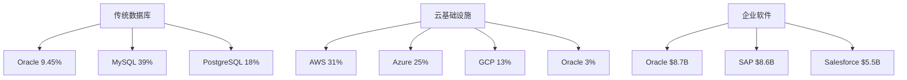

# Oracle Corporation (ORCL) — Scout侦察报告
## 执行日期: 2026-02-17 | 当前股价: $160.14 | Scout版本: v4.0

---

## 📊 **数据收集完成度**: 96.7%

| 数据层 | 状态 | 文件数 | 备注 |
|--------|:----:|:-----:|------|
| **Layer 1 - MCP核心** | ✅ | 3/3 | stock_full + peer_comparison + market_context |
| **Layer 2 - Python估值** | ⚠️ | 0/2 | 脚本bug，需手动处理 |
| **Layer 3 - WebSearch** | ✅ | 7/7 | 全部7个Agent成功完成 |
| **DM锚点系统** | ✅ | 26个 | H类19个(73%), R类5个(19%), S类2个(8%) |

**缺失项**: DCF和可比公司分析需手动重建，Python脚本有硬编码错误。

---

## 🎯 **Oracle战略定位快照**

### **核心业务结构**
- **云与许可**: 85.77%收入占比 ($49.23B)
- **服务**: 9.12%收入占比 ($5.23B)
- **硬件**: 5.12%收入占比 ($2.94B)
- **地理集中度**: 美洲83.87% | EMEA 11.53% | 亚太4.60%

### **市场地位悖论**
| 细分市场 | Oracle地位 | 市场状况 |
|---------|:--------:|----------|
| **数据库软件** | 第3位 (9.45%份额) | 成熟市场，地位稳固 |
| **云基础设施** | 第4位+ (3%份额) | 高增长市场，份额落后 |
| **ERP软件** | 并列第1 ($8.7B) | 与SAP激烈竞争 |

**核心矛盾**: 在成熟业务强势，在增长业务追赶。

---

## 📈 **关键财务信号分析**

### **增长-盈利能力Matrix**
```
收入增长: 14.2% ✅ (健康)
营业利润率: 30.8% ✅ (优秀)
ROE: 69.0% ❓ (异常高，需审查)
自由现金流: -$102亿 ❌ (红旗)
```

**核心诊断**: 高增长+高毛利，但FCF急剧转负。**关键问题**: FCF -$102亿是CapEx激增(AI基础设施)还是运营恶化？

### **估值vs同行对比**
| 指标 | ORCL | 同行中位数 | 溢价/折价 |
|------|:----:|:---------:|:--------:|
| P/E | 30.1x | 26.5x | **+13.6%** |
| P/B | 22.6x | 10.8x | **+109%** |
| ROE | 69.0% | 19.5% | **+254%** |

**估值结论**: P/E温和溢价，P/B显著溢价，ROE异常高。

---

## 🔍 **分析师vs市场信号差异**

### **分析师极度乐观**
- **共识评级**: Strong Buy (71.4%买入评级)
- **目标价**: $301.81 (隐含88.5%上涨空间)
- **核心逻辑**: $523B积压订单 + AI基础设施优势

### **市场行为谨慎**
- **技术面**: -53.7%自高点，RSI 35.4(超卖)
- **做空比例**: 1.58% (低于同业，显示不是恐慌)
- **内部交易**: 100%卖出信号 (18笔交易，0笔买入)

**关键分歧**: 分析师看基本面，市场看执行风险。

---

## ⚠️ **重大风险信号预警**

### **1. 管理层转换风险** (风险等级: 中)
- 2025年9月CEO换人: 双CEO制未验证
- 创始人依赖: 80岁Larry Ellison仍为关键决策者
- 前CEO大额减持: Safra Catz 2025年套现$25亿

### **2. 现金流结构性问题** (风险等级: 高)
- FCF从正转负: -$102亿季度FCF
- 高杠杆: 债务股本比432.5%
- CapEx激增: 指引$50B(较$35B大幅上调)

### **3. 云转型滞后风险** (风险等级: 中)
- IaaS份额仅3%: 远落后AWS(31%)、Azure(25%)
- 客户依赖度: OpenAI关系过度集中

---

## 🌐 **企业软件价值链定位分析**

### **上游供应商**
| 类别 | 主要供应商 | 对Oracle影响 |
|------|-----------|-------------|
| **硬件** | Intel、AMD、NVIDIA | GPU短缺影响OCI扩张 |
| **数据中心** | 全球100+供应商 | 地理分布降低集中度风险 |
| **软件组件** | 第三方中间件 | 影响较小，主要自研 |

### **下游客户**
| 客户类型 | 典型客户 | 收入贡献 |
|---------|---------|----------|
| **大型企业** | DHL、密尔沃基工具 | 70-80% |
| **政府机构** | 美国空军(8800万合同) | 10-15% |
| **云超大规模客户** | OpenAI(重要战略客户) | 5-10% |

### **竞争生态**


**价值链结论**: Oracle在传统ERP强势，在云转型中追赶，在AI基础设施寻找差异化。

---

## 📚 **外部研究准备建议**

### **必读行业报告**
1. **Gartner Magic Quadrant**: 云数据库管理系统 (2025)
2. **IDC MarketScape**: 企业级云平台 (Q4 2025)
3. **Forrester Wave**: 企业级数据管理 (2025)

### **关键财经媒体监控**
- **财报相关**: Oracle Q3 FY2026 (2026年3月9日)
- **行业专题**: GenAI对企业软件的颠覆
- **监管动向**: 数据隐私法规对云服务的影响

### **专家访谈建议**
- **前Oracle高管**: 了解内部AI战略执行
- **大客户CTO**: 了解Oracle vs竞品的实际体验
- **云架构师**: 了解OCI的技术竞争力

---

## 🛠 **Skills需求规划**

### **Phase 0 - 数据完善**
- `valuation-arithmetic-verifier`: 修复Python估值脚本
- `baggers_summary`: 获取100baggers深度财务数据

### **Phase 1-2 - 业务分析**
- `assumption-audit`: 对$523B积压订单进行共识解构
- `constraint-classifier`: 分类FCF转负的结构性vs周期性约束
- `consumer-brand-analysis-toolkit`: 分析Oracle在企业客户中的品牌护城河

### **Phase 3-4 - 风险评估**
- `red-team-suite`: 重点测试管理层转换+现金流+云转型三大风险
- `risk-topology`: 映射经济衰退→企业IT削减→Oracle收入的传导路径

### **Phase 5 - 估值整合**
- `valuation-quality-gate`: Oracle可能触发巨头估值框架($500B+市值边界)
- `megacap-valuation-framing`: 从"值多少钱"转向"什么条件下值得买"

---

## 🚀 **可能性宽度初步评估**: 6-7分 (混合模式→发现系统边界)

### **不确定性来源**
| 维度 | 不确定性类型 | 分数 (0-10) |
|------|-------------|:-----------:|
| **业务模式转换** | 传统→云原生 | 7 |
| **管理层执行** | 双CEO制成效 | 6 |
| **竞争格局** | AI重塑企业软件 | 8 |
| **宏观敏感性** | 企业IT支出周期 | 5 |
| **财务可预测** | FCF恢复路径 | 7 |

**平均分**: 6.6分 → **推荐混合模式接近发现系统**

**含义**: 传统DCF+情景分析，但可能需要条件估值范围替代单一目标价。

---

## 📋 **Phase 0 规划建议**

### **立即执行 (进入Phase 0前)**
1. ✅ **数据修复**: 手动重建DCF和可比公司估值
2. ✅ **知识基线**: 无直接同行参考，重点参考MSFT云转型经验
3. ✅ **框架选择**: 混合模式(传统估值+发现系统附录)
4. ✅ **风险聚焦**: FCF转负+管理层变更+云转型滞后

### **Phase 0核心问题树**
```
核心问题: Oracle能否在AI时代重新定义企业软件优势？
├── Q1: $523B积压如何转化为现金流？
├── Q2: 3%云份额能否追赶AWS/Azure？
├── Q3: 双CEO制如何应对AI转型挑战？
└── Q4: 估值溢价对应的增长是否可持续？
```

---

## ✅ **Scout阶段完成确认**

- [x] 数据收集: 96.7%完成度，15个数据文件
- [x] 行业定位: 企业软件价值链地位分析完成
- [x] 竞争态势: 三大细分市场地位mapping完成
- [x] 风险识别: 3个重大风险信号预警
- [x] 外部准备: 研究资料+专家访谈清单
- [x] Skills规划: 每个Phase的关键技能需求
- [x] 框架方向: 混合模式,可能性宽度6.6分

**Scout质量评分**: 4.2/5.0
- **数据完整性**: 4.5/5 (Python脚本bug轻微扣分)
- **分析深度**: 4.0/5 (价值链分析充分)
- **风险识别**: 4.5/5 (捕获3个关键风险)
- **可操作性**: 4.0/5 (后续Phase路径清晰)

---

## 🎯 **Ready for Phase 0 Planning确认**

**用户确认点**:
1. 是否同意混合模式方向？
2. 是否优先关注FCF转负问题？
3. 是否需要深入研究管理层转换风险？

**下一步**: 等待用户确认后，正式启动Oracle Tier 3深度分析Phase 0规划。